# 第九章：分析社交数据参与

社交网络和网站已经彻底改变了互联网。大多数在线人士都参与了一些社交网络，无论是 **Facebook**、**Twitter**、**Pinterest**、**GitHub**、**StackOverflow**，还是成千上万的社交网站之一。它们是人们连接和保持联系的重要方式，但它们也是关于人们关系和活动的主要数据来源。

分析这些数据有几个重要的原因。当然，广告商和营销人员希望从数据中提取尽可能多的信息。但如果你在运营社交网络，你将想要分析数据以找出哪些地方做得好，哪些地方做得不好。你不断地问自己，你能做些什么来更好地吸引用户，让你的社交网络对你的用户来说更加吸引人、有趣或有用。

在本章的整个过程中，我们将从 **StackExchange** ([`stackexchange.com`](http://stackexchange.com)) 网站获取公开数据。这包括 StackOverflow ([`stackoverflow.com/`](http://stackoverflow.com/)) 和许多其他问答网站。我们将以多种不同的方式分析这些数据，并试图了解人们在那些网站上如何互动和生成内容，以及什么因素使一个答案变得出色。

在本章中，我们将要涵盖以下主题：

+   理解我们可以进行的分析

+   获取数据

+   发现参与模式

+   比较提问者和回答者

+   发现随时间变化的参与模式

+   发现被点赞的答案

+   自动标记问题

# 设置项目

在我们开始之前，让我们设置一下项目。我使用 Leiningen 2 ([`leiningen.org/`](http://leiningen.org/)) 和 Stuart Sierra 的 reloaded 项目模板 ([`github.com/stuartsierra/reloaded`](https://github.com/stuartsierra/reloaded)) 来完成这项工作。通过运行以下代码，我将项目命名为 `social-so`：

```py
$ lein new reloaded social-so

```

当然，我们还需要更多的依赖项。以下是该章节的 `project.clj` 文件：

```py
(defproject social-so "0.1.0-SNAPSHOT"
  :dependencies [[org.clojure/clojure "1.5.1"]
                 [org.clojure/data.xml "0.0.7"]
                 [org.codehaus.jsr166-mirror/jsr166y "1.7.0"]
                 [org.clojure/data.json "0.2.4"]
                 [cc.mallet/mallet "2.0.7"]
                 [org.jsoup/jsoup "1.7.3"]]
  :profiles {:dev {:dependencies
                   [[org.clojure/tools.namespace "0.2.4"]]
                   :source-paths ["dev"]}}
  :jvm-opts ["-Xmx2048m"])
```

这里的一些亮点是，我们将使用 `org.clojure/data.xml` 来读取 XML 文件，`org.clojure/data.json` 来读取 JSON，以及 `org.jsoup/jsoup` 来清理 HTML。如果你仍在使用 Java 6，你需要 `jsr166y` 来提供与 reducers 库的并发性。我们还将使用 `cc.mallet/mallet` 来处理一些朴素贝叶斯分类。

## 理解分析

现在我们已经解决了基础设施问题，让我们退后一步，思考我们有什么样的数据以及我们可以用它做什么。

## 理解社交网络数据

社交网络大致分为两大类：

1.  也有一些以网络为导向的社会网络。这些包括 Facebook（[`facebook.com`](http://facebook.com)）、LinkedIn（[`linkedin.com`](http://linkedin.com)）、Twitter（[`twitter.com/`](http://twitter.com/)）或新浪微博（[`weibo.com`](http://weibo.com)）。这些网络专注于让人们相互连接，建立关系，并发布关于自己的更新。

1.  存在一些以知识分享为导向的社会网络。这些包括 StackExchange（[`stackexchange.com`](http://stackexchange.com)）家族的社会网络，包括 StackOverflow（[`stackoverflow.com`](http://stackoverflow.com)）或 Quora（[`www.quora.com/`](https://www.quora.com/)）。这些网络专注于让人们交换信息和知识。通常，它们比网络论坛或维基更注重结构和问题与答案。

显然，这些网络能够实现完全不同类型的互动，具有不同的功能和产生不同类型的数据。适合进行不同类型的分析。

## 理解基于知识的社会网络

在基于知识的社会网络中，人们聚集在一起分享信息。通常，这些是问答论坛，如 StackExchange 网站网络，但也包括 Quora（[`www.quora.com/`](https://www.quora.com/)）、Yahoo Answers（[`answers.yahoo.com/`](http://answers.yahoo.com/)）等等。

通常，在这个类型的社会网络中，一些用户会提问。其他人会回答这些问题。通常，会有某种形式的站内经济，无论是以徽章、积分或某种组合的形式。这鼓励人们保持问题和答案的相关性，回答问题，并设定和维护社区的风格。有时，有管理员，有时社区是自我管理的，有时两者兼而有之。

观察 StackOverflow 的前页，我们可以看到社交网络的基本元素。看看下面的截图：


上一张截图展示了一个非常有趣的布局。你可以很容易地注意到以下两点：

+   在页面的右上角有一个标记为“提问”的按钮，用于发布问题。这个按钮可能没有你想象的那么大，因为提问的人可能是有动机找到这个按钮并愿意点击进入另一个页面来提问的。这与 Facebook 或 Twitter 等网站上发现的发布框不同，这些网站试图减少发布新状态时的摩擦，以鼓励人们这样做。

+   也有一个最近发布的问答列表。这个列表可以根据你感兴趣的标签进行筛选。例如，你可以用它来找到你能够回答的问题，或者你感兴趣学习的问题。

因此，我们可以立即看出，该网站的主要交互功能都可以从首页访问。此外，网站的设计使得进行更复杂的交互（如回答问题）变得更加容易。

我们已经可以猜测，大多数用户将只加入来发布一到两个问题，然后永远不会再次参与网站。这个群体可能相当大。这些用户是谁以及如何激励他们回答问题可能是 StackExchange 面临的一个关键问题。

在回答问题的用户中也可能存在类似的动态。可能只有少数用户回答了大部分问题。StackExchange 可能对如何从所有用户那里获得更均匀的贡献感兴趣，而不仅仅是来自少数**高级用户**。

## 介绍 80/20 法则

实际上，这两个观察结果都是社交网络一般原则的例子。这被称为**80/20**法则。这简单地说，大约 80%的内容将由 20%的用户创建。它也被称为**帕累托法则**，更普遍地指出 80%的效果来自 20%的原因。尽管在不同的社交网络中，细节可能有所不同——例如，15%的用户可能创造了 95%的内容——但总体上，这个观察结果是惊人的稳健。在本章中，我们将探讨 80/20 法则如何应用于 StackOverflow 数据。

考虑到这一点，让我们获取数据，以便我们可以开始查看它。

### 获取数据

在本章中，我们将专注于基于知识的社交网络，特别是我们将与 StackExchange 网站合作。一段时间以来，StackExchange 已经公开了其网站的定期数据存档（[`blog.stackexchange.com/category/cc-wiki-dump/`](http://blog.stackexchange.com/category/cc-wiki-dump/))。这将提供一个极好的测试平台，用于处理社交网络网站的数据。

数据存档通过**互联网档案馆**([`archive.org/`](https://archive.org/))提供。该网页目前位于[`archive.org/details/stackexchange`](https://archive.org/details/stackexchange)。您可以使用**BitTorrent**客户端（[`www.bittorrent.com/`](http://www.bittorrent.com/)）如**μTorrent**([`www.utorrent.com/`](http://www.utorrent.com/))下载整个存档。然而，我们只对 StackOverflow 的帖子及评论感兴趣，所以如果您愿意，您只需下载这两个存档。当然，合并后大约有 6GB，所以使用种子可能更合适。

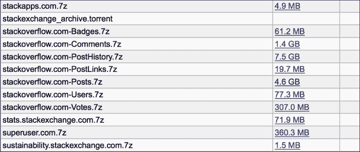

存档文件使用 7z 格式压缩。Windows 用户可以从 **7-zip** 网站获取一个用于提取的工具（[`www.7-zip.org/`](http://www.7-zip.org/)）。该网站的下载页面还链接到一些非官方的二进制文件，适用于 Mac OS X 和 Linux（[`www.7-zip.org/download.html`](http://www.7-zip.org/download.html)）。这两个平台也都有命令行二进制文件可用。例如，**Homebrew** ([`brew.sh/`](http://brew.sh/)) 有一个名为 **p7zip** 的配方。

使用以下代码将这些数据提取到您的项目目录中，到名为 `data` 的子目录中：

```py
cd data
7z x ~/torrents/stackexchange/stackoverflow.com-Posts.7z
```

现在我们已经准备好开始深入挖掘数据，看看它对我们有什么惊喜。

### 查看数据量

首先，我们需要看看会有多少数据。这部分数据的原始存档大约有 6 GB。不算小，但也不是以皮为单位。 

因此，压缩文件接近 5 GB，展开的文件是 23 GB！我们有很多数据要查看。

#### 查看数据格式

所有文件都是 XML 格式。标记为 `Posts` 的文件包含问题和答案。

数据的格式相当简单（但完整描述请见 `README.txt` 文件）。以下是最初的条目：

```py
<row Id="4"
     PostTypeId="1"
     AcceptedAnswerId="7"
     CreationDate="2008-07-31T21:42:52.667"
     Score="251"
     ViewCount="15207"
     Body="&lt;p&gt;I want to use a track-bar to change a form's opacity.&lt;/p&gt;

&lt;p&gt;This is my code:&lt;/p&gt;

&lt;pre&gt;&lt;code&gt;decimal trans = trackBar1.Value / 5000;
this.Opacity = trans;
&lt;/code&gt;&lt;/pre&gt;

&lt;p&gt;When I try to build it, I get this error:&lt;/p&gt;

&lt;blockquote&gt;
  &lt;p&gt;Cannot implicitly convert type 'decimal' to 'double'.&lt;/p&gt;
&lt;/blockquote&gt;

&lt;p&gt;I tried making &lt;strong&gt;trans&lt;/strong&gt; to &lt;strong&gt;double&lt;/strong&gt;, but then the control doesn't work.This code has worked fine for me in VB.NET in the past. &lt;/p&gt;
"
     OwnerUserId="8"
     LastEditorUserId="2648239"
     LastEditorDisplayName="Rich B"
     LastEditDate="2014-01-03T02:42:54.963"
     LastActivityDate="2014-01-03T02:42:54.963"
     Title="When setting a form's opacity should I use a decimal or double?"
     Tags="&lt;c#&gt;&lt;winforms&gt;&lt;forms&gt;&lt;type-conversion&gt;&lt;opacity&gt;"
     AnswerCount="13"
     CommentCount="25"
     FavoriteCount="23"
     CommunityOwnedDate="2012-10-31T16:42:47.213" />
```

如我们从 `README.txt` 中所见，这篇帖子代表一个问题（`PostTypeId` 字段为 `1`）。我们可以看到其正文、其标签和其接受答案，以及关于这个帖子的许多元数据。这应该给我们提供很多信息。

如果我们查看第三条记录，我们将看到这个帖子的一个接受答案，如下所示：

```py
<row Id="7"
     PostTypeId="2"
     ParentId="4"
     CreationDate="2008-07-31T22:17:57.883"
     Score="193"
     Body="&lt;p&gt;An explicit cast to double isn't necessary.&lt;/p&gt;

&lt;pre&gt;&lt;code&gt;double trans = (double)trackBar1.Value / 5000.0;
&lt;/code&gt;&lt;/pre&gt;

&lt;p&gt;Identifying the constant as &lt;code&gt;5000.0&lt;/code&gt; (or as &lt;code&gt;5000d&lt;/code&gt;) is sufficient:&lt;/p&gt;

&lt;pre&gt;&lt;code&gt;double trans = trackBar1.Value / 5000.0;
double trans = trackBar1.Value / 5000d;
&lt;/code&gt;&lt;/pre&gt;
"
     OwnerUserId="9"
     LastEditorUserId="967315"
     LastEditDate="2012-10-14T11:50:16.703"
     LastActivityDate="2012-10-14T11:50:16.703"
     CommentCount="0" />
```

因此，对于答案（`PostTypeId` 字段为 2），我们可以获取它们的父级、正文文本和评分。它们的父级指示哪个子级被接受。这应该足以帮助我们分析它们的内容。

在这两种情况下，我们也有 `OwnerUserId`，这将帮助我们了解人们如何与网站以及彼此互动。

文本字段属性允许丰富的内容（`Body` 和 `Title`），这些内容通过将 HTML 编码到字段中来进行处理。我们需要转义这些内容，并可能清除标签。这不会是问题，但我们必须要记住。

### 定义和加载数据

我们可以追踪出本章中需要使用的一些数据。我们可以将这些放入 `src/social_so/data.clj` 文件中。

我们将使用两种记录类型。`CountRank` 类型将保存原始计数及其在频率列表中的排名，而 `UserInfo` 类型将存储用户及其所发布不同类型帖子的频率和排名。看看下面的代码：

```py
(defrecord CountRank [count rank])
(defrecord UserInfo [user post q a])
```

`post`、`q` 和 `a` 字段将跟踪所有帖子、问题帖子和回答帖子的频率和排名。

这些记录结构一起应该帮助我们开始理解这些数据以及一些参与模式。

对于加载数据，让我们移动到一个新文件，命名为`src/social_so/xml.clj`，并给它以下命名空间声明：

```py
(ns social-so.xml
  (:require [clojure.data.xml :as xml]
            [clojure.java.io :as io]
            [clojure.string :as str]
            [social-so.data :as d]
            [social-so.utils :as u])
  (:import [org.jsoup Jsoup]
           [org.jsoup.safety Whitelist]))
```

我们将使用此命名空间中的函数来读取 XML 文件并构建包含数据的记录。

在最基本层面上，我们需要能够从 XML 文件中读取帖子元素。看看下面的代码：

```py
(defn read-posts [stream] (:content (xml/parse stream)))
```

我们还需要访问每个元素的一些数据。以下是一些用于用户标识符和帖子类型代码的 getter 函数：

```py
(defn get-user [el]
  (let [{:keys [attrs]} el]
    (or (u/->long (:OwnerUserId attrs))
        (u/to-lower (:OwnerDisplayName attrs)))))
(defn get-post-type [el]
  (u/->long (:PostTypeId (:attrs el))))
```

在这个片段中，`el`代表正在处理的 XML 元素，我们使用一个自定义函数将字符串转换为小写（`social-so.utils`/`to-lower`）来稍微防御性地处理传递的`null`值。

加载数据将从两个阶段进行。首先，我们将获取原始频率，然后我们将以几种不同的方式对数据进行排序并分配排名。

### 计算频率

我们将计数频率的方式是遍历 XML 文件中的帖子。我们将维护一个包含用户及其`UserInfo`记录的索引。当每个用户首次被发现时，他们将获得一个新的`UserInfo`对象。随后，他们的`UserInfo`记录将使用新的计数进行更新。

让我们看看这在实践中是如何工作的。

第一个函数`update-user-info`在单个记录级别上操作。它接受一个`UserInfo`记录并根据当前正在处理的帖子类型更新它。如果记录为 nil，则创建一个新的记录：

```py
(defn update-user-info [user-id post-el user-info]
  (let [incrs {:question [1 0], :answer [0 1]}
        [q-inc a-inc] (incrs (get-post-type post-el))]
    (cond
      (nil? q-inc) user-info
      (nil? user-info) (d/->UserInfo user-id 1 q-inc a-inc)
      :else
      (assoc user-info
             :post (inc (:post user-info))
             :q (+ (:q user-info) q-inc)
             :a (+ (:a user-info) a-inc)))))
```

下一个函数在`user-id`到`UserInfo`记录的索引级别上操作。它接受一个 XML 帖子，并从中获取用户信息。它尝试从索引中检索该用户的`UserInfo`记录，并使用`update-user-info`在该记录中增加计数。看看下面的代码：

```py
(defn update-user-index [user-index post-el]
  (let [user (get-user post-el)]
    (->> user
      (get user-index)
      (update-user-info user post-el)
      (assoc user-index user))))
```

最后，`load-user-infos`函数打开 XML 文件，读取帖子，并为每个用户计算帖子的原始频率。最后，它使用`doall`强制输出结果，因为我们正在`with-open`块内部工作，所以我们希望在关闭文件之前完全实现结果。看看下面的代码：

```py
(defn load-user-infos [filename]
  (with-open [s (io/input-stream filename)]
    (->> s
      read-posts
      (reduce update-user-index {})
      vals
      (remove nil?)
      doall)))
```

现在我们准备遍历这些记录，多次分配基于各种计数的排名。

### 排序和排名

目前，我们正在将原始频率存储在`UserInfo`记录的字段下。然而，我们希望将频率移动到`CountRank`记录中，并将其与排名一起存储。我们将通过以下步骤实现这一点：

1.  我们将使用`rank-on`函数来找到排名。这个函数根据`UserInfo`记录的一个属性（`:post`、`:q`或`:a`）进行排序，然后通过将两者都包含在一个向量对中来将每个实例与一个排名关联。看看下面的代码：

    ```py
    (defn rank-on [user-property coll]
      (->> coll
        (sort-by user-property)
        reverse
        (map vector (range))))
    ```

1.  函数`update-rank`将然后从`rank-on`中获取排名和用户对，并将其与适当的属性关联，如下所示：

    ```py
    (defn update-rank [user-property rank-info]
      (let [[rank user-info] rank-info]
        (assoc user-info user-property
               (d/->CountRank (get user-info user-property) 
                              rank))))
    ```

1.  下一个函数 `add-rank-data` 通过在所有用户上调用这些函数来协调此过程。控制此过程的函数 `add-all-ranks` 则按如下方式对每个用户执行此操作：

    ```py
    (defn add-rank-data [user-property users]
      (map #(update-rank user-property %)
           (rank-on user-property users)))
    (defn add-all-ranks [users]
      (->> users
        (add-rank-data :post)
        (add-rank-data :q)
        (add-rank-data :a)))
    ```

1.  我们可以将读取 XML 文件和计数帖子与排序和排名用户结合起来。看看以下代码：

    ```py
    (defn load-xml [filename]
      (add-all-ranks (load-user-infos filename)))
    ```

所有这些函数都使得加载 XML 文件和分配排名变得简单。看看以下代码：

```py
user=> (def users (x/load-xml
 "data/stackoverflow.com-Posts"))
user=> (count users)
1594450
user=> (first users)
{:user 22656,
 :post {:count 28166, :rank 0},
 :q {:count 29, :rank 37889},
 :a {:count 28137, :rank 0}}

```

现在我们有了进行第一轮分析所需的信息。

### 寻找参与模式

现在我们已经加载了一些数据，让我们卷起袖子看看我们能从中学习到什么。

在此之前，我们最好有一种方法来生成报告，说明哪种帖子类型最活跃的用户是谁。看看以下代码：

```py
(defn print-top-rank [col-name key-fn n users]
  (let [fmt "%4s   %6s   %14s\n"
        sort-fn #(:rank (key-fn %))]
    (printf fmt "Rank" "User" col-name)
    (printf fmt "----" "------" "--------------")
    (doseq [user (take n (sort-by sort-fn users))]
      (let [freq (key-fn user)]
        (printf fmt (:rank freq) (:user user) (:count freq))))))
```

这使我们能够创建列出每种帖子类型前 10 名（或如此）用户的表格。

| 排名 | 用户 | 所有帖子 |
| --- | --- | --- |
| 0 | 22656 | 28166 |
| 1 | 29407 | 20342 |
| 2 | 157882 | 15444 |
| 3 | 17034 | 13287 |
| 4 | 34397 | 13209 |
| 5 | 23354 | 12312 |
| 6 | 115145 | 11806 |
| 7 | 20862 | 10455 |
| 8 | 57695 | 9730 |
| 9 | 19068 | 9560 |

根据这个表格，我们可以看到一些用户非常活跃。最活跃的用户比第二活跃的用户多出近 8,000 个帖子，而第二活跃的用户仍然非常活跃。

下面的图表显示了前 1,000 名用户的帖子数量，展示了活动下降的速度以及顶级用户在对话中的主导地位：

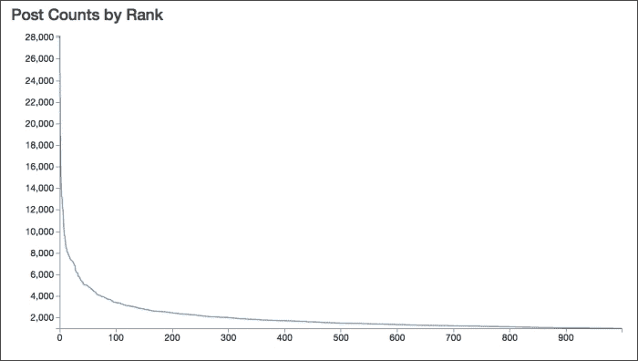

然而，我们可以进一步细分。我预计提问的人的行为会与回答问题的人不同。

## 匹配 80/20 规则

之前，我们讨论了 80/20 规则：80%的内容是由 20%的用户创造的。这显然是一个粗略的估计，但它确实为这些网络的动态提供了一个很好的直觉。

为了找到分解，我们需要执行以下步骤：

1.  按我们感兴趣的计数降序排列用户。

1.  将它们分成**五分位数**，即五个大小相等的桶。

1.  对每个桶的计数进行求和。

为了实现这一点，我们可以使用一个名为 `quantile-on` 的函数，该函数对集合进行排序并将其分成桶。看看以下代码：

```py
(defn quantile-on [n key-fn coll]
  (let [len (count coll)
        part-size (+ (quot len n)
                     (if (zero? (mod len n)) 0 1))]
    (partition-all part-size (sort-by key-fn coll))))
```

现在我们只需要提取适当的字段并求和它们的值，如下所示：

```py
(defn sum-count
  ([key-fn] (partial sum-count key-fn))
  ([key-fn coll]
   (->> coll
     (map #(:count (key-fn %)))
     (remove nil?)
     (reduce + 0))))We can use these functions to find the percentage of users in each quintile:
user=> (def p-counts
            (map (d/sum-count :post)
                 (d/quantile-on 5 #(:rank (:post %)) users)))
user=> p-counts
(15587701 1282402 507654 318890 318828)
user=> (def total (reduce + 0 p-counts))
user=> (map #(float (/ % total)) p-counts)
(0.8652395 0.07118336 0.028178774 0.017700894 0.017697452)
```

因此，前 20%的用户实际上产生了超过 85%的内容。五分位数从那里迅速下降。

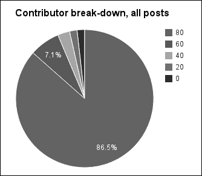

我们可以将这些数据拉入图表，以便更容易地看到贡献者的分布。

## 寻找 20%的提问者

在寻找提问者时，我们还可以看到谁在提问方面最活跃。

| 排名 | 用户 | 问题帖子 |
| --- | --- | --- |
| 0 | 39677 | 1858 |
| 1 | 4653 | 1605 |
| 2 | 34537 | 1604 |
| 3 | 179736 | 1327 |
| 4 | 117700 | 1327 |
| 5 | 149080 | 1261 |
| 6 | 84201 | 1177 |
| 7 | 434051 | 1107 |
| 8 | 325418 | 1074 |
| 9 | 146780 | 1055 |

当我们运行这个程序时，它给出了一组非常不同的频率。这些频率比所有帖子的频率低一个数量级以上。

我们也可以得到提问者分布的数字。

如果我们再次使用 `quantile-on` 和 `sum-count`，我们还可以看到按五分位数分解的情况。看看下面的代码：

```py
user=> (def q-counts (map (d/sum-count :q)
 (d/quantile-on 5 #(:rank (:q %)) users)))
user=> (def total (reduce + 0 q-counts))
user=> q-counts
(5182709 711037 318890 262051 0)
user=> (map #(float (/ % total)) q-counts)
(0.80045706 0.109817974 0.049251802 0.040473152 0.0)

```

以下是这个群体的图表：

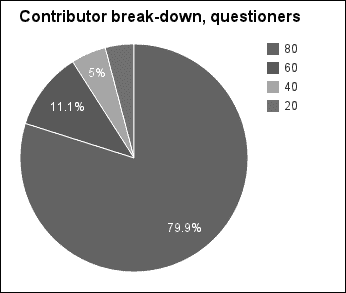

有趣。所以最低的五分位数没有做出任何贡献。大概这些是回答问题的用户。我们稍后会更详细地看看这个群体。但总体来说，提问者的分布遵循我们预期的 80/20 法则。

## 寻找 20%的受访者

因为大多数帖子都是回答，我们可以预期这些频率将更接近总频率。我们将以寻找提问者频率的相同方式找到这些频率。

看看下面的表格：

| 排名 | 用户 | 回答帖子 |
| --- | --- | --- |
| 0 | 22656 | 28137 |
| 1 | 29407 | 20310 |
| 2 | 157882 | 15431 |
| 3 | 17034 | 13285 |
| 4 | 34397 | 13157 |
| 5 | 23354 | 12270 |
| 6 | 115145 | 11784 |
| 7 | 20862 | 10447 |
| 8 | 57695 | 9711 |
| 9 | 19068 | 9557 |

我们可以看到这组数字和第一组有很多相似之处。实际上，这组发帖者的分布和最后一组也有很多相似之处，如下面的截图所示：

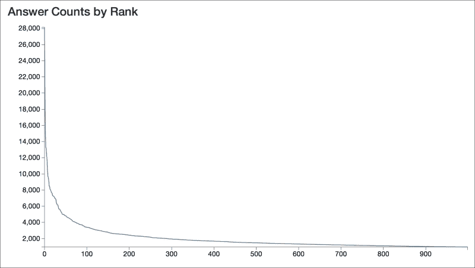

然而，从整体分布来看，我们可以看到回答问题的人比提问者更加不平衡。

让我们尝试分解回答问题的贡献者：

```py
user=> (def a-counts (map (d/sum-count :a)
 (d/quantile-on 5 #(:rank (:a %)) users)))
user=> (def total (reduce + 0 a-counts))
user=> a-counts
(10950972 413668 176148 0 0)
user=> (map #(float (/ % total)) a-counts)
(0.9488929 0.035844 0.015263082 0.0 0.0)

```

以下是对应数据的图表：

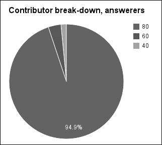

所以，几乎一半的用户从未发过回答！然而，前 20%的用户发布了 95%的回答。所以回答问题似乎被少数用户主导，而提问则（略微）更普遍。

## 结合排名

如果我们比较排名，我们可以看到更多的相似之处。这张表显示了任何类别中前 10 名用户每个帖子类别的排名。（注意，排名从 0 开始，而不是 1。）

| 用户 ID | 所有帖子排名 | 问题帖子排名 | 回答帖子排名 |
| --- | --- | --- | --- |
| 4653 | 423 | 1 | 21342 |
| 17034 | 3 | 602037 | 3 |
| 19068 | 9 | 420772 | 9 |
| 20862 | 7 | 169469 | 7 |
| 22656 | 0 | 37889 | 0 |
| 23354 | 5 | 22760 | 5 |
| 29407 | 1 | 33177 | 1 |
| 34397 | 4 | 16478 | 4 |
| 34537 | 358 | 2 | 8024 |
| 39677 | 345 | 0 | 151684 |
| 57695 | 8 | 65071 | 8 |
| 84201 | 631 | 6 | 10521 |
| 115145 | 6 | 54339 | 6 |
| 117700 | 595 | 4 | 29654 |
| 146780 | 923 | 9 | 123737 |
| 149080 | 682 | 5 | 56862 |
| 157882 | 2 | 101282 | 2 |
| 179736 | 605 | 3 | 36463 |
| 325418 | 523 | 8 | 3502 |
| 434051 | 858 | 7 | 164416 |

表格中的数据使某些观点变得清晰：

+   顶级提问者与顶级回答者是非常不同的一群人。顶级提问者作为回答者排名第 141,674 位，而顶级回答者作为提问者排名第 37,887 位。

+   一旦我们超越了顶级发布者，这两个子组与所有帖子类型的总和都没有很好地相关。所有这些用户在所有类型的帖子中排名都在前 1000 名之内。这仅仅表明提问者并不完全主导提问者。

这些观察结果证实了我们通过查看五分位数和图表所发现的情况。这两个群体彼此之间以及与两个群体的总和都看起来非常不同。

让我们把群体分解为只提问的人、只回答问题的人和两者都做的人。这应该能让我们对参与类型有更深入的了解。

### 看看只提问的人

我们可以很容易地找到只发布答案的用户，然后对这一子集进行之前的分析也不困难。让我们看看这将如何运作。看看下面的代码：

```py
user=> (def qs (filter #(zero? (:count (:a %))) users))
user=> (def q-counts
 (map (d/sum-count :q)
 (d/quantile-on 5 #(:rank (:q %)) qs)))
user=> (def total (reduce + 0 q-counts))
user=> (count qs)
780460
user=> q-counts
(969148 272085 156092 156092 156092)
user=> (map #(float (/ % total)) q-counts)
(0.566916 0.15915973 0.09130809 0.09130809 0.09130809)

```

因此，我们首先筛选出只发布答案的用户。这使我们剩下总用户数量的 49%，所以这实际上是一个极其庞大的 StackOverflow 用户群体。

然而，有趣的部分是他们的分布更加均匀。最活跃的五分位数发布的问题不到三分之二。以下图表清楚地说明了这一点：

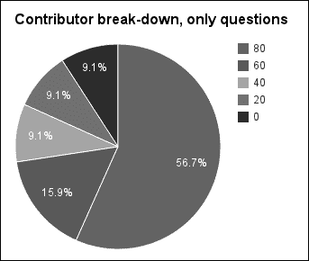

这些比率与我们迄今为止看到的非常不同。这个群体受少数用户的影响较小。但当你这么想的时候，这很有道理。许多来到 StackOverflow 的人只提问一个问题，这就是他们互动的极限。事实上，底部三个五分位数只提问了一个问题，没有回答。这几乎占总用户数量的 33%。

让我们看看这与只发布答案的人相比如何。

### 看看只发布答案的人

获取只发布答案的用户的过程几乎与我们刚才进行的过程完全一样。然而，这次我们将交换问题和答案，当然。看看下面的代码：

```py
user=> (def as (filter #(zero? (:count (:q %))) users))
user=> (def a-counts (map (d/sum-count :a)
 (d/quantile-on 5 #(:rank (:a %)) as)))
user=> (def total (reduce + 0 a-counts))
user=> (count as)
375667
user=> (float (/ (count as) (count users)))
0.23561831
user=> a-counts
(1413820 116198 75134 75134 75131)
user=> (map #(float (/ % total)) a-counts)
(0.80540407 0.06619396 0.042801227 0.042801227 0.042799518)

```

这次，我们处理的是一个大约是只提问的人数量一半的群体，大约是整个用户群体四分之一。顶级五分位数的分布与我们根据 80/20 规则预期的非常接近。

再次注意，最后几个五分位数似乎有只发布了一个答案的用户。实际上，大约 16%的总用户数量没有提问，只发布了一个答案。这似乎是最有趣的一组，试图从他们那里获得更多互动将是优先事项（我相信这已经对 StackExchange 来说是如此）。

这个图表，在接下来的段落中展示，位于最后一个图表（只提问的人）和前几个图表之间。第一个五分位数大约是 80%，但其余部分并没有像有时那样急剧减少。

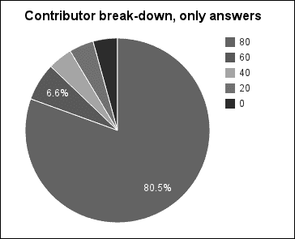

现在，让我们看看其他用户的细分情况，那些既提问又回答的用户。

### 查看既提问又回答的人

选择那些既提问又回答的用户所需的谓词将与我们之前看到的两个部分略有不同。然而，一旦我们有了这些用户，分析将是一样的。唯一的麻烦是我们将得到问题和答案的分布。

我们将通过一个稍微复杂一些的谓词来获取既提问又回答的用户，我们将分页来移除。看看下面的代码：

```py
user=> (def both (remove #(or (zero? (:count (:q %)))
 (zero? (:count (:a %))))
 users))
user=> (count both)
438261

```

现在，我们还需要计算问题和答案的值。首先，让我们看看问题是什么样的：

```py
user=> (def bq-counts
 (map (d/sum-count :q)
 (d/quantile-on 5 #(:rank (:q %)) both)))
user=> (def total (reduce + 0 bq-counts))
user=> bq-counts
(3450712 730467 335892 160458 87649)
user=> (map #(float (/ % total)) bq-counts)
(0.72415173 0.1532927 0.07048887 0.033673033 0.018393647)

```

下面的图表清楚地表明，这里的比率更像是我们所期望的分布：

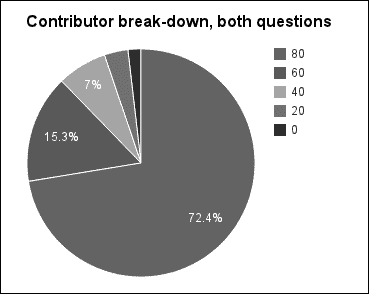

从这个群体中查看答案的数字，我们似乎又遵循了一个非常粗略的 80/20 规则。看看下面的代码：

```py
user=> (def ba-counts
 (map (d/sum-count :a)
 (d/quantile-on 5 #(:rank (:a %)) both)))
user=> (def total (reduce + 0 ba-counts))
user=> ba-counts
(8564601 740590 270367 122164 87649)
user=> (map #(float (/ % total)) ba-counts)
(0.8752454 0.075683385 0.027629714 0.01248435 0.008957147)

```

下面的图表是这些数据：

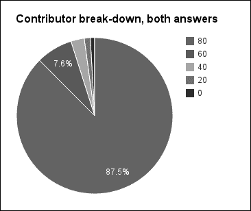

因此，那些既提问又回答的用户群体似乎更加平衡，并且与网站的互动更加典型。

另一种看待这些数据的方式是查看每个用户通过提问和回答的数量。这为我们提供了每个类型活动中用户活跃度的指示。看看下面的图表：

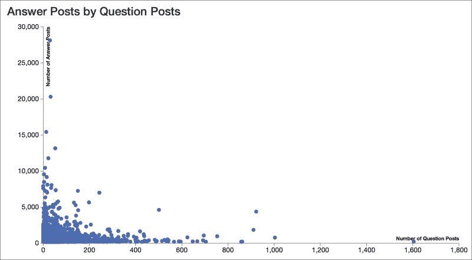

这个图表清楚地表明，通常用户会参与一种活动或另一种活动，并且交叉重叠的并不多，正如你可能期望的那样。此外，坐标轴的比例有点误导：*y*轴是*x*轴的 16 倍以上。

现在我们对用户与 StackOverflow 的互动方式以及他们生成内容的方式有了更好的理解，让我们看看这些内容，看看我们能否找出什么是一个好的答案，什么不是。

## 寻找被点赞的答案

回答可以通过几种不同的方式来评分。社区可以对答案进行投票，支持或反对，而原始发帖者可以接受答案。为了演示的目的，我们将查看接受的答案；然而，这两个指标可能都很有用且值得探索。

我们将看看我们如何自动识别将被接受的答案。

一方面，这将会非常有用。如果原始发帖者忘记接受答案，网站可以提示他们可能的解决方案。此外，当有人发帖应该被考虑时，网站可以向发帖者发送电子邮件。

但另一方面，可接受的答案可能并不共享任何算法可以抓取的共同语言特征来识别潜在的解决方案。我怀疑我们能否训练出一个算法来识别可接受的答案。

尽管如此，让我们尝试看看我们实际上能做得有多好。

## 处理答案

目前已有超过 1800 万篇帖子。我们最终可以处理完整的数据集，但为了开始，我们先抽取一部分数据样本。为了简化操作，我已经上传了一个包含 10 万个答案的随机样本，可以在[`www.ericrochester.com/mastering-clj-data/data/post-sample-100000.json.gz`](http://www.ericrochester.com/mastering-clj-data/data/post-sample-100000.json.gz)找到。这些数据已经被转换成了我们将要使用的结构。

您可以使用`curl`下载这些数据，并用`gzip`解压缩，如下所示：

```py
$ curl -O http://www.ericrochester.com/mastering-clj-data/data/post-sample-100000.json.gz
$ gunzip post-sample-100000.json.gz
```

我们将这段代码放入`src/social_so/post.clj`文件中，并在顶部添加以下命名空间声明：

```py
(ns social-so.post
  (:require [clojure.java.io :as io]
            [clojure.data.json :as json]
            [social-so.data :as d]
            [social-so.utils :as u]
            [social-so.xml :as x]))
```

为了表示我们将要处理的数据，我们将使用`PostInfo`记录类型。看看以下代码：

```py
(defrecord PostInfo
  [id post-type body-text score accepted-for])
```

这里有趣的是`body-text`字段，它包含去除 HTML 的答案文本，以及`accepted-for`字段，如果帖子没有被接受，则为 nil，如果帖子被接受，则包含问题的 ID。

这是一个扁平的数据记录，因此很容易将这些 JSON 数据加载到这些结构中。看看以下代码：

```py
(defn load-post-infos [filename]
  (with-open [r (io/reader filename)]
    (doall
      (->> (json/read r :key-fn keyword)
        (map map->PostInfo)
        (map #(assoc % :post-type (keyword (:post-type %))))))))
```

现在我们可以假设已经将这个命名空间别名为`p`，在 REPL 上读取数据。看看以下代码：

```py
user=> (def s (p/load-post-infos "post-sample-100000.json"))
user=> (count s)
100000
user=> (count (filter :accepted-for s))
21250
user=> (count (remove :accepted-for s))
78750
user=> (pprint (first s))
{:id 1146880,
 :post-type :a,
 :body-text
 "But while processing i cancelled the transaction.  WP - Basically, if it was a transaction, and you canceled it before it finished, then whatever had started would have been undone. What your database looks like now should be the same as it looked before the UPDATE.",
 :score 0,
 :accepted-for nil}

```

简单地查看这些数据，我们可以看到样本中超过 20%的帖子是被接受的。

### 预测被接受的答案

现在数据已经以可用的形式存在，让我们将注意力转向对帖子进行分类。为此，我们将使用**MALLET** ([`mallet.cs.umass.edu/`](http://mallet.cs.umass.edu/))。我们在第三章中见过 MALLET，*主题建模——在国情咨文中变化的关注点*，关于主题建模。这通常是这个库被使用的任务。然而，它还提供了一系列分类算法的实现，我们现在将使用其中之一。

在本章的整个过程中，我们将把帖子分类为 MALLET 所说的`instances`。这将根据每个实例的特征或线索将它们分成类别。我们将使用 MALLET 对每个帖子进行处理，创建一个实例，识别其特征和类别，并最终使用这些信息来训练一个分类器。我们可以在之后用这个分类器对新帖子进行分类。

## 设置

我们将为这段代码使用一个新的命名空间。打开文件`src/social_so/nlp.clj`，并将以下命名空间声明添加到文件顶部：

```py
(ns social-so.nlp
  (:import [cc.mallet.types Instance InstanceList]
           [cc.mallet.pipe
            Input2CharSequence TokenSequenceLowercase
            CharSequence2TokenSequence SerialPipes
            Target2Label FeatureSequence2FeatureVector
            TokenSequenceRemoveStopwords
            TokenSequence2FeatureSequence]
           [cc.mallet.pipe.iterator ArrayDataAndTargetIterator]
           [cc.mallet.classify NaiveBayes NaiveBayesTrainer Trial]
           [cc.mallet.classify.evaluate ConfusionMatrix]))
```

导入的模块很多。但实际上，这将是这段代码最复杂的地方。MALLET 为我们做了很多繁重的工作。

在接下来的代码中，我们将使用`n`前缀在 REPL 中引用它。为了使其可用，请在您的 REPL 环境中执行以下行（在**user=>**提示符之后）：

```py
user=> (require '[social-so.nlp :as n])

```

现在我们已经准备好开始填补空白。

### 创建 InstanceList 对象

MALLET 将每个输入表示为一个`Instance`对象。`Instance`对象包含其数据、目标标签、名称和其他元数据。

MALLET 以`InstanceList`的形式处理`Instance`对象的集合，它只是`Instance`对象的一个集合。列表中的所有实例都使用相同的转换管道进行处理。

管道中的每一步都会改变列表中每个`Instance`对象的一个属性。例如，一个管道（`CharSequence2TokenSequence`）对输入进行分词，另一个管道（`Target2Label`）创建目标标签的索引。

下面的图示说明了这个过程：

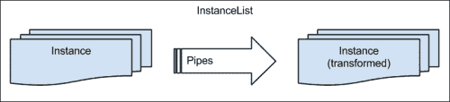

对于文档中的特征及其标签，`InstanceList`还维护**字母表**。这些是从输入字符串到整数的索引。整数用于区分输入，并在数组中充当索引。这使得 MALLET 能够以数组的形式处理频率，从而节省空间和处理时间。诀窍是所有正在处理的`Instance`对象都必须共享相同的字母表。`InstanceList`确保它们确实如此。

为了使我们的处理过程清晰，我们将它们全部定义在一个名为`make-pipe`的函数中。以下就是这个函数：

```py
(defn make-pipe []
  (SerialPipes.
    [(Target2Label.)
     (Input2CharSequence. "UTF-8")
     (CharSequence2TokenSequence.
       #"\p{L}[\p{L}\p{P}]+\p{L}")
     (TokenSequenceLowercase.)
     (TokenSequenceRemoveStopwords. false false)
     (TokenSequence2FeatureSequence.)
     (FeatureSequence2FeatureVector.)]))
```

这里发生了什么？让我们分步骤来看。

1.  `Target2Label`为`Instance`对象的`target`属性构建字母表。

1.  `Input2CharSequence`从字符串、文件或 URL（在数据属性中命名）读取输入，并将其替换为资源的内容。

1.  `CharSequence2TokenSequence`将数据属性中的字符串进行分词。

1.  `TokenSequenceLowercase`将数据属性中的标记转换为小写。

1.  `TokenSequenceRemoveStopwords`从数据中的标记中过滤掉停用词（常见词）。

1.  `TokenSequence2FeatureSequence`创建标记的字母表，并将标记序列转换为特征索引序列。

1.  `FeatureSequence2FeatureVector`将特征索引序列转换为向量，用于词袋模型。

因此，在这个管道的末端，每个文档都将由一个向量表示，该向量指示每个特征在该文档中出现的次数。特征可以是几乎任何东西，但通常它们是文档中出现的单词或与该文档关联的元数据（作者、日期、标签）。这是分类器以及许多其他机器学习和自然语言算法所期望的格式。

这处理 `Instance` 对象的处理，但在我们能够这样做之前，我们需要将 `PostInfo` 对象转换为 `Instance` 对象。

MALLET 有几个类可以从更原始的数据类型中执行此操作。它们接受某种原始输入的集合，并遍历它们所代表的 `Instance` 对象。在我们的情况下，我们将使用 `ArrayDataAndTargetIterator`。这个迭代器遍历两个字符串数组。一个包含每个输入的数据，另一个包含每个输入的目标。

我们将使用函数 `post-info-iterator` 来完成创建这个过程。这个函数使用 `accepted-tag` 函数来判断帖子是否被接受，并相应地标记。请看以下代码：

```py
(defn accepted-tag [post-info]
  (if (:accepted-for post-info) "accepted" "not"))
(defn post-info-iterator [post-infos]
  (ArrayDataAndTargetIterator.
    (into-array (map :body-text post-infos))
    (into-array (map accepted-tag post-infos))))
```

一旦我们有了这些函数，我们就可以使用它们来填充一个 `InstanceList`，该 `InstanceList` 将将所有文档通过我们之前定义的转换管道。请看以下代码：

```py
(defn post-info-instances [post-infos]
  (doto (InstanceList. (make-pipe))
    (.addThruPipe (post-info-iterator post-infos))))
```

现在我们已经准备好了。让我们从之前提取的 `PostInfo` 样本开始，在 *处理答案* 部分将其绑定到 `s`。这包含了一系列的 `PostInfo` 实例。在交互式解释器（REPL）中，我们可以使用我们刚刚定义的函数来创建一个 `InstanceList`，如下所示：

```py
user=> (def ilist (n/post-info-instances s))

```

现在，我们可以考虑如何使用这些文档来训练和测试一个分类器。

## 训练集和测试集

现在我们已经将我们的数据处理成 MALLET 可以使用的格式，我们将输入语料库划分为测试集和训练集。我们可以为每个组使用不同的相对大小，但通常我们会训练比测试更多的文档。

MALLET 的 `InstanceList` 类有一个 `split` 方法，但我们将定义一个薄的包装器来使其更容易使用。MALLET 的 `split` 方法接受一个数组，列出每个组的总比例。由于我们只想有两个完全划分输入的组，我们可以传递一个组的比例并计算另一个组比例的值。我们还将返回一个哈希表，指示输出列表中的哪个是为测试而哪个是为训练。

下面的 `split-sets` 函数充当包装器：

```py
(defn split-sets [test-ratio ilist]
  (let [split-on (double-array [test-ratio (- 1.0 test-ratio)])
        [test-set training-set] (.split ilist split-on)]
    {:test test-set, :training training-set}))
```

我们可以在命令行使用以下命令来划分输入：

```py
user=> (def tt-sets (n/split-sets 0.2 ilist))

```

现在我们已经准备好使用这些数据用于训练和测试。

### 训练

在我们能够使用分类器之前，我们必须在刚刚创建的训练集上对其进行训练。

对于这个例子，我们将创建一个朴素贝叶斯分类器。再次，我们只是创建一个薄包装函数。在这种情况下，它并不比创建贝叶斯训练器并对其数据进行调用简单多少。然而，它将允许我们使用训练器，而无需费力地找出我们必须导入哪些 MALLET 包。这允许我们将`social-so.nlp`命名空间引入 REPL 并执行整个过程。

以下是一个包装器：

```py
(defn bayes-train [ilist] (.train (NaiveBayesTrainer.) ilist))
```

我们可以在 REPL 中使用以下方法获取训练好的贝叶斯分类器：

```py
user=> (def bayes (n/bayes-train (:training tt-sets)))

```

就这样。我们已经训练了我们的分类器。现在让我们看看如何使用它。

### 测试

为了测试分类器，MALLET 提供了一个`Trial`类，它封装了对一些已标记输入运行分类器的过程。它提供了关于分类器准确性的计数，并计算统计数据以显示其表现如何。

为了使加载开发环境和使用此类更容易，我们将创建一个用于它的工厂函数，如下所示：

```py
(defn trial [classifier ilist] (Trial. classifier ilist))
```

现在让我们在 REPL 中使用此函数，如下所示：

```py
user=> (def trial (n/trial bayes (:test tt-sets)))
```

好吧，太好了。现在我们能用它做什么呢？

## 评估结果

评估分类器识别输入属于类别 *X* 的能力时，需要考虑几个因素。让我们考虑一下它们是什么，并看看我们如何从 `Trial` 对象中获取它们。

首先，我们需要考虑分类器的**精确度或阳性预测值**（**PPV**）。它考虑了分类器错误地包含在类别 *X* 中的项目数量，并且由真正例与所有标记正例的比率给出。在我们的例子中，这意味着正确识别为 `accepted` 的项目数量除以所有被识别为 `accepted` 的项目。您可以使用`getPrecision`方法获取此信息，如下所示：

```py
user=> (.getPrecision trial "accepted")
0.2837067983289024

```

因此，我们可以看到它正确识别了接受的行，但做得并不好。

我们接下来需要考虑的下一个数字是分类器的**召回率**。有时也被称为其**灵敏度**或**真正例率**（**TPR**）。这是它找到的所有正例的百分比，通过将真正例除以真正例和假阴性来计算。MALLET 通过`getRecall`方法公开了这一点，如下所示：

```py
user=> (.getRecall trial "accepted")
0.1808716707021792

```

在这种情况下，召回率实际上比精确度还要差，这是*说*出了什么。

接下来，我们将考虑分类器的**准确度**（**ACC**）。这是真实分类（无论是正面还是负面）与总项目数的比率。这是通过`getAccuracy`方法实现的。看看以下代码：

```py
user=> (.getAccuracy trial)
0.73655

```

据推测，这个分类器在识别未接受的答案时，精确度和召回率会更好。让我们如下测试：

```py
user=> (.getPrecision trial "not")
0.8052052743709334
user=> (.getRecall trial "not")
0.881159420289855

```

这些结果并不理想。一个简单的基线，将所有内容分类为 *未接受*，实际上会得到略好于这个（80%）的分数。接受答案所涉及的准则似乎没有被我们在这里使用的简单标记特征所捕捉。

这里表现不佳的原因可能是“未接受”是答案的默认状态，并且是大多数答案的状态。

我们还需要注意一个最后的数字。F1 分数是分类器准确性的度量。这个分数将精确度和召回率结合成一个介于 0（差）到 1（完美）之间的单一数字。看看下面的代码：

```py
user=> (.getF1 trial "accepted")
0.22090788111784712

```

再次，我们可以看到分类器没有做好工作。

我们可以通过查看其**混淆矩阵**来获取更多关于分类器表现如何的详细信息。这是一个矩阵，它分解了有多少项被预测属于两个类别，以及实际上有多少项属于这两个类别。

MALLET 有一个`ConfusionMatrix`类来显示这些图表。我们将再次将这个类封装在一个函数中，以便更容易调用。看看下面的代码：

```py
(defn confusion-matrix [trial] (str (ConfusionMatrix. trial)))
```

这将生成混淆矩阵并将其作为字符串返回。让我们调用这个函数并按以下方式打印矩阵：

```py
user=> (println (n/confusion-matrix trial))
Confusion Matrix, row=true, column=predicted  accuracy=0.73655
 label   0   1  |total
 0      not 13984 1886  |15870
 1 accepted 3383 747  |4130

```

现在，我们可以看到数字的来源。行是实际类别，列是分类器预测的类别。右下角的真正阳性（true positives）比底部行的总阳性数小得多。另一方面，左上角的真正阴性（true negatives）是顶部行总阴性数的大多数。

基于朴素贝叶斯分类器在这里表现不佳，但其他分类器可能（尽管不太可能）会表现得好。也可能添加更多元数据作为特征会有所帮助。例如，问题发布时间和答案发布时间之间的时间长度可能是有益的。其他可能有助于的特征包括答案的长度或回答者的声誉。然而，声誉是授予已接受答案的点数，因此包括它们会引入循环——我们将在我们试图分类的东西上直接进行训练。

# 摘要

然而，无论最后实验的结果如何，我们都可以看到社交网络中嵌入了很多信息。根据网络的特点，我们可以有不同类型的互动和不同类型的数据在网络中。

在下一章，也就是最后一章，我们将探讨分析财务数据和使用机器学习来检查新闻文档是否有助于预测股价的未来。
