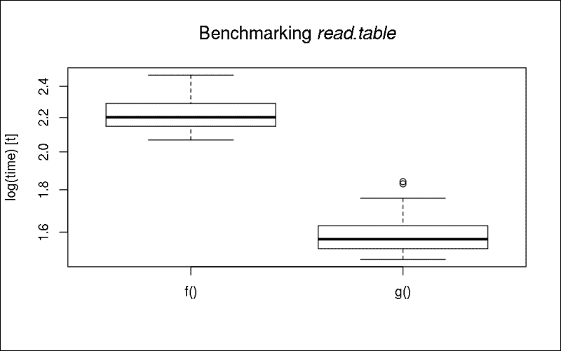
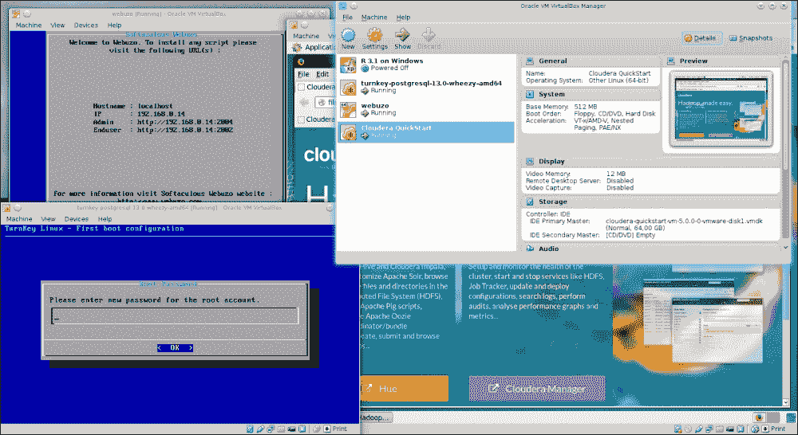
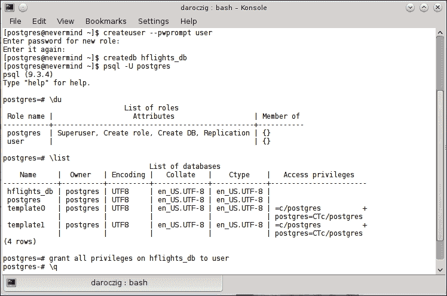
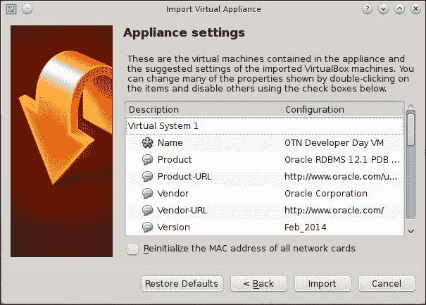
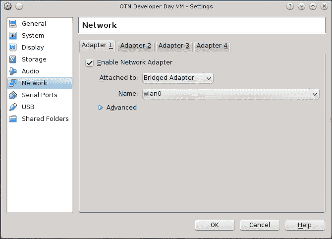
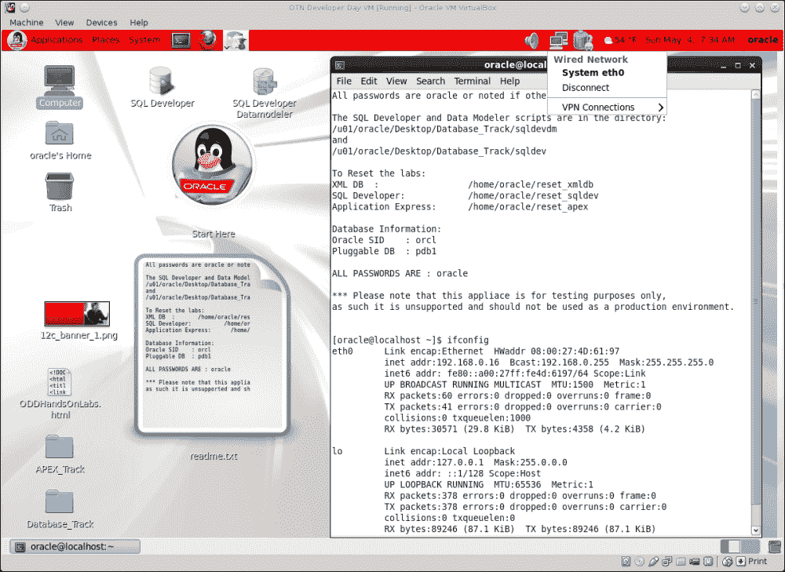
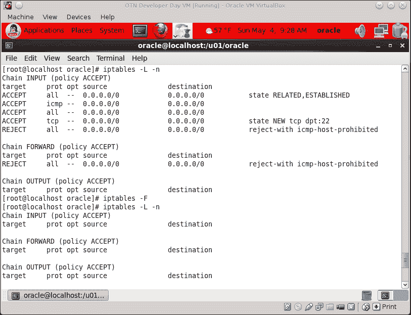
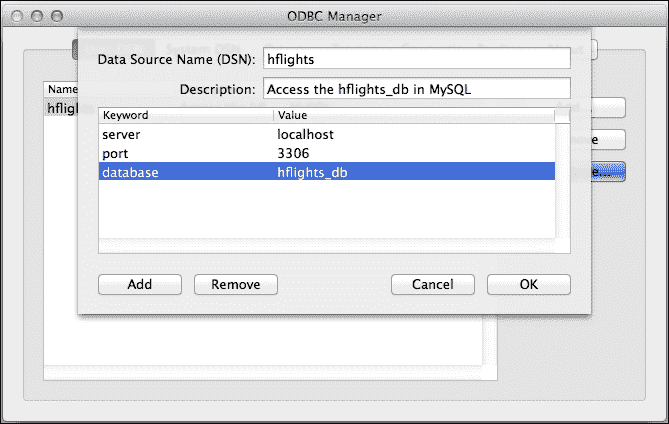
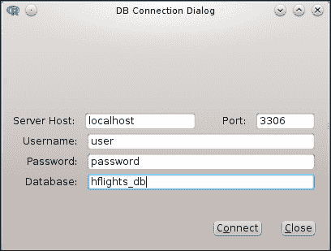
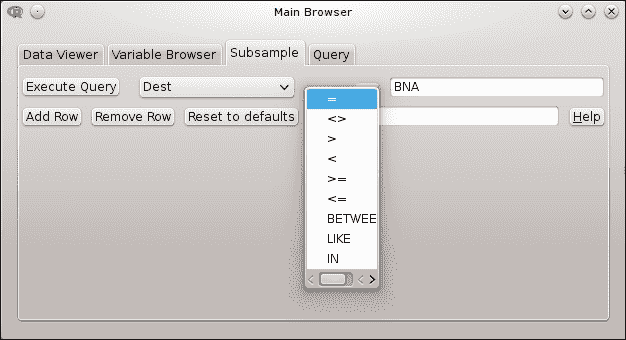

# 第一章. 嗨，数据！

在 R 中，大多数项目都是从将至少一些数据加载到运行中的 R 会话开始的。由于 R 支持多种文件格式和数据库后端，因此有多种方法可以实现这一点。在本章中，我们不会处理您已经熟悉的基本数据结构，而是将重点放在加载大型数据集的性能问题和处理特殊文件格式上。

### 注意

为了快速了解标准工具并刷新您对导入通用数据的知识，请参阅 CRAN 官方手册《R 简介》的*第七章* [`cran.r-project.org/doc/manuals/R-intro.html#Reading-data-from-files`](http://cran.r-project.org/doc/manuals/R-intro.html#Reading-data-from-files) 或 Rob Kabacoff 的 Quick-R 网站，该网站提供了 R 中大多数通用任务的关键字和速查表 [`www.statmethods.net/input/importingdata.html`](http://www.statmethods.net/input/importingdata.html)。有关进一步的材料，请参阅附录中的*参考文献*部分。

虽然 R 有自己的（序列化的）二进制`RData`和`rds`文件格式，这对所有 R 用户来说都非常方便，因为这些格式也以高效的方式存储 R 对象元信息，但大多数时候我们不得不处理其他输入格式——这些格式由我们的雇主或客户提供。

最受欢迎的数据文件格式之一是平面文件，这些文件是简单的文本文件，其中的值由空格、管道字符、逗号或更常见的是在欧洲的分号分隔。本章将讨论 R 提供的一些选项来加载这类文档，并将基准测试这些选项中哪个是导入大型文件最有效的方法。

有时我们只对数据集的一个子集感兴趣；因此，没有必要从源中加载所有数据。在这种情况下，数据库后端可以提供最佳性能，其中数据以结构化的方式预先加载到我们的系统中，这样我们就可以使用简单高效的操作查询该数据的任何子集。本章的第二部分将重点介绍三种最流行的数据库（MySQL、PostgreSQL 和 Oracle 数据库），以及如何在 R 中与这些数据库交互。

除了其他一些辅助工具和对其他数据库后端的快速概述外，我们还将讨论如何将 Excel 电子表格加载到 R 中——无需在 Excel 或 Open/LibreOffice 中将这些文件预先转换为文本文件。

当然，本章不仅仅关于数据文件格式、数据库连接等枯燥的内部结构。但请记住，数据分析总是从加载数据开始的。这是不可避免的，这样我们的计算机和统计环境在执行一些真正的分析之前就能知道数据的结构。

# 加载合理大小的文本文件

本章的标题也可能是**你好，大数据**！因为现在我们专注于在 R 会话中加载相对大量的数据。但什么是大数据，在 R 中处理多少数据是问题性的？什么是合理的大小？

R 被设计用来处理适合单个计算机物理内存的数据。因此，处理小于实际可用 RAM 的数据集应该没问题。但请注意，在执行某些计算时，如主成分分析，处理数据所需的内存可能会变得更大，这也应予以考虑。我将把这部分数据称为合理大小的数据集。

使用 R 从文本文件加载数据相当简单，通过调用古老的`read.table`函数，可以加载任何合理大小的数据集。这里可能唯一的问题是性能：读取例如 25 万行数据需要多长时间？让我们看看：

```py
> library('hflights')
> write.csv(hflights, 'hflights.csv', row.names = FALSE)

```

### 注意

作为提醒，请注意，本书中所有 R 命令和返回的输出都格式化得与本书前面的格式相同。命令从第一行的`>`开始，多行表达式的其余部分从`+`开始，就像在 R 控制台中一样。要在您的机器上复制和粘贴这些命令，请从 Packt 主页下载代码示例。有关更多详细信息，请参阅**前言**中的**您需要为此书准备的内容**部分。

是的，我们刚刚从`hflights`包中将一个 18.5 MB 的文本文件写入您的磁盘，其中包含有关 2011 年从休斯顿出发的所有航班的某些数据：

```py
> str(hflights)
'data.frame':  227496 obs. of  21 variables:
 $ Year             : int  2011 2011 2011 2011 2011 2011 2011 ...
 $ Month            : int  1 1 1 1 1 1 1 1 1 1 ...
 $ DayofMonth       : int  1 2 3 4 5 6 7 8 9 10 ...
 $ DayOfWeek        : int  6 7 1 2 3 4 5 6 7 1 ...
 $ DepTime          : int  1400 1401 1352 1403 1405 1359 1359 ...
 $ ArrTime          : int  1500 1501 1502 1513 1507 1503 1509 ...
 $ UniqueCarrier    : chr  "AA" "AA" "AA" "AA" ...
 $ FlightNum        : int  428 428 428 428 428 428 428 428 428 ...
 $ TailNum          : chr  "N576AA" "N557AA" "N541AA" "N403AA" ...
 $ ActualElapsedTime: int  60 60 70 70 62 64 70 59 71 70 ...
 $ AirTime          : int  40 45 48 39 44 45 43 40 41 45 ...
 $ ArrDelay         : int  -10 -9 -8 3 -3 -7 -1 -16 44 43 ...
 $ DepDelay         : int  0 1 -8 3 5 -1 -1 -5 43 43 ...
 $ Origin           : chr  "IAH" "IAH" "IAH" "IAH" ...
 $ Dest             : chr  "DFW" "DFW" "DFW" "DFW" ...
 $ Distance         : int  224 224 224 224 224 224 224 224 224 ...
 $ TaxiIn           : int  7 6 5 9 9 6 12 7 8 6 ...
 $ TaxiOut          : int  13 9 17 22 9 13 15 12 22 19 ...
 $ Cancelled        : int  0 0 0 0 0 0 0 0 0 0 ...
 $ CancellationCode : chr  "" "" "" "" ...
 $ Diverted         : int  0 0 0 0 0 0 0 0 0 0 ...

```

### 注意

`hflights`包提供了一个简单的方法来加载美国交通统计局研究与创新技术管理局的庞大航空公司数据集的一个子集。原始数据库包括自 1987 年以来所有美国航班的预定和实际起飞/到达时间，以及一些其他有趣的信息，常用于演示机器学习和大数据技术。有关数据集的更多详细信息，请参阅列描述和其他元数据，见[`www.transtats.bts.gov/DatabaseInfo.asp?DB_ID=120&Link=0`](http://www.transtats.bts.gov/DatabaseInfo.asp?DB_ID=120&Link=0)。

我们将使用这 21 列数据来基准数据导入时间。例如，让我们看看使用`read.csv`导入 CSV 文件需要多长时间：

```py
> system.time(read.csv('hflights.csv'))
 user  system elapsed 
 1.730   0.007   1.738

```

在这里从 SSD 加载数据花费了超过一秒半的时间。这相当不错，但我们可以通过识别并指定列的类别来达到更好的效果，而不是调用默认的`type.convert`（有关更多详细信息，请参阅`read.table`中的文档或搜索 StackOverflow，其中`read.csv`的性能似乎是一个相当常见且受欢迎的问题）：

```py
> colClasses <- sapply(hflights, class)
> system.time(read.csv('hflights.csv', colClasses = colClasses))
 user  system elapsed 
 1.093   0.000   1.092

```

这要好得多！但我们是否应该相信这个观察结果？在我们掌握 R 中的数据分析的过程中，我们应该实施一些更可靠的测试——通过简单地重复任务*n*次，并提供模拟结果的总览。这种方法为我们提供了具有多个观察结果的可视化数据，可以用来识别结果中的统计显著性差异。`microbenchmark`包提供了一个很好的框架来完成此类任务：

```py
> library(microbenchmark)
> f <- function() read.csv('hflights.csv')
> g <- function() read.csv('hflights.csv', colClasses = colClasses,
+                        nrows = 227496, comment.char = '')
> res <- microbenchmark(f(), g())
> res
Unit: milliseconds
 expr       min        lq   median       uq      max neval
 f() 1552.3383 1617.8611 1646.524 1708.393 2185.565   100
 g()  928.2675  957.3842  989.467 1044.571 1284.351   100

```

因此，我们定义了两个函数：`f`代表`read.csv`的默认设置，而在`g`函数中，我们传递了上述列类以及两个其他参数以提高性能。`comment.char`参数告诉 R 不要在导入的数据文件中查找注释，而`nrows`参数定义了从文件中读取的确切行数，这可以在内存分配上节省一些时间和空间。将`stringsAsFactors`设置为`FALSE`也可能略微加快导入速度。

### 注意

可以使用一些第三方工具识别文本文件中的行数，例如 Unix 中的`wc`，或者一个稍微慢一点的替代方法是`R.utils`包中的`countLines`函数。

但回到结果。让我们也可视化测试用例的中位数和相关描述性统计，这些测试用例默认运行了 100 次：

```py
> boxplot(res, xlab  = '',
+   main = expression(paste('Benchmarking ', italic('read.table'))))

```



差异似乎非常显著（请随意进行一些统计测试以验证这一点），所以我们仅仅通过微调`read.table`的参数就实现了 50%以上的性能提升。

## 大于物理内存的数据文件

将大量数据从 CSV 文件加载到 R 中，这些文件无法适应内存，可以通过为这种情况创建的定制包来完成。例如，`sqldf`包和`ff`包都有它们自己的解决方案，可以从块到块地以自定义数据格式加载数据。前者使用 SQLite 或其他类似 SQL 的数据库后端，而后者创建了一个带有`ffdf`类的自定义数据框，可以存储在磁盘上。`bigmemory`包提供了类似的方法。以下是一些使用示例（待基准测试）：

```py
> library(sqldf)
> system.time(read.csv.sql('hflights.csv'))
 user  system elapsed 
 2.293   0.090   2.384 
> library(ff)
> system.time(read.csv.ffdf(file = 'hflights.csv'))
 user  system elapsed 
 1.854   0.073   1.918 
> library(bigmemory)
> system.time(read.big.matrix('hflights.csv', header = TRUE))
 user  system elapsed 
 1.547   0.010   1.559

```

请注意，使用`bigmemory`包的`read.big.matrix`时，默认情况下标题为`FALSE`，所以在进行自己的基准测试之前，务必阅读相关函数的说明书。其中一些函数也支持性能调整，就像`read.table`一样。有关更多示例和用例，请参阅 CRAN 任务视图中的*High-Performance and Parallel Computing with R*的*Large memory and out-of-memory data*部分，网址为[`cran.r-project.org/web/views/HighPerformanceComputing.html`](http://cran.r-project.org/web/views/HighPerformanceComputing.html)。

# 文本文件解析器的基准测试

另一个处理和从平面文件加载合理大小数据的显著替代方案是`data.table`包。尽管它具有与传统基于 S 的 R 标记不同的独特语法，但该包提供了出色的文档、示例和案例研究，展示了它可以为各种数据库操作提供的真正令人印象深刻的加速。这些用例和示例将在第三章*过滤和汇总数据*和第四章*重构数据*中讨论。

该包提供了一种自定义 R 函数来读取具有改进性能的文本文件：

```py
> library(data.table)
> system.time(dt <- fread('hflights.csv'))
 user  system elapsed 
 0.153   0.003   0.158

```

与先前的示例相比，加载数据非常快，尽管它产生了一个具有自定义`data.table`类的 R 对象，如果需要，可以轻松转换为传统的`data.frame`：

```py
> df <- as.data.frame(dt)

```

或者通过使用`setDF`函数，它提供了一种非常快速且就地转换对象的方法，而不实际在内存中复制数据。同样，请注意：

```py
> is.data.frame(dt)
[1] TRUE

```

这意味着`data.table`对象可以回退以作为传统用途的`data.frame`。是否保留导入的数据不变或将其转换为`data.frame`取决于后续的使用。使用前者聚合、合并和重构数据比 R 的标准数据框格式更快。另一方面，用户必须学习`data.table`的定制语法——例如，`DT[i, j, by]`代表“从 DT 中按`i`子集，然后按`by`分组执行`j`”。我们将在第三章*过滤和汇总数据*中稍后讨论它。

现在，让我们比较所有上述数据导入方法：它们的速度如何？最终赢家似乎仍然是来自`data.table`的`fread`。首先，我们通过声明测试函数来定义要基准测试的方法：

```py
> .read.csv.orig   <- function() read.csv('hflights.csv')
> .read.csv.opt    <- function() read.csv('hflights.csv',
+     colClasses = colClasses, nrows = 227496, comment.char = '',
+     stringsAsFactors = FALSE)
> .read.csv.sql    <- function() read.csv.sql('hflights.csv')
> .read.csv.ffdf   <- function() read.csv.ffdf(file = 'hflights.csv')
> .read.big.matrix <- function() read.big.matrix('hflights.csv',
+     header = TRUE)
> .fread           <- function() fread('hflights.csv')

```

现在，让我们将这些函数各运行 10 次，而不是像之前那样运行数百次迭代——只是为了节省一些时间：

```py
> res <- microbenchmark(.read.csv.orig(), .read.csv.opt(),
+   .read.csv.sql(), .read.csv.ffdf(), .read.big.matrix(), .fread(),
+   times = 10)

```

并以预定义的位数打印基准测试的结果：

```py
> print(res, digits = 6)
Unit: milliseconds
 expr      min      lq   median       uq      max neval
 .read.csv.orig() 2109.643 2149.32 2186.433 2241.054 2421.392    10
 .read.csv.opt() 1525.997 1565.23 1618.294 1660.432 1703.049    10
 .read.csv.sql() 2234.375 2265.25 2283.736 2365.420 2599.062    10
 .read.csv.ffdf() 1878.964 1901.63 1947.959 2015.794 2078.970    10
 .read.big.matrix() 1579.845 1603.33 1647.621 1690.067 1937.661    10
 .fread()  153.289  154.84  164.994  197.034  207.279    10

```

请注意，现在我们正在处理适合实际物理内存的数据集，而一些基准测试的包是为远大于数据库的数据库设计的和优化的。因此，优化`read.table`函数似乎在默认设置之上提供了很大的性能提升，尽管如果我们追求真正快速导入合理大小的数据，使用`data.table`包是最佳解决方案。

# 加载文本文件的子集

有时我们只需要数据集的一部分来进行分析，存储在数据库后端或平面文件中。在这种情况下，仅加载数据框的相关子集将比任何性能调整和自定义包讨论的更快。

让我们假设我们只对 2012 年*useR!*会议（在纳什维尔举行）的航班感兴趣。这意味着我们只需要 CSV 文件中`Dest`等于`BNA`（这个国际航空运输协会机场代码代表纳什维尔国际机场）的行。

而不是在 160 到 2,000 毫秒内（见上一节）加载整个数据集，然后删除无关的行（见第三章，*过滤和汇总数据*），让我们看看在加载数据的同时过滤数据的方法。

已经提到的`sqldf`包可以通过指定一个要在为导入任务创建的临时 SQLite 数据库上运行的 SQL 语句来帮助完成这个任务：

```py
> df <- read.csv.sql('hflights.csv',
+   sql = "select * from file where Dest = '\"BNA\"'")

```

这个`sql`参数默认为`"select * from file"`，这意味着加载每行的所有字段而不进行任何过滤。现在我们通过添加一个`filter`语句扩展了这一点。请注意，在我们的更新 SQL 语句中，我们还添加了双引号到搜索词中，因为`sqldf`不会自动识别引号为特殊字符；它将它们视为字段的一部分。也可以通过提供自定义的过滤参数来解决这个问题，例如以下 Unix-like 系统中的示例：

```py
> df <- read.csv.sql('hflights.csv',
+   sql = "select * from file where Dest = 'BNA'",
+   filter = 'tr -d ^\\" ')

```

结果数据框只包含原始数据集中的 227,496 个案例中的 3,481 个观测值，当然，在临时 SQLite 数据库中进行过滤当然会稍微加快数据导入的速度：

```py
> system.time(read.csv.sql('hflights.csv'))
 user  system elapsed 
 2.117   0.070   2.191 
> system.time(read.csv.sql('hflights.csv',
+   sql = "select * from file where Dest = '\"BNA\"'"))
 user  system elapsed 
 1.700   0.043   1.745

```

稍微的改进是由于两个 R 命令首先将 CSV 文件加载到一个临时的 SQLite 数据库中；这个过程当然需要一些时间，并且无法从这个过程中消除。为了加快这部分评估的速度，你可以将`dbname`指定为`NULL`以获得性能提升。这样，SQLite 数据库就会在内存中创建，而不是在`tempfile`中，这可能不是处理大型数据集的最佳解决方案。

## 在将文件加载到 R 之前过滤平面文件

有没有更快或更智能的方法来只加载这样的文本文件的一部分？一个人可以在将它们传递给 R 之前对平面文件应用一些基于正则表达式的过滤。例如，`grep`或`ack`可能在 Unix 环境中是一个很好的工具，但在 Windows 机器上默认不可用，并且通过正则表达式解析 CSV 文件可能会导致一些意外的副作用。相信我，你永远不想从头开始编写 CSV、JSON 或 XML 解析器！

无论如何，现在的数据科学家在处理数据方面应该是一个真正的多面手，所以这里有一个快速且简单的例子来展示如何在 100 毫秒内读取过滤后的数据：

```py
> system.time(system('cat hflights.csv | grep BNA', intern = TRUE))
 user  system elapsed 
 0.040   0.050   0.082

```

嗯，与我们的任何先前结果相比，这是一个非常好的运行时间！但如果我们想过滤出到达延误超过 13.5 分钟的航班怎么办？

另一种方法，可能是一个更易于维护的方法，就是首先将数据加载到数据库后端，并在需要任何数据子集时查询它。这样，例如，我们只需在文件中一次性填充 SQLite 数据库，然后以后可以以 `read.csv.sql` 默认运行时间的片段来检索任何子集。

因此，让我们创建一个持久的 SQLite 数据库：

```py
> sqldf("attach 'hflights_db' as new")

```

这个命令已经在当前工作目录中创建了一个名为 `hflights_db` 的文件。接下来，让我们创建一个名为 `hflights` 的表，并将 CSV 文件的內容填充到之前创建的数据库中：

```py
> read.csv.sql('hflights.csv',
+   sql = 'create table hflights as select * from file',
+   dbname = 'hflights_db')

```

目前还没有进行基准测试，因为这些步骤只会运行一次，而数据集子部分的查询可能稍后会多次运行：

```py
> system.time(df <- sqldf(
+   sql = "select * from hflights where Dest = '\"BNA\"'",
+   dbname = "hflights_db"))
 user  system elapsed 
 0.070   0.027   0.097

```

我们已经将所需的数据库子集在不到 100 毫秒内加载完成！但如果计划经常查询持久数据库，我们可以做得更好：为什么不专门为我们的数据集分配一个真实的数据库实例，而不是一个简单的基于文件和无需服务器的 SQLite 后端呢？

# 从数据库加载数据

使用专用数据库后端而不是按需从磁盘加载数据的巨大优势在于，数据库提供：

+   更快地访问整个或所选部分的大表

+   在将数据加载到 R 之前，强大的快速聚合和过滤数据的方法

+   相比于传统的电子表格和 R 对象的矩阵模型，提供了一种在关系型、更结构化的方案中存储数据的基础设施

+   连接和合并相关数据的程序

+   同时从多个客户端进行并发和网络访问

+   访问数据的安全策略和限制

+   可扩展和可配置的后端以存储数据

`DBI` 包提供了一个数据库接口，它是 R 与各种**关系数据库管理系统**（**RDBMS**）之间的通信渠道，例如 MySQL、PostgreSQL、MonetDB、Oracle，以及例如 Open Document Databases 等，等等。实际上，没有必要单独安装此包，因为它作为接口，如果需要，将作为依赖项自动安装。

连接到数据库并检索数据与所有这些后端都相当相似，因为它们都基于关系模型并使用 SQL 来管理和查询数据。请务必注意，上述数据库引擎之间存在一些重要差异，并且还存在更多开源和商业替代方案。但我们不会深入探讨如何选择数据库后端或如何构建数据仓库以及**提取、转换和加载**（**ETL**）工作流程的细节，我们只会专注于从 R 中建立连接和管理数据。

### 注意

SQL，最初由 IBM 开发，拥有超过 40 年的历史，是目前最重要的编程语言之一——有各种方言和实现。作为全球最受欢迎的声明性语言之一，有许多在线教程和免费课程教授如何使用 SQL 查询和管理数据，这无疑是每位数据科学家瑞士军刀中最重要的工具之一。

因此，除了 R 之外，了解 RDBMS（关系数据库管理系统）也非常值得，这在您作为数据分析师或类似职位在任何行业中工作的地方都非常常见。

## 设置测试环境

数据库后端通常运行在远离进行数据分析的用户的服务器上，但出于测试目的，在运行 R 的机器上安装本地实例可能是个好主意。由于安装过程在不同的操作系统上可能极其不同，我们不会进入安装步骤的任何细节，而是会参考软件的下载位置以及一些有关安装的优质资源和文档的链接。

请注意，安装并尝试从这些数据库加载数据完全是可选的，您不必遵循每个步骤——本书的其余部分将不依赖于任何数据库知识或与数据库相关的先前经验。另一方面，如果您不想在测试目的的多个数据库应用程序的临时安装中弄乱您的工作空间，使用虚拟机可能是一个最佳解决方案。Oracle 的 `VirtualBox` 提供了一种免费且简单的方法来运行多个虚拟机，每个虚拟机都有其专用的操作系统和用户空间。

### 注意

有关如何下载并导入 `VirtualBox` 镜像的详细说明，请参阅 *Oracle* 部分。

这样，您可以快速部署一个完全功能但可丢弃的数据库环境来测试本章的以下示例。在下面的图像中，您可以看到 `VirtualBox` 中安装了四个虚拟机，其中三个在后台运行，为测试目的提供一些数据库后端：



### 注意

`VirtualBox` 可以通过您的操作系统包管理器在 Linux 上安装，或者从 [`www.virtualbox.org/wiki/Downloads`](https://www.virtualbox.org/wiki/Downloads) 下载安装二进制文件/源代码。有关详细和特定操作系统的安装信息，请参阅手册的 *第二章*，*安装细节*：[`www.virtualbox.org/manual/`](http://www.virtualbox.org/manual/).

现在，设置和运行虚拟机非常直观和简单；基本上，您只需要加载并启动虚拟机镜像。一些虚拟机，所谓的虚拟机，已经包含了操作系统，通常已经配置了一些软件以便工作，以便简单、容易和快速分发。

### 小贴士

再次强调，如果您不喜欢安装和测试新软件或花时间学习支持您数据需求的基础设施，以下步骤不是必需的，您可以自由跳过这些主要针对全栈开发人员/数据科学家描述的可选任务。

这些可以在任何计算机上运行的预配置虚拟机可以从互联网上的多个提供商处下载，格式多种多样，例如 OVF 或 OVA。例如，可以从 [`virtualboximages.com/vdi/index`](http://virtualboximages.com/vdi/index) 或 [`virtualboxes.org/images/`](http://virtualboxes.org/images/) 下载通用的 `VirtualBox` 虚拟设备。

### 注意

虚拟设备应在 VirtualBox 中导入，而非 OVF/OVA 的磁盘镜像应附加到新创建的虚拟机上；因此，可能还需要一些额外的手动配置。

Oracle 还有一个包含大量对数据科学家学徒和其他开发人员有用的虚拟镜像的存储库，位于 [`www.oracle.com/technetwork/community/developer-vm/index.html`](http://www.oracle.com/technetwork/community/developer-vm/index.html)，例如，Oracle Big Data Lite VM 开发者虚拟设备包含以下最重要的组件：

+   Oracle 数据库

+   Cloudera 分发中的 Apache Hadoop 和各种工具

+   Oracle R 分发

+   基于 Oracle Enterprise Linux 构建

免责声明：Oracle 不会是我个人的首选，但他们在其平台无关的虚拟化环境中做得很好，就像他们基于其商业产品提供免费开发人员 VM 一样。简而言之，提供的 Oracle 工具绝对值得使用。

### 注意

如果您无法在网络上访问已安装的虚拟机，请更新您的网络设置，如果不需要互联网连接，请使用 *仅主机适配器*，或者对于更稳定的设置使用 *桥接网络*。后者设置将在您的本地网络上为虚拟机保留一个额外的 IP 地址；这样，它就很容易访问了。请参阅 *Oracle 数据库* 部分以获取更多详细信息及示例截图。

另一个为开源数据库引擎创建的虚拟设备的好来源是 Turnkey GNU/Linux 存储库，位于 [`www.turnkeylinux.org/database`](http://www.turnkeylinux.org/database)。这些镜像基于 Debian Linux，完全免费使用，目前支持 MySQL、PostgreSQL、MongoDB 和 CouchDB 数据库。

Turnkey Linux 媒体的一个巨大优势是它只包含开源、免费软件和非专有内容。此外，磁盘镜像要小得多，只包含一个专用数据库引擎所需的组件。这也导致安装速度更快，在所需的磁盘和内存空间方面开销更小。

更多类似的虚拟应用可以在[`www.webuzo.com/sysapps/databases`](http://www.webuzo.com/sysapps/databases)找到，这里提供了更广泛的数据库后端选择，例如 Cassandra、HBase、Neo4j、Hypertable 或 Redis，尽管一些 Webuzo 虚拟应用可能需要付费订阅才能部署。

而作为新兴的酷炫技术 Docker，我更建议你熟悉其快速部署软件容器的概念。这样的容器可以被描述为一个包含操作系统、库、工具、数据和独立文件系统的独立文件系统，它基于 Docker 镜像的抽象层。在实践中，这意味着你可以在本地主机上使用一行命令启动一个包含一些示例数据的数据库，开发这样的自定义镜像同样简单。请参阅一些简单示例和进一步参考，我在[`github.com/cardcorp/card-rocker`](https://github.com/cardcorp/card-rocker)描述的 R 和 Pandoc 相关的 Docker 镜像。

## MySQL 和 MariaDB

MySQL 是全球最受欢迎的开源数据库引擎，这是基于 DB-Engines 排名总结的提及次数、工作机会、Google 搜索等，[`db-engines.com/en/ranking`](http://db-engines.com/en/ranking)。主要用于 Web 开发，其高人气可能是因为 MySQL 是免费的、平台无关的，并且相对容易设置和配置——就像其替代品分支**MariaDB**一样。

### 注意

MariaDB 是由 MySQL 的创始人 Michael Widenius 发起和领导的社区开发的开源分支，后来与 SkySQL 合并；因此，前 MySQL 的高管和投资者也加入了这个分支。在 Sun Microsystems 收购 MySQL（目前由 Oracle 拥有）之后，数据库引擎的开发发生了变化。

在书中，我们将这两个引擎都称为 MySQL 以保持简单，因为 MariaDB 可以被视为 MySQL 的替代品，所以请随意使用 MySQL 或 MariaDB 重放以下示例。

尽管在大多数操作系统上安装 MySQL 服务器相当简单([`dev.mysql.com/downloads/mysql/`](https://dev.mysql.com/downloads/mysql/))，但有人可能更愿意在虚拟机上安装数据库。Turnkey Linux 提供了免费的小型但完全配置好的虚拟应用：[`www.turnkeylinux.org/mysql`](http://www.turnkeylinux.org/mysql)。

R 语言提供了多种从 MySQL 数据库查询数据的方法。一种选择是使用`RMySQL`包，对于一些用户来说，安装这个包可能有点棘手。如果你使用 Linux，请确保安装 MySQL 的开发包和 MySQL 客户端，以便该包可以在你的系统上编译。另外，由于 MySQL 版本的高变异性，CRAN 上没有可用的二进制包用于 Windows 安装，因此 Windows 用户也应该从源代码编译该包：

```py
> install.packages('RMySQL', type = 'source')

```

Windows 用户可能会发现以下关于在 Windows 下安装 `rmysql` 的详细步骤的博客文章很有用：[`www.ahschulz.de/2013/07/23/installing-rmysql-under-windows/`](http://www.ahschulz.de/2013/07/23/installing-rmysql-under-windows/)。

### 注意

为了简化起见，我们将把 MySQL 服务器称为监听默认 3306 端口的 `localhost`；在所有数据库连接中，用户将是 `user`，密码将是 `password`。我们将使用 `hflights_db` 数据库中的 `hflights` 表，就像在前面几页的 SQLite 示例中一样。如果你在一个远程或虚拟服务器上工作，请相应地修改以下代码示例中的 `host`、`username` 等参数。

在成功安装并启动 MySQL 服务器后，我们必须设置一个测试数据库，稍后我们可以在 R 中填充它。为此，让我们启动 MySQL 命令行工具来创建数据库和测试用户。

请注意，以下示例是在 Linux 上运行的，Windows 用户可能还需要提供路径以及可能还需要 `exe` 文件扩展名来启动 MySQL 命令行工具：


在之前的屏幕截图中，我们可以看到这次快速会话，我们首先以 `root`（管理员）用户身份在命令行中连接到 MySQL 服务器。然后我们创建了一个名为 `hflights_db` 的数据库，并将该数据库的所有权限和权限授予了一个名为 `user` 的新用户，密码设置为 `password`。然后我们简单地验证是否可以与新创建的用户连接到数据库，并退出了命令行 MySQL 客户端。

要将数据从 MySQL 数据库加载到 R 中，首先我们必须连接到服务器，并且通常还需要进行身份验证。这可以通过在附加 `RMySQL` 时自动加载的 `DBI` 包来完成：

```py
> library(RMySQL)
Loading required package: DBI
> con <- dbConnect(dbDriver('MySQL'),
+   user = 'user', password = 'password', dbname = 'hflights_db')

```

现在，我们可以将我们的 MySQL 连接称为 `con`，其中我们想要部署 `hflights` 数据集以供后续访问：

```py
> dbWriteTable(con, name = 'hflights', value = hflights)
[1] TRUE
> dbListTables(con)
[1] "hflights"

```

`dbWriteTable` 函数将具有相同名称的 `hflights` 数据框写入先前定义的连接。后一个命令显示了当前使用的数据库中的所有表，相当于 SQL 命令 `SHOW TABLES`。现在我们已经将原始的 CVS 文件导入到 MySQL 中，让我们看看读取整个数据集需要多长时间：

```py
> system.time(dbReadTable(con, 'hflights'))
 user  system elapsed 
 0.993   0.000   1.058

```

或者，我们可以通过将直接 SQL 命令传递给 `dbGetQuery` 的同一 `DBI` 包来完成：

```py
> system.time(dbGetQuery(con, 'select * from hflights'))
 user  system elapsed 
 0.910   0.000   1.158

```

为了使后续的示例更加简单，让我们回到 `sqldf` 包，它代表“数据框上的 SQL 选择”。实际上，`sqldf` 是围绕 DBI 的 `dbSendQuery` 函数的一个方便的包装器，带有一些有用的默认设置，并返回 `data.frame`。这个包装器可以查询各种数据库引擎，如 SQLite、MySQL、H2 或 PostgreSQL，默认使用全局 `sqldf.driver` 选项中指定的引擎；如果没有指定，它将检查是否有为上述后端加载了任何 R 包。

由于我们已加载 `RMySQL`，现在 `sqldf` 将默认使用 MySQL 而不是 SQLite。但我们仍然需要指定要使用哪个连接；否则，函数将尝试打开一个新的连接——没有任何关于我们复杂的用户名和密码组合的想法，更不用说神秘的数据库名称了。连接可以在每个 `sqldf` 表达式中传递，或者在一个全局选项中定义一次：

```py
> options('sqldf.connection' = con)
> system.time(sqldf('select * from hflights'))
 user  system elapsed 
 0.807   0.000   1.014

```

在前三个相同任务的版本之间的差异似乎并不显著。与之前测试的方法相比，1 秒的计时似乎是一个相当不错的结果——尽管使用 `data.table` 加载数据集仍然优于这个结果。如果我们只需要数据集的子集怎么办？让我们只获取以纳什维尔结束的航班，就像我们之前的 SQLite 示例一样：

```py
> system.time(sqldf('SELECT * FROM hflights WHERE Dest = "BNA"'))
 user  system elapsed 
 0.000   0.000   0.281

```

与我们之前的 SQLite 测试相比，这似乎并不令人信服，因为后者可以在不到 100 毫秒内重现相同的结果。但请注意，用户和系统经过的时间都是零，这与 SQLite 不同。

### 注意

`system.time` 返回的返回时间表示自评估开始以来经过的毫秒数。用户和系统时间稍微复杂一些；它们由操作系统报告。大致来说，`user` 表示被调用进程（如 R 或 MySQL 服务器）所花费的 CPU 时间，而 `system` 报告内核和其他操作系统进程（如打开文件进行读取）所需的 CPU 时间。有关更多详细信息，请参阅 `?proc.time`。

这意味着返回所需数据子集根本未使用任何 CPU 时间，使用 SQLite 需要 100 毫秒左右。这是怎么回事？如果我们对 `Dest` 上的数据库进行索引会怎样？

```py
> dbSendQuery(con, 'CREATE INDEX Dest_idx ON hflights (Dest(3));')

```

这个 SQL 查询代表在我们表的 `Dest` 列的前三个字母上创建一个名为 `Dest_idx` 的索引。

### 注意

SQL 索引可以显著提高带有 `WHERE` 子句的 `SELECT` 语句的性能，因为以这种方式，MySQL 不必读取整个数据库来匹配每一行，但它可以确定相关搜索结果的位置。随着数据库的增大，这种性能提升变得越来越显著，尽管也值得提一下，如果大多数情况下查询的是数据子集，则索引才有意义。如果需要大多数或所有数据，顺序读取会更快。

实例演示：

```py
> system.time(sqldf('SELECT * FROM hflights WHERE Dest = "BNA"'))
 user  system elapsed 
 0.024   0.000   0.034

```

这似乎要好得多！当然，我们也可以对 SQLite 数据库进行索引，而不仅仅是 MySQL 实例。为了再次测试，我们必须将默认的 `sqldf` 驱动程序还原为 SQLite，这被加载 `RMySQL` 包所覆盖：

```py
> options(sqldf.driver = 'SQLite')
> sqldf("CREATE INDEX Dest_idx ON hflights(Dest);",
+   dbname = "hflights_db"))
NULL
> system.time(sqldf("select * from hflights where
+   Dest = '\"BNA\"'", dbname = "hflights_db"))
 user  system elapsed 
 0.034   0.004   0.036

```

因此，似乎这两种数据库引擎都能够以秒分之一的时间返回所需的数据子集，这甚至比我们之前使用令人印象深刻的 `data.table` 所达到的结果要好得多。

尽管在某些早期的例子中 SQLite 被证明比 MySQL 更快，但在大多数情况下，有许多原因选择后者。首先，SQLite 是一个基于文件的数据库，这意味着数据库应该位于连接到运行 R 的计算机的文件系统上。这通常意味着 SQLite 数据库和运行中的 R 会话在同一台计算机上。同样，MySQL 可以处理更大的数据量；它具有用户管理和基于规则的权限控制，以及并发访问相同的数据集。聪明的数据科学家知道如何选择他的武器——根据任务，另一个数据库后端可能是最佳解决方案。让我们看看 R 中我们还有哪些其他选项！

## PostgreSQL

虽然 MySQL 被称为最受欢迎的开源关系型数据库管理系统，但 PostgreSQL 以“世界上最先进的开源数据库”而闻名。这意味着 PostgreSQL 通常被认为比简单但更快的 MySQL 具有更多功能，包括分析函数，这也导致了 PostgreSQL 常常被描述为 Oracle 的开源版本。

现在听起来相当有趣，因为 Oracle 现在拥有 MySQL。所以，在过去的 20-30 年的关系型数据库管理系统历史中，许多事情都发生了变化，PostgreSQL 也不再那么慢了。另一方面，MySQL 也获得了一些很好的新功能——例如，MySQL 也通过 `InnoDB` 引擎成为 ACID 兼容，允许回滚到数据库的先前状态。这两个流行的数据库服务器之间还有一些其他差异，这些差异可能支持选择其中的任何一个。现在让我们看看如果我们的数据提供商更喜欢 PostgreSQL 而不是 MySQL 会发生什么！

安装 PostgreSQL 与 MySQL 类似。您可以使用操作系统的包管理器安装软件，从 [`www.enterprisedb.com/products-services-training/pgdownload`](http://www.enterprisedb.com/products-services-training/pgdownload) 下载图形安装程序，或者使用例如免费的 Turnkey Linux 运行虚拟设备，Turnkey Linux 在 [`www.turnkeylinux.org/postgresql`](http://www.turnkeylinux.org/postgresql) 提供了一个免费的小型但完全配置的磁盘镜像。

### 小贴士

**下载示例代码**

您可以从 [`www.packtpub.com`](http://www.packtpub.com) 下载您购买的所有 Packt 出版物的示例代码文件。如果您在其他地方购买了这本书，您可以访问 [`www.packtpub.com/support`](http://www.packtpub.com/support) 并注册，以便将文件直接通过电子邮件发送给您。

在成功安装并启动服务器后，让我们设置测试数据库——就像我们在 MySQL 安装后所做的那样：



在某些情况下，语法略有不同，我们已使用了一些命令行工具用于用户和数据库的创建。这些辅助程序默认随 PostgreSQL 一起提供，MySQL 也提供了一些类似的功能，例如 `mysqladmin`。

在设置初始测试环境之后，或者如果我们已经有一个可连接的工作数据库实例，我们可以借助 `RPostgreSQL` 包重复之前描述的数据管理任务：

```py
> library(RPostgreSQL)
Loading required package: DBI

```

### 注意

如果你的 R 会话在以下示例中开始抛出奇怪的错误消息，那么加载的 R 包冲突的可能性非常高。你可以简单地启动一个干净的 R 会话，或者断开之前附加的包——例如，`detach('package:RMySQL', unload = TRUE)`。

连接到数据库（监听默认端口号 5432）再次变得熟悉：

```py
> con <- dbConnect(dbDriver('PostgreSQL'), user = 'user',
+   password = 'password', dbname = 'hflights_db')

```

让我们验证我们是否连接到了正确的数据库实例，它目前应该没有 `hflights` 表且为空：

```py
> dbListTables(con)
character(0)
> dbExistsTable(con, 'hflights')
[1] FALSE

```

然后让我们在 PostgreSQL 中编写我们的演示表，看看关于它比 MySQL 慢的旧传闻是否仍然成立：

```py
> dbWriteTable(con, 'hflights', hflights)
[1] TRUE
> system.time(dbReadTable(con, 'hflights'))
 user  system elapsed 
 0.590   0.013   0.921

```

看起来很令人印象深刻！那么加载部分数据呢？

```py
> system.time(dbGetQuery(con,
+ statement = "SELECT * FROM hflights WHERE \"Dest\" = 'BNA';"))
 user  system elapsed 
 0.026   0.000   0.082

```

没有索引的情况下大约 100 毫秒！请注意 `Dest` 周围额外的转义引号，因为默认的 PostgreSQL 行为会将未引用的列名折叠为小写，这会导致出现列 `dest` 不存在的错误。根据 MySQL 示例，创建索引并运行前面的查询以大幅提高速度可以轻松重现。

## Oracle 数据库

Oracle 数据库 Express Edition 可以从 [`www.oracle.com/technetwork/database/database-technologies/express-edition/downloads/index.html`](http://www.oracle.com/technetwork/database/database-technologies/express-edition/downloads/index.html) 下载和安装。虽然这不是一个功能齐全的 Oracle 数据库，并且存在严重的限制，但 Express Edition 是一种免费且不太占用资源的在家构建测试环境的方法。

### 注意

据说 Oracle 数据库是世界上最受欢迎的数据库管理系统，尽管它只能通过专有许可证获得，与之前讨论的两个 RDBMS 不同，这意味着 Oracle 以条款许可的形式提供产品。另一方面，付费许可证还附带来自开发商公司的优先支持，这在企业环境中通常是一个严格的要求。Oracle 数据库自 1980 年首次发布以来就支持了许多优秀的功能，例如分片、主-主复制和完全 ACID 属性。

另一种获取用于测试目的的 Oracle 数据库的方法是从[`www.oracle.com/technetwork/community/developer-vm/index.html`](http://www.oracle.com/technetwork/community/developer-vm/index.html)下载 Oracle 预构建开发者虚拟机，或者从*Oracle 技术网络开发者日*为*动手数据库应用开发*定制的更小的镜像：[`www.oracle.com/technetwork/database/enterprise-edition/databaseappdev-vm-161299.html`](http://www.oracle.com/technetwork/database/enterprise-edition/databaseappdev-vm-161299.html)。我们将遵循后者的说明。

接受许可协议并在 Oracle 免费注册后，我们可以下载`OTN_Developer_Day_VM.ova`虚拟设备。让我们通过**文件**菜单中的**导入设备**来将其导入 VirtualBox，然后选择`ova`文件，并点击**下一步**：



点击**导入**后，您需要再次同意软件许可协议。导入虚拟磁盘镜像（15 GB）可能需要几分钟时间：


导入完成后，我们应该首先更新网络配置，以便我们可以从外部访问虚拟机的内部数据库。所以让我们在设置中将**NAT**切换到**桥接适配器**：



然后，我们可以在 VirtualBox 中简单地启动新创建的虚拟机。Oracle Linux 启动后，我们可以使用默认的`oracle`密码登录。

虽然我们已经为我们的虚拟机设置了一个桥接网络接口，这意味着虚拟机直接连接到我们的真实子网络并具有真实 IP 地址，但该机器在网络中尚不可访问。要使用默认的 DHCP 设置进行连接，只需导航到顶部红色栏并查找网络图标，然后选择**系统 eth0**。几秒钟后，虚拟机可以从您的宿主机访问，因为虚拟系统应该连接到您的网络。您可以通过在已运行的控制台中运行`ifconfig`或`ip addr show eth0`命令来验证这一点：



不幸的是，这个已经运行的 Oracle 数据库在虚拟机外部尚不可访问。开发者虚拟机默认有一个相当严格的防火墙，首先需要将其禁用。要查看生效的规则，运行标准命令`iptables -L -n`，要清除所有规则，执行`iptables -F`：



现在我们有一个运行且可远程访问的 Oracle 数据库，让我们准备 R 客户端。在某些操作系统上安装 `ROracle` 包可能会变得复杂，因为没有预构建的二进制包，你必须手动安装 Oracle Instant Client Lite 和 SDK 库，然后再从源代码编译包。如果编译器抱怨你之前安装的 Oracle 库的路径，请使用 `--with-oci-lib` 和 `--with-oci-inc` 参数，并通过 `--configure-args` 参数传递你的自定义路径。更多详细信息可以在包安装文档中找到：[`cran.r-project.org/web/packages/ROracle/INSTALL`](http://cran.r-project.org/web/packages/ROracle/INSTALL)。

例如，在 Arch Linux 上，你可以从 AUR 安装 Oracle 库，然后从 CRAN 下载 R 包后，在 `bash` 中运行以下命令：

```py
# R CMD INSTALL --configure-args='--with-oci-lib=/usr/include/    \
>  --with-oci-inc=/usr/share/licenses/oracle-instantclient-basic' \
>  ROracle_1.1-11.tar.gz

```

安装并加载包后，打开连接与之前的 `DBI::dbConnect` 示例极其相似。这里我们只传递一个额外的参数。首先，让我们指定包含在 `dbname` 参数中的 Oracle 数据库的主机名或直接 IP 地址。然后我们可以连接到开发机器上已经存在的 PDB1 数据库，而不是之前使用的 `hflights_db`——只是为了在书中节省一些关于稍微偏离主题的数据库管理任务的时间和空间：

```py
> library(ROracle)
Loading required package: DBI
> con <- dbConnect(dbDriver('Oracle'), user = 'pmuser',
+   password = 'oracle', dbname = '//192.168.0.16:1521/PDB1')

```

我们已经有一个到 Oracle RDBMS 的工作连接：

```py
> summary(con)
User name:             pmuser 
Connect string:        //192.168.0.16:1521/PDB1 
Server version:        12.1.0.1.0 
Server type:           Oracle RDBMS 
Results processed:     0 
OCI prefetch:          FALSE 
Bulk read:             1000 
Statement cache size:  0 
Open results:          0 

```

让我们看看开发虚拟机上的捆绑数据库里有什么：

```py
> dbListTables(con)
[1] "TICKER_G" "TICKER_O" "TICKER_A" "TICKER" 

```

因此，似乎我们有一个名为 `TICKER` 的表，它包含了三个符号的 tick 数据的三个视图。在同一个数据库中保存 `hflights` 表不会造成任何伤害，我们还可以立即测试 Oracle 数据库读取整个表的速度：

```py
> dbWriteTable(con, 'hflights', hflights)
[1] TRUE
> system.time(dbReadTable(con, 'hflights'))
 user  system elapsed 
 0.980   0.057   1.256

```

以及一个包含 3,481 个案例的极其熟悉的子集：

```py
> system.time(dbGetQuery(con,
+ "SELECT * FROM \"hflights\" WHERE \"Dest\" = 'BNA'"))
 user  system elapsed
 0.046   0.003   0.131

```

请注意表名周围的引号。在之前的 MySQL 和 PostgreSQL 示例中，SQL 语句运行良好，无需那些引号。然而，在 Oracle 数据库中需要引号，因为我们以全小写名称保存了表，Oracle DB 的默认规则是将对象名称存储为大写。唯一的另一种选择是使用双引号来创建它们，这就是我们所做的；因此，我们必须用引号引用小写名称。

### 注意

我们从 MySQL 中的未引用的表和列名开始，然后在从 R 运行 PostgreSQL 查询时必须将变量名周围的引号转义，现在在 Oracle 数据库中我们必须将两个名称都放在引号之间——这展示了各种 SQL 方言（如 MySQL、PostgreSQL、Oracle 的 PL/SQL 或微软的 Transact-SQL）在 ANSI SQL 之上的细微差别。

更重要的是：不要让你的所有项目都坚持使用一个数据库引擎，而是如果公司政策不允许你这样做，就选择最适合任务的 DB。

与我们看到的 PostgreSQL 相比，这些结果并不那么令人印象深刻，所以让我们也看看索引查询的结果：

```py
> dbSendQuery(con, 'CREATE INDEX Dest_idx ON "hflights" ("Dest")')
Statement:            CREATE INDEX Dest_idx ON "hflights" ("Dest") 
Rows affected:        0 
Row count:            0 
Select statement:     FALSE 
Statement completed:  TRUE 
OCI prefetch:         FALSE 
Bulk read:            1000 
> system.time(dbGetQuery(con, "SELECT * FROM \"hflights\"
+ WHERE \"Dest\" = 'BNA'"))
 user  system elapsed 
 0.023   0.000   0.069

```

我将全面的比较测试和基准测试留给你，这样你就可以在适合你确切需求的测试中运行自定义查询。不同的数据库引擎在特殊用例中表现不同的可能性非常高。

为了使这个过程更加无缝和易于实现，让我们看看另一种 R 连接数据库的方法，尽管可能略有性能折衷。为了快速可扩展性和性能比较，请参阅使用不同方法在 R 中连接 Oracle 数据库的[`blogs.oracle.com/R/entry/r_to_oracle_database_connectivity`](https://blogs.oracle.com/R/entry/r_to_oracle_database_connectivity)。

## ODBC 数据库访问

如前所述，为不同的数据库安装本机客户端软件、库和头文件，以便可以从源构建自定义 R 包，这可能会很繁琐，而且在某些情况下相当棘手。幸运的是，我们也可以尝试做这个过程的相反。一个替代方案是在数据库中安装一个中间件**应用程序编程接口**（**API**），这样 R，或者更确切地说，任何其他工具，都可以以标准化和更方便的方式与它们通信。然而，请注意，这种更方便的方式由于应用程序和数据库管理系统之间的转换层而损害了性能。

`RODBC`包实现了对这一层的访问。**开放数据库连接**（**ODBC**）驱动程序适用于大多数数据库管理系统，甚至适用于 CSV 和 Excel 文件，因此如果安装了 ODBC 驱动程序，`RODBC`提供了访问几乎所有数据库的标准方式。这个平台无关的接口在 Windows 和 Linux 上可用于 SQLite、MySQL、MariaDB、PostgreSQL、Oracle 数据库、Microsoft SQL Server、Microsoft Access 和 IBM DB2。

为了快速示例，让我们连接到运行在`localhost`（或虚拟机）上的 MySQL。首先，我们必须设置一个**数据库源名称**（**DSN**），包括连接细节，例如：

+   数据库驱动程序

+   主机名或地址和端口号，可选的 Unix 套接字

+   数据库名称

+   可选的用于连接的用户名和密码

这可以通过在安装`unixODBC`程序后，在 Linux 上编辑`odbc.ini`和`odbcinst.ini`文件来完成。后者应该在您的`/etc`文件夹中包含以下针对 MySQL 驱动程序的配置：

```py
[MySQL]
Description     = ODBC Driver for MySQL
Driver          = /usr/lib/libmyodbc.so
Setup           = /usr/lib/libodbcmyS.so
FileUsage       = 1

```

`odbc.ini`文件包含了上述针对特定数据库和服务器 DSN 配置：

```py
[hflights]
Description     = MySQL hflights test
Driver          = MySQL
Server          = localhost
Database        = hflights_db
Port            = 3306
Socket          = /var/run/mysqld/mysqld.sock

```

或者，在 Mac OS 或 Windows 上使用图形用户界面，如下面的截图所示：



配置 DSN 后，我们可以通过一条命令进行连接：

```py
> library(RODBC)
> con <- odbcConnect("hflights", uid = "user", pwd = "password")

```

让我们获取之前保存在数据库中的数据：

```py
> system.time(hflights <- sqlQuery(con, "select * from hflights"))
 user  system elapsed 
 3.180   0.000   3.398

```

好吧，完成这个过程只花了几秒钟。这就是使用更方便、更高级的界面与数据库交互的权衡。除了`odbc*`函数提供低级数据库访问之外，还可以使用类似的高级函数（如`sqlFetch`）来删除和上传数据库中的数据。以下是一些快速示例：

```py
> sqlDrop(con, 'hflights')
> sqlSave(con, hflights, 'hflights')

```

您可以使用完全相同的命令查询任何其他支持的数据库引擎；只需确保为每个后端设置 DSN，并在不再需要时关闭您的连接：

```py
> close(con)

```

`RJDBC`包可以使用**Java 数据库连接**（**JDBC**）驱动程序提供类似数据库管理系统的接口。

## 使用图形用户界面连接到数据库

说到高级接口，R 在`dbConnect`包中也有一个用于连接 MySQL 的图形用户界面：

```py
> library(dbConnect)
Loading required package: RMySQL
Loading required package: DBI
Loading required package: gWidgets
> DatabaseConnect()
Loading required package: gWidgetsRGtk2
Loading required package: RGtk2

```

没有参数，控制台中没有自定义配置，只有一个简单的对话框窗口：



在提供所需的连接信息后，我们可以轻松查看原始数据和列/变量类型，并运行自定义 SQL 查询。基本查询构建器还可以帮助新手用户从数据库中获取子样本：



该包附带一个名为`sqlToR`的便捷函数，它可以将 SQL 结果通过 GUI 点击转换为 R 对象。不幸的是，`dbConnect`严重依赖于`RMySQL`，这意味着它是一个仅适用于 MySQL 的包，并且没有计划扩展此接口的功能。

## 其他数据库后端

除了之前提到的流行数据库之外，还有一些其他实现，我们在这里无法详细讨论。

例如，列式数据库管理系统，如 MonetDB，通常用于存储包含数百万行和数千列的大型数据集，为高性能数据挖掘提供后端支持。它还提供了强大的 R 支持，`MonetDB.R`包在 2013 年 useR!会议上的讨论中是最激动人心的之一。

NoSQL 生态系统的持续增长也提供了类似的方法，尽管通常不支持 SQL 并提供无模式的数据存储。Apache Cassandra 是一个很好的例子，它是一个类似的、以列为主的、主要分布式的数据库管理系统，具有高可用性和性能，运行在通用硬件上。`RCassandra`包以方便的方式提供了对 Cassandra 基本功能和 Cassandra 查询语言的基本访问，使用`RC.*`函数族。另一个受 Google Bigtable 启发的类似数据库引擎是 HBase，它由`rhbase`包支持，是`RHadoop`项目的一部分：[`github.com/RevolutionAnalytics/RHadoop/wiki`](https://github.com/RevolutionAnalytics/RHadoop/wiki)。

说到大规模并行处理，HP 的 Vertica 和 Cloudera 的开源 Impala 也都可以从 R 访问，因此您可以轻松地以相对良好的性能访问和查询大量数据。

最受欢迎的 NoSQL 数据库之一是 MongoDB，它以类似 JSON 的格式提供面向文档的数据存储，提供动态模式的基础设施。MongoDB 正在积极开发，并具有一些类似 SQL 的功能，如查询语言和索引，还有多个 R 包提供对此后端访问。`RMongo` 包使用 *mongo-java-driver*，因此依赖于 Java，但提供了相当高级的数据库接口。另一个实现是 `rmongodb` 包，由 MongoDB 团队开发和维护。后者更新更频繁，文档更详细，但与第一个包相比，R 集成似乎更加无缝，因为 `rmongodb` 提供了对原始 MongoDB 函数和 BSON 对象的访问，而不是专注于为一般 R 用户提供翻译层。一个更近期的、非常有前景的 MongoDB 支持包是由 Jeroen Ooms 开发的 `mongolite`。

CouchDB，我最喜欢的无模式项目之一，提供了非常方便的文档存储，使用 JSON 对象和 HTTP API，这意味着在应用程序中集成，例如任何 R 脚本，都非常容易，例如使用 `RCurl` 包，尽管您可能会发现 `R4CouchDB` 在与数据库交互时更快速。虽然您可能会发现 `R4CouchDB` 在与数据库交互时更快速。

Google BigQuery 还提供了一个类似的基于 REST 的 HTTP API，使用类似 SQL 的语言查询托管在 Google 基础设施中的甚至达到千兆字节的数据。尽管 `bigrquery` 包尚未在 CRAN 上提供，但您可以使用同一作者 Hadley Wickham 的 `devtools` 包轻松地从 GitHub 安装它：

```py
> library(devtools)
> install_github('bigrquery', 'hadley')

```

要测试本包和 Google BigQuery 的功能，您可以注册一个免费账户以获取并处理 Google 提供的演示数据集，但请注意，免费使用的每日请求限制为 10,000 次。请注意，当前实现是数据库的只读接口。

对于相当类似的数据库引擎和比较，例如查看 [`db-engines.com/en/systems`](http://db-engines.com/en/systems)。大多数流行的数据库已经支持 R，但如果还没有，我相当确信已经有某人在开发它。值得检查 CRAN 软件包 [`cran.r-project.org/web/packages/available_packages_by_name.html`](http://cran.r-project.org/web/packages/available_packages_by_name.html) 或在 GitHub 或 [`R-bloggers.com`](http://R-bloggers.com) 上搜索，看看其他 R 用户是如何与您选择的数据库交互的。

# 从其他统计系统导入数据

在一个最近的项目中，我的任务是使用 R 实现一些金融模型，我得到了要分析的演示数据集，以 Stata `dta` 文件的形式。作为大学的一名承包商，没有访问任何 Stata 安装权限，读取其他统计软件的二进制文件格式可能是个问题，但鉴于 `dta` 文件格式有文档记录，规范在 [`www.stata.com/help.cgi?dta`](http://www.stata.com/help.cgi?dta) 公开可用，Core R 团队的一些成员已经在 `foreign` 软件包中以 `read.dta` 函数的形式实现了 R 解析器。

因此，在 R 中加载（和经常写入）Stata——或者例如 SPSS、SAS、Weka、Minitab、Octave 或 dBase 文件——简直不能更容易。请参阅软件包文档或 *R 数据导入/导出* 手册中的完整支持文件格式和示例：[`cran.r-project.org/doc/manuals/r-release/R-data.html#Importing-from-other-statistical-systems`](http://cran.r-project.org/doc/manuals/r-release/R-data.html#Importing-from-other-statistical-systems)。

# 加载 Excel 工作表

在学术机构和商业领域，除了 CSV 文件外，存储和传输相对少量数据最流行的文件格式仍然是 Excel `xls`（或 `xlsx`，较新版本）。第一个是由微软拥有的二进制文件格式，它有详尽的文档（`xls` 规范包含在一篇超过 1,100 页和 50 兆字节的文档中！），但即使现在导入多个工作表、宏和公式也不是一件简单的事情。本节将仅涵盖与 Excel 交互的最常用的平台无关的软件包。

一种选择是使用之前讨论过的 `RODBC` 软件包和 Excel 驱动程序来查询 Excel 工作表。访问 Excel 数据的其他方法依赖于第三方工具，例如使用 Perl 自动将 Excel 文件转换为 CSV，然后使用 `gdata` 软件包中的 `read.xls` 函数将其导入 R。但在 Windows 上安装 Perl 有时似乎很繁琐；因此，`RODBC` 在该平台上可能是一个更方便的方法。

一些基于 Java 的平台无关解决方案不仅提供读取 Excel 文件的方法，还提供写入 Excel 文件的方法，尤其是写入 `xlsx`，即 Office Open XML 格式。CRAN 上存在两个独立的实现来读取和写入 Excel 2007 以及 97/2000/XP/2003 文件格式：`xlConnect` 和 `xlsx` 软件包。这两个软件包都在积极维护中，并使用 Apache POI Java API 项目。这意味着它可以在支持 Java 的任何平台上运行，无需在计算机上安装 Microsoft Excel 或 Office；这两个软件包都可以独立读取和写入 Excel 文件。

另一方面，如果你不想依赖 Perl 或 Java，最近发布的 `openxlsx` 包提供了一种平台无关的（由 C++ 驱动的）读取和写入 `xlsx` 文件的方法。Hadley Wickham 发布了一个类似的包，但范围略有不同：`readxl` 包可以读取（但不能写入）`xls` 和 `xlsx` 文件格式。

记住：根据你的需求选择最合适的工具！例如，为了读取没有许多外部依赖的 Excel 文件，我会选择 `readxl`；但是，对于需要单元格格式化和更多高级功能的 Excel 2003 工作表，可能我们不能保存 Java 依赖，而应该使用 `xlConnect` 或 `xlsx` 包，而不是仅支持 `xlsx` 的 `openxlsx` 包。

# 摘要

本章重点介绍了一些相当无聊但重要的任务，这是我们通常每天都会做的。导入数据是每个数据科学项目的第一步，因此掌握数据分析应该从如何在 R 会话中高效地加载数据开始。

但在这个意义上，效率是一个模糊的概念：从技术角度来看，加载数据应该快速，这样我们才不会浪费时间，尽管长时间编码来加快导入过程也没有太多意义。

本章概述了读取文本文件、与数据库交互以及查询 R 中的数据子集的最流行选项。现在你应该能够处理所有最常用的不同数据源，也许你还可以选择在你的项目中哪个数据源将是理想的候选者，然后像我们之前做的那样进行基准测试。

下一章将通过提供从网络和不同 API 获取数据的用例来进一步扩展这些知识。这意味着你将能够在你的项目中使用公共数据，即使你还没有那些二进制数据集文件或数据库后端。
