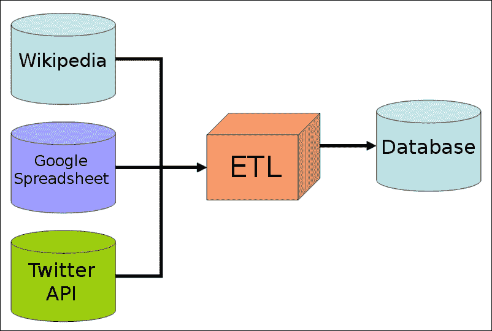
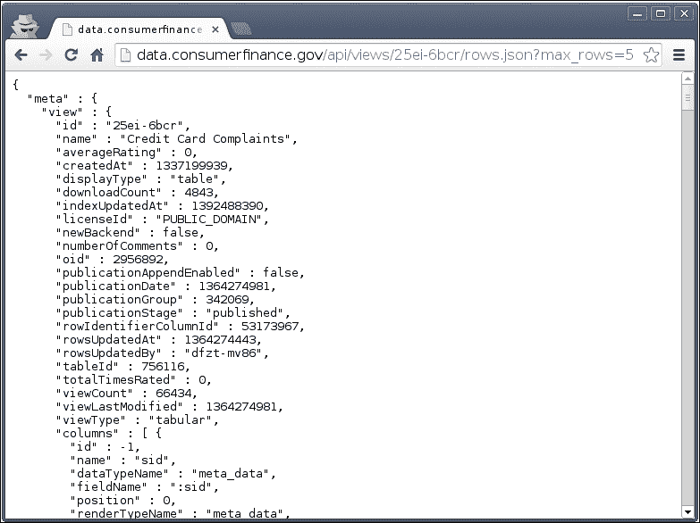
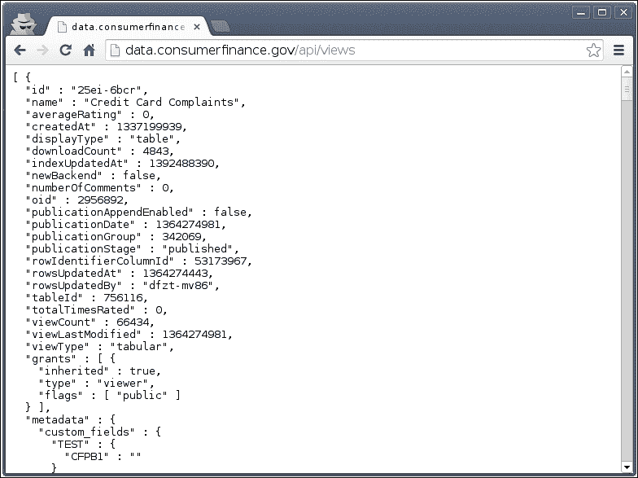
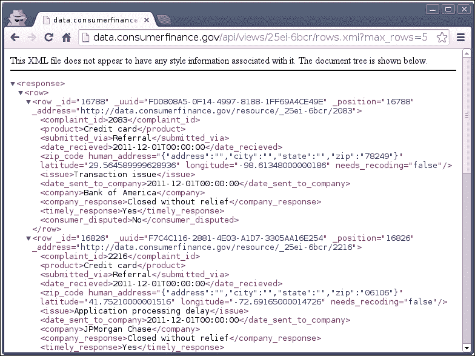
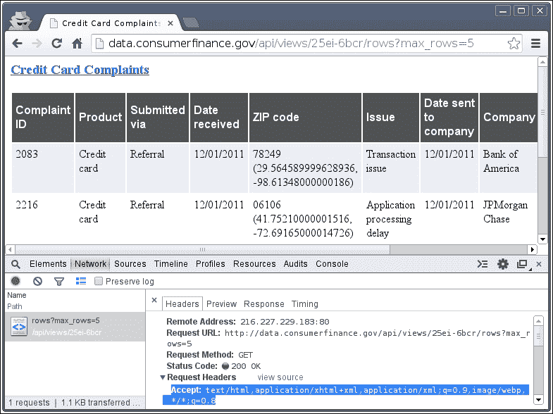
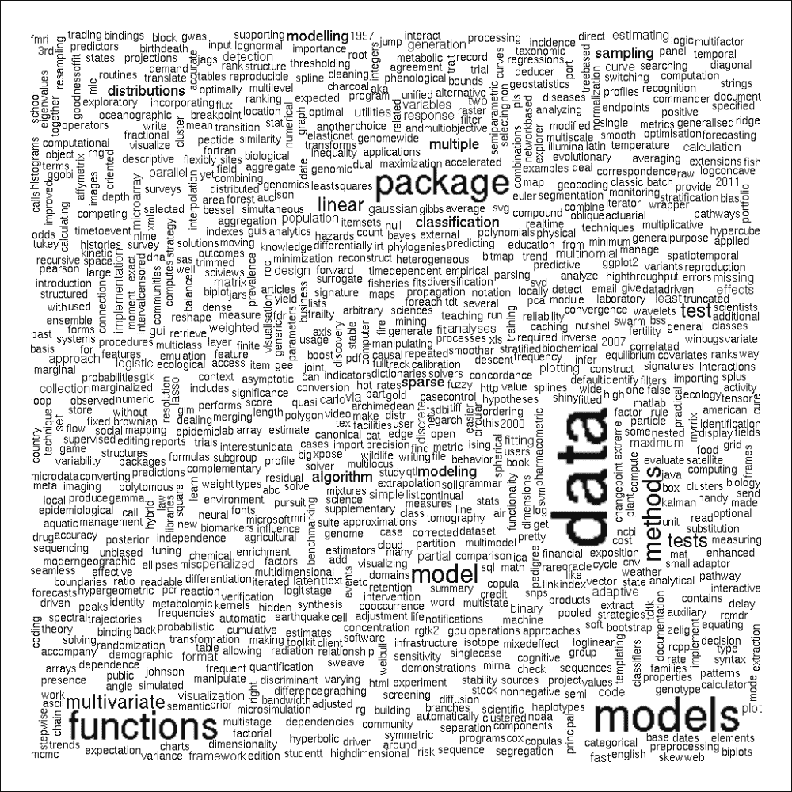
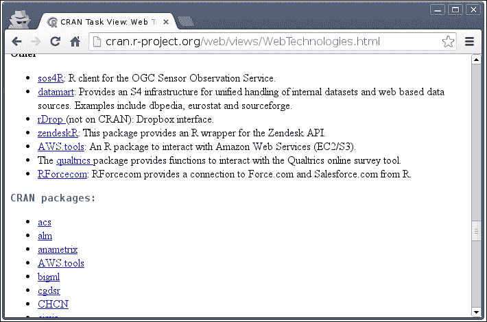
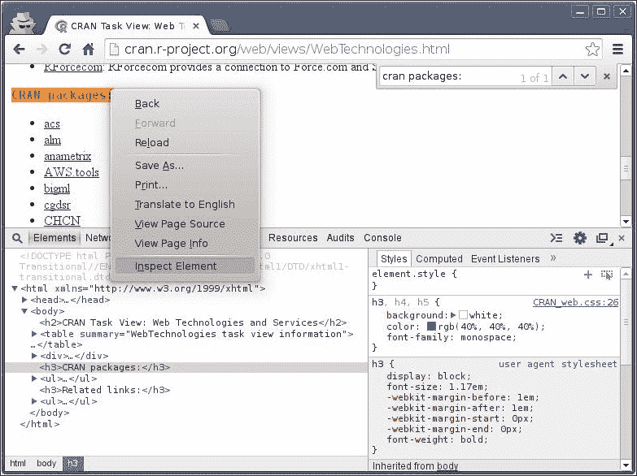

# 第二章：从网络获取数据

我们经常会遇到这样的情况，即我们想在项目中使用的数据尚未存储在我们的数据库或磁盘上，但可以在互联网上找到。在这种情况下，一个选择可能是让 IT 部门或我们公司的数据工程师扩展我们的数据仓库，以爬取、处理并将数据加载到我们的数据库中，如下面的图所示：



另一方面，如果我们没有*ETL*系统（用于提取、转换和加载数据）或者简单地无法等待几周时间让 IT 部门实现我们的请求，我们就只能自己动手了。这对于数据科学家来说很常见，因为大多数时候我们都在开发可以由软件开发人员后来转化为产品的原型。为此，在日常工作需要各种技能，包括以下我们将在本章中涵盖的主题：

+   从网络中以编程方式下载数据

+   处理 XML 和 JSON 格式

+   从原始 HTML 源中抓取和解析数据

+   与 API 交互

尽管被称为 21 世纪最性感的工作之一（来源：[`hbr.org/2012/10/data-scientist-the-sexiest-job-of-the-21st-century/`](https://hbr.org/2012/10/data-scientist-the-sexiest-job-of-the-21st-century/))，但大多数数据科学任务与数据分析无关。更糟糕的是，有时这份工作似乎很无聊，或者日常工作中只需要基本的 IT 技能，根本不需要机器学习。因此，我更愿意称这个角色为*数据黑客*而不是*数据科学家*，这也意味着我们经常不得不亲自动手。

例如，抓取和清洗数据无疑是分析过程中最不性感的一部分，但它是最重要的步骤之一；据说，大约 80%的数据分析时间都花在数据清洗上。在垃圾数据上运行最先进的机器学习算法是没有意义的，所以请确保花时间从你的数据源中获取有用且整洁的数据。

### 注意

本章还将依赖于广泛使用互联网浏览器调试工具和一些 R 包。这些包括 Chrome 的`DevTools`或 Firefox 中的`FireBug`。尽管使用这些工具的步骤将非常直接，并且也会在屏幕截图上展示，但掌握这些工具绝对值得，因此我建议如果你对从在线来源获取数据感兴趣，可以查看一些关于这些工具的教程。一些起点列在书末附录的*参考文献*部分。

要快速了解从网络抓取数据的相关 R 包以及与 Web 服务交互的信息，请参阅[`cran.r-project.org/web/views/WebTechnologies.html`](http://cran.r-project.org/web/views/WebTechnologies.html)上的*Web 技术和服务 CRAN 任务视图*。

# 从互联网加载数据集

最明显的任务是从网络下载数据集，并通过两个手动步骤将其加载到我们的 R 会话中：

1.  将数据集保存到磁盘。

1.  使用标准函数，如 `read.table` 或例如 `foreign::read.spss`，来读取 `sav` 文件。

但我们通常可以通过跳过第一步并直接从 URL 加载平面文本数据文件来节省一些时间。以下示例从 [`opengeocode.org`](http://opengeocode.org) 的 **美洲开放地理编码**（**AOG**）数据库中获取一个逗号分隔的文件，该数据库包含世界各国的政府、国家统计数据、地质信息和邮政网站：

```py
> str(read.csv('http://opengeocode.org/download/CCurls.txt'))
'data.frame':  249 obs. of  5 variables:
 $ ISO.3166.1.A2                  : Factor w/ 248 levels "AD" ...
 $ Government.URL                 : Factor w/ 232 levels ""  ...
 $ National.Statistics.Census..URL: Factor w/ 213 levels ""  ...
 $ Geological.Information.URL     : Factor w/ 116 levels ""  ...
 $ Post.Office.URL                : Factor w/ 156 levels ""  ...

```

在此示例中，我们向 `read.table` 的 `file` 参数传递了一个超链接，这实际上在处理之前下载了文本文件。`read.table` 在后台使用的 `url` 函数支持 HTTP 和 FTP 协议，并可以处理代理，但它有自己的限制。例如，`url` 除了在 Windows 上的一些例外情况外，不支持 **安全超文本传输协议**（**HTTPS**），这对于访问处理敏感数据的 Web 服务通常是必需的。

### 注意

HTTPS 不是与 HTTP 并列的独立协议，而是通过加密的 SSL/TLS 连接在 HTTP 之上。虽然 HTTP 由于客户端和服务器之间传输的未加密数据包被认为是不安全的，但 HTTPS 不允许第三方通过签名和受信任的证书发现敏感信息。

在这种情况下，安装并使用 `RCurl` 包是明智的，曾经这也是唯一合理的选项，该包是 R 的 curl 客户端接口：[`curl.haxx.se`](http://curl.haxx.se)。Curl 支持广泛的协议和 URI 方案，并处理 cookies、身份验证、重定向、超时等。

例如，让我们检查美国政府的开放数据目录 [`catalog.data.gov/dataset`](http://catalog.data.gov/dataset)。尽管可以不使用 SSL 访问一般网站，但大多数生成的下载 URL 都遵循 HTTPS URI 方案。在以下示例中，我们将从消费者金融保护局获取消费者投诉数据库的 **逗号分隔值**（**CSV**）文件，该数据库可通过 [`catalog.data.gov/dataset/consumer-complaint-database`](http://catalog.data.gov/dataset/consumer-complaint-database) 访问。

### 注意

此 CSV 文件包含自 2011 年以来关于金融产品和服务的约 25 万条投诉的元数据。请注意，该文件大小约为 35-40 兆字节，因此下载可能需要一些时间，你可能不希望在移动设备或有限互联网环境下重现以下示例。如果 `getURL` 函数因证书错误而失败（这可能在 Windows 上发生），请通过 `options(RCurlOptions = list(cainfo = system.file("CurlSSL", "cacert.pem", package = "RCurl")))` 手动提供证书路径，或者尝试由 Jeroen Ooms 或 Hadley Wickham（`RCurl` 前端）最近发布的 `curl` 软件包——详情见后。

让我们查看从 R 中直接获取和加载 CSV 文件后，按产品类型分布的这些投诉情况：

```py
> library(RCurl)
Loading required package: bitops
> url <- 'https://data.consumerfinance.gov/api/views/x94z-ydhh/rows.csv?accessType=DOWNLOAD'
> df  <- read.csv(text = getURL(url))
> str(df)
'data.frame':  236251 obs. of  14 variables:
 $ Complaint.ID        : int  851391 851793 ...
 $ Product             : Factor w/ 8 levels ...
 $ Sub.product         : Factor w/ 28 levels ...
 $ Issue               : Factor w/ 71 levels "Account opening ...
 $ Sub.issue           : Factor w/ 48 levels "Account status" ...
 $ State               : Factor w/ 63 levels "","AA","AE",,..
 $ ZIP.code            : int  14220 64119 ...
 $ Submitted.via       : Factor w/ 6 levels "Email","Fax" ...
 $ Date.received       : Factor w/ 897 levels  ...
 $ Date.sent.to.company: Factor w/ 847 levels "","01/01/2013" ...
 $ Company             : Factor w/ 1914 levels ...
 $ Company.response    : Factor w/ 8 levels "Closed" ...
 $ Timely.response.    : Factor w/ 2 levels "No","Yes" ...
 $ Consumer.disputed.  : Factor w/ 3 levels "","No","Yes" ...
> sort(table(df$Product))

 Money transfers         Consumer loan              Student loan 
 965                  6564                      7400 
 Debt collection      Credit reporting   Bank account or service 
 24907                 26119                     30744 
 Credit card              Mortgage 
 34848                104704

```

虽然知道大多数投诉是关于抵押贷款的很好，但这里的重点是使用 curl 下载具有 HTTPS URI 的 CSV 文件，然后将内容传递给 `read.csv` 函数（或我们在上一章中讨论的任何其他解析器）作为文本。

### 注意

除了 `GET` 请求外，您还可以通过使用 `RCurl` 软件包中的 `postForm` 函数或 `httpDELETE`、`httpPUT` 或 `httpHEAD` 函数，轻松通过 `POST`、`DELETE` 或 `PUT` 请求与 RESTful API 端点进行交互——有关 `httr` 软件包的详细信息将在后面介绍。

Curl 还可以帮助从需要授权的安全站点下载数据。这样做最简单的方法是在浏览器中登录主页，将 cookie 保存到文本文件中，然后将该路径传递给 `getCurlHandle` 中的 `cookiefile`。您还可以在其他选项中指定 `useragent`。有关更多详细信息以及最重要的 RCurl 功能的总体（且非常有用）概述，请参阅 [`www.omegahat.org/RCurl/RCurlJSS.pdf`](http://www.omegahat.org/RCurl/RCurlJSS.pdf)。

尽管 curl 功能非常强大，但其语法和众多选项以及技术细节可能对没有良好 IT 背景的人来说过于复杂。`httr` 软件包是 `RCurl` 的简化包装，提供了一些合理的默认值和更简单的配置选项，用于常见操作和日常行动。

例如，cookies 通过在所有对同一网站的请求中共享相同的连接来自动处理；错误处理得到了显著改善，这意味着如果出现问题，调试将更加容易；该软件包包含各种辅助函数，例如设置头部信息、使用代理以及轻松发出 `GET`、`POST`、`PUT`、`DELETE` 和其他方法。更重要的是，它还以更加用户友好的方式处理身份验证——包括 OAuth 支持。

### 注意

OAuth 是一种通过中间服务提供商进行授权的开放标准。这简单意味着用户不必共享实际凭证，而是可以委托访问服务提供商存储的一些信息。例如，可以授权 Google 与第三方共享真实姓名、电子邮件地址等信息，而无需披露任何其他敏感信息或密码。最普遍地，OAuth 用于各种 Web 服务和 API 的无密码登录。有关更多信息，请参阅第十四章，*分析 R 社区*，其中我们将使用 OAuth 与 Twitter 授权 R 会话以获取数据。

但如果数据无法以 CSV 文件的形式下载怎么办？

# 其他流行的在线数据格式

结构化数据通常以 XML 或 JSON 格式在网络上可用。这两种格式之所以如此受欢迎，是因为它们都是可读的，从程序的角度来看易于处理，并且可以管理任何类型的分层数据结构，而不仅仅是简单的表格设计，就像 CSV 文件那样。

### 注意

JSON 最初来源于 *JavaScript 对象表示法*，最近已成为最受欢迎、最常用的数据交换格式标准之一。JSON 被认为是具有属性值对的 XML 的低开销替代品，尽管它也支持多种对象类型，如数字、字符串、布尔值、有序列表和关联数组。JSON 在 Web 应用程序、服务和 API 中得到了广泛的使用。

当然，R 也支持以 JSON 格式加载数据（以及保存数据）。让我们通过从上一个示例中通过 Socrata API 获取一些数据来演示这一点（关于这一点，本章的 *与数据源 API 交互的 R 包* 部分将进行更多介绍），该 API 由消费者金融保护局提供。API 的完整文档可在 [`www.consumerfinance.gov/complaintdatabase/technical-documentation`](http://www.consumerfinance.gov/complaintdatabase/technical-documentation) 获取。

API 的端点是 URL，我们可以在这里查询背景数据库而无需认证，即 [`data.consumerfinance.gov/api/views`](http://data.consumerfinance.gov/api/views)。为了获得数据的结构概览，以下是在浏览器中打开的返回的 JSON 列表：



由于 JSON 非常易于阅读，在解析之前手动浏览其结构通常非常有帮助。现在让我们使用 `rjson` 包将这个树形列表加载到 R 中：

```py
> library(rjson)
> u <- 'http://data.consumerfinance.gov/api/views'
> fromJSON(file = u)
[[1]]
[[1]]$id
[1] "25ei-6bcr"

[[1]]$name
[1] "Credit Card Complaints"

[[1]]$averageRating
[1] 0
…

```

嗯，这似乎与我们之前在逗号分隔值文件中看到的数据不同！经过仔细查看文档，我们可以清楚地看到 API 的端点返回的是可用视图的元数据，而不是我们在 CSV 文件中看到的原始表格数据。所以，现在让我们通过在浏览器中打开相关 URL 来查看 ID 为 `25ei-6bcr` 的视图的前五行：



结果的 JSON 列表结构确实发生了变化。现在让我们将这个分层列表读入 R：

```py
> res <- fromJSON(file = paste0(u,'/25ei-6bcr/rows.json?max_rows=5'))
> names(res)
[1] "meta" "data"

```

我们成功地获取了数据以及关于视图、列等的进一步元信息，这不是我们目前感兴趣的东西。由于 `fromJSON` 返回了一个 `list` 对象，我们可以简单地删除元数据，并从现在开始处理 `data` 行：

```py
> res <- res$data
> class(res)
[1] "list"

```

这仍然是一个 `list`，我们通常希望将其转换为 `data.frame`。所以，我们有包含五个元素的 `list`，每个元素包含 19 个嵌套子元素。请注意，其中之一，第 13 个子元素，又是一个包含 5-5 向量的 `list`。这意味着将树形列表转换为表格格式并不简单，尤其是当我们意识到其中一个向量以未处理的 JSON 格式包含多个值时。所以，为了简单起见，以及作为概念验证演示，现在让我们简单地丢弃与位置相关的值，并将所有其他值转换为 `data.frame`：

```py
> df <- as.data.frame(t(sapply(res, function(x) unlist(x[-13]))))
> str(df)
'data.frame':  5 obs. of  18 variables:
 $ V1 : Factor w/ 5 levels "16756","16760",..: 3 5 ...
 $ V2 : Factor w/ 5 levels "F10882C0-23FC-4064-979C-07290645E64B" ...
 $ V3 : Factor w/ 5 levels "16756","16760",..: 3 5 ...
 $ V4 : Factor w/ 1 level "1364270708": 1 1 ...
 $ V5 : Factor w/ 1 level "403250": 1 1 ...
 $ V6 : Factor w/ 5 levels "1364274327","1364274358",..: 5 4 ...
 $ V7 : Factor w/ 1 level "546411": 1 1 ...
 $ V8 : Factor w/ 1 level "{\n}": 1 1 ...
 $ V9 : Factor w/ 5 levels "2083","2216",..: 1 2 ...
 $ V10: Factor w/ 1 level "Credit card": 1 1 ...
 $ V11: Factor w/ 2 levels "Referral","Web": 1 1 ...
 $ V12: Factor w/ 1 level "2011-12-01T00:00:00": 1 1 ...
 $ V13: Factor w/ 5 levels "Application processing delay",..: 5 1 ...
 $ V14: Factor w/ 3 levels "2011-12-01T00:00:00",..: 1 1 ...
 $ V15: Factor w/ 5 levels "Amex","Bank of America",..: 2 5 ...
 $ V16: Factor w/ 1 level "Closed without relief": 1 1 ...
 $ V17: Factor w/ 1 level "Yes": 1 1 ...
 $ V18: Factor w/ 2 levels "No","Yes": 1 1 ...

```

因此，我们应用了一个简单的函数，从列表的每个元素中删除位置信息（通过删除每个 *x* 的第 13 个元素），自动简化为 `matrix`（通过使用 `sapply` 而不是 `lapply` 来迭代列表中的每个元素），然后通过 `t` 进行转置，最后将结果对象强制转换为 `data.frame`。

嗯，我们也可以使用一些辅助函数来代替手动调整所有列表元素，就像之前那样。`plyr` 包（请参阅第三章过滤和汇总数据，*过滤和汇总数据*和第四章重构数据，*重构数据*）包含一些非常实用的函数来分割和组合数据：

```py
> library(plyr)
> df <- ldply(res, function(x) unlist(x[-13]))

```

现在看起来更熟悉了，尽管我们缺少变量名，所有值都被转换成了字符向量或因子——甚至存储为 UNIX 时间戳的日期也是如此。我们可以借助提供的元数据（`res$meta`）轻松地修复这些问题：例如，让我们通过提取（通过 `[` 操作符）所有列（除了被删除的 13th 个位置数据）的名称字段来设置变量名：

```py
> names(df) <- sapply(res$meta$view$columns, `[`, 'name')[-13]

```

可以借助提供的元数据来识别对象类别。例如，`renderTypeName` 字段是一个很好的起点来检查，使用 `as.numeric` 对数字进行转换，以及使用 `as.POSIXct` 对所有 `calendar_date` 字段进行转换，可以解决前面的大部分问题。

嗯，你有没有听说过大约 80% 的数据分析时间都花在了数据准备上？

解析和重构 JSON 和 XML 到`data.frame`可能需要很长时间，尤其是在你主要处理层次列表时。`jsonlite`包试图通过将 R 对象转换为传统的 JSON 数据结构以及相反的操作来克服这个问题，而不是进行原始转换。这意味着从实际的角度来看，如果可能的话，`jsonlite::fromJSON`将产生`data.frame`而不是原始列表，这使得数据交换格式更加无缝。不幸的是，我们并不总能将列表转换为表格格式；在这种情况下，可以通过例如`rlist`包来加速列表转换。请参阅第十四章，*分析 R 社区*中关于列表操作的更多细节。

### 注意

**可扩展标记语言** (**XML**)最初于 1996 年由万维网联盟开发，用于以人类可读和机器可读的格式存储文档。这种流行的语法被用于例如 Microsoft Office Open XML 和 Open/LibreOffice OpenDocument 文件格式、RSS 源和各种配置文件中。由于该格式也高度用于在互联网上交换数据，数据通常以 XML 作为唯一选项提供——特别是对于一些较旧的 API。

让我们看看我们如何处理除了 JSON 之外另一种流行的在线数据交换格式。XML API 可以以类似的方式使用，但我们必须在端点 URL 中定义所需的输出格式：[`data.consumerfinance.gov/api/views.xml`](http://data.consumerfinance.gov/api/views.xml)，正如你可以在下面的屏幕截图中所看到的那样：



看起来 API 的 XML 输出与我们在 JSON 格式中看到的不同，它仅仅包括我们感兴趣的行。这样，我们就可以简单地解析 XML 文档，从响应中提取行，然后将它们转换为`data.frame`：

```py
> library(XML)
> doc <- xmlParse(paste0(u, '/25ei-6bcr/rows.xml?max_rows=5'))
> df  <- xmlToDataFrame(nodes = getNodeSet(doc,"//response/row/row"))
> str(df)
'data.frame':  5 obs. of  11 variables:
 $ complaint_id        : Factor w/ 5 levels "2083","2216",..: 1 2 ...
 $ product             : Factor w/ 1 level "Credit card": 1 1 ...
 $ submitted_via       : Factor w/ 2 levels "Referral","Web": 1 1 ...
 $ date_recieved       : Factor w/ 1 level "2011-12-01T00:00:00" ...
 $ zip_code            : Factor w/ 1 level "": 1 1 ...
 $ issue               : Factor w/ 5 levels  ...
 $ date_sent_to_company: Factor w/ 3 levels "2011-12-01T00:00:00" ...
 $ company             : Factor w/ 5 levels "Amex" ....
 $ company_response    : Factor w/ 1 level "Closed without relief"...
 $ timely_response     : Factor w/ 1 level "Yes": 1 1 ...
 $ consumer_disputed   : Factor w/ 2 levels "No","Yes": 1 1 ...

```

尽管我们可以在传递给`xmlToDataFrame`的`colClasses`参数中手动设置变量的所需类别，就像在`read.tables`中一样，我们也可以通过一个快速的`helper`函数来修复这个问题：

```py
> is.number <- function(x)
+     all(!is.na(suppressWarnings(as.numeric(as.character(x)))))
> for (n in names(df))
+     if (is.number(df[, n]))
+         df[, n] <- as.numeric(as.character(df[, n]))

```

因此，我们尝试猜测一列是否只包含数字，并在我们的辅助函数返回`TRUE`时将这些数字转换为`numeric`类型。请注意，我们在将`factor`转换为数字之前，首先将其转换为`character`类型，因为直接从`factor`转换为`numeric`会返回`factor`的顺序而不是实际值。有人也可能尝试使用`type.convert`函数解决这个问题，该函数是`read.table`默认使用的。

### 注意

要测试类似的 API 和 JSON 或 XML 资源，你可能对检查 Twitter、GitHub 或其他在线服务提供商的 API 感兴趣。另一方面，还有一个基于 R 的开源服务，可以从任何 R 代码返回 XML、JSON 或 CSV 文件。请参阅[`www.opencpu.org`](http://www.opencpu.org)获取更多详细信息。

因此，现在我们可以处理来自各种可下载数据格式的结构化数据，但还有一些其他数据源选项需要掌握，我保证继续阅读是值得的。

# 从 HTML 表格中读取数据

根据万维网上的传统文档格式，大多数文本和数据都是以 HTML 页面的形式提供的。我们经常可以在 HTML 表格中找到有趣的信息，例如，很容易将数据复制粘贴到 Excel 电子表格中，将其保存到磁盘上，然后加载到 R 中。但这很耗时，很无聊，而且可以自动化。

这些 HTML 表格可以很容易地通过上述客户投诉数据库 API 生成。如果我们没有设置之前使用的 XML 或 JSON 所需的输出格式，那么浏览器将返回一个 HTML 表格，正如你可以在以下屏幕截图中所看到的那样：



嗯，在 R 控制台中，这要复杂一些，因为当使用 curl 时，浏览器会发送一些非默认的 HTTP 头信息，所以先前的 URL 会简单地返回一个 JSON 列表。要获取 HTML，让服务器知道我们期望 HTML 输出。为此，只需设置查询的适当 HTTP 头信息：

```py
> doc <- getURL(paste0(u, '/25ei-6bcr/rows?max_rows=5'),
+   httpheader = c(Accept = "text/html"))

```

`XML`包提供了一个非常简单的方法，通过`readHTMLTable`函数从文档或特定节点中解析所有 HTML 表格，该函数默认返回`data.frames`的`list`：

```py
> res <- readHTMLTable(doc)

```

要获取页面上的第一个表格，我们可以在之后过滤`res`或者将`which`参数传递给`readHTMLTable`。以下两个 R 表达式具有完全相同的结果：

```py
> df <- res[[1]]
> df <- readHTMLTable(doc, which = 1)

```

## 从静态 Web 页面中读取表格数据

好吧，到目前为止，我们已经看到了同一主题的许多变体，但如果我们没有在任何流行的数据格式中找到可下载的数据集怎么办？例如，有人可能对 CRAN 上托管的可用 R 包感兴趣，其列表可在[`cran.r-project.org/web/packages/available_packages_by_name.html`](http://cran.r-project.org/web/packages/available_packages_by_name.html)找到。我们如何抓取这些数据？不需要调用`RCurl`或指定自定义头信息，更不用说先下载文件了；只需将 URL 传递给`readHTMLTable`即可：

```py
> res <- readHTMLTable('http://cran.r-project.org/Web/packages/available_packages_by_name.html')

```

因此，`readHTMLTable`可以直接获取 HTML 页面，然后将其中的所有 HTML 表格提取到 R 的`data.frame`对象中，并返回这些表格的`list`。在先前的例子中，我们得到了一个只包含所有软件包名称和描述列的`data.frame`的`list`。

嗯，使用`str`函数，这么多的文本信息实际上并不具有很高的信息量。为了快速展示处理和可视化这类原始数据，并展示 CRAN 上可用的众多 R 包功能，现在我们可以使用`wordcloud`和`tm`包的一些巧妙函数来创建包描述的词云：

```py
> library(wordcloud)
Loading required package: Rcpp
Loading required package: RColorBrewer
> wordcloud(res[[1]][, 2])
Loading required package: tm

```

这个简短的命令产生了以下屏幕截图，显示了在 R 包描述中找到的最频繁的单词。单词的位置没有特殊意义，但字体越大，频率越高。请参阅屏幕截图后的技术描述：



因此，我们简单地将第一个`list`元素的第二列中的所有字符串传递给`wordcloud`函数，该函数自动在文本上运行`tm`包的一些文本挖掘脚本。你可以在第七章*非结构化数据*中找到更多关于这个主题的详细信息。然后，它根据包描述中出现的次数以相对大小渲染单词。这似乎表明 R 包确实主要针对构建模型和在数据上应用多元测试。

# 从其他在线来源抓取数据

虽然`readHTMLTable`函数非常有用，但有时数据不是以表格形式结构化，而是仅作为 HTML 列表提供。让我们通过检查在相关 CRAN 任务视图[`cran.r-project.org/web/views/WebTechnologies.html`](http://cran.r-project.org/web/views/WebTechnologies.html)中列出的所有 R 包来演示这种数据格式，就像你在下面的屏幕截图中所看到的那样：



因此，我们看到一个包含包名称的 HTML 列表，以及指向 CRAN 或在某些情况下指向 GitHub 仓库的 URL。为了继续操作，我们首先需要熟悉一下 HTML 源代码，看看我们如何解析它们。你可以很容易地在 Chrome 或 Firefox 中做到这一点：只需在列表顶部的**CRAN**包标题上右键单击，然后选择**检查元素**，就像你在下面的屏幕截图中所看到的那样：



因此，我们在包含“CRAN 包”字符串的`h3`（三级标题）标签之后，有一个`ul`（无序列表）HTML 标签中有了相关 R 包的列表。

简而言之：

+   我们必须解析这个 HTML 文件

+   寻找包含搜索词的第三级标题

+   从随后的无序列表 HTML 中获取所有列表元素

这可以通过例如 XML 路径语言来完成，它具有特殊的语法，可以通过查询在 XML/HTML 文档中选择节点。

### 注意

更多细节和 R 驱动的示例，请参阅 Deborah Nolan 和 Duncan Temple Lang 所著的《使用 R 进行数据科学中的 XML 和 Web 技术》一书的第四章，*XPath, XPointer, and XInclude*，Springer 的 Use R!系列。请参阅书末的*附录*中的更多参考资料。

XPath 一开始看起来可能相当丑陋和复杂。例如，前面的列表可以用以下方式描述：

```py
//h3[text()='CRAN packages:']/following-sibling::ul[1]/li

```

让我详细说明一下：

1.  我们正在寻找一个文本为`CRAN packages`的`h3`标签，因此我们在整个文档中搜索具有这些属性的特定节点。

1.  然后`following-siblings`表达式代表与所选`h3`标签处于同一层次级别的所有后续节点。

1.  过滤以找到仅包含`ul` HTML 标签。

1.  因为我们有多个这样的标签，所以我们只选择括号中索引为`(1)`的后续兄弟中的第一个。

1.  然后我们简单地选择那个内部的全部`li`标签（列表元素）。

让我们在 R 中试试：

```py
> page <- htmlParse(file = 
+   'http://cran.r-project.org/Web/views/WebTechnologies.html')
> res  <- unlist(xpathApply(doc = page, path =
+   "//h3[text()='CRAN packages:']/following-sibling::ul[1]/li",
+   fun  = xmlValue))

```

我们有相关 118 个 R 包的字符向量：

```py
> str(res)
 chr [1:118] "acs" "alm" "anametrix" "AWS.tools" "bigml" ...

```

XPath 在选择和搜索 HTML 文档中的节点方面非常强大，`xpathApply`也是如此。后者是`libxml`中大多数 XPath 功能的 R 包装器，这使得整个过程相当快速和高效。有人可能会更愿意使用`xpathSApply`，它试图简化返回的元素列表，就像`sapply`与`lapply`函数相比那样。因此，我们也可以更新之前的代码以保存`unlist`调用：

```py
> res <- xpathSApply(page, path =
+ "//h3[text()='CRAN packages:']/following-sibling::ul[1]/li", 
+   fun  = xmlValue)

```

仔细的读者一定已经注意到，返回的列表是一个简单的字符向量，而原始 HTML 列表还包括上述包的 URL。这些 URL 在哪里，为什么消失了？

我们可以责怪`xmlValue`导致这个结果，我们调用它而不是默认的`NULL`作为在`xpathSApply`调用中从原始文档中提取节点时的评估函数。这个函数简单地提取每个叶节点的原始文本内容，没有任何子节点，这解释了这种行为。如果我们更感兴趣的是包的 URL 呢？

在没有指定 fun 的情况下调用`xpathSapply`会返回所有原始子节点，这对我们没有直接帮助，我们也不应该尝试在这些节点上应用正则表达式。`xmlValue`的帮助页面可以指引我们一些在类似任务中非常有用的类似函数。在这里，我们肯定想使用`xmlAttrs`：

```py
> xpathSApply(page,
+   "//h3[text()='CRAN packages:']/following-sibling::ul[1]/li/a",
+   xmlAttrs, 'href')

```

请注意，这里使用了更新的路径，现在我们选择了所有的`a`标签而不是之前的`li`父标签。而且，现在我们调用`xmlAttrs`而不是之前引入的`xmlValue`，并添加了`'href'`额外参数。这简单地提取了所有相关`a`节点的`href`参数。

使用这些原语，您将能够从在线来源获取任何公开可用的数据，尽管有时实现可能相当复杂。

### 注意

另一方面，请务必始终查阅所有潜在数据源的相关条款和条件以及其他法律文件，因为获取数据通常被版权所有者禁止。

除了法律问题之外，从服务提供商的技术角度考虑获取和爬取数据也是明智的。如果你在事先没有咨询管理员的情况下开始向服务器发送大量查询，这种行为可能会被视为网络攻击，或者可能导致服务器上出现不希望的压力。为了简化问题，始终在查询之间使用合理的延迟。这应该是例如，在查询之间至少有 2 秒的暂停，但最好检查网站`robot.txt`中设置的`Crawl-delay`指令，如果有的话，可以在根路径中找到。此文件还包含其他指令，如果允许或限制爬取。大多数数据提供者网站也提供有关数据爬取的技术文档；请务必搜索速率限制和节流。

有时候我们只是简单地幸运，因为其他人已经编写了棘手的 XPath 选择器或其他接口，因此我们可以借助本机 R 包从 Web 服务和主页加载数据。

# R 包用于与数据源 API 交互

虽然我们可以读取 HTML 表格、CSV 文件和 JSON 以及 XML 数据，甚至解析原始 HTML 文档以将其中一些部分存储在数据集中，但在没有其他选择之前，花费太多时间开发定制工具是没有意义的。首先，始终从 Web 技术和服务 CRAN 任务视图快速浏览开始；在动手使用自定义 XPath 选择器和 JSON 列表魔法之前，也请在 R 博客、StackOverflow 和 GitHub 上搜索任何可能的解决方案。

## Socrata 开放数据 API

让我们通过搜索消费者金融保护局的开放数据应用程序程序接口 Socrata 来为之前的示例做这件事。是的，为此有一个包：

```py
> library(RSocrata)
Loading required package: httr
Loading required package: RJSONIO

Attaching package: 'RJSONIO'

The following objects are masked from 'package:rjson':

 fromJSON, toJSON

```

实际上，`RSocrata`包使用与我们之前相同的 JSON 源（或 CSV 文件）。请注意警告信息，它表示`RSocrata`依赖于另一个 JSON 解析 R 包，而不是我们使用的包，因此一些函数名称存在冲突。在自动加载`RJSONIO`包之前，可能明智的做法是`detach('package:rjson')`。

使用`RSocrata`通过给定的 URL 加载客户投诉数据库相当简单：

```py
> df <- read.socrata(paste0(u, '/25ei-6bcr'))
> str(df)
'data.frame':  18894 obs. of  11 variables:
 $ Complaint.ID        : int  2240 2243 2260 2254 2259 2261 ...
 $ Product             : chr  "Credit card" "Credit card" ...
 $ Submitted.via       : chr  "Web" "Referral" "Referral" ...
 $ Date.received       : chr  "12/01/2011" "12/01/2011" ...
 $ ZIP.code            : chr  ...
 $ Issue               : chr  ...
 $ Date.sent.to.company: POSIXlt, format: "2011-12-19" ...
 $ Company             : chr  "Citibank" "HSBC" ...
 $ Company.response    : chr  "Closed without relief" ...
 $ Timely.response.    : chr  "Yes" "Yes" "No" "Yes" ...
 $ Consumer.disputed.  : chr  "No" "No" "" "No" ...

```

我们得到了数字的`numeric`值，日期也被自动处理为`POSIXlt`！

类似地，Web 技术和服务 CRAN 任务视图包含超过一百个 R 包，用于与自然科学（如生态学、遗传学、化学、天气、金融、经济学和营销）中的网络数据源进行交互，但我们还可以找到用于获取文本、参考文献资源、网络分析、新闻以及地图和社交媒体数据的 R 包，除了其他一些主题。由于页面限制，这里我们只关注最常用的包。

## 金融 API

Yahoo! 和 Google Finance 是所有在该行业工作的人的标准免费数据源。例如，使用 `quantmod` 包和上述服务提供商，获取股票、金属或外汇价格非常容易。例如，让我们看看 Agilent Technologies 的最新股票价格，其交易代码为 `A`：

```py
> library(quantmod)
Loading required package: Defaults
Loading required package: xts
Loading required package: zoo

Attaching package: 'zoo'

The following objects are masked from 'package:base':

 as.Date, as.Date.numeric

Loading required package: TTR
Version 0.4-0 included new data defaults. See ?getSymbols.
> tail(getSymbols('A', env = NULL))
 A.Open A.High A.Low A.Close A.Volume A.Adjusted
2014-05-09  55.26  55.63 54.81   55.39  1287900      55.39
2014-05-12  55.58  56.62 55.47   56.41  2042100      56.41
2014-05-13  56.63  56.98 56.40   56.83  1465500      56.83
2014-05-14  56.78  56.79 55.70   55.85  2590900      55.85
2014-05-15  54.60  56.15 53.75   54.49  5740200      54.49
2014-05-16  54.39  55.13 53.92   55.03  2405800      55.03

```

默认情况下，`getSymbols` 将获取的结果分配给 `parent.frame`（通常是全局）环境，并以符号名称命名，而将 `NULL` 作为所需环境将简单地返回前面看到的 `xts` 时间序列对象。

可以轻松获取外汇汇率：

```py
> getFX("USD/EUR")
[1] "USDEUR"
> tail(USDEUR)
 USD.EUR
2014-05-13  0.7267
2014-05-14  0.7281
2014-05-15  0.7293
2014-05-16  0.7299
2014-05-17  0.7295
2014-05-18  0.7303

```

`getSymbols` 返回的字符串指的是数据保存在 `.GlobalEnv` 中的 R 变量。要查看所有可用的数据源，让我们查询相关的 S3 方法：

```py
> methods(getSymbols)
 [1] getSymbols.csv    getSymbols.FRED   getSymbols.google
 [4] getSymbols.mysql  getSymbols.MySQL  getSymbols.oanda 
 [7] getSymbols.rda    getSymbols.RData  getSymbols.SQLite
[10] getSymbols.yahoo

```

因此，除了某些离线数据源外，我们还可以查询 Google、Yahoo! 和 OANDA 获取最新的金融信息。要查看可用符号的完整列表，已加载的 `TTR` 包可能会有所帮助：

```py
> str(stockSymbols())
Fetching AMEX symbols...
Fetching NASDAQ symbols...
Fetching NYSE symbols...
'data.frame':  6557 obs. of  8 variables:
 $ Symbol   : chr  "AAMC" "AA-P" "AAU" "ACU" ...
 $ Name     : chr  "Altisource Asset Management Corp" ...
 $ LastSale : num  841 88.8 1.3 16.4 15.9 ...
 $ MarketCap: num  1.88e+09 0.00 8.39e+07 5.28e+07 2.45e+07 ...
 $ IPOyear  : int  NA NA NA 1988 NA NA NA NA NA NA ...
 $ Sector   : chr  "Finance" "Capital Goods" ...
 $ Industry : chr  "Real Estate" "Metal Fabrications" ...
 $ Exchange : chr  "AMEX" "AMEX" "AMEX" "AMEX" ...

```

### 注意

在 第十二章 *分析时间序列* 中找到更多关于如何处理和分析类似数据集的信息。

## 使用 Quandl 获取时间序列

Quandl 提供了通过自定义 API 从约 500 个数据源获取数百万类似时间序列数据的标准格式访问权限。在 R 中，`Quandl` 包提供了轻松访问全球各个行业中所有这些开放数据的途径。让我们以美国证券交易委员会发布的 Agilent Technologies 分红为例。要做到这一点，只需在 [`www.quandl.com`](http://www.quandl.com) 首页搜索“Agilent Technologies”，并将搜索结果中所需数据的代码提供给 `Quandl` 函数：

```py
> library(Quandl)
> Quandl('SEC/DIV_A')
 Date Dividend
1 2013-12-27    0.132
2 2013-09-27    0.120
3 2013-06-28    0.120
4 2013-03-28    0.120
5 2012-12-27    0.100
6 2012-09-28    0.100
7 2012-06-29    0.100
8 2012-03-30    0.100
9 2006-11-01    2.057
Warning message:
In Quandl("SEC/DIV_A") :
 It would appear you aren't using an authentication token. Please visit http://www.quandl.com/help/r or your usage may be limited.

```

如您所见，没有有效的身份验证令牌，API 相对有限，该令牌可以在 `Quandl` 首页免费兑换。要设置您的令牌，只需将其传递给 `Quandl.auth` 函数。

此包还允许您：

+   通过时间过滤数据

+   在服务器端对数据进行一些转换——例如累积总和和一阶微分

+   对数据进行排序

+   定义返回对象的所需类别——例如 `ts`、`zoo` 和 `xts`

+   下载有关数据源的一些元信息

后者被保存为返回 R 对象的 `attributes`。例如，要查看查询数据集的频率，请调用：

```py
> attr(Quandl('SEC/DIV_A', meta = TRUE), 'meta')$frequency
[1] "quarterly"

```

## Google 文档和分析

您可能更感兴趣的是从 Google Docs 加载您自己的或自定义数据，为此 `RGoogleDocs` 包非常有帮助，并且可以在 [`www.omegahat.org/`](http://www.omegahat.org/) 网站主页上下载。它提供了对 Google 电子表格的认证访问，具有读写权限。

不幸的是，这个包相当过时，并使用了一些已弃用的 API 函数，因此您可能最好尝试一些较新的替代方案，例如最近发布的 `googlesheets` 包，它可以从 R 中管理 Google 电子表格（但不能管理其他文档）。

对于所有希望使用 R 分析页面访问或广告性能的人来说，也有类似的包可以与 Google Analytics 或 Google Adwords 交互。

## 在线搜索趋势

另一方面，我们通过交互 API 下载公共数据。Google 还在 [`www.google.com/publicdata/directory`](http://www.google.com/publicdata/directory) 提供了世界银行、国际货币基金组织、美国人口普查局等机构的公共数据访问权限，以及一些以搜索趋势形式存在的他们自己的内部数据 [`google.com/trends`](http://google.com/trends)。

使用 `GTrendsR` 包可以非常容易地查询后者，该包尚未在 CRAN 上提供，但我们可以至少练习如何从其他来源安装 R 包。`GTrendR` 代码仓库可以在 `BitBucket` 上找到，从那里使用 `devtools` 包安装它非常方便：

### 小贴士

为了确保您安装的 `GTrensR` 与以下使用的版本相同，您可以在 `install_bitbucket`（或 `install_github`）函数的 `ref` 参数中指定 `branch`、`commit` 或其他引用。请参阅本书末尾附录中的 *参考文献* 部分以获取提交哈希值。

```py
> library(devtools)
> install_bitbucket('GTrendsR', 'persican', quiet = TRUE)
Installing bitbucket repo(s) GTrendsR/master from persican
Downloading master.zip from https://bitbucket.org/persican/gtrendsr/get/master.zip
arguments 'minimized' and 'invisible' are for Windows only 

```

从 BitBucket 或 GitHub 安装 R 包就像提供代码仓库的名称和作者的用户名，然后允许 `devtools` 做剩下的工作：下载源代码并编译它们。

Windows 用户在从源代码编译包之前应安装 `Rtools`：[`cran.r-project.org/bin/windows/Rtools/`](http://cran.r-project.org/bin/windows/Rtools/)。我们还启用了静默模式，以抑制编译日志和无聊的细节。

在包安装完成后，我们可以以传统方式加载它：

```py
> library(GTrendsR)

```

首先，我们必须使用有效的 Google 用户名和密码进行身份验证，然后才能查询 Google Trends 数据库。我们的搜索词将是 "如何安装 R"：

### 小贴士

请确保您提供有效的用户名和密码；否则，以下查询将失败。

```py
> conn <- gconnect('some Google username', 'some Google password')
> df   <- gtrends(conn, query = 'how to install R')
> tail(df$trend)
 start        end how.to.install.r
601 2015-07-05 2015-07-11               86
602 2015-07-12 2015-07-18               70
603 2015-07-19 2015-07-25              100
604 2015-07-26 2015-08-01               75
605 2015-08-02 2015-08-08               73
606 2015-08-09 2015-08-15               94 

```

返回的数据集包括关于 R 安装相对搜索查询量的每周指标。数据显示，最高活动记录在七月中旬，而只有大约 75%的这些搜索查询是在下个月初触发的。所以 Google 不发布原始搜索查询统计数据，而是可以通过不同的搜索词和时间周期进行对比研究。

## 历史天气数据

同样，也有各种包为地球科学中的所有 R 用户提供访问数据源的方式。例如，`RNCEP`包可以从国家环境预测中心下载超过一百年的历史天气数据，分辨率为每六小时一次。`weatherData`包提供直接访问[`wunderground.com`](http://wunderground.com)。作为一个快速示例，让我们下载伦敦过去七天的每日平均温度：

```py
> library(weatherData)
> getWeatherForDate('London', start_date = Sys.Date()-7, end_date = Sys.Date())
Retrieving from: http://www.wunderground.com/history/airport/London/2014/5/12/CustomHistory.html?dayend=19&monthend=5&yearend=2014&req_city=NA&req_state=NA&req_statename=NA&format=1 
Checking Summarized Data Availability For London
Found 8 records for 2014-05-12 to 2014-05-19
Data is Available for the interval.
Will be fetching these Columns:
[1] "Date"              "Max_TemperatureC"  "Mean_TemperatureC"
[4] "Min_TemperatureC" 
 Date Max_TemperatureC Mean_TemperatureC Min_TemperatureC
1 2014-05-12               18                13                9
2 2014-05-13               16                12                8
3 2014-05-14               19                13                6
4 2014-05-15               21                14                8
5 2014-05-16               23                16                9
6 2014-05-17               23                17               11
7 2014-05-18               23                18               12
8 2014-05-19               24                19               13

```

请注意，前面输出中的不重要部分已被抑制，但这里发生的事情相当简单：包抓取了指定的 URL，顺便提一下，这是一个 CSV 文件，然后使用一些附加信息进行解析。将`opt_detailed`设置为`TRUE`也会返回日内数据，分辨率为 30 分钟。

## 其他在线数据源

当然，这个简短的章节不能提供查询所有可用在线数据源和 R 实现的概述，但请在创建自己的 R 爬虫脚本之前，咨询 Web 技术和服务 CRAN 任务视图、R 博客、StackOverflow 以及本书末尾的*参考文献*章节中的资源，以寻找任何现有的 R 包或辅助函数。

# 摘要

本章重点介绍了如何直接从网络中获取和处理数据，包括下载文件、处理 XML 和 JSON 格式、解析 HTML 表格、应用 XPath 选择器从 HTML 页面中提取数据以及与 RESTful API 交互的问题。

虽然本章中的一些示例可能看起来是对 Socrata API 的无效斗争，但结果证明`RSocrata`包提供了对所有这些数据的生产级访问。然而，请记住，你将面临一些没有现成 R 包的情况；因此，作为一名数据黑客，你将不得不亲手处理所有的 JSON、HTML 和 XML 源。

在下一章中，我们将发现如何使用重塑和重构数据的顶级、最常用方法来过滤和聚合已经获取和加载的数据。
