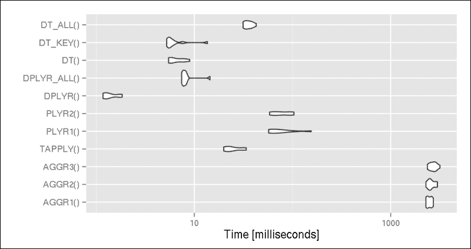

# 第三章. 过滤和汇总数据

在从平面文件或数据库（如我们在第一章中看到的）或通过某些 API 直接从网络（如第二章中所述）加载数据后，我们通常必须在实际数据分析之前对原始数据集进行聚合、转换或过滤。

在本章中，我们将重点关注如何：

+   在数据框中过滤行和列

+   汇总并聚合数据

+   除了基础 R 方法外，使用`dplyr`和`data.table`包提高此类任务的性能

# 删除不需要的数据

虽然不加载不需要的数据是最佳解决方案（见第一章中的*加载文本文件的子集*和*从数据库加载数据*部分），但我们通常必须在 R 中过滤原始数据集。这可以通过使用基础 R 的传统工具和函数，如`subset`，通过使用`which`和`[`或`[[`运算符（见以下代码）来完成，或者例如使用`sqldf`包的类似 SQL 的方法：

```py
> library(sqldf)
> sqldf("SELECT * FROM mtcars WHERE am=1 AND vs=1")
 mpg cyl  disp  hp drat    wt  qsec vs am gear carb
1 22.8   4 108.0  93 3.85 2.320 18.61  1  1    4    1
2 32.4   4  78.7  66 4.08 2.200 19.47  1  1    4    1
3 30.4   4  75.7  52 4.93 1.615 18.52  1  1    4    2
4 33.9   4  71.1  65 4.22 1.835 19.90  1  1    4    1
5 27.3   4  79.0  66 4.08 1.935 18.90  1  1    4    1
6 30.4   4  95.1 113 3.77 1.513 16.90  1  1    5    2
7 21.4   4 121.0 109 4.11 2.780 18.60  1  1    4    2

```

我相信所有有良好 SQL 背景并且刚刚接触 R 的读者都会欣赏这种过滤数据的不同方法，但我个人更喜欢以下类似、原生且更简洁的 R 版本：

```py
> subset(mtcars, am == 1 & vs == 1)
 mpg cyl  disp  hp drat    wt  qsec vs am gear carb
Datsun 710     22.8   4 108.0  93 3.85 2.320 18.61  1  1    4    1
Fiat 128       32.4   4  78.7  66 4.08 2.200 19.47  1  1    4    1
Honda Civic    30.4   4  75.7  52 4.93 1.615 18.52  1  1    4    2
Toyota Corolla 33.9   4  71.1  65 4.22 1.835 19.90  1  1    4    1
Fiat X1-9      27.3   4  79.0  66 4.08 1.935 18.90  1  1    4    1
Lotus Europa   30.4   4  95.1 113 3.77 1.513 16.90  1  1    5    2
Volvo 142E     21.4   4 121.0 109 4.11 2.780 18.60  1  1    4    2

```

请注意结果之间的细微差异。这归因于`sqldf`的`row.names`参数默认为`FALSE`，当然，可以通过覆盖它来获得完全相同的结果：

```py
> identical(
+     sqldf("SELECT * FROM mtcars WHERE am=1 AND vs=1",
+       row.names = TRUE),
+     subset(mtcars, am == 1 & vs == 1)
+     )
[1] TRUE

```

这些例子侧重于如何从`data.frame`中删除行，但如果我们还想删除一些列怎么办？

SQL 方法非常直接；只需在`SELECT`语句中指定所需的列，而不是使用`*`。另一方面，`subset`通过`select`参数也支持这种方法，它可以接受向量或 R 表达式，例如，描述一列范围的列：

```py
> subset(mtcars, am == 1 & vs == 1, select = hp:wt)
 hp drat    wt
Datsun 710      93 3.85 2.320
Fiat 128        66 4.08 2.200
Honda Civic     52 4.93 1.615
Toyota Corolla  65 4.22 1.835
Fiat X1-9       66 4.08 1.935
Lotus Europa   113 3.77 1.513
Volvo 142E     109 4.11 2.780

```

### 小贴士

通过`c`函数将未引用的列名作为向量传递，以按给定顺序选择任意列列表，或者使用-运算符排除指定的列，例如，`subset(mtcars, select = -c(hp, wt))`。

让我们更进一步，看看我们如何可以在一些较大的数据集上应用前面提到的过滤器，当我们面对`base`函数的性能问题时。

## 高效地删除不需要的数据

R 最适合可以实际物理内存中容纳的数据集，并且一些 R 包提供了对这么多数据的极快访问。

### 注意

一些基准测试（见本书末尾的*参考文献*部分）提供了比当前开源（例如 MySQL、PostgreSQL 和 Impala）和商业数据库（如 HP Vertica）提供的更有效的汇总 R 函数的实际例子。

一些相关的包已经在第一章，*你好，数据！*中提到，我们在那里对从`hflights`包中读取相对大量数据到 R 进行了基准测试。

让我们看看先前的示例在这个有 25 万行数据的集合上的表现：

```py
> library(hflights)
> system.time(sqldf("SELECT * FROM hflights WHERE Dest == 'BNA'", 
+   row.names = TRUE))
 user  system elapsed 
 1.487   0.000   1.493 
> system.time(subset(hflights, Dest == 'BNA'))
 user  system elapsed 
 0.132   0.000   0.131

```

`base::subset`函数似乎表现得很不错，但我们能否让它更快？嗯，`plyr`包的第二代，称为`dplyr`（相关细节在本章的*高性能辅助函数*部分和第四章，*重构数据*）以相当直观的方式提供了最常见数据库操作方法的极快 C++实现：

```py
> library(dplyr)
> system.time(filter(hflights, Dest == 'BNA'))
 user  system elapsed 
 0.021   0.000   0.022

```

此外，我们可以通过删除数据集的一些列来扩展这个解决方案，就像我们之前使用`subset`做的那样，尽管现在我们调用的是`select`函数而不是传递同名参数：

```py
> str(select(filter(hflights, Dest == 'BNA'), DepTime:ArrTime))
'data.frame':  3481 obs. of  2 variables:
 $ DepTime: int  1419 1232 1813 900 716 1357 2000 1142 811 1341 ...
 $ ArrTime: int  1553 1402 1948 1032 845 1529 2132 1317 945 1519 ...

```

因此，这就像调用`filter`函数而不是`subset`，我们得到的速度比眨眼还快！`dplyr`包可以与传统的`data.frame`或`data.table`对象一起工作，或者可以直接与最广泛使用的数据库引擎进行交互。请注意，`dplyr`中不保留行名，所以如果您需要它们，在将它们传递给`dplyr`或直接传递给`data.table`之前，值得将名称复制到显式变量中，如下所示：

```py
> mtcars$rownames <- rownames(mtcars)
> select(filter(mtcars, hp > 300), c(rownames, hp))
 rownames  hp
1 Maserati Bora 335

```

## 以另一种高效的方式删除不必要的数据

让我们看看一个单独的`data.table`解决方案的快速示例，不使用`dplyr`。

### 注意

`data.table`包提供了一种极高效的方式来处理基于列、自动索引的内存数据结构中的大数据集，同时向后兼容传统的`data.frame`方法。

在加载包之后，我们必须将`hflights`传统的`data.frame`转换为`data.table`。然后，我们创建一个新列，称为`rownames`，我们将原始数据集的`rownames`分配给这个新列，这得益于`data.table`特有的:=赋值运算符：

```py
> library(data.table)
> hflights_dt <- data.table(hflights)
> hflights_dt[, rownames := rownames(hflights)]
> system.time(hflights_dt[Dest == 'BNA'])
 user  system elapsed 
 0.021   0.000   0.020

```

嗯，适应定制的`data.table`语法需要一些时间，对于传统的 R 用户来说，一开始可能看起来有点奇怪，但从长远来看，这绝对值得掌握。您将获得出色的性能，并且经过前几个示例相对陡峭的学习曲线后，语法最终会变得自然和灵活。

实际上，`data.table`语法与 SQL 非常相似：

```py
DT[i, j, ... , drop = TRUE]

```

这可以用以下 SQL 命令来描述：

```py
DT[where, select | update, group by][having][order by][ ]...[ ]

```

因此，`.data.table`（表示将`[`运算符应用于`data.table`对象）与传统的`[.data.frame`语法相比有一些不同的参数，正如您在先前的示例中已经看到的。

### 注意

现在，我们不会详细处理赋值操作符，因为这个例子可能对于本书的这一介绍性部分来说过于复杂，我们可能已经超出了我们的舒适区。因此，请参阅第四章（[Chapter 4），*重构数据*，或前往 `?data.table` 以获取一个相当技术性的概述。

`[.data.table` 操作符的第一个参数（`i`）似乎代表过滤，或者说在 SQL 术语中，代表 `WHERE` 语句，而 `[.data.frame` 则期望指定从原始数据集中保留哪些行的索引。这两个参数之间的真正区别在于，前者可以接受任何 R 表达式，而后一种传统方法主要期望整数或逻辑值。

无论如何，过滤操作就像是将 R 表达式传递给 `data.table` 特有的 `[` 操作符的 `i` 参数一样简单。进一步来说，让我们看看如何在 `data.table` 语法中选取列，这应该在基于上述通用 `data.table` 语法的调用中的第二个参数（`j`）中完成：

```py
> str(hflights_dt[Dest == 'BNA', list(DepTime, ArrTime)]) 
Classes 'data.table' and 'data.frame':     3481 obs. of 2 variables:
 $ DepTime: int  1419 1232 1813 900 716 1357 2000 1142 811 1341 ...
 $ ArrTime: int  1553 1402 1948 1032 845 1529 2132 1317 945 1519 ...
 - attr(*, ".internal.selfref")=<externalptr>

```

好的，现在我们有了两个预期的列，包含 3,481 个观测值。请注意，这里使用了 `list` 来定义需要保留的列，尽管使用 `c`（来自基础 R 的一个用于连接向量元素的函数）在 `[.data.frame` 中更为传统。后者在 `[.data.table` 中也是可能的，但那时，你必须传递变量名作为一个字符向量，并将 `with` 设置为 `FALSE`：

```py
> hflights_dt[Dest == 'BNA', c('DepTime', 'ArrTime'), with = FALSE] 

```

### 注意

除了 `list` 之外，你还可以使用点作为函数名，模仿 `plyr` 包的风格；例如：`hflights_dt[, .(DepTime, ArrTime)]`。

现在我们对在实时 R 会话中过滤数据的选项有了一定的了解，并且我们知道 `dplyr` 和 `data.table` 包的总体语法，让我们看看这些如何在实际中用于聚合和总结数据。

# 聚合

总结数据最直接的方法是调用 `stats` 包中的 `aggregate` 函数，它正好符合我们的需求：通过分组变量将数据分割成子集，然后分别计算它们的摘要统计量。调用 `aggregate` 函数的最基本方法是传递要聚合的数值向量，以及一个因子变量来定义 `FUN` 参数中传递给函数的分割。现在，让我们看看每个工作日的被改道航班平均比率：

```py
> aggregate(hflights$Diverted, by = list(hflights$DayOfWeek),
+   FUN = mean)
 Group.1           x
1       1 0.002997672
2       2 0.002559323
3       3 0.003226211
4       4 0.003065727
5       5 0.002687865
6       6 0.002823121
7       7 0.002589057

```

嗯，运行前面的脚本花了一些时间，但请记住，我们只是对大约二十五万行数据进行了聚合，以查看 2011 年从休斯顿机场出发的每日被改道的航班数量的平均值。

换句话说，这也适用于所有不热衷于统计学的人，即每周工作日中转航班的百分比。结果相当有趣，因为似乎航班在中周（大约 0.3%）比周末（大约少 0.05%）更常被转飞，至少从休斯顿来看。

调用上述函数的另一种方法是向`with`函数中提供参数，这最终似乎是一种更符合人类表达习惯的方式，因为它避免了反复提及`hflights`数据库：

```py
> with(hflights, aggregate(Diverted, by = list(DayOfWeek),
+   FUN = mean))

```

这里没有显示结果，因为它们与之前显示的完全相同。`aggregate`函数的手册（见`?aggregate`）指出，它以方便的形式返回结果。然而，检查上述返回数据的列名似乎并不方便，对吧？我们可以通过使用公式符号而不是单独定义数值和因子变量来克服这个问题：

```py
> aggregate(Diverted ~ DayOfWeek, data = hflights, FUN = mean)
 DayOfWeek    Diverted
1         1 0.002997672
2         2 0.002559323
3         3 0.003226211
4         4 0.003065727
5         5 0.002687865
6         6 0.002823121
7         7 0.002589057

```

使用公式符号的好处至少有两倍：

+   需要输入的字符相对较少

+   结果中的标题和行名是正确的

+   这个版本也比之前的`aggregate`调用运行得快一些；请参阅本节末尾的全面基准测试。

使用公式符号的唯一缺点是你必须学习它，一开始可能会觉得有点尴尬，但鉴于公式在许多 R 函数和包中高度使用，尤其是在定义模型时，从长远来看，学习如何使用它们绝对是值得的。

### 注意

公式符号是从 S 语言继承而来的，其一般语法如下：`response_variable ~ predictor_variable_1 + … + predictor_variable_n`。该符号还包括一些其他符号，例如`-`用于排除变量，以及`:`或`*`用于包括变量之间的交互，无论是否包括自身。有关更多详细信息，请参阅第五章"), *构建模型（由 Renata Nemeth 和 Gergely Toth 编写)*，以及 R 控制台中的`?formula`。

## 使用基础 R 命令进行更快的聚合

聚合数据的另一种解决方案可能是调用`tapply`或`by`函数，这些函数可以将 R 函数应用于一个*错落有致的*数组。这意味着我们可以提供一个或多个`INDEX`变量，这些变量将被强制转换为因子，然后，在每个子集中的所有单元格上分别运行提供的 R 函数。以下是一个快速示例：

```py
> tapply(hflights$Diverted, hflights$DayOfWeek, mean)
 1        2        3        4        5        6        7 
0.002998 0.002559 0.003226 0.003066 0.002688 0.002823 0.002589 

```

请注意，`tapply`返回一个`array`对象而不是方便的数据框；另一方面，它比上述聚合调用运行得快得多。因此，对于计算，使用`tapply`然后，将结果转换为具有适当列名的`data.frame`可能是合理的。

## 方便的辅助函数

这样的转换可以通过例如使用 `plyr` 包，这是 `dplyr` 包的通用版本，代表 *plyr 专门用于数据框* 来轻松且用户友好地完成。

`plyr` 包提供了一系列函数，用于从 `data.frame`、`list` 或 `array` 对象中应用数据，并且可以以任何提到的格式返回结果。这些函数的命名方案易于记忆：函数名的第一个字符代表输入数据的类别，第二个字符代表输出格式，所有这些都在 `ply` 后面。除了上述三个 R 类别之外，还有一些由字符编码的特殊选项：

+   `d` 代表 `data.frame`

+   `s` 代表 `array`

+   `l` 代表 `list`

+   `m` 是一个特殊的输入类型，这意味着我们以表格格式为函数提供多个参数

+   `r` 输入类型期望一个整数，该整数指定函数将被复制的次数

+   `_` 是一个特殊的输出类型，该函数不返回任何内容

因此，以下最常用的组合是可用的：

+   `ddply` 以 `data.frame` 作为输入并返回 `data.frame`

+   `ldply` 以 `list` 作为输入但返回 `data.frame`

+   `l_ply` 不返回任何内容，但它非常有用，例如，用于遍历多个元素而不是 `for` 循环；与 `.progress` 参数集一起，该函数可以显示迭代的当前状态和剩余时间

请在第四章中查找更多关于 `plyr` 的详细信息、示例和使用案例，*数据重构*。在这里，我们将只关注如何总结数据。为此，我们将使用 `ddply`（不要与 `dplyr` 包混淆）在所有后续示例中：以 `data.frame` 作为输入参数，并返回具有相同类别的数据。

那么，让我们加载这个包，并通过对每个 `DayOfWeek` 子集的 `Diverted` 列应用 `mean` 函数来使用 `ddply`：

```py
> library(plyr)
> ddply(hflights, .(DayOfWeek), function(x) mean(x$Diverted))
 DayOfWeek          V1
1         1 0.002997672
2         2 0.002559323
3         3 0.003226211
4         4 0.003065727
5         5 0.002687865
6         6 0.002823121
7         7 0.002589057

```

### 注意

`plyr` 包中的 `.` 函数为我们提供了一种方便的方式来直接引用变量（名称）；否则，`DayOfWeek` 列的内容将被 `ddply` 解释，从而导致错误。

这里需要注意的一个重要事项是，`ddply` 比我们第一次使用 `aggregate` 函数时的尝试要快得多。另一方面，我对结果还不满意，`V1` 和其他如此有创意的列名总是让我感到不安。与其在后处理中更新 `data.frame` 的名称，不如调用 `summarise` 辅助函数而不是之前应用的匿名函数；在这里，我们也可以为我们的新计算列提供所需的名称：

```py
> ddply(hflights, .(DayOfWeek), summarise, Diverted = mean(Diverted))
 DayOfWeek    Diverted
1         1 0.002997672
2         2 0.002559323
3         3 0.003226211
4         4 0.003065727
5         5 0.002687865
6         6 0.002823121
7         7 0.002589057

```

好多了。但是，我们能否做得更好？

## 高性能辅助函数

`ggplot`、`reshape`和几个其他 R 包的作者 Hadley Wickham，从 2008 年开始着手开发`plyr`的第二代，或者说是一个专门的版本。基本概念是`plyr`最常用于将一个`data.frame`转换成另一个`data.frame`；因此，它的操作需要额外的注意。`dplyr`包，专门针对数据框的`plyr`，提供了一个更快的`plyr`函数实现，使用原始 C++编写，并且`dplyr`还可以处理远程数据库。

然而，性能提升也伴随着一些其他的变化；例如，与`plyr`相比，`dplyr`的语法发生了很大变化。尽管之前提到的`summarise`函数在`dplyr`中仍然存在，但我们不再有`ddplyr`函数，因为该包中的所有函数都致力于作为`plyr::ddplyr`的一些组件。

无论如何，为了使理论背景简短，如果我们想总结数据集的子组，我们必须在聚合之前定义这些组：

```py
> hflights_DayOfWeek <- group_by(hflights, DayOfWeek)

```

结果对象与我们之前拥有的`data.frame`完全相同，只有一个例外：通过属性的方式将一些元数据合并到了对象中。为了使接下来的输出更简洁，我们没有列出对象的整个结构（`str`），只显示了属性：

```py
> str(attributes(hflights_DayOfWeek))
List of 9
 $ names             : chr [1:21] "Year" "Month" "DayofMonth" ...
 $ class             : chr [1:4] "grouped_df" "tbl_df" "tbl" ...
 $ row.names         : int [1:227496] 5424 5425 5426 5427 5428 ...
 $ vars              :List of 1
 ..$ : symbol DayOfWeek
 $ drop              : logi TRUE
 $ indices           :List of 7
 ..$ : int [1:34360] 2 9 16 23 30 33 40 47 54 61 ...
 ..$ : int [1:31649] 3 10 17 24 34 41 48 55 64 70 ...
 ..$ : int [1:31926] 4 11 18 25 35 42 49 56 65 71 ...
 ..$ : int [1:34902] 5 12 19 26 36 43 50 57 66 72 ...
 ..$ : int [1:34972] 6 13 20 27 37 44 51 58 67 73 ...
 ..$ : int [1:27629] 0 7 14 21 28 31 38 45 52 59 ...
 ..$ : int [1:32058] 1 8 15 22 29 32 39 46 53 60 ...
 $ group_sizes       : int [1:7] 34360 31649 31926 34902 34972 ...
 $ biggest_group_size: int 34972
 $ labels            :'data.frame':  7 obs. of  1 variable:
 ..$ DayOfWeek: int [1:7] 1 2 3 4 5 6 7
 ..- attr(*, "vars")=List of 1
 .. ..$ : symbol DayOfWeek

```

从这些元数据中，`indices`属性很重要。它简单地列出了一个工作日中每行的 ID，因此后续操作可以轻松地从整个数据集中选择子组。那么，让我们看看使用`dplyr`的`summarise`而不是`plyr`带来的性能提升，看看被转移的航班比例是什么样的：

```py
> dplyr::summarise(hflights_DayOfWeek, mean(Diverted))
Source: local data frame [7 x 2]

 DayOfWeek mean(Diverted)
1         1    0.002997672
2         2    0.002559323
3         3    0.003226211
4         4    0.003065727
5         5    0.002687865
6         6    0.002823121
7         7    0.002589057 

```

结果相当熟悉，这很好。然而，在运行这个示例时，你是否测量了执行时间？这几乎是瞬间的，这使得`dplyr`更加出色。

## 使用`data.table`进行聚合

你还记得`[.data.table`的第二个参数吗？它被称为`j`，代表一个`SELECT`或`UPDATE` SQL 语句，最重要的特性是它可以是一个任意的 R 表达式。因此，我们只需在那里传递一个函数，并通过`by`参数设置组：

```py
> hflights_dt[, mean(Diverted), by = DayOfWeek]
 DayOfWeek          V1
1:         6 0.002823121
2:         7 0.002589057
3:         1 0.002997672
4:         2 0.002559323
5:         3 0.003226211
6:         4 0.003065727
7:         5 0.002687865

```

我很确定你对`data.table`返回结果的速度不会感到丝毫惊讶，因为人们可以非常快地习惯于优秀的工具。此外，与之前的两行`dplyr`调用相比，它非常简洁，对吧？这个解决方案的唯一缺点是，工作日是按照一些几乎无法理解的排名顺序排列的。请参阅第四章，*重构数据*，了解更多关于此问题的细节；现在，让我们通过设置一个键来快速解决这个问题，这意味着我们首先按`DayOfWeek`对`data.table`进行排序：

```py
> setkey(hflights_dt, 'DayOfWeek')
> hflights_dt[, mean(Diverted), by = DayOfWeek]
 DayOfWeek          V1
1:         1 0.002997672
2:         2 0.002559323
3:         3 0.003226211
4:         4 0.003065727
5:         5 0.002687865
6:         6 0.002823121
7:         7 0.002589057

```

### 注意

要为结果表格的第二列指定一个名称而不是`V1`，你可以将`summary`对象指定为一个命名列表，例如，`hflights_dt[, list('mean(Diverted)' = mean(Diverted)), by = DayOfWeek]`，其中你可以使用`.`（点）而不是`list`，就像在`ply` `r`中一样。

除了以预期的顺序获得结果外，通过已存在的键对数据进行汇总也相对较快。让我们用一些在你的机器上的经验证据来验证这一点！

# 运行基准测试

如前几章所述，借助`microbenchmark`包，我们可以在同一台机器上对指定次数的不同函数进行多次运行，以获得一些可重复的性能结果。

为了达到这个目的，我们首先需要定义我们想要基准测试的函数。这些是从前面的例子中编译出来的：

```py
> AGGR1     <- function() aggregate(hflights$Diverted,
+   by = list(hflights$DayOfWeek), FUN = mean)
> AGGR2     <- function() with(hflights, aggregate(Diverted,
+   by = list(DayOfWeek), FUN = mean))
> AGGR3     <- function() aggregate(Diverted ~ DayOfWeek,
+   data = hflights, FUN = mean)
> TAPPLY    <- function() tapply(X = hflights$Diverted, 
+   INDEX = hflights$DayOfWeek, FUN = mean)
> PLYR1     <- function() ddply(hflights, .(DayOfWeek),
+   function(x) mean(x$Diverted))
> PLYR2     <- function() ddply(hflights, .(DayOfWeek), summarise,
+   Diverted = mean(Diverted))
> DPLYR     <- function() dplyr::summarise(hflights_DayOfWeek,
+   mean(Diverted))

```

然而，如前所述，`dplyr`中的`summarise`函数需要一些先前的数据重构，这也需要时间。为此，让我们定义另一个函数，它包括创建新的数据结构以及实际的聚合：

```py
> DPLYR_ALL <- function() {
+     hflights_DayOfWeek <- group_by(hflights, DayOfWeek)
+     dplyr::summarise(hflights_DayOfWeek, mean(Diverted))
+ }

```

同样，对`data.table`进行基准测试也需要测试环境中的一些额外变量；由于`hlfights_dt`已经按`DayOfWeek`排序，让我们创建一个新的`data.table`对象进行基准测试：

```py
> hflights_dt_nokey <- data.table(hflights)

```

此外，验证它没有键可能是有意义的：

```py
> key(hflights_dt_nokey)
NULL

```

好的，现在，我们可以定义`data.table`测试用例，以及一个包括转换到`data.table`的函数，并且为了公平起见，也为`dplyr`添加索引：

```py
> DT     <- function() hflights_dt_nokey[, mean(FlightNum),
+   by = DayOfWeek]
> DT_KEY <- function() hflights_dt[, mean(FlightNum),
+   by = DayOfWeek]
> DT_ALL <- function() {
+     setkey(hflights_dt_nokey, 'DayOfWeek')
+     hflights_dt[, mean(FlightNum), by = DayOfWeek]
+     setkey(hflights_dt_nokey, NULL)
+ }

```

现在我们已经准备好所有描述的实现以供测试，让我们加载`microbenchmark`包来完成其工作：

```py
> library(microbenchmark)
> res <- microbenchmark(AGGR1(), AGGR2(), AGGR3(), TAPPLY(), PLYR1(),
+          PLYR2(), DPLYR(), DPLYR_ALL(), DT(), DT_KEY(), DT_ALL())
> print(res, digits = 3)
Unit: milliseconds
 expr     min      lq  median      uq     max neval
 AGGR1() 2279.82 2348.14 2462.02 2597.70 2719.88    10
 AGGR2() 2278.15 2465.09 2528.55 2796.35 2996.98    10
 AGGR3() 2358.71 2528.23 2726.66 2879.89 3177.63    10
 TAPPLY()   19.90   21.05   23.56   29.65   33.88    10
 PLYR1()   56.93   59.16   70.73   82.41  155.88    10
 PLYR2()   58.31   65.71   76.51   98.92  103.48    10
 DPLYR()    1.18    1.21    1.30    1.74    1.84    10
 DPLYR_ALL()    7.40    7.65    7.93    8.25   14.51    10
 DT()    5.45    5.73    5.99    7.75    9.00    10
 DT_KEY()    5.22    5.45    5.63    6.26   13.64    10
 DT_ALL()   31.31   33.26   35.19   38.34   42.83    10

```

结果相当引人注目：从超过 2,000 毫秒，我们能够将我们的工具改进到只需略多于 1 毫秒就能提供完全相同的结果。这种差异可以通过对数刻度的小提琴图轻松展示：

```py
> autoplot(res)

```



因此，`dplyr`似乎是最有效的解决方案，尽管如果我们还考虑额外的步骤（将`data.frame`分组），那么它原本的明显优势就变得不那么有说服力了。事实上，如果我们已经有一个`data.table`对象，并且我们可以将传统的`data.frame`对象转换为`data.table`，那么`data.table`的性能将优于`dplyr`。然而，我相当确信你不会真正注意到这两种高性能解决方案之间的时间差异；这两个都能很好地处理更大的数据集。

值得注意的是，`dplyr`也可以与`data.table`对象一起工作；因此，为了确保你不会局限于任何一个包，如果需要的话，使用两个包绝对是有价值的。以下是一个 POC 示例：

```py
> dplyr::summarise(group_by(hflights_dt, DayOfWeek), mean(Diverted))
Source: local data table [7 x 2]

 DayOfWeek mean(Diverted)
1         1    0.002997672
2         2    0.002559323
3         3    0.003226211
4         4    0.003065727
5         5    0.002687865
6         6    0.002823121
7         7    0.002589057 

```

好的，所以现在我们相当确信在将来计算分组平均值时将使用`data.table`或`dplyr`。然而，对于更复杂的操作呢？

# 汇总函数

如我们之前所讨论的，所有聚合函数都可以接受任何有效的 R 函数来应用于数据的子集。一些 R 包使得用户使用起来极其简单，而一些函数则要求你完全理解包的概念、自定义语法和选项，以便充分利用高性能的机会。

对于这些更高级的主题，请参阅第四章重构数据，*重构数据*，以及书中末尾*参考文献*部分列出的进一步阅读材料。

现在，我们将集中讨论一个非常简单的`summary`函数，这在任何一般数据分析项目中都非常常见：按组计数案例数量。这个快速示例也将突出本章中提到的参考替代方案之间的某些差异。

## 在子组中累加案例数量

现在，让我们关注`plyr`、`dplyr`和`data.table`，因为我非常确信你可以构建`aggregate`和`tapply`版本而不会遇到任何严重问题。基于之前的示例，当前任务似乎相当简单：我们可以简单地调用`length`函数来返回`Diverted`列中的元素数量，而不是使用`mean`函数：

```py
> ddply(hflights, .(DayOfWeek), summarise, n = length(Diverted))
 DayOfWeek     n
1         1 34360
2         2 31649
3         3 31926
4         4 34902
5         5 34972
6         6 27629
7         7 32058

```

现在，我们也知道周六从休斯顿起飞的航班相对较少。然而，我们真的需要输入这么多来回答这样一个简单的问题吗？进一步说，我们真的需要命名一个变量来计算案例数量吗？你已经知道答案：

```py
> ddply(hflights, .(DayOfWeek), nrow)
 DayOfWeek    V1
1         1 34360
2         2 31649
3         3 31926
4         4 34902
5         5 34972
6         6 27629
7         7 32058

```

简而言之，没有必要从`data.frame`中选择一个变量来确定其长度，因为简单地检查（子）数据集中的行数要容易得多（并且更快）。

然而，我们也可以以更简单、更快捷的方式得到相同的结果。可能你已经想到了使用古老的`table`函数来完成这样的直接任务：

```py
> table(hflights$DayOfWeek)

 1     2     3     4     5     6     7 
34360 31649 31926 34902 34972 27629 32058

```

这个结果对象唯一的问题是，我们还需要进一步转换它，例如，在大多数情况下转换为`data.frame`。嗯，`plyr`已经有一个辅助函数可以在一步中完成这个操作，名字非常直观：

```py
> count(hflights, 'DayOfWeek')
 DayOfWeek  freq
1         1 34360
2         2 31649
3         3 31926
4         4 34902
5         5 34972
6         6 27629
7         7 32058

```

因此，我们得到了一些相当简单的计数数据示例，但让我们也看看如何使用`dplyr`实现汇总表。如果你简单地尝试修改我们之前的`dplyr`命令，你很快就会意识到，像在`plyr`中那样传递`length`或`nrow`函数，根本不起作用。然而，阅读手册或 StackOverflow 上的一些相关问题很快就会将我们的注意力引到一个方便的辅助函数`n`：

```py
> dplyr::summarise(hflights_DayOfWeek, n())
Source: local data frame [7 x 2]

 DayOfWeek   n()
1         1 34360
2         2 31649
3         3 31926
4         4 34902
5         5 34972
6         6 27629
7         7 32058

```

然而，坦白说，我们真的需要这种相对复杂的方法吗？如果你记得`hflights_DayOfWeek`的结构，你很快就会意识到，有一种更容易、更快的方法可以找出每个工作日的总航班数：

```py
> attr(hflights_DayOfWeek, 'group_sizes')
[1] 34360 31649 31926 34902 34972 27629 32058

```

此外，为了确保我们不会忘记`data.table`的自定义（但相当漂亮）语法，让我们使用另一个辅助函数来计算结果：

```py
> hflights_dt[, .N, by = list(DayOfWeek)]
 DayOfWeek     N
1:         1 34360
2:         2 31649
3:         3 31926
4:         4 34902
5:         5 34972
6:         6 27629
7:         7 32058

```

# 摘要

在本章中，我们介绍了一些有效且便捷的数据过滤和汇总方法。我们讨论了一些关于过滤数据集行和列的用例。我们还学习了如何汇总数据以进行进一步分析。在熟悉了此类任务最流行的实现方式后，我们通过可重复的示例和基准测试包对它们进行了比较。

在下一章中，我们将继续这段重构数据集和创建新变量的旅程。
