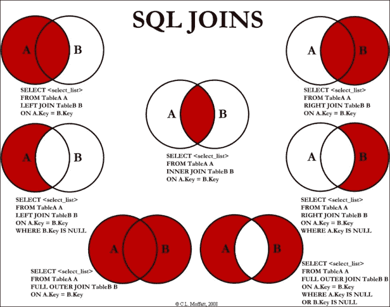
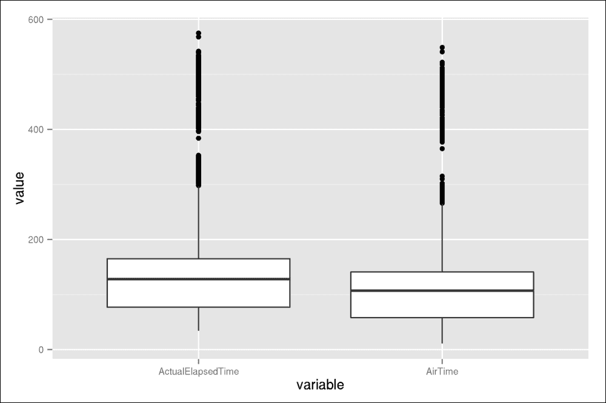
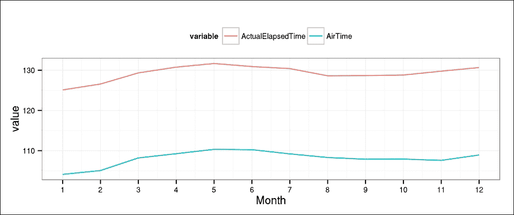

# 第四章。重新结构化数据

我们已经在第三章中介绍了重新结构化数据的最基本方法，*过滤和汇总数据*，但当然，还有几个其他更复杂的任务，我们将在接下来的几页中掌握。

只为了快速举例说明，为了得到可以用于实际数据分析的数据形式，需要多样化的工具：Hadley Wickham，最知名的 R 开发者和用户之一，将他的博士论文三分之一的时间花在重塑数据上。正如他所说，“在进行任何探索性数据分析或可视化之前是不可避免的。”

因此，现在，除了之前提到的重新结构化数据的例子，比如每个组中元素的计数，我们还将关注一些更高级的功能，如下所示：

+   矩阵转置

+   数据的拆分、应用和连接

+   计算表格的边缘

+   数据框的合并

+   数据的铸造和熔化

# 矩阵转置

重新结构化数据最常用但常常不为人提及的方法之一是矩阵转置。这简单意味着通过`t`函数交换列和行，反之亦然：

```py
> (m <- matrix(1:9, 3))
 [,1] [,2] [,3]
[1,]    1    4    7
[2,]    2    5    8
[3,]    3    6    9
> t(m)
 [,1] [,2] [,3]
[1,]    1    2    3
[2,]    4    5    6
[3,]    7    8    9

```

当然，这个`S3`方法也适用于`data.frame`，实际上，适用于任何表格对象。对于更高级的功能，例如转置多维表格，请查看`base`包中的`aperm`函数。

# 通过字符串匹配过滤数据

虽然一些过滤算法已经在之前的章节中讨论过，但`dplyr`包包含一些尚未介绍且值得在此提及的神奇功能。正如我们到这个时候所知道的，`base`中的`subset`函数或`dplyr`中的`filter`函数用于过滤行，而`select`函数可以用来选择列的子集。

过滤行的函数通常需要一个 R 表达式，该表达式返回要删除的行的 ID，类似于`which`函数。另一方面，为`select`函数提供这样的 R 表达式来描述列名通常更成问题；在列名上评估 R 表达式更困难，甚至不可能。

`dplyr`包提供了一些有用的函数，可以根据列名模式选择数据的一些列。例如，我们可以只保留以字符串`delay`结尾的变量：

```py
> library(dplyr)
> library(hflights)
> str(select(hflights, ends_with("delay")))
'data.frame':  227496 obs. of  2 variables:
 $ ArrDelay: int  -10 -9 -8 3 -3 -7 -1 -16 44 43 ...
 $ DepDelay: int  0 1 -8 3 5 -1 -1 -5 43 43 ...

```

当然，还有一个类似的辅助函数`starts_with`来检查列名的前几个字符，并且这两个函数都可以通过`ignore.case`参数忽略（默认）或考虑字符的大小写。我们还有更通用的`contains`函数，它在列名中查找子字符串：

```py
> str(select(hflights, contains("T", ignore.case = FALSE)))
'data.frame':  227496 obs. of  7 variables:
 $ DepTime          : int  1400 1401 1352 1403 1405 ...
 $ ArrTime          : int  1500 1501 1502 1513 1507 ...
 $ TailNum          : chr  "N576AA" "N557AA" "N541AA" "N403AA" ...
 $ ActualElapsedTime: int  60 60 70 70 62 64 70 59 71 70 ...
 $ AirTime          : int  40 45 48 39 44 45 43 40 41 45 ...
 $ TaxiIn           : int  7 6 5 9 9 6 12 7 8 6 ...
 $ TaxiOut          : int  13 9 17 22 9 13 15 12 22 19 ...

```

另一种选择是，我们可能需要一个更复杂的正则表达式方法，这对于数据科学家来说是一项极其重要的技能。现在，我们将正则表达式提供给`matches`函数，该函数将与所有列名进行匹配。让我们选择所有名称包含 5 个或 6 个字符的列：

```py
> str(select(hflights, matches("^[[:alpha:]]{5,6}$")))
'data.frame':  227496 obs. of  3 variables:
 $ Month : int  1 1 1 1 1 1 1 1 1 1 ...
 $ Origin: chr  "IAH" "IAH" "IAH" "IAH" ...
 $ TaxiIn: int  7 6 5 9 9 6 12 7 8 6 ...

```

我们可以通过在表达式前使用负号来保留所有不匹配正则表达式的列名。例如，让我们确定列名中最常见的字符数：

```py
> table(nchar(names(hflights)))
 4  5  6  7  8  9 10 13 16 17 
 2  1  2  5  4  3  1  1  1  1

```

然后，让我们从数据集中删除所有具有 7 个或 8 个字符的列。现在，我们将显示过滤后的数据集的列名：

```py
> names(select(hflights, -matches("^[[:alpha:]]{7,8}$")))
 [1] "Year"              "Month"             "DayofMonth" 
 [4] "DayOfWeek"         "UniqueCarrier"     "FlightNum" 
 [7] "ActualElapsedTime" "Origin"            "Dest" 
[10] "TaxiIn"            "Cancelled"         "CancellationCode"

```

# 数据重排

有时候，我们不想过滤数据的任何部分（既不是行，也不是列），但由于便利性或性能问题，数据简单地不是最有用的顺序，正如我们在第三章中看到的，*过滤和汇总数据*。

除了基本的`sort`和`order`函数，或者提供传递给``操作符的变量的顺序之外，我们还可以使用`sqldf`包中的类似 SQL 的解决方案，或者直接从数据库中以正确的格式查询数据。之前提到的`dplyr`包还提供了一种有效的方法来排序数据。让我们根据每百万次航班的实际耗时对`hflights`数据进行排序：

```py
> str(arrange(hflights, ActualElapsedTime))
'data.frame':  227496 obs. of  21 variables:
 $ Year             : int  2011 2011 2011 2011 2011 2011 ...
 $ Month            : int  7 7 8 9 1 4 5 6 7 8 ...
 $ DayofMonth       : int  24 25 13 21 3 29 9 21 8 2 ...
 $ DayOfWeek        : int  7 1 6 3 1 5 1 2 5 2 ...
 $ DepTime          : int  2005 2302 1607 1546 1951 2035 ...
 $ ArrTime          : int  2039 2336 1641 1620 2026 2110 ...
 $ UniqueCarrier    : chr  "WN" "XE" "WN" "WN" ...
 $ FlightNum        : int  1493 2408 912 2363 2814 2418 ...
 $ TailNum          : chr  "N385SW" "N12540" "N370SW" "N524SW" ...
 $ ActualElapsedTime: int  34 34 34 34 35 35 35 35 35 35 ...
 $ AirTime          : int  26 26 26 26 23 23 27 26 25 25 ...
 $ ArrDelay         : int  9 -8 -4 15 -19 20 35 -15 86 -9 ...
 $ DepDelay         : int  20 2 7 26 -4 35 45 -8 96 1 ...
 $ Origin           : chr  "HOU" "IAH" "HOU" "HOU" ...
 $ Dest             : chr  "AUS" "AUS" "AUS" "AUS" ...
 $ Distance         : int  148 140 148 148 127 127 148 ...
 $ TaxiIn           : int  3 3 4 3 4 4 5 3 5 4 ...
 $ TaxiOut          : int  5 5 4 5 8 8 3 6 5 6 ...
 $ Cancelled        : int  0 0 0 0 0 0 0 0 0 0 ...
 $ CancellationCode : chr  "" "" "" "" ...
 $ Diverted         : int  0 0 0 0 0 0 0 0 0 0 ...

```

好吧，很明显，飞往奥斯汀的航班记录是显示的前几条记录之一。为了提高可读性，上述三个 R 表达式可以通过自动导入的`magrittr`包中的管道操作符以更优雅的方式调用，该包提供了一种简单的方法将 R 对象作为后续 R 表达式的第一个参数传递：

```py
> hflights %>% arrange(ActualElapsedTime) %>% str

```

因此，我们不再需要嵌套 R 函数，现在我们可以从核心对象开始我们的 R 命令，并将每个评估的 R 表达式的结果传递给链中的下一个。在大多数情况下，这使得代码更易于阅读。尽管大多数核心 R 程序员已经习惯了从内到外阅读嵌套函数调用，但请相信我，适应这个巧妙的功能非常容易！不要让我用雷内·马格利特的启发式画作混淆你，这幅画成为了一句口号，“这不是一个烟斗”，也是`magrittr`包的象征：

![数据重排

一个 R 表达式和对象可以链式调用的数量没有限制。例如，让我们也过滤一些案例和变量，看看使用`dplyr`跟随数据重构步骤有多容易：

```py
> hflights %>%
+     arrange(ActualElapsedTime) %>%
+     select(ActualElapsedTime, Dest) %>%
+     subset(Dest != 'AUS') %>%
+     head %>%
+     str
'data.frame':  6 obs. of  2 variables:
 $ ActualElapsedTime: int  35 35 36 36 37 37
 $ Dest             : chr  "LCH" "LCH" "LCH" "LCH" ...

```

因此，现在我们已经对原始数据集进行了几次过滤，以查看奥斯汀之后的最近机场，代码确实易于阅读和理解。这是一种很好的高效过滤数据的方法，尽管有些人更喜欢使用`data.table`包的巧妙单行代码：

```py
> str(head(data.table(hflights, key = 'ActualElapsedTime')[Dest !=
+   'AUS', c('ActualElapsedTime', 'Dest'), with = FALSE]))
Classes 'data.table' and 'data.frame':  6 obs. of  2 variables:
 $ ActualElapsedTime: int  NA NA NA NA NA NA
 $ Dest             : chr  "MIA" "DFW" "MIA" "SEA" ...
 - attr(*, "sorted")= chr "ActualElapsedTime"
 - attr(*, ".internal.selfref")=<externalptr>

```

几乎完美！唯一的问题是，由于缺失值，我们得到了不同的结果，这些缺失值在数据集的开头被排序，而我们在定义 `data.table` 对象时将其索引设置为 `ActualElapsedTime`。为了克服这个问题，让我们删除 `NA` 值，并且不是将列名作为字符串指定，同时强制 `with` 参数为 `FALSE`，而是传递一个列名列表：

```py
> str(head(na.omit(
+   data.table(hflights, key = 'ActualElapsedTime'))[Dest != 'AUS',
+     list(ActualElapsedTime, Dest)]))
Classes 'data.table' and 'data.frame':  6 obs. of  2 variables:
 $ ActualElapsedTime: int  35 35 36 36 37 37
 $ Dest             : chr  "LCH" "LCH" "LCH" "LCH" ...
 - attr(*, "sorted")= chr "ActualElapsedTime"
 - attr(*, ".internal.selfref")=<externalptr>

```

这正是我们之前看到的结果。请注意，在这个例子中，我们在将 `data.frame` 转换为 `data.table` 后，省略了 `NA` 值，这些值是根据 `ActualElapsedTime` 变量索引的，与首先在 `hflights` 上调用 `na.omit` 然后评估所有其他 R 表达式相比要快得多：

```py
> system.time(str(head(data.table(na.omit(hflights),
+   key = 'ActualElapsedTime')[Dest != 'AUS',
+     c('ActualElapsedTime', 'Dest'), with = FALSE])))
 user  system elapsed 
 0.374   0.017   0.390 
> system.time(str(head(na.omit(data.table(hflights,
+   key = 'ActualElapsedTime'))[Dest != 'AUS',
+     c('ActualElapsedTime', 'Dest'), with = FALSE])))
 user  system elapsed 
 0.22    0.00    0.22

```

# dplyr 与 data.table 的比较

你现在可能想知道，“我们应该使用哪个包？”

`dplyr` 和 `data.table` 包提供了截然不同的语法，以及略微不那么确定的性能差异。尽管 `data.table` 在处理大型数据集时似乎略有效率，但在这一范围内并没有明显的胜者——除非是在对大量组进行聚合操作时。坦白说，`dplyr` 的语法，由 `magrittr` 包提供，也可以用于 `data.table` 对象，如果需要的话。

此外，还有一个名为 `pipeR` 的 R 包，它提供了 R 中的管道功能，声称在处理大型数据集时比 `magrittr` 更有效率。这种性能提升归因于 `pipeR` 操作符不像 `magrittr` 中的 F# 语言兼容的 `|>` 操作符那样试图变得聪明。有时，这种性能开销估计是没有使用管道时的 5-15 倍。

在花费合理的时间学习其用法之前，应该考虑到 R 包背后的社区和支持。简而言之，`data.table` 包现在无疑已经足够成熟，可以用于生产环境，因为它的开发始于大约 6 年前，当时 Matt Dowle（当时在一家大型对冲基金工作）开始了开发。从那时起，开发一直在持续进行。Matt 和 Arun（包的共同开发者）不时发布新功能和性能调整，并且他们似乎都热衷于在公共 R 论坛和渠道，如邮件列表和 StackOverflow 上提供支持。

另一方面，`dplyr` 由 Hadley Wickham 和 RStudio 提供，他们是 R 社区中最知名的人物和趋势公司之一，这意味着拥有更大的用户群、社区，以及在 StackOverflow 和 GitHub 上的即时支持。

简而言之，我建议在花时间发现它们提供的功能和力量之后，使用最适合您需求的包。如果您来自 SQL 背景，您可能会发现 `data.table` 非常方便，而其他人则更倾向于选择 Hadleyverse（查看具有此名称的 R 包；它安装了一组由 Hadley 开发的有用 R 包）。您不应该在单个项目中混合这两种方法，因为从可读性和性能的角度来看，最好一次只坚持一种语法。

为了更深入地了解不同方法的优缺点，我将在接下来的几页中继续提供相同问题的多个实现。

# 计算新变量

在重构数据集时，我们通常执行的最简单操作之一就是创建一个新变量。对于一个传统的 `data.frame`，这就像是将一个 `vector` 分配给 R 对象的新变量一样简单。

嗯，这种方法也适用于 `data.table`，但由于有更高效的方法来创建一个或多个数据集中的列，因此该用法已被弃用：

```py
> hflights_dt <- data.table(hflights)
> hflights_dt[, DistanceKMs := Distance / 0.62137]

```

我们刚刚通过简单的除法计算了起点和目的地机场之间的距离，单位为公里；尽管所有核心用户都可以转向 `udunits2` 包，该包包含基于 Unidata 的 `udunits` 库的一组转换工具。

如前所述，data.table 在方括号内使用特殊的 := 赋值运算符，这乍一看可能有些奇怪，但你会爱上它的！

### 注意

`:=` 运算符的速度可以比传统的 `<-` 赋值快 500 多倍，这是根据官方的 `data.table` 文档。这种加速是由于不像 R 在 3.1 版本之前那样将整个数据集复制到内存中。从那时起，R 使用浅拷贝，这极大地提高了列更新的性能，但仍然被 `data.table` 强大的就地更新所击败。

比较以下计算使用传统 `<-` 运算符和 `data.table` 的速度：

```py
> system.time(hflights_dt$DistanceKMs <-
+   hflights_dt$Distance / 0.62137)
 user  system elapsed 
 0.017   0.000   0.016 
> system.time(hflights_dt[, DistanceKMs := Distance / 0.62137])
 user  system elapsed 
 0.003   0.000   0.002

```

这很令人印象深刻，对吧？但值得我们仔细检查我们刚刚做了什么。当然，第一个传统调用创建了/更新了 `DistanceKMs` 变量，但在第二个调用中发生了什么？`data.table` 语法没有返回任何内容（明显地），但由于 `:=` 运算符，后台的 `hflights_dt` R 对象被就地更新了。

### 注意

请注意，`:=` 运算符在 `knitr` 内部使用时可能会产生意外的结果，例如在创建新变量后返回可见的 `data.table`，或者当 `echo = TRUE` 时命令的渲染很奇怪。作为解决方案，Matt Dowle 建议增加 `data.table` 的 `depthtrigger` 选项，或者可以简单地用相同名称重新分配 `data.table` 对象。另一个解决方案可能是使用我的 `pander` 包而不是 `knitr`。 :)

但再次强调，它为什么会这么快？

## 内存分析

`data.table` 包的魔法——除了源代码中超过 50%是 C 代码之外——就是仅在真正必要时才在内存中复制对象。这意味着 R 在更新对象时通常会复制内存中的对象，而`data.table`试图将这些资源密集型操作保持在最低水平。让我们通过`pryr`包来验证这一点，该包提供了一些方便的内存分析辅助函数，以了解 R 的内部机制。

首先，让我们重新创建`data.table`对象，并记录指针值（对象在内存中的位置地址），这样我们就可以在稍后验证新变量是否只是简单地更新了相同的 R 对象，或者在进行操作时在内存中进行了复制：

```py
> library(pryr)
> hflights_dt <- data.table(hflights)
> address(hflights_dt)
[1] "0x62c88c0"

```

好的，所以`0x62c88c0`指的是`hflights_dt`当前存储的位置。现在，让我们检查它是否会因为传统的赋值操作符而改变：

```py
> hflights_dt$DistanceKMs <- hflights_dt$Distance / 0.62137
> address(hflights_dt)
[1] "0x2c7b3a0"

```

这确实是一个不同的位置，这意味着向 R 对象添加新列也需要 R 在内存中复制整个对象。想象一下，我们现在因为添加了一个新列而在内存中移动了 21 列。

现在，让我们看看如何在`data.table`中使用`:=`：

```py
> hflights_dt <- data.table(hflights)
> address(hflights_dt)
[1] "0x8ca2340"
> hflights_dt[, DistanceKMs := Distance / 0.62137]
> address(hflights_dt)
[1] "0x8ca2340"

```

R 对象在内存中的位置没有改变！并且内存中的对象复制可能会消耗大量资源，从而耗费大量时间。看看以下示例，这是上述传统变量赋值调用的略微更新版本，但增加了一个`within`的便利层：

```py
> system.time(within(hflights_dt, DistanceKMs <- Distance / 0.62137))
 user  system elapsed 
 0.027   0.000   0.027

```

这里，使用`within`函数可能在内存中再次复制 R 对象，从而带来相对严重的性能开销。尽管前述示例之间的绝对时间差异可能看起来并不非常显著（在统计环境中并不显著），但想象一下，不必要的内存更新如何影响大型数据集的数据分析处理时间！

## 一次创建多个变量

`data.table`的一个不错特性是可以通过单个命令创建多个列，这在某些情况下可能非常有用。例如，我们可能对机场的英尺距离感兴趣：

```py
> hflights_dt[, c('DistanceKMs', 'DiastanceFeets') :=
+   list(Distance / 0.62137, Distance * 5280)]

```

因此，这就像在`:=`操作符的左侧提供一个所需的变量名称的字符向量，在右侧提供一个适当的值的`list`。这个特性可以很容易地用于一些更复杂的任务。例如，让我们创建航空公司的虚拟变量：

```py
> carriers <- unique(hflights_dt$UniqueCarrier)
> hflights_dt[, paste('carrier', carriers, sep = '_') :=
+   lapply(carriers, function(x) as.numeric(UniqueCarrier == x))]
> str(hflights_dt[, grep('^carrier', names(hflights_dt)),
+   with = FALSE])
Classes 'data.table' and 'data.frame': 227496 obs. of  15 variables:
 $ carrier_AA: num  1 1 1 1 1 1 1 1 1 1 ...
 $ carrier_AS: num  0 0 0 0 0 0 0 0 0 0 ...
 $ carrier_B6: num  0 0 0 0 0 0 0 0 0 0 ...
 $ carrier_CO: num  0 0 0 0 0 0 0 0 0 0 ...
 $ carrier_DL: num  0 0 0 0 0 0 0 0 0 0 ...
 $ carrier_OO: num  0 0 0 0 0 0 0 0 0 0 ...
 $ carrier_UA: num  0 0 0 0 0 0 0 0 0 0 ...
 $ carrier_US: num  0 0 0 0 0 0 0 0 0 0 ...
 $ carrier_WN: num  0 0 0 0 0 0 0 0 0 0 ...
 $ carrier_EV: num  0 0 0 0 0 0 0 0 0 0 ...
 $ carrier_F9: num  0 0 0 0 0 0 0 0 0 0 ...
 $ carrier_FL: num  0 0 0 0 0 0 0 0 0 0 ...
 $ carrier_MQ: num  0 0 0 0 0 0 0 0 0 0 ...
 $ carrier_XE: num  0 0 0 0 0 0 0 0 0 0 ...
 $ carrier_YV: num  0 0 0 0 0 0 0 0 0 0 ...
 - attr(*, ".internal.selfref")=<externalptr>

```

虽然它不是一行代码，并且它还引入了一个辅助变量，但看到我们做了什么并不复杂：

1.  首先，我们将唯一的航空公司名称保存到一个字符向量中。

1.  然后，我们利用这个来定义新变量的名称。

1.  我们还迭代了匿名函数对这个字符向量，以返回 `TRUE` 或 `FALSE`，如果承运人名称与给定列匹配。

1.  给定的列通过 `as.numeric` 转换为 `0` 或 `1`。

1.  然后，我们简单地检查了所有以 `carrier` 开头的列的结构。

这并不完美，因为我们通常省略一个标签从虚拟变量中，以减少冗余。在当前情况下，最后一个新列只是其他新创建列的线性组合，因此信息被重复。为此，通常一个好的做法是通过将 `-1` 传递给 `head` 函数中的 `n` 参数，省略例如最后一个类别。

## 使用 dplyr 计算新变量

`dplyr` 包中 `mutate` 的用法与基础 `within` 函数相同，尽管 `mutate` 比起 `within` 来说要快得多：

```py
> hflights <- hflights %>%
+     mutate(DistanceKMs = Distance / 0.62137)

```

如果之前的例子没有清楚地说明 `mutate` 和 `within` 的类比，那么也许展示一个不使用管道的相同例子也会很有用：

```py
> hflights <- mutate(hflights, DistanceKMs = Distance / 0.62137)

```

# 合并数据集

除了之前描述的对单个数据集的基本操作外，将多个数据源连接起来是日常操作中最常用的方法之一。对于此类任务，最常用的解决方案是简单地调用 `merge` S3 方法，它可以作为传统 SQL 内部、左/右/全外连接操作器——由 C.L. Moffatt (2008) 以以下简短总结表示：



`dplyr` 包提供了一些简单的方法，可以直接从 R 中以简单的方式执行之前展示的连接操作：

+   `inner_join`：这会将两个数据集中都找到的行变量连接起来

+   `left_join`：这包括第一个数据集中的所有行，并连接来自其他表的变量

+   `semi_join`：这仅包括那些在第一个数据集中也存在于其他数据集中的行

+   `anti_join`：这与 `semi_join` 类似，但仅包括那些在第一个数据集中不存在于其他数据集中的行

    ### 注意

    更多示例，请参阅 *Two-table verbs* `dplyr` 章节和书中末尾的 *参考文献* 章节中列出的数据整理速查表。

这些特性也由 `data.table` 调用 `` 操作符的 `mult` 参数支持，但在此阶段，让我们坚持使用更简单的用例。

在以下示例中，我们将合并一个微小的数据集与 `hflights` 数据。让我们通过为 `DayOfWeek` 变量的可能值命名来创建 `data.frame` 示例：

```py
> (wdays <- data.frame(
+     DayOfWeek       = 1:7,
+     DayOfWeekString = c("Sunday", "Monday", "Tuesday",
+         "Wednesday", "Thursday", "Friday", "Saturday")
+     ))
 DayOfWeek DayOfWeekString
1         1          Sunday
2         2          Monday
3         3         Tuesday
4         4       Wednesday
5         5        Thursday
6         6          Friday
7         7        Saturday

```

让我们看看如何将之前定义的 `data.frame` 与另一个 `data.frame` 以及其他表格对象进行左连接，因为 `merge` 也支持对例如 `data.table` 的快速操作：

```py
> system.time(merge(hflights, wdays))
 user  system elapsed 
 0.700   0.000   0.699 
> system.time(merge(hflights_dt, wdays, by = 'DayOfWeek'))
 user  system elapsed 
 0.006   0.000   0.009

```

之前的例子自动通过`DayOfWeek`变量合并了两个表，这是两个数据集的一部分，并在原始的`hflights`数据集中产生了额外的变量。然而，在第二个例子中，我们必须传递变量名，因为`merge.data.table`的`by`参数默认为对象的关键变量，当时该变量缺失。需要注意的是，使用`data.table`进行合并比传统的表格对象类型要快得多。

### 注意

对于如何改进之前的教例有什么想法吗？除了合并之外，新变量也可以被计算。例如，查看基础 R 中的`weekdays`函数：`weekdays(as.Date(with(hflights, paste(Year, Month, DayofMonth, sep = '-'))))`。

当你只想向数据集添加具有相同结构的新行或列时，合并数据集的简单方法。为此，`rbind`和`cbind`，或者对于稀疏矩阵的`rBind`和`cBind`，都能做得很好。

与这些基本命令一起最常使用的函数之一是`do.call`，它可以在一个`list`的所有元素上执行`rbind`或`cbind`调用，从而使我们能够，例如，连接一系列数据框。这样的列表通常由`lapply`或`plyr`包的相关函数创建。同样，可以通过调用`rbindlist`以更快的方式合并一个`data.table`对象的`list`。

# 以灵活的方式重塑数据

Hadley Wickham 编写了几个 R 包来调整数据结构，例如，他论文的主要部分集中在如何使用他的`reshape`包来重塑数据框。从那时起，这个通用的聚合和重构包经过更新，以更高效地处理最常用的任务，并且它附带新的版本号被命名为`reshape2`包。

这是对`reshape`包的全面重写，它以牺牲功能为代价提高了速度。目前，`reshape2`最重要的特性是能够在所谓的长（窄）表和宽表数据格式之间进行转换。这基本上涉及到列彼此堆叠或并排排列。

这些特性在 Hadley 的作品中通过以下关于数据重构的图像进行了展示，其中包含了相关的`reshape`函数和简单的用例：

![以灵活的方式重塑数据由于`reshape`包不再处于积极开发状态，并且其部分已外包给`reshape2`、`plyr`和最近的`dplyr`，我们将在以下页面中仅关注`reshape2`的常用特性。这基本上包括`melt`和`cast`函数，它们提供了一种将数据熔化成测量和标识变量标准形式（长表格式）的智能方式，这些数据可以随后被铸造成新的形状以进行进一步分析。## 将宽表转换为长表格式将数据框熔化意味着我们将表格数据转换为基于给定标识变量键值对。原始的列名成为新创建的`variable`列的分类，而所有这些（测量变量）的数值都包含在新创建的`value`列中。这里有一个快速示例：```py> library(reshape2)> head(melt(hflights))Using UniqueCarrier, TailNum, Origin, Dest, CancellationCode as id variables UniqueCarrier TailNum Origin Dest CancellationCode variable value1            AA  N576AA    IAH  DFW                      Year  20112            AA  N557AA    IAH  DFW                      Year  20113            AA  N541AA    IAH  DFW                      Year  20114            AA  N403AA    IAH  DFW                      Year  20115            AA  N492AA    IAH  DFW                      Year  20116            AA  N262AA    IAH  DFW                      Year  2011```因此，我们刚刚重新构建了原始的`data.frame`，它有 21 个变量和 25 万条记录，现在只有 7 列和超过 350 万条记录。其中六列是因子类型的标识变量，最后一列存储所有值。但为什么它有用？为什么我们要将传统的宽表格格式转换为更长的数据类型？例如，我们可能对比较飞行时间与实际飞行时间的分布感兴趣，这可能不是用原始数据格式直接绘制的。尽管使用`ggplot2`包绘制上述变量的散点图非常容易，但你怎么创建两个单独的箱线图来比较分布呢？这里的问题是我们有两个独立的测量时间变量，而`ggplot`需要一个`numeric`和一个`factor`变量，后者将用于在*x*轴上提供标签。为此，让我们通过指定两个要作为测量变量处理的数值变量并删除所有其他列来使用`melt`重新构建我们的数据集——换句话说，不保留任何标识变量：```py> hflights_melted <- melt(hflights, id.vars = 0,+   measure.vars = c('ActualElapsedTime', 'AirTime'))> str(hflights_melted)'data.frame':  454992 obs. of  2 variables: $ variable: Factor w/ 2 levels "ActualElapsedTime",..: 1 1 1 1 1 ... $ value   : int  60 60 70 70 62 64 70 59 71 70 ...```### 注意通常情况下，在没有标识变量的情况下熔化数据集不是一个好主意，因为后来将其铸造变得繁琐，甚至是不可能的。请注意，现在我们的行数是之前的两倍，而`variable`列是一个只有两个级别的因子，代表两个测量变量。现在这个结果`data.frame`使用这两个新创建的列绘图变得容易：```py> library(ggplot2)> ggplot(hflights_melted, aes(x = variable, y = value)) ++   geom_boxplot()```

好吧，前面的例子可能看起来不是那么关键，说实话，我第一次使用`reshape`包是因为我需要一些类似的转换来能够制作一些巧妙的`ggplot2`图表——因为如果有人使用`base`图形，前面的这个问题根本就不存在。例如，你可以简单地将原始数据集的两个单独变量传递给`boxplot`函数。

因此，这就像是进入了 Hadley Wickham 的 R 包的世界，这次旅程确实提供了一些优秀的数据分析实践。因此，我强烈建议进一步阅读，例如，了解如果不了解如何有效地重塑数据集，使用`ggplot2`可能并不容易，甚至是不可能的。

## 将长表格转换为宽表格格式

转换数据集是熔化的相反过程，就像将键值对转换为表格数据格式。但请记住，键值对可以以各种方式组合在一起，因此这个过程可以产生极其多样化的输出。因此，你需要一个表和一个公式来转换，例如：

```py
> hflights_melted <- melt(hflights, id.vars = 'Month',
+   measure.vars = c('ActualElapsedTime', 'AirTime'))
> (df <- dcast(hflights_melted, Month ~ variable,
+   fun.aggregate = mean, na.rm = TRUE))
 Month ActualElapsedTime  AirTime
1      1          125.1054 104.1106
2      2          126.5748 105.0597
3      3          129.3440 108.2009
4      4          130.7759 109.2508
5      5          131.6785 110.3382
6      6          130.9182 110.2511
7      7          130.4126 109.2059
8      8          128.6197 108.3067
9      9          128.6702 107.8786
10    10          128.8137 107.9135
11    11          129.7714 107.5924
12    12          130.6788 108.9317

```

这个示例展示了如何通过熔化和转换 `hflights` 数据集来聚合 2011 年每个月测量的飞行时间：

1.  首先，我们将 `data.frame` 转换为熔化形式，其中 ID 是 `Month`，我们只保留了两个表示飞行时间的数值变量。

1.  然后，我们使用一个简单的公式将结果 `data.frame` 转换为宽表格式，以显示所有测量变量每个月的平均值。

我很确定你现在可以快速重新结构这些数据，以便能够绘制两条独立的线来表示这个基本的时间序列：

```py
> ggplot(melt(df, id.vars = 'Month')) +
+   geom_line(aes(x = Month, y = value, color = variable)) +
+   scale_x_continuous(breaks = 1:12) +
+   theme_bw() + 
+   theme(legend.position = 'top')

```



当然，除了聚合之外，熔化和转换还可以用于各种其他用途。例如，我们可以重新结构我们的原始数据库，使其具有特殊的 `Month`，该 `Month` 包含所有数据记录。当然，这会使数据集的行数翻倍，但同时也让我们能够轻松地生成带有边界的表格。以下是一个快速示例：

```py
> hflights_melted <- melt(add_margins(hflights, 'Month'),
+    id.vars = 'Month',
+    measure.vars = c('ActualElapsedTime', 'AirTime'))
> (df <- dcast(hflights_melted, Month ~ variable,
+    fun.aggregate = mean, na.rm = TRUE))
 Month ActualElapsedTime  AirTime
1      1          125.1054 104.1106
2      2          126.5748 105.0597
3      3          129.3440 108.2009
4      4          130.7759 109.2508
5      5          131.6785 110.3382
6      6          130.9182 110.2511
7      7          130.4126 109.2059
8      8          128.6197 108.3067
9      9          128.6702 107.8786
10    10          128.8137 107.9135
11    11          129.7714 107.5924
12    12          130.6788 108.9317
13 (all)          129.3237 108.1423

```

这与我们之前看到的情况非常相似，但作为一个中间步骤，我们将 `Month` 变量转换为具有特殊级别的因子，这导致了这张表的最后一行。这一行代表相关测量变量的整体算术平均值。

## 调整性能

关于 `reshape2` 的另一个好消息是 `data.table` 对熔化和转换有相当的支持，并且性能有了显著提升。Matt Dowle 发布了一些基准测试，使用 `cast` 和 `melt` 在 `data.table` 对象上而不是传统数据框上的处理时间提高了 5-10%，这非常令人印象深刻。

要验证你自己的数据集上的这些结果，只需在调用 `reshape2` 函数之前将 `data.frame` 对象转换为 `data.table`，因为 `data.table` 包已经包含了适当的 `S3` 方法来扩展 `reshape2`。

# `reshape` 包的发展历程

如前所述，`reshape2` 是基于大约 5 年使用和开发 `reshape` 包的经验而进行的完全重写。这次更新也包含了一些权衡，因为原始的 `reshape` 任务被分散到多个包中。因此，与 `reshape` 支持的那种神奇功能相比，`reshape2` 现在提供的功能要少得多。例如，检查一下 `reshape::cast`；特别是 `margins` 和 `add.missing` 参数！

但实际上，即使是 `reshape2` 也提供了比仅仅熔化和铸造数据框多得多的功能。`tidyr` 包的诞生正是受到这一事实的启发：在 Hadleyverse 中有一个支持轻松进行数据清理和长宽表格式之间转换的包。在 `tidyr` 的术语中，这些操作被称为 `gather` 和 `spread`。

只为了快速展示这个新语法的一个例子，让我们重新实现之前的示例：

```py
> library(tidyr)
> str(gather(hflights[, c('Month', 'ActualElapsedTime', 'AirTime')],
+   variable, value, -Month))
'data.frame':  454992 obs. of  3 variables:
 $ Month   : int  1 1 1 1 1 1 1 1 1 1 ...
 $ variable: Factor w/ 2 levels "ActualElapsedTime",..: 1 1 1 1 ...
 $ value   : int  60 60 70 70 62 64 70 59 71 70 ...

```

# 摘要

在本章中，我们专注于如何在运行统计测试之前将原始数据转换成适当的格式结构。这个过程是我们日常行动中非常重要的一部分，占据了数据科学家大部分的时间。但在阅读本章之后，你应该对如何在大多数情况下重新结构化你的数据有信心——因此，现在是专注于构建一些模型的时候了，我们将在下一章中这样做。
