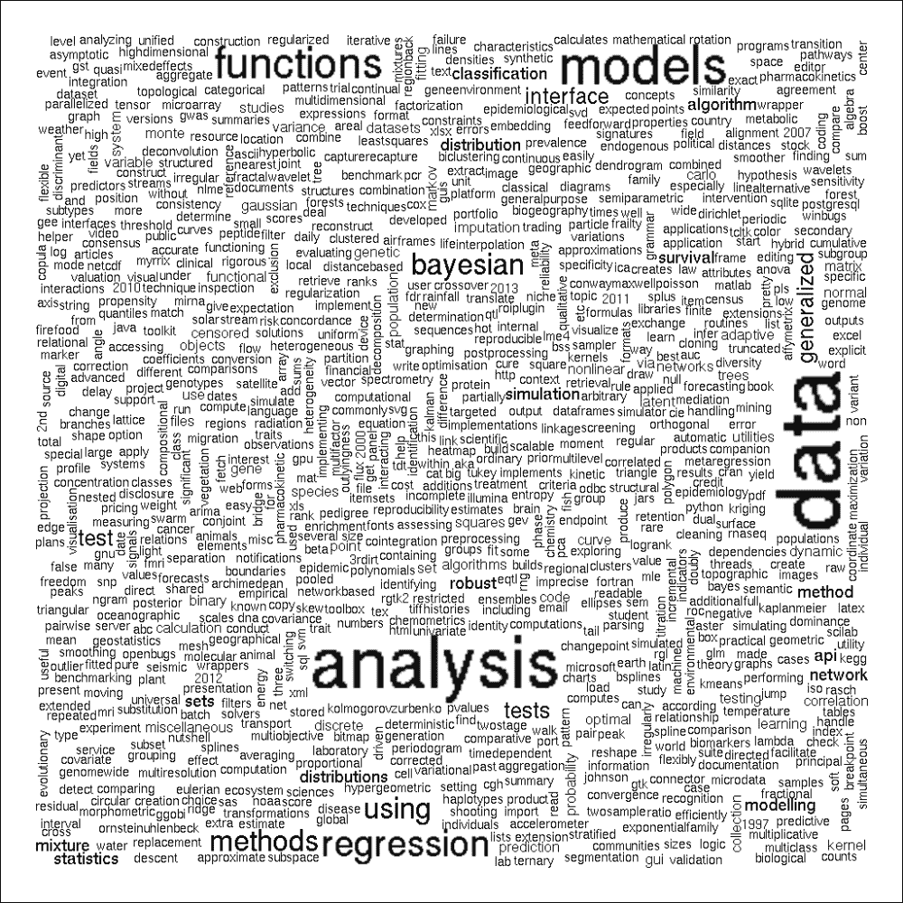
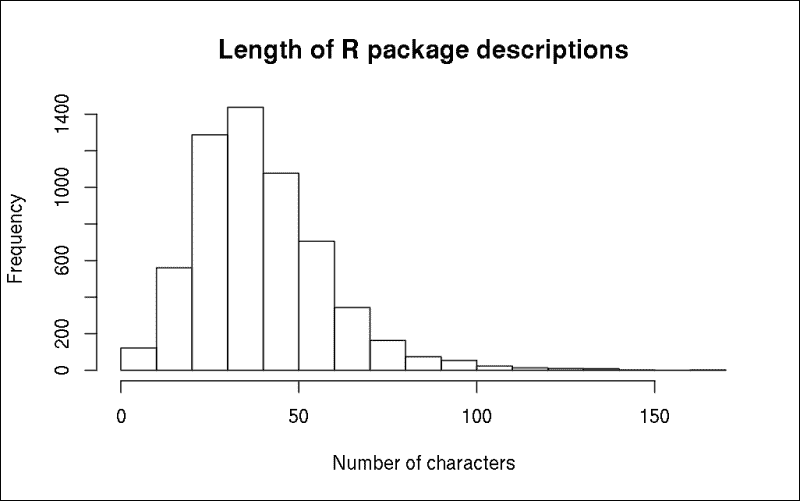
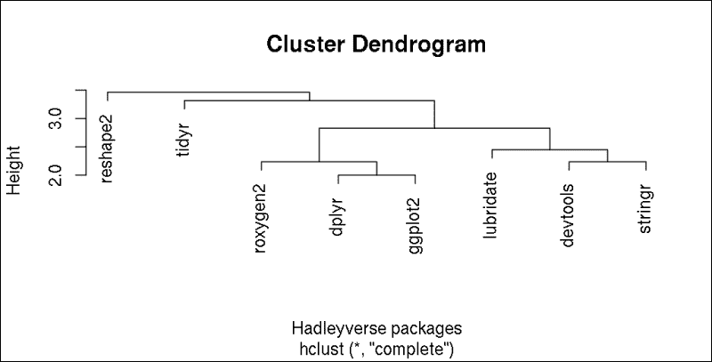

# 第七章。非结构化数据

在上一章中，我们探讨了在结构化数据上构建和拟合模型的不同方法。不幸的是，这些在其他情况下非常有用的方法在处理例如一堆 PDF 文档时（目前）毫无用处。因此，接下来的几页将重点介绍处理非表格数据的方法，例如：

+   从文本文档集合中提取度量

+   过滤和解析**自然语言文本**（**NLP**）

+   以结构化的方式可视化非结构化数据

文本挖掘是分析自然语言文本的过程；在大多数情况下来自在线内容，如电子邮件和社交媒体流（Twitter 或 Facebook）。在本章中，我们将介绍`tm`包中最常用的方法——尽管还有许多其他类型的非结构化数据，如文本、图像、音频、视频、非数字内容等，我们目前无法讨论。

# 导入语料库

语料库基本上是你想要包含在分析中的文本文档集合。使用`getSources`函数查看使用`tm`包导入语料库的可用选项：

```py
> library(tm)
> getSources()
[1] "DataframeSource" "DirSource"  "ReutersSource"   "URISource"
[2] "VectorSource" 

```

因此，我们可以使用`URISource`函数从`data.frame`、`vector`或直接从统一资源标识符导入文本文档。后者代表一组超链接或文件路径，尽管使用`DirSource`处理起来要容易一些，因为`DirSource`可以导入硬盘上引用目录中找到的所有文本文档。在 R 控制台中调用`getReaders`函数，你可以看到支持的文本文件格式：

```py
> getReaders()
[1] "readDOC"                 "readPDF" 
[3] "readPlain"               "readRCV1" 
[5] "readRCV1asPlain"         "readReut21578XML" 
[7] "readReut21578XMLasPlain" "readTabular" 
[9] "readXML" 

```

因此，有一些巧妙的函数可以读取和解析 MS Word、PDF、纯文本或 XML 文件等几种其他文件格式。之前的`Reut`读取器代表与`tm`包捆绑的 Reuter 演示语料库。

但我们不要局限于一些工厂默认的演示文件！你可以在 vignette 或参考手册中查看包示例。因为我们已经在第二章中获取了一些文本数据，即“从网络获取数据”，让我们看看我们如何处理和分析这些内容：

```py
> res <- XML::readHTMLTable(paste0('http://cran.r-project.org/',
+                   'web/packages/available_packages_by_name.html'),
+               which = 1)

```

### 小贴士

之前的命令需要一个活跃的互联网连接，可能需要 15-120 秒来下载和解析引用的 HTML 页面。请注意，下载的 HTML 文件的内容可能与本章中显示的内容不同，因此请准备好在 R 会话中可能出现的略微不同的输出，与我们在这本书中发布的内容相比。

现在，我们有一个包含超过 5,000 个 R 包名称和简短描述的`data.frame`。让我们从包描述的向量源构建语料库，这样我们就可以进一步解析它们并查看包开发中的最重要趋势：

```py
> v <- Corpus(VectorSource(res$V2))

```

我们刚刚创建了一个`VCorpus`（内存中）对象，它目前包含 5,880 个包描述：

```py
> v
<<VCorpus (documents: 5880, metadata (corpus/indexed): 0/0)>>

```

如默认的`print`方法（参见前面的输出）所示，它对语料库提供了一个简洁的概述，因此我们需要使用另一个函数来检查实际内容：

```py
> inspect(head(v, 3))
<<VCorpus (documents: 3, metadata (corpus/indexed): 0/0)>>

[[1]]
<<PlainTextDocument (metadata: 7)>>
A3: Accurate, Adaptable, and Accessible Error Metrics for
Predictive Models

[[2]]
<<PlainTextDocument (metadata: 7)>>
Tools for Approximate Bayesian Computation (ABC)

[[3]]
<<PlainTextDocument (metadata: 7)>>
ABCDE_FBA: A-Biologist-Can-Do-Everything of Flux Balance
Analysis with this package

```

在这里，我们可以看到语料库中的前三个文档，以及一些元数据。到目前为止，我们做的没有比在第二章，*从网络获取数据*时更多，我们可视化了一个用于包描述的表达式的词云。但那正是文本挖掘之旅的开始！

# 清理语料库

`tm`包最令人愉悦的特性之一是它提供了多种捆绑的转换，可以应用于语料库（corpuses）。`tm_map`函数提供了一种方便的方式来对语料库执行转换，以过滤掉实际研究中所有不相关的数据。要查看可用的转换方法列表，只需调用`getTransformations`函数：

```py
> getTransformations()
[1] "as.PlainTextDocument" "removeNumbers"
[3] "removePunctuation"    "removeWords"
[5] "stemDocument"         "stripWhitespace" 

```

我们通常应该从移除语料库中最常用的所谓停用词开始。这些是最常见的、简短的函数术语，它们通常比语料库中的其他表达式（尤其是关键词）的意义不那么重要。该包已经包含了不同语言的此类单词列表：

```py
> stopwords("english")
 [1] "i"          "me"         "my"         "myself"     "we" 
 [6] "our"        "ours"       "ourselves"  "you"        "your" 
 [11] "yours"      "yourself"   "yourselves" "he"         "him" 
 [16] "his"        "himself"    "she"        "her"        "hers" 
 [21] "herself"    "it"         "its"        "itself"     "they" 
 [26] "them"       "their"      "theirs"     "themselves" "what" 
 [31] "which"      "who"        "whom"       "this"       "that" 
 [36] "these"      "those"      "am"         "is"         "are" 
 [41] "was"        "were"       "be"         "been"       "being" 
 [46] "have"       "has"        "had"        "having"     "do" 
 [51] "does"       "did"        "doing"      "would"      "should" 
 [56] "could"      "ought"      "i'm"        "you're"     "he's" 
 [61] "she's"      "it's"       "we're"      "they're"    "i've" 
 [66] "you've"     "we've"      "they've"    "i'd"        "you'd" 
 [71] "he'd"       "she'd"      "we'd"       "they'd"     "i'll" 
 [76] "you'll"     "he'll"      "she'll"     "we'll"      "they'll" 
 [81] "isn't"      "aren't"     "wasn't"     "weren't"    "hasn't" 
 [86] "haven't"    "hadn't"     "doesn't"    "don't"      "didn't" 
 [91] "won't"      "wouldn't"   "shan't"     "shouldn't"  "can't" 
 [96] "cannot"     "couldn't"   "mustn't"    "let's"      "that's" 
[101] "who's"      "what's"     "here's"     "there's"    "when's" 
[106] "where's"    "why's"      "how's"      "a"          "an" 
[111] "the"        "and"        "but"        "if"         "or" 
[116] "because"    "as"         "until"      "while"      "of" 
[121] "at"         "by"         "for"        "with"       "about" 
[126] "against"    "between"    "into"       "through"    "during" 
[131] "before"     "after"      "above"      "below"      "to" 
[136] "from"       "up"         "down"       "in"         "out" 
[141] "on"         "off"        "over"       "under"      "again" 
[146] "further"    "then"       "once"       "here"       "there" 
[151] "when"       "where"      "why"        "how"        "all" 
[156] "any"        "both"       "each"       "few"        "more" 
[161] "most"       "other"      "some"       "such"       "no" 
[166] "nor"        "not"        "only"       "own"        "same" 
[171] "so"         "than"       "too"        "very" 

```

快速浏览这个列表可以验证，移除这些相对不重要的词并不会真正改变 R 包描述的意义。尽管有些罕见的情况，移除停用词根本不是个好主意！仔细检查以下 R 命令的输出：

```py
> removeWords('to be or not to be', stopwords("english"))
[1] "     "

```

### 注意

这并不暗示莎士比亚的著名引言没有意义，或者我们可以在所有情况下忽略任何停用词。有时，这些词在上下文中扮演着非常重要的角色，用空格替换这些词并不有用，反而会降低质量。尽管如此，我建议，在大多数情况下，移除停用词对于将需要处理的单词数量保持在较低水平是非常实用的。

要迭代地对语料库中的每个文档应用之前的调用，`tm_map`函数非常有用：

```py
> v <- tm_map(v, removeWords, stopwords("english"))

```

简单地将语料库、转换函数及其参数传递给`tm_map`，它接受并返回任何数量的文档的语料库：

```py
> inspect(head(v, 3))
<<VCorpus (documents: 3, metadata (corpus/indexed): 0/0)>>

[[1]]
<<PlainTextDocument (metadata: 7)>>
A3 Accurate Adaptable Accessible Error Metrics Predictive Models

[[2]]
<<PlainTextDocument (metadata: 7)>>
Tools Approximate Bayesian Computation ABC

[[3]]
<<PlainTextDocument (metadata: 7)>>
ABCDEFBA ABiologistCanDoEverything Flux Balance Analysis package

```

我们可以看到，最常见的函数词和一些特殊字符现在已从包描述中消失。但如果有人以大写停用词开始描述呢？以下是一个示例：

```py
> removeWords('To be or not to be.', stopwords("english"))
[1] "To     ."

```

很明显，句子中并没有移除`to`这个常用词的大写版本，并且句尾的点也被保留了。为此，通常我们只需将大写字母转换为小写，并用空格替换标点符号，以将关键词之间的杂乱程度降至最低：

```py
> v <- tm_map(v, content_transformer(tolower))
> v <- tm_map(v, removePunctuation)
> v <- tm_map(v, stripWhitespace)
> inspect(head(v, 3))
<<VCorpus (documents: 3, metadata (corpus/indexed): 0/0)>>

[[1]]
[1] a3 accurate adaptable accessible error metrics predictive models

[[2]]
[1] tools approximate bayesian computation abc

[[3]]
[1] abcdefba abiologistcandoeverything flux balance analysis package

```

因此，我们首先从`base`包中调用了`tolower`函数来将所有字符从大写转换为小写。请注意，我们必须将`tolower`函数包装在`content_transformer`函数中，以便我们的转换真正符合`tm`包的对象结构。通常，在使用`tm`包之外的转换函数时，这是必需的。

然后，我们使用`removePunctutation`函数帮助移除了文本中的所有标点符号。这些标点符号是正则表达式中所指的`[:punct:]`，包括以下字符：`!` `"` `#` `$` `%` `&` `'` `( )` `*` `+` `,` `-` `.` `/` `:` `;` `<` `=` `>` `?` `@` `[` `\` `]` `^` `_` `` ` `` `{` `|` `}` `~'`。通常，移除这些分隔符是安全的，尤其是在我们单独分析单词而不是分析它们之间的关系时。

我们还从文档中移除了多余的空白字符，这样我们只会在过滤后的单词之间找到单个空格。

# 可视化语料库中最常见的单词

现在我们已经清理了我们的语料库，我们可以生成一个比我们在第二章中生成的概念验证演示更有用的词云：

```py
> wordcloud::wordcloud(v)

```



# 进一步清理

单词列表中仍然存在一些小的干扰错误。也许，我们根本不想在包描述中保留数字（或者我们可能想用占位文本，如`NUM`替换所有数字），还有一些可以忽略的常见技术词汇，例如`package`。显示名词的复数形式也是多余的。让我们逐步通过一些进一步的调整来改进我们的语料库！

从包描述中移除数字相当直接，如前例所示：

```py
> v <- tm_map(v, removeNumbers)

```

为了移除一些意义不重要的常见领域特定词汇，让我们看看文档中最常见的单词。为此，我们首先必须计算`TermDocumentMatrix`函数，该函数可以稍后传递给`findFreqTerms`函数，以根据频率识别语料库中最流行的术语：

```py
> tdm <- TermDocumentMatrix(v)

```

这个对象基本上是一个矩阵，包括行中的单词和列中的文档，其中单元格显示出现次数。例如，让我们看看前 20 个文档中前 5 个单词的出现次数：

```py
> inspect(tdm[1:5, 1:20])
<<TermDocumentMatrix (terms: 5, documents: 20)>>
Non-/sparse entries: 5/95
Sparsity           : 95%
Maximal term length: 14
Weighting          : term frequency (tf)

 Docs
Terms            1 2 3 4 5 6 7 8 9 10 11 12 13 14 15 16 17 18 19 20
 aalenjohansson 0 0 0 0 0 0 0 0 0  0  0  0  0  0  0  0  0  0  0  0
 abc            0 1 0 1 1 0 1 0 0  0  0  0  0  0  0  0  0  0  0  0
 abcdefba       0 0 1 0 0 0 0 0 0  0  0  0  0  0  0  0  0  0  0  0
 abcsmc         0 0 0 0 0 0 0 0 0  0  0  0  0  0  0  0  0  0  0  0
 aberrations    0 0 0 0 0 0 0 0 0  0  0  0  0  0  0  0  0  0  0  0

```

提取每个单词的总出现次数相当简单。从理论上讲，我们可以计算这个稀疏矩阵的`rowSums`函数。但让我们简单地调用`findFreqTerms`函数，它正好是我们想要做的。让我们展示那些在描述中至少出现 100 次的术语：

```py
> findFreqTerms(tdm, lowfreq = 100)
 [1] "analysis"     "based"        "bayesian"     "data" 
 [5] "estimation"   "functions"    "generalized"  "inference" 
 [9] "interface"    "linear"       "methods"      "model" 
[13] "models"       "multivariate" "package"      "regression" 
[17] "series"       "statistical"  "test"         "tests" 
[21] "time"         "tools"        "using" 

```

手动审查这个列表建议忽略`based`和`using`这两个词，除了之前建议的`package`术语：

```py
> myStopwords <- c('package', 'based', 'using')
> v <- tm_map(v, removeWords, myStopwords)

```

## 词干提取

现在，让我们去除名词的复数形式，这些形式也出现在前面最常用的 20 个单词列表中！这并不像听起来那么简单。我们可能应用一些正则表达式来从单词中剪切掉尾部的`s`，但这种方法有很多缺点，例如没有考虑到一些明显的英语语法规则。

但我们可以使用一些词干算法，特别是可用的`SnowballC`包中的 Porter 词干算法。`wordStem`函数支持 16 种语言（详细信息请参阅`getStemLanguages`），可以像调用函数一样轻松地识别字符向量的词干：

```py
> library(SnowballC)
> wordStem(c('cats', 'mastering', 'modelling', 'models', 'model'))
[1] "cat"    "master" "model"  "model"  "model"

```

这里唯一的缺点是 Porter 算法并不总是在所有情况下提供真正的英语单词：

```py
> wordStem(c('are', 'analyst', 'analyze', 'analysis'))
[1] "ar"      "analyst" "analyz"  "analysi"

```

因此，稍后我们还需要进一步调整结果；通过帮助语言词典数据库来重建单词。构建此类数据库的最简单方法是从已存在的语料库中复制单词：

```py
> d <- v

```

然后，让我们对文档中的所有单词进行词干提取：

```py
> v <- tm_map(v, stemDocument, language = "english")

```

现在，我们调用了`stemDocument`函数，这是一个围绕`SnowballC`包的`wordStem`函数的包装器。我们只指定了一个参数，该参数设置了词干算法的语言。现在，让我们在我们的先前定义的目录上调用`stemCompletion`函数，并将每个词干与数据库中找到的最短相关单词相匹配。

不幸的是，这并不像前面的例子那么简单，因为`stemCompletion`函数接受一个单词字符向量而不是我们语料库中的文档。因此，我们必须编写自己的转换函数，使用之前使用的`content_transformer`辅助函数。基本思想是将每个文档通过空格分割成单词，应用`stemCompletion`函数，然后将单词再次连接成句子：

```py
> v <- tm_map(v, content_transformer(function(x, d) {
+         paste(stemCompletion(
+                 strsplit(stemDocument(x), ' ')[[1]],
+                 d),
+         collapse = ' ')
+       }), d)

```

### 小贴士

前面的例子相当占用资源，所以请准备好在标准 PC 上大约 30 到 60 分钟的高 CPU 使用率。由于你可以（技术上）运行即将到来的代码示例而不实际执行此步骤，如果你赶时间，可以自由跳到下一个代码块。

这花了些时间，对吧？好吧，我们必须遍历语料库中找到的每个文档中的所有单词，但这很值得麻烦！让我们看看清理后的语料库中最常用的术语：

```py
> tdm <- TermDocumentMatrix(v)
> findFreqTerms(tdm, lowfreq = 100)
 [1] "algorithm"     "analysing"     "bayesian"      "calculate" 
 [5] "cluster"       "computation"   "data"          "distributed" 
 [9] "estimate"      "fit"           "function"      "general" 
[13] "interface"     "linear"        "method"        "model" 
[17] "multivariable" "network"       "plot"          "random" 
[21] "regression"    "sample"        "selected"      "serial" 
[25] "set"           "simulate"      "statistic"     "test" 
[29] "time"          "tool"          "variable" 

```

虽然之前相同的命令返回了 23 个术语，我们从中去掉了 3 个，但现在我们在语料库中看到了超过 30 个单词出现超过 100 次。我们去掉了名词的复数形式和一些其他类似的术语变体，因此文档术语矩阵的密度也增加了：

```py
> tdm
<<TermDocumentMatrix (terms: 4776, documents: 5880)>>
Non-/sparse entries: 27946/28054934
Sparsity           : 100%
Maximal term length: 35
Weighting          : term frequency (tf)

```

我们不仅减少了在下一步中需要索引的不同单词数量，而且还识别出了一些在进一步分析中需要忽略的新术语，例如，`set`似乎在包描述中不是一个重要的单词。

## 词形还原

在进行词干提取时，我们开始从单词的末尾移除字符，希望能找到词干，这是一个启发式过程，通常会导致出现之前未见过的单词，正如我们之前所看到的。我们试图通过使用词典将这些词干补充到最短的有意义单词，从而克服这个问题，这可能会导致术语意义的派生，例如，移除`ness`后缀。

另一种减少不同术语屈折形式数量的方法，而不是先分解然后尝试重建单词，是借助词典进行形态分析。这个过程被称为词元化，它寻找的是词元（单词的规范形式）而不是词干。

斯坦福 NLP 小组创建并维护了一个基于 Java 的 NLP 工具，称为 Stanford CoreNLP，它支持词元化，除了许多其他 NLP 算法，如分词、句子分割、词性标注和句法分析。

### 小贴士

您可以通过`rJava`包使用 CoreNLP，或者您可能安装`coreNLP`包，该包包括围绕`CoreNLP` Java 库的一些包装函数，旨在提供对例如词元化的简单访问。请注意，在安装 R 包之后，您必须使用`downloadCoreNLP`函数来实际安装并使 Java 库的功能可用。

# 分析术语之间的关联

之前计算出的`TermDocumentMatrix`也可以用来识别语料库中发现的清洁术语之间的关联。这仅仅意味着在相同文档中词对联合出现时计算的关联系数，这可以通过`findAssocs`函数轻松查询。

让我们看看哪些单词与`data`相关联：

```py
> findAssocs(tdm, 'data', 0.1)
 data
set          0.17
analyzing    0.13
longitudinal 0.11
big          0.10

```

只有四个术语似乎具有高于 0.1 的相关系数，而“分析”是其中之一，位于关联词的前列，这并不令人惊讶。可能我们可以忽略`set`这个术语，但`longitudinal`和`big`数据似乎在包描述中相当常见。那么，我们还有哪些`big`术语呢？

```py
> findAssocs(tdm, 'big', 0.1)
 big
mpi           0.38
pbd           0.33
program       0.32
unidata       0.19
demonstration 0.17
netcdf        0.15
forest        0.13
packaged      0.13
base          0.12
data          0.10

```

检查原始语料库揭示，有几个以**pbd**开头的 R 包，这代表**Programming with Big Data**。`pbd`包通常与 Open MPI 相关联，这很好地解释了这些术语之间的高关联性。

# 一些其他指标

当然，在量化我们的包描述之后，我们也可以使用标准的数据分析工具。让我们看看，例如，语料库中文档的长度：

```py
> vnchar <- sapply(v, function(x) nchar(x$content))
> summary(vnchar)
 Min. 1st Qu.  Median    Mean 3rd Qu.    Max. 
 2.00   27.00   37.00   39.85   50.00  168.00

```

因此，平均包描述大约由 40 个字符组成，而有一个包的描述中只有两个字符。好吧，去掉数字、标点符号和常用词后，两个字符。为了查看哪个包有如此简短的描述，我们可能简单地调用`which.min`函数：

```py
> (vm <- which.min(vnchar))
[1] 221

```

而这正是它的奇怪之处：

```py
> v[[vm]]
<<PlainTextDocument (metadata: 7)>>
NA
> res[vm, ]
 V1   V2
221    <NA>

```

因此，这根本不是一个真正的包，而是一个原始表格中的空行。让我们直观地检查包描述中的总字符数：

```py
> hist(vnchar, main = 'Length of R package descriptions',
+     xlab = 'Number of characters')

```



直方图表明，大多数包的描述相当简短，不超过一句话，这是基于平均英语句子包含大约 15-20 个单词，75-100 个字符的事实。

# 文档的分割

为了根据语料库文档中术语的频率和关联识别不同的清洗术语组，可以直接使用我们的`tdm`矩阵运行，例如，经典的层次聚类算法。

另一方面，如果你更愿意根据描述对 R 包进行聚类，我们应该使用`DocumentTermMatrix`计算一个新的矩阵，而不是之前使用的`TermDocumentMatrix`。然后，在这个矩阵上调用聚类算法将导致包的分割。

关于可用的方法、算法以及选择聚类适当函数的指导，请参阅第十章，*分类和聚类*。现在，我们将退回到传统的`hclust`函数，它提供了一种在距离矩阵上运行层次聚类的内置方式。为了快速演示，让我们在所谓的`Hadleyverse`上展示这一点，它描述了由 Hadley Wickham 开发的有用 R 包集合：

```py
> hadleyverse <- c('ggplot2', 'dplyr', 'reshape2', 'lubridate',
+   'stringr', 'devtools', 'roxygen2', 'tidyr')

```

现在，让我们确定`v`语料库中哪些元素包含了之前列出的包的清洗后的术语：

```py
> (w <- which(res$V1 %in% hadleyverse))
[1] 1104 1230 1922 2772 4421 4658 5409 5596

```

然后，我们可以简单地计算使用术语的（不）相似度矩阵：

```py
> plot(hclust(dist(DocumentTermMatrix(v[w]))),
+   xlab = 'Hadleyverse packages')

```



除了我们在第四章中介绍的`reshape2`和`tidyr`包，*数据重构*，我们还可以在之前的图表中看到两个单独的聚类（以下列表中突出显示的术语是从包描述中复制的）：

+   使事情变得*更容易*的包

+   其他处理语言、*文档*和*语法*的

为了验证这一点，你可能对每个包的清洗术语感兴趣：

```py
> sapply(v[w], function(x) structure(content(x),
+   .Names = meta(x, 'id')))
 devtools 
 "tools make developing r code easier" 
 dplyr 
 "a grammar data manipulation" 
 ggplot2 
 "an implementation grammar graphics" 
 lubridate 
 "make dealing dates little easier" 
 reshape2 
 "flexibly reshape data reboot reshape " 
 roxygen2 
 "insource documentation r" 
 stringr 
 "make easier work strings" 
 tidyr 
"easily tidy data spread gather functions"

```

基于 NLP 算法对文档进行聚类的另一种可能更合适、长期的方法是拟合主题模型，例如，通过`topicmodels`包。这个 R 包附带了一个详细且非常有用的 vignette，其中包含一些理论背景和一些实际示例。但为了快速入门，你可能会尝试在我们的先前创建的`DocumentTermMatrix`上运行`LDA`或`CTM`函数，并指定要构建的模型的主题数量。根据我们之前的聚类示例，一个好的起点可能是`k=3`。

# 摘要

前面的示例和快速理论背景介绍了文本挖掘算法，将普通英文文本结构化为数字以便进一步分析。在下一章中，我们将集中讨论数据分析过程中一些同样重要的方法，例如如何通过识别异常值、极值来打磨这类数据，以及如何处理缺失数据。
