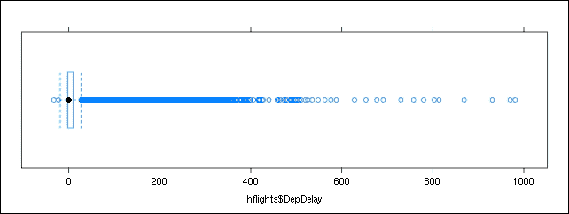

# 第八章：数据精炼

当处理数据时，你通常会发现数据可能并不总是完美的或干净的，在缺失值、异常值和类似异常方面。处理和清理不完美或所谓的脏数据是每位数据科学家日常生活中的一个部分，甚至更多，这可能会占用我们实际处理数据时间的多达 80%！

数据集错误通常是由于数据采集方法不充分，但与其重复和调整数据采集过程，通常更好（在节省金钱、时间和其他资源方面）或不可避免的是通过几个简单的函数和算法来精炼数据。在本章中，我们将涵盖：

+   不同函数中`na.rm`参数的不同用法

+   用于去除缺失数据的`na.action`和相关函数

+   几个提供用户友好数据插补方式的软件包

+   包含多个用于极端值统计测试的`outliers`软件包

+   如何作为脑筋急转弯自己实现 Lund 的异常值测试

+   参考一些稳健的方法

# 缺失数据的类型和来源

首先，我们必须快速查看可能的缺失数据的不同来源，以确定我们通常如何以及为什么得到缺失值。数据丢失的原因有很多，可以分为 3 种不同类型。

例如，缺失数据的主要原因可能是设备故障或人为错误地输入数据。**完全随机缺失**（MCAR）意味着数据集中的每个值都有相同的概率被遗漏，因此我们不应该期望由于缺失数据而出现系统错误或扭曲，也无法解释缺失值的模式。如果我们数据集中有`NA`（意为：无回答、不适用或不可用）值，这是最好的情况。

但与完全随机缺失（MCAR）相比，更常见且不幸的一种缺失数据类型是**随机缺失**（MAR）。在 MAR 的情况下，缺失值的模式是已知的或至少可以识别的，尽管它与实际的缺失值无关。例如，可以想象一个男性比女性更孤独或更懒惰的群体，因此他们可能不愿意回答调查中的所有问题——无论实际问题是怎样的。所以并不是因为男性比女性赚得多或少，他们只是倾向于随机跳过问卷中的几个问题。

### 注意

这种缺失数据的分类和类型学最初是由 Donald B. Rubin 在 1976 年提出的，他在《Biometrika 63(3): 581—592》上发表的《Inference and Missing Data》一文中进行了阐述，后来在 Roderick J. A. Little（2002 年）合著的书中进行了回顾和扩展：《Statistical Analysis with Missing Data》，Wiley – 这本书对于深入了解细节非常值得一读。

最糟糕的情况是**缺失非随机**（**MNAR**），其中数据缺失是由于与实际问题高度相关的特定原因，将缺失值分类为不可忽视的非响应。

在包含敏感问题的调查或研究准备设计缺陷的情况下，这种情况相当常见。在这种情况下，数据缺失是由于背景中某些潜在过程导致的，这通常是我们在研究帮助下想要更好地了解的事情——这可能会变成一个相当麻烦的情况。

那么，我们如何解决这些问题呢？有时这相对简单。例如，如果我们有很多观测值，由于大数定律，MCAR 根本不是问题，因为每个观测值缺失值的概率是相同的。我们基本上有两个选项来处理未知或缺失的数据：

+   删除缺失值和/或观测值

+   用一些估计值替换缺失值

# 识别缺失数据

处理缺失值的最简单方法，特别是对于 MCAR 数据，就是简单地删除任何有缺失值的观测值。如果我们想排除`matrix`或`data.frame`对象中至少有一个缺失值的每一行，我们可以使用`stats`包中的`complete.cases`函数来识别这些行。

为了快速入门，让我们看看有多少行至少有一个缺失值：

```py
> library(hflights)
> table(complete.cases(hflights))
 FALSE   TRUE 
 3622 223874

```

这大约是 25 万行中的 1.5%：

```py
> prop.table(table(complete.cases(hflights))) * 100
 FALSE      TRUE 
 1.592116 98.407884

```

让我们看看`NA`在不同列中的分布情况：

```py
> sort(sapply(hflights, function(x) sum(is.na(x))))
 Year             Month        DayofMonth 
 0                 0                 0 
 DayOfWeek     UniqueCarrier         FlightNum 
 0                 0                 0 
 TailNum            Origin              Dest 
 0                 0                 0 
 Distance         Cancelled  CancellationCode 
 0                 0                 0 
 Diverted           DepTime          DepDelay 
 0              2905              2905 
 TaxiOut           ArrTime            TaxiIn 
 2947              3066              3066 
ActualElapsedTime           AirTime          ArrDelay 
 3622              3622              3622

```

# 跳过缺失值

因此，似乎缺失数据相对频繁地出现在与时间相关的变量中，但在航班标识符和日期中我们没有缺失值。另一方面，如果一个航班的某个值缺失，那么其他一些变量也缺失的可能性相当高——在总共 3,622 个至少有一个缺失值的案例中：

```py
> mean(cor(apply(hflights, 2, function(x)
+    as.numeric(is.na(x)))), na.rm = TRUE)
[1] 0.9589153
Warning message:
In cor(apply(hflights, 2, function(x) as.numeric(is.na(x)))) :
 the standard deviation is zero

```

好吧，让我们看看我们在这里做了什么！首先，我们调用了`apply`函数将`data.frame`的值转换为`0`或`1`，其中`0`表示观测值，而`1`表示缺失值。然后我们计算了这个新创建矩阵的相关系数，由于一些列只有一个唯一值且没有任何变化，因此返回了大量的缺失值，正如警告信息所示。为此，我们必须将`na.rm`参数指定为`TRUE`，这样`mean`函数就会返回一个真实值而不是`NA`，通过删除`cor`函数返回的相关系数中的缺失值。

因此，一个选择是大量使用`na.rm`参数，这是大多数对缺失数据敏感的函数所支持的——以下是从`base`和`stats`包中的一些例子：`mean`、`median`、`sum`、`max`和`min`。

要编译包含在基础包中具有 `na.rm` 参数的所有函数的完整列表，我们可以遵循位于 [`stackoverflow.com/a/17423072/564164`](http://stackoverflow.com/a/17423072/564164) 的一个非常有趣的 SO 答案中描述的步骤。我发现这个答案很有启发性，因为我真正相信分析我们用于分析的工具的力量，换句话说，花些时间理解 R 在后台是如何工作的。

首先，让我们列出 `baseenv`（`base` 包的环境）中找到的所有函数，以及完整的函数参数和主体：

```py
> Funs <- Filter(is.function, sapply(ls(baseenv()), get, baseenv()))

```

然后，我们可以通过以下方式从返回的列表中 `Filter` 所有那些具有 `na.rm` 作为形式参数的函数：

```py
> names(Filter(function(x)
+    any(names(formals(args(x))) %in% 'na.rm'), Funs))
 [1] "all"                     "any" 
 [3] "colMeans"                "colSums" 
 [5] "is.unsorted"             "max" 
 [7] "mean.default"            "min" 
 [9] "pmax"                    "pmax.int" 
[11] "pmin"                    "pmin.int" 
[13] "prod"                    "range" 
[15] "range.default"           "rowMeans" 
[17] "rowsum.data.frame"       "rowsum.default" 
[19] "rowSums"                 "sum" 
[21] "Summary.data.frame"      "Summary.Date" 
[23] "Summary.difftime"        "Summary.factor" 
[25] "Summary.numeric_version" "Summary.ordered" 
[27] "Summary.POSIXct"         "Summary.POSIXlt" 

```

这可以很容易地应用于任何 R 包，只需更改环境变量，例如将 `stats` 包的情况更改为 `'package:stats'`：

```py
> names(Filter(function(x)
+   any(names(formals(args(x))) %in% 'na.rm'),
+     Filter(is.function,
+       sapply(ls('package:stats'), get, 'package:stats'))))
 [1] "density.default" "fivenum"         "heatmap" 
 [4] "IQR"             "mad"             "median" 
 [7] "median.default"  "medpolish"       "sd" 
[10] "var" 

```

因此，这些是在 `base` 和 `stats` 包中具有 `na.rm` 参数的函数，我们已经看到，在单个函数调用中忽略缺失值（实际上并不从数据集中删除 `NA` 值）最快和最简单的方法是将 `na.rm` 设置为 `TRUE`。但为什么 `na.rm` 默认不是 `TRUE`？

## 覆盖函数的默认参数

如果你因为大多数函数在 R 对象包含缺失值时返回 `NA` 而感到烦恼，那么你可以通过使用一些自定义包装函数来覆盖这些函数，例如：

```py
> myMean <- function(...) mean(..., na.rm = TRUE)
> mean(c(1:5, NA))
[1] NA
> myMean(c(1:5, NA))
[1] 3

```

另一个选择可能是编写一个自定义包，该包将覆盖 `base` 和 `stats` 函数的工厂默认设置，就像 `rapportools` 包一样，它包含了一些具有合理默认值的辅助函数，用于报告：

```py
> library(rapportools)
Loading required package: reshape

Attaching package: 'rapportools'

The following objects are masked from 'package:stats':

 IQR, median, sd, var

The following objects are masked from 'package:base':

 max, mean, min, range, sum

> mean(c(1:5, NA))
[1] 3

```

这种方法的缺点在于你已永久覆盖了列出的那些函数，因此你需要重新启动你的 R 会话或断开 `rapportools` 包来重置为标准参数，例如：

```py
> detach('package:rapportools')
> mean(c(1:5, NA))
[1] NA

```

要覆盖函数的默认参数，一个更通用的解决方案是依赖 `Defaults` 包的一些巧妙特性，尽管它不再处于积极维护状态，但它确实完成了工作：

```py
> library(Defaults)
> setDefaults(mean.default, na.rm = TRUE)
> mean(c(1:5, NA))
[1] 3

```

请注意，在这里我们必须更新 `mean.default` 的默认参数值，而不是简单地尝试调整 `mean`，因为后者会导致错误：

```py
> setDefaults(mean, na.rm = TRUE)
Warning message:
In setDefaults(mean, na.rm = TRUE) :
 'na.rm' was not set, possibly not a formal arg for 'mean'

```

这是因为 `mean` 是一个没有任何形式参数的 `S3` 方法：

```py
> mean
function (x, ...) 
{
 if (exists(".importDefaults")) 
 .importDefaults(calling.fun = "mean")
 UseMethod("mean")
}
<environment: namespace:base>
> formals(mean)
$x

$...

```

无论你更喜欢哪种方法，你都可以通过在 `Rprofile` 文件中添加几行代码来自动在 R 启动时调用这些函数。

### 注意

你可以通过全局或用户特定的`Rprofile`文件来定制 R 环境。这是一个普通的 R 脚本，通常放在用户的家目录中，文件名以点开头，每次启动新的 R 会话时都会运行。在那里，你可以调用在`.First`或`.Last`函数中包装的任何 R 函数，这些函数将在 R 会话的开始或结束时运行。这些有用的添加可能包括加载一些 R 包，从数据库中打印自定义问候语或 KPI 指标，或者例如安装所有 R 包的最新版本。

但可能最好不要以这种方式非标准地调整你的 R 环境，因为你可能会很快在分析中遇到一些神秘和意外的错误或无声的故障。

例如，我已经习惯了在所有时候都在临时目录中工作，通过在`Rprofile`中指定`setwd('/tmp')`来实现，这对于频繁启动 R 会话进行一些快速工作非常有用。另一方面，当你花费 15 分钟的时间调试为什么某个随机的 R 函数似乎不起作用，以及为什么它返回一些文件未找到的错误消息时，这真的很令人沮丧。

所以请务必注意：如果你更新了 R 函数的工厂默认参数，在尝试在带有`--vanilla`命令行选项启动的纯 R 会话中重现这些错误之前，不要在 R 邮件列表上对你在 base R 的一些主要函数中发现的新错误进行抱怨。

# 消除缺失数据

在 R 函数中使用`na.rm`参数的另一种方法是，在将数据集传递给分析函数之前从数据集中删除`NA`。这意味着我们永久性地从数据集中删除缺失值，这样它们就不会在分析的后阶段引起任何问题。为此，我们可以使用`na.omit`或`na.exclude`函数：

```py
> na.omit(c(1:5, NA))
[1] 1 2 3 4 5
attr(,"na.action")
[1] 6
attr(,"class")
[1] "omit"
> na.exclude(c(1:5, NA))
[1] 1 2 3 4 5
attr(,"na.action")
[1] 6
attr(,"class")
[1] "exclude"

```

这两个函数之间的唯一区别是返回的 R 对象的`na.action`属性的类别，分别是`omit`和`exclude`。这个细微的区别仅在建模时很重要。`na.exclude`函数对于残差和预测返回`NA`，而`na.omit`抑制这些向量的元素：

```py
> x <- rnorm(10); y <- rnorm(10)
> x[1] <- NA; y[2] <- NA
> exclude <- lm(y ~ x, na.action = "na.exclude")
> omit <- lm(y ~ x, na.action = "na.omit")
> residuals(exclude)
 1     2     3     4     5     6     7     8     9    10 
 NA    NA -0.89 -0.98  1.45 -0.23  3.11 -0.23 -1.04 -1.20 

> residuals(omit)
 3     4     5     6     7     8     9    10 
-0.89 -0.98  1.45 -0.23  3.11 -0.23 -1.04 -1.20

```

在表格数据的情况下，如`matrix`或`data.frame`，这些函数会删除包含至少一个缺失值的整个行。为了快速演示，让我们创建一个 3 列 3 行的矩阵，值从 1 递增到 9，但将所有能被 4 整除的值替换为`NA`：

```py
> m <- matrix(1:9, 3)
> m[which(m %% 4 == 0, arr.ind = TRUE)] <- NA
> m
 [,1] [,2] [,3]
[1,]    1   NA    7
[2,]    2    5   NA
[3,]    3    6    9
> na.omit(m)
 [,1] [,2] [,3]
[1,]    3    6    9
attr(,"na.action")
[1] 1 2
attr(,"class")
[1] "omit"

```

如此可见，我们可以在`na.action`属性中找到已删除案例的行号。

# 在实际分析之前或期间过滤缺失数据

假设我们想要计算实际飞行长度的`平均值`：

```py
> mean(hflights$ActualElapsedTime)
[1] NA

```

结果当然是`NA`，因为如前所述，这个变量包含缺失值，并且几乎所有的 R 操作与`NA`结合都会得到`NA`。所以让我们这样解决这个问题：

```py
> mean(hflights$ActualElapsedTime, na.rm = TRUE)
[1] 129.3237
> mean(na.omit(hflights$ActualElapsedTime))
[1] 129.3237

```

那里有没有性能问题？或者有其他决定使用哪种方法的方式？

```py
> library(microbenchmark)
> NA.RM   <- function()
+              mean(hflights$ActualElapsedTime, na.rm = TRUE)
> NA.OMIT <- function()
+              mean(na.omit(hflights$ActualElapsedTime))
> microbenchmark(NA.RM(), NA.OMIT())
Unit: milliseconds
 expr       min        lq    median        uq       max neval
 NA.RM()  7.105485  7.231737  7.500382  8.002941  9.850411   100
 NA.OMIT() 12.268637 12.471294 12.905777 13.376717 16.008637   100

```

这些选项的性能，通过`microbenchmark`包的帮助计算（请参阅第一章中的*加载合理大小的文本文件*部分，*欢迎数据*了解更多细节）表明，在单个函数调用的情况下，使用`na.rm`是更好的解决方案。

另一方面，如果我们想在分析的一些后续阶段重新使用数据，从数据集中一次性省略缺失值和观测值会更可行和有效，而不是总是指定`na.rm`为`TRUE`。

# 数据插补

有时候省略缺失值可能不合理或根本不可能，例如由于观测值数量少或似乎缺失数据不是随机的。在这种情况下，数据插补是一个真正的替代方案，这种方法可以根据各种算法将`NA`替换为一些真实值，例如通过以下方式填充空单元格：

+   已知的标量

+   在（hot-deck）列中出现的上一个值

+   同一列中的随机元素

+   列中最频繁的值

+   同一列中给定概率的不同值

+   基于回归或机器学习模型的预测值

热插补方法通常在合并多个数据集时使用。在这种情况下，`data.table`的`roll`参数可能非常有用和高效，否则请确保查看`VIM`包中的`hotdeck`函数，它提供了一些可视化缺失数据的有用方法。但当我们处理数据集的给定列时，我们还有一些其他简单的选项。

例如，插补一个已知的标量是一个相当简单的情况，其中我们知道所有缺失值都是由于某些研究设计模式。让我们考虑一个数据库，该数据库存储了每个工作日到达和离开办公室的时间，通过计算这两个时间之间的差异，我们可以分析每天在办公室花费的工作小时数。如果这个变量在某个时间段返回`NA`，实际上意味着我们整天都在办公室外，因此计算出的值应该是零而不是`NA`。

而且不仅是在理论上，在 R 中实现这一点也很简单（以下示例从之前的演示代码继续，其中我们用两个缺失值定义了`m`）：

```py
> m[which(is.na(m), arr.ind = TRUE)] <- 0
> m
 [,1] [,2] [,3]
[1,]    1    0    7
[2,]    2    5    0
[3,]    3    6    9

```

类似地，用随机数、其他值的`sample`或变量的`mean`替换缺失值可以相对容易地完成：

```py
> ActualElapsedTime <- hflights$ActualElapsedTime
> mean(ActualElapsedTime, na.rm = TRUE)
[1] 129.3237
> ActualElapsedTime[which(is.na(ActualElapsedTime))] <-
+   mean(ActualElapsedTime, na.rm = TRUE)
> mean(ActualElapsedTime)
[1] 129.3237

```

使用`Hmisc`包中的`impute`函数甚至可以更容易：

```py
> library(Hmisc)
> mean(impute(hflights$ActualElapsedTime, mean))
[1] 129.3237

```

当然，我们似乎保留了算术平均值的值，但你应该意识到一些非常严重的副作用：

```py
> sd(hflights$ActualElapsedTime, na.rm = TRUE)
[1] 59.28584
> sd(ActualElapsedTime)
[1] 58.81199

```

当用平均值替换缺失值时，转换变量的方差将自然低于原始分布。在某些情况下，这可能会非常成问题，需要更复杂的方法。

## 模型缺失值

除了前面提到的单变量方法之外，你还可以在数据集中的完整案例上拟合模型，而不是在剩余的行上拟合这些模型来估计缺失值。或者简单地说，我们用多变量预测来替换缺失值。

有许多相关的函数和包，例如你可能对`Hmisc`包中的`transcan`函数感兴趣，或者`imputeR`包，它包括用于插补分类和连续变量的广泛模型。

大多数的插补方法和模型都是针对一种类型的变量：要么是连续的，要么是分类的。在混合类型数据集的情况下，我们通常使用不同的算法来处理不同类型的缺失数据。这种方法的问题是一些可能存在于不同类型数据之间的关系可能会被忽略，从而导致一些部分模型。

为了克服这个问题，并且为了在书中节省一些关于传统回归和其他相关数据插补方法的描述页面（尽管你可以在第五章"), *构建模型（由 Renata Nemeth 和 Gergely Toth 编写)* 和第六章"), *超越线性趋势线（由 Renata Nemeth 和 Gergely Toth 编写)* 中找到一些相关方法），我们将专注于一个非参数方法，该方法可以通过`missForest`包中非常用户友好的界面同时处理分类和连续变量。

这个迭代过程在可用数据上拟合随机森林模型，以预测缺失值。由于我们的`hflights`数据集对于这个过程来说相对较大，运行示例代码会花费很长时间，所以我们将在下一个示例中使用标准的`iris`数据集。

首先，让我们看看数据集的原始结构，它不包含任何缺失值：

```py
> summary(iris)
 Sepal.Length    Sepal.Width     Petal.Length    Petal.Width 
 Min.   :4.300   Min.   :2.000   Min.   :1.000   Min.   :0.100 
 1st Qu.:5.100   1st Qu.:2.800   1st Qu.:1.600   1st Qu.:0.300 
 Median :5.800   Median :3.000   Median :4.350   Median :1.300 
 Mean   :5.843   Mean   :3.057   Mean   :3.758   Mean   :1.199 
 3rd Qu.:6.400   3rd Qu.:3.300   3rd Qu.:5.100   3rd Qu.:1.800 
 Max.   :7.900   Max.   :4.400   Max.   :6.900   Max.   :2.500 
 Species 
 setosa    :50 
 versicolor:50 
 virginica :50 

```

现在让我们加载这个包，并在数据集中添加一些缺失值（完全随机地），以产生一个可重复的最小示例，用于后续模型的构建：

```py
> library(missForest)
> set.seed(81)
> miris <- prodNA(iris, noNA = 0.2)
> summary(miris)
 Sepal.Length    Sepal.Width     Petal.Length    Petal.Width 
 Min.   :4.300   Min.   :2.000   Min.   :1.100   Min.   :0.100 
 1st Qu.:5.200   1st Qu.:2.800   1st Qu.:1.600   1st Qu.:0.300 
 Median :5.800   Median :3.000   Median :4.450   Median :1.300 
 Mean   :5.878   Mean   :3.062   Mean   :3.905   Mean   :1.222 
 3rd Qu.:6.475   3rd Qu.:3.300   3rd Qu.:5.100   3rd Qu.:1.900 
 Max.   :7.900   Max.   :4.400   Max.   :6.900   Max.   :2.500 
 NA's   :28      NA's   :29      NA's   :32      NA's   :33 
 Species 
 setosa    :40 
 versicolor:38 
 virginica :44 
 NA's      :28 

```

因此，现在每个列中大约有 20%的缺失值，这也在前面的摘要的最后一行中提到。完全随机缺失值的数量在 28 到 33 个案例之间。

下一步应该是构建随机森林模型，用实数和因子水平替换缺失值。因为我们也有原始数据集，我们可以使用这个完整的矩阵通过`xtrue`参数来测试方法的性能，该参数在调用函数时计算并返回错误率。这在这样的教学示例中很有用，可以展示模型和预测如何从迭代到迭代地改进：

```py
> iiris <- missForest(miris, xtrue = iris, verbose = TRUE)
 missForest iteration 1 in progress...done!
 error(s): 0.1512033 0.03571429 
 estimated error(s): 0.1541084 0.04098361 
 difference(s): 0.01449533 0.1533333 
 time: 0.124 seconds

 missForest iteration 2 in progress...done!
 error(s): 0.1482248 0.03571429 
 estimated error(s): 0.1402145 0.03278689 
 difference(s): 9.387853e-05 0 
 time: 0.114 seconds

 missForest iteration 3 in progress...done!
 error(s): 0.1567693 0.03571429 
 estimated error(s): 0.1384038 0.04098361 
 difference(s): 6.271654e-05 0 
 time: 0.152 seconds

 missForest iteration 4 in progress...done!
 error(s): 0.1586195 0.03571429 
 estimated error(s): 0.1419132 0.04918033 
 difference(s): 3.02275e-05 0 
 time: 0.116 seconds

 missForest iteration 5 in progress...done!
 error(s): 0.1574789 0.03571429 
 estimated error(s): 0.1397179 0.04098361 
 difference(s): 4.508345e-05 0 
 time: 0.114 seconds

```

算法运行了 5 次迭代后停止，此时似乎错误率没有进一步改善。返回的`missForest`对象除了填充后的数据集外，还包括一些其他值：

```py
> str(iiris)
List of 3
 $ ximp    :'data.frame':  150 obs. of  5 variables:
 ..$ Sepal.Length: num [1:150] 5.1 4.9 4.7 4.6 5 ...
 ..$ Sepal.Width : num [1:150] 3.5 3.3 3.2 3.29 3.6 ...
 ..$ Petal.Length: num [1:150] 1.4 1.4 1.3 1.42 1.4 ...
 ..$ Petal.Width : num [1:150] 0.2 0.218 0.2 0.2 0.2 ...
 ..$ Species     : Factor w/ 3 levels "setosa","versicolor",..: ...
 $ OOBerror: Named num [1:2] 0.1419 0.0492
 ..- attr(*, "names")= chr [1:2] "NRMSE" "PFC"
 $ error   : Named num [1:2] 0.1586 0.0357
 ..- attr(*, "names")= chr [1:2] "NRMSE" "PFC"
 - attr(*, "class")= chr "missForest"

```

箱外误差是对我们的模型有多好的估计，基于数值的**归一化均方根误差计算**（**NRMSE**）和因子的**错误分类比例**（**PFC**）。而且，因为我们也为之前运行过的模型提供了完整的数据集，所以我们还得到了真实的填充误差比率——这非常接近上述估计。

### 注意

请在第十章 *分类和聚类* 中查找有关随机森林和相关机器学习主题的更多详细信息。

但这种方法和一个更简单的填充方法，比如用平均值替换缺失值，相比如何呢？

## 比较不同的填充方法

在比较中，我们只会使用`iris`数据集的前四列，因此目前并没有处理因子变量。让我们准备这个演示数据集：

```py
> miris <- miris[, 1:4]

```

在`iris_mean`中，我们将所有缺失值替换为实际列的平均值：

```py
> iris_mean <- impute(miris, fun = mean)

```

在`iris_forest`中，我们通过拟合随机森林模型来预测缺失值：

```py
> iris_forest <- missForest(miris)
 missForest iteration 1 in progress...done!
 missForest iteration 2 in progress...done!
 missForest iteration 3 in progress...done!
 missForest iteration 4 in progress...done!
 missForest iteration 5 in progress...done!

```

现在，让我们简单地通过比较`iris_mean`和`iris_forest`与完整的`iris`数据集的相关性来检查两个模型的准确性。对于`iris_forest`，我们将从`ximp`属性中提取实际的填充数据集，并且我们将默默地忽略原始`iris`表中的因子变量：

```py
> diag(cor(iris[, -5], iris_mean))
Sepal.Length  Sepal.Width Petal.Length  Petal.Width 
 0.6633507    0.8140169    0.8924061    0.4763395 
> diag(cor(iris[, -5], iris_forest$ximp))
Sepal.Length  Sepal.Width Petal.Length  Petal.Width 
 0.9850253    0.9320711    0.9911754    0.9868851

```

这些结果表明，非参数随机森林模型与用平均值替换缺失值的简单单变量解决方案相比，做得更好。

## 未填充缺失值

请注意，这些方法同样有其缺点。用预测值替换缺失值通常缺乏任何误差项和残差方差，这在大多数模型中都是如此。

这也意味着我们在降低变异性，同时在数据集中高估了一些关联，这可能会严重影响我们的数据分析结果。为此，过去引入了一些模拟技术来克服由于一些任意模型而扭曲数据集和我们的假设检验的问题。

## 多次填充

多重插补背后的基本思想是连续多次对缺失值进行模型拟合。这种蒙特卡洛方法通常创建一些（如 3 到 10 个）模拟完整数据集的并行版本，每个版本分别进行分析，然后我们将结果结合起来产生实际的估计值和置信区间。例如，查看 `Hmisc` 包中的 `aregImpute` 函数以获取更多详细信息。

另一方面，我们是否真的需要在所有情况下都删除或插补缺失值？关于这个问题的更多细节，请参阅本章的最后部分。但在那之前，让我们了解一下对数据进行润色的一些其他要求。

# 极端值和异常值

异常值或极端值被定义为与其它观测值差异如此之大，以至于它变得可疑，可能是完全不同的机制或简单地由错误生成的。识别异常值很重要，因为这些极端值可以：

+   增加误差方差

+   影响估计

+   降低正态性

或者换句话说，假设你的原始数据集是一块要用于某些游戏中完美球体的圆形石头，在使用之前必须进行清洁和抛光。石头表面有一些小孔，就像数据中的缺失值一样，应该用数据插补来填补。

另一方面，这块石头不仅在表面上有很多孔，而且还有一些泥土覆盖了物品的一些部分，这些部分需要被去除。但我们是怎样区分泥土和真正的石头的呢？在本节中，我们将关注 `outliers` 包和一些相关方法在识别极端值方面能提供什么。

由于这个包与 `randomForest` 包（由 `missForest` 包自动加载）有一些冲突的函数名，所以在进入以下示例之前，明智的做法是先卸载后者：

```py
> detach('package:missForest')
> detach('package:randomForest')

```

`outlier` 函数返回与平均值差异最大的值，尽管其名称与之相反，这个值不一定是异常值。相反，该函数可以用来给分析师一个关于哪些值可能是异常值的想法：

```py
> library(outliers)
> outlier(hflights$DepDelay)
[1] 981

```

因此，有一架航班在起飞前延误了超过 16 小时！这很令人印象深刻，不是吗？让我们看看它是否正常这么晚起飞：

```py
> summary(hflights$DepDelay)
 Min. 1st Qu.  Median    Mean 3rd Qu.    Max.    NA's 
-33.000  -3.000   0.000   9.445   9.000 981.000    2905

```

好吧，平均值大约是 10 分钟，但由于它甚至比第三季度还要大，而中位数是零，所以不难猜测相对较大的平均值是由于一些极端值：

```py
> library(lattice)
> bwplot(hflights$DepDelay)

```



前面的箱线图清楚地显示，大多数航班仅延误了几分钟，四分位距大约是 10 分钟：

```py
> IQR(hflights$DepDelay, na.rm = TRUE)
[1] 12

```

前面的图像中所有的蓝色圆圈都是可能的极端值，因为它们高于上四分位数 1.5 的四分位距。但我们如何（从统计学的角度）测试一个值呢？

## 测试极端值

`outliers` 包含几个捆绑的极端值检测算法，例如：

+   Dixon 的 Q 测试（`dixon.test`）

+   Grubb 的测试（`grubbs.test`）

+   异常值和内嵌方差（`cochran.test`）

+   卡方检验（`chisq.out.test`）

这些函数极其容易使用。只需将一个向量传递给统计测试，显著性测试返回的 p 值将清楚地表明数据中是否存在异常值。例如，让我们测试 0 到 1 之间的 10 个随机数与一个相对较大的数，以验证它在这个小样本中是否是极端值：

```py
> set.seed(83)
> dixon.test(c(runif(10), pi))

 Dixon test for outliers

data:  c(runif(10), pi)
Q = 0.7795, p-value < 2.2e-16
alternative hypothesis: highest value 3.14159265358979 is an outlier

```

但不幸的是，我们无法在我们的实际数据集中使用这些方便的函数，因为这些方法假设正态分布，而我们都知道，在我们的情况下这绝对不是真的：航班往往比预定时间晚到，而不是提前到达目的地。

对于这个，我们应该使用一些更稳健的方法，比如 `mvoutlier` 包，或者像 Lund 在 40 年前建议的一些非常简单的方法。这个测试基本上是通过一个非常简单的线性回归来计算每个值与平均值的距离：

```py
> model <- lm(hflights$DepDelay ~ 1)

```

只是为了验证我们现在确实是在测量与平均值之间的距离：

```py
> model$coefficients
(Intercept) 
 9.444951 
> mean(hflights$DepDelay, na.rm = TRUE)
[1] 9.444951

```

现在让我们根据 F 分布和两个辅助变量（其中 `a` 代表 alpha 值，`n` 代表案例数）来计算临界值：

```py
> a <- 0.1
> (n <- length(hflights$DepDelay))
[1] 227496
> (F <- qf(1 - (a/n), 1, n-2, lower.tail = TRUE))
[1] 25.5138

```

这可以被传递到 Lund 的公式中：

```py
> (L <- ((n - 1) * F / (n - 2 + F))⁰.5)
[1] 5.050847

```

现在让我们看看有多少值的标准化残差高于这个计算出的临界值：

```py
> sum(abs(rstandard(model)) > L)
[1] 1684

```

但我们真的需要从我们的数据中移除这些异常值吗？极端值不是正常的吗？有时这些原始数据中的人为编辑，比如填补缺失值或移除异常值，带来的麻烦比它值得的还要多。

# 使用稳健的方法

幸运的是，有一些稳健的方法可以分析数据集，这些方法通常对极端值不太敏感。这些稳健的统计方法自 1960 年以来就已经发展起来，但还有一些更早的知名相关方法，比如使用中位数而不是平均值作为中心趋势。当我们的数据的基本分布被认为不遵循高斯曲线时，通常会使用稳健的方法，因此大多数好的旧回归模型都不适用（更多细节请见第五章 Chapter 5"), *Buildings Models (authored by Renata Nemeth and Gergely Toth)* 和第六章 Chapter 6"), *Beyond the Linear Trend Line (authored by Renata Nemeth and Gergely Toth)*）。

让我们以传统的线性回归为例，预测鸢尾花的花瓣长度，基于花瓣长度并有一些缺失数据。为此，我们将使用之前定义的 `miris` 数据集：

```py
> summary(lm(Sepal.Length ~ Petal.Length, data = miris))

Call:
lm(formula = Sepal.Length ~ Petal.Length, data = miris)

Residuals:
 Min       1Q   Median       3Q      Max 
-1.26216 -0.36157  0.01461  0.35293  1.01933 

Coefficients:
 Estimate Std. Error t value Pr(>|t|) 
(Intercept)   4.27831    0.11721   36.50   <2e-16 ***
Petal.Length  0.41863    0.02683   15.61   <2e-16 ***
---
Signif. codes:  0 '***' 0.001 '**' 0.01 '*' 0.05 '.' 0.1 ' ' 1

Residual standard error: 0.4597 on 92 degrees of freedom
 (56 observations deleted due to missingness)
Multiple R-squared:  0.7258,  Adjusted R-squared:  0.7228 
F-statistic: 243.5 on 1 and 92 DF,  p-value: < 2.2e-16

```

因此，我们的花瓣与萼片长度比率的估计大约为 `0.42`，顺便说一句，这并不太远离真实值：

```py
> lm(Sepal.Length ~ Petal.Length, data = iris)$coefficients
 (Intercept) Petal.Length 
 4.3066034    0.4089223

```

估计系数与实际系数之间的差异是由于前一个章节中人为引入的缺失值造成的。我们能否产生更好的估计值？我们可以用之前提到的任何一种方法来估计缺失数据，或者我们更应该拟合一个来自`MASS`包的稳健线性回归，预测`Sepal.Length`与`Petal.Length`变量：

```py
> library(MASS)
> summary(rlm(Sepal.Length ~ Petal.Length, data = miris))

Call: rlm(formula = Sepal.Length ~ Petal.Length, data = miris)
Residuals:
 Min       1Q   Median       3Q      Max 
-1.26184 -0.36098  0.01574  0.35253  1.02262 

Coefficients:
 Value   Std. Error t value
(Intercept)   4.2739  0.1205    35.4801
Petal.Length  0.4195  0.0276    15.2167

Residual standard error: 0.5393 on 92 degrees of freedom
 (56 observations deleted due to missingness)

```

现在我们来比较针对原始（完整）数据和模拟数据（包含缺失值）运行的模型的系数：

```py
> f <- formula(Sepal.Length ~ Petal.Length)
> cbind(
+     orig =  lm(f, data = iris)$coefficients,
+     lm   =  lm(f, data = miris)$coefficients,
+     rlm  = rlm(f, data = miris)$coefficients)
 orig        lm       rlm
(Intercept)  4.3066034 4.2783066 4.2739350
Petal.Length 0.4089223 0.4186347 0.4195341

```

说实话，标准线性回归和稳健版本之间没有太大的区别。惊讶吗？嗯，数据集包含的缺失值是完全随机出现的，但如果数据集包含其他类型的缺失值或异常值会怎样呢？让我们通过模拟一些更脏的数据问题（将第一个观察值的萼片长度从`1.4`更新到`14`——让我们假设是由于数据输入错误）并重新构建模型来验证这一点：

```py
> miris$Sepal.Length[1] <- 14
> cbind(
+     orig = lm(f, data = iris)$coefficients,
+     lm   = lm(f, data = miris)$coefficients,
+     rlm  = rlm(f, data = miris)$coefficients)
 orig        lm       rlm
(Intercept)  4.3066034 4.6873973 4.2989589
Petal.Length 0.4089223 0.3399485 0.4147676

```

看起来`lm`模型的性能下降了很多，而稳健模型的系数几乎与原始模型相同，无论数据中的异常值如何。我们可以得出结论，稳健方法在处理极端值时是非常令人印象深刻且强大的工具！有关 R 中已实现的有关方法的更多信息，请访问相关的 CRAN 任务视图[`cran.r-project.org/web/views/Robust.html`](http://cran.r-project.org/web/views/Robust.html)。

# 摘要

本章重点介绍了数据分析中的一些最具挑战性的问题，特别是在数据清洗方面，我们涵盖了关于缺失值和极端值的最重要主题。根据你的兴趣领域或你所在行业的不同，脏数据可能是一个罕见或主要问题（例如，我过去看到过一些项目，其中正则表达式被应用于`JSON`文件以使其有效），但我相信，无论你的背景如何，你都会发现下一章既有趣又有用——我们将学习多元统计分析技术。
