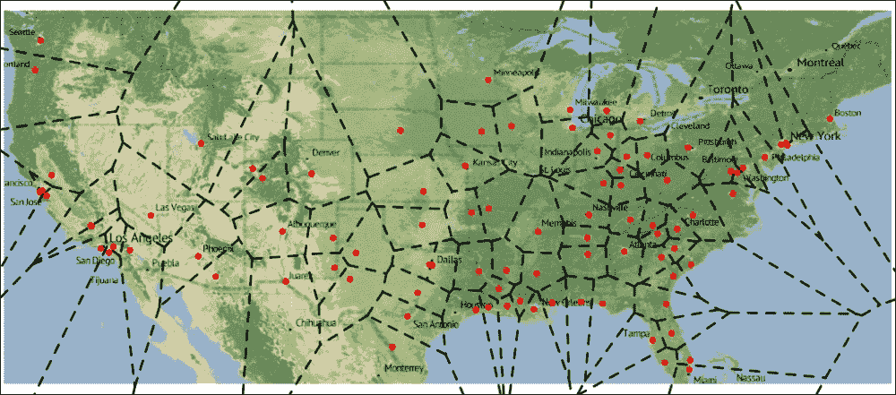

# 第十三章。我们周围的数据

空间数据，也称为地理空间数据，标识了地理位置，例如我们周围的天然或人工特征。尽管所有观测值都有一些空间内容，例如观测值的位置，但由于空间信息的复杂性质，这通常超出了大多数数据分析工具的范围；或者，在给定的研究主题中，空间性可能不是那么有趣（乍一看）。

另一方面，分析空间数据可以揭示数据的一些非常重要的潜在结构，并且花时间可视化接近或远离数据点之间的差异和相似性是非常值得的。

在本章中，我们将帮助您完成这项工作，并使用各种 R 包来：

+   从互联网检索地理空间信息

+   在地图上可视化点和多边形

+   计算一些空间统计量

# 地理编码

如前几章所述，我们将使用 `hflights` 数据集来演示如何处理包含空间信息的数据。为此，让我们像在 第十二章 *分析时间序列* 中所做的那样，对我们的数据集进行聚合，但这次不是生成每日数据，而是查看机场的聚合特征。为了性能考虑，我们将再次使用在 第三章 *过滤和汇总数据* 和 第四章 *重构数据* 中介绍的 `data.table` 包：

```py
> library(hflights)
> library(data.table)
> dt <- data.table(hflights)[, list(
+     N         = .N,
+     Cancelled = sum(Cancelled),
+     Distance  = Distance[1],
+     TimeVar   = sd(ActualElapsedTime, na.rm = TRUE),
+     ArrDelay  = mean(ArrDelay, na.rm = TRUE)) , by = Dest]

```

因此，我们已经加载了 `hfights` 数据集，并将其立即转换为 `data.table` 对象。同时，我们按航班的目的地进行聚合，以计算：

+   行数数量

+   取消的航班数量

+   距离

+   飞行延误时间的标准差

+   延误的算术平均值

结果的 R 对象看起来像这样：

```py
> str(dt)
Classes 'data.table' and 'data.frame': 116 obs. of 6 variables:
 $ Dest     : chr  "DFW" "MIA" "SEA" "JFK" ...
 $ N        : int  6653 2463 2615 695 402 6823 4893 5022 6064 ...
 $ Cancelled: int  153 24 4 18 1 40 40 27 33 28 ...
 $ Distance : int  224 964 1874 1428 3904 305 191 140 1379 862 ...
 $ TimeVar  : num  10 12.4 16.5 19.2 15.3 ...
 $ ArrDelay : num  5.961 0.649 9.652 9.859 10.927 ...
 - attr(*, ".internal.selfref")=<externalptr>

```

因此，我们拥有全球 116 个观测值和五个描述这些观测值的变量。尽管这似乎是一个空间数据集，但我们没有计算机可以理解的地理空间标识符，所以让我们通过 `ggmap` 包从 Google Maps API 中获取这些机场的 *地理编码*。首先，让我们看看当我们寻找休斯顿的地理坐标时它是如何工作的：

```py
> library(ggmap)
> (h <- geocode('Houston, TX'))
Information from URL : http://maps.googleapis.com/maps/api/geocode/json?address=Houston,+TX&sensor=false
 lon      lat
1 -95.3698 29.76043

```

因此，`geocode` 函数可以返回我们发送给 Google 的字符串匹配的纬度和经度。现在让我们为所有航班目的地做同样的事情：

```py
> dt[, c('lon', 'lat') := geocode(Dest)]

```

好吧，这花了一些时间，因为我们不得不对 Google Maps API 进行了 116 次单独的查询。请注意，Google 对未经身份验证的用户每天的限制是 2,500 次查询，所以不要在大型数据集上运行此操作。该包中有一个辅助函数，称为 `geocodeQueryCheck`，可以用来检查当天剩余的免费查询次数。

在本章的一些后续部分中，我们计划使用的一些方法和函数不支持`data.table`，因此让我们退回到传统的`data.frame`格式，并打印当前对象的结构：

```py
> str(setDF(dt))
'data.frame':  116 obs. of  8 variables:
 $ Dest     : chr  "DFW" "MIA" "SEA" "JFK" ...
 $ N        : int  6653 2463 2615 695 402 6823 4893 5022 6064 ...
 $ Cancelled: int  153 24 4 18 1 40 40 27 33 28 ...
 $ Distance : int  224 964 1874 1428 3904 305 191 140 1379 862 ...
 $ TimeVar  : num  10 12.4 16.5 19.2 15.3 ...
 $ ArrDelay : num  5.961 0.649 9.652 9.859 10.927 ...
 $ lon      : num  -97 136.5 -122.3 -73.8 -157.9 ...
 $ lat      : num  32.9 34.7 47.5 40.6 21.3 ...

```

这非常快且简单，不是吗？现在我们已经有了所有机场的经纬度值，我们可以尝试在地图上显示这些点。

# 在空间中可视化点数据

第一次，让我们保持简单，加载一些捆绑的包多边形作为基础地图。为此，我们将使用`maps`包。加载后，我们使用`map`函数渲染美国的 polygons，添加标题，然后添加一些代表机场和休斯顿的符号（略有修改）：

```py
> library(maps)
> map('state')
> title('Flight destinations from Houston,TX')
> points(h$lon, h$lat, col = 'blue', pch = 13)
> points(dt$lon, dt$lat, col = 'red', pch = 19)

```


在图上显示机场名称也很容易：我们可以使用基`graphics`包中众所周知的功能。让我们将三个字符名称作为标签传递给`text`函数，并稍微增加 *y* 值以将先前的文本移至先前渲染的数据点：

```py
> text(dt$lon, dt$lat + 1, labels = dt$Dest, cex = 0.7)

```


现在，我们还可以指定要渲染的点颜色。这个功能可以用来绘制我们第一张有意义的地图，以突出 2011 年飞往美国不同地区的航班数量：

```py
> map('state')
> title('Frequent flight destinations from Houston,TX')
> points(h$lon, h$lat, col = 'blue', pch = 13)
> points(dt$lon, dt$lat, pch = 19,
+   col = rgb(1, 0, 0, dt$N / max(dt$N)))
> legend('bottomright', legend = round(quantile(dt$N)), pch = 19, 
+   col = rgb(1, 0, 0, quantile(dt$N) / max(dt$N)), box.col = NA)

```


因此，红色的强度表示飞往给定点的航班数量（机场）；值从 1 到近 10,000。可能按州级别计算这些值更有意义，因为有许多机场彼此非常接近，可能更适合在更高级行政区域级别进行聚合。为此，我们加载了州的 polygons，将感兴趣的点（机场）与叠加的多边形（州）匹配，并将 polygons 作为主题地图渲染，就像我们在前面的页面所做的那样。

# 寻找点数据的多边形叠加

我们已经拥有了所有识别每个机场的母州所需的数据。`dt`数据集包括位置的地理坐标，我们使用`map`函数成功地将 states 作为 polygons 渲染出来。实际上，这个后一个函数可以返回底层数据集而不进行绘图：

```py
> str(map_data <- map('state', plot = FALSE, fill = TRUE))
List of 4
 $ x    : num [1:15599] -87.5 -87.5 -87.5 -87.5 -87.6 ...
 $ y    : num [1:15599] 30.4 30.4 30.4 30.3 30.3 ...
 $ range: num [1:4] -124.7 -67 25.1 49.4
 $ names: chr [1:63] "alabama" "arizona" "arkansas" "california" ...
 - attr(*, "class")= chr "map"

```

因此，我们有大约 16,000 个点描述了美国各州的边界，但这个地图数据比我们实际需要的更详细（例如，以华盛顿为开头的多边形名称）：

```py
> grep('^washington', map_data$names, value = TRUE)
[1] "washington:san juan island" "washington:lopez island"
[3] "washington:orcas island"    "washington:whidbey island"
[5] "washington:main"

```

简而言之，一个州的非连接部分被定义为单独的多边形。为此，让我们保存一个不带冒号后字符串的州名称列表：

```py
> states <- sapply(strsplit(map_data$names, ':'), '[', 1)

```

从现在开始，我们将使用这个列表作为聚合的基础。让我们将这个`map`数据集转换成另一种类的对象，以便我们可以使用`sp`包的强大功能。我们将使用`maptools`包来完成这个转换：

```py
> library(maptools)
> us <- map2SpatialPolygons(map_data, IDs = states,
+    proj4string = CRS("+proj=longlat +datum=WGS84"))

```

### 注意

获取州多边形的一种替代方法可能是直接加载这些多边形，而不是像之前描述的那样从其他数据格式转换。为此，您可能会发现`raster`包特别有用，可以通过`getData`函数从`gadm.org`下载免费的地图**shapefiles**。尽管这些地图对于如此简单的任务来说过于详细，但您总是可以通过例如`rgeos`包的`gSimplify`函数来简化它们。

因此，我们刚刚创建了一个名为`us`的对象，它包括每个州的`map_data`的多边形，以及给定的**投影**。这个对象可以像我们之前做的那样显示在地图上，尽管您应该使用通用的`plot`方法而不是`map`函数：

```py
> plot(us)

```

![寻找点数据的多边形叠加

然而，除了这个之外，`sp`包支持许多强大的功能！例如，通过`over`函数很容易识别提供的点的叠加多边形。由于该函数名与`grDevices`包中的函数冲突，最好使用双冒号同时引用函数和命名空间：

```py
> library(sp)
> dtp <- SpatialPointsDataFrame(dt[, c('lon', 'lat')], dt,
+   proj4string = CRS("+proj=longlat +datum=WGS84"))
> str(sp::over(us, dtp))
'data.frame':  49 obs. of  8 variables:
 $ Dest     : chr  "BHM" "PHX" "XNA" "LAX" ...
 $ N        : int  2736 5096 1172 6064 164 NA NA 2699 3085 7886 ...
 $ Cancelled: int  39 29 34 33 1 NA NA 35 11 141 ...
 $ Distance : int  562 1009 438 1379 926 NA NA 1208 787 689 ...
 $ TimeVar  : num  10.1 13.61 9.47 15.16 13.82 ...
 $ ArrDelay : num  8.696 2.166 6.896 8.321 -0.451 ...
 $ lon      : num  -86.8 -112.1 -94.3 -118.4 -107.9 ...
 $ lat      : num  33.6 33.4 36.3 33.9 38.5 ...

```

这里发生了什么？首先，我们将坐标和整个数据集传递给`SpatialPointsDataFrame`函数，该函数将我们的数据以给定经纬度值存储为空间点。接下来，我们调用了`over`函数，将`dtp`的值左连接到美国各州。

### 注意

识别给定机场状态的另一种方法是向 Google Maps API 请求更详细的信息。通过更改`geocode`函数的默认`output`参数，我们可以获取匹配空间对象的全部地址组件，当然也包括州信息。例如，查看以下代码片段：

```py
geocode('LAX','all')$results[[1]]$address_components

```

基于此，您可能希望为所有机场获取类似的输出，并过滤出州的简称。`rlist`包在这个任务中会非常有用，因为它提供了在 R 中操作列表的一些非常方便的方法。

这里唯一的问题是，我们只匹配了一个机场到各州，这显然是不正确的。例如，查看早期输出的第四列：它显示`LAX`是`加利福尼亚`的匹配机场（由`states[4]`返回），尽管那里还有很多其他机场。

为了克服这个问题，我们可以至少做两件事。首先，我们可以使用`over`函数的`returnList`参数来返回`dtp`的所有匹配行，然后我们将后处理这些数据：

```py
> str(sapply(sp::over(us, dtp, returnList = TRUE),
+   function(x) sum(x$Cancelled)))
 Named int [1:49] 51 44 34 97 23 0 0 35 66 149 ...
 - attr(*, "names")= chr [1:49] "alabama" "arizona" "arkansas" ...

```

因此，我们创建并调用了一个匿名函数，该函数将对`over`函数返回的列表中的每个元素的`data.frame`中的`Cancelled`值进行求和。

另一种可能更干净的方法是重新定义`dtp`以仅包含相关值，并将函数传递给`over`以进行汇总：

```py
> dtp <- SpatialPointsDataFrame(dt[, c('lon', 'lat')],
+    dt[, 'Cancelled', drop = FALSE],
+    proj4string = CRS("+proj=longlat +datum=WGS84"))
> str(cancels <- sp::over(us, dtp, fn = sum))
'data.frame':  49 obs. of  1 variable:
 $ Cancelled: int  51 44 34 97 23 NA NA 35 66 149 ...

```

无论哪种方式，我们都有一个向量可以合并回美国各州名称：

```py
> val <- cancels$Cancelled[match(states, row.names(cancels))]

```

并且将所有缺失的值更新为零（因为在没有任何机场的州中取消的航班数量不是缺失数据，而是一定为零）：

```py
> val[is.na(val)] <- 0

```

# 绘制主题地图

现在我们已经拥有了创建我们的第一个**主题**地图所需的一切。让我们将`val`向量传递给之前使用的`map`函数（或使用`us`对象进行绘图），指定一个绘图标题，添加一个代表休斯顿的蓝色点，然后创建一个图例，该图例显示整体取消航班数量的分位数作为参考：

```py
> map("state", col = rgb(1, 0, 0, sqrt(val/max(val))), fill = TRUE)
> title('Number of cancelled flights from Houston to US states')
> points(h$lon, h$lat, col = 'blue', pch = 13)
> legend('bottomright', legend = round(quantile(val)),
+   fill = rgb(1, 0, 0, sqrt(quantile(val)/max(val))), box.col = NA)

```


请注意，我们决定计算相对值的平方根来定义填充颜色的强度，而不是使用线性刻度，这样我们可以直观地突出显示各州之间的差异。这是必要的，因为大多数航班取消发生在德克萨斯州（`748`），其他任何州的取消航班不超过 150 次（平均约为 45 次）。

### 注意

您也可以轻松地将 ESRI 形状文件或其他地理空间矢量数据格式加载到 R 中，作为点或多边形，使用已经讨论过的许多包以及一些其他包，例如`maptools`、`rgdal`、`dismo`、`raster`或`shapefile`包。

另一种可能更容易的方法来生成国家层面的主题地图，特别是等值线地图，是加载由 Andy South 制作的`rworldmap`包，并依赖方便的`mapCountryData`函数。

# 绘制点周围的多边形

除了主题地图之外，另一种非常有用的展示空间数据的方式是根据数据值在数据点周围绘制人工多边形。这在没有可用的多边形形状文件来生成主题地图时尤其有用。

等高线图、轮廓图或等值线，可能是一些从旅游地图中已经熟悉的设计，其中山脉的高度由围绕山丘中心的线条表示，这些线条处于完全相同的水平。这是一种非常聪明的做法，因为地图展示了小山的高度——将这个第三维度投影到二维图像上。

现在，让我们尝试通过将我们的数据点视为平坦地图上的山脉来复制这种设计。我们已经知道这些小山（机场）的精确高度和几何中心的地理坐标；这里的唯一挑战是绘制这些物体的实际形状。换句话说：

+   这些**山脉**是否相连？

+   **山坡**的陡峭程度如何？

+   我们是否应该考虑数据中的任何潜在的空间效应？换句话说，我们能否实际上将这些渲染为具有 3D 形状的**山脉**，而不是在空间中绘制独立的点？

如果对最后一个问题的答案是肯定的，那么我们可以开始尝试通过微调绘图参数来回答其他问题。现在，让我们简单地假设底层数据中存在空间效应，并且以这种方式可视化数据是有意义的。稍后，我们将有机会通过分析生成的图表或构建一些地理空间模型来证明或反驳这个陈述——其中一些将在后面的 *空间统计* 部分讨论。

## 等高线

首先，让我们使用 `fields` 包将我们的数据点扩展到一个矩阵。结果 R 对象的大小是任意定义的，但对于给定的行数和列数，为了生成更高分辨率的图像，256 是一个好的起点：

```py
> library(fields)
> out <- as.image(dt$ArrDelay, x = dt[, c('lon', 'lat')],
+   nrow = 256, ncol = 256)

```

`as.image` 函数生成一个特殊的 R 对象，简而言之，它包括一个类似于三维矩阵的数据结构，其中 *x* 和 *y* 轴分别代表原始数据的经纬度范围。为了进一步简化，我们有一个 256 行 256 列的矩阵，其中每一行和每一列都代表经纬度最低值和最高值之间均匀分布的离散值。而在 *z* 轴上，我们有 `ArrDelay` 值——当然，在大多数情况下这些值是缺失的：

```py
> table(is.na(out$z))
FALSE  TRUE 
 112 65424

```

这个矩阵看起来是什么样子？最好是看看我们目前拥有的内容：

```py
> image(out)

```


嗯，这似乎一点用处都没有。那里展示了什么？我们在这里用 *z* 颜色渲染了矩阵的 *x* 和 *y* 维度，由于 *z* 轴上缺失值的高数量，这张地图的大部分图块都是空的。此外，现在很明显，数据集中还包括许多位于美国以外的机场。如果我们只关注美国，它会是什么样子？

```py
> image(out, xlim = base::range(map_data$x, na.rm = TRUE),
+            ylim = base::range(map_data$y, na.rm = TRUE))

```


### 注意

另一种更优雅的方法是，在实际上创建 `out` R 对象之前，从数据库中删除非美国机场。虽然我们将继续使用这个例子进行教学，但在实际数据中，请确保您专注于数据的目标子集，而不是尝试平滑和建模无关的数据点。

好多了！所以我们的数据点现在以图块的形式呈现，现在让我们尝试识别这些山峰的斜率，以便能够在未来的地图上渲染它们。这可以通过平滑矩阵来完成：

```py
> look <- image.smooth(out, theta = .5)
> table(is.na(look$z))
FALSE  TRUE 
14470 51066

```

如前表所示，该算法成功从矩阵中消除了许多缺失值。`image.smooth` 函数基本上在我们的初始数据点值中重新使用了相邻图块，并计算了一些冲突覆盖的平均值。这种平滑算法产生了以下任意地图，它不尊重任何政治或地理边界：

```py
> image(look)

```


如果能将这些人工多边形与行政边界一起绘制出来，那就太好了。让我们清除所有不属于美国领土的单元。我们将使用`sp`包中的`point.in.polygon`函数来完成此操作：

```py
> usa_data <- map('usa', plot = FALSE, region = 'main')
> p <- expand.grid(look$x, look$y)
> library(sp)
> n <- which(point.in.polygon(p$Var1, p$Var2,
+  usa_data$x, usa_data$y) == 0)
> look$z[n] <- NA

```

简而言之，我们加载了美国的主要多边形，没有包含任何次级行政区域，并在`look`对象中验证了我们的单元，如果它们与多边形重叠。然后，如果没有重叠，我们简单地重置单元的值。

下一步是渲染美国的边界，绘制我们的平滑等高线图，然后在地图上添加一些关于美国各州的美观元素，以及主要关注点——机场：

```py
> map("usa")
> image(look, add = TRUE)
> map("state", lwd = 3, add = TRUE)
> title('Arrival delays of flights from Houston')
> points(dt$lon, dt$lat, pch = 19, cex = .5)
> points(h$lon, h$lat, pch = 13)

```


现在看起来相当不错，不是吗？

## Voronoi 图

使用多边形可视化点数据的一种替代方法是生成它们之间的 Voronoi 单元。简而言之，Voronoi 地图通过将地图的所有部分对齐到其中一个区域以最小化中心数据点的距离，将空间划分为围绕数据点的区域。这在 R 中实现起来非常容易，`deldir`包提供了一个具有相同名称的函数用于 Delaunay 三角剖分：

```py
> library(deldir)
> map("usa")
> plot(deldir(dt$lon, dt$lat), wlines = "tess", lwd = 2,
+   pch = 19, col = c('red', 'darkgray'), add = TRUE)

```


在这里，我们用红色点表示机场，就像之前一样，但还添加了以深灰色虚线渲染的 Dirichlet 划分（Voronoi 单元）。有关如何微调结果的更多选项，请参阅`plot.deldir`方法。

在下一节中，让我们看看如何通过添加更详细的背景地图来改进这个图表。

# 卫星地图

CRAN 上有许多 R 包可以从 Google Maps、Stamen、Bing 或 OpenStreetMap 获取数据，甚至我们在这章中之前使用的一些包，如`ggmap`包，也可以这样做。同样，`dismo`包也提供了地理编码和 Google Maps API 集成功能，还有一些其他专注于这一领域的包，如`RgoogleMaps`包。

现在我们将使用`OpenStreetMap`包，主要是因为它不仅支持令人惊叹的 OpenStreetMap 数据库后端，还支持许多其他格式。例如，我们可以通过 Stamen 渲染出非常漂亮的地面地图：

```py
> library(OpenStreetMap)
> map <- openmap(c(max(map_data$y, na.rm = TRUE),
+                  min(map_data$x, na.rm = TRUE)),
+                c(min(map_data$y, na.rm = TRUE),
+                  max(map_data$x, na.rm = TRUE)),
+                type = 'stamen-terrain')

```

因此，我们定义了所需地图的左上角和右下角，并指定地图样式为卫星地图。由于默认情况下数据来自远程服务器，使用墨卡托投影，我们首先必须将其转换为 WGS84（我们之前使用过），这样我们才能在获取的地图上渲染点和多边形：

```py
> map <- openproj(map,
+   projection = '+proj=longlat +ellps=WGS84 +datum=WGS84 +no_defs')

```

最后，展示时间到了：

```py
> plot(map)
> plot(deldir(dt$lon, dt$lat), wlines = "tess", lwd = 2,
+   col = c('red', 'black'), pch = 19, cex = 0.5, add = TRUE)

```



与我们之前创建的轮廓地图相比，这似乎要好得多。现在你也可以尝试一些其他的地图样式，比如`mapquest-aerial`，或者一些看起来非常漂亮的`cloudMade`设计。

# 交互式地图

除了能够使用 Web 服务下载在 R 中创建的地图背景图块之外，我们还可以依赖其中的一些来生成真正交互式的地图。其中最知名的相关服务之一是 Google Visualization API，它为社区制作的可视化提供了一个托管平台；你也可以用它与他人分享你创建的地图。

## 查询谷歌地图

在 R 中，你可以通过由 Markus Gesmann 和 Diego de Castillo 编写和维护的`googleVis`包访问这个 API。该包的大多数函数生成 HTML 和 JavaScript 代码，我们可以直接在 Web 浏览器中以`SVG`对象的形式通过`base`绘图函数查看；或者，我们也可以通过例如 IFRAME HTML 标签将它们集成到网页中。

`gvisIntensityMap`函数接受一个包含国家 ISO 或美国州代码以及实际数据的`data.frame`，以创建一个简单的强度地图。我们将使用在*寻找点数据的多边形叠加*部分创建的`cancels`数据集，但在那之前，我们必须进行一些数据转换。让我们向`data.frame`添加一个新列作为州名，并用零替换缺失值：

```py
> cancels$state <- rownames(cancels)
> cancels$Cancelled[is.na(cancels$Cancelled)] <- 0

```

现在是时候加载包并传递数据以及一些额外的参数，表示我们想要生成一个州级别的美国地图：

```py
> library(googleVis)
> plot(gvisGeoChart(cancels, 'state', 'Cancelled',
+                   options = list(
+                       region      = 'US',
+                       displayMode = 'regions', 
+                       resolution  = 'provinces')))

```


该包还提供了通过`gvisMap`函数查询 Google Map API 的机会。我们将使用这个功能将`dt`数据集中的机场渲染为谷歌地图上的点，并自动生成变量的工具提示。

但首先，像往常一样，我们又要进行一些数据转换。`gvisMap`函数的位置参数接受由冒号分隔的纬度和经度值：

```py
> dt$LatLong <- paste(dt$lat, dt$lon, sep = ':')

```

我们还必须生成一个新的变量作为工具提示，这可以通过一个`apply`调用轻松完成。我们将变量名称和实际值通过 HTML 换行符连接起来：

```py
> dt$tip <- apply(dt, 1, function(x)
+                  paste(names(dt), x, collapse = '<br/ >'))

```

现在我们只需将这些参数传递给函数，就可以立即得到一个交互式地图：

```py
> plot(gvisMap(dt, 'LatLong', tipvar = 'tip'))

```


`googleVis`包的另一个巧妙功能是，你可以通过使用`gvisMerge`函数轻松地将不同的可视化合并为一个。这个函数的使用相当简单：指定任何两个你想要合并的`gvis`对象，以及它们是水平还是垂直放置。

## JavaScript 映射库

趋势 JavaScript 数据可视化库的成功不仅仅是因为它们优秀的设计。我怀疑其他因素也促进了这些工具的普遍传播：创建和部署完整的数据模型非常容易，尤其是在 Mike Bostock 的 D3.js 发布和持续开发之后。

尽管也有许多非常实用和智能的 R 包可以直接与 D3 和 topojson 交互（例如，请参阅我的 R 用户活动汇编[`bit.ly/countRies`](http://bit.ly/countRies)）。现在我们只关注如何使用 Leaflet——可能是最常用的 JavaScript 交互式地图库。

我真正喜欢 R 的是，有许多包封装了其他工具，这样 R 用户就可以只依赖一种编程语言，我们可以轻松地使用 C++程序和 Hadoop MapReduce 作业或构建 JavaScript 驱动的仪表板，而实际上对底层技术一无所知。这尤其适用于 Leaflet！

至少有两个非常棒的包可以从 R 控制台生成 Leaflet 图，而不需要一行 JavaScript。`rCharts`包的`Leaflet`参考类是由 Ramnath Vaidyanathan 开发的，包括一些创建新对象、设置视口和缩放级别、向地图添加一些点或多边形的方法，然后将生成的 HTML 和 JavaScript 代码渲染或打印到控制台或文件中。

不幸的是，这个包还没有在 CRAN 上，所以您必须从 GitHub 上安装它：

```py
> devtools::install_github('ramnathv/rCharts')

```

作为快速示例，让我们生成一个带有一些工具提示的 Leaflet 机场地图，就像我们在上一节中使用 Google Maps API 所做的那样。由于`setView`方法期望将数值地理坐标作为地图的中心，我们将使用堪萨斯城的机场作为参考：

```py
> library(rCharts)
> map <- Leaflet$new()
> map$setView(as.numeric(dt[which(dt$Dest == 'MCI'),
+   c('lat', 'lon')]), zoom = 4)
> for (i in 1:nrow(dt))
+     map$marker(c(dt$lat[i], dt$lon[i]), bindPopup = dt$tip[i])
> map$show()

```


类似地，RStudio 的`leaflet`包和更通用的`htmlwidgets`包也提供了一些简单的方法来生成 JavaScript 驱动的数据可视化。让我们加载库，并使用`magrittr`包中的管道操作符一步一步定义步骤，这对于所有由 RStudio 或 Hadley Wickham 创建或受其启发的包来说都是相当标准的：

```py
> library(leaflet)
> leaflet(us) %>%
+   addProviderTiles("Acetate.terrain") %>%
+   addPolygons() %>%
+   addMarkers(lng = dt$lon, lat = dt$lat, popup = dt$tip)

```


我特别喜欢这张地图，因为我们可以在背景中加载第三方卫星地图，然后以多边形的形式渲染各州；我们还添加了原始数据点以及一些有用的工具提示，在同一个地图上仅用一行 R 命令即可实现。我们甚至可以根据我们在上一节中计算出的汇总结果来着色州的多边形！你尝试过在 Java 中做同样的事情吗？

# 不同的地图设计

除了能够使用第三方工具外，我倾向于使用 R 来完成所有数据分析任务的主要原因之一是 R 在创建自定义数据探索、可视化和建模设计方面非常强大。

例如，让我们基于我们的数据创建一个流图，我们将根据实际和取消的航班数量突出显示休斯顿的航班。我们将使用线条和圆圈在二维地图上渲染这两个变量，并且我们还将根据平均延误时间在背景中添加一个等高线图。

但，像往常一样，我们先进行一些数据转换！为了将流量数量保持在最低水平，最后让我们去掉美国以外的机场：

```py
> dt <- dt[point.in.polygon(dt$lon, dt$lat,
+                           usa_data$x, usa_data$y) == 1, ]

```

我们将需要`diagram`包（用于从休斯顿到目的地的机场绘制曲线箭头）和`scales`包来创建透明颜色：

```py
> library(diagram)
> library(scales)

```

然后，让我们绘制*等高线*部分中描述的等高线图：

```py
> map("usa")
> title('Number of flights, cancellations and delays from Houston')
> image(look, add = TRUE)
> map("state", lwd = 3, add = TRUE)

```

然后从休斯顿到每个目的地机场添加一条曲线，其中线的宽度代表取消的航班数量，目标圆的直径显示实际航班的数量：

```py
> for (i in 1:nrow(dt)) {
+   curvedarrow(
+     from       = rev(as.numeric(h)),
+     to         = as.numeric(dt[i, c('lon', 'lat')]),
+     arr.pos    = 1,
+     arr.type   = 'circle',
+     curve      = 0.1,
+     arr.col    = alpha('black', dt$N[i] / max(dt$N)),
+     arr.length = dt$N[i] / max(dt$N),
+     lwd        = dt$Cancelled[i] / max(dt$Cancelled) * 25,
+     lcol       = alpha('black',
+                    dt$Cancelled[i] / max(dt$Cancelled)))
+ }

```


好吧，这一章最终是关于可视化空间数据，而不是真正通过拟合模型、过滤原始数据和寻找空间效应来分析空间数据。在这一章的最后部分，让我们看看如何开始使用空间数据分析方法。

# 空间统计学

大多数处理空间数据的数据探索分析项目都是从寻找和潜在过滤空间自相关开始的。简单来说，这意味着我们在寻找数据中的空间效应——例如，某些数据点的相似性可以（部分）由它们之间的短距离解释；更远的点似乎差异更大。这个陈述并不令人惊讶；可能你们所有人都同意这一点。但我们如何使用分析工具在真实数据上测试这一点呢？

*Moran's I 指数*是众所周知且普遍使用的衡量标准，用于测试感兴趣变量中是否存在空间自相关。这是一个相当简单的统计检验，其零假设是数据集中不存在空间自相关。

根据我们目前的数据结构，计算 Moran's I 最简单的方法可能是加载`ape`包，并将相似性矩阵以及感兴趣的变量传递给`Moran.I`函数。首先，让我们通过欧几里得距离矩阵的逆来计算这个相似性矩阵：

```py
> dm <- dist(dt[, c('lon', 'lat')])
> dm <- as.matrix(dm)
> idm <- 1 / dm
> diag(idm) <- 0
> str(idm)
 num [1:88, 1:88] 0 0.0343 0.1355 0.2733 0.0467 ...
 - attr(*, "dimnames")=List of 2
 ..$ : chr [1:88] "1" "3" "6" "7" ...
 ..$ : chr [1:88] "1" "3" "6" "7" ...

```

然后让我们替换掉`TimeVar`列中所有可能缺失的值（因为航班数量也可能是一个，导致方差为零），并看看航班的实际耗时方差中是否存在任何空间自相关：

```py
> dt$TimeVar[is.na(dt$TimeVar)] <- 0
> library(ape)
> Moran.I(dt$TimeVar, idm)
$observed
[1] 0.1895178

$expected
[1] -0.01149425

$sd
[1] 0.02689139

$p.value
[1] 7.727152e-14

```

这相当简单，不是吗？基于返回的`P`值，我们可以拒绝零假设，而`0.19`的 Moran's I 指数表明，航班耗时变化受到目的地机场位置的影响，这可能是由于非常不同的距离造成的。

之前提到的`sp`包的反向依赖项，`spdep`包也可以计算这个指数，尽管我们首先必须将相似性矩阵转换为列表对象：

```py
> library(spdep)
> idml <- mat2listw(idm)
> moran.test(dt$TimeVar, idml)

 Moran's I test under randomisation

data:  dt$TimeVar 
weights: idml 

Moran I statistic standard deviate = 1.7157, p-value = 0.04311
alternative hypothesis: greater
sample estimates:
Moran I statistic       Expectation          Variance 
 0.108750656      -0.011494253       0.004911818

```

尽管测试结果与之前的运行相似，我们可以拒绝数据中零空间自相关的零假设，但 Moran's I 指数和`P`值并不相同。这主要是因为`ape`包使用了权重矩阵进行计算，而`moran.test`函数旨在与多边形数据一起使用，因为它需要数据的邻域列表。嗯，由于我们的例子包括点数据，这不是一个干净利落的解决方案。这两种方法之间的另一个主要区别是，`ape`包使用正态近似，而`spdep`实现随机化。但这个差异仍然太高，不是吗？

阅读函数文档可以发现，我们可以改进`spdep`方法：在将`matrix`转换为`listw`对象时，我们可以指定原始矩阵的实际类型。在我们的案例中，因为我们使用的是逆距离矩阵，所以行标准化样式似乎更合适：

```py
> idml <- mat2listw(idm, style = "W")
> moran.test(dt$TimeVar, idml)

 Moran's I test under randomisation

data:  dt$TimeVar 
weights: idml 
Moran I statistic standard deviate = 7.475, p-value = 3.861e-14
alternative hypothesis: greater
sample estimates:
Moran I statistic       Expectation          Variance 
 0.1895177587     -0.0114942529      0.0007231471

```

现在的`ape`结果与我们的差异在可接受的范围内，对吧？

很遗憾，本节无法涵盖与空间数据相关的其他问题或统计方法，但市面上有许多专门针对这一主题的非常有用的书籍。请务必查看本书末尾的*附录*，以获取一些推荐的标题。

# 摘要

恭喜你，你已经完成了本书的最后一章系统性的章节！在这里，我们主要关注了如何使用数据可视化工具来分析空间数据。

现在，让我们看看如何将前几章学到的方法结合起来。在本书的最后部分，我们将使用各种数据科学工具来分析 R 社区。如果你喜欢这一章，我确信你也会喜欢最后一章。
