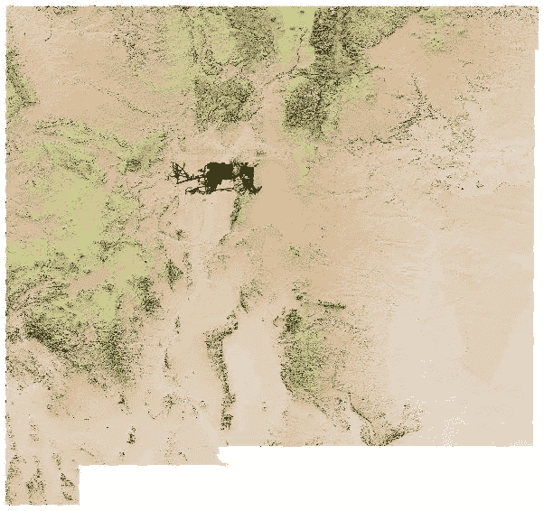
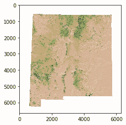
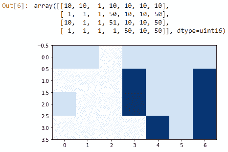

# 第六章：栅格数据处理

**地理信息系统**（**GIS**）通常由点、线和多边形组成。这些数据类型被称为矢量数据。然而，GIS 中还有一种数据类型——栅格。在本章中，你将学习如何处理栅格数据的基础知识。你将学习如何：

+   使用**地理空间数据抽象库**（**GDAL**）加载和查询栅格数据

+   使用 GDAL 修改和保存栅格数据

+   使用 GDAL 创建栅格数据

+   将栅格数据加载到 PostgreSQL 中

+   使用 PostgreSQL 对栅格数据进行查询

安装 GDAL 可能很困难。通过使用虚拟环境和运行 Anaconda，你可以通过使用环境的 GUI 来简化这个过程。

# 使用 GDAL 进行栅格操作

GDAL 库允许你读取和写入矢量和栅格数据。要在 Windows 上安装 GDAL，你需要适当的二进制文件：

你可以从[`trac.osgeo.org/osgeo4w/`](https://trac.osgeo.org/osgeo4w/)下载包含二进制的 OSGeo4W，网址如下：

当你有了二进制文件，你可以使用`conda`安装`gdal`，如下所示：

```py
conda install -c conda-forge gdal
```

在以下章节中，你将学习如何加载和使用`.tif`文件。

# 使用 GDAL 库加载和查询栅格数据

现在你已经安装了`gdal`，使用以下代码导入它：

```py
from osgeo import gdal
```

GDAL 2 是最新的版本。如果你安装了较旧的`gdal`版本，你可能需要使用以下代码导入它：

```py
import gdal
```

如果是这样，你可能想考虑升级你的`gdal`版本。一旦你导入了`gdal`，你就可以打开一个栅格图像。首先，让我们从网络上获取一个图像。新墨西哥大学的地球数据分析中心维护着**资源地理信息系统**（**RGIS**）。在其中，你可以找到新墨西哥 GIS 数据。浏览到[`rgis.unm.edu/`](http://rgis.unm.edu/)，然后从“获取数据”链接中选择“阴影地形”、“一般”和“新墨西哥”。然后，下载“新墨西哥彩色阴影地形（地理参考 TIF）”文件。

当你解压 ZIP 文件时，你会得到几个文件。我们只对`nm_relief_color.tif`感兴趣。以下代码将使用`gdal`打开 TIF 文件：

```py
nmtif = gdal.Open(r'C:\Desktop\ColorRelief\nm_relief_color.tif')
print(nmtif.GetMetadata())
```

之前的代码打开 TIF 文件。它与在 Python 中打开任何文件非常相似，只是你使用了`gdal.Open`而不是标准的 Python 库`open`。下一行打印 TIF 的元数据，输出如下：

```py
{'AREA_OR_POINT': 'Area', 'TIFFTAG_DATETIME': '2002:12:18 8:10:06', 'TIFFTAG_RESOLUTIONUNIT': '2 (pixels/inch)', 'TIFFTAG_SOFTWARE': 'IMAGINE TIFF Support\nCopyright 1991 - 1999 by ERDAS, Inc. All Rights Reserved\n@(#)$RCSfile: etif.c $ $Revision: 1.9.3.3 $ $Date: 2002/07/29 15:51:11EDT $', 'TIFFTAG_XRESOLUTION': '96', 'TIFFTAG_YRESOLUTION': '96'}
```

之前的元数据提供了诸如创建和修订日期、分辨率以及每英寸像素数等一些基本信息。我们感兴趣的数据的一个特点是投影。要找到它，请使用以下代码：

```py
nmtif.GetProjection()
```

使用`GetProjection`方法在 TIF 上，你会看到我们没有找到任何。代码的输出如下：

```py
'LOCAL_CS[" Geocoding information not available Projection Name = Unknown Units = other GeoTIFF Units = other",UNIT["unknown",1]]'
```

如果你在这张 TIF 文件中打开它，QGIS 会显示一个警告，提示 CRS 未定义，并将默认为`epsg:4326`。我知道这张图片是投影的，我们可以通过查看`nm_relief_color.tif.xml`文件来确认这一点。如果你滚动到文件底部，你会看到 XML 标签`<cordsysn>`下的值，如下所示：

```py
 <cordsysn>
 <geogcsn>GCS_North_American_1983</geogcsn>
 <projcsn>NAD_1983_UTM_Zone_13N</projcsn>
 </cordsysn>
```

如果你查阅[spatialreference.org](http://spatialreference.org)上的投影，你会发现它是 EPSG:26913。我们可以使用`gdal`来设置投影，如下所示：

```py
from osgeo import osr
p=osr.SpatialReference()
p.ImportFromEPSG(26913)
nmtif.SetProjection(p.ExportToWkt())
nmtif.GetProjection()
```

上述代码导入了`osr`库。然后它使用库创建一个新的`SpatialReference`。接下来，它使用`ImportFromEPSG`导入一个已知参考，并传递`26913`。然后它使用`SetProjection`，传递 EPSG:26913 的 WKT。最后，它调用`GetProjection`，这样我们就可以看到代码是否成功。结果如下：

```py
'PROJCS["NAD83 / UTM zone 13N",GEOGCS["NAD83",DATUM["North_American_Datum_1983",SPHEROID["GRS 1980",6378137,298.257222101,AUTHORITY["EPSG","7019"]],TOWGS84[0,0,0,0,0,0,0],AUTHORITY["EPSG","6269"]],PRIMEM["Greenwich",0,AUTHORITY["EPSG","8901"]],UNIT["degree",0.0174532925199433,AUTHORITY["EPSG","9122"]],AUTHORITY["EPSG","4269"]],PROJECTION["Transverse_Mercator"],PARAMETER["latitude_of_origin",0],PARAMETER["central_meridian",-105],PARAMETER["scale_factor",0.9996],PARAMETER["false_easting",500000],PARAMETER["false_northing",0],UNIT["metre",1,AUTHORITY["EPSG","9001"]],AXIS["Easting",EAST],AXIS["Northing",NORTH],AUTHORITY["EPSG","26913"]]'
```

上述输出是 EPSG:26913 的 WKT。

打开 QGIS，TIF 文件将无警告加载。我可以向其中添加阿尔伯克基街道的副本，它们将出现在正确的位置。这两组数据都在 EPSG:26913 坐标系下。以下图像显示了 TIF 文件和位于新墨西哥州阿尔伯克基中心的街道：



新墨西哥州街道形状文件的 Tif

现在我们已经添加了投影，我们可以保存 TIF 的新版本：

```py
geoTiffDriver="GTiff"
driver=gdal.GetDriverByName(geoTiffDriver)
out=driver.CreateCopy("copy.tif",nmtif,strict=0)
```

要查看新文件是否有空间参考，请使用以下代码：

```py
out.GetProjection()
```

上述代码将输出 EPSG:26913 的**已知文本**（**WKT**），如下所示：

```py
 'PROJCS["NAD83 / UTM zone 13N",GEOGCS["NAD83",DATUM["North_American_Datum_1983",SPHEROID["GRS 1980",6378137,298.257222101,AUTHORITY["EPSG","7019"]],TOWGS84[0,0,0,0,0,0,0],AUTHORITY["EPSG","6269"]], PRIMEM["Greenwich",0,AUTHORITY["EPSG","8901"]],UNIT["degree",0.0174532925199433,AUTHORITY["EPSG","9122"]], AUTHORITY["EPSG","4269"]],PROJECTION["Transverse_Mercator"],PARAMETER["latitude_of_origin",0],PARAMETER["central_meridian", -105],PARAMETER["scale_factor",0.9996],PARAMETER["false_easting",500000],PARAMETER["false_northing",0],UNIT["metre",1, AUTHORITY["EPSG","9001"]],AXIS["Easting",EAST],AXIS["Northing",NORTH],AUTHORITY["EPSG","26913"]]'
```

彩色栅格数据集有三个波段——红色、绿色和蓝色。你可以使用以下代码单独获取每个波段：

```py
nmtif.RasterCount 
```

上述代码将返回`3`。与数组不同，波段是按 1-n 索引的，因此三波段栅格将具有索引`1`、`2`和`3`。你可以通过传递索引到`GetRasterBand()`来获取单个波段，如下所示：

```py
band=nmtif.GetRasterBand(1)
```

现在你有了栅格波段，你可以对它进行查询，并可以在位置上查找值。要查找指定行和列的值，你可以使用以下代码：

```py
values=band.ReadAsArray()
```

现在，`values`是一个数组，因此你可以通过索引符号查找值，如下所示：

```py
values[1100,1100]
```

上述代码将返回一个值为`216`。在单波段数组中，这会有所帮助，但在彩色图像中，你很可能想知道某个位置的颜色。这需要知道所有三个波段的值。你可以通过以下代码来实现：

```py
one= nmtif.GetRasterBand(1).ReadAsArray()
two = nmtif.GetRasterBand(2).ReadAsArray()
three= nmtif.GetRasterBand(3).ReadAsArray()
print(str(one[1100,1100])+","+ str(two[1100,1100])+","+str(three[1100,1100]))
```

上述代码返回的值是`216, 189, 157`。这些是像素的 RGB 值。这三个值是合成的——叠加在一起，这应该是以下图像中显示的颜色：


在[1100,1100]处表示的颜色由三个波段

使用波段，你可以访问几个用于获取波段信息的方法。你可以获取值的平均值和标准差，如下所示：

```py
one=nmtif.GetRasterBand(1)
two=nmtif.GetRasterBand(2)
three=nmtif.GetRasterBand(3)
one.ComputeBandStats()
two.ComputeBandStats()
three.ComputeBandStats()
```

输出如下所示：

```py
(225.05771967375847, 34.08382839593031)
(215.3145137636133, 37.83657996026153)
(195.34890652292185, 53.08308166590347)
```

你还可以从一个波段获取最小值和最大值，如下面的代码所示：

```py
print(str(one.GetMinimum())+","+str(one.GetMaximum()))
```

结果应该是 `0.0` 和 `255.0`。

你还可以获取波段的描述。下面的代码展示了如何获取和设置描述：

```py
two.GetDescription()    # returns 'band_2'
two.SetDescription("The Green Band")
two.GetDescription()    # returns "The Green Band"
```

你可能最想用栅格数据集做的事情就是将其在 Jupyter Notebook 中查看。在 Jupyter Notebook 中加载图像有几种方法，其中一种就是使用 HTML 和 `` 标签。在下面的代码中，你将看到如何使用 `matplotlib` 绘制图像：

```py
import numpy as np
from matplotlib.pyplot import imshow
%matplotlib inline

data_array=nmtif.ReadAsArray()
x=np.array(data_array[0])
# x.shape ---> 6652,6300
w, h =6652, 6300
image = x.reshape(x.shape[0],x.shape[1]) 
imshow(image, cmap='gist_earth') 
```

之前的代码导入了 `numpy` 和 `matplotlib.pyploy.imshow`。

NumPy 是一个用于处理数组的流行库。当处理栅格（数组）时，你将受益于对库的深入了解。Packt 出版了多本关于 NumPy 的书籍，如 *NumPy Cookbook*、*NumPy Beginners Guide* 和 *Learning NumPy Array*，这将是一个学习更多知识的好起点。

然后，它将此笔记本中的绘图设置为内联。代码接着将 TIF 文件读入为一个数组。然后，它从第一个波段创建一个 `numpy` 数组。

波段索引为 *1*-*n*，但一旦读入为数组，它们的索引就变为 0。

为了隔离第一个波段，代码使用宽度和高度重新塑形数组。使用 `x.shape`，你可以获取它们两个，如果你索引，你可以单独获取每一个。最后，使用 `imshow`，代码使用 `gist_earth` 的颜色映射绘制图像。图像将在 Jupyter 中如下显示：



在 Jupyter 中使用 imshow 显示 Tif

现在你已经知道了如何加载栅格和执行基本操作，你将在下一节中学习如何创建栅格。

# 使用 GDAL 创建栅格

在上一节中，你学习了如何加载栅格、执行基本查询、修改它并将其保存为新的文件。在本节中，你将学习如何创建栅格。

**栅格**是一组值。因此，要创建一个栅格，你首先创建一个数组，如下面的代码所示：

```py
 a_raster=np.array([
 [10,10,1,10,10,10,10],
 [1,1,1,50,10,10,50],
 [10,1,1,51,10,10,50],
 [1,1,1,1,50,10,50]])
```

之前的代码创建了一个具有四行七列的 `numpy` 数组。现在你有了数据数组，你需要设置一些基本属性。下面的代码将分配值给变量，然后你将在下面的示例中将它们传递给栅格：

```py
coord=(-106.629773,35.105389)
w=10
h=10
name="BigI.tif"
```

下面的代码设置了变量 `coord` 中栅格的左下角、宽度、高度和名称。然后，它设置了像素宽度和高度。最后，它命名了栅格。

下一步是通过组合数据和属性来创建栅格。下面的代码将展示如何操作：

```py
d=gdal.GetDriverByName("GTiff")
output=d.Create(name,a_raster.shape[1],a_raster.shape[0],1,gdal.GDT_UInt16)
output.SetGeoTransform((coord[0],w,0,coord[1],0,h))
output.GetRasterBand(1).WriteArray(a_raster)
outsr=osr.SpatialReference()
outsr.ImportFromEPSG(4326)
output.SetProjection(outsr.ExportToWkt())
output.FlushCache()
```

之前的代码将 `GeoTiff` 驱动程序分配给变量 `d`。然后，它使用该驱动程序创建栅格。创建方法接受五个参数——`name`、`x` 的大小、`y` 的大小、波段数量和数据类型。要获取 `x` 和 `y` 的大小，你可以访问 `a_raster.shape`，它将返回 (4,7)。索引 `a_raster.shape` 将分别给出 `x` 和 `y`。

`Create()` 接受几种数据类型——从 `GDT_` 开始。其他数据类型包括未知、字节、无符号整型 16 位、整型 16 位、无符号整型 32 位、整型 32 位、单精度浮点数 32 位、双精度浮点数 64 位、C 整型 16 位、C 整型 32 位、C 单精度浮点数 32 位和 C 双精度浮点数 64 位。

接下来，代码使用左上角坐标和旋转设置从地图到像素坐标的转换。旋转是宽度和高度，如果它是北向上图像，则其他参数为 0。

要将数据写入波段，代码选择栅格波段——在这种情况下，您在调用 `Create()` 方法时指定了一个单波段，因此将 `1` 传递给 `GetRasterBand()` 和 `WriteArray()` 将获取 `numpy` 数组。

现在，您需要为 TIF 分配一个空间参考。创建一个空间参考并将其分配给 `outsr`。然后，您可以从 EPSG 码导入一个空间参考。接下来，通过将 WKT 传递给 `SetProjection()` 方法来设置 TIF 上的投影。

最后一步是 `FlushCache()`，这将写入文件。如果您已经完成了 TIF，您可以将 `output = None` 设置为清除它。然而，您将在接下来的代码片段中再次使用它，所以这里将跳过这一步。

要证明代码有效，您可以检查投影，如下面的代码所示：

```py
output.GetProjection()
```

输出显示 TIF 在 EPSG:4326：

```py
'GEOGCS["WGS 84",DATUM["WGS_1984",SPHEROID["WGS 84",6378137,298.257223563,AUTHORITY["EPSG","7030"]],AUTHORITY["EPSG","6326"]],PRIMEM["Greenwich",0,AUTHORITY["EPSG","8901"]],UNIT["degree",0.0174532925199433,AUTHORITY["EPSG","9122"]],AUTHORITY["EPSG","4326"]]'
```

您可以在 Jupyter 中显示 TIF 并查看它是否如您预期的那样。以下代码演示了如何绘制 `image` 并检查您的结果：

```py
data=output.ReadAsArray()
w, h =4, 7
image = data.reshape(w,h) #assuming X[0] is of shape (400,) .T
imshow(image, cmap='Blues') #enter bad color to get list
data
```

之前的代码将栅格读取为数组并分配宽度和高度。然后，它创建一个 `image` 变量，将数组重塑为宽度和高度。最后，它将图像传递给 `imshow()` 并在最后一行打印 `data`。如果一切正常，您将看到以下图像：



数组值和由它们创建的栅格

以下部分将向您展示如何使用 PostgreSQL 与栅格一起工作，作为 `gdal` 的替代方案或与之结合使用。

# 使用 PostgreSQL 进行栅格操作

在本章的第一节中，您能够使用 `gdal` 加载、显示和查询栅格。在本节中，您将学习如何使用空间数据库——PostgreSQL 加载和查询栅格。当您开始建模数据时，您很可能会将其保存在空间数据库中。您可以利用数据库对您的栅格执行查询。

# 将栅格加载到 PostgreSQL 中

要将栅格加载到 PostgreSQL，您可以使用 `raster2pgsql` 二进制文件。如果它不在您的路径中，您可能需要将其添加。您应该能够在 Windows 的 PostgreSQL 安装目录中的 `\PostgreSQL\10\bin` 找到该二进制文件。

以下命令应从您的操作系统的命令行执行。它将本章中创建的 TIF 加载到现有的 PostgreSQL 数据库中：

```py
>raster2pgsql -I -C -s 4326 C:\Users\Paul\Desktop\BigI.tif public.bigi | psql -U postgres -d pythonspatial
```

之前的命令使用 `raster2pgsql` 并带有 `-I`（创建索引）、`-C`（添加栅格约束）和 `-s 4326`（SRID）参数。在 Windows 上使用管道运算符，您将命令发送到 `psql`。`psql` 使用 `-U` `postgres`（用户名）和 `-d pythonspatial`（数据库）参数运行。

如果您以 Postgres 用户身份登录，则不需要 `-U`。如果没有它，Windows 将尝试使用已登录的用户帐户登录到 PostgreSQL，这可能与 PostgreSQL 用户不同。

现在您已经将数据加载到 PostgreSQL 中，以下部分将向您展示您如何使用 Python 查询它。

# 使用 PostgreSQL 在栅格上执行查询

将栅格数据加载到 PostgreSQL 后，您可以使用 Python 查询它。用于与 PostgreSQL 一起工作的 Python 库是 `psycopg2`。以下代码将连接到您已加载 TIF 的数据库：

```py
import psycopg2
connection = psycopg2.connect(database="pythonspatial",user="postgres", password="postgres")
cursor = connection.cursor()
```

之前的代码导入 `psycopg2`。然后它通过传递数据库名称、用户名和密码建立连接。最后，它获取一个 `cursor` 对象，以便您可以执行查询。

要在 PostgreSQL 中查看栅格，您可以执行选择所有操作，如下面的代码所示：

```py
cursor.execute("SELECT * from bigi") 
#Big I is the name of the intersection where I-25 and I-40 meet and split Albuquerque in quadrants.
cursor.fetchall()
```

之前的代码执行了一个选择所有语句并打印所有结果。表中有两列——rid 和 `rast`。Rid 是栅格的唯一 ID 字段。如果您在运行 `raster2pgsql` 时将其瓦片化，则会有更多行。`rast` 列包含栅格数据：

```py
[(1,
 '010000010000000000000024400000000000002440D8B969334EA85AC0D82D02637D8D414000000000000000000000000000000000E61000000700040004000A0A010A0A0A0A010101320A0A320A0101330A0A3201010101320A32')]
```

# 查询栅格元数据

使用 PostgreSQL，您可以执行各种数据查询。在本节中，您将学习如何查询栅格的基本元数据和属性。本节将介绍许多可用的 PostgreSQL 函数中的几个。

您可以查询基本文本摘要的数据。以下代码显示了如何使用 `ST_Summary()` 函数：

```py
cursor.execute("select ST_Summary(rast) from bigi;")
cursor.fetchall()
```

摘要函数将栅格数据列作为参数，并返回一个包含栅格大小、边界框、波段数量以及是否在任何波段中没有数据值的字符串。以下是从之前代码的输出：

```py
[('Raster of 7x4 pixels has 1 band and extent of BOX(-106.629773 35.105389,-36.629773 75.105389)\n band 1 of pixtype 8BUI is in-db with no NODATA value',)]
```

从 `ST_Summary` 中解析出单个信息片段会很困难。您可以通过使用 `ST_Metadata` 函数以更易于机器读取的格式检索此信息。您可以使用以下代码来完成此操作：

```py
cursor.execute("select ST_MetaData(rast) from bigi")
cursor.fetchall()
```

之前的代码查询栅格的左上角 *X* 值、左上角 *Y* 值、宽度、高度、*X* 的比例、*Y* 的比例、*X* 的倾斜、*Y* 的倾斜、SRID 和栅格中的波段数量。输出如下所示：

```py
[('(-106.629773,35.105389,7,4,10,10,0,0,4326,1)',)]
```

输出允许您使用索引符号选择单个元数据片段，这是一个比解析 `ST_Summary` 提供的字符串更简单的解决方案。

您可以查询栅格的特定和单个属性。要获取作为单个多边形的栅格——而不是摘要中描述的两个点框——您可以使用以下代码：

```py
cursor.execute("select ST_AsText(ST_Envelope(rast)) from bigi;")
cursor.fetchall()
```

之前代码的输出是栅格的矢量多边形的 WKT。如下所示：

```py
[('POLYGON((-106.629773 75.105389,-36.629773 75.105389,-36.629773 35.105389,-106.629773 35.105389,-106.629773 75.105389))',)]
```

以下代码将查询栅格的高度和宽度：

```py
cursor.execute("select st_height(rast), st_Width(rast) from bigi;") #st_width
cursor.fetchall()
```

如您从本章早期内容中回忆起来，栅格是`4x7`，如图所示输出：

```py
[(4, 7)]
```

另一个可能很有用的元数据是像素大小。以下代码将展示如何操作：

```py
cursor.execute("select ST_PixelWidth(rast), ST_PixelHeight(rast) from bigi;")
cursor.fetchall()
```

使用`ST_PixelWidth`和`ST_PixelHeight`，您将得到以下输出。这与您在章节早期创建栅格时的高度和宽度相匹配：

```py
[(10.0,10.0)]
```

您可以查询特定波段中单元格内数据的统计信息。`ST_SummaryStats`提供了数据值的基本摘要统计信息。以下代码展示了如何查询：

```py
cursor.execute("select ST_SummaryStats(rast) from bigi;")
cursor.fetchall()
```

上一段代码的输出返回了栅格波段的数量、总和、平均值、标准差、最小值和最大值。您可以通过将栅格波段作为整数传递到第二个参数`ST_SummaryStats(rast,3)`中来传递它。如果您没有指定波段，默认为`1`。输出如下所示：

```py
[('(28,431,15.3928571428571,18.5902034218377,1,51)',)]
```

您还可以查询栅格中值的直方图，如下所示代码：

```py
cursor.execute("SELECT ST_Histogram(rast,1) from bigi;")
cursor.fetchall()
```

之前的代码使用`ST_Histogram`并传递栅格列和波段。您可以传递 bin 的数量作为第三个参数，或者让函数自行决定。结果如下所示：

```py
[('(1,9.33333333333333,10,0.357142857142857)',),
 ('(9.33333333333333,17.6666666666667,12,0.428571428571429)',),
 ('(17.6666666666667,26,0,0)',),
 ('(26,34.3333333333333,0,0)',),
 ('(34.3333333333333,42.6666666666667,0,0)',),
 ('(42.6666666666667,51,6,0.214285714285714)',)]
```

之前的输出是一个包含最小值、最大值、计数和百分比的 bin 数组。

# 返回几何的查询

之前的查询返回了栅格的基本信息，并返回了包含数据的集合。在 PostgreSQL 中，有一系列函数可以从查询中返回几何形状。本节将介绍其中的一些函数。

栅格由一个由单元格和值组成的矩阵组成。这些单元格成为我们栅格数据中的地理参照像素。使用 PostgreSQL，您可以查询特定单元格的栅格数据并获取该单元格的多边形表示。以下代码展示了如何操作：

```py
cursor.execute("select rid, ST_asText(ST_PixelAsPolygon(rast,7,2)) from bigi;")
cursor.fetchall()
```

使用`ST_PixelAsPolygons`，您可以传递栅格列、列和行的单元格，并获取该单元格的多边形几何形状。通过将查询包裹在`ST_AsText`中，您将获取多边形的 WKT 表示而不是二进制表示。

以下结果是：

```py
 [(1,
 'POLYGON((-46.629773 45.105389,-36.629773 45.105389,-36.629773   
  55.105389,-46.629773 55.105389,-46.629773 45.105389))')]
```

之前的输出返回了像素的 rid（栅格 ID）。由于您在将栅格加载到 PostgreSQL 时没有进行瓦片处理，所有查询都将返回 rid 为`1`。

之前的查询返回了一个多边形，但您可以使用函数来返回点。使用`ST_PixelAsPoints`和`ST_PixelAsCentroids`，您可以检索栅格数据集中每个像素的点。

使用`ST_PixelAsPoints`，您可以检索表示每个像素左上角的点几何形状。查询还返回单元格的`x`和`y`坐标以及值。以下代码将展示如何操作：

```py
cursor.execute("SELECT x, y, val, ST_AsText(geom) FROM (SELECT (ST_PixelAsPoints(rast, 1)).* FROM bigi) as foo;")

cursor.fetchall()
```

之前的代码有两个部分查询。在`FROM`语句之后开始，查询选择波段`1`的像素作为点。第一个语句在结果上执行选择并检索点几何形状，以及单元格的`x`、`y`和值。默认情况下，`ST_PixelAsPoints`不会返回没有值的单元格的数据。你可以将第三个参数传递为 false 以返回没有值的单元格。

之前查询的输出是一个数组，每行代表一个单元格。每行包含`x`、`y`、值和几何形状。结果如下所示：

```py
[(1, 1, 10.0, 'POINT(-106.629773 35.105389)'),
 (2, 1, 10.0, 'POINT(-96.629773 35.105389)'),
 (3, 1, 1.0, 'POINT(-86.629773 35.105389)'),
 (4, 1, 10.0, 'POINT(-76.629773 35.105389)'),
 (5, 1, 10.0, 'POINT(-66.629773 35.105389)'),
 (6, 1, 10.0, 'POINT(-56.629773 35.105389)'),
 (7, 1, 10.0, 'POINT(-46.629773 35.105389)'),
 (1, 2, 1.0, 'POINT(-106.629773 45.105389)'),
 (2, 2, 1.0, 'POINT(-96.629773 45.105389)'),
 (3, 2, 1.0, 'POINT(-86.629773 45.105389)'),
 (4, 2, 50.0, 'POINT(-76.629773 45.105389)'),
 (5, 2, 10.0, 'POINT(-66.629773 45.105389)'),
 (6, 2, 10.0, 'POINT(-56.629773 45.105389)'),
 (7, 2, 50.0, 'POINT(-46.629773 45.105389)'),
 (1, 3, 10.0, 'POINT(-106.629773 55.105389)'),
 (2, 3, 1.0, 'POINT(-96.629773 55.105389)'),
 (3, 3, 1.0, 'POINT(-86.629773 55.105389)'),
 (4, 3, 51.0, 'POINT(-76.629773 55.105389)'),
 (5, 3, 10.0, 'POINT(-66.629773 55.105389)'),
 (6, 3, 10.0, 'POINT(-56.629773 55.105389)'),
 (7, 3, 50.0, 'POINT(-46.629773 55.105389)'),
 (1, 4, 1.0, 'POINT(-106.629773 65.105389)'),
 (2, 4, 1.0, 'POINT(-96.629773 65.105389)'),
 (3, 4, 1.0, 'POINT(-86.629773 65.105389)'),
 (4, 4, 1.0, 'POINT(-76.629773 65.105389)'),
 (5, 4, 50.0, 'POINT(-66.629773 65.105389)'),
 (6, 4, 10.0, 'POINT(-56.629773 65.105389)'),
 (7, 4, 50.0, 'POINT(-46.629773 65.105389)')]
```

使用`ST_PixelAsCentroids`，你可以获取表示像素或单元格重心的点。查询与之前的示例相同，如下所示：

```py
cursor.execute("SELECT x, y, val, ST_AsText(geom) FROM (SELECT (ST_PixelAsCentroids(rast, 1)).* FROM bigi) as foo;")

cursor.fetchall()
```

之前的查询分为两部分。它首先执行`ST_PixelAsCentroids`函数，然后从该结果集中选择`x`、`y`、值和几何形状。输出如下。注意，点与之前的示例不同：

```py
[(1, 1, 10.0, 'POINT(-101.629773 40.105389)'),
 (2, 1, 10.0, 'POINT(-91.629773 40.105389)'),
 (3, 1, 1.0, 'POINT(-81.629773 40.105389)'),
 (4, 1, 10.0, 'POINT(-71.629773 40.105389)'),
 (5, 1, 10.0, 'POINT(-61.629773 40.105389)'),
 (6, 1, 10.0, 'POINT(-51.629773 40.105389)'),
 (7, 1, 10.0, 'POINT(-41.629773 40.105389)'),
 (1, 2, 1.0, 'POINT(-101.629773 50.105389)'),
 (2, 2, 1.0, 'POINT(-91.629773 50.105389)'),
 (3, 2, 1.0, 'POINT(-81.629773 50.105389)'),
 (4, 2, 50.0, 'POINT(-71.629773 50.105389)'),
 (5, 2, 10.0, 'POINT(-61.629773 50.105389)'),
 (6, 2, 10.0, 'POINT(-51.629773 50.105389)'),
 (7, 2, 50.0, 'POINT(-41.629773 50.105389)'),
 (1, 3, 10.0, 'POINT(-101.629773 60.105389)'),
 (2, 3, 1.0, 'POINT(-91.629773 60.105389)'),
 (3, 3, 1.0, 'POINT(-81.629773 60.105389)'),
 (4, 3, 51.0, 'POINT(-71.629773 60.105389)'),
 (5, 3, 10.0, 'POINT(-61.629773 60.105389)'),
 (6, 3, 10.0, 'POINT(-51.629773 60.105389)'),
 (7, 3, 50.0, 'POINT(-41.629773 60.105389)'),
 (1, 4, 1.0, 'POINT(-101.629773 70.105389)'),
 (2, 4, 1.0, 'POINT(-91.629773 70.105389)'),
 (3, 4, 1.0, 'POINT(-81.629773 70.105389)'),
 (4, 4, 1.0, 'POINT(-71.629773 70.105389)'),
 (5, 4, 50.0, 'POINT(-61.629773 70.105389)'),
 (6, 4, 10.0, 'POINT(-51.629773 70.105389)'),
 (7, 4, 50.0, 'POINT(-41.629773 70.105389)')]
```

之前提到的函数返回了栅格数据集中所有像素的几何形状。这两个函数都有一个相应的函数，允许你指定单个像素。

从重心和点中移除复数形式将允许你指定单个像素，但不会返回`x`、`y`和值。以下代码展示了如何将单个像素作为重心进行查询：

```py
cursor.execute("SELECT ST_AsText(ST_PixelAsCentroid(rast,4,1)) FROM bigi;")
cursor.fetchall()
```

之前的代码使用了`ST_PixelAsCentroid`并传递了栅格、行和列。结果是为已指定的单元格生成一个单一的重心点几何形状。输出如下：

```py
[('POINT(-71.629773 40.105389)',)]
```

将查询包裹在`ST_AsText`中导致输出以 WKT 格式返回。

# 返回值的查询

之前的两个部分返回了关于栅格和表示栅格数据的几何形状的信息。本节将向您展示如何查询您的栅格数据集的值。

要获取特定单元格的值，你使用`ST_Value`，如下所示：

```py
cursor.execute("select ST_Value(rast,4,3) from bigi;")
cursor.fetchall()
```

之前的代码将栅格、列和行传递给`ST_Value`。如果不想返回任何数据值，可以选择传递 false。之前查询的结果如下所示：

```py
[(51.0,)]
```

输出是给定单元格的值。

如果你想搜索具有给定值的所有像素，可以使用`ST_PixelOfValue`，如下所示：

```py
cursor.execute("select ST_PixelOfValue(rast,1,50) from bigi;")
cursor.fetchall()
```

之前的代码将波段和要搜索的值传递。此查询的结果是所有(*x*，*y*)坐标的数组，其中值为`50`。输出如下所示：

```py
[('(4,2)',), ('(5,4)',), ('(7,2)',), ('(7,3)',), ('(7,4)',)]
```

对于之前显示的每个坐标，值是`50`。

要总结栅格中每个值的出现次数，你可以使用`ST_ValueCount`进行查询，如下所示：

```py
cursor.execute("select ST_ValueCount(rast) from bigi;")
cursor.fetchall()
```

之前的代码将栅格列传递给`ST_ValueCount`。你可以通过传递作为第二个参数的整数来指定栅格波段——`ST_ValueCount(raster,2)`将是波段`2`。否则，默认为波段`1`。输出如下：

```py
[('(10,12)',), ('(1,10)',), ('(50,5)',), ('(51,1)',)]
```

之前的输出包含值和计数的格式为（值，计数）。

你还可以查询数据中单个值出现的次数。以下代码显示了如何进行查询：

```py
cursor.execute("select ST_ValueCount(rast,1,True,50) from bigi;")
cursor.fetchall()
```

使用`ST_ValueCount`并传递搜索值（`50`），你将收到`50`在栅格中作为值出现的次数，如下所示：

```py
[(5,)]
```

之前的输出显示`50`在栅格数据集中出现了`5`次。

要返回栅格数据中的所有值，你可以使用`ST_DumpValues`，如下所示：

```py
cursor.execute("select ST_DumpValues(rast,1) from bigi;")
cursor.fetchall()
```

之前的代码传递了栅格列和波段。结果是以数组形式的所有栅格值。输出如下所示：

```py
[([[10.0, 10.0, 1.0, 10.0, 10.0, 10.0, 10.0],
 [1.0, 1.0, 1.0, 50.0, 10.0, 10.0, 50.0],
 [10.0, 1.0, 1.0, 51.0, 10.0, 10.0, 50.0],
 [1.0, 1.0, 1.0, 1.0, 50.0, 10.0, 50.0]],)]
```

使用之前的输出，你可以使用标准的 Python 索引符号查询单个单元格。

之前的查询返回了指定单元格或使用指定值的值。接下来的两个查询将基于点几何形状返回值。

使用`ST_NearestValue`，你可以传递一个点并获取该点最近的像素值。如果栅格数据包含高程值，你会查询离点最近已知的已知高程。以下代码显示了如何进行查询：

```py
cursor.execute("select ST_NearestValue(rast,( select ST_SetSRID( ST_MakePoint(-71.629773,60.105389),4326))) from bigi;".format(p.wkt))

cursor.fetchall()
```

之前的代码将栅格列和一个点传递给`ST_NearestValue`。从内到外，点参数使用`ST_MakePoint`从坐标创建一个点。该函数被`ST_SetSRID`包装。`ST_SetSRID`接受两个参数——一个点和空间参考。在这种情况下，点是`ST_MakePoint`，空间参考是 ESPG `4326`。之前查询的结果如下所示：

```py
[(51.0,)]
```

`51`的值是离点最近的值。查询中的坐标是之前`ST_PixelAsCentroids`示例中单元格（4,3）的重心。在那个示例中，该点的值是`51`。

要检索给定点附近的多个值，你可以使用`ST_Neighborhood`，如下面的代码所示：

```py
cursor.execute("select ST_Neighborhood(rast,(select ST_SetSRID( ST_MakePoint(410314,3469015),26913)),1,1) from newmexicoraster;")

cursor.fetchall()
```

`ST_Neighborhood`函数接受栅格列、一个点和`x`、`y`距离值。在之前的代码中，你使用了`ST_MakePoint`和`ST_SetSRID`来创建点。然后，你传递了点和`x`和`y`距离参数的`1`和`1`距离。这将返回一个 3x3 的邻域，如下面的输出所示：

```py
[([[255.0, 255.0, 255.0], [255.0, 255.0, 255.0], [255.0, 255.0, 255.0]],)]
```

之前的输出显示周围邻域的值都是`255`。

最后，你可以将矢量几何形状作为栅格选择。当查询包含阿尔伯克基警察区域指挥部的多边形矢量表时，以下代码将提取一个区域指挥部的单个区域作为栅格：

```py
cursor.execute("SELECT ST_AsPNG(ST_asRaster(geom,150,250,'8BUI')) from areacommand where name like 'FOOTHILLS';")

c=cursor.fetchall()

with open('Foothills.png','wb') as f:
    f.write(c[0][0])
f.close()
```

之前的代码是一个选择语句，从`areacommand`表中选择一个几何形状，其中名称是`FOOTHILLS`。查询的几何部分是执行栅格转换的地方。

`ST_AsRaster`函数接受一个几何体、`x`轴的比例、`y`轴的比例以及像素类型。`ST_AsRaster`函数被封装在`ST_AsPNG`函数中。结果是内存中的 PNG 文件。使用标准的 Python 文件操作，代码以写二进制模式打开一个文件，`Foothills.png`，然后将内存视图`c[0][0]`写入磁盘。然后关闭文件。

输出结果如下所示：


展示山麓作为栅格的图像

# 摘要

在本章中，你学习了如何使用 GDAL 和 PostgreSQL 来处理栅格数据。

首先，你学习了如何使用 GDAL 来加载和查询栅格数据。你还学习了如何使用 GDAL 来修改和保存栅格数据。然后，你学习了如何创建自己的栅格数据。你学习了如何使用`raster2pgsql`工具将栅格数据加载到 PostgreSQL 中。一旦在 PostgreSQL 中，你学习了如何查询元数据、属性、值和几何体。你学习了 PostgreSQL 中用于栅格数据分析的几个常用函数。

虽然本章只是对处理栅格数据进行了初步探讨，但你现在应该有足够的知识来了解如何学习新的技术和方法来处理栅格数据。在下一章中，你将学习如何在 PostgreSQL 中处理矢量数据。
