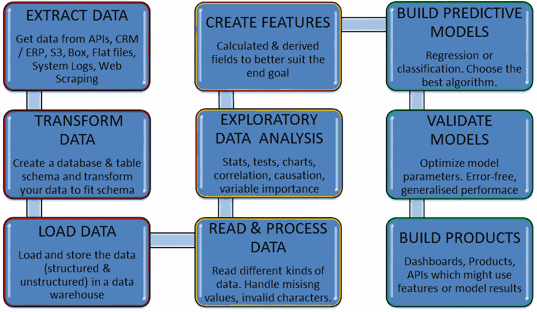
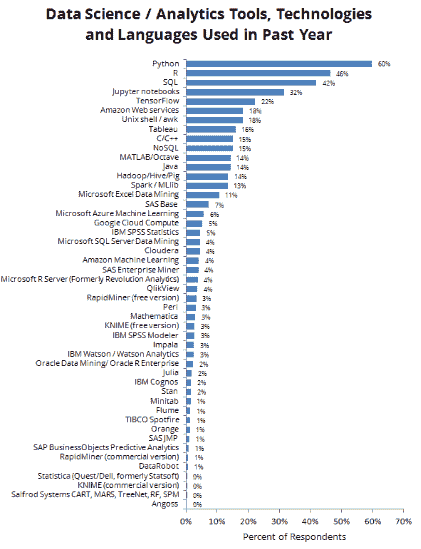
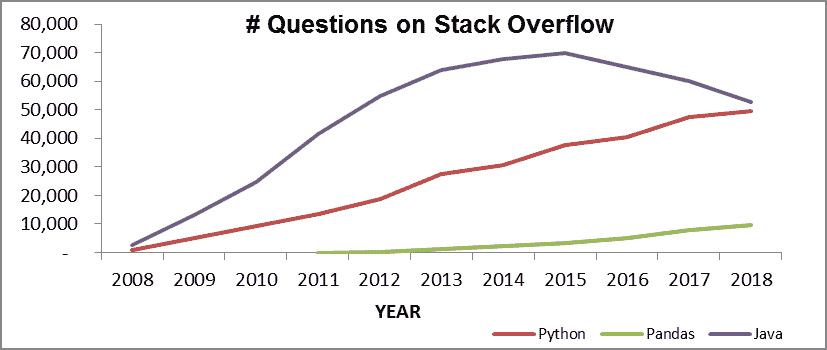
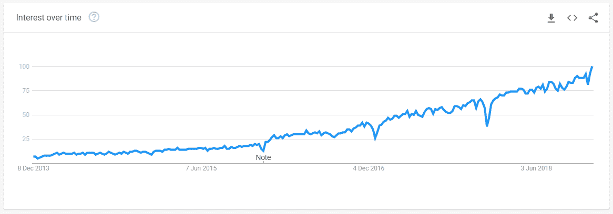
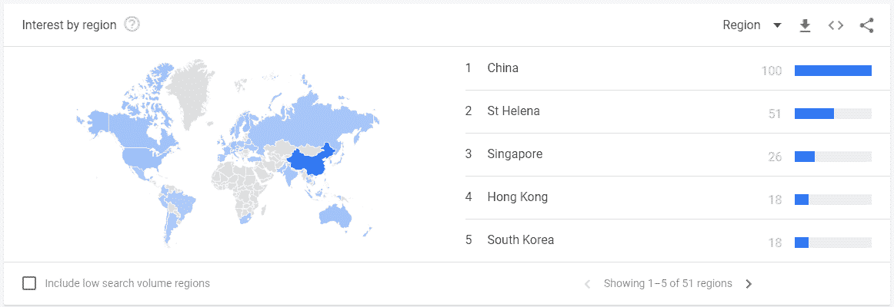
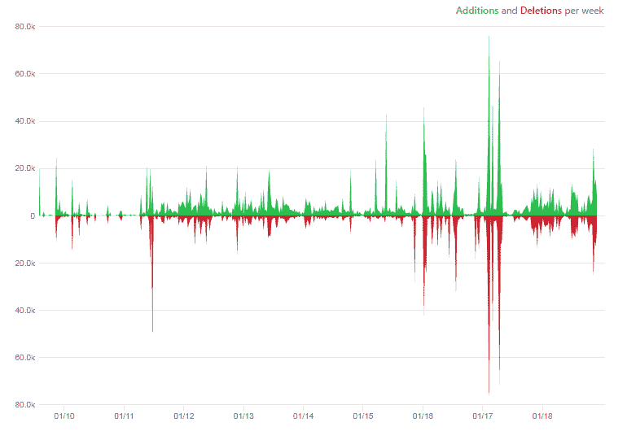

# 第一章：pandas 和数据分析简介

我们从讨论当代数据分析的景观开始，介绍 pandas 在其中的角色。pandas 是数据科学家进行数据预处理任务的首选工具。我们将在后续章节中学习 pandas 的技术细节。本章涵盖了 pandas 的背景、起源、历史、市场份额和当前地位。

本章节被分成了以下标题：

+   数据分析的动机

+   如何使用 Python 和 pandas 进行数据分析

+   pandas 库的描述

+   使用 pandas 的好处

# 数据分析的动机

在本节中，我们讨论了使数据分析在当今快速发展的技术景观中成为越来越重要的趋势。

# 我们生活在一个大数据的世界里

**大数据**这个术语在过去两年中已成为最热门的技术关键词之一。我们现在越来越多地在各种媒体上听到有关大数据的报道，大数据初创公司也越来越多地吸引风险投资。在零售领域的一个好例子是 Target Corporation，该公司在大数据投资方面投入了大量资源，现在能够利用大数据分析顾客的在线购物习惯，识别潜在顾客；参见相关文章：[`nyti.ms/19LT8ic.`](http://nyti.ms/19LT8ic.)

简单来说，大数据指的是数据量超过数据接收者处理能力的现象。以下是一篇关于大数据的文章，概括得很好：[`www.oracle.com/in/big-data/guide/what-is-big-data.html`](https://www.oracle.com/in/big-data/guide/what-is-big-data.html)。

# 大数据的四个 V

开始思考大数据复杂性的一个好方法是称为四维或**大数据的四个 V**。这个模型最初由 Gartner 分析师 Doug Laney 在 2001 年提出。最初的三个 V 代表数据量、速度和多样性，第四个 V，真实性，后来由 IBM 添加。Gartner 的官方定义如下：

"大数据是指高数据量、高速率和/或高多样性信息资产，需要新的处理方式以实现增强决策、洞察发现和流程优化。"

Laney, Douglas. "大数据的重要性：定义", Gartner

# 大数据的数据量

大数据时代的**数据量**令人惊讶。根据 IBM 的数据，到 2020 年，地球上的数据总量将激增至 40 泽字节。没错！40 泽字节相当于 43 万亿吉字节。有关更多信息，请参阅维基百科关于泽字节的页面：[`en.wikipedia.org/wiki/Zettabyte`](http://en.wikipedia.org/wiki/Zettabyte)。

要了解这么大的数据量，让我引用 2010 年 EMC 发布的新闻稿，该新闻稿说明了 1 泽字节大约等于多少：

“每个地球上的男人、女人和孩子在 100 年内‘连续发推’所创造的数字信息”或“75 亿个满载 16GB 的苹果 iPad，将填满温布利体育场 41 次、蒙特布朗隧道 84 次、CERN 的大型强子对撞机隧道 151 次、北京国家体育场 15.5 次或台北 101 大楼 23 次……”

EMC 研究预测到 2020 年数据将增长 45 倍

数据增长的速度主要受以下几个因素的推动：

+   互联网的快速增长。

+   从模拟到数字媒体的转变，加上数据捕捉和存储能力的增强，这一切得益于更便宜且更高效的存储技术。数字数据输入设备的普及，如相机和可穿戴设备，以及大容量数据存储成本的迅速下降，都是这一趋势的体现。亚马逊网络服务是这一趋势的典型例子，它推动了更便宜存储的普及。

设备的*互联网化*，即*物联网*现象，是指普通家用设备，如冰箱和汽车，将连接到互联网。这个现象将进一步加速上述趋势。

# 大数据的速度

从纯技术角度来看，**速度**指的是大数据的吞吐量，即数据进入和处理的速度。这直接影响到接收方处理数据的速度，以跟上数据流的进度。实时分析是处理这一特征的一种尝试。能够支持这一过程的工具包括亚马逊网络服务的弹性 MapReduce。

从更宏观的角度看，数据的速度也可以看作是数据和信息传输和处理速度的提升，现在的数据传输和处理速度比以往任何时候都要快，且可以传输更远的距离。

高速数据和通信网络的普及，以及手机、平板电脑和其他联网设备的出现，是推动信息速度的主要因素。一些速度的衡量标准包括每秒推文数和每分钟电子邮件数。

# 大数据的多样性

大数据的**多样性**源于多个数据源的存在，这些数据源产生数据并以不同格式输出数据。

这对数据接收方构成了技术挑战，因为他们需要处理这些数据。数字相机、传感器、网络、手机等都是产生不同格式数据的数据生成者，挑战在于如何处理这些格式并从数据中提取有意义的信息。随着大数据时代的到来，数据格式的不断变化促使数据库技术行业发生了革命，NoSQL 数据库应运而生，这些数据库能够处理所谓的*非结构化*数据，或是那些格式可变或不断变化的数据。

# 大数据的真实性

大数据的第四个特征——**真实性**，是后来添加的——指的是需要验证或确认数据的*正确性*，即数据是否代表事实。数据来源必须得到验证，且错误应保持在最小范围内。根据 IBM 的估计，差的数据质量每年使美国经济损失约 3.1 万亿美元。例如，2008 年，美国的医疗错误导致的损失为 195 亿美元；你可以参考这篇相关文章，了解更多信息：[`www.wolterskluwerlb.com/health/resource-center/articles/2012/10/economics-health-care-quality-and-medical-errors`](http://www.wolterskluwerlb.com/health/resource-center/articles/2012/10/economics-health-care-quality-and-medical-errors)。

以下链接提供了 IBM 的一个信息图，概述了大数据的四个 V：[`www.ibmbigdatahub.com/infographic/four-vs-big-data`](https://www.ibmbigdatahub.com/infographic/four-vs-big-data)。

# 数据如此庞大，分析时间却如此有限

数据分析被谷歌前 CEO 埃里克·施密特描述为*一切的未来*。欲了解更多信息，请查看 YouTube 视频《为什么数据分析是未来的一切》，链接：[`www.youtube.com/watch?v=9hDnO_ykC7Y`](https://www.youtube.com/watch?v=9hDnO_ykC7Y)。

在大数据时代，数据的量和速度将继续增加。能够高效地收集、筛选和分析数据，从而获得有助于他们更快满足客户需求的信息的公司，将在竞争中占据显著优势。例如，数据分析（*度量文化*）在亚马逊的商业战略中起着至关重要的作用。欲了解更多信息，请参阅 Smart Insights 提供的*亚马逊案例研究*，链接：[`bit.ly/1glnA1u`](http://bit.ly/1glnA1u)。

# 向实时分析的转变

随着技术和工具的不断发展，以应对企业日益增长的需求，出现了所谓的实时分析趋势。更多信息可参考英特尔发布的*随处可得的洞察*白皮书，链接：[`intel.ly/1899xqo`](http://intel.ly/1899xqo)。

在大数据互联网时代，以下是一些大数据实时分析的例子：

+   在线企业要求即时了解他们在网上推出的新产品/功能的表现，并根据反馈调整在线产品组合。亚马逊是这一点的典型例子，特别是其*查看此商品的客户还查看了*功能。

+   在金融领域，风险管理和交易系统几乎要求进行即时分析，以便根据数据驱动的洞察做出有效决策。

# 数据分析管道

数据建模是利用数据构建预测模型的过程。数据还可以用于描述性分析和规范性分析。但在我们使用数据之前，必须先从多个来源获取数据，存储、整合、清洗并处理，以适应我们的目标。对数据进行的顺序操作类似于制造流水线，每个后续步骤为潜在的最终产品增加价值，并且每一步进展都需要新的人员或技能。

数据分析流程中的各个步骤如下图所示：



数据分析流程中的步骤

1.  提取数据

1.  转换数据

1.  加载数据

1.  读取与处理数据

1.  探索性数据分析

1.  创建特征

1.  构建预测模型

1.  验证模型

1.  构建产品

这些步骤可以归纳为三个高级类别：数据工程、数据科学和产品开发。

+   **数据工程**：前图中的*步骤 1*到*步骤 3*属于此范畴。它涉及从各种来源获取数据，创建适合的数据库和表结构，并将数据加载到合适的数据库中。根据以下因素，可以有多种方法来执行此步骤：

    +   **数据类型**：结构化数据（表格数据）与非结构化数据（如图像和文本）与半结构化数据（如 JSON 和 XML）

    +   **数据升级速度**：批处理与实时数据流

    +   **数据量**：分布式（或基于集群的）存储与单实例数据库

    +   **数据种类**：文档存储、二进制大对象存储或数据湖

+   **数据科学**：图 1.2 中的*步骤 4*到*步骤 8*属于数据科学范畴。这是数据被处理为可用数据并用于预测未来、学习模式和推断这些模式的阶段。数据科学还可以进一步分为两个阶段。

*第 4 步*到*第 6 步*构成了第一阶段，其目标是更好地理解数据并使其可用。使数据可用需要付出大量的努力来清理数据，包括删除无效字符和缺失值。这还涉及对数据的细致理解——数据的分布是什么，不同数据变量之间有什么关系，输入和输出变量之间是否存在因果关系，等等。这还包括探索能够更好解释这种因果关系（输入和输出变量之间）的数值转换（特征）。这个阶段涉及的是最终使用数据的真正法医工作。用一个类比来说，竹子种子在土壤中埋藏多年，表面看不到任何幼苗的迹象，但突然间一颗幼苗长出来，并且几个月内一棵完整的竹子就准备好了。数据科学的这一阶段就类似于竹子种子在迅速生长之前所经历的地下准备工作。这就像是初创公司的隐形模式，在这个阶段投入了大量的时间和努力。而这也是本书主角`pandas`库找到其存在意义和最佳定位的地方。

*第 7 步*到*第 8 步*是学习历史数据中的模式（数学表达式的参数）并将其外推到未来数据的部分。这需要大量的实验和迭代以达到最佳结果。但是，如果*第 4 步*到*第 6 步*已经非常小心地完成，这一阶段可以通过 Python、R 及许多其他数据科学工具中的多个包快速实现。当然，这也需要对所应用模型背后的数学和算法有扎实的理解，以便微调其参数，达到完美效果。

+   **产品开发**：这是所有辛勤工作结出果实的阶段，所有的洞察、结果和模式都以用户能够消费、理解并付诸实践的方式呈现。它可能包括从构建带有附加派生字段的数据仪表板，到一个调用训练模型并在接收到数据时返回输出的 API。一个产品还可以构建成涵盖数据管道所有阶段的形式，从提取数据到构建预测模型或创建互动式仪表板。

除了这些管道步骤外，还有一些额外的步骤可能会出现在过程中。这是由于数据领域的高度发展性。例如，深度学习广泛用于构建围绕图像、文本和音频数据的智能产品，通常需要将训练数据进行分类标注，或者当数据量太小无法构建准确模型时进行增强。

例如，视频数据中的目标检测任务可能需要使用一些工具或甚至手动创建训练数据，标注目标边界和目标类别。数据增强通过创建轻微变动的数据（例如旋转或颗粒化的图像）并将其添加到训练数据中，帮助改善图像数据。在监督学习任务中，标签是必需的。这个标签通常是与数据一起生成的。例如，要训练一个客户流失预测模型，需要一个包含客户描述及其流失时间的数据集。这些信息通常可以通过公司的 CRM 工具获得。

# Python 和 pandas 如何融入数据分析流程

**Python**编程语言是当前数据科学和分析新兴领域中增长最快的语言之一。Python 由 Guido van Rossum 于 1991 年创建，其主要特点包括：

+   解释型语言，而非编译型语言

+   动态类型系统

+   通过值传递与对象引用

+   模块化功能

+   综合性库

+   对其他语言的扩展性

+   面向对象

+   支持大多数主要的编程范式：过程式、面向对象式，以及在一定程度上，函数式编程

欲了解更多信息，请参阅以下关于 Python 的文章：[`www.python.org/about/`](https://www.python.org/about/)

使 Python 在数据科学中受欢迎的特点之一是其非常友好的（人类可读的）语法，此外，它是解释型语言而非编译型语言（这意味着开发时间更短），并且拥有非常全面的库来解析和分析数据，以及其在数值和统计计算方面的能力。Python 拥有提供完整数据科学和分析工具包的库，主要包括以下几种：

+   **NumPy**: 强调数值计算的一般数组功能

+   **SciPy**: 数值计算

+   **Matplotlib**: 图形绘制

+   **pandas**: 序列和数据框（1D 和 2D 数组类型）

+   **Scikit-learn**: 机器学习

+   **NLTK**: 自然语言处理

+   **Statstool**: 统计分析

本书将重点介绍前述列表中的第四个库——pandas。

# 什么是 pandas？

本书中我们将重点研究的 pandas 可不是那些可爱且懒惰的动物，尽管它们有时也能在需要时施展功夫。

**pandas**是由 Wes McKinney 于 2008 年开发的一个高性能开源数据分析库，专为 Python 设计。pandas 代表**面板数据**，是指它处理数据时使用的表格格式。它是免费的，并在开源倡议下以 3 条款 BSD 许可证发布。

多年来，pandas 已经成为使用 Python 进行数据分析的事实标准库。该工具得到了广泛的应用，背后有着庞大的社区支持（1,200+位贡献者，17,000+次提交，23 个版本，15,000+个星标），并且该库在快速迭代、功能和增强方面持续更新。

pandas 的一些关键功能包括：

+   它可以处理各种格式的数据集：时间序列、异构表格数据和矩阵数据。

+   它便于从各种来源加载/导入数据，例如 CSV 和 SQL 数据库。

+   它可以对数据集执行各种操作：子集、切片、过滤、合并、分组、重新排序和重塑。

+   它可以根据用户/开发者定义的规则处理缺失数据，例如忽略、转换为 0 等。

+   它可以用于数据的解析和转换（munging），以及建模和统计分析。

+   它与其他 Python 库（如 statsmodels、SciPy 和 scikit-learn）集成良好。

+   它提供快速的性能，并且通过使用 **Cython**（Python 的 C 扩展）可以进一步加速。

如需更多信息，请查阅官方 pandas 文档：[`pandas.pydata.org/pandas-docs/stable/`](http://pandas.pydata.org/pandas-docs/stable/)。

# pandas 在数据分析管道中扮演什么角色？

如前所述，pandas 可用于在管道中执行 *第 4 步* 到 *第 6 步*。*第 4 步* 到 *第 6 步* 是任何数据科学过程、应用或产品的核心。


pandas 在数据分析管道中扮演什么角色？

*第 1 步* 到 *第 6 步* 可以通过 pandas 的某些方法执行。*第 4 步* 到 *第 6 步* 是主要任务，而 *第 1 步* 到 *第 3 步* 也可以通过某种方式在 pandas 中完成。

pandas 是处理数据时不可或缺的库，几乎不可能找到不导入 pandas 的数据建模代码。Python 中易于使用的语法以及类似电子表格的数据结构——DataFrame 的存在，使其即便是对于那些习惯于并不愿意脱离 Excel 的用户来说也很友好。同时，它深受科学家和研究人员的喜爱，能够处理诸如 Parquet、Feather 文件等特殊文件格式。它可以批量读取数据，而不会占用所有机器的内存。难怪著名新闻聚合网站 Quartz 称它为 *数据科学中的**最重要工具**。

pandas 非常适用于以下类型的数据集：

+   具有异构类型列的表格数据

+   有序和无序时间序列

+   带有标签或未标签行列的矩阵/数组数据

pandas 能够巧妙地执行以下数据操作：

+   简单处理缺失和 NaN 数据

+   列的添加和删除

+   自动和显式的数据对齐与标签

+   使用 split-apply-combine 进行数据的聚合和转换（GroupBy）

+   将不同索引的 Python 或 NumPy 数据转换为 DataFrame

+   切片、索引、层次化索引和数据子集的操作

+   合并、连接和拼接数据

+   支持平面文件、HDF5、Feather 和 Parquet 格式的 I/O 方法

+   时间序列功能

# 使用 pandas 的好处

pandas 是 Python 数据分析库的核心组成部分。pandas 的一个显著特点是它提供的一系列数据结构天然适用于数据分析，主要是 DataFrame，以及在较小程度上，series（一维向量）和 panel（三维表格）。

简单来说，pandas 和 statstools 可以被描述为 Python 对 R 语言的回应，R 是一种用于数据分析和统计编程的语言，提供了数据结构（如 R 的数据框）和丰富的统计库来进行数据分析。

与使用像 Java、C 或 C++这样的语言进行数据分析相比，pandas 的好处是显而易见的：

+   **数据表示**：它可以轻松以自然适合数据分析的形式表示数据，通过其 DataFrame 和 series 数据结构简洁地展示。用 Java/C/C++做相同的事需要编写大量的自定义代码，因为这些语言并不是为数据分析而设计的，而是为网络和内核开发而设计的。

+   **数据子集和过滤**：它允许轻松对数据进行子集化和过滤，这是数据分析中常见的操作。

+   **简洁清晰的代码**：它简洁明了的 API 让用户能够更加专注于核心目标，而不需要编写大量的模板代码来执行常规任务。例如，将一个 CSV 文件读取到 DataFrame 数据结构中只需要两行代码，而用 Java/C/C++做同样的任务则需要更多行代码或调用非标准库，下面将会展示。假设我们有以下数据需要读取：

| **国家** | **年份** | **CO2 排放** | **能源消耗** | **生育率** | **每千人互联网使用率** | **预期寿命** | **人口** |
| --- | --- | --- | --- | --- | --- | --- | --- |
| 白俄罗斯 | 2000 | 5.91 | 2988.71 | 1.29 | 18.69 | 68.01 | 1.00E+07 |
| 白俄罗斯 | 2001 | 5.87 | 2996.81 |  | 43.15 |  | 9970260 |
| 白俄罗斯 | 2002 | 6.03 | 2982.77 | 1.25 | 89.8 | 68.21 | 9925000 |
| 白俄罗斯 | 2003 | 6.33 | 3039.1 | 1.25 | 162.76 |  | 9873968 |
| 白俄罗斯 | 2004 |  | 3143.58 | 1.24 | 250.51 | 68.39 | 9824469 |
| 白俄罗斯 | 2005 |  |  | 1.24 | 347.23 | 68.48 | 9775591 |

在 CSV 文件中，我们希望读取的数据会像下面这样：

```py
Country,Year,CO2Emissions,PowerConsumption,FertilityRate,
 InternetUsagePer1000, LifeExpectancy, Population
 Belarus,2000,5.91,2988.71,1.29,18.69,68.01,1.00E+07
 Belarus,2001,5.87,2996.81,,43.15,,9970260
 Belarus,2002,6.03,2982.77,1.25,89.8,68.21,9925000
 ...
 Philippines,2000,1.03,514.02,,20.33,69.53,7.58E+07
 Philippines,2001,0.99,535.18,,25.89,,7.72E+07
 Philippines,2002,0.99,539.74,3.5,44.47,70.19,7.87E+07
 ...
 Morocco,2000,1.2,489.04,2.62,7.03,68.81,2.85E+07
 Morocco,2001,1.32,508.1,2.5,13.87,,2.88E+07
 Morocco,2002,1.32,526.4,2.5,23.99,69.48,2.92E+07
 .. 
```

这些数据来自世界银行经济数据，网址为[`data.worldbank.org`](http://data.worldbank.org)。

在 Java 中，我们需要编写以下代码：

```py
public class CSVReader { 
public static void main(String[] args) { 
        String[] csvFile=args[1];
        CSVReader csvReader = new csvReader();
        List&lt;Map&gt;dataTable=csvReader.readCSV(csvFile);
   }
 public void readCSV(String[] csvFile)
 {
   BufferedReader bReader=null;
   String line="";
   String delim=","; 
  //Initialize List of maps, each representing a line of the csv file
   List&lt;Map&gt; data=new ArrayList&lt;Map&gt;(); 
  try {
         bufferedReader = new BufferedReader(new   FileReader(csvFile));
        // Read the csv file, line by line
           while ((line = br.readLine()) != null){
            String[] row = line.split(delim);
            Map&lt;String,String&gt; csvRow=new HashMap&lt;String,String&gt;(); 
           csvRow.put('Country')=row[0]; 
            csvRow.put('Year')=row[1];
        csvRow.put('CO2Emissions')=row[2]; csvRow.put('PowerConsumption')=row[3];
                csvRow.put('FertilityRate')=row[4];
                csvRow.put('InternetUsage')=row[1];
                csvRow.put('LifeExpectancy')=row[6];
                csvRow.put('Population')=row[7];
                data.add(csvRow); 
        } 
     } catch (FileNotFoundException e) {
   e.printStackTrace(); 
     } catch (IOException e) {
     e.printStackTrace(); 
    }  
 return data;
 } 
```

但是，使用 pandas，只需两行代码：

```py
import pandas as pd
 worldBankDF=pd.read_csv('worldbank.csv') 
```

此外，pandas 是建立在 NumPy 库之上，因此继承了该库在数值和科学计算方面的许多性能优势。使用 Python 的一个常被提及的缺点是，作为一种脚本语言，相较于 Java/C/C++等语言，它的性能比较慢。然而，对于 pandas 来说，这种情况并不成立。

# pandas 历史

pandas 的基础版本由 Wes McKinney 于 2008 年构建，他是麻省理工学院的毕业生，拥有丰富的量化金融经验。如今，由于他的开源贡献以及广受欢迎的书籍《**使用 Python 进行数据分析**》，他已成为名副其实的名人。据报道，他在工作中不得不使用当时流行的工具进行简单的数据操作任务（例如读取 CSV 文件）时感到非常沮丧。他表示，在发现 Excel 和 R 不适合自己的需求后，他很快爱上了 Python，因为它直观且易于上手。但他也发现，Python 缺少一些关键特性，这些特性本可以使它成为数据分析的首选工具——例如，处理电子表格数据的直观格式，或从现有列中创建新计算列的能力。

根据他接受 Quartz 采访时所述，在创建该工具时，他心中有以下设计考虑和愿景：

+   数据质量远比任何华丽的分析更为重要

+   将内存中的数据视作 SQL 表或 Excel 电子表格

+   使用简洁且优雅的代码进行直观分析和探索

+   与用于数据管道中相同或不同步骤的其他库的兼容性更强

在构建基础版本后，他继续攻读杜克大学的博士学位，但在追求将他所创建的工具成为数据科学和 Python 的基石的过程中辍学。凭借他专注的贡献，再加上 Matplotlib 等流行的 Python 可视化库的发布，随后是 Scikit-Learn 等机器学习库和 Jupyter、Spyder 等交互式用户界面的出现，pandas 以及最终的 Python 成为了任何数据科学家武器库中最炙手可热的工具。

Wes 全身心投入到他从零开始创建的工具的不断改进中。他协调新特性的发展以及现有功能的改进。数据科学社区欠他一份大恩。

# pandas 的使用模式和普及

Python 的流行度近年来飙升，特别是 2012 年之后；这在很大程度上要归功于 pandas 的流行。Python 相关的问题占 Stack Overflow 这一开发者问答平台上来自高收入国家问题总数的约 12%。Stack Overflow 是一个开发者互相提问和获取解决方案的平台，涵盖如何完成任务和修复不同编程语言中的错误。考虑到有数百种编程语言，一个语言占据 12%的市场份额是一个非凡的成就：



2017-18 年 Kaggle 用户调查结果显示的最受欢迎的数据分析工具

根据 Kaggle 进行的一项调查，60%的受访者表示他们了解或已经使用 Python 从事数据科学工作。

根据 Stack Overflow 记录的数据，关于平台上提问的类型，Python 和 pandas 每年都在稳步增长，而其他一些编程语言，如 Java 和 C，已经逐渐失去人气，正处于追赶阶段。Python 几乎赶上了 Java 在该平台上的提问数量，而 Java 的提问数量呈负增长趋势。pandas 的提问数量则一直在稳步增长。

以下图表基于从 Stack Overflow 的 SQL API 收集的数据。*y*轴表示在特定年份，Stack Overflow 上关于该话题的提问数量：



基于 Stack Overflow 提问数量的工具流行度，按年份统计

Google Trends 也展示了 pandas 流行度的激增，以下图表展示了这一点。图中的数字表示相对于该地区和时间的历史最高点，pandas 兴趣的激增程度。



基于 Google Trends 数据，pandas 的流行度

pandas 的地理分布更为有趣。最高的关注度来自中国，这可能表明开源工具的广泛采用和/或对构建强大数据科学技术的高度倾向：



基于 Google Trends 数据，pandas 在不同地区的流行程度

除了在用户中广受欢迎外，pandas（由于其开源的起源）还有一个充满活力的社区，致力于不断改进它并使用户更容易找到相关问题的答案。以下图表显示了贡献者每周对 pandas 源代码的修改（增加/删除）情况：



贡献者对 pandas 源代码所做的增加/删除次数

# pandas 在技术采用曲线中的位置

根据一个叫做**Gartner Hype Cycle**的流行框架，技术的普及和采用过程分为五个阶段：

+   技术触发

+   期望膨胀的顶峰

+   幻灭低谷

+   启蒙的斜坡

+   生产力高原

以下链接包含一张图表，展示了不同技术及其在技术采用曲线中的阶段：[`blogs-images.forbes.com/gartnergroup/files/2012/09/2012Emerging-Technologies-Graphic4.gif`](https://blogs-images.forbes.com/gartnergroup/files/2012/09/2012Emerging-Technologies-Graphic4.gif)。

如图所示，预测分析已经达到了生产力的稳定高原，这是从技术中提取最佳和稳定投资回报的阶段。由于 pandas 是大多数预测分析项目的关键组成部分，可以安全地说，pandas 已经达到了生产力的高原。

# pandas 的流行应用

pandas 构建于 NumPy 之上。除了所有其他数据科学项目外，pandas 的一些显著应用包括：

+   pandas 是 statsmodels 的依赖库（[`www.statsmodels.org/stable/index.html`](http://www.statsmodels.org/stable/index.html)），使其成为 Python 数值计算生态系统的重要组成部分。

+   pandas 已被广泛应用于许多金融应用程序的开发中。

# 摘要

我们生活在一个大数据时代，其特点是四个 V —— 数据的体量（volume）、速度（velocity）、多样性（variety）和真实性（veracity）。数据的体量和速度在可预见的未来将持续增长。能够利用和分析大数据，从中提取信息并根据这些信息做出可行决策的公司，将在市场竞争中获胜。Python 是一种快速发展的、用户友好的、可扩展的语言，在数据分析领域非常受欢迎。

pandas 是 Python 数据分析工具包中的核心库。它提供了许多功能，使其在许多流行的编程语言（如 Java、C、C++ 和 Ruby）中显得更加易用且高效。

因此，考虑到本章中阐述的 Python 作为数据分析工具的优势，以及它在用户、贡献者和行业领袖中的广泛应用，使用 Python 进行数据分析的从业者应该熟练掌握 pandas，以提高效率。本书旨在帮助你实现这一目标。

在下一章中，我们将通过首先搭建所需的基础设施来实现这一目标，以便在你的计算机上运行 pandas。我们还将看到 pandas 可以应用和运行的不同方式和场景。

# 参考文献

+   [`activewizards.com/blog/top-20-python-libraries-for-data-science-in-2018/`](https://activewizards.com/blog/top-20-python-libraries-for-data-science-in-2018/)

+   [`qz.com/1126615/the-story-of-the-most-important-tool-in-data-science/`](https://qz.com/1126615/the-story-of-the-most-important-tool-in-data-science/)
