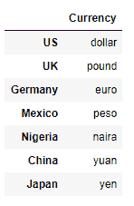

# 第三章：使用 NumPy 和 pandas 中的数据结构

本章是本书中最重要的章节之一。现在我们将开始深入探讨 pandas 的细节。我们从了解 NumPy 的`ndarrays`开始，这是一个不在 pandas 中的数据结构，而是 NumPy 的一部分。了解 NumPy `ndarrays`是非常有用的，因为它们是构建 pandas DataFrame 的基础。NumPy 数组的一个关键优势是，它们可以执行所谓的*矢量化*操作，这些操作是需要遍历/循环 Python 数组的操作，而且速度要快得多。

在本章中，我将通过多个使用 Jupyter 的示例来呈现这些内容。

本章将涵盖的主题包括对`numpy.ndarray`数据结构的介绍，`pandas.Series`**一维**（**1D**）pandas 数据结构，`pandas.DataFrame`**二维**（**2D**）pandas 表格数据结构，以及`pandas.Panel`**三维**（**3D**）pandas 数据结构。

本章将涵盖以下主题：

+   NumPy `ndarrays`

+   使用 NumPy 实现神经网络

+   多维数组的实际应用

+   pandas 中的数据结构

# NumPy 的 ndarrays

数组在数据分析中是至关重要的对象。数组允许对跨行和列堆叠的元素进行结构化处理。数组的元素必须遵守一个规则：它们应该具有相同的数据类型。例如，五个病人的医疗记录可以按如下方式呈现为一个数组：

|  | **血糖水平** | **心率** | **胆固醇水平** |
| --- | --- | --- | --- |
| **彼得·帕克** | 100 | 65 | 160 |
| **布鲁斯·韦恩** | 150 | 82 | 200 |
| **托尼·斯塔克** | 90 | 55 | 80 |
| **巴里·艾伦** | 130 | 73 | 220 |
| **史蒂夫·罗杰斯** | 190 | 80 | 150 |

可以看到，所有 15 个元素的数据类型都是`int`。数组也可以由`字符串`、`浮点数`或复数构成。数组可以由列表构造——列表是 Python 中广泛使用且多功能的数据结构：

```py
array_list = [[100, 65, 160],
[150, 82, 200],
[90, 55, 80],
[130, 73, 220],
[190, 80, 150]]
```

可以通过以下代码访问数组或矩阵中第*i*行和第*j*列的元素（例如，在第一个示例中的第一行第二列）。请注意，Python 中的索引从 0 开始：

```py
In [2]: array_list[1][2]
Out[2]: 200

In [3]: array_list[3][0]
Out[3]: 130
```

Python 有一个内建的`array`模块来创建数组。然而，这个数组模块更像是一个经过美化的列表，要求所有元素具有相同的数据类型。可以通过提供两个参数来使用`array`模块创建数组——数据类型的类型代码，以及列表、字符串或任何可迭代对象中的元素。让我们创建一个浮点数组。这里，`d`是双精度浮点数的类型代码：

```py
import array as arr
arr_x = arr.array("d", [98.6, 22.35, 72.1])
```

使用`array`模块无法创建具有行和列的二维实体。这可以通过嵌套列表来实现。该模块没有定义与矩阵或数组相关的特殊函数，如矩阵乘法、行列式和特征值。

NumPy 是创建和操作数组类型对象的首选包。NumPy 允许创建多维数组。多维数组提供了一个系统化和高效的数据存储框架。在这些多维数组上，可以快速进行复杂的计算，这些计算是 NumPy 包中的内置矢量化操作，无需使用循环。考虑之前的示例，我们创建了一个二维数组来存储五个患者的医疗记录。在这种情况下，患者的姓名和临床指标是两个维度。现在，如果记录了相同患者在三年（2016 到 2018 年）内的临床参数，那么所有这些信息可以方便地表示为一个三维数组。记录的年份将作为第三维度。结果数组的维度为 3 x 5 x 3，完全由整数组成：

| **2016** | **2017** | **2018** |
| --- | --- | --- |
| 100 | 65 | 160 | 95 | 68 | 140 | 110 | 72 | 160 |
| 150 | 82 | 200 | 145 | 80 | 222 | 160 | 95 | 185 |
| 90 | 55 | 80 | 90 | 62 | 100 | 100 | 80 | 110 |
| 130 | 73 | 220 | 150 | 92 | 200 | 140 | 92 | 120 |
| 190 | 80 | 150 | 140 | 60 | 90 | 100 | 55 | 100 |

在 NumPy 中，这些多维数组被称为 `ndarrays` (*n* 维数组)。所有 NumPy 数组对象都是 `numpy.ndarray` 类型。

让我们将前面的数据视为一个 `ndarray`：

```py
In [4]: ndarray_1

Out[4]:
array([[[100, 65, 160],
[150, 82, 200],
[ 90, 55, 80],
[130, 73, 220],
[190, 80, 150]],
[[ 95, 68, 140],
[145, 80, 222],
[ 90, 62, 100],
[150, 92, 200],
[140, 60, 90]],
[[110, 72, 160],
[160, 95, 185],
[100, 80, 110],
[140, 92, 120],
[100, 55, 100]]])
```

`ndarray` 的属性，如数据类型、形状、维度数量和大小，可以通过数组的不同属性进行访问。在以下代码中，探讨了 `ndarray` `ndarray_1` 的一些属性：

```py
# Data type of the array
In [5]: ndarray_1.dtype
Out[5]: dtype('int32')

# Shape of the array
In [6]: ndarray_1.shape
Out[6]: (3, 5, 3)

# Number of dimensions in the array
In [7]: ndarray_1.ndim
Out[7]: 3

# Size of the array (number of elements in the array)
In [8]: ndarray_1.size
Out[8]: 45
```

NumPy 的 `ndarray` 使用了步长索引方案来进行内部内存布局。单独的内存段只能容纳一维结构。因此，像步长索引这样的特定内存分配方案是必要的，以便方便地对 `ndarray` 进行索引和切片。步长表示从当前元素跳到下一个元素所需跳过的字节数。每个步长所占的字节数由数组的数据类型决定。让我们通过前面探讨的数组来理解步长。每个元素占用的字节数可以通过以下代码来确定：

```py
In [9]: ndarray_1.itemsize
Out[9]: 4
In [10]: ndarray_1.nbytes
Out[10]: 180
```

可以看到，每个元素占用 4 个字节，整个数组占用 180 个字节。数组的步长表示如下：

```py
In [11]: ndarray_1.strides
Out[11]: (60, 12, 4)
```

数组的形状由元组（3, 5, 3）给出。元组中的值分别代表有数据的年份数、患者数和临床参数数。对于每个年份或第一维度，存在 15 条记录，因此在数组中从一个年份跳到另一个年份时，需要跳过 60 个字节。同样地，每个不同的患者在给定的年份中有 3 条记录，要跳过 12 个字节才能到达下一个患者。

# NumPy 数组创建

可以通过调用各种 NumPy 方法以多种方式创建 NumPy 数组。这些数组可以使用列表或其他数据结构中的数据创建，或者通过指定数值范围来获得均匀间隔的值，或生成随机样本。

创建数组的最简单方法是通过 `array` 函数。此函数接受任何序列对象，如列表或元组，并将其转换为数组。以下代码片段演示了如何通过 `array` 函数创建一个一维数组：

```py
In [12]: array1d = np.array([1, 2, 3, 4])
In [13]: array1d
Out [13]: array([1, 2, 3, 4])
```

同样，可以通过将列表的列表传递给 `array` 函数来创建一个多维数组：

```py
In [14]: array2d = np.array([[0, 1, 2],[2, 3, 4]])
In [15]: array2d
Out [15]:
array([[0, 1, 2],
[2, 3, 4]])
```

与列表不同，元组、元组的列表或元组的元组也能达到相同的结果。

# 一维零一数组

对数组进行的几种操作需要创建包含零和一的数组或矩阵。NumPy 中的一些特殊函数可以方便地创建此类数组。通常，这些函数接受作为输入参数的结果数组形状，形式为元组：

```py
# Creating an array of ones with shape (2, 3, 4)
In [27]: np.ones((2, 3, 4))
Out [27]:
array([[[1., 1., 1., 1.],
[1., 1., 1., 1.],
[1., 1., 1., 1.]],
[[1., 1., 1., 1.],
[1., 1., 1., 1.],
[1., 1., 1., 1.]]])

# Creating an array of zeros with shape (2, 1, 3)
In [28]: np.zeros((2, 1, 3))
Out [28]:
array([[[0., 0., 0.]],
[[0., 0., 0.]]])
```

该单位矩阵函数返回一个二维的 *n x n* 方阵，其中 *n* 是作为输入参数传入的矩阵的阶数：

```py
In [29]: np.identity(3)
Out [29]:
array([[1., 0., 0.],
[0., 1., 0.],
[0., 0., 1.]])
```

`eye` 函数也可以用来创建单位矩阵。它与单位矩阵在两个方面有所不同：

+   eye 函数返回一个二维矩形矩阵，并接受行数和列数（可选参数）作为输入。如果未指定列数，将仅使用传入的行数返回一个方阵。

+   对角线可以偏移到上三角或下三角的任意位置。

请看以下代码：

```py
# Creating an identity matrix of order 3 with the eye function
In [39]: np.eye(N = 3)
Out [39]:
array([[1., 0., 0.],
[0., 1., 0.],[0., 0., 1.]])

# Creating a rectangular equivalent of identity matrix with 2 rows and 3 columns
In [40]: np.eye(N = 2, M = 3)
Out [40]:
array([[1., 0., 0.],
[0., 1., 0.]])

# Offsetting the diagonal of ones by one position in the upper triangle
In [41]: np.eye(N = 4, M = 3, k = 1)
Out [41]:
array([[0., 1., 0.],
[0., 0., 1.],
[0., 0., 0.],
[0., 0., 0.]])

# Offsetting the diagonal of ones by two positions in the lower triangle
In [42]: np.eye(N = 4, M = 3, k = -2)
Out [42]:
array([[0., 0., 0.],
[0., 0., 0.],
[1., 0., 0.],
[0., 1., 0.]])
```

默认情况下，`k` 在 eye 函数中保持值 0。

# 基于数值范围的数组

NumPy 的 `arange` 函数在功能上类似于 Python 的 range 函数。根据起始值、结束值和步长值来增量或减量后续值，`arange` 函数生成一组数字。与 range 函数类似，这里的起始值和步长值是可选的。但不同于 range 函数生成列表，`arange` 会生成一个数组：

```py
# Creating an array with continuous values from 0 to 5
In [44]: np.arange(6)
Out [44]: array([0, 1, 2, 3, 4, 5])

# Creating an array with numbers from 2 to 12 spaced out at intervals of 3
In [45]: np.arange(2, 13, 3)
Out [45]: array([ 2, 5, 8, 11])
```

`linspace` 函数生成在给定起点和终点之间线性分布的样本数组。与指定增量/减量的 `arrange` 函数不同，`linspace` 函数接受生成样本的数量作为可选参数。默认情况下，会为给定的起点和终点生成 50 个样本：

```py
# Creating a linearly spaced array of 20 samples between 5 and 10
In [47]: np.linspace(start = 5, stop = 10, num = 20)
Out [47]:
array([ 5\. , 5.26315789, 5.52631579, 5.78947368, 6.05263158,
6.31578947, 6.57894737, 6.84210526, 7.10526316, 7.36842105,
7.63157895, 7.89473684, 8.15789474, 8.42105263, 8.68421053,
8.94736842, 9.21052632, 9.47368421, 9.73684211, 10\. ])
```

同样，`logspace` 和 `geomspace` 函数可以创建遵循对数和几何序列的数字数组。

`arange` 函数和 `linspace` 函数本身不允许指定任何形状，并生成包含给定数字序列的一维数组。我们完全可以使用一些形状操作方法，将这些数组塑造成所需的形状。这些方法将在本章最后部分讨论。

# 随机数组与空数组

NumPy 包的 `random` 模块内置了一整套用于随机抽样的函数，可以执行从创建简单的随机数数组到从分布函数中抽取随机样本的操作。

函数 `random.rand` 生成从 0 到 1 的随机值（均匀分布），以创建给定形状的数组：

```py
# Creating a random array with 2 rows and 4 columns, from a uniform distribution
In [49]: np.random.rand(2, 4)
Out [49]:
array([[0.06573958, 0.32399347, 0.60926818, 0.99319404],
[0.46371691, 0.49197909, 0.93103333, 0.06937098]])
```

函数 `random.randn` 从标准正态分布中抽样数值以构建给定形状的数组。如果未指定形状参数，则返回单个值作为输出：

```py
# Creating a 2X4 array from a standard normal distribution
In [50]: np.random.randn(2, 4)
Out [50]:
array([[ 1.29319502, 0.55161748, 0.4660141 , -0.72012401],
[-0.64549002, 0.01922198, 0.04187487, 1.35950566]])

# Creating a 2X4 array from a normal distribution with mean 10 and standard deviation 5
In [51]: 5 * np.random.randn(2, 4) + 10
Out [51]:
array([[ 6.08538069, 12.10958845, 15.27372945, 15.9252008 ],
[13.34173712, 18.49388151, 10.19195856, 11.63874627]])
```

函数 `random.randint` 生成介于指定下限和上限之间的整数数组，具有给定的形状。上限不包括在内。如果未提及上限，则认为上限比定义的下限大 1：

```py
# Creating an array of shape (2, 3) with random integers chosen from the interval [2, 5)
In [52]: np.random.randint(2, 5, (2, 3))
Out [52]:
array([[2, 4, 3],
[3, 4, 4]])
```

函数 `empty` 返回具有给定形状的带有任意值的数组。此数组不需要初始化，并且在需要填充所有数组值时，执行速度比诸如零和一的函数更快。在使用此函数时需要谨慎，并且仅在确定数组中所有值都将被填充时才使用：

```py
# Creating an uninitialized empty array of 4X3 dimensions
In [58]: np.empty([4,3])
Out [58]:
array([[0., 0., 0.],
[0., 0., 0.],
[1., 0., 0.],
[0., 1., 0.]])
```

# 基于现有数组的数组

一些 NumPy 数组创建例程非常有用，可执行诸如构造**对角矩阵**（**diag**）、**上三角矩阵**（**triu**）和**下三角矩阵**（**tril**）之类的矩阵操作。

函数 `diag` 仅适用于 1D 和 2D 数组。如果输入数组为 2D，则输出为输入数组的对角元素的 1D 数组。如果输入为 1D 数组，则输出为具有输入数组沿其对角线的矩阵。此处，参数 k 可以帮助偏移从主对角线的位置，并且可以是正数或负数：

```py
# The 2D input matrix for diag function
In [68]: arr_a = np.array([[1, 2, 3], [4, 5, 6], [7, 8, 9]])
In [69]: arr_a
Out [69]:
array([[1, 2, 3],
[4, 5, 6],
[7, 8, 9]])

# Getting the diagonal of the array
In [70]: np.diag(arr_a)
Out [70]: array([1, 5, 9])

# Constructing the diagonal matrix from a 1D array
# diag returns a 1D array of diagonals for a 2D input matrix. This 1D array of diagonals can be used here.
In [71]: np.diag(np.diag(arr_a))
Out [71]:
array([[1, 0, 0],
[0, 5, 0],
[0, 0, 9]])

# Creating the diagonal matrix with diagonals other than main diagonal
In [72]: np.diag(np.diag(arr_a, k = 1))
Out [72]:
array([[2, 0],
[0, 6]])
```

函数 `triu` 和 `tril` 具有类似的参数 k，可以帮助偏移对角线。这些函数适用于任何 `ndarray`。

给定 *n* 维数组，可以通过沿每个轴重复此数组多次来创建新数组。这可以通过 `tile` 函数完成。此函数接受两个输入参数——输入数组和重复次数：

```py
# Repeating a 1D array 2 times
In [76]: np.tile(np.array([1, 2, 3]), 2)
Out [76]: array([1, 2, 3, 1, 2, 3])

# Repeating a 2D array 4 times
In [77]: np.tile(np.array([[1, 2, 3], [4, 5, 6]]), 4)
Out [77]:
array([[1, 2, 3, 1, 2, 3, 1, 2, 3, 1, 2, 3],
[4, 5, 6, 4, 5, 6, 4, 5, 6, 4, 5, 6]])

# Repeating a 2D array 4 times along axis 0 and 1 time along axis 1
In [78]: np.tile(np.array([[1, 2, 3], [4, 5, 6]]), (4,1))
Out [78]:
array([[1, 2, 3],
[4, 5, 6],
[1, 2, 3],
[4, 5, 6],
[1, 2, 3],
[4, 5, 6],
[1, 2, 3],
[4, 5, 6]])
```

# NumPy 数据类型

之前描述的所有数组创建函数（除了基于现有数组的函数——`diag`、`triu`、`tril` 和 `tile`）都有一个参数 `dtype`，用于定义数组的数据类型。

让我们创建一个不预定义数据类型的数组，然后检查其数据类型：

```py
In [80]: np.array([-2, -1, 0, 1, 2]).dtype
Out [80]: dtype('int32')
```

现在，让我们定义同一个数组，并将其数据类型设置为 `float`：

```py
In [81]: np.array([-2, -1, 0, 1, 2], dtype = "float")
Out [81]: array([-2., -1., 0., 1., 2.])
```

可见数组的元素全部被转换为浮点数。还可以将此数组转换为字符串：

```py
In [83]: np.array([-2, -1, 0, 1, 2], dtype = "str")
Out[83]: array(['-2', '-1', '0', '1', '2'], dtype='<U2'
```

在这个例子中，元素被转换为字符串。输出还显示了数据类型为`<U2`。这表示数组的元素是 Unicode 字符串，并且该数组的最大字符串长度为 2。这个长度阈值是根据数组中最长字符串的长度来决定的。让我们通过另一个例子来理解这一点：

```py
In [87]: np.array(["a", "bb", "ccc", "dddd", "eeeee"])
Out[87]: array(['a', 'bb', 'ccc', 'dddd', 'eeeee'], dtype='<U5')
```

这种类型转换在包含字符串的数组中较为常见，因为数组需要为其分配最佳的内存空间。一个字符占用四个字节。根据最大字符串长度，每个元素将被分配一个大小为最大字符串长度四倍的内存块。

NumPy 数组还支持布尔型和复数型等数据类型：

```py
# Boolean array
In [89]: np.array([True, False, True, True]).dtype
Out[89]: dtype('bool')
In [90]: np.array([0, 1, 1, 0, 0], dtype = "bool")
Out[90]: array([False, True, True, False, False])
In [91]: np.array([0, 1, 2, 3, -4], dtype = "bool")
Out[91]: array([False, True, True, True, True])

# Complex array
In [92]: np.array([[1 + 1j, 2 + 2j], [3 + 3j, 4 + 4j]])
Out[92]:
array([[1.+1.j, 2.+2.j],
[3.+3.j, 4.+4.j]])
In [93]: np.array([[1 + 1j, 2 + 2j], [3 + 3j, 4 + 4j]]).dtype
Out[93]: dtype('complex128')
```

`ndarray`的数据类型可以像在其他语言（如 Java 或 C/C++）中进行类型转换一样进行更改。`ndarray.astype`方法有助于进行类型转换：

```py
# Int to float conversion
In [94]: int_array = np.array([0, 1, 2, 3])
In [95]: int_array.astype("float")
Out[95]: array([0., 1., 2., 3.])

# Float to int conversion
In [97]: float_array = np.array([1.56, 2.95, 3.12, 4.65])
In [98]: float_array.astype("int")
Out[98]: array([1, 2, 3, 4])
```

关于类型转换的更多信息，请参考官方文档：[`docs.scipy.org/doc/numpy/reference/generated/numpy.ndarray.astype.html`](http://docs.scipy.org/doc/numpy/reference/generated/numpy.ndarray.astype.html)。

# NumPy 索引与切片

NumPy 中的数组索引从`0`开始，和 Python、Java、C++等语言类似，而不同于 Fortran、Matlab 和 Octave，它们的索引从`1`开始。数组可以像索引其他 Python 序列一样按标准方式进行索引：

```py
    # print entire array, element 0, element 1, last element.
    In [36]: ar = np.arange(5); print ar; ar[0], ar[1], ar[-1]
    [0 1 2 3 4]
    Out[36]: (0, 1, 4)
    # 2nd, last and 1st elements
    In [65]: ar=np.arange(5); ar[1], ar[-1], ar[0]
    Out[65]: (1, 4, 0)
```

数组可以使用`::-1`惯用法进行反转，如下所示：

```py
    In [24]: ar=np.arange(5); ar[::-1]
    Out[24]: array([4, 3, 2, 1, 0])
```

多维数组使用整数元组进行索引：

```py
    In [71]: ar = np.array([[2,3,4],[9,8,7],[11,12,13]]); ar
    Out[71]: array([[ 2,  3,  4],
                    [ 9,  8,  7],
                    [11, 12, 13]])
    In [72]: ar[1,1]
    Out[72]: 8
```

这里，我们将`row1`和`column1`的元素设置为`5`：

```py
    In [75]: ar[1,1]=5; ar
    Out[75]: array([[ 2,  3,  4],
                    [ 9,  5,  7],
                    [11, 12, 13]])
```

获取第 2 行：

```py
    In [76]:  ar[2]
    Out[76]: array([11, 12, 13])
    In [77]: ar[2,:]
    Out[77]: array([11, 12, 13])

```

获取第 1 列：

```py
    In [78]: ar[:,1]
    Out[78]: array([ 3,  5, 12])

```

如果指定的索引超出了数组的范围，将会引发`IndexError`错误：

```py
    In [6]: ar = np.array([0,1,2])
    In [7]: ar[5]
       ---------------------------------------------------------------------------
       IndexError                  Traceback (most recent call last)
      <ipython-input-7-8ef7e0800b7a> in <module>()
       ----> 1 ar[5]
          IndexError: index 5 is out of bounds for axis 0 with size 3

```

因此，对于二维数组，第一维表示行，第二维表示列。冒号（`:`）表示选择该维度中的所有元素。

# 数组切片

数组可以使用语法`ar[startIndex: endIndex: stepValue]`进行切片：

```py
    In [82]: ar=2*np.arange(6); ar
    Out[82]: array([ 0,  2,  4,  6,  8, 10])
    In [85]: ar[1:5:2]
    Out[85]: array([2, 6])
```

请注意，如果我们希望包含`endIndex`值，需要超出它，如下所示：

```py
    In [86]: ar[1:6:2]
    Out[86]: array([ 2,  6, 10])  
```

使用`ar[:n]`获取前`nelements`：

```py
    In [91]: ar[:4]
    Out[91]: array([0, 2, 4, 6])  
```

隐含的假设是`startIndex=0, step=1`。

从元素 4 开始并选择直到末尾的所有元素：

```py
    In [92]: ar[4:]
    Out[92]: array([ 8, 10])  
```

使用`stepValue=3`切片数组：

```py
    In [94]: ar[::3]
    Out[94]: array([0, 6]) 
```

为了说明 NumPy 中索引的范围，参见以下图示，该图示来自 2013 年在 SciPy 会议上进行的 NumPy 讲座，详细信息可参见：[`scipy-lectures.github.io/_images/numpy_indexing.png`](http://scipy-lectures.github.io/_images/numpy_indexing.png)：


NumPy 索引的图示

现在让我们来分析前面图示中表达式的含义：

+   表达式`a[0,3:5]`表示从第 0 行开始，选择第 3 到第 5 列（不包括第 5 列）。

+   在表达式`a[4:,4:]`中，第一个 4 表示从第 4 行开始，显示所有列，即数组[[40, 41, 42, 43, 44, 45] [50, 51, 52, 53, 54, 55]]。第二个 4 表示在第 4 列开始截断，从而产生数组[[44, 45], [54, 55]]。

+   表达式`a[:,2]`会返回所有行中的第 2 列。

+   现在，在最后一个表达式`a[2::2,::2]`中，`2::2`表示从第 2 行开始，步长为 2。这会给我们生成数组[[20, 21, 22, 23, 24, 25], [40, 41, 42, 43, 44, 45]]。进一步地，`::2`指定我们以步长为 2 的方式提取列，从而得到最终结果数组[[20, 22, 24], [40, 42, 44]]。

赋值和切片可以结合使用，如下代码片段所示：

```py
    In [96]: ar
    Out[96]: array([ 0,  2,  4,  6,  8, 10])
    In [100]: ar[:3]=1; ar
    Out[100]: array([ 1,  1,  1,  6,  8, 10])
    In [110]: ar[2:]=np.ones(4);ar
    Out[110]: array([1, 1, 1, 1, 1, 1])

```

# 数组掩码

NumPy 数组可以用作更大原始数组的过滤器。将数组用作过滤器的过程称为**数组掩码**。例如，以下代码片段演示了这一过程：

```py
    In [146]: np.random.seed(10)
              ar=np.random.random_integers(0,25,10); ar
    Out[146]: array([ 9,  4, 15,  0, 17, 25, 16, 17,  8,  9])
    In [147]: evenMask=(ar % 2==0); evenMask
    Out[147]: array([False,  True, False,  True, False, False,  True, False,  True, False], dtype=bool)
    In [148]: evenNums=ar[evenMask]; evenNums
    Out[148]: array([ 4,  0, 16,  8])
```

在以下示例中，我们随机生成一个包含 10 个整数（范围为 0 到 25）的数组。然后，我们创建一个布尔掩码数组，用于仅过滤出偶数。这个掩码功能非常有用，例如，如果我们希望通过用默认值替换来消除缺失值。在这里，缺失值`''`被默认的国家`'USA'`替换。请注意，`''`也是一个空字符串：

```py
    In [149]: ar=np.array(['Hungary','Nigeria', 
                           'Guatemala','','Poland',
                           '','Japan']); ar
    Out[149]: array(['Hungary', 'Nigeria', 'Guatemala', 
                     '', 'Poland', '', 'Japan'], 
                     dtype='|S9')
    In [150]: ar[ar=='']='USA'; ar
    Out[150]: array(['Hungary', 'Nigeria', 'Guatemala', 
      'USA', 'Poland', 'USA', 'Japan'], dtype='|S9')
```

整型数组也可以用作索引来访问数组，从而生成另一个数组。注意，这会产生多个值，因此输出必须是`ndarray`类型的数组。以下代码片段中进行了演示：

```py
    In [173]: ar=11*np.arange(0,10); ar
    Out[173]: array([ 0, 11, 22, 33, 44, 55, 66, 77, 88, 99])
    In [174]: ar[[1,3,4,2,7]]
    Out[174]: array([11, 33, 44, 22, 77])
```

在前面的代码中，选择对象是一个列表，选中了索引为 1、3、4、2 和 7 的元素。现在，假设我们将其更改为以下内容：

```py
    In [175]: ar[1,3,4,2,7]
```

由于数组是 1D 的，而我们指定了过多的索引来访问它，因此会引发`IndexError`错误：

```py
    IndexError          Traceback (most recent call last)
    <ipython-input-175-adbcbe3b3cdc> in <module>()
    ----> 1 ar[1,3,4,2,7]

    IndexError: too many indices
```

这种赋值操作也可以通过数组索引实现，如下所示：

```py
    In [176]: ar[[1,3]]=50; ar
    Out[176]: array([ 0, 50, 22, 50, 44, 55, 66, 77, 88, 99]) 
```

当通过使用数组索引列表从另一个数组创建一个新数组时，新数组将具有相同的形状。

# 复杂索引

这里，我们通过使用复杂的索引来将较小数组的值赋值给较大的数组：

```py
    In [188]: ar=np.arange(15); ar
    Out[188]: array([ 0,  1,  2,  3,  4,  5,  6,  7,  8,  9, 10, 11, 12, 13, 14])

    In [193]: ar2=np.arange(0,-10,-1)[::-1]; ar2
    Out[193]: array([-9, -8, -7, -6, -5, -4, -3, -2, -1,  0]) 
```

切片出`ar`的前 10 个元素，并用`ar2`中的元素替换它们，如下所示：

```py
    In [194]: ar[:10]=ar2; ar
    Out[194]: array([-9, -8, -7, -6, -5, -4, -3, -2, -1,  0, 10, 11, 12, 13, 14])  
```

# 副本与视图

NumPy 数组的视图只是以特定方式呈现其包含的数据。创建视图并不会生成数组的新副本，而是可能以特定的顺序排列其中的数据，或只显示某些数据行。因此，如果在底层数组的数据上替换了数据，任何通过索引访问数据时，视图都会反映出这些变化。

在切片时，初始数组不会被复制到内存中，因此效率更高。可以使用`np.may_share_memory`方法查看两个数组是否共享同一内存块。然而，应谨慎使用该方法，因为它可能会产生假阳性结果。修改视图会修改原始数组：

```py
    In [118]:ar1=np.arange(12); ar1
    Out[118]:array([ 0,  1,  2,  3,  4,  5,  6,  7,  8,  9, 10, 11])

    In [119]:ar2=ar1[::2]; ar2
    Out[119]: array([ 0,  2,  4,  6,  8, 10])

    In [120]: ar2[1]=-1; ar1
    Out[120]: array([ 0,  1, -1,  3,  4,  5,  6,  7,  8,  9, 10, 11])  
```

要强制 NumPy 复制一个数组，我们使用 `np.copy` 函数。如以下数组所示，当修改复制的数组时，原始数组保持不变：

```py
    In [124]: ar=np.arange(8);ar
    Out[124]: array([0, 1, 2, 3, 4, 5, 6, 7])

    In [126]: arc=ar[:3].copy(); arc
    Out[126]: array([0, 1, 2])

    In [127]: arc[0]=-1; arc
    Out[127]: array([-1,  1,  2])

    In [128]: ar
    Out[128]: array([0, 1, 2, 3, 4, 5, 6, 7])
```

# 操作

NumPy 数组的许多方法需要在数组上运行数学运算符，如加法、减法、乘法、除法等。以下部分将解释这些运算符如何应用于数组。

# 基本运算符

NumPy 在性能上非常高效，因为它基于向量化操作工作，避免了循环的需要，使得处理速度快了好几倍。所有基本的算术运算（如 +、-、*、/）都以元素为单位进行，并且是向量化的：

```py
# Arithmetic operation on arrays with scalars
In [71]: array_1 = np.array([[1, 2, 3], [4, 5, 6]])
In [72]: array_1
Out[72]:
array([[1, 2, 3],
[4, 5, 6]])
In [73]: array_1 + 5
Out[73]:
array([[ 6, 7, 8],
[ 9, 10, 11]])
In [74]: array_1 * 5
Out[74]:
array([[ 5, 10, 15],
[20, 25, 30]])
In [75]: array_1 ** 2
Out[75]:
array([[ 1, 4, 9],
[16, 25, 36]], dtype=int32)
```

涉及两个数组的操作，如加法或乘法，也是以向量化方式进行的：

```py
# Element-wise addition of two arrays
In [76]: array_1 + array_1
Out[76]:
array([[ 2, 4, 6],
[ 8, 10, 12]])

# Element-wise multiplication of two arrays
In [77]: array_1 * array_1
Out[77]:
array([[ 1, 4, 9],
[16, 25, 36]])

# Matrix multiplication of an array and its transpose
In [78]: array_1 @ array_1.T
Out[78]:
array([[14, 32],
[32, 77]])
```

Python 的 `timeit` 函数可以让我们了解向量化操作与遍历项进行循环时的效率差异：

```py
# Computing the cube of each element in an array, for an array with 1000 elements
In [79]: %timeit np.arange(1000) ** 3
5.05 µs ± 195 ns per loop (mean ± std. dev. of 7 runs, 100000 loops each)

# Computing the cube of each number from 0 to 1000, using a for loop
In [80]: array_list = range(1000)
...: %timeit [array_list[i]**3 for i in array_list]
533 µs ± 8.06 µs per loop (mean ± std. dev. of 7 runs, 1000 loops each)
```

这表明，`numpy` 操作比 for 循环快大约 100 倍。

# 数学运算符

NumPy 的数学运算符主要支持三角函数运算、算术运算，以及指数和对数运算。

这类运算符，如 `prod`、`sum` 等，会在数组内执行计算并实现矩阵的缩减。例如，`sum` 函数计算沿给定轴的和。输出将是该轴上元素的和。这些函数可以作为 `numpy.function` 或 `ndarray.method` 调用：

```py
# Sum of all elements in an array
In [62]: np.array([[1, 2, 3], [4, 5, 6]]).sum()
Out[62]: 21

# Column sum of elements
In [63]: np.array([[1, 2, 3], [4, 5, 6]]).sum(axis = 0)
Out[63]: array([5, 7, 9])

# Cumulative sum of elements along axis 0
In [64]: np.array([[1, 2, 3], [4, 5, 6]]).cumsum(axis = 0)
Out[64]:
array([[1, 2, 3],
[5, 7, 9]], dtype=int32)

# Cumulative sum of all elements in the array
In [65]: np.array([[1, 2, 3], [4, 5, 6]]).cumsum()
Out[65]: array([ 1, 3, 6, 10, 15, 21], dtype=int32)
```

# 统计运算符

可以使用现有的统计运算符计算 NumPy 数组的各种统计操作，例如计算均值、中位数、方差和标准差。可以按如下代码计算整个数组的聚合值，例如均值、中位数、方差和标准差：

```py
In [16]: array_x = np.array([[0, 1, 2], [3, 4, 5]])
In [17]: np.mean(array_x)
Out[17]: 2.5
In [18]: np.median(array_x)
Out[18]: 2.5
In [19]: np.var(array_x)
Out[19]: 2.9166666666666665
In [20]: np.std(array_x)
Out[20]: 1.707825127659933
```

默认情况下，这些统计参数是通过展平数组来计算的。要沿某个轴计算统计参数，可以在调用这些函数时定义 `axis` 参数。我们以 `mean` 函数为例来查看这种行为：

```py
In [27]: np.mean(array_x, axis = 0)
Out[27]: array([1.5, 2.5, 3.5])
In [28]: np.mean(array_x, axis = 1)
Out[28]: array([1., 4.])
```

这些函数有专门的实现来处理包含缺失值或 `NA` 的数组。这些函数是 `nanmean`、`nanmedian`、`nanstd`、`nanvar`：

```py
In [30]: nan_array = np.array([[5, 6, np.nan], [19, 3, 2]])

# The regular function returns only nan with a warning
In [31]: np.median(nan_array)
C:\Users \Anaconda3\lib\site-packages\numpy\lib\function_base.py:3250: RuntimeWarning: Invalid value encountered in median
r = func(a, **kwargs)
Out[31]: nan
In [32]: np.nanmedian(nan_array)
Out[32]: 5.0
```

`corrcoeff` 和 `cov` 函数帮助计算给定数组或两个给定数组的 Pearson 相关系数和协方差矩阵：

```py
In [35]: array_corr = np.random.randn(3,4)
In [36]: array_corr
Out[36]:
array([[-2.36657958, -0.43193796, 0.4761051 , -0.11778897],
[ 0.52101041, 1.11562216, 0.61953044, 0.07586606],
[-0.17068701, -0.84382552, 0.86449631, 0.77080463]])
In [37]: np.corrcoef(array_corr)
Out[37]:
array([[ 1\. , -0.00394547, 0.48887013],
[-0.00394547, 1\. , -0.76641267],
[ 0.48887013, -0.76641267, 1\. ]])
In [38]: np.cov(array_corr)
Out[38]:
array([[ 1.51305796, -0.00207053, 0.48931189],
[-0.00207053, 0.18201613, -0.26606154],
[ 0.48931189, -0.26606154, 0.66210821]])
```

# 逻辑运算符

逻辑运算符帮助比较数组、检查数组的类型和内容，并进行数组之间的逻辑比较。

`all` 和 `any` 函数帮助评估沿指定轴上的所有或任何值是否为 `True`。根据评估结果，它返回 `True` 或 `False`：

```py
In [39]: array_logical = np.random.randn(3, 4)
In [40]: array_logical
Out[40]:
array([[ 0.79560751, 1.11526762, 1.21139114, -0.36566102],
[ 0.561285 , -1.27640005, 0.28338879, 0.13984101],
[-0.304546 , 1.58540957, 0.1415475 , 1.53267898]])

# Check if any value is negative along each dimension in axis 0
In [42]: np.any(array_logical < 0, axis = 0)
Out[42]: array([ True, True, False, True])

# Check if all the values are negative in the array
In [43]: np.all(array_logical < 0)
Out[43]: False
```

对于前面描述的 `all` 和 `any` 方法，`axis` 是一个可选参数。如果没有提供，则会将数组展平并用于计算。

一些函数用来测试数组中是否存在`NAs`或无限值。这些功能是数据处理和数据清理中的重要组成部分。这些函数接受一个数组或类数组对象作为输入，并返回布尔值作为输出：

```py
In [44]: np.isfinite(np.array([12, np.inf, 3, np.nan]))
Out[44]: array([ True, False, True, False])
In [45]: np.isnan((np.array([12, np.inf, 3, np.nan])))
Out[45]: array([False, False, False, True])
In [46]: np.isinf((np.array([12, np.inf, 3, np.nan])))
Out[46]: array([False, True, False, False])
```

如大于、小于和等于等运算符帮助在形状相同的两个数组之间执行逐元素比较：

```py
# Creating two random arrays for comparison
In [50]: array1 = np.random.randn(3,4)
In [51]: array2 = np.random.randn(3, 4)
In [52]: array1
Out[52]:
array([[ 0.80394696, 0.67956857, 0.32560135, 0.64933303],
[-1.78808905, 0.73432929, 0.26363089, -1.47596536],
[ 0.00214663, 1.30853759, -0.11930249, 1.41442395]])
In [54]: array2
Out[54]:
array([[ 0.59876194, -0.33230015, -1.68219462, -1.27662143],
[-0.49655572, 0.43650693, -0.34648415, 0.67175793],
[ 0.1837518 , -0.15162542, 0.04520202, 0.58648728]])

# Checking for the truth of array1 greater than array2
In [55]: np.greater(array1, array2)
Out[55]:
array([[ True, True, True, True],
[False, True, True, False],
[False, True, False, True]])

# Checking for the truth of array1 less than array2
In [56]: np.less(array1, array2)
Out[56]:
array([[False, False, False, False],
[ True, False, False, True],
[ True, False, True, False]])
```

# 广播

通过使用广播，我们可以处理形状不完全相同的数组。以下是一个示例：

```py
    In [357]: ar=np.ones([3,2]); ar
    Out[357]: array([[ 1.,  1.],
                     [ 1.,  1.],
                     [ 1.,  1.]])

    In [358]: ar2=np.array([2,3]); ar2
    Out[358]: array([2, 3])

    In [359]: ar+ar2
    Out[359]: array([[ 3.,  4.],
                     [ 3.,  4.],
                     [ 3.,  4.]])
```

因此，我们可以看到`ar2`通过将其添加到`ar`的每一行，实现了在`ar`的行上进行广播，得到了上面的结果。以下是另一个示例，展示了广播如何跨维度工作：

```py
    In [369]: ar=np.array([[23,24,25]]); ar
    Out[369]: array([[23, 24, 25]])
    In [368]: ar.T
    Out[368]: array([[23],
                     [24],
                     [25]])
    In [370]: ar.T+ar
    Out[370]: array([[46, 47, 48],
                     [47, 48, 49],
                     [48, 49, 50]])
```

这里，行数组和列数组都进行了广播，最终得到了一个 3 × 3 的数组。

# 数组形状操作

通常，在数据可以用于分析之前，需要进行转换。数组也不例外。NumPy 提供了一些专门的函数集，帮助重新塑造和转换数组。

# 改变形状

`reshape`函数帮助修改数组的形状。它接受两个主要输入参数——需要处理的数组和期望的形状（整数或整数元组）。

在本章前面，我们看到`np.arange`应该依赖外部函数将数据从一维转换：

```py
In [78]: reshape_array = np.arange(0,15)
In [79]: np.reshape(reshape_array, (5, 3))
Out[79]:
array([[ 0, 1, 2],
[ 3, 4, 5],
[ 6, 7, 8],
[ 9, 10, 11],
[12, 13, 14]]
```

`np.reshape`函数返回的是数据的视图，这意味着底层数组保持不变。然而，在特殊情况下，形状不能改变而不复制数据。有关详细信息，请参见[`docs.scipy.org/doc/numpy/reference/generated/numpy.reshape.html`](http://docs.scipy.org/doc/numpy/reference/generated/numpy.reshape.html)的文档。

# 转置

`transpose`函数会反转数组的维度：

```py
In [80]: trans_array = np.arange(0,24).reshape(4, 6)
In [82]: trans_array
Out[82]:
array([[ 0, 1, 2, 3, 4, 5],
[ 6, 7, 8, 9, 10, 11],
[12, 13, 14, 15, 16, 17],
[18, 19, 20, 21, 22, 23]])
In [83]: trans_array.T
Out[83]:
array([[ 0, 6, 12, 18],
[ 1, 7, 13, 19],
[ 2, 8, 14, 20],
[ 3, 9, 15, 21],
[ 4, 10, 16, 22],
[ 5, 11, 17, 23]])
```

对多维数组应用`transpose`后的结果如下：

```py
In [84]: trans_array = np.arange(0,24).reshape(2, 3, 4)
In [85]: trans_array.T.shape
Out[85]: (4, 3, 2)
```

# 拉平

拉平帮助将数据从多维数组压缩为一维数组：

```py
In [86]: ravel_array = np.arange(0,12).reshape(4, 3)
In [87]: ravel_array.ravel()
Out[87]: array([ 0, 1, 2, 3, 4, 5, 6, 7, 8, 9, 10, 11])
```

可以设置数组拉平的顺序。顺序可以是`"C"`、`"F"`、`"A"`或`"K"`。`"C"`是默认顺序，表示沿着行主序展开数组，而使用`"F"`时，数组沿列主序展开。`"A"`按类似 Fortran 的索引顺序读取数组元素，而`"K"`则按照元素在内存中存储的顺序读取：

```py
In [88]: ravel_array.ravel(order = "F")
Out[88]: array([ 0, 3, 6, 9, 1, 4, 7, 10, 2, 5, 8, 11])
```

# 添加新轴

NumPy 提供了`newaxis`方法，用来在现有数组中添加额外的轴：

```py
# Creating a 1D array with 7 elements
In [98]: array_x = np.array([0, 1, 2, 3, 4, 5, 6])
In [99]: array_x.shape
Out[99]: (7,)

# Adding a new axis changes the 1D array to 2D
In [100]: array_x[:, np.newaxis]
Out[100]:
array([[0],
[1],
[2],
[3],
[4],
[5],
[6]])
In [101]: array_x[:, np.newaxis].shape
Out[101]: (7, 1)

# Adding 2 new axis to the 1D array to make it 3D
In [102]: array_x[:, np.newaxis, np.newaxis]
Out[102]:
array([[[0]],
[[1]],
[[2]],
[[3]],
[[4]],
[[5]],
[[6]]])
In [103]: array_x[:, np.newaxis, np.newaxis].shape
Out[103]: (7, 1, 1)
```

# 基本的线性代数运算

线性代数是矩阵和数组的重要运算集合。NumPy 包内置了一个名为`linalg`的特殊模块，用于处理所有线性代数的需求。以下部分将详细讨论`linalg`模块中一些常用的函数。

`linalg`模块的点乘函数帮助进行矩阵乘法。对于二维数组，它的行为与矩阵乘法完全相同。它要求第一个数组的最后一个维度与第二个数组的最后一个维度相等。数组的维度不必相等。对于 N 维数组，输出将具有 2N-2 个维度：

```py
# For 2D arrays
In [23]: array_1 = np.random.randn(2, 4)
In [24]: array_2 = np.random.randn(4, 2)
In [25]: np.dot(array_1, array_2)
Out[25]:
array([[-2.89783151, 5.34861977],
[-0.98078998, -3.47603638]])

# For N dimensional arrays
In [37]: array_1 = np.random.randn(2, 4, 2)
In [38]: array_2 = np.random.randn(1, 1, 2, 1)
In [39]: np.dot(array_1, array_2).shape
Out[39]: (2, 4, 1, 1, 1)
```

`linalg.multidot`函数可以帮助一次性计算多个数组的乘积，而不是使用嵌套的点乘函数序列。此函数会自动找到最有效的计算顺序来评估乘积序列。

`linalg.svd`函数帮助进行奇异值分解，并返回分解后的三个数组。它接受一个具有两个或更多维度的数组作为输入：

```py
In [42]: array_svd = np.random.randn(4, 3)
In [43]: np.linalg.svd(array_svd)
Out[43]:
(array([[-0.31366226, 0.27266983, 0.17962633, -0.89162858],
[ 0.72860587, 0.51810374, 0.44793275, -0.00763141],
[-0.59309456, 0.61499855, 0.26103908, 0.44930416],
[-0.13779807, -0.52820115, 0.83603183, 0.05537156]]),
array([1.68668514, 0.91044852, 0.65293131]),
array([[ 0.43322222, 0.10710679, 0.89490035],
[-0.73052453, 0.62326903, 0.27905131],
[-0.52787538, -0.77463789, 0.34825813]]))
```

数组的特征值和特征向量可以通过`linalg.eig`函数计算。`eig`函数要求输入数组的最后两个维度是方阵。该函数返回特征值和特征向量：

```py
In [50]: np.linalg.eig(np.random.randn(5, 5))
Out[50]:
(array([ 2.52146488+0.j , -2.80191144+0.j ,
0.57756977+0.j , -0.65032217+1.22149327j,
-0.65032217-1.22149327j]),
array([[-0.85628289+0.j , -0.04688595+0.j ,
-0.71887813+0.j , -0.51046122-0.03158232j,
-0.51046122+0.03158232j],
[ 0.15793025+0.j , 0.7517844 +0.j ,
0.45393309+0.j , 0.52887467+0.j ,
0.52887467-0.j ],
[-0.35226803+0.j , 0.33640372+0.j ,
0.51482125+0.j , 0.40554944-0.02802925j,
0.40554944+0.02802925j],
[ 0.08722806+0.j , -0.07904384+0.j ,
-0.03872718+0.j , -0.41252898+0.16212983j,
-0.41252898-0.16212983j],
[ 0.33186767+0.j , 0.55964858+0.j ,
0.10304501+0.j , 0.14346541-0.27643973j,
0.14346541+0.27643973j]]))
```

`linalg`模块还提供了求解线性方程的函数。`linalg.solve`函数接受一个系数矩阵和因变量，并求解出精确解。它要求系数矩阵的所有行必须是线性独立的：

```py
In [51]: a = np.array([[1, 2, 3], [5, 4, 2], [8, 9, 7]])
In [52]: b = np.array([6, 19, 47])
In [53]: np.linalg.solve(a, b)
Out[53]: array([-6.27272727, 15.81818182, -6.45454545])
```

如果需要最优解而非精确解，可以通过`linalg.lstsq`函数获得最小二乘解。

`linalg.det`函数计算方阵的行列式。如果输入数组有超过两个维度，它会被视为矩阵的堆栈，并计算每个堆栈的行列式。不过，最后两个维度必须对应一个方阵：

```py
In [55]: np.linalg.det(np.random.randn(3,3))
Out[55]: -0.08292700167707867
In [56]: np.linalg.det(np.random.randn(2,3,3))
Out[56]: array([-0.22575897, 1.47647984])
```

# 数组排序

数组可以通过多种方式进行排序：

1.  沿着某一轴对数组进行排序；首先，我们来讨论沿着*y*轴的排序：

```py
    In [43]: ar=np.array([[3,2],[10,-1]])
                 ar
    Out[43]: array([[ 3,  2],
                    [10, -1]])
    In [44]: ar.sort(axis=1)
                 ar
    Out[44]: array([[ 2,  3],
                    [-1, 10]])
```

1.  在这里，我们将解释沿着*x*轴的排序：

```py
    In [45]: ar=np.array([[3,2],[10,-1]])
                 ar
    Out[45]: array([[ 3,  2],
                    [10, -1]])
    In [46]: ar.sort(axis=0)
                 ar
    Out[46]: array([[ 3, -1],
                    [10,  2]])  
```

1.  通过就地排序（`np.array.sort`）和非就地排序（`np.sort`）函数进行排序。

1.  其他可用于数组排序的操作包括以下内容：

+   `np.min()`：此函数返回数组中的最小元素

+   `np.max()`：此函数返回数组中的最大元素

+   `np.std()`：此函数返回数组中元素的标准差

+   `np.var()`：此函数返回数组中元素的方差

+   `np.argmin()`：此函数返回数组中最小值的索引

+   `np.argmax()`：此函数返回数组中最大值的索引

+   `np.all()`：此函数返回数组中所有元素的逐元素逻辑“与”

+   `np.any()`：此函数返回数组中所有元素的逐元素逻辑“或”

到目前为止，我们已经熟悉了 NumPy 的功能。在接下来的部分中，我们将查看两个实际应用示例，其中广泛使用 NumPy 数组来执行复杂的计算。之后，我们将深入探讨 pandas 的核心数据结构，如 DataFrame、Series 和 Panel——它们是如何创建、修改和使用的。

# 使用 NumPy 实现神经网络

尽管 NumPy 并不是训练神经网络的首选包，但通过在 NumPy 中实现它，能展示 NumPy 在执行复杂矩阵计算方面的灵活性和强大功能，并且有助于更好地理解神经网络。

首先，让我们合成一个用于二分类问题的数据集，将用于训练神经网络。这些数据来自两个不同的高斯分布，模型将被训练来将数据分类为这两类中的任何一类。我们将为每个类别生成 1000 个样本：

```py
N = 1000
X1 = np.random.randn(N, 2) + np.array([0.9, 0.9])
X2 = np.random.randn(N, 2) + np.array([-0.9, -0.9])
```

现在我们有两个 1000 x 2 的数组。对于预测变量，我们可以使用`zeros`和`ones`函数来创建两个不同的 1D 数组：

```py
Y1 = np.zeros((N, 1))
Y2 = np.ones((N, 1))
```

四个数组——X1、X2、Y1 和 Y2——必须堆叠在一起，形成维度为 2000 x 3 的完整训练集：

```py
X = np.vstack((X1, X2))
Y = np.vstack((Y1, Y2))
train = np.hstack((X, Y))
```

我们的目标是构建一个简单的神经网络，包含一个隐藏层和三个神经元。暂时让我们先不使用 NumPy，来理解我们将要从零开始构建的神经网络架构。

以下是一个简单神经网络架构的示意图：


简单神经网络架构示意图

输入层有两个神经元，隐藏层有三个神经元，输出层有一个神经元。方框表示偏置。为了实现神经网络，独立变量和预测变量已存储在`x`和`t`中：

```py
x = train[:, 0:2]
t = train[:, 2].reshape(2000, 1)
```

由于这是一个二分类问题，sigmoid 函数是激活函数的理想选择：

```py
def sigmoid(x, derive = False):
if (derive == True):
    return x * (1 - x)
    return 1 / (1 + np.exp(-x))
```

上述函数执行 sigmoid 变换，并计算其导数（用于反向传播）。训练过程包含两种传播模式——前馈传播和反向传播。

前馈传播的第一阶段是从输入层到隐藏层。这个阶段可以通过以下方程组来总结：

*ah1 = sigmoid(x1*w_ih11 + x2*w_ih21 + 1*b_ih1)*

*ah2 = sigmoid(x1*w_ih12 + x2*w_ih22 + 1*b_ih2)*

*ah3 = sigmoid(x1*w_ih13 + x2*w_ih23 + 1*b_ih3)*

在这里，`ah1`、`ah2`和`ah3`是前馈网络下一阶段的输入，从隐藏层到输出层。这涉及将维度为 2000 x 2 的输入矩阵与维度为 2 x 3 的权重矩阵`w_ih`（有三个隐藏神经元，因此是 3）相乘，然后加上偏置。与其单独处理偏置分量，不如将它们作为权重矩阵的一部分处理。可以通过向输入矩阵添加单位列向量，并将偏置值作为权重矩阵的最后一行来实现。因此，输入矩阵和权重矩阵的新维度将分别为 2000 x 3 和 3 x 3：

```py
x_in = np.concatenate([x, np.repeat([[1]], 2000, axis = 0)], axis = 1)
w_ih = np.random.normal(size = (3, 3))
```

权重矩阵初始化为随机值：

```py
y_h = np.dot(x_in, w_ih)
a_h = sigmoid(y_h)
```

在这里，`*a_h*` 是前馈阶段第二阶段的输入矩阵。就像输入矩阵 *x* 的情况一样，`a_h`* 应该附加单位列向量作为偏置，并且第二个权重矩阵应该初始化：

```py
a_hin = np.concatenate([a_h, np.repeat([[1]], 2000, axis = 0)], axis = 1)
w_ho = np.random.normal(size = (4, 1)
```

现在，可以对这一阶段进行矩阵乘法和 Sigmoid 转换：

```py
y_o = np.dot(a_hin, w_ho)
a_o = sigmoid(y_o)
```

为了简单起见，我们使用均方误差作为损失函数，尽管对于分类问题来说，使用对数损失函数会更合适：

E = ((1 / 2) * (np.power((a_o - t), 2)))

这标志着前馈的结束和反向传播的开始。反向传播的目标是找到应对权重和偏置进行的增量或差异，从而使得误差 *E* 减少。整个反向传播过程可以通过以下两个方程式总结。

第一个计算损失函数 *E* 关于 *w_ho* 的变化，第二个计算损失函数 *E* 关于 *w_ih* 的变化：


现在，在 NumPy 中实现这些方程式就像计算所有必要的导数并找到相应的乘积一样简单：

```py
# Output layer
delta_a_o_error = a_o - t
delta_y_o = sigmoid(a_o, derive=True)
delta_w_ho = a_hin
delta_output_layer = np.dot(delta_w_ho.T,(delta_a_o_error * delta_y_o))

# Hidden layer
delta_a_h = np.dot(delta_a_o_error * delta_y_o, w_ho[0:3,:].T)
delta_y_h = sigmoid(a_h, derive=True)
delta_w_ih = x_in
delta_hidden_layer = np.dot(delta_w_ih.T, delta_a_h * delta_y_h)
```

需要对权重进行的变化已经计算出来。我们来使用这些增量值来更新权重：

```py
eta = 0.1
w_ih = w_ih - eta * delta_hidden_layer
w_ho = w_ho - eta * delta_output_layer
```

在这里，`*eta*` 是模型的学习率。使用更新后的权重将再次进行前馈操作。反向传播将再次跟随，以减少误差。因此，前馈和反向传播应在设定的迭代次数内反复进行。完整代码如下：

```py
### Neural Network with one hidden layer with feedforward and backpropagation
x = train[:,0:2]
t = train[:,2].reshape(2000,1)
x_in = np.concatenate([x, np.repeat([[1]], 2000, axis = 0)], axis = 1)
w_ih = np.random.normal(size = (3, 3))
w_ho = np.random.normal(size = (4, 1))
def sigmoid(x, derive = False):
if (derive == True):
return x * (1 - x)
return 1 / (1 + np.exp(-x))
epochs = 5000
eta = 0.1

for epoch in range(epochs):
# Feed forward
    y_h = np.dot(x_in, w_ih)
    a_h = sigmoid(y_h)
    a_hin = np.concatenate([a_h, np.repeat([[1]], 2000, axis = 0)],     axis = 1)
    y_o = np.dot(a_hin, w_ho)
    a_o = sigmoid(y_o)

    # Calculate the error
    a_o_error = ((1 / 2) * (np.power((a_o - t), 2)))

    # Backpropagation
    ## Output layer
    delta_a_o_error = a_o - t
    delta_y_o = sigmoid(a_o, derive=True)
    delta_w_ho = a_hin
    delta_output_layer = np.dot(delta_w_ho.T,(delta_a_o_error * delta_y_o))

    ## Hidden layer
    delta_a_h = np.dot(delta_a_o_error * delta_y_o, w_ho[0:3,:].T)
    delta_y_h = sigmoid(a_h, derive=True)
    delta_w_ih = x_in
    delta_hidden_layer = np.dot(delta_w_ih.T, delta_a_h * delta_y_h)
    w_ih = w_ih - eta * delta_hidden_layer
    w_ho = w_ho - eta * delta_output_layer
    print(a_o_error.mean())
```

神经网络已经运行了 5,000 次迭代。这是一个简单而高效的模型，非常适合解决各种问题。通过选择合适的迭代次数、学习率、损失函数和激活函数，可以获得良好的准确率。要进行测试和验证，仅使用前馈模块即可。

# 多维数组的实际应用

面板数据（类似电子表格的数据，具有几个可区分的行和列；我们通常遇到的数据类型）最好由 pandas 和 R 中的 DataFrame 数据结构处理。也可以使用数组，但那样会很繁琐。

那么，现实生活中一个可以最好地用数组表示的数据的好例子是什么呢？图像通常表示为像素的多维数组，是一个很好的例子。在本节中，我们将看到图像的多维表示示例以及为什么它是合理的。

任何在图像上执行的物体检测或图像处理算法都要求将其表示为数值数组格式。对于文本数据，使用术语-文档矩阵和**词频-逆文档频率**（**TF-IDF**）来将数据向量化（创建数值数组）。在图像的情况下，像素值用于表示图像。

对于一个 100 x 50 像素的 RGB 图像，将会有以下内容：

+   一个通道中的 5,000 个像素值

+   每个通道有红色、蓝色和绿色

因此，如果将图像像素展平为一个单一的向量，它的长度将是 15,000（每个通道各 5,000）。灰度图像则只有一个通道。每个像素值代表每个通道的亮度程度。

一组多张图像的数据集会变成四维数据，表示如下：

+   图像的宽度（以像素为单位）

+   图像的高度（以像素为单位）

+   通道数

+   图像的序列号

让我们通过读取图像来验证结果图像像素数组的形状。为了处理图像，Python 中有一个叫**opencv**（`cv2`）的库非常有帮助：

```py
# reading images using opencv package
import cv2
import matplotlib.pyplot as plt
import os
os.chdir('')
img=cv2.imread('view.jpg')
img2=cv2.imread('rose.jpg')
```

`imread`方法返回一个像素数组。让我们检查返回的对象`img`的类型：

```py
print(type(img))
```

这将返回`<class 'numpy.ndarray'>`，这确认它返回的是一个`numpy`数组。

接下来，让我们看看数组的形状。它应该返回像素宽度、像素高度和通道数：

```py
img.shape
```

这将返回 (183, 275, 3)。

它是一个包含三个数字的元组，分别表示图像的高度（以像素为单位）、图像的宽度（以像素为单位）和通道数。因此，这张图像的高度为 183 像素，宽度为 275 像素，并且有三个通道，维度为 183 x 275，分别表示红色、蓝色和绿色。

打印时，`img`对象如下所示：


作为多维数组的图像像素

现在问题来了，为什么有人会想要子集化一个图像像素数组呢？这可能有多个原因：

+   选择和/或操作图像中的兴趣区域。这可以是表示物体的图像中的一个小块。

+   仅从图像中选择一个颜色通道。

可以将像素数组视为一个图像/绘图，其中像素高度和像素宽度作为坐标轴标签，代码如下所示：

```py
plt.imshow(img) 
```

看一下以下输出：


作为图像绘制的图像像素数组

# 仅选择一个通道

如前所示，第三维表示 RGB 通道。因此，要过滤某一通道中的所有像素，我们应选择前两维的所有像素，仅选择感兴趣的通道。另外，Python 中的索引从 0 开始，因此 0 表示红色，1 表示绿色，2 表示蓝色。牢记这些，接下来让我们看看选择图像中红色、绿色和蓝色通道的代码片段。

选择红色通道的代码片段如下：

```py
img_r=img[:,:,0]
plt.imshow(img_r)    
```

以下是输出结果：


仅选择红色通道中的像素构成的图像像素数组，已作为图像可视化

选择绿色通道的代码片段如下：

```py
img_g=img[:,:,1]
plt.imshow(img_g)
```

以下是输出结果：


仅选择绿色通道中的像素构成的图像像素数组，已作为图像可视化

选择蓝色通道的代码片段如下：

```py
img_b=img[:,:,2]
plt.imshow(img_b)
```

以下是输出结果：


仅选择蓝色通道的像素所构成的图像像素数组，已被可视化为图像

# 选择图像的兴趣区域

让我们尝试选择前面截图中的树。通过查看带有坐标轴标签的图像，可以明显看出树的垂直范围在 50 到 155 像素之间，水平方向的范围在 95 到 190 像素之间。让我们尝试通过所有通道来子集该区域：

```py
img_tree=img[50:155,95:190,:]
plt.imshow(img_tree)
```

以下图像展示了所选的**兴趣区域**（**ROI**）：

****

选择图像中的 ROI

该操作类似于裁剪图像。

某个 ROI 或通道的像素值可以被赋予不同的值。这个方法可以用于以下操作：

+   移除某些通道（如果我们将该通道的值替换为 0）

+   将某个 ROI 复制并粘贴到图像的另一部分

以下代码展示了后者的示例：

```py
img3=img
img3[50:155,1:96,:]=img_tree
plt.imshow(img3)    
```

以下图像展示了将所选 ROI 粘贴到另一个图像区域的情况：

****

将选定的 ROI 粘贴到另一个图像区域

在这个示例中，我们将树的 ROI 复制并粘贴到所选 ROI 左侧的区域。此操作通过将粘贴目标位置的像素值设置为复制源的像素值来实现。

# 多通道选择并抑制其他通道

要显示仅某种颜色的像素，其他颜色的像素需要被抑制或赋值为 0。通道选择可以通过索引或传递列表来实现：

+   **索引**：请记住，在进行索引时，冒号右边的值表示通道的上限。它还计算到 *n*-1。例如，`img[:,:,1:3]` 将选择直到通道 2 的通道，即蓝色通道，从通道 1（绿色）开始，但不包括通道 0（红色）。代码片段 `img[:,:,0:2]` 会选择通道 0（红色通道）和通道 1（绿色），但不包括通道 2（蓝色）。

+   **列表**：像[0,2]这样的列表表示选择通道 0 和通道 2，即红色和蓝色。

在下面的示例中，我们抑制非红色、非绿色和非蓝色的像素，因此结果图像中的像素分别呈现红色、绿色和蓝色：

```py
fig, axes = plt.subplots(1, 3)

# Red Channel
imgR = img.copy()
imgR[:, :, 1:3] = 0 # Assigning Green and Blue channel pixels to 0
axes[0].imshow(imgR)

# Green Channel
imgG = img.copy()
imgG[:, :, [0,2]] = 0 # Assigning Red and Blue channel pixels to 0
axes[1].imshow(imgG)

# Blue Channel
imgB = img.copy()
imgB[:, :, 0:2] = 0 0 # Assigning Red and Green channel pixels to 0
axes[2].imshow(imgB)
```

以下是输出结果：

****

面板显示通过抑制两个通道只显示第三种颜色的图像（从左到右，分别抑制了绿色和蓝色、红色和蓝色、红色和绿色）

音频数据也可以表示为跨水平方向的压力读数数组。在这里也可以使用类似的数组操作技巧。

# pandas 中的数据结构

pandas 包是由 Wes McKinney 在 2008 年创建的，起因是他在使用 R 处理时间序列数据时遇到的种种困境。它建立在 NumPy 之上，并提供了 NumPy 中没有的功能。它提供了快速、易于理解的数据结构，并弥补了 Python 和像 R 这样的语言之间的空白。NumPy 处理的是同质的数据块，而使用 pandas 可以帮助处理由不同数据类型组成的表格结构数据。

pandas 的官方文档可以在 [`pandas.pydata.org/pandas-docs/stable/dsintro.html`](http://pandas.pydata.org/pandas-docs/stable/dsintro.html) 找到。

pandas 中有三种主要的数据结构：

+   序列—1D

+   DataFrame—2D

+   Panel—3D

# 序列

Series 本质上是一个 1D 的 NumPy 数组。它由一个 NumPy 数组和一个标签数组组成。就像一个 NumPy 数组，Series 可以完全由任何数据类型组成。标签一起被称为 Series 的索引。Series 包含两个部分——1D 数据和索引。

# Series 创建

创建序列数据结构的一般构造如下：

```py
import pandas as pd
ser = pd.Series(data, index = idx)
```

在这里，数据可以是以下之一：

+   一个 `ndarray`

+   一个 Python 字典

+   一个标量值

如果未指定索引，将创建以下默认索引 [0,... n-1]，其中 n 是数据的长度。

Series 可以从多种来源创建，以下小节将介绍这些方式。

# 使用 ndarray

在这种情况下，索引必须与数据的长度相同。以下示例创建了一个包含七个介于 0 和 1 之间的随机数的 Series 结构；索引没有指定：

```py
In [4]: ser = pd.Series(np.random.randn(7))
In [5]: ser
Out[5]:
0 3.063921
1 0.097450
2 -1.660367
3 -1.221308
4 -0.948873
5 0.454462
6 0.586824
dtype: float64
```

索引也可以是字符串对象。以下示例创建了一个包含前五个月名称的 Series 结构，并指定了月份名称作为索引：

```py
In [6]: import calendar as cal
In [7]: monthNames=[cal.month_name[i] for i in np.arange(1,6)]
In [8]: months = pd.Series(np.arange(1,6), index = monthNames)
In [10]: months
Out[10]:
January 1
February 2
March 3
April 4
May 5
dtype: int32
In [11]: months.index
Out[11]: Index(['January', 'February', 'March', 'April', 'May'], dtype='object')
```

# 使用 Python 字典

字典由键值对组成。当使用字典创建 Series 时，字典的键形成索引，值则构成 Series 的 1D 数据：

```py
In [12]: currDict={'US' : 'dollar', 'UK' : 'pound', 'Germany': 'euro', 'Mexico':'peso', 'Nigeria':'naira', 'China':'yuan', 'Japan':'yen'}
In [13]: currSeries = pd.Series(currDict)
In [14]: currSeries
Out[14]:
US dollar
UK pound
Germany euro
Mexico peso
Nigeria naira
China yuan
Japan yen
dtype: object
```

pandas Series 结构的索引类型是 `pandas.core.index.Index`，可以视为一个有序的多重集合。

如果在创建 Series 时同时指定了索引，则该指定的索引将覆盖字典中的键。如果指定的索引包含原字典中不存在的键，则会在 Series 中对应的索引位置填充 `NaN`：

```py
In [18]: stockPrices = {'GOOG':1180.97, 'FB':62.57, 'TWTR': 64.50, 'AMZN':358.69, 'AAPL':500.6}
# "YHOO" is not a key in the above dictionary
In [19]: stockPriceSeries = pd.Series(stockPrices, index=['GOOG','FB','YHOO','TWTR','AMZN','AAPL'], name='stockPrices')
In [20]: stockPriceSeries
Out[20]:
GOOG 1180.97
FB 62.57
YHOO NaN
TWTR 64.50
AMZN 358.69
AAPL 500.60
Name: stockPrices, dtype: float64
```

注意，Series 还有一个名称属性，可以像前面的代码片段那样设置。名称属性在将多个 Series 对象合并为 DataFrame 结构时非常有用。

# 使用标量值

Series 也可以仅用标量值初始化。对于标量数据，必须提供索引。该值将为尽可能多的索引值重复。此方法的一种可能用途是提供一种快速且简便的初始化方法，之后再填充 Series 结构。让我们看看如何使用标量值创建一个 Series：

```py
In [21]: dogSeries=pd.Series('chihuahua', index=['breed', 'countryOfOrigin', 'name', 'gender'])
In [22]: dogSeries = pd.Series('chihuahua', index=['breed', 'countryOfOrigin', 'name', 'gender'])
In [23]: dogSeries
Out[23]:
breed chihuahua
countryOfOrigin chihuahua
name chihuahua
gender chihuahua
dtype: object
```

# 对 Series 的操作

Series 的行为与本章前面讨论的 NumPy 数组非常相似，唯一的区别是操作（如切片）也会切片 Series 的索引。

# 赋值

可以通过类似字典的方式使用索引标签来设置和访问值：

```py
# Accessing value from series using index label
In [26]: currDict['China']
Out[26]: 'yuan'

# Assigning value to series through a new index label
In [27]: stockPriceSeries['GOOG'] = 1200.0
In [28]: stockPriceSeries
Out[28]:
GOOG 1200.00
FB 62.57
YHOO NaN
TWTR 64.50
AMZN 358.69
AAPL 500.60
Name: stockPrices, dtype: float64
```

与 `dict` 相同，如果你尝试检索一个缺失的标签，会引发 `KeyError`：

```py
In [29]: stockPriceSeries['MSFT']
KeyError: 'MSFT'
```

通过显式使用 `get` 来避免此错误，示例如下：

```py
In [30]: stockPriceSeries.get('MSFT, np.NaN)
Out[30]: nan
```

在这种情况下，当 Series 结构中不存在该键时，默认值 `np.NaN` 被指定为返回的值。

# 切片

切片操作与 NumPy 数组的切片方式相同。可以使用索引数字进行切片，如以下代码所示：

```py
# Slice till the 4th index (0 to 3)
In [31]: stockPriceSeries[:4]
Out[31]:
GOOG 1200.00
FB 62.57
YHOO NaN
TWTR 64.50
Name: stockPrices, dtype: float64
Logical slicing also works as follows:
In [32]: stockPriceSeries[stockPriceSeries > 100]
Out[32]:
GOOG 1200.00
AMZN 358.69
AAPL 500.60
Name: stockPrices, dtype: float64
```

# 其他操作

算术和统计操作可以像在 NumPy 数组中一样应用。这样的操作以矢量化方式在 Series 中进行，就像在 NumPy 数组中一样，不需要通过循环：

```py
# Mean of entire series
In [34]: np.mean(stockPriceSeries)
Out[34]: 437.27200000000005

# Standard deviation of entire series
In [35]: np.std(stockPriceSeries)
Out[35]: 417.4446361087899
```

也可以对 Series 执行逐元素操作：

```py
In [36]: ser
Out[36]:
0 3.063921
1 0.097450
2 -1.660367
3 -1.221308
4 -0.948873
5 0.454462
6 0.586824
dtype: float64

In [37]: ser * ser
Out[37]:
0 9.387611
1 0.009496
2 2.756819
3 1.491593
4 0.900359
5 0.206535
6 0.344362
dtype: float64
```

Series 的一个重要特性是数据会自动根据标签对齐：

```py
In [40]: ser[1:]
Out[40]:
1 0.097450
2 -1.660367
3 -1.221308
4 -0.948873
5 0.454462
6 0.586824
dtype: float64
In [41]: ser[1:] + ser[:-2]
Out[41]:
0 NaN
1 0.194899
2 -3.320734
3 -2.442616
4 -1.897745
5 NaN
6 NaN
dtype: float64
```

因此，我们可以看到，对于不匹配的标签，会插入 NaN。默认情况下，未对齐的 Series 结构会生成索引的并集。这是首选的行为，因为信息会被保留下来而非丢失。我们将在本书后面的章节中处理 pandas 中的缺失值。

# DataFrame

DataFrame 是一个由行和列组成的二维数据结构——就像一个简单的电子表格或 SQL 表格。DataFrame 的每一列都是 pandas Series。这些列应具有相同的长度，但可以是不同的数据类型——如浮点型、整型、布尔型等。DataFrame 既是值可变的，又是大小可变的。这使我们能够执行修改 DataFrame 中值的操作，或者在 DataFrame 中添加/删除列。

类似于一个具有名称和索引作为属性的 Series，DataFrame 具有列名和行索引。行索引可以由数字值或字符串（如月份名称）组成。索引对于快速查找以及数据的正确对齐和连接是必需的，pandas 中也支持多级索引。以下是一个简单的 DataFrame 视图，包含五行三列。通常情况下，索引不算作列：

| **索引** | **事件类型** | **总参与人数** | **学生参与比例** |
| --- | --- | --- | --- |
| 星期一 | C | 42 | 23.56% |
| 星期二 | B | 58 | 12.89% |
| 星期三 | A | 27 | 45.90% |
| 星期四 | A | 78 | 47.89% |
| 星期五 | B | 92 | 63.25% |

# DataFrame 创建

DataFrame 是 pandas 中最常用的数据结构。构造函数接受多种不同类型的参数：

+   由 1D ndarray、列表、字典或 Series 结构组成的字典

+   2D NumPy 数组

+   结构化或记录型 ndarray

+   Series

+   另一个 DataFrame

行标签索引和列标签可以与数据一起指定。如果没有指定，它们将通过直观的方式从输入数据中生成，例如，从 `dict` 的键中（对于列标签）或使用 `np.range(n)`（对于行标签），其中 n 是行数。

DataFrame 可以从多种来源创建，以下小节将详细讨论这些方法。

# 使用包含 Series 的字典

字典中的每个实体都是一个键值对。DataFrame 本质上是将多个 Series 组合在一起的字典。Series 的名称对应键，而 Series 的内容对应值。

第一步，应该定义一个包含所有 Series 的字典：

```py
stockSummaries = {
'AMZN': pd.Series([346.15,0.59,459,0.52,589.8,158.88],
index=['Closing price','EPS',
'Shares Outstanding(M)',
'Beta', 'P/E','Market Cap(B)']),
'GOOG': pd.Series([1133.43,36.05,335.83,0.87,31.44,380.64],
index=['Closing price','EPS','Shares Outstanding(M)',
'Beta','P/E','Market Cap(B)']),
'FB': pd.Series([61.48,0.59,2450,104.93,150.92],
index=['Closing price','EPS','Shares Outstanding(M)',
'P/E', 'Market Cap(B)']),
'YHOO': pd.Series([34.90,1.27,1010,27.48,0.66,35.36],
index=['Closing price','EPS','Shares Outstanding(M)',
'P/E','Beta', 'Market Cap(B)']),
'TWTR':pd.Series([65.25,-0.3,555.2,36.23],
index=['Closing price','EPS','Shares Outstanding(M)',
'Market Cap(B)']),
'AAPL':pd.Series([501.53,40.32,892.45,12.44,447.59,0.84],
index=['Closing price','EPS','Shares Outstanding(M)','P/E',
'Market Cap(B)','Beta'])}
```

上述字典总结了六只不同股票的表现，并表示 DataFrame 将有六列。可以观察到，每个 Series 都有不同的索引集合且长度不同。最终的 DataFrame 将包含每个索引中唯一的一组值。如果某一列在某一行索引位置没有值，系统会自动在该单元格中添加 NA。接下来的步骤将此字典转换为 DataFrame：

```py
stockDF = pd.DataFrame(stockSummaries)
```

让我们打印出前面步骤中创建的 DataFrame：


DataFrame 不一定需要包含原始字典中的所有行和列标签。有时，可能只需要其中的一部分行和列。在这种情况下，可以限制行和列索引，如下所示：

```py
stockDF = pd.DataFrame(stockSummaries,
index=['Closing price','EPS',
'Shares Outstanding(M)',
'P/E', 'Market Cap(B)','Beta'],
columns=['FB','TWTR','SCNW'])
```

在这里，添加了一个新的列名 `SCNW`，该列名在原始字典中不存在。这将导致生成一个名为 `SCNW` 的列，其中所有值为 NA。同样，手动传递一个在原始数据结构中不存在的索引名，将导致该行全部为 NA。

让我们打印出前面的 DataFrame：


可以通过 DataFrame 的属性访问行索引和列名称：

```py
In [47]: stockDF.index
Out[47]:
Index(['Closing price', 'EPS', 'Shares Outstanding(M)', 'P/E', 'Market Cap(B)',
'Beta'],
dtype='object')
In [48]: stockDF.columns
Out[48]: Index(['FB', 'TWTR', 'SCNW'], dtype='object')
```

# 使用包含 ndarray/列表的字典

在前面的示例中，字典中的值是 Series，作为键值对的值。也可以通过包含列表的字典来构建 DataFrame，而不是使用包含 Series 的字典。与之前的情况不同，行索引在字典中并未定义。因此，行标签索引是通过 `np.range(n)` 生成的。因此，在这种情况下，字典中的所有列表或数组必须具有相同的长度。如果不满足这一条件，将会发生错误。

列表的字典在以下代码中定义：

```py
algos = {'search': ['DFS','BFS','Binary Search',
'Linear','ShortestPath (Djikstra)'],
'sorting': ['Quicksort','Mergesort', 'Heapsort',
'Bubble Sort', 'Insertion Sort'],
'machine learning': ['RandomForest', 'K Nearest Neighbor',
'Logistic Regression', ''K-Means Clustering', 'Linear Regression']}
```

现在，让我们将这个字典转换为 DataFrame 并打印出来：

```py
algoDF = pd.DataFrame(algos)
```

请查看以下输出：


在这里，行索引被分配了从 0 到 4 的连续值。也可以如下面的代码所示，为行索引指定自定义值：

```py
pd.DataFrame(algos,index=['algo_1','algo_2','algo_3','algo_4','algo_5'])
```

请查看以下输出：


# 使用结构化数组

结构化数组与 `ndarrays` 稍有不同。结构化数组中的每个字段可以具有不同的数据类型。有关结构化数组的更多信息，请参考以下链接：[`docs.scipy.org/doc/numpy/user/basics.rec.html`](http://docs.scipy.org/doc/numpy/user/basics.rec.html)。

以下是一个结构化数组的示例：

```py
memberData = np.array([('Sanjeev',37,162.4),
('Yingluck',45,137.8),
('Emeka',28,153.2),
('Amy',67,101.3)],
dtype = [('Name','a15'),
('Age','i4'),
('Weight','f4')])
```

这个结构化数组有三个字段，其数据类型已在一个包含字段名称的元组列表中定义。可以使用相同的 `DataFrame` 函数从结构化数组构建 DataFrame：

```py
memberDF = pd.DataFrame(memberData)
```

看一下以下输出结果：


默认情况下，连续的整数值被分配给索引。也可以替换这些索引：

```py
pd.DataFrame(memberData, index=['a','b','c','d'])
```

看一下以下输出结果：


可以通过 `DataFrame` 函数的 `columns` 参数重新排序列：

```py
pd.DataFrame(memberData, columns = ["Weight", "Name", "Age"])
```

看一下以下输出结果：


# 使用字典列表

当一个字典列表被转换为 DataFrame 时，列表中的每个字典对应 DataFrame 中的一行，而每个字典中的键表示列标签。

让我们定义一个字典列表：

```py
demographicData = [{"Age": 32, "Gender": "Male"}, {"Race": "Hispanic", "Gender": "Female", "Age": 26}]
```

现在，字典列表可以转换为 DataFrame，如下所示：

```py
demographicDF = pd.DataFrame(demographicData)
```

以下是输出结果：


# 使用元组字典进行多级索引

一个元组字典可以创建一个具有分层索引行和列的结构化 DataFrame。以下是一个元组字典：

```py
salesData = {("2012", "Q1"): {("North", "Brand A"): 100, ("North", "Brand B"): 80, ("South", "Brand A"): 25, ("South", "Brand B"): 40},
("2012", "Q2"): {("North", "Brand A"): 30, ("South", "Brand B"): 50},
("2013", "Q1"): {("North", "Brand A"): 80, ("North", "Brand B"): 10, ("South", "Brand B"): 25},
("2013", "Q2"): {("North", "Brand A"): 70, ("North", "Brand B"): 50, ("South", "Brand A"): 35, ("South", "Brand B"): 40}}
```

与常规的键值对不同，键是一个包含两个值的元组，表示行索引中的两个级别，值是一个字典，其中每个键值对表示一列。在这里，键同样是一个元组，表示两个列索引。

现在，这个元组字典可以转换为 DataFrame 并打印：

```py
salesDF = pd.DataFrame(salesData)
```

以下是输出结果：


# 使用 Series

考虑以下系列：

```py
In [12]: currDict={'US' : 'dollar', 'UK' : 'pound', 'Germany': 'euro', 'Mexico':'peso', 'Nigeria':'naira', 'China':'yuan', 'Japan':'yen'}
In [13]: currSeries = pd.Series(currDict)
Out[13]:
US dollar
UK pound
Germany euro
Mexico peso
Nigeria naira
China yuan
Japan yen
Name: Currency, dtype: object
```

在这里，Series 定义了索引和名称。在转换为 DataFrame 时，保留此索引，并且 Series 的名称被分配为列名：

```py
currDF = pd.DataFrame(currSeries)
```

以下是输出结果：



还有其他替代的 DataFrame 构造方法，可以总结如下：

+   `DataFrame.from_dict`：它接受一个字典的字典或序列，并返回一个 DataFrame。由于可以指定顺序的参数，它与前面讨论的方法略有不同。虽然另一种方法总是将字典的键转换为列，但这个构造函数提供了一个选项，将键转换为行标签：

```py
# Default setting
pd.DataFrame.from_dict(algos, orient = "columns")
```

以下是输出结果：


另一种方法如下：

```py
pd.DataFrame.from_dict(algos, orient = "index", columns = ["A", "B", "C", "D", "E"])
```

以下是输出结果：


+   `DataFrame.from_records`：它接受一个元组列表或结构化 `ndarray` 来构建 DataFrame。与之前提到的结构化数组方法不同，这个函数允许你将数组的某个字段设置为索引：

```py
pd.DataFrame.from_records(memberData, index="Name")
```

以下是输出结果：


# 对 pandas DataFrame 的操作

可以对 DataFrame 执行许多操作，例如列/行索引、赋值、拼接、删除等。我们将在以下小节中详细介绍这些操作。

# 列选择

可以通过列名从 DataFrame 中选择出一个特定的列，作为一个 Series：

```py
In [60]: memberDF["Name"]
Out[60]:
0 b'Sanjeev'
1 b'Yingluck'
2 b'Emeka'
3 b'Amy'
Name: Name, dtype: object
```

# 添加新列

可以通过插入一个标量值到 DataFrame 中来添加新列。将标量值插入到 DataFrame 的任何列中，将会使整个列填充为该标量值：

```py
In [61]: memberDF['Height'] = 60
In [62]: memberDF
```

以下是输出结果：


可以将一组值（而不是标量值）分配给列：

```py
In [63]: memberDF['Height2'] = [57, 62, 65, 59]
In [64]: memberDF
```

以下是输出结果：


也可以使用 `insert` 方法将列插入到指定位置。此方法需要三个参数：插入位置、新列名以及传入的值：

```py
In [65]: memberDF.insert(1, "ID", ["S01", "S02", "S03", "S04"])
In [66]: memberDF
```

以下是输出结果：


# 删除列

`del` 命令可以用来删除单个列，如下面的代码所示：

```py
In [67]: del memberDF["Height"]
In [68]: memberDF
```

以下是输出结果：


除了 `del`，也可以使用 `pop` 方法，类似于字典中的操作：

```py
In [65]: height2 = memberDF.pop("Height2")
In [66]: memberDF
```

以下是输出结果：


# DataFrame 对齐

两个 DataFrame 的联合是基于行和列的索引进行的。通过一个例子来理解这个过程。考虑以下两个 DataFrame：

```py
ore1DF=pd.DataFrame(np.array([[20,35,25,20],
[11,28,32,29]]),
columns=['iron','magnesium',
'copper','silver'])
ore2DF=pd.DataFrame(np.array([[14,34,26,26],
[33,19,25,23]]),
columns=['iron','magnesium',
'gold','silver'])
```

`+` 运算符会在两个 DataFrame 中相同标签的列之间进行加法：

```py
ore1DF + ore2DF
```

以下是输出结果：


在这两个 DataFrame 中未找到列——铜和金。因此，这些列中被填充为 NA。

如果将 DataFrame 对象与 Series 对象结合使用，默认行为是将 Series 对象广播到所有行：

```py
ore1DF + pd.Series([25,25,25,25], index=['iron', 'magnesium', 'copper', 'silver'])
```

以下是输出结果：


# 其他数学运算

基本数学运算符适用于 DataFrame。例如，两个列相加、相乘、相减或相除可以得到一个新列：

```py
In [67]: ore1DF["add_iron_copper"] = ore1DF["iron"] + ore1DF["copper"]
```

以下是输出结果：


逻辑运算符如 |（或）、&（与）和 ^（非）适用于 DataFrame。考虑以下两个 DataFrame：

```py
logical_df1 = pd.DataFrame({'Col1' : [1, 0, 1], 'Col2' : [0, 1, 1] }, dtype=bool)
logical_df2 = pd.DataFrame({'Col1' : [1, 0, 0], 'Col2' : [0, 0, 1] }, dtype=bool)
```

现在，对这两列进行逻辑“或”运算，得到以下结果：

```py
logical_df1 | logical_df2
```

以下是输出结果：


还可以使用 NumPy 函数在 DataFrame 上执行操作：

```py
np.sqrt(ore1DF)
```

以下是输出结果：


# 面板

面板是一个 3D 数组。它不像 Series 或 DataFrame 那样广泛使用。由于其 3D 的特性，它不像另外两个那样容易显示在屏幕上或进行可视化。面板数据结构是 pandas 中数据结构的最后一块拼图。它的使用相对较少，通常用于 3D 时间序列数据。三个轴的名称如下：

+   `items`：这是轴 0，每个项目对应于一个 DataFrame 结构。

+   `major_axis`：这是轴 1，每个项目对应于 DataFrame 结构的行。

+   `minor_axis`：这是轴 2，每个项目对应于每个 DataFrame 结构的列。

面板已被弃用，并且在未来的版本中将不再提供。因此，建议在 DataFrame 中使用多重索引，替代面板。

与 Series 和 DataFrame 一样，有多种方法可以创建面板对象。它们将在接下来的章节中讲解。

# 使用带有轴标签的 3D NumPy 数组

在这里，我们展示了如何从 3D NumPy 数组构造面板对象。定义完 3D 数组后，可以通过定义三个轴中的每一个来创建面板：

```py
In [68]: stockData = np.array([[[63.03,61.48,75],
[62.05,62.75,46],
[62.74,62.19,53]],
[[411.90, 404.38, 2.9],
[405.45, 405.91, 2.6],
[403.15, 404.42, 2.4]]])
In [69]: stockHistoricalPrices = pd.Panel(stockData,
items=['FB', 'NFLX'], major_axis=pd.date_range('2/3/2014', periods=3),
minor_axis=['open price', 'closing price', 'volume'])
In [70]: stockHistoricalPrices
Out[70]:
<class 'pandas.core.panel.Panel'>
Dimensions: 2 (items) x 3 (major_axis) x 3 (minor_axis)
Items axis: FB to NFLX
Major_axis axis: 2014-02-03 00:00:00 to 2014-02-05 00:00:00
Minor_axis axis: open price to volume
```

# 使用 Python 字典形式的 DataFrame 对象

面板由多个 DataFrame 组成。为了创建面板，我们来定义两个 DataFrame：

```py
USData = pd.DataFrame(np.array([[249.62 , 8900],
[ 282.16,12680],
[309.35,14940]]),
columns=['Population(M)','GDP($B)'],
index=[1990,2000,2010])
ChinaData = pd.DataFrame(np.array([[1133.68, 390.28],
[ 1266.83,1198.48],
[1339.72, 6988.47]]),
columns=['Population(M)','GDP($B)'],
index=[1990,2000,2010])
```

现在，可以创建这些 DataFrame 的字典：

```py
In [73]: US_ChinaData={'US' : USData, 'China': ChinaData}
In [74]: pd.Panel(US_ChinaData)
Out[74]:
<class 'pandas.core.panel.Panel'>
Dimensions: 2 (items) x 3 (major_axis) x 2 (minor_axis)
Items axis: US to China
Major_axis axis: 1990 to 2010
Minor_axis axis: Population(M) to GDP($B)
```

# 使用 DataFrame.to_panel 方法

一个多重索引的 DataFrame 与面板相似。因此，一个多重索引的 DataFrame 可以直接转换为面板：

```py
In [75]: mIdx = pd.MultiIndex(levels = [['US', 'China'], [1990,2000, 2010]], labels=[[1,1,1,0,0,0],[0,1,2,0,1,2]])
In [76]: ChinaUSDF = pd.DataFrame({'Population(M)' : [1133.68, 1266.83, 1339.72, 249.62, 282.16, 309.35], GDB($B)': [390.28, 1198.48, 6988.47, 8900, 12680,14940]}, index=mIdx)
In [77]: ChinaUSDF.to_panel()
Out[77]:
<class 'pandas.core.panel.Panel'>
Dimensions: 2 (items) x 2 (major_axis) x 3 (minor_axis)
Items axis: Population(M) to GDB($B)
Major_axis axis: China to US
Minor_axis axis: 1990 to 2010
```

美国/中国经济数据的来源网站如下：

+   [`www.multpl.com/us-gdp-inflation-adjusted/table`](http://www.multpl.com/us-gdp-inflation-adjusted/table)

+   [`www.multpl.com/united-states-population/table`](http://www.multpl.com/united-states-population/table)

+   [`en.wikipedia.org/wiki/Demographics_of_China`](http://en.wikipedia.org/wiki/Demographics_of_China)

+   [`www.theguardian.com/news/datablog/2012/mar/23/china-gdp-since-1980`](http://www.theguardian.com/news/datablog/2012/mar/23/china-gdp-since-1980)

# 其他操作

插入、删除和逐项操作与 DataFrame 的情况相同。面板结构可以通过转置进行重新排列。面板操作的功能集相对不成熟，且不如 Series 和 DataFrame 那样丰富。

# 摘要

本章简要介绍了 NumPy 的强大功能，并展示了它如何在使用 pandas 时让工作变得更轻松。本章的一些亮点如下：

+   NumPy 数组是一个多功能的数据结构，用于存储多维的同质数据。

+   NumPy 包中提供了多种方法用于切片、切分、创建和操作数组。

+   NumPy 数组具有实际应用，例如作为线性代数运算的构建模块，或作为处理多维数组数据（如图像和音频）的工具。

+   数组（或矩阵）是用于高级数学模型（如神经网络）的计算模块。

+   NumPy 数组是 pandas 中一些基本数据结构的前身，特别是 Series。

+   Series 与数组非常相似。Series 是一维的，可以传递自定义索引给 Series。数组或列表可以转换为 Series，带有索引的 Series 也可以转换为 DataFrame。

+   Series、DataFrame 和 Panel 是 pandas 中常用的其他数据结构，其中 DataFrame 最为流行。

+   可以使用元组字典创建多重索引的 DataFrame。也可以使用简单的字典或包含列表/数组的字典来创建 DataFrame。

在下一章，我们将专注于 pandas 中各种数据源的 I/O 操作。pandas 支持多种数据结构和数据源，可以进行读写操作。我们将在下一章中学习所有这些内容及更多内容。

# 参考资料

+   [`opencv-python-tutroals.readthedocs.io/en/latest/index.html`](https://opencv-python-tutroals.readthedocs.io/en/latest/index.html)

+   [`corochann.com/basic-image-processing-tutorial-1220.html`](http://corochann.com/basic-image-processing-tutorial-1220.html)
