# 第五章：pandas 中的索引和选择

在上一章中，你学习了如何通过 pandas 从任何来源读取并将结构化数据存储为 pandas 对象——Series、DataFrame 或 Panel。本章详细介绍了如何对这些对象进行切片操作。行标签和列标签作为标识符，帮助我们选择数据的子集。除了标签外，位置标识符（如行索引和列索引）也可以使用。索引和选择是对数据进行的最基本但至关重要的操作。本章将讨论的主题包括以下内容：

+   基本索引

+   标签、整数和混合索引

+   多重索引

+   布尔索引

+   索引操作

# 基本索引

如果你接触过 Python 中的列表，你会知道一对方括号（`[]`）用于索引和子集化列表。方括号运算符在切片 NumPy 数组时也很有用。方括号 `[]` 也是 pandas 中的基本索引运算符。

让我们创建一个 Series、DataFrame 和 Panel 来了解在 pandas 中如何使用方括号运算符：

```py
# Creating a series with 6 rows and user-defined index
ser = pd.Series(["Numpy", "Pandas", "Sklearn", "Tensorflow", "Scrapy", "Keras"], 
index = ["A", "B", "C", "D", "E", "F"])

# Creating a 6X3 dataframe with defined row and column labels
df = pd.DataFrame(np.random.randn(6, 3), columns = ["colA", "colB", "colC"], 
index = ["R1", "R2", "R3", "R4", "R5", "R6"])

# Creating a panel with 3 items
pan = pd.Panel({"Item1": df+1, "Item2": df, "Item3": df*2})
```

对于 Series，方括号运算符可以通过指定标签或位置索引来进行切片。以下代码块展示了这两种用法：

```py
# Subset using the row-label
In: ser["D"]
Out: 'Tensorflow'

# Subset using positional index
In: ser[1]
Out: 'Pandas'
```

在 DataFrame 中使用方括号运算符确实有一些限制。它只允许传递列标签，而不允许传递位置索引或甚至行标签。传递任何不代表列名的其他字符串会引发 `KeyError`：

```py
# Subset a single column by column name
df["colB"]
```

这将产生以下输出：

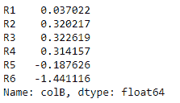

按列名称子集化单列

可以使用一系列方括号运算符，在列属性后指定行索引或行标签：

```py
# Accessing a single element in a DataFrame
df["colB"]["R3"], df["colB"][1]
```

这将产生以下输出：

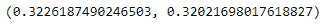

使用方括号运算符切片单个元素

适用于 DataFrame 的规则也适用于 Panel——每个项都可以通过指定项名称从 Panel 中切片。方括号运算符仅接受有效的项名称：

```py
# Subset a panel
pan["Item1"]
```

这将产生以下输出：

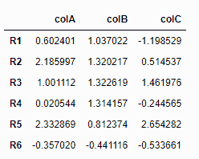

Panel 的子集

要子集化多个值，应该将实体标签的列表传递给方括号运算符。让我们使用 DataFrame 来检查这一点。这对 Series 和 Panel 同样适用：

```py
df[["colA", "colB"]]
```

这将产生以下输出：

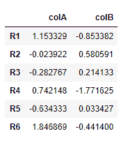

从 DataFrame 中切片多个列

当传入的字符串不是列名时，会引发异常。可以通过使用 `get()` 方法来克服这个问题：

```py
In: df.get("columnA", "NA")
Out: 'NA'
```

方括号运算符在 DataFrame 中也用于插入新列，以下代码块演示了这一点：

```py
# Add new column "colD"
df["colD"] = list(range(len(df)))
df
```

这将产生以下输出：

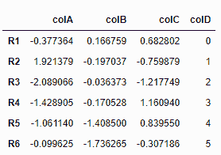

向 DataFrame 添加新列

也可以通过这里显示的方法向 Series 和 Panels 中添加新值。

# 使用点操作符访问属性

要访问单个实体（列、值或项），可以将方括号操作符替换为点操作符。让我们使用点（`.`）操作符来选择 DataFrame 中的 `colA`：

```py
df.colA
```

这将产生以下输出：

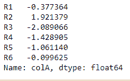

使用点操作符切片列

通过在链中使用两个点操作符，可以访问单个元素：

```py
In: df.colA.R3
Out: -2.089066
```

这同样适用于 Panels 和 Series。然而，与 Series 中的方括号操作符不同，这里不能使用位置索引。为了使用点操作符，行标签或列标签必须具有有效的名称。有效的 Python 标识符必须遵循以下词法规则：

```py
identifier::= (letter|"_") (letter | digit | "_")*
Thus, a valid Python identifier cannot contain a space. See the Python Lexical Analysis documents for more details at http://docs.python.org/2.7/reference/lexical_analysis.html#identifiers.
```

使用点操作符，现有列的值可以被更改。然而，不能创建新列。

# 范围切片

通过提供起始和结束位置来切片以获取一系列值，像在 NumPy 数组中一样，这在 pandas 对象中也适用。`[ : ]` 操作符有助于范围切片。

让我们切片之前创建的 Series，选取第二、第三和第四行：

```py
ser[1:4]
```

这将产生以下输出：

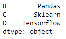

使用索引范围切片 Series

与 Python 中的范围一样，切片时冒号后的值会被排除。

范围切片可以通过提供起始或结束索引来完成。如果没有提供结束索引，值将从给定的起始索引切片到数据结构的末尾。同样，当只提供结束索引时，第一行会被视为切片的起始位置：

```py
# End provided for range slicing
df[:2]
```

这将产生以下输出：

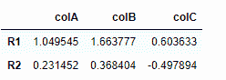

使用定义范围末端的范围切片

当给定起始索引时，选择该索引值对应的行作为切片的起始位置：

```py
# Start provided for range slicing
df[2:]
```

这将产生以下输出：

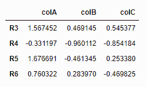

使用定义范围起始端的范围切片

通过属性使范围切片变得更有趣，可以选择间隔均匀的行。例如，你可以通过这种方式选择奇数行或偶数行：

```py
# Select odd rows
df[::2]
```

这将产生以下输出：

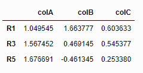

使用范围切片选择奇数行

要选择偶数行，可以使用以下代码：

```py
# Select even rows
df[1::2]
```

这将产生以下输出：

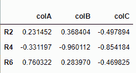

使用范围切片选择偶数行

如果你想反转行的顺序，可以使用以下命令：

```py
# Reverse the rows
df[::-1]
```

这将产生以下输出：

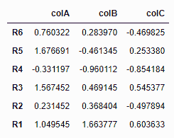

使用范围切片反转行的顺序

# 标签、整数和混合索引

除了标准的索引操作符 `[]` 和属性操作符外，pandas 还提供了一些操作符，使得索引更加简便和高效。通过标签索引，通常是指使用列标题进行索引，这些标题通常是字符串类型的值。这些操作符包括：

+   **`.loc` 操作符**：该操作符允许基于标签的索引。

+   **`.iloc` 操作符**：该操作符允许基于整数的索引。

+   **`.ix` 操作符**：该操作符允许混合标签和基于整数的索引。

现在，我们将重点介绍这些操作符。

# 基于标签的索引

`.loc` 操作符支持纯标签基础的索引。它接受以下作为有效输入：

+   单个标签，如 `["colC"]`、`[2]` 或 `["R1"]` —— 请注意，在标签是整数的情况下，它并不代表索引的位置，而是整数本身作为标签。

+   标签列表或数组，例如 `["colA", "colB"]`。

+   带标签的切片对象，例如 `"colB":"colD"`。

+   一个布尔数组。

让我们分别查看这四种情况，针对以下两个 Series —— 一个是基于整数标签，另一个是基于字符串标签：

```py
ser_loc1 = pd.Series(np.linspace(11, 15, 5))
ser_loc2 = pd.Series(np.linspace(11, 15, 5), index = list("abcde"))

# Indexing with single label
In: ser_loc1.loc[2]
Out: 13.0
In: ser_loc2.loc["b"]
Out: 12.0

# Indexing with a list of labels
ser_loc1.loc[[1, 3, 4]]
```

这将生成以下输出：

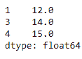

使用 `loc1.loc` 对整数标签列表进行索引的输出

```py
ser_loc2.loc[["b", "c", "d"]]
```

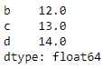

使用 `loc2.loc` 对标签列表进行索引的输出

```py
# Indexing with range slicing
ser_loc1.loc[1:4]
```

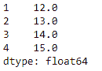

使用 `loc` 进行范围切片（整数标签）的输出

```py
ser_loc2.loc["b":"d"]
```

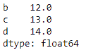

使用 `loc` 进行范围切片的输出

请注意，与 Python 中的范围不同，后端端点不被排除，这里两个端点都包括在所选数据中。pandas 对象还可以基于对对象内部值应用的逻辑条件进行过滤：

```py
# Indexing with Boolean arrays
ser_loc1.loc[ser_loc1 > 13]
```

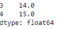

使用布尔数组进行索引的 `loc` 输出

现在，这些切片技巧可以应用到 DataFrame 中。它的工作方式相同，只是有一个额外的要求：可以为每个轴提供两个标签集合。

```py
# Create a dataframe with default row-labels
df_loc1 = pd.DataFrame(np.linspace(1, 25, 25).reshape(5, 5), columns = ["Asia", "Europe", "Africa", "Americas", "Australia"])

# Create a dataframe with custom row labels
df_loc2 = pd.DataFrame(np.linspace(1, 25, 25).reshape(5, 5), columns = ["Asia", "Europe", "Africa", "Americas", "Australia"], index = ["2011", "2012", "2013", "2014", "2015"])

# Indexing with single label
df_loc1.loc[:,"Asia"]
```

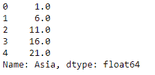

使用 `loc` 对单列进行切片的输出

```py
df_loc1.loc[2, :]
```

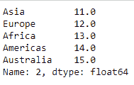

使用 `loc` 对单行（整数标签）进行切片的输出

在前面的例子中，“2”并没有代表位置，而是代表索引标签：

```py
df_loc2.loc["2012", :]
```

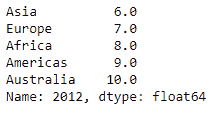

使用 `loc` 对单行进行切片的输出

```py
# Indexing with a list of labels
df_loc1.loc[:,["Africa", "Asia"]]
```

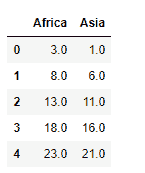

使用 `loc` 通过标签列表进行选择的输出

```py
# Indexing with range slicing
df_loc1.loc[:,"Europe":"Americas"]
```

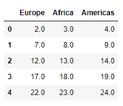

使用 `loc` 进行范围切片的输出

```py
# Indexing with Boolean array
df_loc2.loc[df_loc2["Asia"] > 11, :]
```

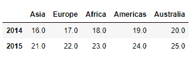

使用 `loc` 进行基于布尔数组切片的输出

# 整数基础的索引

整数基础的索引可以实现与基于标签的索引相同的四种情况：单个标签、一组标签、范围切片和布尔数组。

让我们使用与前一节相同的 DataFrame 来理解面向整数的索引。在这里，我们使用两个值——分别针对每个轴——来检查基于整数的索引。也允许仅传递一个轴的索引。通过`loc`运算符也可以做到这一点，只需传入行和列标签：

```py
# Indexing with single values.
In: df_loc1.iloc[3, 2]
Out: 18.0
# Indexing with list of indices
df_loc1.iloc[[1, 4], [0, 2, 3]]
```

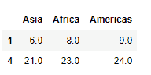

使用索引列表进行切片时的 iloc 输出

```py
# Indexing with ranged slicing
df_loc2.iloc[3:,:3]
```

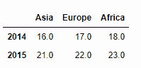

使用范围切片时的 iloc 输出

```py
# Indexing with Boolean array
df_loc2.iloc[(df_loc2["Asia"] > 11).values, :]
```

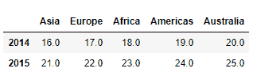

使用布尔数组进行切片时的 iloc 输出

对于基于布尔数组的`iloc`运算符索引，必须通过围绕数组值的逻辑条件提取数组。

# `.iat`和`.at`运算符

`.iat`和`.at`运算符等同于`.iloc`和`.loc`运算符——前者用于基于位置的索引，后者用于基于标签的索引。虽然`.loc`和`.iloc`支持选择多个值，但`.at`和`.iat`只能提取单个标量值。因此，它们需要行和列索引进行切片：

```py
In: df_loc2.at["2012", "Americas"]
Out: 9.0

In: df_loc1.iat[2, 3]
Out: 14.0
```

`.iat`和`.at`运算符的性能比`.iloc`和`.loc`要快得多：

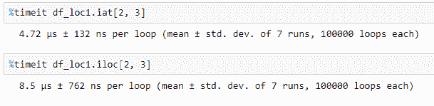

对`.iat`与`.iloc`的基准测试

# 使用.ix 运算符进行混合索引

`.ix`运算符既支持基于标签的索引，也支持基于位置的索引，并且被认为是`.loc`和`.iloc`运算符的通用版本。由于存在歧义，这个运算符已经被弃用，并且在未来的版本中将不再可用。因此，建议不要使用`.ix`运算符。让我们来了解一下`.ix`运算符。

这里，行索引是基于标签的，列索引是基于位置的：

```py
df_loc2.ix["2012":"2014", 0:2]
```

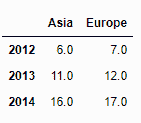

在 DataFrame 中使用.ix 进行混合索引

# 多重索引

现在我们将转向多重索引的话题。多级或层次化索引非常有用，因为它允许 pandas 用户通过使用诸如 Series 和 DataFrame 等数据结构，在多个维度中选择和处理数据。为了开始，让我们将以下数据保存到文件`stock_index_prices.csv`，并读取它：

```py
    In[950]:sharesIndexDataDF=pd.read_csv('./stock_index_prices.csv')
    In [951]: sharesIndexDataDF
    Out[951]:
      TradingDate  PriceType  Nasdaq     S&P 500  Russell 2000
    0   2014/02/21   open     4282.17  1841.07  1166.25
    1   2014/02/21   close     4263.41  1836.25  1164.63
    2   2014/02/21   high     4284.85  1846.13  1168.43
    3   2014/02/24   open     4273.32  1836.78  1166.74
    4   2014/02/24   close     4292.97  1847.61  1174.55
    5   2014/02/24   high      4311.13  1858.71  1180.29
    6   2014/02/25   open     4298.48  1847.66  1176.00
    7   2014/02/25   close     4287.59  1845.12  1173.95
    8   2014/02/25   high     4307.51  1852.91  1179.43
    9   2014/02/26   open     4300.45  1845.79  1176.11
    10   2014/02/26   close     4292.06  1845.16  1181.72
    11   2014/02/26   high     4316.82  1852.65  1188.06
    12   2014/02/27   open     4291.47  1844.90  1179.28
    13   2014/02/27   close     4318.93  1854.29  1187.94
    14   2014/02/27   high     4322.46  1854.53  1187.94
    15   2014/02/28   open     4323.52  1855.12 1189.19
    16   2014/02/28   close     4308.12  1859.45 1183.03
    17   2014/02/28   high     4342.59  1867.92 1193.50
```

在这里，我们通过`TradingDate`和`PriceType`列创建一个多重索引：

```py
In[958]:sharesIndexDF=sharesIndexDataDF.set_index(['TradingDate','PriceType']) 

In [959]: mIndex=sharesIndexDF.index; mIndex 

Out[959]: MultiIndex
        [(u'2014/02/21', u'open'), (u'2014/02/21', u'close'), (u'2014/02/21', u'high'), (u'2014/02/24', u'open'), (u'2014/02/24', u'close'), (u'2014/02/24', u'high'), (u'2014/02/25', u'open'), (u'2014/02/25', u'close'), (u'2014/02/25', u'high'), (u'2014/02/26', u'open'), (u'2014/02/26', u'close'), (u'2014/02/26', u'high'), (u'2014/02/27', u'open'), (u'2014/02/27', u'close'), (u'2014/02/27', u'high'), (u'2014/02/28', u'open'), (u'2014/02/28', u'close'), (u'2014/02/28', u'high')]

In [960]: sharesIndexDF
Out[960]: Nasdaq  S&P 500   Russell 2000 TradingDate PriceType
2014/02/21 open   4282.17  1841.07  1166.25
          close  4263.41  1836.25  1164.63
          high   4284.85  1846.13  1168.43
2014/02/24 open         4273.32  1836.78  1166.74
         close         4292.97  1847.61  1174.55
         high         4311.13  1858.71  1180.29
2014/02/25 open         4298.48  1847.66  1176.00
         close         4287.59  1845.12  1173.95
         high         4307.51  1852.91  1179.43
2014/02/26 open         4300.45  1845.79  1176.11
         close         4292.06  1845.16  1181.72
         high         4316.82  1852.65  1188.06
2014/02/27 open        4291.47  1844.90  1179.28
         close        4318.93  1854.29  1187.94
         high        4322.46  1854.53  1187.94
2014/02/28 open        4323.52  1855.12  1189.19
         close        4308.12  1859.45  1183.03
         high        4342.59  1867.92  1193.50

```

经检查，我们发现多重索引由一组元组组成。使用适当参数应用`get_level_values`函数，生成每个索引级别的标签列表：

```py
    In [962]: mIndex.get_level_values(0)
    Out[962]: Index([u'2014/02/21', u'2014/02/21', u'2014/02/21', u'2014/02/24', u'2014/02/24', u'2014/02/24', u'2014/02/25', u'2014/02/25', u'2014/02/25', u'2014/02/26', u'2014/02/26', u'2014/02/26', u'2014/02/27', u'2014/02/27', u'2014/02/27', u'2014/02/28', u'2014/02/28', u'2014/02/28'], dtype=object)

    In [963]: mIndex.get_level_values(1)
    Out[963]: Index([u'open', u'close', u'high', u'open', u'close', u'high', u'open', u'close', u'high', u'open', u'close', u'high', u'open', u'close', u'high', u'open', u'close', u'high'], dtype=object)

```

如果传递给`get_level_values()`的值无效或超出范围，将抛出`IndexError`：

```py
    In [88]: mIndex.get_level_values(2)
             ---------------------------------------------------------
    IndexError                      Traceback (most recent call last)
    ...

```

你可以通过多重索引的 DataFrame 实现层次化索引：

```py
    In [971]: sharesIndexDF.ix['2014/02/21']
    Out[971]:       Nasdaq   S&P 500    Russell 2000
      PriceType
      open       4282.17  1841.07  1166.25
      close       4263.41  1836.25  1164.63
      high       4284.85  1846.13  1168.43

    In [976]: sharesIndexDF.ix['2014/02/21','open']
    Out[976]: Nasdaq          4282.17
        S&P 500         1841.07
        Russell 2000    1166.25
        Name: (2014/02/21, open), dtype: float64 

```

我们可以使用多重索引进行切片：

```py
    In [980]: sharesIndexDF.ix['2014/02/21':'2014/02/24']
    Out[980]:      Nasdaq   S&P 500   Russell 2000
      TradingDate  PriceType
      2014/02/21   open  4282.17   1841.07   1166.25
             close  4263.41   1836.25   1164.63
             high  4284.85   1846.13   1168.43
      2014/02/24   open  4273.32   1836.78   1166.74
             close  4292.97   1847.61   1174.55
             high  4311.13   1858.71   1180.29

```

我们可以尝试在更低级别进行切片：

```py
    In [272]:
    sharesIndexDF.ix[('2014/02/21','open'):('2014/02/24','open')]
    ------------------------------------------------------------------
    KeyError                                  Traceback (most recent call last)
    <ipython-input-272-65bb3364d980> in <module>()
    ----> 1 sharesIndexDF.ix[('2014/02/21','open'):('2014/02/24','open')]
    ...
    KeyError: 'Key length (2) was greater than MultiIndex lexsort depth (1)'

```

然而，这会导致`KeyError`，并伴随一个相当奇怪的错误信息。这里的关键教训是，目前版本的多重索引要求标签已排序，才能确保低级切片操作正确执行。

为了实现这一点，你可以使用`sortlevel()`方法，它对多重索引中的轴标签进行排序。为了安全起见，先排序再进行多重索引切片。因此，我们可以这样做：

```py
In [984]: sharesIndexDF.sortlevel(0).ix[('2014/02/21','open'):('2014/02/24','open')]

Out[984]:          Nasdaq    S&P 500  Russell 2000
      TradingDate  PriceType
      2014/02/21  open      4282.17   1841.07  1166.25
      2014/02/24  close      4292.97   1847.61  1174.55
          high      4311.13   1858.71  1180.29
          open      4273.32   1836.78  1166.74

```

我们还可以传递一个元组列表：

```py
In [985]: sharesIndexDF.ix[[('2014/02/21','close'),('2014/02/24','open')]] 
Out[985]: Nasdaq S&P 500 Russell 2000 TradingDate PriceType 2014/02/21 close 4263.41 1836.25 1164.63 2014/02/24 open 4273.32 1836.78 1166.74 2 rows × 3 columns
```

请注意，通过指定一个元组列表而不是范围，如前面的示例所示，我们仅显示`TradingDate = 2014/02/24`时的`PriceType`的开盘值，而不是显示所有三个值。

# 交换和重新排序级别

`swaplevel`函数允许在多重索引中交换级别：

```py
    In [281]: swappedDF=sharesIndexDF[:7].swaplevel(0, 1, axis=0)
              swappedDF
    Out[281]:        Nasdaq    S&P 500  Russell 2000
      PriceType  TradingDate
      open        2014/02/21   4282.17  1841.07  1166.25
      close    2014/02/21   4263.41  1836.25  1164.63
      high    2014/02/21   4284.85  1846.13  1168.43
      open    2014/02/24   4273.32  1836.78  1166.74
      close    2014/02/24   4292.97  1847.61  1174.55
      high    2014/02/24   4311.13  1858.71  1180.29
      open        2014/02/25   4298.48  1847.66  1176.00
      7 rows × 3 columns

```

`reorder_levels`函数更加通用，允许你指定级别的顺序：

```py
 In [285]: reorderedDF=sharesIndexDF[:7].reorder_levels(['PriceType',                                                 'TradingDate'],axis=0)
 reorderedDF
    Out[285]:        Nasdaq    S&P 500  Russell 2000
      PriceType  TradingDate
      open    2014/02/21   4282.17  1841.07  1166.25
      close    2014/02/21   4263.41  1836.25  1164.63
      high    2014/02/21   4284.85  1846.13  1168.43
      open    2014/02/24   4273.32  1836.78  1166.74
      close    2014/02/24   4292.97  1847.61  1174.55
      high    2014/02/24   4311.13  1858.71  1180.29
      open    2014/02/25   4298.48  1847.66  1176.00
      7 rows × 3 columns

```

# 交叉截面

`xs`方法提供了一种基于特定索引级别值选择数据的快捷方式：

```py
    In [287]: sharesIndexDF.xs('open',level='PriceType')
    Out[287]:
          Nasdaq    S&P 500  Russell 2000
      TradingDate
      2014/02/21  4282.17  1841.07  1166.2x5
      2014/02/24   4273.32  1836.78  1166.74
      2014/02/25   4298.48  1847.66  1176.00
      2014/02/26   4300.45  1845.79  1176.11
      2014/02/27   4291.47  1844.90  1179.28
      2014/02/28   4323.52  1855.12  1189.19
      6 rows × 3 columns

```

前面命令的冗长替代方法是使用`swaplevel`在`TradingDate`和`PriceType`级别之间切换，然后执行如下选择：

```py
    In [305]: sharesIndexDF.swaplevel(0, 1, axis=0).ix['open']
    Out[305]:     Nasdaq   S&P 500  Russell 2000
      TradingDate
      2014/02/21  4282.17  1841.07  1166.25
      2014/02/24  4273.32  1836.78  1166.74
      2014/02/25  4298.48  1847.66  1176.00
      2014/02/26  4300.45  1845.79  1176.11
      2014/02/27  4291.47  1844.90  1179.28
      2014/02/28  4323.52  1855.12  1189.19
      6 rows × 3 columns

```

使用`.xs`实现的效果与在前一节关于整数索引的内容中获取交叉截面相同。

# 布尔索引

我们使用布尔索引来过滤或选择数据的部分内容。操作符如下：

| **操作符** | **符号** |
| --- | --- |
| 或 | &#124; |
| 与 | & |
| 非 | ~ |

当这些操作符一起使用时，必须用括号将它们分组。使用前一节中的 DataFrame，我们在这里显示了纳斯达克收盘价高于 4,300 的交易日期：

```py
  In [311]: sharesIndexDataDF.ix[(sharesIndexDataDF['PriceType']=='close') & \
                         (sharesIndexDataDF['Nasdaq']>4300) ]
  Out[311]:        PriceType  Nasdaq   S&P 500   Russell 2000
      TradingDate
      2014/02/27   close  4318.93   1854.29   1187.94
      2014/02/28   close  4308.12   1859.45   1183.03
      2 rows × 4 columns

```

你还可以创建布尔条件，使用数组来筛选数据的部分，如下代码所示：

```py
highSelection=sharesIndexDataDF['PriceType']=='high'  NasdaqHigh=sharesIndexDataDF['Nasdaq']<4300  sharesIndexDataDF.ix[highSelection & NasdaqHigh]
    Out[316]: TradingDate  PriceType Nasdaq  S&P 500  Russell 2000
        2014/02/21        high 4284.85  1846.13  1168.43
```

因此，上面的代码片段显示了数据集中唯一一个在整个交易会话中，纳斯达克综合指数始终保持低于 4,300 点的日期。

# `isin`和`any all`方法

这些方法使用户通过布尔索引比前面章节中使用的标准操作符能够实现更多功能。`isin`方法接受一个值列表，并返回一个布尔数组，其中在 Series 或 DataFrame 中与列表中的值匹配的位置标记为`True`。这使得用户能够检查 Series 中是否存在一个或多个元素。下面是一个使用`Series`的示例：

```py
    In[317]:stockSeries=pd.Series(['NFLX','AMZN','GOOG','FB','TWTR'])
               stockSeries.isin(['AMZN','FB'])
    Out[317]:0    False
            1     True
            2    False
            3     True
            4    False
            dtype: bool

```

在这里，我们使用布尔数组来选择一个包含我们感兴趣值的子系列：

```py
    In [318]: stockSeries[stockSeries.isin(['AMZN','FB'])]
    Out[318]: 1    AMZN
             3      FB
            dtype: object

```

对于我们的 DataFrame 示例，我们切换到一个更有趣的数据集，对于那些从事生物人类学研究的人来说，这是分类澳大利亚哺乳动物的数据集（这是我的一个兴趣爱好）：

```py
    In [324]: australianMammals=
                  {'kangaroo': {'Subclass':'marsupial', 
                                  'Species Origin':'native'},
                   'flying fox' : {'Subclass':'placental', 
                                   'Species Origin':'native'},
                   'black rat': {'Subclass':'placental', 
                                 'Species Origin':'invasive'},
                   'platypus' : {'Subclass':'monotreme', 
                                 'Species Origin':'native'},
                   'wallaby' :  {'Subclass':'marsupial', 
                                 'Species Origin':'native'},
            'palm squirrel' : {'Subclass':'placental', 
                               'Origin':'invasive'},
            'anteater':     {'Subclass':'monotreme', 'Origin':'native'},
            'koala':        {'Subclass':'marsupial', 'Origin':'native'}
    }

```

更多关于哺乳动物的信息：有袋类动物是有袋哺乳动物，单孔目是卵生的，胎盘动物则是生育活幼。该信息来源于：[`en.wikipedia.org/wiki/List_of_mammals_of_Australia`](http://en.wikipedia.org/wiki/List_of_mammals_of_Australia).


前面图像的来源是 Bennett 的袋鼠，网址：[`bit.ly/NG4R7N.`](http://bit.ly/NG4R7N.)

让我们读取澳大利亚哺乳动物数据集，将其转换为 DataFrame，并在使用之前转置它：

```py
    In [328]: ozzieMammalsDF=pd.DataFrame(australianMammals)
    In [346]: aussieMammalsDF=ozzieMammalsDF.T; aussieMammalsDF
    Out[346]:       Subclass  Origin
      anteater      monotreme      native
      black rat     placental   invasive
      flying fox    placental   native
      kangaroo      marsupial   native
      koala          marsupial   native
      palm squirrel placental   invasive
      platypus      monotreme      native
      wallaby   marsupial   native
      8 rows × 2 columns
```

让我们尝试选择原产于澳大利亚的哺乳动物：

```py
    In [348]: aussieMammalsDF.isin({'Subclass':['marsupial'],'Origin':['native']})
    Out[348]:    Subclass Origin
      anteater   False   True
      black rat   False   False
      flying fox   False   True
      kangaroo   True   True
      koala      True   True
      palm squirrel False False
      platypus   False   True
      wallaby   True   True
      8 rows × 2 columns

```

传递给 `isin` 的值集可以是数组或字典。虽然这样做在某种程度上是有效的，但通过将 `isin` 和 `all()` 方法结合使用创建掩码，我们可以获得更好的结果：

```py
    In [349]: nativeMarsupials={'Mammal Subclass':['marsupial'],
                                'Species Origin':['native']}
           nativeMarsupialMask=aussieMammalsDF.isin(nativeMarsupials).all(True)
        aussieMammalsDF[nativeMarsupialMask]
    Out[349]:      Subclass   Origin
      kangaroo  marsupial  native
      koala      marsupial  native
      wallaby   marsupial  native
      3 rows × 2 columns

```

因此，我们看到袋鼠、考拉和沙袋鼠是我们数据集中原生的有袋动物。`any()` 方法返回布尔型 DataFrame 中是否有任何元素为 `True`。`all()` 方法则会筛选返回布尔型 DataFrame 中所有元素是否都为 `True`。

更多关于 pandas 方法的信息，可以从其官方文档页面查看：[`pandas.pydata.org/pandas-docs/stable/generated/pandas.DataFrame.any.html.`](http://pandas.pydata.org/pandas-docs/stable/generated/pandas.DataFrame.any.html.)

# 使用 `where()` 方法

`where()` 方法用于确保布尔过滤的结果与原始数据的形状相同。首先，我们将随机数生成器的种子设置为 100，以便用户可以生成相同的值，如下所示：

```py
    In [379]: np.random.seed(100)
           normvals=pd.Series([np.random.normal() for i in np.arange(10)])
        normvals
    Out[379]: 0   -1.749765
        1    0.342680
        2    1.153036
        3   -0.252436
        4    0.981321
        5    0.514219
        6    0.221180
        7   -1.070043
        8   -0.189496
        9    0.255001
        dtype: float64

    In [381]: normvals[normvals>0]
    Out[381]: 1    0.342680
        2    1.153036
        4    0.981321
        5    0.514219
        6    0.221180
        9    0.255001
        dtype: float64

    In [382]: normvals.where(normvals>0)
    Out[382]: 0         NaN
        1    0.342680
        2    1.153036
        3         NaN
        4    0.981321
        5    0.514219
        6    0.221180
        7         NaN
        8         NaN
        9    0.255001
        dtype: float64

```

这个方法似乎只在 Series 的情况下有用，因为在 DataFrame 的情况下，我们已经可以免费获得这个行为：

```py
    In [393]: np.random.seed(100) 
           normDF=pd.DataFrame([[round(np.random.normal(),3) for i in np.arange(5)] for j in range(3)], 
                 columns=['0','30','60','90','120'])
        normDF
    Out[393]:  0  30  60  90  120
      0  -1.750   0.343   1.153  -0.252   0.981
      1   0.514   0.221  -1.070  -0.189   0.255
      2  -0.458   0.435  -0.584   0.817   0.673
      3 rows × 5 columns
    In [394]: normDF[normDF>0]
    Out[394]:  0  30  60  90  120
      0   NaN   0.343   1.153   NaN   0.981
      1   0.514   0.221   NaN       NaN   0.255
      2   NaN   0.435   NaN   0.817   0.673
      3 rows × 5 columns
    In [395]: normDF.where(normDF>0)
    Out[395]:  0  30  60  90  120
      0   NaN   0.343   1.153   NaN   0.981
      1   0.514   0.221   NaN   NaN   0.255
      2   NaN   0.435   NaN   0.817   0.673
      3 rows × 5 columns

```

`where` 方法的逆操作是 `mask`：

```py
    In [396]: normDF.mask(normDF>0)
    Out[396]:  0  30  60  90  120
      0  -1.750  NaN   NaN  -0.252  NaN
      1   NaN  NaN  -1.070  -0.189  NaN
      2  -0.458  NaN  -0.584   NaN  NaN
      3 rows × 5 columns

```

# 索引操作

为了完成本章内容，我们将讨论索引操作。当我们希望重新对齐数据或以不同方式选择数据时，有时需要操作索引。这里有多种操作：

请注意，`set_index` 允许在现有的 DataFrame 上创建索引，并返回一个已索引的 DataFrame，正如我们之前所看到的：

```py
    In [939]: stockIndexDataDF=pd.read_csv('./stock_index_data.csv')
    In [940]: stockIndexDataDF
    Out[940]:   TradingDate  Nasdaq   S&P 500  Russell 2000
      0   2014/01/30   4123.13  1794.19  1139.36
      1   2014/01/31   4103.88  1782.59  1130.88
      2   2014/02/03   3996.96  1741.89  1094.58
      3   2014/02/04   4031.52  1755.20  1102.84
      4   2014/02/05   4011.55  1751.64  1093.59
      5   2014/02/06   4057.12  1773.43  1103.93

```

现在，我们可以按如下方式设置索引：

```py
    In [941]: stockIndexDF=stockIndexDataDF.set_index('TradingDate')
    In [942]: stockIndexDF
    Out[942]:    Nasdaq   S&P 500  Russell 2000
      TradingDate
      2014/01/30  4123.13   1794.19  1139.36
      2014/01/31      4103.88   1782.59  1130.88
      2014/02/03  3996.96   1741.89  1094.58
      2014/02/04  4031.52   1755.20  1102.84
      2014/02/05  4011.55   1751.64  1093.59
      2014/02/06  4057.12   1773.43  1103.93

```

此外，`reset_index` 会逆转 `set_index` 的操作：

```py
    In [409]: stockIndexDF.reset_index()
    Out[409]:    
       TradingDate   Nasdaq   S&P 500  Russell 2000
    0   2014/01/30   4123.13   1794.19   1139.36
    1   2014/01/31   4103.88   1782.59   1130.88
    2   2014/02/03   3996.96   1741.89   1094.58
    3   2014/02/04   4031.52   1755.20   1102.84
    4   2014/02/05   4011.55   1751.64   1093.59
    5   2014/02/06   4057.12   1773.43   1103.93
    6 rows × 4 columns

```

阅读完这一章后，你在使用 pandas 进行数据整理方面已经取得了长足的进步。在下一章中，我们将继续学习更多有用的数据整理工具。

# 总结

在本章中，我们学习了如何访问和选择 pandas 数据结构中的数据。我们还详细了解了基本索引和标签导向、整数导向及混合索引方法。我们还学习了如何使用布尔/逻辑索引。在本章结束时，我们讨论了索引操作。

若要了解有关 pandas 中索引的更多信息，请查阅官方文档：[`pandas.pydata.org/pandas-docs/stable/indexing.html`](http://pandas.pydata.org/pandas-docs/stable/indexing.html)。

在下一章中，我们将探讨使用 pandas 进行分组、重塑和合并数据的主题。
