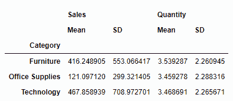
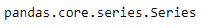

# 第六章：在 pandas 中分组、合并和重塑数据

本章将探讨如何在我们的数据结构中重新排列和重塑数据。我们将通过对真实世界数据集应用不同的函数来审视使我们能够重新排列数据的各种函数。这些函数包括`groupby`、`concat`、`aggregate`、`append`等。

本章将讨论以下主题：

+   聚合/分组数据

+   合并和连接数据

+   数据重塑

+   重塑 DataFrame 的其他方法

# 分组数据

数据分组对于在初步探索性分析阶段得出关键结论至关重要。例如，当你处理一个零售数据集，数据集包含*OrderID、CustomerID、Shipping Date、Product Category、Sales Region、Quantity Ordered、Cancelation Status、Total Sales、Profit、Discount*等变量时，分组数据并进行聚合可以帮助你回答以下类似问题：

+   哪个地区最具盈利性？

+   哪个产品类别的取消率最高？

+   哪些客户贡献了 80%的利润？

分组涉及在每个类别下进行聚合。聚合可能包括计数、求和、求指数或实现复杂的用户定义函数。pandas 的`groupby`函数有助于分组。这与 SQL 中的`groupby`查询并没有太大区别。

# groupby 操作

通过`groupby`函数，一系列操作被执行：拆分、应用和合并。拆分将每个类别从所需的分组变量中分离出来，以便对其执行进一步操作。然后，函数可以单独应用于这些拆分后的每个组。这些函数可能涉及聚合（对组进行求和或求均值）、转换（填充组内的 NA 值或排序）、过滤（在组内应用条件以删除行），甚至是这三种操作的组合。最后，在每个拆分组应用函数后，得到的结果会被合并在一起。

让我们使用来自一个虚构全球零售商的示例数据。以 CSV 格式提供的数据被读取为 pandas DataFrame：

```py
sales_data = pd.read_csv("salesdata.csv", encoding = "ISO-8859-1")
```

`head`函数将让我们快速浏览刚导入的数据集：

```py
sales_data.head()
```

以下是输出结果：


示例销售数据的快照

虽然在前面的输出中展示了五行数据，但数据总共包含 51,290 行和 15 列。

现在，为了理解`groupby`如何拆分数据，我们按`Category`变量进行拆分。所创建的对象不是 DataFrame，而是`groupby`函数特有的对象类型：

```py
category_grouped = sales_data.groupby("Category")
type(category_grouped)
pandas.core.groupby. DataFrameGroupBy
```

分组对象被称为键。在这里，`Category`就是键。前一步创建的`groupby`对象下的各个组如图所示。你可以看到，每个`Category`中的组都映射到每个类别所覆盖的行索引标签：

```py
category_grouped.groups
```

以下是输出结果：


每个组的信息

数据有四个定量变量：`Quantity`（数量）、`Sales`（销售额）、`Discount`（折扣）和`Profit`（利润）。使用`groupby`，我们来计算每个`Category`（类别）中的这四个变量的总和。这是聚合与`groupby`结合的应用：

```py
sales_data.groupby("Category").sum()
```

以下是输出结果：


分组和求和的结果

稍微修改代码，如下所示，来计算仅销售额的总和。这涉及在应用`groupby`之前对数据进行子集选择：

```py
sales_data[["Category", "Sales"]].groupby("Category").sum()
```

以下是输出结果：


根据一个变量进行`groupby`和求和

聚合不一定仅限于定量变量。现在，使用`groupby`，让我们找出每个类别首次下单的`Country`（国家）：

```py
sales_data[["Category", "Country"]].groupby("Category").first()
```

以下是输出结果：


先使用聚合再进行分组

`size()`函数有助于找到每个`Category`（类别）的出现次数。在计算`size`之后，我们通过排序结果来探索`groupby`的变换能力：

```py
sales_data.groupby("Category").size().sort_values(ascending = True)
```

以下是输出结果：


排序后的聚合大小

分组的键或分组对象不一定是现有的列；它也可以是定义分组规则的函数。例如，我们可以从`OrderDate`（订单日期）中提取年份，然后按年份进行`groupby`。为此，首先将索引设置为`OrderDate`：

```py
index_by_date = sales_data.set_index('OrderDate')
index_by_date.groupby(lambda OrderDate: OrderDate.split('-')[2]).sum()
```

以下是输出结果：


使用自定义函数进行分组

也可以根据多个键进行分组。在这里，我们通过`ShipMode`（运输方式）和`Category`（类别）进行分组，以按观察数量进行聚合。`groupby`函数接受一个包含多个变量的列表：

```py
sales_data.groupby(["ShipMode","Category"]).size()
```

以下是输出结果：


根据两个分组变量进行大小聚合

`groupby`函数的`get_group()`属性允许根据一个类别过滤数据，从所有类别中选择：

```py
sales_data.groupby("ShipMode").get_group("Same Day")
```

以下是输出结果：


`groupby`的`get_group`属性

`groupby`函数生成的`groupby`对象是可迭代的。让我们遍历一个简单的`groupby`对象：

```py
for name, group in sales_data.groupby("ShipMode"):
print(name)
print(group.iloc[0:5,0:5])
```

以下是输出结果：


遍历 groupby 对象

不仅可以根据列名进行分组，也可以使用索引进行分组。在使用索引时，可以指定索引名的层级。让我们设置`Region`（地区）为索引来演示这一点：

```py
region_index_df = sales_data.set_index("Region", drop = True)
region_index_df.groupby(level = 0).sum()
```

以下是输出结果：


使用索引进行分组

`groupby` 聚合操作不一定总是沿着某一列进行。如果需要，可以通过更改 `axis` 参数将项目沿着行进行分组和聚合。`axis` 参数的默认设置是 `0`。将其更改为 `axis = 1` 会将项目沿行进行分组：

```py
sales_data.groupby("ShipMode", axis = 0).size()
```

# 在 MultiIndex 上使用 groupby

让我们探索 `groupby` 函数如何在分层索引数据中工作。

首先，我们可以为示例销售数据分配两个索引，如下所示：

```py
multiindex_df = sales_data.set_index(["ShipMode", "Category"])
multiindex_df.head()
```

以下是输出结果：


多级索引数据的快照

按索引分组可以通过指定级别数字或索引名称来实现：

```py
multiindex_df.groupby(level = 0).sum()
```

以下是输出结果：


groupby 的 `level` 属性

`level` 参数也可以使用名称而不是数字，如下所示：

```py
multiindex_df.groupby(level = "Category").sum()
```

以下是输出结果：


使用级别名称进行分组

可以直接将索引名称用作键，如下所示：

```py
multiindex_df.groupby("Category").sum()
```

这会产生以下输出结果：


将索引名称作为键提供

也可以通过 `groupby` 的 `level` 参数传递多个索引，以获得与前述相同的结果：

```py
multiindex_df.groupby(level = ["ShipMode", "Category"]).sum()
```

以下是输出结果：


使用 groupby 进行多索引操作

当按索引分组时，聚合函数可以直接使用 `level` 参数来实现按组拆分。在这里，我们通过指定 `level` 数字实现了对两个级别的分组。除了 `level` 数字，还可以使用索引名称来指定：

```py
multiindex_df.sum(level = [0, 1])
```

以下是输出结果：


使用 `level` 参数的多级索引分组

若要按索引和列名同时进行分组，可以使用以下方法。此处提供的级别数字也可以用级别名称替代。在不使用 `Grouper` 函数的情况下，可以将索引名称和列名作为键的列表提供：

```py
multiindex_df.groupby([pd.Grouper(level = 1), "Region"]).size()
multiindex_df.groupby(["Category", "Region"]).size()
```

以下是输出结果：


使用普通列和索引列一起进行分组

让我们将 `groupby` 提升到一个新层次，并对结果应用数据转换。我们将开始计算总销售额、数量、利润和折扣相对于总体 `Sales`、`Quantity`、`Profit` 和 `Discount` 的比例：

```py
sum_all = multiindex_df.groupby(level = 1).sum()

sum_all.ix["Furniture"]/(sum_all.ix["Furniture"] + sum_all.ix["Technology"] + sum_all.ix["Office Supplies"])
```

以下是输出结果：


使用 groupby 进行复杂计算评估

这会生成一个系列。还记得 NumPy 中的 `transpose` 函数吗？同样，DataFrame 也可以进行转置。然而，刚才得到的输出是一个系列，而不是 DataFrame。转置之前，必须先将系列转换为 DataFrame：

```py
furniture_ratio = sum_all.ix["Furniture"]/(sum_all.ix["Furniture"] + sum_all.ix["Technology"] + sum_all.ix["Office Supplies"])

pd.DataFrame(furniture_ratio).T
```

以下是输出结果：


数据转换的中间结果

结果中的索引标签是 `0`。我们可以使用以下代码将其重命名为更合适的标签，输出结果也显示在后续截图中：

```py
furniture_ratio_df = pd.DataFrame(furniture_ratio).T
furniture_ratio_df.rename(index = {0 : "FurniturePercent"})
```

请查看以下截图：


数据转换结果

# 使用聚合方法

在所有前面的使用案例中，我们使用了求和聚合。我们能够直接使用 `sum`，而无需经过 Python 的 `aggregate` 函数。我们使用的 `sum()` 函数是 Cython 优化的实现。其他一些 Cython 优化的实现包括 `mean`、`std` 和 `sem`（标准误差）。为了实现其他函数或聚合的组合，`aggregate` 函数非常有用：

```py
sales_data.groupby("Category").aggregate(np.sum)
```

以下是输出结果：


使用聚合函数

在处理多个键和索引的章节中讨论的所有规则在此处同样适用。

请注意，在使用多个键或多重索引时，结果在索引中会有层次顺序。为了克服这一点，您可以使用 DataFrame 的 `reset_index` 属性：

```py
sales_data.groupby(["ShipMode", "Category"]).aggregate(np.sum)
```

以下是输出结果：


多列的聚合函数

可以使用以下代码重置输出的索引：

```py
sales_data.groupby(["ShipMode", "Category"]).aggregate(np.sum).reset_index()
```

以下是输出结果：


多重分组变量的聚合函数

为了实现相同的结果，可以将 `groupby` 的 `as_index` 参数设置为 `False`，而不使用 `reset_index`：

```py
sales_data.groupby(["ShipMode", "Category"], as_index = False).aggregate(np.sum)
```

与 `sum` 函数的实现类似，以下是可以应用于 `groupby` 对象的其他函数列表：

| **函数** | **描述** |
| --- | --- |
| `mean()` | 计算组的平均值 |
| `sum()` | 计算组值的总和 |
| `size()` | 计算组的大小 |
| `count()` | 计算组的数量 |
| `std()` | 计算组的标准差 |
| `var()` | 计算组的方差 |
| `sem()` | 计算组的标准误差 |
| `describe()` | 生成描述性统计 |
| `first()` | 计算组值中的第一个 |
| `last()` | 计算组值中的最后一个 |
| `nth()` | 获取第 n 个值，或者如果 n 是列表，则获取子集 |
| `min()` | 计算组值的最小值 |
| `max()` | 计算组值的最大值 |

表 6.1：所有聚合函数列表

# 应用多个函数

对于任何 DataFrame，在应用 `groupby` 后可以执行一系列聚合操作。在下面的示例中，我们计算了 `Sales` 和 `Quantity` 的平均值和标准差：

```py
sales_data[["Sales", "Quantity", "Category"]].groupby("Category").agg([np.mean, np.std])
```

以下是输出结果：


多重聚合

请注意，列索引中也引入了层次结构。`agg` 是聚合的缩写。这些聚合会排除任何 NA 值进行计算。

在前面的示例中，创建了带有 `mean` 和 `std` 标签的列。让我们尝试重命名这些列。`rename` 参数将新名称映射到旧名称：

```py
sales_data[["Sales", "Quantity", "Category"]].groupby("Category").agg([np.mean, np.std]).rename(columns = {"mean": "Mean", "std": "SD"})
```

以下将是输出结果：



每列的不同聚合

要对选定的列应用选定的函数，可以使用以下约定。例如，这里计算了 `Sales` 的总和和 `Quantity` 的均值：

```py
sales_data[["Sales", "Quantity", "Category"]].groupby("Category").agg({"Sales":"sum", "Quantity":"mean"})
```

以下是输出结果：


聚合后重命名列

# `transform()` 方法

`groupby` 中的 `transform` 函数用于对 `groupby` 对象执行转换操作。例如，我们可以使用 `fillna` 方法替换 `groupby` 对象中的 NaN 值。使用 `transform` 后的结果对象与原始 `groupby` 对象大小相同。

让我们向示例销售数据中引入 NAs。以下代码将 NAs 注入 25% 的记录中：

```py
na_df = sales_data[["Sales", "Quantity", "Discount", "Profit", "Category"]].set_index("Category").mask(np.random.random(sales_data[["Sales", "Quantity", "Discount", "Profit"]].shape) &amp;lt; .25)

na_df.head(10)
```

以下将是输出结果：


插入 NAs 后的数据快照

现在，四个定量变量在 25% 的行中包含 NA，`Category` 被设置为索引。简单的 `groupby` 和 `count` 聚合将显示每个类别中每列非 NA 值的数量：

```py
na_df.groupby("Category").count()
```

以下将是输出结果：


非 NA 值的计数

`transform()` 函数用每组的均值填充 NAs：

```py
transformed = na_df.groupby("Category").transform(lambda x: x.fillna(x.mean()))
transformed.head(10)
```

以下将是输出结果：


使用 transform 填充 NAs

结果显示，`transform()` 执行了按组处理 NA。可以看到非 NA 的计数有所增加：

```py
transformed.groupby("Category").count()
```

以下将是输出结果：


转换后的非 NA 值计数

为了验证操作，让我们比较转换前后各组的均值。通过以下代码可以看到两种方法的输出结果相等：

```py
na_df.groupby("Category").mean()
```

以下将是输出结果：


转换前的组均值

使用从 `transform` 方法获得的对象来计算均值，可以按如下方式进行：

```py
transformed.groupby("Category").mean()
```

以下将是输出结果：


转换后的组均值

一些函数，如 `bfill()`（向后填充）、`ffill()`（向前填充）、`fillna()` 和 `shift()` 可以自行执行转换，而不需要 `transform()` 函数：

```py
na_df.groupby("Category").bfill()
```

以下将是输出结果：


向后填充的转换

`rolling()`、`resample()` 和 `expanding()` 等操作也可以作为方法在 `groupby` 上使用。`rolling()` 对值进行移动窗口聚合，`expanding()` 累积聚合，`resample()` 帮助将时间序列数据转换为规则的频率，支持向前填充或向后填充：

```py
sales_data[["Sales", "Category"]].groupby("Category").expanding().sum()
```

上一个 `expanding()` 示例计算了每个组内的累积和。

# 过滤

`filter` 方法使我们能够对 `groupby` 对象应用过滤，从而得到初始对象的子集。

让我们对示例销售数据应用 `filter`，仅计算那些组的总和，其长度大于 `10000`，当按 `Category` 分组时：

```py
filtered_df = sales_data[["Category", "Quantity"]].set_index("Category").groupby("Category").filter(lambda x: len(x) &amp;gt; 10000)
filtered_df.groupby("Category").sum()
```

以下将是输出：


使用 groupby 进行过滤

现在，正如你所看到的，过滤移除了 `Furniture` 类别，因为它的长度小于 `10000`。

# 合并与连接

有多种函数可以用来合并和连接 pandas 数据结构，其中包括以下函数：

+   `concat`

+   `append`

+   `join`

# concat 函数

`concat` 函数用于在指定的轴上连接多个 pandas 数据结构，并可能在其他轴上执行并集或交集操作。以下命令解释了 `concat` 函数：

```py
concat(objs, axis=0, , join='outer', join_axes=None, ignore_index=False, keys=None, levels=None, names=None, verify_integrity=False)
```

`concat` 函数的元素可以总结如下：

+   `objs` 函数：一个 Series、DataFrame 或 Panel 对象的列表或字典，待拼接。

+   `axis` 函数：指定应执行拼接的轴。`0` 是默认值。

+   `join` 函数：在处理其他轴的索引时执行的连接类型。`'outer'` 是默认值。

+   `join_axes` 函数：用于指定其余索引的精确索引，而不是执行外连接/内连接。

+   `keys` 函数：指定用于构建 MultiIndex 的键列表。

有关其余选项的解释，请参考文档：[`pandas.pydata.org/pandas-docs/stable/merging.html`](http://pandas.pydata.org/pandas-docs/stable/merging.html)。

下面是使用我们前面章节中的股票价格示例来说明 `concat` 的工作原理：

```py
    In [53]: stockDataDF=pd.read_csv('./tech_stockprices.csv').set_index(
 ['Symbol']);stockDataDF
    Out[53]:
         Closing price  EPS  Shares Outstanding(M) P/E Market Cap(B) Beta
    Symbol
    AAPL   501.53  40.32  892.45          12.44  447.59    0.84
    AMZN   346.15  0.59   459.00         589.80  158.88    0.52
    FB   61.48        0.59  2450.00         104.93  150.92    NaN
    GOOG   1133.43    36.05   335.83          31.44  380.64    0.87
    TWTR   65.25        -0.30   555.20            NaN   36.23    NaN
    YHOO   34.90         1.27     1010.00          27.48   35.36    0.66

```

现在我们对数据进行不同的切片：

```py
    In [83]: A=stockDataDF.ix[:4, ['Closing price', 'EPS']]; A
    Out[83]:  Closing price  EPS
     Symbol
      AAPL     501.53      40.32
      AMZN     346.15     0.59
      FB      61.48     0.59
       GOOG    1133.43    36.05

    In [84]: B=stockDataDF.ix[2:-2, ['P/E']];B
    Out[84]:         P/E
            Symbol
           FB   104.93
           GOOG   31.44

    In [85]: C=stockDataDF.ix[1:5, ['Market Cap(B)']];C
    Out[85]:         Market Cap(B)
            Symbol
           AMZN   158.88
           FB   150.92
           GOOG   380.64
           TWTR   36.23
```

在这里，我们通过指定外连接来执行拼接，该操作会将三个 DataFrame 连接并执行并集，并包括没有所有列值的条目，通过插入 `NaN` 来填充这些列：

```py
    In [86]: pd.concat([A,B,C],axis=1) # outer join
    Out[86]:  Closing price  EPS    P/E   Market Cap(B)
      AAPL   501.53     40.32  NaN   NaN
      AMZN   346.15     0.59   NaN   158.88
       FB   61.48           0.59  104.93 150.92
       GOOG   1133.43       36.05  31.44 380.64
       TWTR   NaN            NaN    NaN    36.23
```

我们还可以指定内连接，执行拼接但仅包括包含所有列值的行，从而去除缺少列的行；也就是说，它取的是交集：

```py
    In [87]: pd.concat([A,B,C],axis=1, join='inner') # Inner join
    Out[87]:        Closing price  EPS  P/E   Market Cap(B)
             Symbol
             FB      61.48    0.59 104.93  150.92
          GOOG    1133.43   36.05   31.44   380.64

```

第三个案例使我们可以使用原始 DataFrame 中的特定索引进行连接：

```py
    In [102]: pd.concat([A,B,C], axis=1, join_axes=[stockDataDF.index])
    Out[102]:       Closing price  EPS    P/E   Market Cap(B)
          Symbol
             AAPL   501.53     40.32  NaN   NaN
            AMZN   346.15     0.59   NaN   158.88
             FB   61.48           0.59  104.93 150.92
             GOOG   1133.43       36.05  31.44 380.64
             TWTR   NaN            NaN    NaN    36.23
            YHOO   NaN            NaN    NaN    NaN

```

在最后的这个案例中，我们看到 `YHOO` 行被包含进来了，尽管它没有包含在任何被拼接的切片中。然而，在这种情况下，所有列的值都是 `NaN`。这是 `concat` 的另一个示例，但这次它是在随机统计分布上进行的。请注意，如果没有 `axis` 参数，拼接的默认轴是 `0`：

```py
    In[135]: np.random.seed(100)
            normDF=pd.DataFrame(np.random.randn(3,4));normDF
    Out[135]:    0    1      2    3
      0  -1.749765  0.342680  1.153036  -0.252436
      1   0.981321  0.514219  0.221180  -1.070043
      2  -0.189496  0.255001 -0.458027   0.435163

    In [136]: binomDF=pd.DataFrame(np.random.binomial(100,0.5,(3,4)));binomDF
    Out[136]:  0  1  2  3
      0  57  50  57     50
      1  48  56  49     43
      2  40  47  49     55

    In [137]: poissonDF=pd.DataFrame(np.random.poisson(100,(3,4)));poissonDF
    Out[137]:  0  1  2  3
       0  93  96  96  89
       1  76  96  104  103
       2  96  93  107   84

    In [138]: rand_distribs=[normDF,binomDF,poissonDF]
    In [140]: rand_distribsDF=pd.concat(rand_distribs,keys=['Normal', 'Binomial', 'Poisson']);rand_distribsDF
    Out[140]:         0        1       2          3
      Normal     0  -1.749765   0.342680  1.153036  -0.252436
           1   0.981321   0.514219  0.221180  -1.070043
           2  -0.189496   0.255001 -0.458027   0.435163
      Binomial 0   57.00       50.00     57.00      50.00
           1   48.00       56.00     49.00      43.00
           2   40.00       47.00     49.00      55.00
      Poisson  0   93.00       96.00     96.00      89.00
           1   76.00       96.00    104.00     103.00
           2   96.00       93.00    107.00      84.00
```

# 使用 append

`append` 是 `concat` 的简化版本，按 `axis=0` 进行拼接。以下是它的使用示例，我们将 `stockData` DataFrame 中的前两行和前三列切片出来：

```py
    In [145]: stockDataA=stockDataDF.ix[:2,:3]
                stockDataA
    Out[145]:  Closing price  EPS   Shares Outstanding(M)
      Symbol
      AAPL     501.53   40.32   892.45
      AMZN     346.15   0.59   459.00

```

其余的行可以按如下方式获取：

```py
    In [147]: stockDataB=stockDataDF[2:]
             stockDataB
    Out[147]:
         Closing price EPS Shares Outstanding(M)  P/E  Market Cap(B) Beta
    Symbol
    FB   61.48         0.59  2450.00          104.93 150.92   NaN
    GOOG   1133.43    36.05   335.83          31.44  380.64   0.87
    TWTR     65.25    -0.30   555.20           NaN     36.23   NaN
    YHOO     34.90  1.27  1010.00       27.48  35.36   0.66

```

现在，我们使用 `append` 将前面命令中的两个 DataFrame 合并：

```py
    In [161]:stockDataA.append(stockDataB)
    Out[161]:
        Beta Closing price EPS MarketCap(B) P/E     Shares Outstanding(M)
    Symbol
    AMZN  NaN  346.15    0.59  NaN   NaN    459.00
    GOOG  NaN  1133.43   36.05  NaN   NaN    335.83
    FB  NaN  61.48      0.59  150.92 104.93 2450.00
    YHOO  27.48  34.90      1.27  35.36   0.66   1010.00
    TWTR  NaN  65.25     -0.30  36.23   NaN    555.20
    AAPL  12.44  501.53     40.32  0.84   447.59 892.45

```

为了保持列的顺序与原始 DataFrame 相似，我们可以应用 `reindex_axis` 函数：

```py
    In [151]: stockDataA.append(stockDataB).reindex_axis(stockDataDF.columns, axis=1)
    Out[151]:
      Closing price EPS Shares Outstanding(M)  P/E Market Cap(B) Beta
    Symbol
    AAPL   501.53  40.32  892.45         NaN  NaN      NaN
    AMZN   346.15   0.59  459.00          NaN  NaN      NaN
    FB   61.48     0.59  2450.00          104.93  150.92      NaN
    GOOG  1133.43  36.05  335.83        31.44  380.64     0.87
    TWTR    65.25  -0.30  555.20          NaN   36.23      NaN
    YHOO   34.90     1.27  1010.00            27.48  35.36     0.66

```

请注意，对于前两行，最后两列的值为 `NaN`，因为第一个 DataFrame 仅包含前三列。`append` 函数在某些地方无法正常工作，但它会返回一个新的 DataFrame，将第二个 DataFrame 追加到第一个 DataFrame 中。

# 向 DataFrame 中追加单行数据

我们可以通过将一个系列或字典传递给 `append` 方法，将单行数据追加到 DataFrame 中：

```py
    In [152]: 
    algos={'search':['DFS','BFS','Binary Search','Linear'],
            'sorting': ['Quicksort','Mergesort','Heapsort','Bubble Sort'],
           'machine learning':['RandomForest','K Nearest Neighbor','Logistic Regression','K-Means Clustering']}
    algoDF=pd.DataFrame(algos);algoDF
    Out[152]: machine learning    search      sorting
    0    RandomForest        DFS      Quicksort
    1    K Nearest Neighbor   BFS      Mergesort
    2    Logistic Regression  Binary Search Heapsort
    3    K-Means Clustering   Linear       Bubble Sort

    In [154]: 
    moreAlgos={'search': 'ShortestPath'  , 'sorting': 'Insertion Sort',
                'machine learning': 'Linear Regression'}
    algoDF.append(moreAlgos,ignore_index=True) 
    Out[154]: machine learning    search      sorting
    0    RandomForest        DFS      Quicksort
    1    K Nearest Neighbor    BFS      Mergesort
    2    Logistic Regression Binary Search Heapsort
    3    K-Means Clustering  Linear       Bubble Sort
    4    Linear Regression   ShortestPath  Insertion Sort

```

为了使此操作生效，必须传递 `ignore_index=True` 参数，以便忽略 `algoDF` 中的 `index [0,1,2,3]`。

# 类似 SQL 的 DataFrame 对象合并/连接

`merge` 函数用于连接两个 DataFrame 对象，类似于 SQL 数据库查询。它返回一个合并后的 DataFrame。DataFrame 对象类似于 SQL 表。以下命令解释了这一点：

```py
    merge(left, right, how='inner', on=None, left_on=None,
    right_on=None, left_index=False, right_index=False, 
          sort=True, suffixes=('_x', '_y'), copy=True)
```

以下是 `merge` 函数的总结：

+   `left` 参数：这是第一个 DataFrame 对象。

+   `right` 参数：这是第二个 DataFrame 对象。

+   `how` 参数：这是连接的类型，可以是内连接、外连接、左连接或右连接。默认值为内连接。

+   `on` 参数：此参数显示作为连接键的列名。

+   `left_on` 和 `right_on` 参数：这两个参数显示左侧和右侧 `DataFrame` 中的列名，用于连接。

+   `left_index` 和 `right_index` 参数：这些参数是布尔值。如果为 `True`，则使用左侧或右侧 `DataFrame` 的索引/行标签进行连接。

+   `sort` 参数：该参数是布尔值。默认的 `True` 设置会进行字典顺序排序。将其设置为 `False` 可能会提高性能。

+   `suffixes` 参数：这是一个包含字符串后缀的元组，用于重叠列的命名。默认值为 `'_x'` 和 `'_y'`。

+   `copy` 参数：默认的 `True` 值会从传递的 `DataFrame` 对象中复制数据。

上述信息的来源是 [`pandas.pydata.org/pandas-docs/stable/merging.html`](http://pandas.pydata.org/pandas-docs/stable/merging.html)。

我们来创建两个 DataFrame —— 左侧和右侧 —— 来理解合并操作：

```py
left
```

以下是输出结果：


合并的左侧 DataFrame

可以使用以下方式查看右侧 DataFrame：

```py
right
```

以下是输出结果：


合并的右侧 DataFrame

这两个 DataFrame 各有五行，`Category` 和 `Region` 作为连接键。在这五行数据中，每个 DataFrame 中有两行共享相同的连接键。我们来根据这两个键进行合并：

```py
pd.merge(left, right, on = ["Category", "Region"])
```

以下是输出结果：


默认内连接

默认情况下，`how` 参数设置为 `inner`，因此在这种情况下会执行内连接。现在，我们来进行一个 `left` 连接：

```py
pd.merge(left, right, how = "left", on = ["Category", "Region"])
```

以下是输出结果：


左连接

在左连接中，所有在左 DataFrame 中找到的行都会包含在结果中。那些在 `right` 中没有找到的 `left` 行，会将 `right` DataFrame 中的 `Discount` 和 `Profit` 列补充为 NAs，这些列在左 DataFrame 中找不到对应的键。右连接则恰好相反：结果将包含右 DataFrame 中的所有行，且在 `left` 中找到的键但在右 DataFrame 中找不到时，`Sales` 和 `Quantity` 列将被补充为 NAs：

```py
pd.merge(left, right, how = "right", on = ["Category", "Region"])
```

以下是输出结果：


右连接

在外连接的情况下，不会排除任何行，缺失值将根据需要被补充为 NAs：

```py
pd.merge(left, right, how = "outer", on = ["Category", "Region"])
```

以下是输出结果：


外连接

让我们来研究当找到键的重复项时，外连接的行为。以下命令会复制 `left` DataFrame 中最后一个键的组合。带有 `Office Supplies` 类别和 `Canada` 区域的键出现了两次：

```py
left.loc[5,:] =["Office Supplies", "Canada", 111, 111]
left
```

以下是输出结果：


向左 DataFrame 插入重复项

外连接的结果如下：

```py
pd.merge(left, right, how = "outer", on = ["Category", "Region"])
```

以下是输出结果：


带重复数据的外连接

如你所见，`right` DataFrame 在每次遇到键时会与 `left` DataFrame 合并，并且不会删除重复项。这种行为在处理大数据集时可能不太理想。在这种情况下，可能需要在合并之前删除重复项。对于这种情况，`merge` 的 `validate` 参数有助于检查并仅支持一对一的合并：

```py
pd.merge(left, right, how = "outer", on = ["Category", "Region"], validate = "one_to_one")
```

以下是输出结果：


合并时指示 DataFrame 中重复项的错误

`merge` 的 `indicator` 参数表示行的来源——`left`、`right` 或两者都有：

```py
pd.merge(left, right, how = "outer", on = ["Category", "Region"], indicator = "Indicator")
```

以下是输出结果：


`merge` 的 indicator 参数

# 合并函数

`DataFrame.join` 函数用于合并两个没有共同列的 DataFrame。实质上，这是对两个 DataFrame 进行纵向连接。以下是一个例子：

```py
df_1 = sales_data.iloc[0:5, 0:3]
df_2 = sales_data.iloc[3:8, 3:6]
df_1.join(df_2)
```

以下是输出结果：


默认左连接

`join`与`merge`几乎相同，区别在于，`merge`适用于具有相同键的 DataFrame，而`join`是通过行索引来合并 DataFrame。默认情况下，`join`函数执行左连接。其他类型的连接可以通过`how`参数指定：

```py
df_1.join(df_2, how = "right")
```

以下是输出结果：


右连接

内连接可以按如下方式执行：

```py
df_1.join(df_2, how = "inner")
```

以下是输出结果：


内连接

外连接可以按如下方式执行：

```py
df_1.join(df_2, how = "outer")
```

以下是输出结果：


外连接

如果要连接的两个 DataFrame 具有共同的列作为连接键，则可以在`join`函数的`on`参数中指定该键或键的列表。这与`merge`函数完全相同。

# 透视和重塑数据

本节讨论如何重塑数据。有时，数据以*堆叠*格式存储。以下是使用`PlantGrowth`数据集的堆叠数据示例：

```py
    In [344]: plantGrowthRawDF=pd.read_csv('./PlantGrowth.csv')
           plantGrowthRawDF
    Out[344]:   observation   weight  group
            0   1      4.17  ctrl
            1   2      5.58  ctrl
            2   3      5.18  ctrl
            ...
            10       1        4.81    trt1
            11       2        4.17    trt1
            12       3        4.41    trt1
    ... 
            20       1        6.31    trt2
            21       2        5.12    trt2
            22       3        5.54    trt2

```

这些数据来自一项实验，实验比较了在**对照**（**ctrl**）和两种不同处理条件（**trt1**和**trt2**）下获得的植物干重产量。假设我们想根据组值对这些数据进行一些分析。实现此目标的一种方法是对数据框使用逻辑筛选：

```py
    In [346]: plantGrowthRawDF[plantGrowthRawDF['group']=='ctrl']
    Out[346]:   observation   weight  group
            0     1      4.17   ctrl
            1   2      5.58   ctrl
            2   3      5.18   ctrl
            3   4      6.11   ctrl
           ...

```

这可能会很繁琐，因此我们希望对这些数据进行透视/解堆叠，并以更有利于分析的形式展示它们。我们可以使用`DataFrame.pivot`函数如下操作：

```py
    In [345]: plantGrowthRawDF.pivot(index='observation',columns='group',values='weight')
    Out[345]: weight 
              group   ctrl  trt1  trt2
          observation
            1   4.17   4.81   6.31
            2   5.58   4.17   5.12
            3   5.18   4.41   5.54
            4   6.11   3.59   5.50
            5   4.50   5.87   5.37
            6   4.61   3.83   5.29
            7   5.17   6.03   4.92
            8    4.53   4.89   6.15
            9   5.33   4.32   5.80
           10   5.14   4.69   5.26
```

在这里，创建一个 DataFrame，其列对应于组的不同值，或者用统计学术语来说，就是因子的各个水平。

关于`pivot`的一些更多示例，使用`salesdata.csv`文件如下：

```py
datastr=pd.read_csv('salesdata.csv')
table=pd.pivot_table(datastr,index=['Customer Segment'])# the aggregate values are average by default 
```

以下是输出结果。这是所有列的结果：


如果我们指定`columns`参数并给定一个变量名，那么该变量的所有类别将成为单独的列：

```py
table2=pd.pivot_table(datastr,values='Sales',index=['Customer Segment'],columns=['Region'])
```

例如，前面代码的输出如下所示：


也可以进行多级索引的透视，如下所示：

```py
table4=pd.pivot_table(datastr,values='Sales',index=['Customer Segment','Ship Mode'],columns=['Region'])
```

以下是输出结果：


可以为聚合应用不同的聚合函数，或者使用自定义函数，示例如下：

```py
table5=pd.pivot_table(datastr,values='Sales',index=['Customer Segment','Ship Mode'],columns=['Region'],aggfunc=sum)
```

以下是输出结果：


使用`pivot_tables`时需要记住的一些重要提示和技巧如下：

+   如果您预期透视表中有缺失值，则可以使用`fill.values=0`：

```py
table4=pd.pivot_table(datastr,values='Sales',index=['Customer Segment','Ship Mode'],columns=['Region'],fill_values=0)
```

+   如果您想在末尾得到总计，可以使用`margins=TRUE`：

```py
table4=pd.pivot_table(datastr,values='Sales',index=['Customer Segment','Ship Mode'],columns=['Region'],fill_values=0,margins=TRUE)
```

+   您可以为不同的数值列传递不同的聚合函数：

```py
table6=pd.pivot_table(datastr,values=['Sales','Unit Price'],index=['Customer Segment','Ship Mode'],columns=['Region'],aggfunc={"Sales":sum,"Unit Price":len})
```

# 堆叠和解堆叠

除了透视函数外，`stack`和`unstack`函数也适用于 Series 和 DataFrame，它们可以作用于包含多重索引的对象。

# `stack()`函数

堆叠时，一组列标签会转换为索引级别。为了进一步探索堆叠，让我们使用一个在行索引和列索引上都有多重索引的 DataFrame：

```py
multi_df = sales_data[["Sales", "Quantity", "Category", "ShipMode"]].groupby(["Category", "ShipMode"]).agg([np.sum, np.mean])
multi_df
```

以下是输出结果：


层次数据用于堆叠和 unstack

应用`stack()`使得宽格式的 DataFrame 变得更长。让我们在前面的 DataFrame 上应用`stack()`。最后级别的列标签会添加到多重索引中：

```py
multi_df.stack()
```

以下是输出结果：


堆叠的结果

`stack()`函数接受一个`level`参数。在这种情况下，默认的级别设置是`1`。让我们尝试在级别`0`上进行堆叠：

```py
multi_df.stack(level = 0)
```

以下是输出结果：


使用`level`参数进行堆叠

在堆叠时，可以通过指定层级名称来代替指定层级编号。要堆叠多个级别，可以将层级名称或层级编号的列表传递给`level`参数。不过，列表不能同时包含层级名称和层级编号的组合：

```py
multi_df.stack(level = [0,1])
```

以下是输出结果：


一次堆叠多个级别

让我们探索堆叠后索引的属性。DataFrame 的`index`属性帮助我们了解每个索引的不同级别、标签和名称：

```py
multi_df.stack(level = 0).index
```

以下是输出结果：


堆叠后的索引属性

有时，当某个索引和列名的组合没有值时，堆叠操作会引入缺失值。考虑以下 DataFrame：

```py
multicol = pd.MultiIndex.from_tuples([('Male', 'M'),
('Female', 'F')])
missing_info = pd.DataFrame([[20, None], [34, 78]],
index=['ClassA', 'ClassB'],
columns=multicol)
missing_info
```

以下是输出结果：


堆叠时处理缺失值

堆叠时，`stack`函数的`dropna`参数默认设置为`True`，它会自动丢弃所有的 NA：

```py
missing_info.stack(dropna = False)
```

以下是输出结果：


堆叠时将`dropna`设置为 False

默认情况下，它会丢弃所有缺失值的行，如下所示：

```py
missing_info.stack()
```

以下是输出结果：


默认情况下，堆叠时会丢弃 NA

# `unstack()`函数

`unstack`函数执行`stack`函数的逆操作。它将长格式的 DataFrame 转换为宽格式。让我们对具有多重索引的销售数据进行 unstack 操作，默认情况下，最后一个级别会被 unstack：

```py
multi_df.unstack()
```

以下是输出结果：


Unstack 操作

和`stack`一样，`unstack`也有一个`level`参数。这个`level`参数可以接受层级编号、层级名称或层级名称/层级编号的列表。

在解堆叠时创建的任何缺失值都可以使用 `unstack` 函数的 `fill_value` 参数进行处理。考虑以下 DataFrame：

```py
multi_df.iloc[[0,5,6],[0,2]]
```

以下是输出结果：


数据快照

对前述 DataFrame 进行解堆叠会引入 NAs：

```py
multi_df.iloc[[0,5,6],[0,2]].unstack()
```

以下是输出结果：


在不处理缺失数据的情况下进行解堆叠

我们可以使用 `fill_value` 方法用我们选择的值填充缺失的单元格。以下是缺失值已被替换为 0 的示例：

```py
multi_df.iloc[[0,5,6],[0,2]].unstack(fill_value = 0)
```


在解堆叠时填充 NA 为 0

# 其他 DataFrame 重塑方法

还有其他多种与 DataFrame 重塑相关的方法，我们将在此讨论它们。

# 使用 melt 函数

`melt` 函数使我们能够通过指定某些列作为 ID 列来转换 DataFrame，确保它们作为列保持不变，而其余的非 ID 列被视为 *变量* 列并进行透视，最终形成一个名称-值两列的方案。ID 列唯一标识 DataFrame 中的一行。

这些非 ID 列的名称可以通过提供 `var_name` 和 `value_name` 参数来定制。使用 `melt` 的方法通过以下示例来说明，效果最好：

```py
    In [385]: from pandas.core.reshape import melt

    In [401]: USIndexDataDF[:2] 
    Out[401]:  TradingDate   Nasdaq   S&amp;P 500   Russell 2000   DJIA
       0      2014/01/30    4123.13   1794.19   1139.36   15848.61
       1    2014/01/31    4103.88   1782.59   1130.88   15698.85

    In [402]: melt(USIndexDataDF[:2], id_vars=['TradingDate'], var_name='Index Name', value_name='Index Value') 
    Out[402]:
        TradingDate   Index Name    Index value
      0  2014/01/30    Nasdaq      4123.13
      1  2014/01/31    Nasdaq      4103.88
      2  2014/01/30    S&amp;P 500      1794.19
      3  2014/01/31    S&amp;P 500      1782.59
      4  2014/01/30    Russell 2000  1139.36
      5  2014/01/31    Russell 2000  1130.88
      6  2014/01/30    DJIA           15848.61
      7  2014/01/31    DJIA           15698.85

```

# pandas.get_dummies() 函数

该函数用于将分类变量转换为指示符 DataFrame，实际上是分类变量可能值的真值表。以下命令是一个示例：

```py
In [408]: melted=melt(USIndexDataDF[:2], id_vars=['TradingDate'], var_name='Index Name', value_name='Index Value') melted 
Out[408]: TradingDate   Index Name  Index Value
    0     2014/01/30   Nasdaq     4123.13
    1     2014/01/31   Nasdaq     4103.88
    2     2014/01/30   S&amp;P 500     1794.19
    3     2014/01/31   S&amp;P 500     1782.59
    4     2014/01/30   Russell 2000   1139.36
    5     2014/01/31   Russell 2000   1130.88
    6     2014/01/30   DJIA        15848.61
    7     2014/01/31   DJIA        15698.85

    In [413]: pd.get_dummies(melted['Index Name']) 
    Out[413]:         DJIA  Nasdaq  Russell 2000  S&amp;P 500
            0   0   1      0            0
            1   0   1      0            0
            2   0   0      0            1
            3   0   0      0            1
            4   0   0      1            0
            5   0   0      1            0
            6   1   0      0            0
            7   1   0      0            0

```

前述数据的来源是 [`vincentarelbundock.github.io/Rdatasets/csv/datasets/PlantGrowth.csv`](http://vincentarelbundock.github.io/Rdatasets/csv/datasets/PlantGrowth.csv)。

# 透视表

pandas 的 `pivot_table` 函数在多个方面比 `pivot` 函数更为高级。让我们讨论一些 `pivot_table` 函数的有趣参数：

+   `data`：要重塑的 DataFrame 对象

+   `values`：需要聚合的列或列的列表

+   `index`：用于分组的透视表索引的键

+   `columns`：用于分组的透视表列的键

+   `aggfunc`：用于聚合的函数，例如 `np.mean`

让我们透视示例销售数据，在 `Category` 和 `ShipMode` 上切分 `Sales`。请注意，当 `aggfunc` 为空时，会计算均值：

```py
pd.pivot_table(sales_data, values = "Sales", index = "Category", columns = "ShipMode")
```

以下是输出结果：


pandas 透视表

现在，`values`、`index`、`column` 或 `aggfunc` 可以有多个值。这些多个值可以作为列表传递。我们来计算 `Sales` 的 `mean` 和 `Quantity` 的 `sum`：

```py
pd.pivot_table(sales_data, values = ["Sales", "Quantity"], index = "Category", columns = "ShipMode", aggfunc = {"Sales": np.mean, "Quantity": np.sum})
```

以下是输出结果：


带有多个聚合的透视表

通过`pivot_table`，可以创建具有层次化索引的 DataFrame。`pivot_table`函数的`fill_value`和`dropna`参数有助于处理缺失值。

# pandas 中的转置

pandas 中的`transpose`函数与 NumPy 中的类似。它可以交换行和列。让我们找出以下 DataFrame 的转置：

```py
sales_data.groupby("Category").sum()
```

以下是输出结果：


需要转置的数据

在 DataFrame 的转置中，列标签和行索引被交换：

```py
sales_data.groupby("Category").sum().transpose()
```

以下是输出结果：


转置的输出

`T`作为`transpose`函数的访问器，可以像下面这样使用：

```py
sales_data.groupby("Category").sum().T
Swaplevel and swapaxes
```

`swaplevel`函数有助于交换任何轴内的级别。考虑以下 DataFrame：

```py
multi_df
```

以下是输出结果：


swaplevel 和 swapaxes 的数据

现在，让我们交换`Category`和`ShipMode`索引级别的位置。可以将级别的数字或名称作为参数提供：

```py
multi_df.swaplevel(i = 1, j = 0, axis = 0)
```

以下是输出结果：


交换的级别

同样，您也可以通过将`axis`设置为`1`来交换列标签：

```py
multi_df.swaplevel(i = 0, j = 1, axis = 1)
```

以下是输出结果：


沿轴 1 交换的级别

`swapaxes`函数在功能上与`transpose`函数类似。以下是`swapaxes`函数的示例：

```py
multi_df.swapaxes(axis1 = 0, axis2 = 1)
```

以下是输出结果：


交换轴

# 压缩

`squeeze`有助于将一个 1D DataFrame 转换为 Series。让我们考虑一个 1D DataFrame：

```py
dim1_df = sales_data[["Sales","OrderID"]].set_index("OrderID")
dim1_df
```

以下是输出结果：


压缩数据

前面对象的类型已被解码——它是一个 DataFrame：

```py
type(dim1_df)
```

以下是输出结果：


压缩前的对象类型

现在，让我们应用`squeeze`函数并查找对象类型。所需的代码段和输出如下所示：

```py
type(dim1_df.squeeze())
```



压缩后的对象类型

如您所见，`squeeze`将 DataFrame 转换为 Series。

# nsmallest 和 nlargest

`nsmallest`和`nlargest`函数非常有用，可以在按指定列排序后返回 n 个最小和 n 个最大的行。

在示例销售数据中，让我们通过`Profit`找到`3`个最小记录：

```py
sales_data.nsmallest(3, "Profit")
```

以下是输出结果：


图 6.73：nsmallest 函数的结果

排序也可以基于多个列进行，如下所示：

```py
sales_data.nlargest(3, ["Quantity", "Profit"])
```

以下是输出结果：


nlargest 函数的结果

这些函数——`nsmallest` 和 `nlargest`——有一个 `keep` 参数，用于决定如何处理重复项。它有助于选择第一个出现的、最后一个出现的，或者保留所有重复项。

# 总结

本章为我们的 pandas 技巧库增添了新的内容，用于聚合、连接和转换数据。以下是本章的快速回顾：

+   `groupby` 会创建一组行——每个类别变量中的一个组（或多个类别变量的组合）。

+   使用 `groupby`，可以高效地对不同组进行相同的分析。

+   形状相似的 DataFrame 可以连接或追加，以便同时对整个数据集进行分析。

+   也可以在 DataFrame 之间进行类似 SQL 的连接或合并操作。

+   宽格式数据可以根据需求转换为长格式数据，反之亦然。

+   pandas 能够处理多重索引数据，并且提供了将多重索引数据转换为单重索引数据及其反向操作的函数。

+   像数据透视表和转置这样的电子表格操作是可能的，并且提供了比电子表格更多的灵活性。

在下一章，我们将讨论并详细说明 pandas 中一些特殊数据操作的方法、语法和用法。
