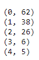
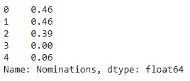
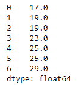
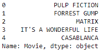
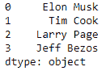
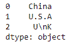
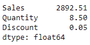

# 第七章：pandas 中的特殊数据操作

pandas 提供了一系列特殊操作符，用于生成、聚合、转换、读取和写入来自不同数据类型（如数字、字符串、日期、时间戳和时间序列）的数据。pandas 中的基本操作符已在前一章介绍。本章将继续这一讨论，并详细说明一些操作符的方法、语法和用法。

阅读本章后，你将能够自信地完成以下任务：

+   编写自定义函数并将其应用于列或整个 DataFrame

+   理解缺失值的性质并进行处理

+   使用函数转换和计算序列

+   对数据进行的其他数值操作

让我们立即深入探讨。大部分情况下，我们将生成自己的数据来演示这些方法。

本章将涵盖以下主题：

+   编写并应用一行自定义函数

+   处理缺失值

+   关于序列的方法调查

+   pandas 字符串方法

+   在 DataFrame 和序列上进行二元操作

+   对值进行分箱

+   在 DataFrame 上使用数学方法

# 编写并应用一行自定义函数

Python 提供了 lambda 函数，它是一种编写一行自定义函数的方法，使我们能够在 DataFrame 的列或整个 DataFrame 上执行某些任务。lambda 函数类似于使用 `def` 关键字定义的传统函数，但更加优雅，更适用于 DataFrame 列的应用，且语法简洁清晰，类似于在列表上实现 for 循环的列表推导式。让我们看看如何定义和应用 lambda 函数。

# lambda 和 apply

为了查看 `lambda` 关键字如何使用，我们需要创建一些数据。我们将创建包含日期列的数据。处理日期列本身是一个话题，但我们将在这里简要了解这一过程。

在以下代码中，我们正在创建两列日期：

+   **开始日期**：从 2016-01-15 开始的 300 个连续日期

+   **结束日期**：从 2010 到 2025 年之间的任意一天随机选取的 300 个日期

以下代码块中使用了一些日期/时间方法来创建这些日期。请注意它们，并确保你理解它们：

```py
### Importing required libraries
import datetime
import pandas as pd
from random import randint

### Creating date sequence of 300 (periods=300) consecutive days (freq='D') starting from 2016-01-15
D1=pd.date_range('2016-01-15',periods=300,freq='D')

### Creating a date sequence with of 300 days with day (b/w 1-30), month (b/w 1-12) and year (b/w 2010-2025) chosen at random
date_str=[]
for i in range(300):
   date_str1=str(randint(2010,2025))+'-'+str(randint(1,30))+'-            '+str(randint(3,12))
    date_str.append(date_str1)
D2=date_str

### Creating a dataframe with two date sequences and call them as Start Date and End Date
Date_frame=pd.DataFrame({'Start Date':D1,'End Date':D2})
Date_frame['End Date'] = pd.to_datetime(Date_frame['End Date'], format='%Y-%d-%m')
```

输出的 DataFrame 有两列，如下所示：


输出的 DataFrame 包含 **开始日期** 和 **结束日期**

使用这些数据，我们将创建一些 lambda 函数来查找以下内容：

+   今天与开始日期或结束日期之间的天数

+   开始日期和结束日期之间的天数

+   开始日期或结束日期中早于给定日期的天数

在以下代码块中，我们编写了 lambda 函数来执行这些任务：

```py
f1=lambda x:x-datetime.datetime.today()
f2=lambda x,y:x-y
f3=lambda x:pd.to_datetime('2017-28-01', format='%Y-%d-%m')>x
```

注意 `x` 和 `y` 被用作占位符参数，即函数的参数。在将这些函数应用于一列数据时，这些占位符会被列名替换。

Lambda 仅仅帮助定义一个函数。我们需要用实际参数来调用这些函数以执行它们。我们来看一下怎么做。例如，要执行我们之前定义的函数，我们可以这样做：

```py
Date_frame['diff1']=Date_frame['End Date'].apply(f1)
Date_frame['diff2']=f2(Date_frame['Start Date'],Date_frame['End Date'])
Date_frame['Before 28-07-17']=Date_frame['End Date'].apply(f3)
```

以下将是输出结果：


输出包含日期列计算字段的 DataFrame

应当注意，这些函数可以这样调用：

+   **像简单函数一样**：使用函数名和必要的参数

+   **使用 apply 方法**：首先是 DataFrame 列名，接着是 `apply`，它将函数名作为参数

在这个例子中，`map` 也可以代替 `apply` 使用。尝试以下操作，并比较 `diff1` 和 `diff3` 的结果。它们应该是相同的：

```py
Date_frame['diff3']=Date_frame['End Date'].map(f1)
```

有三个相关的方法，它们执行类似的工作，但有一些细微的区别：

| **名称** | **功能是什么？** |
| --- | --- |
| `map` | 对一列或一列列列表应用一个函数。 |
| `apply` | 对列、行或列/行列表应用一个函数。 |
| `applymap` | 对整个 DataFrame 应用一个函数，即对每个单元格应用。当函数可以作用于每一列时，将会生效。 |

以下是这些方法非常有用的一些使用场景：

假设数据集中的每一行代表一个零售公司每年每个 SKU 的日销售额，每一列代表一个 SKU。我们将把这个数据称为 `sku_sales`。让我们开始：

1.  为了查找每个 SKU 的年销售额，我们将使用以下代码：

```py
sku_sales.apply(sum,axis=0) # axis=0 represents summing across rows
```

1.  为了找出每个 SKU 每天的销售额，我们将使用以下代码：

```py
sku_sales.apply(sum,axis=1) # axis=1 represents summing across columns
```

1.  为了找出 `SKU1` 和 `SKU2` 的日均销售额，我们将使用以下代码：

```py
sku_sales[['SKU1','SKU2']].map(mean)
```

1.  为了找到所有 SKU 的每日销售额的均值和标准差，我们将使用以下代码：

```py
sku_sales.applymap(mean)
sku_sales.applymap(sd)
```

现在，你将能够编写并应用单行的自定义 Lambda 函数。接下来，我们将研究如何处理缺失值。

# 处理缺失值

缺失值和 NAN 是数据集中常见的现象，在数据使用之前需要处理它们。我们将在接下来的部分中探讨缺失值的不同来源、类型以及如何处理它们。

# 缺失值的来源

缺失值可能在以下过程中进入数据集：

# 数据提取

这指的是数据是可用的，但在从源中提取时我们错过了它。它涉及到以下工程任务：

+   从网站抓取数据

+   从数据库查询

+   从平面文件提取数据

缺失值的来源有很多，以下是其中的一些：

+   正则表达式可能导致错误或非唯一的结果

+   错误查询

+   不同的数据类型存储

+   下载不完整

+   处理不完整

# 数据收集

这包括无法获取或难以收集的数据点。假设你正在调查 100,000 人拥有何种电动汽车。如果遇到一个不拥有电动汽车的人，那么该人的汽车类型就会缺失。

由于数据提取导致的缺失值，理论上可以通过识别导致缺失值的问题并重新运行提取过程来修正。而由于数据收集问题导致的缺失值则难以修正。

如何判断数据中是否有缺失值？最简单的方法是运行数据集摘要，它会给出行数的计数。由于包含缺失值的行不被计数，包含缺失值的列行数会较少。请看下面的图表，它展示了著名的`titanic`数据集的摘要，以说明这一点：


数据汇总表显示列计数差异，表示缺失值

**年龄**和**体重**列有缺失值，因为它们的行数比其他列少。

处理缺失值至关重要，因为它们会将缺失值传播到数值运算的结果中，可能导致错误的数据解释。缺失值会阻止许多数值计算的进行。如果只使用数据的一个样本，也可能导致错误的假设。

还有其他方式可以分类缺失值的来源。现在我们来逐一讲解。

# 随机缺失数据

在这种情况下，数据缺失没有特定原因。以电动汽车为例，缺失的汽车类型属于随机缺失数据的情况。

# 非随机缺失数据

在这种情况下，数据缺失可能有特定原因。继续使用之前的例子，假设在拥有汽车的人群中，某些车牌号缺失，因为在某个区域，他们的车牌使用了奇特的字体，导致 OCR 软件无法正确识别，结果返回缺失值。这就是非随机缺失数据的一个例子。

# 不同类型的缺失值

以下是不同类型的缺失值：

+   **非数字**（**NaN**）：NaN 是任何数据类型缺失值的占位符。这些可以通过`numpy.nan`来创建。使用`numpy.nan`创建的 NaN 可以分配给可空整数数据类型。整数类型的缺失值保存为 NaN。它是 Python 中缺失值的默认标识符。

+   **NA**：NA 主要来源于 R 语言，在 R 中，NA 是缺失值的标识符。

+   **NaT**：这相当于时间戳数据点的 NaN（非数字）。

+   **None**：表示非数值数据类型的缺失值。

+   **Null**：当函数没有返回值或值未定义时，产生 Null。

+   **Inf**: **Inf**是**无穷大**——一个大于任何其他数值的值。因此，`inf`比任何其他值都要小。它是由所有计算产生的，导致非常大或非常小的值。通常，我们需要将`inf`视为缺失值。这可以通过在`pandas`中指定以下选项来完成：

```py
pandas.options.mode.use_inf_as_na = True
```

也可以生成一个占位符的无穷大变量用于比较，如下所示：

```py
import math
test = math.inf
test>pow(10,10) #Comparing whether Inf is larger than 10 to the power 10
```

它返回`True`。

# 缺失值的杂项分析

为了了解缺失值问题的严重程度，你可能想了解以下信息：

+   一列中有多少个单元格包含缺失值

+   哪些单元格在一列中有缺失值

+   哪些列有缺失值

这些任务可以如下执行：

+   查找包含缺失值的单元格：

```py
pd.isnull(data['body']) *#*returns TRUE if a cell has missing values
pd.notnull(data['body']) *#*returns TRUE if a cell doesn't have missing values
```

+   查找一列中缺失值的数量：

```py
pd.isnull(data['body']).values.ravel().sum() #returns the total number of missing values
pd.nottnull(data['body']).values.ravel().sum()#returns the total number of non-missing values
```

第三个问题留给你作为练习。

# 处理缺失值的策略

以下是处理缺失值的主要策略：

# 删除

这将删除包含缺失值的整行或整列。

删除会导致数据丢失，除非别无选择，否则不推荐使用。

删除可以如下执行：

+   删除所有单元格都包含缺失值的行：

```py
data.dropna(axis=0,how='all')# axis=0 means along rows
```

+   删除所有单元格有缺失值的行：

```py
data.dropna(axis=0,how='any')
```

# 插补

这将把缺失值替换为一个合理的数字。

插补可以通过多种方式进行。以下是其中一些方法：

+   用 0 插补数据集中所有缺失值：

```py
data.fillna(0)
```

+   用指定文本插补所有缺失值：

```py
data.fillna('text')
```

+   仅用 0 插补`body`列中的缺失值：

```py
data['body'].fillna(0)
```

+   使用非缺失值的均值进行插补：

```py
data['age'].fillna(data['age'].mean())
```

+   使用向前填充进行插补——这种方法特别适用于时间序列数据。在这里，缺失值会被替换为前一行（周期）的值：

```py
data['age'].fillna(method='ffill')
```

以下是输出结果：


输出 DataFrame，其中缺失值使用向前填充方法进行了插补

+   使用向后填充进行插补——这种方法特别适用于时间序列数据。在这里，缺失值会被替换为前一行（周期）的值。你可以通过`pad`选项控制在第一个 NaN 之后填充的行数。`Pad=1`意味着只会填充 1 行：

```py
data['age'].fillna(method='backfill')
```

以下是输出结果：


输出 DataFrame，其中缺失值使用向后填充方法进行了插补

# 插值

插值是一种技术，它使用连续缺失值两端的端点，创建一个粗略的数学关系来填补缺失值。默认情况下，它执行线性插值（假设数据点之间有线性关系），但还有许多其他方法，如多项式插值、样条插值、二次插值和 Akima 插值（假设数据关系是多项式或分段多项式关系）。

`interpolate`方法可以直接应用于序列或 DataFrame 中的所有列：

```py
import numpy as np
import pandas as pd
A=[1,3,np.nan,np.nan,11,np.nan,91,np.nan,52]
pd.Series(A).interpolate()
```

以下是输出结果：


使用简单插值填充缺失值后的输出 DataFrame

相反，可以使用其他方法，例如`spline`，该方法假定分段多项式关系：

```py
pd.Series(A).interpolate(method='spline',order=2)
```

以下是输出结果：


使用样条插值填充缺失值后的输出 DataFrame

类似地，可以进行多项式插值，如下所示：

```py
pd.Series(A).interpolate(method='polynomial',order=2)
```

可以为每种插值方法在同一个 DataFrame 中创建不同的列，以比较它们的结果，如下所示：

```py
#Needed for generating plot inside Jupyter notebook
%matplotlib inline
#Setting seed for regenerating the same random number
np.random.seed(10)
#Generate Data
A=pd.Series(np.arange(1,100,0.5)**3+np.random.normal(5,7,len(np.arange(1,100,0.5))))
#Sample random places to introduce missing values
np.random.seed(5)
NA=set([np.random.randint(1,100) for i in range(25)])
#Introduce missing values
A[NA]=np.nan
#Define the list of interpolation methods
methods=['linear','quadratic','cubic']
#Apply the interpolation methods and create a DataFrame 
df = pd.DataFrame({m: A.interpolate(method=m) for m in methods})
#Find the mean of each column (each interpolation method)
df.apply(np.mean,axis=0)
```

以下是输出结果：


使用不同方法进行插值后的均值比较

如我们所见，每列的均值略有不同，因为使用了不同的插值方法。

你还可以检查插值的值，看看它们有多么不同/相似。可以按如下方式进行：

```py
np.random.seed(5)
NA1=[np.random.randint(1,100) for i in range(25)]
df.iloc[NA1,:]
```

# KNN

**K-近邻**（**KNN**）是一种无监督的基于局部的回归和分类方法。它将每行数据视为 n 维空间中的一个点，并根据它们之间的距离（例如，对于数值数据使用欧几里得距离，对于分类数据使用汉明距离）找到 k 个相似（邻近）点。为了找到该行和该列的值，它取所有邻近行在该列的平均值，并将平均值作为该值。

总结来说，可以说它定义了一个围绕某点的局部区域，并计算局部平均值，而不是全局平均值。大多数情况下，这种方法是合理的，通常用来代替全局平均值，因为邻域行为比样本点的全局行为更能逼近。

由于这个特性，KNN 可以用于填充缺失值。其直觉是，缺失值应与其邻近点的值相似。这是一种局部填充方法，与`fillna`方法（全局方法）不同。

可以使用 scikit-learn 中的`kNeighborsClassifier`或`kNeighborsRegressor`进行 KNN，并将结果用于填充。以下是一个插图示例，其中按照顺序发生以下操作：

1.  生成了样本训练数据。

1.  数据中引入了 NaN 值。

1.  一个 KNN 模型在样本训练数据上进行了拟合。

1.  拟合的模型用于预测/填充缺失值。

这在以下代码块中有所体现：

```py
#Creating training dataset
A=np.random.randint(2,size=100)
B=np.random.normal(7,3,100)
C=np.random.normal(11,4,100)
X=(np.vstack((A,B,C))).T

#Creating testing data by replacing column A (outcome variable) with NaNs
X_with_nan = np.copy(X)
X_with_nan[:,0]=np.nan

# Load libraries
import numpy as np
from sklearn.neighbors import KNeighborsClassifier

# Train KNN learner
clf = KNeighborsClassifier(3, weights='uniform')
trained_model = clf.fit(X[:,1:], X[:,0])

#Predicting/Imputing on test dataset
imputed_values = trained_model.predict(X_with_nan[:,1:])
imputed_values
```

你可以打印`A`和`imputed_values`，查看它们之间的差异，或评估填充值的准确性。以下截图显示了 A 列的实际值：


A 列的实际值

以下截图显示了 A 列的`imputed_values`：


A 列的填充值

# 一项关于序列方法的调查

我们来使用以下 DataFrame 来了解一些可以与系列一起使用的方法和函数：

```py
sample_df = pd.DataFrame([["Pulp Fiction", 62, 46], ["Forrest Gump", 38, 46], ["Matrix", 26, 39], ["It's a Wonderful Life", 6, 0], ["Casablanca", 5, 6]], columns = ["Movie", "Wins", "Nominations"])
sample_df
```

以下是输出：


示例 DataFrame — IMDB 数据库

# `items()` 方法

`items()` 方法提供了一种迭代访问系列或 DataFrame 中每一行的方式。它采用惰性求值，将每行的值与索引以元组的形式存储。可以通过诸如 `for` 循环等迭代过程获得这种惰性求值的结果。我们来在 DataFrame 的 `Wins` 列上应用 `items` 方法：

```py
for item in sample_df["Wins"].items():
print(item)
```

以下是输出：


使用 `items` 方法进行循环

`iteritems()` 方法的行为与 `items()` 方法类似：

```py
for item in sample_df["Wins"].iteritems():
print(item)
```



使用 `iteritems` 方法进行循环

`items` 和 `iteritems` 方法返回一个 zip 类型的对象。我们需要一个迭代过程来解压这个对象。在 DataFrame 上应用 `items` 或 `iteritems` 方法会得到不同的结果。在这种情况下，每一列会被堆叠在一个元组中，并带有列名：

```py
for col in sample_df.items():
print(col)
```

以下是输出：


在 DataFrame 上使用 `items` 方法

# `keys()` 方法

在系列中使用时，`keys()` 方法返回系列的行标签或索引，并且与访问 DataFrame 或系列的索引属性时执行的功能相同。`keys()` 方法在用于 DataFrame 和系列时表现不同；当用于 DataFrame 时，它返回列标签；而用于系列时，它返回行索引：

```py
In: sample_df["Wins"].keys()
Out: RangeIndex(start=0, stop=5, step=1)

In: sample_df.keys()
Out: Index(['Movie', 'Wins', 'Nominations'], dtype='object')
```

# `pop()` 方法

如果你熟悉 Python 中的列表，`pop()` 方法一定会让你有所了解。系列和 DataFrame 中的 `pop()` 方法与列表中的表现完全相同。它帮助我们从 DataFrame 中移除整列，或者从系列中移除特定行。调用 `pop()` 方法后，它会返回被弹出的实体（行或列）。

以下代码片段展示了如何在系列中使用 `pop()`。让我们从 `"Wins"` 列中弹出索引为 2 的项：

```py
In: sample_df["Wins"].pop(2)
Out: 26
```

现在，让我们打印 `Wins` 系列：


`pop` 方法的输出

可以看到，索引 2 在系列中不再存在。同样的方法也可以应用于 DataFrame。让我们弹出 `Nominations` 列来理解这一点：

```py
sample_df.pop("Nominations")
```

以下是输出：


在 DataFrame 上应用 Pop

以下命令用于显示弹出后的 DataFrame 结果：

```py
sample_df
```

以下是输出：


弹出后的 DataFrame 结果

# `apply()` 方法

`apply()` 方法为我们提供了一种快速高效的方式，将一个函数应用到系列中的所有值。这个函数可以是一个内置函数，比如 NumPy 函数，也可以是一个用户自定义的函数。

在以下代码片段中，`apply()` 被用来计算 `Wins` 序列中所有行的指数值：

```py
sample_df["Wins"].apply(np.exp)
```

以下是输出：


在序列上使用 Apply 方法

你还可以定义自己的函数并将其应用于序列。让我们用一个简单的函数演示，将值除以 100：

```py
def div_by_100(x):
return x/100

sample_df["Nominations"].apply(div_by_100)
```

以下是输出：



对用户定义函数应用 Apply 方法

# map() 方法

`map()` 方法类似于 `apply` 方法，因为它有助于进行元素级别的修改，这些修改由函数定义。然而，`map` 函数除了这一点外，还接受一个序列或字典来定义这些元素级别的修改。

使用 map 函数，我们来更改 `"Wins"` 列中的一些值：

```py
sample_df["Wins"].map({62 : 60, 38 : 20})
```

以下是输出：


在序列上使用 Map 方法

映射未定义的值将被替换为 NAs。

# drop() 方法

`drop()` 方法是另一个有用的方法，用于删除 DataFrame 或序列中的整行或整列。可以沿任意轴删除索引 —— 行索引可以沿轴 0 删除，列索引可以沿轴 1 删除。

让我们从 `Wins` 序列中删除索引 0 和 2。要删除的索引可以通过列表定义。默认情况下，`axis` 设置为 0，因此在此情况下无需更改：

```py
sample_df["Wins"].drop([0, 2])
```

以下是输出：


在序列上使用 Drop 方法

正如我们所看到的，结果中没有索引 0 和 2。以下代码片段展示了如何使用 `drop` 方法从 DataFrame 中删除列：

```py
sample_df.drop(labels=["Wins", "Nominations"], axis = 1)
```

以下是输出：


在 DataFrame 上使用 drop 方法

当存在多级索引时，也可以有效地删除索引。drop 的 `level` 参数可以帮助我们做到这一点。请看以下具有多级索引的 DataFrame：


多级索引的 DataFrame

要从 `Movie` 列中删除特定的电影，`level` 参数应设置为 1。默认情况下，`level` 被设置为 0。以下代码片段移除了电影 `Matrix`：

```py
multidf.drop(["Matrix"], level = 1 )
```

以下是输出：


删除层次索引的索引

# equals() 方法

`equals()` 方法检查两个序列或 DataFrame 在值、数据类型和形状上是否相等。列标题可以具有不同的数据类型。输出结果是布尔值。此函数的一个实际应用如下所示。让我们创建一个新的序列，并将其与现有的 `sample_df` DataFrame 进行比较：

```py
In: compare_series = pd.Series([62, 38, 26, 6, 5])
In: sample_df["Wins"].equals(compare_series)
Out: True
```

此函数可以这样应用，以比较两个 DataFrame 或同一个 DataFrame 中的两个序列。

# sample() 方法

`sample()`方法可用于对 DataFrame 或系列进行随机采样。`sample`函数的参数支持在任意轴上进行采样，并且支持有放回或无放回的采样。进行采样时，必须指定要采样的记录数量或采样的记录比例。

让我们从`Movie`系列中采样三条记录：

```py
sample_df["Movie"].sample(3)\
```

以下是输出结果：


适用于系列的`sample`函数

现在，让我们从 DataFrame 中随机采样 50%的列：

```py
sample_df.sample(frac = 0.5, axis = 1)
```

以下是输出结果：


带有`fraction`参数的列采样

`replace`参数可以设置为`True`或`False`，从而可以选择是否进行有放回采样；默认值为`False`。`random_state`参数有助于设置随机数生成器的种子，它依赖于 NumPy 包的`Random`模块。

# `ravel()`函数

`ravel()`函数将一系列数据展平为一维数组。它与`numpy.ravel`函数本质相似。`ravel`函数不能应用于 DataFrame：

```py
In: sample_df["Wins"].ravel()
Out: array([62, 38, 26, 6, 5], dtype=int64)
```

# `value_counts()`函数

`value_counts()`函数仅适用于系列，而不适用于 DataFrame。它统计每个变量出现的次数，并提供类似频率表的输出：

```py
pd.Series(["Pandas", "Pandas", "Numpy", "Pandas", "Numpy"]).value_counts()
```

以下是输出结果：


类别系列的频次统计

`value_counts()`函数也可以应用于数值列。它将统计每个值出现的次数：

```py
sample_df["Nominations"].value_counts()
```

以下是输出结果：


在数值列上使用的`value_counts`函数

统计数值在分箱范围内的出现更为有用。`value_counts`的`bins`参数会在统计前将数据分成不同的箱：

```py
sample_df["Nominations"].value_counts(bins = 2)
```

以下是输出结果：


`value_counts`函数用于对`numeric`列进行分箱统计

# `interpolate()`函数

`interpolate()`函数提供了一种有效处理缺失数据的方法。通过此方法，NaN 值可以通过线性插值、多项式插值或简单的填充进行替换。该函数将系列拟合到如`spline`或`quadratic`等函数上，然后计算可能缺失的数据。

考虑以下系列：

```py
lin_series = pd.Series([17,19,np.NaN,23,25,np.NaN,29])
```

由于值是均匀分布的，因此线性插值是最合适的方法。线性插值是`interpolate`函数中`method`参数的默认值：

```py
lin_series.interpolate()
```

以下是输出结果：


线性插值

可以指定插值应进行的方向。让我们考虑前面的例子，并通过后向填充来填充 NaN，如下所示：

```py
lin_series.interpolate(method = "pad", limit_direction = "backward")
```

以下是输出结果：



带填充的反向插值

# `align()` 函数

`align()` 函数接受两个对象，基于 `join` 条件（如内连接、外连接等）重新索引两个对象，并返回一个包含两个对象的元组：

```py
s1 = pd.Series([5,6,7,8,9], index = ["a","b","c","d","e"])
s2 = pd.Series([1,2,3,4,5], index = ["d","b","g","f","a"])
s1.align(s2, join="outer")
```

以下是输出结果：


使用外连接对齐

由于对齐是基于外连接的，因此输出中显示了在两个系列中找到的索引。对于内连接，只有公共的索引会被返回，如 `a`、`b` 和 `d`：

```py
s1.align(s2, join="inner")
```

以下是输出结果：


使用内连接对齐

# pandas 字符串方法

本节讨论了 pandas 字符串方法。这些方法在处理混乱的文本数据时非常有用。它们可以清理文本数据、结构化数据、分割数据并搜索其中的重要部分。让我们了解这些方法，并找出它们各自包含的功能。

# `upper()`、`lower()`、`capitalize()`、`title()` 和 `swapcase()`

字符串方法如 `upper()`、`lower()`、`capitalize()`、`title()` 和 `swapcase()` 在我们希望将所有字符串元素转换为整个系列时非常有用。`upper` 和 `lower` 方法将整个字符串转换为大写或小写。以下命令展示了将一系列数据转换为大写字母：

```py
sample_df["Movie"].str.upper()
```

以下是输出结果：



将系列数据转换为大写字母

以下命令展示了将一系列数据转换为小写字母：

```py
sample_df["Movie"].str.lower()
```

以下是输出结果：


将系列数据转换为小写字母

`capitalize()` 方法将第一个字母转换为大写，其他字母转换为小写：

```py
pd.Series(["elon musk", "tim cook", "larry page", "jeff bezos"]).str.capitalize()
```

以下是输出结果：


针对系列数据的 Capitalize 函数

`title()` 方法确保字符串中的每个单词的首字母大写，其余字母小写：

```py
pd.Series(["elon musk", "tim cook", "larry page", "jeff bezos"]).str.title()
```



字符串的标题大小写转换

`swapcase()` 方法将大写字母转换为小写字母，反之亦然：

```py
sample_df["Movie"].str.swapcase()
```

以下是输出结果：


`swapcase()` 函数

# `contains()`、`find()` 和 `replace()`

`contains()` 方法检查子串或模式是否存在于系列的所有元素中，并返回一个布尔值系列：

```py
sample_df["Movie"].str.contains("atr")
```

以下是输出结果：


针对字符串类型系列的 Contains 函数

由于 `Matrix` 是唯一包含 `atr` 子串的电影，`True` 被返回在索引 `2` 处。子串也可以是正则表达式模式。要使用正则表达式模式进行字符串匹配，应将 `regex` 参数设置为 `True`。例如，我们可以查找包含 `atr` 或 `der` 的字符串：

```py
sample_df["Movie"].str.contains("atr|der", regex = True)
```

以下是输出结果：


使用正则表达式的 Contains 函数

如我们所见，已经识别出两个匹配项。将`case`参数设置为`True`可以确保在模式匹配执行时区分大小写：

```py
sample_df["Movie"].str.contains("cas", case = True)
```

以下是输出结果：


在`contains`函数中处理大小写敏感性

`flags`参数可用于指定任何正则表达式条件，例如忽略大小写：

```py
import re
sample_df["Movie"].str.contains("MATrix", flags = re.IGNORECASE, regex=True)
```

以下是输出结果：


`contains`函数的正则表达式标志

请注意，在定义任何正则表达式标志之前，应先导入`re`包。

`find`函数返回可以找到子字符串的最小索引位置。考虑以下系列：

```py
find_series = pd.Series(["abracadabra", "mad man"])
```

让我们使用`find`函数从之前的系列中获取`ra`子字符串的索引：

```py
find_series.str.find("ra")
```

以下是输出结果：


一系列的`find`函数

在第一个元素`abracadabra`中，`ra`的第一次出现位于索引位置`2`。因此，返回`2`。第二个元素`mad man`没有找到匹配的字符串，因此返回`-1`。

`find`函数有一个`start`参数，可以用来指定从哪个最左侧的索引开始查找。相应地，还存在一个`end`参数，用于定义查找允许的最右侧索引。默认情况下，`start`设置为`0`，`end`设置为`None`：

```py
find_series.str.find("a", start = 2)
```

以下是输出结果：


指定了起始限制的`find`函数

在前面的示例中，我们可以看到，通过指定起始索引`a`，索引 0 和 1 被忽略。

`replace`函数可以被视为`contains`函数的扩展，因为大多数参数是相似的。从功能上讲，`replace`在一系列字符串中查找子字符串并用替换字符串替换它。`contains`函数中也有的参数，如`flags`、`case`和`regex`，在这里也会出现，作用是相同的。让我们用`rep`子字符串替换系列中的字母`I`：

```py
sample_df["Movie"].str.replace("i","'rep'")
```

以下是输出结果：


一系列的`replace`函数

请注意，如果`i`出现多次，则会进行多次替换。可以使用`n`参数控制替换的次数：

```py
sample_df["Movie"].str.replace("i","'rep'", n = 1)
```

以下是输出结果：


带有指定替换次数的`replace`函数

# `strip()`和`split()`

`strip()`函数在数据清理中非常有用。它可以从系列中的文本内容中删除尾部空格或任何特定的字符串模式。如果要删除的子字符串未指定，则默认会删除尾部空格。以下示例演示了`strip`函数在清理多余空格时的应用：

```py
strip_series = pd.Series(["\tChina", "U.S.A ", "U\nK"])
strip_series
```

以下是输出结果：


含有多余空格的系列

以下示例演示了 `strip()` 函数在尾部空格中的应用：

```py
strip_series.strip()
```

以下是输出结果：



去除尾部空格

这表明 `strip()` 仅移除尾部的空格，而不会移除中间的空格。现在，让我们使用 `strip()` 来移除特定字符串：

```py
sample_df["Movie"].str.strip("opnf")
```

以下是输出结果：


用于移除字符串序列的 `strip` 函数

在前面的示例中，`strip()` 函数移除了系列元素尾部中的任何子字符串字符。

`split()` 函数按指定的分隔符拆分字符串。考虑以下系列：

```py
split_series = pd.Series(["Black, White", "Red, Blue, Green", "Cyan, Magenta, Yellow"])
split_series
```

以下是输出结果：


拆分函数的示例系列

每个元素有两到三个项目，用 `,` 分隔。让我们用这个作为分隔符，将堆叠在每行中的项目分开：

```py
split_series.str.split(", ")
```

以下是输出结果：


作为列表拆分

结果是每行的项目列表。`expand()` 参数为每个项目创建一个单独的列。默认情况下，`expand` 设置为 `False`，这会导致在每行中创建一个列表：

```py
split_series.str.split(", ", expand = True)
```

以下是输出结果：


拆分多个列

# `startswith()` 和 `endswith()`

虽然 `contains()` 函数帮助评估子字符串是否出现在系列的每个元素中，`startswith()` 和 `endswith()` 函数则分别专门检查子字符串是否出现在字符串的开始和结束位置：

```py
start_series = pd.Series(["strange", "stock", "cost", "past", "state"])
start_series.str.startswith("st")
```

以下是输出结果：


`startswith` 函数

同样，`endswith` 可以像这样使用：

```py
end_series= pd.Series(["ramen", "program", "cram", "rammed", "grammer"])
end_series.str.endswith("ram")
```

以下是输出结果：


`endswith` 函数

然而，与 `contains()` 不同，这些函数不接受正则表达式。

# 各种 is...() 函数

以下表格列出了帮助确认系列字符串元素其他属性的一组函数。例如，`isupper` 函数如果字符串中的所有字符都是大写字母，则返回 `True`。这些函数会返回与系列中每行对应的布尔值输出：

| **函数** | **当所有字符为...时返回真** |
| --- | --- |
| `isalnum()` | 字母数字 |
| `isalpha()` | 字母 |
| `isdigit()` | 数字字符 |
| `isspace()` | 空白字符 |
| `islower()` | 小写字母 |
| `isupper()` | 大写字母 |
| `istitle()` | 标题大小写 |
| `isnumeric()` | 数字 |
| `isdecimal()` | 十进制 |

以下是前述函数的一些示例：

```py
pd.Series(["ui26", "ui", "26"]).str.isalpha()
```

以下是输出结果：


`isalpha` 函数

这是 `isalnum` 函数的示例：

```py
pd.Series(["ui26", "ui", "26"]).str.isalnum()
```

以下是输出结果：


`isalnum` 函数

这是`isnumeric`函数的示例：

```py
pd.Series(["ui26", "ui", "26"]).str.isnumeric()
```

以下是输出结果：


isnumeric 函数

这些函数仅适用于字符串，不能应用于其他数据类型。与其他数据类型一起使用时，会返回`NaN`。

以下是`isdigit()`函数的示例：

```py
pd.Series(["ui26", "ui", 26]).str.isdigit()
```

以下是输出结果：


isdigit 函数

# 对数据框和系列进行的二元操作

一些二元函数，如`add`、`sub`、`mul`、`div`、`mod`和`pow`，执行涉及两个数据框或系列的常见算术运算。

以下示例展示了两个数据框的加法。一个数据框的形状是(2,3)，另一个的形状是(1,3)。`add`函数执行逐元素加法。当某个数据框中缺少对应的元素时，缺失的值会被填充为 NaN：

```py
df_1 = pd.DataFrame([[1,2,3],[4,5,6]])
df_2 = pd.DataFrame([[6,7,8]])
df_1.add(df_2)
```

以下是输出结果：


对两个数据框进行逐元素相加

我们可以选择使用`fill_value`参数来填充 NaN，而不是直接使用 NaN。让我们通过`mul`函数进行乘法来探索这一点：

```py
df_1.mul(df_2, fill_value = 0)
```

以下是输出结果：


pandas 中二元操作符的`fill_value`参数

用于算术运算的第二个值不一定需要是数据框或系列；它也可以是标量，如下所示：

```py
df_1.sub(2)
```

以下是输出结果：


与标量的二元操作

在前面的例子中，两个数据框是统一索引的。元素可以在相同的索引标签下进行操作：

```py
pd.Series([1, 2, 3, 4], index=['a', 'b', 'c', 'd']).pow(pd.Series([4, 3, 2, 1], index=['a', 'b', 'd', 'e']))
```

以下是输出结果：


对具有不同索引的系列进行的二元操作

对于在两个系列中不存在的索引，返回`NaN`。在列标签方面也会表现出类似的行为。只有共享相同列名的元素才能一起使用。以下代码演示了这一点：

```py
pd.DataFrame([[27, 33, 44]], columns=["a", "b", "c"]).mod(pd.DataFrame([[7, 6, 2]], columns=["b", "a", "d"])).
```

以下是输出结果：


对具有不同列的数据框进行的二元操作

现在，考虑以下两个数据框，其中一个显示了层次索引：

```py
df = pd.DataFrame([[1, 4, 6], [np.NaN, 5, 3], [2, 7, np.NaN], [5, 9, 4], [1, np.NaN, 11]], columns = ["ColA", "ColB", "ColC"], index = ["a", "b", "c", "d", "e"])

df
```

以下是输出结果：


示例数据框

以下代码块是多重索引数据框的示例：

```py
df_multi = df.iloc[0:4, :]
df_multi.index = pd.MultiIndex.from_tuples([(1, 'a'), (1, 'b'), (1, 'c'), (2, 'a')])
df_multi
```

以下是输出结果：


多重索引数据框

要将`df`除以`df_multi`的元素，或执行任何前述的二元操作，可以使用`level`参数来指定两个数据框共享的索引级别：

```py
df.div(df_multi, level = 1)
```

以下是输出结果：


对具有层次索引的数据框使用的二元操作

`lt`、`le`、`gt`和`ge`函数通过建立“小于”、“小于或等于”、“大于”和“大于或等于”比较，帮助 DataFrame 进行比较。它们具有与我们之前讨论的函数相同的参数，并在所有这些场景中显示出类似的行为。我们来比较`df`和`df_multi`：

```py
df.lt(df_multi, level = 1)
```

以下是输出：


小于函数

以下代码块展示了`le`函数：

```py
df.le(df_multi, level = 1)
```

以下是输出：


小于或等于函数

`round`函数根据`decimals`参数指定的小数位数四舍五入：

```py
pd.Series([6.78923, 8.02344, 0.1982]).round()
```

以下是输出：


`round`函数

默认情况下，会进行四舍五入操作，将输入值变成整数（`decimals = 0`）：

```py
pd.Series([6.78923, 8.02344, 0.1982]).round(2)
```

以下是输出：


设置小数位数的`round`函数

`combine`函数接受两个重叠的 DataFrame 并执行其中定义的函数。我们来合并两个序列并找到两者的最大值。注意，这里进行的是一个比较，以索引为参考：

```py
pd.Series([9, 10, 11]).combine(pd.Series([7, 15, 12]), max)
```

以下是输出：


`combine`函数

# 分箱值

pandas `cut()`函数将值分箱到一个一维数组中。考虑以下包含 10 个值的一维数组。我们将其分为三个区间：

```py
bin_data = np.array([1, 5, 2, 12, 3, 25, 9, 10, 11, 4])
pd.cut(bin_data, bins = 3)
```

以下是输出：


pandas `cut`函数与三个区间

这 10 个元素中的每个都映射到三个区间中的一个。`cut`函数将元素映射到一个区间，并提供每个区间的信息。除了指定区间数之外，还可以通过序列提供区间的边界：

```py
pd.cut(bin_data, bins = [0.5, 7, 10, 20, 30])
```

以下是输出：


pandas `cut`函数与区间值

通过 pandas 的`interval_range`函数，可以直接定义分箱的区间。考虑以下示例，演示如何创建 pandas 的`IntervalIndex`对象：

```py
interval = pd.interval_range(start = 0, end = 30, periods = 5)
interval
```

以下是输出：


pandas `IntervalIndex`

这个区间可以直接传递给`cut`函数：

```py
pd.cut(bin_data, bins = interval)
```

以下是输出：


pandas `cut`函数与区间索引

设置`right`参数为`True`表示包括右区间，设置为`False`表示排除右区间。默认设置为`True`：

```py
pd.cut(bin_data, bins = [0.5, 7, 10, 20, 30], right = False)
```

以下是输出：


开区间

等效地，`include_lowest`参数决定是否包含最小区间。默认情况下，它设置为`False`：

```py
pd.cut(bin_data, bins = [0.5, 7, 10, 20, 30], include_lowest= True)
```

以下是输出：


包括左范围中的最低值

当 `retbins` 设置为 `True` 时，函数返回箱：

```py
pd.cut(bin_data, bins = 5, retbins = True)
```

以下是输出：


返回箱

输出元组中的第二个值是箱值的数组。

可以通过将标签名称列表传递给 `labels` 参数来为箱分配标签：

```py
pd.cut(bin_data, bins = 3, labels = ["level1", "level2", "level3"])
```

以下是输出：


标记箱

当传递的箱包含重复值时，默认情况下会引发错误。这是因为默认情况下重复参数设置为 `raise`。将其设置为 `drop` 将删除重复项：

```py
pd.cut(bin_data, bins = [0.5, 7, 10, 30, 30], duplicates = "drop")
```

以下是输出：


处理箱中的重复项

可以通过 `precision` 参数设置创建和存储箱的精度：

```py
pd.cut(bin_data, bins = 3, precision = 1)
```

以下是输出：


设置箱中的精度

`qcut` 函数类似于 `cut` 函数，唯一的区别在于可以通过指定基于哪些分位数创建箱来创建箱：

```py
pd.qcut(bin_data, q = 5)
```

以下是输出：


`qcut` 函数

# 在 DataFrames 上使用数学方法

可以使用 pandas 库中内置的数学方法在 pandas DataFrames 上轻松执行诸如求和、平均值和中位数等计算。让我们利用销售数据的子集来探索 pandas 库中的数学函数和方法。在应用这些数学函数时，应确保所选列是数值型的。以下截图显示了具有五行和三列的数据，所有这些数据将在本节中使用：


样本销售数据

# abs() 函数

`abs()` 函数返回 DataFrame 中记录的绝对值。对于形式为 x+yj 的复数值列，绝对值计算为 ：

```py
abs_df = pd.DataFrame({"Integers": [-1, -2, -3, 0, 2], "Complex": [5+2j, 1+1j, 3+3j, 2+3j, 4+2j]})
abs_df.abs()
```

以下是输出：


abs() 函数

# `corr()` 和 `cov()`

`corr()` 函数返回 DataFrame 中每个变量组合的相关系数。如果存在任何 NAs，则将其排除在相关计算之外。`corr()` 函数接受 Pearson、Kendall 和 Spearman 方法。默认情况下，计算 Pearson 相关系数：

```py
sales_df.corr()
```

以下是输出：


`corr()` 函数

就像相关函数一样，`cov()` 函数返回协方差矩阵：

```py
sales_df.cov()
```

以下是输出：


`cov()` 函数

`corr()` 和 `cov()` 中的 `min_periods` 参数决定了 DataFrame 中非 NA 值的最小存在。

# cummax()、cumin()、cumsum() 和 cumprod()

`cummax()`、`cummin()`、`cumsum()` 和 `cumprod()` 函数分别计算累计最大值、最小值、和、乘积。通过在示例数据框上应用 `cummax()` 函数来理解这一点：

```py
sales_df.cummax()
```

以下是输出结果：


`cummax()` 函数

这些函数中的 `skipna` 参数提供了对处理缺失值（NAs）的控制。默认情况下，它设置为 `True`，即排除缺失值。考虑以下包含缺失值（NAs）的数据框，以了解此参数的功能：

```py
sales_df_na
```

以下是输出结果：


包含缺失值的示例数据

`cumsum()` 方法可以如下所示应用：

```py
sales_df_na.cumsum()
```

以下是输出结果：


`cumsum()` 函数

我们可以选择不忽略缺失值（NAs）来进行累计求和，通过将 `skipna` 设置为 `False`：

```py
sales_df_na.cumsum(skipna=False)
```

以下是输出结果：


跳过缺失值的累计函数

默认情况下，聚合是沿行轴进行的，因为 `axis` 参数默认设置为 `0`。通过使用 `axis` 参数，也可以沿列轴执行累计聚合：

```py
sales_df.cumprod(axis = 1)
```

以下是输出结果：


`cumprod()` 函数

# `describe()` 函数

`describe()` 函数提供数据分布的表示，并计算一些有用的汇总统计信息。它对于**探索性数据分析**（**EDA**）技术非常有用：

```py
sales_df.describe()
```

以下是输出结果：


`describe()` 函数

`describe()` 函数可以应用于数值型和类别型变量。`describe` 函数的 `include` 和 `exclude` 参数设置了该函数应评估的数据类型。默认情况下，`include` 设置为 `numeric`，因此数据框中的任何类别型变量都会被忽略。我们通过将 `include` 参数设置为 `object` 数据类型，来应用 `describe` 到以下数据框：

```py
sales_df_full
```

以下是输出结果：


包含混合数据类型的示例数据

请查看以下内容：

```py
sales_df_full.describe(include = np.object)
```

以下是输出结果：


类别型变量的 `describe()` 函数

通过将 `include` 设置为 `all` 可以包含所有数据类型。类似地，也可以使用 `exclude` 参数来排除某些数据类型。

对于数值变量，`describe` 函数会评估 0.25、0.5、0.75 和 1 的分位数。可以按如下方式自定义：

```py
sales_df.describe(percentiles = [0.1, 0.2, 0.3, 0.4, 0.5])
```

以下是输出结果：


在 `describe` 函数中使用自定义分位数

# `diff()` 函数

`diff()` 函数计算同一列中的后续行之间的差异或同一行中后续列之间的差异。通过设置默认为 0 的 `axis` 参数，可以沿着行或列评估 `diff()`。因此，计算是按行进行的：

```py
sales_df.diff()
```

以下是输出：


`diff()` 函数

可以应用 `diff` 方法如下所示：

```py
sales_df.diff(axis = 1)
```

以下是输出：


沿轴 1 应用的 diff()函数

`periods()` 参数可用于找到第 n 个前一行的差异。负值允许我们找到接下来的第 n 行的差异：

```py
sales_df.diff(periods = 2)
```

以下是输出：


在不同周期间隔使用 diff()

# rank() 函数

`rank()` 函数返回一个 DataFrame，其中包含沿指定轴估计的每个值的排名。默认情况下，排名是按升序进行的：

```py
sales_df.rank()
```

以下是输出：


排名函数结果

`rank()` 方法可以如下应用：

```py
sales_df.rank(ascending = False)
```

以下是输出：


降序排名

排名也可以以百分比的形式获得，如下所示：

```py
sales_df.rank(pct = True)
```

以下是输出：


百分位数排名

`method()` 参数有助于解决平局。默认情况下，显示了平局中可能被项目占据的排名范围的平均值。也可以修改为显示最小排名、最大排名、值出现的顺序或密集排名：

```py
sales_df.rank(method = "min")
```

以下是输出：


使用排名方法找到平局的最小值

# quantile() 函数

`quantile()` 函数返回指定分位数的每列的值。它接受单个分位数值或分位数值数组：

```py
sales_df.quantile(q = [0.1, 0.9])
```

以下是输出：


查找 DataFrame 的分位数

时间戳也可以计算分位数。我们可以通过将 `numeric_only` 参数设置为 `False` 来实现这一点：

```py
time_col = pd.DataFrame({"time": pd.date_range("2017-01-01", "2017-12-31")})
time_col.quantile(q = [0.1, 0.5], numeric_only = False)
```

以下是输出：


日期时间值的分位数

# `round()` 函数

`round()` 函数用于四舍五入小数。默认情况下，值会被四舍五入为整数：

```py
sales_df.round()
```

以下是输出：


`round()` 函数的结果

可以应用 `round` 函数如下所示：

```py
sales_df.round(decimals = 10)
```

以下是输出：


`decimals = 10` 的 `round()` 函数

# pct_change() 函数

`pct_change()` 函数类似于 `diff` 函数，计算 DataFrame 中两个不同值之间的百分比差异。就像在 `diff()` 中，`periods` 参数提供了灵活性，可以评估之间相隔几行的不同元素：

```py
sales_df.pct_change()
```

以下是输出结果：


跨行的百分比变化

`fill_method` 参数允许通过诸如填充等方法在计算前处理 NA 值。`limit` 参数帮助设置 NA 值的允许数量阈值。

# min()、max()、median()、mean() 和 mode()

这些函数接受类似的参数集，并根据轴参数设置计算每列或每行的聚合（最小值、最大值、中位数或众数）：

```py
sales_df.min()
```

以下是输出结果：


`min()` 结果

`max` 方法可以按照如下方式应用：

```py
sales_df.max(axis = 1)
```

以下是输出结果：


`max()` 结果

`skipna` 参数帮助我们处理 NA。考虑以下 DataFrame：

```py
sales_df_na
```

以下是输出结果：


带有 NA 的 DataFrame

默认情况下，评估时会跳过 NA 值，因为 `skipna` 参数设置为 `True`：

```py
sales_df_na.median()
```

以下是输出结果：



`median()` 函数

默认情况下，NA 值在均值计算中会被忽略。如果 `skipna` 设置为 `False`，则计算结果也会因为缺失值而返回 NA：

```py
sales_df_na.median(skipna = False)
```

以下是输出结果：


带有 `skipna` 的 `median()` 函数

考虑以下多重索引 DataFrame。让我们计算它的均值：

```py
multileveldf
```

以下是输出结果：


多重索引 DataFrame

这个多重索引数据集的均值可以通过如下方式获得：

```py
multileveldf.mean()
```

以下是输出结果：


多重索引 DataFrame 的均值

`level` 参数计算多重索引 DataFrame 中任意级别的聚合：

```py
multileveldf.mean(level = 0)
```

以下是输出结果：


针对特定索引级别的 `mean()`

# all() 和 any()

`all()` 和 `any()` 函数帮助我们检测 DataFrame 中是否存在 `False` 值或零值。如果所选轴上的所有值都是 `True`，则 `all()` 函数返回 `True`。`any()` 函数需要至少一个值为 `True` 才返回 `True`。让我们在以下 DataFrame 上应用 `all()` 和 `any()`：

```py
all_any = pd.DataFrame({"A": [True, False, False, True, True], "B": [1, 1, 1, 1, 1], "C": [10, 11, 20, 22, 33], "D": ["abc", "xyz", "pqr", "ijk", "def"], "E": [False, False, False, False, False]})
all_any
```

这会得到以下输出：


示例 DataFrame

B、C 和 D 列中的所有值都是 `True`，因此 `all()` 对这些列返回 `True`。没有 `True` 值的 E 列则会在 `any()` 中返回 `False`：

```py
all_any.all()
```

以下是输出结果：


`all()` 结果

同样，`any()` 可以如下应用：

```py
all_any.any()
```

以下是输出结果：


`any()` 结果

`all()` 和 `any()` 函数具有 `axis`、`skipna` 和 `level` 参数，像我们之前讨论的某些函数一样。`bool_only` 参数可以用于包括或排除布尔值以外的数据类型：

```py
all_any.all(bool_only = True)
```

以下是输出结果：


bool_only 参数

# clip() 函数

`clip()` 函数指定了下限和上限。DataFrame 中超过上限的值将被减少到上限，低于下限的值将被提高到下限：

```py
sales_df.clip(8, 3000)
```

以下是输出结果：


clip() 结果

# count() 函数

`count()` 函数帮助统计 DataFrame 中非 NA 值的总数：

```py
sales_df_na
```

以下是输出结果：


带有 NA 的 DataFrame

count 方法可以如下应用：

```py
sales_df_na.count()
```

以下是输出结果：


count() 结果

`count()` 函数具有 `axis`、`level` 和 `numeric_only` 参数，像我们之前讨论的几个其他函数一样。

# 小结

本章提供了一些特殊方法，展示了 pandas 的灵活性和实用性。本章就像一本插图词典，每个函数都有非常独特的用途。现在，你应该对如何在 pandas 中创建和应用单行函数有了一定了解，并且理解了缺失值的概念以及处理它们的方法。这也是一本汇总了可以应用于序列的各种杂项方法和可以应用于任何 Python 数据结构的数值方法的大全。

在下一章，我们将看看如何处理时间序列数据并使用 `matplotlib` 绘制图表。我们还将通过观察滚动、重采样、偏移、滞后和时间元素分离来了解如何操作时间序列数据。
