# 第八章：使用 Matplotlib 的时间序列和绘图

时间序列数据由多种过程生成，包括**物联网**（**IoT**）传感器、机器/服务器日志以及来自**客户关系管理**（**CRM**）系统的月度销售数据。时间序列数据的一些常见特点是数据点以固定频率生成，并且数据中固有的趋势和季节性。

在本章中，我们将介绍一些在使用 pandas 时必须掌握的主题。掌握这些主题的知识对于准备作为数据分析、预测或可视化程序输入的数据非常有用。

本章将讨论的主题如下：

+   处理时间序列数据和日期

+   时间序列数据的操作——滚动、重采样、平移、滞后和时间元素分离

+   格式化——更改日期格式并将文本转换为日期

+   使用`matplotlib`绘制时间序列

本章结束时，你应该在这些关键领域掌握得很熟练。

# 处理时间序列数据

在本节中，我们将展示如何处理时间序列数据。处理涉及读取、创建、重采样和重新索引时间戳数据。要使其可用，需要对时间戳数据执行这些任务。我们将首先展示如何使用从`csv`文件读取的数据创建时间序列数据。

# 读取时间序列数据

在本节中，我们将演示多种读取时间序列数据的方法，从简单的`read_csv`方法开始：

```py
    In [7]: ibmData=pd.read_csv('ibm-common-stock-closing-prices-1959_1960.csv')
      ibmData.head()
    Out[7]:   TradeDate  closingPrice
    0   1959-06-29   445
    1   1959-06-30   448
    2   1959-07-01   450
    3   1959-07-02   447
    4   1959-07-06   451
    5 rows 2 columns
```

此信息的来源可以在[`datamarket.com`](http://datamarket.com)找到。

我们希望`TradeDate`列成为一系列`datetime`值，以便可以索引并创建时间序列：

1.  让我们首先检查`TradeDate`系列中的值类型：

```py
    In [16]: type(ibmData['TradeDate'])
    Out[16]: pandas.core.series.Series
    In [12]: type(ibmData['TradeDate'][0])
    Out[12]: str
```

1.  接下来，我们将这些值转换为`Timestamp`类型：

```py
    In [17]: ibmData['TradeDate']=pd.to_datetime(ibmData['TradeDate'])
            type(ibmData['TradeDate'][0])
    Out[17]: pandas.tslib.Timestamp  
```

1.  现在我们可以将`TradeDate`列用作索引：

```py
In [113]: #Convert DataFrame to TimeSeries
              #Resampling creates NaN rows for weekend dates, 
             hence use dropna
             ibmTS=ibmData.set_index('TradeDate').resample('D'                      ['closingPrice'].dropna()
        ibmTS
    Out[113]: TradeDate
             1959-06-29    445
             1959-06-30    448
             1959-07-01    450
             1959-07-02    447
      1959-07-06    451
      ...
      Name: closingPrice, Length: 255    
```

在下一节中，我们将学习如何将日期列作为索引，然后基于该索引进行子集提取。为了这一节，我们将使用`Object Occupancy`数据集，该数据集记录了某些房间参数在几周内每隔几分钟的观测值以及相应的房间占用情况。该数据集分为三个单独的文件。

# 在时间序列数据中分配日期索引并进行子集提取

让我们读取它们并将其连接成一个文件：

```py
import pandas as pd 
import os os.chdir(' ') 
ts1=pd.read_csv('datatraining.txt') 
ts2=pd.read_csv('datatest.txt') 
ts3=pd.read_csv('datatest2.txt') 
ts=pd.concat([ts1,ts2,ts3] 
```

在将日期列用作索引之前，我们将其转换为`datetime`格式并删除实际的日期列：

```py
ts['datetime'] = pd.to_datetime(ts['date'])
ts = ts.set_index('datetime')
ts.drop(['date'], axis=1, inplace=True)
```

一旦新的`datetime`列设置为索引，它就可以用于子集提取。例如，要过滤某一天的所有记录，我们只需将数据放入子集提取（方括号`[]`）中：

```py
ts['2015-02-05']
```

输出结果类似于以下截图：

**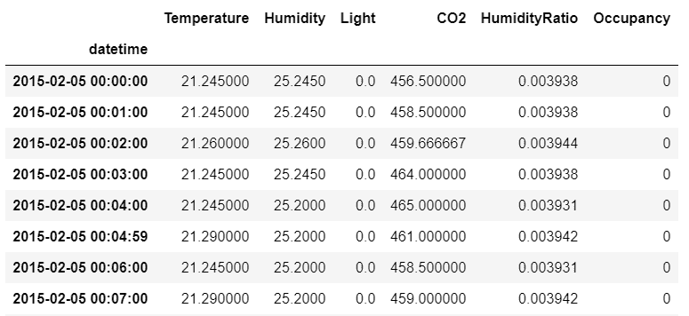**

过滤某一天的所有记录

要过滤所有天数中特定小时的所有记录，以下代码片段可以完成此任务：

```py
   ts[ts.index.hour==4]
```

以下是输出结果：

**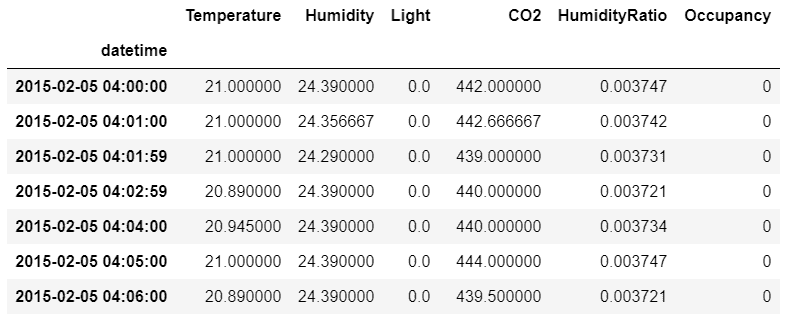**

过滤某一特定小时的所有记录

我们还可以使用以下代码片段过滤两个时间戳之间的所有记录：

```py
     ts['2015-02-05':'2015-02-06']
```

以下是输出结果：

**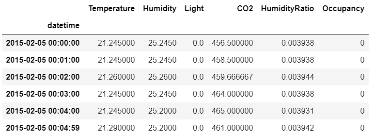**

过滤两个时间戳之间的所有记录

# 绘制时间序列数据

为了更好地理解数据中的趋势和任何季节性变化，可以使用基本的绘图函数进行绘制。在这里，数据集的湿度和 CO[2]变量已被绘制出来：

```py
    ts.plot(y="Humidity",style='.',figsize=(15,1))
    ts.plot(y="CO2",style='.',figsize=(15,1))
```

以下是输出结果：

**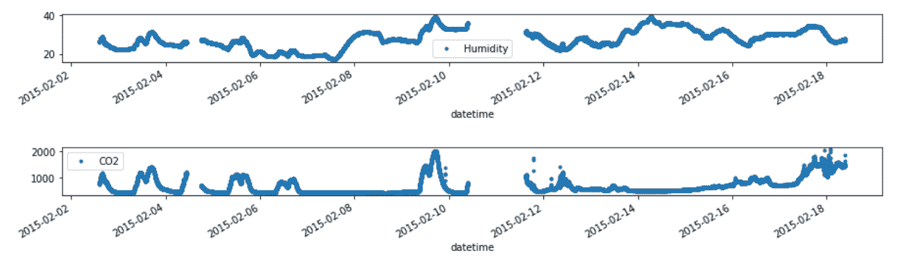**

使用 matplotlib 在同一图表中绘制湿度和 CO2 水平随时间变化

# 时间序列数据的重新采样和滚动

重新采样意味着改变观察到的时间序列的频率。例如，在此数据集中，每隔几秒钟观察到一个数据点。该数据集可以重新采样为按小时的频率，其中每小时的所有数据点将使用选定的聚合函数进行聚合，最终形成一个小时的一个数据点。也可以在每日层面进行重新采样，将一天中的所有数据点聚合。重新采样也可以看作是数据平滑，因为它平滑或平均化数据中的波动。

在 pandas 中，重新采样时间序列数据非常简单，因为有一个内置函数可以实现这一点。让我们看看如何使用它。

例如，要按小时进行重新采样，我们编写以下代码：

```py
ts[["Humidity"]].resample("1h").median().plot(figsize=(15,1)) 
```

以下是输出结果：

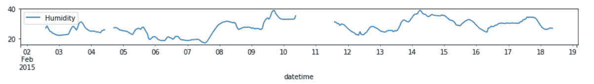

使用中位数作为聚合度量值，按小时重新采样数据

同样地，要按天重新采样，我们编写以下代码：

```py
    ts[["Humidity"]].resample("1d").median().plot(figsize=(15,1))

```

以下是输出结果：

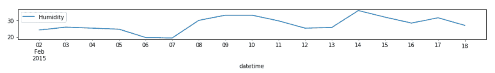

使用中位数作为聚合度量值，按天重新采样数据

请注意，按小时采样的数据比按天采样的数据变化更大，后者更加平滑。

滚动也是一种类似的概念，用于聚合数据点，尽管它更加灵活。可以提供一个滚动窗口，即聚合的数据显示点数量，以控制聚合或平滑的程度。

如果仔细查看`datetime`列，你会发现每分钟观察到一个数据点。因此，60 个这样的数据点构成一个小时。让我们看看如何使用滚动方法来聚合数据。

对于滚动 60 个数据点，从每个数据点开始作为一个记录，我们提供 60 作为滚动窗口，如下所示。这应该会返回一个类似于之前按小时重新采样的图表：

```py
    ts[["Humidity"]].rolling(60).median().plot(figsize=(15,1))  
```

以下是输出结果：

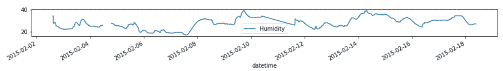

滚动每 60 个连续数据点并聚合它们，最终给出中位数作为最终值

对于按天滚动，滚动窗口应该是*60 x 24*：

```py
    ts[["Humidity"]].rolling(60*24).median().plot(figsize=(15,1))  
```

以下是输出结果：

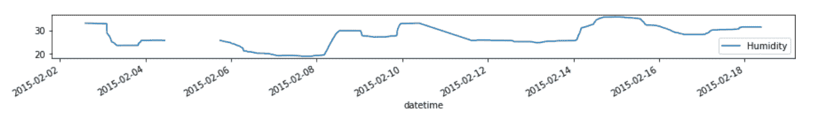

每 60*24 个连续点进行滚动并聚合，给出其中位数作为最终值；这相当于为分钟级别数据找到日聚合值

请注意，已经使用中位数进行聚合。你也可以使用其他函数，如均值或总和。

# 分离时间戳组件

一个时间戳对象由多个组件组成，即年、月、日、小时、分钟和秒。对于许多时间序列分析来说，将这些组件分离并作为新列保存以备后用是非常重要的。

由于我们已经将日期列设置为索引，因此变得更加简便。可以如下创建每个组件的单独列：

```py
ts['Year']=ts.index.year
ts['Month']=ts.index.month
ts['Day']=ts.index.day
ts['Hour']=ts.index.hour
ts['Minute']=ts.index.minute
ts['Second']=ts.index.second
```

以下是输出结果：

**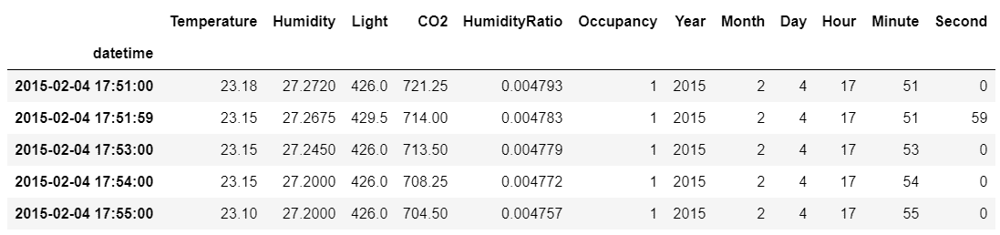**

作为单独列创建的时间序列组件

# DateOffset 和 TimeDelta 对象

`DateOffset`对象表示时间上的变化或偏移。`DateOffset`对象的主要特点如下：

+   这可以加到/从`datetime`对象中减去，以获得平移后的日期。

+   这可以与一个整数（正数或负数）相乘，以便多次应用增量。

+   它具有`rollforward`和`rollback`方法，可以将日期向前移动到下一个偏移日期，或者向后移动到上一个偏移日期。

让我们使用`pandas`中的`datetime`方法创建一些日期对象：

```py
    In [371]: xmasDay=pd.datetime(2014,12,25)
              xmasDay
    Out[371]: datetime.datetime(2014, 12, 25, 0, 0)

    In [373]: boxingDay=xmasDay+pd.DateOffset(days=1)
              boxingDay
    Out[373]: Timestamp('2014-12-26 00:00:00', tz=None)

    In [390}: today=pd.datetime.now()
              today
    Out[390]: datetime.datetime(2014, 5, 31, 13, 7, 36, 440060)  
```

请注意，`datetime.datetime`与`pd.Timestamp`不同。前者是 Python 类且效率较低，而后者是基于`numpy.datetime64`数据类型的。

`pd.DateOffset`对象与`pd.Timestamp`一起使用，将其加到`datetime.datetime`函数上，会将该对象转换为`pd.Timestamp`对象。

以下命令演示了从今天起的 1 周：

```py
    In [392]: today+pd.DateOffset(weeks=1)
    Out[392]: Timestamp('2014-06-07 13:07:36.440060', tz=None)  
```

以下命令演示了从今天起的 5 年：

```py
    In [394]: today+2*pd.DateOffset(years=2, months=6)
    Out[394]: Timestamp('2019-05-30 13:07:36.440060', tz=None) 
```

下面是使用`rollforward`功能的一个例子。`QuarterBegin`是一个`DateOffset`对象，用于将给定的`datetime`对象递增到下一个日历季度的开始：

```py
    In [18]: lastDay=pd.datetime(2013,12,31)
    In [24]: from pandas.tseries.offsets import QuarterBegin
            dtoffset=QuarterBegin()
            lastDay+dtoffset
    Out[24]: Timestamp('2014-03-01 00:00:00', tz=None)

    In [25]: dtoffset.rollforward(lastDay)
    Out[25]: Timestamp('2014-03-01 00:00:00', tz=None)

```

因此，我们可以看到 2013 年 12 月 31 日后的下一个季度从 2014 年 3 月 1 日开始。`Timedelta`类似于`DateOffset`，但它与`datetime.datetime`对象一起使用。使用这些对象的方法通过以下命令进行了说明：

```py
    In [40]: weekDelta=datetime.timedelta(weeks=1)
             weekDelta
    Out[40]: datetime.timedelta(7)

    In [39]: today=pd.datetime.now()
             today
    Out[39]: datetime.datetime (2014, 6, 2, 3, 56, 0, 600309)

    In [41]: today+weekDelta
    Out[41]: datetime.datetime (2014, 6, 9, 3, 56,0, 600309)  
```

到目前为止，我们已经学习了数据类型、数据类型之间的转换、日期偏移、从时间戳中分离时间组件等内容。接下来，我们将看到如何应用一些数学运算符，例如滞后、平移等。

# 时间序列相关的实例方法

本节中，我们将探索各种时间序列对象的操作方法，如平移、频率转换和重采样。

# 平移/滞后

有时，我们可能希望将时间序列中的值向前或向后移动。一种可能的场景是，当数据集包含公司中新员工的入职日期列表时，公司的 HR 程序希望将这些日期向前移动一年，以便激活员工的福利。我们可以通过以下方式使用 `shift()` 函数来实现：

```py
    In [117]: ibmTS.shift(3)
    Out[117]: TradeDate
        1959-06-29    NaN
        1959-06-30    NaN
        1959-07-01    NaN
        1959-07-02    445
        1959-07-06    448
        1959-07-07    450
        1959-07-08    447
        ...  
```

这会偏移所有日历天数。然而，如果我们只希望偏移工作日，我们必须使用以下命令：

```py
    In [119]: ibmTS.shift(3, freq=pd.datetools.bday)
    Out[119]: TradeDate
        1959-07-02    445
        1959-07-03    448
        1959-07-06    450
        1959-07-07    447
        1959-07-09    451

```

在前面的代码片段中，我们指定了 `freq` 参数来进行偏移；这告诉函数仅偏移工作日。`shift` 函数有一个 `freq` 参数，其值可以是 `DateOffset` 类、类似 `TimeDelta` 的对象或偏移别名。因此，使用 `ibmTS.shift(3, freq='B')` 也会产生相同的结果。

# 频率转换

时间序列通常具有固定的频率，例如每微秒、每秒、每分钟等。这些频率可以相互转换。

我们可以使用 `asfreq` 函数来更改频率，如以下代码片段所示：

```py
    In [131]: # Frequency conversion using asfreq
              ibmTS.asfreq('BM')
    Out[131]: 1959-06-30    448
        1959-07-31    428
        1959-08-31    425
        1959-09-30    411
        1959-10-30    411
        1959-11-30    428
        1959-12-31    439
        1960-01-29    418
        1960-02-29    419
        1960-03-31    445
        1960-04-29    453
        1960-05-31    504
        1960-06-30    522
        Freq: BM, Name: closingPrice, dtype: float64

```

在这种情况下，我们只获取 `ibmTS` 时间序列中与每月最后一天对应的值。这里，`bm` 代表工作月末频率。有关所有可能频率别名的列表，请访问 [`pandas.pydata.org/pandas-docs/stable/timeseries.html#offset-aliases`](http://pandas.pydata.org/pandas-docs/stable/timeseries.html#offset-aliases)。

如果我们指定的频率小于数据的粒度，空缺值将会填充为 `NaN`：

```py
    In [132]: ibmTS.asfreq('H')
    Out[132]: 1959-06-29 00:00:00    445
        1959-06-29 01:00:00    NaN
        1959-06-29 02:00:00    NaN
        1959-06-29 03:00:00    NaN
        ...
        1960-06-29 23:00:00    NaN
        1960-06-30 00:00:00    522
        Freq: H, Name: closingPrice, Length: 8809

```

我们还可以将 `asfreq` 方法应用于 `Period` 和 `PeriodIndex` 对象，类似于在 `datetime` 和 `Timestamp` 对象上的操作。`Period` 和 `PeriodIndex` 是稍后引入的，用于表示时间区间。

`asfreq` 方法接受一个方法参数，允许你使用前向填充（`ffill`）或后向填充来填补空缺，类似于 `fillna`：

```py
    In [140]: ibmTS.asfreq('H', method='ffill') Out[140]: 1959-06-29 00:00:00 445 1959-06-29 01:00:00 445 1959-06-29 02:00:00 445 1959-06-29 03:00:00 445 ... 1960-06-29 23:00:00 522 1960-06-30 00:00:00 522 Freq: H, Name: closingPrice, Length: 8809
```

# 数据重采样

`TimeSeries.resample` 函数使我们能够基于采样间隔和采样函数对更精细的数据进行汇总/聚合。

下采样是一个源自数字信号处理的术语，指的是降低信号采样率的过程。在数据处理中，我们使用它来减少我们希望处理的数据量。

相反的过程是上采样，它用于增加需要处理的数据量，并且需要插值来获得中间数据点。

关于下采样和上采样的更多信息，请参考 *上采样和下采样的实际应用*，链接为 [`bit.ly/1JC95HD`](http://bit.ly/1JC95HD) 以及 *为视觉表示进行时间序列下采样*，链接为 [`bit.ly/1zrExVP`](http://bit.ly/1zrExVP)。

在这里，我们查看一些逐笔数据，以用于重采样。在查看数据之前，我们需要先准备它。通过这一步，我们将学习一些关于时间序列数据的有用技巧，具体如下：

+   纪元时间戳

+   时区处理

下面是一个使用 2014 年 5 月 27 日星期二谷歌股票的逐笔数据的示例：

```py
    In [150]: googTickData=pd.read_csv('./GOOG_tickdata_20140527.csv')
    In [151]: googTickData.head()
    Out[151]: Timestamp  close    high     low       open   volume
       0    1401197402  555.008 556.41  554.35 556.38   81100
       1    1401197460  556.250 556.30  555.25 555.25   18500
       2    1401197526  556.730 556.75  556.05 556.39   9900
       3    1401197582  557.480 557.67  556.73 556.73   14700
       4    1401197642  558.155 558.66  557.48  557.59   15700
    5 rows 6 columns
```

前述数据的来源可以在 [`chartapi.finance.yahoo.com/instrument/1.0/GOOG/chartdata;type=quote;range=1d/csv`](http://chartapi.finance.yahoo.com/instrument/1.0/GOOG/chartdata;type=quote;range=1d/csv) 找到。

如您在前面的代码中看到的，我们有一个 `Timestamp` 列，以及表示谷歌股票的收盘价、最高价、最低价、开盘价和交易量的列。

那么，为什么 `Timestamp` 列看起来有点奇怪呢？其实，逐笔数据的时间戳通常以纪元时间表示（有关更多信息，请参见 [`en.wikipedia.org/wiki/Unix_epoch`](http://en.wikipedia.org/wiki/Unix_epoch)），这是一种更紧凑的存储方式。我们需要将其转换为更易于阅读的时间格式，可以按如下方式进行转换：

```py
    In [201]: googTickData['tstamp']=pd.to_datetime(googTickData['Timestamp'],unit='s',utc=True)

    In [209]: googTickData.head()
    Out[209]:
       Timestamp   close   high   low    open  volume tstamp
    0  14011974020 555.008 556.41 554.35 556.38 81100 2014-05-27 13:30:02
    1   1401197460 556.250 556.30 555.25 555.25 18500 2014-05-27 13:31:00
    2   1401197526 556.730 556.75 556.05 556.39  9900 2014-05-27 13:32:06
    3   1401197582 557.480 557.67 556.73 556.73 14700 2014-05-27 13:33:02
    4   1401197642 558.155 558.66 557.48 557.59 15700 2014-05-27 13:34:02
    5 rows 7 columns  
```

现在我们想将 `tstamp` 列设置为索引，并删除纪元的 `Timestamp` 列：

```py
    In [210]: googTickTS=googTickData.set_index('tstamp')
              googTickTS=googTickTS.drop('Timestamp',axis=1)
              googTickTS.head()
    Out[210]:                      close  high  low  open  volume
            tstamp
            2014-05-27 13:30:02    555.008  556.41  554.35  556.38   811000
      2014-05-27 13:31:00    556.250  556.30  555.25  555.25   18500
      2014-05-27 13:32:06    556.730  556.75  556.05  556.39   9900
      2014-05-27 13:33:02    557.480  557.67  556.73  556.73   14700
      2014-05-27 13:34:02    558.155  558.66  557.48  557.59   15700
      5 rows 5 columns
```

请注意，`tstamp` 索引列的时间是 **世界协调时间** (**UTC**)，我们可以通过两个操作符 `tz_localize` 和 `tz_convert` 将这些时间转换为美国东部时间：

```py
    In [211]: googTickTS.index=googTickTS.index.tz_localize('UTC').tz_convert('US/Eastern')

    In [212]: googTickTS.head()
    Out[212]:                        close    high    low    open    volume
    tstamp
    2014-05-27 09:30:02-04:00      555.008  556.41  554.35  556.38  81100
    2014-05-27 09:31:00-04:00      556.250  556.30  555.25  555.25  18500
    2014-05-27 09:32:06-04:00      556.730  556.75  556.05  556.39   9900
    2014-05-27 09:33:02-04:00      557.480  557.67  556.73  556.73  14700
    2014-05-27 09:34:02-04:00      558.155  558.66  557.48  557.59  15700
    5 rows 5 columns

    In [213]: googTickTS.tail()
    Out[213]:
             close     high    low   open   volume
    tstamp
    2014-05-27 15:56:00-04:00      565.4300  565.48 565.30 565.385  14300
    2014-05-27 15:57:00-04:00      565.3050  565.46 565.20 565.400  14700
    2014-05-27 15:58:00-04:00      565.1101  565.31 565.10 565.310  23200
    2014-05-27 15:59:00-04:00      565.9400  566.00 565.08 565.230  55600
    2014-05-27 16:00:00-04:00      565.9500  565.95 565.95 565.950 126000
    5 rows 5 columns

    In [214]: len(googTickTS)
    Out[214]: 390  
```

从之前的输出（`**Out[213]**`）中，我们可以看到交易日中每分钟的逐笔数据——从早上 9:30，股市开盘，到下午 4:00，股市闭盘。由于从 9:30 到 16:00 有 390 分钟，所以数据集中有 390 行。

假设我们希望每 5 分钟获取一次快照，而不是每分钟一次？我们可以通过降采样来实现，如下所示：

```py
    In [216]: googTickTS.resample('5Min').head(6)
    Out[216]:                 close      high   low    open       volume
    tstamp
    2014-05-27 09:30:00-04:00 556.72460 557.15800 555.97200 556.46800 27980
    2014-05-27 09:35:00-04:00 556.93648 557.64800 556.85100 557.34200  24620
    2014-05-27 09:40:00-04:00 556.48600 556.79994 556.27700 556.60678   8620
    2014-05-27 09:45:00-04:00 557.05300 557.27600 556.73800 556.96600   9720
    2014-05-27 09:50:00-04:00  556.66200  556.93596  556.46400  556.80326  14560
    2014-05-27 09:55:00-04:00  555.96580  556.35400  555.85800  556.23600  12400
    6 rows 5 columns
```

重采样时默认使用的函数是均值。然而，我们也可以指定其他函数，例如最小值，并且可以通过 `how` 参数进行重采样。

```py
    In [245]: googTickTS.resample('10Min', how=np.min).head(4)
    Out[245]:         close   high      low  open  volume
    tstamp
    2014-05-27 09:30:00-04:00   555.008  556.3000  554.35  555.25   9900
    2014-05-27 09:40:00-04:00   556.190  556.5600  556.13  556.35   3500
    2014-05-27 09:50:00-04:00   554.770  555.5500  554.77  555.55   3400
    2014-05-27 10:00:00-04:00   554.580  554.9847  554.45  554.58   1800  
```

可以将各种函数名称传递给 `how` 参数，例如 `sum`、`ohlc`、`max`、`min`、`std`、`mean`、`median`、`first` 和 `last`。

`ohlc` 函数返回时间序列数据的开盘、最高、最低和收盘值，分别是第一值、最大值、最小值和最后值。要指定左侧或右侧区间是否闭合，我们可以传递 `closed` 参数，如下所示：

```py
   In [254]: pd.set_option('display.precision',5)  googTickTS.resample('5Min', closed='right').tail(3) Out[254]: close high low open volume tstamp 2014-05-27 15:45:00-04:00 564.3167 564.3733 564.1075 564.1700 12816.6667 2014-05-27 15:50:00-04:00 565.1128 565.1725 565.0090 565.0650 13325.0000 2014-05-27 15:55:00-04:00 565.5158 565.6033 565.3083 565.4158 40933.3333 3 rows 5 columns 
```

因此，在前面的命令中，我们可以看到最后一行显示的是 15:55 的逐笔数据，而不是 16:00。

对于上采样，我们需要通过 `fill_method` 参数指定填充方法，以确定如何填充间隙：

```py
    In [263]: googTickTS[:3].resample('30s', fill_method='ffill')
    Out[263]:                   close    high     low    open  volume
    tstamp
    2014-05-27 09:30:00-04:00   555.008  556.41  554.35  556.38   81100
    2014-05-27 09:30:30-04:00   555.008  556.41  554.35  556.38   81100
    2014-05-27 09:31:00-04:00   556.250  556.30  555.25  555.25   18500
    2014-05-27 09:31:30-04:00   556.250  556.30  555.25  555.25   18500
    2014-05-27 09:32:00-04:00   556.730  556.75  556.05  556.39   9900
    5 rows 5 columns

    In [264]: googTickTS[:3].resample('30s', fill_method='bfill')
    Out[264]:
                               close     high    low  open  volume
    tstamp
    2014-05-27 09:30:00-04:00  555.008   556.41  554.35  556.38   81100
    2014-05-27 09:30:30-04:00  556.250   556.30  555.25  555.25   18500
    2014-05-27 09:31:00-04:00  556.250   556.30  555.25  555.25   18500
    2014-05-27 09:31:30-04:00  556.730   556.75  556.05  556.39   9900
    2014-05-27 09:32:00-04:00  556.730   556.75  556.05  556.39   9900
    5 rows 5 columns  
```

`fill_method` 参数目前仅支持两种方法——`forwardfill` 和 `backfill`。不过，也可以支持插值方法，具体方法会有所不同。

# 时间序列频率的别名

要指定偏移量，可以使用许多别名；以下是一些最常用的别名：

+   **B, BM**：表示工作日，工作月。这是指一个月的工作日，即任何不是假期或周末的日子。

+   **D, W, M, Q, A**：分别表示日历日、周、月、季度和年末。

+   **H, T, S, L, U**：分别表示小时、分钟、秒、毫秒和微秒。

这些别名也可以组合使用。在以下的例子中，我们以每 7 分钟 30 秒进行重采样：

```py
    In [267]: googTickTS.resample('7T30S').head(5)
    Out[267]:
                               close     high   low   open    volume  
    tstamp
    2014-05-27 09:30:00-04:00 556.8266 557.4362 556.3144 556.8800 28075.0
    2014-05-27 09:37:30-04:00 556.5889 556.9342 556.4264 556.7206 11642.9
    2014-05-27 09:45:00-04:00 556.9921 557.2185 556.7171 556.9871  9800.0
    2014-05-27 09:52:30-04:00 556.1824 556.5375 556.0350 556.3896 14350.0
    2014-05-27 10:00:00-04:00 555.2111 555.4368 554.8288 554.9675 12512.5
    5 rows x 5 columns
```

可以将后缀应用于频率别名，以指定在频率周期中何时开始。这些被称为锚定偏移量：

+   **W – SUN, MON, ... 示例**：W-TUE 表示每周频率，从星期二开始。

+   **Q – JAN, FEB, ... DEC 示例**：Q-MAY 表示一个季度频率，并且该季度的年末是 5 月。

+   **A – JAN, FEB, ... DEC 示例**：A-MAY 表示一个年度频率，并且该年度的年末是 5 月。

这些偏移量可以作为参数用于 `date_range` 和 `bdate_range` 函数，以及用于 `PeriodIndex` 和 `DatetimeIndex` 等索引类型的构造函数。关于这一点的详细讨论可以在 pandas 文档中找到，网址为 [`pandas.pydata.org/pandas-docs/stable/timeseries.html#`](http://pandas.pydata.org/pandas-docs/stable/timeseries.html#)。

# 时间序列概念和数据类型

处理时间序列时，必须考虑两个主要概念：时间范围中的点和时间跨度。在 pandas 中，前者由`Timestamp`数据类型表示，它等价于 Python 的`datetime.datetime`（`datetime`）数据类型，并且可以互换使用。后者（时间跨度）由`Period`数据类型表示，这是 pandas 特有的。

每种数据类型都有与之关联的索引数据类型：`Timestamp`/`Datetime` 对应 `DatetimeIndex`，`Period` 对应 `PeriodIndex`。这些索引数据类型基本上是 `numpy.ndarray` 的子类型，包含对应的 `Timestamp` 和 `Period` 数据类型，可以用作 `Series` 和 `DataFrame` 对象的索引。

# Period 和 PeriodIndex

`Period` 数据类型用于表示时间范围或时间跨度。以下是一些示例：

```py
    # Period representing May 2014
    In [287]: pd.Period('2014', freq='A-MAY')
    Out[287]: Period('2014', 'A-MAY')

    # Period representing specific day - June 11, 2014
    In [292]: pd.Period('06/11/2014')
    Out[292]: Period('2014-06-11', 'D')

    # Period representing 11AM, Nov 11, 1918 
    In [298]: pd.Period('11/11/1918 11:00',freq='H')
    Out[298]: Period('1918-11-11 11:00', 'H')
```

我们可以向 `Period` 数据类型添加整数，以按所需的频率单位数量推进时间周期：

```py
    In [299]: pd.Period('06/30/2014')+4
    Out[299]: Period('2014-07-04', 'D')

    In [303]: pd.Period('11/11/1918 11:00',freq='H') - 48
    Out[303]: Period('1918-11-09 11:00', 'H')  
```

我们还可以计算两个 `Period` 数据类型之间的差异，并返回它们之间的频率单位数量：

```py
    In [304]: pd.Period('2014-04', freq='M')-pd.Period('2013-02', freq='M')
    Out[304]: 14

```

# PeriodIndex

`PeriodIndex` 是一个用于 `Period` 对象的索引类型，可以通过两种方式创建：

1.  你可以通过使用 `period_range` 函数从一系列 `Period` 对象中创建一个类似于 `date_range` 的对象：

```py
    In [305]: perRng=pd.period_range('02/01/2014','02/06/2014',freq='D')
              perRng
    Out[305]: <class 'pandas.tseries.period.PeriodIndex'>
              freq: D
              [2014-02-01, ..., 2014-02-06]
              length: 6

    In [306]: type(perRng[:2])
    Out[306]: pandas.tseries.period.PeriodIndex

    In [307]: perRng[:2]
    Out[307]: <class 'pandas.tseries.period.PeriodIndex'>
              freq: D
             [2014-02-01, 2014-02-02]

```

正如我们从前面的命令中确认的，当你展开 `PeriodIndex` 时，它实际上是一个包含`Period`对象的`ndarray`。

1.  也可以通过直接调用 `Period` 构造函数来实现：

```py
    In [312]: JulyPeriod=pd.PeriodIndex(['07/01/2014','07/31/2014'], freq='D')
        JulyPeriod
    Out[312]: <class 'pandas.tseries.period.PeriodIndex'>
        freq: D
        [2014-07-01, 2014-07-31]
```

从前面的输出可以看出，这两种方法之间的区别在于，`period_range` 会填充结果中的 `ndarray`，而 `Period` 构造函数不会，你必须指定所有应包含在索引中的值。

# 时间序列数据类型之间的转换

我们可以通过 `to_period` 和 `to_timestamp` 函数将 `Period` 和 `PeriodIndex` 数据类型转换为 `Datetime`/`Timestamp` 和 `DatetimeIndex` 数据类型，如下所示：

```py
    In [339]: worldCupFinal=pd.to_datetime('07/13/2014', 
                                           errors='raise')
             worldCupFinal
       Out[339]: Timestamp('2014-07-13 00:00:00')

    In [340]: worldCupFinal.to_period('D')
       Out[340]: Period('2014-07-13', 'D')

    In [342]: worldCupKickoff=pd.Period('06/12/2014','D')
             worldCupKickoff
    Out[342]: Period('2014-06-12', 'D')
    In [345]: worldCupKickoff.to_timestamp()
    Out[345]: Timestamp('2014-06-12 00:00:00', tz=None)

    In [346]: worldCupDays=pd.date_range('06/12/2014',periods=32,   
                                          freq='D')
             worldCupDays
    Out[346]: <class 'pandas.tseries.index.DatetimeIndex'>
        [2014-06-12, ..., 2014-07-13]
        Length: 32, Freq: D, Timezone: None

    In [347]: worldCupDays.to_period()
    Out[347]: <class 'pandas.tseries.period.PeriodIndex'>
        freq: D
        [2014-06-12, ..., 2014-07-13]
        length: 32

```

在前面的示例中，注意如何将周期转换为时间戳，反之亦然。

# 时间序列相关对象的总结

pandas 中有许多与时间序列相关的对象，用于操作、创建和处理时间戳数据。以下表格总结了这些时间序列相关的对象：

| **对象** | **总结** |
| --- | --- |
| `datetime.datetime` | 这是一个标准的 Python `datetime` 类。 |
| `Timestamp` | 这是一个派生自 `datetime.datetime` 的 `pandas` 类。 |
| `DatetimeIndex` | 这是一个 `pandas` 类，实现为不可变的 `numpy.ndarray` 类型，元素为 `Timestamp`/`datetime` 对象。 |
| `Period` | 这是一个表示时间段的 `pandas` 类。 |
| `PeriodIndex` | 这是一个 `pandas` 类，实现为不可变的 `numpy.ndarray` 类型，元素为 `Period` 对象。 |
| `DateOffset` | `DateOffset` 用于将日期向前移动一定数量的有效日期（天、周、月等）。 |
| `timedelta` | `Timedelta` 计算两个日期之间的时间差。 |

# 字符串和时间戳之间的相互转换

考虑以下包含表示日期的字符串列和包含数值的列的 `DataFrame`：

```py
ts_df = pd.DataFrame({"ts_col": ["2013-01-01", "2015-02-10", "2016-10-24"], "value": [5, 6, 9]})
ts_df
```

以下是输出结果：

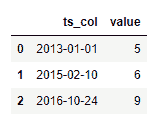

创建一个包含日期列的 DataFrame

可以看到，时间序列列的数据类型是对象而不是时间戳。以下代码及其输出确认了这一点：

```py
ts_df.dtypes
```

以下是输出结果：

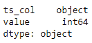

`to_datetime` 函数有助于将字符串转换为 `datetime`：

```py
                    ts_df["ts_col"] = pd.to_datetime(ts_df["ts_col"], format = "%Y-%m-%d")
    ts_df.dtypes
```

以下是输出结果：

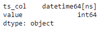

将字符串格式的日期列转换为 datetime 格式

pandas 的 `to_datetime` 函数根据字符串的格式将字符串列转换为 `datetime`。该函数的 `infer_datetime_format` 参数可以自动检测格式并将字符串解析为 `datetime`。当将 `exact` 参数设置为 `False` 时，它会查找最接近的匹配格式，帮助解决格式无法完全匹配的情况。

如下所示的转换也可以使用来自 `datetime` 库的 `strptime` 函数来完成：

```py
import datetime as dt
ts_df["ts_col"] = ts_df["ts_col"].apply(lambda x:
dt.datetime.strptime(x,'%Y-%m-%d'))
```

从 `datetime` 转换为字符串可以借助 `strftime` 函数，该函数接受输出字符串的格式：

```py
ts_df["ts_col"] = ts_df["ts_col"].dt.strftime("%d/%m/%Y")
ts_df  
```

以下是输出结果：

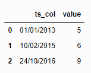

将日期列的 datetime 格式转换为字符串格式

在这里，原始的`datetime`值是`%Y-%m-%d`格式。然而，`strftime`函数允许格式更改。

字符串和`datetime`之间的相互转换也可以通过`astype()`方法实现，具体如下：

```py
ts_df["ts_col"] = ts_df["ts_col"].astype("datetime64[ns]")
ts_df["ts_col"] = ts_df["ts_col"].astype("object")  
```

# 时间序列数据的数据处理技术

本节处理的是在应用机器学习技术之前，常用于时间序列数据的常见数据处理或特征工程技术。

# 数据转换

请考虑以下单个数据集的各个部分：

```py
 ts_complete_df = pd.read_csv("sensor_df.csv")
```

以下截图显示了包含不等长时间序列组件的传感器数据头部：

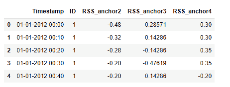

包含不等长时间序列组件的传感器数据头部

以下截图显示了包含不等长时间序列组件的传感器数据尾部：

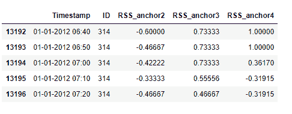

包含不等长时间序列组件的传感器数据尾部

这里的数据集由 314 个不同设备的 10 分钟间隔时间序列数据组成。所有这些 314 个设备的数据捕获持续时间各不相同。我们来看看每个设备的数据捕获持续时间：

```py
ts_complete_df.groupby("ID").size().describe()
```

以下是输出结果：

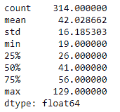

传感器数据摘要

每个设备的数据长度差异很大。像 Shapelet 变换和**长短期记忆**（**LSTM**）等多个时间序列问题要求每个设备的数据长度相同。以下代码片段将每个设备的数据截断到可能的最大长度：

```py
truncate_df = pd.DataFrame()
min_len = ts_complete_df.groupby("ID").size().min()
for i in range(1,315):
df = ts_complete_df[ts_complete_df["ID"] == i].iloc[0:min_len, :]
truncate_df = truncate_df.append(df)  
```

截断后，长度已统一。可以通过运行以下代码进行验证：

```py
truncate_df.groupby("ID").size().describe()  
```

以下是输出结果：

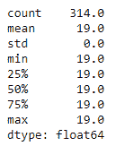

所有时间序列组件长度统一后的传感器数据摘要

让我们对以下单变量时间序列数据进行特征提取：

```py
 ts = pd.read_csv("D:datatest.txt").iloc[:,0:2].set_index("date") ts
```

以下是输出结果：

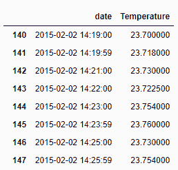

读取占用数据并将日期时间列设置为索引

特征提取对于使用时间序列数据进行机器学习至关重要，以便获得更好的性能指标。在这里，我们提取温度数据的滚动均值、滚动标准差和梯度：

```py
    feat_ext = pd.concat([ts.rolling(5).mean(), ts.rolling(5).std(), (ts - ts.shift(-5))/ts], axis=1).iloc[5:,:]
    feat_ext.columns = ['5_day_mean', '5_day_std', '5_day_gradient']
    feat_ext.head(5)
```

以下是输出结果：

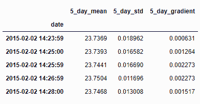

使用滚动函数生成特征（5_day_mean, 5_day_std）

在特征提取过程中，前五行包含`NA`值的数据已被删除。在此，特征已被提取用于 5 天的滚动窗口。使用类似的方法，可以从时间序列变量中提取数百个特征。

# 使用 matplotlib 绘图

本节简要介绍了如何使用`matplotlib`在`pandas`中绘图。`matplotlib`的 API 是通过标准惯例导入的，如下所示的命令：

```py
In [1]: import matplotlib.pyplot as plt 
```

`Series`和`DataFrame`都有一个绘图方法，它实际上是`plt.plot`的一个封装。这里，我们将讨论如何绘制正弦和余弦函数的简单图形。假设我们希望在区间从π到π绘制以下函数：

+   f(x) = cos(x) + sin (x)

+   g(x) = cos (x) - sin (x)

这将给出以下区间：

```py
    In [51]: import numpy as np
    In [52]: X = np.linspace(-np.pi, np.pi, 256,endpoint=True)

    In [54]: f,g = np.cos(X)+np.sin(X), np.sin(X)-np.cos(X)
    In [61]: f_ser=pd.Series(f)
             g_ser=pd.Series(g)

    In [31]: plotDF=pd.concat([f_ser,g_ser],axis=1)
             plotDF.index=X
             plotDF.columns=['sin(x)+cos(x)','sin(x)-cos(x)']
             plotDF.head()
    Out[31]:  sin(x)+cos(x)  sin(x)-cos(x)
    -3.141593  -1.000000   1.000000
    -3.116953  -1.024334   0.975059
    -3.092313  -1.048046   0.949526
    -3.067673  -1.071122   0.923417
    -3.043033  -1.093547   0.896747
    5 rows × 2 columns
```

我们现在可以使用`plot()`命令绘制 DataFrame，并使用`plt.show()`命令显示它：

```py
    In [94]: plotDF.plot()
             plt.show()

    We can apply a title to the plot as follows:
    In [95]: plotDF.columns=['f(x)','g(x)']
             plotDF.plot(title='Plot of f(x)=sin(x)+cos(x), \n         g(x)=sinx(x)-cos(x)')
             plt.show()
```

以下是前述命令的输出：

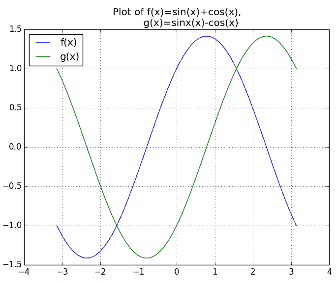

使用 matplotlib 绘制时间序列数据

我们还可以分别在不同的子图中绘制这两个序列（函数），使用以下命令：

```py
In [96]: plotDF.plot(subplots=True, figsize=(6,6))
           plt.show()
```

以下是前述命令的输出：

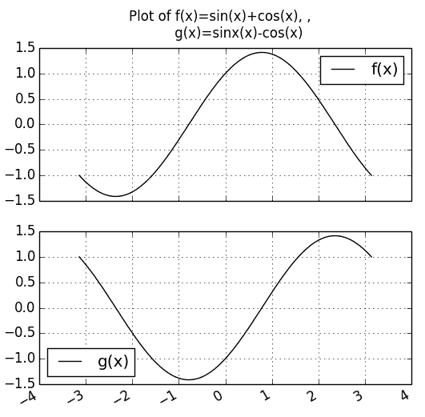

使用 matplotlib 绘制更多时间序列数据

在 pandas 中使用`matplotlib`的绘图功能还有很多其他用法。欲了解更多信息，请查看文档：[`pandas.pydata.org/pandas-docs/dev/visualization.html`](http://pandas.pydata.org/pandas-docs/dev/visualization.html)。

可视化多变量时间序列数据中的所有变量通常非常有用。让我们在单一图表中绘制以下数据的所有变量。请注意，`date`列在此处是索引：

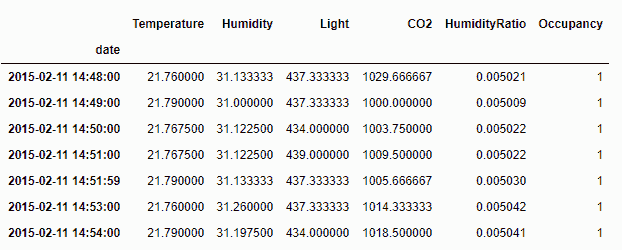

占用数据集

matplotlib 中的子图功能允许我们一次绘制所有变量：

```py
    axes = plot_ts.plot(figsize=(20,10), title='Timeseries Plot', subplots=True, layout=(plot_ts.shape[1],1), xticks = plot_ts.index)
    # Get current axis from plot
    ax = plt.gca()
    import matplotlib.dates as mdates
    # Set frequency of xticks
    ax.xaxis.set_major_locator(mdates.DayLocator(interval = 1))
    # Format dates in xticks 
    ax.xaxis.set_major_formatter(mdates.DateFormatter('%Y-%m-%d'))
    plt.show()
```

以下是输出结果：

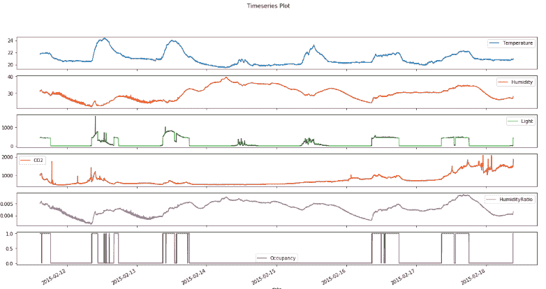

占用数据集中所有变量的时间序列图

# 总结

本章讨论了时间序列数据及其处理和操作步骤。可以将`date`列指定为`Series`或`DataFrame`的索引，然后可以根据索引列对子集进行操作。时间序列数据可以重新采样——既可以增加也可以减少时间序列的频率。例如，每毫秒生成的数据可以重新采样为每秒捕获一次数据，或者每秒的 1,000 毫秒可以取平均值。类似地，每分钟生成的数据可以通过向前或向后填充重新采样为每秒一次（使用该分钟的最后一个或下一个分钟的值填充所有秒数据）。

字符串到日期时间的转换可以通过`datetime`、`strptime`和`strftime`包来完成，每种日期输入格式（例如，22^(nd) July、7/22/2019 等）需要根据约定采用不同的解码方式。pandas 有以下类型的时间序列对象——`datetime.datetime`、`Timestamp`、`DateIndex`、`Period`、`PeriodIndex`、`timedelta`等。某些时间序列分类算法，如形状特征（shapelets）和 LSTM，需要时间序列组件（一个可分离的数据实体，包含多个时间序列数据条目）的长度相同。这可以通过将所有组件截断为最小长度，或者扩展到最大长度并用零或其他值进行填充来实现。Matplotlib 可以用于绘制基本的时间序列数据。移位、滞后和滚动函数用于计算移动平均，检测时间序列组件变动点的行为变化。

在下一章，我们将学习如何在 Jupyter Notebooks 中利用 pandas 的强大功能来制作强大且互动的报告。
