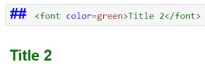

# 第十章：使用 pandas 在 Jupyter 中制作强大的报告

pandas 和 Jupyter Notebook 可用于创建格式化良好的输出、报告和/或教程，且这些内容易于与广泛的受众共享。在本章中，我们将研究多种样式的应用以及 pandas 提供的格式化选项。我们还将了解如何在 Jupyter Notebook 中创建仪表板和报告。

本章将涵盖以下主题：

+   pandas 样式

+   浏览 Jupyter Notebook

+   使用 Jupyter Notebooks 制作报告

# pandas 样式

pandas 允许在 DataFrame 上执行多种操作，使得处理结构化数据变得更加容易。DataFrame 的另一个有趣的特性是，它们允许我们格式化和设置常规行列的样式，这些样式有助于提高表格数据的可读性。`Dataframe.style` 方法返回一个 Styler 对象。所有需要在显示 DataFrame 之前应用的格式化可以在这个 Styler 对象上进行。样式设置可以使用内置函数，这些函数为格式化提供了预定义的规则，也可以使用用户自定义的规则。

让我们考虑以下 DataFrame，以便查看 pandas 的样式属性：

```py
  df = pd.read_csv("titanic.csv")
  df
```

以下截图展示了前述的 DataFrame 已加载到 Jupyter Notebook 中：


DataFrame 加载到 Jupyter Notebook 中

让我们来看一下如何为 Jupyter Notebook 元素设置样式。

# 内置样式选项

pandas 具有预定义的格式化规则，这些规则作为函数编写并存储，能够方便地使用。

`highlight_null` 方法会用指定的颜色高亮数据中的所有 NaN 或 Null 值。在讨论的 DataFrame 中，Age 和 Cabin 列有 NaN 值。因此，在以下截图中，这些列中的 NaN 值会以蓝色标记。

以下代码片段高亮显示了这些列中的 NaN 值：

```py
df.style.highlight_null(null_color = "blue")
```

这将产生以下输出：


图 9.2：用蓝色高亮显示 Null 和 NaN

`highlight_max` 和 `highlight_min` 方法分别对最大值或最小值应用高亮（使用选定的颜色），并可以跨任一轴进行操作。在以下示例中，每一列中的最小值已被高亮显示：

```py
 df.iloc[0:10, :].style.highlight_max(axis = 0)
```

请注意，只有数值类型的列才会被高亮显示。

以下截图高亮显示了每一列的最大值：


图 9.3：跨行高亮显示最大值（在数值列中），使用黄色标记

在前面的代码中，`highlight_max` 被用来高亮显示每一列中的最大值。

接下来，我们使用相同的函数来查找每一列的最大值，同时更改轴参数的值：

```py
df.style.highlight_max(axis = 1)
```

以下截图显示了跨列的最大值已被高亮显示：


使用黄色突出显示每列中的最大值（在数值列中）

现在，让我们使用`highlight_min`函数用自定义颜色突出显示最小值。`highlight_min`和`highlight_max`的语法相同，接受相同的参数集：


使用绿色突出显示最小值

基于条件格式化的背景颜色渐变可以应用于列，以便通过颜色表现出高、中、低值的区别。背景颜色会根据值的高低使用不同的颜色。

表格的背景渐变可以通过`background_gradient()`样式函数进行控制。可以使用任何现有的颜色映射或用户定义的颜色映射作为渐变。像`low`和`high`这样的参数可以帮助我们使用颜色映射的部分颜色范围。此外，还可以设置`axis`和`subset`参数来沿某一轴和某些列子集变化渐变：

```py
df.style.background_gradient(cmap='plasma', low = 0.25, high = 0.5) 
```

这将得到以下输出：


为每个数字列分别创建背景颜色渐变，基于其高低值

样式也可以独立于数值进行设置。我们来修改属性以改变字体颜色、背景颜色和边框颜色。你可以通过以下`代码`来实现。

```py
df.style.set_properties(**{'background-color': 'teal',
                               'color': 'white',
                               'border-color': 'black'})
```

这将得到以下输出：


为输出的 DataFrame 改变背景色、字体颜色、字体类型和字体大小

样式选项还帮助我们控制数值精度。请查看以下 DataFrame：


DataFrame 中的数字不进行精度四舍五入

看一下以下代码，它将精度设置为 2 位小数，或者将数字四舍五入到 2 位小数。

```py
rand_df.style.set_precision(2)
```

这将得到以下输出：


DataFrame 中的数字四舍五入到 2 位小数

现在，我们来为前面的 DataFrame 设置一个标题：

```py
rand_df.style.set_precision(2).set_caption("Styling Dataframe : Precision Control")
```

这将得到以下输出：


DataFrame 的数字四舍五入到 2 位小数，并添加表格标题

`set_table_styles`函数也可以用来独立于数据修改表格。它接受一个`table_styles`列表。每个`table_style`应为一个包含选择器和属性的字典。`table_styles`可以用来定义基于动作的自定义样式。例如，以下样式将所选单元格的背景色设置为`lawngreen`：

```py
df.style.set_table_styles([{'selector': 'tr:hover','props': [('background-color', 'lawngreen')]}]
```

这将得到以下输出：


`table_style`输出显示了所选单元格的草绿色背景色

`hide_index` 和 `hide_columns` 样式选项允许我们在显示时隐藏索引或指定的列。在以下代码中，我们已经隐藏了默认的索引列：

```py
df.style.hide_index()
```

以下截图显示了没有索引的输出 DataFrame：


从输出的 DataFrame 中隐藏 Index 列

现在，我们使用 `hide_columns` 选项来隐藏 `"Name"`、`"Sex"`、`"Ticket"` 和 `"Cabin"` 列：

```py
df.style.hide_columns(["Name", "Sex", "Ticket", "Cabin"])
```

以下截图展示了在从 DataFrame 中隐藏某些列后，显示的列：


从输出的 DataFrame 中隐藏某些列

# 用户定义的样式选项

除了内置函数，pandas 还提供了编写我们自己的函数以用于样式设置的选项。我们来编写一个函数，将负值的背景色改为红色：

```py
 def color_negative(val): 
    color = 'red' if val < 0 else 'green' 
    return 'background-color: %s' % color
```

这样的函数可以通过 pandas 的 `apply()` 和 `applymap` 方法作为样式选项应用。`applymap` 方法按元素应用函数。`apply()` 方法可以通过设置 `axis` 参数为 1 或 0 来按行或按列应用样式。将 `axis` 设置为 None 会按表格应用函数。在这里，我们的操作是按元素应用。我们来使用 `applymap`：

```py
rand_df.style.applymap(color_negative)
```

这会生成以下输出：


基于用户定义样式选项的所有列的自定义条件格式

`apply()` 和 `applymap` 方法也允许我们对数据的某个切片进行样式设置。要设置样式的列可以通过 `subset` 参数以列表的形式传递。我们来尝试将样式应用于第 1 列和第 3 列：

```py
rand_df.style.applymap(color_negative, subset = [1, 3])
```

这会生成以下输出：


基于用户定义样式选项的子集列的自定义条件格式

这也可以通过传递适当的基于标签的索引器来完成。在下列示例中，样式已经在第 1 列和第 4 列的第 0 行、第 1 行和第 2 行应用：

```py
rand_df.style.applymap(color_negative, subset=pd.IndexSlice[0:2, [1, 4]])
```

这会生成以下输出：


基于用户定义样式选项的子集行和列的自定义条件格式

`format()` 函数允许按指定的格式对字符串进行格式化。以下代码展示了应用格式以显示限制的小数位数：

```py
rand_df.style.format("{:.2f}") 
```

这会生成以下输出：


图 9.17：对所有列应用相同的两位小数格式

可以对不同的列应用不同的格式，如下所示：

```py
rand_df.style.format({0: "{:.3%}", 3: '{:.2f}'})
```

这会生成以下输出：


图 9.18：通过样式字典应用不同的格式到不同的列，列索引作为键，格式选项作为值

`lambda` 函数可以用来跨多个列应用格式化条件：

```py
rand_df.style.format(lambda x: "±{:.2f}".format(abs(x))) 
```

这会生成以下输出：


图 9.19：应用 lambda 函数一次性样式化多个列

# 浏览 Jupyter Notebook

Jupyter Notebook，之前被称为**IPython Notebook**，是一个非常棒的报告工具。它允许我们将常规代码与丰富的样式、格式化、Markdown 和特殊文本（如方程式图和实时编码）结合起来。这个部分将帮助你理解 Jupyter Notebook 的本质。

Jupyter Notebook 可以通过 Anaconda Navigator 启动，也可以通过终端使用 Jupyter Notebook 命令启动。它会在浏览器中打开。启动时会打开以下窗口：


图 9.20：Jupyter Notebook 启动后显示的界面

Jupyter Notebook 可以在目录中的任何文件夹中创建。点击“新建”选项可以创建一个新的笔记本、文件夹或终端。这个选项最有趣的功能是它让我们能够轻松切换多个 Conda 环境。例如，如果已经安装了 Python 2 和 Python 3 环境，就可以通过 Jupyter 访问它们。通过“上传”选项，其他目录中的任何笔记本都可以传输到当前 Jupyter Notebook 的工作目录中。

一个笔记本由菜单栏、工具栏和单元格区域组成。一个单一的笔记本可以包含多个单元格：


图 9.21：Jupyter Notebook 的菜单栏和工具栏

# 探索 Jupyter Notebook 的菜单栏

菜单栏提供了控制内核和笔记本区域的选项。文件菜单帮助创建新的笔记本、打开已保存的笔记本、保存笔记本中的检查点，并恢复到之前保存的稳定版本的检查点。编辑菜单包含了一系列针对整个单元格执行的操作：复制单元格、删除单元格、拆分或合并单元格，以及上下移动单元格。查看菜单可以用来切换标题、行号和工具栏，并编辑元数据、附件和标签。可以通过插入菜单在现有单元格上方或下方插入新单元格。单元格菜单允许我们运行单个单元格或将多个单元格一起运行。通过内核菜单可以修改内核状态，包括清除输出、重启内核、中断内核以及关闭内核。Jupyter Notebook 允许我们创建和使用小部件。小部件菜单帮助我们保存、清除、下载小部件状态，并将小部件嵌入到 HTML 内容中。帮助菜单提供了快速参考和快捷键。

# 编辑模式和命令模式

Jupyter Notebook 可以处于编辑模式或命令模式。在编辑模式下，单元格的内容可以被更改；单元格会被高亮显示为绿色，如下图所示：


Jupyter Notebook 中的单元格编辑模式

然后你会注意到在右上角出现一个铅笔图标：


Jupyter 笔记本中单元格的编辑模式

点击单元格或按*Enter*键即可进入编辑模式。

*Esc*键帮助我们从编辑模式切换到命令模式。也可以通过点击单元格外的任何地方来完成此操作。单元格周围的灰色边框和左侧的蓝色边距表示命令模式：


Jupyter 笔记本中单元格的命令模式

命令模式允许我们编辑整个笔记本，而编辑模式则更像是一个文本编辑器。当我们处于命令模式时，*Enter*键帮助我们进入编辑模式。在编辑模式和命令模式中都有多种快捷键可用，命令模式的快捷键数量比编辑模式更多：


命令模式下的快捷键


命令模式下的快捷键 - 2


编辑模式下的快捷键

前面的截图中的快捷键帮助我们在 Jupyter 笔记本中导航。

# 鼠标导航

通过鼠标进行导航时，最基本的操作是点击一个单元格进行选择和编辑。通过工具栏选项可以进一步辅助鼠标导航。工具栏中可用的不同选项如下：

+   **保存并设置检查点**：此选项在 Jupyter 笔记本中保存更改，并设置一个检查点，若需要，我们可以稍后恢复到此检查点。

+   **在下方插入单元格**：在当前选中的单元格下方创建一个新单元格。

+   **剪切选中的单元格**：剪切并删除选中的单元格。此操作可以通过编辑菜单撤销。

+   **复制选中的单元格**：轻松复制整个单元格的内容。

+   **粘贴单元格到下方**：粘贴之前剪切或复制的单元格内容。

+   **将选中的单元格上下移动**：将选中的单元格移到当前位置的上下。每次移动一个单元格。

+   **运行**：运行选中的单元格以执行代码。这是*Ctrl*+*Enter*的替代方式。

+   **中断内核**：取消当前正在执行的操作。

+   **重启内核**：在弹出框提示是否可以重启内核后，内核会重新启动。

+   **重启内核并重新运行笔记本**：在重启内核后重新运行整个笔记本。

+   **代码**，**Markdown**，**原始 NBConvert**，**标题**：更改单元格内容的文本格式。

+   **打开命令面板**：显示可用的快捷键选项。

# Jupyter Notebook 仪表板

Jupyter 通过 Jupyter Dashboard 提供交互式报告功能。它允许创建小部件，使可视化更加互动。仪表板体验将充满代码的笔记本转变为具有用户友好界面的应用程序。

# Ipywidgets

小部件是 Jupyter Dashboard 的重要组成部分。以下部分将更详细地探讨`Ipywidgets`。首先，需要从`Ipywidgets`库中导入小部件：

```py
from ipywidgets import widgets
```

以下截图展示了如何创建一个文本输入小部件：


获取文本输入的小部件

现在，让我们打印在小部件中输入的值：


图 9.39：获取文本输入并打印输出的小部件

使用类似的方法，可以创建其他小部件。以下截图展示了一个按钮小部件：


创建一个点击按钮小部件

每个小部件都有两个部分：用户界面（UI）和事件处理器。事件处理器通常是一个 Python 脚本，它指导我们根据用户输入做出响应。在之前的示例中，事件处理器根据用户输入打印了一条消息。

与默认的小部件不同，`interact`是一种特殊的小部件，它根据用户输入选择小部件的形式。在以下截图中，用户通过小部件向函数提供了一个单一的值。交互式小部件决定创建一个滑块输入：


创建数值滑块小部件

现在，让我们将输入改为布尔值，即 True。小部件变成了一个复选框：


创建一个布尔值选择器小部件

# 交互式可视化

上述示例中的小部件很简单，执行了一个`print`命令。除了`print`命令，响应还可以通过可视化来呈现。

以下是一个示例，两个来自不同滑块输入的值被用来控制坐标轴和线图的输入：


两个滑块输入，通过图表反映数值的变化

以下是一个交互式可视化的示例，使用了 Seaborn 图表，用户可以改变图例和颜色变量来影响图表：


选择颜色变量的下拉选择器小部件

# 在 Jupyter Notebook 中编写数学公式

Jupyter Notebook 是一个全面的工具，用于制作包含复杂数学表达式和算法的强大报告和教程。这是因为 Jupyter Notebook 提供了强大的排版功能，用于文本格式化和数学方程式输入。具有这些功能的 Jupyter Notebook 单元称为 Markdown 单元，与之相对的是代码单元，代码在其中编写和执行。Jupyter Notebook 的排版源自一个多功能的 JavaScript 库 **MathJax**，该库用于在 Web 产品中输入科学方程式。它还支持 LaTex 语法，实际上，我们接下来要讨论的大部分语法都支持。

在本节中，我们将讨论如何编写这些方程式并格式化文本。我们将首先快速介绍如何编写数学方程式。

编写 Jupyter Notebook 方程式时需要牢记的一些高级指南如下：

+   选择单元类型为 Markdown，如下图所示。新单元的默认类型是 `Code`。

+   将方程式包含在 `$$` 之间。

+   诸如 frac（分数）、times（乘法）、leq（小于或等于）、alpha、beta 等关键词和符号前面都加上反斜杠 `\`。

+   请注意，双击渲染后的 Markdown 单元会将其恢复为 LaTex/MathJax 代码片段：


选择单元类型为 Markdown

有了这些指导原则，我们开始学习如何编写方程式。本节采用了食谱格式，其中我们将看到 LaTex/MathJax 代码片段源以及输出方程式。

简单的数学运算，如加法、乘法、除法等，可以如下编写。`\times` 和 `\over` 是乘法和除法操作符的关键词。注意方程式是如何以 `$$` 开始和结束的：


LaTex 代码片段及简单数学运算的输出方程式

幂和指数运算可以如下编写。`^` 是 LaTex 语法中的幂或指数符号：


LaTex 代码片段及幂和指数运算的输出方程式

数学方程式通常涉及复杂的分数。这些可以按如下方式编写。`\frac` 关键词在编写复杂分数时提供了更多的灵活性：


LaTex 代码片段及分数运算的输出方程式

现在，我们来看一下如何编写不等式。需要注意的关键词是 `\geq` 和 `\leq`，分别表示大于或等于和小于或等于：


LaTex 代码片段及不等式的输出方程式

希腊字母和符号在数学方程式和表达式中被广泛使用。这里，我们提供了一个符号词汇表，并说明了我们可以用来书写它们的指令。请注意，如何通过在上标前加`_`（即下划线）来书写上标：


LaTex 片段和符号与指数的输出方程式

根号和对数是数学方程式中的重要组成部分。我们来看一下如何书写它们。`\sqrt`是根号的主要关键字，提供两个参数——根号的类型，即 2^(nd)根，3^(rd)根或 4^(th)根，以及应用根号的表达式或数字。对于对数，底数前面有一个`_`，也就是下划线：


LaTex 片段和根号与对数的输出方程式

经常需要处理数据向量元素的求和与积的操作。我们来看一下如何书写这些操作。`\sum`和`\prod`是主要关键字，并且具有一个`\limit`属性，用于输入求和或积的下限和上限：


LaTex 片段和求和与积的输出方程式

组合与统计有一套独立的符号。让我们看看如何书写它们。`\choose`是组合的关键字：


LaTex 片段和概率与统计的输出方程式

微积分是一个广泛的领域，是许多数据科学算法中的数学表达式和方程式的来源。`\lim`是书写极限表达式的关键字，并提供`\limits`和`\to`参数关键字来表示一个变量趋向某个值。`\partial`关键字用于书写偏导数，而`\frac`关键字用于书写常规导数。`\int`用于书写积分，它带有`\limits`参数，用于提供积分的上下限：


LaTex 片段和微积分的输出方程式

线性代数在数据科学算法中被广泛应用，我们在处理许多矩阵时涉及到线性代数。我们来看一下如何书写矩阵。`\matrix`是书写矩阵的主要关键字。元素按行书写；同一行的元素通过`&`分隔，而新的一行用换行符标记，也就是`//`：


LaTex 片段和矩阵的输出方程式

还经常遇到具有不同定义的函数，这些函数在不同的变量范围内有不同的定义。让我们学习如何书写这些函数定义。以下是写这些定义所需的关键字和元素的高层次概述。

以下是用于多重周期函数中的新格式选项：

+   **大括号**：使用 `\left` 和 `\right` 关键字分别表示方程的开始和结束。

+   **方程组对齐**：`begin{}`, `end{}`。

+   **换行符**：使用 `\` 符号将文本移到下一行。

+   **文本对齐框**：使用 `\mbox{text}` 对文本进行对齐。

它们可以按如下方式使用：


LaTex 代码片段和输出多周期函数的方程

# 在 Jupyter Notebook 中格式化文本

Markdown 单元格提供了很多文本格式化选项。在本节中，我们将逐一介绍这些选项。

# 标题

通过在 Markdown 单元格中的任何文本前加 `#`，可以将其指定为标题。一个 `#` 表示标题 1，两个 `#` 表示标题 2，依此类推。如下面的截图所示。我们遵循与 LaTex 代码片段源相同的格式，后跟输出的格式化文本：


LaTex 代码片段和输出格式化文本用于标题

# 粗体和斜体

要将文本格式化为粗体，可以将其包含在 `**` 中，例如 `**<text>**`。

要将文本格式化为斜体，可以将其包含在 `*` 中，例如 `*<text>*`：


LaTex 代码片段和输出格式化文本用于粗体和斜体格式化

# 对齐

可以通过使用类似 HTML 的 `<center>` 标签将文本居中对齐，如下所示：


LaTex 代码片段和输出格式化文本用于对齐

# 字体颜色

可以按如下方式指定文本的字体颜色。它必须写在另一个类似 HTML 的 `<font>` 标签内：



LaTex 代码片段和输出格式化文本用于字体颜色

# 项目符号列表

使用星号 `*` 和空格可以创建项目符号列表。列表也可以嵌套，如下图所示：


LaTex 代码片段和输出格式化文本用于项目符号列表

# 表格

可以通过组合 `|`、空格、`---` 和 `:` 创建表格。它们如下所示：

+   **|:** 用作列分隔符。

+   **空格**：用于填充和对齐列和行。

+   **---**：用于创建实心水平线。

+   **:**：用于单元格中的文本对齐。如果它出现在开头，则文本左对齐：


LaTex 代码片段和输出格式化文本用于表格

# 表格

水平线用于将不同部分分开。`***` 生成普通水平线，而 `- - -` 提供实心水平线：


LaTex 代码片段和输出格式化文本用于表格

# HTML

Markdown 单元格也可以用来呈现代码，如下图所示：


LaTex 代码片段和输出格式化文本用于 HTML

# 引用

在许多情况下，报告中的引用和摘录需要注明来源。这是通过在每行文本前加上 `>` 来实现的。这会产生缩进文本，并在结尾显示引用：


LaTex 代码片段及输出的格式化文本用于引用和缩进文本

# Jupyter Notebook 中的杂项操作

除了文本格式化和方程式外，还需要进行一些杂项操作，例如加载图像、将单元格写入 Python 文件等，这些对于制作有效的报告非常重要。在本节中，我们将探讨这些操作并学习如何使用它们。

# 加载图像

最流行的图像格式，如 `.viz`、`.jpg`、`.png`、`.gif` 等，可以加载到 Jupyter Notebook 中，以更好地展示报告。甚至可以加载 `.gif` 并将其作为动画展示。

这些图像文件需要保存在当前工作目录中。当前工作目录可以通过在 Notebook 中的代码块中运行 `os.getcwd()` 来找到。要加载的图像应保存在该目录中。可以通过使用 `os.chdir`（目录路径）来更改工作目录。请注意，这些命令假设已经运行了 `import os`。以下代码用于显示 `.jpg` 图像及其输出：


LaTex 代码片段及输出的 .jpg 图像

以下代码用于显示 `.gif` 图像及其输出：


LaTex 代码片段及输出的 .gif 图像

# 超链接

超链接通常用于将用户导航到相关资源，例如输入数据、算法说明、进一步阅读、视频等。执行此操作的语法非常简单：

```py

```

这将导致以下输出：


LaTex 代码片段及输出的超链接

# 写入 Python 文件

代码单元的内容可以写入 Python 文件。在将 Jupyter Notebook 中的原型代码移植到生产环境中的 Python 文件时，这非常有用。这些文件会写入当前工作目录：


图 9.69：用于将代码单元写入 Python 文件的 LaTex 代码片段

# 运行 Python 文件

外部 Python 文件可以直接从 Jupyter Notebook 中运行。这可以用于加载已保存在 Python 文件中的函数和类，以便稍后在 Notebook 中使用。它们还可以用于运行 Python 文件，而无需使用命令提示符，从而快速查看输出。再次提醒，这些 Python 文件需要存在于当前工作目录中：


从 Jupyter Notebook 的单元格运行 Python 文件后的 LaTex 代码片段及输出

# 加载 Python 文件

Python 文件的内容可以加载到 Notebook 单元中。这是为了在交互式 Notebook 环境中编辑、修改和测试代码：


从 Jupyter Notebook 中的单元加载 Python 文件后的 LaTex 代码片段和输出

# 内部链接

可以创建内部（超）链接以便从目录摘要索引跳转到笔记本的不同章节。在进行内部链接之后，点击索引中的项目会将你带到特定章节。

在 Jupyter Notebook 中使内部链接生效包括两个步骤：

1.  为一个章节创建 ID 或标识符：


创建章节 ID 标识符的 LaTex 代码片段

章节的 ID 在`<a>`标签中给出。在这种情况下，`Simple_Operations`是简单操作章节的 ID。此 ID 将在第二步中用于创建指向该章节的链接。

运行前两个单元后，以下内容将作为输出。第一个包含 ID 定义的单元会变得不可见。确保在点击超链接之前已经运行过该单元。如果没有运行，链接将无法工作。另一个重要点是，这个 ID 定义需要在创建章节标题之前进行：


创建章节 ID 标识符的 LaTex 代码片段输出

1.  使用此 ID 来创建内部链接。

创建内部链接的语法如下：

```py
Text to Appear
```

例如，对于简单操作章节，我们需要做以下操作：


创建内部链接后的 LaTex 代码片段和输出

请注意，简单操作现在已显示为超链接。点击它将把用户带到简单操作章节。

类似地，我们可以为所有其他章节定义章节 ID：


不同章节 ID 的 LaTex 代码片段

请注意，章节 ID 的定义应紧跟在章节标题的 Markdown 单元格之前，以将该单元格标记为该章节的开始。这在大宗定义中已示例，仅为说明目的：


用于不同内部链接的 LaTex 代码片段，指向章节 ID

注意如何在每行的末尾使用了`<br>`标签。此标签表示换行，并将它后面的文本移到下一行：


不同内部链接指向章节 ID 的 LaTex 输出

# 分享 Jupyter Notebook 报告

一旦报告被创建，它们就需要与受众共享以供使用。分享这些报告有几个选项。现在我们来看一下这些选项。

# 使用 NbViewer

NbViewer 是一个用于查看`ipynb`文件的在线查看器。如果我们希望使用此选项分享 Jupyter Notebook 报告，需要按照以下步骤操作：

1.  将报告保存为`ipynb`文件。

1.  将`ipynb`文件上传到 GitHub 并获取该文件的 URL。

1.  将*步骤 2*中的 URL 粘贴到 NbViewer 中。NbViewer 可以通过 [www.nbviewer.jupyter.org](http://www.nbviewer.jupyter.org) 访问。

1.  使用这个 GitHub URL，我们在本章中使用的 Notebook 已经共享：[`github.com/ashishbt08b004/Experiments/blob/master/writing_equations_in_jupyter.ipynb`](https://github.com/ashishbt08b004/Experiments/blob/master/writing_equations_in_jupyter.ipynb)。

# 使用浏览器

报告也可以保存为 HTML 文件。这些 HTML 文件可以直接在任何普通浏览器中查看，只需双击它们并选择一个浏览器作为 HTML 文件的默认程序。可以通过这个链接获得一个示例文件。

[`github.com/ashishbt08b004/Experiments/blob/master/writing_equations_in_jupyter.html`](https://github.com/ashishbt08b004/Experiments/blob/master/writing_equations_in_jupyter.html)。 [](https://github.com/ashishbt08b004/Experiments/blob/master/writing_equations_in_jupyter.html)

# 使用 Jupyter Hub

Jupyter Hub 是一个 Python 程序，可以用于部署和共享 Jupyter Notebook 报告给多个用户。它可以看作是普通 Jupyter Notebook 的多用户版本，通过 URL 进行访问；它通常被公司、研究小组和课程讲师用来与大规模的群体分享实验和知识，提供交互式环境。

该程序在 Linux 机器上运行，通常部署在具有强大计算能力的机器上。这可以是云端或本地机器。

JupyterHub 由四个子系统组成：

+   一个**Hub**（tornado 进程），是 JupyterHub 的核心。

+   一个**可配置的 http 代理**（node-http-proxy），接收来自客户端浏览器的请求。

+   多个**单用户 Jupyter notebook 服务器**（Python/IPython/tornado），由生成器进行监控。

+   一个**认证类**，管理用户如何访问系统：


Jupyter Hub 架构

安装 Jupyter Hub 有一些前提条件：

+   一台 Linux 机器（云端或本地）

+   Python 3.5+

+   Nodejs/npm

+   TLS 证书和用于 HTTPS 通信的密钥

+   机器/服务器的域名

Jupyter Hub 提供了一个服务器-客户端类型的多用户环境，数据和 `ipynb` 文件可以与多个用户共享。它提供了多个强大的安全性和登录认证功能。

以下指南可以用于多用户的 Notebook 报告安装和部署：[`tljh.jupyter.org/en/latest/`](https://tljh.jupyter.org/en/latest/)[.](https://tljh.jupyter.org/en/latest/)

# 总结

本章集中讨论了三个主要主题：pandas 中的样式和结果格式选项、在 Jupyter Notebook 中创建交互式仪表板，以及探索 Jupyter Notebook 中的格式化和排版选项以创建强大的报告。

输出格式化，例如条件格式、粗体和斜体输出、突出显示某些部分等，可以通过 pandas 的样式选项完成。基本的交互式仪表板可以在 Jupyter Notebook 中创建。LaTex 和 MathJax 提供了强大的排版和 Markdown 选项，用于编写方程式和格式化文本。报告可以作为`ipynb`文件分享到 GitHub，并通过名为 **NbViewer** 的在线查看器查看。Jupyter Hub 是一种基于服务器的多用户部署方式。

在下一章中，我们将探讨如何使用 pandas 进行统计计算，包括使用包进行计算；我们还将从零开始进行计算。
