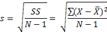
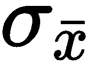
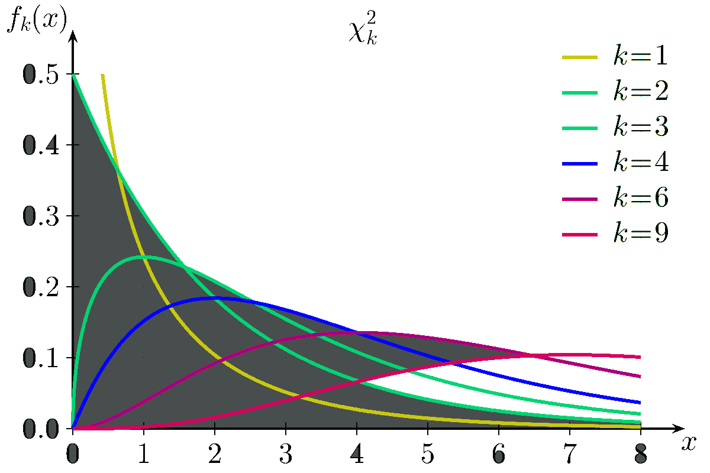

# 第十一章：使用 pandas 和 NumPy 进行统计学概览

在本章中，我们将简要介绍经典统计学（也称为频率学派方法），并展示如何使用 pandas 配合 `numpy` 和 `stats` 包（例如 `scipy.stats` 和 `statsmodels`）来进行统计分析。我们还将学习如何在 Python 中从头开始编写这些统计背后的计算。本章及后续章节并非统计学入门教材；它们只是展示如何结合使用 pandas、`stats` 和 `numpy` 包的示例。在下一章中，我们将探讨经典统计学的替代方法——即**贝叶斯统计**。

本章我们将涉及以下主题：

+   描述性统计学与推断性统计学

+   集中趋势和变异度的度量

+   假设检验 – 零假设和备择假设

+   z 检验

+   t 检验

+   卡方检验

+   方差分析（ANOVA）检验

+   置信区间

+   相关性与线性回归

# 描述性统计学与推断性统计学

在描述性统计学或总结性统计学中，我们尝试以定量的方式描述一组数据的特征。这与推断性或归纳性统计学不同，因为其目的是总结样本，而不是利用数据推断或得出关于从中抽取样本的总体的结论。

# 集中趋势和变异度的度量

描述性统计学中使用的部分度量包括集中趋势度量和变异度度量。

集中趋势度量是通过指定数据中的中心位置来描述数据集的单个值。三种最常见的集中趋势度量是**均值**、**中位数**和**众数**。

变异度度量用于描述数据集中的变异性。变异度度量包括方差和标准差。

# 集中趋势的度量

接下来，我们将通过以下小节来了解集中趋势的度量，并附上相应的示例。

# 均值

均值或样本均值是最常见的集中趋势度量。它等于数据集中所有值的总和，除以数据集中的值的个数。因此，在一个包含 *n* 个值的数据集中，均值的计算公式如下：


如果数据值来自样本，我们使用！[](img/7d4b5155-fd91-4540-9c10-1e0efbfc1e52.png)；如果数据值来自总体，我们使用**µ**。

样本均值和总体均值是不同的。样本均值是所谓的无偏估计量，用于估计真实的总体均值。通过反复从总体中随机抽取样本来计算样本均值，我们可以获得样本均值的均值。然后，我们可以调用大数法则和**中心极限定理**（**CLT**），并将样本均值的均值作为总体均值的估计值。

总体均值也被称为总体的期望值。

均值作为一个计算得出的值，通常并不是数据集中观察到的值之一。使用均值的主要缺点是它非常容易受到异常值的影响，或者当数据集非常偏斜时也会受到影响。

# 中位数

中位数是将排序后的数据值分成两半的数值。它的左侧恰好有一半的总体数据，右侧也有一半。当数据集中的值的个数是偶数时，中位数是两个中间值的平均值。它受异常值和偏斜数据的影响较小。

# 众数

众数是数据集中出现频率最高的值。它更常用于分类数据，以便找出哪个类别最常见。使用众数的一个缺点是它不是唯一的。一个具有两个众数的分布被称为双峰分布，而一个具有多个众数的分布被称为多峰分布。以下代码演示了一个双峰分布，其中众数出现在 2 和 7 处，因为它们在数据集中都出现了四次：

```py
    In [4]: import matplotlib.pyplot as plt
               %matplotlib inline  
    In [5]: plt.hist([7,0,1,2,3,7,1,2,3,4,2,7,6,5,2,1,6,8,9,7])
               plt.xlabel('x')
               plt.ylabel('Count')
               plt.title('Bimodal distribution')
               plt.show()
```

生成的双峰分布如下所示：


# 在 Python 中计算数据集的集中趋势度量

为了说明这一点，我们来考虑以下数据集，它由 15 名学生在一项满分为 20 分的测试中获得的分数组成：

```py
    In [18]: grades = [10, 10, 14, 18, 18, 5, 10, 8, 1, 12, 14, 12, 13, 1, 18]  
```

均值、中位数和众数可以通过以下方式获得：

```py
    In [29]: %precision 3  # Set output precision to 3 decimal places
    Out[29]:u'%.3f'

    In [30]: import numpy as np
             np.mean(grades)
    Out[30]: 10.933

    In [35]: %precision
             np.median(grades)
    Out[35]: 12.0

    In [24]: from scipy import stats
             stats.mode(grades)
    Out[24]: (array([ 10.]), array([ 3.]))
    In [39]: import matplotlib.pyplot as plt
    In [40]: plt.hist(grades)
             plt.title('Histogram of grades')
             plt.xlabel('Grade')
             plt.ylabel('Frequency')
             plt.show()  
```

以下是前面代码的输出：


为了说明数据的偏斜或异常值如何显著影响均值作为集中趋势度量的有效性，考虑以下数据集，它显示了某工厂员工的工资（以千美元为单位）：

```py
    In [45]: %precision 2
             salaries = [17, 23, 14, 16, 19, 22, 15, 18, 18, 93, 95]

    In [46]: np.mean(salaries)
    Out[46]: 31.82
```

基于均值`31.82`，我们可能会假设数据围绕均值分布。然而，我们会错。为了说明这一点，我们使用条形图展示该数据的经验分布：

```py
    In [59]: fig = plt.figure()
             ax = fig.add_subplot(111)
             ind = np.arange(len(salaries))
             width = 0.2
             plt.hist(salaries, bins=xrange(min(salaries),
             max(salaries)).__len__())
             ax.set_xlabel('Salary')
             ax.set_ylabel('# of employees')
             ax.set_title('Bar chart of salaries')
             plt.show()  
```

以下是前面代码的输出：


从前面的条形图中，我们可以看到大多数薪资远低于 30K，并且没有人接近 32K 的均值。现在，如果我们看看中位数，我们会发现它在这种情况下是一个更好的集中趋势度量：

```py
    In [47]: np.median(salaries)
    Out[47]: 18.00
```

我们还可以查看数据的直方图：

```py
    In [56]: plt.hist(salaries, bins=len(salaries))
             plt.title('Histogram of salaries')
             plt.xlabel('Salary')
             plt.ylabel('Frequency')
             plt.show()
```

以下是前面代码的输出：


直方图实际上更好地表示了数据，因为条形图通常用于表示分类数据，而直方图更适合用于定量数据，这正是薪资数据的情况。有关何时使用直方图与条形图的更多信息，请参见[`onforb.es/1Dru2gv`](http://onforb.es/1Dru2gv)。

如果分布是对称的且单峰的（即只有一个峰值），那么三种衡量值——均值、中位数和众数——将是相等的。如果分布是偏斜的，情况则不相同。在这种情况下，均值和中位数将彼此不同。对于负偏态分布，均值将低于中位数，而对于正偏态分布，情况则相反：


图表来源：http://www.southalabama.edu/coe/bset/johnson/lectures/lec15_files/iage014.jpg。

# 变异性、分散度或扩展度的衡量指标

描述统计学中我们衡量的另一个分布特征是变异性。

变异性表示数据点之间的差异或分散程度。变异性衡量指标非常重要，因为它们提供了关于数据性质的见解，而这些见解是集中趋势衡量指标所无法提供的。

举个例子，假设我们进行了一项研究，旨在检验一项学前教育计划在提升经济困难儿童测试成绩方面的效果。我们可以通过不仅仅关注整个样本的平均测试成绩，还可以通过成绩的分散程度来衡量效果。这对某些学生有用，而对其他学生则不太有用吗？数据的变异性可能有助于我们找出改进计划有效性的措施。

# 范围

最简单的分散度衡量指标是范围。范围是数据集中最低值和最高值之间的差异。这是最简单的扩展度衡量方法，可以按如下方式计算：

*范围 = 最高值 - 最低值*

# 四分位数

一个更重要的分散度衡量指标是四分位数及其相关的四分位距。四分位数也代表*季度百分位数*，意味着它是在测量尺度上，按排序后的数据集中的 25%、50%、75%和 100%数据所低于的值。四分位数是将数据集分为四组的三个点，每组包含四分之一的数据。为了说明这一点，假设我们有一个包含 20 个测试成绩的排名数据集，如下所示：

```py
    In [27]: import random
             random.seed(100)
             testScores = [random.randint(0,100) for p in 
                           xrange(0,20)]
             testScores
    Out[27]: [14, 45, 77, 71, 73, 43, 80, 53, 8, 46, 4, 94, 95, 33, 31, 77, 20, 18, 19, 35]

    In [28]: #data needs to be sorted for quartiles
          sortedScores = np.sort(testScores) 
    In [30]: rankedScores = {i+1: sortedScores[i] for i in 
                             xrange(len(sortedScores))}

    In [31]: rankedScores
    Out[31]:
    {1: 4,
     2: 8,
     3: 14,
     4: 18,
     5: 19,
     6: 20,
     7: 31,
    8: 33,
     9: 35,
     10: 43,
     11: 45,
     12: 46,
     13: 53,
     14: 71,
     15: 73,
     16: 77,
     17: 77,
     18: 80,
     19: 94,
     20: 95}

```

第一四分位数（Q1）位于第五和第六个得分之间，第二四分位数（Q2）位于第十和第十一得分之间，第三四分位数（Q3）位于第十五和第十六得分之间。因此，通过线性插值并计算中位数，我们得到以下结果：

```py
Q1 = (19+20)/2 = 19.5
Q2 = (43 + 45)/2 = 44
Q3 = (73 + 77)/2 = 75  
```

在 IPython 中查看这个内容时，我们可以使用`scipy.stats`或`numpy.percentile`包：

```py
    In [38]: from scipy.stats.mstats import mquantiles
             mquantiles(sortedScores)
    Out[38]: array([ 19.45,  44\.  ,  75.2 ])

    In [40]: [np.percentile(sortedScores, perc) for perc in [25,50,75]]
    Out[40]: [19.75, 44.0, 74.0]

```

值与我们之前的计算结果不完全一致的原因是由于不同的插值方法。四分位距是第三四分位数减去第一四分位数（*Q3 - Q1*）。它代表了数据集中的中间 50%的值。

有关统计度量的更多信息，请参见[`statistics.laerd.com/statistical-guides/measures-central-tendency-mean-mode-median.php`](https://statistics.laerd.com/statistical-guides/measures-central-tendency-mean-mode-median.php)。

有关`scipy.stats`和`numpy.percentile`函数的更多详细信息，请参见以下文档：[`docs.scipy.org/doc/scipy/reference/generated/scipy.stats.mstats.mquantiles.html`](http://docs.scipy.org/doc/scipy/reference/generated/scipy.stats.mstats.mquantiles.html) 和 [`docs.scipy.org/doc/numpy-dev/reference/generated/numpy.percentile.html`](http://docs.scipy.org/doc/numpy-dev/reference/generated/numpy.percentile.html)。

# 偏差与方差

在讨论变异性时，一个基本概念是偏差。简单来说，偏差度量告诉我们一个给定值与分布均值的偏离程度——即！[](img/54f39392-c434-4f81-993e-69f75ec09d5b.png)。

为了找到一组值的偏差，我们定义方差为平方偏差之和，并通过除以数据集的大小来标准化它。这被称为方差。我们需要使用平方偏差的和。由于围绕均值的偏差之和为零，因为负偏差和正偏差相互抵消，因此方差是定义为以下内容：


上述表达式等价于以下内容：


严格来说，方差的定义如下：

+   对于样本方差，使用以下公式：


+   对于总体方差，使用以下公式：


样本方差的分母使用*N-1*而不是*N*的原因在于，为了获得无偏估计量，样本方差需要使用无偏估计。有关更多详细信息，请参见[`en.wikipedia.org/wiki/Bias_of_an_estimator`](http://en.wikipedia.org/wiki/Bias_of_an_estimator)。

该度量的值是以平方单位表示的。这强调了我们计算的方差是平方偏差。因此，为了得到与数据集原始点相同单位的偏差，我们必须取平方根，这样我们就得到了标准差。因此，样本的标准差由以下公式给出：



然而，对于总体，标准差由以下公式给出：


# 假设检验——零假设和备择假设

在前面的部分，我们简要讨论了所谓的描述性统计学。在本节中，我们将讨论推断统计学，通过它我们尝试利用样本数据集的特征来推断关于更广泛人群的结论。

推断统计学中最重要的方法之一是假设检验。在假设检验中，我们尝试确定某个假设或研究问题是否在某种程度上为真。一个假设的例子是：食用菠菜能够改善长期记忆。

为了使用假设检验来调查这个说法，我们可以选择一组人作为研究对象，并将他们分成两组或样本。第一组将是实验组，在预定的时间段内食用菠菜。第二组不食用菠菜，将作为对照组。在选定的时间段内，两组个体的记忆力将进行测量并统计。

我们实验的最终目标是能够做出类似“食用菠菜能够改善长期记忆，这不是由于偶然因素造成的”这样的陈述。这也被称为显著性。

在前述情境中，研究中的受试者集合被称为样本，而我们希望对其得出结论的更广泛人群则是总体。

我们研究的最终目标是确定我们在样本中观察到的任何效应是否可以推广到整个群体。因此，为了进行假设检验，我们需要提出所谓的零假设和备择假设。

# 零假设和备择假设

参考前面的菠菜例子，零假设将是“食用菠菜对长期记忆表现没有影响”。

零假设就是它的意思——它否定了我们通过实验想要*证明*的内容。它通过断言一个统计度量（稍后将解释）为零来实现这一点。

备择假设是我们希望支持的假设。它是零假设的对立面，我们假设它为真，直到数据提供足够的证据表明相反。因此，在这个例子中，我们的备择假设是“食用菠菜能改善长期记忆”。

在符号上，零假设被称为***H0***，备择假设被称为***H1***。你可能希望将前述的零假设和备择假设重新表述为更加具体和可衡量的形式，例如，我们可以将***H0***重新表述如下：

“在 1,000 名受试者中，每天食用 40 克菠菜，持续 90 天的样本的平均记忆分数，将与 1,000 名不食用菠菜的对照组在相同时间段内的平均记忆分数相同。”

在进行我们的实验/研究时，我们专注于试图证明或反驳零假设。这是因为我们可以计算我们的结果是由于偶然机会导致的概率。然而，计算替代假设的概率没有简单的方法，因为改善长期记忆可能不仅仅是因为吃菠菜等因素。

我们通过假设零假设为真并计算我们收集到的结果是由偶然机会造成的概率来测试零假设。我们设定一个阈值水平——alpha（*α*），如果计算得到的概率较小，则我们可以拒绝零假设；如果较大，则可以接受。拒绝零假设等同于接受备选假设，反之亦然。

# alpha 和 p 值

为了进行支持或反驳我们的零假设的实验，我们需要提出一种能够以具体和可衡量的方式做出决定的方法。为了进行显著性检验，我们必须考虑两个数字——检验统计量的 p 值和显著性水平的阈值，也称为**alpha**。

p 值是我们观察到的结果在假设零假设为真的情况下仅由偶然机会发生的概率。

p 值也可以看作是在假设零假设为真的情况下，获得与得到的检验统计量一样极端或更极端的概率。

Alpha 值是我们比较 p 值的阈值。这为我们提供了一个可以接受或拒绝零假设的切断点。这是一个衡量我们观察到的结果必须有多极端才能拒绝我们实验的零假设的指标。最常用的 alpha 值为 0.05 或 0.01。

一般规则如下：

+   如果 p 值小于或等于 alpha（p < .05），则我们拒绝零假设，并声明结果具有统计显著性。

+   如果 p 值大于 alpha（p > .05），则我们未能拒绝零假设，并声明结果没有统计显著性。

换句话说，规则如下：

+   如果检验统计量值大于或小于两个临界检验统计量值（双尾检验），那么我们拒绝零假设，并声明（备选）结果具有统计显著性。

+   如果检验统计量值位于两个临界检验统计量值之间，则我们未能拒绝零假设，并声明（备选）结果没有统计显著性。

在频率学派方法中，使用中**alpha**的看似任意的值是其一大缺点，并且这一方法存在许多问题。《*自然*》杂志的一篇文章强调了这些问题；你可以通过以下链接找到它：[`www.nature.com/news/scientific-method-statistical-errors-1.14700`](http://www.nature.com/news/scientific-method-statistical-errors-1.14700)。

想了解更多关于这个主题的细节，请参考以下链接：

[`statistics.about.com/od/Inferential-Statistics/a/What-Is-The-Difference-Between-Alpha-And-P-Values.htm`](http://statistics.about.com/od/Inferential-Statistics/a/What-Is-The-Difference-Between-Alpha-And-P-Values.htm)

[`courses.washington.edu/p209s07/lecturenotes/Week%205_Monday%20overheads.pdf`](http://courses.washington.edu/p209s07/lecturenotes/Week%205_Monday%20overheads.pdf)

# I 型和 II 型错误

错误有两种类型：

+   **I 型错误**：在这种错误中，我们拒绝了*H0*，而事实上，*H0*是真实的。一个例子就是陪审团错误地定罪一个无辜的人，尽管该人并未犯下该罪行。

+   **II 型错误**：在这种错误中，我们未能拒绝*H0*，而事实上，*H1*是正确的。这相当于一个有罪的人逃脱了定罪。

这里有一张表格，显示了导致错误的原假设条件：


# 统计假设检验

统计假设检验是我们用来做决策的一种方法。我们通过使用来自统计研究或实验的数据来进行决策。在统计学中，如果某个结果基于预定的阈值概率或显著性水平不太可能仅由偶然因素造成，那么这个结果被称为统计上显著。统计检验有两种类型：单尾检验和双尾检验。

在双尾检验中，我们将一半的**alpha**用于检验一个方向上的统计显著性，另一半则用于检验另一个方向上的统计显著性。

在单尾检验中，检验仅在一个方向上进行。

想了解更多关于这个主题的细节，请参考[`www.ats.ucla.edu/stat/mult_pkg/faq/general/tail_tests.htm`](http://www.ats.ucla.edu/stat/mult_pkg/faq/general/tail_tests.htm)。

# 背景

为了应用统计推断，理解什么是抽样分布的概念非常重要。抽样分布是指从一个总体中随机抽取样本时，假设原假设成立，统计量的所有可能值及其概率的集合。

一个更简化的定义是：抽样分布是指如果我们从总体中反复抽取样本，统计量可以取的所有值（分布）以及这些值的相关概率。

统计量的值是从统计量的抽样分布中随机抽取的样本。均值的抽样分布是通过获得不同大小的多个样本并计算它们的均值来确定的。

中心极限定理指出，如果原始或原始分数总体是正态分布，或者样本容量足够大，则采样分布是正态分布。通常，统计学家定义足够大的样本容量为 N ≥ 30——即样本容量为 30 或更多。然而，这仍然是一个争议话题。

有关此主题的更多细节，请参考[`stattrek.com/sampling/sampling-distribution.aspx`](http://stattrek.com/sampling/sampling-distribution.aspx)。

采样分布的标准差通常称为均值的标准误差，简称标准误差。

# z 检验

在以下条件下，z 检验是适用的：

+   研究涉及单一样本均值，且原假设总体的参数*µ*和*已知

+   样本均值的采样分布是正态分布

+   样本的大小为*N ≥ 30*

当总体均值*已知*时，我们使用 z 检验。在 z 检验中，我们问的问题是总体均值µ是否与假设值不同。在 z 检验中，原假设如下：


在这里，µ是总体均值，是假设值。

备择假设，，可以是以下之一：


前两个是单尾检验，而最后一个是双尾检验。具体来说，为了检验µ，我们计算检验统计量：


这里， 是的真实标准差。如果成立，z 检验统计量将服从标准正态分布。

让我们通过一个快速的 z 检验示例来了解一下。

假设我们有一家虚构的公司，Intelligenza，声称他们已经提出了一种能够提高记忆保持和学习的新方法。他们声称，相比传统的学习方法，他们的技巧可以提高成绩。假设在使用传统学习技巧的基础上，成绩提高了 40%，标准差为 10%。

对 100 名学生使用 Intelligenza 方法进行了随机测试，结果显示平均成绩提高了 44%。Intelligenza 的这一主张是否成立？

本研究的原假设表明，使用 Intelligenza 方法相比传统学习技巧并没有提高成绩。备择假设是使用 Intelligenza 方法相比传统学习技巧有所提高。

原假设由以下方程给出：


备择假设由以下方程给出：


标准误差 = 10/sqrt(100) = 1

z = (43.75-40)/(10/10) = 3.75 标准误差

记住，如果原假设为真，那么检验统计量 z 将服从标准正态分布，分布形态如下所示：


图表来源于 http://mathisfun.com/data/images/normal-distrubution-large.gif。

该 z 值将是来自标准正态分布的随机样本，即如果原假设为真，则 z 的分布。

观察到的*z=43.75*值对应于标准正态分布曲线上的极端离群点 p 值，远小于 0.1%。

p 值是前面标准正态分布曲线中*3.75*值右侧区域下的面积。

这表明，如果我们从标准正态分布中抽样，那么获得观察到的检验统计量值的可能性极低。

我们可以使用 Python 中的`scipy.stats`包查找实际的 p 值，如下所示：

```py
In [104]: 1 - stats.norm.cdf(3.75)
Out[104]: 8.841728520081471e-05  
```

因此，*P(z ≥ 3.75 = 8.8e-05)*——也就是说，如果检验统计量服从正态分布，那么获得观察到的值的概率为*8.8e-05*，接近于零。因此，如果原假设真实，获得我们观察到的值几乎是不可能的。

更正式地说，我们通常会定义一个阈值或α值，当 p 值≤α时拒绝原假设，否则不拒绝。

α的典型值为 0.05 或 0.01。以下是不同α值的说明：

+   *p 值 <0.01*：有强烈证据反对*H0*

+   *0.01 < p 值 < 0.05*：有强烈证据反对*H0*

+   *0.05 < p 值 < 0.1*：有微弱证据反对*H0*

+   *p 值 > 0.1*：几乎没有证据反对*H0*

因此，在这种情况下，我们将拒绝原假设，并认可 Intelligenza 的声明，认为他们的声明具有高度显著性。在这种情况下，反对原假设的证据是显著的。我们有两种方法来决定是否拒绝原假设：

+   p 值方法

+   拒绝区域方法

在前面的例子中，我们使用的是后一种方法。

p 值越小，原假设为真的可能性越小。在拒绝区域方法中，我们有以下规则：

如果 ，则拒绝原假设；否则，保留原假设。

# t 检验

z 检验适用于已知总体标准差的情况。然而，在大多数实际案例中，总体标准差是未知的。对于这些情况，我们使用 t 检验来判断显著性。

对于 t 检验，鉴于总体的标准差未知，我们用样本的标准差 *s* 来代替。现在的均值标准误差如下：


样本的标准差，*s*，计算公式如下：


分母是 *N-1* 而不是 *N*。这个值被称为自由度。我们现在声明（无需解释）根据中心极限定理（CLT），当 *N* 增加时，t 分布会逐渐逼近正态分布、高斯分布或 z 分布——即，随着**自由度**（**df**）的增加，*N-1* 也会增加。当 *df* = ∞ 时，t 分布与正态分布或 z 分布完全相同。这是直观的，因为随着 *df* 的增加，样本量也增加，*s* 趋近于 ，即总体的真实标准差。t 分布有无限多个，每一个都对应着不同的 *df* 值。

这可以从以下图表中看到：


图表来源：http://zoonek2.free.fr/UNIX/48_R/g593.png

关于 t 分布、z 分布与自由度之间关系的更详细技术解释，可以参见[`en.wikipedia.org/wiki/Student's_t-distribution`](http://en.wikipedia.org/wiki/Student's_t-distribution)。

# t 检验的类型

有多种类型的 t 检验。以下是最常见的一种。它们通常提出一个关于分布均值的零假设：

+   **单样本独立 t 检验**：用于将样本的均值与已知的总体均值或已知值进行比较。假设我们是澳大利亚的健康研究人员，关注土著人群的健康，想了解低收入土著母亲所生婴儿的出生体重是否低于正常值。

一个单样本 t 检验的零假设测试例子是：我们从低收入的土著母亲中选取 150 例足月活产婴儿的出生体重，假设该样本的均值与澳大利亚普通人群婴儿的均值无异——即 3,367 克。

该信息的参考来源可在[`www.healthinfonet.ecu.edu.au/health-facts/overviews/births-and-pregnancy-outcome`](http://www.healthinfonet.ecu.edu.au/health-facts/overviews/births-and-pregnancy-outcome)找到。

+   **独立样本 t 检验**：用于比较来自独立样本的均值。一个独立样本 t 检验的例子是自动变速器和手动变速器车辆的油耗比较。这正是我们现实世界示例的重点。

t 检验的零假设是：手动变速器和自动变速器车辆的平均燃油效率在其综合城市/高速公路油耗方面没有差异。

+   **配对样本 t 检验**：在配对/依赖样本 t 检验中，我们将一个样本中的每个数据点与另一个样本中的数据点以有意义的方式配对。做这个的一种方式是测量同一样本在不同时间点的变化。例如，可以通过比较参与者在节食前后的体重来检查节食减肥的效果。

在这种情况下，零假设是：参与者在节食前后的平均体重没有差异，或者更简洁地说，配对观测值之间的平均差异为零。

该信息可以在[`en.wikiversity.org/wiki/T-test`](http://en.wikiversity.org/wiki/T-test)找到。

# t 检验示例

简单来说，要进行**零假设显著性检验**（**NHST**），我们需要做以下几步：

1.  构建我们的零假设。零假设是我们对系统的模型，假设我们希望验证的效应实际上是由于偶然造成的。

1.  计算我们的 p 值。

1.  比较计算得出的 p 值与我们的 alpha（阈值）值，并决定是否拒绝或接受零假设。如果 p 值足够低（低于 alpha 值），我们将得出零假设可能为假的结论。

对于我们的现实世界示例，我们希望调查手动变速器车辆是否比自动变速器车辆更节能。为此，我们将利用美国政府在 2014 年发布的燃油经济性数据，网址为[`www.fueleconomy.gov`](http://www.fueleconomy.gov)：

```py
In [53]: import pandas as pd  
import numpy as np  
feRawData = pd.read_csv('2014_FEGuide.csv') 

In [54]: feRawData.columns[:20]
Out[54]: Index([u'Model Year', u'Mfr Name', u'Division', u'Carline', u'Verify Mfr Cd', u'Index (Model Type Index)', u'Eng Displ', u'# Cyl', u'Trans as listed in FE Guide (derived from col AA thru AF)', u'City FE (Guide) - Conventional Fuel', u'Hwy FE (Guide) - Conventional Fuel', u'Comb FE (Guide) - Conventional Fuel', u'City Unadj FE - Conventional Fuel', u'Hwy Unadj FE - Conventional Fuel', u'Comb Unadj FE - Conventional Fuel', u'City Unrd Adj FE - Conventional Fuel', u'Hwy Unrd Adj FE - Conventional Fuel', u'Comb Unrd Adj FE - Conventional Fuel', u'Guzzler? ', u'Air Aspir Method'], dtype='object')

In [51]: feRawData = feRawData.rename(columns={'Trans as listed in FE Guide (derived from col AA thru AF)' :'TransmissionType', 'Comb FE (Guide) - Conventional Fuel' : 'CombinedFuelEcon'})

    In [57]: transType=feRawData['TransmissionType']
             transType.head()
    Out[57]: 0      Auto(AM7)
             1     Manual(M6)
             2      Auto(AM7)
             3     Manual(M6)
             4    Auto(AM-S7)
             Name: TransmissionType, dtype: object

```

现在，我们希望修改之前的系列，使得其中的值只包含`Auto`和`Manual`字符串。我们可以按以下方式进行：

```py
    In [58]: transTypeSeries = transType.str.split('(').str.get(0)
             transTypeSeries.head()
    Out[58]: 0      Auto
             1    Manual
             2      Auto
             3    Manual
             4      Auto
             Name: TransmissionType, dtype: object

```

现在，让我们从包含变速类型和综合燃油经济性数据的系列创建一个最终修改后的 DataFrame：

```py
    In [61]: feData=pd.DataFrame([transTypeSeries,feRawData['CombinedFuelEcon']]).T
             feData.head()
    Out[61]:    TransmissionType    CombinedFuelEcon
             0  Auto                16
             1  Manual              15
             2  Auto                16
             3  Manual              15
             4  Auto                17
             5 rows × 2 columns

```

现在，我们可以按以下方式将自动变速器和手动变速器的车辆数据分开：

```py
    In [62]: feData_auto=feData[feData['TransmissionType']=='Auto']
             feData_manual=feData[feData['TransmissionType']=='Manual']
    In [63]: feData_auto.head()
    Out[63]:   TransmissionType     CombinedFuelEcon
            0  Auto                 16
            2  Auto                 16
            4  Auto                 17
            6  Auto                 16
            8  Auto                 17
            5 rows × 2 columns
```

这显示了 987 辆自动变速器的车辆与 211 辆手动变速器的车辆：

```py
    In [64]: len(feData_auto)
    Out[64]: 987

    In [65]: len(feData_manual)
    Out[65]: 211

    In [87]: np.mean(feData_auto['CombinedFuelEcon'])
    Out[87]: 22.173252279635257

    In [88]: np.mean(feData_manual['CombinedFuelEcon'])
    Out[88]: 25.061611374407583

    In [84]: import scipy.stats as stats
             stats.ttest_ind(feData_auto['CombinedFuelEcon'].tolist(), 
                             feData_manual['CombinedFuelEcon'].tolist())
    Out[84]: (array(-6.5520663209014325), 8.4124843426100211e-11)

    In [86]: stats.ttest_ind(feData_auto['CombinedFuelEcon'].tolist(), 
                             feData_manual['CombinedFuelEcon'].tolist(), 
                             equal_var=False)
    Out[86]: (array(-6.949372262516113), 1.9954143680382091e-11)

```

# 卡方检验

在本节中，我们将学习如何从头开始在 Python 中实现卡方检验，并在示例数据集上运行它。

卡方检验用于确定两个分类变量之间因果关系的统计显著性。

例如，在以下数据集中，可以使用卡方检验来确定颜色偏好是否会影响人格类型（内向和外向），反之亦然：


卡方检验的两个假设如下：

+   **H0**: 颜色偏好与人格类型无关

+   **Ha**: 颜色偏好与人格类型相关

计算卡方统计量时，我们假设原假设为真。如果两个变量之间没有关系，我们可以将该列的贡献（比例）视为总和，并将其与该单元格的行总和相乘；这样就可以得到预期的单元格值。换句话说，缺乏特定的关系意味着一种简单的比例关系和分布。因此，我们按照以下方式计算每个子类别的预期数值（假设原假设为真）：

*Expected Frequency = (Row Total X Column Total) / Total:*


一旦计算出预期频率，就可以计算预期频率和观察频率之间差异的平方与预期频率的比值：

*Chi_Square_Stat = Sum( (Expected Frequency - Observed Frequency)**2 / Expected Frequency)*

这些统计量遵循卡方分布，具有一个称为**自由度（DOF）**的参数。自由度由以下公式给出：

*DOF = (Number of Rows - 1) * (Number of Column - 1)*

每个自由度都有不同的分布，如下图所示：



不同自由度下的卡方分布

像我们研究过的其他任何检验一样，我们需要决定一个显著性水平，并找到与卡方统计量相关的 p 值，这个 p 值与自由度有关。

如果 p 值小于 alpha 值，则可以拒绝原假设。

这个完整的计算过程可以通过编写一些 Python 代码来实现。以下两个函数计算卡方统计量和自由度：

```py
 #Function to calculate the chi-square statistic 
def chi_sq_stat(data_ob):              
    col_tot=data_ob.sum(axis=0) 
    row_tot=data_ob.sum(axis=1) 
    tot=col_tot.sum(axis=0) 
    row_tot.shape=(2,1) 
    data_ex=(col_tot/tot)*row_tot 
    num,den=(data_ob-data_ex)**2,data_ex 
    chi=num/den 
    return chi.sum() 

#Function to calculate the degrees of freedom 
def degree_of_freedom(data_ob): 
    dof=(data_ob.shape[0]-1)*(data_ex.shape[1]-1) 
    return dof 

# Calculting these for the observed data 
data_ob=np.array([(20,6,30,44),(180,34,50,36)]) 
chi_sq_stat(data_ob) 
degree_of_freedom(data_ob) 
```

卡方统计量为 71.99，自由度为 3。p 值可以通过此处的表格计算：[`people.smp.uq.edu.au/YoniNazarathy/stat_models_B_course_spring_07/distributions/chisqtab.pdf`](https://people.smp.uq.edu.au/YoniNazarathy/stat_models_B_course_spring_07/distributions/chisqtab.pdf)。

从表格中可以看出，71.99 的 p 值非常接近 0。即使我们选择一个较小的 alpha 值，如 0.01，p 值仍然更小。基于此，我们可以说，在统计上有较高的置信度下，原假设可以被拒绝。

# 方差分析（ANOVA）检验

现在我们来谈谈另一个常见的假设检验方法，称为方差分析（ANOVA）。它用于检验来自不同组或不同实验设置下的相似数据点是否在统计上相似或不同——例如，学校不同班级的平均身高，或者不同种族群体中发现的某种蛋白质的肽段长度。

方差分析计算两项指标来进行检验：

+   不同组之间的方差

+   每组内的方差

基于这些指标，计算具有不同组间方差的统计量作为分子。如果这是一个足够大的统计量，意味着不同组间的方差大于组内方差，这意味着来自不同组的数据点是不同的。

让我们看看如何计算不同组之间的方差和每个组内方差。假设我们有*k*组，数据点来自这些组：

第一组数据点为*X[11]*, *X[12]*, ......., *X*[*1n*.]

第二组数据点为*X[21]*, *X[22]*, ......., *X*[*2n*.]

这意味着第*k*组的数据点为*X[k1]*, *X[k2]*, ......., *X*[*kn*.]

让我们使用以下缩写和符号来描述这些数据的某些特征：

+   不同组间的方差由 SSAG 表示

+   每个组内的方差由 SSWG 表示

+   第 k 组中的元素数量由*n[k]*表示

+   组中数据点的平均值由*µ[k]*表示

+   所有组的数据点的平均值由*µ*表示

+   组数由*k*表示

让我们为我们的统计测试定义两个假设：

+   **零假设**: µ[1] = µ[2] = .....= µ[k]

+   **零假设**: µ[1] != µ[2] != .....= µ[k]

换句话说，零假设表明所有组中数据点的平均值相同，而备择假设表明至少一个组的平均值与其他组不同。

这导致以下方程：

SSAG = *(∑ n[k] * (X[k] - µ)**2) / k-1*

SSWG = *(∑∑(X[ki]-µ[k])**2) / n*k-k-1*

在 SSAG 中，求和是在所有组上进行的。

在 SSWG 中，第一次求和是在来自特定组的数据点上进行的，第二次求和是在各个组之间进行的。

在两种情况下的分母均表示自由度。对于 SSAG，我们处理 k 组，最后一个值可以从其他*k-1*个值中推导出来。因此，自由度为*k-1*。对于 SSWG，有*n*k*个数据点，但*k-1*个均值受到这些选择的限制（或固定），因此自由度为*n*k-k-1*。

一旦计算出这些数字，测试统计量将如下计算：

*检验统计量 = SSAG/SSWG*

这个 SSAG 和 SSWG 的比例遵循一种称为 F 分布的新分布，因此统计量称为 F 统计量。它由两个不同的自由度定义，每个组合都有一个单独的分布，如下图所示：


基于两个自由度的 F 分布，其中 d1 =k-1 和 d2=n*k-k-1

就像我们看过的其他任何测试一样，我们需要确定显著性水平，并找到与这些自由度对应的 F 统计量的 p 值。如果 p 值小于α值，则可以拒绝原假设。整个计算可以通过编写一些 Python 代码来完成。

让我们看一些示例数据，看看如何应用 ANOVA：

```py
    import pandas as pd
    data=pd.read_csv('ANOVA.csv')
    data.head()
```

这将产生以下输出：


按批次和运行分组的 OD 数据的头部

我们关心的是是否不同批次和运行的平均 OD 相同。为此，我们将应用方差分析（ANOVA），但在此之前，我们可以绘制箱线图，以直观地了解不同批次和运行的分布差异：


按批次分组的 OD 箱线图

同样，可以绘制按运行分组的 OD 箱线图：


按运行分组的 OD 箱线图

现在，让我们编写 Python 代码来执行计算：

```py
# Calculating SSAG
group_mean=data.groupby('Lot').mean()
group_mean=np.array(group_mean['OD'])
tot_mean=np.array(data['OD'].mean())
group_count=data.groupby('Lot').count()
group_count=np.array(group_count['OD'])
fac1=(group_mean-tot_mean)**2
fac2=fac1*group_count
DF1=(data['Lot'].unique()).size-1
SSAG=(fac2.sum())/DF1
SSAG

#Calculating SSWG
group_var=[]
for i in range((data['Lot'].unique()).size):
    lot_data=np.array(data[data['Lot']==i+1]['OD'])
    lot_data_mean=lot_data.mean()
    group_var_int=((lot_data-lot_data_mean)**2).sum()
    group_var.append(group_var_int)
group_var_sum=(np.array(group_var)).sum()
DF2=data.shape[0]-(data['Lot'].unique()).size-1
SSAW=group_var_sum/DF2
SSAW

F=SSAG/SSAW
F
```

F 统计量的值为 3.84，而自由度分别为 4 和 69。

在显著性水平，即α值为 0.05 时，F 统计量的临界值位于 2.44 和 2.52 之间（来自 F 分布表：[`socr.ucla.edu/Applets.dir/F_Table.html`](http://socr.ucla.edu/Applets.dir/F_Table.html)）。

由于 F 统计量的值（3.84）大于临界值 2.52，因此 F 统计量位于拒绝区间内，零假设可以被拒绝。因此，可以得出结论，不同批次组的平均 OD 值是不同的。在显著性水平为 0.001 时，F 统计量变得小于临界值，因此零假设不能被拒绝。我们必须接受不同组的 OD 均值在统计学上是相同的。对于不同的运行组，可以执行相同的检验。这部分作为练习留给你进行实践。

# 置信区间

在本节中，我们将讨论置信区间的问题。置信区间允许我们对一个总体的给定样本数据的均值进行概率估计。

这种估计称为区间估计，它由一系列值（区间）组成，这些值作为对未知总体参数的良好估计。

置信区间由置信限界定。95%的置信区间定义为一个区间，其中区间包含总体均值的概率为 95%。那么我们如何构建置信区间呢？

假设我们有一个双尾 t 检验，并且我们想构建一个 95%的置信区间。在这种情况下，我们希望样本 t 值  与均值相对应，并满足以下不等式：


给定 ，我们可以将其代入前面的不等式关系，得到以下方程：


区间就是我们的 95%置信区间。

一般化任何置信区间的百分比，*y*，可以表示为，其中是*t—t*的 t 分布值——即，与*y*所需置信区间的相关性。

现在我们将利用一个机会，说明如何使用流行的统计环境 R 中的数据集来计算置信区间。`stats`模块提供通过`get_rdataset`函数访问 R 核心数据集包中的数据集。

# 一个示例说明

我们将考虑一个名为 faithful 的数据集，该数据集来自对美国黄石国家公园老忠实间歇泉喷发的观察。数据集中的两个变量是 eruptions（喷发持续时间）和 waiting（到下次喷发的等待时间）。该数据集包含 272 个观测值：

```py
    In [46]: import statsmodels.api as sma
             faithful=sma.datasets.get_rdataset("faithful")
             faithful
    Out[46]: <class 'statsmodels.datasets.utils.Dataset'>

    In [48]: faithfulDf=faithful.data
             faithfulDf.head()
    Out[48]:    eruptions   waiting
            0   3.600       79
            1   1.800       54
            2   3.333       74
            3   2.283       62
            4  4.533        85
    5 rows × 2 columns

    In [50]: len(faithfulDf)
    Out[50]: 272
```

让我们计算间歇泉的 95%置信区间。为此，我们必须获得数据的样本均值和标准差：

```py
    In [80]: mean,std=(np.mean(faithfulDf['waiting']),
                       np.std(faithfulDf['waiting']))  
```

现在，我们将利用`scipy.stats`包来计算置信区间：

```py
    In [81]: from scipy import stats
          N=len(faithfulDf['waiting'])
            ci=stats.norm.interval(0.95,loc=mean,scale=std/np.sqrt(N))
    In [82]: ci
    Out[82]: (69.28440107709261, 72.509716569966201)
```

因此，我们可以以 95%的置信度声明，[69.28, 72.51]区间包含间歇泉的实际平均等待时间。

这些信息可以在[`statsmodels.sourceforge.net/devel/datasets/index.html`](http://statsmodels.sourceforge.net/devel/datasets/index.html)和[`docs.scipy.org/doc/scipy-0.14.0/reference/generated/scipy.stats.norm.html`](http://docs.scipy.org/doc/scipy-0.14.0/reference/generated/scipy.stats.norm.html)找到。

# 相关性与线性回归

统计学中最常见的任务之一是确定两个变量之间是否存在依赖关系。相关性是我们在统计学中用来描述相互依赖的变量的术语。

然后，我们可以使用这个关系来尝试从一组变量预测另一组变量的值。这就是回归。

# 相关性

表示统计依赖关系的相关性关系并不意味着两个变量之间存在因果关系；关于这一点的著名表述是：*相关性不代表因果关系*。因此，两个变量或数据集之间的相关性仅表示一种偶然关系，而不是因果关系或依赖关系。例如，购买冰淇淋的数量与当天的天气之间存在相关性。

有关相关性和依赖性的更多信息，请参见[`en.wikipedia.org/wiki/Correlation_and_dependence`](http://en.wikipedia.org/wiki/Correlation_and_dependence)。

相关性度量，即相关系数，是描述两个变量之间关系的大小和方向的数字。其方向范围从 -1 到 +1，大小范围从 0 到 1。关系的方向通过符号表示，*+* 符号表示正相关，*-* 符号表示负相关。大小越大，相关性越强，1 被视为完美相关。

最常用和广泛使用的相关系数是 Pearson 积矩相关系数，简称 *r*。它衡量两个 *x* 和 *y* 变量之间的线性相关性或依赖性，取值范围为 -1 到 +1。

样本相关系数，*r*，定义如下：


这也可以写成如下形式：


在这里，我们省略了求和的范围。

# 线性回归

如我们之前提到的，回归分析侧重于使用两个变量之间的关系来进行预测。为了利用线性回归进行预测，必须计算出最佳拟合直线。

如果所有的点（变量的值）都位于一条直线上，那么这种关系被认为是完美的。实际中这种情况很少发生，点并不完全整齐地落在一条直线上。因此，这种关系是不完美的。在某些情况下，线性关系仅发生在对数变换后的变量之间。这就是对数-对数模型。这样的关系的一个例子是物理中的幂律分布，其中一个变量以另一个变量的幂次方变化。

因此，像这样的表达式会产生线性关系。

欲了解更多信息，请参阅 [`en.wikipedia.org/wiki/Power_law.`](http://en.wikipedia.org/wiki/Power_law)

为了构造最佳拟合直线，采用最小二乘法。在这种方法中，最佳拟合直线是通过数据点构造的最优直线，其特点是从每个点到直线的平方距离之和最小。这被认为是我们试图使用线性回归模型化的变量之间关系的最佳线性近似。此时，最佳拟合直线称为最小二乘回归线。

更正式地说，最小二乘回归线是使得从数据点到直线的垂直距离平方和最小的直线。这些垂直距离也被称为残差。

因此，通过构造最小二乘回归线，我们的目标是最小化以下表达式：


# 一个示例

我们现在通过一个例子来说明所有的前述要点。假设我们正在进行一项研究，旨在展示温度对蟋蟀鸣叫频率的影响。这个例子的数据显示来自乔治·W·皮尔斯（George W Pierce）于 1948 年编写的《昆虫之歌》一书。乔治·皮尔斯测量了不同温度下地面蟋蟀的鸣叫频率。

我们希望调查蟋蟀鸣叫频率与温度之间的关系，因为我们怀疑它们之间存在某种联系。数据包含 16 个数据点，我们将其读取到一个 DataFrame 中。

数据来源于[`college.cengage.com/mathematics/brase/understandable_statistics/7e/students/datasets/slr/frames/slr02.html`](http://college.cengage.com/mathematics/brase/understandable_statistics/7e/students/datasets/slr/frames/slr02.html)。我们来看看它：

```py
    In [38]: import pandas as pd
             import numpy as np
             chirpDf= pd.read_csv('cricket_chirp_temperature.csv')
    In [39]: chirpDf
    Out[39]:chirpFrequency  temperature
    0       20.000000       88.599998
    1       16.000000       71.599998
    2       19.799999       93.300003
    3       18.400000       84.300003
    4       17.100000       80.599998
    5       15.500000       75.199997
    6       14.700000       69.699997
    7       17.100000       82.000000
    8       15.400000       69.400002
    9       16.200001       83.300003
    10      15.000000       79.599998
    11      17.200001       82.599998
    12      16.000000       80.599998
    13      17.000000       83.500000
    14      14.400000       76.300003
    15 rows × 2 columns

```

首先，我们绘制数据的散点图，并加入回归线或最优拟合线：

```py
    In [29]: plt.scatter(chirpDf.temperature,chirpDf.chirpFrequency,
                marker='o',edgecolor='b',facecolor='none',alpha=0.5)
               plt.xlabel('Temperature')
               plt.ylabel('Chirp Frequency')
               slope, intercept = np.polyfit(chirpDf.temperature,chirpDf.chirpFrequency,1)
               plt.plot(chirpDf.temperature,chirpDf.temperature*slope + intercept,'r')
               plt.show()

```

从下面的图表中可以看到，温度和鸣叫频率之间似乎存在线性关系：


我们现在可以继续使用`statsmodels.ols`（普通最小二乘法）方法进一步研究：

```py
    [37]: chirpDf= pd.read_csv('cricket_chirp_temperature.csv')
          chirpDf=np.round(chirpDf,2)
          result=sm.ols('temperature ~ chirpFrequency',chirpDf).fit()
          result.summary()

    Out[37]: OLS Regression Results
       Dep. Variable: temperature     R-squared:      0.697
       Model: OLS     Adj. R-squared: 0.674
       Method:        Least Squares   F-statistic:    29.97
       Date:  Wed, 27 Aug 2014     Prob (F-statistic):     0.000107
       Time:  23:28:14        Log-Likelihood: -40.348
       No. Observations:      15      AIC:    84.70
       Df Residuals:  13      BIC:    86.11
       Df Model:      1               
                       coef     std err t     P>|t| [95.0% Conf. Int.]
       Intercept     25.2323 10.060  2.508 0.026 3.499 46.966
       chirpFrequency 3.2911  0.601  5.475 0.000 1.992 4.590

       Omnibus:        1.003   Durbin-Watson:  1.818
       Prob(Omnibus):  0.606   Jarque-Bera (JB):       0.874
       Skew:   -0.391  Prob(JB):       0.646
       Kurtosis:       2.114   Cond. No.       171.
```

我们将忽略大部分前述的结果，仅保留`R-squared`、`Intercept`和`chirpFrequency`的值。

从前述结果中我们可以得出回归线的斜率为`3.29`，并且温度轴的截距为`25.23`。因此，回归线的方程为`temperature = 25.23 + 3.29 * chirpFrequency`。

这意味着，当鸣叫频率增加 1 时，温度大约增加 3.29 华氏度。然而，请注意，截距值并不具有实际意义，因为它超出了数据的范围。我们只能对数据范围内的值进行预测。例如，我们无法预测在 32 华氏度时的`chirpFrequency`，因为这超出了数据的范围；而且，在 32 华氏度时，蟋蟀已经冻死。R 值，即相关系数，计算结果如下：

```py
In [38]: R=np.sqrt(result.rsquared)
         R
Out[38]: 0.83514378678237422 
```

因此，我们的相关系数为`R = 0.835`。这表明大约 84%的鸣叫频率可以通过温度的变化来解释。

包含这些数据的书籍《昆虫之歌》可以在[`www.hup.harvard.edu/catalog.php?isbn=9780674420663`](http://www.hup.harvard.edu/catalog.php?isbn=9780674420663)找到。

如需更深入了解单变量和多变量回归分析，请参考以下网站：

+   **回归分析（第一部分）**：[`bit.ly/1Eq5kSx`](http://bit.ly/1Eq5kSx)

+   **回归分析（第二部分）**：[`bit.ly/1OmuFTV`](http://bit.ly/1OmuFTV)

# 总结

在这一章，我们简要介绍了经典的或频率主义的统计方法，并展示了如何将 pandas 与`numpy`和`stats`包（`scipy.stats`和`statsmodels`）结合使用——以便计算、解释和从统计数据中推断结论。

在下一章，我们将探讨一种替代的统计方法——贝叶斯方法。想要更深入了解我们触及的统计学主题，请参阅《*行为科学中的统计学理解*》，可以在[`www.amazon.com/Understanding-Statistics-Behavioral-Sciences-Robert/dp/0495596523`](http://www.amazon.com/Understanding-Statistics-Behavioral-Sciences-Robert/dp/0495596523)找到。
