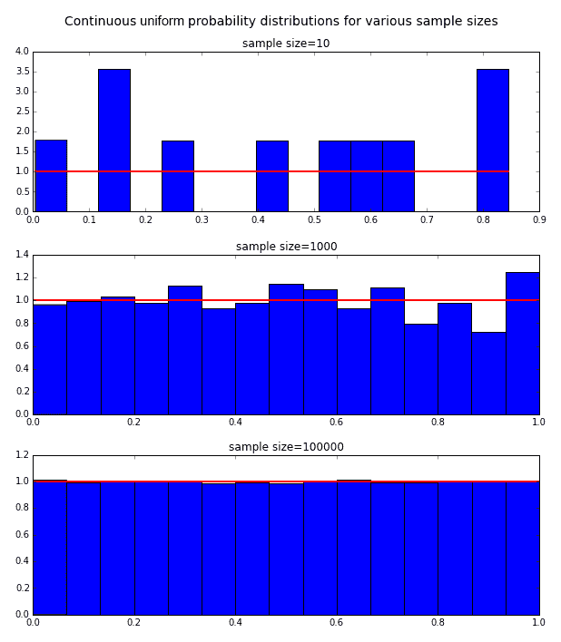
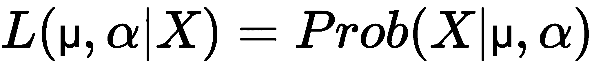

# 第十二章：贝叶斯统计与最大似然估计简述

本章将简要介绍一种替代性的统计推断方法，称为**贝叶斯统计**。这并不是一本完整的入门书籍，而是作为贝叶斯方法的简介。我们还将探讨相关的 Python 库，并学习如何使用`pandas`和`matplotlib`来辅助数据分析。以下是将要讨论的各种主题：

+   贝叶斯统计简介

+   贝叶斯统计的数学框架

+   概率分布

+   贝叶斯统计与频率统计

+   PyMC 和蒙特卡洛模拟简介

+   贝叶斯分析示例 – 转折点检测

# 贝叶斯统计简介

贝叶斯统计学的领域建立在 18 世纪统计学家、哲学家和长老会牧师**托马斯·贝叶斯**的工作基础上。他著名的贝叶斯定理，构成了贝叶斯统计学的理论基础，并在 1763 年死后发表，作为*逆向概率*问题的解决方案。更多详细信息请参见[`en.wikipedia.org/wiki/Thomas_Bayes`](http://en.wikipedia.org/wiki/Thomas_Bayes)。

逆向概率问题在 18 世纪初非常流行，通常以以下形式提出。

假设你和朋友玩一个游戏。袋子 1 里有 10 个绿色球和 7 个红色球，袋子 2 里有 4 个绿色球和 7 个红色球。你的朋友抛硬币（没有告诉你结果），随机从一个袋子里抽出一个球，并展示给你。球是红色的。那么，球是从袋子 1 里抽出来的概率是多少？

这些问题被称为逆向概率问题，因为我们试图根据随后的结果（球是红色的）来估计一个已经发生的事件的概率（球是从哪个袋子里抽出来的）：


贝叶斯球示意图

让我们快速说明如何解决之前提到的逆向概率问题。我们想计算在知道球是红色的情况下，球是从袋子 1 里抽出来的概率。这可以表示为*P(袋子 1 | 红球)*。

让我们从计算选择红球的概率开始。这个概率可以通过按照前述图中的两条红色路径来计算。因此，我们有以下结果：


现在，选择袋子 1 中的红球的概率只通过走上面这条路径来展示，计算方法如下：


从袋子 2 中选择红球的概率计算如下：


注意，这个概率也可以写成如下形式：


我们可以看到，*P(袋子 1) = 1/2*，树的最后一个分支仅在球首先在袋子 1 中并且是红球时才会被遍历。因此，我们将得到以下结果：


# 贝叶斯统计的数学框架

贝叶斯方法是一种替代的统计推断方法。我们将首先介绍贝叶斯定理，这是所有贝叶斯推断的基本方程。

在我们开始之前，需要做一些关于概率的定义：

+   ***A***，***B***：这些是可以以某种概率发生的事件。

+   ***P*(*A*)** 和 ***P*(*B*)**：这是某一特定事件发生的概率。

+   ***P*(*A*|*B*)**：这是在给定 B 发生的情况下，A 发生的概率。这称为**条件概率**。

+   ***P*(*AB*) = *P*(*A* 和 *B*)**：这是 A 和 B 同时发生的概率。

我们从以下基本假设开始：

*P(AB) = P(B) * P(A|B)*

上述方程显示了*P*(*AB*)的联合概率与条件概率*P*(*A*|*B*)以及所谓的边际概率*P*(*B*)之间的关系。如果我们重写方程，就得到了条件概率的如下表达式：

*P(A|B) = P(AB)/P(B)*

这在某种程度上是直观的——给定 B 的情况下，*A*的概率是通过将*A*和*B*同时发生的概率除以 B 发生的概率得到的。其思想是，已知 B 发生，因此我们除以其概率。有关该方程更严格的处理，可以参考[`bit.ly/1bCYXRd`](http://bit.ly/1bCYXRd)，标题为*概率：联合、边际和条件概率*。

类似地，由于对称性，我们有*P(AB) = P(BA) = P(A) * P(B|A*)。因此，我们有*P(A) * P(B|A) = P(B) * P(A|B)*。通过在两边同时除以*P(B)*并假设*P(B) != 0*，我们得到如下结果：


上述公式被称为**贝叶斯定理**，它是所有贝叶斯统计推断的基石。为了将贝叶斯定理与推理统计联系起来，我们将该方程改写为所谓的**历时性** **解释**，如下所示：


这里，***H***代表假设，***D***代表已经发生的事件，我们在统计研究中使用它，也称为数据。

表达式 **(*H*)** 是我们在观察数据之前对假设的概率。这被称为 **先验概率**。贝叶斯统计学家常常将先验概率作为一个优势来宣传，因为先前结果的先验知识可以作为当前模型的输入，从而提高准确性。有关更多信息，请参考 [`www.bayesian-inference.com/advantagesbayesian`](http://www.bayesian-inference.com/advantagesbayesian)。

***P*(*D*)** 是无论假设如何，观察到的数据的概率。这被称为 **归一化常数**。归一化常数并不总是需要计算，特别是在许多流行的算法中，如 **马尔科夫链蒙特卡洛**（**MCMC**），我们将在本章稍后讨论。

***P*(*H*|*D*)** 是给定我们观察到的数据后，假设成立的概率。这被称为 **后验**。

***P*(*D*|*H*)** 是考虑我们的假设后，获得数据的概率。这被称为 **似然性**。

因此，贝叶斯统计就是应用贝叶斯定理来解决推理统计问题，***H*** 代表我们的假设，***D*** 代表数据。

贝叶斯统计模型是以参数为基础的，这些参数的不确定性通过概率分布来表示。这与频率主义方法不同，后者将值视为确定性的。另一种表示方式如下：


这里，***Θ*** 代表我们的未知数据，***x*** 代表我们的观察数据。

在贝叶斯统计中，我们对先验数据做出假设，并利用似然性通过贝叶斯定理更新后验概率。作为说明，下面是一个经典问题，也被称为 **urn 问题**：

+   两个 urn 中包含有色球

+   urn 1 包含 50 颗红球和 50 颗蓝球

+   urn 2 包含 30 颗红球和 70 颗蓝球

+   从两个 urn 中随机选择一个（50% 的概率），然后从其中一个 urn 中随机抽取一颗球

如果抽到一颗红球，那么它来自 urn 1 的概率是多少？我们想要的是 *P(H|D)* —— 即 *P(球来自 urn 1 | 抽到红球)*。

这里，*H* 表示球是从 urn 1 中抽出的，*D* 表示抽到的球是红色的：

**

我们知道 *P(H|D) = P(H) * P(D|H)/P(D), P(D|H) = 0.5, P(D) = (50 + 30)/(100 + 100) = 0.4*。这也可以表述为：


因此，我们得出结论 *P(H|D) = 0.5 * 0.5/0.4 = 0.25/0.4 = 0.625*。

# 贝叶斯理论和赔率

贝叶斯定理有时可以通过使用一种称为*赔率*的替代概率公式来以更自然和方便的形式表示。赔率通常以比率的形式表示，并且被广泛使用。马匹赢得比赛的 3 比 1 赔率（通常写作 3:1）表示马匹有 75%的概率会获胜。

给定一个概率*p*，赔率可以计算为 odds = *p:(1 - p)*，当*p=0.75*时，结果为 0.75:0.25，即 3:1。

使用赔率，我们可以将贝叶斯定理重写如下：


# 贝叶斯统计的应用

贝叶斯统计可以应用于我们在经典统计学中遇到的许多问题，如下所示：

+   参数估计

+   预测

+   假设检验

+   线性回归

学习贝叶斯统计学有许多令人信服的理由，比如使用先验信息来更好地优化当前模型。贝叶斯方法基于概率分布而非点估计，因此能够提供更现实的预测。贝叶斯推断基于现有数据对假设进行推理——*P(假设|数据)*。而频率主义方法则尝试根据假设拟合数据。可以说，贝叶斯方法更具逻辑性和实证性，因为它试图基于事实而非假设来建立信念。有关更多信息，请参见[`www.bayesian-inference.com/advantagesbayesian`](http://www.bayesian-inference.com/advantagesbayesian)。

# 概率分布

在本节中，我们将简要介绍各种概率分布的特性。许多这些分布用于贝叶斯分析，因此在我们继续之前，需要简要概述它们。我们还将演示如何使用`matplotlib`生成和显示这些分布。为了避免在每个代码片段中重复`import`语句，我们将在以下命令中展示一组标准的 Python 代码导入，在任何后续代码片段中都需要先运行这些导入。每个会话只需运行一次这些导入。导入语句如下：

```py
import pandas as pd
import numpy as np
from matplotlib import pyplot as plt
from matplotlib import colors
import matplotlib.pyplot as plt
import matplotlib
%matplotlib inline

```

# 拟合分布

在贝叶斯分析中，我们必须进行的一个步骤是将我们的数据拟合到一个概率分布中。选择正确的分布有时需要一些技巧，通常需要统计知识和经验，但我们可以遵循一些指导原则来帮助我们。以下是这些指导原则：

+   确定数据是离散的还是连续的

+   检查数据的偏斜/对称性，如果有偏斜，确定其方向

+   确定是否存在上下限

+   确定在分布中观察到极端值的可能性

统计试验是一个可重复的实验，具有一组已定义的结果，这些结果组成了样本空间。伯努利试验是一个“是/否”实验，其中随机*X*变量在“是”的情况下赋值为 1，在“否”的情况下赋值为 0。抛硬币并查看是否正面朝上的实验就是一个伯努利试验的例子。

概率分布有两种类型：离散分布和连续分布。在接下来的部分中，我们将讨论这两类分布的区别，并了解主要的分布。

# 离散概率分布

在这种情况下，变量只能取特定的离散值，如整数。一个离散随机变量的例子是，当我们抛掷硬币五次时获得的正面次数：可能的值为{0,1,2,3,4,5}——例如，不能获得 3.82 次正面。随机变量可以取的值的范围由被称为**概率质量函数**（**PMF**）的函数来指定。

# 离散均匀分布

离散均匀分布是一种分布，用于模拟具有有限可能结果的事件，其中每个结果的出现概率相等。对于 *n*个结果，每个结果的发生概率为*1/n*。

这方面的一个例子是投掷一个公平的骰子。六个结果中任何一个的概率都是*1**/6*。概率质量函数（PMF）由*1/n*给出，期望值和方差分别由 *(max + min)/2* 和 *(n²-1)/12* 给出：

```py
from matplotlib import pyplot as plt
import matplotlib.pyplot as plt
X=range(0,11)
Y=[1/6.0 if x in range(1,7) else 0.0 for x in X]
plt.plot(X,Y,'go-', linewidth=0, drawstyle='steps-pre', 
    label="p(x)=1/6")
plt.legend(loc="upper left")
plt.vlines(range(1,7),0,max(Y), linestyle='-')
plt.xlabel('x')
plt.ylabel('p(x)')
plt.ylim(0,0.5)
plt.xlim(0,10)
plt.title('Discrete uniform probability distribution with 
          p=1/6')
plt.show()
```

以下是输出：


离散均匀分布

# 伯努利分布

伯努利分布用于衡量试验中的成功概率，例如，抛硬币正面或反面朝上的概率。它可以通过一个随机*X*变量来表示，如果硬币是正面朝上，则取值为 1；如果是反面朝上，则取值为 0。正面朝上的概率用*p*表示，反面朝上的概率用*q=1-p*表示。

这可以通过以下概率质量函数（PMF）表示：


期望值和方差由以下公式给出：


如需更多信息，请访问 [`en.wikipedia.org/wiki/Bernoulli_distribution`](http://en.wikipedia.org/wiki/Bernoulli_distribution)。

我们现在将使用`matplotlib`和`scipy.stats`绘制伯努利分布，如下所示：

```py
In [20]:import matplotlib
        from scipy.stats import bernoulli
        a = np.arange(2)

        colors = matplotlib.rcParams['axes.color_cycle']
        plt.figure(figsize=(12,8))
        for i, p in enumerate([0.0, 0.2, 0.5, 0.75, 1.0]):
             ax = plt.subplot(1, 5, i+1)
             plt.bar(a, bernoulli.pmf(a, p), label=p, color=colors[i], alpha=0.5)
             ax.xaxis.set_ticks(a)

            plt.legend(loc=0)
                if i == 0:
                     plt.ylabel("PDF at $k$")

            plt.suptitle("Bernoulli probability for various values of $p$")
```

以下是输出：


伯努利分布输出

# 二项分布

二项分布用于表示在*n*次独立伯努利试验中成功的次数，表达式如下：

*Y = X[1] + X[2] + ..**. + X[n]*

使用抛硬币的例子，这个分布描述了在*n*次试验中获得*X*个正面的概率。对于 100 次抛掷，二项分布模型描述了获得 0 个正面（极不可能）到 50 个正面（最有可能）再到 100 个正面（也极不可能）的几率。这导致当概率完全均等时，二项分布是对称的，而当概率不均等时，则呈偏斜分布。PMF 由以下表达式给出：


期望和方差分别由以下表达式给出：


这通过以下代码块显示：

```py
     from scipy.stats import binom
       clrs = ['blue','green','red','cyan','magenta']     plt.figure(figsize=(12,6))
      k = np.arange(0, 22)
      for p, color in zip([0.001, 0.1, 0.3, 0.6, 0.999], clrs):
           rv = binom(20, p)
           plt.plot(k, rv.pmf(k), lw=2, color=color, label="$p$=" + str(round(p,1)))

            plt.legend()
      plt.title("Binomial distribution PMF")
      plt.tight_layout()
      plt.ylabel("PDF at $k$")
      plt.xlabel("$k$")

```

以下是输出结果：


二项分布

# 泊松分布

泊松分布模型描述了在给定时间间隔内事件发生的概率，假设这些事件以已知的平均速率发生，并且每次事件发生与上次事件发生后的时间间隔无关。

一个可以通过泊松分布建模的具体过程的例子是，如果一个人每天平均收到 23 封电子邮件。假设这些邮件的到达时间是相互独立的，那么一个人每天收到的邮件总数就可以用泊松分布来建模。

另一个例子可以是每小时在特定车站停靠的火车数量。泊松分布的概率质量函数（PMF）由以下表达式给出：


其中，**λ**是速率参数，表示单位时间内期望的事件/到达次数，而***k***是表示事件/到达次数的随机变量。

期望和方差分别由以下表达式给出：


更多信息请参考[`en.wikipedia.org/wiki/Poisson_process`](http://en.wikipedia.org/wiki/Poisson_process)。

使用`matplotlib`绘制不同值的 PMF，如下所示：

```py
    In [11]: %matplotlib inline
       import numpy as np
       import matplotlib
       import matplotlib.pyplot as plt
       from scipy.stats import poisson
       colors = matplotlib.rcParams['axes.color_cycle']
       k=np.arange(15)
       plt.figure(figsize=(12,8))
       for i, lambda_ in enumerate([1,2,4,6]):
            plt.plot(k, poisson.pmf(k, lambda_), '-o',  
            label="$\lambda$=" + str(lambda_), color=colors[i])
            plt.legend()
       plt.title("Possion distribution PMF for various $\lambda$")
       plt.ylabel("PMF at $k$")
       plt.xlabel("$k$")
       plt.show()

```

以下是输出结果：


泊松分布

# 几何分布

几何分布用于独立的伯努利试验，并衡量获得一次成功所需的试验次数（*X*）。它也可以表示第一次成功之前的失败次数（*Y = X-1*）。

PMF 表示为以下形式：


上述表达式是有道理的，因为*f(k) = P(X =k)*，如果成功需要进行*k*次试验（*p*），那么这意味着我们必须有*k-1*次失败，失败的概率是*(1-p)*。

期望和方差分别给出如下：


以下命令清晰地解释了前面的公式：

```py
    In [12]: from scipy.stats import geom
          p_vals=[0.01,0.2,0.5,0.8,0.9]
       x = np.arange(geom.ppf(0.01,p),geom.ppf(0.99,p))
            colors = matplotlib.rcParams['axes.color_cycle']
            for p,color in zip(p_vals,colors):
              x = np.arange(geom.ppf(0.01,p),geom.ppf(0.99,p))
                 plt.plot(x,geom.pmf(x,p),'-o',ms=8,label='$p$=' + str(p))
              plt.legend(loc='best')
            plt.ylim(-0.5,1.5)
            plt.xlim(0,7.5)
            plt.ylabel("Pmf at $k$")
            plt.xlabel("$k$")
            plt.title("Geometric distribution PMF")
```

以下是输出结果：


几何分布

# 负二项分布

负二项分布用于独立的伯努利试验，衡量在发生指定次数的成功（*r*）之前所需的试验次数（*X=k*）。一个例子是，投掷硬币直到得到五次正面所需的次数。其概率质量函数（PMF）如下所示：


期望值和方差分别由以下公式给出：


我们可以看到，负二项分布是几何分布的推广，几何分布是负二项分布的一个特例，其中*r=1*。

代码和图表如下所示：

```py
    In [189]: from scipy.stats import nbinom
           from matplotlib import colors
        clrs = matplotlib.rcParams['axes.color_cycle']
        x = np.arange(0,11)
        n_vals = [0.1,1,3,6]
        p=0.5
              for n, clr in zip(n_vals, clrs):
                  rv = nbinom(n,p)
                  plt.plot(x,rv.pmf(x), label="$n$=" + str(n), color=clr)
                  plt.legend()
              plt.title("Negative Binomial Distribution PMF")
              plt.ylabel("PMF at $x$")
              plt.xlabel("$x$")
```

以下是输出结果：


负二项分布

# 连续概率分布

在连续概率分布中，变量可以取任何实数值。它不像离散概率分布那样被限制为有限的取值集合；例如，健康新生儿的平均体重大约在 6 到 9 磅之间（例如，其体重可以是 7.3 磅）。连续概率分布的特点是**概率密度函数**（**PDF**）。

随机变量可能取的所有概率之和为 1。因此，概率密度函数图形下的面积加起来为 1。

# 连续均匀分布

均匀分布模型表示一个随机变量*X*，其值可以在区间*[a, b]*内均匀分布。

概率密度函数由以下公式给出：，当*a ≤ x ≤ b*时为非零值，否则为零。

期望值和方差分别由以下公式给出：


以下代码生成并绘制了不同样本大小的连续均匀概率分布：

```py
    In [11]: np.random.seed(100)  # seed the random number generator
                                  # so plots are reproducible
             subplots = [111,211,311]
             ctr = 0 
             fig, ax = plt.subplots(len(subplots), figsize=(10,12))
             nsteps=10
             for i in range(0,3):
               cud = np.random.uniform(0,1,nsteps) # generate distrib
               count, bins, ignored = ax[ctr].hist(cud,15,normed=True)
               ax[ctr].plot(bins,np.ones_like(bins),linewidth=2, color='r')
               ax[ctr].set_title('sample size=%s' % nsteps)
               ctr += 1
               nsteps *= 100
             fig.subplots_adjust(hspace=0.4)
             plt.suptitle("Continuous Uniform probability distributions for various sample sizes" , fontsize=14)

```

以下是输出结果：



连续均匀分布

# 指数分布

指数分布描述了在泊松过程中两个事件之间的等待时间。泊松过程是一个符合泊松分布的过程，事件以已知的平均速率不可预测地发生。指数分布可以视为几何分布的*连续极限*，并且也是马尔科夫过程（无记忆过程）。

一个无记忆随机变量具有以下特性：它的未来状态仅依赖于当前时刻的相关信息，而不依赖于更久远过去的信息。对马尔科夫/无记忆随机变量建模的一个例子是基于随机游走理论对短期股价行为的建模。这引出了金融学中的有效市场假说。更多信息，请参阅[`en.wikipedia.org/wiki/Random_walk_hypothesis`](http://en.wikipedia.org/wiki/Random_walk_hypothesis)。

指数分布的概率密度函数（PDF）为 *f(x) = λe^(-λx)*。期望值和方差分别由以下公式给出：

*E(X) = 1/λ**Var(X) = 1/λ²*

参考资料，请参阅[`en.wikipedia.org/wiki/Exponential_distribution`](http://en.wikipedia.org/wiki/Exponential_distribution)。

分布图和代码如下所示：

```py
    In [15]: import scipy.stats
             clrs = colors.cnames
               x = np.linspace(0,4, 100)
            expo = scipy.stats.expon
            lambda_ = [0.5, 1, 2, 5]
           plt.figure(figsize=(12,4))
           for l,c in zip(lambda_,clrs):
               plt.plot(x, expo.pdf(x, scale=1./l), lw=2,
                          color=c, label = "$\lambda = %.1f$"%l)
                 plt.legend()
                 plt.ylabel("PDF at $x$")
          plt.xlabel("$x$")
          plt.title("Pdf of an Exponential random variable for various $\lambda$");

```

以下是输出结果：


指数分布

# 正态分布

在统计学中，最重要的分布可能就是正态/高斯分布。它模拟了围绕一个中心值的概率分布，且没有左右偏差。有许多现象符合正态分布，例如以下这些：

+   婴儿的出生体重

+   测量误差

+   血压

+   测试分数

正态分布的重要性通过中心极限定理得到了强调，该定理指出，从同一分布中独立抽取的许多随机变量的均值大致呈正态分布，无论原始分布的形态如何。其期望值和方差分别如下：

*E(X) = μ**Var(X) = σ²*

正态分布的概率密度函数（PDF）由以下公式给出：


以下代码和图解释了这个公式：

```py
    In [54]: import matplotlib
        from scipy.stats import norm
          X = 2.5
       dx = 0.1
       R = np.arange(-X,X+dx,dx)

       L = list()
       sdL = (0.5,1,2,3)
       for sd in sdL:
            f = norm.pdf
            L.append([f(x,loc=0,scale=sd) for x in R])

       colors = matplotlib.rcParams['axes.color_cycle']
       for sd,c,P in zip(sdL,colors,L):
            plt.plot(R,P,zorder=1,lw=1.5,color=c,
                    label="$\sigma$=" + str(sd))
            plt.legend()

       ax = plt.axes()
       ax.set_xlim(-2.1,2.1)
       ax.set_ylim(0,1.0)
       plt.title("Normal distribution Pdf")
       plt.ylabel("PDF at $\mu$=0, $\sigma$")

```

以下是输出结果：


正态分布

用于绘制分布的 Python 代码参考可以在 [`bit.ly/1E17nYx`](http://bit.ly/1E17nYx) 找到。

正态分布也可以看作是二项分布的连续极限，以及其他分布，如 。我们可以在以下代码和图中看到这一点：

```py
    In [18]:from scipy.stats import binom
         from matplotlib import colors
      cols = colors.cnames
      n_values = [1, 5,10, 30, 100]

      subplots = [111+100*x for x in range(0,len(n_values))]
      ctr = 0 
      fig, ax = plt.subplots(len(subplots), figsize=(6,12))
      k = np.arange(0, 200)
      p=0.5

      for n, color in zip(n_values, cols):
              k=np.arange(0,n+1)
              rv = binom(n, p)
              ax[ctr].plot(k, rv.pmf(k), lw=2, color=color)
              ax[ctr].set_title("$n$=" + str(n))
              ctr += 1

      fig.subplots_adjust(hspace=0.5)
      plt.suptitle("Binomial distribution PMF (p=0.5) for various values of n", fontsize=14)

```

以下是输出结果：


随着 *n* 增加，二项分布趋近于正态分布。事实上，这在前面的 *n>=30* 的图中可以清楚地看到。

# 贝叶斯统计与频率派统计

在当今的统计学中，对于如何解释数据并进行统计推断，有两种学派。迄今为止，经典且占主导地位的方法是所谓的频率学派方法（参见第七章，*统计学概览 – 经典方法*）。我们在这一章中探讨的是贝叶斯方法。

# 什么是概率？

贝叶斯学派与频率学派世界观之间争论的核心问题是如何定义概率。

在频率学派的世界观中，概率是通过重复事件的频率推导出来的概念——例如，我们将公平硬币投掷时出现正面的概率定义为一半。这是因为当我们反复投掷公平硬币时，正面朝上的次数与总投掷次数的比值会随着投掷次数的增加接近 0.5。

贝叶斯的世界观不同，概率的概念是与一个人对事件发生的信念程度相关。因此，对于贝叶斯统计学家来说，相信公平骰子出现五点的概率是*1/6*，这与我们对该事件发生的概率信念有关。

# 模型如何定义

从模型定义的角度来看，频率学派通过反复实验来分析数据和计算指标如何变化，同时保持模型参数不变。贝叶斯学派则利用固定的实验数据，但在模型参数上变化他们的信念程度。具体解释如下：

+   **频率学派**：如果模型是固定的，数据是变化的。

+   **贝叶斯学派**：如果数据是固定的，模型是变化的。

频率学派的方法是使用最大似然法来估计模型参数。它涉及从一组独立同分布的观测数据中生成数据，并将观察到的数据拟合到模型中。最能拟合数据的模型参数值就是**最大似然估计器**（**MLE**），它有时可以是观测数据的一个函数。

贝叶斯主义从概率框架的角度以不同的方式处理问题。它使用概率分布来描述值的不确定性。贝叶斯实践者通过观察数据来估计概率。为了计算这些概率，他们使用一个单一的估计器，即贝叶斯公式。这产生了一个分布，而不仅仅是像频率学派方法那样的点估计。

# 置信区间（频率学派）与可信区间（贝叶斯学派）

让我们比较一下 95% 置信区间（频率学派使用的术语）和 95% 可信区间（贝叶斯实践者使用的术语）的含义。

在频率主义框架中，95%的置信区间意味着，如果你将实验重复无限次，每次生成区间，95%的这些区间将包含我们试图估计的参数，通常称为θ。在这种情况下，区间是随机变量，而不是参数估计值θ，后者在频率主义视角中是固定的。

在贝叶斯可信区间的情况下，我们有一个与频率主义置信区间的传统解释更一致的解释。因此，我们可以得出结论，*Pr(a(Y) < θ < b(Y)|θ) = 0.95*。在这种情况下，我们可以合理地得出结论，θ有 95%的概率位于该区间内。

欲了解更多信息，请参考*《频率主义与贝叶斯主义：有什么大不了的？》*（Jake VanderPlas，**SciPy，2014**）在[`www.youtube.com/watch?v=KhAUfqhLakw`](https://www.youtube.com/watch?v=KhAUfqhLakw)。

# 进行贝叶斯统计分析

进行贝叶斯统计分析包括以下步骤：

1.  **指定概率模型**：在这一步中，我们使用概率分布完全描述模型。基于我们所取样本的分布，我们尝试拟合一个模型并为未知参数分配概率。

1.  **计算后验分布**：后验分布是我们基于观测数据计算出的分布。在这种情况下，我们将直接应用贝叶斯公式。它将作为我们在前一步中指定的概率模型的函数进行指定。

1.  **检查我们的模型**：这是一个必要的步骤，我们在做出推断之前，检查我们的模型及其输出。贝叶斯推断方法使用概率分布为可能的结果分配概率。

# 似然函数的蒙特卡洛估计与 PyMC

贝叶斯统计不仅仅是另一种方法。它是一个完全不同的统计学实践范式。它使用概率模型来进行推断，基于收集到的数据。这可以通过一个基本的表达式来表示，即*P*(*H*|*D*)。

在这里，*H*是我们的假设，即我们试图证明的内容，*D*是我们的数据或观察结果。

为了提醒我们之前的讨论，贝叶斯定理的历时形式如下：


在这里，*P(H)*是无条件的先验概率，表示我们在进行实验之前所知道的内容。*P(D|H)*是我们的似然函数，即在假设为真时，获得我们观察到的数据的概率。

*P(D)*是数据的概率，也称为归一化常数。它可以通过对*H*上的分子进行积分得到。

似然函数是我们贝叶斯计算中最重要的部分，它封装了关于数据中未知信息的所有信息。它与反向概率质量函数有一些相似之处。

反对采用贝叶斯方法的一个论点是先验的计算可能具有主观性。支持这种方法的有许多论点，其中之一是可以加入外部先验信息，如前所述。

似然值表示一个未知的积分，在简单的情况下可以通过解析积分获得。

**蒙特卡洛** (**MC**) 积分在涉及更复杂的高维积分的使用案例中是必需的，并且可以用于计算似然函数。

MC 积分可以通过多种抽样方法计算，例如均匀抽样、分层抽样和重要性抽样。在蒙特卡洛积分中，我们可以如下近似积分：


以下是有限和：


这里，*x* 是来自 *g* 的样本向量。可以通过大数法则并确保仿真误差较小来证明这个估计是有效的。

在 Python 中进行贝叶斯分析时，我们需要一个模块来帮助我们使用蒙特卡洛方法计算似然函数。`PyMC` 库满足了这个需求。它提供了一种常用的蒙特卡洛方法，称为 MCMC。我们不会进一步探讨 MCMC 的技术细节，但有兴趣的读者可以通过以下来源了解有关 `PyMC` 中 MCMC 实现的更多信息：

+   *贝叶斯估计中的蒙特卡洛积分*：[`bit.ly/1bMALeu`](http://bit.ly/1bMALeu)

+   *马尔科夫链蒙特卡洛最大似然*：[`bit.ly/1KBP8hH`](http://bit.ly/1KBP8hH)

+   *使用 Python 进行贝叶斯统计分析–第一部分*，*SciPy 2014*，*Chris Fonnesbeck*：[`www.youtube.com/watch?v=vOBB_ycQ0RA`](http://www.youtube.com/watch?v=vOBB_ycQ0RA)

MCMC 并非万能的灵丹妙药；这种方法存在一些缺点，其中之一就是算法收敛较慢。

# 贝叶斯分析示例 – 转折点检测

在这里，我们将尝试使用贝叶斯推理并对一个有趣的数据集进行建模。该数据集由作者的**Facebook** (**FB**) 发帖历史构成。我们已经清洗了 FB 历史数据并将日期保存在 `fb_post_dates.txt` 文件中。文件中的数据如下所示：

```py
    head -2 ../fb_post_dates.txt 
    Tuesday, September 30, 2014 | 2:43am EDT
    Tuesday, September 30, 2014 | 2:22am EDT
```

因此，我们看到一个日期时间序列，表示作者在 Facebook 上发帖的日期和时间。首先，我们将文件读取到 DataFrame 中，并将时间戳拆分成 `Date` 和 `Time` 两列：

```py
    In [91]: filePath="./data/fb_post_dates.txt"
             fbdata_df=pd.read_csv(filePath,  sep='|', parse_dates=[0], header=None,names=['Date','Time'])
```

接下来，我们按如下方式检查数据：

```py
    In [92]: fbdata_df.head()  #inspect the data
   Out[92]:   Date       Time
    0  2014-09-30   2:43am EDT
    1  2014-09-30   2:22am EDT
    2  2014-09-30   2:06am EDT
    3  2014-09-30   1:07am EDT
    4  2014-09-28   9:16pm EDT 
```

现在，我们按 `Date` 索引数据，创建一个 `DatetimeIndex`，以便我们可以对其进行重采样并按月计数，如下所示：

```py
    In [115]: fbdata_df_ind=fbdata_df.set_index('Date')
              fbdata_df_ind.head(5)
    Out[115]:                      
             Date        Time
             2014-09-30  2:43am EDT
             2014-09-30  2:22am EDT
             2014-09-30  2:06am EDT
             2014-09-30  1:07am EDT
             2014-09-28  9:16pm EDT  
```

然后，我们按如下方式显示关于索引的信息：

```py
    In [116]: fbdata_df_ind.index
    Out[116]: <class 'pandas.tseries.index.DatetimeIndex'>
              [2014-09-30, ..., 2007-04-16]
              Length: 7713, Freq: None, Timezone: None 
```

接下来，我们使用重采样来按月获取帖子数量：

```py
    In [99]: fb_mth_count_=fbdata_df_ind.resample('M', how='count')
             fb_mth_count_.rename(columns={'Time':'Count'},
                                  inplace=True)   # Rename 
             fb_mth_count_.head()
 Out[99]:            Count
            Date
            2007-04-30  1
            2007-05-31  0
            2007-06-30  5
            2007-07-31  50
            2007-08-31  24  
```

`Date` 格式显示的是每月的最后一天。现在，我们创建一个从 2007 年到 2015 年的 FB 帖子数量散点图，并使点的大小与 `matplotlib` 中的值成正比：

```py
    In [108]: %matplotlib inline
              import datetime as dt
    #Obtain the count data from the DataFrame as a dictionary
              year_month_count=fb_bymth_count.to_dict()['Count'] 
              size=len(year_month_count.keys())
    #get dates as list of strings
              xdates=[dt.datetime.strptime(str(yyyymm),'%Y%m') 
                      for yyyymm in year_month_count.keys()] 
              counts=year_month_count.values()
              plt.scatter(xdates,counts,s=counts)
             plt.xlabel('Year')
              plt.ylabel('Number of Facebook posts')
              plt.show() 

```

以下是输出结果：


我们希望调查的问题是，是否在某个时刻行为发生了变化。具体来说，我们想要识别是否存在一个特定时期，FB 帖子的平均数量发生了变化。这通常被称为时间序列中的切换点或变化点。

我们可以利用泊松分布来建模这个。你可能记得，泊松分布可以用来建模时间序列的计数数据。（更多信息请参考 [`bit.ly/1JniIqy`](http://bit.ly/1JniIqy)。）

如果我们用 *C[i]* 表示每月的 FB 帖子数，我们可以将我们的模型表示如下：


*r[i]* 参数是泊松分布的速率参数，但我们不知道它的值。如果我们查看 FB 时间序列的散点图，可以看到 2010 年中到晚些时候，帖子数量出现了跳跃，可能与 2010 年南非世界杯的开始时间重合，而作者也参加了这场世界杯。

*s* 参数是切换点，即速率参数发生变化的时刻，而 *e* 和 *l* 分别是切换点前后 *r[i]* 参数的值。可以表示如下：


请注意，这里指定的变量—*C, s, e, r* 和 *l*—都是贝叶斯随机变量。对于表示某人对其值的信念的贝叶斯随机变量，我们需要使用概率分布来建模它们。我们希望推断 *e* 和 *l* 的值，这些值是未知的。在 `PyMC` 中，我们可以使用随机和确定性类来表示随机变量。我们注意到，指数分布表示的是泊松事件之间的时间。因此，对于 *e* 和 *l*，我们选择使用指数分布来建模它们，因为它们可以是任何正数：


对于 *s*，我们选择使用均匀分布来建模它，这反映了我们认为切换点可能在整个时间段内的任何一天发生的概率是相等的。这意味着我们有如下假设：


在这里，*t[0], t[f]*分别对应年份的下限和上限，*i*。现在让我们使用`PyMC`来表示我们之前开发的模型。我们将使用`PyMC`来看看是否能在 FB 发布数据中检测到转折点。除了散点图，我们还可以在条形图中显示数据。为此，我们首先需要获取按月份排序的 FB 发布计数列表：

```py
    In [69]: fb_activity_data = [year_month_count[k] for k in 
                                 sorted(year_month_count.keys())]
            fb_activity_data[:5]

 Out[70]: [1, 0, 5, 50, 24]

    In [71]: fb_post_count=len(fb_activity_data)
```

我们使用`matplotlib`来渲染条形图：

```py
    In [72]: from IPython.core.pylabtools import figsize
             import matplotlib.pyplot as plt
               figsize(8, 5)
            plt.bar(np.arange(fb_post_count),
             fb_activity_data, color="#49a178")
            plt.xlabel("Time (months)")
            plt.ylabel("Number of FB posts")
            plt.title("Monthly Facebook posts over time")
            plt.xlim(0,fb_post_count);  
```

以下是输出结果：


从前面的条形图来看，我们能否得出结论认为 FB 频率发布行为在一段时间内发生了变化？我们可以在已开发的模型上使用`PyMC`来帮助我们找出变化，方法如下：

```py
    In [88]: # Define data and stochastics
            import pymc as pm
            switchpoint = pm.DiscreteUniform('switchpoint',
                                              lower=0,
                                        upper=len(fb_activity_data)-1,
                                           doc='Switchpoint[month]')
            avg = np.mean(fb_activity_data)
            early_mean = pm.Exponential('early_mean', beta=1./avg)
            late_mean = pm.Exponential('late_mean', beta=1./avg)
            late_mean
 Out[88]:<pymc.distributions.Exponential 'late_mean' at 0x10ee56d50> 
```

在这里，我们为速率参数*r*定义了一个方法，并使用之前讨论的泊松分布来建模计数数据：

```py
    In [89]: @pm.deterministic(plot=False)
             def rate(s=switchpoint, e=early_mean, l=late_mean):
                 ''' Concatenate Poisson means '''
                 out = np.zeros(len(fb_activity_data))
                 out[:s] = e
                 out[s:] = l
             return out

             fb_activity = pm.Poisson('fb_activity', mu=rate,   
                           value=fb_activity_data, observed=True)
             fb_activity
Out[89]: <pymc.distributions.Poisson 'fb_activity' at 0x10ed1ee50>  
```

在前面的代码片段中，`@pm.deterministic`是一个装饰器，表示速率函数是确定性的，即其值完全由其他变量（在本例中为*e*、*s*和*l*）决定。该装饰器是必要的，它告诉`PyMC`将速率函数转换为确定性对象。如果我们不指定装饰器，将会发生错误。有关 Python 装饰器的更多信息，请参考[`bit.ly/1zj8U0o`](http://bit.ly/1zj8U0o)。

更多信息，请参考以下网页：

+   [`en.wikipedia.org/wiki/Poisson_process`](http://en.wikipedia.org/wiki/Poisson_process)

+   [`pymc-devs.github.io/pymc/tutorial.html`](http://pymc-devs.github.io/pymc/tutorial.html)

+   [`github.com/CamDavidsonPilon/Probabilistic-Programming-and-Bayesian-Methods-for-Hackers`](https://github.com/CamDavidsonPilon/Probabilistic-Programming-and-Bayesian-Methods-for-Hackers)

现在，我们将使用 FB 计数数据（`fb_activity`）和*e, s, l*（分别为`early_mean`、`late_mean`和`rate`）参数来创建模型。

接下来，使用`PyMC`，我们创建一个`MCMC`对象，使我们能够使用 MCMC 方法来拟合数据。然后，我们调用该`MCMC`对象上的 sample 函数进行拟合：

```py
    In [94]: fb_activity_model=pm.Model([fb_activity,early_mean,
                                         late_mean,rate])
    In [95]: from pymc import MCMC
               fbM=MCMC(fb_activity_model)
    In [96]: fbM.sample(iter=40000,burn=1000, thin=20)
               [-----------------100%-----------------] 40000 of 40000 
              complete in 11.0 sec

```

使用 MCMC 拟合模型涉及利用马尔可夫链蒙特卡洛方法生成后验的概率分布，*P(s,e,l | D)*。它使用蒙特卡洛过程反复模拟数据采样，并在算法似乎收敛到稳定状态时停止，收敛依据多个标准。这是一个马尔可夫过程，因为连续的样本仅依赖于前一个样本。有关马尔可夫链收敛的更多信息，请参考[`bit.ly/1IETkhC`](http://bit.ly/1IETkhC)。

生成的样本被称为**轨迹**。我们可以通过查看其轨迹的直方图来观察参数的边际后验分布的形态：

```py
    In [97]: from pylab import hist,show
               %matplotlib inline
            hist(fbM.trace('late_mean')[:])
    Out[97]: (array([  15.,   61.,  214.,  421.,  517.,  426.,  202.,
                       70.,   21.,    3.]),
              array([ 102.29451192,  103.25158404,  104.20865616,
                      105.16572829,  106.12280041,  107.07987253,
                      108.03694465,  108.99401677,  109.95108889,
                      110.90816101,  111.86523313]),
               <a list of 10 Patch objects>)
```

以下是输出结果：


接下来，我们计算早期的均值：

```py
    In [98]:plt.hist(fbM.trace('early_mean')[:]) Out[98]: (array([  20.,  105.,  330.,  489.,  470.,  314.,  147.,
                       60.,    3.,   12.]),
              array([ 49.19781192,  50.07760882,  50.95740571,
                      51.83720261,  52.71699951,  53.59679641,
                      54.47659331,  55.35639021,  56.2361871 ,
                      57.115984  ,  57.9957809 ]),
            <a list of 10 Patch objects>) 
```

以下是输出结果：


在这里，我们看到切换点在月份数上的表现：

```py
    In [99]: fbM.trace('switchpoint')[:] Out[99]: array([38, 38, 38, ..., 35, 35, 35])

    In [150]: plt.hist(fbM.trace('switchpoint')[:]) Out[150]: (array([ 1899.,     0.,     0.,     0.,     0.,     0.,
                       0., 0., 0.,    51.]),
               array([ 35\. ,  35.3,  35.6,  35.9,  36.2,  36.5,  36.8,
                       37.1,  37.4, 37.7,  38\. ]),
               <a list of 10 Patch objects>)

```

以下是输出结果：


切换点的月份数直方图

我们可以看到，切换点大致位于 35 到 38 个月之间。这里，我们使用`matplotlib`来展示*e*、*s*和*l*的边际后验分布，并将它们绘制在一张图中：

```py
    In [141]: early_mean_samples=fbM.trace('early_mean')[:]
              late_mean_samples=fbM.trace('late_mean')[:]
              switchpoint_samples=fbM.trace('switchpoint')[:]
    In [142]: from IPython.core.pylabtools import figsize
           figsize(12.5, 10)
        # histogram of the samples:
        fig = plt.figure()
        fig.subplots_adjust(bottom=-0.05)

        n_mths=len(fb_activity_data)
        ax = plt.subplot(311)
        ax.set_autoscaley_on(False)

         plt.hist(early_mean_samples, histtype='stepfilled',
                  bins=30, alpha=0.85, label="posterior of $e$",
                  color="turquoise", normed=True)
        plt.legend(loc="upper left")
        plt.title(r"""Posterior distributions of the variables
                   $e, l, s$""",fontsize=16)
        plt.xlim([40, 120])
         plt.ylim([0, 0.6])
        plt.xlabel("$e$ value",fontsize=14)

         ax = plt.subplot(312)
        ax.set_autoscaley_on(False)
        plt.hist(late_mean_samples, histtype='stepfilled',
                  bins=30, alpha=0.85, label="posterior of $l$",
                  color="purple", normed=True)
        plt.legend(loc="upper left")
        plt.xlim([40, 120])
         plt.ylim([0, 0.6])
        plt.xlabel("$l$ value",fontsize=14)
        plt.subplot(313)
        w = 1.0 / switchpoint_samples.shape[0] *
             np.ones_like(switchpoint_samples)
        plt.hist(switchpoint_samples, bins=range(0,n_mths), alpha=1,
                  label=r"posterior of $s$", color="green",
                  weights=w, rwidth=2.)
        plt.xlim([20, n_mths - 20])
        plt.xlabel(r"$s$ (in days)",fontsize=14)
        plt.ylabel("probability")
        plt.legend(loc="upper left")

         plt.show()

```

以下是输出结果：


边际后验分布

`PyMC`还具有绘图功能，因为它使用了`matplotlib`。在以下图表中，我们展示了时间序列图、**自相关图**（**acorr**）和为早期均值、晚期均值以及切换点所绘制的样本的直方图。直方图有助于可视化后验分布。自相关图显示了前一时期的值是否与当前时期的值有较强的关系：

```py
    In [100]: from pymc.Matplot import plot
           plot(fbM)
        Plotting late_mean
        Plotting switchpoint
        Plotting early_mean

```

以下是晚期均值图：


pymc_comprehensive_late_mean 的图表

在这里，我们展示了切换点图：


PyMC 综合切换点

在这里，我们展示了早期均值图：


PyMC 综合早期均值

从`PyMC`的输出结果中，我们可以得出结论，切换点大约在时间序列开始后的 35 到 38 个月之间。这个时间段大致对应于 2010 年 3 月到 7 月之间。作者可以证实，这是他使用 Facebook 的一个标志性年份，因为那年是南非举办 FIFA 世界杯决赛的年份，而他也亲自参加了。

# 最大似然估计

**最大似然估计**（**MLE**）是一种用于从现有样本数据中估计总体分布参数的方法。MLE 方法也可以被视为贝叶斯的替代方法。

概率分布给出了在给定分布参数（如均值、标准差和自由度）下观察到数据点的概率。

给定分布参数下数据点的概率表示为 Prob(*X*|µ,α) -------1。

MLE 处理的是逆问题。它用于在给定数据点的情况下，找到最可能的分布参数值。为此，定义了一个称为似然度的统计量。似然度被定义为在给定数据点的情况下观察到分布参数的概率。

给定数据点的分布参数的概率表示为 L(µ,α|X)----2。

方程 1 和 2 中的量是相同的概率，只是表述方式不同。因此，我们可以写出以下公式：



为了更好地理解这个概念，请看以下图表：


正态分布 MLE 估计示例，包含两个数据点

该图展示了三个具有不同均值和标准差的正态分布。两条竖直线分别表示值 V[1]=-2.5 和 V[2]=2.5。

假设我们表示数据点 V[1]=-2.5 属于红色分布（均值=0，标准差=1.5）的概率为*P*(red|*V*[1]=-2.5)。类似地，数据点 V[1]=-2.5 属于蓝色分布（均值=0，标准差=4）的概率为*P*(blue|*V*[1]=-2.5)。

现在，查看这里展示的图表，我们可以得出以下结论：


如果我们必须仅根据现有数据点做出决策，那么我们会决定*V*[1]=2.5 属于蓝色分布，因为*V*[1]*B*[1] > *V*[1]*R*[1] > *V*[1]*G*[1]，我们选择具有该数据点属于该分布最大概率的分布。

但是如果我们有一个或更多的数据点呢？对于这种情况，让我们向数据集中添加另一个数据点，称为*V*[2]。*V*[2]的单个概率如下：


由于现在有两个数据点，我们不能仅凭单个概率做出决策，而必须计算联合概率。如果我们假设一个数据点的发生事件与另一个数据点的发生事件是独立的，那么联合概率将等于单个概率。

假设给定两个数据点时，这两个点属于红色分布的联合概率表示为*P(red|V[1]=-2.5, V[2]=2.5)*。那么以下等式成立：


我们应该选择具有最大联合概率的分布。在这种情况下，蓝色的分布具有最高的联合概率，我们可以从图表中得出这一结论。

随着数据集中的点数增加，单凭观察前面的图表已经无法再有效地推断最大联合概率。我们需要求助于代数和微积分方法，找出能够最大化数据集属于某个分布的联合概率的分布参数。

如果我们假设单个数据点之间是独立的，那么在给定所有数据点的情况下观察分布参数的似然性或概率可以通过以下公式表示：


在最大似然估计（MLE）计算中，我们尝试找到能够最大化 *L*(µ,α|*X*[1], *X*[2], *X*[3], ...., *X[n]*) 的 µ 和 α 的值。在这个过程中，对两边取对数非常有帮助。因为对数是单调递增的函数，它不会改变目标函数，但能使计算变得更加简单。似然函数的对数通常被称为对数似然函数，计算方式如下：


为了找到对数似然函数的最大值，log(*L*(µ,α|*X*[1], *X*[2], *X*[3], ...., *X[n]*))，我们可以执行以下操作：

+   对 *log(L(µ,α|X[1], X[2], X[3], ...., X[n]))* 函数关于 µ 和 α 求一阶导数，并令其等于零

+   对 *log(L(µ,α|X[1], X[2], X[3], ...., X[n]))* 函数关于 µ 和 α 求二阶导数，并确认其为负值

# MLE 计算示例

现在我们来看两个最大似然估计（MLE）计算的例子。

# 均匀分布

假设我们有一个 *X* 的概率分布，这意味着以下内容成立：

*Pr(X=x) = 1/b-a* 对于所有 *a* < *X* < *b*

*Pr(X=x) = 0* 对于所有其他 *X*

这里，*a* 和 *b* 是均匀分布的参数。

由于所有值的概率相同（或均匀分布），因此它被称为均匀分布。

假设数据集中有 *n* 个数据点，并假设这些数据点符合均匀分布。基于这些数据点，我们的目标是找到 *a* 和 *b* 的值，以定义这些数据点最有可能属于的分布。为此，我们可以使用最大似然估计方法：


我们需要找到能最大化 *log*(*L*(*a*,*b*|*x*[1],*x*[2],*x*[3],.....,*x[n]*) 的 *a* 和 *b*。

为此，我们将对 *log*(*L*(*a*,*b*|*x*[1],*x*[2],*x*[3],.....,*x[n]*) 关于 *b*-*a* 进行求导。

这给出了 -*n*/(*b*-*a*)，它始终小于零，表明 *log*(*L*(*a*,*b*|*x*[1],*x*[2],*x*[3],.....,*x[n]*) 是一个单调递减的函数，且其值随着 (*b*-*a*) 的增加而减少。因此，较大的 *b*-*a* 会最大化概率。

考虑到这一点，我们得到 *b* = *max*(*X*), *a* = *min*(*X*)。

# 泊松分布

泊松分布在本章的前面部分已有解释。简而言之，泊松分布是一个具有无限大样本数的二项分布，这么大以至于二项分布的离散性转变为了泊松分布。泊松分布也处理事件发生的概率。但不同于考虑每次试验中事件发生的概率，我们更多的是从时间间隔的角度来思考，问自己在这个时间间隔内，事件发生的次数是多少。参数也从每次试验成功的概率转变为在给定时间间隔内的成功次数。

这是总结：

+   **二项分布**：给定每次试验的成功概率，在给定次数的试验中取得一定次数成功的概率。

+   **泊松**：给定到达率或成功率的情况下，在特定时间间隔内取得一定次数成功的概率——也就是给定时间间隔内的成功平均次数。

泊松概率分布可以用以下公式表示：


这里，**λ**是到达率或成功率。

这个表达式给出了在给定时间间隔内观察到*x*次成功的概率（即到达率定义的相同时间间隔）。

我们关注的是给定一组数据集，估计符合泊松分布的λ的最大似然估计：


泊松分布的最大似然估计（MLE）计算的数学公式

注意，取对数可以在代数计算上简化计算。然而，这也引入了一些数值上的挑战——例如，确保似然值永远不为 0，因为对数不能对 0 求值。如果对数似然值无限小，数值方法也会导致无效值。

MLE 发现到达率的估计值等于数据集的均值——也就是说，过去给定时间间隔内观测到的到达次数。前面的计算可以使用 Python 中的 NumPy 和其他支持包来完成。

为了在 Python 中执行此计算，我们需要进行几个步骤：

1.  编写一个函数，计算每个点的泊松概率：

```py
import numpy as np
import math as mh
np.seterr(divide='ignore', invalid='ignore') #ignore division by zero and invalid numbers
def poissonpdf(x,lbd):
    val = (np.power(lbd,x)*np.exp(-lbd))/(mh.factorial(x))
    return val
```

1.  编写一个函数，根据给定的到达率计算数据的对数似然：

```py
def loglikelihood(data,lbd):
    lkhd=1
    for i in range(len(data)):
        lkhd=lkhd*poissonpdf(data[i],lbd)
    if lkhd!=0:
        val=np.log(lkhd)
    else:
        val=0
    return val
```

1.  编写一个函数，计算到达率λ的对数似然的导数：

```py
def diffllhd(data,lbd):
    diff = -len(data) + sum(data)/lbd
    return diff
```

1.  生成 100 个数据点的测试数据——单位时间内的到达次数为 3 到 12 之间的随机数：

```py
data=[randint(3, 12) for p in range(100)]
```

1.  计算不同到达率（1 到 9）下的对数似然，并绘制图形以找到最大化的到达率：

```py
y=[loglikelihood(data,i) for i in range(1,10)]
y=[num for num in y if num ]
x=[i for i in range(1,10) if loglikelihood(data,i)]
plt.plot(x,y)
plt.axvline(x=6,color='k')
plt.title('Log-Likelihoods for different lambdas')
plt.xlabel('Log Likelihood')
plt.ylabel('Lambda')
```

由此我们得到以下图形，显示当到达率为 6/单位时间时，测试数据上对数似然的最大值：


在不同的λ值（即到达率）下的对数似然值

1.  使用牛顿-拉夫森方法求解对数似然的全局最大值：

```py
def newtonRaphson(data,lbd):
    h = loglikelihood(data,lbd) / diffllhd(data,lbd)
    while abs(h) >= 0.0001:
        if diffllhd!=0:
            h = loglikelihood(data,lbd) / diffllhd(data,lbd)

        # x(i+1) = x(i) - f(x) / f'(x)
            lbd = lbd - h
        else:
            lbd=lbd
    return lbd
```

**注意**：函数定义中的`lbd`参数是开始搜索的初始值。

牛顿-拉夫森方法是一种常用的计算方法，用于求解复杂方程的根。它是一个迭代过程，通过不断地求出自变量的不同值，直到因变量达到 0。更多信息可以参考[`www.math.ubc.ca/~anstee/math104/newtonmethod.pdf`](http://www.math.ubc.ca/~anstee/math104/newtonmethod.pdf)。

结果受初始参数值的影响很大，搜索的方向可能会因起始值的不同而大相径庭，因此在使用时要小心。

最大似然估计（MLE）概念可以扩展到执行基于分布的回归。假设我们假设到达率是一个或多个参数的函数，那么 lambda 将由这些参数的函数定义：


在这种情况下，到达率的计算方法如下：

1.  在对数似然计算中使用之前方程中得到的到达率值。

1.  找到对* w *[0]、* w *[1]和* w *[2]的对数似然的偏导数。

1.  将所有偏导数等于 0，找到* w *[0]、* w *[1]和* w *[2]的最优值。

1.  根据这些参数找到到达率的最优值。

要使用 MLE 计算，请执行以下步骤：

1.  从样本参数中找到总体参数，如均值、标准差、到达率和密度。

1.  对于简单线性回归无法有效拟合的数据，可以使用基于分布的回归模型，例如之前讨论的基于参数的到达率示例，或逻辑回归权重。

它在拟合回归模型中的应用使其与 OLS、梯度下降、Adam 优化、RMSprop 等优化方法处于同一类别。

# 参考文献

如果想更深入了解我们涉及的其他贝叶斯统计主题，请查阅以下参考文献：

+   *《黑客的概率编程与贝叶斯方法》*：[`github.com/CamDavidsonPilon/Probabilistic-Programming-and-Bayesian-Methods-for-Hackers`](https://github.com/CamDavidsonPilon/Probabilistic-Programming-and-Bayesian-Methods-for-Hackers)

+   *《贝叶斯数据分析》*，*第三版*，*Andrew Gelman*：[`www.amazon.com/Bayesian-Analysis-Chapman-Statistical-Science/dp/1439840954`](http://www.amazon.com/Bayesian-Analysis-Chapman-Statistical-Science/dp/1439840954)

+   *《贝叶斯选择》*，*Christian P Robert*（这本书更偏理论）：[`www.springer.com/us/book/9780387952314`](http://www.springer.com/us/book/9780387952314)

+   *PyMC 文档*：[`pymc-devs.github.io/pymc/index.html`](http://pymc-devs.github.io/pymc/index.html)

# 总结

本章中，我们对过去几年统计学和数据分析中最热门的趋势之一——贝叶斯统计推断方法进行了快速浏览。我们覆盖了许多内容。

我们讨论了贝叶斯统计方法的核心内容，并讨论了贝叶斯观点的多种吸引人的原因，比如它重视事实而非信仰。我们解释了关键的统计分布，并展示了如何使用各种统计包生成并在`matplotlib`中绘制它们。

我们在没有过度简化的情况下处理了一个相当复杂的话题，并展示了如何使用`PyMC`包和蒙特卡罗模拟方法，展示贝叶斯统计的强大功能，来制定模型、执行趋势分析并对真实世界数据集（Facebook 用户帖子）进行推断。最大似然估计的概念也被介绍并通过多个示例进行了说明。它是一种用于估计分布参数并将概率分布拟合到给定数据集的流行方法。

在下一章，我们将讨论如何使用 pandas 解决现实生活中的数据案例研究。
