# 第十三章：使用 pandas 的案例研究

到目前为止，我们已经涵盖了 pandas 的广泛功能。接下来，我们将尝试在一些案例研究中实现这些功能。这些案例研究将使我们全面了解每个功能的使用，并帮助我们确定处理 DataFrame 时的关键点。此外，案例研究的逐步方法有助于加深我们对 pandas 函数的理解。本章提供了实际示例和代码片段，确保在最后，你能够理解 pandas 解决 DataFrame 问题的方法。

我们将涵盖以下案例研究：

+   从头到尾的探索性数据分析

+   使用 Python 进行网页抓取

+   数据验证

# 从头到尾的探索性数据分析

探索性数据分析是指理解数据特征的关键过程——如异常值、包含最相关信息的列，并通过统计和图形表示确定变量之间的关系。

让我们考虑以下 DataFrame，进行探索性数据分析：

```py
df = pd.read_csv("data.csv")
df
```

以下截图展示了在 Jupyter Notebook 中加载的 DataFrame：

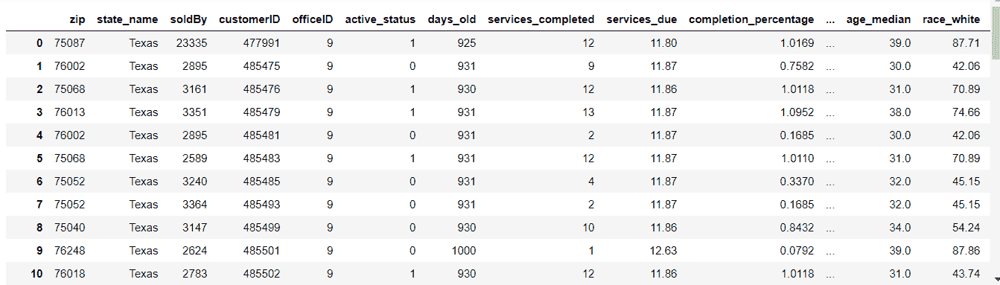

在 Jupyter Notebook 中加载的 DataFrame

# 数据概述

上述的 DataFrame 是一个汽车维修公司的客户数据。他们基本上按周期为客户提供服务。DataFrame 中的每一行对应一个独特的客户。因此，这是客户级别的数据。以下是从数据中获得的一个观察结果：

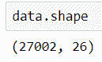

DataFrame 的形状

我们可以观察到数据包含 27,002 条记录和 26 个特征。

在开始对任何数据进行探索性数据分析之前，建议尽可能多地了解数据——包括列名及其相应的数据类型，是否包含空值（如果有，多少空值），等等。以下截图展示了通过 pandas 的`info`函数获得的一些基本信息：

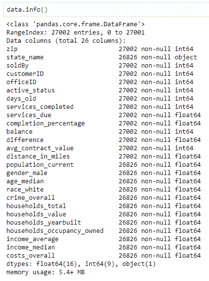

DataFrame 的基本信息

使用`info()`函数，我们可以看到数据仅包含浮动和整数值。此外，没有任何列包含空值。

pandas 中的`describe()`函数用于获取所有数值列的各种汇总统计信息。该函数返回所有数值列的计数、均值、标准差、最小值、最大值和四分位数。以下表格展示了通过`describe`函数获取的数据描述：

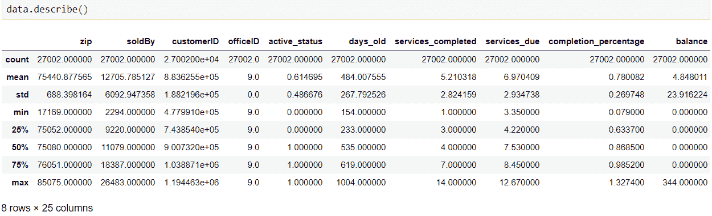

描述数据

# 特征选择

如果你有一个包含多个变量的数据集，检查各列之间相关性的一个好方法是通过将相关性矩阵可视化为热图。我们可以识别并去除那些高度相关的变量，从而简化我们的分析。可视化可以通过 Python 中的`seaborn`库实现：

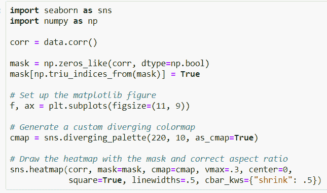

以下将是输出结果：

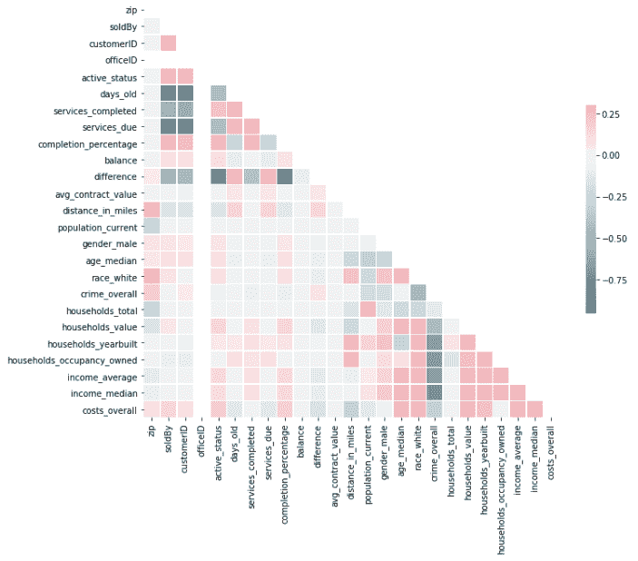

数据框的相关性热图

我们可以在之前的热图中观察到以下几点：

+   `soldBy`和`days_old`之间存在高度负相关

+   `age_median`和`income_median`之间存在正相关

同样地，我们可以推导出不同变量集之间的相关性。因此，基于相关性结果，我们可以通过仅选择重要特征来最小化独立特征的数量。

# 特征提取

除了选择有用的特征外，我们还需要从现有变量中提取显著的变量。这种方法被称为**特征提取**。在当前示例中，已经从现有变量中提取了一个名为`new_tenure`的新特征。该变量告诉我们客户在公司待了多长时间：

```py
data['new_tenure']=data['active_status']*data['days_old']+(1-data['active_status'])*data['days_active_tenure'] 
```

以下数据框展示了新提取的变量：

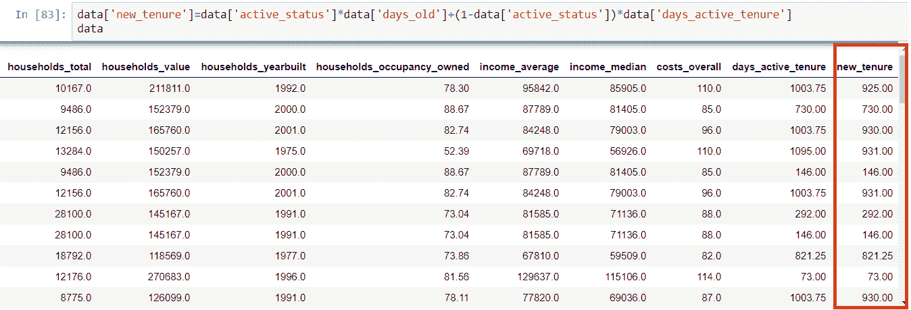

含有新提取变量的数据框

# 数据汇总

如前所述，所呈现的数据是客户级别的数据。对汇总数据进行分析会更加可行且容易，在这种情况下，汇总数据是按区域划分的。首先，我们需要了解客户在每个区域的分布情况。因此，我们将使用`groupby`函数来查找每个邮政编码中的客户数量。以下代码展示了代码片段及其输出：

```py
data.groupby('zip')['zip'].count().nlargest(10)
```

以下是输出结果：

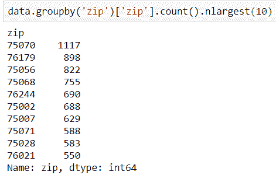

基于邮政编码的汇总数据

这将给出前 10 个拥有最多客户的邮政编码。

因此，我们可以通过聚合将客户级数据转换为邮政编码级数据。在对值进行分组后，我们还必须确保去除 NA。可以使用以下代码对整个数据框进行聚合：

```py
data_mod=data.groupby('zip') 
data_clean=pd.DataFrame() 
for name,data_group in data_mod: 
    data_group1=data_group.fillna(method='ffill') 
    data_clean=pd.concat([data_clean,data_group1],axis=0) 

data_clean.dropna(axis=0, how='any') 
```

以下截图是去除 NA 后的汇总数据框：

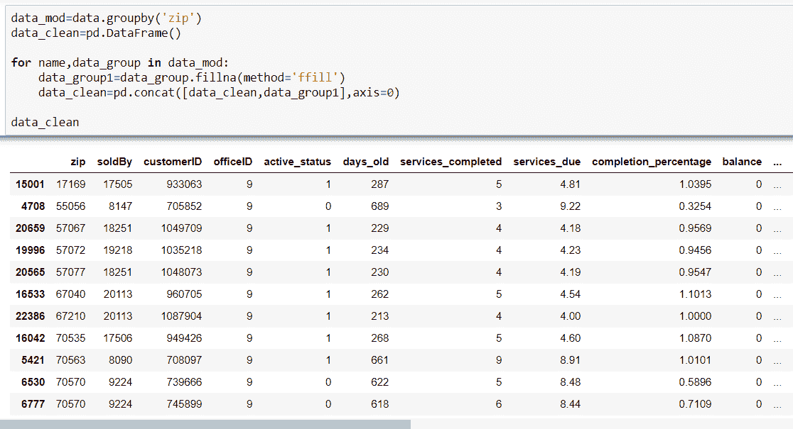

去除 NA 后的汇总数据框

`data_clean`将成为我们样本数据框的清理版本，该版本将传递给模型进行进一步分析。

# 使用 Python 进行网页抓取

网页抓取涉及从网站提取大量数据，形式可以是结构化的或非结构化的。例如，网站可能已经有一些数据以 HTML 表格元素或 CSV 文件的形式存在。这是网站上结构化数据的一个例子。但是，在大多数情况下，所需的信息会分散在网页的内容中。网页抓取有助于收集这些数据并将其存储为结构化的形式。有多种方式可以抓取网站，如在线服务、API，或者编写自己的代码。

以下是关于网页抓取的一些重要说明：

+   阅读网站的条款和条件，了解如何合法使用数据。大多数网站禁止将数据用于商业目的。

+   确保不要过快下载数据，因为这样可能会导致网站崩溃。你也有可能被网站封锁。

# 使用 pandas 进行网页抓取

Python 提供了不同的库来进行抓取：

+   pandas

+   BeautifulSoup

+   Scrapy

在本节中，我们将看到如何利用 pandas 和 BeautifulSoup 的强大功能进行数据抓取。首先，pandas 足以从网站上提取结构化数据，而不需要 BeautifulSoup 的帮助。在前面的章节中，我们学习了如何从不同格式（`.csv`、`.xlsx`和`.xls`）加载数据到 Python 中。类似于这些，pandas 有一个专门用于从 HTML 文件加载表格数据的函数。要读取 HTML 文件，pandas 的 DataFrame 会查找一个标签。这个标签称为`<td> </td>`标签，用于定义 HTML 中的表格。

pandas 使用`read_html()`来读取 HTML 文档。这个函数将 URL 中的所有结构化数据加载到 Python 环境中。因此，每当你传递一个 HTML 文件给 pandas 并希望它输出一个漂亮的 DataFrame 时，确保 HTML 页面中有一个表格。

我们可以尝试在一个示例网址上使用这个功能（[`www.bseindia.com/static/members/TFEquity.aspx`](https://www.bseindia.com/static/members/TFEquity.aspx)）：

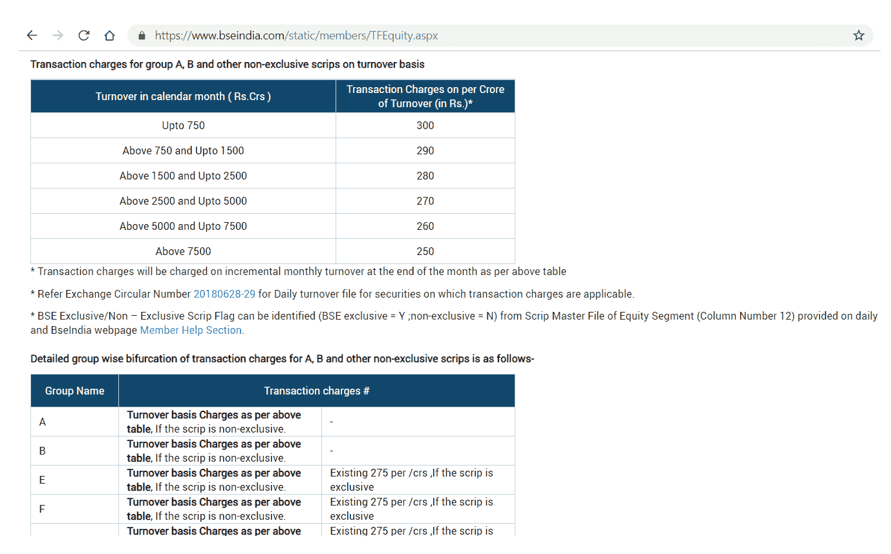

示例网页

上述网页包含多个表格。使用 pandas，我们可以提取所有表格，并将其存储在一个列表中：

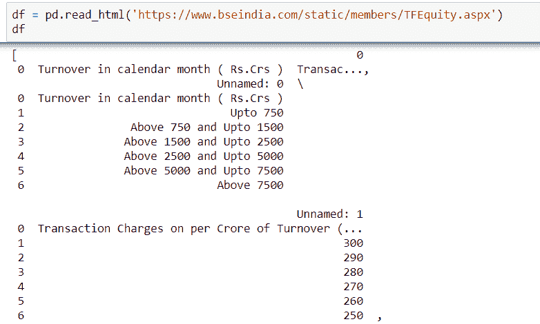

包含多个 DataFrame 的列表

在下图中，正在提取网页中的第二个表格：

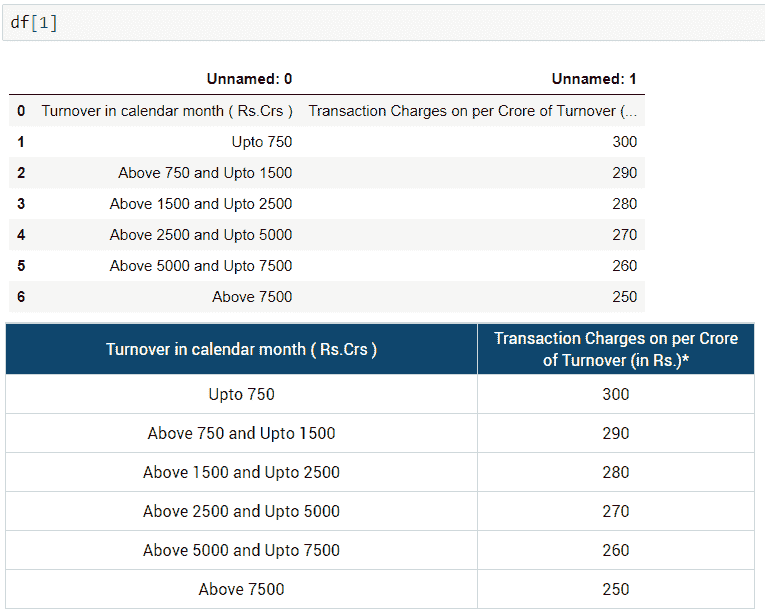

网页和 pandas DataFrame 的对比

清洗后，提取的 DataFrame 完全复制了网站上的内容：

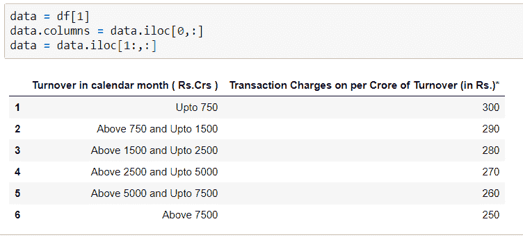

清洗后的 DataFrame

通过适当的索引，所有来自网页的表格都可以通过`read_html`函数提取。

# 使用 BeautifulSoup 进行网页抓取

BeautifulSoup 是一个 Python 库（[`www.crummy.com/software/BeautifulSoup/`](https://www.crummy.com/software/BeautifulSoup/)），用于从 HTML 和 XML 文件中提取数据。它提供了导航、访问、搜索和修改网页 HTML 内容的方式。了解 HTML 的基础知识对于成功抓取网页内容非常重要。为了解析内容，首先我们需要做的是确定在哪里可以找到我们想要下载的文件的链接，这些文件位于 HTML 标签的多层级中。简而言之，网页上有大量代码，而我们要做的就是找到包含数据的相关代码段。

在网站上，右键点击并选择检查。这将允许你查看网站背后的原始代码。点击检查后，你应该能看到以下控制台弹出：

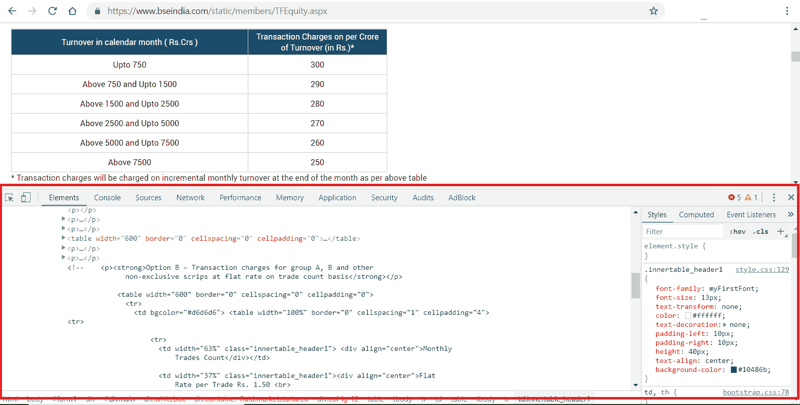

浏览器的检查菜单

注意我们所提到的表格被包裹在一个叫做 **table** 的标签中。每一行都位于 `<tr>` 标签之间。同样，每个单元格都位于 `<td>` 标签之间。理解这些基本差异可以让数据提取变得更容易。

我们首先导入以下库：

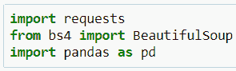

导入库

接下来，我们使用 `requests` 库请求 URL。如果访问成功，你应该能看到以下输出：

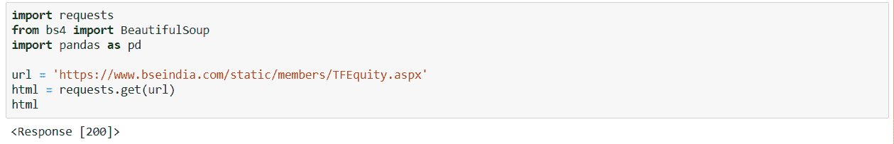

从网站获得成功的响应

然后，我们使用`BeautifulSoup`解析`html`，以便能够处理更整洁、嵌套的`BeautifulSoup`数据结构。通过一些 HTML 标签的知识，解析后的内容可以使用`for`循环和 pandas DataFrame 轻松转换为 DataFrame。使用 BeautifulSoup 的最大优势在于，它甚至可以从非结构化的来源中提取数据，并通过支持的库将其转化为表格，而 pandas 的`read_html`函数只能处理结构化的数据来源。因此，根据需求，我们使用了`BeautifulSoup`：

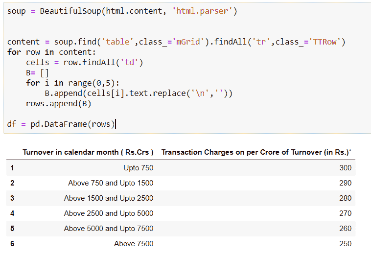

使用 BeautifulSoup 提取的 DataFrame

# 数据验证

数据验证是检查数据质量的过程，确保数据既正确又适用于分析。它使用称为**验证规则**的例程来检查输入模型的数据的真实性。在大数据时代，计算机和其他技术形式生成大量信息，这些信息推动着数据产生的数量，如果这些数据缺乏质量，那么使用它们会显得不专业，这也突出了数据验证的重要性。

在这个案例研究中，我们将考虑两个 DataFrame：

+   来自平面文件的测试 DataFrame

+   来自 MongoDB 的验证 DataFrame

在测试 DataFrame 上执行验证例程，同时将其对应的数据框作为参考。

# 数据概览

这里考虑的数据集是 **学习管理系统**（**LMS**）数据的一部分。它们展示了与学生注册、跟踪、报告以及教育课程的交付相关的信息。我们将从平面文件加载测试 DataFrame：

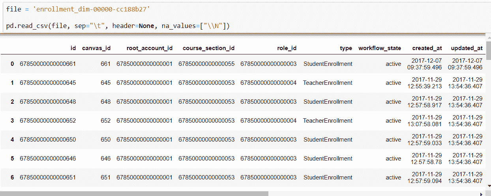

从平面文件加载测试 DataFrame

`pymongo` 库用于将 MongoDB 连接到 Python。通常，MongoDB 会监听端口 `27017`：

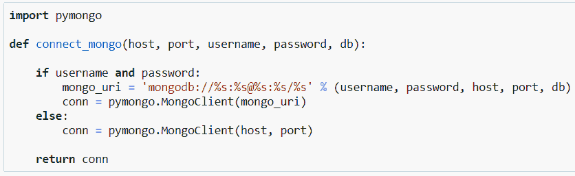

从 Python 连接 MongoDB

我们可以在以下截图中看到连接参数。由于数据库安装在本地，我们通过 localhost 进行连接。加载的数据库名称是 `lms_db`：

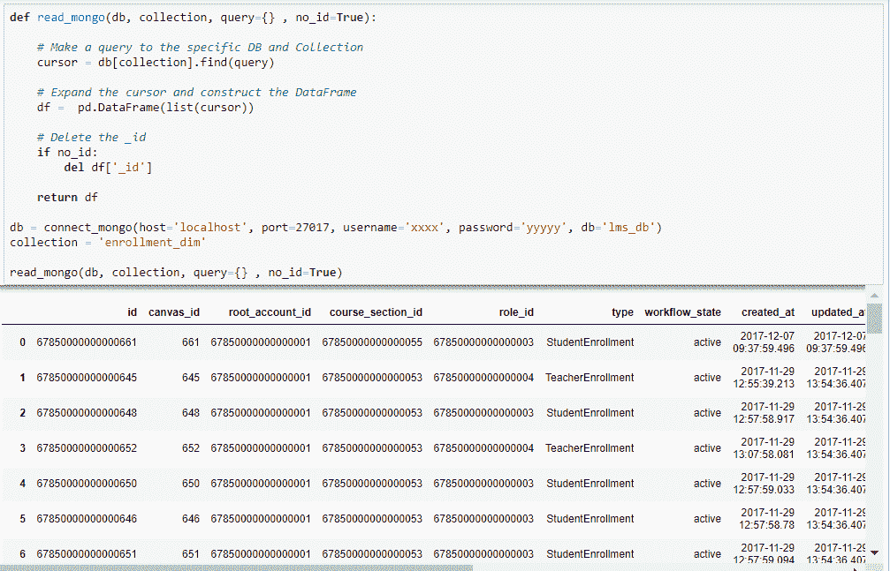

从 MongoDB 读取数据

# 结构化数据库与非结构化数据库

由于 MongoDB 属于非结构化数据库类别，因此其使用的术语与结构化数据库（如 MySQL 和 PostgreSQL）大不相同。下表展示了各种 SQL 术语和概念以及相应的 MongoDB 术语和概念：

| **SQL 术语/概念** | **MongoDB 术语/概念** |
| --- | --- |
| 数据库 | 数据库 ([h](https://docs.mongodb.com/manual/reference/glossary/#term-database)[ttps://docs.mongodb.com/manual/reference/glossary/#term-database](https://docs.mongodb.com/manual/reference/glossary/#term-database)[)](https://docs.mongodb.com/manual/reference/glossary/#term-database) |
| 表 | 集合 ([`docs.mongodb.com/manual/reference/glossary/#term-collection`](https://docs.mongodb.com/manual/reference/glossary/#term-collection)) |
| 行 | 文档或 BSON 文档 |
| 列 | 字段 ([`docs.mongodb.com/manual/reference/glossary/#term-field`](https://docs.mongodb.com/manual/reference/glossary/#term-field)) |
| 索引 | 索引 ([`docs.mongodb.com/manual/reference/glossary/#term-index`](https://docs.mongodb.com/manual/reference/glossary/#term-index)) |
| 表连接 | `$lookup`，嵌入式文档 ([`docs.mongodb.com/manual/reference/operator/aggregation/lookup/#pipe._S_lookup`](https://docs.mongodb.com/manual/reference/operator/aggregation/lookup/#pipe._S_lookup)) |
| 主键 | 主键 ([`docs.mongodb.com/manual/reference/glossary/#term-primary-key`](https://docs.mongodb.com/manual/reference/glossary/#term-primary-key)) |
| 将任何唯一的列或列组合指定为主键。 | 在 MongoDB 中，主键会自动设置为`_id`字段。([`docs.mongodb.com/manual/reference/glossary/#term-id`](https://docs.mongodb.com/manual/reference/glossary/#term-id)) |
| 聚合（例如 group by） | 聚合管道 |
| 事务 | 事务 ([`docs.mongodb.com/manual/core/transactions/`](https://docs.mongodb.com/manual/core/transactions/)) |

SQL 与 MongoDB 术语对比视图

# 验证数据类型

数据类型是变量的一种属性，Python 使用它来理解如何存储和处理数据。例如，程序需要理解存储 5 和 10 的变量是数字型的，以便能够将它们相加得到 15；或者理解存储 `cat` 和 `hat` 的变量是字符串类型，以便它们可以连接（加在一起）得到 `cathat`。因此，它成为任何 pandas DataFrame 的初步和基本属性。

可以使用用户定义的比较函数来验证测试 DataFrame 的数据类型：

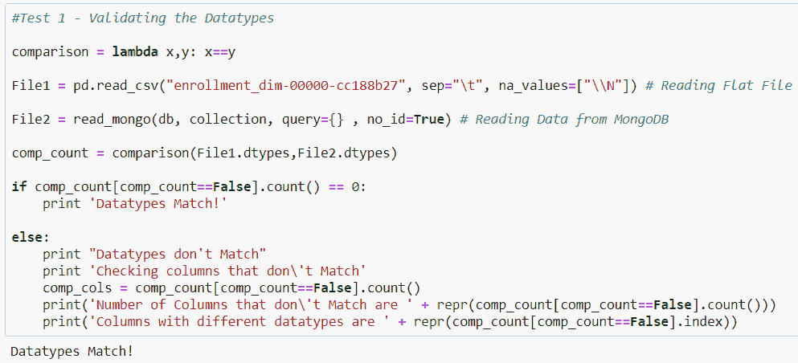

验证测试 DataFrame 的数据类型

`File1` 和 `File2` 分别对应测试数据集和验证数据集。从输出中可以明显看出，测试 DataFrame 的所有数据类型与验证 DataFrame 的数据类型匹配。如果存在不匹配，输出将显示不一致的列数。

# 验证维度

DataFrame 是一种二维数据结构，其中数据以表格形式呈现，类似于关系型数据库表格，按行和列排列。检查测试集和验证集是否匹配的基本方法之一是比较行数和列数。如果 DataFrame 的形状不匹配，那么测试 DataFrame 与验证 DataFrame 之间的差异就显而易见了。以下是一个截图，展示了如何验证维度：

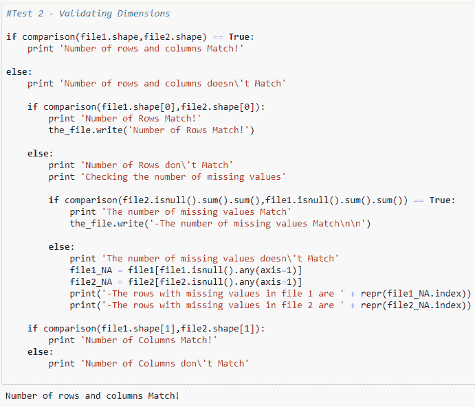

验证维度

# 验证单个条目

一旦前两个测试用例满足要求，扫描单个条目以查找虚假数据就变得非常重要。前面图示中的验证过程描述了从数据采集过程中获得的值与真实值之间的差异。随着数据量的增加，验证条目变得越来越困难。通过高效使用 pandas，可以减轻这种效果。在以下示例中，使用循环（暴力法）和 pandas 索引扫描了单个条目。

# 使用 pandas 索引

以下截图展示了如何使用 pandas 验证单元格：

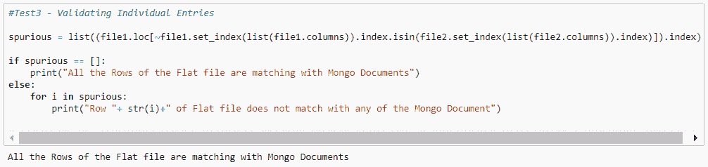

使用 pandas 索引验证单元格

# 使用循环

以下截图展示了如何通过使用循环验证单元格：

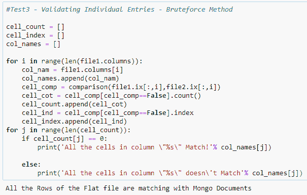

使用循环验证单元格

当我们使用 pandas 索引时，结果非常令人鼓舞。验证一个包含 200,000 行和 15 列的 DataFrame 只用了 0.53 秒，而使用循环完成相同的验证流程则花费了超过 7 分钟。因此，始终建议利用 pandas 的强大功能，避免使用迭代编程。

# 总结

pandas 对许多辅助数据活动非常有用，例如探索性数据分析、验证两个数据源之间数据的有效性（如数据类型或计数），以及构建和塑造从其他来源获取的数据，比如抓取网站或数据库。在这一章中，我们处理了这些主题的一些案例研究。数据科学家每天都会进行这些活动，本章应该能让你大致了解在真实数据集上执行这些活动的体验。

在下一章，我们将讨论 pandas 库的架构和代码结构。这将帮助我们全面了解该库的功能，并使我们能够更好地进行故障排除。
