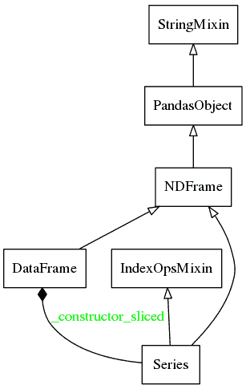

# 第十四章：pandas 库架构

在本章中，我们将探讨 pandas 用户可以使用的各种库。本章旨在成为一本简短的指南，帮助用户浏览和了解 pandas 提供的各种模块和库。它详细描述了库代码的组织结构，并简要介绍了各种模块。这对于希望了解 pandas 内部工作原理的用户，以及希望为代码库做出贡献的用户，将是非常有价值的。我们还将简要演示如何使用 Python 扩展来提高性能。以下是本章将讨论的各个主题：

+   pandas 库层次结构简介

+   pandas 模块和文件的描述

+   使用 Python 扩展提高性能

# 理解 pandas 文件层次结构

一般来说，在安装时，pandas 会作为 Python 模块安装在第三方 Python 模块的标准位置。在下表中，您可以看到 Unix/macOS 和 Windows 平台的标准安装位置：

| **平台** | **标准安装位置** | **示例** |
| --- | --- | --- |
| Unix/macOS | `prefix/lib/pythonX.Y/site-packages` | `/usr/local/lib/python2.7/site-packages` |
| Windows | `prefix\Lib\site-packages` | `C:\Python27\Lib\site-packages` |

如果通过 Anaconda 安装 Python，那么 pandas 模块可以在 Anaconda 目录下找到，类似的文件路径为：`Anaconda3\pkgs\pandas-0.23.4-py37h830ac7b_0\Lib\site-packages\pandas`。

现在我们已经了解了第三方 Python 模块部分，接下来将了解文件层次结构。已安装的 Pandas 库包含八种类型的文件。这些文件遵循特定的层次结构，下面描述了这一结构：

+   `pandas/core`：该文件包含用于基本数据结构（如 Series/DataFrame）及相关功能的文件。

+   `pandas/src`：该文件包含用于实现基本算法的 Cython 和 C 代码。

+   `pandas/io`：该文件包含处理不同文件格式的输入/输出工具，如平面文件、Excel、HDF5 和 SQL。

+   `pandas/tools`：该文件包含辅助数据算法、合并和连接例程、拼接、透视表等。该模块主要用于数据操作。

+   `pandas/sparse`：该文件包含稀疏版本的数据结构，如系列、DataFrame、Panels 等。

+   `pandas/stats`：该文件包含线性回归、面板回归、移动窗口回归以及其他一些统计函数。它应该被 statsmodels 中的功能所替代。

+   `pandas/util`：该文件包含实用工具以及开发和测试工具。

+   `pandas/rpy`：该文件包含 RPy2 接口，用于连接 R，从而扩展数据分析操作的范围。

更多信息，请参见：[`pandas.pydata.org/developers.html`](http://pandas.pydata.org/developers.html)。

# pandas 模块和文件的描述

在本节中，我们简要描述了构成 pandas 库的各个子模块和文件。

# pandas/core

该模块包含了 pandas 的核心子模块，具体讨论如下：

+   `api.py`：该模块导入了一些关键模块和警告信息，以供后续使用，例如索引、`groupby` 和重塑函数。

+   `apply.py`：该模块包含一些类，帮助将函数应用到 DataFrame 或 series 上。

+   `arrays`：该模块隔离了 pandas 对 `numpy` 的依赖——即所有直接使用 `numpy` 的操作。`array` 子模块中的 `base.py` 处理所有面向数组的操作，例如 `ndarray` 值、形状和 `ndim`，而 `categorical.py` 子模块专门处理分类值。

+   `base.py`：该模块定义了诸如 `StringMixin` 和 `PandasObject` 等基础类，`PandasObject` 是多个 pandas 对象的基类，例如 `Period`、`PandasSQLTable`、`sparse.array.SparseArray`/`SparseList`、`internals.Block`、`internals.BlockManager`、`generic.NDFrame`、`groupby.GroupBy`、`base.FrozenList`、`base.FrozenNDArray`、`io.sql.PandasSQL`、`io.sql.PandasSQLTable`、`tseries.period.Period`、`FrozenList`、`FrozenNDArray: IndexOpsMixin` 和 `DatetimeIndexOpsMixin`。

+   `common.py`：该模块定义了处理数据结构的常用工具方法。例如，`isnull` 对象用于检测缺失值。

+   `config.py`：该模块用于处理整个包的可配置对象。它定义了以下类：`OptionError`、`DictWrapper`、`CallableDynamicDoc`、`option_context` 和 `config_init`。

+   `datetools.py`：这是一个处理 Python 中日期的函数集合。它还利用了 pandas 中 `tseries` 模块的一些函数。

+   `frame.py`：该模块定义了 pandas 的 DataFrame 类及其各种方法。DataFrame 继承自 NDFrame（见下文）。它从 `pandas-core` 模块下的多个子模块借用函数，来定义 DataFrame 的功能性操作。

+   `generic.py`：该模块定义了通用的 NDFrame 基类，这是 pandas 中 DataFrame、series 和 panel 类的基类。NDFrame 继承自 `PandasObject`，后者在 `base.py` 中定义。NDFrame 可以视为 pandas DataFrame 的 N 维版本。有关更多信息，请访问 [`nullege.com/codes/search/pandas.core.generic.NDFrame`](http://nullege.com/codes/search/pandas.core.generic.NDFrame)。

+   `categorical.py`：该模块定义了 `categorical`，它是从 `PandasObject` 派生的一个类，用于表示类似于 R/S-plus 的分类变量（稍后我们会进一步扩展这一点）。

+   `groupby.py`：该模块定义了多种类，用于实现 `groupby` 功能：

    +   **Splitter 类**：包括 `DataSplitter`、`ArraySplitter`、`SeriesSplitter`、`FrameSplitter` 和 `NDFrameSplitter`。

    +   **Grouper/grouping 类**：包括 `Grouper`、`GroupBy`、`BaseGrouper`、`BinGrouper`、`Grouping`、`SeriesGroupBy` 和 `NDFrameGroupBy`。

+   `ops.py`：此文件定义了一个内部 API，用于对`PandasObjects`执行算术运算。它定义了为对象添加算术方法的函数。它定义了一个`_create_methods`元方法，用于通过算术、比较和布尔方法构造器创建其他方法。`add_methods`方法接受一个新方法列表，将它们添加到现有方法列表中，并将它们绑定到适当的类。`add_special_arithmetic_methods`、`add_flex_arithmetic_methods`、`call _create_methods`和`add_methods`用于向类中添加算术方法。

它定义了`_TimeOp`类，这是一个用于日期时间相关算术运算的封装类。它包含了对 series、DataFrame 和 panel 函数进行算术、比较和布尔操作的封装函数：`_arith_method_SERIES(..)`、`_comp_method_SERIES(..)`、`_bool_method_SERIES(..)`、`_flex_method_SERIES(..)`、`_arith_method_FRAME(..)`、`_comp_method_FRAME(..)`、`_flex_comp_method_FRAME(..)`、`_arith_method_PANEL(..)`和`_comp_method_PANEL(..)`。

+   `index.py`：此文件定义了索引类及其相关功能。Index 是所有 pandas 对象（如 series、DataFrame 和 panel）用来存储轴标签的工具。它下面是一个不可变的数组，提供一个有序的集合，可以进行切片操作。

+   `indexing.py`：此模块包含一系列函数和类，使得多重索引操作更加简便。

+   `missing.py`：此文件定义了诸如掩蔽和插值等技术，用于处理缺失数据。

+   `internals.py`：此文件定义了多个对象类，具体如下所示：

    +   `Block`：这是一个同质类型的 N 维`numpy.ndarray`对象，具有额外的 pandas 功能——例如，它使用`__slots__`来限制对象的属性为`ndim`、`values`和`_mgr_locs`。它作为其他 Block 子类的基类。

    +   `NumericBlock`：这是一个用于处理数值类型区块的基类。

    +   `FloatOrComplexBlock`：这是`FloatBlock`和`ComplexBlock`的基类，继承自`` `NumericBlock` ``。

    +   `ComplexBlock`：这是处理复数类型区块对象的类。

    +   `FloatBlock`：这是处理浮动类型区块对象的类。

    +   `IntBlock`：这是处理整数类型区块对象的类。

    +   `TimeDeltaBlock`、`BoolBlock`和`DatetimeBlock`：这些是处理时间差、布尔值和日期时间的区块类。

    +   `ObjectBlock`：这是处理用户定义对象的区块类。

    +   `SparseBlock`：这是处理相同类型稀疏数组的类。

    +   `BlockManager`：这是管理一组区块对象的类，它不是公开的 API 类。

    +   `SingleBlockManager`：这是管理单个区块的类。

    +   `JoinUnit`：这是一个区块对象的实用类。

+   `nanops.py`：这个子模块包含一组用于专门处理 NaN 值的类和功能。

+   `ops.py`：该文件定义了 pandas 对象的算术运算。它不是公开 API。

+   `panel.py`、`panel4d.py` 和 `panelnd.py`：这些提供了 pandas 面板对象的功能。

+   `resample.py`：该文件定义了用于时间间隔分组和聚合的自定义 `groupby` 类。

+   `series.py`：该文件定义了 pandas Series 类及其从 NDFrame 和 `IndexOpsMixin` 继承的各种方法，以适应一维数据结构和一维时间序列数据。

+   `sorting.py`：该文件定义了排序所需的所有工具。

+   `sparse.py`：该文件定义了处理稀疏数据结构的导入。稀疏数据结构通过省略匹配 NaN 或缺失值的数据点来进行压缩。有关此的更多信息，请访问 [`pandas.pydata.org/pandas-docs/stable/sparse.html`](http://pandas.pydata.org/pandas-docs/stable/sparse.html)。

+   `strings.py`：这些函数用于处理字符串操作，如 `str_replace`、`str_contains` 和 `str_cat`。

+   `window.py`：该模块帮助对数据结构进行窗口处理并计算滚动窗口中的聚合值。

以下图示概述了 Pandas 核心的结构：



现在，让我们继续下一个子模块。

# pandas/io

该模块包含多个数据 I/O 模块，具体如下：

+   `api.py`：该文件定义了数据 I/O API 的各种导入。

+   `common.py`：该文件定义了 I/O API 的通用功能。

+   `clipboards.py`：该文件包含跨平台剪贴板方法，支持通过键盘启用复制和粘贴功能。pandas I/O API 包含如 `pandas.read_clipboard()` 和 `pandas.to_clipboard(..)` 等函数。

+   `date_converters.py`：该文件定义了日期转换函数。

+   `excel.py`：该模块用于解析和转换 Excel 数据。它定义了`ExcelFile`和`ExcelWriter`类。

+   `feather_format.py`：该模块读取和写入 Feather 格式的数据。

+   `gbq.py`：这是用于 Google BigQuery 的模块。

+   `html.py`：这是用于处理 HTML I/O 的模块。

+   `json.py`：这是用于处理 pandas 中 JSON I/O 的模块。它定义了 `Writer`、`SeriesWriter`、`FrameWriter`、`Parser`、`SeriesParser` 和 `FrameParser` 类。

+   `msgpack`：该模块读取和写入 `msgpack` 格式的数据。

+   `packer.py`：该文件是一个`msgpack`序列化程序，支持将 pandas 数据结构读写到磁盘。

+   `parquet.py`：该模块读取和写入 Parquet 格式的数据。

+   `parsers.py`：这是定义用于解析和处理文件以创建 pandas DataFrame 的各种函数和类的模块。以下列出的三个 `read_*` 函数都有多种可配置选项用于读取。详细信息，请参见 [`bit.ly/1EKDYbP`](http://bit.ly/1EKDYbP)：

    +   `read_csv(..)`：该函数定义了 `pandas.read_csv()`，用于将 CSV 文件的内容读入 DataFrame。

    +   `read_table(..)`：这个方法用于将制表符分隔的表文件读取到 DataFrame 中。

    +   `read_fwf(..)`：这个方法用于将固定宽度格式的文件读取到 DataFrame 中。

    +   `TextFileReader`：这是用于读取文本文件的类。

    +   `ParserBase`：这是解析器对象的基类。

    +   `CParserWrapper`、`PythonParser`：这些分别是 C 和 Python 的解析器。它们都继承自`ParserBase`。

    +   `FixedWidthReader`：这是用于读取固定宽度数据的类。固定宽度数据文件包含在文件中特定位置的字段。

    +   `FixedWithFieldParser`：这是用于解析固定宽度字段的类，该类继承自`PythonParser`。

+   `pickle.py`：该模块提供了方法来 pickle（序列化）pandas 对象，方法如下：

    +   `to_pickle(..)`：该方法用于将对象序列化到文件。

    +   `read_pickle(..)`：这个方法用于从文件中读取序列化的对象到 pandas 对象。仅应使用受信任的源。

+   `pytables.py`：这是用于 PyTables 模块的接口，用于将 pandas 数据结构读写到磁盘上的文件。

+   `sql.py`：这是一个类和函数的集合，旨在从关系型数据库中检索数据，并尽量做到与数据库无关。以下是这些类和函数：

    +   `PandasSQL`：这是用于将 pandas 与 SQL 接口的基类。它提供了虚拟的`read_sql`和`to_sql`方法，这些方法必须由子类实现。

    +   `PandasSQLAlchemy`：这是`PandasSQL`的子类，能够使用 SQLAlchemy 在 DataFrame 和 SQL 数据库之间进行转换。

    +   `PandasSQLTable`：这是将 pandas 表（DataFrame）映射到 SQL 表的类。

    +   `pandasSQL_builder(..)`：根据提供的参数返回正确的 PandasSQL 子类。

    +   `PandasSQLTableLegacy`：这是`PandasSQLTable`的遗留支持版本。

    +   `PandasSQLLegacy`：这是`PandasSQLTable`的遗留支持版本。

    +   `get_schema(..)`：这个方法用于获取给定数据框架的 SQL 数据库表架构。

    +   `read_sql_table(..)`：这个方法用于将 SQL 数据库表读取到 DataFrame 中。

    +   `read_sql_query(..)`：这个方法用于将 SQL 查询读取到 DataFrame 中。

    +   `read_sql(..)`：这个方法用于将 SQL 查询/表读取到 DataFrame 中。

+   `stata.py`：这个模块包含用于将 Stata 文件处理为 pandas DataFrame 的工具。

+   `sas`：此模块包含子模块，用于从 SAS 输出中读取数据。

+   `S3.py`：这个模块提供与 S3 存储桶的远程连接功能。

# pandas/tools

该模块的详细信息如下：

+   `plotting.py`：这是用于绘图模块的包装器，最近版本中已被弃用。

+   `merge.py`：这个模块提供用于合并序列、DataFrame 和面板对象的函数，如`merge(..)`和`concat(..)`，并在最近的版本中已被弃用。

# pandas/util

该`pandas/util`是提供实用功能的模块，模块的详细信息如下：

+   `testing.py`：该文件提供了用于测试的`assertion`、`debug`、`unit test`和其他类/函数。它包含许多特殊的断言函数，使得检查系列、DataFrame 或面板对象是否相等变得更加容易。一些这些函数包括`assert_equal(..)`、`assert_series_equal(..)`、`assert_frame_equal(..)`和`assert_panelnd_equal(..)`。`pandas.util.testing`模块对 pandas 代码库的贡献者尤其有用，它定义了一个`util.TestCase`类，还为潜在的代码库贡献者提供了处理区域设置、控制台调试、文件清理、比较器等的工具。

+   `doctools.py`：该子模块包含`TablePlotter`类，用于为 DataFrame 定义布局。

+   `validators.py`：该子模块帮助验证传递给函数的参数。例如，它帮助评估参数的长度、默认值和参数值。

+   `print_versions.py`：该文件定义了`get_sys_info()`函数，它返回系统信息字典；以及`show_versions(..)`函数，它显示可用 Python 库的版本。

+   `misc.py`：该文件定义了一些杂项工具。

+   `decorators.py`：该文件定义了一些装饰器函数和类。

+   替换和附加类是对函数文档字符串进行替换和附加的装饰器。有关 Python 装饰器的更多信息，请访问[`www.artima.com/weblogs/viewpost.jsp?thread=240808`](http://www.artima.com/weblogs/viewpost.jsp?thread=240808)。

+   `test_decorators.py`：该子模块提供了用于测试对象的装饰器。

# pandas/tests

这个`pandas/tests`是提供 pandas 中各种对象测试的模块。具体的库文件名基本上是自解释的，这里我不再进一步详细说明；而是邀请读者自行探索。

# pandas/compat

与兼容性相关的功能如下所述：

+   `chainmap.py`和`chainmap_impl.py`：这些文件提供了一个`ChainMap`类，可以将多个`dict`或映射组合在一起，产生一个可以更新的单一视图。

+   `pickle_compat.py`：该文件提供了在 0.12 版本之前的 pandas 对象序列化功能。

# pandas/computation

这个`pandas/computation`是提供计算功能的模块，具体内容如下：

+   `expressions.py`：该文件通过`numexpr`提供快速的表达式计算。`numexpr`函数用于加速某些数值操作。它使用多个核心以及智能分块和缓存加速。它定义了`evaluate(..)`和`where(..)`方法。该模块在最新版本的 pandas 中已被弃用，替代用法将通过`pandas.get_option`实现。

+   有关 `numexpr` 的更多信息，请访问 [`code.google.com/p/numexpr/`](https://code.google.com/p/numexpr/)。有关此模块的使用，请访问 [`pandas.pydata.org/pandas-docs/version/0.15.0/computation.html`](http://pandas.pydata.org/pandas-docs/version/0.15.0/computation.html)。

# pandas/plotting

`pandas/plotting` 是处理所有 pandas 绘图功能的模块：

+   `compat.py`：此模块检查版本兼容性。

+   `converter.py`：此模块有助于处理用于绘图的日期时间值。它可以执行自动缩放时间序列轴和格式化日期时间轴刻度等功能。

+   `core.py`：此文件定义了一些帮助创建图形的类，如条形图、散点图、六边形箱形图和箱线图。

+   `misc.py`：此文件提供了一组绘图函数，可以将系列或 DataFrame 作为参数。此模块包含以下子模块，用于执行各种杂项任务，如绘制散点矩阵和 Andrews 曲线：

    +   `scatter_matrix(..)`：此函数绘制散点图矩阵。

    +   `andrews_curves(..)`：此函数将多变量数据绘制为曲线，这些曲线使用样本作为傅里叶级数的系数。

    +   `parallel_coordinates(..)`：这是一种绘图技术，可以帮助你观察数据中的聚类并直观估算统计量。

    +   `lag_plot(..)`：此函数用于检查数据集或时间序列是否为随机的。

    +   `autocorrelation_plot(..)`：此函数用于检查时间序列中的随机性。

    +   `bootstrap_plot(..)`：此图用于以可视化的方式确定统计量（如均值或中位数）的不确定性。

    +   `radviz(..)`：此图用于可视化多变量数据。

+   `style.py`：此文件提供了一组绘图样式选项。

+   `timeseries.py`：此文件定义了时间序列绘图的辅助类。

+   `tools.py`：此文件包含一些辅助函数，用于从 DataFrame 和系列创建表格布局。

# pandas/tseries

本节内容涉及 `pandas/tseries` 模块，它赋予 pandas 处理时间序列数据的功能：

+   `api.py`：这是一个方便的导入集合。

+   `converter.py`：此文件定义了一组用于格式化和转换的类。

+   `datetime`：导入 pandas 后，它会通过 `register()` 函数将一组单位转换器注册到 `matplotlib`。具体方法如下：

```py
In [1]: import matplotlib.units as munits
In [2]: munits.registry
Out[2]: {}
In [3]: import pandas
In [4]: munits.registry
Out[4]:
{pandas.tslib.Timestamp: <pandas.tseries.converter.DatetimeConverter instance at 0x7fbbc4db17e8>,
pandas.tseries.period.Period: <pandas.tseries.converter.PeriodConverter instance at 0x7fbbc4dc25f0>,
datetime.date: <pandas.tseries.converter.DatetimeConverter instance at 0x7fbbc4dc2fc8>,
datetime.datetime: <pandas.tseries.converter.DatetimeConverter instance at 0x7fbbc4dc2a70>,
datetime.time: <pandas.tseries.converter.TimeConverter instance at 0x7fbbc4d61e18>}
```

+   `Converter`：此类包括 `TimeConverter`、`PeriodConverter` 和 `DateTimeConverter`。

+   `Formatters`：此类包括 `TimeFormatter`、`PandasAutoDateFormatter` 和 `TimeSeries_DateFormatter`。

+   `Locators`：此类包括 `PandasAutoDateLocator`、`MilliSecondLocator` 和 `TimeSeries_DateLocator`。

`Formatter` 和 `Locator` 类用于处理 `matplotlib` 绘图中的刻度。

+   `frequencies.py`：此文件定义了指定时间序列对象频率的代码——如每日、每周、每季度、每月、每年等。此子模块依赖于 pandas/core 模块的 `dtypes` 子模块。

+   `holiday.py`：该文件定义了处理假期的函数和类——如 `Holiday`、`AbstractHolidayCalendar` 和 `USFederalHolidayCalendar` 等类。

+   `offsets.py`：该文件定义了各种类，包括处理与时间相关的偏移类。这些类的具体说明如下：

    +   `DateOffset`：这是一个接口，供提供时间段功能的类使用，如 `Week`、`WeekOfMonth`、`LastWeekOfMonth`、`QuarterOffset`、`YearOffset`、`Easter`、`FY5253` 和 `FY5253Quarter`。

    +   `BusinessMixin`：这是一个混合类，用于商业对象提供与时间相关的功能。它被 `BusinessDay` 类继承。`BusinessDay` 子类继承自 `BusinessMixin` 和 `SingleConstructorOffset`，并提供在工作日上的偏移。

    +   `MonthOffset`：这是提供月时间段功能的类的接口，如 `MonthEnd`、`MonthBegin`、`BusinessMonthEnd` 和 `BusinessMonthBegin`。

    +   `MonthEnd` 和 `MonthBegin`：这两个提供了在月末或月初的日期偏移，偏移量为一个月。

    +   `BusinessMonthEnd` 和 `BusinessMonthBegin`：这两个提供了在商业日历的月末或月初的日期偏移，偏移量为一个月。

    +   `YearOffset`：这个偏移量是由提供年周期功能的类继承的——如 `YearEnd`、`YearBegin`、`BYearEnd` 和 `BYearBegin`。

    +   `YearEnd` 和 `YearBegin`：这两个提供了在年末或年初的日期偏移，偏移量为一年。

    +   `BYearEnd` 和 `BYearBegin`：这两个提供了在商业日历的结束或开始时的日期偏移，偏移量为一年。

    +   `Week`：它提供了一个星期的偏移。

    +   `WeekDay`：它提供了从星期几（例如，Tue）到一周中的任何一天（例如，=2）的映射。

    +   `WeekOfMonth` 和 `LastWeekOfMonth`：这描述了每个月中某周的日期。

    +   `QuarterOffset`：这是提供季度周期功能的类的基类——如 `QuarterEnd`、`QuarterBegin`、`BQuarterEnd` 和 `BQuarterBegin`。

    +   `QuarterEnd`、`QuarterBegin`、`BQuarterEnd` 和 `BQuarterBegin`：这些类与 `Year*` 类似，不同之处在于其周期是季度，而不是年份。

    +   `FY5253` 和 `FY5253Quarter`：这些类分别描述了 52 周和 53 周的财政年度，也称为 4-4-5 日历。

    +   `Easter`：这是 `DateOffset` 类，用于复活节假期。

    +   `Tick`：这是时间单位类的基类，例如 `Day`、`Hour`、`Minute`、`Second`、`Milli`、`Micro` 和 `Nano`。

+   `plotting.py`：该文件从 `pandas-plotting` 模块导入 `tsplot(..)` 子模块。

接下来，我们将看到如何使用 Python 扩展来提高 Python 代码的性能。

# 使用 Python 扩展提高性能

Python 和 pandas 用户的一个抱怨是，虽然语言和模块的易用性和表达性非常强大，但也伴随着显著的缺点——性能。这种情况尤其在数值计算时显现。

根据编程基准标准，Python 在许多算法或数据结构操作上通常比编译语言（如 C/C++）慢。例如，在一个模拟实验中，Python3 的运行速度比最快的 C++ 实现的 *n* 体模拟计算慢了 104 倍。

那么，我们如何解决这个合法却令人烦恼的问题呢？我们可以在保持 Python 中我们喜爱的东西——清晰性和生产力——的同时，减缓 Python 的运行速度。我们可以通过编写代码中的性能敏感部分（例如，数字处理、算法等）为 C/C++ 代码，并通过编写 Python 扩展模块让 Python 调用这些代码来实现。更多详细信息，请访问 [`docs.python.org/2/extending/extending.html`](http://docs.python.org/2/extending/extending.html)。

Python 扩展模块使我们能够从 Python 调用用户定义的 C/C++ 代码或库函数，从而提高代码性能，并享受 Python 使用的便利。

为了帮助我们理解 Python 扩展模块是什么，让我们考虑在 Python 中导入一个模块时发生了什么。导入语句*导入*一个模块，但这究竟意味着什么呢？有三种可能性，具体如下：

+   一些 Python 扩展模块在构建解释器时与之链接。

+   导入语句会导致 Python 加载 `.pyc` 文件到内存中。`.pyc` 文件包含 Python 的 `字节码`，如以下代码片段所示：

```py
    In [3]: import pandas
                    pandas.__file__
    Out[3]: '/usr/lib/python2.7/site-packages/pandas/__init__.pyc'
```

+   导入语句会导致 Python 扩展模块加载到内存中。`.so`（共享对象）文件包含了机器码，如以下代码片段所示：

```py
    In [4]: import math
              math.__file__
    Out[4]: '/usr/lib/python2.7/lib-dynload/math.so'
```

我们将重点讨论第三种可能性，因为这是最常见的情况。即使我们处理的是从 C 编译出来的二进制共享对象，我们仍然可以将其作为 Python 模块导入。这展示了 Python 扩展的强大——应用程序可以从 Python 机器码或机器码导入模块，接口是相同的。Cython 和 SWIG 是用 C 和 C++ 编写扩展的两种最流行的方法。在编写扩展时，我们将 C/C++ 机器码封装起来，并将其转化为表现得像纯 Python 代码的 Python 扩展模块。在这次简短的讨论中，我们将只关注 Cython，因为它是专为 Python 设计的。

Cython 是 Python 的一个超集，旨在通过允许我们调用外部编译的 C/C++ 代码，并声明变量的类型，显著提高 Python 的性能。

Cython 命令从 Cython 源文件生成优化的 C/C++ 源文件，并将此优化后的 C/C++ 源文件编译成 Python 扩展模块。它为 NumPy 提供了内置支持，并将 C 的性能与 Python 的可用性结合起来。

我们将快速演示如何使用 Cython 显著加速我们的代码。让我们定义一个简单的斐波那契函数：

```py
    In [17]: def fibonacci(n):
             a,b=1,1
             for i in range(n):
                 a,b=a+b,a
             return a
    In [18]: fibonacci(100)
    Out[18]: 927372692193078999176L
    In [19]: %timeit fibonacci(100)
             100000 loops, best of 3: 18.2 µs per loop  
```

使用 `timeit` 模块，我们发现每次循环需要 18.2 微秒。

现在让我们通过以下步骤，在 Cython 中重写函数，并为变量指定类型：

1.  首先，我们在 iPython 中导入 Cython 魔法函数，如下所示：

```py
    In [22]: %load_ext cythonmagic
```

1.  接下来，我们在 Cython 中重写我们的函数，并为我们的变量指定类型：

```py
    In [24]: %%cython
             def cfibonacci(int n):
                 cdef int i, a,b
                 for i in range(n):
                     a,b=a+b,a
                 return a 
```

1.  让我们测试一下我们新的 Cython 函数的执行时间：

```py
    In [25]: %timeit cfibonacci(100)
             1000000 loops, best of 3: 321 ns per loop

    In [26]: 18.2/0.321
    Out[26]: 56.69781931464174  
```

1.  我们可以看到，Cython 版本比纯 Python 版本快了 57 倍！

有关使用 Cython/SWIG 或其他选项编写 Python 扩展的更多信息，请参考以下来源：

+   Pandas 文档，标题为 *提升性能*，链接：[`pandas.pydata.org/pandas-docs/stable/enhancingperf.html`](http://pandas.pydata.org/pandas-docs/stable/enhancingperf.html)

+   ScipPy 讲义，标题为 *与 C 接口*，链接：[`scipy-lectures.github.io/advanced/interfacing_with_c/interfacing_with_c.html`](https://scipy-lectures.github.io/advanced/interfacing_with_c/interfacing_with_c.html)

+   Cython 文档，链接：[`docs.cython.org/index.html`](http://docs.cython.org/index.html)

+   SWIG 文档，链接：[`www.swig.org/Doc2.0/SWIGDocumentation.html`](http://www.swig.org/Doc2.0/SWIGDocumentation.html)

# 总结

总结本章内容，我们浏览了 pandas 库的层次结构，试图说明该库的内部构造。理解这些内容对于从 pandas 代码构建自定义模块或作为开源贡献者改进 pandas 的功能将非常有帮助。我们还讨论了通过使用 Python 扩展模块来加速代码性能的好处。

在下一章中，我们将看到 pandas 与其他数据分析工具在各种分析操作方面的比较。
