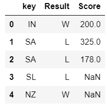

# 第十五章：pandas 与其他工具的比较

本章重点比较 pandas 与 R（许多 pandas 功能的模型工具）、SQL 和 SAS 等工具的异同，后者与 pandas 有着显著的重叠。本章旨在为希望使用 pandas 的 R、SQL 和 SAS 用户提供指南，也为希望在 pandas 中重现其代码功能的用户提供帮助。本章重点介绍 R、SQL 和 SAS 用户可用的一些关键功能，并通过一些示例演示如何在 pandas 中实现类似功能。本章假设您已安装 R 统计软件包。如果没有，您可以从此处下载并安装：[`www.r-project.org/`](http://www.r-project.org/)。

在本章结束时，数据分析用户应该能够很好地掌握这些工具相对于 pandas 的数据分析能力，从而在需要时能够顺利过渡到或使用 pandas。工具比较的各个因素包括：

+   数据类型及其 pandas 对应物

+   切片与选择

+   数据类型列的算术运算

+   聚合与 GroupBy

+   匹配

+   分割-应用-合并

+   数据重塑与熔化

+   因子和分类数据

# 与 R 的比较

R 是 pandas 设计灵感的工具。两者在语法、用法和输出方面非常相似。主要的差异出现在某些数据类型上，例如 R 中的矩阵与 pandas 中的数组，R 中的 `aggregate` 函数与 pandas 中的 `GroupBy` 操作，以及一些功能相似的函数在语法上的细微差别，如 `melt` 和 `cut`。

# R 中的数据类型

R 具有五种原始类型或原子类型：

+   字符

+   数值型

+   整数

+   复数

+   逻辑/布尔值

它还具有以下更复杂的容器类型：

+   **向量**：这与 `numpy.array` 相似。它只能包含相同类型的对象。

+   **列表**：这是一个异构容器。它在 pandas 中的对应物是一个序列（series）。

+   **数据框（DataFrame）**：这是一个异构的二维容器，相当于 pandas 的 DataFrame。

+   **矩阵**：这是一个同质的二维版本的向量。它类似于 `numpy.array`。

本章我们将重点介绍列表和数据框，它们在 pandas 中的对应物是：序列（series）和数据框（DataFrame）。

有关 R 数据类型的更多信息，请参考以下文档：[`www.statmethods.net/input/datatypes.html`](http://www.statmethods.net/input/datatypes.html)。

有关 NumPy 数据类型的更多信息，请参考以下文档：[`docs.scipy.org/doc/numpy/reference/generated/numpy.array.html`](http://docs.scipy.org/doc/numpy/reference/generated/numpy.array.html) 和 [`docs.scipy.org/doc/numpy/reference/generated/numpy.matrix.html`](http://docs.scipy.org/doc/numpy/reference/generated/numpy.matrix.html)。

# R 列表

R 列表可以通过显式的列表声明创建，如下所示：

```py
>h_lst<- list(23,'donkey',5.6,1+4i,TRUE) 
>h_lst 
[[1]] 
[1] 23 

[[2]] 
[1] "donkey" 

[[3]] 
[1] 5.6 

[[4]] 
[1] 1+4i 

[[5]] 
[1] TRUE 

>typeof(h_lst) 
[1] "list" 
```

以下代码块展示了其在 pandas 中的系列等效版本，其中包括列表的创建，随后从中创建 Series：

```py
In [8]: h_list=[23, 'donkey', 5.6,1+4j, True] 
In [9]: import pandas as pd 
        h_ser=pd.Series(h_list) 
In [10]: h_ser 
Out[10]: 0        23 
         1    donkey 
         2       5.6 
         3    (1+4j) 
         4      True 
dtype: object 
```

在 pandas 中，数组的索引从 0 开始，而在 R 中，索引从 1 开始。以下是一个示例：

```py
    In [11]: type(h_ser)
    Out[11]: pandas.core.series.Series
```

# R DataFrames

我们可以通过调用`data.frame()`构造函数来构造 R DataFrame，然后如下面所示展示它：

```py
>stocks_table<- data.frame(Symbol=c('GOOG','AMZN','FB','AAPL', 
                                      'TWTR','NFLX','LINKD'),  
                            Price=c(518.7,307.82,74.9,109.7,37.1, 
                                           334.48,219.9), 
MarketCap=c(352.8,142.29,216.98,643.55,23.54,20.15,27.31)) 

>stocks_table 
Symbol  PriceMarketCap 
1   GOOG 518.70    352.80 
2   AMZN 307.82    142.29 
3     FB  74.90    216.98 
4   AAPL 109.70    643.55 
5   TWTR  37.10     23.54 
6   NFLX 334.48     20.15 
7  LINKD 219.90     27.31 
```

在以下代码块中，我们构造了一个 pandas DataFrame 并展示出来：

```py
In [29]: stocks_df=pd.DataFrame({'Symbol':['GOOG','AMZN','FB','AAPL',  
                                           'TWTR','NFLX','LNKD'], 
                                 'Price':[518.7,307.82,74.9,109.7,37.1, 
         334.48,219.9], 
'MarketCap($B)' : [352.8,142.29,216.98,643.55, 
                                                    23.54,20.15,27.31] 
                                 }) 
stocks_df=stocks_df.reindex_axis(sorted(stocks_df.columns,reverse=True),axis=1) 
stocks_df 
Out[29]: 
Symbol  PriceMarketCap($B) 
0       GOOG    518.70  352.80 
1       AMZN    307.82  142.29 
2       FB      74.90   216.98 
3       AAPL    109.70  643.55 
4       TWTR    37.10   23.54 
5       NFLX    334.48  20.15 
6       LNKD219.90  27.31 
```

# 切片和选择

在 R 中，我们通过以下三种方式进行对象切片：

+   `[`: 这总是返回与原始对象相同类型的对象，并且可以用来选择多个元素。

+   `[[`：用于提取列表或 DataFrame 的元素，只能用于提取单个元素。返回的元素类型不一定是列表或 DataFrame。

+   `$`：用于通过名称提取列表或 DataFrame 的元素，类似于`[[`。

以下是 R 中一些切片示例及其在 pandas 中的等效形式：

# 比较 R 矩阵和 NumPy 数组

让我们看一下 R 中的创建和选择：

```py
>r_mat<- matrix(2:13,4,3) 
>r_mat 
     [,1] [,2] [,3] 
[1,]    2    6   10 
[2,]    3    7   11 
[3,]    4    8   12 
[4,]    5    9   13 
```

要选择第一行，我们写出如下代码：

```py
>r_mat[1,] 
[1]  2  6 10 
```

要选择第二列，我们使用如下命令：

```py
>r_mat[,2] 
[1] 6 7 8 9 
```

现在，我们来看 NumPy 数组的创建和选择：

```py
In [60]: a=np.array(range(2,6)) 
         b=np.array(range(6,10)) 
         c=np.array(range(10,14)) 
In [66]: np_ar=np.column_stack([a,b,c]) 
np_ar 
Out[66]: array([[ 2,  6, 10], 
[ 3,  7, 11], 
[ 4,  8, 12], 
[ 5,  9, 13]]) 
```

要选择第一行，我们使用如下命令：

```py
    In [79]: np_ar[0,]
    Out[79]: array([ 2,  6, 10])

```

R 和 pandas/NumPy 的索引方式不同。

在 R 中，索引从 1 开始，而在 pandas/NumPy 中，索引从 0 开始。因此，在将 R 转换为 pandas/NumPy 时，我们需要将所有索引减去 1。

要选择第二列，我们使用如下命令：

```py
    In [81]: np_ar[:,1]
    Out[81]: array([6, 7, 8, 9])
```

另一种方法是先转置数组，然后选择列，如下所示：

```py
    In [80]: np_ar.T[1,]
    Out[80]: array([6, 7, 8, 9])
```

# 比较 R 列表和 pandas 系列

在 R 中，列表的创建和选择如下所示：

```py
>cal_lst<- list(weekdays=1:8, mth='jan') 
>cal_lst 
$weekdays 
[1] 1 2 3 4 5 6 7 8 

$mth 
[1] "jan" 

>cal_lst[1] 
$weekdays 
[1] 1 2 3 4 5 6 7 8 

>cal_lst[[1]] 
[1] 1 2 3 4 5 6 7 8 

>cal_lst[2] 
$mth 
[1] "jan" 
```

在 pandas 中，Series 的创建和选择如下所示：

```py
In [92]: cal_df= pd.Series({'weekdays':range(1,8), 'mth':'jan'}) 
In [93]: cal_df 
Out[93]: mthjan 
weekdays    [1, 2, 3, 4, 5, 6, 7] 
dtype: object 

In [97]: cal_df[0] 
Out[97]: 'jan' 

In [95]: cal_df[1] 
Out[95]: [1, 2, 3, 4, 5, 6, 7] 

In [96]: cal_df[[1]] 
Out[96]: weekdays    [1, 2, 3, 4, 5, 6, 7] 
dtype: object 
```

在这里，我们可以看到 R 列表和 pandas 系列在`[]`和`[[]]`运算符下的不同。通过考虑第二个项目——一个字符字符串，我们可以看出区别。

在 R 中，`[]`运算符返回容器类型，即一个包含字符串的列表，而`[[]]`运算符返回原子类型，在这个例子中是字符类型，如下所示：

```py
>typeof(cal_lst[2]) 
[1] "list" 
>typeof(cal_lst[[2]]) 
[1] "character" 
```

在 pandas 中，情况正好相反：`[]`返回原子类型，而`[[]]`返回复杂类型，即 Series，如下所示：

```py
In [99]: type(cal_df[0]) 
Out[99]: str 

In [101]: type(cal_df[[0]]) 
Out[101]: pandas.core.series.Series 
```

在 R 和 pandas 中，都可以通过列名来指定元素。

# 在 R 中指定列名

在 R 中，可以通过在列名前加上`$`运算符来完成，如下所示：

```py
    >cal_lst$mth
    [1] "jan"
    > cal_lst$'mth'
    [1] "jan"
```

# 在 pandas 中指定列名

在 pandas 中，我们可以像往常一样使用方括号中的列名来获取子集：

```py
    In [111]: cal_df['mth']
    Out[111]: 'jan'
```

R 和 pandas 在嵌套元素的子集操作上有所不同。例如，要从工作日中获取第四天，我们必须在 R 中使用`[[]]`运算符：

```py
    >cal_lst[[1]][[4]]
    [1] 4

    >cal_lst[[c(1,4)]]
    [1] 4 
```

然而，在 pandas 中，我们只需使用双`[]`：

```py
    In [132]: cal_df[1][3]
    Out[132]: 4
```

# R DataFrame 与 pandas DataFrame

在 R DataFrame 和 pandas DataFrame 中选择数据遵循类似的脚本。以下部分解释了我们如何从两者中进行多列选择。

# R 中的多列选择

在 R 中，我们通过在方括号内指定向量来选择多个列：

```py
    >stocks_table[c('Symbol','Price')]
    Symbol  Price
    1   GOOG 518.70
    2   AMZN 307.82
    3     FB  74.90
    4   AAPL 109.70
    5   TWTR  37.10
    6   NFLX 334.48
    7  LINKD 219.90

    >stocks_table[,c('Symbol','Price')]
    Symbol  Price
    1   GOOG 518.70
    2   AMZN 307.82
    3     FB  74.90
    4   AAPL 109.70
    5   TWTR  37.10
    6   NFLX 334.48
    7  LINKD 219.90
```

# 在 pandas 中的多列选择

在 pandas 中，我们按照通常的方式使用列名进行子集选择，即列名放在方括号中：

```py
    In [140]: stocks_df[['Symbol','Price']]
    Out[140]:Symbol Price
    0        GOOG   518.70
    1        AMZN   307.82
    2        FB     74.90
    3        AAPL   109.70
    4        TWTR   37.10
    5        NFLX   334.48
    6        LNKD   219.90

    In [145]: stocks_df.loc[:,['Symbol','Price']]
    Out[145]: Symbol  Price
    0         GOOG    518.70
    1         AMZN    307.82
    2         FB      74.90
    3         AAPL    109.70
    4         TWTR    37.10
    5         NFLX    334.48
    6         LNKD    219.90
```

# 列上的算术操作

在 R 和 pandas 中，我们可以以类似的方式在数据列中应用算术运算。因此，我们可以对两个或多个 DataFrame 中对应位置的元素执行加法或减法等算术操作。

在这里，我们构建一个 R 中的 DataFrame，列标为 x 和 y，并将列 y 从列 x 中减去：

```py
    >norm_df<- data.frame(x=rnorm(7,0,1), y=rnorm(7,0,1))
    >norm_df$x - norm_df$y
    [1] -1.3870730  2.4681458 -4.6991395  0.2978311 -0.8492245  1.5851009 -1.4620324
```

R 中的 `with` 运算符也具有与算术操作相同的效果：

```py
    >with(norm_df,x-y)
    [1] -1.3870730  2.4681458 -4.6991395  0.2978311 -0.8492245  1.5851009 -1.4620324
```

在 pandas 中，相同的算术操作可以在列上执行，相应的运算符是 `eval`：

```py
    In [10]: import pandas as pd
             import numpy as np
    df = pd.DataFrame({'x': np.random.normal(0,1,size=7), 'y': np.random.normal(0,1,size=7)})

    In [11]: df.x-df.y
    Out[11]: 0   -0.107313
             1    0.617513
             2   -1.517827
             3    0.565804
             4   -1.630534
             5    0.101900
             6    0.775186
    dtype: float64

    In [12]: df.eval('x-y')
    Out[12]: 0   -0.107313
             1    0.617513
             2   -1.517827
             3    0.565804
             4   -1.630534
             5    0.101900
             6    0.775186
    dtype: float64
```

# 聚合与 GroupBy

有时，我们希望将数据拆分成子集，并对每个子集应用一个函数，如平均值、最大值或最小值。在 R 中，我们可以通过 `aggregate` 或 `tapply` 函数来实现。

在这里，我们有一个数据集，包含了 2014 年欧洲冠军联赛足球赛半决赛四支球队中五位前锋的统计数据。我们将使用它来说明 R 中的聚合及其在 pandas 中的等效 GroupBy 功能。

# R 中的聚合

在 R 中，聚合是通过以下命令实现的：

```py
    > goal_stats=read.csv('champ_league_stats_semifinalists.csv')
    >goal_stats
                  Club                 Player Goals GamesPlayed
    1  Atletico Madrid            Diego Costa     8           9
    2  Atletico Madrid             ArdaTuran     4           9
    3  Atletico Madrid            RaúlGarcía     4          12
    4  Atletico Madrid           AdriánLópez     2           9
    5  Atletico Madrid            Diego Godín     2          10
    6      Real Madrid      Cristiano Ronaldo    17          11
    7      Real Madrid            Gareth Bale     6          12
    8      Real Madrid          Karim Benzema     5          11
    9      Real Madrid                   Isco     3          12
    10     Real Madrid         Ángel Di María     3          11
    11   Bayern Munich          Thomas Müller     5          12
    12   Bayern Munich           ArjenRobben     4          10
    13   Bayern Munich            Mario Götze     3          11
    14   Bayern Munich Bastian Schweinsteiger     3           8
    15   Bayern Munich        Mario Mandzukić     3          10
    16         Chelsea        Fernando Torres     4           9
    17         Chelsea               Demba Ba     3           6
    18         Chelsea           Samuel Eto'o     3           9
    19         Chelsea            Eden Hazard     2           9
    20         Chelsea                Ramires     2          10
```

我们现在计算每个前锋的每场比赛进球比率，以此来衡量他们在门前的致命性：

```py
    >goal_stats$GoalsPerGame<- goal_stats$Goals/goal_stats$GamesPlayed
    >goal_stats
                  Club   Player         Goals GamesPlayedGoalsPerGame
    1  Atletico Madrid  Diego Costa     8           9    0.8888889
    2  Atletico Madrid  ArdaTuran      4           9    0.4444444
    3  Atletico Madrid  RaúlGarcía     4          12    0.3333333
    4  Atletico Madrid  AdriánLópez    2           9    0.2222222
    5  Atletico Madrid  Diego Godín     2          10    0.2000000
    6  Real Madrid  Cristiano Ronaldo  17          11    1.5454545
    7  Real Madrid  Gareth Bale         6          12    0.5000000
    8  Real Madrid    Karim Benzema     5          11    0.4545455
    9  Real Madrid       Isco           3          12    0.2500000
    10 Real Madrid  Ángel Di María     3          11    0.2727273
    11 Bayern Munich Thomas Müller     5          12    0.4166667
    12 Bayern Munich  ArjenRobben     4          10    0.4000000
    13 Bayern Munich  MarioGötze      3          11    0.2727273
    14 Bayern Munich Bastian Schweinsteiger 3      8    0.3750000
    15 Bayern Munich  MarioMandzukić  3          10    0.3000000
    16 Chelsea       Fernando Torres   4           9    0.4444444
    17 Chelsea           Demba Ba      3           6    0.5000000
    18 Chelsea           Samuel Eto'o  3           9    0.3333333
    19 Chelsea            Eden Hazard  2           9    0.2222222
    20 Chelsea                Ramires  2          10    0.2000000

```

假设我们想知道每个球队的最高进球比率。我们可以通过以下方式计算：

```py
    >aggregate(x=goal_stats[,c('GoalsPerGame')], by=list(goal_stats$Club),FUN=max)
              Group.1         x
    1 Atletico Madrid 0.8888889
    2   Bayern Munich 0.4166667
    3         Chelsea 0.5000000
    4     Real Madrid 1.5454545

```

`tapply` 函数用于对由一个或多个列定义的数组或向量的子集应用函数。`tapply` 函数也可以如下使用：

```py
    >tapply(goal_stats$GoalsPerGame,goal_stats$Club,max)
    Atletico Madrid   Bayern Munich         Chelsea     Real Madrid 
          0.8888889       0.4166667       0.5000000       1.5454545

```

# pandas 中的 GroupBy 运算符

在 pandas 中，我们可以通过使用 `GroupBy` 函数来实现相同的结果：

```py
    In [6]: import pandas as pd
    importnumpy as np
    In [7]: goal_stats_df=pd.read_csv('champ_league_stats_semifinalists.csv')

    In [27]: goal_stats_df['GoalsPerGame']=     goal_stats_df['Goals']/goal_stats_df['GamesPlayed']

    In [27]: goal_stats_df['GoalsPerGame']= goal_stats_df['Goals']/goal_stats_df['GamesPlayed']

    In [28]: goal_stats_df
    Out[28]: Club           Player      Goals GamesPlayedGoalsPerGame
    0       Atletico Madrid Diego Costa   8       9        0.888889
    1       Atletico Madrid ArdaTuran    4       9         0.444444
    2       Atletico Madrid RaúlGarcía   4       12        0.333333
    3       Atletico Madrid AdriánLópez  2       9         0.222222
    4       Atletico Madrid Diego Godín   2       10        0.200000
    5       Real Madrid  Cristiano Ronaldo 17      11        1.545455
    6       Real Madrid     Gareth Bale   6       12        0.500000
    7       Real Madrid     Karim Benzema 5       11        0.454545
    8       Real Madrid     Isco          3       12        0.250000
    9       Real Madrid     Ángel Di María 3      11        0.272727
    10      Bayern Munich   Thomas Müller  5       12        0.416667
    11      Bayern Munich   ArjenRobben   4       10        0.400000
    12      Bayern Munich   Mario Götze    3       11        0.272727
    13      Bayern Munich  BastianSchweinsteiger 3   8     0.375000
    14      Bayern Munich  MarioMandzukić  3       10        0.300000
    15      Chelsea        Fernando Torres  4       9         0.444444
    16      Chelsea        Demba Ba         3       6         0.500000
    17      Chelsea        Samuel Eto'o     3       9         0.333333
    18      Chelsea        Eden Hazard      2       9         0.222222
    19      Chelsea        Ramires          2       10        0.200000

    In [30]: grouped = goal_stats_df.groupby('Club')

    In [17]: grouped['GoalsPerGame'].aggregate(np.max)
    Out[17]: Club
             Atletico Madrid    0.888889
             Bayern Munich      0.416667
             Chelsea            0.500000
             Real Madrid        1.545455
             Name: GoalsPerGame, dtype: float64

    In [22]: grouped['GoalsPerGame'].apply(np.max)

    Out[22]: Club
             Atletico Madrid    0.888889
             Bayern Munich      0.416667
             Chelsea            0.500000
             Real Madrid        1.545455
             Name: GoalsPerGame, dtype: float64

```

# 比较 R 和 pandas 中的匹配运算符

在这里，我们演示了 R 中的匹配运算符 (`%in%`) 和 pandas 中的匹配运算符 (`isin()`) 之间的等效性。在这两种情况下，都会生成一个逻辑向量（R）或系列（pandas），它表示找到匹配的位置信息。

# R 中的 `%in%` 运算符

在这里，我们演示了如何在 R 中使用 `%in%` 运算符：

```py
    >stock_symbols=stocks_table$Symbol
    >stock_symbols
    [1] GOOG  AMZN  FB  AAPL  TWTR  NFLX  LINKD
    Levels: AAPL AMZN FB GOOG LINKD NFLX TWTR

    >stock_symbols %in% c('GOOG','NFLX')
    [1]  TRUE FALSE FALSE FALSE FALSE  TRUE FALSE

```

# pandas 中的 isin() 函数

下面是一个使用 pandas `isin()` 函数的例子：

```py
    In [11]: stock_symbols=stocks_df.Symbol
    stock_symbols
    Out[11]: 0    GOOG
             1    AMZN
             2      FB
             3    AAPL
             4    TWTR
             5    NFLX
             6    LNKD
             Name: Symbol, dtype: object
    In [10]: stock_symbols.isin(['GOOG','NFLX'])
    Out[10]: 0     True
             1    False
             2    False
             3    False
             4    False
             5     True
             6    False
             Name: Symbol, dtype: bool

```

# 逻辑子集选择

在 R 和 pandas 中，有多种方式可以执行逻辑子集选择。假设我们希望显示所有平均每场比赛进球数大于或等于 0.5 的球员；也就是说，平均每两场比赛至少进一球。

# R 中的逻辑子集选择

这是我们在 R 中如何实现的：

+   使用逻辑切片：

```py
    >goal_stats[goal_stats$GoalsPerGame>=0.5,]
       Club            Player        Goals GamesPlayedGoalsPerGame
    1  Atletico Madrid Diego Costa     8           9    0.8888889
    6  Real Madrid Cristiano Ronaldo  17          11    1.5454545
    7  Real Madrid       Gareth Bale   6          12    0.5000000
    17 Chelsea          Demba Ba     3           6    0.5000000

```

+   使用 `subset()` 函数：

```py
    >subset(goal_stats,GoalsPerGame>=0.5)
       Club            Player      Goals GamesPlayedGoalsPerGame
    1  Atletico Madrid Diego Costa    8           9    0.8888889
    6  Real Madrid Cristiano Ronaldo 17          11    1.5454545
    7  Real Madrid     Gareth Bale    6          12    0.5000000
    17 Chelsea          Demba Ba     3           6    0.5000000

```

# pandas 中的逻辑子集选择

在 pandas 中，我们做类似的操作：

+   逻辑切片：

```py
    In [33]: goal_stats_df[goal_stats_df['GoalsPerGame']>=0.5]
    Out[33]:     Club        Player            Goals GamesPlayedGoalsPerGame
    0    Atletico Madrid Diego Costa     8     9          0.888889
    5    Real Madrid   Cristiano Ronaldo 17    11         1.545455
    6    Real Madrid     Gareth Bale     6     12         0.500000
    16   Chelsea         Demba Ba        3     6           0.500000

```

+   `DataFrame.query()` 运算符：

```py
    In [36]:  goal_stats_df.query('GoalsPerGame>= 0.5')
    Out[36]:
    Club              Player   Goals GamesPlayedGoalsPerGame
    0    Atletico Madrid Diego Costa   8     9            0.888889
    5    Real Madrid  Cristiano Ronaldo 17    11           1.545455
    6    Real Madrid     Gareth Bale    6     12           0.500000
    16   Chelsea         Demba Ba       3     6            0.500000

```

# 分割-应用-合并

R 有一个叫做`plyr`的库，用于拆分-应用-合并数据分析。`plyr`库有一个函数叫做`ddply`，它可以用来将一个函数应用到 DataFrame 的子集上，然后将结果合并成另一个 DataFrame。

有关`ddply`的更多信息，请参考以下链接：[`www.inside-r.org/packages/cran/plyr/docs/ddply`](http://www.inside-r.org/packages/cran/plyr/docs/ddply)。

为了说明，让我们考虑一个最近创建的 R 数据集的子集，包含 2013 年从纽约市出发的航班数据：[`cran.r-project.org/web/packages/nycflights13/index.html`](http://cran.r-project.org/web/packages/nycflights13/index.html)。

# 在 R 中的实现

在这里，我们在 R 中安装该包并实例化库：

```py
    >install.packages('nycflights13')
    ...

    >library('nycflights13')
    >dim(flights)
    [1] 336776     16

    >head(flights,3)
    year month day dep_timedep_delayarr_timearr_delay carrier tailnum flight
    1 2013     1   1      517         2      830        11      UA  N14228   1545
    2 2013     1   1      533         4      850        20      UA  N24211   1714
    3 2013     1   1      542         2      923        33      AA  N619AA   1141
    origindestair_time distance hour minute
    1    EWR  IAH      227     1400    5     17
    2    LGA  IAH      227     1416    5     33
    3    JFK  MIA      160     1089    5     42

    > flights.data=na.omit(flights[,c('year','month','dep_delay','arr_delay','distance')])
    >flights.sample<- flights.data[sample(1:nrow(flights.data),100,replace=FALSE),]

    >head(flights.sample,5)
    year month dep_delayarr_delay distance
    155501 2013     3         2         5      184
    2410   2013     1         0         4      762
    64158  2013    11        -7       -27      509
    221447 2013     5        -5       -12      184
    281887 2013     8        -1       -10      937

```

`ddply`函数使我们能够按年份和月份总结出发延迟（均值和标准差）：

```py
    >ddply(flights.sample,.(year,month),summarize, mean_dep_delay=round(mean(dep_delay),2), s_dep_delay=round(sd(dep_delay),2))
    year month mean_dep_delaysd_dep_delay
    1  2013     1          -0.20         2.28
    2  2013     2          23.85        61.63
    3  2013     3          10.00        34.72
    4  2013     4           0.88        12.56
    5  2013     5           8.56        32.42
    6  2013     6          58.14       145.78
    7  2013     7          25.29        58.88
    8  2013     8          25.86        59.38
    9  2013     9          -0.38        10.25
    10 2013    10           9.31        15.27
    11 2013    11          -1.09         7.73
    12 2013    12           0.00         8.58

```

让我们将`flights.sample`数据集保存为 CSV 文件，这样我们就可以使用这些数据向我们展示如何在 pandas 中做相同的操作：

```py
    >write.csv(flights.sample,file='nycflights13_sample.csv', quote=FALSE,row.names=FALSE)

```

# 在 pandas 中的实现

为了在 pandas 中做同样的操作，我们读取前面章节保存的 CSV 文件：

```py
    In [40]: flights_sample=pd.read_csv('nycflights13_sample.csv')

    In [41]: flights_sample.head()
    Out[41]: year   month   dep_delayarr_delay       distance
    0        2013   3       2       5       184
    1        2013   1       0       4       762
    2        2013   11      -7      -27     509
    3        2013   5       -5      -12     184
    4        2013   8       -1      -10     937

```

我们通过使用`GroupBy()`操作符实现了与`ddply`相同的效果，如下所示的代码和输出：

```py
    In [44]: pd.set_option('precision',3)
    In [45]: grouped = flights_sample_df.groupby(['year','month'])

    In [48]: grouped['dep_delay'].agg([np.mean, np.std])

    Out[48]:        mean    std
    year    month 
    2013    1       -0.20   2.28
            2       23.85   61.63
            3       10.00   34.72
            4       0.88    12.56
            5       8.56    32.42
            6       58.14   145.78
            7       25.29   58.88
            8       25.86   59.38
            9       -0.38   10.25
            10      9.31    15.27
            11      -1.09   7.73
            12      0.00    8.58

```

# 使用 melt 进行重塑

`melt`函数将宽格式数据转换为由唯一 ID-变量组合组成的单列数据。

# R 中的 melt 函数

这里，我们展示了在 R 中使用`melt()`函数。它生成了长格式数据，其中每一行都是独特的变量-值组合：

```py
    >sample4=head(flights.sample,4)[c('year','month','dep_delay','arr_delay')]
    > sample4
    year month dep_delayarr_delay
    155501 2013     3         2         5
    2410   2013     1         0         4
    64158  2013    11        -7       -27
    221447 2013     5        -5       -12

    >melt(sample4,id=c('year','month'))
    year month  variable value
    1 2013     3 dep_delay     2
    2 2013     1 dep_delay     0
    3 2013    11 dep_delay    -7
    4 2013     5 dep_delay    -5
    5 2013     3 arr_delay     5
    6 2013     1 arr_delay     4
    7 2013    11 arr_delay   -27
    8 2013     5 arr_delay   -12
    >  
```

更多信息请参考以下链接：[`www.statmethods.net/management/reshape.html`](http://www.statmethods.net/management/reshape.html)。

# pandas 的 melt 函数

在 pandas 中，`melt`函数类似：

```py
    In [55]: sample_4_df=flights_sample_df[['year','month','dep_delay', \
    'arr_delay']].head(4)
    In [56]: sample_4_df
    Out[56]: year   month dep_delayarr_delay
    0        2013   3       2       5
    1        2013   1       0       4
    2        2013   11      -7      -27
    3        2013   5       -5      -12

    In [59]: pd.melt(sample_4_df,id_vars=['year','month'])
    Out[59]: year   month   variable        value
    0        2013   3       dep_delay       2
    1        2013   1       dep_delay       0
    2        2013   11      dep_delay       -7
    3        2013   5       dep_delay       -5
    4        2013   3       arr_delay       5
    5        2013   1       arr_delay       4
    6        2013   11      arr_delay       -27
    7        2013   5       arr_delay       -12  
```

该信息的参考来源如下：[`pandas.pydata.org/pandas-docs/stable/reshaping.html#reshaping-by-melt`](http://pandas.pydata.org/pandas-docs/stable/reshaping.html#reshaping-by-melt)。

# 分类数据

在 R 中，分类变量称为因子，`cut()`函数使我们能够将连续的数值变量分割成不同的范围，并将这些范围视为因子或分类变量，或者将分类变量划分到更大的区间中。

# R 示例使用 cut()

以下代码块展示了 R 中的一个示例：

```py
    clinical.trial<- data.frame(patient = 1:1000,
    age = rnorm(1000, mean = 50, sd = 5),
    year.enroll = sample(paste("19", 80:99, sep = ""),
                                 1000, replace = TRUE))

    >clinical.trial<- data.frame(patient = 1:1000,
    +                              age = rnorm(1000, mean = 50, sd = 5),
    +                              year.enroll = sample(paste("19", 80:99, sep = ""),
    +                              1000, replace = TRUE))
    >summary(clinical.trial)
    patient            age         year.enroll
    Min.   :   1.0   Min.   :31.14   1995   : 61 
    1st Qu.: 250.8   1st Qu.:46.77   1989   : 60 
    Median : 500.5   Median :50.14   1985   : 57 
    Mean   : 500.5   Mean   :50.14   1988   : 57 
    3rd Qu.: 750.2   3rd Qu.:53.50   1990   : 56 
    Max.   :1000.0   Max.   :70.15   1991   : 55 
    (Other):654 
    >ctcut<- cut(clinical.trial$age, breaks = 5)> table(ctcut)
    ctcut
    (31.1,38.9] (38.9,46.7] (46.7,54.6] (54.6,62.4] (62.4,70.2]
             15         232         558         186           9

```

# pandas 解决方案

以下代码块包含了之前解释的`cut()`函数在 pandas 中的等效实现（仅适用于版本 0.15 及以上）：

```py
    In [79]: pd.set_option('precision',4)
    clinical_trial=pd.DataFrame({'patient':range(1,1001), 
                                          'age' : np.random.normal(50,5,size=1000),
                     'year_enroll': [str(x) for x in np.random.choice(range(1980,2000),size=1000,replace=True)]})

    In [80]: clinical_trial.describe()
    Out[80]:        age       patient
    count   1000.000  1000.000
    mean    50.089    500.500
    std     4.909     288.819
    min     29.944    1.000
            25%     46.572    250.750
            50%     50.314    500.500
            75%     53.320    750.250
    max     63.458    1000.000

    In [81]: clinical_trial.describe(include=['O'])
    Out[81]:        year_enroll
    count   1000
    unique  20
    top     1992
    freq    62

    In [82]: clinical_trial.year_enroll.value_counts()[:6]
    Out[82]: 1992    62
             1985    61
             1986    59
             1994    59
             1983    58
             1991    58
    dtype: int64
    In [83]: ctcut=pd.cut(clinical_trial['age'], 5)
    In [84]: ctcut.head()
    Out[84]: 0    (43.349, 50.052]
             1    (50.052, 56.755]
             2    (50.052, 56.755]
             3    (43.349, 50.052]
             4    (50.052, 56.755]
             Name: age, dtype: category
             Categories (5, object): [(29.91, 36.646] < (36.646, 43.349] < (43.349, 50.052] < (50.052, 56.755] < (56.755, 63.458]]

    In [85]: ctcut.value_counts().sort_index()
    Out[85]: (29.91, 36.646]       3
                  (36.646, 43.349]     82
           (43.349, 50.052]    396
           (50.052, 56.755]    434
          (56.755, 63.458]     85
    dtype: int64

```

前面章节中的比较可以通过以下表格进行总结：

****

R 和 pandas 中数据结构与操作的比较

# 与 SQL 的比较

pandas 在许多方面与 SQL 类似，它用于数据选择、数据过滤、数据聚合、数据生成和数据修改。SQL 对数据库表执行的操作类似于 pandas 对 DataFrame 所执行的操作。在本节中，我们将比较 SQL 中的功能与其在 pandas 中的等效功能。

# SELECT

SELECT 用于选择或子集化表中某些列的数据。假设你有一个名为 `DallasData` 的表/DataFrame。这些数据可以附在你的书包中，或者从书中的云盘访问。要从三个给定列中选择五行数据，你可以写出如下命令：

# SQL

在 SQL 中，你可以使用以下命令：

```py
select state_name,active_status,services_due from DallasData LIMIT 5;
```

# pandas

在 pandas 中，你可以使用以下命令：

```py
DallasData[['state_name','active_status','services_due']].head(5)
```

以下是前述命令的输出结果：

****

DallasData 上的选择结果

# Where

`Where` 语句在 SQL 中用于应用过滤条件，根据特定标准筛选行。在 pandas 中，相应的操作是基于条件的逻辑子集选择。

假设我们想找出 `active_status == 1` 的行。这可以在这两种工具中如下进行。

# SQL

在 SQL 中，你可以使用以下命令：

```py
    select * from DallasData where active_status ==1 LIMIT 5;

```

# pandas

在 pandas 中，你可以使用以下命令：

```py
    DallasData[DallasData['active_status']==1].head(5);
```

以下是前述命令的输出结果：


过滤掉只有活跃客户后的 DallasData

假设我们想找出活跃的客户（`active_status == 1`）且已完成的服务少于九项（`services_completed < 9`）的行。这可以在这两种工具中如下进行。

# SQL

在 SQL 中，你可以使用以下命令：

```py
select * from DallasData where active_status ==1 AND services_completed <9 LIMIT 5;
```

# pandas

在 pandas 中，你可以使用以下命令：

```py
DallasData[(DallasData['active_status']==1) & (DallasData['services_completed'] <9)].head(5)
```

以下是前述命令的输出结果：


过滤掉活跃且已完成超过九项服务的客户后的 DallasData

假设我们想找出活跃的客户（`active_status == 1`）的行，但只查找这些行的客户 ID、邮政编码和卖家 ID。这可以在这两种工具中如下进行。

# SQL

在 SQL 中，你可以使用以下命令：

```py
select customerID,zip,soldBy from DallasData where active_status ==1 LIMIT 5;
```

# pandas

在 pandas 中，你可以使用以下命令：

```py
DallasData[DallasData['active_status']==1][['customerID','zip','soldBy']].head(5)
```

以下是前述命令的输出结果：


过滤掉只有活跃客户且只选择特定列后的 DallasData

# group by

`group by` 语句用于聚合数据，并查找数值列的聚合值。执行此操作的关键字相同，但语法略有不同。我们来看看几个示例。

假设我们要查找数据集中活跃和非活跃客户的数量。这可以在这两种工具中如下进行。

# SQL

在 SQL 中，你可以使用以下命令：

```py
select active_status, count(*) as number from DallasData group by active_status;
```

# pandas

在 pandas 中，你可以使用以下命令：

```py
DallasData.groupby('active_status').size();
```

以下是前述命令的输出结果：


使用 Python 中的 groupby 统计活跃和非活跃客户的数量

不同的聚合操作可以同时应用于两个不同的列，下面的示例展示了如何操作。

# SQL

在 SQL 中，你可以使用以下命令：

```py
select active_status, sum(services_complted), mean(age_median) from DallasData group by active_status;
```

# pandas

在 pandas 中，你可以使用以下命令：

```py
DallasData.groupby('active_status').agg({'services_completed':np.sum,'age_median':np.mean})
```


按照活跃和非活跃客户分组，统计已完成的服务总数和平均客户年龄，使用 Python 中的 groupby

对多个列进行聚合或多重索引聚合也是可行的。假设我们希望按邮政编码获取活跃和非活跃客户的详细信息。

# SQL

在 SQL 中，你可以使用以下命令：

```py
select active_status, sum(services_complted), mean(days_old) from DallasData group by active_status,zip;
```

# pandas

在 pandas 中，你可以使用以下命令：

```py
 DallasData.groupby(['active_status','zip']).agg({'services_completed':np.sum,'days_old':np.mean}).head(5)
```

以下是前述命令的输出：


使用 Python 中的 groupby 按客户的活跃状态和邮政编码进行多重索引分组

# update

SQL 中的`update`语句用于根据某些条件筛选数据行，并更新或修改这些行中的某些值。在 pandas 中，没有特定的关键字或函数来执行此操作；相反，它是通过直接赋值来完成的。让我们看几个例子。

假设已经确定数据管理员在数据收集过程中犯了错误。由于这个错误，实际上年龄为 45 的数据点被随机赋值为大于 35 的数值。为了解决这个问题，我们将把所有这些行（**age>35**）更新为 45。

# SQL

在 SQL 中，你可以使用以下命令：

```py
update DallasData set age_median=45 where age_median>35
```

# pandas

在 pandas 中，你可以使用以下命令：

```py
    DallasData[DallasData['age_median']>35]=45 
```

以下两个截图展示了执行更新操作前后的数据：


更新所有年龄大于 35 岁为 45 岁之前和之后的数据

# delete

SQL 中的`delete`语句用于根据某些条件从数据库表中删除数据行。在 pandas 中，我们并不删除行，而是选择取消选中它们。让我们来看一些示例。

假设我们想查看那些在系统中至少存在 500 天的客户（`days_old>500`）。

# SQL

在 SQL 中，你可以使用以下命令：

```py
delete DallasData where days_old<500
```

# pandas

在 pandas 中，你可以使用以下命令：

```py
    DallasData1 = DallasData[DallasData['days_old']>500]
```

运行以下命令以检查是否执行了预期的操作。

```py
    DallasData1[DallasData1['days_old']<400]
```

如果删除操作执行正确，这应返回 0 行数据。

# JOIN

`join`语句用于合并数据库中的不同表，并提取分散在多个表中的重要信息。在 pandas 中，merge 操作符完成了相同的工作。唯一的区别是语法略有不同。

让我们创建两个数据集，用来演示 SQL 和 pandas 中的不同连接及其语法：

```py
df1 = pd.DataFrame({'key': ['IN', 'SA', 'SL', 'NZ'],'Result':['W','L','L','W']})

df2 = pd.DataFrame({'key': ['IN', 'SA', 'SA', 'WI'],'Score':[200,325,178,391]})
```

以下是前述命令的输出：


两个示例数据集

假设我们想在这两者之间进行内连接。可以按照前述的方法在这两个工具中实现。

# SQL

在 SQL 中，你可以使用以下命令：

```py
SELECT * FROM df1 INNER JOIN df2 ON df1.key = df2.key;
```

# pandas

在 pandas 中，你可以使用以下命令：

```py
    pd.merge(df1,df2,on='key') 
```

以下是前面命令的输出：


两个 DataFrame 的内连接输出

正如内连接所预期的，只有在两个表中都存在的键值才会出现在合并后的数据集中。

假设我们要在两者之间实现左连接。这可以通过以下两种工具来完成：

# SQL

在 SQL 中，你可以使用以下命令：

```py
SELECT * FROM df1 LEFT JOIN df2 ON df1.key = df2.key;
```

# pandas

在 pandas 中，你可以使用以下命令：

```py
    pd.merge(df1,df2,on='key',how='left') 
```

以下是前面命令的输出：



两个表的左连接输出

正如左连接所预期的，它会检索左表（此处为 `df1`）中存在的所有唯一键值及其在右表中的相应值。对于左表中的键值，如果在右表中没有找到匹配项，则返回 NaN。

假设我们要在两者之间实现右连接。这可以通过以下两种工具来完成：

# SQL

在 SQL 中，你可以使用以下命令：

```py
SELECT * FROM df1 RIGHT JOIN df2 ON df1.key = df2.key;
```

# pandas

在 pandas 中，你可以使用以下命令：

```py
    pd.merge(df1,df2,on='key',how='right')
```

以下是前面命令的输出：


两个表的右连接输出

正如右连接所预期的，它会检索右表（此处为 `df2`）中存在的所有唯一键值及其在左表中的相应值。对于右表中的键值，如果在左表中没有找到匹配项，则返回 NaN。

# 与 SAS 的比较

SAS 是过去的分析利器。在 R 和 Python 这两个开源运动的代表工具取代它之前，SAS 是分析解决方案的市场领导者，曾居于**头号**地位。然而，尽管其成本过高，许多企业仍然依赖它处理所有的分析需求。

在本节中，我们将所有比较都以表格的形式展示。SAS 和 pandas 的对应关系总结在下表中：

| Pandas | SAS |
| --- | --- |
| DataFrame | dataset |
| column | variable |
| row | observation |
| groupby | BY-group |
| NaN | . |

现在，让我们看看如何在 pandas 和 SAS 中执行基本的数据操作：

| 任务 | Pandas | SAS |
| --- | --- | --- |
| 创建数据集 | `pd.DataFrame({'odds': [1, 3, 5, 7, 9], 'evens': [2, 4, 6, 8, 10]})` | `data df; input x y; datalines; 1 2 3 4 5 6 7 8 9 10; run;` |
| 读取数据集 | `pd.read_csv('DallasData.csv')` | `proc import datafile='DallasData.csv' dbms=csv out=tips replace; getnames=yes; run;` |
| 导出数据集 | `DallasData.to_csv('dallas.csv')` | `proc export data=DallasData outfile='dallas.csv' dbms=csv; run;` |
| 列操作 | `DallasData['days_old_year'] = DallasData['days_old']/365` | `data DallasData;``    set DallasData;``    days_old_year = days_old / 365;``run;` |
| 过滤 | `DallasData[DallasData['days_old']>800].head()` | `data tips;``    set DallasData;``    if days_old > 800;``run;` |
| If-else | `DallasData['income_class'] = np.where(DallasData['income_average'] < 40000, 'low', 'high')` | `data DallasData;``    set dallas;``    format income_average $5.;``    if days_old < 40000 then bucket = 'low';``    else bucket = 'high';``run;` |
| 列选择 | `DallasData[['zip','customerID','days_old','services_due']].head()` | `data dallas;``    set DallasData;``    keep zip CustomerID days_old services_due;``run;` |
| 排序 | `dallas = DallasData.sort_values(['days_old','services_completed'])` | `proc sort data=DallasData;``    by days_old services_completed;``run;` |
| 字符串长度 | `DallasData['state_name'].str.len().head()` | `data _null_;``set DallasData;``put(LENGTHN(state_name));``put(LENGTHC(state_name));``run;` |
| 分组聚合 | `dallas_grouped = DallasData.groupby(['zip', 'customerID'])['days_old', 'services_completed'].sum()` | `proc summary data=DallasData nway;``    class zip customerID;``    var days_old services_completed;``    output out=dallas_summed sum=;``run;` |
| 联接 | `df1 = pd.DataFrame({'key': ['A', 'B', 'C', 'D'], 'value': np.random.randn(4)})``df2 = pd.DataFrame({'key': ['B', 'D', 'D', 'E'],'value': np.random.randn(4)})``inner_join = df1.merge(df2, on=['key'], how='inner')``left_join = df1.merge(df2, on=['key'], how='left')``right_join = df1.merge(df2, on=['key'], how='right')` | `proc sort data=df1;``    by key;``run;``proc sort data=df2;``    by key;``run;``data left_join inner_join right_join outer_join;``    merge df1(in=a) df2(in=b);``    if a and b then output inner_join;``    if a then output left_join;``    if b then output right_join;``    if a or b then output outer_join;``run;` |

# 总结

在本章中，我们尝试将 R 和 SQL 中的关键功能与 pandas 中的对应功能进行比较，以实现以下目标：

+   帮助 R、SQL 和 SAS 用户，他们可能希望在 pandas 中复制相同的功能

+   为了帮助任何阅读 R、SQL 和 SAS 代码的用户，他们可能希望将代码重写为 pandas 代码

在下一章中，我们将通过简要介绍 `scikit-learn` 库来进行机器学习，并演示 pandas 如何融入该框架，从而总结本书。本章的参考文档可以在此找到：[`pandas.pydata.org/pandas-docs/stable/comparison_with_r.html`](http://pandas.pydata.org/pandas-docs/stable/comparison_with_r.html)。
