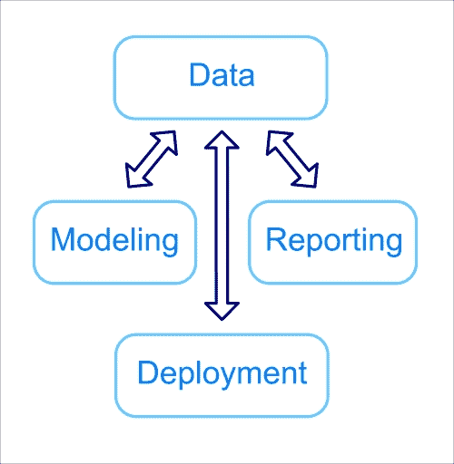
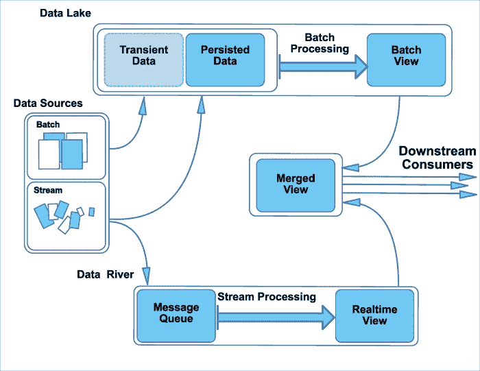
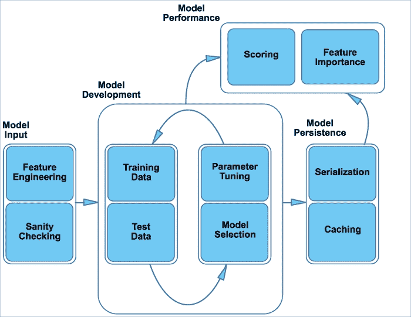
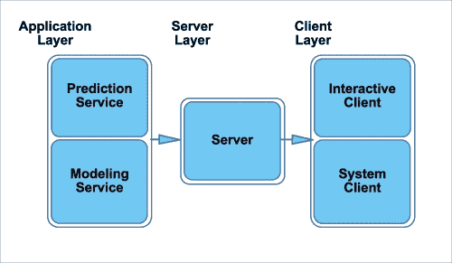
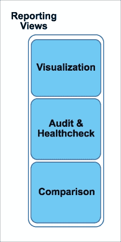
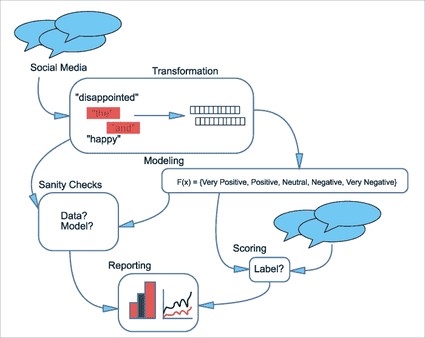

# 第一章：从数据到决策 - 开始使用分析应用

从季度财务预测到客户调查，分析帮助企业在做出决策和规划未来方面。虽然使用电子表格程序制作的饼图和趋势线等数据可视化已经使用了数十年，但近年来，业务分析师可用的数据源的数量和多样性以及用于解释这些信息的工具的复杂性都有所增长。

互联网的快速增长，通过电子商务和社交媒体平台，产生了大量数据，这些数据比以往任何时候都更快地用于分析。照片、搜索查询和在线论坛帖子都是无法在传统电子表格程序中轻松检查的非结构化数据示例。有了适当的工具，这些类型的数据可以提供新的见解，与或超越传统数据源。

传统上，如历史客户记录之类的数据以结构化、表格形式出现，存储在电子数据仓库中，并易于导入电子表格程序。即使在表格数据的情况下，记录的数量和可用速度也在许多行业中不断增加。虽然分析师可能通过交互式操作将原始数据转换为历史数据，但强大的分析越来越需要能够与业务接收到的数据量和速度相匹配的自动化处理。

除了数据本身，用于检查数据的方法也变得更加强大和复杂。除了总结历史模式或使用来自少数关键输入变量的趋势线来预测未来事件之外，高级分析强调使用复杂的预测建模（如下所述预测分析的目标）来理解现状并预测短期和长期结果。

生成此类预测的多种方法通常需要以下共同要素：

+   我们试图预测的结果或目标，例如购买或搜索结果上的**点击率**（**CTR**）。

+   一组列，这些列组成**特征**，也称为**预测因子**（例如，客户的人口统计信息、销售账户的历史交易或某种广告上的点击行为），描述我们数据集中每个记录的个体属性（例如，一个账户或广告）。

+   一种找到模型或模型集的程序，这些模型或模型集最好地将这些特征映射到给定数据样本中感兴趣的结果。

+   一种评估模型在新数据上性能的方法。

虽然预测建模技术可以在强大的分析应用中使用，以发现看似无关输入之间的复杂关系，但它们也给业务分析师带来了新的挑战：

+   什么方法最适合特定问题？

+   如何正确评估这些技术在历史数据和新技术上的表现？

+   调整给定方法性能的首选策略是什么？

+   如何稳健地扩展这些技术以适应一次性分析和持续洞察？

在本书中，我们将向您展示如何通过开发将数据转化为您和您的业务强大见解的分析解决方案来应对这些挑战。构建这些应用程序涉及的主要任务是：

+   将原始数据转换为可用于建模的清洁形式。这可能涉及清理异常数据以及将非结构化数据转换为结构化格式。

+   特征工程，通过将这些清洁输入转换为用于开发预测模型的格式。

+   在这部分数据的一个子集上校准预测模型并评估其性能。

+   在评估模型持续性能的同时评分新数据。

+   自动化转换和建模步骤以进行常规更新。

+   将模型的输出暴露给其他系统和用户，通常通过 Web 应用程序。

+   为分析师和业务用户生成报告，提炼数据和模型为常规和稳健的见解。

在整个本卷中，我们将使用用 Python 编程语言编写的开源工具来构建这些类型的应用程序。为什么是 Python？Python 语言在健壮的编译语言（如 Java、C++和 Scala）和纯统计软件包（如 R、SAS 或 MATLAB）之间取得了吸引人的平衡。我们可以通过命令行（或，如我们在后续章节中将使用的，基于浏览器的笔记本环境）与 Python 进行交互式工作，绘制数据，并原型化命令。Python 还提供了广泛的库，使我们能够将这种探索性工作转化为 Web 应用程序（如 Flask、CherryPy 和 Celery，我们将在第八章中看到，*通过预测服务共享模型*），或将它们扩展到大型数据集（使用 PySpark，我们将在未来的章节中探讨）。因此，我们可以在同一语言中同时分析数据和开发软件应用程序。

在深入这些工具的技术细节之前，让我们从高层次上看看这些应用背后的概念以及它们的结构。在本章中，我们将：

+   定义分析管道的元素：数据转换、合理性检查、预处理、模型开发、评分、自动化、部署和报告。

+   解释批处理和流处理之间的差异以及它们在管道每个步骤中的影响。

+   检查批处理和流处理如何在 Lambda 架构中联合适应数据处理。

+   探索一个示例流处理管道，以执行社交媒体流量的情感分析。

+   探索一个批处理管道的示例，以生成定向电子邮件营销活动。

### 小贴士

**预测分析的目标**

术语**预测分析**，以及其他如**数据挖掘**和**机器学习**，通常用来描述本书中用于构建分析解决方案的技术。然而，重要的是要记住，这些方法可以解决两个不同的目标。*推理*涉及建立模型以评估参数对结果的影响的重要性，并强调解释和透明度而非预测性能。例如，回归模型的系数（第四章, *通过模型连接点 – 回归方法*)可以用来估计特定模型输入（例如，客户年龄或收入）对输出变量（例如，销售额）的影响。为推理开发的模型的预测可能不如其他技术准确，但提供了有价值的概念洞察，可能指导商业决策。相反，*预测*强调估计结果的准确性，即使模型本身是一个黑盒，其中输入和结果输出之间的联系并不总是清晰的。例如，深度学习（第七章, *从底部学习 – 深度网络和无监督特征*)可以从复杂输入集产生最先进的模型和极其准确的预测，但输入参数和预测之间的联系可能难以解释。

# 设计高级分析解决方案

分析解决方案的基本组成部分是什么？虽然具体设计可能因应用而异，但大多数解决方案都包含以下部分（图 1）：

图 1：分析管道的参考架构

+   **数据层**：这一阶段涉及数据的存储、处理和持久化，以及如何将其提供给下游应用程序，例如我们将在这本书中构建的分析应用程序。如图 1 所示，数据作为**粘合剂**将我们应用程序的其他部分粘合在一起，所有这些部分都依赖于数据层来存储和更新它们状态的信息。这也反映了我们将更详细讨论的**关注点分离**，在第八章, *与预测服务共享模型*和第九章, *报告和测试 – 在分析系统中迭代*中，我们应用程序的其他三个组件可以独立设计，因为它们仅通过数据层进行交互。

+   **建模层**：在此阶段，数据已经被转换成可以被我们的 Python 建模代码摄取的形式。可能还需要进一步的特征工程任务，将清洗后的数据转换为模型输入，以及将数据分割成子集并执行迭代优化和调整的轮次。还需要以可以持久化和部署给下游用户的方式准备模型。此阶段还涉及对新接收的数据进行评分，或随着时间的推移对模型健康进行审计。

+   **部署层**：建模层中的算法开发和性能组件通常通过 Web 服务暴露给人类用户或其他软件系统，这些消费者通过服务器层通过网络调用与它们交互，以触发新的模型开发轮次并查询先前分析的结果。

+   **报告层**：预测、模型参数和洞察都可以通过报告服务进行可视化和自动化。

考虑到这些广泛的组件，让我们更深入地探讨这些各个部分的细节。

## 数据层：仓库、湖泊和流

任何分析管道的开始都是数据本身，它是预测建模的基础。这种输入可以在可用的更新速率和需要应用以形成最终用于预测模型的特征集的转换量方面有所不同。数据层是这个信息的存储库。

传统上，用于分析的数据可能只是简单地存储在磁盘上的平面文件中，例如电子表格或文档。随着数据的多样性和规模增加，存储和处理这些数据所需的资源和复杂性也增加了。确实，现代数据层的观点涵盖了实时（流）数据和批量数据，这在许多潜在的下层使用中都是如此。这个称为**Lambda 架构**（Marz, Nathan, 和 James Warren. *大数据：可扩展实时数据系统的原理和最佳实践*. Manning Publications Co., 2015。）的联合系统，在以下图中进行了说明：

图 2：数据层作为 Lambda 架构

此数据层的组成部分包括：

+   **数据来源**：这些可以是实时流接收到的数据，也可以是定期或不定期的批量更新。

+   **数据湖**: 实时数据和批处理数据通常保存在数据湖模型中，其中使用如**Hadoop 文件系统**（**HDFS**）或**亚马逊网络服务**（**AWS**）的**简单存储服务**（**S3**）等分布式文件系统作为批量接收和流接收数据的通用存储介质。这些数据可以按照固定寿命（临时）或永久（持久）的保留策略进行存储。然后，这些数据可以在 MapReduce 或 Spark 等框架中运行的持续批处理转换，如**提取、加载和转换**（**ETL**）作业中进行处理。ETL 过程可能包括清理数据、将其聚合到感兴趣的指标中，或将其从原始输入重塑为表格形式。这种处理形成了 Lambda 架构的批处理层，其中不期望实时可用性，并且对于呈现数据视图供下游消费的延迟（分钟到几天）是可以接受的。

+   **数据河**: 当数据湖在中央位置累积所有类型的原始数据时，数据河形成了一个持续的消息队列，实时数据被发送到流处理任务。这也被称为架构的**速度层**（Marz, Nathan, and James Warren. *Big Data: Principles and best practices of scalable realtime data systems*. Manning Publications Co., 2015.），因为它在数据可用时立即操作，并期望实时可用性。

+   **合并视图**: 原始数据的实时和批处理视图可以合并到一个共同的持久层，例如结构化表格中的数据仓库，在那里可以使用**结构化查询语言**（**SQL**）进行查询，并在事务性（例如，实时更新银行余额）或分析性（例如，运行分析或报告）应用程序中使用。此类仓库系统的例子包括传统的关系型系统，如 MySQL 和 PostgreSQL（通常在行和列中以表格模式存储数据），以及 NoSQL 系统，如 MongoDB 或 Redis（在键值系统中更灵活地安排数据，其中值可以采用许多格式，而不仅仅是传统的行和列）。这个合并系统也被称为**服务层**（Marz, Nathan, and James Warren. *Big Data: Principles and best practices of scalable realtime data systems*. Manning Publications Co., 2015.），可以直接使用数据库系统进行查询，或者呈现给下游应用程序。

+   **下游应用**: 我们的高级分析管道等系统可以直接消费批处理和实时处理层的输出，或者通过仓库系统中的合并视图与这些来源之一或两者进行交互。

在数据层中，流式数据和批处理数据如何被不同地处理？在批处理管道中，接收和处理数据之间的允许延迟允许对源数据进行潜在的复杂转换：元素可能被聚合（例如，计算用户或产品在一定时间内的平均属性），与其他来源连接（例如，在搜索日志上索引额外的网站元数据），以及过滤（例如，许多网络日志系统需要删除会扭曲预测模型结果的其他机器人活动）。源数据可能来自服务器上发布的简单文本文件、关系数据库系统，或不同存储格式的混合（见下文）。

相反，由于必须快速消费传入数据，流式处理通常涉及比批处理作业更简单的输入处理，并使用简单的过滤器或转换。此类应用的来源通常是来自网络服务（如社交媒体或新闻源）、事件（如车辆和手机的地理位置）或客户活动（如搜索或点击）的持续更新的流。

在此阶段，选择批处理和流处理主要取决于数据源，数据源可以是持续更新的事件系列（流式处理）或较大、定期可用的块（批处理）。在某些情况下，数据的性质也会决定后续管道的形式，以及对实时或更高延迟处理的强调。在其他情况下，应用的使用将优先于下游选择。数据层中呈现的标准化视图将在分析管道的下一阶段，即建模层中使用。

## 建模层

建模层涉及许多相互关联的任务，如下面的图所示（**图 3**）。由于数据层可以容纳实时和批处理数据，我们可以想象两种主要的建模系统：

+   流式管道对可用的连续数据源（如即时消息或新闻源）立即进行操作，这可能允许实时模型更新或评分。然而，实时更新模型的能力可能因算法而异（例如，对于使用随机更新的模型，请参阅第五章，*将数据放在合适的位置 – 分类方法和分析*），并且某些模型只能在离线过程中开发。流式数据的潜在体积也可能意味着它不能以原始形式存储，而只能在丢弃原始记录之前转换为更易于管理的格式。

+   **批量处理**。定期更新（通常为每日）的数据源通常使用面向批量的框架进行处理。输入数据不需要在可用时立即使用，更新之间的延迟通常为几小时或几天，通常是可以接受的，这意味着数据处理和模型开发通常不是实时进行的。

### 注意

在表面上，选择这两类管道似乎涉及实时（流式）或离线（批量）分析之间的权衡。在实践中，这两类管道可以在单个应用程序中混合使用实时和非实时组件。

如果这两种类型的管道对于给定问题都是可行的（例如，如果流是股票价格，一个体积大且格式简单——一组数字——的数据集应该允许它被轻松离线存储并在稍后日期完整处理），那么选择这两个框架可能由技术或业务问题决定。例如，有时预测模型中使用的方法只允许批量更新，这意味着连续处理接收到的流不会增加额外的价值。在其他情况下，由预测模型提供的信息对业务决策的重要性需要实时更新，因此将受益于流处理。

图 3：建模层概述

图 3 中所示每种类型管道的通用组件的详细信息如下：

在**模型输入**步骤中，源数据被加载，并且可能通过管道转换为预测模型所需的输入。这可能只是公开数据库表中的一部分列，或者将非结构化源（如文本）转换为可能输入到预测模型的形式。如果我们很幸运，我们希望在模型中使用的特征已经以它们在原始数据中存在的形式存在。在这种情况下，模型拟合直接在输入上进行。更常见的是，输入数据仅包含我们可能希望用作模型输入的基本信息，但需要将其处理成可用于预测的形式。

在数值数据的情况下，这可能采取离散化或转换的形式。离散化涉及将一个连续的数字（例如订阅服务的消费者使用年限）划分为区间（例如，拥有**<30**天或**>=30**天订阅的用户），这要么通过将连续尺度上的异常值阈值化到一个合理的区间数量来减少数据集中的变化，要么将数值范围转换为具有更多直接商业含义的值集。离散化的另一个例子是将连续值转换为排名，在这种情况下，我们更关心的是与其他人的相对价值，而不是实际数字。同样，随着指数尺度的变化，可能使用自然对数进行转换，以减少大值对建模过程的影响。

除了这些类型的转换之外，数值特征可能以比率、总和、乘积或其他组合的形式结合，从而从几个基本输入中产生潜在的特征组合爆炸。在某些模型中，这些类型的交互需要通过在输入之间生成这样的组合特征来明确表示（例如，我们在第四章中讨论的回归模型，*通过模型连接点 – 回归方法*）。其他模型具有在数据集中解码这些交互的能力，而无需我们直接创建特征（例如，第五章中的随机森林算法，*将数据放在其位置 – 分类方法和分析*或第六章中的梯度提升决策树，*文字和像素 – 处理非结构化数据*）。

在分类数据的情况下，例如国家代码或星期几，我们可能需要将类别转换为数值描述符。这可能是一个数字（如果数据是序数的，例如，值为`2`的含义是大于值为`1`的记录），或者是一个具有一个或多个非零条目的向量，指示分类特征所属的类别（例如，一个文档可以表示为一个与英语词汇表长度相同的向量，其中的数字表示特定向量位置所代表的单词在文档中出现的次数）。

最后，我们可能会发现一些情况，我们希望发现由特定输入集表示的隐藏特征。例如，收入、职业和年龄都可能与其居住的邮政编码相关。如果地理变量不是我们的数据集的一部分，我们仍然可以使用降维技术发现这些共同的潜在模式，正如我们将在第六章“文字和像素 - 处理非结构化数据”中讨论的那样。

在这个阶段也可能进行合理性检查，因为当数据异常出现时，如可能降低模型性能的异常值，及时发现这些异常至关重要。在质量检查的第一阶段，评估输入数据以防止异常值或错误数据影响后续阶段模型的质量。这些合理性检查可能采取多种形式：对于分类数据（例如，一个州或国家），只有固定数量的允许值，这使得排除错误输入变得容易。在其他情况下，这种质量检查基于经验分布，例如与平均值的变化，或合理的最小或最大范围。更复杂的情况通常源于业务规则（例如，某个地区产品不可用，或网络会话中特定 IP 地址组合不合理）。

这样的质量检查不仅作为建模过程的保障措施，还可以作为对事件（如网站上的机器人流量）的警告，这些事件可能表明恶意活动。因此，这些审计规则也可能作为管道结束时可视化和报告层的一部分被纳入。

在模型开发后的第二轮质量检查中，我们希望评估模型的参数是否合理，以及测试数据上的性能是否在可接受的部署范围内。前者可能涉及在技术允许的情况下绘制模型的重要参数，这些可视化结果也可以在下一步的报告中使用。同样，第二类检查可能包括查看准确度统计信息，如精确度、召回率或平方误差，或者测试集与用于模型生成数据之间的相似性，以确定报告的性能是否合理。

与第一轮合理性检查一样，这些质量控制措施不仅可以帮助监控模型开发过程的状态，还可能突出实际建模代码本身的变化（特别是如果预期该代码将定期更新）。

在合理性检查过程中，流式处理和批量处理之间本质上没有太大的区别，只是应用程序在发现源数据或建模过程中的异常并将其传递到报告层时的延迟。合理性检查的复杂性可能会指导这一决策：可以在实时进行的简单检查非常适合流处理，而评估预测模型的属性可能需要比算法本身训练更长的时间，因此更适合批量处理。

在模型开发或更新步骤中，一旦输入数据经过任何必要的处理或转换步骤并通过上述描述的质量检查，它就准备好用于开发预测模型了。这个分析流程的阶段可以包含几个步骤，具体形式取决于应用：

+   **数据拆分**：在这个阶段，我们通常将数据拆分为不重叠的集合，即训练数据（我们将从中调整算法的参数）和测试数据（用于评估目的）。进行这种拆分的重要原因是为了使模型能够泛化到其初始输入（训练数据）之外的数据，我们可以通过评估其在测试集上的性能来检查这一点。

+   **参数调整**：正如我们将在后续章节中更详细地探讨的那样，许多预测模型都有多个超参数——在模型参数可以针对训练集进行优化之前需要设置的变量。例如，聚类应用中的组数（第三章, *在噪声中寻找模式 – 聚类和无监督学习*），随机森林中使用的树的数量 第四章, *用模型连接点 – 回归方法*），或者神经网络中的学习率和层数（第七章, *自下而上学习 – 深度网络和无监督特征*）。这些超参数通常需要通过网格搜索 (第五章, *将数据放在合适的位置 – 分类方法和分析*）或其他方法进行校准，以实现预测模型的最佳性能。这种调整只能在模型开发的初始阶段进行，或者作为常规重新训练周期的一部分。在超参数调整之后或与其同时，参数，如回归系数或树模型中的决策分割 第四章, *用模型连接点 – 回归方法*，将针对给定的训练数据集进行优化。根据方法的不同，这一步还可能涉及变量选择——从输入数据中剪枝无信息特征的过程。最后，我们可能需要对多个算法执行上述任务，并选择表现最佳的技术。

    批处理和流式处理过程在此阶段可能会因算法的不同而有所区别。例如，在允许通过随机学习进行增量更新的模型中（第五章, *将数据放在合适的位置 – 分类方法和分析*），新数据可以以流的形式进行处理，因为每个新的训练示例都可以单独调整模型参数。相反，数据可能以流的形式到达，但会聚合到足够大的规模，此时才会启动批处理过程以重新训练模型。一些模型允许两种类型的训练，选择更多取决于输入数据的预期波动性。例如，社交媒体帖子中的快速趋势信号可能表明在事件可用时立即更新模型，而基于长期事件（如家庭购买模式）的模型可能不要求这种持续的更新。

+   **模型性能**：使用在模型开发期间分割出的测试数据或一组全新的观测数据，建模层还负责对新数据进行评分、在模型中突出显示重要特征，并提供关于其持续性能的信息。一旦模型在一系列输入数据上被训练，它就可以应用于新数据，无论是实时计算还是通过离线批量处理来生成预测结果或行为。

    根据初始数据处理的程度，新的记录可能还需要转换以生成模型评估所需的适当特征。这种转换的程度可能决定了评分最好是通过流式或批量框架来完成。

    同样，结果的预测使用可能指导选择流式或批量导向的处理。当这些评分被用作其他响应系统的输入（如重新排序搜索结果或网页上展示的广告）时，来自流式管道的实时更新允许立即使用新的评分，因此可能很有价值。当评分主要用于内部决策（如优先处理销售线索以进行跟进）时，实时更新可能不是必需的，可以使用批量导向的框架。这种延迟差异可能与下游消费者是另一个应用程序（机器到机器交互）还是依赖模型进行洞察的人类用户有关。

+   **模型持久化**：一旦我们调整了预测模型的参数，结果可能还需要打包或序列化为一种格式，以便在生产环境中部署。我们将在第八章共享预测服务中的模型中更深入地探讨这一点，但简要来说，这个过程涉及将模型输出转换为下游系统可用的形式，并将其保存回数据层，以便进行灾难恢复以及可能由下游的报表层使用，如下所述。

## 部署层

我们预测建模的输出可以通过部署层广泛提供给个人用户和其他软件服务，该部署层将上一层的建模、评分和评估功能封装在 Web 应用程序中，如下面的图 4 所示：

图 4：部署层组件

这个**应用层**通过网页接收网络调用，这些调用是通过网页浏览器或由其他软件系统生成的程序性请求传输的。正如我们将在第八章中描述的那样，*与预测服务共享模型*，这些应用程序通常提供一组标准命令来启动操作、获取结果、保存新信息或删除不需要的信息。它们还通常与数据层交互，以存储结果，在长时间运行的任务的情况下，存储建模计算进度的信息。

这些应用程序接收到的网络调用由服务器层代理，该层的作用是在应用程序之间路由流量（通常基于`url`模式）。正如我们将在第八章中介绍的那样，*与预测服务共享模型*，这种服务器和应用程序之间的分离使我们能够通过添加更多机器来扩展我们的应用程序，并独立添加更多服务器以平衡传入的请求。

**客户端层**，它启动服务器接收到的请求，可以是交互式系统，如仪表板，也可以是独立系统，如电子邮件服务器，该服务器使用模型的输出来安排发出的消息。

## 报告层

分析管道的输出可能由报告层呈现，这涉及许多不同的任务，如下面的图 5 所示：

图 5：预测服务的报告应用

+   **可视化**：这可以允许对源数据和模型数据进行交互式查询，例如参数和特征重要性。它还可以用于可视化模型输出，例如在电子商务网站上提供给用户的推荐集，或分配给特定银行账户的风险评分。由于它通常以交互式模式使用，我们还可以考虑将大型模型输入汇总到汇总数据集中，以在探索会话期间降低延迟。此外，可视化可以是临时的过程（例如我们将在未来章节中检查的交互式笔记本），也可以是一系列固定的图形（例如我们在第九章中构建的仪表板，*报告和测试 – 在分析系统中迭代*）。

+   **审计/健康检查**：报告服务涉及对应用的持续监控。确实，开发健壮的分析管道的一个重要因素是定期评估，以确保模型按预期运行。通过结合许多先前步骤的输出，例如质量控制检查和新数据的评分，报告框架将这些统计数据可视化，并将它们与先前值或黄金标准进行比较。这种类型的报告既可以由分析师用来监控应用，也可以作为一种方式，将建模过程中发现的见解呈现给更大的业务组织。

+   **比较报告**：在通过实验过程迭代模型开发时，这可能被用来，正如我们在第九章中讨论的，*报告和测试 – 在分析系统中迭代*。因为这种分析可能涉及统计测量，可视化可能需要与部署层中的服务结合来计算显著性指标。

    批处理与流处理过程的选择通常会决定此类报告是否可以实时提供，但仅仅因为它们可以立即获得，并不意味着这种频率对用户有价值。例如，即使可以实时收集用户对广告活动的响应率，关于未来广告计划的决策可能受到季度商业计划的限制。相比之下，对特定搜索查询趋势的兴趣也可能使我们能够快速调整推荐算法的结果，因此这种低延迟信号是有价值的。再次强调，需要根据特定的用例进行判断。

    为了结束这个介绍，让我们考察一对假设的应用程序，这些应用程序说明了我们上面描述的许多组件。不必过于担心所有术语的确切含义，这些将在后续章节中进一步阐述。

# 案例研究：社交媒体流量的情感分析

考虑一个想要通过监控社交媒体网站上的品牌情绪来评估其活动有效性的市场营销部门。因为情绪的变化可能对整个公司产生负面影响，这种分析是在实时进行的。本例的概述如图 6 所示。

图 6：社交媒体情感分析案例研究图示

## 数据输入和转换

此应用程序的输入数据是社交媒体帖子。这些数据是实时可用的，但需要应用多个步骤才能使其可用于情感评分模型。需要过滤掉常见词语（如**和**和**the**），选择实际涉及公司的消息，以及需要对拼写错误和单词大小写进行归一化。一旦完成清理，进一步的转换可能将消息转换为向量，其中包含模型允许词汇表中每个单词的计数，或者将其散列以填充固定长度的向量。

## 理性检查

前面转换的输出需要经过理性检查——是否有用户发送了异常大量的消息（这可能表明是机器人垃圾邮件）？输入中是否有意外的词语（这可能是由于字符编码问题造成的）？是否有任何输入消息的长度超过了服务允许的消息大小（这可能表明输入流中的消息分割不正确）？

一旦模型开发完成，理性检查需要一些人工指导。模型预测的情感是否与人类读者的判断相关？模型中对应给定情感的高概率词语是否具有直观意义？

这些以及其他理性检查可以可视化为一个网页或文档摘要，可以被模型开发者用来评估模型健康状况，以及营销团队的其余成员用来理解可能对应积极或消极品牌情感的新主题。

## 模型开发

在此流程中使用的模型是多项逻辑回归（第五章

图 7：电子邮件定向案例研究图

## 数据输入和转换

在初始数据摄取步骤中，存储在公司数据仓库（关系数据库系统）中的客户记录被聚合以生成特征，例如每周平均花费金额、客户访问公司网站频率以及多个类别（如家具、电子产品、服装和媒体）中购买的商品数量。这些特征与电子邮件活动中可能推广的商品集的特征相结合，例如价格、品牌以及网站上类似商品的平均评分。这些特征通过每周一次的批量处理构建，在发送电子邮件之前，在周一对客户进行。

## 精神检查

模型的输入将检查其合理性：客户的平均购买行为或交易量是否远超出预期范围？这可能会表明数据仓库处理中的错误，或者网站上的机器人流量。由于构建模型特征涉及到的转换逻辑复杂，并且可能随着模型的发展而变化，因此其输出也将进行检查。例如，购买数量和平均价格不应低于零，且没有任何商品类别应有零条记录。

在电子邮件消息之前对潜在项目进行评分后，每个客户得分最高的项目将通过与客户的过往交易（以确定其是否合理）进行比较进行合理性检查，或者如果没有历史记录，则与在人口统计上最相似的客户的购买行为进行比较。

## 模型开发

在本例中，该模型是一个随机森林回归第四章*使用模型连接点 – 回归方法*，它将历史项目 – 客户对划分为购买（**标记为 1**）和非购买（**标记为 0**），并产生一个评分概率，即客户 A 购买**项目 X**。该模型的一个复杂性在于，尚未购买的项目可能只是尚未被客户看到，因此对负例施加了限制，即必须从网站上已上架一个月或更长时间的项目中抽取。此模型的超参数（每棵树的数量和大小）在每周重新训练期间进行校准，同时校准个别变量对结果预测的影响。

## 评分

每周使用历史数据重新训练模型后，网站上的新项目将使用此模型为每个客户进行评分，并将前三项发送到电子邮件营销活动中。

## 可视化和报告

任何类型的合理性检查（无论是输入数据还是模型性能）都可以是模型定期诊断报告的一部分。由于随机森林模型比其他方法更复杂，因此特别重要的是要监控特征重要性和模型准确性的变化，因为问题可能需要更多时间来调试和解决。

由于预测在生产系统中使用，而不是直接提供洞察，因此此类报告主要供开发管道的分析师使用，而不是营销部门的其他成员。

这些促销电子邮件的成功通常会在接下来的一个月内进行监控，关于准确性的更新（例如，有多少电子邮件导致了超出预期水平的购买）可以成为长期报告的基础，该报告可以帮助指导活动的结构（例如，改变信息中的项目数量）以及模型（如果预测似乎在周之间变得明显更差，可能需要更频繁地进行训练）。

### 小贴士

**下载示例代码**

你可以从[`www.packtpub.com`](http://www.packtpub.com)的账户下载此书的示例代码文件。如果你在其他地方购买了这本书，你可以访问[`www.packtpub.com/support`](http://www.packtpub.com/support)并注册，以便将文件直接通过电子邮件发送给你。

你可以通过以下步骤下载代码文件：

+   使用你的电子邮件地址和密码登录或注册我们的网站。

+   将鼠标指针悬停在顶部的**支持**标签上。

+   点击**代码下载与勘误表**。

+   在**搜索**框中输入书籍名称。

+   选择你想要下载代码文件的书籍。

+   从下拉菜单中选择你购买此书籍的来源。

+   点击**代码下载**。

文件下载完成后，请确保使用最新版本的以下软件解压或提取文件夹：

WinRAR / 7-Zip（适用于 Windows）

+   Zipeg / iZip / UnRarX（适用于 Mac）

+   7-Zip / PeaZip（适用于 Linux）

# 摘要

完成本章后，你现在应该能够描述分析管道的核心组件以及它们之间的交互方式。我们还探讨了批处理和流处理之间的差异，以及每种类型的应用程序适合的用例。我们还通过使用这两种范例的示例以及每一步所需的设计决策进行了说明。

在以下章节中，我们将发展之前描述的概念，并对案例研究中提出的一些技术术语进行更深入的探讨。在第二章，*使用 Python 进行探索性数据分析和可视化*中，我们将介绍使用开源 Python 工具进行交互式数据可视化和探索。第三章，*在噪声中寻找模式 - 聚类和无监督学习*描述了如何使用聚类方法（也称为无监督学习）在数据集中识别相关对象的组。相比之下，第四章，*用模型连接点 - 回归方法*和第五章，*将数据放在合适的位置 - 分类方法和分析*探讨了监督学习，无论是用于连续结果，如价格（在第四章[第四章. 用模型连接点 - 回归方法]中使用的回归技术），还是用于分类响应，如用户情绪（在第五章[第五章. 将数据放在合适的位置 - 分类方法和分析]中描述的分类模型）。给定大量特征或复杂数据，如文本或图像，我们可能通过执行降维来受益，如第六章[第六章. 文字和像素 - 处理非结构化数据]中所述，*文字和像素 - 处理非结构化数据*。或者，我们可以使用更复杂的方法，如第七章[第七章. 从底部学习 - 深度网络和无监督特征]中涵盖的深度神经网络，*从底部学习 - 深度网络和无监督特征*，这些方法可以捕捉输入变量之间的复杂交互。为了将这些模型用于商业应用，我们将在第八章[第八章. 与预测服务共享模型]中开发一个 Web 框架来部署分析解决方案，*与预测服务共享模型*，并在第九章[第九章. 报告和测试 - 在分析系统中迭代]中描述系统的持续监控和改进，*报告和测试 - 在分析系统中迭代*。

在整个过程中，我们将强调这些方法是如何工作的，以及在不同问题之间选择不同方法的实用技巧。通过分析代码示例，将展示构建和维护适用于您自己用例的应用程序所需的组件。有了这些预备知识，让我们接下来深入探讨一些使用笔记本进行的数据探索分析：这是一种强大的记录和分享分析的方法。
