# 第四章. 通过模型连接点 – 回归方法

趋势线是许多商业分析中的常见特征。当在主页上更频繁地展示广告时，购买量会增加多少？根据用户年龄，社交媒体上视频的平均评分是多少？如果客户在 6 个月前购买了第一个产品，他们从你的网站上购买第二个产品的可能性有多大？这些问题可以通过绘制一条线来回答，这条线表示随着输入（例如，用户年龄或过去购买量）的变化，我们的响应（例如，购买或评分）的平均变化，并基于历史数据使用它来外推未来数据的响应（在这种情况下，我们只知道输入，但不知道输出）。计算这条线被称为**回归**，基于假设我们的观察值围绕着两个变量之间真实关系的周围散布，并且平均来说，未来的观察值将回归（接近）输入和输出之间的趋势线。

在实际应用中，几个复杂性使得这种分析变得复杂。首先，我们拟合的关系通常涉及不止一个输入，而不仅仅是单一输入。我们不能再画一个二维线来表示这种多变量关系，因此必须越来越多地依赖更高级的计算方法来计算这个在多维空间中的趋势。其次，我们试图计算的趋势甚至可能不是一条直线——它可能是一条曲线、一个波或更复杂的模式。我们可能也有比我们需要的更多变量，需要决定哪些，如果有的话，与当前问题相关。最后，我们需要确定不仅是最适合我们已有数据的趋势，而且也是对新数据推广得最好的趋势。

在本章中，我们将学习：

+   如何为回归问题准备数据

+   如何在给定问题中选择线性或非线性方法

+   如何进行变量选择和评估过拟合

# 线性回归

**普通最小二乘法**（**OLS**）。

我们将从最简单的线性回归模型开始，尝试通过我们拥有的数据点拟合最佳直线。回忆一下，线性回归的公式是：

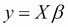

其中 y 是我们试图预测的 n 个响应的向量，X 是长度为 n 的输入变量的向量，β 是斜率响应（响应 y 在 X 的值增加 1 个单位时增加多少）。然而，我们很少只有一个输入；相反，X 将代表一组输入变量，响应 y 是这些输入的线性组合。在这种情况下，称为多元线性回归，X 是 n 行（观测值）和 m 列（特征）的矩阵，β 是斜率或系数的向量集，当乘以特征时给出输出。本质上，它只是包含许多输入的趋势线，但也将允许我们比较不同输入对结果的影响程度。当我们试图使用多元线性回归拟合模型时，我们还假设响应包含一个白噪声误差项 ε，它是一个均值为 0 且对所有数据点具有恒定方差的正态分布。

为了求解此模型中的系数 β，我们可以进行以下计算：

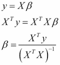

β 的值是系数的普通最小二乘估计。结果将是一个系数 β 的向量，用于输入变量。我们对数据做出以下假设：

+   我们假设输入变量（X）被准确测量（我们给出的值中没有误差）。如果不是这样，并且包含了误差，那么它们代表随机变量，我们需要在我们的响应估计中包含这个误差，以便准确。

+   响应是输入变量的线性组合——换句话说，我们需要能够在响应中拟合一条直线。正如我们将在本章后面看到的那样，我们可以经常进行变换，将非线性数据转换为线性形式以满足这个假设。

+   响应 y 的残差（拟合值与实际响应之间的差异）假设在其值域内具有恒定的方差。如果情况并非如此（例如，如果 y 的较小值比较大值具有较小的误差），那么这表明我们没有适当地在我们的模型中包含一个误差来源，因为在我们考虑了预测变量 X 之后，剩下的唯一变化应该是误差项 ε。如前所述，这个误差项 ε 应该具有恒定的方差，这意味着拟合应该具有恒定的残差方差。

+   假设残差与预测值 X 的值不相关。这一点很重要，因为我们假设我们试图拟合一条通过每个预测值处的响应数据点平均值的线，如果我们假设残差误差在 0 周围随机分布，这将是非常准确的。如果残差与预测值的值相关，那么准确拟合数据的线可能不会通过平均值，而是由数据中的潜在相关性决定。例如，如果我们正在查看时间序列数据，一周中的某一天可能有一个 7 天的模式，这意味着我们的模型应该拟合这个周期性，而不是试图简单地通过所有天的数据点来画一条线。

+   假设预测变量之间不存在共线性（彼此相关）。如果两个预测变量相同，那么当我们对输入矩阵 X 进行线性组合时，它们会相互抵消。正如我们上面在β的推导中看到的，为了计算系数，我们需要取逆。如果矩阵中的列完全相互抵消，那么这个矩阵(XTX)^-1 是秩亏的，没有逆。回想一下，如果一个矩阵是满秩的，它的列（行）不能由其他列（行）的线性组合来表示。一个秩亏的矩阵没有逆，因为如果我们试图解决由以下线性系统表示的问题：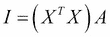

    当 A 是我们试图解决的逆矩阵，I 是单位矩阵时，我们将在解的列中遇到完全相互抵消的情况，这意味着任何一组系数都可以解决这个方程，我们无法得到一个唯一解。

为什么 OLS 公式对于β的估计代表系数的最佳估计？原因是这个值最小化了平方误差：

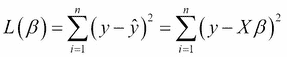

尽管这个事实的推导超出了本文的范围，但这个结果被称为高斯-马尔可夫定理，它表明 OLS 估计量是系数β的最佳线性无偏估计量（BLUE）。回想一下，当我们估计这些系数时，我们是在假设我们的计算存在一些误差，并且与真实（未见的）值有所偏差。因此，BLUE 是具有从这些真实值中最小平均误差的系数β的集合。更多细节，我们建议读者参考更全面的文本（Greene, William H. 经济计量分析. Pearson Education India, 2003; Plackett, Ronald L. "一些最小二乘定理." 生物统计学 37.1/2 (1950): 149-157）。

根据问题和数据集，我们可以使用基本线性模型的扩展方法放松上述许多假设。在我们探索这些替代方案之前，让我们从一个实际例子开始。我们将为此练习使用的数据是从网站[`mashable.com/`](http://mashable.com/)获取的一系列新闻文章。（Fernandes, Kelwin, Pedro Vinagre, and Paulo Cortez. "A Proactive Intelligent Decision Support System for Predicting the Popularity of Online News." Progress in Artificial Intelligence. Springer International Publishing, 2015. 535-546.）。每篇文章都使用诸如单词数量和发布日期等特征进行了注释——完整的列表出现在与此练习相关的数据文件中。任务是使用这些其他特征预测流行度（数据集中的共享列）。在拟合第一个模型的过程中，我们将检查在这种分析中出现的常见特征准备任务。

## 数据准备

让我们首先通过输入以下命令来查看数据：

```py
>>> news = pd.read_csv('OnlineNewsPopularity.csv',sep=',')
>>> news.columns

```

这给出了以下输出：

```py
Index(['url', ' timedelta', ' n_tokens_title', ' n_tokens_content',        ' n_unique_tokens', ' n_non_stop_words', ' n_non_stop_unique_tokens',        ' num_hrefs', ' num_self_hrefs', ' num_imgs', ' num_videos',        ' average_token_length', ' num_keywords', ' data_channel_is_lifestyle',        ' data_channel_is_entertainment', ' data_channel_is_bus',        ' data_channel_is_socmed', ' data_channel_is_tech',        ' data_channel_is_world', ' kw_min_min', ' kw_max_min', ' kw_avg_min',        ' kw_min_max', ' kw_max_max', ' kw_avg_max', ' kw_min_avg',        ' kw_max_avg', ' kw_avg_avg', ' self_reference_min_shares',        ' self_reference_max_shares', ' self_reference_avg_sharess',        ' weekday_is_monday', ' weekday_is_tuesday', ' weekday_is_wednesday',        ' weekday_is_thursday', ' weekday_is_friday', ' weekday_is_saturday',        ' weekday_is_sunday', ' is_weekend', ' LDA_00', ' LDA_01', ' LDA_02',        ' LDA_03', ' LDA_04', ' global_subjectivity',        ' global_sentiment_polarity', ' global_rate_positive_words',        ' global_rate_negative_words', ' rate_positive_words',        ' rate_negative_words', ' avg_positive_polarity',        ' min_positive_polarity', ' max_positive_polarity',        ' avg_negative_polarity', ' min_negative_polarity',        ' max_negative_polarity', ' title_subjectivity',        ' title_sentiment_polarity', ' abs_title_subjectivity',        ' abs_title_sentiment_polarity', ' shares'],       dtype='object')

```

如果你仔细观察，你会意识到所有列名都有前导空格；你可能在第一次尝试使用名称作为索引提取某一列时就已经发现了这一点。我们数据准备的第一步是使用以下代码从每个列名中去除空格来修复这种格式：

```py
>>> news.columns = [ x.strip() for x in news.columns]

```

现在我们已经正确格式化了列标题，让我们使用`describe()`命令检查数据的分布，就像我们在前面的章节中看到的那样：

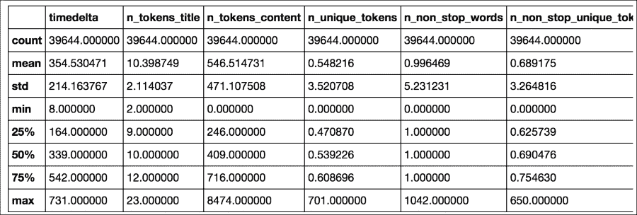

当你从左到右滚动列时，你会注意到每列中值的范围差异很大。有些列的最大值在几百或几千，而其他列则严格在 0 到 1 之间。特别是，我们试图预测的值，即共享值，分布非常广泛，如果我们使用以下命令绘制分布图，就可以看到：

```py
>>> news['shares'].plot(kind='hist',bins=100)

```

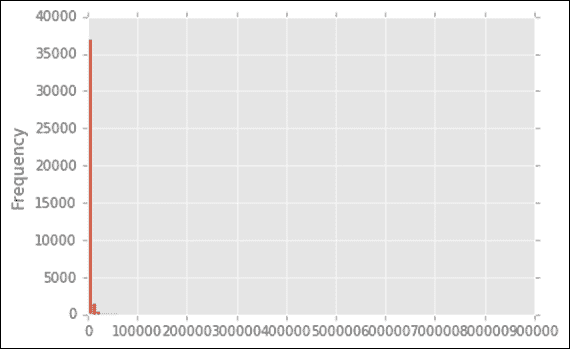

为什么这种分布是个问题？回想一下，从概念上讲，当我们通过数据集拟合一条线时，我们是在寻找以下方程的解：


其中 y 是响应变量（如份额），β是通过 X 列的 1 单位变化增加/减少响应值的向量斜率。如果我们的响应是对数分布的，那么系数将偏向于适应极端大的点，以最小化给定以下拟合的总误差：

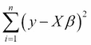

为了减少这种影响，我们可以对响应变量进行对数变换，正如以下代码所示，这使得分布看起来更像正态曲线：

```py
>>> news['shares'].map( lambda x: np.log10(x) ).plot(kind='hist',bins=100)

```

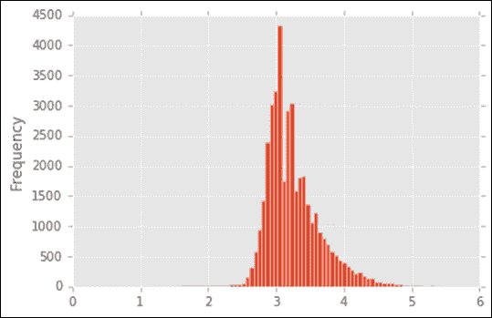

这个经验法则同样适用于我们的预测变量 X。如果某些预测变量比其他变量大得多，我们方程的解将主要强调那些范围最大的变量，因为它们将对总体误差贡献最大。在这个例子中，我们可以系统地使用对数转换来缩放所有变量。首先，我们移除所有无信息列，例如 URL，它只是为文章提供网站位置。

```py
>>> news_trimmed_features = news.ix[:,'timedelta':'shares']

```

### 注意

注意，在第六章*文字与像素 - 处理非结构化数据*中，我们将探讨利用文本数据中信息（如 url）的潜在方法，但到目前为止，我们只是简单地丢弃它。

然后，我们确定要转换的变量（这里一个简单的经验法则是，它们的最大值，由 describe()数据框的第 8 行（索引 7）给出，大于 1，表明它们不在 0 到 1 的范围内）并使用以下代码应用对数转换。请注意，我们给每个对数转换的变量加 1，以避免对 0 取对数时出现错误。

```py
>>> log_values = list(news_trimmed_features.columns[news_trimmed_features.describe().reset_index().loc[7][1:]>1])
>>> for l in log_values:
…    news_trimmed_features[l] = np.log10(news_trimmed_features[l]+1)

```

再次使用 describe()命令确认，现在列具有可比的分布：


我们还需要从数据集中移除无穷大或不存在的数据。我们首先使用以下方法将无穷大值转换为占位符“不是一个数字”，或 NaN：

```py
>>> news_trimmed_features = news_trimmed_features.replace([np.inf, -np.inf], np.nan)

```

然后，我们使用`fill`函数用列中的前一个值替换*NaN*占位符（我们也可以指定一个固定值，或使用列中的前一个值）如下：

```py
>>> news_trimmed_features = news_trimmed_features.fillna(method='pad')

```

现在，我们可以将数据分为响应变量（`'shares'`）和特征（从`'timedelta'`到`'abs_title_sentiment_polarity'`的所有列），这些我们将作为后面描述的回归模型的输入使用以下命令：

```py
>>> news_response = news_trimmed_features['shares']
>>> news_trimmed_features = news_trimmed_features.ix[:,'timedelta':'abs_title_sentiment_polarity']

```

现在，让我们再看看我们没有进行对数转换的变量。如果你现在尝试使用数据集拟合线性模型，你会发现其中许多斜率非常大或非常小。这可以通过查看剩余变量代表的内容来解释。例如，一组我们没有进行对数转换的列编码了一个新闻文章是否在特定一周的某一天发布的`0/1`值。另一个（标注 LDA）提供了一个`0/1`指示符，表示文章是否被标记为特定算法定义的主题（我们将在第六章*文字与像素 - 处理非结构化数据*中更详细地介绍这个算法，称为潜在狄利克雷分配）。在这两种情况下，数据集中的任何行都必须在这些特征的一列中具有值 1（例如，星期几必须取七个潜在值之一）。这为什么会成为问题？

记住，在大多数线性拟合中，我们都有一个斜率和一个截距，这是线在 *x-y* 平面原点 (*0, 0*) 的垂直偏移。在具有许多变量的线性模型中，我们通过特征矩阵 X 中的一个全 1 列来表示这个多维截距，这在许多模型拟合库中默认添加。这意味着一组列（例如，一周中的某一天），由于它们是独立的，可以形成一个线性组合，正好等于截距列，这使得无法找到斜率 β 的唯一解。这与我们之前讨论的线性回归的最后一个假设相同，即矩阵 (XTX) 不可逆，因此我们无法获得系数的数值稳定解。这种不稳定性导致如果你在这个数据集上拟合回归模型，你会观察到系数值不合理地大。正因为如此，我们可能需要省略截距列（通常需要在建模库中指定此选项），或者省略这些二元变量的某一列。在这里，我们将执行第二种方法，使用以下代码从每个二元特征集省略一列：

```py
>>> news_trimmed_features = news_trimmed_features.drop('weekday_is_sunday',1)
>>> news_trimmed_features = news_trimmed_features.drop('LDA_00',1)

```

现在我们已经处理了这些特征工程问题，我们准备将回归模型拟合到我们的数据上。

## 模型拟合和评估

现在我们准备将回归模型拟合到我们的数据上，明确分析目标是重要的。正如我们在第一章中简要讨论的，“从数据到决策 – 开始使用分析应用”，建模的目标可以是 a) 根据历史数据预测未来的响应，或 `b`) 推断给定变量对结果的影响的统计意义和效应。

在第一种情况下，我们将选择数据的一个子集来训练我们的模型，然后在一个独立的数据集上评估线性模型的拟合优度，这个数据集没有用于推导模型参数。在这种情况下，我们希望验证模型所表示的趋势是否可以推广到特定数据点之外。虽然线性模型的系数输出是可解释的，但在这个场景中，我们更关心的是我们能否准确预测未来的响应，而不是系数的意义。

在第二种情况下，我们可能根本不使用测试数据集进行验证，而是使用所有数据来拟合线性模型。在这种情况下，我们更感兴趣的是模型的系数以及它们是否具有统计学意义。在这个场景中，我们通常还感兴趣的是比较具有更多或更少系数的模型，以确定预测结果的最重要的参数。

我们将回到这个第二个案例，但就目前而言，让我们继续假设我们正在尝试预测未来的数据。为了获得测试和验证数据，我们使用以下命令将响应和预测数据分割成 60%的训练和 40%的测试分割：

```py
>>> from sklearn import cross_validation
>>> news_features_train, news_features_test, news_shares_train, news_shares_test = \
>>> cross_validation.train_test_split(news_trimmed_features, news_response, test_size=0.4, random_state=0)

```

我们使用'随机状态'参数来设置随机化的固定结果，这样我们就可以在稍后日期重新运行分析时重现相同的训练/测试分割。有了这些训练和测试集，我们就可以拟合模型，并使用以下代码通过可视化比较预测值和观察值：

```py
>>> from sklearn import linear_model
>>> lmodel = linear_model.LinearRegression().fit(news_features_train, news_shares_train)
>>> plt.scatter(news_shares_train,lmodel.predict(news_features_train),color='black')
>>> plt.xlabel('Observed')
>>> plt.ylabel('Predicted')

```

这给出了以下图：

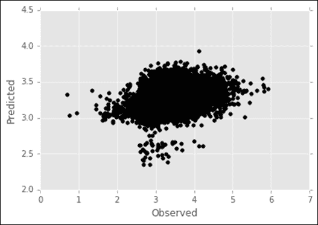

同样，我们可以使用以下命令查看模型在测试数据集上的性能：

```py
>>> plt.scatter(news_shares_test,lmodel.predict(news_features_test),color='red')
>>> plt.xlabel('Observed')
>>> plt.ylabel('Predicted')

```

这给出了以下图：

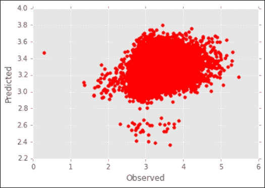

通过观察变异系数，或'R-squared'值，可以确认视觉上的相似性。这是一个在回归问题中常用的指标，它定义了响应中的多少变化可以由模型中预测变量的变化来解释。它被计算为：

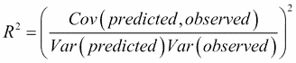

其中`Cov`和`Var`分别是两个变量（观察到的响应 y 和由 yβ给出的预测响应）的**协方差**和**方差**（分别）。完美分数是`1`（一条直线），而`0`表示预测值和观察值之间没有相关性（一个例子是一个球形点云）。使用 scikit learn，我们可以使用线性模型的`score()`方法获得*R²*值，其中特征和响应变量作为参数。运行以下代码来处理我们的数据：

```py
>>> lmodel.score(news_features_train, news_shares_train)
>>> lmodel.score(news_features_test, news_shares_test)

```

训练数据得到`0.129`的值，测试集得到`0.109`的值。因此，我们看到，尽管新闻文章数据中捕获了预测值和观察值之间的一些关系，但我们仍有改进的空间。

除了寻找整体性能外，我们还可能对模型中哪些输入变量最重要感兴趣。我们可以通过绝对值对模型的系数进行排序，使用以下代码来分析排序后的系数位置，并使用这个新索引重新排序列名：

```py
>>> ix = np.argsort(abs(lmodel.coef_))[::-1][:]
>>> news_trimmed_features.columns[ix]

```

这给出了以下输出：

```py
Index([u'n_unique_tokens', u'n_non_stop_unique_tokens', u'n_non_stop_words',        u'kw_avg_avg', u'global_rate_positive_words',        u'self_reference_avg_sharess', u'global_subjectivity', u'LDA_02',        u'num_keywords', u'self_reference_max_shares', u'n_tokens_content',        u'LDA_03', u'LDA_01', u'data_channel_is_entertainment', u'num_hrefs',        u'num_self_hrefs', u'global_sentiment_polarity', u'kw_max_max',        u'is_weekend', u'rate_positive_words', u'LDA_04',        u'average_token_length', u'min_positive_polarity',        u'data_channel_is_bus', u'data_channel_is_world', u'num_videos',        u'global_rate_negative_words', u'data_channel_is_lifestyle',        u'num_imgs', u'avg_positive_polarity', u'abs_title_subjectivity',        u'data_channel_is_socmed', u'n_tokens_title', u'kw_max_avg',        u'self_reference_min_shares', u'rate_negative_words',        u'title_sentiment_polarity', u'weekday_is_tuesday',        u'min_negative_polarity', u'weekday_is_wednesday',        u'max_positive_polarity', u'title_subjectivity', u'weekday_is_thursday',        u'data_channel_is_tech', u'kw_min_avg', u'kw_min_max', u'kw_avg_max',        u'timedelta', u'kw_avg_min', u'kw_max_min', u'max_negative_polarity',        u'kw_min_min', u'avg_negative_polarity', u'weekday_is_saturday',        u'weekday_is_friday', u'weekday_is_monday',        u'abs_title_sentiment_polarity'],       dtype='object')

```

你会注意到参数值的方差信息没有提供。换句话说，我们不知道给定系数值的置信区间，也不知道它是否具有统计显著性。实际上，scikit-learn 回归方法不计算统计显著性测量值，对于这种推断分析——之前在第一章和本章讨论的第二种回归分析——“从数据到决策 – 开始使用分析应用”——我们将转向第二个 Python 库，`statsmodels` ([`statsmodels.sourceforge.net/`](http://statsmodels.sourceforge.net/))。

## 回归输出的统计显著性

在安装了`statsmodels`库之后，我们可以像之前一样执行相同的线性模型分析，使用所有数据而不是训练/测试分割。使用`statsmodels`，我们可以使用两种不同的方法来拟合线性模型，`api`和`formula.api`，我们使用以下命令导入：

```py
>>> import statsmodels
>>> import statsmodels.api as sm
>>> import statsmodels.formula.api as smf

```

`api`方法首先类似于 scikit-learn 函数调用，除了在运行以下命令后，我们得到了关于模型统计显著性的更多详细输出：

```py
>>> results = sm.OLS(news_response, news_trimmed_features).fit()
>>> results.summary()

```

这给出了以下输出：

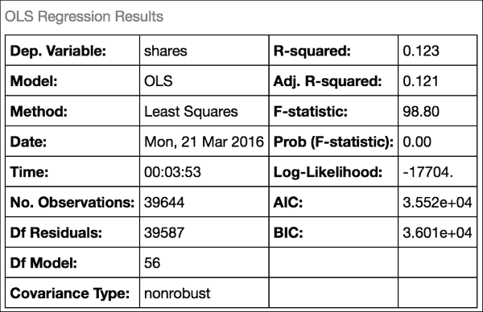

所有这些参数意味着什么？观测数和因变量数量可能很明显，但其他我们之前没有见过。简要来说，它们的名称和解释如下：

+   **Df model**：这是模型参数中的独立元素数量。我们有 57 列；一旦我们知道其中 56 个的值，最后一个就由最小化剩余误差的需要来确定，所以总共有 56 个自由度。

+   **Df residuals**：这是模型误差估计中独立信息块的数量。回想一下，我们通过`y-X`获得误差。在`X`中，我们只有最多`m`个独立的列，其中`m`是预测器的数量。因此，我们的误差估计从数据本身中有`n-1`个独立元素，从中我们减去另一个由输入决定的`m`，这给我们留下`n-m-1`。

+   **Covariance type**：这是模型中使用的协方差类型；在这里，我们只是使用白噪声（均值为`0`，正态分布的误差），但我们也可以指定一个特定的结构，以适应例如误差与响应幅度相关的情形。

+   **Adj. R-squared**：如果我们在一个模型中包含更多的变量，我们可以通过简单地增加更多的自由度来拟合数据，从而开始增加 R2。如果我们希望公平地比较具有不同参数数量的模型的 R2，那么我们可以使用以下公式调整 R2 的计算：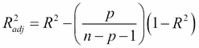

    使用这个公式，对于具有更多参数的模型，我们通过拟合误差的量来惩罚 R2。

+   **F 统计量**: 这个度量用于通过卡方分布比较（任何回归系数是否在统计上与`0`不同）。

+   **F 统计量的概率**: 这是来自 F 统计量的 p 值（假设系数为`0`且拟合不优于仅截距模型），表明零假设（系数为`0`且拟合不优于仅截距模型）是真实的。

+   **对数似然**: 回想一下，我们假设线性模型中残差的误差是正态分布的。因此，为了确定我们的结果是否符合这个假设，我们可以计算似然函数：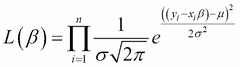

    其中 σ 是残差的标准差，μ 是残差的均值（根据上述线性回归假设，我们期望这个值非常接近 0）。因为乘积的对数是和，这在数值上更容易处理，所以我们通常取这个值的对数，表示为：

    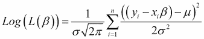

    虽然这个值本身并不很有用，但它可以帮助我们比较两个模型（例如具有不同系数数量的模型）。更好的拟合优度由较大的对数似然或较低的对数负似然表示。

    ### 注意

    在实践中，我们通常最小化负对数似然，而不是最大化对数似然，因为我们可能使用的多数优化算法默认目标是最小化。

+   **AIC/BIC**: AIC 和 BIC 是 Akaike 信息准则和 Bayes 信息准则的缩写。这两个统计量有助于比较具有不同系数数量的模型，从而给出增加更多特征后模型复杂度增加的好处。AIC 的计算公式如下：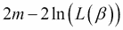

    其中 *m* 是模型中的系数数量，*L* 是似然，如前所述。更好的拟合优度由较低的 AIC 表示。因此，增加参数数量会惩罚模型，同时提高其降低 AIC 的可能性。BIC 类似，但使用以下公式：

    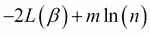

其中 *n* 是模型中的数据点数量。对于 AIC 和 BIC 的更全面比较，请参阅（Burnham, Kenneth P. 和 David R. Anderson. *模型选择和多模型推断：一种实用的信息论方法*. Springer Science & Business Media, 2003）。

除了这些，我们还会收到每个系数的统计显著性输出，这是通过对其标准误差的*t-检验*来判断的：


我们还会收到一个最终的统计块：

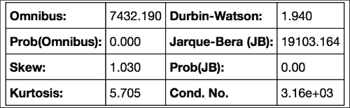

其中大部分内容超出了本卷的范围，但 Durbin-Watson (DW) 统计量将在我们讨论处理时间序列数据时变得重要。DW 统计量由以下公式给出：

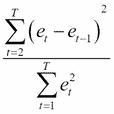

其中 *e* 是残差（在这里是线性模型的 *y-Xβ*）。本质上，这个统计量询问残差是正相关还是负相关。如果其值大于`2`，这表明存在正相关。介于`1`和`2`之间的值表示几乎没有相关性，其中`2`表示没有相关性。小于`1`的值表示连续残差之间的负相关。更多细节请参阅（Chatterjee, Samprit, and Jeffrey S. Simonoff. *回归分析手册*. 第 5 卷. 约翰·威利父子出版社，2013 年）。

我们也可以使用`formula.api`命令来拟合模型，通过从输入数据构造一个表示线性模型公式的字符串。我们使用以下代码生成公式：

```py
>>> model_formula = news_response.name+" ~ "+" + ".join(news_trimmed_features.columns)

```

您可以将此公式打印到控制台以验证它是否给出了正确的输出：

```py
shares ~ timedelta + n_tokens_title + n_tokens_content + n_unique_tokens + n_non_stop_words + n_non_stop_unique_tokens + num_hrefs + num_self_hrefs + num_imgs + num_videos + average_token_length + num_keywords + data_channel_is_lifestyle + data_channel_is_entertainment + data_channel_is_bus + data_channel_is_socmed + data_channel_is_tech + data_channel_is_world + kw_min_min + kw_max_min + kw_avg_min + kw_min_max + kw_max_max + kw_avg_max + kw_min_avg + kw_max_avg + kw_avg_avg + self_reference_min_shares + self_reference_max_shares + self_reference_avg_sharess + weekday_is_monday + weekday_is_tuesday + weekday_is_wednesday + weekday_is_thursday + weekday_is_friday + weekday_is_saturday + is_weekend + LDA_01 + LDA_02 + LDA_03 + LDA_04 + global_subjectivity + global_sentiment_polarity + global_rate_positive_words + global_rate_negative_words + rate_positive_words + rate_negative_words + avg_positive_polarity + min_positive_polarity + max_positive_polarity + avg_negative_polarity + min_negative_polarity + max_negative_polarity + title_subjectivity + title_sentiment_polarity + abs_title_subjectivity + abs_title_sentiment_polarity

```

然后，我们可以使用这个公式来拟合包含响应变量和输入变量的完整 pandas 数据框，通过沿着它们的列（轴 1）连接响应变量和特征变量，并调用我们之前导入的公式 API 的`ols`方法：

```py
>>> news_all_data = pd.concat([news_trimmed_features,news_response],axis=1)
>>> results = smf.ols(formula=model_formula,data=news_all_data).fit()

```

在这个例子中，假设我们拟合的模型中，以新文章特征为函数的流行度残差是独立的，这似乎是合理的。在其他情况下，我们可能在同一组输入上做出多次观察（例如，当某个客户在数据集中出现多次时），这些数据可能与时间相关（例如，当单个客户的记录在时间上更接近时，它们更有可能相关）。这两种情况都违反了我们对模型残差之间独立性的假设。在接下来的几节中，我们将介绍三种处理这些情况的方法。

## 广义估计方程

在我们接下来的练习中，我们将使用记录在几个学校中数学课程学生成绩的例子，这些成绩是在三个学期内记录的，用符号（G1-3）表示（Cortez, Paulo, and Alice Maria Gonçalves Silva. "Using data mining to predict secondary school student performance." (2008)）。我们可能预计学生所在的学校和他们每个学期的数学成绩之间存在相关性，当我们使用以下命令绘制数据时，我们确实看到了一些证据：

```py
>>> students = pd.read_csv('student-mat.csv',sep=';')
>>> students.boxplot(by='school',column=['G1','G2','G3'])

```

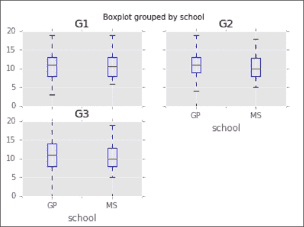

我们可以看到，在 2 和 3 学期数学成绩下降与学校之间存在某种相关性。如果我们想估计其他变量对学生成绩的影响，那么我们想要考虑这种相关性。我们如何做到这一点取决于我们的目标。如果我们只想在总体水平上对模型的系数 β 有一个准确的估计，而无法使用我们的模型预测个别学生的响应，那么我们可以使用**广义估计方程**（**GEE**）（Liang, Kung-Yee, 和 Scott L. Zeger. "使用广义线性模型进行纵向数据分析." *Biometrika* 73.1 (1986): 13-22）。广义估计方程的激励思想是，我们将学校与成绩之间的这种相关性视为模型中的附加参数（我们通过在数据上执行线性回归并计算残差来估计它）。通过这样做，我们考虑了这种相关性对系数估计的影响，从而获得了更好的估计值。然而，我们通常仍然假设组内的响应是可交换的（换句话说，顺序不重要），这与可能具有时间依赖成分的聚类数据的情况不符。

与线性模型不同，广义估计方程的参数估计是通过目标函数 `U(β)` 的非线性优化获得的，使用以下公式：

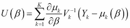

其中 `μ[k]` 是组 *k*（例如，在我们的例子中是学校）的平均响应，`V[k]` 是方差矩阵，它给出了组 k 成员残差之间的相关性，而 `Y[k]- μ[k]` 是该组内的残差向量。这通常使用牛顿-拉夫森方程来解决，我们将在第五章（Chapter 5，*Putting Data in its Place – Classification Methods and Analysis*）中更详细地探讨。从概念上讲，我们可以使用回归的残差来估计方差矩阵 V，并优化上述公式直到收敛。因此，通过优化由 V 给出的分组数据样本之间的相关性结构以及系数 β，我们有效地获得了与 V 无关的估计 β。

要将此方法应用于我们的数据，我们再次可以使用以下命令创建模型字符串：

```py
>>> model_formula = "G3 ~ "+" + ".join(students.columns[1:len(students.columns)-3])

```

然后，我们可以使用学校作为分组变量来运行广义估计方程（GEE）：

```py
>>> results = smf.gee(model_formula,"school",data=students).fit()
>>> results.summary()

```

然而，在某些情况下，我们可能更希望获得个体而不是总体水平的响应估计，即使在我们之前讨论的组相关性的情况下。在这种情况下，我们可以改用混合效应模型。

## 混合效应模型

回想一下，在本章中我们拟合的线性模型中，我们假设响应是按以下方式建模的：


其中 *ε* 是误差项。然而，当我们有属于同一组的数据点之间的相关性时，我们也可以使用以下形式的模型：


其中 `Z` 和 `u` 分别是组别变量和系数。系数 `u` 的均值为 `0`，其方差结构需要指定。例如，它可以在组别之间不相关，或者具有更复杂的协方差关系，其中某些组别之间的相关性比其他组别更强。与 GEE 模型不同，我们并不是试图简单地估计系数的组别水平效应（在考虑了组别成员效应之后），而是控制特定组别归属效应的组内系数。混合效应模型的名字来源于变量 `β` 是固定效应，其值是确切已知的，而 `u` 是随机效应，其中 `u` 的值代表一个组别水平系数的观察值，这是一个随机变量。系数 `u` 可以是一组组别水平的截距（随机截距模型），或者与组别水平的斜率相结合（随机斜率模型）。组别甚至可以嵌套在彼此之中（分层混合效应模型），例如，如果城镇级别的组别捕捉到一种相关变化，而州级别的组别捕捉到另一种。混合效应模型的多种变体将超出本书的讨论范围，但我们建议感兴趣的读者参考以下参考文献（West, Brady T., Kathleen B. Welch, and Andrzej T. Galecki. *线性混合模型：使用统计软件的实用指南*. CRC Press, 2014；Stroup, Walter W. *广义线性混合模型：现代概念、方法和应用*. CRC press, 2012）。与 GEE 一样，我们可以通过包含组别变量使用以下命令来拟合此模型：

```py
>>> results = smf.mixedlm(model_formula,groups="school",data=students).fit()
>>> results.summary()

```

## 时间序列数据

我们将要考虑的模型假设的最后一类是集群数据在时间上是相关的，例如，如果某个客户基于一周中的某一天有周期性的购买活动。虽然 GEE 和混合效应模型通常处理组间相关性可交换的数据（顺序不重要），但在时间序列数据中，顺序对于数据的解释很重要。如果我们假设可交换性，那么我们可能会错误地估计模型中的误差，因为我们假设最佳拟合线穿过给定组别数据中的中间部分，而不是遵循时间序列中重复测量的相关性结构。

一个特别灵活的时间序列数据模型使用称为卡尔曼滤波的公式。表面上，卡尔曼滤波类似于混合效应模型的方程；考虑一个在特定时间点有一个未观察到的状态，我们希望在模型中推断这个状态（例如，某个股票的价格是上升还是下降），它被噪声（例如股票价格的市场变化）所掩盖。数据点的状态由以下公式给出：

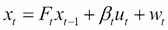

其中 `F` 代表状态之间的转移概率矩阵，*xt-1* 是最后一个时间步的状态，*w[t]* 是噪声，而 *B[t]* 和 *u[t]* 代表回归变量，例如可以包含季节效应。在这种情况下，*u* 将是一个季节或一天中的时间的二元指示符，而 *β* 是根据这个指示符我们应该从 *x* 中添加或减去的数量。状态 *x* 用于使用以下方法预测观察到的响应：

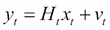

其中 *xt* 是前一个方程中的状态，*H* 是每个潜在状态的系数集，*vt* 是噪声。卡尔曼滤波使用时间 *t-1* 的观察值来更新我们对时间 *t* 的潜在状态 *x* 和响应 *y* 的估计。

之前给出的方程组也被称为更通用的术语“结构时间序列方程”。对于更新方程的推导和有关“结构时间序列模型”的更多细节，我们建议读者参考更高级的参考资料（Simon, Dan. *最优状态估计：卡尔曼，H 无穷，和非线性方法*。John Wiley & Sons，2006；Harvey, Andrew C. *预测，结构时间序列模型和卡尔曼滤波*。Cambridge University Press，1990）。

在 `statsmodels` 包中，卡尔曼滤波用于**自回归移动平均**（**ARMA**）模型，使用以下命令进行拟合：

```py
>>> statsmodels.tsa.arima_model.ARMA()

```

## 广义线性模型

在大多数先前的例子中，我们假设响应变量可能被建模为响应的线性组合。然而，我们可以通过拟合广义线性模型来放宽这个假设。而不是以下公式：

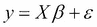

我们用一个 `链接` 函数（*G*）替换，该函数将非线性输出转换为线性响应：

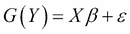

`链接`函数的例子包括：

+   **Logit**：这个 `链接` 函数将范围在 `0` 到 `1` 之间的响应映射到线性尺度，使用函数 *Xβ=ln(y/1-y)*，其中 *y* 通常是在 `0` 到 `1` 之间的概率。这个 `链接` 函数用于逻辑回归和多项式回归，在第五章中介绍，*将数据放在合适的位置——分类方法和分析*。

+   **Poisson**：这个 `链接` 函数使用关系 *Xβ=ln(y)* 将计数数据映射到线性尺度，其中 *y* 是计数数据。

+   **指数**：这个`链接`函数将指数尺度上的数据映射到线性尺度，公式为 *Xβ=y-1*。

虽然这类变换使得将许多非线性问题转化为线性问题成为可能，但它们也使得估计模型参数变得更加困难。确实，用于推导简单线性回归系数的矩阵代数不再适用，而且方程也没有任何封闭解，我们无法通过单一步骤或计算来表示。相反，我们需要像用于广义估计方程（GEE）和混合效应模型那样的迭代更新方程。我们将在第五章中更详细地介绍这类方法，*将数据放在合适的位置——分类方法和分析*。

现在我们已经介绍了一些将模型拟合到违反线性回归假设的数据的多样情况，以便正确解释系数。现在让我们回到尝试通过选择变量子集来提高线性模型的预测性能的任务中，希望移除相关输入并减少过拟合，这种方法被称为*正则化*。

## 将正则化应用于线性模型

在观察到我们的线性模型性能不佳后，一个相关的问题是，这个模型中的所有特征是否都是必要的，或者我们所估计的系数是否次优。例如，两列可能高度相关，这意味着矩阵 `XTX` 可能是秩亏的，因此不可逆，导致计算系数时出现数值不稳定性。或者，我们可能已经包含了足够多的输入变量，使得在训练数据上拟合得非常好，但这种拟合可能无法推广到测试数据，因为它精确地捕捉了仅在训练数据中存在的细微模式。变量的高数量使我们能够有很大的灵活性，使预测响应与训练集中的观察响应完全匹配，从而导致过拟合。在这两种情况下，对模型应用正则化可能是有帮助的。使用正则化，我们试图对系数的大小和/或数量施加惩罚，以控制过拟合和多重共线性。对于回归模型，两种最流行的正则化形式是岭回归和 Lasso 回归。

在岭回归中，我们希望将系数的大小限制在合理的水平，这是通过在损失函数方程中对系数的大小应用平方惩罚来实现的：

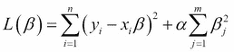

### 注意

请注意，尽管使用了相同的符号，但这个 L(β)与之前讨论的似然方程不同。

换句话说，通过将惩罚*α*应用于系数的平方和，我们不仅约束模型尽可能好地近似*y*，使用斜率*β*乘以特征，而且还约束系数*β*的大小。这种惩罚的效果由加权因子*α*控制。当 alpha 为`0`时，模型就是普通的线性回归。具有*α > 0*的模型会越来越多地惩罚大的*β*值。我们如何选择*α*的正确值？`scikit-learn`库提供了一个有用的交叉验证函数，可以使用以下命令在训练集上找到*α*的最优值：

```py
>>> lmodel_ridge = linear_model.RidgeCV().fit(news_features_train, news_shares_train)
>>> lmodel_ridge.alpha_

```

这给出了最优的`α`值为`0.100`。

然而，当我们使用以下命令评估新的*R2*值时，这种改变似乎不会影响测试集上的预测准确性：

```py
>>> lmodel_ridge.score(news_features_test, news_shares_test)

```

事实上，我们得到了与原始线性模型相同的结果，该模型给出了测试集*R2*为`0.109`。

另一种正则化方法被称为 Lasso，其中我们最小化以下方程。它与上面的岭回归公式类似，不同之处在于*β*值的平方惩罚已被绝对值项所取代。

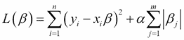

这种绝对值惩罚的实际效果是许多斜率被优化为零。如果我们有很多输入并且希望只选择最重要的输入以尝试得出见解，这可能是有用的。它也可能有助于在两个变量彼此高度相关的情况下，我们选择其中一个变量包含在模型中。像岭回归一样，我们可以使用以下交叉验证命令找到*α*的最优值：

```py
>>> lmodel_lasso = linear_model.LassoCV(max_iter=10000).fit(news_features_train, news_shares_train)
>>> lmodel_lasso.alpha_

```

这表明最优的*α*值为*6.25e-5*。

在这种情况下，将这种类型的惩罚应用于模型似乎没有太多价值，因为最优的*α*值接近于零。综合上述分析，上述分析表明，修改系数本身并没有帮助我们的模型。

除了拟合优度的改进，我们可能会使用岭回归还是 Lasso，还有什么可以帮助我们做出决定？一个权衡是，虽然 Lasso 可能会生成一个更稀疏的模型（更多系数被设置为`0`），但结果系数的值难以解释。给定两个高度相关的变量，Lasso 会选择其中一个，而将另一个缩小到`0`，这意味着通过对基础数据进行一些修改（从而对选择这些变量之一产生偏差）我们可能会选择一个不同的变量进入模型。虽然岭回归不会出现这个问题，但缺乏稀疏性可能会使得解释输出更加困难，因为它不倾向于从模型中移除变量。

弹性网络回归（Zou, Hui, 和 Trevor Hastie. "通过弹性网络进行正则化和变量选择." *《皇家统计学会会刊：系列 B（统计方法）》* 67.2 (2005): 301-320）在这两种选择之间提供了平衡。在弹性网络中，我们的惩罚项变成了岭回归和 Lasso 的混合，最优的β值最小化：

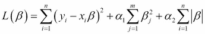

由于这种修改，弹性网络可以选出相关变量组，同时将许多变量缩小到零。像岭回归和 Lasso 一样，弹性网络有一个 CV 函数来选择两个惩罚项α的最优值，使用以下方法：

```py
>>> from sklearn.linear_model import ElasticNetCV
>>> lmodel_enet = ElasticNetCV().fit(news_features_train, news_shares_train)
>>> lmodel_enet.score(news_features_test, news_shares_test)

```

然而，这仍然没有显著提高我们模型的性能，因为测试 *R2* 仍然没有从我们的原始最小二乘回归中移动。可能是因为响应没有被涉及输入组合的线性趋势很好地捕捉。可能存在某些特征之间的交互作用，这些交互作用不是任何单个变量的系数所表示的，并且某些变量可能有非线性响应，例如：

+   非线性趋势，例如预测变量线性增加时响应的对数增加

+   非单调（增加或减少）函数，例如抛物线，在预测变量值范围的中间有较低的响应，在最小值和最大值处有较高的值

+   更复杂的多模态响应，例如三次多项式

尽管我们可以尝试使用上面描述的广义线性模型来捕捉这些模式，但在大型数据集中，我们可能难以找到一个能够有效捕捉所有这些可能性的转换。我们可能还会通过例如将每个输入变量相乘来生成“交互特征”，从而产生 *N(N-1)/2* 个额外的变量（对于所有输入变量之间的成对乘积）。虽然这种方法，有时被称为“多项式展开”，有时可以捕捉到原始模型中遗漏的非线性关系，但随着特征集的增大，这最终可能变得难以控制。相反，我们可能尝试探索可以高效探索可能变量交互空间的方法。

# 树方法

在许多数据集中，我们的输入和输出之间的关系可能不是一条直线。例如，考虑一天中的小时数和社交媒体发帖概率之间的关系。如果你绘制这个概率的图表，它可能会在傍晚和午餐时间增加，在夜间、早晨和工作日减少，形成一个正弦波模式。线性模型无法表示这种关系，因为响应的值并不严格随着一天中的小时数增加或减少。那么，我们可以使用哪些模型来捕捉这种关系呢？在特定的时间序列模型中，我们可以使用上述描述的卡尔曼滤波器等方法，使用结构时间序列方程的组成部分来表示社交媒体活动的 24 小时循环模式。在下一节中，我们将探讨更通用的方法，这些方法将适用于时间序列数据以及更通用的非线性关系。

## 决策树

考虑这样一个案例，当我们为在社交媒体上发帖的概率分配一个值，当小时数大于上午 11 点且小于下午 1 点，大于下午 1 点且小于下午 6 点，以此类推。我们可以将这些看作是一棵树的分支，在每个分支点上都有一个条件（例如小时数小于下午 6 点），并将我们的输入数据分配到树的某个分支。我们继续这种分支，直到达到一系列此类选择的末端，称为树的“叶子”；树的预测响应是最后这个组中训练数据点值的平均值。为了预测新数据点的响应，我们沿着树的分支走到底部。因此，要计算决策树，我们需要以下步骤：

1.  从特征*X*和响应*y*的训练集开始。

1.  找到*X*的列以及分割点，这可以优化数据点之间的分割。我们可以优化几个标准，例如决策边界两侧目标响应的方差（参见后续的分割函数）。(Breiman, Leo, 等人. 分类与回归树. CRC 出版社，1984 年)。我们根据这个规则将训练数据点分配到两个新的分支。

1.  重复步骤 2，直到达到停止规则，或者树的最终分支中只剩下一个值。

1.  预测响应是最终落在树中特定分支的训练点的平均响应。

如前所述，每次我们在树模型中选择一个分割点时，我们需要一个原则性的方法来确定哪个候选变量比另一个变量更适合将数据分成具有更多相关响应的组。有几个选项。

*方差减少*衡量在分割数据后形成的两个组在响应变量 y 中的方差是否比整体数据低，并在决策树的**分类和回归树**（CART）算法中使用。它可以按以下方式计算：

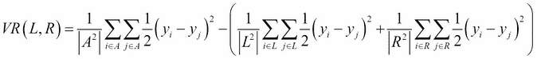

其中 *A* 是分割前的所有数据点的集合，*L* 是落在分割左侧的值的集合，而 *R* 是落在分割右侧的点的集合。当分割点的两侧的联合方差小于原始数据的方差时，此公式得到优化。

减少方差对于本章所探讨的问题将最为有效，其中输出是一个连续变量。然而，在具有分类结果的分类问题中，例如我们将在第五章中探讨的，*数据定位 – 分类方法和分析*，方差变得不那么有意义，因为数据只能假设固定数量的值（对于特定类别为 1 或 0）。我们可能还需要优化的另一个统计量是“信息增益”，它在构建决策树的迭代二分器 3（ID3）和 C4.5 算法中使用（Quinlan, J. Ross. *C4\. 5: programs for machine learning*. Elsevier, 2014; Quinlan, J. Ross. "Induction of decision trees." *Machine learning* 1.1 (1986): 81-106）。信息增益统计量询问在决策分割后，左侧和右侧的数据是否变得更加相似或不同。如果我们认为响应 y 是一个概率，那么信息增益的计算如下：

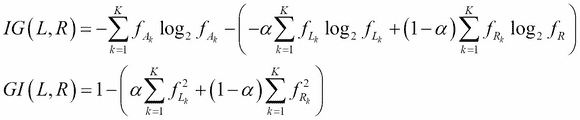

其中 α 是分割到分割左侧的数据的分数，f[Ak]，f[Lk]，和 f[Rk] 是在所有数据点、分割的左侧和右侧中类别 *k* 的元素分数。这个方程式的三个项被称为熵（Borda, Monica. *Fundamentals in information theory and coding*. Springer Science & Business Media, 2011）。为什么熵反映了数据的良好分割？为了看到这一点，使用以下方式绘制函数 `ylog2y` 从 `0` 到 `1` 的值：

```py
>>> probs = np.arange(0.01,1,0.01)
>>> entropy = [ -1*np.log2(p)*p for p in probs]
>>> plt.plot(probs,entropy)
>>> plt.xlabel('y')
>>>plt.ylabel('Entropy')

```

看看结果：

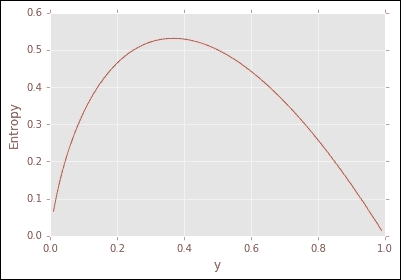

你可以欣赏到，当 **y** 接近 `0` 或 `1` 时，熵会下降。这对应于在分类问题中特定类别的非常高的概率或低概率，因此根据信息增益分割数据的树将最大化左右分支趋向或反对给定类别的概率程度。

类似地，CART 算法（Breiman, Leo, et al. 分类和回归树. CRC press, 1984 年。）也使用*基尼不纯度*来决定分割点，计算如下：


检查这个公式，你可以看到当一类接近值*f = 1*时，它将被最大化，而所有其他类都是`0`。

我们如何处理此类模型中的空值和缺失数据？在 scikit-learn 中，当前的决策树实现不兼容缺失值，因此我们需要插入一个占位符值（例如`-1`），删除缺失记录，或者进行插补（例如，用列均值替换）（详见旁注以获取更多详细信息）。然而，某些实现（如 R 统计编程语言的`gbm`包）将缺失数据视为一个第三分支，数据将被排序到这个分支中。

在处理分类数据时，也存在类似的多样性。当前的 scikit-learn 实现只期望数值列，这意味着性别或国家等分类特征需要被编码为二进制指示符。然而，其他包，如 R 语言中的实现，通过根据特征值将数据分配到桶中，然后按平均响应对桶进行排序，来处理分类数据，以确定将哪些桶分配给树的左右分支。

### **提示**

**旁注**：**处理缺失数据**

在处理数据中的缺失值时，我们需要考虑几种可能性。一种是数据是否是*随机缺失*，或者*非随机缺失*。在前一种情况下，响应变量与数据缺失之间存在相关性。我们可以分配一个虚拟值（例如`-1`），从我们的分析中删除包含缺失数据的整个行，或者分配列均值或中位数作为占位符。我们还可以考虑更复杂的方法，例如训练一个回归模型，使用所有其他输入变量作为预测变量，将包含缺失数据的列作为输出响应，并使用该模型的预测来推导出插补值。如果数据是非随机缺失的，那么简单地用占位符编码数据可能是不够的，因为占位符值与响应相关。在这种情况下，我们可能会删除包含缺失数据的行，或者如果这不可能，则采用基于模型的方法。这将更适合推断数据中缺失元素的价值，因为它应该预测与列中其余部分相同的分布。

在实践中，在构建树的过程中，我们通常有一些停止规则，例如形成叶节点所需的最小观察数（否则预测响应可能来自少数几个数据点，这通常会增加预测误差）。

一开始并不清楚树应该分支多少次。如果分支太少（决策点），那么可以应用于细分数据集的规则就很少，模型的最终准确率可能较低。如果在一棵非常深的树中有太多的分支，那么模型可能无法很好地推广到新的数据集。对于我们的例子，让我们尝试将树拟合到不同的深度：

```py
>>> from sklearn.tree import DecisionTreeRegressor
>>> max_depths = [2,4,6,8,32,64,128,256]
>>> dtrees = []
>>> for m in max_depths:
…    dtrees.append(DecisionTreeRegressor(min_samples_leaf=20,max_depth=m).\
…    fit(news_features_train, news_shares_train))

```

现在，我们可以通过绘制每个模型的 R2 值与树深度之间的关系来评估结果：

```py
>>> r2_values = []
>>> for d in dtrees:
…    r2_values.append(d.score(news_features_test, news_shares_test))
>>> plt.plot(max_depths,r2_values,color='red')
>>> plt.xlabel('maximum depth')
>>> plt.ylabel('r-squared')

```

查看测试集上的性能，我们可以看到，一旦我们将树做得太深，性能提升就会迅速下降：

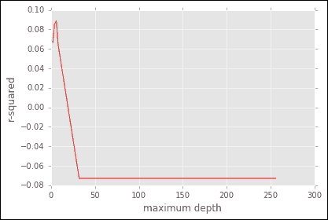

不幸的是，树模型的表现仍然没有比我们的基本线性回归好多少。为了尝试改进这一点，我们可以尝试增加树的数量而不是树的深度。这里的直觉是，一组较浅的树结合起来可能能够捕捉到单个深树难以近似的复杂关系。这种方法，即使用组合的小模型来拟合复杂关系，在下一节讨论的随机森林算法中，以及在梯度提升决策树（第五章, *将数据放在合适的位置 – 分类方法和分析*）和从下往上学习（第七章, *从底部学习 – 深度网络和无监督特征*）中，以及在某种程度上，在我们将在第七章讨论的深度学习模型中都有应用。

## 随机森林

虽然捕捉非线性关系的想法看起来合理，但可能很难构建一个能够捕捉输入和输出之间如此复杂关系的单个树。如果我们对许多简单的决策树进行平均呢？这就是随机森林算法的精髓（Ho, Tin Kam. "随机决策森林." *《文档分析与识别，1995 年，第三届国际会议论文集》* 第 1 卷. IEEE, 1995 年；Breiman, Leo. "随机森林." *《机器学习》* 45.1 (2001): 5-32），在这个算法中，我们构建多个树来尝试探索可能的非线性交互空间。

随机森林是对树模型（Breiman, Leo. "Bagging predictors." *Machine learning* 24.2 (1996): 123-140.）的 Bootstrap Aggregation（Bagging）概念的进一步创新。在通用的 Bagging 算法中，我们通过从训练数据中采样（有放回地）选取少量数据点，并仅在这部分数据上构建一棵树，来构建大量树。虽然单个树可能相对较弱，但通过平均大量树，我们通常可以实现更好的预测性能。从概念上讲，这是因为我们不是试图通过单个模型（如单条线）来拟合响应，而是使用多个小模型来近似响应，每个小模型拟合输入数据中的单个简单模式。

随机森林通过随机化不仅用于构建每棵树的每个数据点，还包括变量，对 Bagging 的概念进行了进一步的发展。在构建树中的分割时，我们也在每一步只考虑 X 的列的随机子集（例如，大小等于总列数的平方根）。如果我们每个训练轮次都使用所有输入列，我们往往会选择与响应最强烈相关的变量。通过随机选择变量子集，我们还可以发现较弱预测器之间的模式，并更广泛地覆盖可能的特征交互空间。与 Bagging 一样，我们多次遵循随机数据和变量选择的过程，然后将所有树的预测平均在一起以得到总体预测。同样，我们可以探索是否改变一个参数（树的数量）可以提高测试集上的性能：

```py
>>> from sklearn import ensemble
>>> rforests = []
>>> num_trees = [2,4,6,8,32,64,128,256]
>>> for n in num_trees:
 …   rforests.\
 …   append(ensemble.RandomForestRegressor(n_estimators=n,min_samples_leaf=20).\
 …   fit(news_features_train, news_shares_train))

```

最后，当我们使用以下代码绘制结果时，我们可以开始看到模型准确性的某些提高：

```py
>>> r2_values_rforest = []
>>> for f in rforests:
 …   r2_values_rforest.append(f.score(news_features_test, news_shares_test))
>>> plt.plot(num_trees,r2_values_rforest,color='red')
>>> plot.xlabel('Number of Trees')
>>> plot.ylabel('r-squared')

```

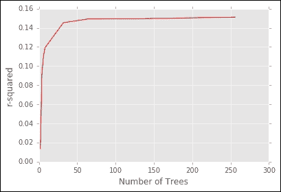

与线性回归模型一样，我们可以得到特征重要性的排名。对于线性回归来说，它只是斜率的幅度，而在随机森林模型中，特征的重要性是以更复杂的方式确定的。直观地说，如果我们对数据集中特定列的行值进行洗牌，如果该列很重要，它应该会降低模型的性能。通过测量这种排列的平均效应，并将其除以这种效应的标准差，我们可以得到一个变量对模型性能影响的幅度和一致性的排名。通过按这种随机化对准确度的影响程度对变量进行排名，我们可以得出特征显著性的度量。我们可以使用以下命令检查重要变量，以选择最大的随机森林的特征重要性值。由于`np.argsort`命令默认按升序返回列表，我们使用`[::-1]`切片来反转列表顺序，将大系数值放在前面。

```py
>>> ix = np.argsort(abs(f[5].feature_importances_))[::-1]
>>> news_trimmed_features.columns[ix]

```

这给出了以下结果：

```py
 Index(['kw_avg_avg', 'self_reference_avg_sharess', 'timedelta', 'LDA_01',        'kw_max_avg', 'n_unique_tokens', 'data_channel_is_tech', 'LDA_02',        'self_reference_min_shares', 'n_tokens_content', 'LDA_03', 'kw_avg_max',        'global_rate_negative_words', 'avg_negative_polarity',        'global_rate_positive_words', 'average_token_length', 'num_hrefs',        'is_weekend', 'global_subjectivity', 'kw_avg_min',        'n_non_stop_unique_tokens', 'kw_min_max', 'global_sentiment_polarity',        'kw_max_min', 'LDA_04', 'kw_min_avg', 'min_positive_polarity',        'num_self_hrefs', 'avg_positive_polarity', 'self_reference_max_shares',        'title_sentiment_polarity', 'max_positive_polarity', 'n_tokens_title',        'abs_title_sentiment_polarity', 'abs_title_subjectivity',        'title_subjectivity', 'min_negative_polarity', 'num_imgs',        'data_channel_is_socmed', 'rate_negative_words', 'num_videos',        'max_negative_polarity', 'rate_positive_words', 'kw_min_min',        'num_keywords', 'data_channel_is_entertainment', 'weekday_is_wednesday',        'data_channel_is_lifestyle', 'weekday_is_friday', 'weekday_is_monday',        'kw_max_max', 'data_channel_is_bus', 'data_channel_is_world',        'n_non_stop_words', 'weekday_is_saturday', 'weekday_is_tuesday',        'weekday_is_thursday'],       dtype='object')

```

有趣的是，如果你将这个列表与线性回归模型进行比较，顺序相当不同。令人鼓舞的是，这表明随机森林能够结合线性回归无法捕捉到的模式，从而导致了本节中看到的*R²*增益。

在这个数据集中也存在一个相对微妙的问题，即所有分类变量都使用二进制标志进行编码。因此，变量重要性是单独应用于每个类别的成员。如果一个类别的成员与响应高度相关，而另一个则不是，这些个别变量的重要性度量将给出一个关于真实变量重要性的不准确图景。一个解决方案是对所有类别中的结果值进行平均，这是一个我们现在不会应用但会作为你未来分析考虑的修正。

在这里，我们提供了一个视觉流程图，说明了我们在本章关于回归分析中讨论的许多权衡。虽然很难为所有场景提供全面的规则，但它可以作为诊断给定问题应应用哪种方法的起点：

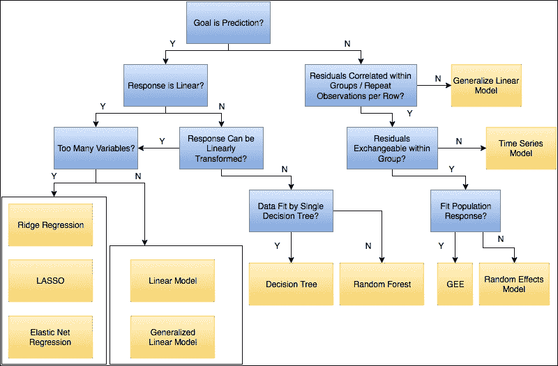

回归分析流程图

# 使用 PySpark 进行扩展 - 预测歌曲发布年份

最后，让我们通过另一个使用 PySpark 的例子来结束。在这个数据集（Bertin-Mahieux, Thierry, et al. "The million song dataset." *ISMIR 2011: Proceedings of the 12th International Society for Music Information Retrieval Conference, October 24-28, 2011, Miami, Florida*. University of Miami, 2011）中，这是一个百万首歌曲数据集的子集，目标是根据歌曲的轨道特征预测歌曲的发行年份。数据以逗号分隔的文本文件的形式提供，我们可以使用 Spark 的`textFile()`函数将其转换为 RDD。像我们之前的聚类示例一样，我们也定义了一个带有`try…catch`块的解析函数，这样我们就不至于在一个大型数据集中因为单个错误而失败：

```py
>>> def parse_line(l):
…      try:
…            return l.split(",")
…    except:
…         print("error in processing {0}".format(l))

```

然后，我们使用此函数将每一行映射到解析格式，该格式将逗号分隔的文本拆分为单个字段，并将这些行转换为 Spark DataFrame：

```py
>>> songs = sc.textFile('/Users/jbabcock/Downloads/YearPredictionMSD.txt').\
map(lambda x : parse_line(x)).\
toDF()

```

由于我们将结果 RDD 转换为 DataFrame，以便我们可以像在 Python 中访问列表或向量一样访问其元素。接下来，我们想要将其转换为`LabeledPoint` RDD，就像我们在上一章的 Streaming K-Means 示例中所做的那样：

```py
>>> from pyspark.mllib.regression import LabeledPoint
>>> songs_labeled = songs.map( lambda x: LabeledPoint(x[0],x[1:]) )

```

作为该数据集文档的一部分，我们假设训练数据（不包括测试集中出现的艺术家的曲目）包含在前 463,715 行中，其余的是测试数据。为了分割它，我们可以使用`zipWithIndex`函数，该函数为分区中的每个元素分配一个索引，并在分区之间：

```py
>>> songs_train = songs_labeled.zipWithIndex().\
filter( lambda x: x[1] < 463715).\
map( lambda x: x[0] )
>>> songs_test = songs_labeled.zipWithIndex().\
filter( lambda x: x[1] >= 463715).\
map( lambda x: x[0] )

```

最后，我们可以使用以下命令在此数据上训练一个随机森林模型：

```py
>>> from pyspark.mllib.tree import RandomForest
>>> rf = RandomForest.trainRegressor(songs_train,{},50,"auto","variance",10,32)
>>> prediction = rf.predict(songs_test.map(lambda x: x.features))
>>> predictedObserved = songs_test.map(lambda lp: lp.label).zip(prediction)

```

为了评估结果的模型准确性，我们可以使用`RegressionMetrics`模块：

```py
>>> from pyspark.mllib.evaluation import RegressionMetrics
>>> RegressionMetrics(predictedObserved).r2

```

PySpark 的分布式特性意味着这项分析将在您电脑上的单个示例文件上运行，同时在一个更大的数据集（例如完整的百万首歌曲）上运行，所有这些都将使用相同的代码。如果我们想保存随机森林模型（例如，如果我们想将特定日期的模型存储在数据库中以供将来参考，或者将此模型分发到多台机器上，从序列化格式中加载），我们可以使用`toString()`函数，该函数可以使用 gzip 进行潜在压缩。

# 摘要

在本章中，我们探讨了几个回归模型的拟合，包括将输入变量转换为正确的尺度以及正确考虑分类特征。在解释这些模型的系数时，我们考察了线性回归的经典假设得到满足和被违反的情况。在后一种情况下，我们考察了广义线性模型、广义估计方程（GEE）、混合效应模型和时间序列模型作为我们分析的替代选择。在尝试提高回归模型准确性的过程中，我们拟合了简单和正则化的线性模型。我们还考察了基于树的回归模型的使用以及如何优化拟合这些模型时的参数选择。最后，我们考察了在 PySpark 中使用随机森林的例子，这可以应用于更大的数据集。

在下一章中，我们将探讨具有离散分类结果的而非连续响应的数据。在这个过程中，我们将更详细地研究不同模型的似然函数是如何优化的，以及用于分类问题的各种算法。
