# 第五章：将数据放在合适的位置——分类方法和分析

在上一章中，我们探讨了分析结果为连续变量的数据的方法，例如客户账户的购买量或订阅服务取消前预期的天数。然而，商业分析中的许多结果都是离散的——它们可能只取有限数量的值。例如，电影评论可以是 1 到 5 星（但只有整数），客户可以取消或续订订阅，或者在线广告可以被点击或忽略。

用于建模和预测此类数据的方法与我们上一章中讨论的回归模型类似。此外，有时我们可能希望将回归问题转换为分类问题：例如，我们可能更感兴趣的是预测客户在一个月内的消费模式是否超过了一个从商业角度来看有意义的阈值，并在我们的训练数据中将值分配为 0（低于阈值）和 1（高于），根据这个截止点。在某些情况下，这可能会增加我们分类中的噪声：想象一下，如果许多客户的个人支出接近我们为该模型设置的阈值，这将使得学习一个准确模型变得非常困难。在其他情况下，使结果离散将帮助我们聚焦于我们感兴趣回答的问题。想象一下，如果客户支出数据在阈值上下都很好地分离，但在截止点以上存在广泛的数值变化。在这种情况下，回归模型会尝试通过拟合较大数据点的趋势来最小化模型的整体误差，这些数据点不成比例地影响总误差值，而不是实现我们实际的目标，即识别高消费和低消费客户。

除了这些考虑因素之外，一些数据本身就不适合通过回归分析进行有效建模。例如，考虑这样一个场景：我们试图预测在五则广告中，客户最有可能点击哪一则。我们可以用 1 到 5 的数值来编码这些广告，但它们没有自然的顺序，这在回归问题中是没有意义的——2 并不比 1 大，它仅仅是一个标签，表示广告属于五个类别中的哪一个。在这种情况下，将数据集的标签编码为一个长度为`5`的向量，并在对应广告的列中放置一个`1`，从算法的角度来看，这将使所有标签都等价。

考虑到这些点，在接下来的练习中，我们将涵盖以下内容：

+   将数据响应编码为分类结果

+   使用平衡和倾斜数据构建分类模型

+   评估分类模型的准确性

+   评估不同分类方法的优缺点

# 逻辑回归

我们将开始探索分类算法，从最常用的分类模型之一：逻辑回归。逻辑回归类似于第四章连接点与模型 - 回归方法中讨论的线性回归方法，主要区别在于它不是直接计算输入的线性组合，而是通过一个函数压缩线性模型的输出，使得输出被限制在 `[0,1]` 范围内。我们将看到，这实际上是一种“我们上一次在第四章连接点与模型 – 回归方法中讨论的广义线性模型”，回想一下，在线性回归中，预测输出由以下公式给出：

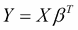

其中 `Y` 是数据集所有 `n` 个成员的响应变量，`X` 是一个 `n` 行 `m` 列的矩阵，表示每行数据的 `m` 个特征，`βT` 是一个 `m` 个系数的列向量（回想一下，`T` 运算符代表向量或矩阵的转置。在这里，我们转置系数，使其维度为 `mx1`，这样我们就可以与矩阵 `X`（其维度为 `nxm`）形成乘积），它给出了对于特定特征的 1 单位变化预期的响应变化。因此，通过计算 `X` 和 `β` 的点积（将每个系数与其对应特征相乘并按特征求和）可以得到预测的响应。在逻辑回归中，我们开始时使用的是以下公式：

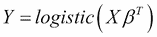

其中逻辑函数为：

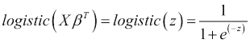

您可以通过在笔记本会话中使用以下代码来绘制逻辑函数的行为：

```py
>>> %matplotlib inline
… import pandas as pd
… import matplotlib.pyplot as plt
… import numpy as np
… plt.style.use('ggplot')
>>> input = np.arange(-10,10,1)
>>> output = 1/(1+np.exp(-input))
>>> pd.DataFrame({"input":input,"output":output}).plot(x='input',y='output')

```

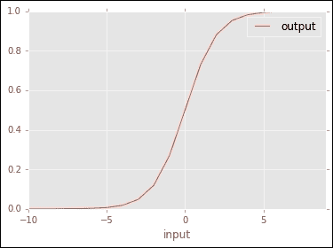

图 1：连续输入的逻辑函数输出

如图 1 所示，逻辑函数通过使用 S 形函数（sigmoid）将线性回归的输出进行转换：随着线性回归值变大，指数项趋向于 0，使得输出为 `1`。相反，当线性回归值变负时，指数项变得非常大，输出变为 `0`。

在模型不再模拟简单的线性趋势的情况下，我们如何解释这个模型中的系数？由于逻辑变换，系数不再代表预测变量每增加 1 单位时响应的预期增加。为了发展类似的解释，我们从观察开始，即逻辑回归方程表示给定观察值*x*属于类别`1`的概率（假设数据中的响应变量分为两个类别——见以下关于类别数大于*2*的情况的讨论）。我们也可以写出类似的方程来表示给定观察值属于类别`0`的概率，该概率如下：

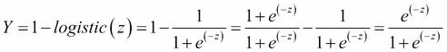

现在，我们可以取这两个概率的自然对数，最终得到：

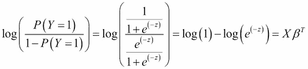

换句话说，线性响应的结果现在表示的是类别*1*和类别*0*之间概率比的自然对数。这个量也被称为对数几率或 logit 函数，并且等同于逻辑函数的逆。在这个公式中，系数*β*的 1 单位变化将导致对数几率的 1 单位增加，这为我们提供了解释这个模型中系数的方法。

您可能还记得来自第四章*通过模型连接点 – 回归方法*的内容，在**广义线性模型**（**GLMs**）中，连接函数将线性响应转换为非线性范围。在逻辑回归中，logit 函数是连接函数。虽然对各种类型 GLM 的全面讨论超出了本书的范围，但我们建议感兴趣的读者参考更全面的主题处理（Madsen, Henrik, 和 Poul Thyregod. *广义和广义线性模型导论*. CRC Press, 2010; Madsen, Henrik, 和 Poul Thyregod. 广义和广义线性模型导论. CRC Press, 2010: Hardin, James William, Joseph M. Hilbe, 和 Joseph Hilbe. 广义线性模型及其扩展. Stata press, 2007.）。

如果你仔细阅读，你可能会意识到我们在上面的讨论中自相矛盾。一方面，我们希望拟合只有允许的结果是`0`或`1`的数据。另一方面，我们的逻辑函数（和对数几率）可以取`0`到`1`之间的值，连续变化。因此，为了正确应用此模型，我们需要在`0`和`1`之间选择一个阈值来分类回归的输出：如果值高于此阈值，我们将其视为类别`1`，否则为`0`。最简单的阈值选择是半数，实际上对于正例和反例数量相等的平衡数据集，这是一个合理的选择。然而，在现实世界中我们遇到的许多情况下（例如广告点击或订阅），正例的数量远少于反例。如果我们使用这样的不平衡数据集优化逻辑回归模型，最佳参数将识别出很少的观察结果为正例。因此，使用半数作为截止值将不准确地分类许多反例为类别 1（正例），并导致高误报率。

我们有几个选项来解决数据中类别不平衡的问题。第一个选项是简单地调整逻辑函数的阈值，将其结果视为 1，这可以通过**接收器操作特征**（**ROC**）曲线进行视觉调整，以下练习中将有更详细的描述。我们也可以重新平衡我们的训练数据，使得一半代表一个合理的值，通过选择相同数量的正例和反例。如果我们担心在许多反例中做出有偏的选择，我们可以多次重复这个过程并平均结果——这个过程被称为 Bagging，在第四章“通过模型连接点——回归方法”中描述得更为详细，这是在随机森林回归模型的背景下。最后，我们可以通过在误差函数中为它们分配一个大于更多反例的权重来简单地惩罚少数正例的误差。关于重新加权的更多细节将在以下内容中呈现。

## 多类逻辑分类器：多项式回归

虽然到目前为止我们只处理了简单的双类问题示例，但我们可以想象存在多个类别的场景：例如，预测客户在在线商店中选择的一组商品中的哪一个。对于这类问题，我们可以想象将逻辑回归扩展到`K`个类别，其中`K > 2`。回想一下，将 e 的对数函数的幂取值给出：

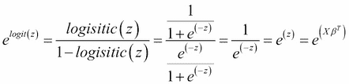

在两分类问题中，这个值比较的是 *Y=1* 的概率与其他所有值的比率，唯一的其他值是 `0`。我们可以想象运行一系列针对 *K* 个类别的逻辑回归模型，其中 `e(Logit(x))` 给出 *Y = class k* 的概率与其他任何类别的比率。然后我们将得到一系列关于 `e(Xβ)` 的 *K* 个表达式，具有不同的回归系数。因为我们希望将结果约束在 `0` 到 `–1` 的范围内，我们可以使用以下公式将任何 *K* 个模型的输出除以所有 *K* 个模型的总和：

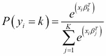

这个方程也称为 `softmax` 函数。它在神经网络模型（我们将在第七章 *从底部学习 – 深度网络和无监督特征* 中介绍）中得到广泛的应用。它有一个很好的特性，即即使对于给定类别 k 的 `e(xβ)` 的极端值，函数的整体值也不会超过 1。因此，我们可以在数据集中保留异常值，同时限制它们对模型整体准确性的影响（因为否则它们会倾向于主导错误函数的整体值，例如我们在第四章 *使用模型连接点 – 回归方法* 中使用的平方误差）。

为了使当前演示更加简单，我们将在以下练习中仅考察一个两分类问题。然而，请记住，就像逻辑回归一样，以下讨论的其他方法也可以扩展到处理多个类别。此外，我们将在第七章 *从底部学习 – 深度网络和无监督特征* 中演示一个完整的多元分类问题，使用神经网络。

现在我们已经介绍了逻辑回归是什么以及它旨在解决的问题，让我们准备一个数据集以供此以及其他分类方法使用。除了处理拟合和解释逻辑回归模型的实际例子外，我们还将以此作为起点来检查其他分类算法。

## 为分类问题格式化数据集

在这个例子中，我们将使用一个人口普查数据集，其中行代表美国成年公民的特征（Kohavi, Ron. *提高朴素贝叶斯分类器的准确性：决策树混合*. KDD. 第 96 卷. 1996 年）。目标是预测个人的年收入是否高于或低于平均年收入 55,000 美元。让我们首先使用以下命令将数据集加载到 pandas 数据框中，并检查前几行：

```py
>>> census = pd.read_csv('census.data',header=None)
>>> census.head()

```

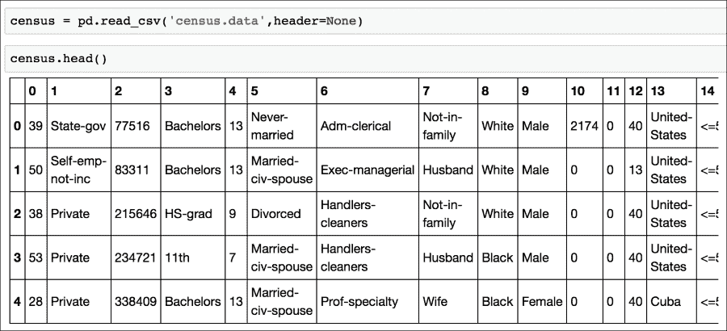

为什么我们使用参数（`header = None`）来加载数据？与我们在前几章中检查的一些其他数据集不同，人口普查数据的列名包含在一个单独的文件中。这些特征名称将有助于解释结果，因此让我们从数据集描述文件中解析它们：

```py
>>> headers_file = open('census.headers')
>>> headers = []
>>> for line in headers_file:
>>>    if len(line.split(':'))>1: # colon indicates line is a column description
>>>        headers.append(line.split(':')[0]) # the column name precedes the colon
>>> headers = headers[15:] # the filter in the if (…) statement above is not 100 percent accurate, need to remove first 15 elements
>>> headers.append('income') # add label for the response variable in the last column
>>> census.columns = headers # set the column names in the dataframe to be extracted names

```

现在我们已经将列名附加到数据集中，我们可以看到响应变量，收入，需要重新编码。在输入数据中，它被编码为字符串，但由于 scikit-learn 无法接受字符串作为输入，我们需要使用以下代码将其转换为`0`或`1`标签：

```py
>>> census.income = census.income.map( lambda x: 0 if x==' <=50K' else 1)

```

在这里，我们使用 lambda 表达式将匿名函数（在程序的其他部分没有定义名称的函数）应用于数据。map（…）调用中的条件表达式将`x`作为输入并返回`0`或`1`。我们也可以正式定义这样的函数，但对于我们不想重用的表达式，lambda 表达式提供了一种简单的方式来指定这种转换，而不会使我们的代码充斥着许多没有通用用途的函数。

让我们花点时间看看不同收入等级的分布，通过绘制一个以收入为垂直轴值的直方图来观察：

```py
>>> census.plot(kind='hist', y='income')

```

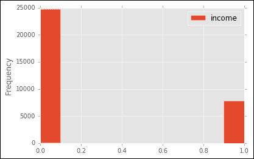

注意，标签为`1`的观测值大约比标签为`0`的观测值少 50%。正如我们之前讨论的，这是一个简单地将一半作为评估类概率的阈值会导致模型不准确的情况，我们在评估性能时应该记住这种数据偏差。

除了我们的结果变量外，这个数据集中许多特征也是分类的：在拟合模型之前，我们还需要将它们重新编码。我们可以分两步来做：首先，让我们找出这些列中每列的唯一元素数量，并使用字典将它们映射到整数值。为此，我们检查数据框中的每一列是否为分类类型（`dtype`等于**object**），如果是，我们将它的索引添加到我们想要转换的列的列表中：

```py
>>> categorical_features = [e for e,t in enumerate(census.dtypes) if t=='object' ]

```

现在我们已经得到了我们想要转换的列号，我们需要将每个列从字符串映射到从*1*到*k*的标签，其中*k*是类别的数量：

```py
>>> categorical_dicts = []
>>> for c in categorical_features:
>>>    categorical_dicts.append(dict( (i,e) for (e,i) in enumerate(census[headers[c]].unique()) ))

```

注意，我们首先提取每列的唯一元素，然后使用`enumerate`函数对这个唯一元素列表进行操作以生成我们需要的标签。通过将这个索引列表转换为字典，其中键是列的唯一元素，值是标签，我们就得到了重新编码这个数据集中分类字符串变量为整数的精确映射。

现在我们可以使用上面生成的映射字典创建数据的第二个副本：

```py
>>> census_categorical = census
>>> for e,c in enumerate(categorical_features):
>>>   census_categorical[headers[c]] = \ census_categorical[headers[c]].\
map(categorical_dicts[e].get)

```

现在，我们可以使用 scikit-learn 的一热编码器将这些整数值转换成一系列列，其中只有一列被设置为`1`，表示这一行属于 k 个类别中的哪一个。为了使用一热编码器，我们还需要知道每一列有多少个类别，我们可以通过以下命令通过存储每个映射字典的大小来实现：

```py
>>> n_values = [len(d) for d in categorical_dicts] 

```

然后我们应用一热编码器：

```py
>>> from sklearn.preprocessing import OneHotEncoder
>>> census_categorical_one_hot = OneHotEncoder(categorical_features=categorical_features, n_values=n_values).fit_transform(census_categorical[headers[:-1]])

```

从这里我们有了适合我们的逻辑回归的正确格式的数据。正如我们在第四章中的例子一样，*通过模型连接点——回归方法*，我们需要将我们的数据分成训练集和测试集，指定测试集中数据的比例（*0.4*）。我们还设置了随机数生成器的种子为 0，这样我们可以在以后通过生成相同的随机数集来重复分析：

```py
>>> from scipy import sparse
>>> from sklearn import cross_validation
>>> census_features_train, census_features_test, census_income_train, census_income_test = \
>>> cross_validation.train_test_split(census_categorical_one_hot, \
>>> census_categorical['income'], test_size=0.4, random_state=0)

```

现在我们已经准备好了训练数据和测试数据，我们可以将逻辑回归模型拟合到数据集上。我们如何找到这个模型的最优参数（系数）？我们将检查两个选项。

第一种方法，被称为**随机梯度下降**（**SGD**），计算在给定数据点上的误差函数的变化，并调整参数以考虑这种误差。对于单个数据点，这会导致拟合不良，但如果我们多次在整个训练集上重复这个过程，系数将收敛到所需的值。这个方法名称中的**随机**一词指的是这种优化是通过在数据集上以随机顺序跟随损失函数相对于给定数据点的梯度（一阶导数）来实现的。像这样随机的方法通常可以很好地扩展到大型数据集，因为它们允许我们只单独或以小批量检查数据，而不是一次利用整个数据集，这使得我们可以并行化学习过程或至少在处理大量数据时不会使用我们机器上的所有内存。

与之相反，scikit-learn 中默认实现的逻辑回归函数的优化方法被称为**二阶方法**。SGD（随机梯度下降），因为它使用误差函数的一阶导数来调整模型参数值，所以被称为一阶方法。在第一导数变化非常缓慢的情况下，二阶方法可能是有益的，正如我们将在下面看到的那样，以及在误差函数遵循复杂模式的情况下寻找最优值。

让我们更详细地看看这些方法中的每一个。

## 使用随机梯度下降进行点更新学习

我们如何使用随机更新找到我们的逻辑回归模型的最优参数？回想一下，我们正在尝试优化概率：

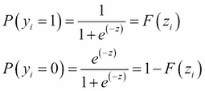

如果我们想要优化数据集中每个单独点的概率，我们希望最大化方程的值，这个方程被称为似然，因为它根据模型评估给定点属于类别`1`（或`0`）的概率；

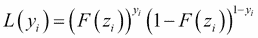

您可以看到，如果真实标签`yi`是`1`，并且模型给出高概率`1`，那么我们就会最大化`F(zi)`的值（因为第二项的指数是`0`，使其为`1`，而乘积中的第一项仅仅是`F(zi)`的值）。相反，如果`yi`的真实标签是`0`，那么我们希望模型最大化`(1-F(zi))`的值，这是模型下类别`0`的概率。

因此，每个点将通过其实际类别的概率对似然做出贡献。通常，处理和比处理乘积更容易，因此我们可以对似然方程取对数，并使用以下方式对数据集中的所有元素进行求和：

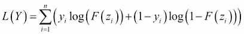

为了找到参数的最优值，我们只需对这一方程（回归系数）的参数取一阶偏导数，并求解最大化似然方程的*β*值，通过将导数设置为`0`并找到*β*的值，如下所示：

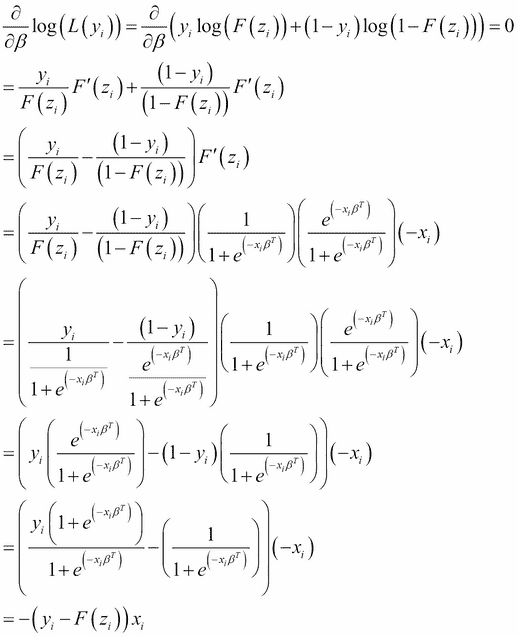

这是我们想要更新系数β的方向，以便将其移动到最优点附近。因此，对于每个数据点，我们可以进行以下形式的更新：

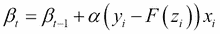

其中`α`是学习率（我们用它来控制每次步骤中系数可以改变的大小——通常较小的学习率可以防止值的大幅变化并收敛到更好的模型，但会花费更长的时间），`t`是当前的优化步骤，而`t-1`是前一步。回想一下，在第四章中，我们讨论了正则化的概念，其中我们可以使用惩罚项`λ`来控制系数的大小。我们在这里也可以这样做：如果我们的似然中的正则化项由以下给出（惩罚系数的平方和，这是第四章中岭回归的*L2*范数）：

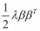

然后，一旦我们取一阶导数，我们就有：

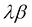

最终的更新方程变为：

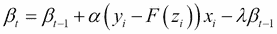

我们可以看到，这种正则化惩罚的效果是减少我们在任何给定步骤中修改系数 β 的幅度。

如我们之前提到的，随机更新对于大数据集特别有效，因为我们只需要逐个检查每个数据点。这种方法的一个缺点是我们需要运行足够长时间的优化以确保参数收敛。例如，我们可以监控随着我们对每个数据点求导而系数值的变化，并在值停止变化时停止。根据数据集的不同，这可能很快发生，也可能需要很长时间。第二个缺点是沿着误差函数的第一导数跟踪梯度并不总是导致最快的解决方案。二阶方法使我们能够克服一些这些缺点。

## 使用二阶方法联合优化所有参数

在逻辑回归的情况下，我们的目标函数是凸函数（见附图），这意味着我们选择的任何优化方法都应该能够收敛到全局最优解。然而，我们可以想象其他场景：例如，似然方程的表面作为输入函数的函数可能在通向其全局最优解的长峡谷中缓慢变化。在这种情况下，我们希望找到移动系数的方向，这是变化率和**变化率的变化率**之间的最佳权衡，后者由似然函数的二阶导数表示。找到这种权衡使得优化过程能够快速穿越缓慢变化的区域。这种策略由所谓的**牛顿方法**类表示，它最小化以下形式的方程：

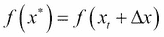

其中 `f(x*)` 是我们试图最小化的目标函数，例如逻辑回归误差，x 是那些最小化回归似然值的值（例如模型系数），`x*` 是优化函数值（例如最优系数 β）的输入，`xt` 是优化当前步骤中这些参数的值（这里确实有一些符号的滥用：在本书的其余部分，*x* 是输入行，而在这里我们用 *x* 来表示模型中的参数值）。**牛顿方法**的名字来源于物理学的奠基人艾萨克·牛顿，他描述了这种过程的早期版本（Ypma, Tjalling J. *牛顿-拉夫森方法的史前发展*. SIAM 评论 37.4 (1995): 531-551）。最小化涉及找到在当前阶段 `xt` 应该移动参数的方向，以找到 `f` 的最小值。我们可以使用微积分中的泰勒展开来近似前一个函数的值：

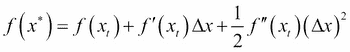

我们想要找到 `Δx` 的值，以使函数最大化，因为这是我们希望移动参数的方向，就像在梯度下降中一样。我们可以通过求解函数梯度相对于 `Δx` 变为 `0` 的点来获得这个最优方向，从而得到：

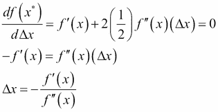

因此，当 `f′(x)` 变化缓慢（`f″(x)` 较小）时，我们采取更大的步长来改变参数的值，反之亦然。

对于逻辑回归来说，最常用的二阶方法之一是**迭代加权最小二乘法**（**IRLS**）。为了展示它是如何工作的，让我们将上面的方程转换为我们的逻辑回归模型。我们已经知道 `f'(x)`，因为这只是我们上面用于随机梯度下降的公式：

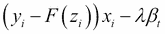

那么，关于似然函数的二阶导数呢？我们也可以求解它

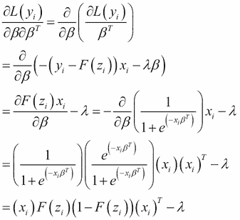

在这里，我们仍然将这个方程写作单个数据点的解。在二阶方法中，我们通常不会使用随机更新，因此我们需要将公式应用于所有数据点。对于梯度（一阶导数），这给出总和：

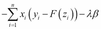

对于二阶导数，我们可以将其表示为一个矩阵。成对二阶导数的矩阵也被称为 Hessian 矩阵。

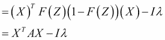

其中 I 是单位矩阵（对角线上的元素为 1，其余位置为 0），而 A 包含了对每对点 *i* 和 *j* 评估的二阶导数。因此，如果我们使用这些表达式进行牛顿更新，我们就有：

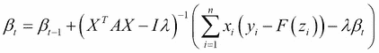

由于二阶导数出现在分母中，我们使用矩阵逆（由 *-1* 指数给出）来执行此操作。如果你仔细观察分母，我们有一个由 *A* 的元素加权的 *XT X* 的乘积，而在分子中我们有 *X(Y-F(X))*。这与我们在第四章中看到的普通线性回归方程相似，*使用模型连接点 – 回归方法*！本质上，这个更新是在每次迭代时通过 *A*（其值随着我们更新系数而变化）进行加权逐步线性回归，从而赋予该方法其名称。IRLS 的一个缺点是我们需要反复求逆一个将随着参数和数据点数量的增加而变得相当大的 Hessian 矩阵。因此，我们可能会尝试找到方法来近似这个矩阵而不是显式地计算它。用于此目的的一种常用方法是有限记忆 Broyden–Fletcher–Goldfarb–Shanno (L-BFGS) 算法（Liu, Dong C. 和 Jorge Nocedal. *关于大规模优化的有限记忆 BFGS 方法*. 数学规划 45.1-3 (1989): 503-528），它使用算法的最后 k 次更新来计算 Hessian 矩阵的近似值，而不是在每个阶段显式求解它。

在 SGD 和牛顿法中，我们由于似然函数的一个称为凸性的性质，对这两种方法最终收敛到正确的（全局最优）参数值有理论上的信心。从数学上讲，一个凸函数 F 满足以下条件：

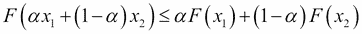

从概念上讲，这意味着对于两个点 `x1` 和 `x2`，它们之间（等式左侧）的 F 值小于或等于两点之间的直线（等式右侧，给出两点函数值的线性组合）。因此，凸函数将在 `x1` 或 `x2` 之间有一个全局最小值。在 Python 笔记本中绘制以下内容可以图形化地看到这一点

```py
>>> input = np.arange(10)-5
>>> parabola = [a*a for a in input]
>>> line = [-1*a for a in input-10]
>>> plt.plot(input,parabola)
>>> plt.plot(input,line,color='blue')

```

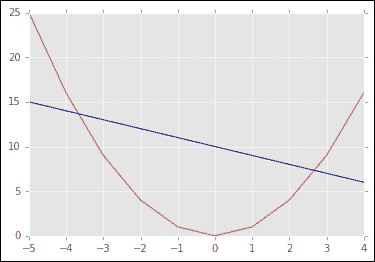

抛物线是一个凸函数，因为位于 `x1` 和 `x2`（蓝色线与抛物线相交的两个点）之间的值始终低于代表 `α(F(x1))+(1-α) (F(x2))` 的蓝色线。正如你所见，抛物线在这两点之间也有一个全局最小值。

当我们处理如之前提到的 Hessian 矩阵这样的矩阵时，这个条件通过矩阵的每个元素都满足 *≥ 0* 来满足，这是一个称为正半定性的属性，意味着任何向量乘以这个矩阵的任一边（xTHx）都会得到一个值 `≥ 0`。这意味着函数有一个全局最小值，并且如果我们的解收敛到一组系数，我们可以保证它们代表模型的最佳参数，而不是局部最小值。

我们之前提到，我们可以在训练过程中通过重新加权单个点来潜在地补偿数据集中类的不平衡分布。在 SGD 或 IRLS 的公式中，我们可以为每个数据点应用一个权重 wi，增加或减少其在似然值和优化算法每次迭代中更新的相对贡献。

现在我们已经描述了如何获得逻辑回归模型的最佳参数，让我们回到我们的例子，并将这些方法应用于我们的数据。

# 模型拟合

我们可以使用 SGD 或二次方法将逻辑回归模型拟合到我们的数据。让我们使用 SGD 比较结果；我们使用以下命令拟合模型：

```py
>>> log_model_sgd = linear_model.SGDClassifier(alpha=10,loss='log',penalty='l2',n_iter=1000, fit_intercept=False).fit(census_features_train,census_income_train)

```

其中损失参数 `log` 指定这是一个我们正在训练的逻辑回归，`n_iter` 指定我们迭代训练数据以执行 SGD 的次数，alpha 代表正则化项的权重，我们指定我们不想拟合截距以使与其他方法的比较更简单（因为不同优化器的拟合截距方法可能不同）。惩罚参数指定正则化惩罚，我们在第四章中已经看到了，*使用模型连接点 – 回归方法*，对于岭回归。由于`l2`是我们可以在二次方法中使用的唯一惩罚，我们在这里也选择`l2`，以便比较方法。我们可以通过引用模型对象的 coeff_ 属性来检查结果模型系数：

```py
>>> log_model_sgd.coef_

```

将这些系数与我们使用以下命令获得的二次拟合进行比较：

```py
>>> log_model_newton = linear_model.LogisticRegression(penalty='l2',solver='lbfgs', fit_intercept=False).fit(census_features_train,census_income_train

```

与 SGD 模型一样，我们移除了截距拟合，以便最直接地比较两种方法产生的系数。我们发现系数并不相同，SGD 模型的输出包含几个较大的系数。因此，在实践中，我们看到即使具有类似模型和凸目标函数，不同的优化方法也可以给出不同的参数结果。然而，我们可以通过系数的双变量散点图看到，结果高度相关：

```py
>>> plt.scatter(log_model_newton.coef_,log_model_sgd.coef_)
>>> plt.xlim(-0.08,0.08)
>>> plt.ylim(-0.08,0.08)
>>> plt.xlabel('Newton Coefficent')
>>> plt.ylabel('SGD Coefficient')

```


SGD 模型具有更大的系数这一事实给我们一个提示，关于可能造成差异的原因：也许 SGD 对特征之间的尺度差异更敏感？让我们通过使用 第三章 中介绍的 **StandardScaler** 来评估这个假设，在 K-means 聚类的情况下，在运行 SGD 模型之前对特征进行归一化，使用以下命令：

```py
>>> from sklearn.preprocessing import StandardScaler
>>> census_features_train_sc= StandardScaler().fit_transform(X=census_features_train.todense())

```

记住，我们需要将特征矩阵转换为密集格式，因为 StandardScaler 不接受稀疏矩阵作为输入。现在，如果我们使用相同的参数重新训练 SGD 并将结果与牛顿法进行比较，我们会发现系数要接近得多：

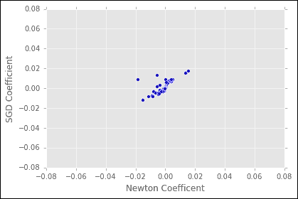

这个例子应该强调优化器有时与实际算法一样重要，并可能决定我们在数据归一化中应采取的步骤。

# 评估分类模型

现在我们已经拟合了一个分类模型，我们可以检查测试集上的准确性。进行这种分析的一个常用工具是 **接收者操作特征**（**ROC**）曲线。为了绘制 ROC 曲线，我们选择分类器的特定截止值（在这里，一个介于 `0` 和 `1` 之间的值，高于此值我们认为数据点被分类为正，或 1），并询问这个截止值正确分类的 1 的比例（真正率），同时，基于这个阈值，有多少负数被错误地预测为正（假正率）。从数学上讲，这表示选择一个阈值并计算四个值：

```py
TP = true positives = # of class 1 points above the threshold
FP = false positives = # of class 0 points above the threshold
TN = true negatives = # of class 0 points below the threshold
FN = false negatives = # of class 1 points below the threshold

```

ROC 曲线绘制的 **真正率**（**TPR**）是 *TP/(TP+FN)*，而 **假正率**（**FPR**）是 *FP/(FP+TN)*。

如果这两个比率相等，那么这并不比随机选择更好。换句话说，无论我们选择什么截止值，模型对类别 1 的预测都是等可能的，无论该点实际上是正还是负。因此，从左下角到右上角的斜线代表通过随机选择数据点的标签创建的分类器的性能，因为真正率和假正率总是相等的。相反，如果分类器表现出优于随机性能，随着正确分类的点在阈值之上增加，真正率会更快地上升。将 ROC 曲线下方的面积（**AUC**）积分，其最大值为 1，是报告分类方法准确性的常见方式。为了找到用于分类的最佳阈值，我们找到曲线上真正率和假正率比率最大的点。

在我们的例子中，这一点很重要，因为 `1` 的出现频率低于 `0`。正如我们在本章开头检查数据集时提到的，这可能导致在训练分类模型时出现问题。虽然直观的选择是将预测概率高于 0.5 的事件视为 1，但在实践中我们发现，由于这个数据集的不平衡，一个较低的阈值是最佳选择，因为解决方案偏向于零。在高度倾斜的数据中，这种影响可能会更加明显：考虑一个只有 1,000 个点中有 1 个标签为 1 的例子。我们可能有一个非常出色的分类器，它预测每个数据点都是 0：它有 99.9% 的准确率！然而，它对识别稀有事件并不太有用。除了调整 AUC 的阈值之外，我们还有几种方法可以抵消这种偏差。

一种方法是通过构建一个 50% 为 1s 和 50% 为 0s 的训练集来重新平衡模型。然后我们可以评估在未平衡测试数据集上的性能。如果不平衡性非常大，我们的重新平衡训练集可能只包含 0s 的可能变化的一小部分：因此，为了生成代表整个数据集的模型，我们可能需要构建许多这样的数据集，并平均从它们生成的模型的成果。这种方法与我们在第四章中看到的用于构建随机森林模型的 Bagging 方法并不相似，*连接点与模型 – 回归方法*。

其次，我们可以在优化参数的过程中，利用我们对不平衡数据的了解来改变每个数据点的贡献。例如，在 SGD 方程中，我们可以将 1s 上的错误惩罚比 0s 上的错误惩罚高 1,000 倍。这个权重将随后纠正模型中的偏差。

在非常不平衡的数据集中，我们对 AUC 的解释也发生了变化。虽然整体 AUC 为 0.9 可能被认为是好的，但如果在假阳性率为 0.001（包含稀有类别的数据比例）时，TPR 和 FPR 之间的比率不大于 1，这表明我们可能需要搜索排名前列的大量数据来丰富稀有事件。因此，尽管整体准确率看起来很好，但我们最关心的数据范围内的准确率可能并不高。这些场景在实践中并不少见。例如，广告点击通常比非点击少得多，销售咨询的回复也是如此。从视觉上看，一个不适合不平衡数据的分类器会在 ROC 曲线上显示出 TPR 和 FPR 差距在曲线中间最大（*~0.5*）。相反，对于一个适当调整以适应稀有事件的分类器的 ROC 曲线，大部分区域都包含在曲线的左侧（从 0 的截止点急剧上升，然后向右平缓），这代表着在高阈值下正例的丰富。

注意，假正例率和假负例率只是我们可能计算的准确性指标的两个例子。我们可能还感兴趣知道，在模型分数的给定截止值以上，1）我们有多少个正例被分类（召回率）以及超过此阈值的点的实际正例百分比 2）精确度。这些计算如下：

*精确度 = TP/(TP+FP)*

*召回率 = TP/(TP+FN)*

事实上，召回率与真正例率相同。虽然 ROC 曲线允许我们评估模型是否以比假正例更高的比率生成真正例预测，但比较精确度与召回率可以让我们了解给定分数阈值以上的预测的可靠性和完整性。我们可能有非常高的精确度，但只能检测到整体正例中的少数。相反，我们可能以牺牲低精确度为代价获得高召回率，因为我们通过降低分数阈值来调用模型中的正例，从而产生假正例。这些之间的权衡可能因应用而异。例如，如果模型主要是探索性的，例如用于为营销生成潜在销售线索的分类器，那么我们可以接受相当低的精确度，因为即使真正的预测中夹杂着噪声，每个正例的价值也相当高。另一方面，在用于垃圾邮件识别的模型中，我们可能希望偏向于高精确度，因为将有效的商业电子邮件错误地移动到用户的垃圾文件夹中的成本可能高于偶尔通过过滤器的垃圾邮件。最后，我们还可以考虑适用于不平衡数据的性能指标，因为它们代表了多数类和少数类之间的精确度与召回率的权衡。这些包括 F 度量：

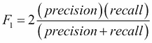

以及马修斯相关系数（马修斯，布莱恩·W. *比较预测和观察到的 T4 噬菌体溶菌酶的二级结构*. 生物化学与生物物理学报（BBA）-蛋白质结构 405.2（1975）：442-451.）：

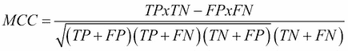

返回到我们的例子，我们在如何从模型中计算预测结果上有两种选择：要么是一个类别标签（`0` 或 `1`），要么是一个特定个体被分类为 `1` 的概率。对于计算 ROC 曲线，我们希望选择第二种，因为这将允许我们在一系列用作分类阈值的概率范围内评估分类器的准确性：

```py
>>> train_prediction = log_model_newton.predict_proba(census_features_train)
>>> test_prediction = log_model_newton.predict_proba(census_features_test)

```

使用以下代码绘制训练集和测试集的 ROC 曲线，我们可以直观地看到我们的模型在以下方面给出了低于平均的准确性：

```py
>>>  from sklearn import metrics
>>> fpr_train, tpr_train, thresholds_train = metrics.roc_curve(np.array(census_income_train),\
 np.array(train_prediction[:,1]), pos_label=1)
>>> fpr_test, tpr_test, thresholds_test = metrics.roc_curve(np.array(census_income_test),\
 np.array(test_prediction[:,1]), pos_label=1)
>>> plt.plot(fpr_train, tpr_train)
>>> plt.plot(fpr_test, tpr_test)
>>> plt.xlabel('False Positive Rate')
>>> plt.ylabel('True Positive Rate')

```

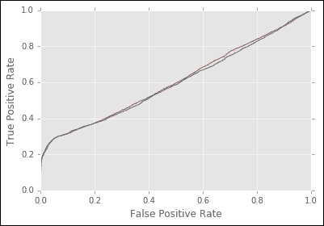

从数值上讲，我们发现测试集和训练集的 AUC 略好于随机（`0.5`），因为以下两个命令：

```py
>>> metrics.auc(fpr_train,tpr_train)

```

and

```py
>>> metrics.auc(fpr_test,tpr_test)

```

give results of ~ 0.6.

如果可能的话，我们希望提高我们分类的性能——我们如何诊断现有逻辑回归模型的问题并朝着更好的预测努力？

## 提高分类模型策略

面对这种不尽如人意的表现，我们通常有几个选择：

+   使用更多数据进行训练

+   对模型进行正则化以减少过拟合

+   选择另一个算法

在我们关于表现不佳的逻辑回归模型的例子中，哪个选项最有意义？

让我们考虑第一个选项，即我们仅仅需要更多的数据来提高性能。在某些情况下，我们可能没有足够的数据在我们的训练集中来代表我们在测试集中观察到的模式。如果情况是这样，我们预计随着我们增加用于构建模型的训练集的大小，我们的测试集性能将得到改善。然而，我们并不总是有获取更多数据的便利。在这个例子中，我们实际上没有更多的数据来训练；即使理论上可以收集更多的数据，在实践中可能成本太高，无法证明其合理性，或者我们可能需要在更多数据可用之前做出决定。

那么，过拟合怎么办？换句话说，也许我们的模型精确地调整到了训练集中的模式，但不能推广到测试集。像第一个选项一样，我们将观察到训练集上的性能优于测试集。然而，解决方案并不一定是添加更多数据，而是修剪特征以使模型更具普遍性。在前面的场景中，我们看到训练集和测试集的性能相似，所以这并不像是最可能的解释。

最后，我们可能尝试另一种算法。为了这样做，让我们考虑我们当前模型的局限性。一方面，逻辑回归仅包含单个特征：它没有表示它们之间相互作用的方法。例如，它只能模拟婚姻状态的影响，但不能模拟基于教育和年龄的婚姻状态。这些因素可能组合起来预测收入，但并不一定单独预测。查看系数的值可能会有所帮助，为此，我们需要将原始列标题映射到我们的独热编码中的列名，其中每个分类特征现在由几个列表示。在这个格式中，数值列附加到数据框的末尾，因此我们需要将它们添加到最后到列列表中。以下代码使用我们之前计算的类别到独热位置的映射重新映射列标题：

```py
>>> expanded_headers = []
>>> non_categorical_headers = []
>>> categorical_index = 0
>>> for e,h in enumerate(np.array(census.columns[:-1])):
 …   if e in set(categorical_features):
 …       unsorted_category = np.array([h+key for key in categorical_dicts[categorical_index].keys()]) # appends the category label h to each feature 'key' 
 …       category_indices = np.array(list(categorical_dicts[categorical_index].values())) # gets the mapping from category label h to the position in the one-hot array 
 …       expanded_headers+=list(unsorted_category[np.argsort(category_indices)]) # resort the category values in the same order as they appear in the one-hot encoding
…        categorical_index+=1 # increment to the next categorical feature
…    else:
…        non_categorical_headers+=[h]
… expanded_headers+=non_categorical_headers

```

我们可以检查单个系数是否合理：记住，排序函数按升序排列项目，因此要找到最大的系数，我们需要按负值排序：

```py
>>> expanded_headers[np.argsort(-1*log_model.coef_[0])]
array(['capital-gain', 'capital-loss', 'hours-per-week', 'age',        'education-num', 'marital-status Married-civ-spouse',        'relationship Husband', 'sex Male', 'occupation Exec-managerial',        'education Bachelors', 'occupation Prof-specialty',        'education Masters', 'relationship Wife', 'education Prof-school',        'workclass Self-emp-inc', 'education Doctorate',        'workclass Local-gov', 'workclass Federal-gov',        'workclass Self-emp-not-inc', 'race White',        'occupation Tech-support', 'occupation Protective-serv',        'workclass State-gov', 'occupation Sales', … 

```

从逻辑上讲，顺序似乎是有意义的，因为我们预计年龄和教育是收入的重要预测因素。然而，我们发现只有 *~1/3rd* 的特征通过以下图示对模型有重大影响：

```py
>>> plt.bar(np.arange(108),np.sort(log_model_newton.coef_[0]))

```


因此，看起来这个模型只能从特征的一个子集中学习信息。我们可能尝试通过组合标签生成交互特征（例如，一个表示已婚和最高教育水平为硕士学位的二进制标志）通过所有特征相互之间的乘积。以这种方式生成潜在的非线性特征被称为多项式展开，因为我们正在将单个系数项转换为具有平方、立方或更高幂关系的乘积。然而，为了本例的目的，我们将尝试一些替代算法。

# 使用支持向量机分离非线性边界

在我们之前的逻辑回归示例中，我们隐含地假设训练集中的每个点都可能有助于定义我们试图分离的两个类之间的边界。在实践中，我们可能只需要少量数据点来定义这个边界，额外的信息只是给分类添加噪声。这个概念，即通过仅使用少量关键数据点来提高分类，是支持向量机（SVM）模型的关键特征。

在其基本形式中，支持向量机（SVM）与之前我们所见的线性模型相似，使用以下方程：

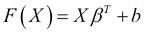

其中 `b` 是截距，β 是系数向量，正如我们在回归模型中所见。我们可以看到一条简单的规则，即点 `X` 被分类为类别 `1` 如果 `F(x) ≥ 1`，如果 `F(x) ≤ –1` 则被分类为类别 `-1`。从几何上讲，我们可以理解为这是平面到点 `x` 的距离，其中 β 是一个垂直（成直角）于平面的向量。如果两个类别理想地分离，那么由 1/ 表示的两个类别之间的宽度尽可能大；因此，在寻找 β 的最优值时，我们希望最小化  的范数。同时，我们希望最小化分配标签到数据中的错误。因此，我们可以有一个损失函数，它最小化这两个目标之间的权衡：

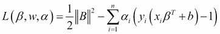

其中 `y` 是 `x` 的正确标签。当 `x` 被正确分类时，`y(xβ+b) ≥ 1`，并且我们从 `L` 的值中整体减去。相反，当我们错误地预测 `x` 时。

注意，这里的 || 表示欧几里得范数，或：

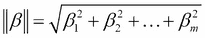

`y(xβ+b) < 1`，因此我们向`L`的值中添加。如果我们想最小化`L`的值，我们可以通过求这个函数的导数并将其设置为 0 来找到`β`和`b`的最优值。从`β`开始：

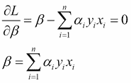

同样，对于`b`：

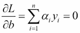

将这些值代入损失函数方程，我们得到：

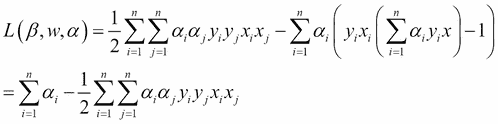

这里有两个重要的事情。首先，只有一些`α`需要非零。其余的可以设置为`0`，这意味着只有少数几个点会影响最优模型参数的选择。这些点是支持向量，它们位于两个类别的边界上。请注意，在实践中，我们不会使用上述错误函数版本，而是使用**软边界**公式，其中我们使用**铰链损失**：

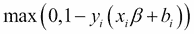

这意味着我们只有在点位于分离超平面的错误一侧时才会对其进行惩罚，并且根据它们的误分类误差的大小进行惩罚。这允许 SVM 在数据无法线性分离的情况下应用，允许算法根据铰链损失惩罚进行错误。有关详细信息，请参阅参考文献（Cortes, Corinna, and Vladimir Vapnik. **支持向量机**. Machine learning 20.3 (1995): 273-297; Burges, Christopher JC. *支持向量机在模式识别中的应用教程*. Data mining and knowledge discovery 2.2 (1998): 121-167.）。

其次，我们现在看到解只通过单个点的乘积依赖于输入*x*。实际上，我们可以用任何函数`K(xi,xj)`替换这个乘积，其中`K`是一个所谓的**核函数**，表示`xi`和`xj`之间的相似性。这在尝试捕捉数据点之间的非线性关系时特别有用。例如，考虑二维空间中抛物线上的数据点，其中`x2`（垂直轴）是`x1`（水平轴）的平方。通常，我们无法画一条直线来分离抛物线上下方的点。然而，如果我们首先使用函数`x1`，`sqrt(x2)`映射这些点，我们现在可以线性地分离它们。我们在第三章中看到了这种非线性映射的有效性，*在噪声中寻找模式 – 聚类和无监督学习*，当我们使用高斯核通过谱 K-Means 聚类分离同心圆之间的非线性边界时。

除了在输入空间中线性不可分的数据点之间创建线性决策边界之外，核函数还允许我们计算没有向量表示的对象之间的相似性，例如图（节点和边）或单词集合。这些对象也不需要具有相同的长度，只要我们能计算出一个相似性即可。这些事实归功于一个称为 Mercer 定理的结果，该定理保证对于所有输入对，*>=0* 的核函数代表了一个有效的内积 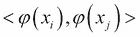，将输入 x 映射到由 φ 表示的线性可分空间中，φ 是一个映射（Hofmann, Thomas, Bernhard Schölkopf, 和 Alexander J. Smola. *机器学习中的核方法*. 统计学年刊 (2008): 1171-1220）。这种映射可以是显式的，例如在上面的例子中应用于抛物线输入的平方根函数。然而，我们实际上并不需要这种映射，因为核函数保证了能够表示映射输入之间的相似性。实际上，映射甚至可以在一个我们无法显式表示的无限维空间中执行，正如我们接下来要描述的高斯核函数那样。

既然我们已经了解了 SVM 的一些基本直觉，让我们看看通过将 SVM 应用于数据，它是否可以提高我们分类模型的表现。

## 将 SVM 应用于人口普查数据

在这个例子中，我们将尝试 scikit-learn 中 SVM 模型的默认核函数，这是一个高斯核函数，你可能认识它是正态分布函数中使用的相同方程。我们之前在 第三章 的谱聚类上下文中使用了高斯核函数，*在噪声中寻找模式 – 聚类和无监督学习*，作为提醒，公式如下：

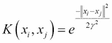

从本质上讲，这个函数将两个数据点之间的差异转换到 `1`（当它们相等且指数变为 0 时）和 `0`（当差异非常大且指数趋向于一个非常大的负数时）。参数 *γ* 代表标准差，或带宽，它控制函数值随着点之间差异的增加而趋向于零的速度。带宽较小的值将使分子成为一个更大的负数，从而将核值缩小到 *0*。

正如我们之前提到的，高斯核函数表示将输入 *x* 映射到一个无限维空间。如果我们通过一个无限级数展开核函数的值，我们可以看到这一点：

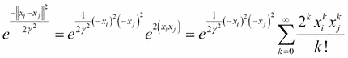

因此，高斯核函数捕捉了无限维特征空间中的相似性。

我们使用以下命令将 SVM 模型拟合到训练数据：

```py
>>> from sklearn import svm
>>> svm_model = svm.SVC(probability=True,kernel='rbf').fit(census_features_train.toarray(),census_income_train)
>>> train_prediction = svm_model.predict_proba(census_features_train.toarray())
>>> test_prediction = svm_model.predict_proba(census_features_test.toarray())
>>> fpr_train, tpr_train, thresholds_train = metrics.roc_curve(np.array(census_income_train),\
 np.array(train_prediction[:,1]), pos_label=1)
>>> fpr_test, tpr_test, thresholds_test = metrics.roc_curve(np.array(census_income_test),\
 np.array(test_prediction[:,1]), pos_label=1)
>>> plt.plot(fpr_train, tpr_train)
>>> plt.plot(fpr_test, tpr_test)
>>> plt.xlabel('False Positive Rate')
>>> plt.ylabel('True Positive Rate')

```

然而，在绘制结果 ROC 曲线时，我们发现我们在逻辑回归上并没有取得很大的进步：

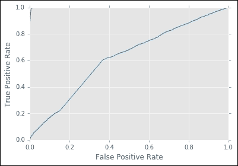

可能难以看清，但图像左上角的红色线条是训练集上的性能，而蓝色线条是测试集上的性能。因此，我们处于之前描述的那种情况，即模型几乎完美地预测了训练数据，但泛化到测试集上却表现不佳。

在某种意义上，我们能够取得进展是因为我们使用非线性函数来表示数据中的相似性。然而，现在的模型拟合我们的数据太好了。如果我们想更多地实验 SVM 模型，我们可以调整许多参数：我们可以改变核函数，调整高斯核的带宽（或我们选择的核函数的特定超参数），或者调整我们惩罚分类错误的程度。然而，对于我们的下一步算法优化，我们将改变方向，尝试用许多弱模型而不是一个过拟合的模型来引入非线性，这个概念被称为提升法。

## 提升法 – 通过组合小型模型来提高准确性

在之前的例子中，我们隐含地假设有一个单一的模型可以描述我们数据集中存在的所有模式。如果，相反，一个不同的模型最适合于数据子集表示的模式，并且只有通过组合代表许多这些较小模式的模型，我们才能得到一个准确的图像呢？这就是提升法的直觉——我们从一个弱个体模型开始，确定它正确分类的点，并为这个模型遗漏的点拟合额外的模型。虽然每个额外的模型本身也相对较差，但通过逐步添加这些捕捉数据某个子集的弱模型，我们逐渐达到整体准确的预测。此外，因为组中的每个模型都只拟合数据的一个子集，所以我们不必过于担心过拟合。虽然提升法的基本思想可以应用于许多模型，但让我们看看一个例子，使用我们在第四章中介绍的决策树，*用模型连接点 – 回归方法*。

## 梯度提升决策树

回想一下，在第四章中，*通过模型连接点 – 回归方法*，我们通过在具有随机特征的树集合上平均来提高了回归任务的预测能力。梯度提升决策树（Breiman, Leo. Arcing the edge. 技术报告 486，加州大学伯克利分校统计学系，1997；Friedman, Jerome H. *贪婪函数逼近：梯度提升机*. 统计学年鉴（2001）：1189-1232；Friedman, Jerome H. *随机梯度提升*. 计算统计学与数据分析 38.4 (2002): 367-378。）遵循类似的策略，但不是在每一步选择随机特征，而是在每个点上贪婪地优化。通用算法如下：

1.  从一个常数值开始，例如输入数据中的平均响应值。这是基线模型，*F0*。

1.  将决策树*h*拟合到训练数据上，通常限制其深度非常浅，目标是将每个点`i`的**伪残差**作为目标，由以下公式给出：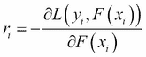

1.  从概念上讲，对于给定的损失函数 L（例如我们在第四章中研究的平方误差，或上述 SVM 的 hinge 损失）的伪残差是损失函数相对于当前模型*F*在点`yi`的值的导数。虽然标准残差只是预测值和观察值之间的差异，但伪残差表示损失在给定点的变化速度，以及我们需要将模型参数移动的方向以更好地分类这个点。

1.  步骤 1：将步骤 2 中树的值乘以一个最优步长`γ`和学习率`α`：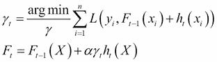

1.  我们可以选择一个对整个树最优的`γ`值，或者对每个单独的叶节点，我们可以使用如上所述的牛顿优化方法来确定最优值。

1.  重复步骤 1-3，直到收敛。

目标是通过拟合多个较弱的树，它们在逐步拟合时总体上能做出更好的预测，以补偿模型在每个步骤中剩余的残差。在实践中，我们也在每个阶段只选择训练数据的一个子集来拟合树，这应该进一步减少过拟合的可能性。让我们通过拟合一个具有 200 棵树和最大深度为 5 的模型来检验这个理论：

```py
>>> from sklearn.ensemble import GradientBoostingClassifier
>>> gbm = GradientBoostingClassifier(n_estimators=200, learning_rate=1.0,\
… max_depth=5, random_state=0).fit(census_features_train.toarray(),census_income_train) 
>>> train_prediction = gbm.predict_proba(census_features_train.toarray()) 
>>> test_prediction = gbm.predict_proba(census_features_test.toarray()) 
>>> fpr_train, tpr_train, thresholds_train = metrics.roc_curve(np.array(census_income_train),\
…   np.array(train_prediction[:,1]), pos_label=1)
>>>fpr_test, tpr_test, thresholds_test = metrics.roc_curve(np.array(census_income_test),\
…   np.array(test_prediction[:,1]), pos_label=1) 

```

现在，当我们绘制结果时，我们看到测试集上的准确率有显著提高：

```py
>>> plt.plot(fpr_train, tpr_train)
>>> plt.plot(fpr_test, tpr_test)
>>> plt.xlabel('False Positive Rate')
>>> plt.ylabel('True Positive Rate')

```

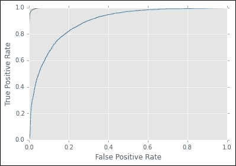

与随机森林模型类似，我们可以通过在数据点之间随机打乱它们的值来检查特征的重要性，这会影响准确率的损失：

```py
>>> np.array(expanded_headers)[np.argsort(gbm.feature_importances_)]
array('native-country Outlying-US(Guam-USVI-etc)',        'native-country Holand-Netherlands', 'native-country Laos',        'native-country Hungary', 'native-country Honduras',        'workclass Never-worked', 'native-country Nicaragua',        'education Preschool', 'marital-status Married-AF-spouse',        'native-country Portugal', 'occupation Armed-Forces',        'native-country Trinadad&Tobago', 'occupation Priv-house-serv',        'native-country Dominican-Republic', 'native-country Hong',        'native-country Greece', 'native-country El-Salvador',        'workclass Without-pay', 'native-country Columbia',        'native-country Yugoslavia', 'native-country Thailand',        'native-country Scotland', 'native-country Puerto-Rico',        'education 1st-4th', 'education 5th-6th'

```

注意，这与我们对逻辑回归模型进行的相同评估并不直接可比，因为这里的重要性不是由特征是否预测正面或负面决定的，这在逻辑回归系数的符号中是隐含的。

还要注意，在解释输出系数时存在一个更微妙的问题：我们中的许多特征实际上是共同特征的个别类别，例如原产国或教育水平。我们真正感兴趣的是整体特征的重要性，而不是个别级别。因此，为了更准确地量化特征重要性，我们可以对包含属于共同特征的类别列的平均重要性进行平均。

如果我们想要进一步调整 gbm 模型的性能，我们可以搜索不同数量的树、树的深度、学习率（公式上方的`α`）和`min_samples_leaf`（它决定了需要存在于数据中以便从树的底部分裂（或叶子）的最小数据点数），以及其他一些参数。作为一个经验法则，使树更深会增加过拟合的风险，但较浅的树需要更多的模型来实现良好的准确度。同样，较低的学习率也会通过减少单个树对模型得分的贡献来控制过拟合，但可能需要更多的模型来达到所需的预测准确度。这些参数之间的平衡可能既受应用（模型应该有多准确才能对业务问题产生有意义的贡献）的影响，也受性能考虑（例如，如果模型需要在网站上在线运行，那么占用较少内存的较少树可能是有益的，并且值得略微降低准确度）。

# 比较分类方法

在本章中，我们探讨了使用逻辑回归、支持向量机和梯度提升决策树进行分类。在什么情况下我们应该优先选择一种算法而不是另一种？

对于逻辑回归，数据理想情况下将是线性可分的（毕竟，逻辑回归公式中的指数本质上与支持向量机（SVM）的分离超平面方程相同）。如果我们的目标是推理（在输入测量每增加 1 个单位时产生响应单位增加，正如我们在[第一章中描述的，*从数据到决策 – 分析应用入门*），那么系数和对数几率值将是有帮助的。在无法同时处理所有数据的情况下，随机梯度下降法也可能是有帮助的，而我们在讨论的第二阶方法可能更容易应用于未归一化的数据。最后，在序列化模型参数和使用这些结果对新数据进行评分的背景下，逻辑回归因其表示为一个数字向量并且易于存储而具有吸引力。

如我们讨论的，支持向量机（SVM）可以适应输入之间的复杂非线性边界。它们也可以用于没有向量表示的数据，或者长度不同的数据，这使得它们相当灵活。然而，它们在拟合以及评分时需要更多的计算资源。

梯度提升决策树可以在输入之间拟合非线性边界，但仅限于某些类型。考虑到决策树在每个决策节点将数据集分为两组。因此，产生的边界代表数据集 m 维空间中的一系列超平面，但每次只沿特定维度分割，并且只沿直线分割。因此，这些平面不一定能够捕捉到支持向量机（SVM）可能具有的非线性，但如果数据可以以这种方式分割，GBM 可能会表现良好。

下面的流程图概述了从我们讨论的分类方法中选择的一般情况。同时，请记住，我们在第四章中讨论的随机森林算法，*通过模型连接点 – 回归方法*也可以用于分类，而本章中描述的支持向量机（SVM）和梯度提升树（GBM）模型具有可能用于回归的形式。

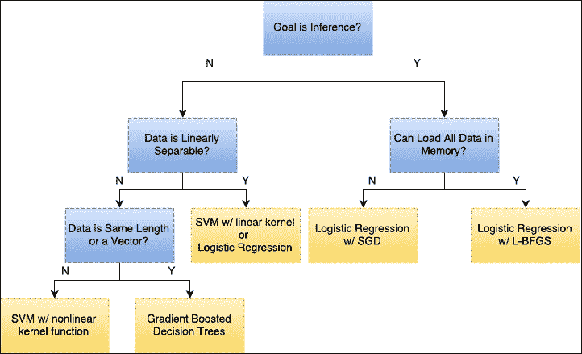

# 案例研究：在 PySpark 中拟合分类器模型

现在我们已经检查了 scikit-learn 库中用于拟合分类器模型的几个算法，让我们看看我们如何在 PySpark 中实现一个类似模型。我们可以使用本章前面提到的相同的普查数据集，并从启动 spark 上下文后使用 textRdd 加载数据开始：

```py
>>> censusRdd = sc.textFile('census.data')

```

接下来，我们需要将数据分割成单个字段，并去除空白字符

```py
>>> censusRddSplit = censusRdd.map(lambda x: [e.strip() for e in x.split(',')])

```

现在，就像之前一样，我们需要确定我们的哪些特征是分类的，需要使用独热编码重新编码。我们通过取单一行并询问每个位置的字符串是否代表一个数字（不是一个分类变量）来完成此操作：

```py
>>> categoricalFeatures = [e for e,i in enumerate(censusRddSplit.take(1)[0]) if i.isdigit()==False]
>>> allFeatures = [e for e,i in enumerate(censusRddSplit.take(1)[0])]

```

现在，就像之前一样，我们需要收集一个字典，表示每个分类标签到独热编码向量位置的字符串到位置的映射：

```py
>>> categoricalMaps = []
>>> for c in categoricalFeatures:
…    catDict = censusRddSplit.map(lambda x: x[c] if len(x) > c else None).\
…    filter(lambda x: x is not None).\
…    distinct().\
…    zipWithIndex().\
…    collectAsMap()
…    censusRddSplit.map(lambda x: x[c]).take(1)
…    categoricalMaps.append(catDict)

```

接下来，我们计算表示所有特征的独热编码向量的总长度。我们从该值中减去两个，因为最后一个分类特征是收入，它有两个值，我们将其用作数据的标签：

```py
>>> expandedFeatures = 0
>>> for c in categoricalMaps:
…    expandedFeatures += len(c)
expandedFeatures += len(allFeatures)-len(categoricalFeatures)-2

```

现在，我们使用映射函数将所有数据转换为用于逻辑回归的标记点对象。为此，我们从向量的最后一个元素提取每行的标签，然后使用我们之前计算的独热编码特征集的长度实例化一个空向量。我们使用两个索引：一个用于访问哪个分类变量（以索引正确的字典执行映射），另一个用于记录在特征向量中的位置（因为对于分类变量，我们将跳过给定变量的 k 个空间，其中 k 是该变量的类别数）。

```py
>>> def formatPoint(p):
…      if p[-1] == '<=50K':
…          label = 0
…      else:
 …         label = 1
…      vector = [0.0]*expandedFeatures
…      categoricalIndex = 0
…      categoricalVariable = 0
…      for e,c in enumerate(p[:-1]):
…          if e in categoricalFeatures:
 …             vector[categoricalIndex + categoricalMaps[categoricalVariable][c]]=1
…              categoricalIndex += len(categoricalMaps[categoricalVariable])
…              categoricalVariable +=1
 …         else:
 …             vector[e] = c
…              categoricalIndex += 1
…      return LabeledPoint(label,vector)

```

我们将此函数应用于所有数据点

```py
>>> censusRddLabeled = censusRddSplit.map(lambda x: formatPoint(x))

```

现在我们数据格式正确，我们可以运行逻辑回归：

```py
>>> from pyspark.mllib.classification import LogisticRegressionWithLBFGS
>>> censusLogistic = LogisticRegressionWithLBFGS.train(censusRddLabeled )

```

要访问结果模型的权重，我们可以检查权重参数：

```py
>>> censusLogistic.weights

```

如果我们想将生成的模型应用于新的数据集，我们可以在新的特征向量上使用`censusLogistic`的`predict()`方法。上述步骤与我们用于 scikit-learn 示例的数据处理步骤类似，但最终可以扩展到更大的数据集。

# 摘要

在本章中，你学习了如何使用分类模型以及一些提高模型性能的策略。除了转换分类特征外，你还研究了使用 ROC 曲线解释逻辑回归准确性的方法。在尝试提高模型性能时，我们展示了 SVMs 的使用，并能够在训练集上提高性能，尽管代价是过拟合。最后，我们通过梯度提升决策树在测试集上实现了良好的性能。结合第四章中的材料，“通过模型连接点 – 回归方法”，你现在应该拥有一套完整的方法，可以应用于连续和分类结果的问题，这些问题可以在主要领域中使用。
