# 第六章：文字与像素 - 处理非结构化数据

到目前为止，我们查看的大部分数据都是由行和列组成的，包含数值或分类值。这类信息既适合传统的电子表格软件，也适合之前练习中使用的交互式 Python 笔记本。然而，数据越来越多地以这种形式（通常称为结构化数据）和更复杂的格式（如图像和自由文本）提供。这些其他数据类型，也称为非结构化数据，比表格信息更难以解析和转换成机器学习算法中可用的特征。

什么使得非结构化数据难以使用？这主要是因为图像和文本具有极高的维度，包含的列或特征数量比我们之前看到的要多得多。例如，这意味着一个文档可能有数千个单词，或一个图像有数千个单独的像素。这些组件可能单独或以复杂组合的形式构成我们算法的特征。然而，为了在预测中使用这些数据类型，我们需要以某种方式将这些极其复杂的数据提炼成通用的特征或趋势，这些特征或趋势可能在模型中有效使用。这通常涉及从这些数据类型中去除噪声并找到更简单的表示。同时，这些数据类型的更大内在复杂性可能比表格数据集包含的信息更多，或者可能揭示在其他任何来源中不可获得的信息。

在本章中，我们将通过以下方式探索非结构化数据：

+   通过词干提取、停用词去除和其他规范化方法清理原始文本

+   使用标记化和 n-gram 在文本数据中寻找共同模式

+   正规化图像数据并去除噪声

+   通过几种常见的矩阵分解算法将图像分解为低维特征

# 处理文本数据

在以下示例中，我们将考虑分离手机用户之间发送的短信的问题。其中一些信息是垃圾广告，目标是将这些信息与正常通信（Almeida, Tiago A., José María G. Hidalgo, 和 Akebo Yamakami. *对短信垃圾邮件过滤研究的新贡献：新的收集和结果.* 第 11 届 ACM 文档工程研讨会论文集。ACM，2011）区分开来。通过寻找在垃圾广告中通常发现的单词模式，我们可能能够开发出一个智能过滤器，自动从用户的收件箱中移除这些信息。然而，在之前的章节中，我们关注的是为这类问题拟合预测模型，而在这里，我们将重点转向清理数据、去除噪声和提取特征。一旦完成这些任务，简单或低维特征就可以输入到我们已研究的许多算法中。

## 清理文本数据

让我们先使用以下命令加载数据并检查它。注意，我们需要自己提供此数据的列名：

```py
>>> spam = pd.read_csv('smsspamcollection/SMSSpamCollection',sep='\t',header=None)
>>> spam.columns = ['label','text']
>>> spam.head()

```

这给出了以下输出：

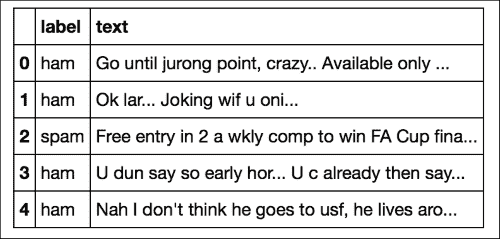

数据集包含两列：第一列包含标签（`spam` 或 `ham`），分别表示消息是否为广告或普通消息。第二列包含消息的文本。一开始，我们可以看到使用这种原始文本作为算法预测垃圾邮件/非垃圾邮件标签输入时存在的一些问题：

+   每条消息的文本包含大小写字母的混合，但这种大写形式并不影响单词的意义。

+   许多单词（如 *to*、*he*、*the* 等）很常见，但关于消息的信息相对较少。

其他问题更为微妙：

+   当我们比较诸如 *larger* 和 *largest* 这样的单词时，关于单词意义的最多信息是由词根 *large* 承载的——区分这两种形式实际上可能阻止我们捕捉到关于单词 *large* 在文本中出现的共同信息，因为消息中这个词根的计数将分布在各种变体之间。仅仅查看单个单词并不能告诉我们它们使用的上下文。实际上，考虑单词集合可能更有信息量。

+   即使对于不属于常见类别的单词，如 *and*、*the* 和 *to*，有时也不清楚一个单词是否出现在文档中，因为它在所有文档中都常见，或者它是否包含关于特定文档的特殊信息。例如，在一组在线电影评论中，像 *character* 和 *film* 这样的单词会频繁出现，但它们并不能帮助区分不同的评论，因为它们在所有评论中都常见。由于英语词汇量很大，结果特征集的大小可能非常大。

让我们先从清理文本开始，然后再深入研究其他特征问题。我们可以通过以下函数将文本中的每个单词转换为小写：

```py
>>> def clean_text(input):
…      return "".join([i.lower() for i in input])

```

我们然后将此函数应用于每条消息，使用我们在之前的示例中看到的映射函数：

```py
>>> spam.text = spam.text.map(lambda x: clean_text(x))

```

检查结果可以验证所有字母现在确实都是小写的：

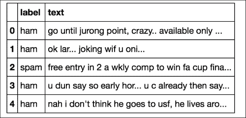

接下来，我们希望删除常见单词并修剪剩余词汇表，仅保留对预测建模最有用的单词的词干部分。我们使用 **自然语言工具包**（**NLTK**）库（Bird, Steven. *NLTK: the natural language toolkit*. Proceedings of the COLING/ACL on Interactive presentation sessions. Association for Computational Linguistics, 2006）来完成这项操作。停用词表是该库关联下载的数据集的一部分；如果您是第一次打开 NLTK，可以使用 `nltk.download()` 命令打开一个 **图形用户界面**（**GUI**），在那里您可以使用以下命令选择要复制到本地计算机的内容：

```py
>>> import nltk
>>> nltk.download()
>>> from nltk.corpus import stopwords
>>> stop_words = stopwords.words('english')

```

然后我们定义一个函数来执行词干提取：

```py
>>> def stem_text(input):
…    return " ".join([nltk.stem.porter.PorterStemmer().stem(t) if t not in \
…       stop_words else for t in nltk.word_tokenize(input)])

```

最后，我们再次使用 lambda 函数对每个消息执行此操作，并直观地检查结果：

```py
>>> spam.text = spam.text.map(lambda x: stem_text(x))

```

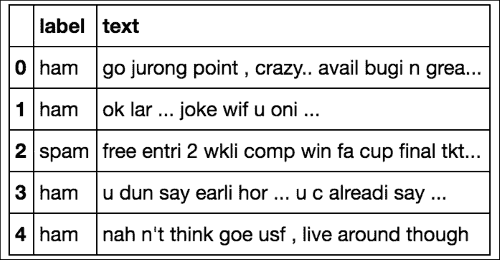

例如，您可以看到从 *joking* 中提取了词干 *joke*，以及从 *available* 中提取了 *avail*。

现在我们已经完成了小写化和词干提取，消息处于相对清洁的状态，我们可以从这个数据中生成用于预测建模的特征。

## 从文本数据中提取特征

在可能的最简单文本数据特征中，我们使用由 *0s* 和 *1s* 组成的二进制向量来简单地记录词汇表中每个单词在每个消息中的存在或不存在。为此，我们可以利用 `scikit-learn` 库中的 `CountVectorizer` 函数，使用以下命令：

```py
>>> from sklearn.feature_extraction.text import CountVectorizer
>>> count_vect_sparse = CountVectorizer().fit_transform(spam.text)

```

默认情况下，结果存储为 *稀疏向量*，这意味着只有非零元素被保留在内存中。为了计算这个向量的总大小，我们需要将其转换回 *密集向量*（其中所有元素，包括 0，都存储在内存中）：

```py
>>> count_vect_sparse[0].todense().size

```

通过检查为第一条消息创建的特征向量长度，我们可以看到它为每个消息创建了一个长度为 7,468 的向量，其中 1 和 0 分别表示特定单词在文档列表中的存在或不存在。

我们可以使用以下命令检查这个长度实际上与词汇表（消息中所有唯一单词的并集）相同，该命令提取向量化器的 `vocabulary_` 元素，它也给出了 7,468 的值：

```py
>>> len(CountVectorizer().fit(spam.text).vocabulary_)Recall from the earlier that individual words might not informative features if their meaning is dependent upon the context given by other words in a sentence. Thus, if we want to expand our feature set to potentially more powerful features, we could also consider n-grams, sets of n co-occurring words (for example, the phrase \the red house contains the n-grams the red, and red house (2-grams), and the red house (3-gram)). These features are calculated similarly as above, by supplying the argument ngram_range to the CountVectorizer constructor:
>>> count_vect_sparse = CountVectorizer(ngram_range=(1, 3)).fit_transform(spam.text)

```

我们可以看到，通过再次检查第一行的长度，这个操作将结果特征的大小增加了大约 10 倍：

```py
>>> count_vect_sparse[0].todense().sizeInsert

```

然而，即使在计算了 n-gram 之后，我们仍未考虑到某些单词或 n-gram 可能跨越所有消息，因此提供的信息很少，难以区分垃圾邮件和非垃圾邮件。为了解决这个问题，我们可能不会简单地记录单词（或 n-gram）的存在或不存在，而是比较文档中单词的频率与所有文档的频率。这个比率，即 **词频-逆文档频率**（**tf-idf**），以最简单形式计算如下：

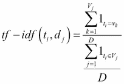

其中*t*i 是一个特定的术语（单词或 n-gram），*d*j 是一个特定的文档，*D*是文档的数量，*V*j 是文档*j*中的单词集合，*v*k 是文档*j*中的一个特定单词。这个公式中的下标`1`被称为**指示函数**，如果下标条件为`true`则返回`1`，否则返回`0`。本质上，这个公式比较了一个单词在文档中的频率（计数）与包含这个单词的文档数量。随着包含该单词的文档数量的减少，分母减少，因此整体公式在除以一个远小于`1`的值时变得更大。这通过分子中单词在文档中的频率来平衡。因此，`tf-idf`分数将更重视在文档中频率更高的单词，相对于在所有文档中都常见的单词，这些单词可能表明特定消息的特殊特征。

注意，上面的公式仅代表这个表达式的最简单版本。还有一些变体，我们可能会对计数进行对数变换（以抵消来自大型文档的偏差），或者通过文档中任何术语的最大频率来缩放分子（再次，为了抵消较长的文档可能由于拥有更多单词而具有比短文档更高的术语频率的偏差）（Manning, Christopher D., Prabhakar Raghavan, and Hinrich Schütze. *评分、术语加权和向量空间模型.* 信息检索导论 100 (2008): 2-4）。我们可以使用以下命令对垃圾邮件数据应用`tf-idf`：

```py
>>> from sklearn.feature_extraction.text import TfidfVectorizer
>>> tf_idf = TfidfVectorizer().fit_transform(spam.text)

```

我们可以通过使用以下方法来观察这种变换的影响：

```py
>>> tf_idf.todense().max(1)

```

当`max`函数的`1`参数指示函数是沿着行（而不是列，列可以通过`0`指定）应用时。当我们的特征仅由二进制值组成时，每行的最大值会是`1`，但我们现在可以看到它是一个浮点值。

我们将要讨论的最后一个文本特征是关于压缩我们的特征集。简单来说，当我们考虑越来越大的词汇表时，我们会遇到许多非常罕见的单词，以至于几乎从未出现过。然而，从计算的角度来看，即使一个文档中的一个单词的实例也足以增加我们所有文档文本特征中的列数。鉴于这一点，我们可能认为可以通过压缩空间需求来减少列数，从而用更少的列来表示相同的数据集。虽然在某些情况下，两个单词可能映射到同一列，但由于单词频率的长尾分布，这种情况在实践中很少发生，这可以作为一种方便的方法来降低我们文本数据的维度。为了执行这种映射，我们使用一个哈希函数，该函数将单词作为输入并输出一个随机数（列位置），该随机数与该字符串的值相关联。我们最终映射到转换后的数据集中的列数由`HashingVectorizer`的`n_features`参数控制，我们可以使用以下命令将其应用于我们的数据集：

```py
>>> from sklearn.feature_extraction.text import HashingVectorizer
>>> h = HashingVectorizer(n_features=1024).fit_transform(spam.text)

```

## 使用降维简化数据集

尽管使用`HashingVectorizer`可以将数据减少到从更大的特征集到 1,024 列，但我们数据集中仍然存在许多变量。直觉告诉我们，这些特征中的一些，无论是在应用`HashingVectorizer`之前还是之后，可能存在相关性。例如，一组单词可能在一个垃圾邮件文档中同时出现。如果我们使用 n-gram 并且单词相互相邻，我们可能会注意到这个特征，但如果单词只是出现在消息中但被其他文本分隔，则不会。例如，如果某些常见术语出现在消息的第一句话中，而其他术语则接近结尾。更广泛地说，考虑到我们已看到的大量变量，例如文本数据，我们可能会问是否可以用更紧凑的特征集来表示这些数据。换句话说，是否有潜在的规律可以描述成千上万的变量变化，这些变量可以通过计算代表个体变量之间相关性的更少数量的特征来提取？在某种程度上，我们在第三章中已经看到了几个这个想法的例子，即通过将单个数据点聚合到聚类中来降低数据集的复杂性。在以下例子中，我们有一个类似的目标，但不是聚合单个数据点，而是想要捕捉相关变量的组。

尽管我们可能通过变量选择技术如正则化（我们在第四章中讨论过）部分实现这一目标，即“通过模型连接点 – 回归方法”，但我们并不一定想要删除变量，而是要捕捉它们变化的共同模式。

让我们考察一些常见的降维方法，以及对于给定问题我们如何在这之间进行选择。

# 主成分分析

最常用的降维方法之一是**主成分分析**（**PCA**）。从概念上讲，PCA 计算数据变化最大的轴。你可能还记得，在第三章中，“在噪声中寻找模式 – 聚类和无监督学习”，我们计算了数据集的邻接矩阵的特征值以执行谱聚类。在 PCA 中，我们同样想要找到数据集的特征值，但在这里，我们不会使用任何邻接矩阵，而是会使用数据的协方差矩阵，它是列之间的相对变化。数据矩阵`X`中列`xi`和`xj`的协方差由以下公式给出：

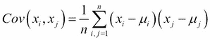

这是均值列值偏移的平均乘积。我们在第三章中计算相关系数时见过这个值，作为皮尔逊系数的分母。让我们用一个简单的例子来说明 PCA 是如何工作的。我们将创建一个数据集，其中六个列是从同一个基本正态分布中得出的，其中一个列的符号被反转，使用以下命令：

```py
>>> syn_1 = np.random.normal(0,1,100)
>>> syn_2 = -1*syn_1
>>> syn_data = [ syn_1, syn_1, syn_1, syn_2, syn_2, syn_2]

```

注意，我们每一列的均值都是 `0`，标准差是 `1`。如果不是这样，我们可以使用我们在第三章中讨论的 scikit-learn 工具 StandardScaler，即 *在噪声中寻找模式 – 聚类和无监督学习*，当我们对数据进行归一化以用于 k 均值聚类时。如果我们认为变量的尺度差异对我们问题很重要，我们可以简单地将变量中心化到 `0`，并使用得到的协方差矩阵。否则，尺度差异将倾向于通过数据列中的不同方差值来反映，因此我们的结果 PCA 将不仅反映变量之间的相关性，还会反映它们的大小差异。如果我们不想强调这些差异，并且只对变量之间的相对相关性感兴趣，我们还可以将数据中的每一列除以其标准差，使每一列的方差为 1。我们还可以潜在地运行 PCA，不是在协方差矩阵上，而是在变量之间的皮尔逊相关矩阵上，该矩阵已经自然地缩放到 0 和一个常数范围（从 -1 到 1）的值（Kromrey, Jeffrey D. 和 Lynn Foster-Johnson. *调节多重回归中的均值中心化：无事生非.* 教育与心理测量 58.1 (1998): 42-67）。现在，我们可以使用以下命令计算我们数据的协方差矩阵：

```py
>>> syn_cov = np.cov(syn_data)

```

回想我们在第三章中关于谱聚类的讨论，即 *在噪声中寻找模式 – 聚类和无监督学习*，如果我们把协方差矩阵看作是对向量的拉伸操作，那么，如果我们找到沿着这些扭曲方向的向量，我们就在某种程度上找到了定义数据变化的轴。如果我们然后比较这些向量的特征值，我们可以确定这些方向中是否有一个或多个反映了数据整体变化的一个更大比例。让我们使用以下命令计算协方差矩阵的特征值和向量：

```py
>>> [eigenvalues, eigenvectors] = np.linalg.eig(syn_cov)

```

这给出了以下特征值变量：

```py
array([  0.00000000e+00,   4.93682786e+00,   1.23259516e-32,          1.50189461e-16,   0.00000000e+00,  -9.57474477e-34])

```

你可以看到，除了第二个之外，大多数特征值实际上都是零。这反映了我们构建的数据，尽管有六个列，实际上只来源于一个数据集（一个正态分布）。这些特征向量的另一个重要特性是它们是正交的，这意味着在 n 维空间中它们彼此垂直：如果我们把它们之间的点积取出来，它将是 0，因此它们代表独立的向量，当它们线性组合时，可以用来表示数据集。

如果我们将数据乘以与第二个特征值对应的特征向量，我们将把数据从六维空间投影到一维空间：

```py
>>> plt.hist(np.dot(np.array(syn_data).transpose(),np.array(eigenvectors[:,1])))

```

注意，我们需要转置数据以获得 100 行和 6 列，因为我们最初将其构建为一个包含 6 列的列表，而 NumPy 将其解释为有 6 行和 100 列。结果直方图如下所示：

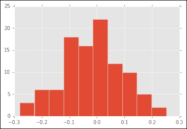

换句话说，通过将数据投影到最大方差轴上，我们恢复了这样一个事实，即这六个列数据实际上是从一个单一分布生成的。现在，如果我们使用 PCA 命令，我们会得到类似的结果：

```py
>>> syn_pca = PCA().fit(np.array(syn_data))

```

当我们提取`explained_variance_ratio_`时，算法实际上已经取了前面的特征值，按大小排序，然后除以最大的一个，得到：

```py
array([  1.00000000e+000,   6.38413622e-032,   2.02691244e-063,          2.10702767e-094,   3.98369984e-126,   5.71429334e-157])

```

如果我们将这些数据绘制成条形图，一种称为“特征值分布图”的可视化可以帮助我们确定数据中代表了多少个潜在成分：

```py
>>> scree, ax = plt.subplots()
>>> plt.bar(np.arange(0,6),syn_pca.explained_variance_ratio_)
>>> ax.set_xlabel('Component Number')
>>> ax.set_ylabel('Variance Explained')
>>> plt.show()

```

这生成了以下图表：

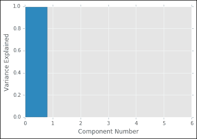

显然，只有第一个成分携带任何方差，由条形的高度表示，其他所有成分都接近 0，因此在图表中不显示。这种视觉分析方法类似于我们在第三章中寻找 k-means 的惯性函数中的肘部，*在噪声中寻找模式 – 聚类和无监督学习*，作为 k 的函数来确定数据中存在多少个簇。我们还可以提取投影到第一个主成分上的数据，并看到与之前将数据投影到协方差矩阵的特征向量上时相似的图表：

```py
>>> plt.hist(syn_pca.components_[0])

```

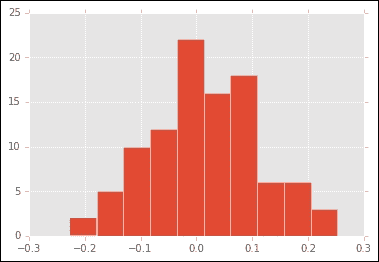

为什么它们不完全相同？虽然从概念上讲，PCA 计算协方差矩阵的特征值，但在实践中，大多数软件包为了数值效率并没有实际实现我们之前展示的计算。相反，它们采用一种称为**奇异值分解**（**SVD**）的矩阵运算，试图将*X*的协方差矩阵表示为一系列低维行和列矩阵：

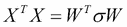

其中，如果*X*是一个*n*行*m*列的矩阵，W 可能是一个*n*行*k*列的矩阵，其中*k*远小于*m*。在这里，σ代表一个对角线以外的所有元素都是 0 的矩阵，对角线上的元素是非零的。因此，协方差矩阵表示为两个较小的矩阵的乘积和一个由σ的对角线元素给出的缩放因子。与之前我们计算协方差矩阵的所有特征向量不同，我们可以只要求 k 列或 WT，我们认为它们可能是有意义的，根据我们上面展示的散点图分析。然而，当我们通过这种方法将数据投影到主成分上时，奇异值分解的计算可能会给数据在主成分上的投影带来不同的符号，即使这些成分的相对大小和符号保持不变。因此，当我们查看将数据投影到前 k 个主成分后分配给特定行的分数时，我们应该将它们与其他数据集中的值进行比较，就像我们在第三章中检查多维尺度产生的坐标时一样，*在噪声中寻找模式 – 聚类和无监督学习*。默认 scikit-learn PCA 实现中使用的 SVD 计算的详细信息见(Tipping, Michael E.，and Christopher M. Bishop. *概率主成分分析*. 英国皇家统计学会会刊：系列 B（统计方法）61.3 (1999): 611-622.).

现在我们已经从概念上了解了 PCA 计算的内容，让我们看看它是否可以帮助我们减少文本数据集的维度。让我们对上面的 n-gram 特征集运行 PCA，请求 100 个成分。请注意，因为原始数据集是一个稀疏矩阵，而 PCA 需要一个密集矩阵作为输入，我们需要使用`toarray()`将其转换。此外，为了保留与 PCA 拟合函数使用的正确维度，我们需要转置结果：

```py
>>>  pca_text = PCA(num_components=10).fit(np.transpose(count_vect_sparse.toarray()))

```

如果我们将这个数据集的前 10 个主成分解释的总方差绘制成散点图，我们会看到我们可能需要相对较多的变量来捕捉数据的变异，因为解释的方差上升趋势相对平滑：

```py
>>> scree, ax = plt.subplots()
>>> plt.bar(np.arange(0,10),pca_text.explained_variance_ratio_)
>>>ax.set_xlabel('Component Number')
>>>ax.set_ylabel('Variance Explained')
>>> plt.show()

```

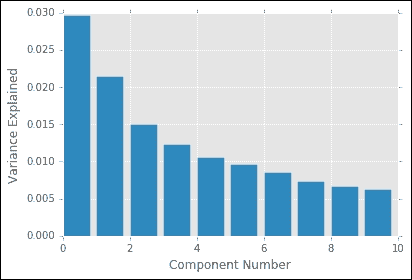

我们也可以通过查看使用*k*个成分解释的累积方差来可视化这一点，如下面的曲线所示：

```py
>>> scree, ax = plt.subplots()
>>> plt.plot(pca_text.explained_variance_ratio_.cumsum())
>>> ax.set_xlabel('Number of Components')
>>> ax.set_ylabel('Cumulative Variance Explained')
>>> plt.show() 

```

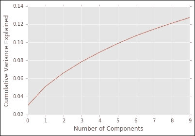

关于归一化的一点说明：在实践中，对于文档数据，我们可能不希望通过减去均值并除以方差来缩放数据，因为数据大多是二进制的。相反，我们只需对二进制矩阵或我们之前计算过的 tF-idf 分数应用 SVD，这种方法也称为**潜在语义索引**（**LSI**）(**Latent Semantic Indexing**)（Berry, Michael W., Susan T. Dumais, and Gavin W. O'Brien. *Using linear algebra for intelligent information retrieval*. SIAM review 37.4 (1995): 573-595; Laham, T. K. L. D., and Peter Foltz. *Learning human-like knowledge by singular value decomposition: A progress report*. Advances in Neural Information Processing Systems 10: Proceedings of the 1997 Conference. Vol. 10\. MIT Press, 1998.）。

使用 PCA 降低数据集维度的潜在缺点可能有哪些？首先，PCA 生成的成分（协方差矩阵的特征向量）本质上仍然是数学实体：这些轴所表示的变量模式可能实际上并不对应于数据的任何元素，而是它们的线性组合。这种表示并不总是容易理解，尤其是在尝试将此类分析的结果传达给领域专家以生成特定主题见解时尤其困难。其次，PCA 在其特征向量中产生负值，即使对于只有正值的文本数据（在一个文档中，一个术语不能以负值出现，只能是 0、1、计数或频率），这也是由于数据是使用这些因素进行线性组合的。换句话说，当我们通过矩阵乘法将数据投影到其成分上时，正负值可能会相加，从而产生投影的整体正值。再次，可能更希望有能够提供对数据本身结构的洞察力的因素，例如，通过提供一个由一组在特定文档组中倾向于共同出现的单词的二进制指示符组成的因素。这些目标通过两种其他矩阵分解技术得到解决：CUR 分解和非负矩阵分解。

与 PCA 中使用的 SVD 类似，CUR 试图将数据矩阵 X 表示为低维矩阵的乘积。在这里，CUR 分解试图找到矩阵的列和行集合，以最佳方式表示数据集，如下所示：

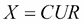

其中 *C* 是原始数据集的 *c* 列矩阵，*R* 是原始数据集的 *r* 行集合，*U* 是缩放因子矩阵。在此重建中使用的 *c* 列和 *r* 行是从原始矩阵的列和行中采样的，其概率与`杠杆分数`成正比，该分数由以下给出：

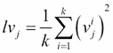

其中 *lvj* 是列（行）*j* 的统计杠杆，*k* 是 *X* 的奇异值分解中的分量数量，而 *vj* 是这些 *k* 个分量向量的第 *j* 个元素。因此，如果列（行）对矩阵奇异值总体范数的贡献显著，它们将以高概率被采样，这意味着它们也对从奇异值分解（例如，奇异值分解如何逼近原始矩阵）的重建误差有重大影响（Chatterjee, Samprit, 和 Ali S. Hadi. 线性回归中的敏感性分析. 第 327 卷. 约翰·威利与 Sons, 2009; Bodor, András, 等人. *rCUR: 用于 CUR 矩阵分解的 R 包*. 生物信息学杂志 13.1 (2012): 1）。

虽然这种分解可能不会像 PCA 中使用的奇异值分解方法那样精确地逼近原始数据集，但结果因子可能更容易解释，因为它们是原始数据集的实际元素。

### 注意

请注意，虽然我们使用奇异值分解来确定列和行的采样概率，但 CUR 的最终分解并不这样做。

存在许多生成 CUR 分解的算法（Mahoney, Michael W. 和 Petros Drineas. *CUR 矩阵分解以提高数据分析*. 美国国家科学院院刊 106.3 (2009): 697-702. Boutsidis, Christos 和 David P. Woodruff. 最优 CUR 矩阵分解*. 第 46 届年度 ACM 理论计算研讨会. ACM, 2014）。CUR 分解在 `pymf` 库中实现，我们可以使用以下命令调用它：

```py
>>> cur = pymf.CUR(count_vect_sparse.toarray().transpose(),crank=100,rrank=100)
>>> cur.factorize() >>> cur.factorize()

```

`crank` 和 `rrank` 参数指示在执行分解过程中应从原始矩阵中选择多少行和列。然后我们可以使用以下命令来打印出在这次重建中选择的列（词汇表中的单词）的索引包含在 cur 对象的 .`_cid`（列索引）元素中，以检查这些显著单词。首先我们需要收集我们垃圾邮件数据集词汇表中的所有单词列表：

```py
>>> vocab = CountVectorizer().fit(spam.text).vocabulary_
>>> vocab_array = ['']*len(vocab.values())
>>> for k,v in vocab.items():
…      vocab_array[v]=k
>>>vocab_array = np.array(vocab_array)

```

由于 `CountVectorizer` 返回的 `vocabulary_` 变量是一个字典，它给出了术语在映射到的数组中的位置，我们需要通过放置由这个字典给出的位置上的单词来构建我们的数组。现在我们可以使用以下命令打印出相应的单词：

```py
>>> for i in cur._cid:
… print(vocab_array[i])

```

与 CUR 类似，非负矩阵分解试图找到一组正成分来表示数据集的结构（Lee, Daniel D., 和 H. Sebastian Seung. *通过非负矩阵分解学习物体的部分*. 自然 401.6755 (1999): 788-791; Lee, Daniel D., 和 H. Sebastian Seung. *非负矩阵分解的算法*. 神经信息处理系统进展. 2001.; P. Paatero, U. Tapper (1994). Paatero, Pentti, 和 Unto Tapper. *正矩阵分解：一种非负因子模型，具有对数据值误差估计的最优利用*. 环境计量学 5.2 (1994): 111-126\. Anttila, Pia, 等人. *通过正矩阵分解识别芬兰的大量湿沉降源*. 大气环境 29.14 (1995): 1705-1718.). 同样，它试图使用以下方法重建数据：

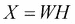

其中 *W* 和 *H* 是低维矩阵，当相乘时可以重建 *X*；*W*、*H* 和 *X* 的所有三个矩阵都被限制为没有负值。因此，*X* 的列是 *W* 的线性组合，使用 *H* 作为系数。例如，如果 *X* 的行是单词，列是文档，那么 *X* 中的每个文档都表示为 *W* 中基本文档类型的线性组合，其权重由 *H* 给定。与 CUR 分解返回的元素一样，非负矩阵分解的 *W* 成分可能比我们从 PCA 得到的特征向量更容易解释。

计算矩阵 *W* 和 *H* 的算法有好几种，其中最简单的一种是通过乘性更新（Lee, Daniel D., 和 H. Sebastian Seung. *非负矩阵分解的算法*. 神经信息处理系统进展. 2001）。例如，如果我们想最小化 *X* 和 *WH* 之间的欧几里得距离：

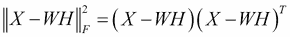

我们可以计算这个值相对于 *W* 的导数：

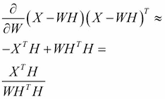

然后为了更新 *W*，我们在每一步乘以这个梯度：

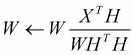

对于 *H* 也是如此：

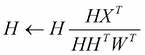

这些步骤会重复进行，直到 *W* 和 *H* 的值收敛。让我们看看当我们使用 NMF 提取成分时，从我们的文本数据中检索到的成分：

```py
>>> from sklearn.decomposition import NMF
>>> nmf_text = NMF(n_components=10).fit(np.transpose(count_vect_sparse.toarray())

```

然后，我们可以查看 NMF 成分所表示的单词，其中单词在分解后的成分矩阵中有较大的值。

我们可以看到它们似乎捕捉到不同的单词组，但它们是否与区分垃圾邮件和非垃圾邮件相关？我们可以使用 NMF 分解来转换我们的原始数据，这将给出线性组合这些特征的权重（例如，将分解得到的 10 个基文档线性组合以重建消息的权重）使用以下命令：

```py
>>> nmf_text_transform = nmf_text.transform(count_vect_sparse.toarray())

```

现在，让我们绘制每个这些`nmf`因素分配给正常和垃圾邮件的平均权重。我们可以通过绘制一个条形图来实现，其中*x*轴是 10 个`nmf`因素，而*y*轴是分配给这个因素的平均权重，对于文档的一个子集：

```py
>>> plt.bar(range(10),nmf_text_transform[spam.label=='spam'].mean(0))

```

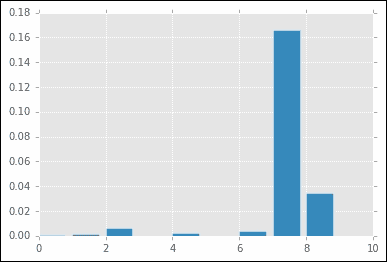

```py
>>> plt.bar(range(10),nmf_text_transform[spam.label=='ham'].mean(0))

```

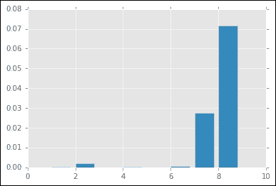

令人鼓舞的是，因素 8 和 9 在这两类消息之间似乎具有非常不同的平均权重。实际上，我们可能需要少于 10 个因素来表示数据，因为这两类可能很好地对应于潜在的垃圾邮件与非垃圾邮件消息。

## 潜在狄利克雷分配

一种将数据分解为可解释特征集的相关方法是**潜在狄利克雷分配**（**LDA**），这是一种最初为文本和基因数据开发的方法，后来已扩展到其他领域（Blei, David M., Andrew Y. Ng, 和 Michael I. Jordan. *潜在狄利克雷分配*. 机器学习研究杂志 3 (2003): 993-1022。Pritchard, Jonathan K., Matthew Stephens, 和 Peter Donnelly. *使用多座位点基因型数据推断种群结构*. 遗传学 155.2 (2000): 945-959）。与之前我们探讨的方法不同，那些方法将数据表示为一系列低维矩阵的集合，这些矩阵相乘可以近似原始数据，LDA 使用一个概率模型。这个模型通常使用一个板图来解释，该图说明了变量之间的依赖关系，如下面的图所示：

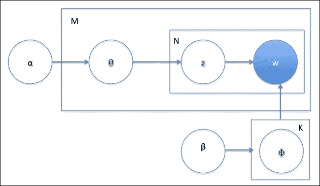

这个图究竟描述了什么？它被称为生成模型：一组生成文档概率分布的指令。这个想法与你可能熟悉的正态分布“钟形曲线”类似，但在这里，我们不是从分布中抽取实数，而是抽样文档。生成模型可以与我们在前几章中看到的预测方法进行对比，这些方法试图将数据拟合到响应（例如，我们在第四章 Chapters 4、*Connecting the Dots with Models – Regression Methods*和第五章 Chapter 5、*Putting Data in its Place – Classification Methods and Analysis*中研究的回归或分类模型）中看到的，而不是简单地根据分布生成数据的样本。平板图表示这个生成模型的组件，我们可以将这个模型视为以下一系列步骤来生成一个文档：初始化一个狄利克雷分布来从一组主题中进行选择。这些主题类似于我们在 NMF 中找到的组件，可以被视为代表一组共同出现的单词的*基础文档*。狄利克雷分布由以下公式给出：

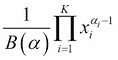

前面的公式给出了观察给定分布（此处为主题）在 `K` 个类别中的概率，并且可以用来抽样一个 `K` 个类别成员的向量（例如，抽样一个随机向量，给出集合中属于特定主题的文档比例）。狄利克雷分布中的 alpha 参数用作 K 类别概率的指数，并增加分配给特定成分（例如，更频繁的主题）的重要性。术语 `B` 是贝塔函数，它只是一个归一化项。我们在步骤 1 中使用狄利克雷分布来生成文档 *i* 的每个主题的概率分布。这个分布将是，例如，一系列权重，它们的和为 1，给出文档属于特定主题的相对概率。这是平板图中的参数 θ。M 代表我们数据集中的文档数量。

1.  对于文档中的每个 *N* 个单词位置，从分布 θ 中选择一个主题 Z。每个 M 个主题都有一个参数 β 的狄利克雷分布，而不是给出每个单词的概率，给出 ϕ。使用这个分布来选择文档中每个 N 位置的单词。

1.  对数据集中的每个文档的每个单词位置重复步骤 2–4，以生成一组文档。

在之前的图中，矩形内的数字（**M**、**N**、**K**）表示圆圈所代表的变量在生成模型中生成的次数。因此，作为最内层的单词 w 被生成*N × M*次。你还可以注意到，矩形包围了生成相同次数的变量，而箭头则表示在此数据生成过程中变量之间的依赖关系。你现在也可以理解这个模型名称的由来，因为文档在许多主题中潜在分配，正如我们在 NMF 中使用因子来找到可以重建我们观察到的数据的'基础文档'的线性组合。

此配方也可以用来找到一组主题（例如单词概率分布），这些主题适合数据集，假设之前描述的模型用于生成文档。不深入推导的细节，我们随机初始化一个固定的*K*个主题数量，并按照之前描述的方式运行模型，即始终采样一个文档的主题，给定所有其他文档，以及一个单词，给定文档中所有其他单词的概率。然后我们根据观察到的数据更新模型的参数，并使用更新的概率再次生成数据。经过多次迭代，这个被称为 Gibbs 抽样的过程将从随机初始化的值收敛到一组最佳拟合观察到的文档数据的模型参数。现在让我们使用以下命令将 LDA 模型拟合到垃圾邮件数据集：

```py
>>> lda = LatentDirichletAllocation(n_topics=10).fit(count_vect_sparse)

```

与 NMF 一样，我们可以使用以下方法检查每个主题的最高概率单词：

```py
>>> for i in range(10):
…    print(vocab_array[np.argsort(lda.components_[i])[1:10]])

```

同样，我们可以看到这些主题是否代表了垃圾邮件和非垃圾邮件之间的有意义分离。首先，我们使用以下`transform`命令找到每个文档在 10 个潜在主题中的主题分布：

```py
>>> topic_dist = lda.transform(count_vect_sparse)

```

这与我们在 NMF 中计算的权重类似。现在我们可以按如下方式绘制每个消息类的平均主题权重：

```py
>>> plt.bar(range(10),topic_dist[spam.label=='ham'].mean(0))

```

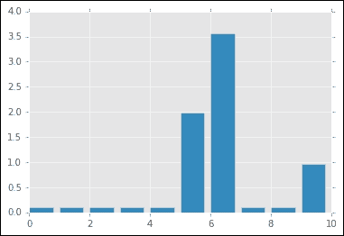

```py
>>> plt.bar(range(10),topic_dist[spam.label=='spam'].mean(0))

```

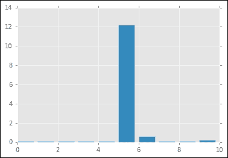

再次，令人鼓舞的是，我们发现对于垃圾邮件和非垃圾邮件，主题 5 的平均权重不同，这表明 LDA 模型已成功分离出我们用于分类目的感兴趣的变化轴。

## 在预测建模中使用降维

我们之前概述的分析主要致力于通过找到一组较小的成分来提取文本集合的较低维表示，这些成分可以捕捉单个文档之间的变化。在某些情况下，这种分析可以作为探索性数据分析工具是有用的，就像我们在第三章中描述的聚类技术一样，*在噪声中寻找模式 – 聚类和无监督学习*，它使我们能够理解数据集的结构。我们甚至可以将聚类和降维结合起来，这本质上是我们考察的第三章中谱聚类的想法，*在噪声中寻找模式 – 聚类和无监督学习*，使用 SVD 将邻接矩阵减少到更紧凑的表示，然后对这一减少的空间进行聚类，以产生数据点之间更清晰的分离。

与通过聚类分配的组一样，我们也可以潜在地使用这些降维方法得到的成分作为预测模型中的特征。例如，我们之前提取的 NMF 成分可以用作分类模型的输入，以区分垃圾邮件和非垃圾邮件。我们甚至在此之前已经看到了这种用法，因为我们使用的在线新闻流行度数据集，在第四章中，*使用模型连接点 – 回归方法*，其列是从 LDA 主题中派生出来的。与我们在第四章中看到的正则化方法一样，降维可以通过提取变量之间的潜在相关性来帮助减少过拟合，因为这些低维变量通常比使用整个特征空间更少噪声。现在我们已经看到降维如何帮助我们找到文本数据中的结构，让我们考察图像中发现的另一类可能的高维数据。

# 图像

与文本数据一样，图像可能存在噪声和复杂性。此外，与具有单词、段落和句子结构的语言不同，图像没有我们可以用来简化原始数据的预定义规则。因此，图像分析的大部分工作将涉及从输入特征中提取模式，这些模式理想情况下仅基于输入像素对人类分析师来说是可解释的。

## 清洗图像数据

我们将在图像上执行的一种常见操作是增强对比度或改变它们的颜色范围。例如，让我们从一个来自`skimage`包的咖啡杯示例图像开始，您可以使用以下命令导入和可视化它：

```py
>>> from skimage import data, io, segmentation
>>> image = data.coffee()
>>> io.imshow(image)
>>> plt.axis('off');

```

这会产生以下图像：


在 Python 中，这个图像被表示为一个三维矩阵，其维度对应于高度、宽度和颜色通道。在许多应用中，颜色并不重要，我们试图确定一组图像中常见的形状或特征，这些图像可以根据灰度级别区分。我们可以轻松地使用以下命令将此图像转换为灰度版本：

```py
>>> grey_image = skimage.color.rgb2gray(image)
>>> io.imshow(grey_image)
>>> plt.axis('off');

```


在图像分析中，一个常见的任务是识别图像中的不同区域或对象。如果像素聚集在一个区域（例如，如果图像中有非常强烈的阴影或强烈的光线），而不是沿着强度谱均匀分布，这可能会使任务变得更加困难。为了识别不同的对象，通常希望这些强度均匀分布，我们可以通过以下命令执行直方图均衡化来实现这一点：

```py
>>> from skimage import exposure
>>> image_equalized = exposure.equalize_hist(grey_image)
>>> io.imshow(image_equalized)
>>> plt.axis('off'); 

```

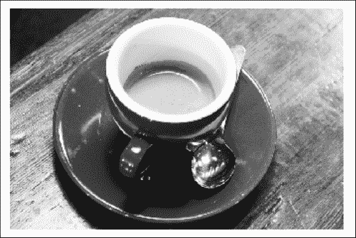

要查看这种归一化的效果，我们可以使用以下命令绘制变换前后像素强度的直方图：

```py
>>> plt.hist(grey_image.ravel())

```

这给出了未校正图像的以下像素分布：

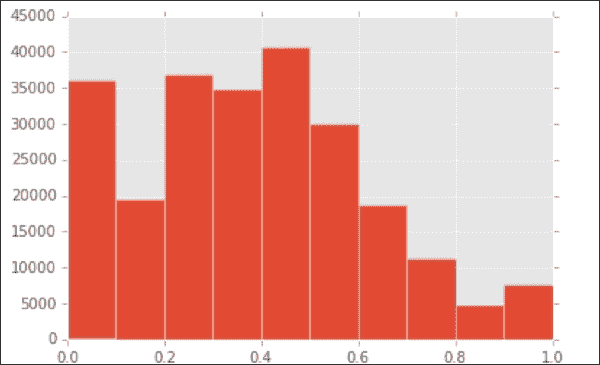

这里使用的`ravel()`命令用于将我们开始的二维数组展平成一个可能输入到直方图函数的单个向量。同样，我们可以使用以下命令绘制归一化后像素强度的分布：

```py
>>> plt.hist(image_equalized.ravel(),color='b')

```

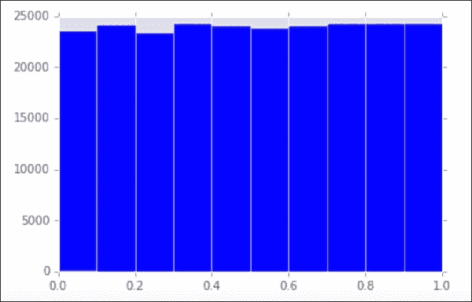

## 通过阈值化图像突出显示对象

对于图像分析来说，另一个常见的任务是识别单张图像中的单个对象。为此，我们需要选择一个阈值将图像二值化为白色和黑色区域，并分离重叠的对象。对于前者，我们可以使用阈值化算法，如 Otsu 阈值化（Otsu, Nobuyuki. *从灰度直方图中选择阈值的方法.* 自动化 11.285-296 (1975): 23-27），它使用一个*结构元素*（例如 n 像素的圆盘）并试图找到一个像素强度，这个强度将最好地将该结构元素内的像素分为两类（例如，黑色和白色）。我们可以想象将一个圆盘在整个图像上滚动并进行这种计算，结果要么是在圆盘内的局部值，要么是一个全局值，它将图像分为前景和背景。然后我们可以通过阈值化高于或低于此值的像素将图像转换为二值掩码。

为了说明，让我们考虑一张硬币的图片，我们想要将硬币从背景中分离出来。我们可以使用以下命令可视化直方图均衡化的硬币图像：

```py
>>> coins_equalized = exposure.equalize_hist(skimage.color.rgb2gray(data.coins()))
>>> io.imshow(coins_equalized)

```

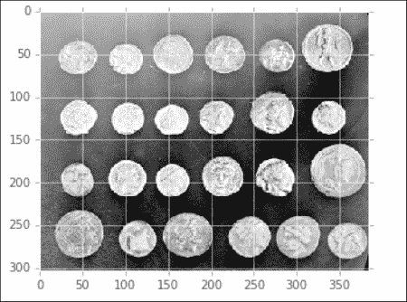

我们可以看到的一个问题是背景有一个光照梯度，向图像的左上角增加。这种差异不会改变背景和对象（硬币）之间的区别，但由于背景的一部分与硬币具有相同的强度范围，这将使得分离硬币本身变得困难。为了减去背景，我们可以使用闭合函数，它依次侵蚀（移除小于结构元素的白色区域）然后膨胀（如果结构元素内有白色像素，结构元素内的所有元素都翻转成白色）。在实践中，这意味着我们移除小的白色斑点并增强剩余的浅色区域。如果我们然后从图像中减去这部分，就像这里所示，我们就可以减去背景：  

```py
>>> from skimage.morphology import opening, disk
>>> d=disk(50)
>>> background = opening(coins_equalized,d)
>>> io.imshow(coins_equalized-background) 

```

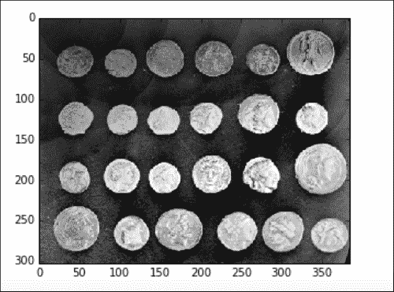

现在我们已经移除了背景，我们可以应用之前提到的 Otsu 阈值化算法，使用以下命令找到理想的像素来将图像分割成背景和对象：

```py
>>> from skimage import filter
>>> threshold_global_otsu = filter.threshold_otsu(coins_equalized-background)
>>> global_otsu = (coins_equalized-background) >= threshold_global_otsu
>>> io.imshow(global_otsu)

```

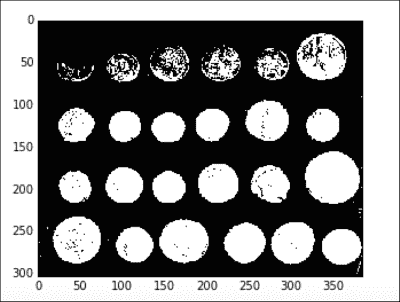

现在图像已经被分割成硬币和非硬币区域。我们可以使用这个分割后的图像来计数硬币的数量，例如，如果我们只想从硬币区域记录像素数据作为使用图像数据进行预测建模特征的一部分，我们可以使用上面获得区域作为*掩码*来突出显示原始图像中的硬币。

## 图像分析的降维

一旦我们适当地清理了我们的图像，我们如何将它们转换成更通用的建模特征呢？一种方法是通过使用我们之前用于文档数据的相同降维技术来尝试捕捉一组图像之间的共同变化模式。在文档中，我们用单词表示，而在图像中，我们有像素的模式，但除此之外，相同的算法和分析在很大程度上适用。作为一个例子，让我们考虑一组人脸图像([`www.geocities.ws/senthilirtt/Senthil%20Face%20Database%20Version1`](http://www.geocities.ws/senthilirtt/Senthil%20Face%20Database%20Version1))，我们可以使用以下命令加载和检查：

```py
>>> faces = skimage.io.imread_collection('senthil_database_version1/S1/*.tif')
>>> io.imshow(faces[1])

```

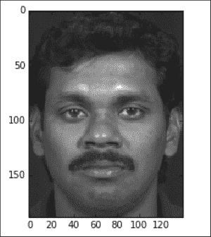

对于这两维图像中的每一个，我们希望将其转换成一个向量，就像我们在讨论归一化时绘制像素频率直方图时做的那样。我们还将构建一个集合，其中从每个像素中减去人脸的平均像素强度，从而得到每个脸相对于数据中的*平均脸*的偏移，以下命令：

```py
>>> faces_flatten = [f.ravel() for f in faces]
>>> import pylab
>>> faces_flatten_demean = pylab.demean(faces_flatten,axis=1)

```

我们考虑了两种将面孔分解为更一般特征的可能方法。第一种是使用 PCA 来提取这些数据中的主要变化向量——这些向量碰巧看起来也像面孔。由于它们是由协方差矩阵的特征值形成的，这类特征有时被称为 eigenfaces。以下命令说明了在面部数据集上执行 PCA 的结果：

```py
>>> from sklearn.decomposition import PCA
>>> faces_components = PCA(n_components=3).fit(faces_flatten_demean)
>>> io.imshow(np.reshape(faces_components.components_[1],(188,140)))

```

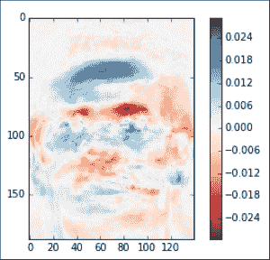

面部数据中的多少变化可以通过主成分来捕捉？与文档数据相比，我们可以看到，即使只使用三个成分，PCA 也能解释数据集中大约三分之二的变化：

```py
>>> plt.plot(faces_components.explained_variance_ratio_.cumsum())

```

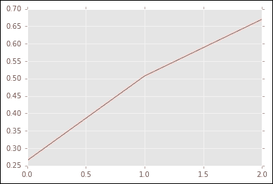

我们也可以像之前描述的那样应用 NMF，以找到一组基面孔。你可以从前面的热图中注意到，我们提取的 eigenfaces 可以具有负值，这突出了我们之前提到的一个解释困难：我们实际上不可能有负像素（因为 ，所以具有负元素的潜在特征很难解释。相比之下，我们使用 NMF 提取的成分将看起来更像是原始数据集的元素，如下所示，使用以下命令：

```py
>>> from sklearn.decomposition import NMF
>>> faces_nmf = NMF(n_components=3).fit(np.transpose(faces_flatten)) 
>>> io.imshow(np.reshape(faces_nmf.components_[0],(188,140))) 

```

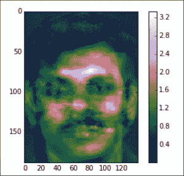

与类似于许多图像平均版本的 eigenfaces 不同，从这些数据中提取的 NMF 成分看起来像单个面孔。虽然我们在这里不会进行练习，但我们甚至可以将 LDA 应用于图像数据以找到由像素分布表示的主题，实际上它已经被用于这个目的（Yu, Hua, 和 Jie Yang. 《高维数据直接 LDA 算法——应用于人脸识别》. 模式识别 34.10 (2001): 2067-2070; Thomaz, Carlos E. 等. 《基于最大不确定性的 LDA 方法用于分类和分析 MR 脑图像》. 医学图像计算和计算机辅助干预——MICCAI 2004. Springer Berlin Heidelberg, 2004. 291-300.）。

尽管我们之前讨论的降维技术在理解数据集、聚类或建模的上下文中很有用，但它们在存储数据的压缩版本方面也可能很有用。特别是在我们将在第八章 Chapter 8 中开发的模型服务中，能够存储数据的小版本可以减少系统负载，并提供一种更容易将传入数据处理成预测模型可以理解的形式的方法。例如，我们可以快速提取所需的少量成分，例如，从新的文本数据中，而不必持久化整个记录。

# 案例研究：在 PySpark 中训练推荐系统

为了结束这一章，让我们看看如何使用降维技术生成一个大规模推荐系统的示例。我们将使用的数据集来自一家在线商店的用户交易记录（Chen, Daqing, Sai Laing Sain, 和 Kun Guo. *数据挖掘在在线零售行业中的应用：基于数据挖掘的 RFM 模型客户细分案例研究*. 数据库营销与客户战略管理杂志 19.3 (2012): 197-208）。在这个模型中，我们将输入一个矩阵，其中行表示用户，列代表电子商务网站目录中的项目。用户购买的项目用 1 表示。我们的目标是使用 k 个组件将这个矩阵分解为 1 x k 的 *用户因素*（行成分）和 k x 1 的 *项目因素*（列成分）。然后，面对一个新用户及其购买历史，我们可以预测他们未来可能购买的项目，从而在主页上向他们推荐可能的产品。这样做的方法如下：

1.  将用户的先前购买历史视为 *一个* 向量 *p*。我们想象这个向量是未知的 *用户因素* 成分 *u* 与我们通过矩阵分解获得的项目因素 *i* 的乘积：向量 *p* 的每个元素然后是未知用户因素与给定项目因素的点积。在方程中求解未知用户因素 *u*：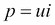

    考虑到项目因素 *i* 和购买历史 *p*，使用矩阵。使用得到的用户因素 *u*，与每个项目因素进行点积运算以获得排序结果，从而确定排名靠前的项目列表。

现在我们已经描述了在这个例子中“幕后”发生的事情，我们可以开始使用以下命令解析这些数据。首先，我们创建一个解析函数来读取包含项目 ID 和用户 ID 的第 2 列和第 7 列的数据：

```py
>>> def parse_data(line):
…     try: 
…         line_array = line.split(',')
…      return (line_array[6],line_array[1]) # user-term pairs
…      except:
…         return None

```

接下来，我们读取文件并将用户和项目 ID（都是字符串）转换为数值索引，通过在向字典添加唯一项目时递增计数器来完成：

```py
>>> f = open('Online Retail.csv',encoding="Windows-1252")
>>> purchases = []
>>> users = {}
>>> items = {}
>>>user_index = 0
>>>item_index = 0
>>>for index, line in enumerate(f):
…    if index > 0: # skip header
…         purchase = parse_data(line)
…         if purchase is not None:
 …            if users.get(purchase[0],None) is not None:
 …                purchase_user = users.get(purchase[0])
 …            else:
 …                users[purchase[0]] = user_index
 …                user_index += 1
 …                purchase_user = users.get(purchase[0])
 …            if items.get(purchase[1],None) is not None:
 …               purchase_item = items.get(purchase[1])
…             else:
 …                items[purchase[1]] = item_index
 …                item_index += 1
 …                purchase_item = items.get(purchase[1])
 …           purchases.append((purchase_user,purchase_item))>>>f.close()

```

接下来，我们将得到的购买数组转换为 `rdd`，并将结果条目转换为 Rating 对象——一个 (用户, 项目, 评分) 元组。在这里，我们将仅通过给所有观察到的购买项目分配 1.0 的评分来表示购买的发生，但也可以有一个系统，其中评分表示用户偏好（如电影评分）并遵循数值尺度。

```py
>>> purchasesRdd = sc.parallelize(purchases,5).map(lambda x: Rating(x[0],x[1],1.0))

```

现在我们可以使用以下命令拟合矩阵分解模型：

```py
>>> from pyspark.mllib.recommendation import ALS, MatrixFactorizationModel, Rating

>>> k = 10
>>> iterations = 10
>>> mfModel = ALS.train(purchasesRdd, k, iterations)

```

PySpark 中使用的矩阵分解算法是**交替最小二乘法**（**ALS**），它具有选择行（列）组件数量（`k`）的参数和一个正则化参数 λ，我们在这里没有指定，但它与我们在第四章“通过模型连接点 – 回归方法”中研究的回归算法中的角色类似，*通过模型连接点 – 回归方法*，通过限制行（列）向量中的值不会变得过大，从而可能引起过拟合。

我们可以尝试几个 k 和 λ 的值，并测量观测值和预测矩阵（通过将行因子乘以列因子）之间的均方误差，以确定最佳值。

一旦我们获得了一个良好的拟合，我们就可以使用模型对象的 `predict` 和 `predictAll` 方法来获取对新用户的预测，并使用 `save` 方法将其持久化到磁盘上。

# 摘要

在本章中，我们检查了复杂、非结构化的数据。我们清理和标记了文本，并检查了将文档特征提取到可以纳入预测模型（如 n-gram 和 tf-idf 分数）的几种方法。我们还检查了降维技术，如 HashingVectorizer，矩阵分解，如 PCA、CUR、NMF，以及概率模型，如 LDA。我们还检查了图像数据，包括归一化和阈值操作，以及我们如何使用降维技术来找到图像之间的共同模式。最后，我们使用矩阵分解算法在 PySpark 中原型化了一个推荐系统。

在下一节中，你还将查看图像数据，但处于不同的背景：尝试使用复杂的深度学习模型从这些数据中捕获复杂特征。
