# 第七章. 从底层学习 – 深度网络和无监督特征

到目前为止，我们研究的是使用一组特征（表格数据集中的列）的预测建模技术，这些特征是为当前问题预先定义的。例如，用户账户、互联网交易、产品或任何对业务场景重要的项目通常使用特定行业的领域知识推导出的属性来描述。更复杂的数据，如文档，仍然可以转换成表示文本中单词的向量，如图像可以通过我们在第六章中看到的矩阵因子来表示，“文字与像素 – 处理非结构化数据”。然而，对于简单和复杂的数据类型，我们可以很容易地想象特征之间的高级交互（例如，某个国家某个年龄段的用户使用特定设备更有可能点击网页，而这三个因素中的任何一个单独都不是预测性的）以及全新的特征（如图像边缘或句子片段），这些特征在没有领域专业知识或大量试错的情况下很难构建。

理想情况下，我们可以自动找到用于预测建模任务的最佳特征，无论我们手头有什么原始输入，而无需测试大量变换和交互。这种能力——从相对原始的输入中自动确定复杂特征——是*深度学习*方法的一个吸引人的特性，这类算法通常应用于神经网络模型，近年来受到了广泛的欢迎。在本章中，我们将探讨以下主题：

+   基本神经网络如何拟合数据

+   深度学习方法如何提高经典神经网络的性能

+   如何使用深度学习进行图像识别

# 使用神经网络学习模式

我们将要研究的深度学习算法的核心构建块是*神经网络*，这是一种模拟大脑内部细胞产生脉冲以传递信号的预测模型。通过结合许多输入（例如，我们可能在表格数据集中拥有的许多列、文档中的单词或图像中的像素）的个别贡献，网络整合信号以预测感兴趣的输出（无论是价格、点击率还是其他响应）。因此，将此类模型拟合到数据涉及确定神经元的最优参数，以执行从输入数据到输出变量的映射。

本章我们将讨论的深度学习模型的一些常见特征是我们能够调整的大量参数以及模型的复杂性。而到目前为止我们所看到的回归模型需要我们确定大约 50 个系数的最优值，在深度学习模型中，我们可能拥有数百或数千个参数。然而，尽管这种复杂性，深度学习模型由相对简单的单元组成，因此我们将从这些构建块开始研究。

## 一个网络——感知器

我们能想象到的最简单的神经网络由一个线性函数组成，被称为感知器（Rosenblatt, Frank. The perceptron, a perceiving and recognizing automaton Project Para. Cornell Aeronautical Laboratory, 1957）：

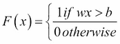

在这里，*w* 是列向量 *x* 中每个输入特征的权重集合，而 *b* 是截距。你可能认出这与我们在第五章中考察的支持向量机（SVM）的公式非常相似，*将数据放在合适的位置 – 分类方法和分析*，当使用的核函数是线性时。上述函数和 SVM 根据点是否位于由 *w* 给定的超平面之上或之下将数据分为两类。如果我们想使用数据集来确定这个感知器的最优参数，我们可以执行以下步骤：

1.  将所有权重 *w* 设置为随机值。不同于使用固定的 *b* 作为偏移量，我们将向由 *n x m* 矩阵 *X* 表示的数据集矩阵中添加一列 *1s* 来表示这个偏移量，并与其他参数一起学习最优值。

1.  计算模型对于数据集中特定观察值 *x* 的输出，即 *F(xi)*。

1.  使用学习率 *α* 根据以下公式更新权重：

1.  在这里，*y[i]* 是目标（对于 *x[i]* 的真实标签 `0` 或 `1`）。因此，如果 *F(x[i])* 太小，我们将增加所有特征上的权重，反之亦然。

1.  对我们集合中的每个数据点重复步骤 2 和 3，直到达到最大迭代次数或平均误差达到：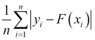

1.  在 *n* 个数据点上的误差低于给定的阈值 *ε*（例如，*1e-6*）。

虽然这个模型容易理解，但它对许多问题来说在实践上存在局限性。首先，如果我们的数据不能被超平面分离（它们不是线性可分的），那么我们就永远无法正确分类所有数据点。此外，所有权重都使用相同的规则更新，这意味着我们需要学习所有数据点的特征重要性的共同模式。此外，由于输出只有 1 或 0，感知器仅适用于二元分类问题。然而，尽管存在这些局限性，这个模型展示了更复杂神经网络模型的一些共同特征。上面给出的训练算法根据由学习率调整的分类误差来调整模型权重，这种模式我们将在更复杂的模型中也会看到。我们经常看到像前面那样的阈值（二元）函数，尽管我们也会放宽这个限制，并研究使用其他函数。

我们如何将这个简单的感知器发展成为更强大的模型？作为第一步，我们可以从结合许多这种类型的单个模型的输入开始。

## 结合感知器——单层神经网络

正如生物大脑由单个神经元细胞组成一样，神经网络模型由一系列函数组成，例如之前讨论过的感知器。我们将把这些网络中的单个函数称为**神经元**或**单元**。通过结合来自多个函数的输入，并使用一组权重进行混合，我们可以开始拟合更复杂的模式。我们还可以通过使用比感知器的线性决策边界更复杂的其他函数来捕捉非线性模式。一个流行的选择是我们之前在第五章中看到的对数变换，*将数据放在合适的位置——分类方法和分析*。回想一下，对数变换由以下公式给出：

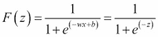

在这里，*w*是向量*x*的元素上的权重集合，*b*是一个偏移量或偏差，就像在感知器中一样。这个偏差在感知器模型中起着相同的作用，通过增加或减少模型计算出的分数的固定量，而权重则类似于我们在第四章中看到的回归系数，*使用模型连接点 – 回归方法*。为了在以下推导中简化符号，我们可以将值*wx+b*表示为一个单一变量*z*。正如在第五章中提到的逻辑回归模型，*将数据放在合适的位置 – 分类方法和分析*，这个函数将输入*x*映射到范围*[0,1]*，并且可以如图 1 所示（**图 1**）将一个输入向量*x*（由图顶部的三个绿色单元组成）通过线（表示权重*W*）连接到一个单一的蓝色单元（函数*F(z)*）进行视觉表示。

除了通过这种非线性变换增加我们分离数据的灵活性外，让我们也调整我们的目标定义。在感知器模型中，我们有一个单一的输出值`0`或`1`。我们也可以考虑将其表示为一个由两个单元组成的向量（如图 1 中所示，用红色表示），其中一个元素设置为`1`，另一个设置为`0`，表示数据点属于两个类别中的哪一个。这看起来可能像是一种不必要的复杂性，但随着我们构建越来越复杂的模型，它将变得非常有用。

经过这些修改，我们的模型现在由图 1 中显示的元素组成。逻辑函数从图顶部的向量表示的*x*的三个特征中获取输入，使用每个*x*元素的权重*W1*通过逻辑函数进行组合，并返回一个输出。然后，这个输出被下游的两个额外的逻辑函数使用，如图中底部的红色单元所示。左侧的函数使用第一个函数的输出给出类别`1`的概率分数。在右侧，第二个函数使用这个输出给出类别`0`的概率。同样，从蓝色单元到红色单元的输入由一个向量*W2*加权。通过调整*W2*的值，我们可以增加或减少激活其中一个红色节点并将其值设置为`1`的可能性。通过对这两个值取最大值，我们得到一个二元分类。

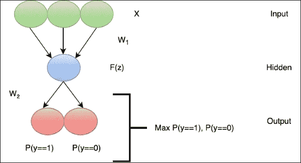

图 1：基本单层神经网络的架构

这个模型仍然相对简单，但具有一些将在更复杂场景中出现的特征。首先，我们现在实际上有多个层，因为输入数据有效地形成了这个网络的最顶层（绿色节点）。同样，两个输出函数形成另一个层（红色节点）。因为它位于输入数据和输出响应之间，中间层也被称为网络的 *隐藏层*。相比之下，最底层被称为 *可见层*，最顶层是 *输出层*。

目前，这并不是一个非常有趣的模型：虽然它可以使用逻辑函数从输入 *x* 进行非线性映射，但我们只有一组权重可以调整，这意味着我们只能通过重新加权来有效地从输入数据中提取一组模式或特征。从某种意义上说，它与感知器非常相似，只是决策函数不同。然而，只需进行一些修改，我们就可以轻松地开始创建更复杂的映射，这些映射可以适应输入特征之间的交互。例如，我们可以在隐藏层中添加两个额外的神经元，如图 **图 2** 所示。有了这些新单元，我们现在有三个可能不同的权重集，用于输入元素（每个代表输入的不同加权），每个在隐藏层中整合时都可能形成不同的信号。作为一个简单的例子，考虑如果向量代表一个图像：右侧和左侧的隐藏神经元可以接收权重 (*1,0,0*) 和 (*0,0,1*)，拾取图像的边缘，而中间的神经元可以接收权重 (*0,1,0*)，因此只考虑中间像素。输出层中两个类别的输出概率现在都受到三个隐藏神经元的影响。因此，我们现在可以调整向量 *W2* 中的权重参数，将三个隐藏单元的贡献汇总以决定两个类别的概率

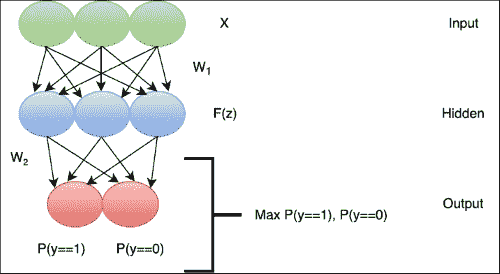

图 2：具有隐藏层中三个单元的更复杂架构

即使有这些修改，**图 2** 代表的模型仍然相对简单。为了增加模型的灵活性，我们可以在隐藏层中添加更多的单元。我们还可以通过在图的下部输出层添加更多单元来将这种方法扩展到具有两个以上类别的问题。此外，我们迄今为止只考虑了线性和对数逻辑变换，但正如我们将在本章后面看到的，我们有各种各样的函数可以选择。

然而，在我们考虑这个设计的更复杂变化之前，让我们检查确定此模型适当参数的方法。插入中间层意味着我们不能再依赖于我们为感知器模型使用的简单学习训练算法。例如，虽然我们仍然想要调整输入层和隐藏层之间的权重以优化预测和目标之间的误差，但最终的预测现在不是由隐藏层的输出给出，而是由其下面的输出层的输出给出。因此，我们的训练过程需要将输出层的误差纳入调整网络隐藏层的过程中。

## 使用反向传播进行参数拟合

给定图 2 中所示的三层网络，我们如何确定将我们的输入数据映射到输出的最佳权重集 **W** 和偏移量集 **b**？与感知器算法一样，我们最初可以将所有权重设置为随机数（一种常见策略是从均值为 0、标准差为 1 的正态分布中采样）。然后我们遵循网络从上到下的箭头流向，计算每个阶段的每个节点的逻辑变换，直到我们到达两个类别的概率。

为了调整我们随机选择的参数以更好地拟合输出，我们可以计算权重应该移动的方向以减少预测响应和观察响应 *y* 之间的误差，就像在感知器学习规则中一样。在**图 2**中，我们可以看到我们需要调整的两组权重：输入层和隐藏层之间的权重（W1）以及隐藏层和输出层之间的权重（W2）。

让我们从更简单的情况开始。如果我们正在调整最底层的权重（在输出层和隐藏层之间），那么我们希望找到随着我们改变权重时误差的变化（预测值和输出真实值之间的差异）。目前，我们将使用平方误差函数来演示：

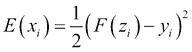

在这里，yi 是标签的实际值，而 `F(zi)` 代表输出层中的一个红色神经元（在这个例子中，是一个逻辑函数）。我们希望计算当我们调整权重（图 2 中连接隐藏层蓝色神经元和输出层红色神经元的一条线）时，这个误差函数的变化，这个权重由变量 `Wij` 表示，其中 `i` 和 `j` 是通过给定权重连接的红色神经元和蓝色神经元的索引。回想一下，这个权重实际上是变量 z 的一个参数（因为 `z=wx+b`），代表函数逻辑 *F* 的输入。由于变量 w 被嵌套在逻辑函数中，我们无法直接计算误差函数关于这个权重的偏导数来确定权重更新 Δw。

### 注意

我们想计算偏导数，因为误差是所有输入权重的函数，但我们希望独立更新每个权重

为了理解这一点，请回忆一下微积分中的一个例子，如果我们想要找到函数相对于 x 的导数：

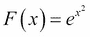

我们首先需要计算相对于 ez 的导数，然后乘以 z 相对于 x 的导数，其中 z=x²，得到最终值为 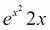。这个模式更一般地表示为：

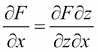

这被称为**链式法则**，因为我们把嵌套函数中的导数**链**在一起进行计算。实际上，尽管我们的例子只有单层嵌套，但我们可以将这个方法扩展到任意层数，只需要在上面的公式中插入更多的乘法项。

因此，当我们改变一个给定的权重 wij 时，要计算误差函数 E 的变化，我们首先需要计算误差函数相对于 F(z) 的导数，然后是 F(z) 相对于 z 的导数，最后是 z 相对于权重 wij 的导数。当我们把这三个偏导数相乘并约简分子和分母中的项时，我们得到误差函数相对于权重的导数。这就是之前描述的链式法则，用于计算特定权重 w 之间的误差相对于输出 i 和隐藏神经元 j 的偏导数：

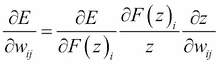

现在我们有了确定误差函数相对于权重的导数的公式，让我们确定这三个项中的每一个的值。第一个项的导数很简单，就是预测值和实际响应变量之间的差值：

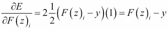

### 注意

请注意，这里的下标 i 指的是输出神经元的索引，而不是之前使用的数据点 i。

对于第二个项，我们发现逻辑函数的偏导数有一个方便的形式，即函数与 1 减去函数的乘积：


最后，对于最后一个项，我们简单地，

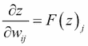

这里，`F(z)j` 是隐藏层神经元 j 的输出。为了调整权重 `wij`，我们希望朝着误差增加的反方向移动，就像我们在第五章中描述的随机梯度下降算法中做的那样，第五章，将数据放在合适的位置 – 分类方法和分析。因此，我们使用以下方程更新权重的值：

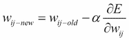

其中 `α` 是学习率。对于第一组权重（输入层和隐藏层之间），计算稍微复杂一些。我们再次从一个与之前相似的公式开始：

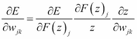

其中 wjk 是隐藏神经元 j 和可见神经元 k 之间的权重。与输出 `F(z)i` 相比，现在计算的是误差相对于权重的偏导数，相对于隐藏神经元的输出 `F(z)j`。由于隐藏神经元连接到多个输出神经元，在第一项中，我们不能简单地使用误差相对于神经元输出的导数，因为 F(z)j 从所有这些连接接收错误输入：F(z)j 与误差之间没有直接关系，只有通过输出层的 F(z)i。因此，对于隐藏到可见层的权重，我们需要通过将链式法则应用于每个输出神经元 i 的连接来求和偏导数的第一个项的结果：

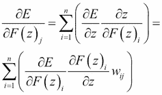

换句话说，我们沿着所有连接 wjk 到输出层的箭头求和偏导数。对于隐藏到可见层的权重，这意味着两条箭头（从每个输出到隐藏神经元 j）。

由于隐藏神经元的输入现在是可见层中的数据本身，方程中的第三项变为：

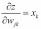

这只是数据向量 *x* 的一个元素。将这组值代入第一项和第三项，并使用之前给出的梯度下降更新，我们现在拥有了优化这个网络权重所需的所有成分。为了训练网络，我们重复以下步骤：

1.  随机初始化权重（再次，使用标准正态分布的样本是一种常见的方法）。

1.  从输入数据开始，按照 **图 2** 中的箭头（从上到下）通过网络前进，以计算底层输出。

1.  使用步骤 2 中计算的结果与实际输出值（例如类别标签）之间的差异，使用前面的方程计算每个权重需要改变的数量。

1.  重复步骤 1–3，直到权重达到一个稳定的值（这意味着新旧值之间的差异小于某个小的数值截止点，例如 *1e-6*）。

这个过程被称为反向传播（Bryson, Arthur E., Walter F. Denham, 和 Stewart E. Dreyfus. 带不等式约束的最优编程问题。*AIAA 杂志 1.11 (1963): 2544-2550; Rumelhart, David E., Geoffrey E. Hinton, 和 Ronald J. Williams. 通过反向传播错误学习表示* 认知建模 5.3 (1988): 1; Bryson, Arthur Earl. 应用最优控制：优化、估计和控制。CRC 出版社，1975；Alpaydin, Ethem. 机器学习导论。麻省理工学院出版社，2014。）因为从视觉上看，预测误差通过网络反向流动到输入的连接权重 w。在形式上，它与我们在本章开头讨论的感知器学习规则非常相似，但它适应了将预测误差与隐藏层和可见层之间的权重相关联的复杂性，这些权重取决于我们展示的示例中的所有输出神经元。

## 区分性模型与生成性模型

在前面描述的示例以及图 1 和图 2 中展示的例子中，箭头始终只从输入数据指向输出目标。这被称为前馈网络，因为信息的流动始终是单向的（Hinton, Geoffrey, 等人 *在语音识别中的声学建模深度神经网络：四个研究小组的共同观点* IEEE 信号处理杂志 29.6 (2012): 82-97）。然而，这并不是一个硬性要求——如果我们有一个箭头在可见层中既向前又向后移动的模型（图 3），那么在某种意义上，我们可以拥有一个生成模型，这与在第六章中讨论的 LDA 算法类似，*文字与像素 - 处理非结构化数据*：

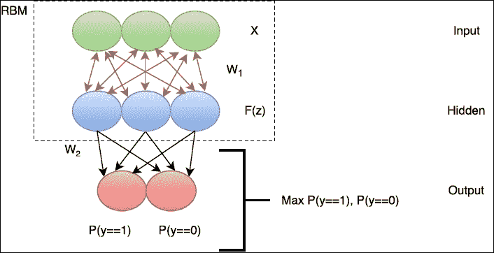

图 3：从图 2 中看到的神经网络的顶层两个级别的受限玻尔兹曼机（RBM）

而不是简单地生成输出层中的预测目标（判别模型），这样的模型可以用来从输入数据的假设分布中抽取样本。换句话说，正如我们能够使用 LDA 中描述的概率模型生成文档一样，我们也可以使用从隐藏层到可见层的权重作为输入到可见神经元的输入，从可见层抽取样本。这种类型的神经网络模型也被称为信念网络，因为它可以用来模拟网络（以输入数据的形式）所表示的“知识”以及执行分类。在每一层中每个神经元之间都有连接的可见层和隐藏层是一种更普遍地被称为限制性玻尔兹曼机（RBM）的模型（Smolensky, Paul. Information processing in dynamical systems: Foundations of harmony theory. No. CU-CS-321-86\. COLORADO UNIV AT BOULDER DEPT OF COMPUTER SCIENCE, 1986; Hinton, Geoffrey E., James L. Mcclelland, and David E. Rumelhart. *Distributed representations, Parallel distributed processing: explorations in the microstructure of cognition, vol. 1: foundations*. (1986).)。

除了通过模拟网络所接触到的可能输入数据点的空间中的样本来帮助我们理解数据的分布之外，RBM（限制性玻尔兹曼机）还可以成为我们构建的具有额外隐藏层的深度网络中的有用构建模块。然而，在添加这些额外层时，我们面临着许多挑战。

## 梯度消失和解释掉

即使图 2 和图 3 中显示的架构也不是我们能够想象的最复杂的神经网络。额外的隐藏层意味着我们可以添加输入特征之间的额外交互，但对于非常复杂的数据类型（如图像或文档），我们可以很容易地想象出可能需要超过一层混合和重组来捕捉所有感兴趣交互的情况。例如，可以想象一个文档数据集，其中网络捕获的个别单词特征被合并成句子片段特征，这些特征进一步合并成句子、段落和章节模式，从而可能提供 5+级别的交互。每个这样的交互都需要另一层隐藏神经元，因此连接数（以及需要调整的权重）相应增加。同样，一个图像可能被解析成不同分辨率的网格，这些网格合并成嵌套的更小和更大的对象。为了通过在我们的网络中添加额外的隐藏层（图 4）来适应这些更高级的交互，我们最终会创建一个越来越**深**的网络。我们还可以添加额外的 RBM 层，就像我们描述的那样。这种增加的复杂性是否有助于我们学习更准确的模式？我们是否仍然能够使用反向传播算法计算这样一个系统的最优参数？

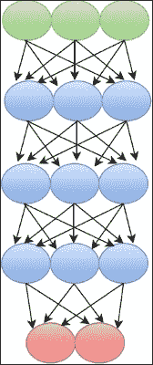

图 4：多层神经网络架构

让我们考虑在反向传播中添加额外层时会发生什么。回想一下，当我们推导出误差率变化作为第一层（可见层和第一隐藏层之间）权重函数的表达式时，我们最终得到一个乘积形式的方程，它是输出层和隐藏层之间的权重以及第一层中的权重的乘积：

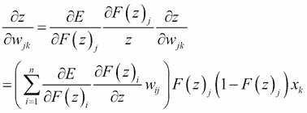

让我们考虑当第一个项（输出层的误差总和）小于 1 时会发生什么。由于这个公式是乘积形式，整个表达式的值也会减小，这意味着我们将通过非常小的步骤改变 wjk 的值。现在回想一下，为了计算与可见到隐藏连接 wjk 相关的误差变化，我们需要对所有从输出到这个权重的连接进行求和。在我们的例子中，我们只有两个连接，但在更深层的网络中，我们最终会得到额外的项，例如第一个项，以捕捉隐藏层和输出层之间所有层的误差贡献。当我们乘以更多小于 1 的项时，整个表达式的值会越来越接近 0，这意味着在梯度步骤中权重的值几乎不会更新。相反，如果所有这些项的值都大于 1，它们将迅速增加整个表达式的值，导致权重的值在梯度更新步骤之间剧烈变化。

因此，误差作为隐藏到可见权重函数的变化往往接近 0 或以不稳定的方式增加，导致权重要么变化非常缓慢，要么在幅度上剧烈振荡。因此，训练网络将需要更长的时间，并且更难找到接近可见层的稳定权重值。随着我们添加更多层，这个问题会变得更糟，因为我们不断添加更多的误差项，这使得权重更难收敛到稳定值，因为增加表示梯度的乘积中的项数有更大的可能性缩小或爆炸值。

由于这种行为，仅仅通过添加更多层和使用反向传播来训练深度网络，并不能有效地通过在网络中包含多个隐藏层来生成更复杂的功能。事实上，这个问题也被称为梯度消失，因为随着我们添加层，梯度有更大的可能性缩小到零并消失，这是多层神经网络多年来在实际上不可行的主要原因之一（Schmidhuber, Jürgen. *Deep learning in neural networks: An overview*. Neural Networks 61 (2015): 85-117.）。从某种意义上说，问题是网络的较外层比深层更快地“吸收”了误差函数的信息，使得学习率（由权重更新表示）极为不均匀。

即使假设我们在反向传播过程中不受时间的限制，并且可以运行算法直到权重最终收敛（即使这个时间量对于实际应用来说不切实际），多层神经网络仍然存在其他困难，例如解释消除。

解释消除效应涉及一个输入单元压倒另一个输入单元效应的倾向。一个经典的例子（Hinton, Geoffrey E., Simon Osindero, 和 Yee-Whye Teh. *A fast learning algorithm for deep belief nets*. Neural computation 18.7 (2006): 1527-1554）是，如果我们的响应变量是一栋从地面跳起来的房子。这可以通过两个潜在输入的证据来解释，即是否有卡车撞到房子以及附近是否发生了地震（图 5）：

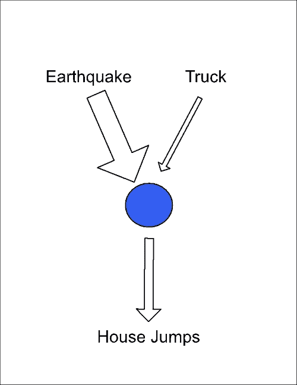

图 5：解释消除导致深度网络中的权重不平衡

如果发生了地震，那么这种地震是房屋移动原因的证据就非常强烈，以至于卡车碰撞的证据被最小化。简单来说，知道发生了地震就意味着我们不再需要任何额外的证据来解释房屋的移动，因此卡车证据的价值变得可以忽略不计。如果我们正在优化如何权衡这两种证据来源的权重（类似于我们可能如何权衡从隐藏神经元到输出单元的输入），那么卡车碰撞证据的权重可以设置为 0，因为地震证据解释了其他变量。我们可以开启这两个输入，但由于这两个事件同时发生的概率足够低，我们的学习过程不会最优地这样做。实际上，这意味着权重的值与隐藏神经元（由每种证据类型表示）是否开启（设置为 1）相关。因此，很难找到一组参数，不会以牺牲另一个权重为代价而饱和。考虑到梯度消失和解释掉的问题，我们如何在由多层组成的深度神经网络中找到最优参数呢？

## 预训练信念网络

消失梯度效应和解释消除效应在某种程度上是由以下事实引起的：如果我们从一个随机值集合开始并执行反向传播，那么在大型网络中找到一组最优权重是困难的。与我们在第五章中看到的逻辑回归目标函数不同，*将数据放在合适的位置 – 分类方法和分析*，深度学习网络中的最优误差不一定总是凸的。因此，通过反向传播进行多次梯度下降并不保证收敛到全局最优值。实际上，我们可以想象误差函数的空间是一个多维景观，其中高度代表误差函数的值，坐标代表不同的权重参数值。反向传播通过沿着这个景观的斜坡上下移动来导航不同的参数值，这些斜坡由每次权重更新所采取的*步骤*表示。如果这个景观由一个位于权重最优值的单峰*顶峰*组成，反向传播可能会快速收敛到这个值。然而，更常见的情况是多维空间中可能有许多*峡谷*和*山谷*（误差函数以不规则的方式随着特定权重集的上升和下降），这使得一阶方法如反向传播难以从局部最小值/最大值中导航出来。例如，误差函数景观中的一个山谷中，误差函数的一阶导数可能会缓慢变化，因为当我们进入或围绕山谷移动时，误差只逐渐增加或减少。通过标准随机初始化权重变量在这个景观中的随机位置开始，我们可能处于一个不太可能导航到最优参数值的位置。因此，一种可能性是在运行反向传播之前将网络中的权重初始化到一个更有利的配置，这样我们就有更大的机会找到最优的权重值。

的确，这是 2006 年发表的研究（Hinton, Geoffrey E., Simon Osindero, and Yee-Whye Teh. *A fast learning algorithm for deep belief nets*. Neural computation 18.7 (2006): 1527-1554）提出的解决方案的精髓。该研究不是直接将多层神经网络拟合到数据集（在这种情况下，由一组手绘数字的图像表示的数字）的响应变量上，而是在随机初始化权重变量之后，建议通过一个预训练阶段来初始化网络权重，这样可以在运行反向传播之前将它们移动到正确的值附近。本研究中使用的网络包含几个 RBM 层，提出的解决方案是依次优化一个 RBM，具体步骤在**图 6**中展示：

1.  首先，使用可见层生成隐藏神经元的一组值，就像在后向传播中一样。

1.  然而，然后过程被反转，最上面的 RBM 中的隐藏单元值用作起点，网络反向运行以重新创建输入数据（如图 3 所示）。

1.  层与层之间的最佳权重是通过计算输入数据与从隐藏层反向运行模型生成的数据样本之间的差异来计算的。

1.  此过程重复多次，直到推断出的权重停止变化。

1.  然后通过连续的层重复此过程，每一层更深的隐藏层形成新的输入。此外，强制执行一个约束，即可见层和第一隐藏层之间的权重以及第一和第二隐藏层之间的权重是矩阵转置：这被称为*绑定权重*。这个条件被强制执行在相邻隐藏层之间每对权重之间：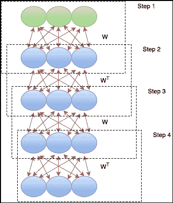

    图 6：深度信念网络的预训练算法

这种预训练程序的实际效果是网络以与输入数据的一般*形状*相似的权重初始化。由于此程序是逐层进行的，因此避免了之前讨论的一些梯度消失问题，因为在每一步中只考虑一组权重。由于第 5 步中描述的权重匹配，解释问题的可能性也最小化。回到我们关于房屋移动的例子，地震和卡车权重的相对强度将在深度信念网络的第一层中表示。在预训练的下一阶段，这些权重将通过矩阵转置进行反转，*取消*高层中的解释效果。这种模式在连续层中重复，系统地消除权重值与连接的隐藏单元被激活的可能性之间的相关性。

一旦完成预训练，就使用与简单网络中描述的类似的后向传播方法，但现在权重更快地收敛到稳定值，因为它们是从一个更优而不是随机的值开始的。

## 使用 dropout 正则化网络

即使使用之前描述的预训练方法，优化深度网络中的大量参数也可能非常耗时。我们可能还会遇到与具有大量系数的回归模型相同的问题，即大量参数导致网络过度拟合训练数据，并且无法很好地泛化到之前未见过的数据。

在回归的情况下，我们使用了如岭回归、Lasso 和弹性网络等方法来正则化我们的模型，而对于深度网络，我们可以使用称为 Dropout 的方法来减少过拟合（Srivastava, Nitish, 等人 *Dropout：一种防止神经网络过拟合的简单方法*。机器学习研究杂志 15.1 (2014): 1929-1958）。这个想法相对简单：在调整权重的每个阶段，我们随机从网络中移除一些神经元及其连接，并且只更新剩余的权重。随着我们重复这个过程，我们实际上是在许多可能的网络结构上取平均值。这是因为，在每个阶段有 50%的概率从网络中丢弃任何给定的神经元，我们训练的每个阶段实际上是从 2^n 个可能网络结构中采样。因此，模型被正则化，因为我们只在每个阶段拟合参数的子样本，并且类似于我们在第五章中检查的随机森林，*数据定位 – 分类方法和分析*，我们在更多随机构建的网络上取平均值。尽管 Dropout 可以减少过拟合，但它可能会使训练过程更长，因为我们需要平均更多的网络以获得准确的预测。

## 卷积网络和整流单元

尽管预训练过程提供了一种初始化网络权重的途径，但随着我们添加层，整体模型复杂性增加。对于更大的输入数据（例如，大图像），这可能导致每个额外层增加的权重数量增加，因此训练周期可能会更长。因此，对于某些应用，我们可能通过以下方式智能地简化网络结构来加速训练过程：（1）不在每一层的每个神经元之间建立连接；（2）改变神经元使用的函数。

这些修改在一种称为卷积网络（LeCun, Yann, 等人 *基于梯度的学习应用于文档识别*。IEEE 汇刊 86.11 (1998): 2278-2324；Krizhevsky, Alex, Ilya Sutskever 和 Geoffrey E. Hinton *使用深度卷积神经网络进行 Imagenet 分类*。神经信息处理系统进展。2012）的深度网络中很常见。卷积这个名字来源于图像分析，其中像我们在第六章中使用的开运算和膨胀运算这样的卷积算子被应用于图像的重叠区域。实际上，卷积网络通常应用于涉及图像识别的任务。虽然可能的配置数量很大，但一个卷积网络的潜在结构可能如下（见图 7）：

+   **可见的输入层，宽度为 w，高度为 h**：对于彩色图像，这个输入可以是三维的，每个红色、绿色和蓝色通道都有一个深度层。

+   **卷积层**：在这里，单个神经元可以通过所有三个颜色通道（*nxnx3*）连接到一个正方形区域。这些 nxnx3 单元中的每一个都有一个权重连接到卷积层中的一个神经元。此外，我们可以在卷积层中连接到每个这些*nxnx3*单元的多个神经元，但每个神经元都有不同的权重集。

+   **整流层**：使用本章后面讨论的**整流线性单元**（**ReLU**），卷积层中的每个神经元输出都被阈值化，以产生另一组相同大小的神经元。

+   **下采样层**：这种类型的层在上一层的子区域上平均，以产生一个宽度更小、高度更小的层，同时保持深度不变。

+   **全连接层**：在这个层中，下采样层中的每个单元都连接到一个输出向量（例如，一个表示 10 个不同类别标签的 10 单元向量）。

这种架构利用了数据结构（检查图像中的局部模式），并且训练速度更快，因为我们只在每层的神经元之间进行选择性连接，导致需要优化的权重更少。这种结构可以更快地训练的第二个原因是由于整流和池化层中使用的激活函数。池化函数的一个常见选择是所有输入的最大值，也称为**整流线性单元**（**ReLU**）（Nair, Vinod, and Geoffrey E. Hinton. *Rectified linear units improve restricted boltzmann machines.* Proceedings of the 27th International Conference on Machine Learning (ICML-10). 2010）。它是这样的：

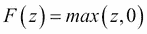

这里，`z`是给定神经元的输入。与之前描述的对数函数不同，ReLU 不受范围`[0,1]`的限制，这意味着网络中跟随它的神经元的值可以比对数函数更快地变化。此外，ReLU 的梯度由以下给出：

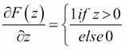

这意味着梯度不太可能消失（除非神经元输入非常低，以至于它总是关闭）或爆炸，因为最大变化是`1`。在前一种情况下，为了防止 ReLU 永久关闭，函数可以被修改为漏斗状：

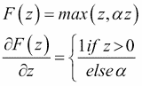

这里，`α`是一个小的值，例如`0.01`，防止神经元被设置为 0。


图 7：卷积神经网络架构。为了清晰起见，卷积层的连接表示为高亮区域，而不是所有 wxhxd 神经元，并且只显示了网络中汇聚到池化层神经元的子集。

### 小贴士

**旁注：其他激活函数**

除了之前讨论的线性、Sigmoid 和 ReLU 函数外，在构建深度网络时还会使用其他激活函数。其中一个是双曲正切函数，也称为`tanh`函数，其表达式为：

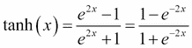

该函数的输出范围在`[–1,1]`之间，与 Sigmoid 或 ReLU 的输出范围在`[0,1]`之间不同，一些证据表明，这可以通过允许神经元的平均输出为零来加速网络的训练，从而减少偏差（LeCun, Yann, Ido Kanter, and Sara A. Solla. "Second order properties of error surfaces: Learning time and generalization." Advances in neural information processing systems 3 (1991): 918-924.). 类似地，我们可以想象在谱聚类和 SVMs 的背景下使用高斯函数，如我们在第三章、*在噪声中寻找模式 – 聚类和无监督学习*和第五章、*将数据放在合适的位置 – 分类方法和分析*中看到的核函数。在第五章、*将数据放在合适的位置 – 分类方法和分析*中用于多项式回归的`softmax`函数也是一个候选者；潜在函数数量的增加增加了深度模型的灵活性，使我们能够根据具体问题调整特定的行为。

## 使用自动编码器网络压缩数据

尽管本章的大部分讨论涉及使用深度学习进行分类任务，但这些模型也可以用于降维，其方式与我们在第六章中讨论的矩阵分解方法相当，即 *文字与像素 – 处理非结构化数据*。在这种应用中，也称为 *自动编码器* 网络 (Hinton, Geoffrey E., 和 Ruslan R. Salakhutdinov. *使用神经网络降低数据维度*. 科学 313.5786 (2006): 504-507)，目标不是拟合响应（如二进制标签），而是重建数据本身。因此，可见层和输出层总是相同的大小（图 8），而隐藏层通常较小，因此形成数据的低维表示，可用于重建输入。因此，类似于 PCA 或 NMF，自动编码器发现输入的紧凑版本，可以近似原始数据（存在一些误差）。如果隐藏层的大小不小于可见层和输出层，网络可能只是优化隐藏层以与输入相同；这将允许网络完美地重建输入，但会牺牲任何特征提取或降维。

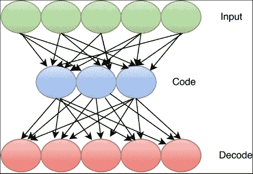

图 8：自动编码器网络架构

## 优化学习率

在我们上面讨论的例子中，每个阶段的参数学习率始终是一个固定的值 α。直观上，对于某些参数我们可能希望更积极地调整其值，而对于其他参数则希望调整得较少。为此，已经提出了许多优化方法。例如，自适应梯度（Adaptive Gradient，AdaGrad）(Duchi, John, Elad Hazan, 和 Yoram Singer. *自适应子梯度方法用于在线学习和随机优化*. 机器学习研究杂志 12.Jul (2011): 2121-2159.) 使用基于给定参数过去梯度历史的每个参数的学习率：

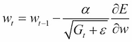

其中 *Gt* 代表特定参数所有梯度的平方和，`gt` 是当前步骤的梯度，ε 是平滑参数。因此，每个阶段的学习率是全球值 α，乘以当前梯度表示的历史变化的分数。如果当前梯度与历史更新相比较高，那么我们将改变参数。否则，我们应该改变得较少。随着时间的推移，大多数学习率将趋向于零，加速收敛。

这个想法的自然扩展被用于 AdaDelta（Zeiler, Matthew D. *ADADELTA: an adaptive learning rate method*. arXiv preprint arXiv:1212.5701 (2012)），在这里，我们不是使用梯度更新历史记录的全集 G，而是在每一步，用当前梯度和历史平均梯度的平均值来替换这个值：

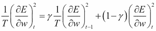

Adagrad 的表达式在分母中使用上述公式代替 *Gt*。与 Adagrad 一样，这倾向于减少相对于其历史记录变化不大的参数的学习率。

我们将在以下部分检查的 `TensorFlow` 库也提供了自适应矩估计（ADAM）方法来调整学习率（Kingma, Diederik, and Jimmy Ba. *Adam: A method for stochastic optimization*. arXiv preprint arXiv:1412.6980 (2014)）。在这个方法中，与 AdaDelta 一样，我们保持平方梯度和梯度的平均值。更新规则如下：

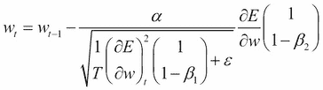

在这里，与 `AdaDelta` 中的加权平均值一样，通过除以衰减参数（`1-β`）进行归一化。已经提出了许多其他算法，但我们所描述的方法样本应该能给你一个关于如何自适应调整学习率以加速深度网络训练的想法。

### **提示**

**旁白：替代网络架构**

除了我们讨论过的卷积、前馈和深度信念网络之外，其他网络架构也被调整以解决特定问题。**循环神经网络**（**RNNs**）在层之间有稀疏的双向连接，允许单元通过这些循环表现出增强行为（见图 9）。由于网络从这个循环中具有记忆，它可以用于处理语音识别等任务的数据（Graves, Alex, et al. "A novel connectionist system for unconstrained handwriting recognition." IEEE transactions on pattern analysis and machine intelligence 31.5 (2009): 855-868），在这些任务中，一系列不确定长度的输入被处理，并且网络可以在每个点根据当前和之前的输入产生一个预测标签。同样，**长短期记忆网络**（**LSTM**）（Hochreiter, Sepp, and Jürgen Schmidhuber. Long short-term memory. Neural computation 9.8 (1997): 1735-1780）具有循环元素，允许单元记住先前输入的数据。与 RNNs 相比，它们还具有可以清除循环激活单元中值的辅助单元，允许网络在特定时间窗口内保留输入信息（见**图 9**，循环代表这个`遗忘`功能，它可能由输入激活）。


图 9：循环神经网络（RNN）和长短期记忆（LSTM）架构。

现在我们已经看到了如何通过多种优化构建、训练和调整深度学习网络，让我们看看一个图像识别的实际例子。

# TensorFlow 库和数字识别

对于本章的练习，我们将使用由谷歌开源的`TensorFlow`库（可在[`www.tensorflow.org/`](https://www.tensorflow.org/)找到）。安装说明因操作系统而异。此外，对于 Linux 系统，你可以利用计算机上的 CPU 和**图形处理单元**（**GPU**）来运行深度学习模型。由于训练中的许多步骤（如更新权重值网格所需的乘法）涉及矩阵运算，因此它们可以通过使用 GPU 轻松并行化（从而加速）。然而，`TensorFlow`库也可以在 CPU 上运行，所以如果你没有访问 Nvidia GPU 卡也不要担心。

## MNIST 数据

在这个练习中，我们将检查的是来自**混合国家标准与技术研究院**（**MNIST**）数据库（LeCun, Yann, Corinna Cortes, and Christopher JC Burges. *The MNIST database of handwritten digits.* (1998)）的一组手绘数字 0 到 9 的图像。类似于用于介绍基本编程技术的 Hello World!程序，或者用于演示分布式计算框架的单词计数示例，MNIST 数据是用于演示神经网络库功能的常见示例。与这些数据相关的预测任务是给图像分配一个标签（0 到 9 的数字），只给出输入像素。

`TensorFlow`库提供了一个方便的库函数，可以使用以下命令加载数据：

```py
>>> from tensorflow.examples.tutorials.mnist import input_data
>>> mnist = input_data.read_data_sets('MNIST_data', one_hot=True)

```

注意，除了指定我们希望加载 MNIST 数据外，我们还指明目标变量（图像表示的数字）应以二进制向量编码（例如，数字 3 通过在这个向量的第四个元素中放置一个 1 来表示，因为第一个元素编码数字 0）。一旦我们加载了数据，我们就可以开始检查图像本身。我们可以看到，数据已经方便地被分为训练集和测试集，使用 4:1 的分割，通过检查训练集和测试集的长度使用以下命令：

```py
>>> len(mnist.train.images)
>>> len(mnist.test.images)

```

这些图像中的每一个都是一个 *28*28* 像素的图像。在数据中，这些图像被存储为一个长度为 784 的一维向量，但一旦我们使用命令将数组重塑为其原始维度，我们就可以使用上一章中的`skimage`库来可视化这些图像。

```py
>>> from skimage import io
>> io.imshow(np.reshape(mnist.train.images[0],(28,28))) 

```

显示集合中的第一张图像：

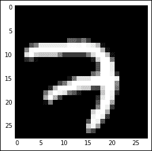

这看起来像数字 7：要检查分配给此图像的标签，我们可以使用以下命令检查 train 对象的 labels 元素：

```py
>>> mnist.train.labels[0]

```

这给出了

`array([ 0., 0., 0., 0., 0., 0., 0., 1., 0., 0.])`

标签是一个 10 个元素的向量，从左到右代表数字 0 到 9，与图像标签关联的位置为 1。实际上，分配给此图像的标签是 7。请注意，标签数组与我们所检查的神经网络算法的最终层具有相同的形状，这使得我们能够方便地将标签直接与计算出的预测进行比较。

现在我们已经检查了数据，让我们使用`TensorFlow`库的其他工具来开发一个可以预测图像标签的神经网络。

## 构建网络

如您现在可能已经欣赏到的，深度神经网络的架构可以极其复杂。因此，如果我们为网络的每一层定义变量，我们最终会得到一大块代码，每次我们改变网络结构时都需要对其进行修改。因为在实际应用中，我们可能想要尝试许多不同深度的变体、层大小和连接性，所以我们在这个练习中展示了如何使这种结构通用和可重用。关键成分是生成层的函数，由这些生成函数指定的所需层列表，以及一个外部过程，它将生成的层连接起来：

```py
>>> def weight_variable(dimensions,stddev):
 …     return tf.Variable(tf.truncated_normal(dimensions, stddev=stddev))

>>> def bias_variable(dimensions,constant):
…      return tf.Variable(tf.constant(constant, shape=dimensions))

>>> def two_dimensional_convolutional_layer(x, W, strides, padding):
 …     return tf.nn.conv2d(x, W, strides=strides, padding=padding)

>>> def max_pooling(x,strides,ksize,padding):
…     return tf.nn.max_pool(x, ksize=ksize,strides=strides, padding=padding)

>>> def generate_network(weight_variables,\
 bias_variables,\
 relu_layers,\
 pooling_layers,\
 fully_connected_layers,\
 inputs,\
 conv_strides,\
 pool_stries,\
 ksize,\
 output_channels,\
 conv_field_sizes,\
 conv_field_depths,\
 sd_weights\
 ,bias_mean,\
 padding,\
 conv_layers,\
 fc_layers,\
 fc_shape,\
 keep_prob,\
 class_num,\
 dropouts):

 # add convolutional layers
 >>> for k in range(conv_layers):
 …      weight_variables.append(weight_variable([conv_field_sizes[k], conv_field_sizes[k], conv_field_depths[k],output_channels[k]],sd_weights))
 bias_variables.append(bias_variable([output_channels[k]],bias_mean))
 relu_layers.append(tf.nn.relu(two_dimensional_convolutional_layer(inputs[k],weight_variables[k],\
 conv_strides,padding) + bias_variables[k]))
 pooling_layers.append(max_pooling(relu_layers[k],pool_strides,ksize,padding))
 inputs.append(pooling_layers[k])

 # finally, add fully connected layers at end with dropout
 >>> for r in range(fc_layers):
 weight_variables.append(weight_variable(fc_shape,sd_weights))
 bias_variables.append(bias_variable([fc_shape[1]],bias_mean))
 pooling_layers.append(tf.reshape(pooling_layers[-1],[-1,fc_shape[0]]))
 fully_connected_layers.append(tf.nn.relu(tf.matmul(pooling_layers[-1], weight_variables[-1]) + bias_variables[-1]))
 dropouts.append(tf.nn.dropout(fully_connected_layers[-1], keep_prob))

 # output layer
 weight_variables.append(weight_variable([fc_shape[1],class_num],sd_weights))
 bias_variables.append(bias_variable([class_num],bias_mean))
 return tf.nn.softmax(tf.matmul(dropouts[-1],weight_variables[-1])+bias_variables[-1])

```

因此，这种格式允许我们以易于重新配置和重用的方式模板化网络的构建。

此函数构建了一系列`卷积`/`最大池化`层，随后是一或多个全连接层，其输出用于生成预测。最后，我们只需将`softmax`函数的最终层预测作为输出返回。因此，我们可以通过设置一些参数来配置网络：

```py
 >>> X = tf.placeholder("float", shape=[None, 784])
>>> observed = tf.placeholder("float", shape=[None, 10])
>>> images = tf.reshape(X, [-1,28,28,1])

# shape variables
>>> sd_weights = 0.1
>>> bias_mean = 0.1
>>> padding = 'SAME'
>>> conv_strides = [1,1,1,1]
>>> pool_strides = [1,2,2,1]
>>> ksize = [1,2,2,1]
>>> output_channels = [32,64]
>>> conv_field_sizes = [5,5]
>>> conv_field_depths = [1,32]
>>>fc_shape = [7*7*64,1024]
>>> keep_prob = tf.placeholder("float")
>>> class_num = 10
>>> conv_layers = 2
>>> fc_layers = 1

# layers variables
>>> weight_variables = []
>>> bias_variables = []
>>> relu_layers = []
>>> pooling_layers = []
>>> inputs = [images]
>>> fully_connected_layers = []
>>> dropouts = []

>>> prediction = generate_network(weight_variables,\
 bias_variables,\
 relu_layers,\
 pooling_layers,\
 fully_connected_layers,\
 inputs,\
 conv_strides,\
 pool_strides,\
 ksize,\
 output_channels,\
 conv_field_sizes,\
 conv_field_depths,\
 sd_weights\
 ,bias_mean,\
 padding,\
 conv_layers,\
 fc_layers,\
 fc_shape,\
 keep_prob,\
 class_num,\
 dropouts)

```

注意，输入（`X`）、真实标签（观察到的）以及层中丢弃概率（`keep_prob`）都是占位符，它们不包含实际值，但将在网络训练过程中以及我们向算法提交数据批次时被填充。

现在我们需要做的只是初始化一个会话，并开始使用以下代码提交数据批次：

```py
>>> my_session = tf.InteractiveSession()
>>> squared_error = tf.reduce_sum(tf.pow(tf.reduce_sum(tf.sub(observed,prediction)),[2]))
>>> train_step = tf.train.GradientDescentOptimizer(0.01).minimize(squared_error)
>>> correct_prediction = tf.equal(tf.argmax(prediction,1), tf.argmax(observed,1))
>>> accuracy = tf.reduce_mean(tf.cast(correct_prediction, "float"))
>>> my_session.run(tf.initialize_all_variables())

>>>for i in range(20000):
…    batch = mnist.train.next_batch(50)
 …   if i%1000 == 0:
…      train_accuracy = accuracy.eval(feed_dict={X: batch[0], observed: batch[1], keep_prob: 1.0})
 …     print("step %d, training accuracy %g"%(i, train_accuracy))
…        train_step.run(feed_dict={X: batch[0], observed: batch[1], keep_prob: 0.5})
…        print("test accuracy %g"%accuracy.eval(feed_dict={X: mnist.test.images, observed: mnist.test.labels, keep_prob: 1.0}))

```

我们可以在算法训练过程中观察其进度，每 1000 次迭代的准确度都会打印到控制台。

# 摘要

在本章中，我们介绍了深度神经网络作为生成复杂数据类型模型的途径，其中特征难以工程化。我们探讨了神经网络通过反向传播进行训练的方式，以及为什么额外的层使得这种优化变得难以处理。我们讨论了这个问题的一些解决方案，并展示了如何使用`TensorFlow`库构建一个用于手绘数字的图像分类器。

现在你已经覆盖了广泛的预测模型，我们将转向最后两章，探讨生成分析管道的最后两个任务：将我们训练的模型转化为可重复的、自动化的流程，以及可视化结果以获取持续洞察和监控。
