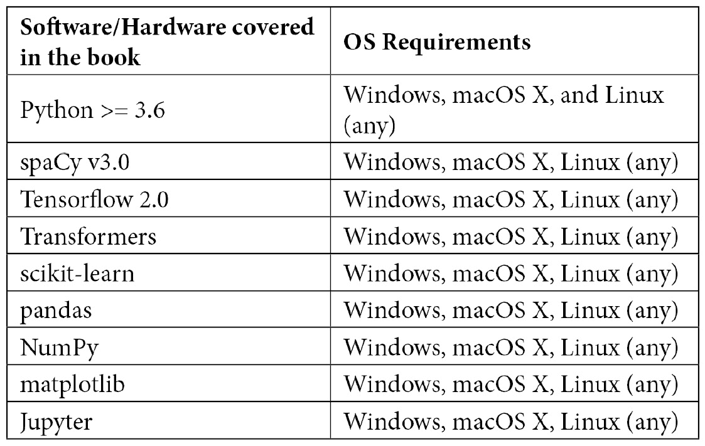

# 前言

spaCy 是一个工业级、高效的 NLP Python 库。它提供了各种预训练模型和即用功能。*精通 spaCy* 为你提供了 spaCy 功能和真实世界应用的端到端覆盖。

你将首先安装 spaCy 并下载模型，然后逐步学习 spaCy 的功能和原型化真实世界的 NLP 应用。接下来，你将熟悉使用 spaCy 流行的可视化工具 displaCy 进行可视化。本书还为你提供了模式匹配的实用示例，帮助你进入语义世界的词向量领域。统计信息提取方法也进行了详细解释。随后，你将涵盖一个交互式商业案例研究，展示如何结合 spaCy 功能创建真实世界的 NLP 流程。你将实现诸如情感分析、意图识别和上下文解析等机器学习模型。本书还进一步关注使用 TensorFlow 的 Keras API 与 spaCy 一起进行分类，包括意图分类和情感分析，以及它们在流行数据集上的应用和分类结果的解释。

在本书结束时，你将能够自信地使用 spaCy，包括其语言功能、词向量和分类器，来创建自己的 NLP 应用。

# 本书面向对象

本书面向希望精通 NLP 的数据科学家和机器学习者，以及希望掌握 spaCy 并用它构建应用的 NLP 开发者。希望亲自动手使用 Python 和 spaCy 的语言和语音专业人士，以及希望快速使用 spaCy 原型化应用的软件开发者，也会发现本书很有帮助。为了充分利用本书，需要具备 Python 编程语言的入门级知识。对语言学术语的入门级理解，例如解析、词性标注和语义相似性，也将很有用。

# 本书涵盖内容

*第一章*，*spaCy 入门*，开始你的 spaCy 之旅。本章为你提供了 **Python** 中 **NLP** 的概述。在本章中，你将安装 spaCy 库和 spaCy 语言模型，并探索 displaCy，spaCy 的可视化工具。总体而言，本章将帮助你开始安装和理解 spaCy 库。

*第二章*，*使用 spaCy 的核心操作*，教你 spaCy 的核心操作，例如创建语言流程、分词文本以及将文本分解成句子以及 `Container` 类。本章详细介绍了 `Container` 类 token、`Doc` 和 `Span`。

*第三章*, *语言特征*，深入挖掘 spaCy 的全部功能。本章探讨了语言特征，包括 spaCy 最常用的功能，如**词性标注器**、**依存句法分析器**、**命名实体识别器**和**合并/拆分**。

*第四章*, *基于规则的匹配*，教您如何通过匹配模式和短语从文本中提取信息。您将使用形态学特征、词性标注、正则表达式和其他 spaCy 功能来形成模式对象，以供 spaCy 匹配器对象使用。

*第五章*, *与词向量及语义相似性工作*，教您关于词向量及其相关语义相似性方法。本章包括词向量计算，如距离计算、类比计算和可视化。

*第六章*, *将一切整合：使用 spaCy 进行语义解析*，是一个完全实战的章节。本章教您如何使用 spaCy 设计一个针对**航空公司旅行信息系统**（**ATIS**）的票务预订系统 NLU，这是一个著名的飞机票务预订系统数据集。

*第七章*, *自定义 spaCy 模型*，教您如何训练、存储和使用自定义的统计管道组件。您将学习如何使用自己的数据更新现有的统计管道组件，以及如何从头开始使用自己的数据和标签创建统计管道组件。

*第八章*, *使用 spaCy 进行文本分类*，教您如何进行 NLP 中一个非常基本且流行的任务：文本分类。本章探讨了使用 spaCy 的`Textcategorizer`组件以及使用 TensorFlow 和 Keras 进行文本分类。

*第九章*, *spaCy 与 Transformers*，探讨了 NLP 中最热门的最新话题——transformers，以及如何与 TensorFlow 和 spaCy 一起使用。您将学习如何使用 BERT 和 TensorFlow，以及 spaCy v3.0 基于 transformer 的预训练管道。

*第十章*, *将一切整合：使用 spaCy 设计您的聊天机器人*，带您进入对话式人工智能的世界。您将在一个真实的餐厅预订数据集上执行**实体提取**、**意图识别**和**上下文处理**。

# 为了充分利用这本书

首先，您需要在您的系统上安装并运行 Python 3。代码示例使用 spaCy v3.0 进行测试，然而，由于向后兼容性，大多数代码与 spaCy v2.3 兼容。对于 scikit-learn、pandas、NumPy 和 matplotlib 等辅助库，可以使用 pip 上可用的最新版本。我们从*第七章**，自定义 spaCy 模型*开始使用 TensorFlow、transformers 和辅助库，因此您可以在到达*第七章*时安装这些库。



*我们不时使用 Jupyter 笔记本。您可以在书的 GitHub 页面上查看笔记本。如果您想使用 Jupyter 笔记本，那很好；您可以通过 pip 安装 Jupyter。如果您不想，您仍然可以将代码复制粘贴到 Python shell 中并使代码工作。*

**如果您使用的是本书的数字版，我们建议您亲自输入代码或通过 GitHub 仓库（下一节中提供链接）访问代码。这样做将有助于您避免与代码复制和粘贴相关的任何潜在错误。**

# 下载示例代码文件

您可以从 GitHub 下载本书的示例代码文件[`github.com/PacktPublishing/Mastering-spaCy`](https://github.com/PacktPublishing/Mastering-spaCy)。如果代码有更新，它将在现有的 GitHub 仓库中更新。

我们还有其他来自我们丰富的书籍和视频目录的代码包，可在[`github.com/PacktPublishing/`](https://github.com/PacktPublishing/)找到。查看它们吧！

# 下载彩色图像

我们还提供了一份包含本书中使用的截图/图表彩色图像的 PDF 文件。您可以从这里下载：[`static.packt-cdn.com/downloads/9781800563353_ColorImages.pdf`](https://static.packt-cdn.com/downloads/9781800563353_ColorImages.pdf).

# 使用的约定

本书使用了多种文本约定。

`文本中的代码`: 表示文本中的代码单词、数据库表名、文件夹名、文件名、文件扩展名、路径名、虚拟 URL、用户输入和 Twitter 昵称。以下是一个示例：“最后，`validation_split`参数用于评估实验。”

代码块设置如下：

```py
import spacy
nlp = spacy.load("en_subwords_wiki_lg")
```

任何命令行输入或输出都按以下方式编写：

```py
wget  https://github.com/PacktPublishing/Mastering-spaCy/blob/main/Chapter08/data/Reviews.zip
```

**粗体**: 表示新术语、重要单词或屏幕上显示的单词。例如，菜单或对话框中的单词在文本中显示如下。以下是一个示例：“以下图表说明了**狗**和**猫**之间的距离，以及**狗**、**犬种猎犬**和**猫**之间的距离：”

小贴士或重要提示

显示如下。

# 联系我们

我们欢迎读者的反馈。

`customercare@packtpub.com`.

**勘误**: 尽管我们已经尽最大努力确保内容的准确性，但错误仍然可能发生。如果您在这本书中发现了错误，我们将不胜感激，如果您能向我们报告这一情况。请访问 [www.packtpub.com/support/errata](http://www.packtpub.com/support/errata)，选择您的书籍，点击勘误提交表单链接，并输入详细信息。

`copyright@packt.com` 并附有链接到相关材料。

**如果您有兴趣成为作者**: 如果您在某个领域有专业知识，并且您有兴趣撰写或为书籍做出贡献，请访问 [authors.packtpub.com](http://authors.packtpub.com)。

# 评论

请留下评论。一旦您阅读并使用了这本书，为何不在您购买它的网站上留下评论呢？潜在读者可以查看并使用您的客观意见来做出购买决定，我们 Packt 可以了解您对我们产品的看法，我们的作者也可以看到他们对书籍的反馈。谢谢！

如需了解更多关于 Packt 的信息，请访问 [packt.com](http://packt.com)。
