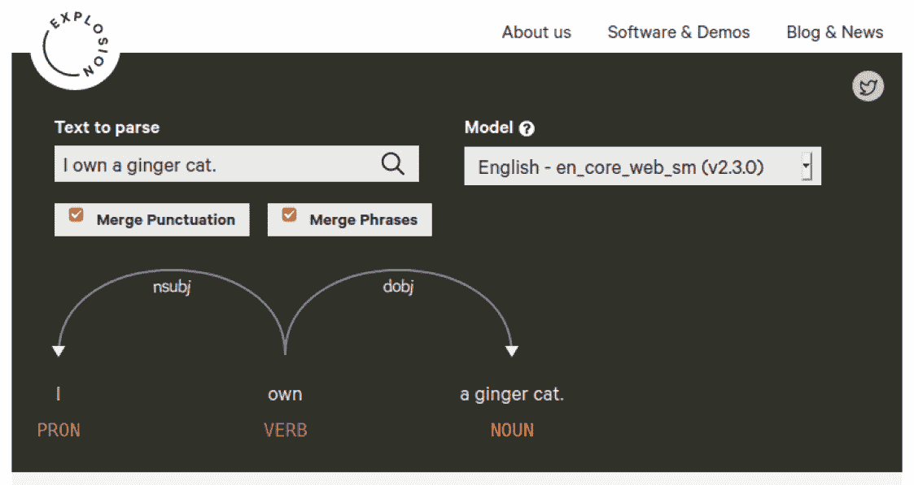

# 第一章：spaCy 入门

在本章中，我们将全面介绍使用 Python 和 spaCy 开发的自然语言处理（NLP）应用程序开发。首先，我们将看到 NLP 开发如何与 Python 密不可分，以及 spaCy 作为 Python 库提供的内容概述。

经过热身之后，您将快速开始使用 spaCy，通过下载库和加载模型。然后，您将通过可视化 spaCy 的几个功能来探索 spaCy 的流行可视化器 **displaCy**。

到本章结束时，您将了解使用 spaCy 可以实现什么，以及如何使用 spaCy 代码规划您的旅程。您也将对您的开发环境感到满意，因为您已经在接下来的章节中安装了所有必要的 NLP 任务包。

在本章中，我们将涵盖以下主要主题：

+   spaCy 概述

+   安装 spaCy

+   安装 spaCy 的统计模型

+   使用 displaCy 进行可视化

# 技术要求

本章代码可以在本书的 GitHub 仓库中找到：[`github.com/PacktPublishing/Mastering-spaCy/tree/main/Chapter01`](https://github.com/PacktPublishing/Mastering-spaCy/tree/main/Chapter01)

# spaCy 概述

在开始学习 spaCy 代码之前，我们将首先概述 NLP 在现实生活中的应用、使用 Python 的 NLP 以及使用 spaCy 的 NLP。在本节中，我们将了解为什么使用 Python 和 spaCy 开发 NLP 应用程序的原因。我们将首先看到 Python 如何与文本处理紧密结合，然后我们将了解 spaCy 在 Python NLP 库中的位置。让我们从 Python 和 NLP 之间的紧密关系开始我们的探索之旅。

## NLP 的兴起

在过去的几年里，人工智能的许多分支都引起了很大的关注，包括 NLP、计算机视觉和预测分析等。但 NLP 究竟是什么？机器或代码如何解决人类语言？

NLP 是人工智能的一个子领域，它分析文本、语音和其他形式的人类生成语言数据。人类语言很复杂——即使是简短的段落也包含对先前单词的引用、指向现实世界对象的指针、文化引用以及作者或说话者的个人经历。*图 1.1* 展示了这样一个示例句子，它包括对相对日期（*最近*）的引用，只有了解说话者的人才能解决的短语（关于说话者父母居住的城市），以及拥有关于世界的普遍知识的人（城市是人类共同生活的地方）：


图 1.1 – 包含许多认知和文化方面的人类语言示例

那么，我们如何处理这样一个复杂结构呢？我们也有我们的武器；我们用统计模型来模拟自然语言，并处理语言特征，将文本转换为良好的结构化表示。这本书为你提供了所有必要的背景和工具，让你能够从文本中提取意义。到这本书的结尾，你将拥有使用一个伟大的工具——spaCy 库来处理文本的统计和语言知识。

尽管自然语言处理最近才流行起来，但通过许多现实世界的应用，包括搜索引擎、翻译服务和推荐引擎，处理人类语言已经存在于我们的生活中。

搜索引擎如 Google 搜索、Yahoo 搜索和 Microsoft Bing 是我们日常生活的重要组成部分。我们寻找家庭作业帮助、烹饪食谱、名人信息、我们最喜欢的电视剧的最新一集；我们日常生活中使用的各种信息。甚至在英语中（也在许多其他语言中）有一个动词 *to google*，意思是 *在 Google 搜索引擎上查找一些信息*。

搜索引擎使用高级 NLP 技术，包括将查询映射到语义空间，其中相似的查询由相似的向量表示。一个快速技巧叫做 **自动完成**，当我们输入查询的前几个字母时，查询建议就会出现在搜索栏上。自动完成看起来很复杂，但的确算法是搜索树遍历和字符级距离计算的组合。一个过去的查询由其字符序列表示，其中每个字符对应于搜索树中的一个节点。字符之间的 **弧** 根据过去查询的流行度分配权重。

然后，当一个新的查询到来时，我们会通过遍历树来比较当前查询字符串和过去的查询。一个基本的**计算机科学**（**CS**）数据结构，树，被用来表示查询列表，谁能想到呢？*图 1.2* 展示了在字符树上的遍历：


图 1.2 – 自动完成示例

这是一个简化的解释；真正的算法通常融合了多种技术。如果你想了解更多关于这个主题的信息，你可以阅读关于数据结构的优秀文章：[`blog.notdot.net/2010/07/Damn-Cool-Algorithms-Levenshtein-Automata`](http://blog.notdot.net/2010/07/Damn-Cool-Algorithms-Levenshtein-Automata) 和 [`blog.notdot.net/2007/4/Damn-Cool-Algorithms-Part-1-BK-Trees`](http://blog.notdot.net/2007/4/Damn-Cool-Algorithms-Part-1-BK-Trees)。

继续讨论搜索引擎，搜索引擎也知道如何将非结构化数据转换为结构化和关联数据。当我们输入 `Diana Spencer` 到搜索栏中，就会出现以下内容：


图 1.3 – 搜索查询 "Diana Spencer" 的结果

搜索引擎是如何将“黛安娜·斯宾塞”这个名字与她的著名名字*戴安娜公主*联系起来的？这被称为**实体链接**。我们链接提及相同真实世界实体的实体。实体链接算法关注表示语义关系和知识。这个 NLP 领域被称为**语义网**。你可以在[`www.cambridgesemantics.com/blog/semantic-university/intro-semantic-web/`](https://www.cambridgesemantics.com/blog/semantic-university/intro-semantic-web/)了解更多信息。我在职业生涯初期在一家搜索引擎公司担任知识工程师，并真正享受这份工作。这是 NLP 中的一个非常吸引人的主题。

你可以开发的内容实际上没有限制：搜索引擎算法、聊天机器人、语音识别应用和用户情感识别应用。NLP 问题具有挑战性但非常吸引人。本书的使命是为你提供一个包含所有必要工具的工具箱。NLP 开发的第一步是明智地选择我们将使用的编程语言。在下一节中，我们将解释为什么 Python 是首选武器。让我们继续到下一节，看看 NLP 和 Python 之间的字符串联系。

## 使用 Python 进行 NLP

正如我们之前提到的，自然语言处理（NLP）是人工智能的一个子领域，它分析文本、语音和其他形式的人类生成语言数据。作为一名行业专业人士，我处理文本数据的第一选择是 Python。一般来说，使用 Python 有很多好处：

+   它易于阅读，看起来非常类似于伪代码。

+   它易于编写和测试代码。

+   它具有高度的抽象级别。

由于以下原因，Python 是开发 NLP 系统的绝佳选择：

+   **简单性**：Python 易于学习。你可以专注于 NLP 而不是编程语言的细节。

+   **效率**：它允许更容易地开发快速 NLP 应用原型。

+   **流行度**：Python 是最受欢迎的语言之一。它拥有庞大的社区支持，使用 pip 安装新库非常容易。

+   **AI 生态系统存在**：Python 中有大量的开源 NLP 库。许多机器学习（ML）库，如 PyTorch、TensorFlow 和 Apache Spark，也提供了 Python API。

+   `sentenc.split()`，在其他语言中可能相当痛苦，例如 C++，你必须处理流对象来完成这个任务。

当我们将所有前面的点结合起来时，以下图像就会出现——Python 与字符串处理、AI 生态系统和 ML 库相交，为我们提供最佳的 NLP 开发体验：


图 1.4 – 使用 Python 的 NLP 概述

我们将在这本书中使用 Python 3.5+。尚未安装 Python 的用户可以按照[`realpython.com/installing-python/`](https://realpython.com/installing-python/)上的说明进行操作。我们建议下载并使用 Python 3 的最新版本。

在 Python 3.x 中，默认编码是**Unicode**，这意味着我们可以使用 Unicode 文本而无需过多担心编码。我们不会在这里详细介绍编码的细节，但你可以将 Unicode 视为 ASCII 的扩展集，包括更多字符，如德语字母的重音符号和法语字母的带音符号。这样我们就可以处理德语、法语以及许多其他非英语语言。

## 复习一些有用的字符串操作

在 Python 中，文本由`str`类表示。字符串是不可变的字符序列。创建字符串对象很简单——我们用引号包围文本：

```py
 word = 'Hello World'
```

现在的`word`变量包含字符串`Hello World`。正如我们提到的，字符串是字符序列，因此我们可以请求序列的第一个元素：

```py
 print (word [0])
H
```

总是记得在`print`中使用括号，因为我们正在使用 Python 3.x 进行编码。我们可以以类似的方式访问其他索引，只要索引没有超出范围：

```py
 word [4]
'o'
```

字符串长度如何？我们可以使用`len`方法，就像使用`list`和其他序列类型一样：

```py
 len(word)
11
```

我们还可以使用序列方法遍历字符串的字符：

```py
 for ch in word:
               print(ch)
H
e
l
l
o
W
o
r
l
d
```

小贴士

请注意本书中的缩进。在 Python 中，缩进是我们确定控制块和函数定义的一般方式，我们将在本书中应用此约定。

现在我们来回顾一些更复杂的字符串方法，比如计数字符、查找子字符串和更改字母大小写。

`count`方法计算字符串中字符的出现次数，所以这里的输出是`3`：

```py
 word.count('l')
3
```

通常，您需要找到字符的索引以进行一系列的子字符串操作，如切割和切片字符串：

```py
 word.index(e)
1
```

类似地，我们可以使用`find`方法在字符串中搜索子字符串：

```py
 word.find('World')
6
```

如果子字符串不在字符串中，`find`返回`-1`：

```py
 word.find('Bonjour')
-1
```

查找子字符串的最后出现也很简单：

```py
 word.rfind('l')
9
```

我们可以通过`upper`和`lower`方法更改字母的大小写：

```py
 word.upper()
'HELLO WORLD'
```

`upper`方法将所有字符转换为大写。同样，`lower`方法将所有字符转换为小写：

```py
 word.lower()
'hello world'
```

`capitalize`方法将字符串的第一个字符大写：

```py
 'hello madam'.capitalize()
'Hello madam'
```

`title`方法将字符串转换为标题大小写。标题大小写字面意思是*制作标题*，因此字符串中的每个单词都被大写：

```py
 'hello madam'.title()
'Hello Madam'
```

从其他字符串形成新字符串可以通过几种方式完成。我们可以通过相加来连接两个字符串：

```py
 'Hello Madam!' + 'Have a nice day.'
'Hello Madam!Have a nice day.'
```

我们还可以将字符串与一个整数相乘。输出将是字符串根据整数指定的次数进行拼接：

```py
 'sweet ' * 5
'sweet sweet sweet sweet '
```

`join`是一个常用的方法；它接受一个字符串列表并将它们连接成一个字符串：

```py
 ' '.join (['hello', 'madam'])
'hello madam'
```

有许多子字符串方法。替换子字符串意味着将所有出现都替换为另一个字符串：

```py
 'hello madam'.replace('hello', 'good morning')
'good morning madam'
```

通过索引获取子字符串被称为**切片**。您可以通过指定起始索引和结束索引来切片字符串。如果我们只想获取第二个单词，我们可以这样做：

```py
 word = 'Hello Madam Flower'
 word [6:11]
'Madam'
```

获取第一个单词类似。留空第一个索引意味着索引从零开始：

```py
 word [:5]
'Hello'
```

留空第二个索引也有特殊含义——它表示字符串的其余部分：

```py
 word [12:]
'Flower'
```

我们现在了解了一些 Pythonic NLP 操作。现在我们可以更深入地了解 spaCy。

## 获取 spaCy 库的高级概述

spaCy 是一个开源的 Python NLP 库，其创造者将其描述为 **工业级 NLP**，作为贡献者，我可以保证这是真的。spaCy 随带预训练的语言模型和 60 多种语言的词向量。

spaCy 专注于生产和发布代码，与其更学术的前辈不同。最著名且最常用的 Python 前辈是 **NLTK**。NLTK 的主要重点是向学生和研究人员提供一个语言处理的概念。它从未对效率、模型精度或成为工业级库提出任何要求。spaCy 从第一天起就专注于提供生产就绪的代码。您可以期望模型在真实世界数据上表现良好，代码效率高，能够在合理的时间内处理大量文本数据。以下是从 spaCy 文档（https://spacy.io/usage/facts-figures#speed-comparison）中的效率比较：


图 1.5 – spaCy 与其他流行 NLP 框架的速度比较

spaCy 的代码也是以专业的方式进行维护的，问题按标签分类，新版本尽可能覆盖所有修复。您始终可以在 spaCy GitHub 仓库 https://github.com/explosion/spaCy 上提出问题，报告错误，或向社区寻求帮助。

另一个前辈是 **CoreNLP**（也称为 **StanfordNLP**）。CoreNLP 是用 Java 实现的。尽管 CoreNLP 在效率方面有所竞争，但 Python 通过简单的原型设计和 spaCy 作为软件包的更专业性而获胜。代码得到了良好的维护，问题在 GitHub 上跟踪，每个问题都标记了一些标签（如错误、功能、新项目）。此外，库代码和模型的安装也很简单。与提供向后兼容性一起，这使得 spaCy 成为一个专业的软件项目。以下是 spaCy 文档中的详细比较 https://spacy.io/usage/facts-figures#comparison：


图 1.6 – spaCy、NLTK 和 CoreNLP 的功能比较

在本书中，我们将使用 spaCy 的最新版本 *v2.3* 和 *v3.0*（本书编写时使用的版本）来处理所有计算语言学和机器学习目的。以下是最新版本中的功能：

+   保留原始数据的分词。

+   统计句分割。

+   命名实体识别。

+   **词性标注**（**POS**）。

+   依存句法分析。

+   预训练词向量。

+   与流行的深度学习库轻松集成。spaCy 的 ML 库 `Thinc` 提供了 PyTorch、TensorFlow 和 MXNet 的薄包装器。spaCy 还通过 `spacy-transformers` 库提供了 `HuggingFace` Transformers 的包装器。我们将在 *第九章**，spaCy 和 Transformers* 中看到更多关于 `Transformers` 的内容。

+   工业级速度。

+   内置的可视化工具，displaCy。

+   支持 60 多种语言。

+   16 种语言的 46 个最先进的统计模型。

+   空间高效的字符串数据结构。

+   高效的序列化。

+   简单的模型打包和使用。

+   大型社区支持。

我们快速浏览了 spaCy 作为 NLP 库和软件包。我们将在本书中详细探讨 spaCy 提供的内容。

## 读者小贴士

这本书是一本实用指南。为了最大限度地利用这本书，我建议读者在自己的 Python shell 中复现代码。如果不遵循并执行代码，就无法正确理解 NLP 概念和 spaCy 方法，这就是为什么我们将接下来的章节安排如下：

+   语言/ML 概念解释

+   使用 spaCy 的应用程序代码

+   结果评估

+   方法论的挑战

+   克服挑战的专业技巧和窍门

# 安装 spaCy

让我们从安装和设置 spaCy 开始。spaCy 与 64 位 Python 2.7 和 3.5+ 兼容，可以在 Unix/Linux、macOS/OS X 和 Windows 上运行。`pip` (https://pypi.org/) 和 `conda` (https://conda.io/en/latest/)。`pip` 和 `conda` 是最受欢迎的发行包之一。

`pip` 是最省心的选择，因为它会安装所有依赖项，所以让我们从这里开始。

## 使用 pip 安装 spaCy

你可以使用以下命令安装 spaCy：

```py
$ pip install spacy
```

如果你已经在你的系统上安装了多个 Python 版本（例如 Python 2.8、Python 3.5、Python 3.8 等），那么请选择你想要使用的 Python 版本的 `pip`。例如，如果你想使用 Python 3.5 的 spaCy，你可以这样做：

```py
$ pip3.5 install spacy
```

如果你已经在你的系统上安装了 spaCy，你可能想升级到 spaCy 的最新版本。本书中使用的是 *spaCy 2.3*；你可以使用以下命令检查你拥有哪个版本：

```py
$ python –m spacy info
```

这就是版本信息输出的样子。这是在我的 Ubuntu 机器的帮助下生成的：

![图 1.7 – spaCy 版本输出示例![图 1.7 – spaCy 版本输出示例图 1.7 – spaCy 版本输出示例假设你想升级你的 spaCy 版本。你可以使用以下命令将 spaCy 版本升级到最新可用版本：```py$ pip install –U spacy```## 使用 conda 安装 spaCy`conda` 支持由 conda 社区提供。使用 `conda` 安装 spaCy 的命令如下：```py$ conda install -c conda-forge spacy ```## 在 macOS/OS X 上安装 spaCymacOS 和 OS X 已经预装了 Python。你只需要安装一个较新的 Xcode IDE 版本。安装 Xcode 后，请运行以下命令：```py$ xcode-select –install```这将安装命令行开发工具。然后您将能够遵循前面的 `pip` 命令。## 在 Windows 上安装 spaCy 如果您使用的是 Windows 系统，您需要安装与您的 Python 发行版相匹配的 Visual C++ Build Tools 或 Visual Studio Express 版本。以下是从 spaCy 安装指南（https://spacy.io/usage#source-windows）中摘录的官方发行版及其匹配版本：

图 1.8 – Visual Studio 和 Python 发行版兼容性表

如果您到目前为止没有遇到任何问题，那么这意味着 spaCy 已安装并正在您的系统上运行。您应该能够将 spaCy 导入到您的 Python 命令行中：

```py
 import spacy
```

现在，您已成功安装 spaCy – 祝贺您并欢迎加入 spaCy 的大千世界！如果您遇到安装问题，请继续阅读下一节，否则您可以继续进行语言模型安装。

## 安装 spaCy 时的问题排除

在安装过程中可能会出现一些问题。好消息是，我们使用的是一个非常流行的库，所以很可能其他开发者已经遇到了相同的问题。大多数问题已在 *Stack Overflow* ([`stackoverflow.com/questions/tagged/spacy`](https://stackoverflow.com/questions/tagged/spacy)) 和 *spaCy GitHub 问题部分* ([`github.com/explosion/spaCy/issues`](https://github.com/explosion/spaCy/issues)) 中列出。然而，在本节中，我们将讨论最常见的问题及其解决方案。

最常见的一些问题如下：

+   **Python 发行版不兼容**：在这种情况下，请相应地升级您的 Python 版本，然后进行全新安装。

+   **升级破坏了 spaCy**：很可能是您的安装目录中遗留了一些包。最好的解决方案是首先通过以下步骤完全删除 spaCy 包：

    ```py
     pip uninstall spacy
    ```

    然后按照提到的安装说明进行全新安装。

+   **您无法在 Mac 上安装 spaCy**：在 Mac 上，请确保您没有跳过以下步骤，以确保您正确安装了 Mac 命令行工具并启用了 pip：

    ```py
    $ xcode-select –install
    ```

通常，如果您有正确的 Python 依赖项，安装过程将顺利进行。

我们已经设置好并准备好使用 spaCy，让我们继续使用 spaCy 的语言模型。

# 安装 spaCy 的统计模型

spaCy 的安装不包括 spaCy 管道任务所需的统计语言模型。spaCy 语言模型包含从一组资源收集的特定语言知识。语言模型使我们能够执行各种 NLP 任务，包括**词性标注**和**命名实体识别**（NER）。

不同的语言有不同的模型，并且是针对特定语言的。同一语言也有不同的模型可供选择。我们将在本节末尾的*小贴士*中详细说明这些模型之间的差异，但基本上训练数据是不同的。底层统计算法是相同的。目前支持的一些语言如下：


图 1.9 – spaCy 模型概览

支持的语言数量正在迅速增长。你可以在**spaCy 模型和语言**页面([`spacy.io/usage/models#languages`](https://spacy.io/usage/models#languages))上查看支持的语言列表。

为不同的语言提供了几个预训练模型。对于英语，以下模型可供下载：`en_core_web_sm`、`en_core_web_md`和`en_core_web_lg`。这些模型使用以下命名约定：

+   `en`代表英语，`de`代表德语，等等。

+   `core`表示通用模型，用于词汇、语法、实体和向量。

+   `web`(维基百科), `news` (新闻，媒体) `Twitter`，等等。

+   `lg`代表大型，`md`代表中等，`sm`代表小型。

下面是一个典型的语言模型的样子：


图 1.10 – 小型 spaCy 英语网络模型

大型模型可能需要大量的磁盘空间，例如`en_core_web_lg`占用 746 MB，而`en_core_web_md`需要 48MB，`en_core_web_sm`仅占用 11MB。中等大小的模型适用于许多开发目的，因此本书中我们将使用英语`md`模型。

小贴士

它是一个好习惯，将模型类型与你的文本类型相匹配。我们建议尽可能选择与你的文本最接近的类型。例如，社交媒体类型的词汇将与维基百科类型的词汇非常不同。如果你有社交媒体帖子、报纸文章、财经新闻等，即更多来自日常生活的语言，你可以选择网络类型。维基百科类型适用于相当正式的文章、长文档和技术文档。如果你不确定哪种类型最适合，你可以下载几个模型，并测试一些来自你自己的语料库的示例句子，看看每个模型的表现如何。

既然我们已经了解了如何选择模型，让我们下载我们的第一个模型。

## 安装语言模型

自从 v1.7.0 版本以来，spaCy 提供了一项重大优势：将模型作为 Python 包安装。你可以像安装任何其他 Python 模块一样安装 spaCy 模型，并将它们作为你 Python 应用程序的一部分。它们有适当的版本控制，因此可以作为依赖项添加到你的`requirements.txt`文件中。你可以手动从下载 URL 或本地目录安装模型，或者通过`pip`安装。你可以在本地文件系统的任何位置放置模型数据。

您可以通过 spaCy 的 `download` 命令下载模型。`download` 会寻找与您的 spaCy 版本最兼容的模型，然后下载并安装它。这样您就不必担心模型与您的 spaCy 版本之间可能存在的任何不匹配。这是安装模型的最简单方法：

```py
$ python -m spacy download en_core_web_md
```

上述命令选择并下载与您本地 spaCy 版本最兼容的特定模型版本。另一种选择是执行以下操作：

```py
$ python -m spacy download en
$ python –m spacy download de
$ python –m spacy download fr
```

这些命令为每种语言安装最兼容的 *默认* 模型并创建快捷链接。要下载确切的模型版本，需要执行以下操作（尽管您通常不需要这样做）：

```py
$ python -m spacy download en_core_web_lg-2.0.0 --direct
```

`download` 命令在幕后部署 `pip`。当您进行下载时，`pip` 会安装该包并将其放置在您的 `site-packages` 目录中，就像其他任何已安装的 Python 包一样。

下载完成后，我们可以通过 spaCy 的 `load()` 方法加载这些包。

这就是我们迄今为止所做的一切：

```py
$ pip install spacy
$ python –m spacy download en
 import spacy
 nlp = spacy.load('en_core_web_md')
 doc = nlp('I have a ginger cat.')
```

或者，我们可以提供完整的模型名称：

```py
$ pip install spacy
$ python -m spacy download en_core_web_md
 import spacy
 nlp = spacy.load('en_core_web_md')
 doc = nlp('I have a ginger cat.')
```

我们也可以通过 `pip` 下载模型：

1.  首先，我们需要下载我们想要下载的模型的链接。

1.  我们导航到模型发布页面（https://github.com/explosion/spacy-models/releases），找到所需的模型，并复制存档文件的链接。

1.  然后，我们使用模型链接进行 `pip install`。

以下是一个使用自定义 URL 下载的示例命令：

```py
$ pip install https://github.com/explosion/spacy-models/releases/download/en_core_web_lg-2.0.0/en_core_web_lg-2.0.0.tar.gz
```

您可以按照以下方式安装本地文件：

```py
$ pip install /Users/yourself/en_core_web_lg-2.0.0.tar.gz
```

这会将模型安装到您的 `site-packages` 目录中。然后我们运行 `spacy.load()` 通过其包名加载模型，创建一个快捷链接以给它一个自定义名称（通常是更短的名字），或者将其作为模块导入。

将语言模型作为模块导入也是可能的：

```py
 import en_core_web_md
 nlp = en_core_web_md.load()
 doc = nlp('I have a ginger cat.')
```

小贴士

在专业的软件开发中，我们通常将模型下载作为自动化流程的一部分。在这种情况下，使用 spaCy 的 `download` 命令是不可行的；相反，我们使用带有模型 URL 的 `pip`。您也可以将模型添加到 `requirements.txt` 文件中作为包。

您如何加载模型由您自己的喜好决定，也取决于您正在工作的项目需求。

到目前为止，我们已经准备好探索 spaCy 世界。现在，让我们了解 spaCy 强大的可视化工具 **displaCy**。

# 使用 displaCy 进行可视化

**可视化** 是每个数据科学家工具箱中的重要工具。可视化是向您的同事、老板以及任何技术或非技术受众解释某些概念的最简单方法。语言数据可视化特别有用，并允许您一眼就识别出数据中的模式。

有许多 Python 库和插件，例如 *Matplotlib*、*seaborn*、*TensorBoard* 等。作为一个工业级库，spaCy 自带其可视化工具 – `Doc` 对象。我们将从最简单的方法开始探索 – 使用 displaCy 的交互式演示。

## 开始使用 displaCy

前往[`explosion.ai/demos/displacy`](https://explosion.ai/demos/displacy)使用交互式演示。在**要解析的文本**框中输入你的文本，然后点击右侧的搜索图标以生成可视化。结果可能看起来如下：



图 1.11 – displaCy 的在线演示

可视化工具对提交的文本执行两个句法解析、词性标注和**依存句法解析**，以可视化句子的句法结构。不用担心词性标注和依存句法解析是如何工作的，因为我们在接下来的章节中会探讨它们。现在，只需将结果视为句子结构。

你会注意到两个复选框，“合并标点”和“合并短语”。合并标点将标点符号标记合并到前一个标记中，从而提供更紧凑的视觉呈现（在长文档上效果极佳）。

第二种选择，“他们都是美丽健康的孩子们，有着强烈的食欲。”它包含两个名词短语，“美丽健康的孩子们”和“强烈的食欲”。如果我们合并它们，结果如下：


图 1.12 – 合并名词短语后的一个示例解析

未合并时，每个形容词和名词都单独显示：


图 1.13 – 同句子的一个未合并的解析

第二次解析有点过于繁琐且难以阅读。如果你处理的是长句子的文本，如法律文章或维基百科条目，我们强烈建议合并。

你可以从右侧的**模型**框中选择一个统计模型用于当前支持的语言。此选项允许你在不下载和安装到本地机器的情况下尝试不同的语言模型。

## 实体可视化

displaCy 的实体可视化工具突出显示文本中的命名实体。在线演示可在[`explosion.ai/demos/displacy-ent/`](https://explosion.ai/demos/displacy-ent/)找到。我们尚未介绍命名实体，但你可以将它们视为重要实体的专有名词，例如人名、公司名、日期、城市和国家名称等。提取实体将在*第三章*“语言特征”和*第四章*“基于规则的匹配”中详细讲解。

在线演示与句法解析演示类似。将文本输入到文本框中，然后点击搜索按钮。以下是一个示例：


图 1.14 – 一个实体可视化的示例

右侧包含实体类型的复选框。您可以选择与您的文本类型匹配的复选框，例如，例如，对于金融文本，选择 **MONEY** 和 **QUANTITY**。同样，就像在句法解析演示中一样，您可以从可用的模型中选择。

## 在 Python 中可视化

随着 spaCy 最新版本的推出，displaCy 可视化器已集成到核心库中。这意味着您可以在机器上安装 spaCy 后立即开始使用 displaCy！让我们通过一些示例来了解。

以下代码段是在本地机器上启动 displaCy 的最简单方法：

```py
 import spacy
 from spacy import displacy
 nlp = spacy.load('en_core_web_md')
 doc= nlp('I own a ginger cat.')
 displacy.serve(doc, style='dep')
```

如前文片段所示，以下是我们所做的工作：

1.  我们导入 `spaCy`。

1.  随后，我们从核心库中导入 `displaCy`。

1.  我们加载了在 *安装 spaCy 的统计模型* 部分下载的英语模型。

1.  一旦加载完成，我们创建一个 `Doc` 对象传递给 `displaCy`。

1.  然后，我们通过调用 `serve()` 来启动 `displaCy` 网络服务器。

1.  我们还将 `dep` 传递给 `style` 参数，以查看依赖关系解析结果。

启动此代码后，您应该看到 displaCy 的以下响应：


图 1.15 – 在本地启动 displaCy

响应中添加了一个链接，`http://0.0.0.0:5000`，这是 displaCy 渲染您图形的本地地址。请点击链接并导航到网页。您应该看到以下内容：


图 1.16 – 在您的浏览器中查看结果可视化

这意味着 displaCy 生成了一个依赖关系解析结果的可视化，并在您的本地主机上渲染了它。在您完成显示可视化并想要关闭服务器后，您可以按 *Ctrl* +*C* 来关闭 displaCy 服务器并返回 Python 壳：


图 1.17 – 关闭 displaCy 服务器

关闭后，您将无法可视化更多示例，但您将继续看到您已经生成的结果。

如果您希望使用另一个端口或由于端口 `5000` 已被占用而出现错误，您可以使用 displaCy 的 `port` 参数使用另一个端口号。将前一个代码块的最后一条行替换为以下行就足够了：

```py
displacy.serve(doc, style='dep', port= '5001')
```

在这里，我们明确提供了端口号 `5001`。在这种情况下，displaCy 将在 `http://0.0.0.0:5001` 上渲染图形。

生成实体识别器的方式类似。我们将 `ent` 传递给 `style` 参数而不是 `dep`：

```py
 import spacy
 from spacy import displacy
 nlp = spacy.load('en_core_web_md')
 doc= nlp('Bill Gates is the CEO of Microsoft.')
 displacy.serve(doc, style='ent')
```

结果应该看起来像以下这样：


图 1.18 – 实体可视化显示在您的浏览器上

让我们继续探讨其他我们可以用于显示结果的平台。

## 在 Jupyter 笔记本中使用 displaCy

Jupyter notebook 是日常数据科学工作的重要组成部分。幸运的是，displaCy 可以检测您是否正在 Jupyter notebook 环境中编码，并返回可以直接在单元格中显示的标记。

如果您系统上没有安装 Jupyter notebook 但希望使用它，可以按照[`test-jupyter.readthedocs.io/en/latest/install.html`](https://test-jupyter.readthedocs.io/en/latest/install.html)中的说明进行操作。

这次我们将调用 `render()` 而不是 `serve()`。其余的代码保持不变。您可以将以下代码输入或粘贴到您的 Jupyter 笔记本中：

```py
import spacy
from spacy import displacy
nlp = spacy.load('en_core_web_md')
doc= nlp('Bill Gates is the CEO of Microsoft.')
displacy.render(doc, style='dep')
```

结果应该看起来像下面这样：


图 1.19 – displaCy 在 Jupyter 笔记本中的渲染结果

## 将 displaCy 图形导出为图像文件

通常，我们需要将使用 displaCy 生成的图形导出为图像文件，以便将其放入演示文稿、文章或论文中。在这种情况下，我们也可以调用 displaCy：

```py
 import spacy
 from spacy import displacy
 from pathlib import Path
 nlp = spacy.load('en_core_web_md')
 doc = nlp('I'm a butterfly.')
 svg = displacy.render(doc, style='dep', jupyter=False)
 filename = 'butterfly.svg'
  output_path = Path ('/images/' + file_name)
 output_path.open('w', encoding='utf-8').write(svg)
```

我们导入 `spaCy` 和 `displaCy`。然后加载英语语言模型，然后像往常一样创建一个 `Doc` 对象。然后我们调用 `displacy.render()` 并将输出捕获到 `svg` 变量中。其余的就是将 `svg` 变量写入名为 `butterfly.svg` 的文件中。

我们已经到达了可视化章节的结尾。我们创建了美观的视觉效果，并学习了使用 displaCy 创建视觉效果的所有细节。如果您想了解如何使用不同的背景图像、背景颜色和字体，您可以访问 displaCy 文档[`spacy.io/usage/visualizers`](http://spacy.io/usage/visualizers)。

通常，我们需要创建具有不同颜色和样式的视觉效果，而 displaCy 文档中包含了关于样式的详细信息。文档还包括如何将 displaCy 集成到您的 Web 应用程序中。spaCy 作为项目有很好的文档记录，文档中包含了我们所需的所有内容！

# 摘要

本章为您介绍了使用 Python 和 spaCy 的 NLP。您现在对为什么使用 Python 进行语言处理以及为什么选择 spaCy 创建您的 NLP 应用程序的原因有了简要的了解。我们还通过安装 spaCy 和下载语言模型开始了我们的 spaCy 之旅。本章还介绍了可视化工具 – displaCy。

在下一章中，我们将继续我们的激动人心的 spaCy 之旅，探讨 spaCy 核心操作，如分词和词形还原。这将是我们第一次详细接触 spaCy 的功能。让我们继续探索，一起了解更多吧！
