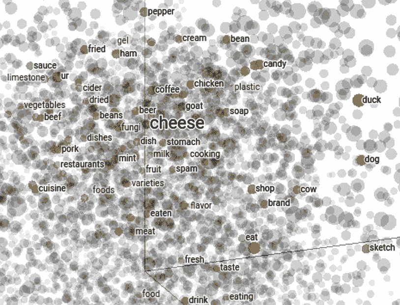
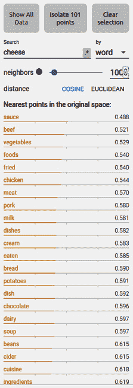
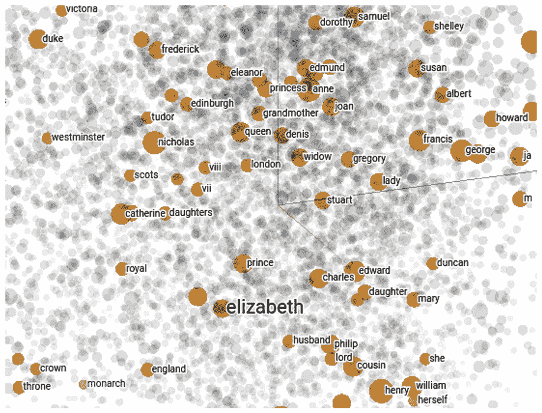
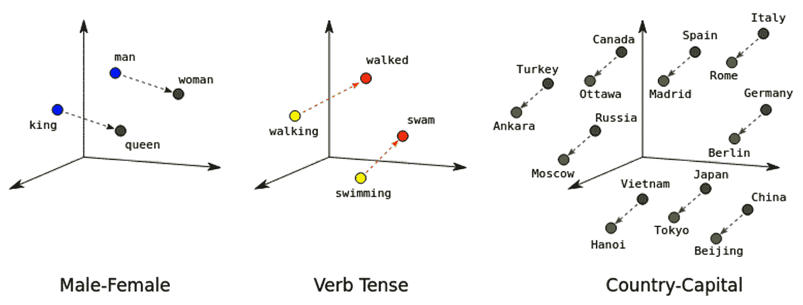
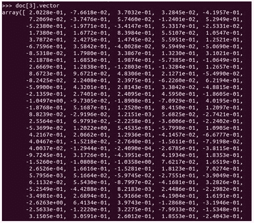
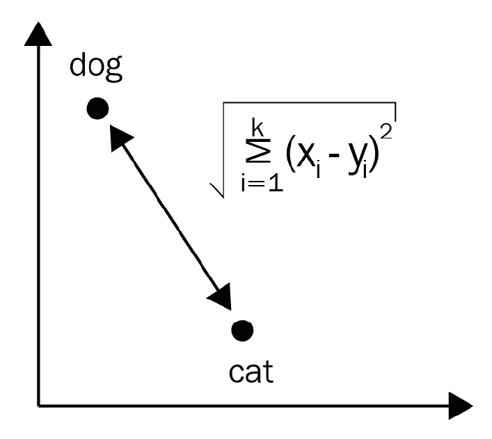
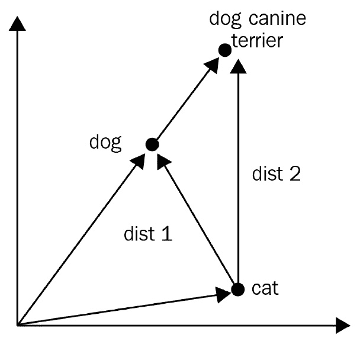
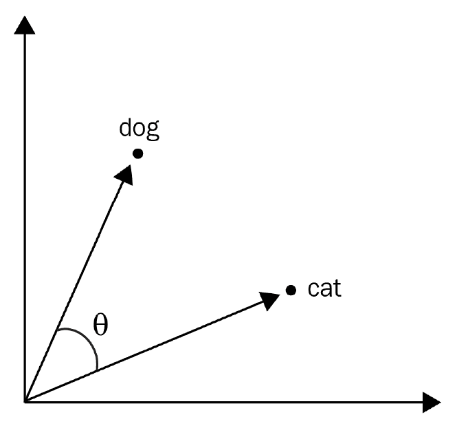

# 第五章：处理词向量和语义相似度

**词向量**是方便的工具，并且几乎有十年时间是自然语言处理的热门话题。词向量基本上是一个词的密集表示。这些向量令人惊讶的地方在于，语义相似的词具有相似的词向量。词向量非常适合语义相似度应用，例如计算词、短语、句子和文档之间的相似度。在词级别上，词向量提供了关于同义性、语义类比等方面的信息。我们可以通过使用词向量来构建语义相似度应用。

词向量是由利用相似词出现在相似上下文中的事实的算法产生的。为了捕捉一个词的意义，词向量算法收集了目标词出现的周围词的信息。通过周围词捕捉词的语义的这种范例被称为**分布语义**。

在本章中，我们将介绍**分布语义范式**及其相关的**语义相似度方法**。我们将首先从概念上了解**文本向量化**，以便你知道词向量解决哪些 NLP 问题。

接下来，我们将熟悉词向量计算，如**距离计算**、**类比计算**和**可视化**。然后，我们将学习如何从 spaCy 的预训练词向量中受益，以及如何导入和使用第三方向量。最后，我们将通过 spaCy 深入了解高级语义相似度方法。

在本章中，我们将涵盖以下主要主题：

+   理解词向量

+   使用 spaCy 的预训练向量

+   使用第三方词向量

+   高级语义相似度方法

# 技术要求

在本章中，我们除了 spaCy 之外还使用了某些外部 Python 库来进行代码可视化。如果您想在本章中生成词向量可视化，您将需要以下库：

+   NumPy

+   scikit-learn

+   Matplotlib

您可以在此书的 GitHub 仓库中找到本章的代码：[`github.com/PacktPublishing/Mastering-spaCy/tree/main/Chapter05`](https://github.com/PacktPublishing/Mastering-spaCy/tree/main/Chapter05).

# 理解词向量

词向量（或**word2vec**）的发明是自然语言处理领域最令人激动的进步之一。那些在实践自然语言处理的你们肯定在某一点上听说过词向量。本章将帮助你们理解导致词 2vec 发明的底层理念，了解词向量是什么样的，以及如何在自然语言处理应用中使用它们。

统计世界使用数字，包括统计自然语言处理算法在内的所有统计方法都使用向量。因此，在处理统计方法时，我们需要将每个现实世界的数量表示为向量，包括文本。在本节中，我们将了解我们可以用不同的方式将文本表示为向量，并发现词向量如何为单词提供语义表示。

我们将首先通过涵盖最简单的实现方式——独热编码——来发现文本向量化。

## 独热编码

**独热编码**是将向量分配给单词的一种简单直接的方法：给词汇表中的每个单词分配一个索引值，然后将此值编码到一个**稀疏向量**中。让我们看一个例子。在这里，我们将考虑一个披萨订购应用的词汇表；我们可以按照它们在词汇表中出现的顺序给每个单词分配一个索引：

```py
1   a 
2   e-mail  
3   I
4   cheese  
5   order    
6   phone
7   pizza   
8   salami  
9   topping 
10 want
```

现在，词汇表中单词的向量将为 0，除了单词对应索引值的位：

```py
a           1 0 0 0 0 0 0 0 0 0
e-mail   0 1 0 0 0 0 0 0 0 0
I            0 0 1 0 0 0 0 0 0 0
cheese  0 0 0 1 0 0 0 0 0 0
order     0 0 0 0 1 0 0 0 0 0
phone    0 0 0 0 0 1 0 0 0 0
pizza      0 0 0 0 0 0 1 0 0 0
salami    0 0 0 0 0 0 0 1 0 0
topping  0 0 0 0 0 0 0 0 1 0
want      0 0 0 0 0 0 0 0 0 1   
```

现在，我们可以将一个句子表示为一个矩阵，其中每一行对应一个单词。例如，句子*I want a pizza*可以表示为以下矩阵：

```py
I          0 0 1 0 0 0 0 0 0 0
want   0 0 0 0 0 0 0 0 0 1
a         1 0 0 0 0 0 0 0 0 0
pizza   0 0 0 0 0 0 1 0 0 0
```

如我们从先前的词汇和索引中可以看到，向量的长度等于词汇表中的单词数量。每个维度都专门对应一个单词。当我们对文本应用独热编码向量化时，每个单词都被其向量所替代，句子被转换成一个 `(N, V)` 矩阵，其中 `N` 是句子中的单词数量，`V` 是词汇表的大小。

这种表示文本的方式计算简单，调试和理解也容易。到目前为止看起来不错，但这里存在一些潜在问题，例如以下内容：

+   这些向量是稀疏的。每个向量包含许多 0，但只有一个`1`。显然，如果我们知道具有相似意义的单词可以分组并共享一些维度，这将是一种空间浪费。此外，通常数值算法并不喜欢高维和稀疏向量。

+   其次，如果词汇表的大小超过一百万个单词怎么办？显然，我们需要使用一百万维的向量，这在内存和计算方面实际上是不可行的。

+   另一个问题是没有向量具有任何*意义*。相似单词并没有以某种方式分配到相似的向量中。在先前的词汇中，单词`cheese`、`topping`、`salami`和`pizza`实际上携带相关的意义，但它们的向量在没有任何方式上相关。这些向量确实是随机分配的，取决于词汇表中相应单词的索引。独热编码的向量根本不捕捉任何语义关系。

词向量是为了回答上述问题而发明的。

## 词向量

词向量是解决前面问题的解决方案。词向量是一个**固定大小**、**密集**、**实值**的向量。从更广泛的角度来看，词向量是文本的学习表示，其中语义相似的单词具有相似的向量。以下是一个词向量看起来像什么。这已被从**Glove 英语向量**中提取出来（我们将在*如何生成词向量*部分详细探讨 Glove）：

```py
the 0.418 0.24968 -0.41242 0.1217 0.34527 -0.044457 -0.49688 -0.17862 -0.00066023 -0.6566 0.27843 -0.14767 -0.55677 0.14658 -0.0095095 0.011658 0.10204 -0.12792 -0.8443 -0.12181 -0.016801 -0.33279 -0.1552 -0.23131 -0.19181 -1.8823 -0.76746 0.099051 -0.42125 -0.19526 4.0071 -0.18594 -0.52287 -0.31681 0.00059213 0.0074449 0.17778 -0.15897 0.012041 -0.054223 -0.29871 -0.15749 -0.34758 -0.045637 -0.44251 0.18785 0.0027849 -0.18411 -0.11514 -0.78581
```

这是单词`the`的 50 维向量。正如你所见，维度是浮点数。但这些维度代表什么呢？这些单个维度通常没有固有的含义。相反，它们代表向量空间中的位置，这些向量之间的距离表示了对应单词意义的相似性。因此，一个单词的意义分布在维度上。这种表示单词意义的方式被称为**分布语义**。

我们已经提到，语义相似的单词具有相似的表达。让我们看看不同单词的向量以及它们如何提供语义表示。为此，我们可以使用 TensorFlow 的词向量可视化工具，网址为[`projector.tensorflow.org/`](https://projector.tensorflow.org/)。在这个网站上，Google 提供了 10,000 个单词的词向量。每个向量是 200 维的，并投影到三个维度进行可视化。让我们看看我们谦逊的披萨订购词汇中单词`cheese`的表示：



图 5.1 – “cheese”单词及其语义相似单词的向量表示

如我们所见，单词`cheese`在语义上与其他关于食物的单词分组。这些是经常与单词`cheese`一起使用的单词：酱汁、可乐、食物等等。在下面的截图中，我们可以看到按余弦距离排序的最近单词（将余弦距离视为计算向量之间距离的一种方式）：



图 5.2 – 三维空间中“cheese”的最近点

那么，关于专有名词呢？词向量是在大型语料库上训练的，例如维基百科，这就是为什么一些专有名词的表示也是学习得到的。例如，专有名词**elizabeth**由以下向量表示：



图 5.3 – elizabeth 的向量表示

备注

注意，前一个截图中的所有单词都是小写的。大多数词向量算法会将所有词汇输入单词转换为小写，以避免存在两个相同单词的表示。

在这里，我们可以看到 **elizabeth** 确实指向英格兰女王伊丽莎白。周围的词包括 **monarch**、**empress**、**princess**、**royal**、**lord**、**lady**、**crown**、**England**、**Tudor**、**Buckingham**、她母亲的名字 **anne**、她父亲的名字 **henry**，甚至她母亲竞争对手的女王名字 **catherine**！**crown** 这样的普通词和 **henry** 这样的专有名词都与 **elizabeth** 一起分组。我们还可以看到，所有邻近词的句法类别都是名词；动词不会与名词一起使用。

词向量可以捕捉同义词、反义词以及诸如动物、地点、植物、人名和抽象概念等语义类别。接下来，我们将深入探讨语义，并探索词向量提供的令人惊讶的功能——**词类比**。

## 类比和向量运算

我们已经看到，学习到的表示可以捕捉语义。更重要的是，词向量以有意义的方式支持向量运算，如向量加法和减法。实际上，添加和减去词向量是支持类比的一种方式。

词类比是一对词之间的语义关系。存在许多类型的关系，例如同义性、反义性和整体部分关系。一些例子包括（King – man, Queen – woman）、（airplane – air, ship - sea）、（fish – sea, bird - air）、（branch – tree, arm – human）、（forward – backward, absent – present）等等。

例如，我们可以将女王和国王之间的性别映射表示为 `Queen – Woman + Man = King`。在这里，如果我们从 *Queen* 中减去 *woman* 并加上 *man*，我们得到 *King*。然后，这个类比可以读作，*queen is to king as woman is to man*。嵌入可以生成诸如性别、时态和首都等显著的类比。以下图表显示了这些类比：



图 5.4 – 由词向量创建的类比（来源：https://developers.google.com/machine-learning/crash-course/embeddings/translating-to-a-lower-dimensional-space）

显然，词向量为 NLP 开发者提供了强大的语义能力，但它们是如何产生的呢？我们将在下一节中了解更多关于词向量生成算法的内容。

## 词向量是如何产生的

产生词向量的方法不止一种。让我们看看最流行的预训练向量以及它们的训练方式：

+   **word2vec**是谷歌创建的用于生成词向量的统计算法。词向量是通过神经网络架构训练的，该架构处理单词窗口并预测每个单词的向量，这取决于周围的单词。这些预训练的词向量可以从[`developer.syn.co.in/tutorial/bot/oscova/pretrained-vectors.html#word2vec-and-glove-models`](https://developer.syn.co.in/tutorial/bot/oscova/pretrained-vectors.html#word2vec-and-glove-models)下载。这里我们不会深入细节，但你可以阅读关于算法和数据准备步骤的出色博客[`jalammar.github.io/illustrated-word2vec/`](https://jalammar.github.io/illustrated-word2vec/)以获取更多信息。

+   **Glove**向量以另一种方式训练，是由斯坦福 NLP 小组发明的。这种方法依赖于奇异值分解，它用于单词共现矩阵。关于 Glove 算法的全面指南可在[`www.youtube.com/watch?v=Fn_U2OG1uqI`](https://www.youtube.com/watch?v=Fn_U2OG1uqI)找到。预训练的向量可在[`nlp.stanford.edu/projects/glove/`](https://nlp.stanford.edu/projects/glove/)找到。

+   **fastText**是由 Facebook Research 创建的，与 word2vec 类似，但提供了更多功能。word2vec 根据周围的上下文预测单词，而 fastText 预测子词；也就是说，字符 n-gram。例如，单词*椅子*生成了以下子词：

    ```py
    ch, ha, ai, ir, cha, hai, air
    ```

fastText 为每个子词生成一个向量，包括拼写错误、数字、部分单词和单个字符。在处理拼写错误和罕见单词时，fastText 非常稳健。它可以计算非标准词典单词的向量。

Facebook Research 发布了 157 种语言的预训练 fastText 向量。你可以在[`fasttext.cc/docs/en/crawl-vectors.html`](https://fasttext.cc/docs/en/crawl-vectors.html)找到这些模型。

所有的先前算法都遵循相同的思想：相似单词出现在相似语境中。语境——围绕一个单词的周围单词——在任何情况下都是生成特定单词的词向量的关键。所有使用先前三种算法生成的预训练词向量都是在像维基百科、新闻或推特这样的大型语料库上训练的。

小贴士

当我们说到相似单词时，首先想到的概念是**同义性**。同义词出现在相似的语境中；例如，*自由*和*自由*都意味着相同的事情：

我们希望拥有免费的健康医疗、教育和自由。

我们希望拥有免费的健康医疗、教育和自由。

那么，反义词呢？反义词可以在相同的语境中使用。以*爱*和*恨*为例：

我讨厌猫。

我喜欢猫。

如您所见，反义词也出现在类似的环境中；因此，通常它们的向量也是相似的。如果您的下游 NLP 任务在这方面很敏感，使用词向量时要小心。在这种情况下，始终要么训练自己的向量，要么通过在下游任务中训练来改进您的词向量。您可以使用 Gensim 包（[`radimrehurek.com/gensim/`](https://radimrehurek.com/gensim/））来训练自己的词向量。Keras 库允许在下游任务上训练词向量。我们将在 *第八章**，使用 spaCy 进行文本分类* 中重新讨论这个问题。

现在我们对词向量有了更多的了解，让我们看看如何使用 spaCy 的预训练词向量。

# 使用 spaCy 的预训练向量

我们在 *第一章**，spaCy 入门* 中安装了一个中等大小的英语 spaCy 语言模型，这样我们就可以直接使用词向量。词向量是许多 spaCy 语言模型的一部分。例如，`en_core_web_md` 模型包含 20,000 个单词的 300 维向量，而 `en_core_web_lg` 模型包含 685,000 个单词词汇的 300 维向量。

通常，小型模型（那些以 `sm` 结尾的）不包含任何词向量，但包含上下文敏感的张量。您仍然可以进行以下语义相似度计算，但结果不会像词向量计算那样准确。

您可以通过 `token.vector` 方法访问一个单词的向量。让我们通过一个例子来看看这个方法。以下代码查询了 banana 的单词向量：

```py
import spacy
nlp = spacy.load("en_core_web_md")
doc = nlp("I ate a banana.")
doc[3].vector
```

以下截图是在 Python 壳中拍摄的：



图 5.5 – 单词 "banana" 的词向量

`token.vector` 返回一个 NumPy `ndarray`。您可以在结果上调用 `numpy` 方法：

```py
type(doc[3].vector)
<class 'numpy.ndarray'>
doc[3].vector.shape
(300,)
```

在此代码段中，首先，我们查询了单词向量的 Python 类型。然后，我们在向量上调用了 NumPy 数组的 `shape()` 方法。

`Doc` 和 `Span` 对象也有向量。句子或 span 的向量是其单词向量的平均值。运行以下代码并查看结果：

```py
doc = nlp("I like a banana,")
doc.vector
doc[1:3].vector
```

只有模型词汇表中的单词才有向量；不在词汇表中的单词称为 `token.is_oov` 和 `token.has_vector`，这两个方法可以用来查询一个标记是否在模型的词汇表中并且有单词向量：

```py
doc = nlp("You went there afskfsd.")
for token in doc:
          token.is_oov, token.has_vector
(False, True)
(False, True)
(False, True)
(True, False)
(False, True)
```

这基本上就是我们使用 spaCy 的预训练词向量的方法。接下来，我们将探讨如何调用 spaCy 的语义相似度方法在 `Doc`、`Span` 和 `Token` 对象上。

## 相似度方法

在 spaCy 中，每个容器类型对象都有一个相似度方法，允许我们通过比较它们的词向量来计算其他容器对象的语义相似度。

我们可以计算两个容器对象之间的语义相似度，即使它们是不同类型的容器。例如，我们可以比较一个`Token`对象和一个`Doc`对象，以及一个`Doc`对象和一个`Span`对象。以下示例计算了两个`Span`对象之间的相似度：

```py
doc1 = nlp("I visited England.")
doc2 = nlp("I went to London.")
doc1[1:3].similarity(doc2[1:4])
0.6539691
```

我们还可以比较两个`Token`对象，`伦敦`和`英格兰`：

```py
doc1[2].similarity(doc2[3])
0.73891276
```

句子的相似度是通过在`Doc`对象上调用`similarity()`来计算的：

```py
doc1.similarity(doc2)
0.7995623615797786
```

上述代码段计算了两个句子`我访问了英格兰`和`我去了伦敦`之间的语义相似度。相似度得分足够高，以至于它认为这两个句子是相似的（相似度的范围从`0`到`1`，其中`0`表示无关，`1`表示相同）。

毫不奇怪，当你比较一个对象与自身时，`similarity()`方法返回`1`：

```py
doc1.similarity(doc1)
1.0
```

有时用数字判断距离是困难的，但查看纸上的向量也可以帮助我们理解我们的词汇词是如何分组的。以下代码片段可视化了一个简单的词汇，包含两个语义类别。第一个类别是动物，而第二个类别是食物。我们预计这两个类别的词将在图形上形成两个组：

```py
import matplotlib.pyplot as plt
from sklearn.decomposition import PCA
import numpy as np
import spacy
nlp = spacy.load("en_core_web_md")
vocab = nlp("cat dog tiger elephant bird monkey lion cheetah burger pizza food cheese wine salad noodles macaroni fruit vegetable")
words = [word.text for word in vocab]
>>> vecs = np.vstack([word.vector for word in vocab if word.has_vector])
pca = PCA(n_components=2)
vecs_transformed = pca.fit_transform(vecs)
plt.figure(figsize=(20,15))
plt.scatter(vecs_transformed[:,0], vecs_transformed[:,1])
for word, coord in zip(words, vecs_transformed):
           x,y = coord
          plt.text(x,y,word, size=15)
plt.show()
```

这段代码片段实现了很多功能。让我们来看看：

1.  首先，我们导入了 matplotlib 库来创建我们的图形。

1.  下面的两个导入是为了计算向量。

1.  我们像往常一样导入了`spacy`并创建了一个`nlp`对象。

1.  然后，我们从我们的词汇表中创建了一个`Doc`对象。

1.  接下来，我们通过调用`np.vstack`将词向量垂直堆叠。

1.  由于向量是 300 维的，我们需要将它们投影到二维空间以进行可视化。我们通过提取两个主成分来执行这种投影，这被称为**主成分分析**（**PCA**）。

1.  代码的其余部分处理 matplotlib 函数调用以创建散点图。

结果的视觉如下所示：

![图 5.6 – 两个语义类别分组]

![img/B16570_5_6.jpg]

图 5.6 – 两个语义类别分组

哇！我们的 spaCy 词向量真的起作用了！在这里，我们可以看到在可视化中分组的两类语义。注意，动物之间的距离更短，分布更均匀，而食物类别在组内形成了群体。

之前，我们提到过我们可以创建自己的词向量或者在我们自己的语料库上对它们进行优化。一旦我们完成了这些，我们能否在 spaCy 中使用它们呢？答案是肯定的！在下一节中，我们将学习如何将自定义词向量加载到 spaCy 中。

# 使用第三方词向量

我们也可以在 spaCy 中使用第三方词向量。在本节中，我们将学习如何将第三方词向量包导入 spaCy。我们将使用来自 Facebook AI 的 fastText 的基于子词的预训练向量。您可以在 [`fasttext.cc/docs/en/english-vectors.html`](https://fasttext.cc/docs/en/english-vectors.html) 查看所有可用的英语预训练向量的列表。

包的名字标识了向量的维度、词汇量大小以及向量将要训练的语料库类型。例如，`wiki-news-300d-1M-subword.vec.zip` 表示它包含在维基百科语料库上训练的 100 万 300 维度的词向量。

让我们开始下载向量：

1.  在您的终端中，输入以下命令。或者，您可以将 URL 复制并粘贴到浏览器中，下载应该会开始：

    ```py
    $ wget https://dl.fbaipublicfiles.com/fasttext/vectors-english/wiki-news-300d-1M-subword.vec.zip
    ```

    前一行将下载 300 维度的词向量到您的机器上。

1.  接下来，我们将解压以下 `.zip` 文件。您可以通过右键单击或使用以下代码进行解压：

    ```py
    wiki-news-300d-1M-subword.vec file.
    ```

1.  现在，我们已经准备好了使用 spaCy 的 `init-model` 命令：

    ```py
    wiki-news-300d-1M-subword.vec vectors into spaCy's vector format.b) Creates a language model directory named `en_subwords_wiki_lg` that contains the newly created vectors.
    ```

1.  如果一切顺利，您应该会看到以下消息：

    ```py
    Reading vectors from wiki-news-300d-1M-subword.vec
    Open loc
    999994it [02:05, 7968.84it/s]
    Creating model...
    0it [00:00, ?it/s]      Successfully compiled vocab
          999731 entries, 999994 vectors
    ```

1.  通过这样，我们已经创建了语言模型。现在，我们可以加载它：

    ```py
    import spacy
    nlp = spacy.load("en_subwords_wiki_lg")
    ```

1.  现在，我们可以使用这个 `nlp` 对象创建一个 `doc` 对象，就像我们使用 spaCy 的默认语言模型一样：

    ```py
    doc = nlp("I went there.")
    ```

我们刚刚创建的模型是一个使用词向量初始化的空模型，因此它不包含任何其他管道组件。例如，调用 `doc.ents` 将会失败并显示错误。所以，当与第三方向量一起工作时，请小心，并在可能的情况下优先使用内置的 spaCy 向量。

# 高级语义相似性方法

在本节中，我们将探讨用于单词、短语和句子相似性的高级语义相似性方法。我们已经学习了如何使用 spaCy 的 **similarity** 方法计算语义相似性并获得了一些分数。但这些分数意味着什么？它们是如何计算的？在我们查看更高级的方法之前，首先，我们将学习语义相似性是如何计算的。

## 理解语义相似性

当我们收集文本数据（任何类型的数据）时，我们希望看到一些例子是如何相似、不同或相关的。我们希望通过计算它们的相似度分数来衡量两段文本的相似度。在这里，术语 *语义相似性* 出现了；**语义相似性**是一个定义在文本上的 **度量**，其中两个文本之间的距离基于它们的语义。

数学中的度量基本上是一个距离函数。每个度量在向量空间上诱导一个拓扑。词向量是向量，因此我们想要计算它们之间的距离，并将其用作相似度分数。

现在，我们将了解两种常用的距离函数：**欧几里得距离**和**余弦距离**。让我们从欧几里得距离开始。

### 欧几里得距离

在 k 维空间中，两点之间的欧几里得距离是它们之间路径的长度。两点之间的距离是通过勾股定理计算的。我们通过求和每个坐标差的平方，然后取这个和的平方根来计算这个距离。以下图显示了两个向量（狗和猫）之间的欧几里得距离：



图 5.7 – 狗和猫向量之间的欧几里得距离

欧几里得距离对词向量意味着什么？首先，欧几里得距离没有向量方向的概念；重要的是**向量的大小**。如果我们拿一支笔从原点画一个向量到 **dog** 点（让我们称它为 **dog vector**）并同样对 **cat** 点（让我们称它为 **cat vector**）做同样的操作，然后从其中一个向量减去另一个向量，那么距离基本上就是这个差向量的幅度。

如果我们在 **dog** 中添加两个语义相似的词（*canine*，*terrier*）并使其成为三个词的文本会发生什么？显然，狗向量现在将增长幅度，可能是在同一方向上。这次，由于几何形状（如下所示），距离将更大，尽管第一段文本（现在是 **dog canine terrier**）的语义保持不变。

这就是使用欧几里得距离进行语义相似度计算的主要缺点 – 空间中两个向量的方向没有被考虑。以下图说明了 **dog** 和 **cat** 之间的距离以及 **dog** **canine terrier** 和 **cat** 之间的距离：



图 5.8 – “dog”和“cat”之间的距离，以及“dog canine terrier”和“cat”之间的距离

我们如何解决这个问题？有一种计算相似度的另一种方法可以解决这个问题，称为**余弦相似度**。让我们看看。

### 余弦距离和余弦相似度

与欧几里得距离相反，余弦距离更关注空间中两个向量的方向。两个向量的余弦相似度基本上是这两个向量所形成的角度的余弦。以下图显示了 **dog** 和 **cat** 向量之间的角度：



图 5.9 – 狗和猫向量之间的夹角。在这里，语义相似度是通过 cos(θ) 计算的

余弦相似度允许的最大相似度分数是 `1`。这是在两个向量之间的角度为 0 度时获得的（因此，向量重合）。当两个向量之间的角度为 90 度时，两个向量的相似度为 0。

余弦相似性在向量增长时提供了可扩展性。我们在这里再次引用*图 5.8*。如果我们增长其中一个输入向量，它们之间的角度保持不变，因此余弦相似度得分相同。

注意，在这里，我们计算的是语义相似度得分，而不是距离。当向量重合时，最高可能值为 1，而当两个向量垂直时，最低得分为 0。余弦距离是 1 – cos(θ)，这是一个距离函数。

spaCy 使用余弦相似性来计算语义相似度。因此，调用`similarity`方法帮助我们进行余弦相似度计算。

到目前为止，我们已经学习了如何计算相似度得分，但我们还没有发现我们应该寻找意义的单词。显然，句子中的所有单词对句子的语义影响并不相同。相似度方法会为我们计算语义相似度得分，但为了使该计算的结果有用，我们需要选择正确的关键词进行比较。为了理解这一点，考虑以下文本片段：

```py
Blue whales are the biggest mammals in the world. They're observed in California coast during spring.
```

如果我们感兴趣的是寻找地球上最大的哺乳动物，短语“最大的哺乳动物”和“在世界上”将是关键词。将这些短语与搜索短语“最大的哺乳动物”和“在地球上”进行比较应该会给出一个高相似度得分。但如果我们感兴趣的是了解世界上的某些地方，那么“加利福尼亚”将是关键词。“加利福尼亚”在语义上与单词“地理”相似，而且更好，实体类型是地理名词。

我们已经学习了如何计算相似度得分。在下一节中，我们将学习如何查找意义所在。我们将从句子中提取关键短语和命名实体，然后将其用于相似度得分计算。我们将首先通过一个文本分类案例研究来介绍，然后通过关键短语提取来提高任务结果。

## 使用语义相似性对文本进行分类

确定两个句子的语义相似度可以帮助你将文本分类到预定义的类别中，或者仅突出相关的文本。在本案例研究中，我们将过滤掉所有与单词“香水”相关的电子商务网站的用户评论。假设你需要评估以下用户评论：

```py
I purchased a science fiction book last week.
I loved everything related to this fragrance: light, floral and feminine …
I purchased a bottle of wine. 
```

在这里，我们可以看到只有第二句话是相关的。这是因为它包含了单词“香气”，以及描述香味的形容词。为了理解哪些句子是相关的，我们可以尝试几种比较策略。

首先，我们可以将“香水”与每个句子进行比较。回想一下，spaCy 通过平均其标记的词向量来为句子生成一个词向量。以下代码片段将前面的句子与“香水”搜索关键字进行比较：

```py
sentences = nlp("I purchased a science fiction book last week. I loved everything related to this fragrance: light, floral and feminine... I purchased a bottle of wine.  ")
key = nlp("perfume")
for sent in sentences.sents:
           print(sent.similarity(key))
... 
0.2481654331382154
0.5075297559861377
0.42154297167069865
```

在这里，我们执行了以下步骤：

1.  首先，我们创建了包含前三个句子的`Doc`对象。

1.  然后，对于每个句子，我们计算了它与`perfume`的相似度得分。

1.  然后，我们通过在句子上调用`similarity()`方法来打印得分。

`perfume`和第一句话的相似度很小，这表明这句话与我们搜索的关键词不太相关。第二句话看起来相关，这意味着我们正确地识别了语义相似度。

第三句话怎么样？脚本确定第三句话在某种程度上是相关的，最可能的原因是它包含了单词`bottle`，而香水通常装在瓶子中销售。单词`bottle`与单词`perfume`出现在相似的环境中。因此，这个句子和搜索关键词的相似度得分并不足够低；此外，第二句和第三句的得分也没有足够接近，以至于第二句变得重要。

与将关键词与整个句子进行比较相比，还有一个潜在问题。在实践中，我们偶尔会处理相当长的文本，例如网页文档。对非常长的文本进行平均会降低关键词的重要性。

为了提高性能，我们可以提取*重要*的词语。让我们看看我们如何在句子中找到关键短语。

## 提取关键短语

进行语义分类的更好方法是提取重要的词语/短语，并将它们与搜索关键词进行比较。我们不需要将关键词与不同的词性进行比较，而是可以将关键词仅与名词短语进行比较。名词短语是句子的主语、直接宾语和间接宾语，承担着句子大部分语义的比重。

例如，在句子*Blue whales live in California.*中，你可能想关注*blue whales*、*whales*、*California*或*whales in California*。

类似地，在关于香水的上一句话中，我们专注于挑选出名词，*fragrance*。在不同的语义任务中，你可能需要其他上下文词，如动词，来判断句子的主题，但对于语义相似度来说，名词短语占的比重最大。

那么，名词短语是什么？一个**名词短语**（**NP**）是由一个名词及其修饰语组成的一组词语。修饰语通常是代词、形容词和限定词。以下短语是名词短语：

```py
A dog
My dog
My beautiful dog
A beautiful dog
A beautiful and happy dog
My happy and cute dog
```

spaCy 通过解析依存句法分析器的输出来提取名词短语。我们可以通过使用`doc.noun_chunks`方法来查看句子的名词短语：

```py
doc = nlp("My beautiful and cute dog jumped over the fence")
doc.noun_chunks
<generator object at 0x7fa3c529be58>
list(doc.noun_chunks)
[My beautiful and cute dog, the fence]
```

让我们稍微修改一下前面的代码片段。这次，我们不是将搜索关键词*perfume*与整个句子进行比较，而是只将其与句子的名词短语进行比较：

```py
for sent in sentences.sents:
          nchunks = [nchunk.text for nchunk in sent.noun_chunks]
             nchunk_doc = nlp(" ".join(nchunks)) 
             print(nchunk_doc.similarity(key))
0.21390893517254456
0.6047741393523175
0.44506391511570403
```

在前面的代码中，我们做了以下操作：

1.  首先，我们遍历了句子。

1.  然后，对于每个句子，我们提取了名词短语并将它们存储在一个 Python 列表中。

1.  接下来，我们将列表中的名词短语连接成一个 Python 字符串，并将其转换为`Doc`对象。

1.  最后，我们将名词短语的`Doc`对象与搜索关键词*perfume*进行比较，以确定它们的语义相似度分数。

如果我们将这些分数与之前的分数进行比较，我们会看到第一句话仍然不相关，所以它的分数略有下降。第二句话的分数显著增加。现在，第二句话和第三句话的分数看起来离我们很远，以至于我们可以自信地说第二句话是最相关的句子。

## 提取和比较命名实体

在某些情况下，我们不会提取每个名词，而只会关注专有名词；因此，我们想要提取命名实体。假设我们想要比较以下段落：

```py
"Google Search, often referred as Google, is the most popular search engine nowadays. It answers a huge volume of queries every day."
"Microsoft Bing is another popular search engine. Microsoft is known by its star product Microsoft Windows, a popular operating system sold over the world."
"The Dead Sea is the lowest lake in the world, located in the Jordan Valley of Israel. It is also the saltiest lake in the world."
```

我们的代码应该能够识别出前两段是关于大型科技公司及其产品的，而第三段是关于地理位置的。

比较这些句子中的所有名词短语可能并不很有帮助，因为其中许多，如`volume`，与分类不相关。这些段落的主题由其内的短语决定；也就是说，`Google Search`、`Google`、`Microsoft Bing`、`Microsoft`、`Windows`、`Dead Sea`、`Jordan Valley`和`Israel`。spaCy 可以识别这些实体：

```py
doc1 =  nlp("Google Search, often referred as Google, is the most popular search engine nowadays. It answers a huge volume of queries every day.")
doc2 = nlp("Microsoft Bing is another popular search engine. Microsoft is known by its star product Microsoft Windows, a popular operating system sold over the world.")
doc3 = nlp("The Dead Sea is the lowest lake in the world, located in the Jordan Valley of Israel. It is also the saltiest lake in the world.")
doc1.ents
(Google,)
doc2.ents
(Microsoft Bing, Microsoft, Microsoft, Windows)
doc3.ents
(The Dead Sea, the Jordan Valley, Israel)
```

现在我们已经提取了我们想要比较的单词，让我们计算相似度分数：

```py
ents1 = [ent.text for ent in doc1.ents]
ents2 = [ent.text for ent in doc2.ents]
ents3 = [ent.text for ent in doc3.ents]
ents1 = nlp(" ".join(ents1))
ents2 = nlp(" ".join(ents2))
ents3 = nlp(" ".join(ents3))
ents1.similarity(ents2)
0.6078712596225045
ents1.similarity(ents3)
0.374100398233877
ents2.similarity(ents3)
0.36244710903224026
```

观察这些图表，我们可以看到第一段和第二段之间的相似度最高，这两段都是关于大型科技公司的。第三段与其他段落并不真正相似。我们是如何仅使用词向量就得到这个计算的？可能是因为单词*Google*和*Microsoft*经常出现在新闻和其他社交媒体文本语料库中，从而创建了相似的词向量。

恭喜！你已经到达了*高级语义相似度方法*部分的结尾！你探索了将词向量与诸如关键词和命名实体等语言特征结合的不同方法。通过完成这一部分，我们现在可以总结本章内容。

# 摘要

在本章中，你使用了词向量，这些是表示词义的字节浮点向量。首先，你学习了不同的文本向量化方法，以及如何使用词向量和分布式语义。然后，你探索了词向量允许的向量操作以及这些操作带来的语义。

你还学习了如何使用 spaCy 的内置词向量，以及如何将第三方向量导入 spaCy。最后，你学习了基于向量的语义相似度以及如何将语言概念与词向量结合以获得最佳语义效果。

下一章充满了惊喜——我们将研究一个基于实际案例的研究，这将使你能够将前五章学到的知识结合起来。让我们看看 spaCy 在处理现实世界问题时能做什么！
