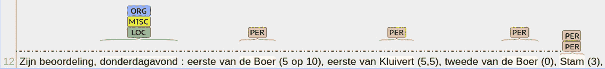
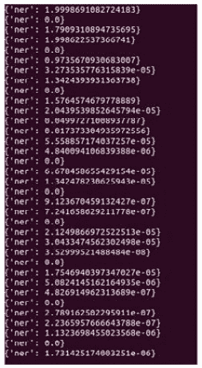
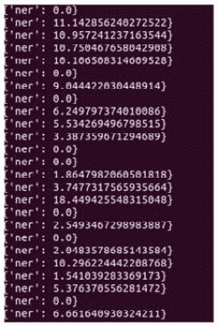
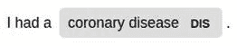
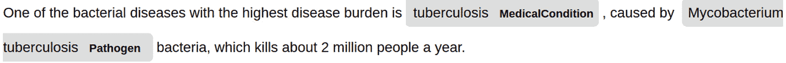
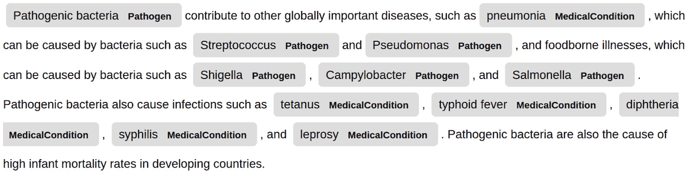

# 第七章：自定义 spaCy 模型

在本章中，你将学习如何训练、存储和使用自定义统计管道组件。首先，我们将讨论何时应该进行自定义模型训练。然后，你将学习模型训练的一个基本步骤——如何收集和标注自己的数据。

在本章中，你还将学习如何充分利用**Prodigy**，这个注释工具。接下来，你将学习如何使用自己的数据更新现有的统计管道组件。我们将使用我们自己的标记数据更新 spaCy 管道的**命名实体识别器**（NER）组件。

最后，你将学习如何使用自己的数据和标签从头开始创建统计管道组件。为此，我们将再次训练一个 NER 模型。本章将带你完成一个完整的机器学习实践，包括收集数据、标注数据和为信息提取训练模型。

到本章结束时，你将准备好在自己的数据上训练 spaCy 模型。你将具备收集数据、将数据预处理成 spaCy 可以识别的格式，以及最终使用这些数据训练 spaCy 模型的全套技能。在本章中，我们将涵盖以下主要主题：

+   开始数据准备

+   标注和准备数据

+   更新现有的管道组件

+   从头开始训练管道组件

# 技术要求

本章的代码可以在本书的 GitHub 仓库中找到：[`github.com/PacktPublishing/Mastering-spaCy/tree/main/Chapter07`](https://github.com/PacktPublishing/Mastering-spaCy/tree/main/Chapter07)。

# 开始数据准备

在前面的章节中，我们看到了如何在我们的应用程序中充分利用 spaCy 的预训练统计模型（包括**POS 标记器**、NER 和**依存句法分析器**）。在本章中，我们将看到如何为我们的自定义领域和数据自定义统计模型。

spaCy 模型在通用 NLP 任务中非常成功，例如理解句子的语法、将段落分割成句子以及提取一些实体。然而，有时我们处理的是 spaCy 模型在训练期间没有见过的非常具体的领域。

例如，Twitter 文本包含许多非正规词汇，如标签、表情符号和提及。此外，Twitter 句子通常只是短语，而不是完整的句子。在这里，spaCy 的 POS 标记器由于是在完整的、语法正确的英语句子上训练的，因此表现不佳，这是完全合理的。

另一个例子是医学领域。医学领域包含许多实体，如药物、疾病和化学化合物名称。这些实体不应该被 spaCy 的 NER 模型识别，因为它没有疾病或药物实体标签。NER 对医学领域一无所知。

训练定制模型需要时间和精力。在开始训练过程之前，你应该决定*是否真的需要进行训练*。为了确定你是否真的需要定制训练，你需要问自己以下问题：

+   spaCy 模型在你的数据上表现足够好吗？

+   你的领域是否包含许多在 spaCy 模型中缺失的标签？

+   在 GitHub 或其他地方已经有了预训练的模型/应用程序吗？（我们不希望重新发明轮子。）

让我们在接下来的章节中详细讨论这些问题。

## spaCy 模型在你的数据上表现足够好吗？

如果模型表现足够好（准确率高于 0.75），那么你可以通过另一个 spaCy 组件来定制模型输出。例如，假设我们在导航领域工作，并且我们有以下这样的语句：

```py
navigate to my home
navigate to Oxford Street
```

让我们看看 spaCy 的 NER 模型为这些句子输出了哪些实体：

```py
import spacy
nlp = spacy.load("en_core_web_md")
doc1 = nlp("navigate to my home")
doc1.ents
()
doc2 = nlp("navigate to Oxford Street")
doc2.ents
(Oxford Street,)
doc2.ents[0].label_
'FAC'
spacy.explain("FAC")
'Buildings, airports, highways, bridges, etc.'
```

在这里，`home`根本不被识别为实体，但我们希望它被识别为地点实体。此外，spaCy 的 NER 模型将`Oxford Street`标记为`FAC`，这意味着建筑/公路/机场/桥梁类型的实体，这并不是我们想要的。

我们希望这个实体被识别为`GPE`，即一个地点。在这里，我们可以进一步训练 NER 来识别街道名称为`GPE`，以及识别一些地点词，如*work*、*home*和*my mama's house*为`GPE`。

另一个例子是报纸领域。在这个领域，提取了人、地点、日期、时间和组织实体，但你还需要一个额外的实体类型——`vehicle`（汽车、公共汽车、飞机等等）。因此，而不是从头开始训练，你可以使用 spaCy 的`EntityRuler`（在第四章*，*基于规则的匹配*）添加一个新的实体类型。始终首先检查你的数据，并计算 spaCy 模型的成功率。如果成功率令人满意，那么使用其他 spaCy 组件进行定制。

## 你的领域是否包含许多在 spaCy 模型中缺失的标签？

例如，在先前的报纸示例中，只有`vehicle`这个实体标签在 spaCy 的 NER 模型标签中缺失。其他实体类型都被识别了。在这种情况下，你不需要定制训练。

再次考虑医疗领域。实体包括疾病、症状、药物、剂量、化学化合物名称等等。这是一份专业且长的实体列表。显然，对于医疗领域，你需要定制模型训练。

如果我们需要定制模型训练，我们通常遵循以下步骤：

1.  收集你的数据。

1.  标注你的数据。

1.  决定更新现有模型或从头开始训练模型。

在数据收集步骤中，我们决定收集多少数据：1,000 个句子、5,000 个句子，或者更多。数据量取决于你的任务和领域的复杂性。通常，我们从可接受的数据量开始，进行第一次模型训练，看看它的表现；然后我们可以添加更多数据并重新训练模型。

在收集您的数据集后，您需要以某种方式标注您的数据，以便 spaCy 的训练代码能够识别它。在下一节中，我们将了解训练数据格式以及如何使用 spaCy 的 Prodigy 工具标注数据。

第三个要点是决定从头开始训练一个空白模型，还是对现有模型进行更新。在这里，经验法则是这样的：如果您的实体/标签存在于现有模型中，但您没有看到非常好的性能，那么使用您自己的数据更新模型，例如在先前的导航示例中。如果您的实体根本不在当前的 spaCy 模型中，那么您可能需要进行定制训练。

小贴士

不要急于训练您自己的模型。首先，检查您是否真的需要定制模型。始终记住，从头开始训练一个模型需要数据准备、模型训练和保存，这意味着您将花费时间、金钱和精力。好的工程实践是明智地使用您的资源。

我们将从构建模型的第一步开始：准备我们的训练数据。让我们继续到下一节，看看如何准备和标注我们的训练数据。

# 标注和准备数据

训练模型的第一步始终是准备训练数据。您通常从客户日志中收集数据，然后通过将数据作为 CSV 文件或 JSON 文件导出，将它们转换为数据集。spaCy 模型训练代码与 JSON 文件一起工作，因此在本章中我们将使用 JSON 文件。

在收集我们的数据后，我们**标注**我们的数据。标注意味着标记意图、实体、词性标签等。

这是一个标注数据的示例：

```py
{
"sentence": "I visited JFK Airport."
"entities": {
             "label": "LOC"
             "value": "JFK Airport"
}
```

正如您所看到的，我们将统计算法指向**我们希望模型学习的内容**。在这个例子中，我们希望模型学习关于实体的知识，因此我们提供带有标注实体的示例。

手动编写 JSON 文件可能会出错且耗时。因此，在本节中，我们还将了解 spaCy 的标注工具 Prodigy，以及一个开源数据标注工具**Brat**。Prodigy 不是开源的或免费的，但我们将介绍它是如何工作的，以便您更好地了解标注工具的一般工作原理。Brat 是开源的，并且可以立即供您使用。

## 使用 Prodigy 标注数据

Prodigy 是数据标注的现代工具。我们将使用 Prodigy 网络演示([`prodi.gy/demo`](https://prodi.gy/demo))来展示标注工具的工作原理。

让我们开始吧：

1.  我们导航到 Prodigy 网络演示页面，查看一个由 Prodigy 提供的示例文本，以便进行标注，如下截图所示：![图 7.1 – Prodigy 界面；照片来自他们的网络演示页面

    ![img/B16570_7_1.jpg]

    图 7.1 – Prodigy 界面；照片来自他们的网络演示页面

    上述截图显示了我们要标注的示例文本。截图底部的按钮展示了接受此训练示例、拒绝此示例或忽略此示例的方法。如果示例与我们的领域/任务无关（但以某种方式涉及数据集），则忽略此示例。如果文本相关且标注良好，则接受此示例，并将其加入我们的数据集。

1.  接下来，我们将对实体进行标注。标注实体很简单。首先，我们从上面的工具栏中选择一个实体类型（在这里，这个语料库包括两种类型的实体，`PERSON`和`ORG`。您想标注哪些实体取决于您；这些是您提供给工具的标签。）然后，我们只需用光标选择我们想要标注为实体的单词，如下面的截图所示：


图 7.2 – 在网络演示中注释 PERSON 实体

在我们完成文本注释后，我们点击接受按钮。一旦会话结束，您可以将标注数据导出为 JSON 文件。当您完成注释工作后，您可以点击**保存**按钮来正确结束会话。点击**保存**会自动将标注数据导出为 JSON 文件。就是这样。Prodigy 提供了一种非常高效的数据标注方法。

## 使用 Brat 进行数据标注

另一个注释工具是**Brat**，这是一个免费且基于网络的文本注释工具([`brat.nlplab.org/introduction.html`](https://brat.nlplab.org/introduction.html))。在 Brat 中，可以注释关系以及实体。您还可以将 Brat 下载到您的本地机器上，用于注释任务。基本上，您将数据集上传到 Brat，并在界面上注释文本。以下截图显示了 CoNLL 数据集示例中的一个已注释句子：



图 7.3 – 一个示例已注释句子

您可以在 Brat 演示网站上的示例数据集上进行操作([`brat.nlplab.org/examples.html`](https://brat.nlplab.org/examples.html%20))，或者通过上传您自己的数据的小子集开始。在注释会话完成后，Brat 会自动导出注释数据的 JSON 文件。

## spaCy 训练数据格式

如我们之前所述，spaCy 训练代码与 JSON 文件格式一起工作。让我们看看训练数据格式的详细情况。

对于命名实体识别（NER），您需要提供句子及其注释的列表。每个注释应包括实体类型、实体在字符中的起始位置以及实体在字符中的结束位置。让我们看看数据集的一个示例：

```py
training_data = [
("I will visit you in Munich.",  {"entities": [(20, 26, "GPE")]}),
("I'm going to Victoria's house.", {

"entities": [

        (13, 23, "PERSON"),  

       (24, 29, "GPE")
                                                         ]})
("I go there.", {"entities": []})
]  
```

此数据集包含三个示例对。每个示例对包括一个句子作为第一个元素。对中的第二个元素是一个标注实体的列表。在第一个示例句子中，只有一个实体，即`Munich`。该实体的标签是`GPE`，在句子中的起始位置是第 20 个字符，结束位置是第 25 个字符。同样，第二个句子包含两个实体；一个是`PERSON`，`Victoria's`，另一个实体是`GPE`，`house`。第三个句子不包含任何实体，因此列表为空。

我们不能直接将原始文本和标注输入到 spaCy 中。相反，我们需要为每个训练示例创建一个`Example`对象。让我们看看代码：

```py
import spacy
from spacy.training import Example
nlp = spacy.load("en_core_web_md")
doc = nlp("I will visit you in Munich.")
annotations =  {"entities": [(20, 26, "GPE")]}
example_sent = Example.from_dict(doc, annotations)
```

在此代码段中，首先，我们从示例句子创建了一个 doc 对象。然后，我们将 doc 对象及其以字典形式提供的标注输入到创建`Example`对象中。我们将在下一节的训练代码中使用`Example`对象。

为训练依存句法分析器创建示例句子略有不同，我们将在*从头开始训练管道组件*部分进行介绍。

现在，我们已经准备好训练我们自己的 spaCy 模型了。我们将首先了解如何更新 NLP 管道的统计模型。为此，我们将借助自己的示例进一步训练 NER 组件。

# 更新现有的管道组件

在本节中，我们将使用自己的示例进一步训练 spaCy 的 NER 组件，以识别导航领域。我们之前已经看到了一些导航领域语句的示例以及 spaCy 的 NER 模型如何标注某些示例语句中的实体：

```py
navigate/0 to/0 my/0 home/0
navigate/0 to/0 Oxford/FAC Street/FAC
```

显然，我们希望 NER 表现更好，能够识别诸如街道名称、区域名称以及其他诸如家、工作和办公室等地点名称的实体。现在，我们将我们的示例输入到 NER 组件中，并进行更多训练。我们将分三步进行 NER 的训练：

1.  首先，我们将禁用所有其他统计管道组件，包括词性标注器和依存句法分析器。

1.  我们将我们的领域示例输入到训练过程中。

1.  我们将评估新的 NER 模型。

此外，我们还将学习如何进行以下操作：

+   将更新的 NER 模型保存到磁盘。

+   当我们想要使用更新的 NER 模型时，请读取它。

让我们开始，深入了解 NER 模型的训练过程。正如我们在前面的列表中所指出的，我们将分几个步骤训练 NER 模型。我们将从第一步开始，即禁用 spaCy NLP 管道中的其他统计模型。

## 禁用其他统计模型

在开始训练过程之前，我们禁用了其他管道组件，因此我们只训练**目标**组件。以下代码段禁用了除了 NER 之外的所有管道组件。我们在开始训练过程之前调用此代码块：

```py
other_pipes = [pipe for pipe in nlp.pipe_names if pipe != 'ner']
 nlp.disable_pipes(*other_pipes)
```

另一种编写此代码的方式如下：

```py
other_pipes = [pipe for pipe in nlp.pipe_names if pipe != 'ner']
 with nlp.disable_pipes(*other_pipes):
   # training code goes here
```

在前面的代码块中，我们利用了`nlp.disable_pipes`返回一个上下文管理器的事实。使用`with`语句确保我们的代码释放分配的资源（例如文件句柄、数据库锁或多个线程）。如果您不熟悉这些语句，您可以在 Python 教程中了解更多：[`book.pythontips.com/en/latest/context_managers.html`](https://book.pythontips.com/en/latest/context_managers.html)。

我们已经完成了训练代码的第一步。现在，我们准备进行模型训练过程。

## 模型训练过程

如我们在*第三章*中提到的，在*介绍命名实体识别*部分中的*语言特征*，spaCy 的 NER 模型是一个神经网络模型。要训练一个神经网络，我们需要配置一些参数并提供训练示例。神经网络每次预测都是其**权重**值的总和；因此，训练过程通过我们的示例调整神经网络的权重。如果您想了解更多关于神经网络如何工作，您可以阅读优秀的指南[`neuralnetworksanddeeplearning.com/`](http://neuralnetworksanddeeplearning.com/)。

在训练过程中，我们将对训练集进行*多次*遍历，并对每个示例进行多次展示（一次迭代称为一个**epoch**），因为只展示一次示例是不够的。在每次迭代中，我们会对训练数据进行打乱，以确保训练数据的顺序不重要。这种训练数据的打乱有助于彻底训练神经网络。

在每个 epoch 中，训练代码使用一个小数值更新神经网络的权重。优化器是更新神经网络权重以符合损失函数的函数。在 epoch 结束时，通过比较实际标签与神经网络当前输出计算一个损失值。然后，优化器函数可以基于这个损失值更新神经网络的权重。

在下面的代码中，我们使用了**随机梯度下降**（**SGD**）算法作为优化器。SGD 本身也是一个迭代算法。它的目的是最小化一个函数（对于神经网络，我们希望最小化损失函数）。SGD 从损失函数上的一个随机点开始，以步长沿着斜坡向下移动，直到达到该函数的最低点。如果您想了解更多关于 SGD 的信息，您可以访问斯坦福大学优秀的神经网络课程[`deeplearning.stanford.edu/tutorial/supervised/OptimizationStochasticGradientDescent/`](http://deeplearning.stanford.edu/tutorial/supervised/OptimizationStochasticGradientDescent/)。

将所有这些放在一起，以下是用于训练 spaCy 的 NER 模型导航域的代码。让我们一步一步来：

1.  在前三行中，我们进行必要的导入。`random`是 Python 库，包括用于几个分布（包括均匀分布、伽马分布和贝塔分布）的伪随机生成器的方法。在我们的代码中，我们将使用`random.shuffle`来打乱我们的数据集。`shuffle`将序列就地打乱：

    ```py
    import random
    import spacy
    from spacy.training import Example
    ```

1.  接下来，我们将创建一个语言管道对象，`nlp`：

    ```py
    nlp = spacy.load("en_core_web_md")
    ```

1.  然后，我们将定义我们的导航领域训练集句子。每个示例都包含一个句子及其注释：

    ```py
    trainset = [
                 ("navigate home", {"entities": [(9,13, "GPE")]}),
                 ("navigate to office", {"entities": [(12,18, "GPE")]}),
                 ("navigate", {"entities": []}),
                 ("navigate to Oxford Street", {"entities": [(12, 25, "GPE")]})
                 ]
    ```

1.  我们希望迭代我们的数据 20 次，因此 epochs 的数量是`20`：

    ```py
    epochs = 20
    ```

1.  在接下来的两行中，我们禁用了其他管道组件，只留下 NER 进行训练。我们使用`with statement`来调用`nlp.disable_pipe`作为上下文管理器：

    ```py
    other_pipes = [pipe for pipe in nlp.pipe_names if pipe != 'ner']
    with nlp.disable_pipes(*other_pipes):
    ```

1.  我们创建了一个`optimizer`对象，正如我们之前讨论的那样。我们将这个`optimizer`对象作为参数传递给训练方法：

    ```py
         optimizer = nlp.create_optimizer()
    ```

1.  然后，对于每个 epoch，我们将使用`random.shuffle`来打乱我们的数据集：

    ```py
         for i in range(epochs):
            random.shuffle(trainset)
    ```

1.  对于数据集中的每个示例句子，我们将从句子及其注释创建一个`Example`对象：

    ```py
            example = Example.from_dict(doc, annotation)
    ```

1.  我们将`Example`对象和`optimizer`对象传递给`nlp.update`。实际的训练方法是`nlp.update`。这是 NER 模型接受训练的地方：

    ```py
           nlp.update([example], sgd=optimizer)
    ```

1.  一旦完成 epochs，我们将新训练的 NER 组件保存到名为`navi_ner`的目录下：

    ```py
    ner = nlp.get_pipe("ner")
    ner.to_disk("navi_ner")'
    ```

`nlp.update`每次调用都会输出一个损失值。调用此代码后，你应该会看到类似于以下截图的输出（损失值可能不同）：



图 7.4 – NER 训练的输出

就这样！我们已经为导航领域训练了 NER 组件！让我们尝试一些示例句子，看看它是否真的起作用了。

## 评估更新的 NER

现在我们可以测试我们全新的更新后的 NER 组件。我们可以尝试一些带有同义词和释义的示例来测试神经网络是否真的学会了导航领域，而不是仅仅记住我们的示例。让我们看看结果如何：

1.  这些是训练句子：

    ```py
    navigate home
    navigate to office
    navigate
    navigate to Oxford Street
    ```

1.  让我们用同义词`house`来替换`home`，并在`to my`中添加两个更多的词：

    ```py
    doc= nlp("navigate to my house")
    doc.ents
    (house,)
    doc.ents[0].label_
    'GPE'
    ```

1.  它起作用了！`House`被识别为`GPE`类型的实体。我们是否可以用一个类似的动词`drive me`来替换`navigate`，并创建第一个示例句子的释义：

    ```py
    doc= nlp("drive me to home")
    doc.ents
    (home,)
    doc.ents[0].label_
    'GPE'
    ```

1.  现在，我们尝试一个稍微不同的句子。在下一个句子中，我们不会使用同义词或释义。我们将用地区名称“苏豪”来替换“牛津街”。让我们看看这次会发生什么：

    ```py
    doc= nlp("navigate to Soho")
    doc.ents
    (Soho,)
    doc.ents[0].label_
    'GPE'
    ```

1.  正如我们之前提到的，我们更新了统计模型，因此，NER 模型并没有忘记它已经知道的实体。让我们用另一个实体类型进行测试，看看 NER 模型是否真的没有忘记其他实体类型：

    ```py
    doc = nlp("I watched a documentary about Lady Diana.")
    doc.ents
    (Lady Diana,)
    doc.ents[0].label_
    'PERSON'
    ```

太棒了！spaCy 的神经网络不仅能识别同义词，还能识别同一类型的实体。这就是我们为什么使用 spaCy 进行 NLP 的原因之一。统计模型非常强大。

在下一节中，我们将学习如何保存我们训练的模型并将模型加载到我们的 Python 脚本中。

## 保存和加载自定义模型

在前面的代码段中，我们已经看到了如何如下序列化更新的 NER 组件：

```py
ner = nlp.get_pipe("ner")
ner.to_disk("navi_ner")
```

我们将模型序列化，这样我们就可以在我们想要的时候将它们上传到其他 Python 脚本中。当我们想要上传一个定制的 spaCy 组件时，我们执行以下步骤：

```py
import spacy
nlp = spacy.load('en', disable=['ner'])
ner = nlp.create_pipe("ner")
ner.from_disk("navi_ner")
nlp.add_pipe(ner, "navi_ner")
print(nlp.meta['pipeline'])
['tagger', 'parser', 'navi_ner']
```

这里是我们遵循的步骤：

1.  我们首先加载没有命名实体识别（NER）的管道组件，因为我们想添加我们自己的 NER。这样，我们确保默认的 NER 不会覆盖我们的自定义 NER 组件。

1.  接下来，我们创建一个 NER 管道组件对象。然后我们从我们序列化的目录中加载我们的自定义 NER 组件到这个新创建的组件对象中。

1.  然后我们将我们的自定义 NER 组件添加到管道中。

1.  我们打印管道的元数据，以确保加载我们的自定义组件成功。

现在，我们也学会了如何序列化和加载自定义组件。因此，我们可以继续前进到一个更大的任务：从头开始训练 spaCy 统计模型。我们将再次训练 NER 组件，但这次我们将从头开始。

# 从头开始训练管道组件

在上一节中，我们看到了如何根据我们的数据更新现有的 NER 组件。在本节中，我们将为医学领域创建一个全新的 NER 组件。

让我们从一个小数据集开始，以了解训练过程。然后我们将实验一个真实的医疗 NLP 数据集。以下句子属于医学领域，包括药物和疾病名称等医疗实体：

```py
Methylphenidate/DRUG is effectively used in treating children with epilepsy/DISEASE and ADHD/DISEASE.           
Patients were followed up for 6 months.
Antichlamydial/DRUG antibiotics/DRUG may be useful for curing coronary-artery/DISEASE disease/DISEASE.
```

以下代码块展示了如何从头开始训练 NER 组件。正如我们之前提到的，最好创建我们自己的 NER，而不是更新 spaCy 的默认 NER 模型，因为医疗实体根本不被 spaCy 的 NER 组件识别。让我们看看代码，并将其与上一节的代码进行比较。我们将一步一步来：

1.  在前三行中，我们进行了必要的导入。我们导入了`spacy`和`spacy.training.Example`。我们还导入了`random`来打乱我们的数据集：

    ```py
    import random
    import spacy
    from spacy.training import Example
    ```

1.  我们定义了我们的三个示例的训练集。对于每个示例，我们包括一个句子及其注释的实体：

    ```py
    train_set = [
                    ("Methylphenidate is effectively used in treating children with epilepsy and ADHD.", {"entities": [(0, 15, "DRUG"), (62, 70, "DISEASE"), (75, 79, "DISEASE")]}),
                    ("Patients were followed up for 6 months.", {"entities": []}),
                    ("Antichlamydial antibiotics may be useful for curing coronary-artery disease.", {"entities": [(0, 26, "DRUG"), (52, 75, "DIS")]})
    ]
    ```

1.  我们还列出了我们想要识别的实体集合——`DIS`代表疾病名称，`DRUG`代表药物名称：

    ```py
    entities = ["DIS", "DRUG"]
    ```

1.  我们创建了一个空白模型。这与我们在上一节中所做的不同。在上一节中，我们使用了 spaCy 的预训练英语语言管道：

    ```py
    nlp = spacy.blank("en")
    ```

1.  我们还创建了一个空的 NER 组件。这与上一节的代码不同。在上一节中，我们使用了预训练的 NER 组件：

    ```py
    ner = nlp.add_pipe("ner")
    ner
    <spacy.pipeline.ner.EntityRecognizer object at 0x7f54b50044c0>
    ```

1.  接下来，我们通过使用`ner.add_label`将每个医疗标签添加到空 NER 组件中：

    ```py
    for ent in entities:
       ner.add_label(ent)
    ```

1.  我们将 epoch 的数量定义为`25`：

    ```py
    epochs = 25
    ```

1.  接下来的两行禁用了除了 NER 之外的其他组件：

    ```py
    other_pipes = [pipe for pipe in nlp.pipe_names if pipe != 'ner']
    with nlp.disable_pipes(*other_pipes):
    ```

1.  我们通过调用 `nlp.begin_training` 创建了一个优化器对象。这与上一节不同。在上一节中，我们通过调用 `nlp.create_optimizer` 创建了一个优化器对象，这样 NER 就不会忘记它已经知道的标签。在这里，`nlp.begin_training` 使用 `0` 初始化 NER 模型的权重，因此 NER 模型忘记了之前学到的所有内容。这正是我们想要的；我们想要一个从零开始训练的空白 NER 模型：

    ```py
      optimizer = nlp.begin_training()
    ```

1.  对于每个时代，我们都会对我们的小型训练集进行洗牌，并使用我们的示例训练 NER 组件：

    ```py
      for i in range(25):
        random.shuffle(train_set)
        for text, annotation in train_set:
          doc = nlp.make_doc(text)
          example = Example.from_dict(doc, annotation)
          nlp.update([example], sgd=optimizer)
    ```

这是此代码段输出的内容（损失值可能不同）：



图 7.5 – 训练过程中的损失值

它真的起作用了吗？让我们测试一下新训练的 NER 组件：

```py
doc = nlp("I had a coronary disease.")
doc.ents
(coronary disease,)
doc.ents[0].label_
'DIS'
```

太好了 – 它起作用了！让我们也测试一些负面示例，即 spaCy 预训练的 NER 模型可以识别但我们的模型不能识别的实体：

```py
doc = nlp("I met you at Trump Tower.")
doc.ents
()
doc = nlp("I meet you at SF.")
doc.ents
()
```

这看起来也不错。我们全新的 NER 只识别医疗实体。让我们可视化我们的第一个示例句子，看看 displaCy 如何展示新的实体：

```py
from spacy import displacy
doc = nlp("I had a coronary disease.")
displacy.serve(doc, style="ent")
```

此代码块生成了以下可视化：



图 7.6 – 示例句子的可视化

我们在小型数据集上成功训练了 NER 模型。现在是时候使用真实世界的数据集了。在下一节中，我们将深入研究处理一个关于热门话题的非常有趣的语料库；挖掘冠状病毒医疗文本。

## 使用真实世界的数据集

在本节中，我们将在一个真实世界的语料库上进行训练。我们将在由 *艾伦人工智能研究所* 提供的 CORD-19 语料库上训练一个 NER 模型（[`allenai.org/`](https://allenai.org/)）。这是一个开放挑战，让文本挖掘者从该数据集中提取信息，以帮助全球的医疗专业人员对抗冠状病毒病。CORD-19 是一个开源数据集，收集了超过 50 万篇关于冠状病毒疾病的学术论文。训练集包括 20 个标注的医疗文本样本：

1.  让我们从查看一个示例训练文本开始：

    ```py
    The antiviral drugs amantadine and rimantadine inhibit a viral ion channel (M2 protein), thus inhibiting replication of the influenza A virus.[86] These drugs are sometimes effective against influenza A if given early in the infection but are ineffective against influenza B viruses, which lack the M2 drug target.[160] Measured resistance to amantadine and rimantadine in American isolates of H3N2 has increased to 91% in 2005.[161] This high level of resistance may be due to the easy availability of amantadines as part of over-the-counter cold remedies in countries such as China and Russia,[162] and their use to prevent outbreaks of influenza in farmed poultry.[163][164] The CDC recommended against using M2 inhibitors during the 2005–06 influenza season due to high levels of drug resistance.[165]
    ```

    从这个例子中我们可以看到，真实世界的医疗文本可以相当长，它可以包含许多医疗术语和实体。名词、动词和实体都与医学领域相关。实体可以是数字（`91%`）、数字和单位（`100 ng/ml`，`25 microg/ml`）、数字字母组合（`H3N2`）、缩写（`CDC`），以及复合词（`qRT-PCR`，`PE-labeled`）。

    医疗实体以多种形状（数字、数字和字母组合、复合词）出现，以及非常特定于领域。因此，医疗文本与日常口语/书面语言非常不同，并且肯定需要定制训练。

1.  实体标签也可以是复合词。以下是该语料库包含的实体类型列表：

    ```py
    Pathogen
    MedicalCondition
    Medicine
    ```

    我们将数据集转换成可以用于 spaCy 训练的形式。数据集可在本书的 GitHub 仓库中找到：[`github.com/PacktPublishing/Mastering-spaCy/tree/main/Chapter07/data`](https://github.com/PacktPublishing/Mastering-spaCy/tree/main/Chapter07/data)。

1.  让我们继续下载数据集。在您的终端中输入以下命令：

    ```py
    $wget
    https://github.com/PacktPublishing/Mastering-spaCy/blob/main/Chapter07/data/corona.json
    ```

    这将把数据集下载到您的机器上。如果您愿意，您也可以从 GitHub 手动下载数据集。

1.  现在，我们将对数据集进行一些预处理，以恢复在将数据集作为 `json` 格式导出时发生的格式变化：

    ```py
    import json
    with open("data/corona.json") as f:
        data = json.loads(f.read())
    TRAIN_DATA = []
    for (text, annotation) in data:
        new_anno = []
        for anno in annotation["entities"]:
            st, end, label = anno
            new_anno.append((st, end, label))
        TRAIN_DATA.append((text, {"entities": new_anno}))
    ```

    此代码段将读取数据集的 `JSON` 文件，并按照 spaCy 训练数据规范对其进行格式化。

1.  接下来，我们将进行统计模型训练：

    a) 首先，我们将进行相关导入：

    ```py
    import random
    import spacy
    from spacy.training import Example
    ```

    b) 其次，我们将初始化一个空的 spaCy 英语模型，并向此空白模型添加一个 NER 组件：

    ```py
    nlp = spacy.blank("en")
    ner = nlp.add_pipe("ner")
    print(ner)
    print(nlp.meta)
    ```

    c) 接下来，我们定义 NER 组件要识别的标签，并将这些标签介绍给它：

    ```py
    labels = ['Pathogen', 'MedicalCondition', 'Medicine'] 
    for ent in labels:
       ner.add_label(ent)
    print(ner.labels)
    ```

    d) 最后，我们准备好定义训练循环：

    ```py
    epochs = 100
    other_pipes = [pipe for pipe in nlp.pipe_names if pipe != 'ner'] 
    with nlp.disable_pipes(*other_pipes):
      optimizer = nlp.begin_training()
      for i in range(100):
        random.shuffle(TRAIN_DATA)
        for text, annotation in TRAIN_DATA:
            doc = nlp.make_doc(text)
            example = Example.from_dict(doc, annotation)
            nlp.update([example], sgd=optimizer)
    ```

    此代码块与上一节的训练代码相同，只是 `epochs` 变量的值不同。这次，我们迭代了 `100` 个周期，因为实体类型、实体值和训练样本文本在语义上更为复杂。如果您有时间，我们建议您至少进行 500 次迭代。对于这个数据集，100 次迭代的数据就足以获得良好的结果，但 500 次迭代将进一步提升性能。

1.  让我们可视化一些示例文本，看看我们新训练的医疗 NER 模型如何处理医疗实体。我们将使用 `displaCy` 代码可视化我们的医疗实体：

    ```py
    from spacy import displacy
    doc = nlp("One of the bacterial diseases with the highest disease burden is tuberculosis, caused by Mycobacterium tuberculosis bacteria, which kills about 2 million people a year.")
    displacy.serve(doc, style="ent")
    ```

    以下截图突出了两个实体 - `结核病` 和导致该病的细菌作为病原体实体：

    

    图 7.7 – 突出显示示例医疗文本的实体

1.  这次，让我们看看关于致病细菌的文本中的实体。这个示例文本包含许多实体，包括几个疾病和病原体名称。所有疾病名称，如 `肺炎`、`破伤风` 和 `麻风`，都被我们的医疗 NER 模型正确提取。以下 `displaCy` 代码突出了这些实体：

    ```py
    doc2 = nlp("Pathogenic bacteria contribute to other globally important diseases, such as pneumonia, which can be caused by bacteria such as Streptococcus and Pseudomonas, and foodborne illnesses, which can be caused by bacteria such as Shigella, Campylobacter, and Salmonella. Pathogenic bacteria also cause infections such as tetanus, typhoid fever, diphtheria, syphilis, and leprosy. Pathogenic bacteria are also the cause of high infant mortality rates in developing countries.")
    displacy.serve(doc2, style="ent")
    ```

    这是前面代码块生成的可视化：



图 7.8 – 突出显示疾病和病原体实体的示例文本

看起来不错！我们已经成功训练了 spaCy 的医学领域 NER 模型，现在 NER 可以从医疗文本中提取信息。这标志着本节的结束。我们学习了如何训练统计管道组件以及准备训练数据和测试结果。这些是在掌握 spaCy 和机器学习算法设计方面的重要步骤。

# 摘要

在本章中，我们探讨了如何根据我们自己的领域和数据定制 spaCy 统计模型。首先，我们学习了决定我们是否真的需要定制模型训练的关键点。然后，我们经历了一个统计算法设计的重要部分——数据收集和标注。

在这里，我们还了解了两种标注工具——Prodigy 和 Brat。接下来，我们通过更新 spaCy 的命名实体识别（NER）组件，使用我们的导航领域数据样本开始了模型训练。我们学习了必要的模型训练步骤，包括禁用其他管道组件，创建示例对象以保存我们的示例，并将我们的示例输入到训练代码中。

最后，我们学习了如何在小型玩具数据集和真实医疗领域数据集上从头开始训练 NER 模型。

通过本章，我们迈入了统计自然语言处理（NLP）的游乐场。在下一章，我们将进一步探索统计建模，并学习使用 spaCy 进行文本分类。让我们继续前进，看看 spaCy 会带给我们什么！
