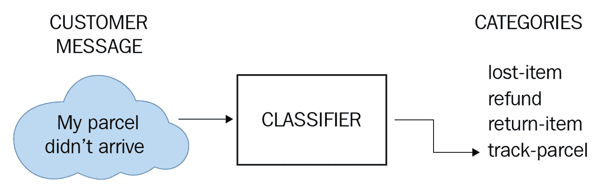
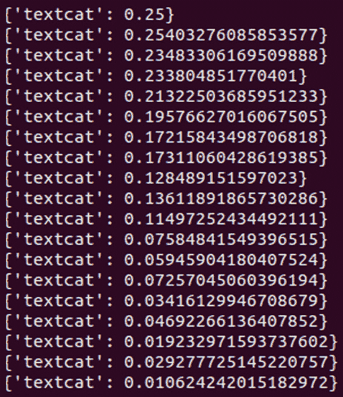
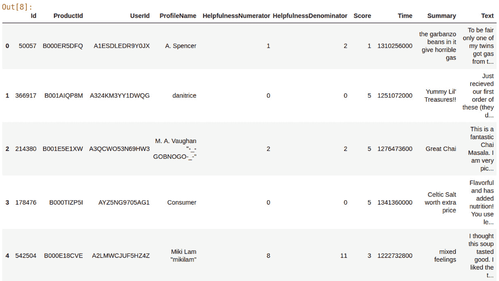
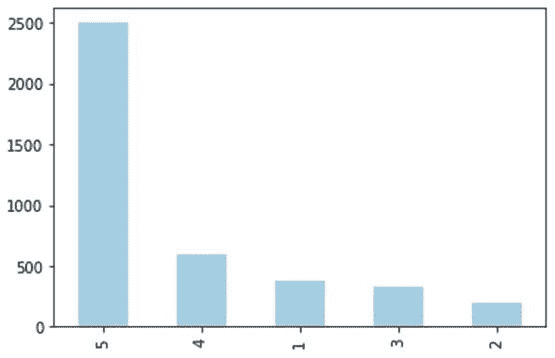
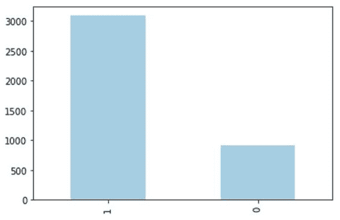
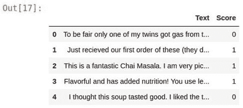
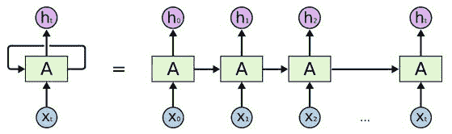
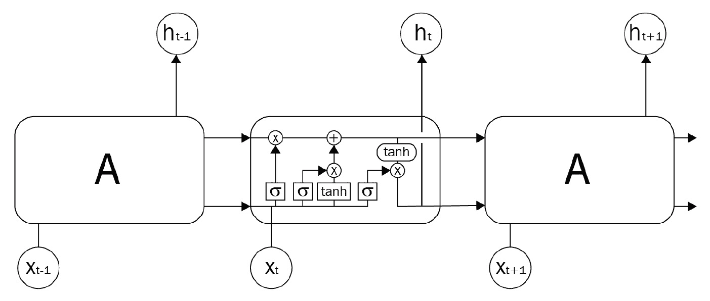
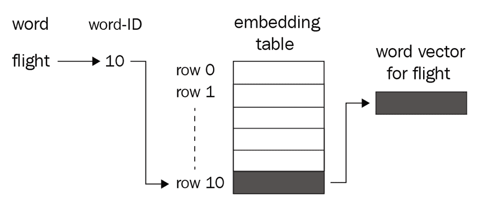
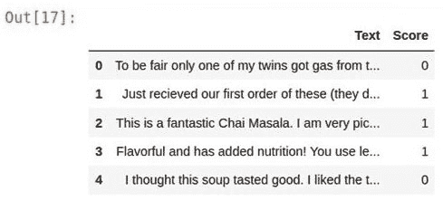

# 第八章：使用 spaCy 进行文本分类

本章致力于一个非常基础且流行的自然语言处理任务：文本分类。您将首先学习如何训练 spaCy 的文本分类组件 `TextCategorizer`。为此，您将学习如何准备数据并将数据输入到分类器中；然后我们将继续训练分类器。您还将在一个流行的情感分析数据集上练习您的 `TextCategorizer` 技能。

接下来，您还将使用流行的框架 TensorFlow 的 Keras API 与 spaCy 一起进行文本分类。您将学习神经网络的基础知识、使用 LSTM 对序列数据进行建模，以及如何使用 Keras 的文本预处理模块准备文本以进行机器学习任务。您还将学习如何使用 `tf.keras` 设计神经网络。

在此之后，我们将进行一个端到端的文本分类实验，从数据准备到使用 Keras `Tokenizer` 预处理文本，再到设计神经网络、模型训练以及解释分类结果。这是一整套机器学习的内容！

在本章中，我们将涵盖以下主要主题：

+   理解文本分类的基础知识

+   训练 spaCy 文本分类器

+   使用 spaCy 进行情感分析

+   使用 spaCy 和 Keras 进行文本分类

# 技术要求

在 *训练 spaCy 文本分类器* 和 *使用 spaCy 进行情感分析* 这两部分的代码与 spaCy v3.0 兼容。

在 *使用 spaCy 和 Keras 进行文本分类* 这一部分中，需要以下 Python 库：

+   TensorFlow >=2.2.0

+   NumPy

+   pandas

+   Matplotlib

您可以使用以下命令使用 `pip` 安装这些库的最新版本：

```py
pip install tensorflow
pip install numpy
pip install pandas
pip install matplotlib
```

我们还在最后两节中使用了 Jupyter 笔记本。您可以根据 Jupyter 网站的说明（[`jupyter.org/install`](https://jupyter.org/install)）将 Jupyter 笔记本安装到您的系统上。如果您不想使用笔记本，也可以将代码复制粘贴为 Python 代码。

您可以在本书的 GitHub 仓库中找到本章的代码和数据文件，网址为 [`github.com/PacktPublishing/Mastering-spaCy/tree/main/Chapter08`](https://github.com/PacktPublishing/Mastering-spaCy/tree/main/Chapter08)。

让我们先从 spaCy 的文本分类组件开始，然后我们将过渡到设计我们自己的神经网络。

# 理解文本分类的基础知识

文本分类是将一组预定义的标签分配给文本的任务。给定一组预定义的类别和一些文本，您想要了解该文本属于哪个预定义类别。在开始分类任务之前，我们必须根据数据的性质自行确定类别。例如，客户评论可以是积极的、消极的或中性的。

文本分类器用于检测邮箱中的垃圾邮件、确定客户评论的情感、理解客户的意图、对客户投诉工单进行分类等等。

文本分类是 NLP 的基本任务。它在商业世界中越来越重要，因为它使企业能够自动化其流程。一个直接的例子是垃圾邮件过滤器。每天，用户都会收到许多垃圾邮件，但大多数时候用户从未看到这些邮件，也没有收到任何通知，因为垃圾邮件过滤器帮助用户免受无关邮件的打扰，并节省了删除这些邮件的时间。

文本分类器可以有不同的类型。一些分类器关注文本的整体情感，一些分类器关注检测文本的语言，还有一些分类器只关注文本中的某些单词，例如动词。以下是一些最常见的文本分类类型及其用例：

+   **主题检测**：主题检测是理解给定文本主题的任务。例如，客户电子邮件中的文本可能是询问退款、请求过去的账单，或者仅仅是抱怨客户服务。

+   **情感分析**：情感分析是理解文本是否包含关于给定主题的积极或消极情绪的任务。情感分析常用于分析产品和服务客户评价。

+   **语言检测**：语言检测是许多 NLP 系统（如机器翻译）的第一步。

下图展示了一个客户服务自动化系统的文本分类器：



图 8.1 – 主题检测用于使用预定义标签标记客户投诉

在技术细节方面，文本分类是一个*监督学习*任务。这意味着分类器可以根据*示例*输入文本-类别标签对来预测文本的类别标签。因此，为了训练文本分类器，我们需要一个*标记数据集*。标记数据集基本上是一系列文本-标签对。以下是一个包含五个训练句子及其标签的示例数据集：

```py
This shampoo is great for hair.
                        POSITIVE
I loved this shampoo, best product ever!
         POSITIVE
My hair has never been better, great product. POSITIVE
This product make my scalp itchy.
                    NEGATIVE
Not the best quality for this price.
                     NEGATIVE
```

然后，我们通过向分类器展示文本和相应的类别标签来训练分类器。当分类器看到训练文本中没有的新文本时，它就会根据训练阶段看到的例子预测这个未见文本的类别标签。文本分类器的输出*总是*一个类别标签。

根据使用的类别数量，文本分类也可以分为三个类别：

+   **二元文本分类**意味着我们希望将文本分类为两个类别。

+   **多类文本分类**意味着存在超过两个类别。每个类别是互斥的——一个文本只能属于一个类别。等价地，一个训练实例只能被标记为一个类别标签。例如，对客户评价进行评级。评价可以有 1，2，3，4 或 5 颗星（每个星级类别是一个类别）。

+   **多标签文本分类**是多类分类的推广，其中可以为每个示例文本分配多个标签。例如，使用多个标签对有毒社交媒体消息进行分类。这样，我们的模型可以区分不同级别的毒性。类标签通常是毒性、严重毒性、侮辱、威胁、淫秽。一条消息可以包含侮辱和威胁，或者被归类为侮辱、毒性和淫秽等。因此，对于这个问题，使用多个类别更合适。

标签是我们希望作为输出看到的类别的名称。一个类标签可以是分类的（字符串）或数字的（一个数字）。以下是一些常用的类标签：

+   对于情感分析，我们通常使用正负类标签。它们的缩写，pos 和 neg，也常被使用。二元类标签也很受欢迎 - 0 表示负面情感，1 表示正面情感。

+   这同样适用于二元分类问题。我们通常用 0-1 作为类标签。

+   对于多类和多标签问题，我们通常用有意义的名称命名类别。对于一个电影类型分类器，我们可以使用家庭、国际、周日晚上、迪士尼、动作等标签。数字也用作标签。对于一个五类分类问题，我们可以使用标签 1、2、3、4 和 5。

现在我们已经涵盖了文本分类的基本概念，让我们来做一些编码！在下一节中，我们将探讨如何训练 spaCy 的文本分类器组件。

# 训练 spaCy 文本分类器

在本节中，我们将了解 spaCy 文本分类器组件 `TextCategorizer` 的详细信息。在 *第二章*，*spaCy 的核心操作* 中，我们了解到 spaCy NLP 管道由组件组成。在 *第三章*，*语言特征* 中，我们学习了 spaCy NLP 管道的核心组件，包括句子分词器、词性标注器、依存句法分析器和 **命名实体识别**（**NER**）。

`TextCategorizer` 是一个可选的可训练管道组件。为了训练它，我们需要提供示例及其类别标签。我们首先将 `TextCategorizer` 添加到 NLP 管道中，然后进行训练过程。*图 8.2* 展示了 `TextCategorizer` 组件在 NLP 管道中的确切位置；该组件位于基本组件之后。在以下图中，`TextCategorizer` 组件。

![Figure 8.2 – TextCategorizer in the nlp pipeline

![img/B16570_8_2.jpg]

Figure 8.2 – TextCategorizer in the nlp pipeline

spaCy 的`TextCategorizer`背后是一个神经网络架构。`TextCategorizer`为我们提供了用户友好的端到端方法来训练分类器，因此我们不必直接处理神经网络架构。在接下来的*使用 spaCy 和 Keras 进行文本分类*部分，我们将设计自己的神经网络架构。在查看架构之后，我们将深入到`TextCategorizer`代码中。首先让我们了解`TextCategorizer`类。

## 了解 TextCategorizer 类

现在让我们详细了解`TextCategorizer`类。首先，我们从管道组件中导入`TextCategorizer`：

```py
from spacy.pipeline.textcat import DEFAULT_SINGLE_TEXTCAT_MODEL
```

`TextCategorizer`有两种形式，单标签分类器和多标签分类器。正如我们在上一节中提到的，多标签分类器可以预测多个类别。单标签分类器对每个示例只预测一个类别，且类别是互斥的。前面的`import`行导入单标签分类器，接下来的代码导入多标签分类器：

```py
from spacy.pipeline.textcat_multilabel import DEFAULT_MULTI_TEXTCAT_MODEL
```

接下来，我们需要为`TextCategorizer`组件提供一个配置。我们在这里提供两个参数，一个阈值值和一个模型名称（根据分类任务，可以是`Single`或`Multi`）。`TextCategorizer`内部为每个类别生成一个概率，如果一个类别的概率高于阈值值，则将该类别分配给文本。

文本分类的传统阈值是`0.5`，然而，如果您想做出更有信心的预测，可以将阈值提高，例如 0.6、0.7 或 0.8。

将所有内容整合起来，我们可以将单标签`TextCategorizer`组件添加到`nlp`管道中，如下所示：

```py
from spacy.pipeline.textcat import DEFAULT_SINGLE_TEXTCAT_MODEL
config = {
   "threshold": 0.5,  
   "model": DEFAULT_SINGLE_TEXTCAT_MODEL
}
textcat = nlp.add_pipe("textcat", config=config)
textcat
<spacy.pipeline.textcat.TextCategorizer object at 0x7f0adf004e08>
```

将多标签组件添加到`nlp`管道中类似：

```py
from spacy.pipeline.textcat_multilabel import
DEFAULT_MULTI_TEXTCAT_MODEL
config = {
   "threshold": 0.5,
   "model": DEFAULT_MULTI_TEXTCAT_MODEL
}
textcat = nlp.add_pipe("textcat_multilabel", config=config)
textcat
<spacy.pipeline.textcat.TextCategorizer object at 0x7f0adf004e08>
```

在前面每个代码块的最后一行，我们向`nlp`管道对象添加了一个`TextCategorizer`管道组件。新创建的`TextCategorizer`组件被`textcat`变量捕获。我们现在可以开始训练`TextCategorizer`组件了。训练代码看起来与*第七章**，自定义 spaCy 模型*中的 NER 组件训练代码非常相似，除了一些细节上的不同。

## 格式化 TextCategorizer 的训练数据

让我们从准备一个小型训练集开始我们的代码。我们将准备一个客户情感数据集用于二元文本分类。标签将称为`sentiment`，可以获取两个可能的值，0 和 1 分别对应负面和正面情感。以下训练集包含 6 个示例，其中 3 个是正面的，3 个是负面的：

```py
train_data = [
    ("I loved this product, very easy to use.", {"cats": {"sentiment": 1}}),
    ("I'll definitely purchase again. I recommend this product.", {"cats": {"sentiment": 1}}),
    ("This is the best product ever. I loved the scent and the feel. Will buy again.", {"cats": {"sentiment": 1}}),
   ("Disappointed. This product didn't work for me at all", {"cats": {"sentiment": 0}}),
   ("I hated the scent. Won't buy again", {"cats": {"sentiment": 0}}),
   ("Truly horrible product. Very few amount of product for a high price. Don't recommend.", {"cats": {"sentiment": 0}})
]
```

每个训练示例都是一个文本和嵌套字典的元组。字典包含 spaCy 能识别的类标签格式。`cts`字段表示类别。然后我们包括类标签的情感及其值。该值始终应该是浮点数。

在代码中，我们将我们选择的类别标签引入到`TextCategorizer`组件中。让我们看看完整的代码。首先，我们进行必要的导入：

```py
import random
import spacy   
from spacy.training import Example
from spacy.pipeline.textcat import DEFAULT_SINGLE_TEXTCAT_MODEL
```

我们导入了内置库`random`来打乱我们的数据集。我们像往常一样导入了`spacy`，并导入了`Example`来准备 spaCy 格式的训练示例。在代码块的最后一行，我们导入了文本分类器模型。

接下来，我们将进行管道和`TextCategorizer`组件的初始化：

```py
nlp = spacy.load("en_core_web_md")
config = {
   "threshold": 0.5,
   "model": DEFAULT_SINGLE_TEXTCAT_MODEL
}
textcat = nlp.add_pipe("textcat", config=config)
```

现在，我们将对新建的`TextCategorizer`组件`textcat`做一些工作。我们将通过调用`add_label`将我们的标签`sentiment`引入到`TextCategorizer`组件中。然后，我们需要用我们的示例初始化这个组件。这一步与我们在*第七章**自定义 spaCy 模型*中 NER 训练代码所做的不一样。

原因是命名实体识别（NER）是一个基本组件，因此管道总是初始化它。`TextCategorizer`是一个可选组件，它作为一个空白统计模型提供。以下代码将我们的标签添加到`TextCategorizer`组件中，然后使用训练示例初始化`TextCategorizer`模型的权重：

```py
textcat.add_label("sentiment")
train_examples = [Example.from_dict(nlp.make_doc(text), label) for text,label in train_data]
textcat.initialize(lambda: train_examples, nlp=nlp)
```

注意，我们将示例作为`Example`对象传递给`textcat.initialize`。回想一下*第七章*，*自定义 spaCy 模型*，spaCy 的训练方法始终与`Example`对象一起工作。

## 定义训练循环

我们准备定义训练循环。首先，我们将禁用其他管道组件，以便只训练`textcat`。其次，我们将通过调用`resume_training`创建一个优化器对象，保留现有统计模型的权重。对于每个 epoch，我们将逐个遍历训练示例并更新`textcat`的权重。我们遍历数据 20 个 epochs。以下代码定义了训练循环：

```py
epochs=20
with nlp.select_pipes(enable="textcat"):
  optimizer = nlp.resume_training()
  for i in range(epochs):
    random.shuffle(train_data)
    for text, label in train_data:
      doc = nlp.make_doc(text)
      example = Example.from_dict(doc, label)
      nlp.update([example], sgd=optimizer)
```

那就是全部了！用这段相对简短的代码片段，我们训练了一个文本分类器！以下是我机器上的输出（你的损失值可能不同）：



图 8.3 – 每个 epoch 的损失值

## 测试新组件

让我们测试新的文本分类器组件。`doc.cats`属性持有类别标签：

```py
doc2 = nlp("This product sucks")
doc2.cats
{'sentiment': 0.09907063841819763}
doc3 = nlp("This product is great")
doc3.cats
{'sentiment': 0.9740120000120339}
```

太棒了！我们的小数据集成功训练了 spaCy 文本分类器，用于二元文本分类问题，确实是一个情感分析任务。现在，我们将看看如何使用 spaCy 的`TextCategorizer`进行多标签分类。

## 为多标签分类训练 TextCategorizer

从第一部分回忆，多标签分类意味着分类器可以为示例文本预测多个标签。自然地，这些类别根本不是互斥的。为了训练一个多标签分类器，我们需要提供一个包含具有多个标签的示例的数据库。

要为多标签分类训练 spaCy 的 `TextCategorizer`，我们再次从构建一个小型训练集开始。这次，我们将形成一组电影评论，标签为 `FAMILY`、`THRILLER` 和 `SUNDAY_EVENING`。以下是我们的小型数据集：

```py
train_data = [
    ("It's the perfect movie for a Sunday evening.", {"cats": {"SUNDAY_EVENING": True}}),
    ("Very good thriller", {"cats": {"THRILLER": True}}),
    ("A great movie for the kids and all the family"  , {"cats": {"FAMILY": True}}),
    ("An ideal movie for Sunday night with all the family. My kids loved the movie.", {"cats": {"FAMILY": True, "SUNDAY_EVENING":True}}),
    ("A perfect thriller for all the family. No violence, no drugs, pure action.", {"cats": {"FAMILY": True, "THRILLER": True}})
]
```

我们提供了一些只有一个标签的示例，例如第一个示例（`train_data` 的第一句话，上一代码块的第二行），我们还提供了具有多个标签的示例，例如 `train_data` 的第四个示例。

我们将在形成训练集之后进行导入：

```py
import random
import spacy   
from spacy.training import Example
from spacy.pipeline.textcat_multilabel import
DEFAULT_MULTI_TEXTCAT_MODEL
```

这里，最后一行与上一节中的代码不同。我们导入了多标签模型而不是单标签模型。

接下来，我们将多标签分类器组件添加到 nlp 管道中。再次注意管道组件的名称——这次是 `textcat_multilabel`，与上一节的 `textcat` 相比：

```py
config = {
   "threshold": 0.5,
   "model": DEFAULT_MULTI_TEXTCAT_MODEL
}
textcat = nlp.add_pipe("textcat_multilabel", config=config)
```

将标签添加到 `TextCategorizer` 组件并初始化模型与 *训练 spaCy 文本分类器* 部分类似。这次，我们将添加三个标签而不是一个：

```py
labels = ["FAMILY", "THRILLER", "SUNDAY_EVENING"]
for label in labels:
  textcat.add_label(label)
train_examples = [Example.from_dict(nlp.make_doc(text), label) for text,label in train_data]
textcat.initialize(lambda: train_examples, nlp=nlp)
```

我们已经准备好定义训练循环。代码函数与上一节的代码类似。唯一的区别是第一行中的组件名称。现在它是 `textcat_multilabel`：

```py
epochs=20
with nlp.select_pipes(enable="textcat_multilabel"): 
  optimizer = nlp.resume_training() 
  for i in range(epochs): 
     random.shuffle(train_data) 
     for text, label in train_data: 
        doc = nlp.make_doc(text) 
        example = Example.from_dict(doc, label) 
        nlp.update([example], sgd=optimizer)
```

输出应该类似于上一节的输出，每个 epoch 的损失值。现在，让我们测试我们全新的多标签分类器：

```py
doc2 = nlp("Definitely in my Sunday movie night list")
doc2.cats
{'FAMILY': 0.9044250249862671, 'THRILLER': 0.34271398186683655, 'SUNDAY_EVENING': 0.9801468253135681}
```

注意到每个标签在输出中都存在一个正概率。而且，这些概率的总和并不等于 1，因为它们不是互斥的。在这个例子中，`SUNDAY_EVENING` 和 `THRILLER` 标签的概率预测是正确的，但 `FAMILY` 标签的概率看起来并不理想。这主要是因为我们没有提供足够的例子。通常，对于多标签分类问题，分类器需要比二分类更多的例子，因为分类器需要学习更多的标签。

我们已经学习了如何训练 spaCy 的 `TextCategorizer` 组件进行二进制文本分类和多标签文本分类。现在，我们将在一个真实世界的数据集上训练 `TextCategorizer` 以进行情感分析问题。

# 使用 spaCy 进行情感分析

在本节中，我们将处理一个真实世界的数据集，并在该数据集上训练 spaCy 的 `TextCategorizer`。在本章中，我们将使用 Kaggle 上的 Amazon Fine Food Reviews 数据集（[`www.kaggle.com/snap/amazon-fine-food-reviews`](https://www.kaggle.com/snap/amazon-fine-food-reviews)）。原始数据集非常大，有 10 万行。我们采样了 4,000 行。这个数据集包含了关于在亚马逊上销售的精致食品的客户评论。评论包括用户和产品信息、用户评分和文本。

您可以从本书的 GitHub 仓库下载数据集。在您的终端中输入以下命令：

```py
wget  https://github.com/PacktPublishing/Mastering-spaCy/blob/main/Chapter08/data/Reviews.zip
```

或者，您可以点击前面的命令中的 URL，下载将开始。您可以使用以下方法解压 zip 文件：

```py
unzip Reviews.zip
```

或者，您可以在 ZIP 文件上右键单击并选择**Extract here**来解压 ZIP 文件。

## 探索数据集

现在，我们已经准备好探索数据集了。在本节中，我们将使用 Jupyter 笔记本。如果您已经安装了 Jupyter，您可以直接执行笔记本单元格。如果您系统上没有 Jupyter Notebook，您可以按照 Jupyter 网站上的说明进行操作（[`jupyter.org/install`](https://jupyter.org/install)）。

让我们一步一步地进行数据集探索：

1.  首先，我们将进行读取和可视化数据集的导入：

    ```py
    import pandas as pd
    import matplotlib.pyplot as plt
    %matplotlib inline
    ```

1.  我们将读取 CSV 文件到 pandas DataFrame 中，并输出 DataFrame 的形状：

    ```py
    reviews_df=pd.read_csv('data/Reviews.csv')
    reviews_df.shape
    (3999, 10)
    ```

1.  接下来，我们通过打印前 10 行来检查数据集的行和列：

    ```py
    reviews_df.head()
    ```

    生成的视图告诉我们有 10 行，包括评论文本和评论评分：

    

    图 8.4 – 评论数据框的前 10 行

1.  我们将使用`Text`和`Score`列；因此，我们将删除其他不会使用的列。我们还将调用`dropna()`方法来删除包含缺失值的行::

    ```py
    reviews_df = reviews_df[['Text','Score']].dropna()
    ```

1.  我们可以快速查看评论评分的分布：

    ```py
    ax=reviews_df.Score.value_counts().plot(kind='bar', colormap='Paired')
    plt.show()
    ```

1.  这段代码调用了`dataframe reviews_df`的`plot`方法，并展示了一个条形图：

    图 8.5 – 评论评分的分布

    5 星评价的数量相当高；看起来顾客对购买的食品很满意。然而，如果一个类别比其他类别有显著更多的权重，这可能会在训练数据中造成不平衡。

    **类别不平衡**通常会给分类算法带来麻烦。例如，当一个类别比其他类别有显著更多的训练示例时，这被认为是不平衡（通常示例之间的比例为 1:5）。处理不平衡的方法有很多，其中一种方法是**上采样**/**下采样**。在下采样中，我们从多数类别随机删除训练示例。在上采样中，我们随机复制少数类别的训练示例。这两种方法的目标都是平衡多数和少数类别的训练示例数量。

    在这里，我们将应用另一种方法。我们将合并 1 星、2 星、3 星评价和 4 星、5 星评价，以获得一个更平衡的数据集。

1.  为了防止这种情况，我们将 1 星、2 星和 3 星评价视为负面评价，而将超过 4 星的评价视为正面评价。以下代码段将所有评分少于 4 星的评论分配为负面标签，将所有评分高于 4 星的评论分配为正面标签：

    ```py
    reviews_df.Score[reviews_df.Score<=3]=0
    reviews_df.Score[reviews_df.Score>=4]=1
    ```

1.  让我们再次绘制评分的分布：

    ```py
    ax=reviews_df.Score.value_counts().plot(kind='bar', colormap='Paired')
    plt.show()
    ```

    结果的评分分布看起来比*图 8.5*好得多。尽管如此，正面评论的数量仍然更多，但负面评论的数量也很显著，如下面的图表所示：



图 8.6 – 正面和负面评分的分布

在处理完数据集后，我们将其缩减为包含负面和正面评分的两列数据集。我们再次调用`reviews_df.head()`，以下是我们得到的结果：



图 8.7 – DataFrame 的前四行

我们在这里结束数据集的探索。我们看到了评论分数和类别标签的分布。现在数据集已经准备好进行处理了。我们删除了未使用的列，并将评论分数转换为二进制类别标签。让我们继续开始训练过程！

## 训练 TextClassifier 组件

现在，我们已经准备好开始训练过程了。这次我们将使用多标签分类器训练一个二进制文本分类器。再次，让我们一步一步来：

1.  我们首先按照以下方式导入 spaCy 类：

    ```py
    import spacy
    import random
    from spacy.training import Example 
    from spacy.pipeline.textcat_multilabel import DEFAULT_MULTI_TEXTCAT_MODEL
    ```

1.  接下来，我们将创建一个 pipeline 对象`nlp`，定义分类器配置，并将`TextCategorizer`组件添加到`nlp`中，配置如下：

    ```py
    nlp = spacy.load("en_core_web_md") 
     config = { 
       "threshold": 0.5, 
       "model": DEFAULT_MULTI_TEXTCAT_MODEL 
    } 
    textcat = nlp.add_pipe("textcat_multilabel", config=config)
    ```

1.  在创建文本分类器组件后，我们将训练句子和评分转换为 spaCy 可用的格式。我们将使用`iterrows()`遍历 DataFrame 的每一行，对于每一行，我们将提取`Text`和`Score`字段。然后，我们将从评论文本创建一个 spaCy `Doc`对象，并创建一个包含类别标签的字典。最后，我们将创建一个`Example`对象并将其追加到训练示例列表中：

    ```py
    train_examples = []
    for index, row in reviews_df.iterrows():
        text = row["Text"]
        rating = row["Score"]
        label = {"POS": True, "NEG": False} if rating == 1 else {"NEG": True, "POS": False}
        train_examples.append(Example.from_dict(nlp.make_doc(text), {"cats": label}))    
    ```

1.  我们将使用`POS`和`NEG`标签分别表示正面和负面情感。我们将这些标签引入新组件，并用示例初始化该组件：

    ```py
    textcat.add_label("POS")
    textcat.add_label("NEG")
    textcat.initialize(lambda: train_examples, nlp=nlp)
    ```

1.  我们已经准备好定义训练循环了！我们遍历了训练集两个 epoch，但如果你愿意，可以遍历更多。以下代码片段将训练新的文本分类器组件：

    ```py
    epochs = 2
    with nlp.select_pipes(enable="textcat_multilabel"): 
      optimizer = nlp.resume_training()
      for i in range(epochs): 
        random.shuffle(train_examples) 
        for example in train_examples: 
          nlp.update([example], sgd=optimizer)
    ```

1.  最后，我们将测试文本分类器组件对两个示例句子的处理效果：

    ```py
    doc2 = nlp("This is the best food I ever ate")
    doc2.cats
    {'POS': 0.9553419947624207, 'NEG': 0.061326123774051666}
    doc3 = nlp("This food is so bad")
    doc3.cats
    {'POS': 0.21204468607902527, 'NEG': 0.8010350465774536}
    ```

由于我们使用了多标签分类器，`NEG`和`POS`标签都出现在预测结果中。结果看起来不错。第一句话输出了一个非常高的正面概率，第二句话则被预测为负面，概率也很高。

我们已经完成了 spaCy 文本分类器组件的训练。在下一节中，我们将深入探讨一个非常流行的深度学习库 Keras 的世界。我们将探索如何使用另一个流行的机器学习库——TensorFlow 的 Keras API 来编写 Keras 代码进行文本分类。让我们继续探索 Keras 和 TensorFlow！

# 使用 spaCy 和 Keras 进行文本分类

在本节中，我们将学习如何使用另一个非常流行的 Python 深度学习库**TensorFlow**及其高级 API**Keras**来将 spaCy 与神经网络结合使用。

**深度学习**是一系列基于神经网络的机器学习算法的统称。**神经网络**是受人类大脑启发的算法，包含相互连接的层，这些层由神经元组成。每个神经元都是一个数学运算，它接收输入，将其与其权重相乘，然后将总和通过激活函数传递给其他神经元。以下图表展示了一个具有三层结构的神经网络架构——**输入层**、**隐藏层**和**输出层**：

![图 8.8 – 具有三层的神经网络架构]

![img/B16570_8_8.jpg]

图 8.8 – 具有三层的神经网络架构

**TensorFlow**是一个端到端的开源机器学习平台。TensorFlow 可能是研究工程师和科学家中最受欢迎的深度学习库。它拥有庞大的社区支持和优秀的文档，可在[`www.tensorflow.org/`](https://www.tensorflow.org/)找到。

**Keras**是一个高级深度学习 API，可以在 TensorFlow、Theano 和 CNTK 等流行的机器学习库之上运行。Keras 在研发领域非常受欢迎，因为它支持快速原型设计和提供了一个用户友好的 API 来构建神经网络架构。

**TensorFlow 2**通过紧密集成 Keras 并提供高级 API**tf.keras**，在机器学习方法上引入了重大变化。TensorFlow 1 在符号图计算和其他低级计算方面有些丑陋。随着 TensorFlow 2 的推出，开发者可以利用 Keras 的用户友好性以及 TensorFlow 的低级方法。

神经网络通常用于计算机视觉和 NLP 任务，包括目标检测、图像分类、场景理解以及文本分类、词性标注、文本摘要和自然语言生成。

在接下来的章节中，我们将详细介绍使用`tf.keras`实现的文本分类神经网络架构的细节。在整个本节中，我们将使用我们在*技术要求*部分中提到的 TensorFlow 2。让我们从一些神经网络基础知识开始，然后开始构建我们的 Keras 代码。

## 什么是层？

神经网络是通过连接层形成的。**层**基本上是神经网络的构建块。一个层由几个**神经元**组成，如*图 8.8*所示。

在*图 8.8*中，这个神经网络的第一层有两个子层，第二层有六个神经元。每个子层中的每个神经元都与下一层的所有神经元相连。每个子层可能具有不同的功能；有些子层可以降低其输入的维度，有些子层可以将输入展平（展平意味着将多维向量折叠成一维），等等。在每一层，我们转换输入向量并将它们传递给下一层以获得最终向量。

Keras 提供了不同类型的层，例如输入层、密集层、dropout 层、嵌入层、激活层、循环层等等。让我们逐一了解一些有用的层：

+   **输入层**：输入层负责将我们的输入数据发送到网络的其余部分。在初始化输入层时，我们提供输入数据形状。

+   **密集层**：密集层将给定形状的输入转换为所需的输出形状。*图 8.8*中的层 2 代表一个密集层，它将 5 维输入折叠成 1 维输出。

+   **循环层**：Keras 为 RNN、GRU 和 LSTM 单元提供了强大的支持。如果您对 RNN 变体完全不熟悉，请参阅*技术要求*部分中的资源。在我们的代码中，我们将使用 LSTM 层。*LSTM 层*小节包含输入和输出形状信息。在下一小节*使用 LSTMs 进行序列建模*中，我们将深入了解使用 LSTMs 进行建模的细节。

+   **Dropout 层**：Dropout 是一种防止过拟合的技术。当神经网络记住数据而不是学习数据时，就会发生过拟合。Dropout 层随机选择一定数量的神经元，并在正向和反向传递中（即在一次迭代中）将它们的权重设置为零。我们通常在密集层之后放置 dropout 层。

这些是在 NLP 模型中使用的基本层。下一小节将致力于使用 LSTMs 建模序列数据，这是 NLP 统计建模的核心。

## 使用 LSTMs 进行序列建模

**LSTM**是一种 RNN 变体。**RNNs**是特殊的神经网络，可以按步骤处理序列数据。在通常的神经网络中，我们假设所有输入和输出都是相互独立的。当然，对于文本数据来说，这并不正确。每个单词的存在都依赖于相邻的单词。

例如，在机器翻译任务中，我们通过考虑之前预测的所有单词来预测一个单词。RNN 通过保持一个`i`来捕获关于过去序列元素的信息，我们输入单词`xi`，RNN 为这个时间步输出一个值，`hi`：




图 8.9 – RNN 示意图，摘自 Colah 关于 LSTMs 的著名博客

LSTM 是为了解决 RNN 的一些计算问题而发明的。RNN 存在着在序列中忘记一些数据的问题，以及由于链式乘法导致的数值稳定性问题，称为 **梯度消失和梯度爆炸**。如果您感兴趣，可以参考 Colah 的博客，您将在 *参考文献* 部分找到链接。

LSTM 单元比 RNN 单元稍微复杂一些，但计算逻辑是相同的：我们在每个时间步输入一个输入单词，LSTM 在每个时间步输出一个输出值。以下图显示了 LSTM 单元内部的情况。请注意，输入步骤和输出步骤与 RNN 的对应步骤相同：



图 8.10 – 来自 Colah 的 LSTM 博文文章的 LSTM 插图

Keras 对 RNN 变体 GRU 和 LSTM 提供了广泛的支持，同时还有一个简单的 API 用于训练 RNN。RNN 变体对于 NLP 任务至关重要，因为语言数据的本质是序列性的：文本是一系列单词，语音是一系列声音，等等。

现在我们已经学会了在我们的设计中使用哪种类型的统计模型，我们可以转向一个更实际的主题：如何表示单词序列。在下一节中，我们将学习如何使用 Keras 的预处理模块将单词序列转换为单词 ID 序列，并同时构建词汇表。

## Keras Tokenizer

正如我们在上一节中提到的，文本是序列数据（单词或字符的序列）。我们将句子作为单词序列输入。神经网络只能处理向量，因此我们需要一种将单词向量化的方法。在*第五章*，“使用单词向量和语义相似性”，我们看到了如何使用单词向量来向量化单词。单词向量是单词的连续表示。为了向量化一个单词，我们遵循以下步骤：

1.  我们将每个句子进行分词，并将句子转换成单词序列。

1.  我们从 *步骤 1* 中出现的单词集合创建一个词汇表。这些是我们神经网络设计中应该被识别的单词。

1.  创建词汇表应该为每个单词分配一个 ID。

1.  然后将单词 ID 映射到单词向量。

让我们看看一个简短的例子。我们可以处理一个小型语料库中的三个句子：

```py
data = [
"Tomorrow I will visit the hospital.",
"Yesterday I took a flight to Athens.",
"Sally visited Harry and his dog."
]
```

让我们先对单词进行分词成句子：

```py
import spacy
nlp = spacy.load("en_core_web_md")
sentences = [[token.text for token in nlp(sentence)] for sentence in data]
for sentence in sentences:
    sentence
... 
['Tomorrow', 'I', 'will', 'visit', 'the', 'hospital', '.']
['Yesterday', 'I', 'took', 'a', 'flight', 'to', 'Athens', '.']
['Sally', 'visited', 'Harry', 'and', 'his', 'dog', '.']
```

在前面的代码中，我们遍历了由调用 `nlp(sentence)` 生成的 Doc 对象的所有标记。请注意，我们没有过滤掉标点符号。过滤标点符号取决于任务。例如，在情感分析中，标点符号如 "!" 与结果相关。在这个例子中，我们将保留标点符号。

Keras 的文本预处理模块使用 `Tokenizer` 类创建词汇表，并将 `trn` 单词序列转换为单词-ID 序列。以下代码段展示了如何使用 `Tokenizer` 对象：

```py
from tensorflow.keras.preprocessing.text import Tokenizer
tokenizer = Tokenizer(lower=True)  
tokenizer.fit_on_texts(data)
tokenizer
<keras_preprocessing.text.Tokenizer object at 0x7f89e9d2d9e8>
tokenizer.word_index
{'i': 1, 'tomorrow': 2, 'will': 3, 'visit': 4, 'the': 5, 'hospital': 6, 'yesterday': 7, 'took': 8, 'a': 9, 'flight': 10, 'to': 11, 'athens': 12, 'sally': 13, 'visited': 14, 'harry': 15, 'and': 16, 'his': 17, 'dog': 18}
```

我们做了以下事情：

1.  我们从 Keras 文本预处理模块导入了 `Tokenizer`。

1.  我们使用参数 `lower=True` 创建了一个 `tokenizer` 对象，这意味着 `tokenizer` 在构建词汇表时应该将所有单词转换为小写。

1.  我们在 `data` 上调用 `tokenizer.fit_on_texts` 来构建词汇表。`fit_on_text` 在单词序列上工作；输入始终应为单词的列表。

1.  我们通过打印 `tokenizer.word_index` 来检查词汇表。`Word_index` 基本上是一个字典，其中键是词汇表中的单词，值是单词-ID。

为了获取一个单词的单词-ID，我们调用 `tokenizer.texts_to_sequences`。请注意，此方法的输入始终应为列表，即使我们只想输入一个单词。在下面的代码段中，我们将一个单词输入作为一个列表（注意列表括号）：

```py
tokenizer.texts_to_sequences(["hospital"])
[[6]]
tokenizer.texts_to_sequences(["hospital", "took"])
[[6], [8]]
```

`texts_to_sequences` 的逆操作是 `sequences_to_texts`。`sequences_to_texts` 方法将输入一个列表的列表，并返回相应的单词序列：

```py
tokenizer.sequences_to_texts([[3,2,1]])
['will tomorrow i']
tokenizer.sequences_to_texts([[3,2,1], [5,6,10]])
['will tomorrow i', 'the hospital flight']
```

我们还注意到，单词-ID 从 `1` 开始，而不是 `0`。`0` 是一个保留值，具有特殊含义，表示填充值。Keras 无法处理不同长度的句子，因此我们需要将较短的句子填充到最长句子的长度。我们将数据集中的每个句子填充到最大长度，通过在句子的开始或末尾添加填充单词来实现。Keras 插入 `0` 作为填充，这意味着它不是一个真正的单词，而是一个填充值。让我们用一个简单的例子来理解填充：

```py
from tensorflow.keras.preprocessing.sequence import pad_sequences
sequences = [[7], [8,1], [9,11,12,14]]
MAX_LEN=4
pad_sequences(sequences, MAX_LEN, padding="post")
array([[ 7,  0,  0,  0],
          [ 8,  1,  0,  0],
          [ 9, 11, 12, 14]], dtype=int32)
pad_sequences(sequences, MAX_LEN, padding="pre")
array([[ 0,  0,  0,  7],
          [ 0,  0,  8,  1],
          [ 9, 11, 12, 14]], dtype=int32)
```

我们的序列长度为 1、2 和 4。我们对这个序列列表调用了 `pad_sequences`，每个序列都被填充为零，使其长度达到 `MAX_LEN=4`，即最长序列的长度。我们可以使用 `post` 和 `pre` 选项从右或左填充序列。在先前的代码中，我们使用 `post` 选项填充我们的句子，因此句子是从右向左填充的。

如果我们将所有这些放在一起，完整的文本预处理步骤如下：

```py
from tensorflow.keras.preprocessing.text import Tokenizer
from tensorflow.keras.preprocessing.sequence import pad_sequences
tokenizer = Tokenizer(lower=True)
tokenizer.fit_on_texts(data)
seqs = tokenizer.texts_to_sequences(data)
MAX_LEN=7
padded_seqs = pad_sequences(seqs, MAX_LEN, padding="post")
padded_seqs
array([[ 2,  1,  3,  4,  5,  6,  0],
          [ 7,  1,  8,  9, 10, 11, 12],
          [13, 14, 15, 16, 17, 18,  0]], dtype=int32)
```

现在，我们已经将句子转换成了单词-ID 的序列。我们离将单词向量化又近了一步。在下一个小节中，我们将最终将单词转换成向量。然后我们的句子就可以输入到神经网络中了。

## 嵌入单词

我们准备好将单词转换成单词向量了。将单词嵌入到向量中是通过嵌入表来实现的。嵌入表基本上是一个查找表。每一行都包含一个单词的单词向量。我们通过单词-ID 来索引行，因此获取一个单词的单词向量的流程如下：

1.  `Tokenizer`。`Tokenizer` 包含所有词汇，并将每个词汇映射到一个 ID，这是一个整数。

1.  **单词-ID->单词向量**：单词-ID 是一个整数，因此可以用作嵌入表行的索引。每个单词-ID 对应一行，当我们想要获取一个单词的单词向量时，我们首先获取其单词-ID，然后在嵌入表行中使用此单词-ID 进行查找。

以下图表显示了将单词嵌入到词向量中的工作方式：




图 8.11 – 使用 Keras 将单词转换为单词向量的步骤

记住，在前一个部分中，我们从一个句子列表开始。然后我们做了以下几步：

1.  我们将每个句子分解成单词，并使用 Keras 的`Tokenizer`构建一个词汇表。

1.  `Tokenizer`对象包含一个单词索引，这是一个**单词->单词-ID**映射。

1.  在获得单词-ID 之后，我们可以通过这个单词-ID 查找嵌入表中的行，并获取一个单词向量。

1.  最后，我们将这个单词向量馈送到神经网络中。

训练神经网络并不容易。我们必须采取几个步骤将句子转换为向量。在这些初步步骤之后，我们就准备好设计神经网络架构并进行模型训练了。

## 文本分类的神经网络架构

在本节中，我们将为我们的文本分类器设计神经网络架构。我们将遵循以下步骤来训练分类器：

1.  首先，我们将对评论句子进行预处理、标记化和填充。在此步骤之后，我们将获得一个序列列表。

1.  我们将通过输入层将这个序列列表馈送到神经网络中。

1.  接下来，我们将通过查找嵌入层中的单词 ID 来向量化每个单词。在这个时候，一个句子现在是一个单词向量的序列，每个单词向量对应一个单词。

1.  之后，我们将把单词向量序列馈送到 LSTM 中。

1.  最后，我们将使用 sigmoid 层压缩 LSTM 输出以获得类概率。

让我们从再次记住数据集开始。

### 数据集

我们将使用与*使用 spaCy 进行情感分析*部分相同的亚马逊美食评论数据集。在那个部分中，我们已经使用 pandas 处理了数据集，并将其减少到两列和二进制标签。以下是`reviews_df`数据集的显示方式：




图 8.12 – `reviews_df.head()`的结果

我们将对数据集进行一些转换。我们将从每个数据集行中提取评论文本和评论标签，并将它们附加到 Python 列表中：

```py
train_examples = []
labels = []
for index, row in reviews_df.iterrows():
    text = row["Text"]
    rating = row["Score"]
    labels.append(rating)
    tokens = [token.text for token in nlp(text)]
    train_examples.append(tokens)    
```

注意，我们将一个单词列表附加到`train_examples`中，因此这个列表的每个元素都是一个单词列表。接下来，我们将调用 Keras 的`Tokenizer`对这个单词列表进行操作以构建我们的词汇表。

### 数据和词汇准备

我们已经处理了我们的数据集，因此我们准备好对数据集句子进行标记化并创建词汇表。让我们一步一步来：

1.  首先，我们将进行必要的导入：

    ```py
    from tensorflow.keras.preprocessing.text import Tokenizer
    from tensorflow.keras.preprocessing.sequence import pad_sequences
    import numpy as np
    ```

1.  我们准备好将`Tokenizer`对象拟合到我们的单词列表。首先，我们将拟合`Tokenizer`，然后我们将通过调用`texts_to_sequences`将单词转换为它们的 ID：

    ```py
    tokenizer = Tokenizer(lower=True)
    tokenizer.fit_on_texts(train_examples)
    sequences = tokenizer.texts_to_sequences(train_examples)
    ```

1.  然后，我们将短序列填充到最大长度为`50`（我们选择了这个数字）。同时，这将截断长评论到`50`个单词的长度：

    ```py
    MAX_LEN = 50
    X = pad_sequences(sequences, MAX_LEN, padding="post")
    ```

1.  现在`X`是一个包含`50`个单词的序列列表。最后，我们将这个评论列表和标签转换为`numpy`数组：

    ```py
    X = np.array(X)
    y = np.array(labels)
    ```

到目前为止，我们已经准备好将数据输入到我们的神经网络中。我们将数据输入到输入层。对于所有必要的导入，请参考我们 GitHub 仓库中本节的工作簿：[`github.com/PacktPublishing/Mastering-spaCy/blob/main/Chapter08/Keras_train.ipynb`](https://github.com/PacktPublishing/Mastering-spaCy/blob/main/Chapter08/Keras_train.ipynb)。

注意，我们没有进行任何词形还原/词干提取或停用词去除。这完全没问题，实际上这是与神经网络算法一起使用的标准方式，因为具有相同词根的单词（如 liked、liking、like）将获得相似的词向量（回想一下*第五章**，处理词向量和语义相似性*，相似单词获得相似的词向量）。此外，停用词在不同的上下文中频繁出现，因此神经网络可以推断出这些单词只是语言中的常见单词，并不携带太多重要性。

### 输入层

以下代码块定义了我们的输入层：

```py
sentence_input = Input(shape=(None,))
```

不要被`None`作为输入形状所困惑。在这里，`None`表示这个维度可以是任何标量数，因此，当我们想要 Keras 推断输入形状时，我们使用这个表达式。

### 嵌入层

我们如下定义嵌入层：

```py
embedding =  Embedding(\
input_dim = len(tokenizer.word_index)+1,\
output_dim = 100)(sentence_input)
```

在定义嵌入层时，输入维度应该是词汇表中的单词数量（在这里，由于索引从`1`开始而不是`0`，所以有一个加号`+1`。索引`0`是为填充值保留的）。

在这里，我们选择了输出形状为`100`，因此词汇表单词的词向量将是`100`维度的。根据任务的复杂度，常见的词向量维度是`50`、`100`和`200`。

### LSTM 层

我们将词向量输入到我们的 LSTM 中：

```py
LSTM_layer = LSTM(units=256)(embedding)
```

在这里，`units`参数表示隐藏状态的维度。由于 LSTM 架构，LSTM 输出形状和隐藏状态形状是相同的。在这里，我们的 LSTM 层将输出一个`256`维度的向量。

### 输出层

我们从 LSTM 层获得了一个`256`维度的向量，并希望将其压缩成一个`1`维度的向量（这个向量的可能值是`0`和`1`，它们是类别标签）：

```py
output_dense = Dense(1, activation='sigmoid')(LSTM_layer)
```

我们使用了 sigmoid 函数来压缩值。sigmoid 函数是一个 S 形函数，将输入映射到[0-1]的范围内。你可以在[`deepai.org/machine-learning-glossary-and-terms/sigmoid-function`](https://deepai.org/machine-learning-glossary-and-terms/sigmoid-function)了解更多关于这个函数的信息。

### 编译模型

在定义模型后，我们需要使用优化器、损失函数和评估指标来编译它：

```py
model = \
Model(inputs=[sentence_input],outputs=[output_dense])
model.compile(optimizer="adam",loss="binary_crossentropy",\
metrics=["accuracy"])
```

**自适应矩估计**（**ADAM**）是深度学习中的一种流行优化器。它基本上调整神经网络应该学习多快的速度。你可以在这篇博客文章中了解不同的优化器：[`ruder.io/optimizing-gradient-descent/`](https://ruder.io/optimizing-gradient-descent/)。二元交叉熵是用于二元分类任务的损失。Keras 根据任务支持不同的损失函数。你可以在 Keras 网站上找到列表，网址为[`keras.io/api/losses/`](https://keras.io/api/losses/)。

**度量**是我们用来评估模型性能的函数。准确度度量基本上是比较预测标签和真实标签匹配的次数。支持的度量列表可以在 Keras 的文档中找到（[`keras.io/api/metrics/`](https://keras.io/api/metrics/))。

### 模型拟合和实验评估

最后，我们将模型拟合到我们的数据上：

```py
model.fit(x=X,
          y=y,
          batch_size=64,
          epochs=5,
          validation_split=0.2)
```

在这里，`x`是训练示例的列表，`y`是标签的列表。我们想要对数据进行 5 次遍历，因此将`epochs`参数设置为`5`。

我们以`64`的批量大小对数据进行`5`次遍历。通常，我们不会一次性将整个数据集放入内存中（由于内存限制），而是将数据集分批提供给分类器，每个批次被称为`batch_size=64`，这意味着我们希望一次性提供 64 个训练句子。

最后，参数`validation_split`用于评估实验。该参数简单地将 20%的数据作为验证集，并在该验证集上验证模型。我们的实验结果准确度为 0.795，对于这样一个基本的神经网络设计来说相当不错。

我们鼓励你进行更多实验。你可以通过在不同位置（如嵌入层之后或 LSTM 层之后）放置 dropout 层来更多地实验代码。另一种实验方法是尝试不同的嵌入维度值，例如 50、150 和 200，并观察准确度的变化。同样适用于 LSTM 层的隐藏维度——你可以用不同的值而不是 256 来实验。

在本节中，我们使用`tf.keras`完成了训练，并结束了本章。Keras 是一个伟大、高效且用户友好的深度学习 API；spaCy 和 Keras 的组合特别强大。文本分类是 NLP 的一个基本任务，我们发现了如何使用 spaCy 来完成这个任务。

# 摘要

我们完成了关于一个非常热门的 NLP 主题——文本分类——的章节。在本章中，你首先了解了文本分类的概念，如二元分类、多标签分类和多类分类。接下来，你学习了如何训练`TextCategorizer`，spaCy 的文本分类组件。你学习了如何将你的数据转换为 spaCy 训练格式，然后使用这些数据训练`TextCategorizer`组件。

在使用 spaCy 的`TextCategorizer`学习文本分类后，在最后一节中，你学习了如何结合 spaCy 代码和 Keras 代码。首先，你学习了神经网络的基础知识，包括一些实用的层，如密集层、dropout 层、嵌入层和循环层。然后，你学习了如何使用 Keras 的`Tokenizer`进行数据分词和预处理。

你快速回顾了使用 LSTMs 进行序列建模，以及从*第五章*，“处理词向量与语义相似性”，回顾词向量，以更好地理解嵌入层。最后，你通过`tf.keras`代码进行了神经网络设计。你学习了如何使用 LSTM 设计和评估一个统计实验。

看起来有很多！确实，这是一堆材料；如果需要时间消化，请不要担心。练习文本分类可能会很紧张，但最终，你将获得关键的 NLP 技能。

下一章将再次介绍一项全新的技术：**transformers**。在下一章中，我们将探讨如何仅用几行代码设计高精度的 NLP 管道。让我们进入下一章，看看 transformers 能为你的 NLP 技能带来什么！

# 参考文献

如果你熟悉神经网络，特别是 RNN 变体，这将是有益的但不是强制性的。以下是一些关于神经网络的优秀材料：

+   免费在线书籍：*神经网络与深度学习* ([`neuralnetworksanddeeplearning.com/`](http://neuralnetworksanddeeplearning.com/))

+   视频教程：[`www.youtube.com/watch?v=ob1yS9g-Zcs`](https://www.youtube.com/watch?v=ob1yS9g-Zcs)

RNN 变体，特别是 LSTMs，也有很好的教程：

+   WildML 博客上的 RNN 教程：[`www.wildml.com/2015/09/recurrent-neural-networks-tutorial-part-1-introduction-to-rnns/`](http://www.wildml.com/2015/09/recurrent-neural-networks-tutorial-part-1-introduction-to-rnns/)

+   多伦多大学 RNN 教程：[`www.cs.toronto.edu/~tingwuwang/rnn_tutorial.pdf`](https://www.cs.toronto.edu/~tingwuwang/rnn_tutorial.pdf)

+   Colah 的博客：[`colah.github.io/posts/2015-08-Understanding-LSTMs/`](https://colah.github.io/posts/2015-08-Understanding-LSTMs/)

+   Michael Phi 的博客文章：[`towardsdatascience.com/illustrated-guide-to-lstms-and-gru-s-a-step-by-step-explanation-44e9eb85bf21`](https://towardsdatascience.com/illustrated-guide-to-lstms-and-gru-s-a-step-by-step-explanation-44e9eb85bf21)

+   视频教程：[`www.youtube.com/watch?v=lWkFhVq9-nc`](https://www.youtube.com/watch?v=lWkFhVq9-nc)

尽管我们在本章介绍了神经网络，但你仍然可以阅读这些参考文献，以了解更多关于神经网络如何工作的信息。在*第十章*，“将一切整合：使用 spaCy 设计你的聊天机器人”，将会有更多关于神经网络和 LSTM 概念的说明。
