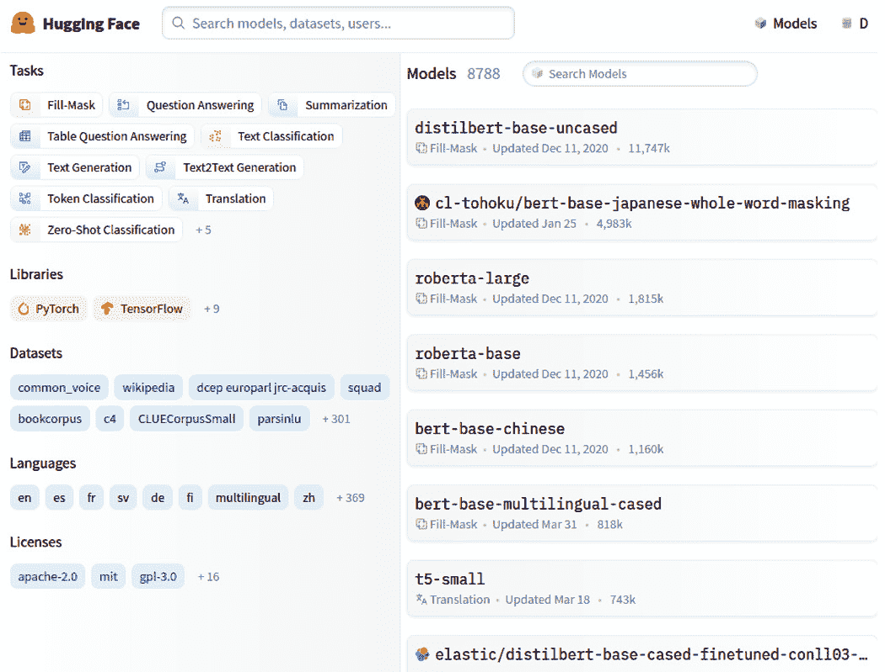
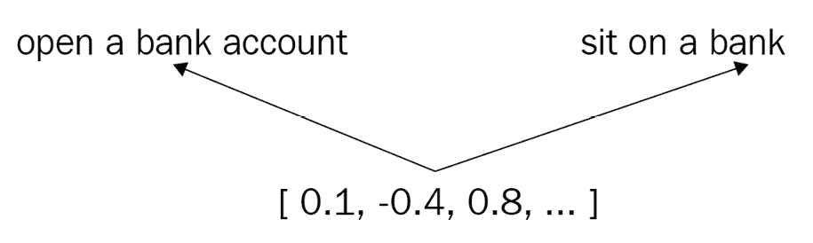
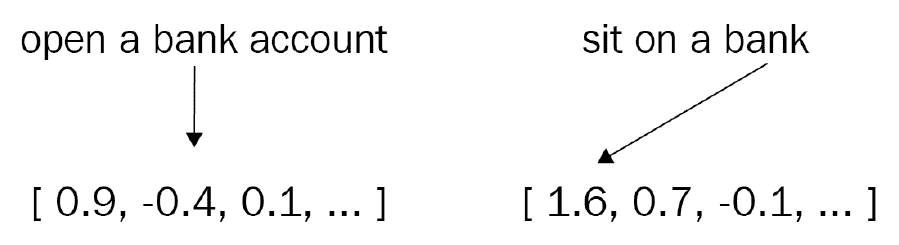
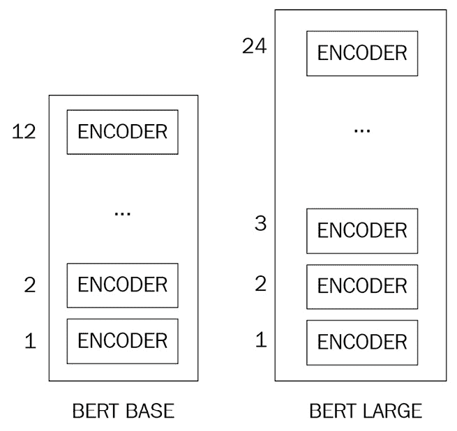
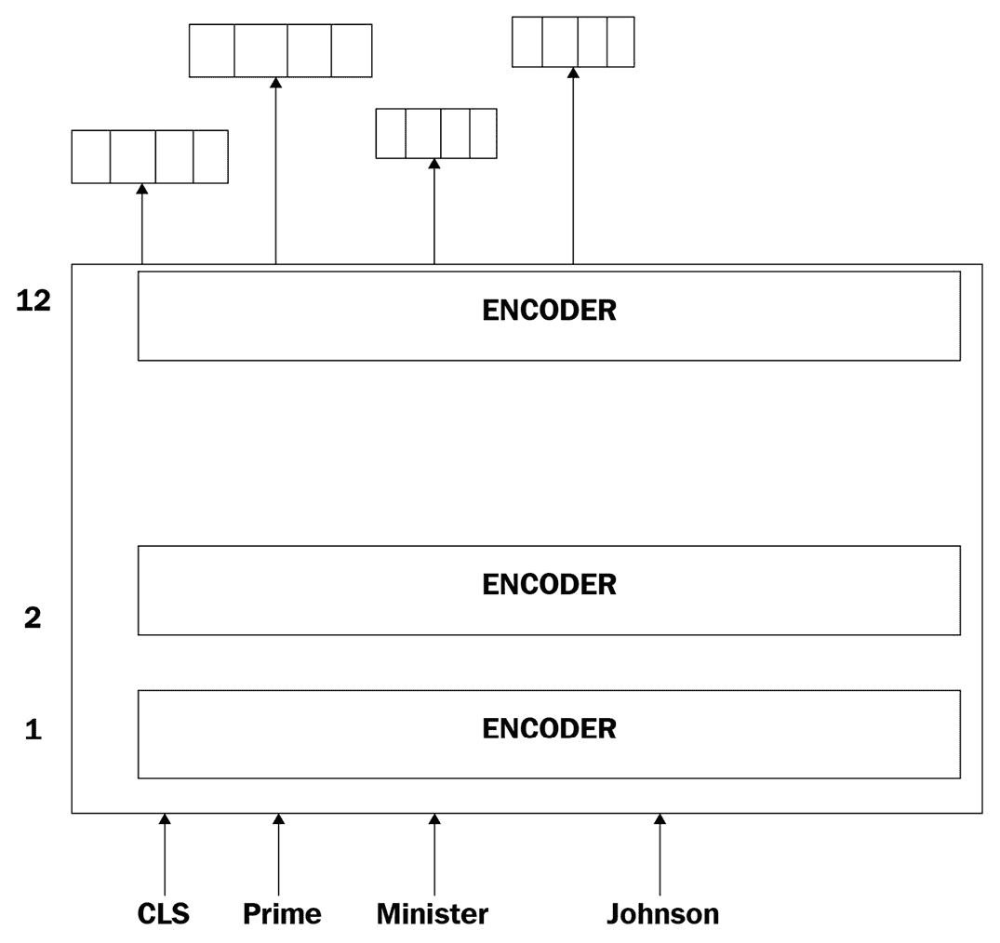
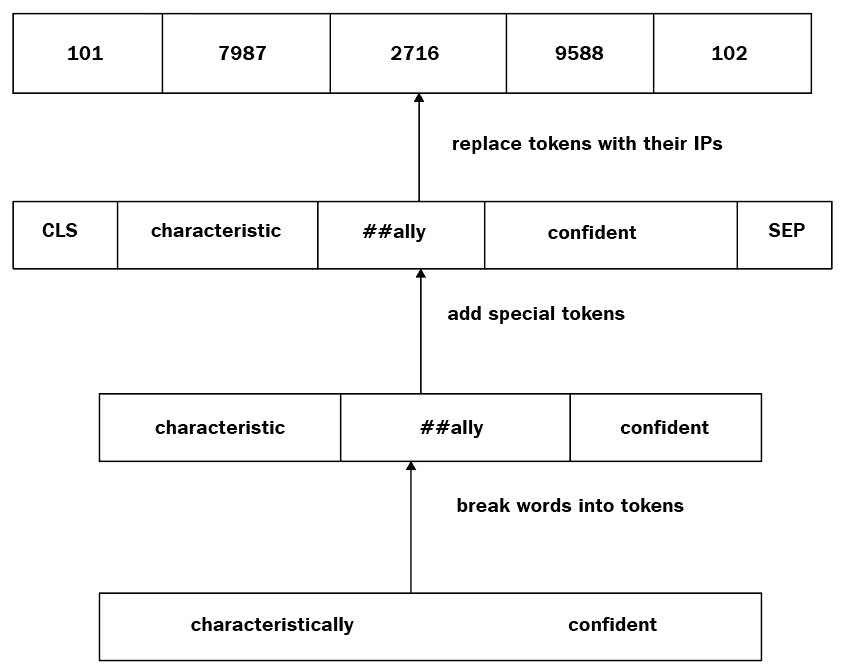
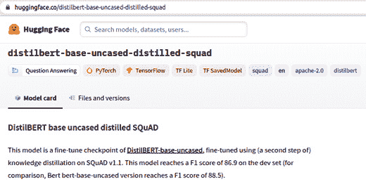
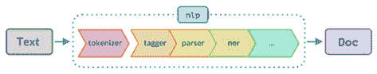
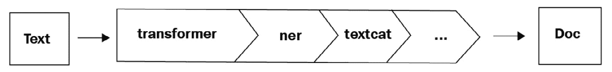
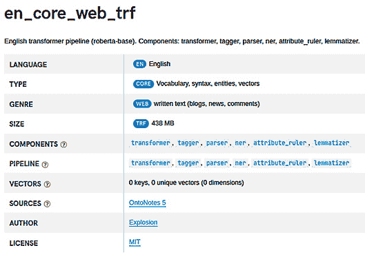

# 第九章：spaCy 和 Transformers

在本章中，你将了解自然语言处理（NLP）的最新热门话题——transformers，以及如何使用 TensorFlow 和 spaCy 来使用它们。

首先，你将了解 transformers 和迁移学习。其次，你将学习常用 Transformer 架构——**双向 Transformer 编码器表示**（**BERT**）的架构细节。你还将了解**BERT 分词器**和**WordPiece**算法是如何工作的。然后，你将学习如何快速开始使用 HuggingFace 库中预训练的 transformers 模型。接下来，你将练习如何使用 TensorFlow 和 Keras 微调 HuggingFace Transformers。最后，你将了解*spaCy v3.0*如何将 transformers 模型作为预训练管道集成。

到本章结束时，你将完成本书的统计自然语言处理（NLP）主题。你将把你在*第八章*“使用 spaCy 进行文本分类”中获得的 Keras 和 TensorFlow 知识与你对 transformers 的知识相结合。你将能够仅用几行代码，借助 Transformer 模型和迁移学习的能力，构建最先进的 NLP 模型。

在本章中，我们将涵盖以下主要主题：

+   Transformers 和迁移学习

+   理解 BERT

+   Transformers 和 TensorFlow

+   Transformers 和 spaCy

# 技术要求

在本章中，我们将使用`transformers`和`tensorflow` Python 库以及`spaCy`。你可以通过`pip`安装这些库：

```py
pip install transformers
pip install "tensorflow>=2.0.0"
```

本章的代码可以在本书的 GitHub 仓库中找到：[`github.com/PacktPublishing/Mastering-spaCy/blob/main/Chapter09`](https://github.com/PacktPublishing/Mastering-spaCy/blob/main/Chapter09)。

# Transformers 和迁移学习

2017 年，随着 Vaswani 等人发表的研究论文《Attention Is All You Need》的发布，自然语言处理（NLP）领域发生了一个里程碑事件（[`arxiv.org/abs/1706.03762`](https://arxiv.org/abs/1706.03762)），该论文介绍了一种全新的机器学习思想和架构——transformers。在 NLP 中的 Transformers 是一个新颖的想法，旨在解决序列建模任务，并针对**长短期记忆**（**LSTM**）架构提出的一些问题（回想一下*第八章*“使用 spaCy 进行文本分类”中的 LSTM 架构）。以下是论文如何解释 transformers 的工作原理：

“Transformer 是第一个完全依赖自注意力来计算其输入和输出表示的转导模型，而不使用序列对齐的 RNN 或卷积。”

在这个上下文中，转导意味着通过将输入单词和句子转换为向量来转换输入单词和句子。通常，一个变压器在像 Wiki 或新闻这样的大型语料库上训练。然后，在我们的下游任务中，我们使用这些向量，因为它们携带有关词义、句子结构和句子语义的信息（我们将在 *Transformers 和 TensorFlow* 部分中看到如何精确地使用这些向量）。

我们已经在 *第五章*，*使用词向量与语义相似性* 中探讨了预训练词向量的想法。Glove 和 FastText 等词向量已经在维基百科语料库上进行了训练，我们直接使用它们进行我们的语义相似性计算。通过这种方式，我们将来自 Wiki 语料库的词义信息导入到我们的语义相似性计算中。从预训练词向量或预训练统计模型中导入知识被称为 **迁移学习**。

Transformers 提供了数千个预训练模型来执行 NLP 任务，例如文本分类、文本摘要、问答、机器翻译以及超过 100 种语言的自然语言生成。Transformers 的目标是使最先进的 NLP 对每个人可访问。

以下截图显示了 HuggingFace 提供的 Transformer 模型列表（我们将在 *HuggingFace Transformers* 部分中了解 HuggingFace Transformers）。每个模型都由架构名称（*Bert、DistilBert* 等）、可能的语言代码（*en*、*de*、*multilingual* 等，如以下截图左侧所示）以及有关模型是否区分大小写的信息（模型区分大小写字符）的组合命名。

此外，在 *图 9.1* 的左侧，我们看到任务名称。每个模型都标有任务名称。我们选择适合我们任务的模型，例如文本分类或机器翻译：



图 9.1 – HuggingFace Transformers 列表，摘自 HuggingFace 网站

要了解变压器的好处，我们首先将回顾来自 *第八章*，*使用 spaCy 进行文本分类* 的 LSTM 架构。在前一章中，我们已经使用 Keras 和 LSTM 架构进入了统计建模的世界。LSTM 在建模文本方面非常出色；然而，它们也有一些缺点：

+   LSTM 架构在处理长文本时有时会遇到学习困难。由于随着时间步的推移，LSTM 可能会忘记之前处理的一些单词，因此在长文本中的统计依赖关系可能难以通过 LSTM 来表示。

+   LSTM 的本质是序列性的。我们每个时间步处理一个单词。显然，并行化学习过程是不可能的；我们必须按顺序处理。不允许并行化造成性能瓶颈。

Transformers 通过完全不使用循环层来解决这些问题。如果我们看一下以下内容，其架构与 LSTM 架构完全不同。Transformer 架构由两部分组成 – 左侧的输入编码器块（称为**编码器**）和右侧的输出解码器块（称为**解码器**）。以下图表取自这篇论文，展示了 Transformer 架构：

![图 9.2 – 来自论文“Attention is All You Need”的 Transformer 架构

![img/B16570_9_2.jpg

图 9.2 – 来自论文“Attention is All You Need”的 Transformer 架构

上述架构是为机器翻译任务发明的；因此，输入是源语言的单词序列，输出是目标语言的单词序列。编码器生成输入单词的向量表示，并将它们传递给解码器（单词向量传递由编码器块指向解码器块的箭头表示）。解码器接收这些输入单词向量，将输出单词转换为单词向量，并最终生成每个输出单词的概率（在*图 9.2*中标为**输出概率**）。

在编码器和解码器块内部，我们看到前馈层，这基本上是我们用于*第八章*中*Text Classification with spaCy*的密集层。Transformer 带来的创新在于**多头注意力**块。该块通过使用自注意力机制为每个单词创建一个密集表示。**自注意力**机制将输入句子中的每个单词与输入句子中的其他单词相关联。每个单词的词嵌入是通过取其他单词嵌入的加权平均来计算的。这样，就可以计算输入句子中每个单词的重要性，因此架构依次关注每个输入单词。

以下图表取自原始论文，并说明了自注意力机制。该图表展示了左侧的输入单词如何关注右侧的输入单词“**it**”。较深的颜色表示相关性更高，因此单词“**the animal**”与“**it**”比句子中的其他单词更相关。这意味着什么？这意味着 Transformer 可以精确地解析这个句子中代词“**it**”所指的内容，即短语“**the animal**”。这是 Transformer 的一个重大成就；它们可以在给定的句子中解析许多语义依赖关系：

。

我们已经看到，有各种各样的转换器架构，根据任务的不同，我们使用不同类型的转换器来完成不同的任务，例如文本分类和机器翻译。在本章的剩余部分，我们将使用一个非常流行的转换器架构——BERT。让我们在下一节中看看 BERT 的架构以及如何在我们的 NLP 应用中使用它。

# 理解 BERT

在本节中，我们将探讨最具有影响力和最常用的转换器模型——BERT。BERT 在这里的谷歌研究论文中介绍：[`arxiv.org/pdf/1810.04805.pdf`](https://arxiv.org/pdf/1810.04805.pdf)。

BERT 究竟做了什么？为了理解 BERT 的输出，让我们剖析一下这个名字：

+   **双向**：在文本数据上的训练是双向的，这意味着每个输入句子都从左到右以及从右到左进行处理。

+   **编码器**：编码器将输入句子进行编码。

+   **表示**：表示是一个词向量。

+   **转换器**：其架构基于转换器。

BERT 本质上是一个经过训练的转换器编码器堆栈。BERT 的输入是一个句子，输出是一系列词向量。这些词向量是上下文相关的，这意味着一个词向量是根据输入句子分配给一个词的。简而言之，BERT 输出**上下文词表示**。

我们在上一节中已经看到了转换器试图解决的问题。转换器解决的另一个问题与词向量有关。在*第五章**，处理词向量和语义相似性*中，我们看到了词向量是无上下文的；一个词的词向量*总是*相同的，不依赖于它所在的句子。以下图表解释了这个问题：



图 9.4 – “bank”这个词的词向量

在这里，尽管这两个句子中的“bank”这个词有两个完全不同的含义，但词向量是相同的，因为 Glove 和 FastText 是**静态的**。每个词只有一个向量，向量在训练后保存到文件中。然后，我们下载这些预训练的向量并将它们加载到我们的应用程序中。

相反，BERT 的词向量是**动态的**。BERT 可以根据输入句子为同一个词生成不同的词向量。以下图表显示了 BERT 生成的词向量，与*图 9.4*中的词向量形成对比：



图 9.5 – BERT 在两个不同语境下为同一单词“bank”生成的两个不同的词向量

BERT 是如何生成这些词向量的？在下一节中，我们将探讨 BERT 架构的细节。

## BERT 架构

正如上一节中已经提到的，BERT 是一个 transformer 编码器堆叠，这意味着几个编码器层堆叠在一起。第一层随机初始化词向量，然后每个编码器层转换前一个编码器层的输出。论文介绍了 BERT 的两个模型大小：BERT Base 和 BERT Large。以下图表展示了 BERT 架构：



图 9.6 – BERT Base 和 Large 架构，分别有 12 和 24 个编码器层

两个 BERT 模型都有大量的编码器层。BERT Base 有 12 个编码器层，BERT Large 有 24 个编码器层。生成的词向量维度也不同；BERT Base 生成 768 大小的词向量，而 BERT Large 生成 1024 大小的词向量。

正如我们在上一节中提到的，BERT 为每个输入单词输出词向量。以下图表展示了 BERT 输入和输出的高级概述（现在暂时忽略 CLS 标记；你将在*BERT 输入格式*部分了解它）：



图 9.7 – BERT 模型输入词和输出词向量

在前面的图表中，我们可以看到 BERT 输入和输出的高级概述。实际上，BERT 输入必须以特殊格式存在，并包括一些特殊标记，如*图 9.7*中的 CLS。在下一节中，你将了解 BERT 输入格式的细节。

## BERT 输入格式

我们已经介绍了 BERT 架构，现在让我们了解如何使用 BERT 生成输出向量。为此，我们将了解 BERT 输入数据格式。BERT 输入格式可以表示一个句子，也可以表示一对句子（对于如问答和语义相似度等任务，我们输入两个句子到模型）作为一个标记序列。

BERT 与`[CLS]`、`[SEP]`和`[PAD]`类一起工作：

+   BERT 的第一个特殊标记是`[CLS]`。每个输入序列的第一个标记必须是`[CLS]`。我们在分类任务中使用此标记作为输入句子的聚合。在非分类任务中，我们忽略此标记。

+   `[SEP]`表示`[CLS]句子[SEP]`，对于两个句子，输入看起来像`[CLS]句子 1[SEP]句子 2[SEP]`。

+   `[PAD]`是一个特殊标记，表示**填充**。回顾前一章，我们使用填充值来使我们的数据集中的句子长度相等。BERT 接收固定长度的句子；因此，我们在将句子输入 BERT 之前对其进行填充。我们可以输入 BERT 的标记最大长度是**512**。

关于分词单词呢？回顾前一小节，我们一次将一个单词输入到我们的 Keras 模型中。我们使用 spaCy 分词器将输入句子分词成单词。BERT 的工作方式略有不同，BERT 使用 WordPiece 分词。一个“词片”字面上是一个单词的一部分。WordPiece 算法将单词分解成几个子词。想法是将复杂/长的标记分解成更简单的标记。例如，单词`playing`被分词为`play`和`##ing`。一个`##`字符放在每个词片之前，表示这个标记不是语言词汇中的单词，而是一个词片。

让我们看看更多的例子：

```py
playing  play, ##ing
played   play, ##ed
going    go, ##ing
vocabulary = [play,go, ##ing, ##ed]
```

这样，我们通过 WordPiece 分组常见的子词更紧凑地表示语言词汇。WordPiece 分词在罕见/未见过的单词上创造了奇迹，因为这些单词被分解成它们的子词。

在对输入句子进行分词并添加特殊标记后，每个标记被转换为它的 ID。之后，作为最后一步，我们将标记 ID 序列输入 BERT。

总结一下，这是我们如何将句子转换为 BERT 输入格式的：



图 9.8 – 将输入句子转换为 BERT 输入格式

BERT 分词器有不同方法来执行之前描述的所有任务，但它还有一个编码方法，将这些步骤合并为单个步骤。我们将在*Transformers 和 TensorFlow*部分详细说明如何使用 BERT 分词器。在那之前，我们将学习用于训练 BERT 的算法。

## BERT 是如何训练的？

BERT 是在一个大型未标记的维基百科语料库和庞大的书籍语料库上训练的。BERT 的创造者在谷歌研究 GitHub 仓库中这样描述了 BERT，[`github.com/google-research/bert`](https://github.com/google-research/bert)，如下所示：

“然后我们在一个大型语料库（维基百科 + BookCorpus）上训练了一个大型模型（12 层到 24 层的 Transformer），长时间（1M 更新步骤），这就是 BERT。”

BERT 使用两种训练方法进行训练，**掩码语言模型**（**MLM**）和**下一句预测**（**NSP**）。让我们首先了解掩码语言模型的细节。

语言模型是预测给定前一个标记序列的下一个标记的任务。例如，给定单词序列“Yesterday I visited”，语言模型可以预测下一个标记为“church”、“hospital”、“school”等中的一个。掩码语言模型略有不同。在这个方法中，我们随机将一定比例的标记用`[MASK]`替换，并期望 MLM（Masked Language Modeling）能够预测被掩码的单词。

BERT 中的掩码语言模型实现如下：首先，随机选择输入标记中的 15 个。然后，发生以下情况：

1.  在选择的标记中，有 80%被替换成了`[MASK]`。

1.  在选择的标记中，有 20%被替换成了词汇表中的另一个标记。

1.  剩余的 10%保持不变。

LMM（Language Modeling Masked）的训练示例句子如下：

```py
[CLS] Yesterday I [MASK] my friend at [MASK] house [SEP] 
```

接下来，我们将探讨其他算法 NSP 的细节。

正如其名所示，NSP（Next Sentence Prediction）是指根据输入句子预测下一个句子的任务。在这个方法中，我们将两个句子输入到 BERT 中，并期望 BERT 能够预测句子的顺序，更具体地说，是第二个句子是否是紧跟在第一个句子之后的句子。

让我们做一个 NSP 的示例输入。我们将使用`[SEP]`标记分隔的两个句子作为输入：

```py
[CLS] A man robbed a [MASK] yesterday [MASK] 8 o'clock [SEP] He [MASK] the bank with 6 million dollars [SEP]
Label = IsNext
```

在这个例子中，第二个句子可以跟在第一个句子后面；因此，预测的标签是`IsNext`。那么这个例子呢：

```py
[CLS] Rabbits like to [MASK] carrots and [MASK] leaves [SEP] [MASK] Schwarzenegger is elected as the governor of [MASK] [SEP]
Label= NotNext
```

这对句子生成了`NotNext`标签，因为很明显它们在上下文或语义上并不相关。

就这样！我们已经了解了 BERT 的架构；我们还学习了 BERT 输入数据格式的细节以及 BERT 是如何被训练的。现在，我们准备好深入 TensorFlow 代码了。在下一节中，我们将看到如何将我们迄今为止所学的内容应用到 TensorFlow 代码中。

# Transformers 和 TensorFlow

在本节中，我们将使用 TensorFlow 深入研究 transformers 代码。许多组织，包括 Google ([`github.com/google-research/bert`](https://github.com/google-research/bert))、Facebook ([`github.com/pytorch/fairseq/blob/master/examples/language_model/README.md`](https://github.com/pytorch/fairseq/blob/master/examples/language_model/README.md))和 HuggingFace ([`github.com/huggingface/transformers`](https://github.com/huggingface/transformers))，都将预训练的 transformer 模型以开源的形式提供给开发者社区。所有列出的组织都提供了预训练模型和良好的接口，以便将 transformers 集成到我们的 Python 代码中。这些接口与 PyTorch 或 TensorFlow 或两者都兼容。

在本章中，我们将使用 HuggingFace 的预训练 transformers 及其 TensorFlow 接口来访问 transformer 模型。HuggingFace 是一家专注于 NLP 的 AI 公司，并且非常致力于开源。在下一节中，我们将更详细地了解 HuggingFace Transformers 中可用的内容。

## HuggingFace Transformers

在第一部分，我们将了解 HuggingFace 的预训练模型，使用这些模型的 TensorFlow 接口，以及一般性的 HuggingFace 模型约定。我们在 *图 9.1* 中看到，HuggingFace 提供了不同种类的模型。每个模型都针对一个任务，如文本分类、问答和序列到序列建模。

以下图表来自 HuggingFace 文档，展示了 distilbert-base-uncased-distilled-squad 模型的详细信息。在文档中，首先在图表的左上角标记了任务（*问答*标签），然后是支持此模型的深度学习库（PyTorch、TensorFlow、TFLite、TFSavedModel），训练所用的数据集（在这个例子中是 squad），模型语言（*en* 表示英语），以及许可证和基础模型名称（在这种情况下是 DistilBERT）。

一些模型使用类似的算法进行训练，因此属于同一个模型家族。以 DistilBERT 家族为例，包括许多模型，如 distilbert-base-uncased 和 distilbert-multilingual-cased。每个模型名称也包含一些信息，例如大小写（模型识别大写/小写差异）或模型语言，如 `en`、`de` 或 `multilingual`：



图 9.9 – distilbert-base-uncased-distilled-squad 模型的文档

我们在上一节中已经详细探讨了 BERT。HuggingFace 文档提供了每个模型家族和单个模型的 API 的详细信息。*图 9.10* 展示了可用的模型列表和 BERT 模型架构变体的列表：


图 9.10 – 左侧列出可用的模型，右侧列出 BERT 模型变体

BERT 模型有多种变体，适用于各种任务，如文本分类、问答和下一句预测。这些模型中的每一个都是通过在 BERT 输出之上添加一些额外的层获得的。回想一下，BERT 输出是输入句子中每个单词的词向量序列。例如，BERTForSequenceClassification 模型是通过在 BERT 词向量之上放置一个密集层（我们在上一章中介绍了密集层）获得的。

在本章的剩余部分，我们将探讨如何使用这些架构中的某些部分来完成我们的任务，以及如何使用 Keras 与 BERT 词向量结合使用。在所有这些任务之前，我们将从基本的分词任务开始，为我们的输入句子做准备。让我们在下一节中查看分词器的代码。

## 使用 BERT 分词器

在*理解 BERT*部分，我们已经看到 BERT 使用 WordPiece 算法进行分词。每个输入单词都被分解成子词。让我们看看如何使用 HuggingFace 库准备我们的输入数据。

以下行展示了分词器的基本用法：

```py
from transformers import BertTokenizer
btokenizer =\
BertTokenizer.from_pretrained('bert-base-uncased')
tokens = btokenizer.tokenize(sentence)
tokens
['he', 'lived', 'characteristic', '##ally', 'idle', 'and', 'romantic', '.']
ids = btokenizer.convert_tokens_to_ids(tokens)
ids
[2002, 2973, 8281, 3973, 18373, 1998, 6298, 1012]
```

在前面的代码块中，我们遵循的步骤如下：

1.  首先，我们导入了`BertTokenizer`。不同的模型有不同的分词器；例如，XLNet 模型的分词器被称为`XLNetTokenizer`。

1.  其次，我们在分词器对象上调用`from_pretrained`方法，并提供了模型名称。请注意，我们不需要手动下载预训练的`bert-base-uncased`模型；此方法会自动下载模型。

1.  然后，我们调用了`tokenize`方法。`tokenize`基本上通过将所有单词分解成子词来分词句子。

1.  我们打印标记以检查子词。单词“he”、“lived”、“idle”等存在于分词器的词汇表中，因此保持不变。“Characteristically”是一个罕见单词，因此不在分词器的词汇表中。然后，分词器将这个单词分解成子词“characteristic”和“##ally”。请注意，“##ally”以“##”字符开头，以强调这是一个单词的一部分。

1.  接下来，我们通过调用`convert_tokens_to_ids`将标记转换为它们的标记 ID。

那么`[CLS]`和`[SEP]`标记呢？在前面的章节中，我们已经看到我们必须在输入句子的开头和结尾添加这两个特殊标记。对于前面的代码，我们需要进行一个额外的步骤，并手动添加我们的特殊标记。我们能否将这些预处理步骤合并为一步呢？答案是肯定的；BERT 提供了一个名为`encode`的方法，它执行以下操作：

+   在输入句子中添加`CLS`和`SEP`标记

+   通过将标记分解成子词来分词句子

+   将标记转换为它们的标记 ID

我们直接在输入句子上调用`encode`方法，如下所示：

```py
from transformers import BertTokenizer
btokenizer =\
BertTokenizer.from_pretrained('bert-base-uncased')
sentence = "He lived characteristically idle and romantic."
ids = btokenizer.encode(sentence)
ids
[101, 2002, 2973, 8281, 3973, 18373, 1998, 6298, 1012, 102]
```

此代码段在单步中输出标记 ID，而不是依次调用`tokenize`和`convert_tokens_to_ids`。结果是 Python 列表。

关于填充句子呢？在前面章节中，我们已经看到数据集中的所有输入句子都应该具有相同的长度，因为 BERT 无法处理变长句子。因此，我们需要将短句子填充到数据集中最长句子的长度。此外，如果我们想使用 TensorFlow 张量而不是普通列表，我们需要编写一些转换代码。HuggingFace 库提供了`encode_plus`来简化我们的工作，并将所有这些步骤合并为一个方法，如下所示：

```py
from transformers import BertTokenizer
btokenizer =\
BertTokenizer.from_pretrained('bert-base-uncased')
sentence = "He lived characteristically idle and romantic."
encoded = btokenizer.encode_plus(
        text=sentence,
        add_special_tokens=True,
        max_length=12,
        pad_to_max_length=True,
        return_tensors="tf"
) 
token_ids = encoded["input_ids"]
print(token_ids)
tf.Tensor([[  101  2002  2973  8281  3973 18373  1998  6298  1012   102     0     0]], shape=(1, 12), dtype=int32)
```

在这里，我们直接在我们的输入句子上调用`encode_plus`。现在，我们的句子被填充到长度为 12（序列末尾的两个`0` ID 是填充标记），同时特殊标记`[CLS]`和`[SEP]`也被添加到句子中。输出直接是一个 TensorFlow 张量，包括标记 ID。

`encode_plus`方法接受以下参数：

+   `text`：输入句子。

+   `add_special_tokens`：添加`CLS`和`SEP`标记。

+   `max_length`：您希望句子达到的最大长度。如果句子短于`max_length`标记，我们希望填充句子。

+   `pad_to_max_length`：如果我们想填充句子，则提供`True`，否则提供`False`。

+   `return_tensors`：如果我们希望输出是一个张量，则传递此参数，否则输出是一个 Python 列表。可用的选项是`tf`和`pt`，分别对应 TensorFlow 和 PyTorch。

如我们所见，BERT 分词器为输入句子提供了几种方法。准备数据并不那么直接，但通过练习你会习惯的。我们总是鼓励你尝试使用自己的文本运行代码示例。

现在，我们已经准备好处理转换后的输入句子。让我们继续将我们的输入句子提供给 BERT 模型以获得 BERT 词向量。

提示

总是检查您应该与您的 transformer 一起使用的分词器类的名称。有关模型及其对应分词器的列表，可在[`huggingface.co/transformers/`](https://huggingface.co/transformers/)找到。

## 获取 BERT 词向量

在本节中，我们将检查 BERT 模型的输出。正如我们在*理解 BERT*部分所述，BERT 模型的输出是一系列词向量，每个输入词一个向量。BERT 有一个特殊的输出格式，在本节中，我们将详细检查 BERT 输出。

让我们先看看代码：

```py
from transformers import BertTokenizer, TFBertModel
btokenizer =\
 BertTokenizer.from_pretrained('bert-base-uncased')
bmodel = TFBertModel.from_pretrained("bert-base-uncased")
sentence = "He was idle."
encoded = btokenizer.encode_plus(
        text=sentence,
        add_special_tokens=True,
        max_length=10,
        pad_to_max_length=True,
        return_attention_mask=True,
        return_tensors="tf"
)
inputs = encoded["input_ids"] 
outputs = bmodel(inputs)
```

这段代码与上一节的代码非常相似。在这里，我们也导入了`TFBertModel`。之后，我们使用预训练模型`bert-base-uncased`初始化我们的 BERT 模型。然后，我们使用`encode_plus`将我们的输入句子转换为 BERT 输入格式，并将结果捕获在输入变量`tf.tensor`中。我们将我们的句子输入到 BERT 模型中，并用`outputs`变量捕获这个输出。那么`outputs`变量中有什么呢？

BERT 模型的输出是两个元素的元组。让我们打印输出对的形状：

```py
outputs[0].shape
(1, 10, 768)
outputs[1].shape
(1, 768)
```

输出的第一个元素是形状 `(batch size, sequence length, hidden size)`。我们只输入了一个句子，因此这里的批大小是 1（批大小是我们一次输入给模型的句子数量）。这里的序列长度是 10，因为我们向分词器输入了 `max_length=10`，并将我们的句子填充到长度为 10。`hidden_size` 是 BERT 的一个参数。在 *BERT 架构* 部分，我们已经提到 BERT 的隐藏层大小是 768，因此产生具有 768 维度的词向量。所以，第一个输出元素包含每个词的 768 维向量，因此它包含 10 个词 x 768 维向量。

第二个输出是一个 768 维的向量。这个向量基本上是 `[CLS]` 标记的词嵌入。回想一下 *BERT 输入格式* 部分，`[CLS]` 标记是整个句子的聚合。你可以将 `[CLS]` 标记的嵌入视为句子中所有词嵌入的汇总版本。输出元组的第二个元素的形状始终是 (`batch size,` `hidden_size`)。基本上，我们为每个输入句子收集 `[CLS]` 标记的嵌入。

太棒了！我们已经提取了 BERT 嵌入。接下来，我们将使用这些嵌入来用 TensorFlow 和 tf.keras 训练我们的文本分类模型。

## 使用 BERT 进行文本分类

在本节中，我们将使用 BERT 和 tf.keras 训练一个二进制文本分类器。我们将重用前一章中的一些代码，但这次代码会更短，因为我们将以 BERT 替换嵌入和 LSTM 层。完整的代码可在 GitHub 仓库中找到：[`github.com/PacktPublishing/Mastering-spaCy/blob/main/Chapter09/BERT_spam.ipynb`](https://github.com/PacktPublishing/Mastering-spaCy/blob/main/Chapter09/BERT_spam.ipynb).ipynb。在本节中，我们将跳过数据准备。我们使用了 Kaggle 的 SMS Spam Collection 数据集。你还可以在 GitHub 仓库的 `data/` 目录下找到该数据集。

让我们从导入 BERT 模型和分词器开始：

```py
from transformers import BertTokenizer, TFBertModel
bert_tokenizer =\
BertTokenizer.from_pretrained("bert-base-uncased")
bmodel = TFBertModel.from_pretrained("bert-base-uncased")
```

我们已经导入了 `BertTokenizer` 分词器和 BERT 模型，`TFBertModel`。我们使用预训练的 bert-base-uncased 模型初始化了分词器和 BERT 模型。请注意，模型的名称以 TF 开头——所有 HuggingFace 预训练模型的 TensorFlow 版本名称都以 TF 开头。当你未来想要玩转其他 transformer 模型时，请注意这个细节。

我们还将导入 Keras 层和函数，以及 `numpy`：

```py
import numpy as np
import tensorflow
from tensorflow.keras.layers import Dense, Input
from tensorflow.keras.models import Model
```

现在，我们准备好使用 `BertTokenizer` 处理输入数据：

```py
input_ids=[]

for sent in sentences:
   bert_inp=bert_tokenizer.encode_plus(sent,add_special_tokens = True,max_length =64,pad_to_max_length = True,return_attention_mask = True)
   input_ids.append(bert_inp['input_ids'])
input_ids=np.asarray(input_ids)
labels=np.array(labels)
```

正如我们在 *使用 BERT 分词器* 部分中看到的，这段代码将为数据集中的每个输入句子生成标记 ID，并将它们追加到一个列表中。标签是类标签的列表，由 0 和 1 组成。然后我们将 Python 列表 `input_ids` 和标签转换为 `numpy` 数组，以便将它们输入到我们的 Keras 模型中。

最后，我们通过以下几行代码定义了我们的 Keras 模型：

```py
inputs = Input(shape=(64,), dtype="int32")
bert = bmodel(inputs)
bert = bert[1]
outputs = Dense(units=1, activation="sigmoid")(bert)
model = Model(inputs, outputs)
```

就这样！我们只用了五行代码就定义了基于 BERT 的文本分类器！让我们分析一下代码：

1.  首先，我们定义了输入层，它将句子输入到我们的模型中。形状是`(64,)`，因为每个输入句子长度为 64 个标记。当我们调用`encode_plus`方法时，我们将每个句子填充到 64 个标记的长度。

1.  接下来，我们将输入句子输入到 BERT 模型中。

1.  在第三行，我们提取了 BERT 输出的第二个输出。回想一下，BERT 模型的输出是一个元组。输出元组的第一个元素是一系列词向量，第二个元素是一个代表整个句子的单个向量，称为`bert[1]`提取了池化后的输出向量；这是一个形状为(1, 768)的向量。

1.  接下来，我们通过 sigmoid 函数将池化后的输出向量压缩为形状为 1 的向量，这就是类别标签。

1.  我们使用输入和输出定义了我们的 Keras 模型。

在这里，BERT 模型只需一行代码就能将维基语料库的巨大知识迁移到你的模型中。在训练结束时，这个模型达到了`0.96`的准确率。我们通常只进行一个 epoch 的训练，因为 BERT 即使在中等规模的语料库上也容易过拟合。

其余的代码处理了 Keras 模型的编译和拟合。请注意，BERT 有巨大的内存需求。您可以从谷歌研究 GitHub 链接中查看所需的 RAM 量：[`github.com/google-research/bert#out-of-memory-issues`](https://github.com/google-research/bert#out-of-memory-issues)。

如果你在机器上运行本节代码时遇到困难，可以使用**Google Colab**，它通过浏览器提供 Jupyter 笔记本环境。您可以通过[`colab.research.google.com/notebooks/intro.ipynb`](https://colab.research.google.com/notebooks/intro.ipynb)立即开始使用 Google Colab。我们的训练代码在 Google Colab 上大约运行 1.5 小时，尽管只是进行一个 epoch，但更大的数据集可能需要更多时间。

在本节中，我们学习了如何从头开始训练一个 Keras 模型使用 BERT。现在，我们将转向一个更简单的任务。我们将探讨如何使用预训练的 transformer 流水线。让我们进入下一节以获取详细信息。

## 使用 Transformer 流水线

HuggingFace Transformers 库提供了流水线，帮助开发者立即从 transformer 代码中受益，而无需任何自定义训练。**流水线**是一个分词器和一个预训练模型的组合。

HuggingFace 为各种 NLP 任务提供了各种模型。以下是一些 HuggingFace 流水线提供的任务：

+   **情感分析**

+   **问答**

+   **命名实体识别**

+   **文本摘要**

+   **翻译**

您可以在 Huggingface 文档中查看所有任务的完整列表：[`huggingface.co/transformers/task_summary.html`](https://huggingface.co/transformers/task_summary.html)。在本节中，我们将探讨情感分析和问答（与其他任务的管道使用类似）的管道。

让我们通过一些例子来了解一下。我们将从情感分析开始：

```py
from transformers import pipeline
nlp = pipeline("sentiment-analysis")

sent1 = "I hate you so much right now."
sent2 = "I love fresh air and exercising."
result1 = nlp(sent1)
result2 = nlp(sent2)
```

在前面的代码片段中，我们采取了以下步骤：

1.  首先，我们从 `transformers` 库中导入了管道函数。此函数通过将任务名称作为参数创建管道对象。因此，我们在第二行通过调用此函数创建了我们的情感分析管道对象 `nlp`。

1.  接下来，我们定义了两个具有负面和正面情感的示例句子。

1.  然后，我们将这些句子输入到管道对象 `nlp` 中。

这里是输出结果：

```py
result1
[{'label': 'NEGATIVE', 'score': 0.9984998}]
result2
[{'label': 'POSITIVE', 'score': 0.99987185}]
```

这效果非常好！接下来，我们将尝试问答。让我们看看代码：

```py
from transformers import pipeline
nlp = pipeline("question-answering")

res = nlp({
    'question': 'What is the name of this book?',
    'context': "I'll publish my new book Mastering spaCy soon."
})
print(res)
{'score': 0.0007240351873990664, 'start': 25, 'end': 40, 'answer': 'Mastering spaCy'}
```

再次，我们导入了管道函数并使用它创建了一个管道对象，`nlp`。在*问答*任务中，我们需要向模型提供上下文（模型工作的相同背景信息）以及我们的问题。在提供我们即将出版的新作品即将问世的信息后，我们询问了模型关于这本书的名称。答案是 `Mastering spaCy`；在这个对儿上，transformer 真是创造了奇迹！我们鼓励您尝试自己的例子。

我们已经完成了对 HuggingFace Transformers 的探索。现在，我们将进入本章的最后一部分，看看 spaCy 在 Transformer 方面能为我们提供什么。

# Transformers 和 spaCy

spaCy v3.0 伴随着许多新功能和组件的发布。无疑，最令人兴奋的新功能是**基于 Transformer 的管道**。新的基于 Transformer 的管道将 spaCy 的准确性提升到了业界领先水平。将 Transformer 集成到 spaCy NLP 管道中引入了一个名为**Transformer**的额外管道组件。此组件允许我们使用所有 HuggingFace 模型与 spaCy 管道一起使用。如果我们回想一下*第二章*，*spaCy 的核心操作*，这是没有 Transformer 的 spaCy NLP 管道的样子：




随着 v3.0 的发布，v2 风格的 spaCy 模型仍然得到支持，并引入了基于 Transformer 的模型。一个基于 Transformer 的管道组件看起来如下：




对于每个支持的语言，基于 Transformer 的模型和 v2 风格模型都在文档的“模型”页面下列出（以英语为例：[`spacy.io/models/en`](https://spacy.io/models/en)）。基于 Transformer 的模型可以有不同的尺寸和管道组件，就像 v2 风格模型一样。此外，每个模型也有语料库和体裁信息，就像 v2 风格模型一样。以下是“模型”页面上的一个英语基于 Transformer 的语言模型示例：




图 9.13 – spaCy 英语基于 Transformer 的语言模型

如我们从前面的截图中所见，第一个管道组件是一个 Transformer，其余的管道组件是我们已经在*第三章*、“语言特性”中介绍过的。Transformer 组件生成词表示，并处理 WordPiece 算法将单词分解为子词。词向量被输入到管道的其余部分。

下载、加载和使用基于 Transformer 的模型与 v2 风格模型相同。目前，英语有两种预训练的基于 Transformer 的模型，`en_core_web_trf`和`en_core_web_lg`。让我们从下载`en_core_web_trf`模型开始：

```py
python3 -m spacy download en_core_web_trf
```

这应该产生类似于以下输出的结果：

```py
Collecting en-core-web-trf==3.0.0
  Downloading https://github.com/explosion/spacy-models/releases/download/en_core_web_trf-3.0.0/en_core_web_trf-3.0.0-py3-none-any.whl (459.7 MB)
     |████████████████████████████████| 459.7 MB 40 kB/s 
Requirement already satisfied: spacy<3.1.0,>=3.0.0 in /usr/local/lib/python3.6/dist-packages (from en-core-web-trf==3.0.0) (3.0.5)
```

一旦模型下载完成，应该生成以下输出：

```py
Successfully installed en-core-web-trf-3.0.0 spacy-alignments-0.8.3 spacy-transformers-1.0.2 tokenizers-0.10.2 transformers-4.5.1
 Download and installation successful
You can now load the package via spacy.load('en_core_web_trf')
```

加载基于 Transformer 的模型与 v2 风格模型的做法相同：

```py
import spacy
nlp = spacy.load("en_core_web_trf")
```

在加载我们的模型并初始化管道后，我们可以像使用 v2 风格模型一样使用这个模型：

```py
doc = nlp("I visited my friend Betty at her house.")
doc.ents
(Betty,)
for word in doc:
    print(word.pos_, word.lemma_)
... 
PRON I
VERB visit
PRON my
NOUN friend
PROPN Betty
ADP at
PRON her
NOUN house
PUNCT .
```

到目前为止一切顺利，但接下来有什么新内容呢？让我们来检查一些来自 Transformer 组件的新特性。我们可以通过`doc._.trf_data.trf_data`访问与 Transformer 组件相关的特性，它包含由 Transformer 生成的词片段、输入`ids`和向量。让我们逐一检查这些特性：

```py
doc = nlp("It went there unwillingly.")
doc._.trf_data.wordpieces
WordpieceBatch(strings=[['<s>', 'It', 'Gwent', 'Gthere', 'Gunw', 'ill', 'ingly', '.', '</s>']], input_ids=array([[    0,   243,   439,    89, 10963,  1873,  7790,     4,     2]]), attention_mask=array([[1, 1, 1, 1, 1, 1, 1, 1, 1]]), lengths=[9], token_type_ids=None)
```

在前面的输出中，我们看到五个元素：词片段、输入 ID、注意力掩码、长度和标记类型 ID。词片段是由 WordPiece 算法生成的子词。这个句子的词片段如下：

```py
<s>
It
Gwent
Gthere
Gunw
Ill
ingly
.
</s>
```

在这里，`<s>`和`</s>`是特殊标记，用于句子的开头和结尾。单词`unwillingly`被分解为三个子词 – `unw`、`ill`和`ingly`。字符`G`用于标记词边界。没有`G`的标记是子词，例如前一个词片段列表中的`ill`和`ingly`（除了句子中的第一个单词，句子的第一个单词由`<s>`标记）。

接下来，我们必须查看`input_ids`。输入 ID 与我们之前在“使用 BERT 分词器”部分介绍的输入 ID 具有相同的意义。这些基本上是由 Transformer 的分词器分配的子词 ID。

注意力掩码是一个由 0 和 1 组成的列表，用于指示 Transformer 应关注哪些标记。`0` 对应于 `PAD` 标记，而所有其他标记都应该有一个相应的 `1`。

`lengths` 是将句子分解为子词后的句子长度。在这里，它显然是 `9`，但请注意，`len(doc)` 输出 `5`，而 spaCy 总是操作语言词汇。

`token_type_ids` 由 Transformer 标记化器用于标记两个句子输入任务（如问答）的句子边界。在这里，我们只提供了一个文本，因此此功能不适用。

我们可以看到，由 Transformer 生成的标记向量 `doc._.trf_data.tensors` 包含了 Transformer 的输出，每个单词的单词向量序列，以及池化输出向量（我们在 *获取 BERT 单词向量* 部分介绍了这些概念。如果你需要刷新记忆，请参考本节）：

```py
doc._.trf_data.tensors[0].shape
(1, 9, 768)
doc._.trf_data.tensors[1].shape
(1, 768)
```

元组的第一个元素是标记的向量。每个向量是 `768` 维的；因此 `9` 个单词产生 `9` x `768` 维的向量。元组的第二个元素是池化输出向量，它是输入句子的聚合表示，因此其形状为 `1`x`768`。

这标志着我们对基于 spaCy 的 Transformer 管道的探索结束。再次强调，spaCy 提供了用户友好的 API 和打包，即使是像 transformers 这样的复杂模型也不例外。Transformer 集成是使用 spaCy 进行 NLP 的另一个很好的理由。

# 摘要

你完成了一章关于 NLP 中一个非常热门主题的详尽章节。恭喜！在本章中，你首先学习了 Transformer 模型是什么以及迁移学习是什么。然后，你了解了常用的 Transformer 架构，BERT。你学习了架构细节和特定的输入格式，以及 BERT Tokenizer 和 WordPiece 算法。

接下来，你通过使用流行的 HuggingFace Transformers 库熟悉了 BERT 代码。你练习了在自定义数据集上使用 TensorFlow 和 Keras 对 BERT 进行微调，以完成情感分析任务。你还练习了使用预训练的 HuggingFace 管道来完成各种 NLP 任务，例如文本分类和问答。最后，你探索了新版本 spaCy（spaCy v3.0）与 Transformers 的集成。

到本章结束时，你已经完成了这本书中关于统计 NLP 的章节。现在你准备好将所学的一切结合起来构建一个现代 NLP 管道。让我们继续到下一章，看看我们如何使用我们新的统计技能！
