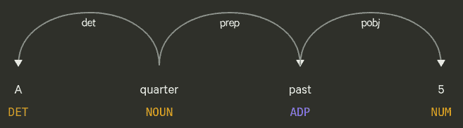
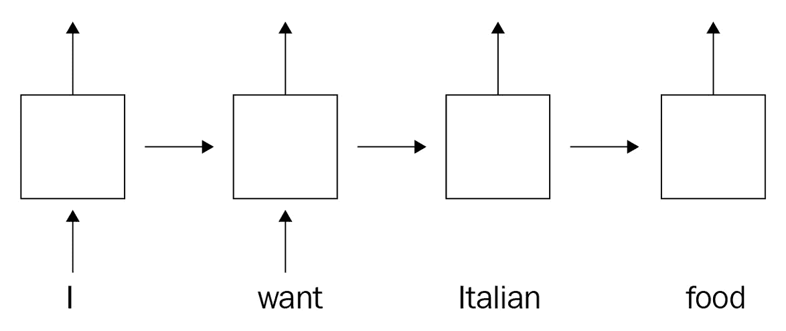
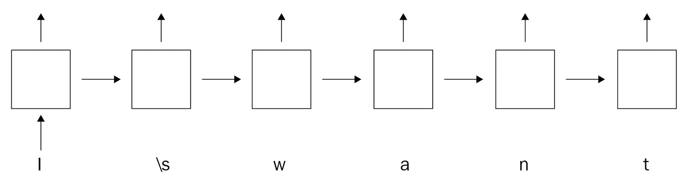
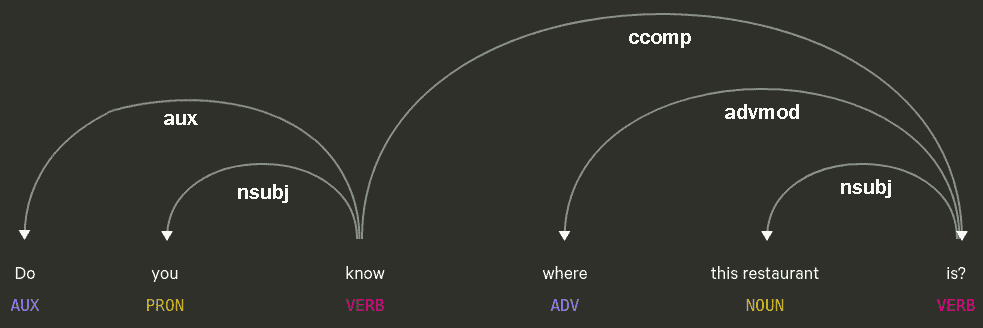
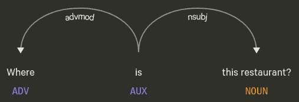
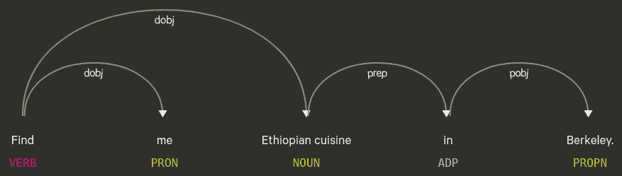
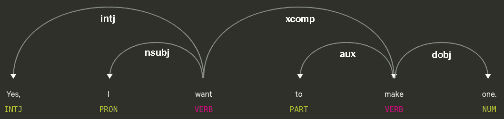
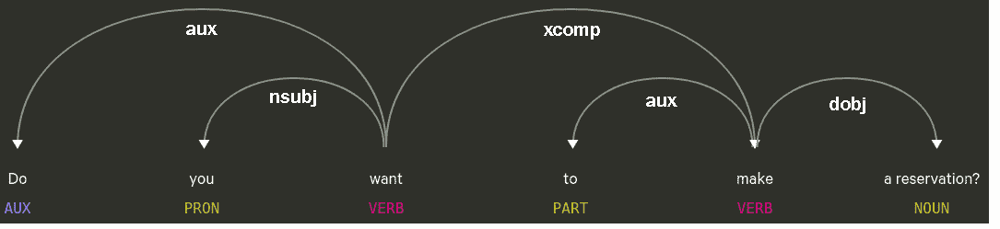

# 第十章：整合一切：使用 spaCy 设计您的聊天机器人

在本章中，您将利用迄今为止所学的一切来设计一个聊天机器人。您将执行实体提取、意图识别和上下文处理。您将使用不同的句法和语义解析方式、实体提取和文本分类方法。

首先，您将探索我们将用于收集其中话语的语言信息的数据集。然后，您将通过结合 spaCy 的`Matcher`类进行实体提取。之后，您将使用两种不同的技术进行意图识别：基于模式的方法和 TensorFlow 和 Keras 的统计文本分类。您将训练一个字符级 LSTM 来分类话语意图。

最后一节是关于句子和对话级语义的章节。您将深入研究诸如**代词消解**、**语法疑问句类型**和**区分主语和宾语**等语义主题。

到本章结束时，您将准备好设计一个真正的聊天机器人**自然语言理解**（**NLU**）管道。您将通过结合之前章节中学到的内容——语言和统计——结合几个 spaCy 管道组件，如**命名实体识别（NER**）、**依存句法分析器**和**词性标注器**。

在本章中，我们将涵盖以下主要主题：

+   对话式人工智能简介

+   实体提取

+   意图识别

# 技术要求

在本章中，我们将使用 NumPy、TensorFlow 和 scikit-learn 以及 spaCy。您可以通过以下命令使用`pip`安装这些库：

```py
pip install numpy
pip install tensorflow
pip install scikit-learn
```

您可以在本书的 GitHub 仓库中找到本章的代码和数据：[`github.com/PacktPublishing/Mastering-spaCy/tree/main/Chapter10`](https://github.com/PacktPublishing/Mastering-spaCy/tree/main/Chapter10)。

# 对话式人工智能简介

我们欢迎您来到我们最后一章，也是非常激动人心的一章，您将使用 spaCy 和 TensorFlow 设计一个聊天机器人 NLU 管道。在本章中，您将学习从多轮聊天机器人-用户交互中提取意义的方法。通过学习和应用这些技术，您将迈入**对话式人工智能开发**的步伐。

在深入技术细节之前，有一个基本问题：什么是聊天机器人？我们可以在哪里找到它？对话式人工智能究竟是什么意思？

**对话式人工智能**（**conversational AI**）是机器学习的一个领域，旨在创建能够使用户与机器进行基于文本或语音交互的技术。聊天机器人、虚拟助手和语音助手是典型的对话式人工智能产品。

**聊天机器人**是一种设计用来在聊天应用中与人类进行对话的软件应用。聊天机器人在包括人力资源、市场营销和销售、银行和医疗保健在内的广泛商业领域以及个人、非商业领域（如闲聊）中都很受欢迎。许多商业公司，如 Sephora（Sephora 拥有两个聊天机器人——一个在 Facebook 消息平台上的虚拟化妆师聊天机器人和一个在 Facebook 消息平台上的客户服务聊天机器人）、IKEA（IKEA 有一个名为 Anna 的客户服务聊天机器人）、AccuWeather 等，都拥有客户服务和常见问题解答聊天机器人。

即时通讯服务如 Facebook Messenger 和 Telegram 为开发者提供了连接其机器人的接口。这些平台还为开发者提供了详细的指南，例如 Facebook Messenger API 文档：([`developers.facebook.com/docs/messenger-platform/getting-started/quick-start/`](https://developers.facebook.com/docs/messenger-platform/getting-started/quick-start/)) 或 Telegram 机器人 API 文档：([`core.telegram.org/bots`](https://core.telegram.org/bots))。

**虚拟助手**也是一种软件代理，它会在用户请求或提问时执行一些任务。一个著名的例子是**亚马逊 Alexa**。Alexa 是一个基于语音的虚拟助手，可以执行许多任务，包括播放音乐、设置闹钟、阅读有声读物、播放播客，以及提供关于天气、交通、体育等方面的实时信息。Alexa Home 可以控制连接的智能家居设备，并执行各种任务，例如开关灯光、控制车库门等。

其他知名的例子包括 Google Assistant 和 Siri。Siri 集成在苹果公司的多个产品中，包括 iPhone、iPad、iPod 和 macOS。在 iPhone 上，Siri 可以进行电话拨打、接听电话，以及发送和接收短信以及 WhatsApp 消息。Google Assistant 也可以执行各种任务，例如提供实时航班、天气和交通信息；发送和接收短信；设置闹钟；提供设备电池信息；检查您的电子邮件收件箱；与智能家居设备集成等。Google Assistant 可在 Google Maps、Google Search 以及独立的 Android 和 iOS 应用程序中使用。

以下是一些最受欢迎和知名的虚拟助手列表，以给您更多关于市场上有哪些产品的想法：

+   Amazon Alexa

+   阿里巴巴集团的 AllGenie

+   三星公司的 Bixby

+   华为公司的 Celia

+   百度公司的 Duer

+   Google Assistant

+   微软公司的 Cortana

+   苹果公司的 Siri

+   腾讯公司的 Xiaowei

所有这些虚拟助手都是基于语音的，通常通过一个**唤醒词**来激活。唤醒词是一个特殊的词或短语，用于激活语音助手。例如，“嘿，Alexa”、“嘿，Google”和“嘿，Siri”，分别是亚马逊 Alexa、谷歌助手和 Siri 的唤醒词。如果您想了解更多关于这些产品的开发细节，请参阅本章的**参考文献**部分。

现在，我们来探讨一下技术细节。这些产品的 NLP 组件是什么？让我们详细看看这些 NLP 组件。

## 对话式人工智能产品的 NLP 组件

一个典型的基于语音的对话式人工智能产品包括以下组件：

+   **语音转文本组件**：将用户语音转换为文本。该组件的输入是一个 WAV/mp3 文件，输出是一个包含用户话语的文本文件。

+   **对话式 NLU 组件**：这个组件对用户话语文本执行意图识别和实体提取。输出是用户意图和实体列表。在当前话语中解决对先前话语的引用是在这个组件中完成的（请参阅**指代消解**部分）。

+   **对话管理器**：保持对话记忆，以进行有意义的连贯对话。您可以把这个组件看作是对话记忆，因为这个组件通常保存一个**对话状态**。对话状态是对话的状态：到目前为止出现的实体、到目前为止出现的意图等等。该组件的输入是先前的对话状态和当前用户解析的带有意图和实体的内容。该组件的输出是新的对话状态。

+   **回答生成器**：根据前几个阶段的全部输入，生成系统对用户话语的响应。

+   **文本转语音**：这个组件将系统的答案生成语音文件（WAV 或 mp3）。

每个组件都是单独训练和评估的。例如，语音转文本组件是在标注的语音语料库上训练的（训练是在语音文件和相应的转录上进行的）。NLU 组件是在意图和实体标注的语料库上训练的（类似于我们在第 6、7、8 和 9 章中使用的数据集）。在本章中，我们将重点关注 NLU 组件的任务。对于基于文本的产品，第一个和最后一个组件是不必要的，通常被电子邮件或聊天客户端集成所取代。

另一种被称为**端到端语音理解**（**SLU**）的范式。在 SLU 架构中，系统是端到端训练的，这意味着输入到系统的是语音文件，输出是系统的响应。每种方法都有其优缺点；您可以参考**参考文献**部分获取更多资料。

作为本书的作者，我很高兴能结合我的领域经验向您介绍这一章节。我在对话式人工智能领域工作了一段时间，并且每天都在为我们的产品解决语言和语音处理方面的挑战。我和我的同事们正在构建世界上第一个驾驶员数字助手 Chris（*技巧与窍门：如何与 Chris 交流 – 基本语音命令*，[`www.youtube.com/watch?v=Qwnjszu3exY`](https://www.youtube.com/watch?v=Qwnjszu3exY)）。Chris 可以打电话、接听来电、阅读和发送 WhatsApp 和短信、播放音乐、导航和闲聊。以下是 Chris：


图 10.1 – 车载语音助手 Chris（这是作者正在开发的产品）

从前面的例子中我们可以看到，对话式人工智能最近已经成为一个热门话题。作为一名自然语言处理专业人士，你很可能会在一个对话产品或相关领域工作，比如语音识别、文本转语音或问答。本章中介绍的技术，如意图识别、实体提取和代词消解，也适用于广泛的 NLU 问题。让我们深入技术部分。我们将从探索本章中我们将使用的整个数据集开始。

## 了解数据集

在*第六章*、*第七章*、*第八章*和*第九章*中，我们针对文本分类和实体提取目的使用了著名的真实世界数据集。在这些章节中，我们总是将数据集探索作为首要任务。数据探索的主要目的是为了了解数据集文本的性质，以便在我们的算法中制定应对该数据集的策略。如果我们回顾一下*第六章**，使用 spaCy 进行语义解析：整合一切，以下是我们探索过程中应该关注的主要点：

+   有哪些类型的语句？是简短的文本、完整的句子、长段落还是文档？语句的平均长度是多少？

+   语料库包含哪些实体？人名、组织名、地理位置、街道名？我们想要提取哪些？

+   标点符号是如何使用的？文本是否正确使用了标点，或者完全没有使用标点？

+   语法规则是如何遵循的？大写是否正确，用户是否遵循了语法规则？是否有拼写错误？

我们之前使用的语料库由`(text, class_label)`对组成，用于文本分类任务，或者由`(text, list_of_entities)`对组成，用于实体提取任务。在本章中，我们将处理一个更复杂的任务，即聊天机器人设计。因此，数据集将更加结构化和复杂。

聊天机器人设计数据集通常以 JSON 格式存储，以保持数据集结构。在这里，结构意味着以下内容：

+   保持用户和系统话语的顺序

+   标记用户话语的槽位

+   标注用户话语的意图

在本章中，我们将使用谷歌研究团队的**《Schema-Guided Dialogue》**数据集（**SGD**）([`github.com/google-research-datasets/dstc8-schema-guided-dialogue`](https://github.com/google-research-datasets/dstc8-schema-guided-dialogue))。该数据集包含标注的用户与虚拟助手交互。原始数据集包含超过 20,000 个对话片段，涉及多个领域，包括餐厅预订、电影预订、天气查询和旅行票务预订。对话包括用户和虚拟助手的轮流话语。在本章中，我们不会使用这个庞大的数据集的全部；相反，我们将使用关于餐厅预订的子集。

让我们开始下载数据集。你可以从本书的 GitHub 仓库下载数据集：[`github.com/PacktPublishing/Mastering-spaCy/blob/main/Chapter10/data/restaurants.json`](https://github.com/PacktPublishing/Mastering-spaCy/blob/main/Chapter10/data/restaurants.json)。或者，你可以编写以下代码：

```py
$ wget https://github.com/PacktPublishing/Mastering-spaCy/blob/main/Chapter10/data/restaurants.json
```

如果你用文本编辑器打开文件并查看前几行，你会看到以下内容：

```py
{
  "dialogue_id": "1_00000",
  "turns": [
    {
      "speaker": "USER",
      "utterance": "I am feeling hungry so I would like to find a place to eat.",
      "slots": [],
      "intent": "FindRestaurants"
     },
     {
       "speaker": "SYSTEM",
       "utterance": "Do you have a specific which you want the eating place to be located at?",
        "slots": []
       }
```

首先，数据集由对话片段组成，每个对话片段都有一个`dialogue_id`实例。每个对话片段是一个有序的轮流列表，每个轮流属于用户或系统。`turns`字段是一个用户/系统轮流的列表。`turns`列表的每个元素都是一个轮流。一个轮流包括说话者（用户或系统）、说话者的话语、槽位列表和用户话语的意图。

下面是从数据集中的一些示例用户话语：

```py
Hi. I'd like to find a place to eat.
I want some ramen, I'm really craving it. Can you find me an afforadable place in Morgan Hill?
I would like for it to be in San Jose.
Yes, please make a reservation for me.
No, Thanks
Hi i need a help, i am very hungry, I am looking for a restaurant
Yes, on the 7th for four people.
No. Can you change it to 1 pm on the 9th?
Yes. What is the phone number? Can I buy alcohol there? 
```

从这些示例话语中我们可以看到，用户话语中使用了大写字母和标点符号。用户可能会犯拼写错误，例如第二句话中的单词`afforadable`。还有一些语法错误，例如第五句话中`Thanks`一词首字母大写的错误。另一个大写错误发生在第六句话中，其中代词*I*被错误地写成了`i`两次。

此外，一个话语可以包含多个句子。第一个话语以问候句开始，最后两个句子各自以肯定或否定回答句开始。第四句话也以`Yes`开始，但不是作为一个独立的句子；相反，它与第二个句子用逗号隔开。

对于多句话语的意图识别，这是我们通常需要注意的一个点——这类话语可以包含多个意图。此外，对于多句话语的答案生成也有些棘手；有时我们只需要生成一个答案（例如，对于前面代码中的第二句话）或有时我们需要为每个用户句子生成一个答案（例如，对于前面代码中的最后一句话）。

这是一个餐厅预订数据集，因此它自然包括用户话语中的某些槽位，如位置、菜系、时间、日期、人数等。我们的数据集包括以下槽位：

```py
city
cuisine
date
phone_number
restaurant_name
street_address
time
```

以下是包含先前槽位类型及其值的示例句子：

```py
Find me Ethiopian/cuisine cuisine in Berkeley/city.
The phone number is 707-421-0835/phone_number. Your reservation is confirmed.
No, change the time to 7 pm/time and for one person only.
No, change it on next friday/date.
```

现在，我们来讨论意图识别的类别标签及其分布。以下是类别标签的分布：

```py
552 FindRestaurants
625 ReserveRestaurant
56  NONE
```

`NONE`是表示对话结束或只是说谢谢的话语的特殊类别标签。这类话语通常与餐厅预订无关。意图为列出餐厅并获取信息的话语被标记为`FindRestaurants`类别标签，而包含预订意图的话语被标记为`ReserveRestaurants`。让我们看看每个类别的示例话语：

```py
No, Thanks  NONE
No, thank you very much. NONE
Nothing much. I'm good.  NONE
I am feeling hungry so I would like to find a place to eat. FindRestaurants
Hi i need a help, i am very hungry, I am looking for a restaurant  FindRestaurants
Ok, What is the address? How pricey are they? FindRestaurants
Please can you make the reservation ReserveRestaurant
That's good. Do they serve liquor and what is there number? ReserveRestaurant
Thank you so much for setting that up. ReserveRestaurant
```

我们注意到后续句子，例如第 6、8 和 9 句话，被标记为`FindRestaurants`和`ReserveRestaurant`意图。这些句子不直接包含寻找/预订的意图，但它们继续了关于寻找/预订餐厅的对话，并且仍然对餐厅/预订进行查询。因此，尽管这些句子中没有明确指出寻找/预订的动作，但意图仍然是寻找/预订餐厅。

就这样——我们使用本节初步工作收集了关于我们数据集的足够见解。有了这些见解，我们准备构建我们的 NLU 管道。我们将从提取用户话语实体开始。

# 实体提取

在本节中，我们将实现我们聊天机器人 NLU 管道的第一步，并从数据集话语中提取实体。以下是我们数据集中标记的实体：

```py
city
date
time
phone_number
cuisine
restaurant_name
street_address
```

为了提取实体，我们将使用 spaCy NER 模型和 spaCy 的`Matcher`类。让我们先从提取`city`实体开始。

## 提取城市实体

我们首先提取`city`实体。我们将从回忆一些关于 spaCy NER 模型和实体标签的信息开始，这些信息来自*第三章**，语言特征*和*第六章**，使用 spaCy 进行语义解析：

+   首先，我们回忆一下 spaCy 中城市和国家的命名实体标签是`GPE`。让我们再次询问 spaCy，`GPE`标签对应的是什么：

    ```py
    import spacy
    nlp = spacy.load("en_core_web_md")
    spacy.explain("GPE")
    'Countries, cities, states'
    ```

+   其次，我们还回忆起我们可以通过`ents`属性访问`Doc`对象的实体。我们可以找到以下标记为 spaCy NER 模型的实体：

    ```py
    import spacy
    nlp = spacy.load("en_core_web_md")
    doc = nlp("Can you please confirm that you want to book a table for 2 at 11:30 am at the Bird restaurant in Palo Alto for today")
    doc.ents
    (2, 11:30 am, Bird, Palo Alto, today)
    for ent in doc.ents:
      print(ent.text, ent.label_) 
    2 CARDINAL
    11:30 am TIME
    Bird PRODUCT
    Palo Alto GPE
    today DATE
    ```

在这个代码段中，我们通过调用`doc.ents`列出了这个话语中所有的命名实体。然后，我们通过调用`ent.label_`检查了实体标签。检查输出，我们看到这个话语包含五个实体 - 一个序数实体（`2`），一个`TIME`实体（`11:30 am`），一个`PRODUCT`实体（`Bird`，这不是餐厅的理想标签），一个`CITY`实体（`Palo Alto`），和一个`DATE`实体（`today`）。`GPE`类型的实体是我们想要的；`Palo Alto`是美国的一个城市，因此被 spaCy NER 模型标记为`GPE`。

书中[`github.com/PacktPublishing/Mastering-spaCy/blob/main/Chapter10/extract_city_ents.py`](https://github.com/PacktPublishing/Mastering-spaCy/blob/main/Chapter10/extract_city_ents.py)的脚本在 GitHub 上输出了包含城市实体的所有话语。从该脚本的输出中，我们可以看到 spaCy NER 模型在这个语料库上的`GPE`实体表现非常好。我们不需要用我们的自定义数据训练 spaCy NER 模型。

我们提取了城市实体，我们的聊天机器人知道在哪个城市寻找餐厅。现在，我们将提取日期和时间，以便我们的聊天机器人能够进行真正的预订。

## 提取日期和时间实体

提取`DATE`和`TIME`实体与提取`CITY`实体类似，我们在上一节中看到了。我们再次回顾语料库话语，看看 spaCy NER 模型在从我们的语料库中提取`DATE`和`TIME`实体方面的成功程度。

让我们看看语料库中的几个示例话语：

```py
import spacy
nlp = spacy.load("en_core_web_md")
sentences = [
   "I will be eating there at 11:30 am so make it for then.",
   "I'll reach there at 1:30 pm.",
   "No, change it on next friday",
   "Sure. Please confirm that the date is now next Friday and for 1 person.",
   "I need to make it on Monday next week at half past 12 in the afternoon.",
   "A quarter past 5 in the evening, please."
]
```

在下面的代码中，我们将提取这些示例话语的实体：

```py
for sent in sentences:
   doc = nlp(sent)
   ents = doc.ents
   print([(ent.text, ent.label_) for ent in ents])
[('11:30 am', 'TIME')]
[('1:30 pm', 'TIME')]
[('next friday', 'DATE')]
[('next Friday', 'DATE'), ('1', 'CARDINAL')]
[('Monday next week', 'DATE'), ('half past 12', 'DATE')]
[('A quarter past 5', 'DATE')]
[('the evening', 'TIME'), ('4:45', 'TIME')]
```

看起来不错！输出相当成功：

+   第一句和第二句中的时间实体`11:30 am`和`1:30 pm`被成功提取。

+   第三句和第四句中的`DATE`实体`next friday`和`next Friday`也被提取出来。请注意，第一个实体包含一个拼写错误：`friday`应该写成*Friday* - 尽管如此，spaCy NER 模型仍然成功提取了这个实体。

+   第五句包含了`DATE`实体和`TIME`实体。我们可以将`DATE`实体`Monday next week`分为两部分：`Monday` - 一个星期几和`next week` - 一个相对日期（确切的日期取决于话语的日期）。这个实体由两个名词短语组成：`Monday`（名词）和`next week`（形容词名词）。spaCy 可以处理这样的多词实体。这个话语的时间实体`half past 12`也是一个多词实体。这个实体由一个名词（`half`），一个介词（`past`）和一个数字（`12`）组成。

+   对于第六个话语的多词`TIME`实体`A quarter past 5`也是如此。以下是这个实体的依存句法树：



图 10.2 – 时间实体“5 点过一刻”的依存树

前面的例子确实看起来相当不错，但以下这些表述如何：

```py
sentences = [
   "Have a great day.",
   "Have a nice day.",
   "Have a good day",
   "Have a wonderful day.",
   "Have a sunny and nice day"
]
for sent in sentences:
   doc = nlp(sent) 
   ents = doc.ents 
   print([(ent.text, ent.label_) for ent in ents])  
[('a great day', 'DATE')]
[('a nice day', 'DATE')]
[]
[]
[]
```

哎呀呀 – 看起来我们有一些`day`，因为日期实体错误地被识别了。我们在这里能做什么？

幸运的是，这些错误匹配并没有形成像第三和第四句中的`a good day`和`a wonderful day`这样的模式。只有单词序列`a great day`和`a nice day`被标记为实体。然后，我们可以用以下两种模式过滤 spaCy NER 的结果：

```py
sentence = 'Have a nice day.'
doc = nlp(sentence)
wrong_matches = ["a great day", "a nice day"]
date_ents = [ent for ent in doc.ents if ent.label_ == "DATE"]
date_ents = list(filter(lambda e: e.text not in wrong_matches, date_ents))
date_ents
[]
```

前面的代码块执行以下步骤：

1.  首先，我们定义了一个我们不想被识别为`DATE`实体的短语列表。

1.  我们通过遍历`doc`中的所有实体，并选择标签为`DATE`的实体，在第 3 行提取了 Doc 对象的`DATE`实体。

1.  在下一行，我们过滤了不在`wrong_matches`列表中的实体。

1.  我们打印了结果。正如预期的那样，`date`实体的最终结果是空列表。

太好了，我们已经提取了`DATE`、`TIME`和`CITY`实体。对于所有三种实体类型，我们直接使用了 spaCy NER 模型，因为 spaCy NER 可以识别日期、时间和地点实体。那么`phone_number`实体呢？spaCy NER 根本不包含这样的标签。所以，我们将使用一些`Matcher`类的技巧来处理这种实体类型。让我们提取电话号码。

## 提取电话号码

我们在*第四章**，基于规则的匹配*中进行了`Matcher`类在包含数字的实体上的实践。我们还可以从*第四章**，基于规则的匹配*中回忆起，匹配数字类型实体确实可能相当棘手；特别是提取电话号码需要特别注意。电话号码可以以不同的格式出现，包括带连字符的（212-44-44）、区号（(312) 790 12 31）、国家及区号（+49 30 456 222），以及不同国家的数字位数。因此，我们通常检查以下几点：

+   语料库中的电话号码实体是以多少种国家格式编写的？

+   数字块是如何分隔的 – 是用连字符、空格，还是两者都用？

+   一些电话号码中是否有区号块？

+   一些电话号码中是否有国家代码块？

+   国家代码块是否以+或 00 开头，或者两种格式都使用？

让我们检查一些我们的电话号码实体，然后：

```py
You can call them at 415-775-1800\. And they do not serve alcohol.
Their phone number is 408-374-3400 and they don't have live music.
Unfortunately no, they do not have live music, however here is the number: 510-558-8367.
```

所有电话类型的实体都出现在系统对话中。聊天机器人检索餐厅的电话号码并将其提供给用户。聊天机器人通过在数字块之间放置破折号来形成电话号码实体。此外，所有电话号码都采用美国电话号码格式。因此，电话号码格式是统一的，形式为 `ddd-ddd-dddd`。这对于定义匹配模式非常有用。我们只需定义一个模式，就可以匹配所有电话号码实体。

让我们先看看一个示例电话号码是如何进行分词的：

```py
doc= nlp("The phone number is 707-766-7600.")
[token for token in doc]
[The, phone, number, is, 707, -, 766, -, 7600, .] 
```

每个数字块都被分词为一个标记，每个破折号字符也被分词为一个标记。因此，在我们的匹配器模式中，我们将寻找一个由五个标记组成的序列：一个三位数，一个破折号，再次是一个三位数，再次是一个破折号，最后是一个四位数。然后，我们的匹配器模式应该看起来像这样：

```py
{"SHAPE": "ddd"}, {"TEXT": "-"}, {"SHAPE": "ddd"}, {"TEXT": "-"}, {"SHAPE": "dddd"}
```

如果你还记得第四章中的“基于规则的匹配”，`SHAPE` 属性指的是标记形状。标记形状表示字符的形状：`d` 表示数字，`X` 表示大写字母，而 `x` 表示小写字母。因此，`{"SHAPE": "ddd"}` 表示由三个数字组成的标记。这个模式将匹配形式为 `ddd-ddd-dddd` 的五个标记。让我们用我们的全新模式对一个语料库对话进行尝试：

```py
from spacy.matcher import Matcher
matcher = Matcher(nlp.vocab)
pattern = [{"SHAPE": "ddd"}, {"TEXT": "-"}, {"SHAPE": "ddd"}, {"TEXT": "-"}, {"SHAPE": "dddd"}]
matcher.add("usPhoneNum", [pattern])
doc= nlp("The phone number is 707-766-7600.")
matches = matcher(doc)
for mid, start, end in matches:
    print(doc[start:end])
707-766-7600
```

哇！我们的新模式如预期地匹配了一个电话号码类型实体！现在，我们将处理菜系类型，以便我们的聊天机器人可以预订。让我们看看如何提取菜系类型。

## 提取菜系类型

提取菜系类型比提取人数或电话类型要容易得多；实际上，它类似于提取城市实体。我们可以直接使用 spaCy NER 标签来提取菜系类型 – `NORP`。`NORP` 实体标签指的是民族或政治团体：

```py
spacy.explain("NORP")
'Nationalities or religious or political groups'
```

幸运的是，我们语料库中的菜名与国籍相吻合。因此，菜名被 spaCy 的 NER 标记为 `NORP`。

首先，让我们看看一些示例对话：

```py
Is there a specific cuisine type you enjoy, such as Mexican, Italian or something else?
I usually like eating the American type of food.
Find me Ethiopian cuisine in Berkeley.
I'm looking for a Filipino place to eat.
I would like some Italian food.
Malaysian sounds good right now.
```

让我们提取这些对话的实体，并检查 spaCy 的 NER 标签如何将菜系类型标记如下：

```py
for sent in sentences:
  doc = nlp(sent
  [(ent.text, ent.label_) for ent in doc.ents] 
[('Mexican', 'NORP'), ('Italian', 'NORP')]
[('American', 'NORP')]
[('Ethiopian', 'NORP'), ('Berkeley', 'GPE')]
[('Filipino', 'NORP')]
[('Italian', 'NORP')]
[('Malaysian', 'NORP')]
```

现在，我们能够从用户对话中提取城市、日期和时间、人数和菜系实体。我们构建的命名实体提取模块的结果包含了聊天机器人需要提供给预订系统的所有信息。以下是一个带有提取实体的示例对话：

```py
I'd like to reserve an Italian place for 4 people by tomorrow 19:00 in Berkeley.
{
entities: {
   "cuisine": "Italian",
   "date": "tomorrow",
   "time": "19:00",
   "number_people": 4,
   "city": "Berkeley"
}
```

在这里，我们完成了语义解析的第一部分，即提取实体。完整的语义解析还需要一个意图。现在，我们将进入下一部分，使用 TensorFlow 和 Keras 进行意图识别。

# 意图识别

**意图识别**（也称为**意图分类**）是将预定义标签（意图）分类到用户表述的任务。意图分类基本上是文本分类。意图分类是一个已知且常见的 NLP 任务。GitHub 和 Kaggle 托管了许多意图分类数据集（请参阅*参考文献*部分以获取一些示例数据集的名称）。

在现实世界的聊天机器人应用中，我们首先确定聊天机器人必须运行的领域，例如金融和银行、医疗保健、市场营销等。然后我们执行以下循环动作：

1.  我们确定了一组我们想要支持的意图，并准备了一个带有`(表述，标签)`对的标记数据集。我们在该数据集上训练我们的意图分类器。

1.  接下来，我们将我们的聊天机器人部署给用户，并收集真实用户数据。

1.  然后我们检查我们的聊天机器人在真实用户数据上的表现。在这个阶段，通常我们会发现一些新的意图和一些聊天机器人未能识别的表述。我们将新的意图扩展到我们的意图集合中，将未识别的表述添加到我们的训练集中，并重新训练我们的意图分类器。

1.  我们进入*步骤 2*并执行*步骤 2-3*，直到聊天机器人 NLU 的质量达到良好的准确度水平（> 0.95）。

我们的语料库是一个真实世界的语料库；它包含拼写错误和语法错误。在设计我们的意图分类器时——尤其是在进行基于模式的分类时——我们需要对这样的错误有足够的鲁棒性。

我们将分两步进行意图识别：基于模式的文本分类和统计文本分类。我们在*第八章**，使用 spaCy 进行文本分类*中看到了如何使用 TensorFlow 和 Keras 进行统计文本分类。在本节中，我们将再次使用 TensorFlow 和 Keras。在此之前，我们将了解如何设计基于模式的文本分类器。

## 基于模式的文本分类

**基于模式的分类**意味着通过将预定义的模式列表与文本匹配来对文本进行分类。我们将预编译的模式列表与表述进行比较，并检查是否存在匹配。

一个直接的例子是**垃圾邮件分类**。如果一个电子邮件包含以下模式之一，例如*你中了彩票*和*我是尼日利亚王子*，那么这封电子邮件应该被分类为垃圾邮件。基于模式的分类器与**统计分类器**结合使用，以提高整个系统的准确度。

与统计分类器不同，基于模式的分类器很容易构建。我们根本不需要在训练 TensorFlow 模型上花费任何努力。我们将从我们的语料库中编译一个模式列表，并将其提供给 Matcher。然后，Matcher 可以在表述中查找模式匹配。

要构建一个基于模式的分类器，我们首先需要收集一些模式。在本节中，我们将对带有`NONE`标签的表述进行分类。让我们先看看一些表述示例：

```py
No, Thanks
No, thank you very much.
That is all thank you so much.
No, that is all.
Nope, that'll be all. Thanks!
No, that's okay.
No thanks. That's all I needed help with.
No. This should be enough for now.
No, thanks.
No, thanks a lot.
No, thats all thanks.
```

通过观察这些话语，我们看到带有 `NONE` 标签的话语遵循一些模式：

+   大多数话语都以 `No,` 或 `No.` 开头。

+   说 `thank you` 的模式也很常见。模式 `Thanks`、`thank you` 和 `thanks a lot` 在前面代码的大多数话语中都出现过。

+   一些辅助短语，例如 `that is all`、`that'll be all`、`that's OK` 和 `this should be enough` 也常被使用。

基于这些信息，我们可以创建以下三个 Matcher 模式：

```py
[{"LOWER": {"IN": ["no", "nope"]}}, {"TEXT": {"IN": [",", "."]}}]
[{"TEXT": {"REGEX": "[Tt]hanks?"}}, {"LOWER": {"IN": ["you", "a lot"]}, "OP": "*"}]
[{"LOWER": {"IN": ["that", "that's", "thats", "that'll",
"thatll"]}}, {"LOWER": {"IN": ["is", "will"]}, "OP": "*"}, {"LOWER": "all"}]
```

让我们逐个分析这些模式：

+   第一个模式匹配标记序列 `no,`、`no.`、`nope,`、`nope.`、`No,`、`No.`、`Nope,` 和 `Nope.`。第一个项目匹配两个标记 `no` 和 `nope`，无论是大写还是小写。第二个项目匹配标点符号 `,` 和 `.`。

+   第二个模式匹配 `thank`、`thank you`、`thanks` 和 `thanks a lot`，无论是大写还是小写。第一个项目匹配 `thank` 和 `thanks` `s?`。在正则表达式语法中，`s` 字符是可选的。第二个项目对应于单词 `you` 和 `a lot`，它们可能跟在 `thanks?` 之后。第二个项目是可选的；因此，模式也匹配 `thanks` 和 `thank`。我们使用了操作符 `OP: *` 来使第二个项目可选；回想一下 *第四章**，基于规则的匹配*，Matcher 支持不同操作符的语法，例如 `*`、`+` 和 `?`。

+   第三个模式匹配标记序列 `that is all`、`that's all`、`thats all` 等等。请注意，第一个项目包含一些拼写错误，例如 `thats` 和 `thatll`。我们故意包含这些拼写错误，以便匹配对用户输入错误更加健壮。

前三个模式的组合将匹配 `NONE` 类的话语。你可以通过将它们添加到 Matcher 对象中来尝试这些模式，看看它们是如何匹配的。

高级技巧

在设计基于规则的系统时，始终牢记用户数据并不完美。用户数据包含拼写错误、语法错误和错误的字母大小写。始终将健壮性作为高优先级，并在用户数据上测试您的模式。

我们通过使用一些常见模式构建了一个无统计模型的分类器，并成功分类了一个意图。那么其他两个意图——`FindRestaurants` 和 `ReserveRestaurant` 呢？这些意图的话语在语义上要复杂得多，所以我们无法处理模式列表。我们需要统计模型来识别这两个意图。让我们继续使用 TensorFlow 和 Keras 训练我们的统计文本分类器。

## 使用字符级 LSTM 对文本进行分类

在本节中，我们将训练一个用于识别意图的**字符级 LSTM 架构**。我们已经在*第八章**，使用 spaCy 进行文本分类*中练习了文本分类。回顾本章内容，LSTM 是按顺序处理的模型，一次处理一个输入时间步。我们按照以下方式在每个时间步输入一个单词：

![Figure 10.3 – 在每个时间步向 LSTM 输入一个单词]



![Figure 10.3 – 在每个时间步向 LSTM 输入一个单词]

正如我们在*第八章**，使用 spaCy 进行文本分类*中提到的，LSTM 有一个内部状态（你可以将其视为内存），因此 LSTM 可以通过在其内部状态中保持过去信息来模拟输入序列中的顺序依赖关系。

在本节中，我们将训练一个字符级 LSTM。正如其名所示，我们将逐字符输入话语，而不是逐词输入。每个话语将被表示为字符序列。在每个时间步，我们将输入一个字符。这就是从*Figure 10.3*中输入话语的样子：

![Figure 10.4 – 将句子 "我想吃意大利菜" 的前两个单词输入]



![Figure 10.4 – 将句子 "我想吃意大利菜" 的前两个单词输入]

我们注意到空格字符也被作为输入，因为空格字符也是话语的一部分；对于字符级任务，数字、空格和字母之间没有区别。

让我们开始构建 Keras 模型。在这里我们将跳过数据准备阶段。你可以在意图分类笔记本[`github.com/PacktPublishing/Mastering-spaCy/blob/main/Chapter10/Intent-classifier-char-LSTM.ipynb`](https://github.com/PacktPublishing/Mastering-spaCy/blob/main/Chapter10/Intent-classifier-char-LSTM.ipynb)中找到完整的代码。

我们将直接使用 Keras 的 Tokenizer 来创建一个词汇表。回顾*第八章**，使用 spaCy 进行文本分类*，我们知道我们使用 Tokenizer 来完成以下操作：

+   从数据集句子中创建一个词汇表。

+   为数据集中的每个标记分配一个标记 ID。

+   将输入句子转换为标记 ID。

让我们看看如何执行每个步骤：

1.  在*第八章**，使用 spaCy 进行文本分类*中，我们将句子分词为单词，并为单词分配标记 ID。这次，我们将输入句子分解为其字符，然后为字符分配标记 ID。Tokenizer 提供了一个名为`char_level`的参数。以下是字符级分词的 Tokenizer 代码：

    ```py
    from tensorflow.keras.preprocessing.text import Tokenizer
    tokenizer = Tokenizer(char_level=True, lower=True)
    tokenizer.fit_on_texts(utterances)
    ```

1.  上述代码段将创建一个从输入字符中提取的词汇表。我们使用了`lower=True`参数，因此 Tokenizer 将输入句子的所有字符转换为小写。在初始化我们的词汇表上的`Tokenizer`对象后，我们现在可以检查其词汇表。以下是 Tokenizer 词汇表的前 10 项：

    ```py
    tokenizer.word_index
    {' ': 1, 'e': 2, 'a': 3, 't': 4, 'o': 5, 'n': 6, 'i': 7, 'r': 8, 's': 9, 'h': 10}
    ```

    正如与词级词汇表一样，索引`0`被保留用于一个特殊标记，即填充字符。回想一下*第八章**，使用 spaCy 进行文本分类*，Keras 无法处理变长序列；数据集中的每个句子都应该具有相同的长度。因此，我们通过在句子末尾或句子开头添加填充字符来将所有句子填充到最大长度。

1.  接下来，我们将每个数据集句子转换为标记 ID。这是通过调用 Tokenizer 的`texts_to_sequences`方法实现的：

    ```py
    utterances = tokenizer.texts_to_sequences(utterances)
    utterances[0]
    [17, 2, 9, 25, 1, 7, 1, 22, 3, 6, 4, 1, 7, 4, 1, 5, 6, 1, 4, 10, 2, 1, 28, 28, 4, 10]
    ```

1.  接下来，我们将所有输入句子填充到长度为`150`：

    ```py
    MAX_LEN = 150
    utterances =\
     pad_sequences(utterances, MAX_LEN, padding="post")
    ```

    我们准备好将转换后的数据集输入到我们的 LSTM 模型中。我们的模型简单而非常高效：我们在双向 LSTM 层之上放置了一个密集层。以下是模型架构：

    ```py
    utt_in = Input(shape=(MAX_LEN,))
    embedding_layer =  Embedding(input_dim = len(tokenizer.word_index)+1, output_dim = 100, input_length=MAX_LEN)
    lstm =\
    Bidirectional(LSTM(units=100, return_sequences=False))
    utt_embedding = embedding_layer(utt_in)
    utt_encoded = lstm(utt_embedding)
    output = Dense(1, activation='sigmoid')(utt_encoded)
    model = Model(utt_in, output)
    ```

    双向 LSTM 层意味着两个 LSTM 堆叠在一起。第一个 LSTM 从左到右（正向）遍历输入序列，第二个 LSTM 从右到左（反向）遍历输入序列。对于每个时间步，正向 LSTM 和反向 LSTM 的输出被连接起来生成一个单独的输出向量。以下图展示了我们的具有双向 LSTM 的架构：

    ![Figure 10.5 – 双向 LSTM 架构

    ![img/Figure_10_5.jpg]

    图 10.5 – 双向 LSTM 架构

1.  接下来，我们通过调用`model.fit`来编译我们的模型并在我们的数据集上训练它：

    ```py
    model.compile(loss = 'binary_crossentropy', optimizer = "adam", metrics=["accuracy"])
    model.fit(utterances, labels, validation_split=0.1, epochs = 10, batch_size = 64)
    ```

    在这里，我们使用以下内容编译我们的模型：

    a) 二元交叉熵损失，因为这是一个二元分类任务（我们有两个类别标签）。

    b) `Adam`优化器，它将通过调整训练步骤的大小来帮助训练过程更快地运行。请参阅*参考文献*部分和*第八章**，使用 spaCy 进行文本分类*，以获取有关`Adam`优化器的更多信息。

    c) 准确率作为我们的成功指标。准确率是通过比较预测标签与实际标签相等的频率来计算的。

在调整我们的模型后，我们的模型在验证集上给出了`0.8226`的准确率，这相当不错。

现在，只剩下一个问题：为什么我们这次选择训练一个字符级模型？字符级模型确实有一些优点：

+   字符级模型对拼写错误高度容忍。考虑一下拼写错误的单词*charactr* – 是否缺少字母*e*并不太影响整个句子的语义。对于我们的数据集，我们将从这种鲁棒性中受益，因为我们已经在数据集探索中看到了用户的拼写错误。

+   词汇量小于词级模型。字母表中的字符数（对于任何给定语言）是固定的且较低（最多 50 个字符，包括大写和小写字母、数字和一些标点符号）；但一个语言中的单词数量要大得多。因此，模型大小可能会有所不同。主要区别在于嵌入层；嵌入表的大小为`(vocabulary_size, output_dim)`（参见模型代码）。鉴于输出维度相同，与数千行相比，50 行确实很小。

在本节中，我们能够从话语中提取用户意图。意图识别是理解句子语义的主要步骤，但还有更多吗？在下一节中，我们将深入研究句子级和对话级语义。更多语义分析

这是一个专门关于聊天机器人 NLU 的章节。在本节中，我们将探索句子级语义和句法信息，以生成对输入话语的更深入理解，并提供答案生成的线索。

在本节的其余部分，请将答案生成组件视为黑盒。我们提供句子的语义分析，并根据这个语义分析生成答案。让我们先剖析句子语法，并检查话语的主语和对象。

## 区分主语和对象

回想一下*第三章**，语言特征*，一个句子有两个重要的语法成分：一个**主语**和一个**对象**。主语是执行句子动词所给动作的人或物：

```py
Mary picked up her brother.
He was a great performer.
It was rainy on Sunday.
Who is responsible for this mess?
The cat is very cute.
Seeing you makes me happy.
```

主语可以是名词、代词或名词短语。

一个对象是动词所给动作执行的对象或人。一个对象可以是名词、代词或名词短语。以下是一些例子：

```py
Lauren lost her book.
I gave her/direct object a book/indirect object.
```

到目前为止，一切顺利，但这个信息如何帮助我们进行聊天机器人 NLU？

提取主语和对象有助于我们理解句子结构，从而为句子的语义分析增加一个层次。句子主语和对象信息直接与答案生成相关。让我们看看我们数据集中的一些话语示例：

```py
Where is this restaurant? 
```

下图显示了此话语的依存句法分析。主语是名词短语`这家餐厅`：

![Figure 10.6 – 示例话语的依存句法分析

![Figure 10_6.jpg]

图 10.6 – 示例话语的依存句法分析

我们如何生成这个句子的答案？显然，答案应该以`this restaurant`（或它所指的餐厅）为主语。以下是一些可能的答案：

```py
The restaurant is located at the corner of 5th Avenue and 7th Avenue.
The Bird is located at the corner of 5Th Avenue and 7Th Avenue.
```

如果用户将`this restaurant`放入宾语角色，答案会改变吗？让我们从数据集中取一些示例语句：

```py
Do you know where this restaurant is?
Can you tell me where this restaurant is?
```

显然，用户再次询问餐厅的地址。系统需要提供餐厅地址信息。然而，这次，这些句子的主语是`你`：



图 10.7 – 第一句话的依存句法分析

这个问题的主语是`你`，所以答案可以以一个*I*开头。这是一个疑问句，因此答案可以以*yes*/*no*开头，或者答案可以直接提供餐厅的地址。以下句子都是可能的答案：

```py
I can give the address. Here it is: 5th Avenue, no:2
Yes, of course. Here's the address: 5th Avenue, no:2
Here's the address: 5Th Avenue, no:2 
```

同样的短语`the restaurant`作为主语或宾语并不影响用户的意图，但它会影响答案的句子结构。让我们更系统地看看信息。前例句子的语义分析如下：

```py
{
utt: "Where is this restaurant?",
intent: "FindRestaurants",
entities: [],
structure: {
    subjects: ["this restaurant"]
  }
}
{
utt: "Do you know where is this restaurant is?",
intent: "FindRestaurants",
entities: [],
structure: {
    subjects: ["you"]
  }
}
```

当我们将这些语义分析输入到答案生成模块时，该模块可以通过考虑当前语句、对话历史、语句意图和语句的句子结构（目前仅考虑句子主语信息）来生成答案。

在这里，我们通过查看语句的依存树来提取语句的句子结构信息。依存句法分析能否为我们提供更多关于语句的信息？答案是肯定的。我们将在下一节中看到如何提取句子类型。

## 句子类型解析

在本节中，我们将提取用户语句的句子类型。语法有四种主要的句子类型，根据其目的进行分类：

```py
Declarative: John saw Mary.
Interrogative: Can you go there?
Imperative: Go there immediately.
Exclamation: I'm excited too!
```

在聊天机器人 NLU 中，句子类型略有不同；我们根据主语和宾语的词性以及目的来分类句子。以下是聊天机器人 NLU 中使用的某些句子类型：

```py
Question sentence
Imperative sentence
Wish sentence
```

让我们检查每种句子类型及其结构特性。我们首先从疑问句开始。

### 疑问句

当用户想要提问时，会使用疑问句。疑问句可以通过两种方式形成，要么使用疑问代词，要么将情态动词或助动词置于句首：

```py
How did you go there?
Is this the book that you recommended?
```

因此，我们将疑问句分为两类，**wh-疑问句**和**是非疑问句**。正如其名所示，wh-疑问句以一个**wh 词**（wh 词指的是疑问代词，如哪里、什么、谁和如何）开头，而是非疑问句是通过使用情态动词或助动词来构成的。

这种分类如何帮助我们？从句法上讲，是/否问题应该用是或否来回答。因此，如果我们的聊天机器人 NLU 将一个是/否问题传递给答案生成模块，答案生成器应该评估这条信息并生成一个以是/否开头的答案。Wh-问题旨在获取关于主语或宾语的信息，因此答案生成模块应该提供关于句子主语或宾语的信息。考虑以下话语：

```py
Where is this restaurant?
```

这个话语生成了以下依存句法分析：



图 10.8 – 示例 Wh-问题的依存句法分析

在这里，话语的主语是`this restaurant`；因此，答案生成器应该通过关联`Where`和`this restaurant`来生成答案。关于以下话语呢：

```py
Which city is this restaurant located?
```

这个话语的依存句法分析如下：


图 10.9 -- 示例 Wh-问题的依存句法分析

在这里，句子结构略有不同。`Which city`是句子的主语，而`this restaurant`是子句的主语。在这里，答案生成模块应该通过关联`which city`和`this restaurant`来生成答案。

我们现在将转向祈使句类型。

### 祈使句

**祈使句**在聊天机器人用户的说话中相当常见。祈使句是通过将主要动词置于句首来构成的。以下是我们数据集中的一些话语示例：

```py
Find me Ethiopian cuisine in Berkeley.
Find me a sushi place in Alameda.
Find a place in Vallejo with live music.
Please reserve me at 6:15 in the evening.
Reserve for six in the evening.
Reserve it for half past 1 in the afternoon.
```

如我们所见，祈使话语在用户话语中相当常见，因为它们简洁直接。我们可以通过查看单词的词性标注来识别这些类型的句子：要么第一个词是动词，要么句子以*请*开头，第二个词是动词。以下 Matcher 模式匹配祈使话语：

```py
[{"POS": "VERB, "IS_SENT_START": True}]
[{"LOWER": "please", IS_SENT_START: True}, {"POS": "VERB"}]
```

答案生成器将如何处理这些类型的句子？祈使句通常包含生成答案的句法和语义元素；主要动词提供动作，通常后面跟着一系列宾语。以下是对话语`Find me Ethiopian cuisine in Berkeley`的解析示例：



图 10.10 – 示例话语的依存句法分析

从图中，我们可以看到这个句子的句法成分，如`Find`（动作），`Ethiopian cuisine`（一个宾语）和`Berkeley`（一个宾语）。这些成分为答案生成器提供了一个清晰的模板来生成对这个话语的答案：答案生成器应该向餐厅数据库查询`Ethiopian cuisine`和`Berkeley`的匹配项，并列出匹配的餐厅。

现在我们转向下一类句子，愿望句。让我们详细看看这些句子。

### 愿望句

**愿望句**在语义上与祈使句相似。区别在于句法：愿望句以诸如 *I'd like to*、*Can I*、*Can you* 和 *May I* 等短语开头，指向一个愿望。以下是我们数据集中的几个例子：

```py
I'd like to make a reservation.
I would like to find somewhere to eat, preferably Asian food.
I'd love some Izakaya type food.
Can you find me somewhere to eat in Dublin?
Can we make it three people at 5:15 pm?
Can I make a reservation for 6 pm?
```

提取动词和宾语与我们对祈使句所做的工作类似，因此语义分析相当相似。

在提取句子类型后，我们可以将其包含到我们的语义分析结果中，如下所示：

```py
{
utt: "Where is this restaurant?",
intent: "FindRestaurants",
entities: [],
structure: {
    sentence_type: "wh-question",
    subjects: ["this restaurant"]
  }
}
```

现在，我们有了丰富的语义和句法表示的输入话语。在下一节中，我们将超越句子级语义，进入对话级语义。让我们继续到下一节，看看我们如何处理对话级语义。

## 代词消解

在本节中，我们将探讨语言学概念**代词**和**连贯性**。在语言学中，连贯性意味着将文本在语义上粘合在一起的语法联系。这个文本可以是一个单独的句子、一个段落或一个对话片段。考虑以下两个句子：

```py
I didn't like this dress. Can I see another one
```

在这里，单词 `one` 指的是第一句话中的连衣裙。人类可以轻松地解决这个问题，但对于软件程序来说，这并不那么直接。

还要考虑以下对话片段：

```py
Where are you going?
To my grandma's.
```

第二句话完全可以理解，尽管句子中的一些部分缺失：

```py
I'm going to my grandma's house. 
```

在书面和口头语言中，我们每天都在使用这样的**捷径**。然而，在编程时解决这些捷径需要引起注意，尤其是在聊天机器人自然语言理解（NLU）中。考虑以下来自我们数据集的话语和对话片段：

示例 1:

```py
- Do you want to make a reservation?
- Yes, I want to make one.
```

示例 2:

```py
- I've found 2 Malaysian restaurants in Cupertino. Merlion Restaurant & Bar is one.
- What is the other one?
```

示例 3:

```py
- There's another restaurant in San Francisco that's called Bourbon Steak Restaurant.
- Yes, I'm interested in that one.
```

示例 4:

```py
- Found 3 results, Asian pearl Seafood Restaurant is the best one in Fremont city, hope you like it.
- Yes, I like the same.
```

示例 5:

```py
- Do you have a specific which you want the eating place to be located at?
- I would like for it to be in San Jose.
```

示例 6:

```py
- Would you like a reservation?
- Yes make it for March 10th.
```

前面句子和对话中所有加粗的部分都是名为 `one`、`more`、`same`、`it` 等的语言事件的例子。代词消解意味着解决代词所指的确切短语。

我们如何将此信息应用到我们的聊天机器人 NLU 中呢？

首先，我们需要确定一个话语是否涉及代词消解，以及我们是否需要进行代词消解。再次考虑以下对话片段：

```py
Do you want to make a reservation?
Yes, I want to make one.
```

第二个话语的依存句法分析如下：



图 10.11 – 示例话语的依存句法分析

首先，`one` 出现在句子的直接宾语位置，并且没有其他直接宾语。这意味着 `one` 应该是一个代词。为了解决 `one` 指代什么，我们将回顾对话的第一个话语。以下依存句法分析属于第一个话语，`Do you want to make a reservation?`：



图 10.12 – 示例话语的依存句法分析

如果我们查看*图 10.11*，我们会看到句子有一个直接宾语，“一个预订”，因此“一个”应该指代“一个预订”。然后，我们可以将生成的语义解析安排如下：

```py
{
utt: "Where is this restaurant?",
intent: "ReserveRestaurant",
entities: [],
structure: {
    sentence_type: "declarative",
    subjects: ["one"]
    anaphoras: {
       "one": "a reservation"
       }
  }
}
```

将“一个”替换为“一个预订”可以使句子的意图更清晰。在我们的聊天机器人 NLU 中，我们只有两个意图，但如果有更多意图，比如预订取消、退款等，怎么办？那么“我想订一个”也可以意味着进行取消或获取退款。

因此，我们将指代词消解放在意图识别之前，并输入完整的句子，其中指代词被它们所指的短语所替换。这样，意图分类器接收到的句子中，直接宾语是一个名词短语，而不是“一个”、“相同的”、“它”或“更多”等单词，这些单词本身没有任何意义。

现在，在用 Keras 进行统计意义提取（通过提取意图）之后，在本节中，你学习了使用特殊 NLU 技术处理句子语法和语义的方法。你已经准备好结合你所知道的所有技术，为你的未来职业设计自己的聊天机器人 NLU。这本书从语言概念开始，继续到统计应用，在本章中，我们将它们全部结合起来。你已经准备好继续前进。在所有你将设计的 NLU 管道中，始终尝试从不同的角度看待问题，并记住你在本书中学到的内容。

# 摘要

就这样！你已经到达了这一详尽章节的结尾，也到达了这本书的结尾！

在本章中，我们设计了一个端到端聊天机器人 NLU 管道。作为第一个任务，我们探索了我们的数据集。通过这样做，我们收集了关于话语的语言学信息，并理解了槽位类型及其对应的值。然后，我们执行了聊天机器人 NLU 的一个重要任务——实体提取。我们使用 spaCy NER 模型以及 Matcher 提取了多种类型的实体，如城市、日期/时间和菜系。然后，我们执行了另一个传统的聊天机器人 NLU 管道任务——意图识别。我们使用 TensorFlow 和 Keras 训练了一个字符级 LSTM 模型。

在最后一节中，我们深入探讨了句子级和对话级语义。我们通过区分主语和宾语来处理句子语法，然后学习了句子类型，最后学习了指代词消解的语言学概念。我们通过结合几个 spaCy 管道组件（如 NER、依存句法分析器和词性标注器）所学的知识，在语言和统计上应用了之前章节的内容。

# 参考文献

这里为本章提供了一些参考文献：

关于语音助手产品：

+   Alexa 开发者博客：[`developer.amazon.com/blogs/home/tag/Alexa`](https://developer.amazon.com/blogs/home/tag/Alexa%20)

+   Alexa 科学博客：[`www.amazon.science/tag/alexa`](https://www.amazon.science/tag/alexa%20)

+   微软关于聊天机器人的出版物：[`academic.microsoft.com/search?q=chatbot`](https://academic.microsoft.com/search?q=chatbot)

+   谷歌助手：[`assistant.google.com/`](https://assistant.google.com/%20)

Keras 层和优化器：

+   Keras 层：[`keras.io/api/layers/`](https://keras.io/api/layers/%20)

+   Keras 优化器：[`keras.io/api/optimizers/`](https://keras.io/api/optimizers/%20)

+   优化器概述：[`ruder.io/optimizing-gradient-descent/`](https://ruder.io/optimizing-gradient-descent/%20)

+   Adam 优化器：[`arxiv.org/abs/1412.6980`](https://arxiv.org/abs/1412.6980%20)

对话式人工智能的数据集：

+   来自谷歌研究团队的 Taskmaster：[`github.com/google-research-datasets/Taskmaster/tree/master/TM-1-2019`](https://github.com/google-research-datasets/Taskmaster/tree/master/TM-1-2019%20)

+   来自谷歌研究团队的模拟对话数据集：[`github.com/google-research-datasets/simulated-dialogue`](https://github.com/google-research-datasets/simulated-dialogue%20)

+   来自微软的对话挑战数据集：[`github.com/xiul-msr/e2e_dialog_challenge`](https://github.com/xiul-msr/e2e_dialog_challenge%20)

+   对话状态跟踪挑战数据集：[`github.com/matthen/dstc`](https://github.com/matthen/dstc)
