# 第二章：数据获取

作为数据科学家，将数据加载到数据科学平台是最重要的任务之一。本章解释了如何构建 Spark 中的通用数据摄入管道，而不是采用无控制的临时过程，这个管道可以作为跨多个输入数据源的可重用组件。我们将配置并演示它如何在各种运行条件下提供重要的数据管理信息。

读者将学习如何构建*内容注册*并使用它来跟踪加载到系统中的所有输入，并提供摄入管道的指标，以便这些流可以可靠地作为自动化的、无人值守的过程运行。

在本章中，我们将涵盖以下主题：

+   介绍**全球事件、语言和情绪数据库**（**GDELT**）数据集

+   数据管道

+   通用摄入框架

+   实时监控新数据

+   通过 Kafka 接收流数据

+   注册新内容和保险库以进行跟踪

+   在 Kibana 中可视化内容指标，以监控摄入过程和数据健康状况

# 数据管道

即使是最基本的分析，我们总是需要一些数据。事实上，找到*正确的数据*可能是数据科学中最难解决的问题之一（但这是另一本书的整个主题！）。我们已经在上一章中看到，我们获取数据的方式可以简单或复杂，视情况而定。实际上，我们可以将这个决定分解为两个不同的领域：*临时*和*定期*。

+   **临时数据获取**：在原型设计和小规模分析中通常是最常见的方法，因为它通常不需要额外的软件来实现。用户获取一些数据，只需在需要时从源头下载。这种方法通常是点击一个网页链接并将数据存储在方便的地方，尽管数据可能仍然需要进行版本控制和安全保护。

+   **定期数据获取**：在大规模和生产分析的受控环境中使用；还有一个很好的理由将数据集摄入数据湖以备将来使用。随着**物联网**（**IoT**）的增长，在许多情况下产生了大量数据，如果数据不立即摄入，就会永远丢失。其中许多数据今天可能没有明显的用途，但将来可能会有用；因此，心态是收集所有数据以防需要时使用，并在确定不需要时稍后删除它。

很明显，我们需要一种灵活的数据获取方法，支持各种采购选项。

## 通用摄入框架

有许多方法可以处理数据获取，从自制的 bash 脚本到高端商业工具。本节的目的是介绍一个高度灵活的框架，我们可以用于小规模数据摄入，然后根据需求的变化扩展到完整的公司管理工作流程。这个框架将使用**Apache NiFi**构建。NiFi 使我们能够构建大规模的集成数据管道，将数据传输到全球各地。此外，它也非常灵活，易于构建简单的管道，通常甚至比使用 bash 或任何其他传统脚本方法更快。

### 注意

如果在多次采集同一数据集时采用了临时方法，那么应认真考虑是否应将其归类为定期类别，或者至少是否应引入更健壮的存储和版本控制设置。

我们选择使用 Apache NiFi，因为它提供了一个解决方案，可以创建许多不同复杂度的管道，并且可以扩展到真正的大数据和物联网级别，并且还提供了一个出色的拖放界面（使用所谓的*基于流的编程* [*https://en.wikipedia.org/wiki/Flow-based_programming*](https://en.wikipedia.org/wiki/Flow-based_programming)）。通过工作流生产的模式、模板和模块，它自动处理了许多传统上困扰开发人员的复杂功能，如多线程、连接管理和可扩展处理。对于我们的目的，它将使我们能够快速构建简单的原型管道，并在需要时将其扩展到完整的生产环境。

它已经被很好地记录下来，并且可以通过遵循[`nifi.apache.org/download.html`](https://nifi.apache.org/download.html)上的信息来轻松运行。它在浏览器中运行，看起来像这样：

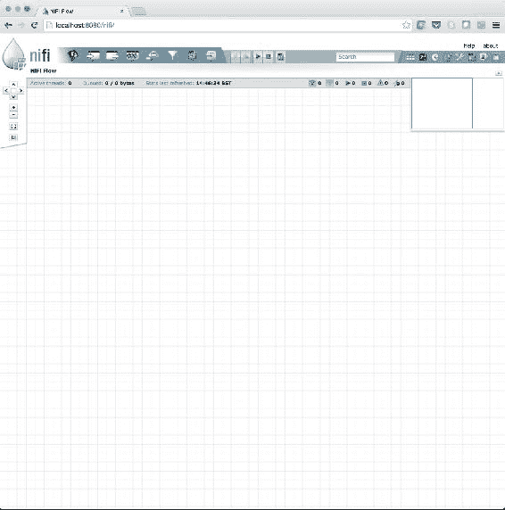

我们将 NiFi 的安装留给读者自己去练习，我们鼓励您这样做，因为我们将在接下来的部分中使用它。

## 介绍 GDELT 新闻流

希望现在我们已经启动并运行了 NiFi，并且可以开始摄入一些数据。因此，让我们从 GDELT 获取一些全球新闻媒体数据。以下是我们从 GDELT 网站[`blog.gdeltproject.org/gdelt-2-0-our-global-world-in-realtime/`](http://blog.gdeltproject.org/gdelt-2-0-our-global-world-in-realtime/)中摘取的简要信息：

在 GDELT 监控世界各地的新闻报道发布后的 15 分钟内，它已经将其翻译并加工处理，以识别所有事件、计数、引用、人物、组织、地点、主题、情感、相关图像、视频和嵌入式社交媒体帖子，并将其放入全球背景中，并通过实时开放的元数据火线提供所有这些内容，从而实现对地球本身的开放研究。

作为世界上最大的情感分析部署，我们希望通过将跨越多种语言和学科的许多情感和主题维度实时应用于来自全球各地的突发新闻，从而激发我们对情感的全新时代，以及它如何帮助我们更好地理解我们如何情境化、解释、回应和理解全球事件的方式。

我认为这是一个相当具有挑战性的任务！因此，与其拖延，暂停在这里指定细节，不如立即开始。我们将在接下来的章节中使用 GDELT 的各个方面。

为了开始使用这些开放数据，我们需要连接到元数据火线并将新闻流引入我们的平台。我们该如何做呢？让我们首先找出可用的数据。

### 实时发现 GDELT

GDELT 在其网站上发布了最新文件的列表。该列表每 15 分钟更新一次。在 NiFi 中，我们可以设置一个数据流，该数据流将轮询 GDELT 网站，从此列表中获取文件，并将其保存到 HDFS，以便我们以后使用。

在 NiFi 数据流设计师中，通过将处理器拖放到画布上并选择`GetHTTP`功能来创建一个 HTTP 连接器。

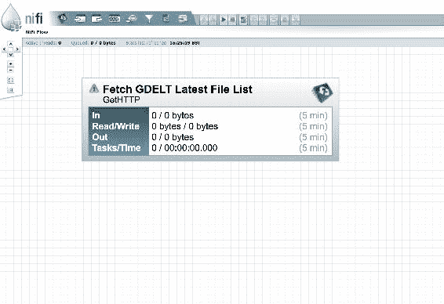

要配置此处理器，您需要输入文件列表的 URL，如下所示：

[`data.gdeltproject.org/gdeltv2/lastupdate.txt`](http://data.gdeltproject.org/gdeltv2/lastupdate.txt)

还要为您将要下载的文件列表提供一个临时文件名。在下面的示例中，我们使用了 NiFi 的表达式语言来生成一个通用唯一键，以便不会覆盖文件（`UUID()`）。

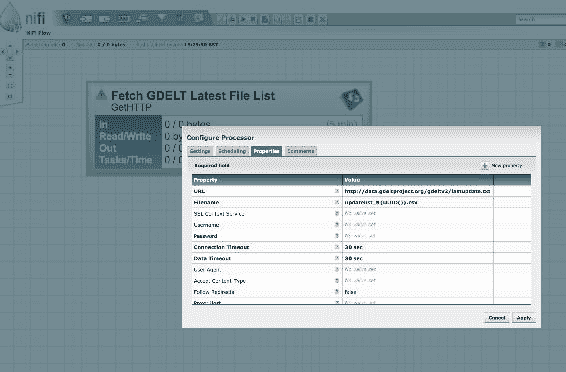

值得注意的是，对于这种类型的处理器（`GetHTTP`方法），NiFi 支持多种调度和定时选项，用于轮询和检索。目前，我们将使用默认选项，让 NiFi 为我们管理轮询间隔。

最新的 GDELT 文件列表示例如下：

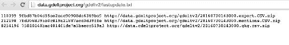

接下来，我们将解析 GKG 新闻流的 URL，以便稍后可以获取它。通过将处理器拖放到画布上并选择`ExtractText`来创建一个正则表达式解析器。现在，将新处理器放在现有处理器下面，并从顶部处理器向底部处理器拖动一条线。最后，在弹出的连接对话框中选择`success`关系。

这在以下示例中显示：

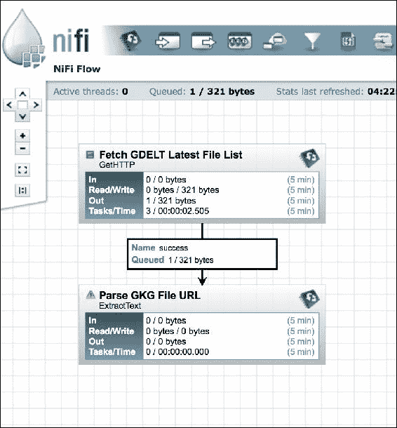

接下来，让我们配置`ExtractText`处理器，使用一个只匹配文件列表相关文本的正则表达式，例如：

```scala
([^ ]*gkg.csv.*) 

```

从这个正则表达式中，NiFi 将创建一个新的属性（在本例中称为`url`），与流程设计相关联，每个特定实例通过流程时都会采用新值。它甚至可以配置为支持多个线程。

同样，这个示例如下所示：

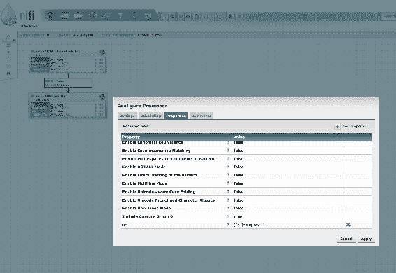

值得注意的是，虽然这是一个相当具体的例子，但这种技术是故意通用的，可以在许多情况下使用。

### 我们的第一个 GDELT 数据源

现在我们有了 GKG 数据源的 URL，通过配置`InvokeHTTP`处理器来使用我们之前创建的`url`属性作为其远程端点，并像以前一样拖动线。

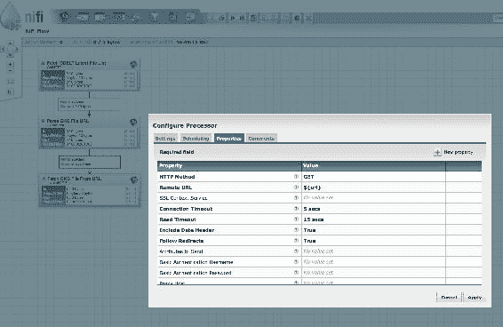

现在剩下的就是使用`UnpackContent`处理器（使用基本的`.zip`格式）解压缩压缩内容，并使用`PutHDFS`处理器保存到 HDFS，如下所示：

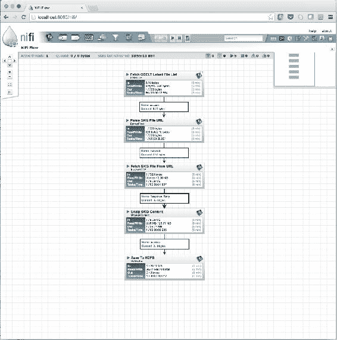

### 改进发布和订阅

到目前为止，这个流程看起来非常*点对点*，这意味着如果我们要引入新的数据消费者，例如 Spark-streaming 作业，流程必须更改。例如，流程设计可能必须更改为如下所示：

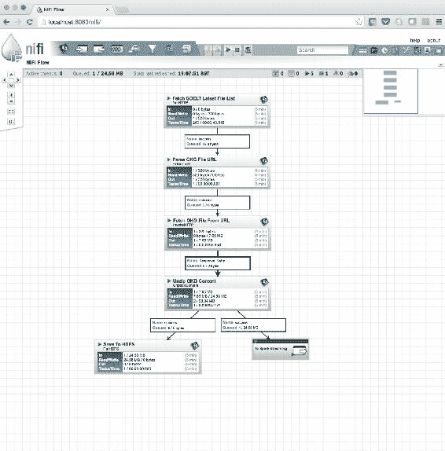

如果我们再添加另一个，流程必须再次更改。事实上，每次添加新的消费者时，流程都会变得更加复杂，特别是当所有错误处理都添加进去时。显然，这并不总是可取的，因为引入或移除数据的消费者（或生产者）可能是我们经常甚至频繁想要做的事情。此外，尽可能保持流程简单和可重用也是一个好主意。

因此，为了更灵活的模式，我们可以将数据发布到*Apache Kafka*，而不是直接写入 HDFS。这使我们能够随时添加和移除消费者，而不必更改数据摄入管道。如果需要，我们还可以从 Kafka 向 HDFS 写入，甚至可以通过设计一个单独的 NiFi 流程，或者直接使用 Spark-streaming 连接到 Kafka。

为了做到这一点，我们通过将处理器拖放到画布上并选择`PutKafka`来创建一个 Kafka 写入器。

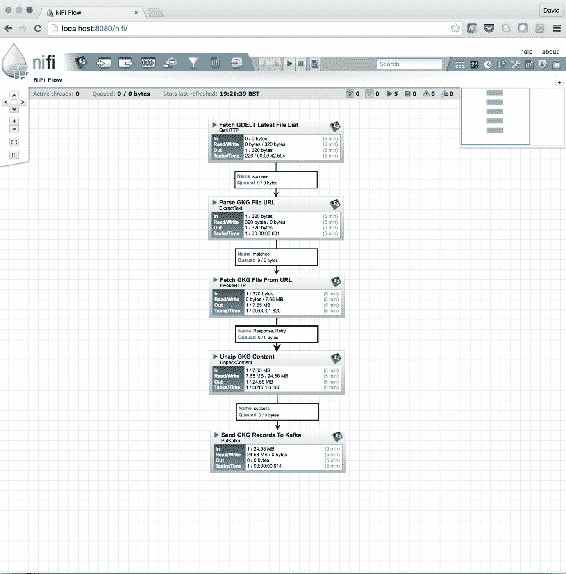

我们现在有了一个简单的流程，不断轮询可用文件列表，定期检索新流的最新副本，解压内容，并将其逐条记录流入 Kafka，这是一个持久的、容错的、分布式消息队列，用于 Spark-streaming 处理或在 HDFS 中存储。而且，这一切都不需要写一行 bash 代码！

# 内容注册

我们在本章中看到，数据摄入是一个经常被忽视的领域，它的重要性不容小觑。在这一点上，我们有一个管道，使我们能够从源头摄入数据，安排摄入，并将数据定向到我们选择的存储库。但故事并不会在这里结束。现在我们有了数据，我们需要履行我们的数据管理责任。进入*内容注册*。

我们将建立一个与我们摄入的数据相关的元数据索引。数据本身仍将被定向到存储（在我们的示例中是 HDFS），但另外，我们将存储有关数据的元数据，以便我们可以跟踪我们收到的数据，并了解一些基本信息，例如我们何时收到它，它来自哪里，它有多大，它是什么类型，等等。

## 选择和更多选择

我们使用的存储元数据的技术选择是基于知识和经验的。对于元数据索引，我们至少需要以下属性：

+   易于搜索

+   可扩展的

+   并行写入能力

+   冗余

有许多满足这些要求的方法，例如我们可以将元数据写入 Parquet，存储在 HDFS 中，并使用 Spark SQL 进行搜索。然而，在这里，我们将使用*Elasticsearch*，因为它更好地满足了要求，特别是因为它通过 REST API 方便地进行低延迟查询我们的元数据，这对于创建仪表板非常有用。事实上，Elasticsearch 具有与**Kibana**直接集成的优势，这意味着它可以快速生成我们内容注册的丰富可视化。因此，出于这个原因，我们将考虑使用 Elasticsearch。

## 随波逐流

使用我们当前的 NiFi 管道流，让我们从“从 URL 获取 GKG 文件”中分叉输出，以添加一组额外的步骤，以允许我们在 Elasticsearch 中捕获和存储这些元数据。这些是：

1.  用我们的元数据模型替换流内容。

1.  捕获元数据。

1.  直接存储在 Elasticsearch 中。

在 NiFi 中的样子如下：

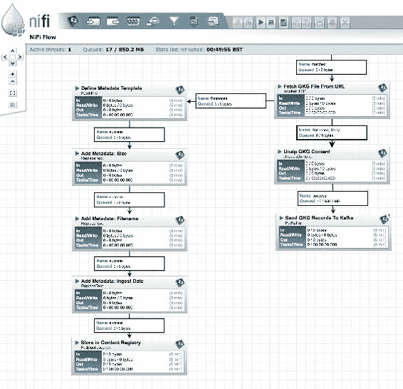

## 元数据模型

因此，这里的第一步是定义我们的元数据模型。有许多方面可以考虑，但让我们选择一组可以帮助解决之前讨论中的一些关键问题的集合。如果需要，这将为将来进一步添加数据提供一个良好的基础。因此，让我们保持简单，使用以下三个属性：

+   文件大小

+   摄取日期

+   文件名

这些将提供接收文件的基本注册。

接下来，在 NiFi 流程中，我们需要用这个新的元数据模型替换实际的数据内容。一个简单的方法是，从我们的模型中创建一个 JSON 模板文件。我们将它保存到本地磁盘，并在`FetchFile`处理器中使用它，以用这个骨架对象替换流的内容。这个模板会看起来像这样：

```scala
{ 
  "FileSize": SIZE, 
  "FileName": "FILENAME", 
  "IngestedDate": "DATE" 
} 

```

请注意在属性值的位置上使用了占位符名称（`SIZE, FILENAME, DATE`）。这些将逐个被一系列`ReplaceText`处理器替换，这些处理器使用 NiFi 表达式语言提供的正则表达式，例如`DATE`变成`${now()}`。

最后一步是将新的元数据负载输出到 Elasticsearch。同样，NiFi 已经准备了一个处理器来实现这一点；`PutElasticsearch`处理器。

Elasticsearch 中的一个元数据条目示例：

```scala
{
         "_index": "gkg",
         "_type": "files",
         "_id": "AVZHCvGIV6x-JwdgvCzW",
         "_score": 1,
         "source": {
            "FileSize": 11279827,
            "FileName": "20150218233000.gkg.csv.zip",
            "IngestedDate": "2016-08-01T17:43:00+01:00"
         }
```

现在我们已经添加了收集和查询元数据的能力，我们现在可以访问更多可用于分析的统计数据。这包括：

+   基于时间的分析，例如，随时间变化的文件大小

+   数据丢失，例如，时间轴上是否有数据空缺？

如果需要特定的分析，NIFI 元数据组件可以进行调整以提供相关的数据点。事实上，可以构建一个分析来查看历史数据，并根据需要更新索引，如果当前数据中不存在元数据。

## Kibana 仪表板

在本章中我们多次提到了 Kibana。现在我们在 Elasticsearch 中有了元数据索引，我们可以使用该工具来可视化一些分析。这个简短的部分的目的是为了演示我们可以立即开始对数据进行建模和可视化。要查看 Kibana 在更复杂的场景中的使用，请参阅第九章*，新闻词典和实时标记系统*。在这个简单的示例中，我们完成了以下步骤：

1.  在**设置**选项卡中添加了我们的 GDELT 元数据的 Elasticsearch 索引。

1.  在**发现**选项卡下选择文件大小。

1.  选择**可视化**以文件大小。

1.  将`聚合`字段更改为`范围`。

1.  输入范围的值。

生成的图显示了文件大小的分布：

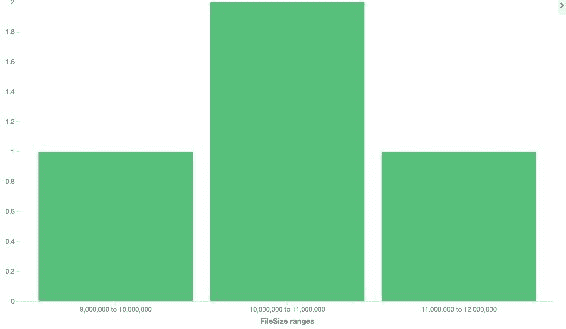

从这里开始，我们可以自由地创建新的可视化，甚至是一个功能齐全的仪表板，用于监控我们文件摄取的状态。通过增加从 NiFi 写入 Elasticsearch 的元数据的多样性，我们可以在 Kibana 中提供更多字段，甚至可以从这里开始我们的数据科学之旅，获得一些基于摄取的可操作见解。

现在我们有一个完全运行的数据管道，为我们提供实时数据源，那么我们如何确保接收到的数据质量呢？让我们看看有哪些选项。

# 质量保证

实施了初始数据摄取能力，并将数据流入平台后，您需要决定“前门”需要多少质量保证。可以完全没有初始质量控制，并随着时间和资源的允许逐渐建立起来（对历史数据进行回顾扫描）。但是，最好从一开始就安装基本的验证。例如，基本检查，如文件完整性、奇偶校验、完整性、校验和、类型检查、字段计数、过期文件、安全字段预填充、去规范化等。

您应该注意，您的前期检查不要花费太长时间。根据您的检查强度和数据的大小，遇到无法在下一个数据集到达之前完成所有处理的情况并不罕见。您始终需要监视您的集群资源，并计算最有效的时间利用方式。

以下是一些粗略容量规划计算的示例：

## 示例 1 - 基本质量检查，没有竞争用户

+   数据每 15 分钟摄取一次，从源头拉取需要 1 分钟

+   质量检查（完整性、字段计数、字段预填充）需要 4 分钟

+   计算集群上没有其他用户

*其他任务*有 10 分钟的资源可用。

由于集群上没有其他用户，这是令人满意的-不需要采取任何行动。

## 示例 2 - 高级质量检查，没有竞争用户

+   数据每 15 分钟摄取一次，从源头拉取需要 1 分钟

+   质量检查（完整性、字段计数、字段预填充、去规范化、子数据集构建）需要 13 分钟

+   计算集群上没有其他用户

*其他任务*只有 1 分钟的资源可用。

您可能需要考虑：

+   配置资源调度策略

+   减少摄取的数据量

+   减少我们进行的处理量

+   向集群添加额外的计算资源

## 示例 3 - 基本质量检查，由于竞争用户，效用度为 50%

+   数据每 15 分钟摄取一次，从源头拉取需要 1 分钟

+   质量检查（完整性、字段计数、字段预填充）需要 4 分钟（100%效用）

+   计算集群上有其他用户

*其他任务有 6 分钟的资源可用（15-1-(4 *（100/50）)）。由于还有其他用户，存在无法完成处理并出现作业积压的危险。*

当遇到时间问题时，您有多种选择可以避免任何积压：

+   在某些时候协商独占资源的使用权

+   配置资源调度策略，包括：

+   YARN 公平调度程序：允许您定义具有不同优先级的队列，并通过在启动时设置`spark.yarn.queue`属性来定位您的 Spark 作业，以便始终优先考虑您的作业

+   动态资源分配：允许同时运行的作业自动扩展以匹配它们的利用率

+   Spark 调度程序池：允许您在使用多线程模型共享`SparkContext`时定义队列，并通过设置`spark.scheduler.pool`属性来定位您的 Spark 作业，以便每个执行线程都优先考虑

+   在集群安静时过夜运行处理作业

无论如何，您最终会对作业的各个部分的表现有一个很好的了解，然后就能够计算出可以提高效率的改变。在使用云提供商时，总是有增加更多资源的选项，但我们当然鼓励对现有资源进行智能利用-这样更具可扩展性，更便宜，并且建立数据专业知识。

# 总结

在本章中，我们详细介绍了 Apache NiFi GDELT 摄取管道的完整设置，包括元数据分支和对生成数据的简要介绍。本节非常重要，因为 GDELT 在整本书中被广泛使用，而 NiFi 方法是一种可扩展和模块化的数据来源方法。

在下一章中，我们将学习一旦数据到达后该如何处理数据，包括查看模式和格式。
