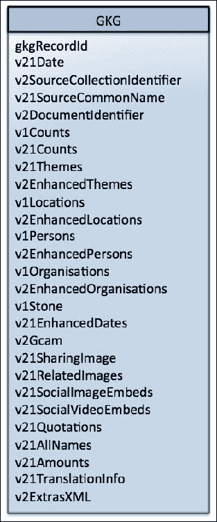
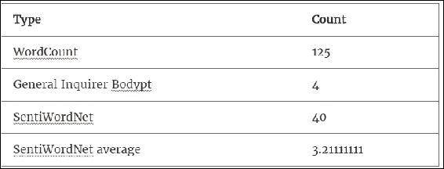
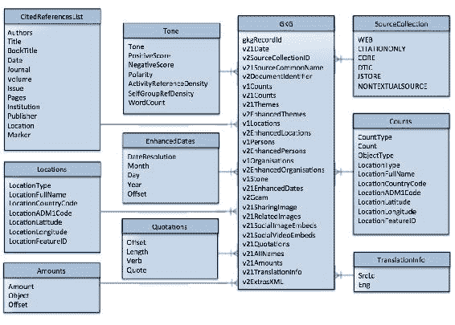
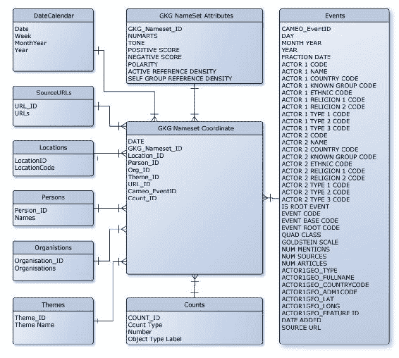
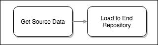

# 第三章：输入格式和模式

本章的目的是演示如何将数据从原始格式加载到不同的模式中，从而使得可以对相同的数据运行各种不同类型的下游分析。在编写分析报告，甚至更好的是构建可重用软件库时，通常需要使用固定输入类型的接口。因此，根据目的在不同模式之间灵活转换数据，可以在下游提供相当大的价值，无论是在扩大可能的分析类型还是重复使用现有代码方面。

我们的主要目标是了解伴随 Spark 的数据格式特性，尽管我们也将深入探讨数据管理的细节，介绍能够增强数据处理并提高生产力的成熟方法。毕竟，很可能在某个时候需要正式化您的工作，了解如何避免潜在的长期问题在撰写分析报告时和很久之后都是非常宝贵的。

考虑到这一点，我们将利用本章来研究传统上理解良好的*数据模式*领域。我们将涵盖传统数据库建模的关键领域，并解释一些这些基石原则如何仍然适用于 Spark。

此外，当我们磨练我们的 Spark 技能时，我们将分析 GDELT 数据模型，并展示如何以高效和可扩展的方式存储这个大型数据集。

我们将涵盖以下主题：

+   维度建模：与 Spark 相关的优点和缺点

+   关注 GDELT 模型

+   揭开按需模式的盖子

+   Avro 对象模型

+   Parquet 存储模型

让我们从一些最佳实践开始。

# 结构化生活是美好的生活

在了解 Spark 和大数据的好处时，您可能听过关于*结构化*数据与*半结构化*数据与*非结构化*数据的讨论。虽然 Spark 推广使用结构化、半结构化和非结构化数据，但它也为这些数据的一致处理提供了基础。唯一的约束是它应该是*基于记录*的。只要是基于记录的，数据集就可以以相同的方式进行转换、丰富和操作，而不管它们的组织方式如何。

然而，值得注意的是，拥有非结构化数据并不意味着采取非结构化的*方法*。在上一章中已经确定了探索数据集的技术，很容易就会有冲动直接将数据存储在可访问的地方，并立即开始简单的分析。在现实生活中，这种活动经常优先于尽职调查。再次，我们鼓励您考虑几个关键领域，例如文件完整性、数据质量、时间表管理、版本管理、安全性等等，在开始这项探索之前。这些都不应被忽视，许多都是非常重要的话题。

因此，虽然我们已经在第二章中涵盖了许多这些问题，*数据获取*，并且以后还会学习更多，例如在第十三章中，*安全数据*，但在本章中，我们将专注于数据输入和输出格式，探索一些我们可以采用的方法，以确保更好的数据处理和管理。

# GDELT 维度建模

由于我们选择在本书中使用 GDELT 进行分析，我们将首先介绍使用这个数据集的第一个示例。首先，让我们选择一些数据。

有两个可用的数据流：**全球知识图谱**（**GKG**）和**事件**。

对于本章，我们将使用 GKG 数据来创建一个可以从 Spark SQL 查询的时间序列数据集。这将为我们提供一个很好的起点，以创建一些简单的入门分析。

在接下来的章节中，第四章, *探索性数据分析* 和 第五章, *用于地理分析的 Spark*，我们将更详细地讨论，但仍然与 GKG 保持联系。然后，在第七章, *构建社区*，我们将通过生成自己的人员网络图来探索事件，并在一些酷炫的分析中使用它。

## GDELT 模型

GDELT 已经存在了 20 多年，在这段时间里经历了一些重大的修订。为了保持简单，让我们限制我们的数据范围从 2013 年 4 月 1 日开始，当时 GDELT 进行了一次重大的文件结构改革，引入了 GKG 文件。值得注意的是，本章讨论的原则适用于所有版本的 GDELT 数据，但是在此日期之前的特定模式和**统一资源标识符**（**URI**）可能与描述的不同。我们将使用的版本是 GDELT v2.1，这是撰写时的最新版本。但值得注意的是，这与 GDELT 2.0 只有轻微的不同。

GKG 数据中有两条数据轨道：

1.  整个知识图，以及它的所有字段。

1.  包含一组预定义类别的图的子集。

我们将首先查看第一条轨道。

### 首次查看数据

我们在第二章中讨论了如何下载 GDELT 数据，因此，如果您已经配置了 NiFi 管道来下载 GKG 数据，只需确保它在 HDFS 中可用。但是，如果您还没有完成该章节，我们鼓励您首先这样做，因为它解释了为什么应该采取结构化方法来获取数据。

虽然我们已经竭尽全力阻止临时数据下载的使用，但本章的范围当然是已知的，因此，如果您有兴趣跟随这里看到的示例，可以跳过使用 NiFi 直接获取数据（以便尽快开始）。

如果您希望下载一个样本，这里是在哪里找到 GDELT 2.1 GKG 主文件列表的提醒：

```scala
http://data.gdeltproject.org/gdeltv2/masterfilelist.txt
```

记下与`.gkg.csv.zip`匹配的最新条目，使用您喜欢的 HTTP 工具进行复制，并将其上传到 HDFS。例如：

```scala
wget http://data.gdeltproject.org/gdeltv2/20150218230000.gkg.csv.zip -o log.txt  
unzip 20150218230000.gkg.csv.zip 
hdfs dfs -put 20150218230000.gkg.csv /data/gdelt/gkg/2015/02/21/ 

```

现在您已经解压了 CSV 文件并将其加载到 HDFS 中，让我们继续并查看数据。

### 注意

在加载到 HDFS 之前，实际上不需要解压数据。Spark 的`TextInputFormat`类支持压缩类型，并且会自动解压缩。但是，由于我们在上一章中在 NiFi 管道中解压了内容，为了保持一致性，这里进行了解压缩。

### 核心全球知识图模型

有一些重要的原则需要理解，这将在长远来看节省时间，无论是在计算还是人力方面。就像许多 CSV 文件一样，这个文件隐藏了一些复杂性，如果在这个阶段不理解清楚，可能会在我们进行大规模分析时成为一个真正的问题。GDELT 文档描述了数据。可以在这里找到：[`data.gdeltproject.org/documentation/GDELT-Global_Knowledge_Graph_Codebook-V2.1.pdf`](http://data.gdeltproject.org/documentation/GDELT-Global_Knowledge_Graph_Codebook-V2.1.pdf)。

它表明每个 CSV 行都是以换行符分隔的，并且结构如*图 1*所示：



图 1 GDELT GKG v2.1

乍一看，这似乎是一个不错的简单模型，我们可以简单地查询一个字段并使用其中的数据，就像我们每天导入和导出到 Microsoft Excel 的 CSV 文件一样。然而，如果我们更详细地检查字段，就会清楚地看到一些字段实际上是对外部来源的引用，而另一些字段是扁平化的数据，实际上是由其他表表示的。

### 隐藏的复杂性

核心 GKG 模型中的扁平化数据结构代表了隐藏的复杂性。例如，查看文档中的 V2GCAM 字段，它概述了这样一个想法，即这是一个包含冒号分隔的键值对的逗号分隔块的系列，这些对表示 GCAM 变量及其相应计数。就像这样：

```scala
wc:125,c2.21:4,c10.1:40,v10.1:3.21111111

```

如果我们参考 GCAM 规范，[`data.gdeltproject.org/documentation/GCAM-MASTER-CODEBOOK.TXT`](http://data.gdeltproject.org/documentation/GCAM-MASTER-CODEBOOK.TXT)，我们可以将其翻译为：



还有其他以相同方式工作的字段，比如`V2Locations`，`V2Persons`，`V2Organizations`等等。那么，这里到底发生了什么？所有这些嵌套结构是什么意思？为什么选择以这种方式表示数据？实际上，事实证明，这是一种方便的方法，可以将*维度模型*折叠成单行记录，而不会丢失数据或交叉引用。事实上，这是一种经常使用的技术，称为*非规范化*。

### 非规范化模型

传统上，维度模型是一个包含许多事实和维度表的数据库表结构。它们通常被称为星型或雪花模式，因为它们在实体关系图中的外观。在这样的模型中，*事实*是一个可以计数或求和的值，通常在给定时间点提供测量。由于它们通常基于交易或重复事件，事实的数量很可能会变得非常庞大。另一方面，*维度*是信息的逻辑分组，其目的是为了限定或给事实提供背景。它们通常通过分组或聚合来解释事实的入口点。此外，维度可以是分层的，一个维度可以引用另一个维度。我们可以在*图 2*中看到扩展的 GKG 维度结构的图表。

在我们的 GCAM 示例中，事实是上表中的条目，维度是 GCAM 参考本身。虽然这可能看起来是一个简单的逻辑抽象，但这意味着我们有一个重要的关注点需要仔细考虑：维度建模对于传统数据库非常适用，其中数据可以分割成表 - 在这种情况下，GKG 和 GCAM 表 - 因为这些类型的数据库，本质上是针对这种结构进行了优化。例如，查找值或聚合事实的操作是本地可用的。然而，在使用 Spark 时，我们认为理所当然的一些操作可能非常昂贵。例如，如果我们想要对数百万条条目的所有 GCAM 字段进行平均，那么我们将有一个非常庞大的计算任务。我们将在下图中更详细地讨论这个问题：



图 2 GDELT GKG 2.1 扩展

### 扁平化数据的挑战

在探索了 GKG 数据模式之后，我们现在知道，这个分类法是一个典型的星型模式，有一个单一的事实表引用多个维度表。有了这种层次结构，如果我们需要以与传统数据库相同的方式切片和切块数据，我们肯定会遇到困难。

但是，是什么让在 Spark 上处理变得如此困难呢？让我们来看看这种类型组织固有的三个不同问题。

#### 问题 1 - 上下文信息的丢失

首先，数据集中的每条记录中使用的各种数组是一个问题。例如，`V1Locations`，`V1Organizations`和`V1Persons`字段都包含一个或多个对象的列表。由于我们没有用于获取此信息的原始文本（尽管有时我们可以获取到，如果来源是 WEB、JSTOR 等，因为这些将包含指向源文件的链接），我们失去了实体之间关系的上下文。

例如，如果我们的数据中有[Barack Obama, David Cameron, Francois Hollande, USA, France, GB, Texaco, Esso, Shell]，那么我们可以假设这篇文章与一场关于石油危机的国家元首会议有关。然而，这只是一个假设，也许并非如此，如果我们真的客观，我们同样可以假设这篇文章与拥有著名名字的公司有关。

为了帮助我们推断实体之间的关系，我们可以开发一个时间序列模型，它接受一定时间段内 GDELT 字段的所有个体内容，并执行扩展连接。因此，在简单的层面上，那些更常见的对可能更有关联，我们可以开始做一些更具体的假设。例如，如果我们在时间序列中看到[Barack Obama, USA]出现了 10 万次，而[Barack Obama, France]只出现了 5000 次，那么第一对之间很可能存在强关系，而第二对之间存在次要关系。换句话说，我们可以识别脆弱的关系，并在需要时移除它们。这种方法可以被用来在规模上识别明显无关的实体之间的关系。在第七章, *建立社区*中，我们使用这个原则来识别一些非常不太可能的人之间的关系！

#### 问题 2：重新建立维度

对于任何非规范化的数据，应该可以重建或膨胀原始的维度模型。考虑到这一点，让我们来看一个有用的 Spark 函数，它将帮助我们扩展数组并产生一个扁平化的结果；它被称为`DataFrame.explode`，下面是一个说明性的例子：

```scala
case class Grouped(locations:Array[String], people:Array[String]) 

val group = Grouped(Array("USA","France","GB"), 
       Array("Barack Obama","David Cameron", "Francois Hollande")) 

val ds = Seq(group).toDS 

ds.show 

+-----------------+--------------------+ 
|        locations|              people| 
+-----------------+--------------------+ 
|[USA, France, GB]|Barack Obama, Da...| 
+-----------------+--------------------+ 

val flatLocs = ds.withColumn("locations",explode($"locations")) 
flatLocs.show 

+---------+--------------------+ 
|Locations|              People| 
+---------+--------------------+ 
|      USA|[Barack Obama, Da...| 
|   France|[Barack Obama, Da...| 
|       GB|[Barack Obama, Da...| 
+---------+--------------------+ 

val flatFolk = flatLocs.withColumn("people",explode($"people")) 
flatFolk.show 

+---------+-----------------+ 
|Locations|           People| 
+---------+-----------------+ 
|      USA|     Barack Obama| 
|      USA|    David Cameron| 
|      USA|Francois Hollande| 
|   France|     Barack Obama| 
|   France|    David Cameron| 
|   France|Francois Hollande| 
|       GB|     Barack Obama| 
|       GB|    David Cameron| 
|       GB|Francois Hollande| 
+---------+-----------------+ 

```

使用这种方法，我们可以轻松扩展数组，然后执行我们选择的分组。一旦扩展，数据就可以使用`DataFrame`方法轻松聚合，甚至可以使用 SparkSQL 进行。我们的存储库中的 Zeppelin 笔记本中可以找到一个例子。

重要的是要理解，虽然这个函数很容易实现，但不一定高效，并且可能隐藏所需的底层处理复杂性。事实上，在本章附带的 Zeppelin 笔记本中有一个使用 GKG 数据的 explode 函数的例子，如果 explode 函数的范围不合理，那么函数会因为内存耗尽而返回堆空间问题。

这个函数并不能解决消耗大量系统资源的固有问题，因此在使用时仍需小心。虽然这个一般性问题无法解决，但可以通过仅执行必要的分组和连接，或者提前计算它们并确保它们在可用资源内完成来进行管理。你甚至可能希望编写一个算法，将数据集拆分并按顺序执行分组，每次持久化。我们在[第十四章中探讨了帮助我们解决这个问题以及其他常见处理问题的方法，*可扩展算法*。

#### 问题 3：包含参考数据

对于这个问题，让我们来看一下我们在*图 3*中扩展的 GDELT 事件数据：



图 3 GDELT 事件分类

这种图解表示方式引起了对数据关系的关注，并表明了我们可能希望如何扩展它。在这里，我们看到许多字段只是代码，需要将其翻译回原始描述，以呈现有意义的内容。例如，为了解释`Actor1CountryCode`（GDELT 事件），我们需要将事件数据与一个或多个提供翻译文本的单独参考数据集进行连接。在这种情况下，文档告诉我们参考位于这里的 CAMEO 数据集：[`data.gdeltproject.org/documentation/CAMEO.Manual.1.1b3.pdf`](http://data.gdeltproject.org/documentation/CAMEO.Manual.1.1b3.pdf)。

这种类型的连接在数据规模上一直存在严重问题，并且根据给定的情况有各种处理方法-在这个阶段重要的是要准确了解您的数据将如何使用，哪些连接可能需要立即执行，哪些可能推迟到将来的某个时候。

在我们选择在处理之前完全去规范化或展开数据的情况下，提前进行连接是有意义的。在这种情况下，后续的分析肯定会更有效，因为相关的连接已经完成：

因此，在我们的例子中：

```scala
wc:125,c2.21:4,c10.1:40,v10.1:3.21111111

```

对于记录中的每个代码，都要连接到相应的参考表，整个记录变为：

```scala
WordCount:125, General_Inquirer_Bodypt:4, SentiWordNet:40, SentiWordNet average: v10.1:3.21111111

```

这是一个简单的改变，但如果在大量行上执行，会占用大量磁盘空间。权衡的是，连接必须在某个时刻执行，可能是在摄取时或在摄取后作为定期批处理作业；将数据摄取为原样，并在方便用户的时候对数据集进行展开是完全合理的。无论如何，展开的数据可以被任何分析工具使用，数据分析师不需要关注这个潜在的隐藏问题。

另一方面，通常，推迟连接直到处理的后期可能意味着要连接的记录较少-因为可能在管道中有聚合步骤。在这种情况下，尽可能晚地连接到表是值得的，因为通常参考或维度表足够小，可以进行广播连接或映射端连接。由于这是一个如此重要的主题，我们将继续在整本书中探讨不同的处理连接场景的方法。

# 加载您的数据

正如我们在前几章中所概述的，传统的系统工程通常采用一种模式，将数据从其源移动到其目的地，即 ETL，而 Spark 倾向于依赖于读时模式。由于重要的是理解这些概念与模式和输入格式的关系，让我们更详细地描述这个方面：


表面上看，ETL 方法似乎是合理的，事实上，几乎每个存储和处理数据的组织都已经实施了这种方法。有一些非常受欢迎、功能丰富的产品非常擅长执行 ETL 任务-更不用说 Apache 的开源产品 Apache Camel 了[`camel.apache.org/etl-example.html`](http://camel.apache.org/etl-example.html)。

然而，这种表面上简单的方法掩盖了实施甚至简单数据管道所需的真正努力。这是因为我们必须确保所有数据在使用之前都符合固定的模式。例如，如果我们想要从起始目录摄取一些数据，最小的工作如下：

1.  确保我们始终关注接送目录。

1.  数据到达时，收集它。

1.  确保数据没有遗漏任何内容，并根据预定义的规则集进行验证。

1.  根据预定义的规则集提取我们感兴趣的数据部分。

1.  根据预定义的模式转换这些选定的部分。

1.  使用正确的版本化模式将数据加载到存储库（例如数据库）。

1.  处理任何失败的记录。

我们立即可以看到这里有一些必须解决的格式问题：

1.  我们有一个预定义的规则集，因此必须进行版本控制。任何错误都将意味着最终数据库中存在错误数据，并且需要通过 ETL 过程重新摄入数据以进行更正（非常耗时和资源密集）。对入站数据集格式的任何更改都将导致此规则集的更改。

1.  对目标模式的任何更改都需要非常谨慎的管理。至少，ETL 中需要进行版本控制的更改，甚至可能需要重新处理之前的一些或全部数据（这可能是一个非常耗时和昂贵的回程）。

1.  对终端存储库的任何更改都将导致至少一个版本控制模式的更改，甚至可能是一个新的 ETL 模块（再次非常耗时和资源密集）。

1.  不可避免地，会有一些错误数据进入数据库。因此，管理员需要制定规则来监控表的引用完整性，以确保损坏最小化，并安排重新摄入任何损坏的数据。

如果我们现在考虑这些问题，并大幅增加数据的数量、速度、多样性和真实性，很容易看出我们简单的 ETL 系统已经迅速发展成一个几乎无法管理的系统。任何格式、模式和业务规则的更改都将产生负面影响。在某些情况下，甚至可能没有足够的处理器和内存资源来跟上，因为需要进行所有的处理步骤。在所有 ETL 步骤达成一致并就位之前，数据无法被摄入。在大型公司中，可能需要数月时间来达成模式转换的一致意见，然后才能开始任何实施，从而导致大量积压，甚至丢失数据。所有这些都导致了一个难以改变的脆弱系统。

## 模式敏捷性

为了克服这一点，基于读取的模式鼓励我们转向一个非常简单的原则：*在运行时对数据应用模式，而不是在加载时应用模式（即，在摄入时）*。换句话说，当数据被读取进行处理时，会对数据应用模式。这在某种程度上简化了 ETL 过程：



当然，这并不意味着你完全消除了转换步骤。你只是*推迟*了验证、应用业务规则、错误处理、确保引用完整性、丰富、聚合和其他膨胀模型的行为，直到你准备使用它的时候。这个想法是，到了这个时候，你应该对数据有更多了解，当然也对你希望使用数据的方式有更多了解。因此，你可以利用对数据的增加了解来提高加载方法的效率。同样，这是一个权衡。你在前期处理成本上节省的部分，可能会在重复处理和潜在的不一致性上损失。然而，持久化、索引、记忆和缓存等技术都可以在这方面提供帮助。正如前一章所述，这个过程通常被称为 ELT，因为处理步骤的顺序发生了逆转。

这种方法的一个好处是，它允许更大的自由度，以便对数据的表示和建模方式做出适当的决策，以满足特定用例的相关特定要求。例如，数据可以以各种方式进行结构化、格式化、存储、压缩或序列化，因此选择最合适的方法是有意义的，考虑到你试图解决的特定问题集。

这种方法提供的最重要的机会之一是你可以选择如何物理布置数据，也就是决定数据存放的目录结构。通常不建议将所有数据存储在单个目录中，因为随着文件数量的增长，底层文件系统需要更长的时间来处理它们。但是，理想情况下，我们希望能够指定最小可能的数据拆分，以满足功能需求并有效地存储和检索所需的数据量。因此，数据应根据所需的分析和预期接收的数据量进行逻辑分组。换句话说，数据可以根据类型、子类型、日期、时间或其他相关属性分成不同的目录，但必须确保没有单个目录承担过重的负担。另一个重要的观点是，一旦数据落地，就可以在以后重新格式化或重新组织，而在 ETL 范式中，这通常更加困难。

此外，ELT 还可以对**变更管理**和**版本控制**产生意想不到的好处。例如，如果外部因素导致数据架构发生变化，您可以简单地将不同的数据加载到数据存储的新目录中，并使用灵活的模式容忍序列化库，如 Avro 或 Parquet，它们都支持**模式演化**（我们将在本章后面讨论这些）；或者，如果特定作业的结果不尽人意，我们只需要更改该作业的内部，然后重新运行它。这意味着模式更改变成了可以根据每个分析进行管理，而不是根据每个数据源进行管理，变更的影响得到了更好的隔离和管理。

顺便说一句，值得考虑一种混合方法，特别适用于流式使用情况，即在收集和摄取过程中可以进行一些处理，而在运行时可以进行其他处理。关于使用 ETL 或 ELT 的决定并不一定是二元的。Spark 提供了功能，让您控制数据管道。这为您提供了在合适的时候转换或持久化数据的灵活性，而不是采用一刀切的方法。

确定采取哪种方法的最佳方式是从特定数据集的实际日常使用中学习，并相应地调整其处理，随着经验的积累，识别瓶颈和脆弱性。还可能会有公司规定，如病毒扫描或数据安全，这将决定特定的路线。我们将在本章末尾更深入地讨论这一点。

### 现实检验

与计算机中的大多数事物一样，没有银弹。ELT 和基于读取的模式不会解决所有数据格式化问题，但它们是工具箱中有用的工具，一般来说，优点通常大于缺点。然而，值得注意的是，如果不小心，有时会引入困难的情况。

特别是在复杂数据模型上执行临时分析可能更加复杂（与数据库相比）。例如，在简单情况下，从新闻文章中提取提到的所有城市的名称列表，在 SQL 数据库中，您可以基本上运行`select CITY from GKG`，而在 Spark 中，您首先需要了解数据模型，解析和验证数据，然后创建相关表并在运行时处理任何错误，有时每次运行查询都要这样做。

再次强调，这是一个权衡。使用 schema-on-read，您失去了内置的数据表示和固定模式的固有知识，但您获得了根据需要应用不同模型或视图的灵活性。像往常一样，Spark 提供了旨在帮助利用这种方法的功能，例如转换、`DataFrames`、`SparkSQL`和 REPL，当正确使用时，它们允许您最大限度地利用 schema-on-read 的好处。随着我们的学习，我们将进一步了解这一点。

## GKG ELT

由于我们的 NiFi 管道将数据原样写入 HDFS，我们可以充分利用 schema-on-read，并立即开始使用它，而无需等待它被处理。如果您想要更加先进，那么您可以以可分割和/或压缩的格式（例如`bzip2`，Spark 原生支持）加载数据。让我们看一个简单的例子。

### 注意

HDFS 使用块系统来存储数据。为了以最有效的方式存储和利用数据，HDFS 文件应尽可能可分割。例如，如果使用`TextOutputFormat`类加载 CSV GDELT 文件，那么大于块大小的文件将被分割成文件大小/块大小的块。部分块不会占据磁盘上的完整块大小。

通过使用`DataFrames`，我们可以编写 SQL 语句来探索数据，或者使用数据集我们可以链接流畅的方法，但在任何情况下都需要一些初始准备。

好消息是，通常这可以完全由 Spark 完成，因为它支持通过 case 类将数据透明地加载到数据集中，使用**Encoders**，所以大部分时间您不需要过多地担心内部工作。事实上，当您有一个相对简单的数据模型时，通常定义一个 case 类，将数据映射到它，并使用`toDS`方法转换为数据集就足够了。然而，在大多数现实世界的场景中，数据模型更复杂，您将需要编写自己的自定义解析器。自定义解析器在数据工程中并不新鲜，但在 schema-on-read 设置中，它们通常需要被数据科学家使用，因为数据的解释是在运行时而不是加载时完成的。以下是我们存储库中可找到的自定义 GKG 解析器的使用示例：

```scala

import org.apache.spark.sql.functions._      

val rdd = rawDS map GdeltParser.toCaseClass    
val ds = rdd.toDS()     

// DataFrame-style API 
ds.agg(avg("goldstein")).as("goldstein").show()    

// Dataset-style API 
ds.groupBy(_.eventCode).count().show() 

```

您可以看到，一旦数据被解析，它可以在各种 Spark API 中使用。

如果您更喜欢使用 SQL，您可以定义自己的模式，注册一个表，并使用 SparkSQL。在任何一种方法中，您都可以根据数据的使用方式选择如何加载数据，从而更灵活地决定您花费时间解析的方面。例如，加载 GKG 的最基本模式是将每个字段都视为字符串，就像这样：

```scala
import org.apache.spark.sql.types._ 

val schema = StructType(Array( 
    StructField("GkgRecordId"           , StringType, true), 
    StructField("V21Date"               , StringType, true), 
    StructField("V2SrcCollectionId"     , StringType, true),        
    StructField("V2SrcCmnName"          , StringType, true),  
    StructField("V2DocId"               , StringType, true),  
    StructField("V1Counts"              , StringType, true),  
    StructField("V21Counts"             , StringType, true),  
    StructField("V1Themes"              , StringType, true),  
    StructField("V2Themes"              , StringType, true),  
    StructField("V1Locations"           , StringType, true),  
    StructField("V2Locations"           , StringType, true),  
    StructField("V1Persons"             , StringType, true),  
    StructField("V2Persons"             , StringType, true),  
    StructField("V1Orgs"                , StringType, true),  
    StructField("V2Orgs"                , StringType, true),  
    StructField("V15Tone"               , StringType, true),  
    StructField("V21Dates"              , StringType, true),  
    StructField("V2GCAM"                , StringType, true),  
    StructField("V21ShareImg"           , StringType, true),  
    StructField("V21RelImg"             , StringType, true),  
    StructField("V21SocImage"           , StringType, true), 
    StructField("V21SocVideo"           , StringType, true),  
    StructField("V21Quotations"         , StringType, true),  
    StructField("V21AllNames"           , StringType, true),  
    StructField("V21Amounts"            , StringType, true), 
    StructField("V21TransInfo"          , StringType, true),  
    StructField("V2ExtrasXML"           , StringType, true)   
)) 

val filename="path_to_your_gkg_files"  

val df = spark 
   .read 
   .option("header", "false") 
   .schema(schema) 
   .option("delimiter", "t") 
   .csv(filename) 

df.createOrReplaceTempView("GKG") 

```

现在你可以执行 SQL 查询，就像这样：

```scala
spark.sql("SELECT V2GCAM FROM GKG LIMIT 5").show 
spark.sql("SELECT AVG(GOLDSTEIN) AS GOLDSTEIN FROM GKG WHERE GOLDSTEIN IS NOT NULL").show() 

```

通过这种方法，您可以立即开始对数据进行概要分析，这对许多数据工程任务都是有用的。当您准备好时，您可以选择 GKG 记录的其他元素进行扩展。我们将在下一章中更多地了解这一点。

一旦你有了一个 DataFrame，你可以通过定义一个 case 类和转换来将其转换为一个 Dataset，就像这样：

```scala
val ds = df.as[GdeltEntity] 

```

### 位置很重要

值得注意的是，当从 CSV 加载数据时，Spark 的模式匹配完全是*位置*的。这意味着，当 Spark 根据给定的分隔符对记录进行标记时，它将根据其位置将每个标记分配给模式中的一个字段，即使存在标题。因此，如果在模式定义中省略了一个列，或者由于数据漂移或数据版本化而导致数据集随时间变化，您可能会遇到 Spark 不一定会警告您的错位！

因此，我们建议定期进行基本数据概要和数据质量检查，以减轻这些情况。您可以使用`DataFrameStatFunctions`中的内置函数来协助处理这些情况。一些示例如下所示：

```scala

df.describe("V1Themes").show 

df.stat.freqItems(Array("V2Persons")).show 

df.stat.crosstab("V2Persons","V2Locations").show 

```

接下来，让我们解释一种很好的方法来给我们的代码加上一些结构，并通过使用 Avro 或 Parquet 来减少编写的代码量。

# Avro

我们已经看到了如何轻松地摄取一些数据并使用 Spark 进行分析，而无需任何传统的 ETL 工具。在一个几乎忽略所有模式的环境中工作非常有用，但这在商业世界中并不现实。然而，有一个很好的折中方案，它比 ETL 和无限数据处理都有很大的优势-Avro。

Apache Avro 是一种序列化技术，类似于 Google 的协议缓冲。与许多其他序列化技术一样，Avro 使用模式来描述数据，但其有用性的关键在于它提供了以下功能：

+   **它将模式与数据一起存储**。这样可以有效地存储，因为模式只存储一次，位于文件顶部。这也意味着即使原始类文件不再可用，也可以读取数据。

+   **它支持读取时模式和模式演变**。这意味着它可以实现不同的模式来读取和写入数据，提供了模式版本控制的优势，而不会带来大量的行政开销，每次我们希望进行数据修改时。

+   **它是与语言无关的**。因此，它可以与允许自定义序列化框架的任何工具或技术一起使用。例如，直接写入 Hive 时特别有用。

Avro 将模式与封闭数据一起存储，它是*自描述的*。因此，我们可以简单地查询 Avro 文件，以获取写入数据的模式，而不是因为没有类而难以读取数据，或者尝试猜测哪个版本的模式适用，或者在最坏的情况下不得不放弃数据。

Avro 还允许以添加更改或附加的形式对模式进行修订，从而可以容纳这些更改，使特定实现向后兼容旧数据。

由于 Avro 以二进制形式表示数据，因此可以更有效地传输和操作。此外，由于其固有的压缩，它在磁盘上占用的空间更少。

基于上述原因，Avro 是一种非常流行的序列化格式，被广泛用于各种技术和终端系统，您无疑会在某个时候使用它。因此，在接下来的几节中，我们将演示读取和写入 Avro 格式数据的两种不同方法。第一种是一种优雅而简单的方法，使用一个名为`spark-avro`的第三方专门构建的库，第二种是一种底层方法，有助于理解 Avro 的工作原理。

## Spark-Avro 方法

为了解决实现 Avro 的复杂性，开发了`spark-avro`库。这可以像往常一样使用 maven 导入：

```scala

<dependency> 
    <groupId>com.databricks</groupId> 
    <artifactId>spark-avro_2.11</artifactId> 
    <version>3.1.0</version> 
</dependency> 

```

对于这个实现，我们将使用`StructType`对象创建 Avro 模式，使用`RDD`转换输入数据，并从中创建一个`DataFrame`。最后，可以使用`spark-avro`库将结果以 Avro 格式写入文件。

`StructType`对象是上面使用的`GkgCoreSchema`的变体，在第四章中也是如此，*探索性数据分析*，构造如下：

```scala
val GkgSchema = StructType(Array(
   StructField("GkgRecordId", GkgRecordIdStruct, true), 
   StructField("V21Date", LongType, true), 
   StructField("V2SrcCollectionId", StringType, true), 
   StructField("V2SrcCmnName", StringType, true), 
   StructField("V2DocId", StringType, true), 
   StructField("V1Counts", ArrayType(V1CountStruct), true),            
   StructField("V21Counts", ArrayType(V21CountStruct), true),           
   StructField("V1Themes", ArrayType(StringType), true),
   StructField("V2EnhancedThemes",ArrayType(EnhancedThemes),true),    
   StructField("V1Locations", ArrayType(V1LocationStruct), true),         
   StructField("V2Locations", ArrayType(EnhancedLocations), true), 
   StructField("V1Persons", ArrayType(StringType), true), 
   StructField("V2Persons", ArrayType(EnhancedPersonStruct), true),   
   StructField("V1Orgs", ArrayType(StringType), true), 
   StructField("V2Orgs", ArrayType(EnhancedOrgStruct), true),      
   StructField("V1Stone", V1StoneStruct, true), 
   StructField("V21Dates", ArrayType(V21EnhancedDateStruct), true),    
   StructField("V2GCAM", ArrayType(V2GcamStruct), true), 
   StructField("V21ShareImg", StringType, true), 
   StructField("V21RelImg", ArrayType(StringType), true), 
   StructField("V21SocImage", ArrayType(StringType), true), 
   StructField("V21SocVideo", ArrayType(StringType), true), 
   StructField("V21Quotations", ArrayType(QuotationStruct), true), 
   StructField("V21AllNames", ArrayType(V21NameStruct), true), 
   StructField("V21Amounts", ArrayType(V21AmountStruct), true), 
   StructField("V21TransInfo", V21TranslationInfoStruct, true), 
   StructField("V2ExtrasXML", StringType, true) 
 ))
```

我们已经使用了许多自定义`StructTypes`，可以为`GkgSchema`内联指定，但为了便于阅读，我们已经将它们拆分出来。

例如，`GkgRecordIdStruct`是：

```scala
val GkgRecordIdStruct = StructType(Array(
  StructField("Date", LongType),
  StructField("TransLingual", BooleanType),     
  StructField("NumberInBatch";, IntegerType)
))
```

在使用此模式之前，我们必须首先通过解析输入的 GDELT 数据生成一个`RDD`：

```scala
val gdeltRDD = sparkContext.textFile("20160101020000.gkg.csv")

val gdeltRowOfRowsRDD = gdeltRDD.map(_.split("\t"))
   .map(attributes =>
      Row(
       createGkgRecordID(attributes(0)),
       attributes(1).toLong,
       createSourceCollectionIdentifier(attributes(2),
       attributes(3),
       attributes(4),
       createV1Counts(attributes(5),
       createV21Counts(attributes(6),
       .
       .
       .
      )
   ))
```

在这里，您可以看到许多自定义解析函数，例如`createGkgRecordID`，它接受原始数据并包含读取和解释每个字段的逻辑。由于 GKG 字段复杂且通常包含*嵌套数据结构*，我们需要一种将它们嵌入`Row`中的方法。为了帮助我们，Spark 允许我们将它们视为`Rows`内部的`Rows`。因此，我们只需编写返回`Row`对象的解析函数，如下所示：

```scala
def createGkgRecordID(str: String): Row = {
   if (str != "") {
     val split = str.split("-")
     if (split(1).length > 1) {
       Row(split(0).toLong, true, split(1).substring(1).toInt)
     }
     else {
       Row(split(0).toLong, false, split(1).toInt)
     }
   }
   else {
     Row(0L, false, 0)
   }
 }
```

将代码放在一起，我们可以在几行代码中看到整个解决方案：

```scala
import org.apache.spark.sql.types._
import com.databricks.spark.avro._
import org.apache.spark.sql.Row

val df = spark.createDataFrame(gdeltRowOfRowsRDD, GkgSchema)

df.write.avro("/path/to/avro/output")
```

将 Avro 文件读入`DataFrame`同样简单：

```scala
val avroDF = spark
  .read
  .format("com.databricks.spark.avro")
  .load("/path/to/avro/output")
```

这为处理 Avro 文件提供了一个简洁的解决方案，但在幕后发生了什么呢？

## 教学方法

为了解释 Avro 的工作原理，让我们来看一个自定义解决方案。在这种情况下，我们需要做的第一件事是为我们打算摄取的数据版本或版本创建 Avro 模式。

有几种语言的 Avro 实现，包括 Java。这些实现允许您为 Avro 生成绑定，以便您可以高效地序列化和反序列化数据对象。我们将使用一个 maven 插件来帮助我们使用 GKG 模式的 Avro IDL 表示自动编译这些绑定。这些绑定将以 Java 类的形式存在，我们以后可以使用它们来帮助我们构建 Avro 对象。在您的项目中使用以下导入：

```scala
<dependency>  
   <groupId>org.apache.avro</groupId>  
   <artifactId>avro</artifactId>  
   <version>1.7.7</version>
</dependency>

<plugin>  
   <groupId>org.apache.avro</groupId>  
   <artifactId>avro-maven-plugin</artifactId>  
   <version>1.7.7</version>  
   <executions>    
      <execution>      
         <phase>generate-sources</phase>      
         <goals>        
            <goal>schema</goal>      
         </goals>      
         <configuration>           
           <sourceDirectory>
           ${project.basedir}/src/main/avro/
           </sourceDirectory>          
           <outputDirectory>
              ${project.basedir}/src/main/java/
           </outputDirectory>         
         </configuration>    
      </execution>  
   </executions>
</plugin>
```

现在我们可以看一下我们从可用 Avro 类型的子集创建的 Avro IDL 模式：

```scala
+----------------+-------------+
|       primitive|      complex|
+----------------+-------------+
|null            |       record|
|Boolean         |         enum|
|int             |        array|
|long            |          map|
|float           |        union|
|double          |        fixed|
|bytes           |             |
|string          |             |
+----------------+-------------+
Avro provides an extensible type system that supports **custom types**. It's also modular and offers namespaces, so that we can add new types and reuse custom types as the schema evolves. In the preceding example, we can see primitive types extensively used, but also custom objects such as `org.io.gzet.gdelt.gkg.v1.Location`.To create Avro files, we can use the following code (full example in our code repository):

```

val inputFile = new File（“gkg.csv”）;

val outputFile = new File（“gkg.avro”）;

val userDatumWriter = new

SpecificDatumWriter[Specification]（classOf[Specification]）

val dataFileWriter = new

DataFileWriter[Specification]（userDatumWriter）

dataFileWriter.create（Specification.getClassSchema，outputFile）

对于（line <- Source.fromFile（inputFile）.getLines（））

dataFileWriter.append（generateAvro（line））

dataFileWriter.close（）

def generateAvro（line：String）：Specification = {

val values = line.split（“\t”，-1）

如果 values.length == 27）{

val specification = Specification.newBuilder（）

.setGkgRecordId（createGkgRecordId（values{0}））

.setV21Date（values{1}.toLong）

.setV2SourceCollectionIdentifier(

createSourceCollectionIdentifier（values{2}））

.setV21SourceCommonName（values{3}）

.setV2DocumentIdentifier（values{4}）

.setV1Counts（createV1CountArray（values{5}））

.setV21Counts（createV21CountArray（values{6}））

.setV1Themes（createV1Themes（values{7}））

创建 V2EnhancedThemes（values{8}）

.setV1Locations（createV1LocationsArray（values{9}））

.

。

.

}

}

```scala

The `Specification` object is created for us once we compile our IDL (using the maven plugin). It contains all of the methods required to access the Avro model, for example `setV2EnhancedLocations`. We are then left with creating the functions to parse our GKG data; two examples are shown, as follows:

```

def createSourceCollectionIdentifier（str：String）：SourceCollectionIdentifier = {

str.toInt match {

情况 1 => SourceCollectionIdentifier.WEB

情况 2 => SourceCollectionIdentifier.CITATIONONLY

情况 3 => SourceCollectionIdentifier.CORE

情况 4 => SourceCollectionIdentifier.DTIC

情况 5 => SourceCollectionIdentifier.JSTOR

情况 6 => SourceCollectionIdentifier.NONTEXTUALSOURCE

情况 _ => SourceCollectionIdentifier.WEB

}

}

def createV1LocationsArray（str：String）：Array[Location] = {

val counts = str.split（“;”）

计数映射（createV1Location（_））

}

```scala

This approach creates the required Avro files, but it is shown here to demonstrate how Avro works. As it stands, this code does not operate in parallel and, therefore, should not be used on big data. If we wanted to parallelize it, we could create a custom `InputFormat`, wrap the raw data into an RDD, and perform the processing on that basis. Fortunately, we don't have to, as `spark-avro` has already done it for us.
```

## 何时执行 Avro 转换

为了最好地利用 Avro，接下来，我们需要决定何时最好转换数据。转换为 Avro 是一个相对昂贵的操作，因此应在最有意义的时候进行。再次，这是一个权衡。这一次，它是在灵活的数据模型支持非结构化处理、探索性数据分析、临时查询和结构化类型系统之间。有两个主要选项要考虑：

1.  **尽可能晚地转换**：可以在每次作业运行时执行 Avro 转换。这里有一些明显的缺点，所以最好考虑在某个时候持久化 Avro 文件，以避免重新计算。您可以在第一次懒惰地执行此操作，但很快就会变得混乱。更容易的选择是定期对静态数据运行批处理作业。该作业的唯一任务是创建 Avro 数据并将其写回磁盘。这种方法使我们完全控制转换作业的执行时间。在繁忙的环境中，可以安排作业在安静的时期运行，并且可以根据需要分配优先级。缺点是我们需要知道处理需要多长时间，以确保有足够的时间完成。如果处理在下一批数据到达之前没有完成，那么就会积压，并且很难赶上。

1.  **尽早转换**：另一种方法是创建一个摄取管道，其中传入的数据在飞行中转换为 Avro（在流式场景中特别有用）。通过这样做，我们有可能接近 ETL 式的场景，因此真的是一个判断，哪种方法最适合当前使用的特定环境。

现在，让我们看一下在 Spark 中广泛使用的相关技术，即 Apache Parquet。

# Parquet

Apache Parquet 是专为 Hadoop 生态系统设计的列式存储格式。传统的基于行的存储格式被优化为一次处理一条记录，这意味着它们对于某些类型的工作负载可能会很慢。相反，Parquet 通过列序列化和存储数据，从而允许对存储、压缩、谓词处理和大型数据集的批量顺序访问进行优化-这正是适合 Spark 的工作负载类型！

由于 Parquet 实现了按列数据压缩，因此特别适用于 CSV 数据，特别是低基数字段，与 Avro 相比，文件大小可以大大减小。

```scala
+--------------------------+--------------+ 
|                 File Type|          Size| 
+--------------------------+--------------+ 
|20160101020000.gkg.csv    |      20326266| 
|20160101020000.gkg.avro   |      13557119| 
|20160101020000.gkg.parquet|       6567110| 
|20160101020000.gkg.csv.bz2|       4028862| 
+--------------------------+--------------+ 

```

Parquet 还与 Avro 原生集成。Parquet 采用 Avro 内存表示的数据，并映射到其内部数据类型。然后，它使用 Parquet 列式文件格式将数据序列化到磁盘上。

我们已经看到如何将 Avro 应用于模型，现在我们可以迈出下一步，使用这个 Avro 模型通过 Parquet 格式将数据持久化到磁盘上。再次，我们将展示当前的方法，然后为了演示目的，展示一些更低级别的代码。首先是推荐的方法：

```scala
val gdeltAvroDF = spark 
    .read
    .format("com.databricks.spark.avro")
    .load("/path/to/avro/output")

gdeltAvroDF.write.parquet("/path/to/parquet/output")
```

现在让我们来详细了解 Avro 和 Parquet 之间的关系：

```scala
val inputFile = new File("("/path/to/avro/output ")
 val outputFile = new Path("/path/to/parquet/output")

 val schema = Specification.getClassSchema
 val reader =  new GenericDatumReaderIndexedRecord
 val avroFileReader = DataFileReader.openReader(inputFile, reader)

 val parquetWriter =
     new AvroParquetWriterIndexedRecord

 while(avroFileReader.hasNext)  {
     parquetWriter.write(dataFileReader.next())
 }

 dataFileReader.close()
 parquetWriter.close()

```

与之前一样，低级别的代码相当冗长，尽管它确实提供了对所需各种步骤的一些见解。您可以在我们的存储库中找到完整的代码。

现在我们有一个很好的模型来存储和检索我们的 GKG 数据，它使用 Avro 和 Parquet，并且可以很容易地使用`DataFrames`来实现。

# 总结

在本章中，我们已经看到为什么在进行太多的探索工作之前，数据集应该被彻底理解。我们已经讨论了结构化数据和维度建模的细节，特别是关于这如何适用于 GDELT 数据集，并扩展了 GKG 模型以展示其潜在复杂性。

我们已经解释了传统 ETL 和新的基于模式读取 ELT 技术之间的区别，并且已经触及了数据工程师在数据存储、压缩和数据格式方面面临的一些问题，特别是 Avro 和 Parquet 的优势和实现。我们还演示了使用各种 Spark API 来探索数据的几种方法，包括如何在 Spark shell 上使用 SQL 的示例。

我们可以通过提到我们的存储库中的代码将所有内容汇总，并且是一个用于读取原始 GKG 文件的完整模型（如果需要一些数据，请使用 Apache NiFi GDELT 数据摄取管道来自第一章，*数据获取*）。

在下一章中，我们将深入探讨 GKG 模型，探索用于大规模探索和分析数据的技术。我们将看到如何使用 SQL 开发和丰富我们的 GKG 数据模型，并调查 Apache Zeppelin 笔记本如何提供更丰富的数据科学体验。
