# 第四章：探索性数据分析

在商业环境中进行的**探索性数据分析**（EDA）通常作为更大的工作的一部分委托，这个工作是按照可行性评估的线索组织和执行的。这种可行性评估的目的，因此也是我们可以称之为*扩展 EDA*的焦点，是回答关于所检查的数据是否合适并且值得进一步投资的一系列广泛问题。

在这个一般性的任务下，数据调查预计将涵盖可行性的几个方面，包括在生产中使用数据的实际方面，如及时性、质量、复杂性和覆盖范围，以及适合于测试的预期假设。虽然其中一些方面从数据科学的角度来看可能不那么有趣，但这些以数据质量为主导的调查与纯粹的统计洞察力一样重要。特别是当涉及的数据集非常庞大和复杂，以及为数据科学准备数据所需的投资可能是巨大的时候。为了阐明这一点，并使主题更加生动，我们提出了对全球事件、语言和语调全球数据库（GDELT）项目提供的大规模和复杂的全球知识图（GKG）数据源进行探索的方法。

在本章中，我们将创建和解释一个 EDA，同时涵盖以下主题：

+   理解规划和构建扩展探索性数据分析的问题和设计目标

+   数据概要分析是什么，举例说明，并且如何围绕连续数据质量监控的技术形成一个通用框架

+   如何构建一个围绕该方法的通用*基于掩码的*数据概要分析器

+   如何将探索性指标存储到标准模式中，以便随时间研究指标的数据漂移，附有示例

+   如何使用 Apache Zeppelin 笔记本进行快速探索性数据分析工作，以及绘制图表和图形

+   如何提取和研究 GDELT 中的 GCAM 情感，包括时间序列和时空数据集

+   如何扩展 Apache Zeppelin 以使用`plot.ly`库生成自定义图表

# 问题、原则和规划

在本节中，我们将探讨为什么可能需要进行探索性数据分析，并讨论创建探索性数据分析时的重要考虑因素。

## 理解探索性数据分析问题

在进行 EDA 项目之前的一个困难问题是：*你能给我一个关于你提议的 EDA 成本的估算和分解吗？*

我们如何回答这个问题最终塑造了我们的探索性数据分析策略和战术。过去，对这个问题的回答通常是这样开始的：*基本上你按列付费……*这个经验法则是基于这样的前提：*数据探索工作的可迭代单元*，这些工作单元驱动了工作量的估算，从而决定了进行探索性数据分析的大致价格。

这个想法有趣的地方在于，工作单元的报价是以*需要调查的数据结构*而不是*需要编写的函数*来报价的。其原因很简单。假定数据处理管道的函数已经存在，而不是新的工作，因此所提供的报价实际上是配置新输入数据结构到我们标准的数据处理管道以探索数据的隐含成本。

这种思维方式使我们面临的主要探索性数据分析问题是，*探索*在规划任务和估算时间方面似乎很难确定。建议的方法是将探索视为配置驱动的任务。这有助于我们更有效地组织和估算工作，同时有助于塑造围绕配置的思维，而不是编写大量临时代码。

配置数据探索的过程也促使我们考虑可能需要的处理模板。我们需要根据我们探索的数据形式进行配置。例如，我们需要为结构化数据、文本数据、图形数据、图像数据、声音数据、时间序列数据和空间数据配置标准的探索流程。一旦我们有了这些模板，我们只需要将输入数据映射到它们，并配置摄入过滤器，以便对数据进行聚焦。

## 设计原则

为基于 Apache Spark 的 EDA 处理现代化这些想法意味着我们需要设计具有一些通用原则的可配置 EDA 函数和代码：

+   **易重用的函数/特性***：我们需要定义我们的函数以一般方式处理一般数据结构，以便它们产生良好的探索特性，并以最小的配置工作量将它们交付给新数据集

+   **最小化中间数据结构***：我们需要避免大量中间模式，帮助最小化中间配置，并在可能的情况下创建可重复使用的数据结构

+   **数据驱动配置***：在可能的情况下，我们需要生成可以从元数据中生成的配置，以减少手动样板工作

+   **模板化可视化***：从常见输入模式和元数据驱动的通用可重复使用的可视化

最后，虽然这不是一个严格的原则，但我们需要构建灵活的探索工具，以便发现数据结构，而不是依赖于严格预定义的配置。当出现问题时，这有助于我们通过帮助我们反向工程文件内容、编码或文件定义中的潜在错误来解决问题。

## 探索的一般计划

所有 EDA 工作的早期阶段都不可避免地基于建立数据质量的简单目标。如果我们在这里集中精力，创建一个广泛适用的通用*入门*计划，那么我们可以制定一般的任务集。

这些任务构成了拟议的 EDA 项目计划的一般形状，如下所示：

+   准备源工具，获取我们的输入数据集，审查文档等。必要时审查数据的安全性。

+   获取、解密并在 HDFS 中分阶段存储数据；收集用于规划的非功能性需求（NFRs）。

+   在文件内容上运行代码点级别的频率报告。

+   在文件字段中运行缺失数据量的人口统计检查。

+   运行低粒度格式分析器，检查文件中基数较高的字段。

+   在文件中对受格式控制字段运行高粒度格式分析器检查。

+   运行参照完整性检查，必要时。

+   运行字典检查，验证外部维度。

+   对数值数据进行基本的数字和统计探索。

+   对感兴趣的关键数据进行更多基于可视化的探索。

### 注意

在字符编码术语中，代码点或代码位置是构成代码空间的任何数字值。许多代码点代表单个字符，但它们也可以具有其他含义，例如用于格式化。

# 准备工作

现在我们有了一个行动的一般计划，在探索数据之前，我们必须首先投资于构建可重复使用的工具，用于进行探索流程的早期单调部分，帮助我们验证数据；然后作为第二步调查 GDELT 的内容。

## 引入基于掩码的数据分析

快速探索新类型数据的一种简单而有效的方法是利用基于掩码的数据分析。在这种情况下，*掩码*是将数据项泛化为特征的字符串转换函数，作为掩码集合，其基数将低于研究领域中原始值的基数。

当数据列被总结为掩码频率计数时，通常称为*数据概要*，它可以快速洞察字符串的常见结构和内容，从而揭示原始数据的编码方式。考虑以下用于探索数据的掩码：

+   将大写字母翻译为*A*

+   将小写字母翻译为*a*

+   将数字 0 到 9 翻译为*9*

乍一看，这似乎是一个非常简单的转换。例如，让我们将此掩码应用于数据的高基数字段，例如 GDELT GKG 文件的*V2.1 Source Common Name*字段。文档建议它记录了正在研究的新闻文章的来源的常见名称，通常是新闻文章被抓取的网站的名称，我们期望它包含域名，例如[nytimes.com](https://www.nytimes.com/)。

在 Spark 中实施生产解决方案之前，让我们在 Unix 命令行上原型化一个概要工具，以提供一个我们可以在任何地方运行的示例：

```scala
$ cat 20150218230000.gkg.csv | gawk -F"\t" '{print $4}' | \ 
  sed "s/[0-9]/9/g; s/[a-z]/a/g; s/[A-Z]/A/g" | sort |    \ 
  uniq -c | sort -r -n | head -20 

 232 aaaa.aaa 
 195 aaaaaaaaaa.aaa 
 186 aaaaaa.aaa 
 182 aaaaaaaa.aaa 
 168 aaaaaaa.aaa 
 167 aaaaaaaaaaaa.aaa 
 167 aaaaa.aaa 
 153 aaaaaaaaaaaaa.aaa 
 147 aaaaaaaaaaa.aaa 
 120 aaaaaaaaaaaaaa.aaa 

```

输出是在 Source Common Name 列中找到的记录的排序计数，以及正则表达式（regex）生成的掩码。通过查看这个*概要数据*的结果，应该很清楚该字段包含域名-或者是吗？因为我们只看了最常见的掩码（在这种情况下是前 20 个），也许在排序列表的另一端的长尾部分可能存在潜在的数据质量问题。

我们可以引入一个微妙的改变来提高我们的掩码函数的泛化能力，而不是只看前 20 个掩码，甚至是后 20 个。通过使正则表达式将小写字母的多个相邻出现折叠成一个`a`字符，掩码的基数可以减少，而不会真正减少我们解释结果的能力。我们可以通过对我们的正则表达式进行微小的改进来原型化这个改进，并希望在一个输出页面上查看所有的掩码：

```scala

$ # note: on a mac use gsed, on linux use sed. 
$ hdfs dfs -cat 20150218230000.gkg.csv |                 \ 
  gawk -F"\t" '{print $4}' | sed "s/[0-9]/9/g; s/[A-Z]/A/g; \ 
  s/[a-z]/a/g; s/a*a/a/g"| sort | uniq -c | sort -r -n 

2356 a.a 
 508 a.a.a 
  83 a-a.a 
  58 a99.a 
  36 a999.a 
  24 a-9.a 
  21 99a.a 
  21 9-a.a 
  15 a9.a 
  15 999a.a 
  12 a9a.a 
  11 a99a.a 
   8 a-a.a.a 
   7 9a.a 
   3 a-a-a.a 
   2 AAA Aa     <---note here the pattern that stands out 
   2 9a99a.a 
   2 9a.a.a 
   1 a9.a.a 
   1 a.99a.a 
   1 9a9a.a 
   1 9999a.a 

```

非常快地，我们原型化了一个掩码，将三千多个原始值缩减为一个非常短的列表，可以轻松地通过眼睛检查。由于长尾现在变得更短了，我们可以很容易地发现这个数据字段中可能的异常值，这些异常值可能代表质量问题或特殊情况。尽管是手动的，但这种类型的检查可能非常有力。

请注意，例如输出中有一个特定的掩码，`AAA Aa`，其中没有*点*，这与我们在域名中所期望的不符。我们解释这一发现意味着我们发现了两行不是有效域名的原始数据，而可能是一般描述符。也许这是一个错误，或者是所谓的*不合逻辑的字段使用*的例子，这意味着可能有其他值滑入了这一列，也许应该逻辑上属于其他地方。

这值得调查，而且很容易检查这两条记录。我们可以通过在原始数据旁边生成掩码，然后过滤掉有问题的掩码来定位原始字符串，以进行手动检查。

我们可以使用一个名为`bytefreq`（*字节频率*的缩写）的传统数据概要工具来检查这些记录，而不是在命令行上编写一个非常长的一行代码。它有开关来生成格式化报告、数据库准备的指标，还有一个开关来输出掩码和数据并排。我们已经为本书的读者开源了`bytefreq`，建议您尝试一下，以真正理解这种技术有多有用：[`bitbucket.org/bytesumo/bytefreq`](https://bitbucket.org/bytesumo/bytefreq)。

```scala
$ # here is a Low Granularity report from bytefreq
$ hdfs dfs –cat 20150218230000.gkg.csv |         \
gawk -F"\t" '{print $4}' | awk -F"," –f        \ ~/bytefreq/bytefreq_v1.04.awk -v header="0" -v report="0"  \
  -v grain="L"

-  ##column_100000001  2356  a.a    sfgate.com
-  ##column_100000001  508  a.a.a    theaustralian.com.au
-  ##column_100000001  109  a9.a    france24.com
-  ##column_100000001  83  a-a.a    news-gazette.com
-  ##column_100000001  44  9a.a    927thevan.com
-  ##column_100000001  24  a-9.a    abc-7.com
-  ##column_100000001  23  a9a.a    abc10up.com
-  ##column_100000001  21  9-a.a    4-traders.com
-  ##column_100000001  8  a-a.a.a  gazette-news.co.uk
-  ##column_100000001  3  9a9a.a    8points9seconds.com
-  ##column_100000001  3  a-a-a.a  the-american-interest.com
-  ##column_100000001  2  9a.a.a    9news.com.au
-  ##column_100000001  2  A Aa    BBC Monitoring
-  ##column_100000001  1  a.9a.a    vancouver.24hrs.ca
-  ##column_100000001  1  a9.a.a    guide2.co.nz

$ hdfs dfs -cat 20150218230000.gkg.csv | gawk                  \
-F"\t" '{print $4}'|gawk -F"," -f ~/bytefreq/bytefreq_v1.04.awk\
-v header="0" -v report="2" -v grain="L" | grep ",A Aa"

BBC Monitoring,A Aa
BBC Monitoring,A Aa
```

当我们检查奇怪的掩码`A Aa`时，我们可以看到找到的有问题的文本是`BBC Monitoring`，在重新阅读 GDELT 文档时，我们会发现这不是一个错误，而是一个已知的特殊情况。这意味着在使用这个字段时，我们必须记住处理这个特殊情况。处理它的一种方法可能是包括一个更正规则，将这个字符串值替换为一个更好的值，例如有效的域名[www.monitor.bbc.co.uk](http://www.monitor.bbc.co.uk)，这是文本字符串所指的数据源。

我们在这里介绍的想法是，掩码可以用作检索特定字段中有问题记录的*关键*。这种逻辑引导我们到基于掩码的分析的下一个主要好处：输出的掩码是一种*数据质量错误代码*。这些错误代码可以分为两类：*好*掩码的白名单，和用于查找低质量数据的*坏*掩码的黑名单。这样考虑，掩码就成为搜索和检索数据清理方法的基础，或者用于发出警报或拒绝记录。

这个教训是，我们可以创建*处理函数*来纠正使用特定掩码计算在特定字段数据上找到的原始字符串。这种思路导致了以下结论：我们可以创建一个围绕基于掩码的分析框架，用于在数据读取管道中进行数据质量控制和纠正。这具有一些非常有利的解决方案特性：

+   生成数据质量掩码是一个*读取*过程；我们可以接受新的原始数据并将其写入磁盘，然后在读取时，我们只在查询时需要时生成掩码 - 因此数据清理可以是一个动态过程。

+   处理函数可以动态应用于目标纠正工作，帮助在读取数据时清理我们的数据。

+   因为以前未见过的字符串被概括为掩码，即使从未见过这个确切的字符串，新字符串也可以被标记为存在质量问题。这种普遍性帮助我们减少复杂性，简化我们的流程，并创建可重用的智能解决方案 - 即使跨学科领域也是如此。

+   创建掩码的数据项如果不属于掩码白名单、修复列表或黑名单，可能会被隔离以供关注；人类分析师可以检查记录，并希望将它们列入白名单，或者创建新的处理函数，帮助将数据从隔离状态中取出并重新投入生产。

+   数据隔离可以简单地作为一个读取过滤器实施，当新的纠正函数被创建来清理或修复数据时，读取时自动应用的动态处理将自动将更正后的数据释放给用户，而不会有长时间的延迟。

+   最终将创建一个随时间稳定的数据质量处理库。新的工作主要是通过将现有处理映射并应用到新数据上来完成的。例如，电话号码重新格式化处理函数可以在许多数据集和项目中广泛重复使用。

现在解释了方法和架构的好处，构建一个通用的基于掩码的分析器的要求应该更清晰了。请注意，掩码生成过程是一个经典的 Hadoop MapReduce 过程：将输入数据映射到掩码，然后将这些掩码减少到总结的频率计数。还要注意的是，即使在这个简短的例子中，我们已经使用了两种类型的掩码，每种掩码都由一系列基础转换组成。这表明我们需要一个支持预定义掩码库的工具，同时也允许用户定义的掩码可以快速创建和按需使用。它还表明应该有方法来*堆叠*这些掩码，将它们组合成复杂的管道。

也许还不那么明显的是，以这种方式进行的所有数据概要都可以将概要度量写入*一个通用输出格式*。这有助于通过简化概要数据的记录、存储、检索和使用来提高我们代码的可重用性。

例如，我们应该能够使用以下模式报告所有基于掩码的概要度量：

```scala
Metric Descriptor 
Source Studied 
IngestTime 
MaskType 
FieldName 
Occurrence Count 
KeyCount   
MaskCount 
Description 

```

一旦我们的度量被捕获在这个单一的模式格式中，我们就可以使用用户界面（如 Zeppelin 笔记本）构建辅助报告。

在我们逐步实现这些函数之前，需要介绍一下字符类掩码，因为这些与普通的概要掩码略有不同。

## 引入字符类掩码

还有一种简单的数据概要类型，我们也可以应用它来帮助文件检查。它涉及对构成整个文件的实际字节进行概要。这是一种古老的方法，最初来自密码学，其中对文本中字母的频率进行分析用于在解密替换代码时获得优势。

虽然在今天的数据科学圈中并不常见，但在需要时，字节级分析是令人惊讶地有用。过去，数据编码是一个巨大的问题。文件以一系列代码页编码，跨 ASCII 和 EBCDIC 标准。字节频率报告通常是发现实际编码、分隔符和文件中使用的行结束的关键。那时，能够创建文件但在技术上无法描述它们的人数是令人惊讶的。如今，随着世界越来越多地转向基于 Unicode 的字符编码，这些古老的方法需要更新。在 Unicode 中，字节的概念被现代化为多字节*代码点*，可以使用以下函数在 Scala 中揭示。

```scala
val tst = "Andrew "

def toCodePointVector(input: String) = input.map{
    case (i) if i > 65535 =>
        val hchar = (i - 0x10000) / 0x400 + 0xD800
        val lchar = (i - 0x10000) % 0x400 + 0xDC00
        f"\\u$hchar%04x\\u$lchar%04x"
    case (i) if i > 0 => f"\\u$i%04x"
    // kudos to Ben Reich: http://k.bytefreq.com/1MjyvNz
    }

val out = toCodePointVector(tst)

val rows = sc.parallelize(out)
rows.countByValue().foreach(println)

// results in the following: [codepoint], [Frequency_count]
(\u0065,1)
(\u03d6,1)
(\u006e,1)
(\u0072,1)
(\u0077,1)
(\u0041,1)
(\u0020,2)
(\u6f22,1)
(\u0064,1)
(\u5b57,1)
```

利用这个函数，我们可以开始对我们在 GDELT 数据集中收到的任何国际字符级数据进行分析，并开始了解我们在利用数据时可能面临的复杂性。但是，与其他掩码不同，为了从代码点创建可解释的结果，我们需要一个字典，我们可以用它来查找有意义的上下文信息，比如 Unicode 类别和 Unicode 字符名称。

为了生成一个上下文查找，我们可以使用这个快速的命令行技巧从主要的[unicode.org](http://unicode.org)找到的字典中生成一个缩小的字典，这应该有助于我们更好地报告我们的发现：

```scala
$ wget ftp://ftp.unicode.org/Public/UNIDATA/UnicodeData.txt      
$ cat UnicodeData.txt | gawk -F";" '{OFS=";"} {print $1,$3,$2}' \ 
  | sed 's/-/ /g'| gawk '{print $1,$2}'| gawk -F";" '{OFS="\t"} \ 
  length($1) < 5 {print $1,$2,$3}' > codepoints.txt 

# use "hdfs dfs -put" to load codepoints.txt to hdfs, so  
# you can use it later 

head -1300 codepoints.txt | tail -4 
0513      Ll    CYRILLIC SMALL 
0514      Lu    CYRILLIC CAPITAL 
0515      Ll    CYRILLIC SMALL 
0516      Lu    CYRILLIC CAPITAL 

```

我们将使用这个字典，与我们发现的代码点结合起来，报告文件中每个字节的字符类频率。虽然这似乎是一种简单的分析形式，但结果往往会令人惊讶，并提供对我们处理的数据、其来源以及我们可以成功应用的算法和方法类型的法医级别的理解。我们还将查找一般的 Unicode 类别，以简化我们的报告，使用以下查找表：

```scala
Cc  Other, Control 
Cf  Other, Format 
Cn  Other, Not Assigned 
Co  Other, Private Use 
Cs  Other, Surrogate 
LC  Letter, Cased 
Ll  Letter, Lowercase 
Lm  Letter, Modifier 
Lo  Letter, Other 
Lt  Letter, Titlecase 
Lu  Letter, Uppercase 
Mc  Mark, Spacing Combining 
Me  Mark, Enclosing 
Mn  Mark, Nonspacing 
Nd  Number, Decimal Digit 
Nl  Number, Letter 
No  Number, Other 
Pc  Punctuation, Connector 
Pd  Punctuation, Dash 
Pe  Punctuation, Close 
Pf  Punctuation, Final quote 
Pi  Punctuation, Initial quote 
Po  Punctuation, Other 
Ps  Punctuation, Open 
Sc  Symbol, Currency 
Sk  Symbol, Modifier 
Sm  Symbol, Math 
So  Symbol, Other 
Zl  Separator, Line 
Zp  Separator, Paragraph 
Zs  Separator, Space 

```

## 构建基于掩码的概要度量

让我们通过创建一个基于笔记本的工具包来逐步分析 Spark 中的数据。我们将实现的掩码函数在几个细节粒度上设置，从文件级别到行级别，然后到字段级别：

1.  应用于整个文件的字符级掩码是：

+   Unicode 频率，UTF-16 多字节表示（也称为代码点），在文件级别

+   UTF 字符类频率，文件级别

+   分隔符频率，行级别

1.  应用于文件中字段的字符串级掩码是：

+   ASCII 低粒度概要，每个字段

+   ASCII 高粒度概要，每个字段

+   人口检查，每个字段

### 设置 Apache Zeppelin

由于我们将要通过可视化方式探索我们的数据，一个非常有用的产品是 Apache Zeppelin，它可以非常方便地混合和匹配技术。Apache Zeppelin 是 Apache 孵化器产品，使我们能够创建一个包含多种不同语言的笔记本或工作表，包括 Python、Scala、SQL 和 Bash，这使其非常适合使用 Spark 进行探索性数据分析。

代码以笔记本风格编写，使用*段落*（或单元格），其中每个单元格可以独立执行，这样可以轻松地处理小段代码，而无需反复编译和运行整个程序。它还作为生成任何给定输出所使用的代码的记录，并帮助我们集成可视化。

Zeppelin 可以快速安装和运行，最小安装过程如下所述：

+   从这里下载并提取 Zeppelin：[`zeppelin.incubator.apache.org/download.html`](https://zeppelin.incubator.apache.org/download.html)

+   找到 conf 目录并复制`zeppelin-env.sh.template`，命名为`zeppelin-env.sh`。

+   修改`zeppelin-env.sh`文件，取消注释并设置`JAVA_HOME`和`SPARK_HOME`条目为您机器上的相关位置。

+   如果您希望 Zeppelin 在 Spark 中使用 HDFS，请将`HADOOP_CONF_DIR`条目设置为您的 Hadoop 文件的位置；`hdfs-site.xml`，`core-site.xml`等。

+   启动 Zeppelin 服务：`bin/zeppelin-daemon.sh start`。这将自动获取`conf/zeppelin-env.sh`中所做的更改。

在我们的测试集群上，我们使用的是 Hortonworks HDP 2.6，Zeppelin 作为安装的一部分。

在使用 Zeppelin 时需要注意的一点是，第一段应始终声明外部包。任何 Spark 依赖项都可以使用`ZeppelinContext`以这种方式添加，以便在 Zeppelin 中的每次解释器重新启动后立即运行；例如：

```scala
%dep
z.reset
// z.load("groupId>:artifactId:version")
```

之后，我们可以在任何可用的语言中编写代码。我们将通过声明每个单元格的解释器类型（`%spark`，`%sql`和`%shell`）在笔记本中使用 Scala，SQL 和 Bash 的混合。如果没有给出解释器，Zeppelin 默认为 Scala Spark（`%spark`）。

您可以在我们的代码库中找到与本章配套的 Zeppelin 笔记本，以及其他笔记本。

### 构建可重用的笔记本

在我们的代码库中，我们创建了一个简单、可扩展、开源的数据分析库，也可以在这里找到：[`bytesumo@bitbucket.org/gzet_io/profilers.git`](https://bytesumo@bitbucket.org/gzet_io/profilers.git)

该库负责应用掩码到数据框架所需的框架，包括将文件的原始行转换为仅有一列的数据框架的特殊情况。我们不会逐行介绍该框架的所有细节，但最感兴趣的类在文件`MaskBasedProfiler.scala`中找到，该文件还包含每个可用掩码函数的定义。

使用此库的一个很好的方法是构建一个用户友好的笔记本应用程序，允许对数据进行可视化探索。我们已经为使用 Apache Zeppelin 进行分析准备了这样的笔记本。接下来，我们将演示如何使用前面的部分构建我们自己的笔记本。我们示例中的数据是 GDELT `event`文件，格式为简单的制表符分隔。

构建笔记本的第一步（甚至只是玩弄我们准备好的笔记本）是将`profilers-1.0.0.jar`文件从我们的库复制到集群上 Zeppelin 用户可以访问的本地目录中，对于 Hortonworks 安装来说，这是 Namenode 上 Zeppelin 用户的主目录。

```scala
git clone https://bytesumo@bitbucket.org/gzet_io/profilers.git 
sudo cp profilers-1.0.0.jar /home/zeppelin/. 
sudo ls /home/zeppelin/  

```

然后我们可以访问`http://{main.install.hostname}:9995`来访问 Apache Zeppelin 主页。从该页面，我们可以上传我们的笔记本并跟随，或者我们可以创建一个新的笔记本，并通过单击**创建新笔记**来构建我们自己的笔记本。

在 Zeppelin 中，笔记本的第一段是我们执行 Spark 代码依赖关系的地方。我们将导入稍后需要的分析器 jar 包：

```scala
%dep 
// you need to put the profiler jar into a directory 
// that Zeppelin has access to.  
// For example, /home/zeppelin, a non-hdfs directory on  
// the namenode. 
z.load("/home/zeppelin/profilers-1.0.0.jar") 
// you may need to restart your interpreter, then run  
// this paragraph 

```

在第二段中，我们包括一个小的 shell 脚本来检查我们想要分析的文件，以验证我们是否选择了正确的文件。请注意`column`和`colrm`的使用，它们都是非常方便的 Unix 命令，用于在命令行上检查列式表数据：

```scala
%sh
# list the first two files in the directory, make sure the header file exists
# note - a great trick is to write just the headers to a delimited file
# that sorts to the top of your file glob, a trick that works well with
# Spark’s csv reader where headers are not on each file you
# hold in hdfs.
# this is a quick inspection check, see we use column and
# colrm to format it:

hdfs dfs -cat "/user/feeds/gdelt/events/*.export.CSV" \
|head -4|column -t -s $'\t'|colrm 68

GlobalEventID  Day       MonthYear  Year  FractionDate  Actor1Code
610182939      20151221  201512     2015  2015.9616              
610182940      20151221  201512     2015  2015.9616              
610182941      20151221  201512     2015  2015.9616     CAN 
```

在第 3、4、5 和 6 段中，我们使用 Zeppelin 的用户输入框功能，允许用户配置 EDA 笔记本，就像它是一个真正的基于 Web 的应用程序一样。这允许用户配置四个变量，可以在笔记本中重复使用，以驱动进一步的调查：**YourMask**，**YourDelimiter**，**YourFilePath**和**YourHeaders**。当我们隐藏编辑器并调整窗口的对齐和大小时，这看起来很棒：

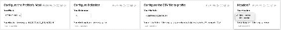

如果我们打开准备好的笔记本并点击任何这些输入段落上的**显示编辑器**，我们将看到我们如何设置它们以在 Zeppelin 中提供下拉框，例如：

```scala
val YourHeader = z.select("YourHeaders", Seq(  ("true", "HasHeader"), ("false", "No Header"))).toString 

```

接下来，我们有一个用于导入我们需要的函数的段落：

```scala
import io.gzet.profilers._ 
import sys.process._ 
import org.apache.spark.sql.SQLContext 
import org.apache.spark.sql.functions.udf 
import org.apache.spark.sql.types.{StructType, StructField, StringType, IntegerType} 
import org.apache.spark.sql.SaveMode 
import sqlContext.implicits._ 

```

然后我们继续到一个新的段落，配置和导入我们读取的数据：

```scala
val InputFilePath = YourFilePath    
// set our input to user's file glob 
val RawData = sqlContext.read                       
// read in tabular data 
        .option("header", YourHeader)               
// configurable headers 
        .option("delimiter", YourDelimiter )        
// configurable delimiters 
        .option("nullValue", "NULL")                
// set a default char if nulls seen 
        .option("treatEmptyValuesAsNulls", "true")  
// set to null  
        .option("inferschema", "false")             
// do not infer schema, we'll discover it 
        .csv(InputFilePath)                         
// file glob path. Can use wildcards 
RawData.registerTempTable("RawData")                
// register data for Spark SQL access to it 
RawData.cache()                                     
// cache the file for use 
val RawLines = sc.textFile(InputFilePath)           
// read the file lines as a string 
RawLines.toDF.registerTempTable("RawLines")      
// useful to check for schema corruption 
RawData.printSchema()                               
// print out the schema we found 

// define our profiler apps 
val ASCIICLASS_HIGHGRAIN    = MaskBasedProfiler(PredefinedMasks.ASCIICLASS_HIGHGRAIN) 
val CLASS_FREQS             = MaskBasedProfiler(PredefinedMasks.CLASS_FREQS) 
val UNICODE                 = MaskBasedProfiler(PredefinedMasks.UNICODE) 
val HEX                     = MaskBasedProfiler(PredefinedMasks.HEX) 
val ASCIICLASS_LOWGRAIN     = MaskBasedProfiler(PredefinedMasks.ASCIICLASS_LOWGRAIN) 
val POPCHECKS               = MaskBasedProfiler(PredefinedMasks.POPCHECKS) 

// configure our profiler apps 
val Metrics_ASCIICLASS_HIGHGRAIN    = ASCIICLASS_HIGHGRAIN.profile(YourFilePath, RawData)        
val Metrics_CLASS_FREQS             = CLASS_FREQS.profile(YourFilePath, RawLines.toDF)            
val Metrics_UNICODE                 = UNICODE.profile(YourFilePath, RawLines.toDF)               
val Metrics_HEX                     = HEX.profile(YourFilePath, RawLines.toDF)                   
val Metrics_ASCIICLASS_LOWGRAIN     = ASCIICLASS_LOWGRAIN.profile(YourFilePath, RawData)         
val Metrics_POPCHECKS               = POPCHECKS.profile(YourFilePath, RawData)

// note some of the above read tabular data, some read rawlines of string data

// now register the profiler output as sql accessible data frames

Metrics_ASCIICLASS_HIGHGRAIN.toDF.registerTempTable("Metrics_ASCIICLASS_HIGHGRAIN")
Metrics_CLASS_FREQS.toDF.registerTempTable("Metrics_CLASS_FREQS") 
Metrics_UNICODE.toDF.registerTempTable("Metrics_UNICODE") 
Metrics_HEX.toDF.registerTempTable("Metrics_HEX") 
Metrics_ASCIICLASS_LOWGRAIN.toDF.registerTempTable("Metrics_ASCIICLASS_LOWGRAIN") 
Metrics_POPCHECKS.toDF.registerTempTable("Metrics_POPCHECKS") 

```

现在我们已经完成了配置步骤，我们可以开始检查我们的表格数据，并发现我们报告的列名是否与我们的输入数据匹配。在一个新的段落窗口中，我们使用 SQL 上下文来简化调用 SparkSQL 并运行查询：

```scala
%sql 
select * from RawData 
limit 10 

```

Zeppelin 的一个很棒的地方是，输出被格式化为一个合适的 HTML 表，我们可以轻松地用它来检查具有许多列的宽文件（例如 GDELT 事件文件）：

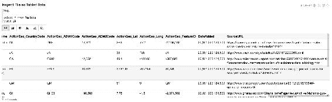

我们可以从显示的数据中看到，我们的列与输入数据匹配；因此我们可以继续进行分析。

### 注意

如果您希望读取 GDELT 事件文件，您可以在我们的代码存储库中找到头文件。

如果此时列与内容之间的数据对齐存在错误，还可以选择之前配置的 RawLines Dataframe 的前 10 行，它将仅显示原始字符串数据输入的前 10 行。如果数据恰好是制表符分隔的，我们将立即看到另一个好处，即 Zeppelin 格式化输出将自动对齐原始字符串的列，就像我们之前使用 bash 命令*column*那样。

现在我们将继续研究文件的字节，以发现其中的编码细节。为此，我们加载我们的查找表，然后将它们与我们之前注册为表的分析器函数的输出进行连接。请注意，分析器的输出可以直接作为可调用的 SQL 表处理：

```scala
// load the UTF lookup tables

 val codePointsSchema = StructType(Array(
     StructField("CodePoint"  , StringType, true),     //$1       
     StructField("Category"   , StringType, true),     //$2     
     StructField("CodeDesc"   , StringType, true)      //$3
     ))

 val UnicodeCatSchema = StructType(Array(
     StructField("Category"         , StringType, true), //$1       
     StructField("Description"      , StringType, true)  //$2     
     ))

 val codePoints = sqlContext.read
     .option("header", "false")     // configurable headers
     .schema(codePointsSchema)
     .option("delimiter", "\t" )   // configurable delimiters
     .csv("/user/feeds/ref/codepoints2.txt")  // configurable path

 codePoints.registerTempTable("codepoints")
 codePoints.cache()
 val utfcats = sqlContext.read
      .option("header", "false")    // configurable headers
      .schema(UnicodeCatSchema)
      .option("delimiter", "\t" )   // configurable delimiters
      .csv("/user/feeds/ref/UnicodeCategory.txt")                   

 utfcats.registerTempTable("utfcats")
 utfcats.cache()

 // Next we build the different presentation layer views for the codepoints
 val hexReport = sqlContext.sql("""
 select
   r.Category
 , r.CodeDesc
 , sum(maskCount) as maskCount
 from
     ( select
              h.*
             ,c.*
         from Metrics_HEX h
         left outer join codepoints c
             on ( upper(h.MaskType) = c.CodePoint)
     ) r 
 group by r.Category, r.CodeDesc
 order by r.Category, r.CodeDesc, 2 DESC
 """)
 hexReport.registerTempTable("hexReport")
 hexReport.cache()
 hexReport.show(10)
 +--------+-----------------+---------+
 |Category|         CodeDesc|maskCount|
 +--------+-----------------+---------+
 |      Cc|  CTRL: CHARACTER|   141120|
 |      Ll|      LATIN SMALL|   266070|
 |      Lu|    LATIN CAPITAL|   115728|
 |      Nd|      DIGIT EIGHT|    18934|
 |      Nd|       DIGIT FIVE|    24389|
 |      Nd|       DIGIT FOUR|    24106|
 |      Nd|       DIGIT NINE|    17204|
 |      Nd|        DIGIT ONE|    61165|
 |      Nd|      DIGIT SEVEN|    16497|
 |      Nd|        DIGIT SIX|    31706|
 +--------+-----------------+---------+
```

在新的段落中，我们可以使用 SQLContext 来可视化输出。为了帮助查看偏斜的值，我们可以使用 SQL 语句来计算计数的对数。这将产生一个图形，我们可以在最终报告中包含，我们可以在原始频率和对数频率之间切换。

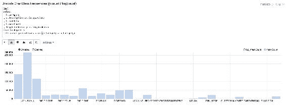

因为我们已经加载了字符类别，我们还可以调整可视化以进一步简化图表：

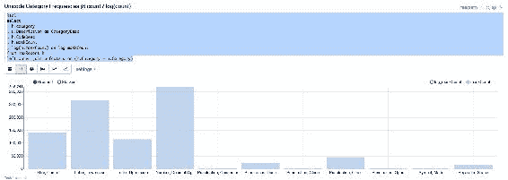

在进行 EDA 时，我们必须始终运行的基本检查是人口普查，我们使用 POPCHECKS 进行计算。 POPCHECKS 是我们在 Scala 代码中定义的特殊掩码，如果字段有值则返回`1`，如果没有则返回`0`。当我们检查结果时，我们注意到我们需要进行一些最终报告写作，以更直接地解释数字：

```scala
Metrics_POPCHECKS.toDF.show(1000, false)  

```

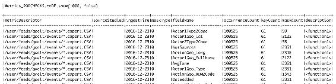

我们可以分两步来做。首先，我们可以使用 SQL case 表达式将数据转换为*populated*或*missing*的值，这应该有所帮助。然后，我们可以通过对文件名、`metricDescriptor`和`fieldname`进行`groupby`并对已填充和缺失的值进行求和来旋转这个聚合数据集。当我们这样做时，我们还可以在分析器没有找到任何数据被填充或缺失的情况下包括默认值为零。在计算百分比时，这一点很重要，以确保我们从不会有空的分子或分母。虽然这段代码可能不像它本来可以那样简短，但它演示了在`SparkSQL`中操作数据的一些技术。

还要注意，在`SparkSQL`中，我们可以使用 SQL `coalesce`语句，这与 Spark 本机的`coalesce`功能不同，用于操作 RDD。在 SQL 中，此函数将 null 转换为默认值，并且通常被滥用以捕获生产级代码中数据不太可信的特殊情况。还值得注意的是，在`SparkSQL`中很好地支持子选择。您甚至可以大量使用这些，Spark 不会抱怨。这特别有用，因为它们是许多传统数据库工程师以及有各种数据库经验的人编程的最自然方式：

```scala
val pop_qry = sqlContext.sql("""
select * from (
    select
          fieldName as rawFieldName
    ,    coalesce( cast(regexp_replace(fieldName, "C", "") as INT), fieldName) as fieldName
    ,   case when maskType = 0 then "Populated"
             when maskType = 1 then "Missing"
        end as PopulationCheck
    ,     coalesce(maskCount, 0) as maskCount
    ,   metricDescriptor as fileName
    from Metrics_POPCHECKS
) x
order by fieldName
""")
val pivot_popquery = pop_qry.groupBy("fileName","fieldName").pivot("PopulationCheck").sum("maskCount")
 pivot_popquery.registerTempTable("pivot_popquery")
 val per_pivot_popquery = sqlContext.sql("""
 Select 
 x.* 
 , round(Missing/(Missing + Populated)*100,2) as PercentMissing
 from
     (select 
         fieldname
         , coalesce(Missing, 0) as Missing
         , coalesce(Populated,0) as Populated
         , fileName
     from pivot_popquery) x
 order by x.fieldname ASC
 """)
 per_pivot_popquery.registerTempTable("per_pivot_popquery")
 per_pivot_popquery.select("fieldname","Missing","Populated","PercentMissing","fileName").show(1000,false)
```

上述代码的输出是关于数据的字段级填充计数的干净报告表：

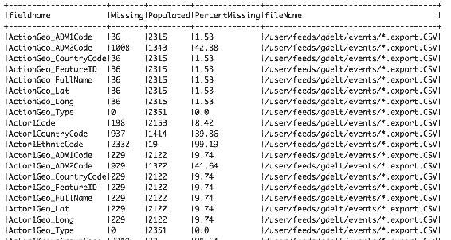

当在我们的 Zeppelin 笔记本中以`stacked`条形图功能进行图形显示时，数据产生了出色的可视化效果，立即告诉我们文件中数据填充的水平：

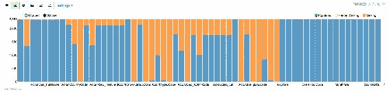

由于 Zeppelin 的条形图支持工具提示，我们可以使用指针来观察列的全名，即使它们在默认视图中显示不佳。

最后，我们还可以在我们的笔记本中包含进一步的段落，以显示先前解释的`ASCII_HighGrain`和`ASCII_LowGrain`掩码的结果。这可以通过简单地将分析器输出作为表格查看，也可以使用 Zeppelin 中的更高级功能来完成。作为表格，我们可以尝试以下操作：

```scala
val proReport = sqlContext.sql("""
 select * from (
 select 
      metricDescriptor as sourceStudied
 ,   "ASCII_LOWGRAIN" as metricDescriptor
 , coalesce(cast(  regexp_replace(fieldName, "C", "") as INT),fieldname) as fieldName
 , ingestTime
 , maskType as maskInstance
 , maskCount
 , description
 from Metrics_ASCIICLASS_LOWGRAIN 
 ) x
 order by fieldNAme, maskCount DESC
 """)
 proReport.show(1000, false)
```

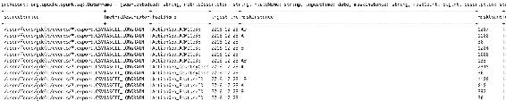

为了构建一个交互式查看器，当我们查看可能具有非常高基数的 ASCII_HighGrain 掩码时，我们可以设置一个 SQL 语句，接受 Zeppelin 用户输入框的值，用户可以在其中键入列号或字段名，以检索我们收集的指标的相关部分。

我们可以在新的 SQL 段落中这样做，SQL 谓词为`x.fieldName like '%${ColumnName}%'`：

```scala
%sql
 select x.* from (
 select 
      metricDescriptor as sourceStudied
 ,   "ASCII_HIGHGRAIN" as metricDescriptor
 , coalesce(cast(  regexp_replace(fieldName, "C", "")
   as INT),fieldname) as fieldName
 , ingestTime
 , maskType as maskInstance
 , maskCount
 , log(maskCount) as log_maskCount
 from Metrics_ASCIICLASS_HIGHGRAIN 
 ) x
 where  x.fieldName like '%${ColumnName}%'
 order by fieldName, maskCount DESC
```

这创建了一个交互式用户窗口，根据用户输入刷新，生成具有多个输出配置的动态分析报告。在这里，我们展示的输出不是表格，而是一个图表，显示了应该具有低基数的字段*Action*在事件文件中的频率计数的对数：

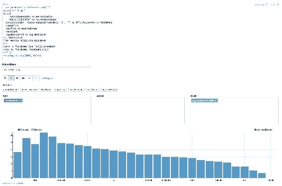

结果显示，即使像经度这样简单的字段在数据中也有很大的格式分布。

到目前为止审查的技术应该有助于创建一个非常可重用的笔记本，用于快速高效地对所有输入数据进行探索性数据分析，生成我们可以用来生成关于输入文件质量的出色报告和文档的图形输出。

# 探索 GDELT

探索 EDA 的一个重要部分是获取和记录数据源，GDELT 内容也不例外。在研究 GKG 数据集后，我们发现仅仅记录我们应该使用的实际数据源就是具有挑战性的。在接下来的几节中，我们提供了我们找到的用于使用的资源的全面列表，这些资源需要在示例中运行。

### 注意

关于下载时间的警告：使用典型的 5 Mb 家庭宽带，下载 2000 个 GKG 文件大约需要 3.5 小时。考虑到仅英语语言的 GKG 文件就有超过 40,000 个，这可能需要一段时间来下载。

## GDELT GKG 数据集

我们应该使用最新的 GDELT 数据源，截至 2016 年 12 月的 2.1 版本。这些数据的主要文档在这里：

[`data.gdeltproject.org/documentation/GDELT-Global_Knowledge_Graph_Codebook-V2.1.pdf`](http://data.gdeltproject.org/documentation/GDELT-Global_Knowledge_Graph_Codebook-V2.1.pdf)

在下一节中，我们已经包括了数据和次要参考查找表，以及进一步的文档。

### 文件

GKG-英语语言全球知识图谱（v2.1）

[`data.gdeltproject.org/gdeltv2/masterfilelist.txt`](http://data.gdeltproject.org/gdeltv2/masterfilelist.txt)

[`data.gdeltproject.org/gdeltv2/lastupdate.txt`](http://data.gdeltproject.org/gdeltv2/lastupdate.txt)

GKG-翻译-非英语全球知识图谱

[`data.gdeltproject.org/gdeltv2/lastupdate-translation.txt`](http://data.gdeltproject.org/gdeltv2/lastupdate-translation.txt)

[`data.gdeltproject.org/gdeltv2/masterfilelist-translation.txt`](http://data.gdeltproject.org/gdeltv2/masterfilelist-translation.txt)

GKG-TV（互联网档案馆-美国电视全球知识图谱）

[`data.gdeltproject.org/gdeltv2_iatelevision/lastupdate.txt`](http://data.gdeltproject.org/gdeltv2_iatelevision/lastupdate.txt)

[`data.gdeltproject.org/gdeltv2_iatelevision/masterfilelist.txt`](http://data.gdeltproject.org/gdeltv2_iatelevision/masterfilelist.txt)

GKG-Visual-CloudVision

[`data.gdeltproject.org/gdeltv2_cloudvision/lastupdate.txt`](http://data.gdeltproject.org/gdeltv2_cloudvision/lastupdate.txt)

### 特别收藏品

GKG-AME-非洲和中东全球知识图谱

[`data.gdeltproject.org/gkgv2_specialcollections/AME-GKG.CIA.gkgv2.csv.zip`](http://data.gdeltproject.org/gkgv2_specialcollections/AME-GKG.CIA.gkgv2.csv.zip)

[`data.gdeltproject.org/gkgv2_specialcollections/AME-GKG.CORE.gkgv2.csv.zip`](http://data.gdeltproject.org/gkgv2_specialcollections/AME-GKG.CORE.gkgv2.csv.zip)

[`data.gdeltproject.org/gkgv2_specialcollections/AME-GKG.DTIC.gkgv2.csv.zip`](http://data.gdeltproject.org/gkgv2_specialcollections/AME-GKG.DTIC.gkgv2.csv.zip)

[`data.gdeltproject.org/gkgv2_specialcollections/AME-GKG.IADISSERT.gkgv2.csv.zip`](http://data.gdeltproject.org/gkgv2_specialcollections/AME-GKG.IADISSERT.gkgv2.csv.zip)

[`data.gdeltproject.org/gkgv2_specialcollections/AME-GKG.IANONDISSERT.gkgv2.csv.zip`](http://data.gdeltproject.org/gkgv2_specialcollections/AME-GKG.IANONDISSERT.gkgv2.csv.zip)

[`data.gdeltproject.org/gkgv2_specialcollections/AME-GKG.JSTOR.gkgv2.csv.zip`](http://data.gdeltproject.org/gkgv2_specialcollections/AME-GKG.JSTOR.gkgv2.csv.zip)

GKG-HR（人权收藏）

[`data.gdeltproject.org/gkgv2_specialcollections/HR-GKG.AMNESTY.gkgv2.csv.zip`](http://data.gdeltproject.org/gkgv2_specialcollections/HR-GKG.AMNESTY.gkgv2.csv.zip)

[`data.gdeltproject.org/gkgv2_specialcollections/HR-GKG.CRISISGROUP.gkgv2.csv.zip`](http://data.gdeltproject.org/gkgv2_specialcollections/HR-GKG.CRISISGROUP.gkgv2.csv.zip)

[`data.gdeltproject.org/gkgv2_specialcollections/HR-GKG.FIDH.gkgv2.csv.zip`](http://data.gdeltproject.org/gkgv2_specialcollections/HR-GKG.FIDH.gkgv2.csv.zip)

[`data.gdeltproject.org/gkgv2_specialcollections/HR-GKG.HRW.gkgv2.csv.zip`](http://data.gdeltproject.org/gkgv2_specialcollections/HR-GKG.HRW.gkgv2.csv.zip)

[`data.gdeltproject.org/gkgv2_specialcollections/HR-GKG.ICC.gkgv2.csv.zip`](http://data.gdeltproject.org/gkgv2_specialcollections/HR-GKG.ICC.gkgv2.csv.zip)

[`data.gdeltproject.org/gkgv2_specialcollections/HR-GKG.OHCHR.gkgv2.csv.zip`](http://data.gdeltproject.org/gkgv2_specialcollections/HR-GKG.OHCHR.gkgv2.csv.zip)

[`data.gdeltproject.org/gkgv2_specialcollections/HR-GKG.USSTATE.gkgv2.csv.zip`](http://data.gdeltproject.org/gkgv2_specialcollections/HR-GKG.USSTATE.gkgv2.csv.zip)

### 参考数据

[`data.gdeltproject.org/documentation/GCAM-MASTER-CODEBOOK.TXT`](http://data.gdeltproject.org/documentation/GCAM-MASTER-CODEBOOK.TXT)

[`data.gdeltproject.org/supportingdatasets/GNS-GAUL-ADM2-CROSSWALK.TXT.zip`](http://data.gdeltproject.org/supportingdatasets/GNS-GAUL-ADM2-CROSSWALK.TXT.zip)

[`data.gdeltproject.org/supportingdatasets/DOMAINSBYCOUNTRY-ENGLISH.TXT`](http://data.gdeltproject.org/supportingdatasets/DOMAINSBYCOUNTRY-ENGLISH.TXT)

[`data.gdeltproject.org/supportingdatasets/DOMAINSBYCOUNTRY-ALLLANGUAGES.TXT`](http://data.gdeltproject.org/supportingdatasets/DOMAINSBYCOUNTRY-ALLLANGUAGES.TXT)

[`www.unicode.org/Public/UNIDATA/UnicodeData.txt`](http://www.unicode.org/Public/UNIDATA/UnicodeData.txt)

[`www.geonames.org/about.html`](http://www.geonames.org/about.html)

## 探索 GKG v2.1

当我们审查现有的探索 GDELT 数据源的文章时，我们发现许多研究都集中在文章的人物、主题和语调上，还有一些集中在早期事件文件上。但是，几乎没有发表过探索现在包含在 GKG 文件中的**全球内容分析指标**（**GCAM**）内容的研究。当我们尝试使用我们构建的数据质量工作簿来检查 GDELT 数据源时，我们发现全球知识图难以处理，因为文件使用了多个嵌套分隔符进行编码。快速处理这种嵌套格式数据是处理 GKG 和 GCAM 的关键挑战，也是本章其余部分的重点。

在探索 GKG 文件中的 GCAM 数据时，我们需要回答一些明显的问题：

+   英语语言 GKG 文件和翻译后的*跨语言*国际文件之间有什么区别？在这些数据源之间，数据的填充方式是否有差异，考虑到一些实体识别算法可能在翻译文件上表现不佳？

+   如果翻译后的数据在包含在 GKG 文件中的 GCAM 情感指标数据集方面有很好的人口统计，那么它（或者英文版本）是否可信？我们如何访问和规范化这些数据，它是否包含有价值的信号而不是噪音？

如果我们能够单独回答这两个问题，我们将对 GDELT 作为数据科学信号源的实用性有了很大的了解。然而，*如何*回答这些问题很重要，我们需要尝试并模板化我们的代码，以便在获得这些答案时创建可重用的配置驱动的 EDA 组件。如果我们能够按照我们的原则创建可重用的探索，我们将产生比硬编码分析更多的价值。

### 跨语言文件

让我们重复我们之前的工作，揭示一些质量问题，然后将我们的探索扩展到这些更详细和复杂的问题。通过对正常 GKG 数据和翻译文件运行一些人口统计（POPCHECK）指标到临时文件，我们可以导入并合并结果。这是我们重复使用标准化指标格式的好处；我们可以轻松地在数据集之间进行比较！

与其详细查看代码，我们不如提供一些主要答案。当我们检查英语和翻译后的 GKG 文件之间的人口统计时，我们确实发现了内容可用性上的一些差异：

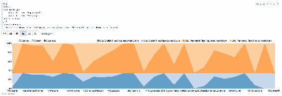

我们在这里看到，翻译后的 GKG 跨语言文件根本没有引用数据，并且在识别人员时非常低人口统计，与我们在一般英语新闻中看到的人口统计相比。因此，肯定有一些需要注意的差异。

因此，我们应该仔细检查我们希望在生产中依赖的跨语言数据源中的任何内容。稍后我们将看到 GCAM 情感内容中的翻译信息与母语英语情感相比如何。

### 可配置的 GCAM 时间序列 EDA

GCAM 的内容主要由*字数计数*组成，通过使用词典过滤器过滤新闻文章并对表征感兴趣主题的同义词进行字数计数而创建。通过将计数除以文档中的总字数，可以对结果进行规范化。它还包括*得分值*，提供似乎是基于直接研究原始语言文本的情感得分。

我们可以快速总结要在 GCAM 中研究和探索的情感变量范围，只需几行代码，其输出附有语言的名称：

```scala
wget http://data.gdeltproject.org/documentation/GCAM-MASTER-CODEBOOK.TXT 
cat GCAM-MASTER-CODEBOOK.TXT | \ 
gawk 'BEGIN{OFS="\t"} $4 != "Type" {print $4,$5}' | column -t -s $'\t' \  
| sort | uniq -c | gawk ' BEGIN{print "Lang Type Count" }{print $3, $2,\ $1}' | column -t -s $' ' 

Lang  Type         Count    Annotation 
ara   SCOREDVALUE  1        Arabic 
cat   SCOREDVALUE  16       Catalan 
deu   SCOREDVALUE  1        German 
eng   SCOREDVALUE  30       English 
fra   SCOREDVALUE  1        French 
glg   SCOREDVALUE  16       Galician 
hin   SCOREDVALUE  1        Hindi 
ind   SCOREDVALUE  1        Indonesian 
kor   SCOREDVALUE  1        Korean 
por   SCOREDVALUE  1        Portuguese 
rus   SCOREDVALUE  1        Russian 
spa   SCOREDVALUE  29       Spanish 
urd   SCOREDVALUE  1        Urdu 
zho   SCOREDVALUE  1        Chinese 
ara   WORDCOUNT    1        Arabic 
cat   WORDCOUNT    16       Catalan 
deu   WORDCOUNT    44       German 
eng   WORDCOUNT    2441     English 
fra   WORDCOUNT    78       French 
glg   WORDCOUNT    16       Galician 
hin   WORDCOUNT    1        Hindi 
hun   WORDCOUNT    36       Hungarian 
ind   WORDCOUNT    1        Indonesian 
kor   WORDCOUNT    1        Korean 
por   WORDCOUNT    46       Portuguese 
rus   WORDCOUNT    65       Russian 
spa   WORDCOUNT    62       Spanish 
swe   WORDCOUNT    64       Swedish 
urd   WORDCOUNT    1        Urdu 
zho   WORDCOUNT    1        Chinese 

```

基于字数计数的 GCAM 时间序列似乎是最完整的，特别是在英语中有 2441 个情感度量！处理如此多的度量似乎很困难，即使进行简单的分析也是如此。我们需要一些工具来简化事情，并且需要集中我们的范围。

为了帮助，我们创建了一个基于简单 SparkSQL 的探索者，从 GCAM 数据块中提取和可视化时间序列数据，专门针对基于字数计数的情感。它是通过克隆和调整我们在 Zeppelin 中的原始数据质量探索者创建的。

它通过调整以使用定义的模式读取 GKG 文件 glob，并预览我们想要专注的原始数据：

```scala
val GkgCoreSchema = StructType(Array(
     StructField("GkgRecordId"           , StringType, true), //$1       
     StructField("V21Date"               , StringType, true), //$2       
     StructField("V2SrcCollectionId"     , StringType, true), //$3       
     StructField("V2SrcCmnName"          , StringType, true), //$4
     StructField("V2DocId"               , StringType, true), //$5
     StructField("V1Counts"              , StringType, true), //$6
     StructField("V21Counts"             , StringType, true), //$7
     StructField("V1Themes"              , StringType, true), //$8
     StructField("V2Themes"              , StringType, true), //$9
     StructField("V1Locations"           , StringType, true), //$10
     StructField("V2Locations"           , StringType, true), //$11
     StructField("V1Persons"             , StringType, true), //$12
     StructField("V2Persons"             , StringType, true), //$13    
     StructField("V1Orgs"                , StringType, true), //$14
     StructField("V2Orgs"                , StringType, true), //$15
     StructField("V15Tone"               , StringType, true), //$16
     StructField("V21Dates"              , StringType, true), //$17
     StructField("V2GCAM"                , StringType, true), //$18
     StructField("V21ShareImg"           , StringType, true), //$19
     StructField("V21RelImg"             , StringType, true), //$20
     StructField("V21SocImage"           , StringType, true), //$21
     StructField("V21SocVideo"           , StringType, true), //$22
     StructField("V21Quotations"         , StringType, true), //$23
     StructField("V21AllNames"           , StringType, true), //$24
     StructField("V21Amounts"            , StringType, true), //$25
     StructField("V21TransInfo"          , StringType, true), //$26
     StructField("V2ExtrasXML"           , StringType, true)  //$27
     ))

val InputFilePath = YourFilePath

val GkgRawData = sqlContext.read
                           .option("header", "false")
                           .schema(GkgCoreSchema)
                           .option("delimiter", "\t")
                           .csv(InputFilePath) 

GkgRawData.registerTempTable("GkgRawData")

// now we register slices of the file we want to explore quickly

val PreRawData = GkgRawData.select("GkgRecordID","V21Date","V2GCAM", "V2DocId")
// we select the GCAM, plus the story URLs in V2DocID, which later we can //filter on.

PreRawData.registerTempTable("PreRawData")
```

早期列选择的结果将我们的内容隔离到要探索的领域;时间（`V21Date`），情感（`V2GCAM`）和源 URL（`V2DocID`）：

```scala
+----+--------------+--------------------+--------------------+
|  ID|       V21Date|              V2GCAM|             V2DocId|
+----+--------------+--------------------+--------------------+
|...0|20161101000000|wc:77,c12.1:2,c12...|http://www.tampab...|
|...1|20161101000000|wc:57,c12.1:6,c12...|http://regator.co...|
|...2|20161101000000|wc:740,c1.3:2,c12...|http://www.9news....|
|...3|20161101000000|wc:1011,c1.3:1,c1...|http://www.gaming...|
|...4|20161101000000|wc:260,c1.2:1,c1....|http://cnafinance...|
+----+--------------+--------------------+--------------------+
```

在一个新的 Zeppelin 段落中，我们创建一个 SQLContext，并仔细解开 GCAM 记录的嵌套结构。请注意，V2GCAM 字段中逗号分隔的第一个内部行包含`wc`维度和代表该 GkgRecordID 故事的字数的度量，然后列出其他情感度量。我们需要将这些数据展开为实际行，以及将所有基于字数计数的情感除以`wc`文章的总字数以规范化分数。

在以下片段中，我们设计了一个`SparkSQL`语句，以典型的*洋葱*风格进行操作，使用子查询。这是一种编码风格，如果你还不了解，可能希望学会阅读。它的工作方式是 - 创建最内部的选择/查询，然后运行它进行测试，然后用括号包裹起来，继续通过选择数据进入下一个查询过程，依此类推。然后，催化剂优化器会进行优化整个流程。这导致了一个既声明性又可读的 ETL 过程，同时还提供了故障排除和隔离管道中任何部分问题的能力。如果我们想要了解如何处理嵌套数组过程，我们可以轻松重建以下 SQL，首先运行最内部的片段，然后审查其输出，然后扩展它以包括包装它的下一个查询，依此类推。然后我们可以逐步审查分阶段的输出，以审查整个语句如何一起工作以提供最终结果。

以下查询中的关键技巧是如何将单词计数分母应用于其他情感单词计数，以规范化值。这种规范化方法实际上是 GKG 文档中建议的，尽管没有提供实现提示。

值得注意的是，V21Date 字段是如何从整数转换为日期的，这对于有效绘制时间序列是必要的。转换需要我们预先导入以下库，除了笔记本中导入的其他库：

```scala
import org.apache.spark.sql.functions.{Unix_timestamp, to_date}  

```

使用`Unix_timestamp`函数，我们将 V21Date 转换为`Unix_timestamp`，这是一个整数，然后再次将该整数转换为日期字段，所有这些都使用本机 Spark 库来配置格式和时间分辨率。

以下 SQL 查询实现了我们期望的调查：

```scala
%sql 
 -- for urls containing “trump” build 15min “election fraud” sentiment time series chart.
 select 
   V21Date
 , regexp_replace(z.Series, "\\.", "_") as Series
 , sum(coalesce(z.Measure, 0) / coalesce (z.WordCount, 1)) as Sum_Normalised_Measure
 from
 (
     select
       GkgRecordID
     , V21Date
     , norm_array[0] as wc_norm_series
     , norm_array[1] as WordCount
     , ts_array[0] as Series
     , ts_array[1] as Measure
     from 
     (
         select
           GkgRecordID
         ,   V21Date
         , split(wc_row, ":")     as norm_array
         , split(gcam_array, ":") as ts_array
         from
             (
             select 
               GkgRecordID
             ,   V21Date
             , gcam_row[0] as wc_row
             , explode(gcam_row) as gcam_array
             from
                 (
                  select
                         GkgRecordID 
                     ,   from_Unixtime(
                              Unix_timestamp(
                                 V21Date, "yyyyMMddHHmmss")
                               , 'YYYY-MM-dd-HH-mm'
                               ) as V21Date
                     ,   split(V2GCAM, ",")  as gcam_row
                     from PreRawData
                     where length(V2GCAM) >1
                     and V2DocId like '%trump%'
                 ) w     
             ) x
     ) y
 ) z
 where z.Series <> "wc" and z.Series = 'c18.134'
                         -- c18.134 is "ELECTION_FRAUD"
 group by z.V21Date, z.Series
 order by z.V21Date ASC
```

查询的结果在 Zeppelin 的时间序列查看器中显示。它显示时间序列数据正在正确积累，并且看起来非常可信，2016 年 11 月 8 日有一个短暂的高峰：美国总统选举的那一天。

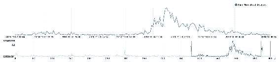

现在我们有一个可以检查 GCAM 情绪分数的工作 SQL 语句，也许我们应该再检查一些其他指标，例如关于不同但相关主题的，比如英国的脱欧投票。

我们选择了三个看起来有趣的 GCAM 情绪指标，除了*选举舞弊*指标，希望能够提供与我们在美国选举中看到的结果有趣的比较。我们将研究的指标是：

+   'c18.101' -- 移民

+   'c18.100' -- 民主

+   'c18.140' -- 选举

为了包括它们，我们需要扩展我们的查询以获取多个归一化的 Series，并且我们可能还需要注意结果可能不都适合 Zeppelin 的查看器，默认只接受前 1000 个结果，所以我们可能需要进一步总结到小时或天。虽然这不是一个很大的改变，但看到我们现有工作的可扩展性将是有趣的：

```scala
val ExtractGcam = sqlContext.sql("""
select  
   a.V21Date
, a.Series
, Sum(a.Sum_Normalised_Measure) as Sum_Normalised_Measure
from (
    select 
    z.partitionkey
    , z.V21Date
    , regexp_replace(z.Series, "\\.", "_") as Series
    , sum(coalesce(z.Measure, 0) / coalesce (z.WordCount, 1))
     as Sum_Normalised_Measure
    from
    (
        select
        y.V21Date
        , cast(cast(round(rand(10) *1000,0) as INT) as string)
         as partitionkey
        , y.norm_array[0] as wc_norm_series
        , y.norm_array[1] as WordCount
        , y.ts_array[0] as Series
        , y.ts_array[1] as Measure
        from 
        (
            select
               x.V21Date
            , split(x.wc_row, ":")     as norm_array
            , split(x.gcam_array, ":") as ts_array
            from
                (
                select 
                  w.V21Date
                , w.gcam_row[0] as wc_row
                , explode(w.gcam_row) as gcam_array
                from
                    (
                     select
                        from_Unixtime(Unix_timestamp(V21Date,
       "yyyyMMddHHmmss"), 'YYYY-MM-dd-HH-mm')
       as V21Date
                        ,   split(V2GCAM, ",")  as gcam_row
                        from PreRawData
                        where length(V2GCAM) > 20
                        and V2DocId like '%brexit%'
                    ) w
                    where gcam_row[0] like '%wc%'
                       OR gcam_row[0] like '%c18.1%'
                ) x

        ) y 
    ) z
    where z.Series <> "wc" 
        and 
        (   z.Series = 'c18.134' -- Election Fraud
         or z.Series = 'c18.101' -- Immigration
         or z.Series = 'c18.100' -- Democracy
         or z.Series = 'c18.140' -- Election
        )  
    group by z.partitionkey, z.V21Date, z.Series
) a
group by a.V21Date, a.Series
""")
```

在这个第二个例子中，我们进一步完善了我们的基本查询，删除了我们没有使用的不必要的 GKGRecordIDs。这个查询还演示了如何使用一组简单的谓词来过滤对许多`Series`名称的结果。请注意，我们还添加了一个使用以下内容的预分组步骤：

```scala
group by z.partitionkey, z.V21Date, z.Series 

-- Where the partition key is: 
-- cast(cast(round(rand(10) *1000,0) as INT) as string) as partitionkey 

```

这个随机数用于创建一个分区前缀键，我们在内部的 group by 语句中使用它，然后再次进行分组而不使用这个前缀。查询是以这种方式编写的，因为它有助于细分和预汇总*热点*数据，并消除任何管道瓶颈。

当我们在 Zeppelin 的时间序列查看器中查看此查询的结果时，我们有机会进一步总结到小时计数，并使用 case 语句将神秘的 GCAM 系列代码翻译成适当的名称。我们可以在一个新的查询中执行此操作，帮助将*特定*的报告配置与一般的数据集构建查询隔离开来：

```scala
Select
a.Time
, a.Series
, Sum(Sum_Normalised_Measure) as Sum_Normalised_Measure
from
(
        select
        from_Unixtime(Unix_timestamp(V21Date,
                      "yyyy-MM-dd-HH-mm"),'YYYY-MM-dd-HH')
         as Time
       , CASE 
           when Series = 'c18_134' then 'Election Fraud'
           when Series = 'c18_101' then 'Immigration'
           when Series = 'c18_100' then 'Democracy'
           when Series = 'c18_140' then 'Election'
       END as Series
       , Sum_Normalised_Measure
       from ExtractGcam 
       -- where Series = 'c18_101' or Series = 'c18_140'
) a
group by a.Time, a.Series
order by a.Time
```

这个最终查询将数据减少到小时值，这比 Zeppelin 默认处理的 1000 行最大值要少，此外它生成了一个比较时间序列图表：

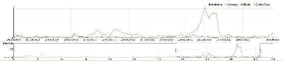

结果图表表明，在脱欧投票之前几乎没有关于*选举舞弊*的讨论，但是*选举*有高峰，而移民是一个比民主更热门的主题。再次，GCAM 英语情绪数据似乎具有真实信号。

现在我们已经为英语语言记录提供了一些信息，我们可以扩展我们的工作，探索它们与 GCAM 中的翻译数据的关系。

作为完成本笔记本中分析的最后一种方法，我们可以注释掉对特定`Series`的过滤器，并将所有脱欧的 GCAM 系列数据写入我们的 HDFS 文件系统中的 parquet 文件中。这样我们就可以永久存储我们的 GCAM 数据到磁盘，甚至随着时间的推移追加新数据。以下是要么覆盖，要么追加到 parquet 文件所需的代码：

```scala
// save the data as a parquet file
val TimeSeriesParqueFile = "/user/feeds/gdelt/datastore/BrexitTimeSeries2016.parquet"   

// *** uncomment to append to an existing parquet file ***
// ExtractGcam.save(TimeSeriesParqueFile
                     //, "parquet" 
                     //, SaveMode.Append)
// ***************************************************************
// *** uncomment to initially load a new parquet file ***
    ExtractGcam.save(TimeSeriesParqueFile
          , "parquet"
    , SaveMode.Overwrite)
// ***************************************************************
```

通过将 parquet 文件写入磁盘，我们现在建立了一个轻量级的 GCAM 时间序列数据存储，可以让我们快速检索 GCAM 情绪，以便在语言组之间进行探索。

### Apache Zeppelin 上的 Plot.ly 图表

对于我们下一个的探索，我们还将扩展我们对 Apache Zeppelin 笔记本的使用，以包括使用一个名为 plotly 的外部图表库来生成`%pyspark`图表，该库是由[`plot.ly/`](https://plot.ly/)开源的，可以用来创建打印质量的可视化。要在我们的笔记本中使用 plotly，我们可以升级我们的 Apache Zeppelin 安装，使用在[`github.com/beljun/zeppelin-plotly`](https://github.com/beljun/zeppelin-plotly)中找到的代码，该代码提供了所需的集成。在它的 GitHub 页面上，有详细的安装说明，在他们的代码库中，他们提供了一个非常有帮助的示例笔记本。以下是一些在 HDP 集群上安装 plotly 以供 Zeppelin 使用的提示：

+   以 Zeppelin 用户身份登录 Namenode，并更改目录到 Zeppelin 主目录`/home/zeppelin`，在那里我们将下载外部代码：

```scala
        git clone https://github.com/beljun/zeppelin-plotly
```

+   更改目录到保存 Zeppelin `*.war`文件的位置。这个位置在 Zeppelin**配置**标签中可以找到。例如：

```scala
        cd /usr/hdp/current/zeppelin-server/lib 

```

现在，按照说明，我们需要编辑在 Zeppelin `war`文件中找到的 index.html 文档：

```scala
   ls *war    # zeppelin-web-0.6.0.2.4.0.0-169.war
  cp zeppelin-web-0.6.0.2.4.0.0-169.war \
      bkp_zeppelin-web-0.6.0.2.4.0.0-169.war
  jar xvf zeppelin-web-0.6.0.2.4.0.0-169.war \
       index.html
  vi index.html
```

+   一旦提取了`index.html`页面，我们可以使用诸如 vim 之类的编辑器在 body 标签之前插入`plotly-latest.min.js`脚本标签（按照说明），然后保存并执行文档。

+   将编辑后的`index.html`文档放回 war 文件中：

```scala
        jar uvf zeppelin-web-0.6.0.2.4.0.0-169.war index.html 

```

+   最后，登录 Ambari，并使用它重新启动 Zeppelin 服务。

+   按照其余的说明在 Zeppelin 中生成一个测试图表。

+   如果出现问题，我们可能需要安装或更新旧的库。登录 Namenode 并使用 pip 安装这些包：

```scala
        sudo pip install plotly 
        sudo pip install plotly --upgrade 
        sudo pip install colors 
        sudo pip install cufflinks 
        sudo pip install pandas 
        sudo pip install Ipython 
        sudo pip install -U pyOpenSSL 
        # note also install pyOpenSSL to get things running. 

```

安装完成后，我们现在应该能够创建 Zeppelin 笔记本，从`%pyspark`段落中生成内联 plot.ly 图表，并且这些图表将使用本地库离线创建，而不是使用在线服务。

### 使用 plot.ly 探索翻译源 GCAM 情绪

对于这个比较，让我们关注一下在 GCAM 文档中找到的一个有趣的度量：*c6.6*；*财务不确定性*。这个度量计算了新闻报道和一个财务导向的*不确定性词典*之间的词匹配次数。如果我们追溯它的来源，我们可以发现驱动这个度量的学术论文和实际词典。然而，这个基于词典的度量是否适用于翻译后的新闻文本？为了调查这个问题，我们可以查看这个财务*不确定性*度量在英语、法语、德语、西班牙语、意大利语和波兰语这六个主要欧洲语言群中的差异，关于英国脱欧的主题。

我们创建一个新的笔记本，包括一个*pyspark*段落来加载 plot.ly 库并将其设置为离线模式运行：

```scala
%pyspark
# Instructions here: https://github.com/beljun/zeppelin-plotly
import sys
sys.path.insert(0, "/home/zeppelin/zeppelin-plotly")

import offline

sys.modules["plotly"].offline = offline
sys.modules["plotly.offline"] = offline

import cufflinks as cf
cf.go_offline()

import plotly.plotly as py
import plotly.graph_objs as go

import pandas as pd
import numpy as np

```

然后，我们创建一个段落来从 parquet 中读取我们缓存的数据：

```scala
%pyspark

GcamParquet = sqlContext.read.parquet("/user/feeds/gdelt/datastore/BrexitTimeSeries2016.parquet")

# register the content as a python data frame
sqlContext.registerDataFrameAsTable(GcamParquet, "BrexitTimeSeries")
```

然后，我们可以创建一个 SQL 查询来读取并准备数据进行绘图，并将其注册以供使用：

```scala
%pyspark 
FixedExtractGcam = sqlContext.sql(""" 
select  
  V21Date 
, Series 
, CASE 
    when LangLen = 0 then "eng" 
    when LangLen > 0 then SourceLanguage 
  END as SourceLanguage 
, FIPS104Country 
, Sum_Normalised_Measure 
from 
(   select *,length(SourceLanguage) as LangLen 
    from BrexitTimeSeries 
    where V21Date like "2016%" 
) a  
""") 

sqlContext.registerDataFrameAsTable(FixedExtractGcam, "Brexit") 
# pyspark accessible registration of the data 

```

现在我们已经定义了一个适配器，我们可以创建一个查询，总结我们 parquet 文件中的数据，使其更容易适应内存：

```scala
%pyspark 

timeplot = sqlContext.sql(""" 
Select 
from_Unixtime(Unix_timestamp(Time, "yyyy-MM-dd"), 'YYYY-MM-dd HH:mm:ss.ssss') as Time 
, a.Series 
, SourceLanguage as Lang 
--, Country 
, sum(Sum_Normalised_Measure) as Sum_Normalised_Measure 
from 
(       select 
          from_Unixtime(Unix_timestamp(V21Date,  
                        "yyyy-MM-dd-HH"), 'YYYY-MM-dd') as Time 
        , SourceLanguage 
        , CASE 
           When Series = 'c6_6' then "Uncertainty" 
          END as Series 
        , Sum_Normalised_Measure 
        from Brexit  
        where Series in ('c6_6') 
        and SourceLanguage in ( 'deu', 'fra', 'ita', 'eng', 'spa', 'pol') 
        and V21Date like '2016%'   
) a 
group by a.Time, a.Series, a.SourceLanguage order by a.Time, a.Series, a.SourceLanguage 
""") 

sqlContext.registerDataFrameAsTable(timeplot, "timeplot")  
# pyspark accessible registration of the data 

```

这个主要的负载查询生成了一组数据，我们可以将其加载到`pyspark`中的`pandas`数组中，并且具有一个 plot.ly 准备好的时间戳格式：

```scala
+------------------------+-----------+----+----------------------+ 
|Time                    |Series     |Lang|Sum_Normalised_Measure| 
+------------------------+-----------+----+----------------------+ 
|2016-01-04 00:00:00.0000|Uncertainty|deu |0.0375                | 
|2016-01-04 00:00:00.0000|Uncertainty|eng |0.5603189694252122    | 
|2016-01-04 00:00:00.0000|Uncertainty|fra |0.08089269454114742   | 
+------------------------+-----------+----+----------------------+ 

```

要将这些数据提供给 plot.ly，我们必须将我们生成的 Spark 数据框转换为一个`pandas`数据框：

```scala
%pyspark 
explorer = pd.DataFrame(timeplot.collect(), columns=['Time', 'Series', 'SourceLanguage','Sum_Normalised_Measure']) 

```

当我们执行这一步时，我们必须记住要`collect()`数据框架，以及重置列名以供`pandas`使用。现在我们的 Python 环境中有了一个`pandas`数组，我们可以轻松地将数据透视成便于进行时间序列绘图的形式：

```scala
pexp = pd.pivot_table(explorer, values='Sum_Normalised_Measure', index=['Time'], columns=['SourceLanguage','Series'], aggfunc=np.sum, fill_value=0) 

```

最后，我们包括一个调用来生成图表：

```scala
pexp.iplot(title="BREXIT: Daily GCAM Uncertainty Sentiment Measures by Language", kind ="bar", barmode="stack") 

```

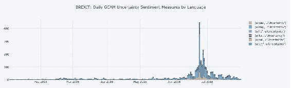

现在我们已经生成了一个工作的 plot.ly 数据图表，我们应该创建一个自定义的可视化，这是标准的 Zeppelin 笔记本无法实现的，以展示 plotly 库为我们的探索带来的价值。一个简单的例子是生成一些*小多图*，就像这样：

```scala
pexp.iplot(title="BREXIT: Daily GCAM Uncertainty by Language, 2016-01 through 2016-07",subplots=True, shared_xaxes=True, fill=True,  kind ="bar") 

```

生成以下图表：

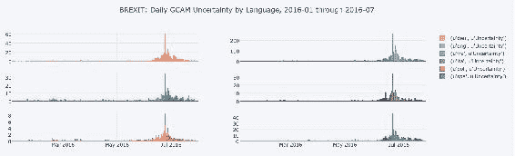

这个小多图表帮助我们看到，在意大利新闻中，2016 年 6 月 15 日似乎出现了财务不确定性的局部激增；就在选举前一周左右。这是我们可能希望调查的事情，因为在西班牙语新闻中也以较小的程度存在。

Plotly 还提供许多其他有趣的可视化方式。如果您仔细阅读了代码片段，您可能已经注意到 parquet 文件包括来自 GKG 文件的 FIPS10-4 国家代码。我们应该能够利用这些位置代码，使用 Plotly 绘制不确定性指标的区域地图，并同时利用我们先前的数据处理。

为了创建这个地理地图，我们重用了我们之前注册的 parquet 文件读取器查询。不幸的是，GKG 文件使用 FIPS 10-4 两个字符的国家编码，而 Plotly 使用 ISO-3166 三个字符的国家代码来自动为绘图处理的用户记录进行地理标记。我们可以通过在我们的 SQL 中使用 case 语句来重新映射我们的代码，然后在整个调查期间对它们进行汇总来解决这个问题。

```scala
%pyspark 
mapplot = sqlContext.sql(""" 
Select 
  CountryCode 
, sum(Sum_Normalised_Measure) as Sum_Normalised_Measure 
from (  select 
        from_Unixtime(Unix_timestamp(V21Date, "yyyy-MM-dd-HH"),  
                                     'YYYY-MM') as Time 
        , CASE 
             when FIPS104Country = "AF" then "AFB" 
             when FIPS104Country = "AL" then "ALB" 
                -- I have excluded the full list of  
                -- countries in this code snippet 
             when FIPS104Country = "WI" then "ESH" 
             when FIPS104Country = "YM" then "YEM" 
             when FIPS104Country = "ZA" then "ZMB" 
             when FIPS104Country = "ZI" then "ZWE" 
          END as CountryCode 
        , Sum_Normalised_Measure 
        from Brexit  
        where Series in ('c6_6') 
        and V21Date like '2016%' 
) a 
group by a.CountryCode order by a.CountryCode 
""") 

sqlContext.registerDataFrameAsTable(mapplot, "mapplot") # python 

mapplot2 = pd.DataFrame(mapplot.collect(), columns=['Country', 'Sum_Normalised_Measure']) 

```

现在我们的数据已经准备在`pandas`数据框中，我们可以使用以下一行 Python 代码调用可视化：

```scala
mapplot2.iplot( kind = 'choropleth', locations = 'Country', z = 'Sum_Normalised_Measure', text = 'Country', locationmode = 'ISO-3', showframe = True, showcoastlines = False, projection = dict(type = 'equirectangular'), colorscale = [[0,"rgb(5, 10, 172)"],[0.9,"rgb(40, 60, 190)"],[0.9,"rgb(70, 100, 245)"],[1,"rgb(90, 120, 245)"],[1,"rgb(106, 137, 247)"],[1,"rgb(220, 220, 220)"]]) 

```

最终结果是一个交互式、可缩放的世界地图。我们将其政治解释留给读者，但从技术上讲，也许这张地图显示了与新闻数量有关的效果，我们可以稍后对其进行归一化；例如通过将我们的值除以每个国家的总故事数。

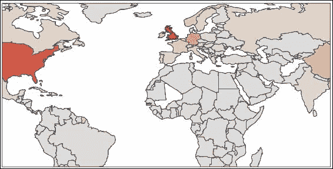

### 结束语

值得指出的是，有许多参数驱动了我们对所有调查的探索，我们可以考虑如何将这些参数化以构建适当的探索产品来监控 GDELT。需要考虑的参数如下：

+   我们可以选择一个非 GCAM 字段进行过滤。在前面的示例中，它配置为 V2DocID，这是故事的 URL。在 URL 中找到诸如 BREXIT 或 TRUMP 之类的词将有助于将我们的调查范围限定在特定主题领域的故事中。我们还可以重复此技术以过滤 BBC 或 NYTIMES 等内容。或者，如果我们将此列替换为另一个列，例如 Theme 或 Person，那么这些列将提供新的方法来聚焦我们对特定主题或感兴趣的人的研究。

+   我们已经转换并概括了时间戳 V21Date 的粒度，以提供每小时的时间序列增量，但我们可以重新配置它以创建我们的时间序列，以月、周或日为基础 - 或者以任何其他增量为基础。

+   我们首先选择并限定了我们对感兴趣的一个时间序列*c18_134*，即*选举舞弊*，但我们可以轻松地重新配置它以查看*移民*或*仇恨言论*或其他 2400 多个基于词频的情感分数。

+   我们在笔记本的开头引入了一个文件 glob，它限定了我们在摘要输出中包含的时间量。为了降低成本，我们一开始将其保持较小，但我们可以重新聚焦这个时间范围到关键事件，甚至在有足够的处理预算（时间和金钱）的情况下打开它到所有可用的文件。

我们现在已经证明，我们的代码可以轻松调整，构建基于笔记本的 GCAM 时间序列探索器，从中我们将能够按需构建大量的专注调查；每个都以可配置的方式探索 GCAM 数据的内容。

如果您一直在仔细跟随笔记本中的 SQL 代码，并且想知道为什么它没有使用 Python API 编写，或者使用惯用的 Scala，我们将用最后一个观察来完成本节：正是因为它是由 SQL 构建的，所以它可以在 Python、R 或 Scala 上下文之间移动，几乎不需要重构代码。如果 R 中出现了新的图表功能，它可以轻松地移植到 R 中，然后可以将精力集中在可视化上。事实上，随着 Spark 2.0+的到来，也许在移植时需要最少审查的是 SQL 代码。代码可移植性的重要性无法强调得足够。然而，在 EDA 环境中使用 SQL 的最大好处是，它使得在 Zeppelin 中生成基于参数的笔记本变得非常容易，正如我们在早期的分析器部分所看到的。下拉框和其他 UI 小部件都可以与字符串处理一起创建，以在执行之前自定义代码，而不受后端语言的限制。这是一种非常快速的方式，可以在我们的分析中构建交互性和配置，而不需要涉及复杂的元编程方法。它还帮助我们避免解决 Apache Zeppelin/Spark 中可用的不同语言后端的元编程复杂性。

关于构建广泛的数据探索，如果我们希望更广泛地使用我们在 parquet 中缓存的结果，也有机会完全消除“眼睛观看图表”的需求。参见第十二章*TrendCalculus*，以了解我们如何可以以编程方式研究 GKG 中所有数据的趋势。

在使用 Zeppelin 时，一个需要注意的最后一个技巧是纯粹实用的。如果我们希望将图形提取到文件中，例如将它们包含在我们的最终报告中，而不是在笔记本中截图，我们可以直接从 Zeppelin 中提取可伸缩矢量图形文件（SVG），并使用此处找到的*bookmarklet*将它们下载到文件中[`nytimes.github.io/svg-crowbar/`](http://nytimes.github.io/svg-crowbar/)。

### 可配置的 GCAM 时空 EDA

GCAM 的另一个问题仍然没有答案；我们如何开始理解它在空间上的细分？GCAM 的地理空间枢纽是否能够揭示全球新闻媒体如何呈现其聚合地缘政治观点，以详细的地理分析来深入国家级别的分析？

如果我们可以作为 EDA 的一部分构建这样的数据集，它将有许多不同的应用。例如，在城市层面上，它将是一个通用的地缘政治信号库，可以丰富各种其他数据科学项目。考虑假期旅行预订模式，与新闻中出现的地缘政治主题相结合。我们会发现全球新闻信号在城市层面上是否预测了媒体关注的地方的旅游率上升或下降？当我们将所得信息视为地缘政治态势感知的信息源时，这种数据的可能性几乎是无限的。

面对这样的机会，我们需要仔细考虑我们在这个更复杂的 EDA 中的投资。与以往一样，它将需要一个共同的数据结构，从而开始我们的探索。

作为目标，我们将致力于构建以下数据框架，以探索地缘政治趋势，我们将其称为“GeoGcam”。

```scala
val GeoGcamSchema = StructType(Array(
        StructField("Date"          , StringType, true),  //$1       
        StructField("CountryCode"   , StringType, true),  //$2
        StructField("Lat"           , DoubleType, true),  //$3       
        StructField("Long"          , DoubleType, true),  //$4
        StructField("Geohash"       , StringType, true),  //$5
        StructField("NewsLang"      , StringType, true),  //$6
        StructField("Series"        , StringType, true),    //$7      
        StructField("Value"         , DoubleType, true),  //$8  
        StructField("ArticleCount"  , DoubleType, true),  //$9  
        StructField("AvgTone"       , DoubleType, true)  //$10 
    ))
```

### 介绍 GeoGCAM

GeoGcam 是一个全球时空信号数据集，它源自原始的 GDELT 全球知识图（2.1）。它能够快速、轻松地探索全球新闻媒体情绪的演变地缘政治趋势。数据本身是使用一个转换管道创建的，该管道将原始的 GKG 文件转换为标准、可重复使用的全球时间/空间/情绪信号格式，这允许直接下游时空分析、地图可视化和进一步的广泛地缘政治趋势分析。

它可以用作预测模型的外部协变量的来源，特别是那些需要改进地缘政治情况意识的模型。

它是通过将 GKG 的 GCAM 情绪数据重新构建为一个空间定向模式而构建的。这是通过*将*每个新闻故事的情绪放置在其 GKG 记录中识别的细粒度城市/城镇级别位置上来完成的。

然后，数据按城市聚合，跨越 15 分钟的 GKG 时间窗口内的所有索引故事。结果是一个文件，它提供了在该空间和时间窗口内所有故事的聚合新闻媒体情绪共识，针对那个地方。尽管会有噪音，但我们的假设是，大而广泛的地缘政治主题将会出现。

数据集的样本（与目标模式匹配）如下：

```scala
+--------------+-------+------+--------+------------+ 
|Date          |Country|Lat   |Long    |Geohash     | 
|              |Code   |      |        |            | 
+--------------+-------+------+--------+------------+ 
|20151109103000|CI     |-33.45|-70.6667|66j9xyw5ds13| 
|20151109103000|CI     |-33.45|-70.6667|66j9xyw5ds13| 
|20151109103000|CI     |-33.45|-70.6667|66j9xyw5ds13| 
|20151109103000|CI     |-33.45|-70.6667|66j9xyw5ds13| 
|20151109103000|CI     |-33.45|-70.6667|66j9xyw5ds13| 
|20151109103000|CI     |-33.45|-70.6667|66j9xyw5ds13| 
|20151109103000|CI     |-33.45|-70.6667|66j9xyw5ds13| 
|20151109103000|CI     |-33.45|-70.6667|66j9xyw5ds13| 
|20151109103000|CI     |-33.45|-70.6667|66j9xyw5ds13| 
|20151109103000|CI     |-33.45|-70.6667|66j9xyw5ds13| 
+--------------+-------+------+--------+------------+ 
+----+------+-----+-------+----------------+ 
|News|Series|SUM  |Article|AvgTone         | 
|Lang|      |Value|Count  |                | 
+----+------+-----+-------+----------------+ 
|E   |c12_1 |16.0 |1.0    |0.24390243902439| 
|E   |c12_10|26.0 |1.0    |0.24390243902439| 
|E   |c12_12|12.0 |1.0    |0.24390243902439| 
|E   |c12_13|3.0  |1.0    |0.24390243902439| 
|E   |c12_14|11.0 |1.0    |0.24390243902439| 
|E   |c12_3 |4.0  |1.0    |0.24390243902439| 
|E   |c12_4 |3.0  |1.0    |0.24390243902439| 
|E   |c12_5 |10.0 |1.0    |0.24390243902439| 
|E   |c12_7 |15.0 |1.0    |0.24390243902439| 
|E   |c12_8 |6.0  |1.0    |0.24390243902439| 
+----+------+-----+-------+----------------+ 

```

关于数据集的技术说明：

+   只有标记有特定城市位置的新闻文章才会被包括在内，这意味着只有那些被 GKG 标记为具有位置类型代码 3=USCITY 或 4=WORLDCITY 的文章才会被包括在内。

+   我们已经计算并包括了每个城市的完整 GeoHash（有关更多信息，请参见第五章*，地理分析的 Spark*），简化了数据的索引和总结，以供更大范围的地理区域使用。

+   文件的粒度是基于用于生成数据集的聚合键，即：`V21Date`、`LocCountryCode`、`Lat`、`Long`、`GeoHash`、`Language`、`Series`。

+   我们已经将 GKG 源中识别的主要位置国家代码字段传递到城市级别的聚合函数中；这使我们能够快速地按国家检查数据，而无需进行复杂的查找。

+   提供的数据是未归一化的。我们应该稍后通过位置的总文章字数来对其进行归一化，这在名为`wc`的系列中是可用的。但这只适用于基于字数的情绪测量。我们还携带了文章的计数，以便测试不同类型的归一化。

+   该数据源自英语 GKG 记录，但我们计划在相同的数据格式中包括国际*跨语言*源。为了做好准备，我们已经包括了一个字段，用于表示原始新闻故事的语言。

+   我们为这个数据集设计了一个摄入例程，用于 GeoMesa，这是一个可扩展的数据存储，允许我们地理上探索生成的数据；这在我们的代码库中是可用的。有关 GeoMesa 的深入探讨，请参见第五章*，地理分析的 Spark*。

以下是构建 GeoGCAM 文件的流水线：

```scala
// be sure to include a dependency to the geohash library
// here in the 1st para of zeppelin:
// z.load("com.github.davidmoten:geo:0.7.1")
// to use the geohash functionality in your code

val GcamRaw = GkgFileRaw.select("GkgRecordID","V21Date","V15Tone","V2GCAM", "V1Locations")
    GcamRaw.cache()
    GcamRaw.registerTempTable("GcamRaw")

def vgeoWrap (lat: Double, long: Double, len: Int): String = {
    var ret = GeoHash.encodeHash(lat, long, len)
    // select the length of the geohash, less than 12..
    // it pulls in the library dependency from       
    //   com.github.davidmoten:geo:0.7.1
    return(ret)
} // we wrap up the geohash function locally

// we register the vGeoHash function for use in SQL 
sqlContext.udf.register("vGeoHash", vgeoWrap(_:Double,_:Double,_:Int))

val ExtractGcam = sqlContext.sql("""
    select
        GkgRecordID 
    ,   V21Date
    ,   split(V2GCAM, ",")                  as Array
    ,   explode(split(V1Locations, ";"))    as LocArray
    ,   regexp_replace(V15Tone, ",.*$", "") as V15Tone 
       -- note we truncate off the other scores
    from GcamRaw 
    where length(V2GCAM) >1 and length(V1Locations) >1
""")

val explodeGcamDF = ExtractGcam.explode("Array", "GcamRow"){c: Seq[String] => c }

val GcamRows = explodeGcamDF.select("GkgRecordID","V21Date","V15Tone","GcamRow", "LocArray")
// note ALL the locations get repeated against
// every GCAM sentiment row

    GcamRows.registerTempTable("GcamRows")

val TimeSeries = sqlContext.sql("""
select   -- create geohash keys
  d.V21Date
, d.LocCountryCode
, d.Lat
, d.Long
 , vGeoHash(d.Lat, d.Long, 12)        as GeoHash
, 'E' as NewsLang
, regexp_replace(Series, "\\.", "_") as Series
, coalesce(sum(d.Value),0) as SumValue  
           -- SQL’s "coalesce” means “replaces nulls with"
, count(distinct  GkgRecordID )      as ArticleCount
, Avg(V15Tone)                       as AvgTone
from
(   select  -- build Cartesian join of the series
                -- and granular locations
      GkgRecordID
    , V21Date
    , ts_array[0]  as Series
    , ts_array[1]  as Value
    , loc_array[0] as LocType
    , loc_array[2] as LocCountryCode
    , loc_array[4] as Lat
    , loc_array[5] as Long
    , V15Tone
    from
       (select -- isolate the data to focus on
         GkgRecordID
       , V21Date
       , split(GcamRow,   ":") as ts_array
       , split(LocArray,  "#") as loc_array
       , V15Tone
       from GcamRows
       where length(GcamRow)>1
       ) x
    where
    (loc_array[0] = 3 or  loc_array[0] = 4) -- city level filter
) d
group by 
  d.V21Date
, d.LocCountryCode
, d.Lat
, d.Long
, vGeoHash(d.Lat, d.Long, 12)
, d.Series
order by 
  d.V21Date
, vGeoHash(d.Lat, d.Long, 12)
, d.Series
""")
```

这个查询基本上做了以下几件事：它在 GCAM 情绪和记录中识别的细粒度位置（城市/地点）之间建立了一个笛卡尔连接，并继续*将*15 分钟窗口内所有新闻故事的 Tone 和情绪值放置在这些位置上。输出是一个时空数据集，允许我们在地图上地理化地映射 GCAM 情绪。例如，可以快速将这些数据导出并在 QGIS 中绘制，这是一个开源的地图工具。

### 我们的空间中心点是否有效？

当前面的 GeoGCAM 数据集被过滤以查看 GCAM *移民*情绪作为 2015 年 2 月 GKG 数据的头两周的主题时，我们可以生成以下地图：

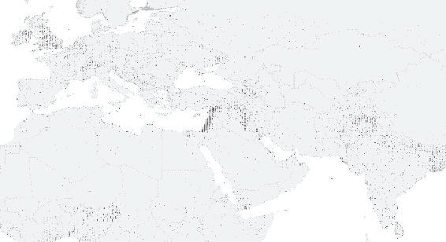

这说明了全球英语新闻媒体的语调，使用了轻（积极平均语调）和暗（消极平均语调），这些都可以在 GKG 文件中找到，并探讨了该语调如何在地图上的每个地理瓦片上映射（像素大小的计算相当准确地反映了分组的截断 GeoHash 的大小），并且与移民作为主题的情绪相关。

我们可以在这张地图上清楚地看到，移民不仅是与英国地区相关的热门话题，而且在其他地方也有强烈的空间集中。例如，我们可以看到与中东部分明显突出的浓厚负面语调。我们还看到了以前可能会错过的细节。例如，都柏林周围有关移民的浓厚负面语调，这并不是立即可以解释的，尼日利亚东北部似乎也发生了一些事情。

地图显示，我们也可能需要注意英语语言的偏见，因为非英语国家的讨论很少，这似乎有点奇怪，直到我们意识到我们还没有包括跨语言的 GKG 源。这表明我们应该扩展我们的处理，以包括跨语言数据源，以获得更全面和完整的信号，包括非英语新闻媒体。

GCAM 时间序列的完整列表在此处列出：[`data.gdeltproject.org/documentation/GCAM-MASTER-CODEBOOK.TXT`](http://data.gdeltproject.org/documentation/GCAM-MASTER-CODEBOOK.TXT)。

目前，在 GeoGCAM 格式中检查的英语新闻数据提供了对世界的迷人视角，我们发现 GDELT 确实提供了我们可以利用的真实信号。使用本章中开发的 GeoGCAM 格式化数据，您现在应该能够轻松快速地构建自己特定的地缘政治探索，甚至将此内容与您自己的数据集集成。

# 总结

在这一章中，我们回顾了许多探索数据质量和数据内容的想法。我们还向读者介绍了与 GDELT 合作的工具和技术，旨在鼓励读者扩展自己的调查。我们展示了 Zeppelin 的快速发展，并且大部分代码都是用 SparkSQL 编写的，以展示这种方法的出色可移植性。由于 GKG 文件在内容上非常复杂，本书的其余部分大部分致力于深入分析，超越了探索，我们在深入研究 Spark 代码库时也远离了 SparkSQL。

在下一章，也就是第五章，“地理分析的 Spark”，我们将探索 GeoMesa；这是一个管理和探索本章中创建的 GeoGCAM 数据集的理想工具，以及 GeoServer 和 GeoTools 工具集，以进一步扩展我们对时空探索和可视化的知识。
