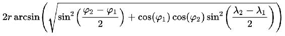
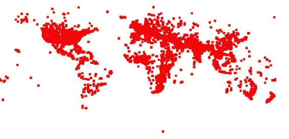
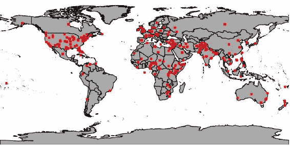

# 第五章：地理分析的 Spark

地理处理是 Spark 的一个强大用例，因此本章的目的是解释数据科学家如何使用 Spark 处理地理数据，以产生强大的基于地图的大型数据集视图。我们将演示如何通过 Spark 与 GeoMesa 集成轻松处理时空数据集，这有助于将 Spark 转变为一个复杂的地理处理引擎。随着**物联网**（**IoT**）和其他位置感知数据变得越来越普遍，以及*移动对象*数据量的增加，Spark 将成为一个重要的工具，弥合空间功能和处理可伸缩性之间的地理处理差距。本章揭示了如何通过全球新闻进行高级地缘政治分析，以利用数据分析和进行石油价格数据科学。

在本章中，我们将涵盖以下主题：

+   使用 Spark 摄取和预处理地理定位数据

+   存储适当索引的地理数据，使用 GeoMesa 内部的 Geohash 索引

+   运行复杂的时空查询，跨时间和空间过滤数据

+   使用 Spark 和 GeoMesa 一起执行高级地理处理，以研究随时间的变化

+   使用 Spark 计算密度地图，并可视化这些地图随时间的变化

+   查询和整合跨地图层的空间数据以建立新的见解

# GDELT 和石油

本章的前提是我们可以操纵 GDELT 数据，以更大或更小的程度确定石油价格基于历史事件。我们的预测准确性将取决于许多变量，包括我们事件的细节，使用的数量以及我们关于石油和这些事件之间关系性质的假设。

石油行业非常复杂，受到许多因素的驱动。然而，研究发现，大多数主要的石油价格波动主要是由原油需求的变化所解释的。价格在股票需求增加时也会上涨，并且在中东地区的地缘政治紧张时期价格历史上也很高。特别是政治事件对石油价格有很大影响，我们将集中讨论这一方面。

世界各地有许多国家生产原油；然而，有三个主要的基准价格，供应商用于定价：

+   布伦特：由北海的各种实体生产

+   WTI：**西德克萨斯中质原油**（**WTI**）覆盖北美中西部和墨西哥湾沿岸地区的实体

+   欧佩克：由欧佩克成员国生产：

阿尔及利亚，安哥拉，厄瓜多尔，加蓬，印度尼西亚，伊朗，伊拉克，科威特，利比亚，尼日利亚，卡塔尔，沙特阿拉伯，阿联酋和委内瑞拉

很明显，我们需要做的第一件事是获取三个基准的历史定价数据。通过搜索互联网，可以在许多地方找到可下载的数据，例如：

+   布伦特：[`fred.stlouisfed.org/`](https://fred.stlouisfed.org/series/DCOILBRENTEU)

+   WTI：[`fred.stlouisfed.org/`](https://fred.stlouisfed.org/series/DCOILBRENTEU)

+   欧佩克：[`opec.org`](http://opec.org)

现在我们知道，石油价格主要由供需决定，我们的第一个假设是供需受世界事件的影响更大，因此我们可以预测供需可能是什么。

我们想要确定原油价格在接下来的一天、一周或一个月内是上涨还是下跌，由于我们在整本书中都使用了 GDELT，我们将利用这些知识来运行一些非常大的处理任务。在开始之前，值得讨论我们将采取的路径以及决定的原因。首要关注的是 GDELT 与石油的关系；这将定义最初工作的范围，并为我们以后的工作奠定基础。在这里很重要的是我们决定如何利用 GDELT 以及这个决定的后果；例如，我们可以决定使用所有时间的所有数据，但是所需的处理时间确实非常大，因为仅一天的 GDELT 事件数据平均为 15 MB，GKG 为 1.5 GB。因此，我们应该分析这两组数据的内容，并尝试确定我们的初始数据输入将是什么。

## GDELT 事件

通过查看 GDELT 模式，有一些可能有用的要点；事件模式主要围绕着识别故事中的两个主要参与者并将事件与他们联系起来。还可以查看不同级别的事件，因此我们将有很好的灵活性，可以根据我们的结果在更高或更低的复杂性水平上工作。例如：

`EventCode`字段是一个 CAMEO 动作代码：0251（呼吁放宽行政制裁），也可以在 02（呼吁）和 025（呼吁让步）级别使用。

因此，我们的第二个假设是，事件的详细程度将从我们的算法中提供更好或更差的准确性。

其他有趣的标签包括`GoldsteinScale`、`NumMentions`和`Lat`/`Lon`。`GoldsteinScale`标签是一个从-10 到+10 的数字，它试图捕捉该类型事件对一个国家稳定性的理论潜在影响；这与我们已经确定的关于石油价格稳定性的情况非常匹配。`NumMentions`标签给出了事件在所有来源文件中出现的频率的指示；如果我们发现需要减少我们处理的事件数量，这可能有助于我们为事件分配重要性。例如，我们可以处理数据并找出在过去一小时、一天或一周中出现频率最高的 10、100 或 1000 个事件。最后，`lat`/`lon`标签信息试图为事件分配地理参考点，这在我们想要在 GeoMesa 中制作地图时非常有用。

## GDELT GKG

GKG 模式与总结事件内容和提供特定于该内容的增强信息有关。我们感兴趣的领域包括`Counts`、`Themes`、`GCAM`和`Locations`；`Counts`字段映射任何数字提及，因此可能允许我们计算严重性，例如 KILLS=47。`Themes`字段列出了基于 GDELT 类别列表的所有主题；这可能有助于我们随着时间的推移学习影响石油价格的特定领域。`GCAM`字段是对事件内容的内容分析的结果；快速浏览 GCAM 列表，我们发现有一些可能有用的维度需要注意：

```scala
c9.366  9   366   WORDCOUNT   eng   Roget's Thesaurus 1911 Edition   CLASS III - RELATED TO MATTER/3.2 INORGANIC MATTER/3.2.3 IMPERFECT FLUIDS/366 OIL

c18.172  18   172     WORDCOUNT   eng   GDELT   GKG   Themes   ENV_OIL
c18.314  18   314     WORDCOUNT   eng   GDELT   GKG   Themes   ECON_OILPRICE
```

最后，我们有`Locations`字段，它提供了与事件类似的信息，因此也可以用于制作地图的可视化。

# 制定行动计划

在检查了 GDELT 模式之后，我们现在需要做一些决定，确定我们将使用哪些数据，并确保我们根据我们的假设来证明这种用法。这是一个关键阶段，因为有许多方面需要考虑，至少我们需要：

+   确保我们的假设清晰，这样我们就有一个已知的起点

+   确保我们清楚地了解如何实施假设，并确定一个行动计划

+   确保我们使用足够的适当数据来满足我们的行动计划；限定数据使用范围，以确保我们能够在给定的时间范围内得出结论，例如，使用所有 GDELT 数据将是很好的，但除非有一个大型处理集群可用，否则可能不太合理。另一方面，仅使用一天显然不足以评估任何时间段内的任何模式

+   制定 B 计划，以防我们的初始结果不具有决定性

我们的第二个假设是关于事件的细节；为了清晰起见，在本章中，我们将首先选择一个数据源，以便在模型表现不佳时添加更多复杂性。因此，我们可以选择 GDELT 事件作为上述提到的字段，这些字段为我们的算法提供了一个很好的基础；特别是`gcam`字段将非常有用于确定事件的性质，而`NumMentions`字段在考虑事件的重要性时将很快实施。虽然 GKG 数据看起来也很有用，但我们希望在这个阶段尝试使用一般事件；因此，例如 GCAM 油数据被认为太具体，因为这些领域的文章很可能经常涉及对油价变化的反应，因此对于我们的模型来说考虑太晚了。

我们的初始处理流程（行动计划）将涉及以下步骤：

+   获取过去 5 年的油价数据

+   获取过去 5 年的 GDELT 事件

+   安装 GeoMesa 和相关工具

+   将 GDELT 数据加载到 GeoMesa

+   构建一个可视化，显示世界地图上的一些事件

+   使用适当的机器学习算法来学习事件类型与油价的涨跌

+   使用模型预测油价的涨跌

# GeoMesa

GeoMesa 是一个开源产品，旨在利用存储系统的分布式特性，如 Accumulo 和 Cassandra，来保存分布式时空数据库。有了这个设计，GeoMesa 能够运行大规模的地理空间分析，这对于非常大的数据集，包括 GDELT，是必需的。

我们将使用 GeoMesa 来存储 GDELT 数据，并在其中的大部分数据上运行我们的分析；这应该为我们提供足够的数据来训练我们的模型，以便我们可以预测未来油价的涨跌。此外，GeoMesa 还将使我们能够在地图上绘制大量点，以便我们可以可视化 GDELT 和其他有用的数据。

## 安装

GeoMesa 网站（[www.geomesa.org](http://www.geomesa.org)）上有一个非常好的教程，指导用户完成安装过程。因此，我们在这里并不打算制作另一个操作指南；然而，有几点值得注意，可能会节省您在启动一切时的时间。

+   GeoMesa 有很多组件，其中许多组件有很多版本。确保软件堆栈的所有版本与 GeoMesa maven POMs 中指定的版本完全匹配非常重要。特别感兴趣的是 Hadoop、Zookeeper 和 Accumulo；版本位置可以在 GeoMesa 教程和其他相关下载的根`pom.xml`文件中找到。

+   在撰写本文时，将 GeoMesa 与某些 Hadoop 供应商堆栈集成时存在一些额外问题。如果可能的话，使用 GeoMesa 与您自己的 Hadoop/Accumulo 等堆栈，以确保版本兼容性。

+   GeoMesa 版本依赖标签已从版本 1.3.0 更改。确保所有版本与您选择的 GeoMesa 版本完全匹配非常重要；如果有任何冲突的类，那么在某个时候肯定会出现问题。

+   如果您以前没有使用过 Accumulo，我们在本书的其他章节中已经详细讨论过它。初步熟悉将在使用 GeoMesa 时大有裨益（参见第七章，“建立社区”）。

+   在使用 Accumulo 1.6 或更高版本与 GeoMesa 时，有使用 Accumulo 命名空间的选项。如果您对此不熟悉，则选择不使用命名空间，并将 GeoMesa 运行时 JAR 简单地复制到 Accumulo 根文件夹中的`/lib/text`中。

+   GeoMesa 使用一些 shell 脚本；由于操作系统的性质，运行这些脚本可能会出现一些问题，这取决于您的平台。这些问题很小，可以通过一些快速的互联网搜索来解决；例如，在运行`jai-image.sh`时，在 Mac OSX 上会出现用户确认的小问题。

+   GeoMesa 的 maven 仓库可以在[`repo.locationtech.org/content/repositories/releases/org/locationtech/geomesa/`](https://repo.locationtech.org/content/repositories/releases/org/locationtech/geomesa/)找到

一旦您能够成功地从命令行运行 GeoMesa，我们就可以继续下一节了。

## GDELT 摄入

下一阶段是获取 GDELT 数据并将其加载到 GeoMesa 中。这里有许多选择，取决于您打算如何进行；如果您只是在阅读本章，那么可以使用脚本一次性下载数据：

```scala
$ mkdir gdelt && cd gdelt
$ wget http://data.gdeltproject.org/events/md5sums
$ for file in `cat md5sums | cut -d' ' -f3 | grep '²⁰¹[56]'` ; do wget http://data.gdeltproject.org/events/$file ; done
$ md5sum -c md5sums 2>&1 | grep '²⁰¹[56]'
```

这将下载并验证 2015 年和 2016 年的所有 GDELT 事件数据。在这个阶段，我们需要估计所需的数据量，因为我们不知道我们的算法将如何运行，所以我们选择了两年的数据来开始。

脚本的替代方法是阅读第二章，*数据获取*，其中详细解释了如何配置 Apache NiFi 以实时下载 GDELT 数据，并将其加载到 HDFS 以供使用。否则，可以使用脚本将前述数据传输到 HDFS，如下所示：

```scala
$ ls -1 *.zip | xargs -n 1 unzip
$ rm *.zip
$ hdfs dfs -copyFromLocal *.CSV hdfs:///data/gdelt/
```

### 注意

HDFS 使用数据块；我们希望确保文件存储尽可能高效。编写一个方法来将文件聚合到 HDFS 块大小（默认为 64 MB）将确保 NameNode 内存不会被许多小文件的条目填满，并且还将使处理更加高效。使用多个块（文件大小> 64 MB）的大文件称为分割文件。

我们在 HDFS 中有大量的数据（大约为 2015/16 年的 48 GB）。现在，我们将通过 GeoMesa 将其加载到 Accumulo 中。

## GeoMesa 摄入

GeoMesa 教程讨论了使用`MapReduce`作业从 HDFS 加载数据到 Accumulo 的想法。让我们来看看这个，并创建一个 Spark 等价物。

### MapReduce 到 Spark

由于**MapReduce**（**MR**）通常被认为已经死亡，或者至少正在消亡，因此了解如何从 MR 中创建 Spark 作业非常有用。以下方法可以应用于任何 MR 作业。我们将考虑 GeoMesa 教程中描述的 GeoMesa Accumulo 加载作业（`geomesa-examples-gdelt`）。

MR 作业通常由三部分组成：mapper、reducer 和 driver。GeoMesa 示例是一个仅包含 mapper 的作业，因此不需要 reducer。该作业接收 GDELT 输入行，从空的`Text`对象和创建的 GeoMesa `SimpleFeature`创建一个（Key,Value）对，并使用`GeoMesaOutputFormat`将数据加载到 Accumulo。MR 作业的完整代码可以在我们的仓库中找到；接下来，我们将逐步介绍关键部分并建议 Spark 所需的更改。

作业是从`main`方法启动的；前几行与从命令行解析所需选项有关，例如 Accumulo 用户名和密码。然后我们到达：

```scala
SimpleFeatureType featureType =
    buildGDELTFeatureType(featureName);
DataStore ds = DataStoreFinder.getDataStore(dsConf);
ds.createSchema(featureType);
runMapReduceJob(featureName, dsConf,
    new Path(cmd.getOptionValue(INGEST_FILE)));
```

GeoMesa `SimpleFeatureType`是用于在 GeoMesa 数据存储中存储数据的主要机制，需要初始化一次，以及数据存储初始化。完成这些后，我们执行 MR 作业本身。在 Spark 中，我们可以像以前一样通过命令行传递参数，然后进行一次性设置：

```scala
spark-submit --class io.gzet.geomesa.ingest /
             --master yarn /
             geomesa-ingest.jar <accumulo-instance-id>
...
```

jar 文件的内容包含了一个标准的 Spark 作业：

```scala
val conf = new SparkConf()
val sc = new SparkContext(conf.setAppName("Geomesa Ingest"))
```

像以前一样解析命令行参数，并执行初始化：

```scala
val featureType = buildGDELTFeatureType(featureName)
val ds = DataStoreFinder
   .getDataStore(dsConf)
   .createSchema(featureType)
```

现在我们可以从 HDFS 加载数据，如果需要可以使用通配符。这将为文件的每个块（默认为 64 MB）创建一个分区，从而产生一个`RDD[String]`：

```scala
val distDataRDD = sc.textFile(/data/gdelt/*.CSV)
```

或者我们可以根据可用资源来固定分区的数量：

```scala
val distDataRDD = sc.textFile(/data/gdelt/*.CSV, 20) 
```

然后我们可以执行 map，其中我们可以嵌入函数来替换原始 MR`map`方法中的过程。我们创建一个元组（Text，SimpleFeatureType）来复制一个（Key，Value）对，以便我们可以在下一步中使用`OutputFormat`。当以这种方式创建 Scala 元组时，生成的 RDD 会获得额外的方法，比如`ReduceByKey`，它在功能上等同于 MR Reducer（有关我们真正应该使用的`mapPartitions`的更多信息，请参见下文）：

```scala
val processedRDD = distDataRDD.map(s =>{
   // Processing as before to build the SimpleFeatureType
   (new Text, simpleFeatureType)
})
```

然后，我们最终可以使用原始作业中的`GeomesaOutputFormat`输出到 Accumulo：

```scala
processedRDD.saveAsNewAPIHadoopFile("output/path", classOf[Text], classOf[SimpleFeatureType], classOf[GeomesaOutputFormat])
```

在这个阶段，我们还没有提到 MR 作业中的`setup`方法；这个方法在处理任何输入之前被调用，用来分配一个昂贵的资源，比如数据库连接，或者在我们的情况下，一个可重用的对象，然后使用`cleanup`方法来释放资源，如果它在作用域外持续存在的话。在我们的情况下，`setup`方法用来创建一个`SimpleFeatureBuilder`，它可以在每次调用 mapper 时重复使用来构建输出的`SimpleFeatures`；没有`cleanup`方法，因为当对象超出作用域时，内存会自动释放（代码已经完成）。

Spark 的`map`函数一次只对一个输入进行操作，并且没有办法在转换一批值之前或之后执行代码。在调用`map`之前和之后放置设置和清理代码似乎是合理的。

```scala
// do setup work 
val processedRDD = distDataRDD.map(s =>{ 
   // Processing as before to build the SimpleFeatureType 
   (new Text, simpleFeatureType) 
}) 
// do cleanup work 

```

但是，这失败的原因有几个：

+   它将`map`中使用的任何对象放入 map 函数的闭包中，这要求它是可序列化的（例如，通过实现`java.io.Serializable`）。并非所有对象都是可序列化的，因此可能会抛出异常。

+   `map`函数是一个转换，而不是一个操作，它是惰性评估的。因此，在`map`函数之后的指令不能保证立即执行。

+   即使前面的问题针对特定的实现进行了处理，我们只会在驱动程序上执行代码，而不一定会释放由序列化副本分配的资源。

Spark 中最接近 mapper 的方法是`mapPartitions`方法。这个方法不仅仅是将一个值映射到另一个值，而是将一个值的迭代器映射到另一个值的迭代器，类似于批量映射方法。这意味着`mapPartitions`可以在开始时在本地分配资源：

```scala
val processedRDD = distDataRDD.mapPartitions { valueIterator =>
   // setup code for SimpleFeatureBuilder
   val transformed = valueIterator.map( . . . )
   transformed
}
```

然而，释放资源（`cleanup`）并不简单，因为我们仍然遇到了惰性评估的问题；如果资源在`map`之后被释放，那么在这些资源消失之前，迭代器可能还没有被评估。解决这个问题的一个方法如下：

```scala
val processedRDD = distDataRDD.mapPartitions { valueIterator =>
  if (valueIterator.isEmpty) {
    // return an Iterator
  } else {
    //  setup code for SimpleFeatureBuilder
    valueIterator.map { s =>
// Processing as before to build the SimpleFeatureType
      val simpleFeature =
      if (!valueIterator.hasNext) {
       // cleanup here
      }
      simpleFeature
    }
  }
}
```

现在我们有了用于摄取的 Spark 代码，我们可以进行额外的更改，即添加一个`Geohash`字段（有关如何生成此字段的更多信息，请参见以下内容）。要将此字段插入代码，我们需要在 GDELT 属性列表的末尾添加一个额外的条目：

```scala
Geohash:String 

```

并设置`simpleFeature`类型的值的一行：

```scala
simpleFeature.setAttribute(Geomesa, calculatedGeoHash)
```

最后，我们可以运行我们的 Spark 作业，从 HDFS 加载 GDELT 数据到 GeoMesa Accumulo 实例。GDELT 的两年数据大约有 1 亿条目！您可以通过使用 Accumulo shell 来检查 Accumulo 中有多少数据，从`accumulo/bin`目录运行：

```scala
./accumulo shell -u username -p password -e "scan -t gdelt_records -np" | wc
```

## 地理哈希

地理哈希是由 Gustavo Niemeyer 发明的地理编码系统。它是一种分层的空间数据结构，将空间细分为网格形状的桶，这是所谓的 Z 顺序曲线和一般空间填充曲线的许多应用之一。

地理哈希提供了诸如任意精度和逐渐删除代码末尾的字符以减小其大小（逐渐失去精度）等属性。

由于逐渐精度下降的结果，附近的地理位置通常（但并非总是）会呈现相似的前缀。共享前缀越长，两个位置越接近；这在 GeoMesa 中非常有用，因为我们可以使用前面摄入代码中添加的`Geohash`字段，如果我们想要使用特定区域的点。

Geohashes 的主要用途是：

+   作为唯一标识符

+   例如，在数据库中表示点数据

在数据库中使用时，地理哈希数据的结构具有两个优点。首先，通过 Geohash 索引的数据将在给定矩形区域的所有点在连续的切片中（切片数量取决于所需的精度和 Geohash *故障线*的存在）。这在数据库系统中特别有用，因为单个索引上的查询比多个索引查询更容易或更快：例如，Accumulo。其次，这种索引结构可以用于快速的近似搜索：最接近的点通常是最接近的 Geohashes。这些优势使 Geohashes 非常适合在 GeoMesa 中使用。以下是 David Allsopp 出色的 Geohash scala 实现的代码摘录[`github.com/davidallsopp/geohash-scala`](https://github.com/davidallsopp/geohash-scala)。此代码可用于基于`lat`/`lon`输入生成 Geohashes：

```scala
/** Geohash encoding/decoding as per http://en.wikipedia.org/wiki/Geohash */
object Geohash {

  val LAT_RANGE = (-90.0, 90.0)
  val LON_RANGE = (-180.0, 180.0)

  // Aliases, utility functions
  type Bounds = (Double, Double)
  private def mid(b: Bounds) = (b._1 + b._2) / 2.0
  implicit class BoundedNum(x: Double) { def in(b: Bounds): Boolean = x >= b._1 && x <= b._2 }

  /**
   * Encode lat/long as a base32 geohash.
   *
   * Precision (optional) is the number of base32 chars desired; default is 12, which gives precision well under a meter.
   */
  def encode(lat: Double, lon: Double, precision: Int=12): String = { // scalastyle:ignore
    require(lat in LAT_RANGE, "Latitude out of range")
    require(lon in LON_RANGE, "Longitude out of range")
    require(precision > 0, "Precision must be a positive integer")
    val rem = precision % 2 // if precision is odd, we need an extra bit so the total bits divide by 5
    val numbits = (precision * 5) / 2
    val latBits = findBits(lat, LAT_RANGE, numbits)
    val lonBits = findBits(lon, LON_RANGE, numbits + rem)
    val bits = intercalatelonBits, latBits)
    bits.grouped(5).map(toBase32).mkString // scalastyle:ignore
  }

  private def findBits(part: Double, bounds: Bounds, p: Int): List[Boolean] = {
    if (p == 0) Nil
    else {
      val avg = mid(bounds)
      if (part >= avg) true :: findBits(part, (avg, bounds._2), p - 1)
// >= to match geohash.org encoding
      else false :: findBits(part, (bounds._1, avg), p - 1)
    }
  }

  /**
   * Decode a base32 geohash into a tuple of (lat, lon)
   */
  def decode(hash: String): (Double, Double) = {
    require(isValid(hash), "Not a valid Base32 number")
    val (odd, even) =toBits(hash).foldRight((List[A](), List[A]())) { case (b, (a1, a2)) => (b :: a2, a1) }
    val lon = mid(decodeBits(LON_RANGE, odd))
    val lat = mid(decodeBits(LAT_RANGE, even))
    (lat, lon)
  }

  private def decodeBits(bounds: Bounds, bits: Seq[Boolean]) =
    bits.foldLeft(bounds)((acc, bit) => if (bit) (mid(acc), acc._2) else (acc._1, mid(acc)))
}

def intercalateA: List[A] = a match {
 case h :: t => h :: intercalate(b, t)
 case _ => b
}
```

Geohash 算法的一个局限性在于试图利用它来找到具有共同前缀的相邻点。接近的边缘情况位置，它们彼此靠近，但位于 180 度子午线的对立面，将导致没有共同前缀的 Geohash 代码（接近物理位置的不同经度）。在北极和南极附近的点将具有非常不同的 Geohashes（接近物理位置的不同经度）。

此外，赤道（或格林威治子午线）两侧的两个接近位置将不会有长的公共前缀，因为它们属于世界的不同半球；一个位置的二进制纬度（或经度）将是 011111...，另一个位置将是 100000...，因此它们不会有共同的前缀，大多数位将被翻转。

为了进行近似搜索，我们可以计算一个边界框的西南角（低纬度和经度的低 Geohash）和东北角（高纬度和经度的高 Geohash），并搜索这两者之间的 Geohashes。这将检索两个角之间 Z 顺序曲线上的所有点；这在 180 子午线和极点处也会中断。

最后，由于 Geohash（在此实现中）是基于经度和纬度坐标的，两个 Geohashes 之间的距离反映了两点之间纬度/经度坐标的距离，这并不等同于实际距离。在这种情况下，我们可以使用**Haversine**公式：



这给我们提供了考虑到地球曲率的两点之间的实际距离，其中：

+   **r**是球体的半径，

+   **φ1**，**φ2**：点 1 的纬度和点 2 的纬度，以弧度表示

+   **λ1**，**λ2**：点 1 的经度和点 2 的经度，以弧度表示

## GeoServer

现在我们已经成功通过 GeoMesa 将 GDELT 数据加载到 Accumulo 中，我们可以开始在地图上可视化这些数据；例如，这个功能对于在世界地图上绘制分析结果非常有用。GeoMesa 与 GeoServer 很好地集成在一起。GeoServer 是一个符合**开放地理空间联盟**（**OGC**）标准的实现，包括**Web 要素服务**（**WFS**）和**Web 地图服务**（**WMS**）。"它可以发布来自任何主要空间数据源的数据"。

我们将使用 GeoServer 以清晰、可呈现的方式查看我们分析结果。同样，我们不会深入研究如何启动和运行 GeoServer，因为 GeoMesa 文档中有一个非常好的教程，可以实现两者的集成。需要注意的一些常见点如下：

+   系统使用**Java 高级图像**（**JAI**）库；如果您在 Mac 上遇到问题，通常可以通过从默认 Java 安装中删除库来解决这些问题：

```scala
        rm /System/Library/Java/Extensions/jai_*.
```

然后可以使用 GeoServer 版本，位于`$GEOSERVER_HOME/webapps/geoserver/WEB-INF/lib/`

+   再次强调版本的重要性。您必须非常清楚您正在使用的主要模块的版本，例如 Hadoop，Accumulo，Zookeeper，最重要的是 GeoMesa。如果混合使用不同版本，您将遇到问题，而堆栈跟踪通常会掩盖真正的问题。如果确实遇到异常，请检查并反复检查您的版本。

### 地图图层

一旦 GeoServer 运行，我们就可以创建一个用于可视化的图层。GeoServer 使我们能够发布单个或一组图层以生成图形。创建图层时，我们可以指定边界框，查看要素（这是我们之前在 Spark 代码中创建的`SimpleFeature`），甚至运行**通用查询语言**（**CQL**）查询来过滤数据（后面将更多介绍）。创建图层后，选择图层预览和 JPG 选项将生成一个类似以下的图形的 URL；这里的时间边界是 2016 年 1 月，以便地图不会过于拥挤：



URL 可以用于通过操作参数生成其他图形。以下是 URL 的简要分解：

具有标准的`geoserver`URL：

```scala
http://localhost:8080/geoserver/geomesa/wms?

```

“请求”类型：

```scala
service=WMS&version=1.1.0&request=GetMap& 

```

“图层”和“样式”：

```scala
layers=geomesa:event&styles=& 

```

如果需要，设置图层的“透明度”：

```scala
transparency=true& 

```

在这种情况下，`cql`语句是任何具有`GoldsteinScale>8`条目的行：

```scala
cql_filter=GoldsteinScale>8& 

```

边界框`bbox`：

```scala
bbox=-180.0,-90.0,180.0,90.0& 

```

图形的“高度”和“宽度”：

```scala
width=768&height=384& 

```

源和“图像”类型：

```scala
srs=EPSG:4326&format=image%2Fjpeg& 

```

通过时间查询边界过滤内容：

```scala
time=2016-01-01T00:00:00.000Z/2016-01-30T23:00:00.000Z 

```

本节的最后一步是将世界地图附加到此图层，以使图像更易读。如果您在互联网上搜索世界地图形状文件，会有许多选项；我们使用了[`thematicmapping.org`](http://thematicmapping.org)上的一个选项。将其中一个添加到 GeoServer 作为形状文件存储，然后创建和发布一个图层，再创建我们的 GDELT 数据和形状文件的图层组，将产生类似于以下图像的图像：



为了使事情更有趣，我们根据`FeatureType`中的`GoldsteinScale`字段过滤了事件。通过在 URL 中添加`cql_filter=GoldsteinScale > 8`，我们可以绘制所有`GoldsteinScale`分数大于八的点；因此，上面的图像向我们展示了 2016 年 1 月世界上积极情绪水平最高的地方在哪里！

### CQL

**通用查询语言**（**CQL**）是由 OGC 为[目录 Web 服务规范](http://www.opengeospatial.org/standards/cat)创建的一种纯文本查询语言。它是一种人类可读的查询语言（不像，例如，[OGC 过滤器](http://www.opengeospatial.org/standards/filter)），并且使用与 SQL 类似的语法。尽管与 SQL 类似，但 CQL 的功能要少得多；例如，它在要求属性在任何比较运算符的左侧时非常严格。

以下列出了 CQL 支持的运算符：

+   比较运算符：=，<>，>，>=，<，<=

+   ID、列表和其他运算符：BETWEEN，BEFORE，AFTER，LIKE，IS，EXISTS，NOT，IN

+   算术表达式运算符：+，-，*，/

+   几何运算符：EQUALS，DISJOINT，INTERSECTS，TOUCHES，CROSSES，WITHIN，CONTAINS，OVERLAPS，RELATE，DWITHIN，BEYOND

由于 CQL 的限制，GeoServer 提供了一个名为 ECQL 的 CQL 扩展版本。ECQL 提供了 CQL 的许多缺失功能，提供了一种更灵活的语言，与 SQL 更相似。GeoServer 支持在 WMS 和 WFS 请求中使用 CQL 和 ECQL。

测试 CQL 查询的最快方法是修改图层的 URL，例如我们上面创建的图层，例如使用 JPG，或者在 GeoMesa 的图层选项底部使用 CQL 框。

如果我们在一个 WMS 请求中定义了几个图层，比如：

```scala
http://localhost:8080/geoserver/wms?service=WMS&version=1.1.0&request=GetMap&layers=layer1,layer2,layer3   ...   

```

然后我们可能想要使用 CQL 查询过滤其中一个图层。在这种情况下，CQL 过滤器必须按照图层的顺序进行排序；我们使用`INCLUDE`关键字来表示我们不想过滤的图层，并使用“;”进行分隔。例如，在我们的示例中，要仅过滤`layer2`，WMS 请求将如下所示：

```scala
http://localhost:8080/geoserver/wms?service=WMS&version=1.1.0&request=GetMap&layers=layer1,layer2,layer3&cql_filter=INCLUDE;(LAYER2_COL='value');INCLUDE...   

```

### 注意

在使用`Date`类型的列时要注意；我们需要确定它们的格式，然后再尝试使用 CQL。通常它们将采用 ISO8601 格式；2012-01-01T00:00:00Z。然而，根据数据加载的方式，可能会出现不同的格式。在我们的示例中，我们已确保 SQLDATE 的格式是正确的。

# 测量油价

现在我们的数据存储中有大量数据（我们可以始终使用前面的 Spark 作业添加更多数据），我们将继续查询这些数据，使用 GeoMesa API，准备好行以应用于我们的学习算法。当然，我们可以使用原始 GDELT 文件，但以下方法是一个有用的工具。

## 使用 GeoMesa 查询 API

GeoMesa 查询 API 使我们能够基于时空属性查询结果，同时利用数据存储的并行化，本例中是 Accumulo 和其迭代器。我们可以使用 API 构建`SimpleFeatureCollections`，然后解析以实现 GeoMesa`SimpleFeatures`，最终匹配我们查询的原始数据。

在这个阶段，我们应该构建通用的代码，这样我们可以很容易地改变它，如果我们决定以后没有使用足够的数据，或者也许如果我们需要改变输出字段。最初，我们将提取一些字段；`SQLDATE`，`Actor1Name`，`Actor2Name`和`EventCode`。我们还应该决定我们查询的边界框；因为我们正在查看三种不同的石油指数，所以我们需要决定事件的地理影响如何与石油价格本身相关。这是最难评估的变量之一，因为在价格确定中涉及了很多因素；可以说边界框是整个世界。然而，由于我们使用了三个指数，我们将假设每个指数都有自己的地理限制，这是基于有关石油供应地区和需求地区的研究。如果我们有更多相关信息，或者结果不理想并且需要重新评估，我们随时可以稍后改变这些边界。建议的初始边界框是：

+   布伦特：北海和英国（供应）和中欧（需求）：34.515610，-21.445313 - 69.744748，36.914063

+   WTI：美国（供应）和西欧（需求）：-58.130121，-162.070313，71.381635，-30.585938

+   欧佩克：中东（供应）和欧洲（需求）：-38.350273，-20.390625，38.195022，149.414063

从 GeoMesa 提取结果的代码如下（布伦特原油）：

```scala
object CountByWeek {

   // specify the params for the datastore
   val params = Map(
     "instanceId" -> "accumulo",
     "zookeepers" -> "127.0.0.1:2181",
     "user"       -> "root",
     "password"   -> "accumulo",
     "tableName"  -> "gdelt")

   // matches the params in the datastore loading code
   val typeName      = "event"
   val geom          = "geom"
   val date          = "SQLDATE"
   val actor1        = "Actor1Name"
   val actor2        = "Actor2Name"
   val eventCode     = "EventCode"
   val numArticles   = "NumArticles"

   // specify the geographical bounding
   val bbox   = "34.515610, -21.445313, 69.744748, 36.914063"

  // specify the temporal bounding
  val during = "2016-01-01T00:00:00.000Z/2016-12-30T00:00:00.000Z"

  // create the filter
  val filter = s"bbox($geom, $bbox) AND $date during $during"

  def main(args: Array[String]) {
    // Get a handle to the data store
    val ds = DataStoreFinder
       .getDataStore(params)
       .asInstanceOf[AccumuloDataStore]

    // Construct a CQL query to filter by bounding box
    val q = new Query(typeName, ECQL.toFilter(filter))

    // Configure Spark
    val sc = new SparkContext(GeoMesaSpark.init(
       new SparkConf(true), ds))

     // Create an RDD from the query
     val simpleFeaureRDD = GeoMesaSpark.rdd(new Configuration,
       sc, params, q)

     // Convert RDD[SimpleFeature] to RDD[Row] for DataFrame creation below
     val gdeltAttrRDD = simpleFeaureRDD.mapPartitions { iter =>
       val df = new SimpleDateFormat("yyyy-MM-dd")
       val ff = CommonFactoryFinder.getFilterFactory2
       val dt = ff.property(date)
       val a1n = ff.property(actor1)
       val a2n = ff.property(actor2)
       val ec = ff.property(eventCode)
       val na = ff.property(numArticles)
       iter.map { f =>
         Row(
           df.format(dt.evaluate(f).asInstanceOf[java.util.Date]),
           a1n.evaluate(f),
           a2n.evaluate(f),
           ec.evaluate(f),
           na.evaluate(f)
         )
       }
     }
   }
}
```

`RDD[Row]`集合可以按以下方式写入磁盘以供将来使用：

```scala
gdeltAttrRDD.saveAsTextFile("/data/gdelt/brent-2016-rdd-row)
```

### 注意

我们应该在这一点上尽可能多地读取数据，以便为我们的算法提供大量的训练数据。我们将在以后的阶段将我们的输入数据分为训练和测试数据。因此，没有必要保留任何数据。

## 数据准备

在这个阶段，我们已经根据边界框和日期范围从 GeoMesa 获取了我们的数据，用于特定的石油指数。输出已经被组织起来，以便我们有一系列行，每一行包含一个事件的所谓重要细节。我们不确定我们为每个事件选择的字段是否完全相关，能够提供足够的信息来构建可靠的模型，因此，根据我们的结果，这是我们可能需要在以后进行实验的事情。接下来，我们需要将数据转换为可以被我们的学习过程使用的形式。在这种情况下，我们将数据聚合成为一周的数据块，并将数据转换为典型的“词袋”，首先从上一步加载数据开始：

```scala
val gdeltAttrRDD = sc.textFile("/data/gdelt/brent-2016-rdd-row)
```

在这个 RDD 中，我们有`EventCodes`（CAMEO 代码）：这些将需要转换为它们各自的描述，以便构建词袋。通过从[`gdeltproject.org/data/lookups/CAMEO.eventcodes.txt`](http://gdeltproject.org/data/lookups/CAMEO.eventcodes.txt)下载 CAMEO 代码，我们可以为下一步创建一个`Map`对象：

```scala
var cameoMap = scala.collection.mutable.Map[String, String]()

val linesRDD = sc.textFile("file://CAMEO.eventcodes.txt")
linesRDD.collect.foreach(line => {
  val splitsArr = line.split("\t")
  cameoMap += (splitsArr(0) -> splitsArr(1).
replaceAll("[^A-Za-z0-9 ]", ""))
})
```

请注意，我们通过删除任何非标准字符来规范化输出；这样做的目的是尝试避免错误字符影响我们的训练模型。

现在我们可以通过在`EventCode`映射描述的两侧附加演员代码来创建我们的`bagOfWordsRDD`，并从日期和形成的句子创建一个 DataFrame：

```scala
val bagOfWordsRDD = gdeltAttrRDD.map(f => Row(
   f.get(0),
   f.get(1).toString.replaceAll("\\s","").
     toLowerCase + " " + cameoMap(f.get(3).toString).
     toLowerCase + " " + f.get(2).toString.replaceAll("\\s","").
     toLowerCase)
 )

 val gdeltSentenceStruct = StructType(Array(
   StructField("Date", StringType, true),
   StructField("sentence", StringType, true)
 ))

 val gdeltSentenceDF 
 spark.createDataFrame(bagOfWordsRDD,gdeltSentenceStruct)
 gdeltSentenceDF.show(false)

+----------+-----------------------------------------------------+
|Date      |sentence                                             |
+----------+-----------------------------------------------------+
|2016-01-02|president demand not specified below unitedstates    |
|2016-01-02|vladimirputin engage in negotiation beijing          |
|2016-01-02|northcarolina make pessimistic comment neighborhood  |
+----------+-----------------------------------------------------+
```

我们之前提到过，我们可以在每日、每周甚至每年的水平上处理我们的数据；通过选择每周，我们接下来需要按周对我们的 DataFrame 进行分组。在 Spark 2.0 中，我们可以使用窗口函数轻松实现这一点：

```scala
val windowAgg = gdeltSentenceDF.
    groupBy(window(gdeltSentenceDF.col("Date"),
      "7 days", "7 days", "1 day"))
val sentencesDF = windowAgg.agg(
    collect_list("sentence") as "sentenceArray")
```

由于我们将为每周末生成石油价格数据，因此我们应确保我们的句子数据在周五到周四之间分组，以便稍后可以将其与该周五的价格数据进行连接。这是通过更改`window`函数的第四个参数来实现的；在这种情况下，一天提供了正确的分组。如果我们运行命令`sentencesDF.printSchema`，我们将看到`sentenceArray`列是一个字符串数组，而我们需要的是学习算法的输入的一个字符串。下一个代码片段演示了这种变化，以及生成`commonFriday`列，它为我们每一行工作的日期提供了一个参考，以及一个我们稍后可以连接的唯一键：

```scala
val convertWrappedArrayToStringUDF = udf {(array: WrappedArray[String]) =>
  array.mkString(" ")
 }

val dateConvertUDF = udf {(date: String) =>
  new SimpleDateFormat("yyyy-MM-dd").
    format(new SimpleDateFormat("yyyy-MM-dd hh:mm:ss").
      parse(date))
  }

val aggSentenceDF = sentencesDF.withColumn("text",
 convertWrappedArrayToStringUDF(
   sentencesDF("sentenceArray"))).
      withColumn("commonFriday", dateConvertUDF(sentencesDF("window.end")))

aggSentenceDF.show

+--------------------+-----------------+--------------+-------------+
|              window|    sentenceArray|          text| commonFriday|
+--------------------+-----------------+--------------+-------------+
|[2016-09-09 00:00...|[unitedstates app|unitedstates a|   2016-09-16|
|[2016-06-24 00:00...|[student make emp|student make e|   2016-07-01|
|[2016-03-04 00:00...|[american provide|american provi|   2016-03-11|
+--------------------+-----------------+--------------+-------------+
```

下一步是收集我们的数据并为下一阶段的使用进行标记。为了对其进行标记，我们必须对下载的油价数据进行归一化处理。在本章的前面部分，我们提到了数据点的频率；目前数据包含日期和当天结束时的价格。我们需要将我们的数据转换为元组（日期，变化），其中日期是该周五的日期，变化是基于从上周一开始的每日价格的平均值的上升或下降；如果价格保持不变，我们将把这视为下降，以便稍后可以实现二进制值学习算法。

我们可以再次使用 Spark DataFrames 中的窗口功能轻松地按周对数据进行分组；我们还将重新格式化日期，以便窗口组函数正确执行：

```scala
// define a function to reformat the date field
def convert(date:String) : String = {
  val dt = new SimpleDateFormat("dd/MM/yyyy").parse(date)
  new SimpleDateFormat("yyyy-MM-dd").format(dt)
}

val oilPriceDF = spark
  .read
  .option("header","true")
  .option("inferSchema", "true")
  .csv("oil-prices.csv")

// create a User Defined Function for the date changes
val convertDateUDF = udf {(Date: String) => convert(Date)}

val oilPriceDatedDF = oilPriceDF.withColumn("DATE", convertDateUDF(oilPriceDF("DATE")))

// offset to start at beginning of week, 4 days in this case
val windowDF = oilPriceDatedDF.groupBy(window(oilPriceDatedDF.col("DATE"),"7 days", "7 days", "4 days"))

// find the last value in each window, this is the trading close price for that week
val windowLastDF = windowDF.agg(last("PRICE") as "last(PRICE)"
).sort("window")

windowLastDF.show(20, false)
```

这将产生类似于这样的东西：

```scala
+---------------------------------------------+-----------+
|window                                       |last(PRICE)|
+---------------------------------------------+-----------+
|[2011-11-21 00:00:00.0,2011-11-28 00:00:00.0]|106.08     |
|[2011-11-28 00:00:00.0,2011-12-05 00:00:00.0]|109.59     |
|[2011-12-05 00:00:00.0,2011-12-12 00:00:00.0]|107.91     |
|[2011-12-12 00:00:00.0,2011-12-19 00:00:00.0]|104.0      |
+---------------------------------------------+-----------+
```

现在我们可以计算上周的涨跌幅；首先通过将上周的`last(PRICE)`添加到每一行（使用 Spark 的`lag`函数），然后计算结果：

```scala
val sortedWindow = Window.orderBy("window.start")

// add the previous last value to each row
val lagLastCol = lag(col("last(PRICE)"), 1).over(sortedWindow)
val lagLastColDF = windowLastDF.withColumn("lastPrev(PRICE)", lagLastCol)

// create a UDF to calculate the price rise or fall
val simplePriceChangeFunc = udf{(last : Double, prevLast : Double) =>
  var change = ((last - prevLast) compare 0).signum
  if(change == -1)
    change = 0
  change.toDouble
}

// create a UDF to calculate the date of the Friday for that week
val findDateTwoDaysAgoUDF = udf{(date: String) =>
  val dateFormat = new SimpleDateFormat( "yyyy-MM-dd" )
  val cal = Calendar.getInstance
  cal.setTime( dateFormat.parse(date))
  cal.add( Calendar.DATE, -3 )
  dateFormat.format(cal.getTime)
}

val oilPriceChangeDF = lagLastColDF.withColumn("label", simplePriceChangeFunc(
  lagLastColDF("last(PRICE)"),
  lagLastColDF("lastPrev(PRICE)")
)).withColumn("commonFriday", findDateTwoDaysAgoUDF(lagLastColDF("window.end"))

oilPriceChangeDF.show(20, false)

+--------------------+-----------+---------------+-----+------------+
|              window|last(PRICE)|lastPrev(PRICE)|label|commonFriday|
+--------------------+-----------+---------------+-----+------------+
|[2015-12-28 00:00...|       36.4|           null| null|  2016-01-01|
|[2016-01-04 00:00...|      31.67|           36.4|  0.0|  2016-01-08|
|[2016-01-11 00:00...|       28.8|          31.67|  0.0|  2016-01-15|
+--------------------+-----------+---------------+-----+------------+
```

您会注意到使用了`signum`函数；这对于比较非常有用，因为它产生以下结果：

+   如果第一个值小于第二个值，则输出-1

+   如果第一个值大于第二个值，则输出+1

+   如果两个值相等，则输出 0

现在我们有了两个 DataFrame，`aggSentenceDF`和`oilPriceChangeDF`，我们可以使用`commonFriday`列将这两个数据集连接起来，以产生一个带标签的数据集：

```scala
val changeJoinDF = aggSentenceDF
 .drop("window")
 .drop("sentenceArray")
 .join(oilPriceChangeDF, Seq("commonFriday"))
 .withColumn("id", monotonicallyIncreasingId)
```

我们还删除窗口和`sentenceArray`列，并添加一个 ID 列，以便我们可以唯一引用每一行：

```scala
changeJoinDF,show
+------------+---------+---------+-----------+---------+-----+------+
|commonFriday|     text|   window|last(PRICE)| lastPrev|label|    id|
+------------+---------+---------+-----------+---------+-----+------+
|  2016-09-16|unitedsta|[2016-09-|      45.26|    48.37|  0.0|   121|
|  2016-07-01|student m|[2016-06-|      47.65|    46.69|  1.0|   783|
|  2016-03-11|american |[2016-03-|      39.41|    37.61|  1.0|   356|
+------------+---------+---------+-----------+---------+-----+------+
```

## 机器学习

现在我们有了输入数据和每周的价格变动；接下来，我们将把我们的 GeoMesa 数据转换成机器学习模型可以处理的数值向量。Spark 机器学习库 MLlib 有一个叫做`HashingTF`的实用程序来做到这一点。`HashingTF`通过对每个术语应用哈希函数，将词袋转换为术语频率向量。因为向量有有限数量的元素，可能会出现两个术语映射到相同的哈希术语；哈希化的向量特征可能不完全代表输入文本的实际内容。因此，我们将设置一个相对较大的特征向量，容纳 10,000 个不同的哈希值，以减少这些碰撞的机会。这背后的逻辑是，可能事件只有那么多（不管它们的大小），因此先前看到的事件的重复应该产生类似的结果。当然，事件的组合可能会改变这一点，这是通过最初采取一周的时间块来考虑的。为了正确格式化输入数据以供`HashingTF`使用，我们还将在输入文本上执行一个`Tokenizer`：

```scala
val tokenizer = new Tokenizer().
   setInputCol("text").
   setOutputCol("words")
 val hashingTF = new HashingTF().
   setNumFeatures(10000).
   setInputCol(tokenizer.getOutputCol).
   setOutputCol("rawFeatures")
```

最后的准备步骤是实现**逆文档频率**（**IDF**），这是每个术语提供多少信息的数值度量：

```scala
val idf = new IDF().
  setInputCol(hashingTF.getOutputCol).
  setOutputCol("features")
```

为了这个练习的目的，我们将实现一个朴素贝叶斯实现来执行我们功能的机器学习部分。这个算法是一个很好的初始拟合，可以从一系列输入中学习结果；在我们的情况下，我们希望学习在给定上周一系列事件的情况下，油价的增加或减少。

## 朴素贝叶斯

朴素贝叶斯是一种简单的构建分类器的技术：模型将类标签分配给问题实例，表示为特征值向量，其中类标签来自某个有限集合。朴素贝叶斯在 Spark MLlib 中可用，因此：

```scala
val nb = new NaiveBayes() 

```

我们可以使用 MLlib Pipeline 将所有上述步骤绑在一起；Pipeline 可以被认为是一个简化多个算法组合的工作流程。从 Spark 文档中，一些定义如下：

+   DataFrame：这个 ML API 使用来自 Spark SQL 的 DataFrame 作为 ML 数据集，可以容纳各种数据类型。例如，一个 DataFrame 可以有不同的列存储文本、特征向量、真实标签和预测。

+   转换器：转换器是一种可以将一个 DataFrame 转换为另一个 DataFrame 的算法。例如，一个 ML 模型是一个将带有特征的 DataFrame 转换为带有预测的 DataFrame 的转换器。

+   估计器：估计器是一种可以“拟合”DataFrame 以产生转换器的算法。例如，学习算法是一个可以在 DataFrame 上进行训练并产生模型的估计器。

+   Pipeline：Pipeline 将多个转换器和估计器链接在一起，以指定一个 ML 工作流程。

`pipeline`被声明如下：

```scala
val pipeline = new Pipeline().
  setStages(Array(tokenizer, hashingTF, idf, nb))
```

我们之前注意到，所有可用的数据都应该从 GeoMesa 中读取，因为我们将在后期分割数据，以提供训练和测试数据集。这是在这里执行的：

```scala
val splitDS = changeJoinDF.randomSplit(Array(0.75,0.25))
val (trainingDF,testDF) = (splitDS(0),splitDS(1))
```

最后，我们可以执行完整的模型：

```scala
val model = pipeline.fit(trainingDF)
```

模型可以轻松保存和加载：

```scala
model.save("/data/models/gdelt-naivebayes-2016") 
val naivebayesModel = PipelineModel.load("/data/models/Gdelt-naivebayes-2016") 

```

## 结果

为了测试我们的模型，我们应该执行`model`转换器，如下所述：

```scala
model
  .transform(testDF)
  .select("id", "prediction", "label").
  .collect()
  .foreach {
    case Row(id: Long, pred: Double, label: Double) =>
       println(s"$id --> prediction=$pred --> should be: $label")
  }
```

这为每个输入行提供了一个预测：

```scala
8847632629761 --> prediction=1.0 --> should be: 1.0
1065151889408 --> prediction=0.0 --> should be: 0.0
1451698946048 --> prediction=1.0 --> should be: 1.0
```

结果，从结果 DataFrame 中取出（`model.transform(testDF).select("rawPrediction", "probability", "prediction").show`），如下所示：

```scala
+--------------------+--------------------+----------+
|       rawPrediction|         probability|prediction|
+--------------------+--------------------+----------+
|[-6487.5367247911...|[2.26431216092671...|       1.0|
|[-8366.2851849035...|[2.42791395068146...|       1.0|
|[-4309.9770937765...|[3.18816589322004...|       1.0|
+--------------------+--------------------+----------+
```

## 分析

在像石油价格预测这样的问题领域中，要创建一个真正成功的算法总是非常困难/几乎不可能的，因此本章始终是更多地向演示性质靠拢。然而，我们有了结果，它们的合法性并不无关紧要；我们用石油指数和 GDELT 的几年数据训练了上述算法，然后从模型执行的结果中获取了结果，再将其与正确的标签进行比较。

在测试中，先前的模型显示了 51%的准确性。这比我们从简单地随机选择结果所期望的稍微好一点，但为改进提供了坚实的基础。通过保存数据集和模型的能力，在努力提高准确性的过程中，对模型进行更改将是直截了当的。

有许多可以改进的地方，我们在本章已经提到了其中一些。为了改进我们的模型，我们应该以系统化的方式解决特定领域的问题。由于我们只能就哪些改变会带来改进做出合理猜测，因此重要的是首先尝试解决最关键的问题领域。接下来，我们简要总结一下我们可能如何处理这些改变。我们应该经常检查我们的假设，确定它们是否仍然有效，或者需要做出哪些改变。

假设 1：“石油的供需受世界事件的影响更大，因此我们可以预测供需可能会是什么样。”我们初步尝试建立的模型显示了 51%的准确性；虽然这还不足以确定这个假设是否有效，但在放弃这个假设之前，继续改进模型的其他方面是值得的。

假设 2：“事件的详细程度将从我们的算法中提供更好或更差的准确性。”在这里，我们有很大的改变空间；有几个领域我们可以修改代码并快速重新运行模型，例如：

+   事件数量：增加是否会影响准确性？

+   每日/每周/每月的数据汇总：每周汇总可能永远不会产生良好的结果

+   有限的数据集：我们目前只使用了 GDELT 的少数字段，增加更多字段是否有助于提高准确性？

+   排除其他类型的数据：引入 GKG 数据是否有助于提高准确性？

总之，我们可能比开始时有更多的问题；然而，我们现在已经做好了基础工作，建立了一个初步模型，希望能够提高准确性，并进一步了解数据及其对石油价格的潜在影响。

# 总结

在本章中，我们介绍了将数据以时空方式存储的概念，以便我们可以使用 GeoMesa 和 GeoServer 来创建和运行查询。我们展示了这些查询在这些工具本身以及以编程方式执行的情况，利用 GeoServer 来显示结果。此外，我们还演示了如何合并不同的工件，纯粹从原始的 GDELT 事件中创建见解，而不需要任何后续处理。在 GeoMesa 之后，我们涉及了高度复杂的石油定价世界，并致力于一个简单的算法来估计每周的石油变化。虽然在现有的时间和资源下创建一个准确的模型是不合理的，但我们已经探讨了许多关注领域，并试图至少在高层次上解决这些问题，以便提供可能在这个问题领域中可以采取的方法的见解。

在本章中，我们介绍了一些关键的 Spark 库和函数，其中关键的领域是 MLlib，我们将在本书的其余部分中更详细地了解它。

在下一章，第六章，“抓取基于链接的外部数据”，我们进一步实施 GDELT 数据集，构建一个用于跟踪趋势的网络规模新闻扫描器。
