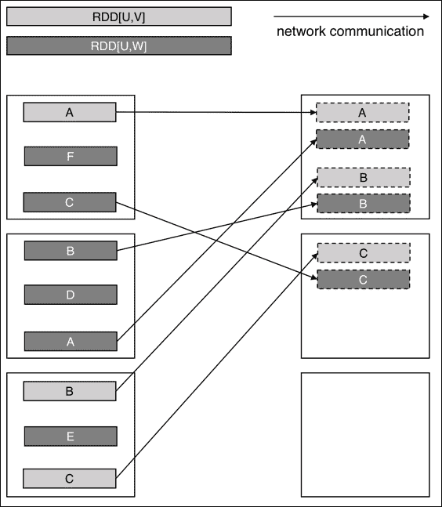
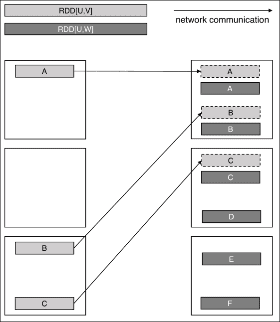
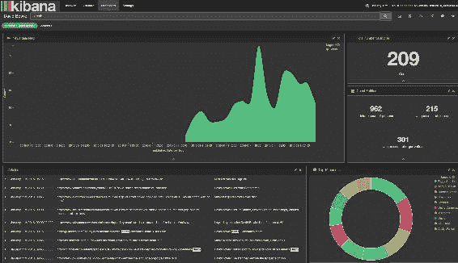

# 第六章：抓取基于链接的外部数据

本章旨在解释一种增强本地数据的常见模式，该模式使用从 URL 或 API 获取的外部内容。例如，当从 GDELT 或 Twitter 接收到 URL 时。我们为读者提供了一个使用 GDELT 新闻索引服务作为新闻 URL 来源的教程，演示如何构建一个从互联网上抓取感兴趣的全球突发新闻的网络规模新闻扫描器。我们解释了如何构建这个专门的网络抓取组件，以克服规模的挑战。在许多用例中，访问原始 HTML 内容是不足以提供对新兴全球事件的更深入洞察的。专业的数据科学家必须能够从原始文本内容中提取实体，以帮助构建跟踪更广泛趋势所需的上下文。

在本章中，我们将涵盖以下主题：

+   使用*Goose*库创建可扩展的网络内容获取器

+   利用 Spark 框架进行自然语言处理（NLP）

+   使用双重音标算法去重名字

+   利用 GeoNames 数据集进行地理坐标查找

# 构建一个网络规模的新闻扫描器

数据科学与统计学的不同之处在于强调可扩展处理以克服围绕收集数据的质量和多样性的复杂问题。而统计学家处理干净数据集的样本，可能来自关系数据库，数据科学家相反，处理来自各种来源的大规模非结构化数据。前者专注于构建具有高精度和准确性的模型，而后者通常专注于构建丰富的集成数据集，提供发现不那么严格定义的见解。数据科学之旅通常涉及折磨初始数据源，连接理论上不应该连接的数据集，丰富内容与公开可用信息，实验，探索，发现，尝试，失败，再次尝试。无论技术或数学技能如何，普通数据科学家与专业数据科学家之间的主要区别在于在提取数据中的潜在价值时所使用的好奇心和创造力的水平。例如，你可以构建一个简单的模型，并为业务团队提供他们要求的最低要求，或者你可以注意并利用数据中提到的所有这些 URL，然后抓取这些内容，并使用这些扩展结果来发现超出业务团队最初问题的新见解。

## 访问网络内容

除非你在 2016 年初非常努力地工作，否则你一定听说过歌手*大卫·鲍伊*于 2016 年 1 月 10 日去世，享年 69 岁。这一消息被所有媒体发布商广泛报道，在社交网络上传播，并得到了世界各地最伟大艺术家的致敬。这可悲地成为了本书内容的一个完美用例，并且是本章的一个很好的例证。我们将使用 BBC 的以下文章作为本节的参考：


图 1：关于大卫·鲍伊的 BBC 文章，来源：http://www.bbc.co.uk/news/entertainment-arts-35278872

查看这篇文章背后的 HTML 源代码，首先要注意的是大部分内容都不包含任何有价值的信息。这包括标题、页脚、导航面板、侧边栏和所有隐藏的 JavaScript 代码。虽然我们只对标题、一些参考（如发布日期）感兴趣，最多只对文章本身的几十行感兴趣，但分析页面将需要解析超过 1500 行的 HTML 代码。虽然我们可以找到许多用于解析 HTML 文件内容的库，但创建一个足够通用的解析器，可以处理来自随机文章的未知 HTML 结构，可能会成为一个真正的挑战。

### Goose 图书馆

我们将这个逻辑委托给优秀的 Scala 库**Goose**（[`github.com/GravityLabs/goose`](https://github.com/GravityLabs/goose)）。该库打开一个 URL 连接，下载 HTML 内容，清理掉所有的垃圾，使用一些英文停用词的聚类对不同的段落进行评分，最后返回剥离了任何底层 HTML 代码的纯文本内容。通过正确安装*imagemagick*，该库甚至可以检测给定网站的最具代表性的图片（这里不在讨论范围内）。`goose`依赖项可在 Maven 中央库中找到：

```scala
<dependency>
  <groupId>com.gravity</groupId>
  <artifactId>goose</artifactId>
  <version>2.1.23</version>
</dependency>
```

与 Goose API 交互就像使用库本身一样愉快。我们创建一个新的 Goose 配置，禁用图像获取，修改一些可选设置，如用户代理和超时选项，并创建一个新的`Goose`对象：

```scala
def getGooseScraper(): Goose = {
  val conf: Configuration = new Configuration
  conf.setEnableImageFetching(false)
  conf.setBrowserUserAgent(userAgent)
  conf.setConnectionTimeout(connectionTimeout)
  conf.setSocketTimeout(socketTimeout)
  new Goose(conf)
}

val url = "http://www.bbc.co.uk/news/entertainment-arts-35278872"
val goose: Goose = getGooseScraper()
val article: Article = goose.extractContent(url)
```

调用`extractContent`方法返回一个具有以下值的 Article 类：

```scala
val cleanedBody: String = article.cleanedArticleText
val title: String = article.title
val description: String = article.metaDescription
val keywords: String = article.metaKeywords
val domain: String = article.domain
val date: Date = article.publishDate
val tags: Set[String] = article.tags

/*
Body: Singer David Bowie, one of the most influential musicians...
Title: David Bowie dies of cancer aged 69
Description: Tributes are paid to David Bowie...
Domain: www.bbc.co.uk
*/
```

使用这样一个库，打开连接并解析 HTML 内容不会花费我们超过十几行的代码，这种技术可以应用于任意来源或 HTML 结构的文章 URL 列表。最终的输出是一个干净解析的数据集，一致，并且在下游分析中非常有用。

## 与 Spark 集成

下一个逻辑步骤是集成这样一个库，并在可扩展的 Spark 应用程序中提供其 API。一旦集成，我们将解释如何有效地从大量 URL 中检索远程内容，以及如何在 Spark 转换中使用不可序列化的类，并且以高性能的方式。

### Scala 兼容性

Maven 上的 Goose 库已经编译为 Scala 2.9，因此与 Spark 分发不兼容（Spark 2.0+需要 Scala 2.11）。为了使用它，我们不得不为 Scala 2.11 重新编译 Goose 分发，并为了您的方便，我们将其放在了我们的主 GitHub 存储库中。可以使用以下命令快速安装：

```scala
$ git clone git@bitbucket.org:gzet_io/goose.git
$ cd goose && mvn clean install
```

请注意，您将需要修改您的项目`pom.xml`文件以使用这个新的依赖项。

```scala
<dependency>
  <groupId>com.gravity</groupId>
  <artifactId>goose_2.11</artifactId>
  <version>2.1.30</version>
</dependency>
```

### 序列化问题

任何与第三方依赖项一起工作的 Spark 开发人员至少应该遇到过`NotSerializableException`。尽管在一个有很多转换的大型项目中找到确切的根本原因可能是具有挑战性的，但原因是非常简单的。Spark 试图在将它们发送到适当的执行器之前序列化所有的转换。由于`Goose`类不可序列化，并且由于我们在闭包外部构建了一个实例，这段代码是`NotSerializableException`的一个完美例子。

```scala
val goose = getGooseScraper()
def fetchArticles(urlRdd: RDD[String]): RDD[Article] = {
  urlRdd.map(goose.extractContent)
}
```

我们通过在`map`转换中创建一个`Goose`类的实例来简单地克服了这个限制。通过这样做，我们避免了传递任何我们可能创建的非可序列化对象的引用。Spark 将能够将代码*原样*发送到每个执行器，而无需序列化任何引用的对象。

```scala
def fechArticles(urlRdd: RDD[String]): RDD[Article] = {
  urlRdd map { url =>
    val goose = getGooseScraper()
    goose.extractContent(url)
  }
}
```

## 创建一个可扩展的、生产就绪的库

改进简单应用程序的性能在单个服务器上运行有时并不容易；但在并行处理大量数据的分布式应用程序上进行这样的改进通常更加困难，因为有许多其他因素会影响性能。接下来，我们将展示我们用来调整内容获取库的原则，以便它可以在任何规模的集群上自信地运行而不会出现问题。

### 构建一次，多次读取

值得一提的是，在前面的示例中，为每个 URL 创建了一个新的 Goose 实例，这使得我们的代码在大规模运行时特别低效。举个简单的例子来说明这一点，创建一个`Goose`类的新实例可能需要大约 30 毫秒。在我们数百万条记录中的每一条上都这样做将需要在一个 10 节点集群上花费 1 小时，更不用说垃圾回收性能将受到显著影响。使用`mapPartitions`转换可以显著改善这个过程。这个闭包将被发送到 Spark 执行器（就像`map`转换一样），但这种模式允许我们在每个执行器上创建一个单独的 Goose 实例，并为每个执行器的记录调用其`extractContent`方法。

```scala
def fetchArticles(urlRdd: RDD[String]): RDD[Article] = {
  urlRdd mapPartitions { urls =>
    val goose = getGooseScraper()
    urls map goose.extractContent
  }
}
```

### 异常处理

异常处理是正确软件工程的基石。这在分布式计算中尤其如此，因为我们可能与大量直接不受我们控制的外部资源和服务进行交互。例如，如果我们没有正确处理异常，那么在获取外部网站内容时发生的任何错误都会使 Spark 在抛出最终异常并中止作业之前多次重新安排整个任务在其他节点上。在生产级别的、无人值守的网络爬虫操作中，这种问题可能会危及整个服务。我们当然不希望因为一个简单的 404 错误而中止整个网络爬虫内容处理过程。

为了加强我们的代码对这些潜在问题的防范，任何异常都应该被正确捕获，并且我们应该确保所有返回的对象都应该一致地被设置为可选的，对于所有失败的 URL 来说都是未定义的。在这方面，关于 Goose 库唯一不好的一点是其返回值的不一致性：标题和日期可能返回 null，而缺少描述和正文的情况下会返回空字符串。在 Java/Scala 中返回 null 是一个非常糟糕的做法，因为它通常会导致`NullPointerException`，尽管大多数开发人员通常会在旁边写上"This should not happen"的注释。在 Scala 中，建议返回一个选项而不是 null。在我们的示例代码中，我们从远程内容中获取的任何字段都应该以可选的方式返回，因为它可能在原始源页面上不存在。此外，当我们获取数据时，我们还应该处理其他方面的一致性，例如我们可以将日期转换为字符串，因为在调用操作（如**collect**）时可能会导致序列化问题。因为这些原因，我们应该按照以下方式重新设计我们的`mapPartitions`转换。

+   我们测试每个对象的存在并返回可选结果

+   我们将文章内容封装到一个可序列化的`Content`类中

+   我们捕获任何异常并返回一个具有未定义值的默认对象

修改后的代码如下所示：

```scala
case class Content(
     url: String,
     title: Option[String],
     description: Option[String],
     body: Option[String],
     publishDate: Option[String]
)

def fetchArticles(urlRdd: RDD[String]): RDD[Content] = {

  urlRdd mapPartitions { urls =>

    val sdf = new SimpleDateFormat("yyyy-MM-dd'T'HH:mm:ssZ")
    val goose = getGooseScraper()

    urls map { url =>

      try {

        val article = goose.extractContent(url)
        var body = None: Option[String]
        var title = None: Option[String]
        var description = None: Option[String]
        var publishDate = None: Option[String]

        if (StringUtils.isNotEmpty(article.cleanedArticleText))
          body = Some(article.cleanedArticleText)

        if (StringUtils.isNotEmpty(article.title))
          title = Some(article.title)

        if (StringUtils.isNotEmpty(article.metaDescription))
          description = Some(article.metaDescription)

        if (article.publishDate != null)
          publishDate = Some(sdf.format(article.publishDate))

        Content(url, title, description, body, publishDate)

      } catch {
        case e: Throwable => Content(url, None, None, None, None)
      }
    }
  }

}
```

### 性能调优

尽管大多数情况下，Spark 应用程序的性能可以通过对代码本身的更改大大改善（我们已经看到了使用`mapPartitions`而不是`map`函数来实现完全相同目的的概念），但您可能还需要找到总执行器数量、每个执行器的核心数量以及分配给每个容器的内存之间的正确平衡。

在进行这种第二种类型的应用程序调优时，首先要问自己的问题是，您的应用程序是 I/O 绑定（大量读/写访问）、网络绑定（节点之间大量传输）、内存绑定还是 CPU 绑定（您的任务通常需要太长时间才能完成）。

很容易发现我们的网络爬虫应用程序中的主要瓶颈。创建一个`Goose`实例大约需要 30 毫秒，获取给定 URL 的 HTML 大约需要 3 秒才能完成。基本上，我们花费了 99%的时间等待内容块被检索，主要是因为互联网连接和网站的可用性。克服这个问题的唯一方法是大幅增加我们 Spark 作业中使用的执行者数量。请注意，由于执行者通常位于不同的节点上（假设正确的 Hadoop 设置），更高的并行度不会在带宽方面受到网络限制（就像在单个节点上使用多个线程时肯定会发生的那样）。

此外，关键要注意的是，在这个过程的任何阶段都没有涉及减少操作（没有洗牌），因为这个应用是一个仅映射的作业，因此天然具有线性可扩展性。从逻辑上讲，两倍的执行者将使我们的爬虫性能提高两倍。为了反映这些设置在我们的应用程序上，我们需要确保我们的数据集被均匀地分区，至少有与我们定义的执行者数量一样多的分区。如果我们的数据集只能适应一个分区，那么我们的许多执行者中只有一个会被使用，使我们的新 Spark 设置既不足够又高度低效。重新分区我们的集合是一个一次性的操作（尽管是一个昂贵的操作），假设我们正确地缓存和实现我们的 RDD。我们在这里使用了`200`的并行性：

```scala
val urlRdd = getDistinctUrls(gdeltRdd).repartition(200)
urlRdd.cache()
urlRdd.count()

val contentRdd: RDD[Content] = fetchArticles(urlRdd)
contentRdd.persist(StorageLevel.DISK_ONLY)
contentRdd.count()
```

最后要记住的一件事是彻底缓存返回的 RDD，因为这样可以消除所有懒惰定义的转换（包括 HTML 内容获取）可能在我们调用任何进一步的操作时重新评估的风险。为了保险起见，因为我们绝对不想两次从互联网获取 HTML 内容，我们强制这种缓存明确地发生，通过将返回的数据集持久化到`DISK_ONLY`。

# 命名实体识别

构建一个网络爬虫，用外部基于网页的 HTML 内容丰富包含 URL 的输入数据集，在大数据摄入服务中具有很大的商业价值。但是，虽然普通的数据科学家应该能够使用一些基本的聚类和分类技术来研究返回的内容，但专业的数据科学家将把这个数据丰富过程提升到下一个级别，通过进一步丰富和增加价值来进行后续处理。通常，这些增值的后续处理包括消除外部文本内容的歧义，提取实体（如人物、地点和日期），以及将原始文本转换为最简单的语法形式。我们将在本节中解释如何利用 Spark 框架来创建一个可靠的自然语言处理（NLP）管道，其中包括这些有价值的后处理输出，并且可以处理任何规模的英语内容。

## Scala 库

ScalaNLP（http://www.scalanlp.org/）是 breeze（等等）的父项目，并且是在 Spark MLlib 中广泛使用的数值计算框架。如果它没有在不同版本的 breeze 和 epic 之间引起这么多依赖问题，这个库本来是 Spark 上 NLP 的完美候选者。为了克服这些核心依赖不匹配，我们要么重新编译整个 Spark 分发版，要么重新编译整个 ScalaNLP 堆栈，这两者都不是易事。因此，我们更倾向于使用来自计算语言理解实验室的一套自然语言处理器（https://github.com/clulab/processors）。它是用 Scala 2.11 编写的，提供了三种不同的 API：斯坦福 CoreNLP 处理器、快速处理器和用于处理生物医学文本的处理器。在这个库中，我们可以使用`FastNLPProcessor`，它对于基本的命名实体识别功能来说足够准确，并且在 Apache v2 许可下。

```scala
<dependency>
  <groupId>org.clulab</groupId>
  <artifactId>processors-corenlp_2.11</artifactId>
  <version>6.0.1</version>
</dependency>

<dependency>
  <groupId>org.clulab</groupId>
  <artifactId>processors-main_2.11</artifactId>
  <version>6.0.1</version>
</dependency>

<dependency>
  <groupId>org.clulab</groupId>
  <artifactId>processors-models_2.11</artifactId>
  <version>6.0.1</version>
</dependency>
```

## NLP 演练

NLP 处理器注释文档并返回词形的列表（以其最简单的语法形式呈现的单词），命名实体类型的列表，如`[ORGANIZATION]`，`[LOCATION]`，`[PERSON]`，以及标准化实体的列表（如实际日期值）。

### 提取实体

在下面的例子中，我们初始化一个`FastNLPProcessor`对象，注释并标记文档为一个`Sentence`列表，将词形和 NER 类型进行压缩，最后返回每个给定句子的识别实体数组。

```scala
case class Entity(eType: String, eVal: String)

def processSentence(sentence: Sentence): List[Entity] = {
  val entities = sentence.lemmas.get
    .zip(sentence.entities.get)
    .map {
      case (eVal, eType) =>
        Entity(eType, eVal)
    }
}

def extractEntities(processor: Processor, corpus: String) = {
  val doc = processor.annotate(corpus)
  doc.sentences map processSentence
}

val t = "David Bowie was born in London"
val processor: Processor = new FastNLPProcessor()
val sentences = extractEntities(processor, t)

sentences foreach { sentence =>
  sentence foreach println
}

/*
Entity(David,PERSON)
Entity(Bowie,PERSON)
Entity(was,O)
Entity(born,O)
Entity(in,O) 
Entity(London,LOCATION) 
*/
```

从上面的输出中，您可能会注意到所有检索到的实体都没有链接在一起，`David`和`Bowie`都是类型为`[PERSON]`的两个不同实体。我们使用以下方法递归聚合连续相似的实体。

```scala
def aggregate(entities: Array[Entity]) = {
  aggregateEntities(entities.head, entities.tail, List())
}

def aggregateEntity(e1: Entity, e2: Entity) = {
  Entity(e1.eType, e1.eVal + " " + e2.eVal)
}

def aggEntities(current: Entity, entities: Array[Entity], processed : List[Entity]): List[Entity] = {
  if(entities.isEmpty) {
// End of recusion, no additional entity to process
    // Append our last un-processed entity to our list
    current :: processed
  } else {
    val entity = entities.head
    if(entity.eType == current.eType) {
 // Aggregate consecutive values only of a same entity type      val aggEntity = aggregateEntity(current, entity)
*      // Process next record*
      aggEntities(aggEntity, entities.tail, processed)
    } else {
// Add current entity as a candidate for a next aggregation
      // Append our previous un-processed entity to our list      aggEntities(entity, entities.tail, current :: processed)
    }
  }
}

def processSentence(sentence: Sentence): List[Entity] = {
  val entities = sentence.lemmas.get
    .zip(sentence.entities.get)
    .map {
      case (eVal, eType) =>
        Entity(eType, eVal)
    }
  aggregate(entities)
}
```

现在打印相同的内容会给我们一个更一致的输出。

```scala
/*
(PERSON,David Bowie)
(O,was born in)
(LOCATION,London) 
*/
```

### 提示

在函数式编程环境中，尽量限制使用任何可变对象（如使用`var`）。作为一个经验法则，可以通过使用前置递归函数来避免任何可变对象。

### 抽象方法

我们意识到在一组句子（句子本身是一个实体数组）上工作可能听起来很模糊。根据经验，当在大规模运行时，对 RDD 进行简单转换将需要多个`flatMap`函数，这将更加令人困惑。我们将结果封装到一个`Entities`类中，并公开以下方法：

```scala
case class Entities(sentences: Array[List[(String, String)]])
 {

  def getSentences = sentences

  def getEntities(entity: String) = {
    sentences flatMap { sentence =>
      sentence
    } filter { case (entityType, entityValue) =>
      entityType == entity
    } map { case (entityType, entityValue) =>
      entityValue
    } toSeq
  }
```

## 构建可扩展的代码

我们现在已经定义了我们的 NLP 框架，并将大部分复杂逻辑抽象成一组方法和方便的类。下一步是将这段代码集成到 Spark 环境中，并开始大规模处理文本内容。为了编写可扩展的代码，需要特别注意以下几点：

+   在 Spark 作业中使用非可序列化类时，必须在闭包内仔细声明，以避免引发`NotSerializableException`。请参考我们在前一节中讨论的 Goose 库序列化问题。

+   每当我们创建一个`FastNLPProcessor`的新实例（每当我们首次调用其`annotate`方法时，因为它是懒惰定义的），所有所需的模型将从类路径中检索、反序列化并加载到内存中。这个过程大约需要 10 秒钟才能完成。

+   除了实例化过程相当缓慢之外，值得一提的是模型可能非常庞大（大约 1GB），并且将所有这些模型保留在内存中将逐渐消耗我们可用的堆空间。

### 一次构建，多次读取

出于以上所有原因，将我们的代码*原样*嵌入`map`函数中将非常低效（并且可能会耗尽我们所有的可用堆空间）。如下例所示，我们利用`mapPartitions`模式来优化加载和反序列化模型的开销时间，以及减少执行器使用的内存量。使用`mapPartitions`强制处理每个分区的第一条记录以评估引导模型加载和反序列化过程，并且在该执行器上的所有后续调用将重用该分区内的模型，有助于将昂贵的模型传输和初始化成本限制为每个执行器一次。

```scala
def extract(corpusRdd: RDD[String]): RDD[Entities] = {
  corpusRdd mapPartitions {
    case it=>
      val processor = new FastNLPProcessor()
      it map {
        corpus =>
          val entities = extractEntities(processor, corpus)
          new Entities(entities)
      }
    }
  }
```

这个 NLP 可扩展性问题的最终目标是在处理尽可能多的记录时加载尽可能少的模型。对于一个执行器，我们只加载一次模型，但完全失去了并行计算的意义。对于大量的执行器，我们将花费更多的时间反序列化模型，而不是实际处理我们的文本内容。这在性能调优部分有所讨论。

### 可扩展性也是一种思维状态

因为我们在将代码集成到 Spark 之前在本地设计了我们的代码，我们一直记得以最方便的方式编写代码。这很重要，因为可扩展性不仅体现在大数据环境中代码运行的速度上，还体现在人们对其感觉如何，以及开发人员与您的 API 的交互效率如何。作为开发人员，如果你需要链接嵌套的`flatMap`函数来执行本应该是简单转换的操作，那么你的代码根本不具备可扩展性！由于我们的数据结构完全抽象在一个`Entities`类中，从我们的 NLP 提取中派生出不同的 RDD 可以通过一个简单的映射函数完成。

```scala
val entityRdd: RDD[Entities] = extract(corpusRdd)
entityRdd.persist(StorageLevel.DISK_ONLY)
entityRdd.count()

val perRdd = entityRdd.map(_.getEntities("PERSON"))
val locRdd = entityRdd.map(_.getEntities("LOCATION"))
val orgRdd = entityRdd.map(_.getEntities("ORGANIZATION"))
```

### 提示

关键要注意这里使用了`persist`。与之前在 HTML 获取器过程中所做的一样，我们彻底缓存返回的 RDD，以避免在调用任何进一步的操作时重新评估其所有基础转换的情况。NLP 处理是一个非常昂贵的过程，你必须确保它不会被执行两次，因此这里使用了`DISK_ONLY`缓存。

### 性能调优

为了使这个应用程序扩展，你需要问自己同样关键的问题：这个作业是 I/O、内存、CPU 还是网络绑定的？NLP 提取是一个昂贵的任务，加载模型需要大量内存。我们可能需要减少执行器的数量，同时为每个执行器分配更多的内存。为了反映这些设置，我们需要确保我们的数据集将被均匀分区，使用至少与执行器数量相同的分区。我们还需要通过缓存我们的 RDD 并调用一个简单的`count`操作来强制进行这种重新分区，这将评估我们所有先前的转换（包括分区本身）。

```scala
val corpusRdd: RDD[String] = inputRdd.repartition(120)
corpusRdd.cache()
corpusRdd.count()

val entityRdd: RDD[Entities] = extract(corpusRdd)
```

# GIS 查找

在前一节中，我们涵盖了一个有趣的用例，即如何从非结构化数据中提取位置实体。在本节中，我们将通过尝试根据我们能够识别的实体的位置来检索实际的地理坐标信息（如纬度和经度），使我们的丰富过程变得更加智能。给定一个输入字符串`伦敦`，我们能否检测到伦敦-英国的城市以及其相对纬度和经度？我们将讨论如何构建一个高效的地理查找系统，该系统不依赖于任何外部 API，并且可以通过利用 Spark 框架和*Reduce-Side-Join*模式处理任何规模的位置数据。在构建此查找服务时，我们必须牢记世界上许多地方可能共享相同的名称（仅在美国就有大约 50 个名为曼彻斯特的地方），并且输入记录可能不使用所指的地方的官方名称（通常使用的瑞士日内瓦的官方名称是日内瓦）。

## GeoNames 数据集

**GeoNames** ([`www.geonames.org/`](http://www.geonames.org/))是一个涵盖所有国家的地理数据库，包含超过 1000 万个地名和地理坐标，并可免费下载。在这个例子中，我们将使用`AllCountries.zip`数据集（1.5 GB），以及`admin1CodesASCII.txt`参考数据，将我们的位置字符串转换为具有地理坐标的有价值的位置对象。我们将仅保留与大洲、国家、州、地区和城市以及主要海洋、海洋、河流、湖泊和山脉相关的记录，从而将整个数据集减少一半。尽管管理代码数据集很容易放入内存中，但 Geo 名称必须在 RDD 中处理，并且需要转换为以下案例类：

```scala
case class GeoName(
  geoId: Long,
  name: String,
  altNames: Array[String],
  country: Option[String],
  adminCode: Option[String],
  featureClass: Char,
  featureCode: String,
  population: Long,
  timezone: Array[String],
  geoPoint: GeoPoint
)

case class GeoPoint(
  lat: Double,
  lon: Double
)
```

我们将不在这里描述将平面文件解析为`geoNameRDD`的过程。解析器本身非常简单，处理制表符分隔的记录文件，并根据上述案例类定义转换每个值。相反，我们将公开以下静态方法：

```scala
val geoNameRdd: RDD[GeoName] = GeoNameLookup.load(
  sc,
  adminCodesPath,
  allCountriesPath
)
```

## 构建高效的连接

主要的查找策略将依赖于对我们的地理名称和输入数据执行的`join`操作。为了最大限度地提高获取位置匹配的机会，我们将使用`flatMap`函数扩展我们的初始数据，以涵盖所有可能的替代名称，因此将初始大小从 500 万条记录大幅增加到约 2000 万条记录。我们还确保从名称中清除任何可能包含的重音符号、破折号或模糊字符：

```scala
val geoAltNameRdd = geoNameRdd.flatMap {
  geoName =>
    altNames map { altName =>
      (clean(altName), geoName)
    }
} filter { case (altName, geoName) =>
  StringUtils.isNotEmpty(altName.length)
} distinct()

val inputNameRdd = inputRdd.map { name =>
  (clean(name), name)
} filter { case (cleanName, place) =>
  StringUtils.*isNotEmpty*(cleanName.length)
 }
```

最后，剩下的过程是在清理后的输入和清理后的`geoNameRDD`之间进行简单的`join`操作。最后，我们可以将所有匹配的地点分组成一组简单的`GeoName`对象：

```scala
def geoLookup(
  inputNameRdd: RDD[(String, String)],
  geoNameRdd: RDD[(String, GeoName)]
): RDD[(String, Array[GeoName])] = {

  inputNameRdd
    .join(geoNameRdd)
    .map { case (key, (name, geo)) =>
      (name, geo)
    }
    .groupByKey()
    .mapValues(_.toSet)

}
```

这里可以讨论一个有趣的模式。Spark 如何在大型数据集上执行`join`操作？在传统的 MapReduce 中称为*Reduce-Side-Join*模式，它要求框架对来自两个 RDD 的所有键进行哈希，并将具有相同键（相同哈希）的所有元素发送到专用节点，以便在本地`join`它们的值。*Reduce-Side-Join*的原则如下图 2 所示。由于*Reduce-Side-Join*是一项昂贵的任务（受网络限制），我们必须特别注意解决以下两个问题：

+   *GeoNames*数据集比我们的输入 RDD 要大得多。我们将浪费大量精力洗牌数据，而这些数据无论如何都不会匹配，使我们的`join`不仅效率低下，而且主要是无用的。

+   *GeoNames*数据集随时间不会改变。在伪实时系统（如 Spark Streaming）中接收位置事件的批处理中，重新洗牌这个不可变的数据集是没有意义的。

我们可以构建两种不同的策略，一种是离线策略，一种是在线策略。前者将利用*布隆过滤器*大大减少要洗牌的数据量，而后者将按键对我们的 RDD 进行分区，以减少与`join`操作相关的网络成本。


图 2：Reduce-Side-Join

### 离线策略-布隆过滤

**布隆过滤器**是一种空间高效的概率数据结构，用于测试元素是否是有限概率的假阳性成员。在传统的 MapReduce 中被广泛使用，一些实现已经编译为 Scala。我们将使用 breeze 库的布隆过滤器，该库可在 maven 中心获得（与我们之前讨论的 ScalaNLP 模型相比，breeze 本身可以在很大程度上避免依赖不匹配）。

```scala
<dependency>
  <groupId>org.scalanlp</groupId>
  <artifactId>breeze_2.11</artifactId>
  <version>0.12</version>
</dependency>
```

因为我们的输入数据集比`geoNameRDD`要小得多，所以我们将通过利用`mapPartitions`函数对前者训练一个布隆过滤器。每个执行器将构建自己的布隆过滤器，我们可以通过其关联属性将其聚合成一个单一对象，使用`reduce`函数内的位运算符：

```scala
val bfSize = inputRdd.count()
val bf: BloomFilter[String] = inputRdd.mapPartitions { it =>
  val bf = BloomFilter.optimallySizedString
  it.foreach { cleanName =>
    bf += cleanName
  }
  Iterator(bf)
} reduce(_ | _)
```

我们针对完整的`geoNameRDD`测试我们的过滤器，以删除我们知道不会匹配的地点，最后执行相同的`join`操作，但这次处理的数据要少得多：

```scala
val geoNameFilterRdd = geoAltNameRdd filter {
  case(name, geo) =>
    bf.contains(name)
}

val resultRdd = geoLookup(inputNameRdd, geoNameFilterRdd)
```

通过减少`geoNameRDD`的大小，我们已经成功地减轻了洗牌过程的压力，使我们的`join`操作更加高效。产生的*Reduce-Side-Join*如下图 3 所示：



图 3：使用布隆过滤器的 Reduce-Side-Join

### 在线策略-哈希分区

在离线过程中，我们通过预处理我们的`geoNameRDD`来减少要洗牌的数据量。在流处理过程中，因为任何新的数据批次都是不同的，所以不值得一遍又一遍地过滤我们的参考数据。在这种情况下，我们可以通过使用`HashPartitioner`按键预分区我们的`geoNameRDD`数据，使用的分区数至少是执行器的数量，从而大大提高`join`性能。因为 Spark 框架知道重新分区的使用，只有输入 RDD 将被发送到洗牌，使我们的查找服务显着更快。这在*图 4*中有所说明。请注意，使用`cache`和`count`方法来强制分区。最后，我们可以安全地执行我们相同的`join`操作，这次对网络的压力要小得多：

```scala
val geoAltNamePartitionRdd = geoAltNameRdd.partitionBy(
  new HashPartitioner(100)
).cache()

geoAltNamePartitionRdd.count()
val resultRdd = geoLookup(inputNameRdd, geoAltNamePartitionRdd)
```



图 4：使用哈希分区的减少端连接

## 内容去重

像曼彻斯特这样的城市在我们的数据集中被发现 100 次，我们需要为类似名称制定去重策略，考虑到一些城市在随机文本内容中被发现的概率可能不如其他城市重要。

### 上下文学习

对于去重地点内容最准确的方法可能是研究地点记录在其上下文中的情况，类似于苹果公司对谷歌和雅虎的关系，苹果水果对香蕉和橙子的关系。通过机器学习地点在其上下文中，我们可能会发现单词*海狸*和*熊*在加拿大安大略省伦敦市的上下文中是相关的。据我们所知，在英国伦敦遇到野生熊的风险是非常小的。假设可以访问文本内容，训练模型不应该很困难，但访问地理坐标将需要建立一个带有每个地方的地理值和最能描述的主题的索引字典。因为我们没有访问这样的数据集（尽管我们可以从*维基百科*上获取），并且我们不想假设有人可以访问文本内容，所以我们将简单地将地点排名为重要性的顺序。

### 地点评分

考虑到我们从 GeoNames 网站获取的不同代码，我们假设一个大陆比一个国家更重要，一个国家比一个州或一个首都更重要，依此类推。这种天真的方法在 80%的时间内是有意义的，但在一些边缘情况下可能会返回不相关的结果。以曼彻斯特为例，我们会发现曼彻斯特是牙买加的一个重要州的教区，而不是英国的一个简单的城市。我们可以通过在评分方面放宽限制并按人口数量降序排序相同评分的地点来解决这个问题。返回最重要和相关的地点是有意义的，大多数在线 API 都是这样做的，但对于不太重要的城市来说公平吗？我们通过向上下文添加唯一的参考 ID 来改进我们的评分引擎，在那里可能会提到几个地点。如果一个文档只关注加拿大的城市，而没有提到英国，那么伦敦很可能是加拿大的地方。如果没有提到国家或州，或者加拿大和英国都被提到，我们将在我们的数据集中将伦敦作为英国的伦敦。通过按照上下文中提到的相似大陆/国家/州进行排序，然后按重要性，最后按人口进行去重。第一个结果将作为我们最佳候选返回。

# 名称去重

由于我们从 NLP 提取过程中提取实体而没有任何验证，我们能够检索到的名称可能以许多不同的方式书写。它们可以按不同的顺序书写，可能包含中间名或缩写，称谓或贵族头衔，昵称，甚至一些拼写错误和拼写错误。尽管我们不打算完全去重内容（比如学习到*Ziggy Stardust*和*David Bowie*代表同一个人），但我们将介绍两种简单的技术，通过结合 MapReduce 范式和函数式编程的概念，以最小的成本去重大量数据。

## 使用 Scalaz 进行函数式编程

本节主要是关于作为摄入管道的一部分丰富数据。因此，我们对使用先进的机器学习技术构建最准确的系统不太感兴趣，而是对构建最可扩展和高效的系统感兴趣。我们希望保留每条记录的替代名称字典，以便快速合并和更新它们，代码尽可能少，并且规模非常大。我们希望这些结构表现得像单子，代数上的可结合结构，适当地支持**Scalaz**（[`github.com/scalaz/scalaz`](https://github.com/scalaz/scalaz)）上的纯函数式编程库：

```scala
<dependency>
  <groupId>org.scalaz</groupId>
  <artifactId>scalaz-core_2.11</artifactId>
  <version>7.2.0</version>
</dependency>
```

### 我们的去重策略

我们在下面使用一个简单的示例来证明使用 Scalaz 编程构建可扩展的去重管道的需求，该管道由多个转换组成。使用人员的 RDD，`personRDD`，作为下面显示的测试数据集：

```scala
personRDD.take(8).foreach(println)

/*
David Bowie
david bowie
david#Bowie
David Bowie
david bowie
David Bowie
David Bowie
Ziggy Stardust
*/
```

在这里，我们首先计算每个条目的出现次数。实际上，这是一个简单的 Wordcount 算法，MapReduce 编程的*101*：

```scala
val wcRDD = personRDD
  .map(_ -> 1)
  .reduceByKey(_+_)

wcRDD.collect.foreach(println)
/*
(David Bowie, 4)
(david bowie, 2)
(david#Bowie, 1)
(Ziggy Stardust, 1)
*/
```

在这里，我们应用第一个转换，比如`lowercase`，并生成一个更新的报告：

```scala
val lcRDD = wcRDD.map { case (p, tf) => 
  (p.lowerCase(), tf) 
} 
.reduceByKey(_+_) 

lcRDD.collect.foreach(println) 

/* 
(david bowie, 6) 
(david#bowie, 1) 
(ziggy stardust, 1) 
*/ 

```

在这里，我们然后应用第二个转换，删除任何特殊字符：

```scala
val reRDD = lcRDD.map { case (p, tf) =>
  (p.replaceAll("[^a-z]", ""), tf)
}
.reduceByKey(_+_)

reRDD.collect.foreach(println)

/*
(david bowie, 7)
(ziggy stardust, 1)
*/
```

我们现在已经将我们的六个条目减少到只有两个，但由于我们在转换过程中丢失了原始记录，我们无法构建一个形式为[原始值]->[新值]的字典。

### 使用 mappend 运算符

而不是使用 Scalaz API，我们预先初始化每个原始记录的名称频率字典（作为 Map，初始化为 1），并使用`mappend`函数（通过`|+|`运算符访问）合并这些字典。在每个转换之后，合并发生在`reduceByKey`函数中，将转换的结果作为键，术语频率映射作为值：

```scala
import scalaz.Scalaz._

def initialize(rdd: RDD[String]) = {
  rdd.map(s => (s, Map(s -> 1)))
     .reduceByKey(_ |+| _)
}

def lcDedup(rdd: RDD[(String, Map[String, Int])]) = {
  rdd.map { case (name, tf) =>
    (name.toLowerCase(), tf)
  }
  .reduceByKey(_ |+| _)
}

def reDedup(rdd: RDD[(String, Map[String, Int])]) = {
  rdd.map { case (name, tf) =>
    (name.replaceAll("\\W", ""), tf)
  }
  .reduceByKey(_ |+| _)
}

val wcTfRdd = initialize(personRDD)
val lcTfRdd = lcDedup(wcTfRdd)
val reTfRdd = reDedup(lcTfRdd)

reTfRdd.values.collect.foreach(println)

/*
Map(David Bowie -> 4, david bowie -> 2, david#Bowie -> 1)
Map(ziggy stardust -> 1)
*/
```

对于每个去重条目，我们找到最频繁的项目，并构建我们的字典 RDD 如下：

```scala
val dicRDD = fuTfRdd.values.flatMap {
  alternatives =>
    val top = alternatives.toList.sortBy(_._2).last._1
    tf.filter(_._1 != top).map { case (alternative, tf) =>
      (alternative, top)
    }
}

dicRDD.collect.foreach(println)

/*
david bowie, David Bowie
david#Bowie, David Bowie
*/
```

为了完全去重我们的人员 RDD，需要将所有`david bowie`和`david#bowie`的出现替换为`David Bowie`。现在我们已经解释了去重策略本身，让我们深入研究一下转换集。

## 简单清理

第一个去重转换显然是从所有模糊字符或额外空格中清理名称。我们用它们匹配的 ASCII 字符替换重音符号，正确处理驼峰大小写，并删除任何停用词，例如[mr, miss, sir]。将此函数应用于汤加总理，[Mr. Sialeʻataongo Tuʻivakanō]，我们返回[siale ataongo tu ivakano]，这是一个更干净的版本，至少在字符串去重的情况下是这样。执行去重本身将是使用 MapReduce 范式和早期引入的单子概念的几行代码：

```scala
def clean(name: String, stopWords: Set[String]) = {

  StringUtils.stripAccents(name)
    .split("\\W+").map(_.trim).filter { case part =>
      !stopWords.contains(part.toLowerCase())
    }
    .mkString(" ")
    .split("(?<=[a-z])(?=[A-Z])")
    .filter(_.length >= 2)
    .mkString(" ")
    .toLowerCase()

}

def simpleDedup(rdd: RDD[(String, Map[String, Int])], stopWords: Set[String]) = {

  rdd.map { case (name, tf) =>
    (clean(name, stopWords), tf)
  }
  .reduceByKey(_ |+| _)

}
```

## DoubleMetaphone

**DoubleMetaphone**是一种有用的算法，可以根据其英语发音索引名称。尽管它不能产生一个名字的精确音标表示，但它创建了一个简单的哈希函数，可以用于将具有相似音素的名称分组。

### 注意

有关 DoubleMetaphone 算法的更多信息，请参阅：*Philips，L.（1990）。Hanging on the Metaphone（Vol. 7）。计算机语言。）*

出于性能原因，我们转向这种算法，因为在大型词典中查找潜在的拼写错误和拼写错误通常是一项昂贵的操作；通常需要将候选姓名与我们正在跟踪的每个其他姓名进行比较。这种类型的比较在大数据环境中是具有挑战性的，因为它通常需要进行笛卡尔`join`，这可能会生成过大的中间数据集。metaphone 算法提供了一个更大、更快的替代方案。

使用 Apache commons 包中的`DoubleMetaphone`类，我们简单地利用 MapReduce 范式，将发音相同的姓名分组。例如，`[david bowie]`、`[david bowi]`和`[davide bowie]`都共享相同的代码`[TFT#P]`，将被分组在一起。在下面的示例中，我们计算每条记录的双元音哈希，并调用`reduceByKey`来合并和更新所有我们姓名的频率映射：

```scala
def metaphone(name: String) = {
  val dm = new DoubleMetaphone()
  name.split("\\s")
    .map(dm.doubleMetaphone)
    .mkString("#")
}

def metaphoneDedup(rdd: RDD[(String, Map[String, Int])]) = {
  rdd.map { case (name, tf) =>
    (metaphone(name), tf)
  }
  .reduceByKey(_ |+| _)
}
```

我们还可以通过保留常见英文昵称（比如 bill、bob、will、beth、al 等）及其对应的主要名称的列表，极大地改进这种简单的技术，这样我们就可以在非音标同义词之间进行匹配。我们可以通过预处理我们的姓名 RDD，将已知昵称的哈希码替换为相关主要名称的哈希码，然后我们可以运行相同的去重算法来解决基于音标和同义词的重复。这将检测拼写错误和替代昵称，如下所示：

```scala
persons.foreach(p => println(p + "\t" + metaphoneAndNickNames(p))

/*
David Bowie  TFT#P
David Bowi   TFT#P
Dave Bowie   TFT#P
*/
```

再次强调，这种算法（以及上面显示的简单清洗例程）将不像适当的模糊字符串匹配方法那样准确，例如计算每对可能的姓名之间的*Levenshtein*距离。然而，通过牺牲准确性，我们创造了一种高度可扩展的方法，以最小的成本找到大多数常见的拼写错误，特别是在无声辅音上的拼写错误。一旦所有替代名称都已根据生成的哈希码分组，我们可以将最佳替代名称输出为我们从我们的词频对象返回的最频繁的名称。通过`join`将这个最佳替代应用于初始名称 RDD，以替换任何记录为其首选替代（如果有的话）：

```scala
def getBestNameRdd(rdd: RDD[(String, Map[String, Int])]) = {
  rdd.flatMap { case (key, tf) =>
    val bestName = tf.toSeq.sortBy(_._2).last._1
    tf.keySet.map { altName =>
      (altName, bestName)
    } 
  }
}

val bestNameRdd = getBestNameRdd(nameTfRdd)

val dedupRdd = nameRdd
  .map(_ -> 1)
  .leftOuterJoin(bestNameRdd)
  .map { case (name, (dummy, optBest)) =>
    optBest.getOrElse(name)
  }
```

# 新闻索引仪表板

由于我们能够丰富输入 URL 中找到的内容，我们自然的下一步是开始可视化我们的数据。虽然探索性数据分析的不同技术已经在第四章中进行了详细讨论，*探索性数据分析*，我们认为值得用 Kibana 中的简单仪表板总结到目前为止我们所涵盖的内容。从大约 50,000 篇文章中，我们能够在 1 月 10 日至 11 日获取并分析，我们过滤掉任何提到*David Bowie*作为 NLP 实体并包含*death*一词的记录。因为我们所有的文本内容都被正确索引在 Elasticsearch 中，我们可以在几秒钟内提取 209 篇匹配的文章及其内容。



图 5：新闻索引仪表板

我们可以快速获取与**David Bowie**一起提到的前十位人物，包括他的艺名*Ziggy Stardust*、他的儿子*Duncan Jones*、他的前制作人*Tony Visconti*，或者英国首相*David Cameron*。由于我们建立的*GeoLookup*服务，我们展示了所有提到的不同地点，发现了梵蒂冈城国家周围的一个圈子，那里的红衣主教**Gianfranco Ravasi**，文化部主席，发推特提到*David Bowie*的著名歌词*Space Oddity*。


图 6：梵蒂冈向推特致敬

最后，在争先发布关于*David Bowie*去世的新闻的竞赛中，找到第一个报道的人就像简单的点击一样容易！

# 总结

数据科学不仅仅是关于机器学习。事实上，机器学习只是其中的一小部分。在我们对现代数据科学的理解中，科学往往恰好发生在数据丰富化的过程中。真正的魔力发生在当一个人能够将一个无意义的数据集转化为有价值的信息集，并从中获得新的见解。在本节中，我们已经描述了如何使用简单的 URL 集合（和一点点努力）构建一个完全功能的数据洞察系统。

在本章中，我们演示了如何使用 Goose 库在 Spark 中创建高效的网络爬虫，以及如何使用 NLP 技术和 GeoNames 数据库从原始文本中提取和去重特征。我们还涵盖了一些有趣的设计模式，如*mapPartitions*和*Bloom filters*，这些将在第十四章 *可扩展算法*中进一步讨论。

在下一章中，我们将专注于从所有这些新闻文章中提取出来的人们。我们将描述如何使用简单的联系链技术在它们之间建立联系，如何在 Spark 环境中高效存储和查询大型图表，以及如何使用*GraphX*和*Pregel*来检测社区。
