# 第七章：建立社区

随着越来越多的人相互交流和沟通，交换信息，或者只是在不同主题上分享共同的兴趣，大多数数据科学用例都可以使用图形表示来解决。尽管很长一段时间以来，非常大的图仅被互联网巨头、政府和国家安全机构使用，但现在使用包含数百万个顶点的大图变得更加普遍。因此，数据科学家的主要挑战不一定是在图表上检测社区并找到影响者，而是以一种完全分布式和高效的方式来克服规模的限制。本章将通过使用我们在第六章中描述的 NLP 提取识别的人员来构建一个大规模的图表示例。

在本章中，我们将涵盖以下主题：

+   使用 Spark 从 Elasticsearch 中提取内容，构建人员实体的图表，并了解使用 Accumulo 作为安全图数据库的好处

+   使用*GraphX*和三角形优化从 A 到 Z 编写社区检测算法

+   利用 Accumulo 特定功能，包括单元级安全性来观察社区的变化，并使用迭代器提供服务器和客户端计算

这一章节非常技术化，我们期望读者已经熟悉图论、消息传递和*Pregel* API。我们还邀请读者阅读本章中提到的每一篇白皮书。

# 构建人员图表

我们之前使用了 NLP 实体识别来从 HTML 原始文本格式中识别人物。在本章中，我们将尝试推断这些实体之间的关系，并检测围绕它们的可能社区。

## 联系链

在新闻文章的背景下，我们首先需要问自己一个基本问题。什么定义了两个实体之间的关系？最优雅的答案可能是使用斯坦福 NLP 库中描述的单词来研究，详情请参阅第六章中描述的*抓取基于链接的外部数据*。给定以下输入句子，该句子取自[`www.ibtimes.co.uk/david-bowie-yoko-ono-says-starmans-death-has-left-big-empty-space-1545160`](http://www.ibtimes.co.uk/david-bowie-yoko-ono-says-starmans-death-has-left-big-empty-space-1545160)：

> *"Yoko Ono 说她和已故丈夫约翰·列侬与大卫·鲍伊有着密切的关系"*

我们可以轻松提取句法树，这是语言学家用来模拟句子语法结构的结构，其中每个元素都以其类型报告，例如名词（`NN`），动词（`VR`）或限定词（`DT`），以及其在句子中的相对位置。

```scala
val processor = new CoreNLPProcessor()
val document = processor.annotate(text)

document.sentences foreach { sentence =>
  println(sentence.syntacticTree.get)
}

/*
(NNP Yoko)
(NNP Ono)
(VBD said)
        (PRP she)
      (CC and)
        (JJ late)
        (NN husband)
          (NNP John)
          (NNP Lennon)
      (VBD shared)
        (DT a)
        (JJ close)
        (NN relationship)
        (IN with)
          (NNP David)
          (NNP Bowie)
*/
```

对每个元素、其类型、其前驱和后继的彻底研究将有助于构建一个有向图，其中边是存在于所有这三个实体之间关系的真实定义。从这个句子构建的图的示例如下所示：

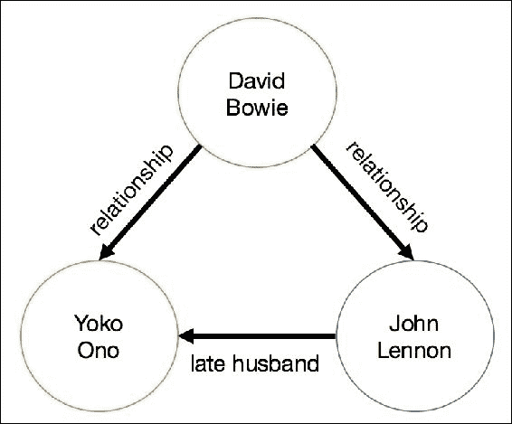

图 1：大卫·鲍伊、Yoko Ono 和约翰·列侬的句法图

虽然从语法上讲是完全合理的，但是构建一个句法树图需要大量的编码，可能需要一个完整的章节来讲解，并且并没有带来太多附加值，因为我们建立的大多数关系（在新闻文章的背景下）都不是基于历史书籍中的真实事实，而是需要放在它们的背景中。为了说明这一点，我们有两个句子，这些句子取自[`www.digitalspy.com/music/news/a779577/paul-mccartney-pays-tribute-to-great-star-david-bowie-his-star-will-shine-in-the-sky-forever/`](http://www.digitalspy.com/music/news/a779577/paul-mccartney-pays-tribute-to-great-star-david-bowie-his-star-will-shine-in-the-sky-forever/)：

> *“保罗·麦卡特尼爵士称[大卫·鲍伊]为一颗伟大的星星”*
> 
> *“[保罗·麦卡特尼爵士]珍视他们在一起的时刻”*

它将在[保罗·麦卡特尼]和[大卫·鲍伊]之间创建相同的语法链接，而只有后者假定它们之间存在物理联系（他们实际上在一起度过了一些时间）。

相反，我们使用了一种更快速的方法，即根据它们在文本中的位置对名称进行分组。我们的天真假设是，大多数作者通常首先提到重要人物的名字，然后写有关次要角色的内容，最后是不太重要的人物。因此，我们的联系链接是在给定文章中的所有名称上进行的简单嵌套循环，名称根据它们的实际位置从最重要的到最不重要的进行排序。由于其相对时间复杂度为*O(n²)*，这种方法只对每篇文章的记录数有效，对于提及数以千计不同实体的文本来说，它肯定会成为一个限制因素。

```scala
def buildTuples(p: Array[String]): Array[(String, String)] = {
    for(i <- 0 to p.length - 2; j <- i + 1 to p.length - 1) yield {
      (p(i), p(j))
    }
  }
```

在我们的代码库中，您将看到另一种选择：`Combinations`，这是一个更通用的解决方案，允许指定一个变量`r`；这使我们能够指定每个输出组合中需要出现的实体数量，即本章为 2，但在其他情境中可能更多。使用`Combinations.buildTuples`在功能上等同于之前给出的`buildTuples`代码。

## 从 Elasticsearch 中提取数据

Elasticsearch 是一个存储和索引文本内容及其元数据属性的完美工具，因此它是我们在线数据存储的逻辑选择，使用我们在上一章中提取的文本内容。由于本节更加面向批处理，我们使用出色的 Spark Elasticsearch API 将数据从 Elasticsearch 获取到我们的 Spark 集群中，如下面的代码所示：

```scala
<dependency>
  <groupId>org.elasticsearch</groupId>
  <artifactId>elasticsearch-spark_2.11</artifactId>
  <version>2.4.0<version>
</dependency>
```

给定索引类型和名称，与 Elasticsearch API 交互的一种便捷方式是使用 Spark DataFrame。在大多数用例中效率足够高（下面显示了一个简单的例子），但在处理更复杂和嵌套的模式时可能会成为一个挑战：

```scala
val spark = SparkSession
  .builder()
  .config("es.nodes", "localhost")
  .config("es.port", "9200")
  .appName("communities-es-download")
  .getOrCreate()

spark
  .read
  .format("org.elasticsearch.spark.sql")
  .load("gzet/news")
  .select("title", "url")
  .show(5)

+--------------------+--------------------+
|               title|                 url|
+--------------------+--------------------+
|Sonia Meets Mehbo...|http://www.newind...|
|"A Job Well Done ...|http://daphneanso...|
|New reading progr...|http://www.mailtr...|
|Barrie fire servi...|http://www.simcoe...|
|Paris police stat...|http://www.dailym...|
+--------------------+--------------------+
```

事实上，Elasticsearch API 并不灵活，无法读取嵌套结构和复杂数组。使用最新版本的 Spark，人们很快就会遇到诸如“'persons'字段由数组支持，但相关的 Spark 模式并不反映这一点”之类的错误。通过一些实验，我们可以看到，使用一组标准的 JSON 解析器（例如下面的`json4s`）通常更容易从 Elasticsearch 中访问嵌套和复杂的结构：

```scala
<dependency>
  <groupId>org.json4s</groupId>
  <artifactId>json4s-native_2.11</artifactId>
  <version>3.2.11</version>
</dependency>
```

我们使用隐式的`esJsonRdd`函数从 spark 上下文查询 Elasticsearch：

```scala
import org.elasticsearch.spark._
import org.json4s.native.JsonMethods._
import org.json4s.DefaultFormats

def readFromES(query: String = "?q=*"): RDD[Array[String]] = {

  sc.esJsonRDD("gzet/news", query)
    .values
    . map {
      jsonStr =>
        implicit val format = DefaultFormats
        val json = parse(jsonStr)
        (json \ "persons").extract[Array[String]]
    }

}

readFromEs("?persons='david bowie'")
   .map(_.mkString(","))
   .take(3)
   .foreach(println)

/*
david bowie,yoko ono,john lennon,paul mc cartney
duncan jones,david bowie,tony visconti
david bowie,boris johnson,david cameron
*/
```

使用`query`参数，我们可以访问 Elasticsearch 中的所有数据，其中的一部分数据，或者甚至是与特定查询匹配的所有记录。最后，我们可以使用之前解释的简单联系链接方法来构建我们的元组列表。

```scala
val personRdd = readFromES()
val tupleRdd = personRdd flatMap buildTuples
```

# 使用 Accumulo 数据库

我们已经看到了从 Elasticsearch 读取`personRdd`对象的方法，这为我们的存储需求提供了一个简单而整洁的解决方案。然而，在编写商业应用程序时，我们必须始终牢记安全性，在撰写本文时，Elasticsearch 安全性仍在开发中；因此，在这个阶段引入具有本地安全性的存储机制将是有用的。这是一个重要的考虑因素，因为我们使用的是 GDELT 数据，当然，根据定义，它是开源的。在商业环境中，数据集很常见地是机密的或在某种程度上具有商业敏感性，客户通常会在讨论数据科学方面之前要求了解他们的数据将如何得到安全保护。作者的经验是，许多商业机会由于解决方案提供者无法展示健壮和安全的数据架构而丧失。

**Accumulo** ([`accumulo.apache.org`](http://accumulo.apache.org)) 是一个基于 Google 的 Bigtable 设计（[`research.google.com/archive/bigtable.html`](http://research.google.com/archive/bigtable.html)）的 NoSQL 数据库，最初由美国国家安全局开发，后来在 2011 年释放给 Apache 社区。Accumulo 为我们提供了通常的大数据优势，如批量加载和并行读取，但还具有一些额外的功能，如迭代器，用于高效的服务器和客户端预计算、数据聚合，最重要的是单元格级安全。

在我们的社区检测工作中，我们将使用 Accumulo 来特别利用其迭代器和单元格级安全功能。首先，我们应该设置一个 Accumulo 实例，然后从 Elasticsearch 加载一些数据到 Accumulo，你可以在我们的 GitHub 存储库中找到完整的代码。

## 设置 Accumulo

安装 Accumulo 所需的步骤超出了本书的范围；网上有几个教程可供参考。只需进行一个带有根用户的原始安装即可继续本章，尽管我们需要特别注意 Accumulo 配置中的初始安全设置。一旦成功运行 Accumulo shell，您就可以继续进行。

使用以下代码作为创建用户的指南。目标是创建几个具有不同安全标签的用户，这样当我们加载数据时，用户将有不同的访问权限。

```scala
# set up some users
createuser matt
createuser ant
createuser dave
createuser andy

# create the persons table
createtable persons

# switch to the persons table
table persons

# ensure all of the users can access the table
grant -s System.READ_TABLE -u matt
grant -s System.READ_TABLE -u ant
grant -s System.READ_TABLE -u dave
grant -s System.READ_TABLE -u andy

# allocate security labels to the users
addauths -s unclassified,secret,topsecret -u matt
addauths -s unclassified,secret -u ant
addauths -s unclassified,topsecret -u dave
addauths -s unclassified -u andy

# display user auths
getauths -u matt

# create a server side iterator to sum values
setiter -t persons -p 10 -scan -minc -majc -n sumCombiner -class
org.apache.accumulo.core.iterators.user.SummingCombiner

# list iterators in use
listiter –all

# once the table contains some records ...
user matt

# we'll see all of the records that match security labels for the user
scan
```

## 单元格安全

Accumulo 使用令牌来保护其单元格。令牌由标签组成；在我们的情况下，这些是[`未分类`], [`机密`], 和 [`绝密`], 但你可以使用任何逗号分隔的值。Accumulo 行是用`visibility`字段（参考下面的代码）编写的，它只是对访问行值所需的标签的字符串表示。`visibility`字段可以包含布尔逻辑来组合不同的标签，还允许基本的优先级，例如：

```scala
secret&topsecret (secret AND topsecret)
secret|topsecret (secret OR topsecret)
unclassified&(secret|topsecret) (unclassified AND secret, or unclassified AND topsecret)
```

用户必须至少匹配`visibility`字段才能获得访问权限，并且必须提供标签，这些标签是存储在 Accumulo 中的令牌的子集（否则查询将被拒绝）。任何不匹配的值在用户查询中将不会被返回，这是一个重要的观点，因为如果用户得知数据缺失，往往可以根据周围图的性质得出逻辑上正确（或者更糟糕的是错误）的结论，例如，在一个人的联系链中，如果一些顶点对用户可见而另一些不可见，但不可见的顶点被标记为不可见，那么用户可能能够根据周围的图确定有关这些缺失实体的信息。例如，调查有组织犯罪的政府机构可能允许高级员工查看整个图，但只允许初级员工查看其中的部分。假设图中显示了一些知名人物，并且一个顶点的条目为空白，那么可能很容易推断出缺失的实体是谁；如果这个占位符完全不存在，那么就没有明显的迹象表明链条延伸得更远，从而允许机构控制信息的传播。然而，对于对这些链接一无所知的分析人员来说，图仍然是有用的，并且可以继续在图的特定区域上工作。

## 迭代器

迭代器是 Accumulo 中非常重要的特性，提供了一个实时处理框架，利用 Accumulo 的强大和并行能力，以非常低的延迟产生修改后的数据版本。我们不会在这里详细介绍，因为 Accumulo 文档中有很多例子，但我们将使用一个迭代器来保持相同 Accumulo 行的值的总和，也就是我们看到相同的人员对的次数；这将存储在该行值中。每当扫描表时，这个迭代器就会生效；我们还将演示如何从客户端调用相同的迭代器（当它尚未应用于服务器时）。

## Elasticsearch 到 Accumulo

让我们利用 Spark 能够使用 Hadoop 输入和输出格式的能力，利用本地 Elasticsearch 和 Accumulo 库。值得注意的是，我们在这里可以采取不同的路线，第一种是使用之前提供的 Elasticsearch 代码生成一个字符串元组数组，并将其输入到`AccumuloLoader`（在代码库中找到）；第二种是探索另一种使用额外 Hadoop `InputFormat` 的方法；我们可以编写代码，使用`EsInputFormat` 从 Elasticsearch 读取数据，并使用`AccumuloOutputFormat` 类写入 Accumulo。

### Accumulo 中的图数据模型

在深入代码之前，值得描述一下我们将在 Accumulo 中使用的存储人员图的模式。每个源节点（`person A`）将被存储为行键，关联名称（如“也被称为”）作为列族，目标节点（`person B`）作为列限定符，以及默认值`1`作为列值（这将通过我们的迭代器进行聚合）。如图 2 所示：

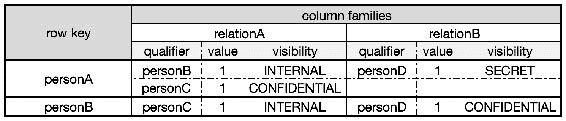

图 2：Accumulo 上的图数据模型

这种模型的主要优势在于，给定一个输入顶点（一个人的名字），可以通过简单的 GET 查询快速访问所有已知的关系。读者肯定会欣赏单元级别的安全性，我们可以隐藏一个特定的边三元组`[personA] <= [relationB] => [personD]`，对大多数没有[`SECRET`]授权的 Accumulo 用户。

这种模型的缺点是，与图数据库（如 Neo4J 或 OrientDB）相比，遍历查询（如深度优先搜索）将非常低效（我们需要多次递归查询）。我们将任何图处理逻辑委托给本章后面的 GraphX。

### Hadoop 输入和输出格式

我们使用以下 maven 依赖项来构建我们的输入/输出格式和我们的 Spark 客户端。版本显然取决于安装的 Hadoop 和 Accumulo 的发行版。

```scala
<dependency>
  <groupId>org.apache.accumulo</groupId>
  <artifactId>accumulo-core</artifactId>
  <version>1.7.0<version>
</dependency>
```

我们通过`ESInputFormat`类配置从 Elasticsearch 中读取。我们提取了一个`Text`和`MapWritable`的键值对 RDD，其中键包含文档 ID，值包含所有 JSON 文档的可序列化 HashMap 包装在内：

```scala
val spark = SparkSession
  .builder()
  .appName("communities-loader")
  .getOrCreate()

val sc = spark.sparkContext
val hdpConf = sc.hadoopConfiguration

// set the ES entry points
hdpConf.set("es.nodes", "localhost:9200")
hdpConf.set("es.resource", "gzet/articles")

// Read map writable objects
import org.apache.hadoop.io.Text
import org.apache.hadoop.io.MapWritable
import org.elasticsearch.hadoop.mr.EsInputFormat

val esRDD: RDD[MapWritable] = sc.newAPIHadoopRDD(
  hdpConf,
  classOf[EsInputFormat[Text, MapWritable]],
  classOf[Text],
  classOf[MapWritable]
).values
```

Accumulo 的`mutation`类似于 HBase 中的`put`对象，包含表的坐标，如行键，列族，列限定符，列值和可见性。该对象构建如下：

```scala
def buildMutations(value: MapWritable) = {

  // Extract list of persons
  val people = value
    .get("person")
    .asInstanceOf[ArrayWritable]
    .get()
    .map(_.asInstanceOf[Text])
    .map(_.toString)

  // Use a default Visibility
  val visibility = new ColumnVisibility("unclassified")

  // Build mutation on tuples
  buildTuples(people.toArray)
    .map {
      case (src, dst) =>
        val mutation = new Mutation(src)
        mutation.put("associated", dst, visibility, "1")
        (new Text(accumuloTable), mutation)
    }
```

我们使用上述的`buildTuples`方法来计算我们的人员对，并使用 Hadoop 的`AccumuloOutputFormat`将它们写入 Accumulo。请注意，我们可以选择为我们的输出行应用安全标签，使用`ColumnVisibility`；参考*Cell security*，我们之前看到过。

我们配置用于写入 Accumulo。我们的输出 RDD 将是一个`Text`和`Mutation`的键值对 RDD，其中键包含 Accumulo 表，值包含要插入的 mutation：

```scala
// Build Mutations
val accumuloRDD = esRDD flatMap buildMutations

// Save Mutations to Accumulo
accumuloRDD.saveAsNewAPIHadoopFile(
  "",
  classOf[Text],
  classOf[Mutation],
  classOf[AccumuloOutputFormat]
)
```

## 从 Accumulo 读取

现在我们的数据在 Accumulo 中，我们可以使用 shell 来检查它（假设我们选择了一个有足够权限查看数据的用户）。在 Accumulo shell 中使用`scan`命令，我们可以模拟特定用户和查询，从而验证`io.gzet.community.accumulo.AccumuloReader`的结果。在使用 Scala 版本时，我们必须确保使用正确的授权-它通过`String`传递到读取函数中，例如可能是`"secret,topsecret"`。

```scala
def read(
  sc: SparkContext,
  accumuloTable: String,
  authorization: Option[String] = None
)
```

这种应用 Hadoop 输入/输出格式的方法利用了 Java Accumulo 库中的`static`方法（`AbstractInputFormat`是`InputFormatBase`的子类，`InputFormatBase`是`AccumuloInputFormat`的子类）。Spark 用户必须特别注意这些实用方法，通过`Job`对象的实例来修改 Hadoop 配置。可以设置如下：

```scala
val hdpConf = sc.hadoopConfiguration
val job = Job.getInstance(hdpConf)

val clientConfig = new ClientConfiguration()
  .withInstance(accumuloInstance)
  .withZkHosts(zookeeperHosts)

AbstractInputFormat.setConnectorInfo(
  job,
  accumuloUser,
  new PasswordToken(accumuloPassword)
)

AbstractInputFormat.setZooKeeperInstance(
  job,
  clientConfig
)

if(authorization.isDefined) {
  AbstractInputFormat.setScanAuthorizations(
    job,
    new Authorizations(authorization.get)
  )
}

InputFormatBase.addIterator(job, is)
InputFormatBase.setInputTableName(job, accumuloTable)
```

您还会注意到配置了 Accumulo 迭代器：

```scala
val is = new IteratorSetting(
  1,
  "summingCombiner",
  "org.apache.accumulo.core.iterators.user.SummingCombiner"
)

is.addOption("all", "")
is.addOption("columns", "associated")
is.addOption("lossy", "TRUE")
is.addOption("type", "STRING")
```

我们可以使用客户端或服务器端迭代器，之前我们已经在通过 shell 配置 Accumulo 时看到了一个服务器端的例子。关键区别在于客户端迭代器在客户端 JVM 中执行，而不是服务器端迭代器利用 Accumulo 表服务器的功能。在 Accumulo 文档中可以找到完整的解释。然而，选择客户端或服务器端迭代器的许多原因，包括是否应该牺牲表服务器性能，JVM 内存使用等。这些决定应该在创建 Accumulo 架构时进行。在我们的`AccumuloReader`代码的末尾，我们可以看到产生`EdgeWritable`的 RDD 的调用函数：

```scala
val edgeWritableRdd: RDD[EdgeWritable] = sc.newAPIHadoopRDD(
  job.getConfiguration,
  classOf[AccumuloGraphxInputFormat],
  classOf[NullWritable],
  classOf[EdgeWritable]
) values
```

## AccumuloGraphxInputFormat 和 EdgeWritable

我们实现了自己的 Accumulo `InputFormat`，使我们能够读取 Accumulo 行并自动输出我们自己的 Hadoop `Writable`；`EdgeWritable`。这提供了一个方便的包装器，用于保存我们的源顶点，目标顶点和作为边权重的计数，这在构建图时可以使用。这非常有用，因为 Accumulo 使用前面讨论的迭代器来计算每个唯一行的总计数，从而无需手动执行此操作。由于 Accumulo 是用 Java 编写的，我们的`InputFormat`使用 Java 来扩展`InputFormatBase`，从而继承了所有 Accumulo`InputFormat`的默认行为，但输出我们选择的模式。

我们只对输出`EdgeWritables`感兴趣；因此，我们将所有键设置为 null（`NullWritable`），值设置为`EdgeWritable`，另一个优势是 Hadoop 中的值只需要继承自`Writable`接口（尽管我们为了完整性继承了`WritableComparable`，因此如果需要，`EdgeWritable`也可以用作键）。

## 构建图

因为 GraphX 使用长对象作为存储顶点和边的基础类型，所以我们首先需要将从 Accumulo 获取的所有人员翻译成一组唯一的 ID。我们假设我们的唯一人员列表不适合存储在内存中，或者无论如何都不高效，所以我们简单地使用`zipWithIndex`函数构建一个分布式字典，如下面的代码所示：

```scala
val dictionary = edgeWritableRdd
  .flatMap {
    edge =>
      List(edge.getSourceVertex, edge.getDestVertex)
  }
  .distinct()
  .zipWithIndex()
  .mapValues {
    index =>
      index + 1L
  }
}

dictionary.cache()
dictionary.count()

dictionary
  .take(3)
  .foreach(println)

/*
(david bowie, 1L)
(yoko ono, 2L)
(john lennon, 3L)
*/
```

我们使用两次连续的连接操作来创建边 RDD，最终构建包含人员名称的顶点和包含每个元组频率计数的边属性的加权有向图。

```scala
val vertices = dictionary.map(_.swap)

val edges = edgeWritableRdd
  .map {
    edge =>
      (edge.getSourceVertex, edge)
  }
  .join(dictionary)
  .map {
    case (from, (edge, fromId)) =>
      (edge.getDestVertex, (fromId, edge))
  }
  .join(dictionary)
  .map {
    case (to, ((fromId, edge), toId)) =>
      Edge(fromId, toId, edge.getCount.toLong)
  }

val personGraph = Graph.apply(vertices, edges)

personGraph.cache()
personGraph.vertices.count()

personGraph
  .triplets
  .take(2)
  .foreach(println)

/*
((david bowie,1),(yoko ono,2),1)
((david bowie,1),(john lennon,3),1)
((yoko ono,2),(john lennon,3),1)
*/
```

# 社区检测算法

在过去几十年里，社区检测已经成为研究的热门领域。遗憾的是，它没有像真正的数据科学家所处的数字世界一样快速发展，每秒都在收集更多的数据。因此，大多数提出的解决方案对于大数据环境来说根本不合适。

尽管许多算法提出了一种新的可扩展的检测社区的方法，但实际上没有一种是在分布式算法和并行计算方面真正可扩展的。

## Louvain 算法

Louvain 算法可能是检测无向加权图中社区最流行和广泛使用的算法。

### 注意

有关 Louvain 算法的更多信息，请参阅出版物：*大型网络中社区的快速展开。文森特 D.布隆德，让-卢·吉约姆，勒诺·兰比奥特，艾蒂安·勒菲布尔。2008*

这个想法是从每个顶点作为其自己社区的中心开始。在每一步中，我们寻找社区邻居，并检查合并这两个社区是否会导致模块化值的增益。通过每个顶点，我们压缩图形，使得所有属于同一个社区的节点成为一个唯一的社区顶点，所有社区内部边成为具有聚合权重的自边。我们重复这个过程，直到无法再优化模块化。该过程如*图 3*所示：

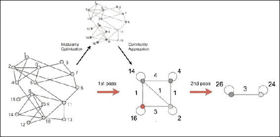

图 3：大型网络中社区的快速展开-文森特 D.布隆德尔，让-卢·吉约姆，勒诺·兰比奥特，艾蒂安·勒菲布尔，2008

因为每当顶点改变时，模块化都会更新，而且每个顶点的改变都将由全局模块化更新驱动，所以顶点需要按顺序处理；这使得模块化优化成为并行计算性质的一个分界点。最近的研究报告称，随着图的规模过度增加，结果的质量可能会下降，以至于模块化无法检测到小而明确定义的社区。

据我们所知，唯一公开可用的 Louvain 的分布式版本是由国家安全技术供应商 Sotera 创建的（[`github.com/Sotera/distributed-graph-analytics/tree/master/dga-graphx`](https://github.com/Sotera/distributed-graph-analytics/tree/master/dga-graphx)）。他们在 MapReduce、Giraph 或 GraphX 上有不同的实现，他们的想法是同时做出顶点选择，并在每次更改后更新图状态。由于并行性质，一些顶点选择可能是不正确的，因为它们可能无法最大化全局模块化，但在重复迭代后最终变得越来越一致。

这种（可能）略微不准确，但绝对高度可扩展的算法值得研究，但由于社区检测问题没有对错解决方案，而且每个数据科学用例都不同，我们决定构建我们自己的分布式版本的不同算法，而不是描述现有的算法。为了方便起见，我们重新打包了这个分布式版本的 Louvain，并在我们的 GitHub 存储库中提供了它。

## 加权社区聚类（WCC）

通过搜索一些关于图算法的文档材料，我们偶然发现了一份关于可扩展性和并行计算的出色且最新的白皮书。我们邀请我们的读者在继续实施之前先阅读这篇论文。

### 注意

有关**WCC**算法的更多信息，请参阅以下出版物：*A. Prat-Perez, D. Dominguez-Sal, and J.-L. Larriba-Pey, "High quality, scalable and parallel community detection for large real graphs," in Proceedings of the 23rd International Conference on World Wide Web, ser. WWW '14\. New York, NY, USA: ACM, 2014, pp. 225-236*

尽管找不到任何实现，并且作者对他们使用的技术保持低调，但我们对作为图分区度量的启发式方法特别感兴趣，因为检测可以并行进行，而无需重新计算图模块度等全局度量。

### 描述

同样有趣的是他们使用的假设，受到现实生活社交网络的启发，作为检测社区的质量度量。因为社区是紧密连接在一起并与图的其余部分松散连接的顶点组成的群体，所以每个社区内应该有大量的三角形。换句话说，组成社区的顶点应该在自己的社区内关闭的三角形数量要比在外部关闭的要多得多。

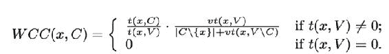

根据前述方程，给定顶点**x**在社区**C**中的聚类系数（**WCC**）将在**x**在其社区内部关闭的三角形数量多于外部时达到最大值（社区将被明确定义），和/或者当它与不关闭任何三角形的邻居数量最小时（所有节点相互连接）。如下方程所述，社区**S**的**WCC**将是其每个顶点的平均**WCC**：

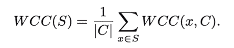

同样，图分区**P**的**WCC**将是每个社区**WCC**的加权平均值：

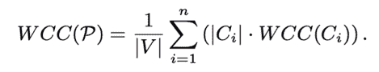

该算法包括三个不同的阶段，下面将对其进行解释。预处理步骤创建初始社区集，社区回传以确保初始社区一致，最后是一个迭代算法，优化全局聚类系数值。

### 预处理阶段

第一步是定义一个图结构，其中顶点包含我们需要在本地计算**WCC**指标的所有变量，包括顶点所属的当前社区，每个顶点在其社区内外关闭的三角形数量，它与其他节点共享三角形的数量以及当前**WCC**指标。所有这些变量将被封装到一个`VState`类中：

```scala
class VState extends Serializable {
  var vId = -1L
  var cId = -1L
  var changed = false
  var txV = 0
  var txC = 0
  var vtxV = 0
  var vtxV_C = 0
  var wcc = 0.0d
}
```

为了计算初始**WCC**，我们首先需要计算任何顶点在其邻域内关闭的三角形数量。通常计算三角形的数量包括为每个顶点聚合邻居的 ID，将此列表发送给每个邻居，并在顶点邻居和顶点邻居的邻居中搜索共同的 ID。给定两个相连的顶点 A 和 B，A 的邻居列表和 B 的邻居列表的交集是顶点 A 与 B 关闭的三角形数量，而 A 中的聚合返回顶点 A 在整个图中关闭的三角形的总数。

在具有高度连接的顶点的大型网络中，向每个邻居发送相邻顶点的列表可能会耗时且网络密集。在 GraphX 中，`triangleCount`函数已经经过优化，因此对于每条边，只有最不重要的顶点（按度数而言）将向其相邻节点发送其列表，从而最小化相关成本。此优化要求图形是规范的（源 ID 小于目标 ID）并且被分区。使用我们的人员图，可以按以下方式完成：

```scala
val cEdges: RDD[Edge[ED]] = graph.edges
  .map { e =>
    if(e.srcId > e.dstId) {
      Edge(e.dstId, e.srcId, e.attr)
    } else e
  }

val canonicalGraph = Graph
  .apply(graph.vertices, cEdges)
  .partitionBy(PartitionStrategy.EdgePartition2D)

canonicalGraph.cache()
canonicalGraph.vertices.count()
```

WCC 优化的先决条件是删除不属于任何三角形的边，因为它们不会对社区做出贡献。因此，我们需要计算三角形的数量，每个顶点的度数，邻居的 ID，最后删除邻居 ID 的交集为空的边。可以使用`subGraph`方法来过滤这些边，该方法接受边三元组的`filter`函数和顶点的`filter`函数作为输入参数：

```scala
val triGraph = graph.triangleCount()
val neighborRdd = graph.collectNeighborIds(EdgeDirection.Either)

val subGraph = triGraph.outerJoinVertices(neighborRdd)({ (vId, triangle, neighbors) =>
  (triangle, neighbors.getOrElse(Array()))
}).subgraph((t: EdgeTriplet[(Int, Array[Long]), ED]) => {
  t.srcAttr._2.intersect(t.dstAttr._2).nonEmpty
}, (vId: VertexId, vStats: (Int, Array[Long])) => {
  vStats._1 > 0
})
```

由于我们删除了没有闭合任何三角形的所有边，因此每个顶点的度数变成了给定顶点与三角形闭合的不同顶点的数量。最后，我们按照以下方式创建我们的初始`VState`图，其中每个顶点都成为其自己社区的中心节点：

```scala
val initGraph: Graph[VState, ED] = subGraph.outerJoinVertices(subGraph.degrees)((vId, vStat, degrees) => {
  val state = new VState()
  state.vId = vId
  state.cId = vId
  state.changed = true
  state.txV = vStat._1
  state.vtxV = degrees.getOrElse(0)
  state.wcc = degrees.getOrElse(0).toDouble / vStat._1 
  state
})

initGraph.cache()
initGraph.vertices.count()

canonicalGraph.unpersist(blocking = false)
```

### 初始社区

这个阶段的第二步是使用这些初始 WCC 值初始化社区。我们定义我们的初始社区集合只有在满足以下三个要求时才是一致的：

+   任何社区必须包含单个中心节点和边界节点，并且所有边界顶点必须连接到社区中心

+   任何社区中心必须具有其社区中最高的聚类系数

+   连接到两个不同中心（因此根据规则 1 属于两个不同社区）的边界顶点必须属于其中心具有最高聚类系数的社区

#### 消息传递

为了定义我们的初始社区，每个顶点都需要向其邻居发送信息，包括其 ID，其聚类系数，其度数和它当前所属的社区。为方便起见，我们将发送主要顶点属性`VState`类作为消息，因为它已经包含了所有这些信息。顶点将从其邻域接收这些消息，将选择具有最高 WCC 分数（在我们的`getBestCid`方法中），最高度数，最高 ID 的最佳消息，并相应地更新其社区。

顶点之间的这种通信是`aggregateMessages`函数的一个完美用例，它相当于 GraphX 中的映射-减少范式。这个函数需要实现两个函数，一个是从一个顶点向其相邻节点发送消息，另一个是在顶点级别聚合多个消息。这个过程被称为*消息传递*，并且描述如下：

```scala
def getBestCid(v: VState, msgs: Array[VState]): VertexId = {

  val candidates = msgs filter {

    msg =>
      msg.wcc > v.wcc ||
      (msg.wcc == v.wcc && msg.vtxV > v.vtxV) ||
      (msg.wcc == v.wcc && msg.vtxV > v.vtxV && msg.cId > v.cId)
    }

  if(candidates.isEmpty) {

    v.cId

  } else {

    candidates
     .sortBy {
       msg =>
         (msg.wcc, msg.vtxV, msg.cId)
      }
      .last
      .cId
  }

}

def sendMsg = (ctx: EdgeContext[VState, ED, Array[VState]]) => {

  ctx.sendToDst(
    Array(ctx.srcAttr)
  )

  ctx.sendToSrc(
    Array(ctx.dstAttr)
  )
}

def mergeMsg = (m1: Array[VState], m2: Array[VState]) => {
  m1 ++ m2
}

def msgs = subGraph.aggregateMessages(sendMsg, mergeMsg)

val initCIdGraph = subGraph.outerJoinVertices(msgs)((vId, vData, msgs) => {
  val newCId = getBestCid(vData, msgs.getOrElse(Array()))
  vData.cId = newCId
  vData
})

initCIdGraph.cache()
initCIdGraph.vertices.count()
initGraph.unpersist(blocking = false)
```

社区初始化过程的一个示例报告在*图 4*中。左图的节点按比例调整大小以反映其真实的 WCC 系数，已经初始化为四个不同的社区，**1**，**11**，**16**和**21**。

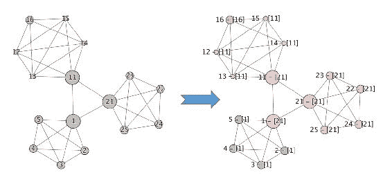

图 4：WCC 社区初始化

尽管人们肯定会欣赏到一个`aggregateMessages`函数返回了相对一致的社区，但这种初始分区违反了我们之前定义的规则中的第三条。一些顶点（如**2**，**3**，**4**和**5**）属于一个中心不是中心节点的社区（顶点**1**属于社区**21**）。对于社区**11**也存在同样的问题。

#### 社区回传

为了解决这种不一致性并满足我们的第三个要求，任何顶点*x*必须将其更新的社区广播给所有系数较低的邻居，因为根据我们的第二条规则，只有这些排名较低的顶点可能成为*x*的边界节点。任何进一步的更新都将导致向较低排名的顶点传递新消息，依此类推，直到没有顶点会改变社区，此时我们的第三条规则将得到满足。

由于迭代之间不需要图的全局知识（例如计算全局 WCC 值），使用 GraphX 的 Pregel API 可以广泛并行化社区更新。Pregel 最初由 Google 开发，允许顶点接收来自先前迭代的消息，向其邻域发送新消息，并修改自己的状态，直到不能再发送更多消息。

### 注意

有关*Pregel*算法的更多信息，请参阅以下出版物：*G. Malewicz, M. H. Austern, A. J. Bik, J. C. Dehnert, I. Horn, N. Leiser, and G. Czajkowski, "Pregel: A system for large-scale graph processing," in Proceedings of the 2010 ACM SIGMOD International Conference on Management of Data, ser. SIGMOD '10\. New York, NY, USA: ACM, 2010, pp. 135-146\. [Online]. Available: [`doi.acm.org/10.1145/1807167.1807184`](http://doi.acm.org/10.1145/1807167.1807184)*

与之前提到的`aggregateMessages`函数类似，我们将顶点属性`VState`作为消息发送到顶点之间，作为 Pregel 超步的初始消息，使用默认值初始化的新对象（WCC 为 0）。

```scala
val initialMsg = new VState() 

```

当在顶点级别接收到多个消息时，我们只保留具有最高聚类系数的消息，如果系数相同，则保留具有最高度数的消息（然后是最高 ID）。我们为此目的在`VState`上创建了一个隐式排序：

```scala
implicit val VSOrdering: Ordering[VState] = Ordering.by({ state =>
  (state.wcc, state.vtxV, state.vId)
})

def compareState(c1: VState, c2: VState) = {
  List(c1, c2).sorted(VStateOrdering.reverse)
}

val mergeMsg = (c1: VState, c2: VState) => {
  compareState(c1, c2).head
}
```

遵循递归算法的相同原则，我们需要适当地定义一个中断子句，Pregel 应在该点停止发送和处理消息。这将在发送函数中完成，该函数以边三元组作为输入并返回消息的迭代器。如果顶点的社区在上一次迭代中发生了变化，顶点将发送其`VState`属性。在这种情况下，顶点将通知其排名较低的邻居其社区更新，但也会向自己发送信号以确认此成功广播。后者是我们的中断子句，因为它确保不会从给定节点发送更多消息（除非其社区在后续步骤中得到更新）：

```scala
def sendMsg = (t: EdgeTriplet[VState, ED]) => {

  val messages = mutable.Map[Long, VState]()
  val sorted = compareState(t.srcAttr, t.dstAttr)
  val (fromNode, toNode) = (sorted.head, sorted.last)
  if (fromNode.changed) {
    messages.put(fromNode.vId, fromNode)
    messages.put(toNode.vId, fromNode)
  }

  messages.toIterator

}
```

最后要实现的函数是 Pregel 算法的核心函数。在这里，我们定义了在顶点级别应用的逻辑，给定我们从`mergeMsg`函数中选择的唯一消息。我们确定了四种不同的消息可能性，每种消息都定义了应用于顶点状态的逻辑。

1.  如果消息是从 Pregel 发送的初始消息（顶点 ID 未设置，WCC 为空），我们不会更新顶点社区 ID。

1.  如果消息来自顶点本身，这是来自`sendMsg`函数的确认，我们将顶点状态设置为静默。

1.  如果消息（带有更高的 WCC）来自社区的中心节点，我们将更新顶点属性为这个新社区的边界节点。

1.  如果消息（带有更高的 WCC）来自社区的边界节点，这个顶点将成为自己社区的中心，并将进一步将此更新广播给其排名较低的网络。

```scala
def vprog = (vId: VertexId, state: VState, message: VState) => {

  if (message.vId >= 0L) {

    // message comes from myself
    // I stop spamming people
    if (message.vId == vId) {
      state.changed = false
    }

    // Sender is a center of its own community
    // I become a border node of its community
    if (message.cId == message.vId) {
      state.changed = false
      state.cId = message.cId
    }

    // Sender is a border node of a foreign community
    // I become a center of my own community
    // I broadcast this change downstream
    if (message.cId != message.vId) {
      state.changed = true
      state.cId = vId
    }

  }
  state

}
```

最后，我们使用`Pregel`对象的`apply`函数将这三个函数链接在一起。我们将迭代的最大次数设置为无穷大，因为我们依赖于我们使用确认类型消息定义的中断子句：

```scala
val pregelGraph: Graph[VState, ED] = Pregel.apply(
  initCIdGraph, 
  initialMsg, 
  Int.MaxValue 
)(
  vprog,
  sendMsg,
  mergeMsg
)

pregelGraph.cache()
pregelGraph.vertices.count()
```

虽然 Pregel 的概念很迷人，但它的实现确实不是。作为对这一巨大努力的回报，我们在*图 5*中展示了结果图。顶点**1**和**11**仍然属于社区**21**，这仍然有效，但社区**1**和**11**现在分别被替换为社区**15**和**5**，顶点具有最高的聚类系数、度或 ID 在其社区中，因此验证了第三个要求：

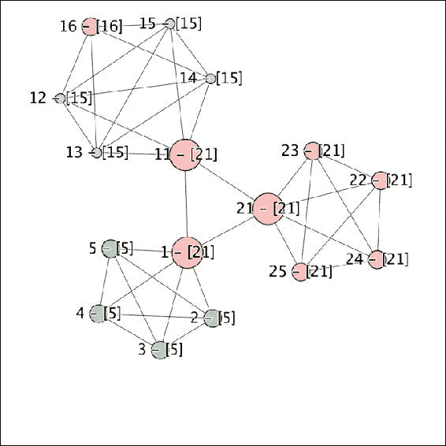

图 5：社区反向传播更新

我们使用 Pregel API 根据之前介绍的规则创建了我们的初始社区集，但我们还没有完成。前面的图表明了一些改进，这些将在下一小节中讨论。然而，在继续之前，可以注意到这里没有使用特定的分区。如果我们要在社区节点之间发送多条消息，并且这些顶点位于不同的分区（因此位于不同的执行器），我们肯定不能优化与消息传递相关的网络流量。GraphX 中存在不同类型的分区，但没有一种允许我们使用顶点属性（如社区 ID）作为分区的度量。

在下面的简单函数中，我们提取所有的图三元组，根据社区元组构建一个哈希码，并使用标准的键值`HashPartitioner`类重新分区这个边 RDD。最后，我们根据这个重新分区的集合构建一个新的图，以确保从社区 C1 连接到社区 C2 的所有顶点都属于同一个分区：

```scala
def repartitionED: ClassTag = {

  val partitionedEdges = graph
    .triplets
    .map {
      e =>
        val cId1 = e.srcAttr.cId
        val cId2 = e.dstAttr.cId
        val hash = math.abs((cId1, cId2).hashCode())
        val partition = hash % partitions
        (partition, e)
    }
    .partitionBy(new HashPartitioner(partitions))
    .map {
      pair =>
        Edge(pair._2.srcId, pair._2.dstId, pair._2.attr)
    }

  Graph(graph.vertices, partitionedEdges)

}
```

### WCC 迭代

这个阶段的目的是让所有顶点在以下三个选项之间进行迭代选择，直到 WCC 值不能再被优化为止，此时我们的社区检测算法将收敛到其最佳图结构：

+   **留下**：留在它的社区里

+   **转移**：从它的社区移动并成为它的邻居的一部分

+   **移除**：离开它的社区，成为自己社区的一部分

对于每个顶点，最佳移动是最大化总 WCC 值的移动。与 Louvain 方法类似，每个移动都取决于要计算的全局分数，但我们转向这个算法的原因是，这个分数可以使用 Arnau Prat-Pérez 等人在*用于大型实际图的高质量、可扩展和并行社区检测*中定义的启发式方法来近似。因为这个启发式方法不需要计算所有内部三角形，顶点可以同时移动，因此这个过程可以设计成完全分散和高度可扩展的。

#### 收集社区统计信息

为了计算这个启发式方法，我们首先需要在社区级别聚合基本统计数据，比如元素数量和入站和出站链接数量，这两者都可以用简单的词频函数来表示。我们将它们组合在内存中，因为社区的数量将远远小于顶点的数量：

```scala
case class CommunityStats(
   r: Int,
   d: Double,
   b: Int
)

def getCommunityStatsED: ClassTag = {

  val cVert = graph
    .vertices
    .map(_._2.cId -> 1)
    .reduceByKey(_+_)
    .collectAsMap()

  val cEdges = graph
    .triplets
    .flatMap { t =>
      if(t.srcAttr.cId == t.dstAttr.cId){
        Iterator((("I", t.srcAttr.cId), 1))
      } else {
        Iterator(
          (("O", t.srcAttr.cId), 1), 
          (("O", t.dstAttr.cId), 1)
        )
      }
    }
    .reduceByKey(_+_)
    .collectAsMap()

  cVert.map {
    case (cId, cCount) =>
      val intEdges = cEdges.getOrElse(("I", cId), 0)
      val extEdges = cEdges.getOrElse(("O", cId), 0)
      val density = 2 * intEdges / math.pow(cCount, 2)
      (cId, CommunityStats(cCount, density, extEdges))
  } 

}
```

最后，我们收集顶点数量和社区统计信息（包括社区边缘密度），并将结果广播到我们所有的 Spark 执行器：

```scala
var communityStats = getCommunityStats(pregelGraph)
val bCommunityStats = sc.broadcast(communityStats)
```

### 提示

在这里理解`broadcast`方法的使用是很重要的。如果社区统计信息在 Spark 转换中使用，这个对象将被发送到执行器，以便后者处理每条记录。我们计算它们一次，将结果广播到执行器的缓存中，以便任何闭包可以在本地使用它们，从而节省大量不必要的网络传输。

#### WCC 计算

根据之前定义的一系列方程，每个顶点必须访问其所属的社区统计数据以及它与社区内任何顶点之间的三角形数量。为此，我们通过简单的消息传递来收集邻居，但只限于同一社区内的顶点，从而限制网络流量：

```scala
def collectCommunityEdgesED: ClassTag = {

  graph.outerJoinVertices(graph.aggregateMessages((e: EdgeContext[VState, ED, Array[VertexId]]) => {
    if(e.dstAttr.cId == e.srcAttr.cId){
      e.sendToDst(Array(e.srcId))
      e.sendToSrc(Array(e.dstId))
    }
  }, (e1: Array[VertexId], e2: Array[VertexId]) => {
    e1 ++ e2
  }))((vid, vState, vNeighbours) => {
    (vState, vNeighbours.getOrElse(Array()))
  })

}
```

同样，我们使用以下函数来计算共享三角形的数量。请注意，我们使用与默认的`triangleCount`方法相同的优化，只使用最小集合向最大集合发送消息。

```scala
def collectCommunityTrianglesED: ClassTag, ED]) = {

  graph.aggregateMessages((ctx: EdgeContext[(VState, Array[Long]), ED, Int]) => {
    if(ctx.srcAttr._1.cId == ctx.dstAttr._1.cId){
      val (smallSet, largeSet) = if (ctx.srcAttr._2.length < ctx.dstAttr._2.length) {
        (ctx.srcAttr._2.toSet, ctx.dstAttr._2.toSet)
      } else {
        (ctx.dstAttr._2.toSet, ctx.srcAttr._2.toSet)
      }
      val it = smallSet.iterator
      var counter: Int = 0
      while (it.hasNext) {
        val vid = it.next()
        if (
          vid != ctx.srcId &&
          vid != ctx.dstId &&
          largeSet.contains(vid)
        ) {
          counter += 1
        }
      }

      ctx.sendToSrc(counter)
      ctx.sendToDst(counter)

    }
  }, (e1: Int, e2: Int) => (e1 + e2))

}
```

我们计算并更新每个顶点的新 WCC 分数，作为社区邻域大小和社区三角形数量的函数。这个方程就是之前介绍 WCC 算法时描述的方程。我们计算一个分数，作为社区 C 内外闭合的三角形的比率，给定一个顶点*x*：

```scala
def updateGraphED: ClassTag = {

  val cNeighbours = collectCommunityEdges(graph)
  val cTriangles = collectCommunityTriangles(cNeighbours)

  cNeighbours.outerJoinVertices(cTriangles)(
    (vId, vData, tri) => {
      val s = vData._1
      val r = stats.value.get(s.cId).get.r

      // Core equation: compute WCC(v,C)
      val a = s.txC * s.vtxV
      val b = (s.txV * (r - 1 + s.vtxV_C).toDouble) 
      val wcc = a / b

      val vtxC = vData._2.length
      s.vtxV_C = s.vtxV – vtxC

      // Triangles are counted twice (incoming / outgoing)
      s.txC = tri.getOrElse(0) / 2
      s.wcc = wcc
      s
  })

}

val wccGraph = updateGraph(pregelGraph, bCommunityStats)
```

全球 WCC 值是每个顶点 WCC 的简单聚合，经过每个社区中元素数量的归一化。这个值也必须广播到 Spark 执行器中，因为它将在 Spark 转换中使用：

```scala
def computeWCCED: ClassTag: Double = {

  val total = graph.vertices
    .map {
      case (vId, vState) =>
        (vState.cId, vState.wcc)
    }
    .reduceByKey(_+_)
    .map {
      case (cId, wcc) =>
        cStats.value.get(cId).get.r * wcc
    }
    .sum

  total / graph.vertices.count

}

val wcc = computeWCC(wccGraph, bCommunityStats)
val bWcc = sc.broadCast(wcc)
```

#### WCC 迭代

考虑到将顶点*x*插入到社区**C**的成本，从/向社区**C**移除/转移*x**的成本可以表示为前者的函数，并且可以从三个参数**Θ[1]**、**Θ[2]**和**Θ[3]**中导出。这个启发式规定，对于每个顶点*x*，需要对其周围的每个社区**C**进行一次计算，并且可以并行进行，假设我们首先收集了所有社区统计数据：

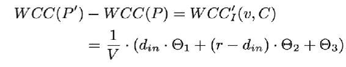

**Θ[1]**、**Θ[2]**和**Θ[3]**的计算将不在此处报告（可在我们的 GitHub 上找到），但取决于社区密度、外部边缘和元素数量，所有这些都包含在我们之前定义的广播的`CommunityStats`对象集合中。最后值得一提的是，这个计算具有线性时间复杂度。

在每次迭代中，我们将收集任何顶点周围的不同社区，并使用我们在第六章中介绍的 Scalaz 的`mappend`聚合来聚合边的数量，*抓取基于链接的外部数据*。这有助于我们限制编写的代码量，并避免使用可变对象。

```scala
val cDegrees = itGraph.aggregateMessages((ctx: EdgeContext[VState, ED, Map[VertexId, Int]]) => {

  ctx.sendToDst(
    Map(ctx.srcAttr.cId -> 1)
  )

  ctx.sendToSrc(
    Map(ctx.dstAttr.cId -> 1)
  )

}, (e1: Map[VertexId, Int], e2: Map[VertexId, Int]) => {
  e1 |+| e2
})
```

利用社区统计数据、上一次迭代的 WCC 值、顶点数量和上述边的数量，我们现在可以估算将每个顶点*x*插入到周围社区**C**中的成本。我们找到每个顶点的最佳移动以及其周围社区的最佳移动，最终应用最大化 WCC 值的最佳移动。

最后，我们回调之前定义的一系列方法和函数，以更新每个顶点、每个社区的新 WCC 值，然后更新图分区本身，以查看所有这些变化是否导致了 WCC 的改善。如果 WCC 值无法再进行优化，算法就已经收敛到了最佳结构，最终我们返回一个包含顶点 ID 和该顶点所属的最终社区 ID 的顶点 RDD。

我们的测试社区图已经经过优化（虽然不是没有付出努力），并如*图 6*所示报告：

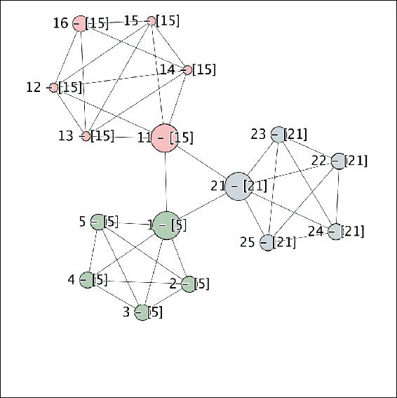

图 6：WCC 优化的社区

我们观察到之前预期的所有变化。顶点**1**和**11**现在分别属于它们预期的社区，分别是**5**和**11**。我们还注意到顶点 16 现在已经包括在其社区 11 中。

# GDELT 数据集

为了验证我们的实现，我们使用了我们在上一章中分析过的 GDELT 数据集。我们提取了所有的社区，并花了一些时间查看人名，以确定我们的社区聚类是否一致。社区的完整图片报告在*图 7*中，并且是使用 Gephi 软件实现的，只导入了前几千个连接。

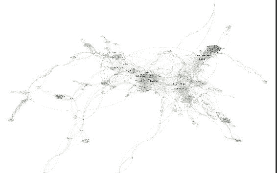

图 7：2021 年 1 月 12 日的社区检测

我们首先观察到，我们检测到的大多数社区与我们在力导向布局中可以直观看到的社区完全一致，这给算法准确性带来了很高的信心水平。

## 鲍伊效应

任何明确定义的社区都已经被正确识别，而不太明显的社区是围绕着像大卫·鲍伊这样的高度连接的顶点而形成的。大卫·鲍伊这个名字在 GDELT 文章中被频繁提及，与许多不同的人一起，以至于在 2016 年 1 月 12 日，它变得太大，无法成为其逻辑社区（音乐行业）的一部分，并形成了一个更广泛的社区，影响了其周围的所有顶点。这里绝对存在一个有趣的模式，因为这种社区结构为我们提供了关于特定人物在特定日期可能成为突发新闻文章的明确见解。

观察大卫·鲍伊在*图 8*中最接近的社区，我们观察到节点之间高度相互连接，这是因为我们将其称为*鲍伊效应*。事实上，来自许多不同社区的许多致敬使得跨不同社区形成的三角形数量异常高。结果是，它将不同的逻辑社区彼此靠近，这些社区在理论上本不应该靠近，比如*70 年代*的摇滚明星偶像与宗教人士之间的接近。

小世界现象是由斯坦利·米尔格拉姆在 60 年代定义的，它指出每个人都通过少数熟人相连。美国演员凯文·贝肯甚至建议他与其他任何演员之间最多只能通过 6 个连接相连，也被称为*贝肯数*（[`oracleofbacon.org/`](https://oracleofbacon.org/)）。

在那一天，教皇弗朗西斯和米克·贾格尔的*凯文·贝肯数*仅为 1，这要归功于主教吉安弗兰科·拉瓦西在推特上提到了大卫·鲍伊。


图 8：围绕大卫·鲍伊的社区，1 月 12 日

尽管鲍伊效应，由于其作为突发新闻文章的性质，在特定的图结构上是一个真正的模式，但它的影响可以通过基于名称频率计数的加权边来最小化。事实上，来自 GDELT 数据集的一些随机噪音可能足以关闭来自两个不同社区的关键三角形，从而将它们彼此靠近，无论这个关键边的权重如何。这种限制对于所有非加权算法都是普遍存在的，并且需要一个预处理阶段来减少这种不需要的噪音。

## 较小的社区

然而，我们可以观察到一些更明确定义的社区，比如英国政治家托尼·布莱尔、大卫·卡梅伦和鲍里斯·约翰逊，或者电影导演克里斯托弗·诺兰、马丁·斯科塞斯和昆汀·塔伦蒂诺。从更广泛的角度来看，我们可以检测到明确定义的社区，比如网球运动员、足球运动员、艺术家或特定国家的政治家。作为准确性的不容置疑的证据，我们甚至检测到马特·勒布朗、考特尼·考克斯、马修·佩里和詹妮弗·安妮斯顿作为同一个《老友记》社区的一部分，卢克·天行者、阿纳金·天行者、乔巴卡和帕尔帕廷皇帝作为《星球大战》社区的一部分，以及最近失去的女演员凯丽·费雪。职业拳击手社区的一个例子如*图 9*所示：

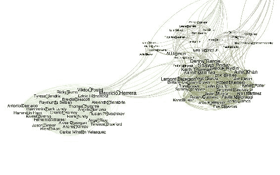

图 9：职业拳击手社区

## 使用 Accumulo 单元格级安全

我们之前已经讨论了 Accumulo 中单元级安全的性质。在这里我们生成的图的背景下，安全性的有用性可以很好地模拟。如果我们配置 Accumulo，使得包含大卫·鲍伊的行与所有其他行标记不同的安全标签，那么我们可以打开和关闭鲍伊的效应。任何具有完全访问权限的 Accumulo 用户将看到之前提供的完整图。然后，如果我们将该用户限制在除了大卫·鲍伊之外的所有内容（在`AccumuloReader`中对授权进行简单更改），那么我们将看到以下图。这个新图非常有趣，因为它具有多种用途：

+   它消除了大卫·鲍伊死亡的社交媒体效应所产生的噪音，从而揭示了真正涉及的社区

+   它消除了实体之间的许多虚假链接，从而增加了它们的 Bacon 数，并显示了它们真正的关系

+   它证明了可以移除图中的一个关键人物，仍然保留大量有用信息，从而证明了之前关于出于安全原因移除关键实体的观点（如*单元安全*中讨论的）。

当然，还必须说，通过移除一个实体，我们也可能移除实体之间的关键关系；也就是说，联系链效应，这在特定试图关联个体实体时是一个负面因素，然而，社区仍然保持完整。

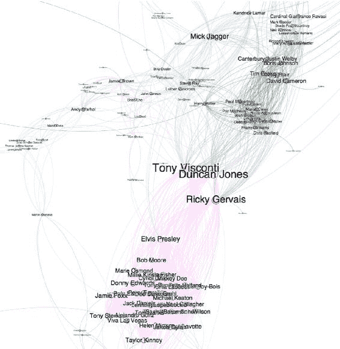

图 10：大卫·鲍伊的受限访问社区

# 总结

我们已经讨论并构建了一个利用安全和稳健架构的图社区的实际实现。我们已经概述了在社区检测问题空间中没有正确或错误的解决方案，因为它严重依赖于使用情况。例如，在社交网络环境中，其中顶点紧密连接在一起（一条边表示两个用户之间的真实连接），边的权重并不重要，而三角形方法可能更重要。在电信行业中，人们可能对基于给定用户 A 对用户 B 的频率呼叫的社区感兴趣，因此转向加权算法，如 Louvain。

我们感谢构建这个社区算法远非易事，也许超出了本书的目标，但它涉及了 Spark 中图处理的所有技术，使 GraphX 成为一个迷人且可扩展的工具。我们介绍了消息传递、Pregel、图分区和变量广播的概念，支持了 Elasticsearch 和 Accumulo 中的实际实现。

在下一章中，我们将应用我们在这里学到的图论概念到音乐行业，学习如何使用音频信号、傅立叶变换和*PageRank*算法构建音乐推荐引擎。
