# 第八章：构建推荐系统

如果要选择一个算法来向公众展示数据科学，推荐系统肯定会成为其中的一部分。今天，推荐系统无处不在。它们之所以如此受欢迎，原因在于它们的多功能性、实用性和广泛适用性。无论是根据用户的购物行为推荐产品，还是根据观看偏好建议新电影，推荐系统现在已经成为生活的一部分。甚至可能是这本书是基于你的社交网络偏好、工作状态或浏览历史等营销公司所知道的信息神奇地推荐给你的。

在本章中，我们将演示如何使用原始音频信号推荐音乐内容。为此，我们将涵盖以下主题：

+   使用 Spark 处理存储在 HDFS 上的音频文件

+   学习关于*傅立叶变换*用于音频信号转换

+   使用 Cassandra 作为在线和离线层之间的缓存层

+   使用*PageRank*作为无监督的推荐算法

+   将 Spark 作业服务器与 Play 框架集成，构建端到端原型

# 不同的方法

推荐系统的最终目标是根据用户的历史使用和偏好建议新的物品。基本思想是对客户过去感兴趣的任何产品使用排名。这种排名可以是显式的（要求用户对电影进行 1 到 5 的排名）或隐式的（用户访问此页面的次数）。无论是购买产品、听歌曲还是阅读文章，数据科学家通常从两个不同的角度解决这个问题：*协同过滤*和*基于内容的过滤*。

## 协同过滤

使用这种方法，我们通过收集有关人们行为的更多信息来利用大数据。尽管个体在定义上是独特的，但他们的购物行为通常不是，总是可以找到一些与其他人的相似之处。推荐的物品将针对特定个人，但它们将通过将用户的行为与类似用户的行为相结合来推导。这是大多数零售网站的著名引用：

> *“购买这个的人也购买了那个……”*

当然，这需要关于客户、他们的过去购买以及其他客户的足够信息进行比较。因此，一个主要的限制因素是物品必须至少被查看一次才能被列为潜在的推荐物品。事实上，直到物品被查看/购买至少一次，我们才能推荐该物品。

### 注意

协同过滤的鸢尾花数据集通常使用 LastFM 数据集的样本进行：[`labrosa.ee.columbia.edu/millionsong/lastfm`](http://labrosa.ee.columbia.edu/millionsong/lastfm)。

## 基于内容的过滤

与使用其他用户相似性不同的替代方法涉及查看产品本身以及客户过去感兴趣的产品类型。如果你对*古典音乐*和*速度金属*都感兴趣，那么可以安全地假设你可能会购买（至少考虑）任何将古典节奏与重金属吉他独奏混合的新专辑。这样的推荐在协同过滤方法中很难找到，因为你周围没有人分享你的音乐口味。

这种方法的主要优势是，假设我们对要推荐的内容有足够的了解（比如类别、标签等），即使没有人看过它，我们也可以推荐一个新的物品。缺点是，模型可能更难建立，并且选择正确的特征而不丢失信息可能具有挑战性。

## 自定义方法

由于本书的重点是*数据科学中的 Spark*，我们希望为读者提供一种新颖的创新方式来解决推荐问题，而不仅仅是解释任何人都可以使用现成的 Spark API 构建的标准协同过滤算法，并遵循基本教程[`spark.apache.org/docs/latest/mllib-collaborative-filtering.html`](http://spark.apache.org/docs/latest/mllib-collaborative-filtering.html)。让我们从一个假设开始：

*如果我们要向最终用户推荐歌曲，我们是否可以构建一个系统，不是基于人们喜欢或不喜欢的歌曲，也不是基于歌曲属性（流派、艺术家），而是基于歌曲的真实声音和你对它的感觉呢？*

为了演示如何构建这样一个系统（因为您可能没有访问包含音乐内容和排名的公共数据集，至少是合法的），我们将解释如何使用您自己的个人音乐库在本地构建它。随时加入！

# 未知数据

以下技术可以被视为现代大多数数据科学家工作方式的一种改变。虽然处理结构化和非结构化文本很常见，但处理原始二进制数据却不太常见，原因在于计算机科学和数据科学之间的差距。文本处理局限于大多数人熟悉的一套标准操作，即获取、解析和存储等。我们将直接处理音频，将未知信号数据转换和丰富为知情的转录。通过这样做，我们实现了一种类似于教计算机从音频文件中“听到”声音的新型数据管道。

我们在这里鼓励的第二个（突破性）想法是，改变数据科学家如今与 Hadoop 和大数据打交道的方式。虽然许多人仍然认为这些技术只是*又一个数据库*，但我们想展示使用这些工具可以获得的广泛可能性。毕竟，没有人会嘲笑能够训练机器与客户交谈或理解呼叫中心录音的数据科学家。

## 处理字节

首先要考虑的是音频文件格式。`.wav`文件可以使用`AudioSystem`库（来自`javax.sound`）进行处理，而`.mp3`则需要使用外部编解码库进行预处理。如果我们从`InputStream`中读取文件，我们可以创建一个包含音频信号的输出字节数组，如下所示：

```scala
def readFile(song: String) = {
  val is = new FileInputStream(song)
   processSong(is)
}
def processSong(stream: InputStream): Array[Byte] = {

   val bufferedIn = new BufferedInputStream(stream)
   val out = new ByteArrayOutputStream
   val audioInputStream = AudioSystem.getAudioInputStream(bufferedIn)

   val format = audioInputStream.getFormat
   val sizeTmp = Math.rint((format.getFrameRate *
                  format.getFrameSize) /
                  format.getFrameRate)
                .toInt

  val size = (sizeTmp + format.getFrameSize) -
             (sizeTmp % format.getFrameSize)

   val buffer = new ArrayByte

   var available = true
   var totalRead = 0
   while (available) {
     val c = audioInputStream.read(buffer, 0, size)
     totalRead += c
     if (c > -1) {
       out.write(buffer, 0, c)
     } else {
       available = false
     }
   }

   audioInputStream.close()
   out.close()
   out.toByteArray
 }
```

歌曲通常使用 44KHz 的采样率进行编码，根据**奈奎斯特**定理，这是人耳可以感知的最高频率的两倍（覆盖范围从 20Hz 到 20KHz）。

### 注意

有关奈奎斯特定理的更多信息，请访问：[`redwood.berkeley.edu/bruno/npb261/aliasing.pdf`](http://redwood.berkeley.edu/bruno/npb261/aliasing.pdf)。

为了表示人类可以听到的声音，我们需要每秒大约 44,000 个样本，因此立体声（两个声道）每秒需要 176,400 字节。后者是以下字节频率：

```scala
val format = audioInputStream.getFormat

val sampleRate = format.getSampleRate

val sizeTmp = Math.rint((format.getFrameRate *
                format.getFrameSize) /
                format.getFrameRate)
              .toInt

 val size = (sizeTmp + format.getFrameSize) -
           (sizeTmp % format.getFrameSize)

 val byteFreq = format.getFrameSize * format.getFrameRate.toInt
```

最后，我们通过处理输出的字节数组并绘制样本数据的前几个字节（在本例中，*图 1*显示了马里奥兄弟主题曲）来访问音频信号。请注意，可以使用字节索引和字节频率值检索时间戳，如下所示：

```scala
val data: Array[Byte] = processSong(inputStream)

val timeDomain: Array[(Double, Int)] = data
  .zipWithIndex
  .map { case (b, idx) =>
      (minTime + idx * 1000L / byteFreq.toDouble, b.toInt)
   }
```

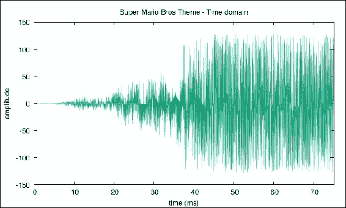

图 1：马里奥兄弟主题曲 - 时域

为了方便起见，我们将所有这些音频特征封装到一个`Audio`案例类中（如下面的代码段所示），随着我们在本章中的进展，我们将添加额外的实用方法：

```scala
case class Audio(data: Array[Byte],
                byteFreq: Int,
                sampleRate: Float,
                minTime: Long,
                id: Int= 0) {

  def duration: Double =
    (data.length + 1) * 1000L / byteFreq.toDouble

  def timeDomain: Array[(Double, Int)] = data
   .zipWithIndex
   .map { case (b, idx) =>
        (minTime + idx * 1000L / byteFreq.toDouble, b.toInt)
    }

  def findPeak: Float = {
    val freqDomain = frequencyDomain()
    freqDomain
     .sortBy(_._2)
     .reverse
     .map(_._1)
     .head
  }

 // Next to come

 }
```

## 创建可扩展的代码

现在我们已经创建了从`.wav`文件中提取音频信号的函数（通过`FileInputStream`），自然的下一步是使用它来处理存储在 HDFS 上的其余记录。正如在前几章中已经强调的那样，一旦逻辑在单个记录上运行，这并不是一个困难的任务。事实上，Spark 自带了一个处理二进制数据的实用程序，因此我们只需插入以下函数：

```scala
def read(library: String, sc: SparkContext) = {
   sc.binaryFiles(library)
     .filter { case (filename, stream) =>
       filename.endsWith(".wav")
     }
     .map { case (filename, stream) =>
       val audio =  processSong(stream.open())
       (filename, audio)
     }
}

val audioRDD: RDD[(String, Audio)] = read(library, sc)
```

我们确保只将`.wav`文件发送到我们的处理器，并获得一个由文件名（歌曲名）和其对应的`Audio` case 类（包括提取的音频信号）组成的新 RDD。

### 提示

Spark 的`binaryFiles`方法读取整个文件（不进行分割）并输出一个包含文件路径和其对应输入流的 RDD。因此，建议处理相对较小的文件（可能只有几兆字节），因为这显然会影响内存消耗和性能。

## 从时间到频率域

访问音频时域是一个很大的成就，但遗憾的是它本身并没有太多价值。然而，我们可以使用它来更好地理解信号的真实含义，即提取它包含的隐藏频率。当然，我们可以使用*傅里叶变换*将时域信号转换为频域。

### 注意

您可以在[`www.phys.hawaii.edu/~jgl/p274/fourier_intro_Shatkay.pdf`](http://www.phys.hawaii.edu/~jgl/p274/fourier_intro_Shatkay.pdf)了解更多关于*傅里叶变换*的知识。

总之，不需要过多细节或复杂的方程，约瑟夫·傅里叶在他的传奇和同名公式中所做的基本假设是，所有信号都由不同频率和相位的正弦波的无限累积组成。

### 快速傅里叶变换

**离散傅里叶变换**（**DFT**）是不同正弦波的总和，并可以使用以下方程表示：

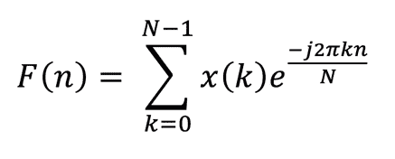

尽管使用蛮力方法实现这个算法是微不足道的，但它的效率非常低*O(n²)*，因为对于每个数据点*n*，我们必须计算*n*个指数的和。因此，一首三分钟的歌曲将产生*(3 x 60 x 176,400)²≈ 10¹⁵*数量的操作。相反，Cooley 和 Tukey 采用了一种将 DFT 的时间复杂度降低到*O(n.log(n))*的分治方法，贡献了**快速傅里叶变换**（**FFT**）。

### 注意

描述 Cooley 和 Tukey 算法的官方论文可以在网上找到：[`www.ams.org/journals/mcom/1965-19-090/S0025-5718-1965-0178586-1/S0025-5718-1965-0178586-1.pdf`](http://www.ams.org/journals/mcom/1965-19-090/S0025-5718-1965-0178586-1/S0025-5718-1965-0178586-1.pdf)

幸运的是，现有的 FFT 实现是可用的，因此我们将使用`org.apache.commons.math3`提供的基于 Java 的库来计算 FFT。使用这个库时，我们只需要确保我们的输入数据用零填充，使得总长度是 2 的幂，并且可以分成奇偶序列：

```scala
def fft(): Array[Complex] = {

  val array = Audio.paddingToPowerOf2(data)
  val transformer = new FastFourierTransformer(
                         DftNormalization.STANDARD)

  transformer.transform(array.map(_.toDouble),
      TransformType.FORWARD)

}
```

这将返回一个由实部和虚部组成的`Complex`数字数组，并可以轻松转换为频率和幅度（或幅度）如下。根据奈奎斯特定理，我们只需要一半的频率：

```scala
def frequencyDomain(): Array[(Float, Double)] = {

   val t = fft()
   t.take(t.length / 2) // Nyquist
   .zipWithIndex
   .map { case (c, idx) =>
      val freq = (idx + 1) * sampleRate / t.length
      val amplitude =  sqrt(pow(c.getReal, 2) +
                         pow(c.getImaginary, 2))
      val db = 20 * log10(amplitude)
      (freq, db)
    }

 }
```

最后，我们将这些函数包含在`Audio` case 类中，并绘制马里奥兄弟主题曲前几秒的频域：

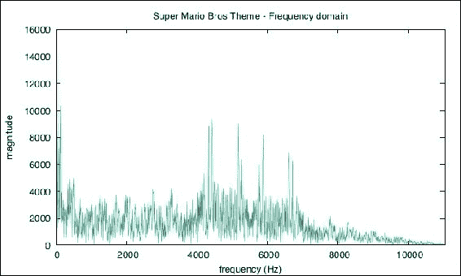

图 2：马里奥兄弟主题曲-频域

在图 2 中，可以看到在中高频范围（4KHz 至 7KHz 之间）有显著的峰值，我们将使用这些作为歌曲的指纹。

### 按时间窗口采样

尽管更有效，但 FFT 仍然是一个昂贵的操作，因为它的高内存消耗（记住，一首典型的三分钟歌曲将有大约*3 x 60 x 176,400*个点要处理）。当应用于大量数据点时，这变得特别棘手，因此必须考虑大规模处理。

我们不是查看整个频谱，而是使用时间窗口对我们的歌曲进行采样。事实上，完整的 FFT 无论如何都没有用，因为我们想知道每个主要频率被听到的时间。因此，我们将`Audio`类迭代地分割成 20 毫秒样本的较小的案例类。这个时间框应该足够小，以便进行分析，这意味着 FFT 可以被计算，并且足够密集，以确保提取足够的频率，以提供足够的音频指纹。20 毫秒的产生的块将大大增加我们 RDD 的总体大小：

```scala
def sampleByTime(duration: Double = 20.0d,
                padding: Boolean = true): List[Audio] = {

   val  size = (duration * byteFreq / 1000.0f).toInt
   sample(size, padding)

 }

 def sample(size: Int= math.pow(2, 20).toInt,
          padding: Boolean = true): List[Audio] = {

   Audio
    .sample(data, size, padding)
    .zipWithIndex
    .map { case (sampleAudio, idx) =>
      val firstByte = idx * size
       val firstTime = firstByte * 1000L / byteFreq.toLong
       Audio(
           sampleAudio,
           byteFreq,
           sampleRate,
           firstTime,
           idx
      )
    }

 }

val sampleRDD = audioRDDflatMap { case (song, audio) =>
   audio.sampleByTime()
    .map { sample =>
       (song, sample)
     }
 }
```

### 提示

虽然这不是我们的主要关注点，但可以通过重新组合内部和外部 FFT 的样本，并应用一个扭曲因子[`en.wikipedia.org/wiki/Twiddle_factor`](https://en.wikipedia.org/wiki/Twiddle_factor)来重建整个信号的完整 FFT 频谱。当处理具有有限可用内存的大型记录时，这可能是有用的。

### 提取音频签名

现在我们有多个样本在规则的时间间隔内，我们可以使用 FFT 提取频率签名。为了生成一个样本签名，我们尝试在不同的频段中找到最接近的音符，而不是使用精确的峰值（可能是近似的）。这提供了一个近似值，但这样做可以克服原始信号中存在的任何噪音问题，因为噪音会干扰我们的签名。

我们查看以下频段 20-60 Hz，60-250Hz，250-2000Hz，2-4Kz 和 4-6Kz，并根据以下频率参考表找到最接近的音符。这些频段不是随机的。它们对应于不同乐器的不同范围（例如，低音提琴的频段在 50 到 200Hz 之间，短笛在 500 到 5KHz 之间）。

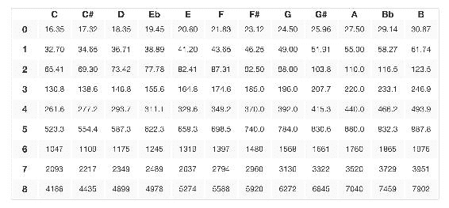

图 3：频率音符参考表

*图 4*显示了我们马里奥兄弟主题曲在较低频段的第一个样本。我们可以看到 43Hz 的最大幅度对应于音符**F**的主音：

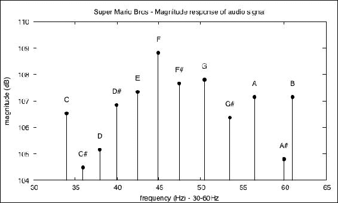

图 4：马里奥兄弟主题曲-低频

对于每个样本，我们构建一个由五个字母组成的哈希（比如[**E**-**D#**-**A**-**B**-**B**-**F**]），对应于前面频段中最强的音符（最高峰）。我们认为这个哈希是该特定 20 毫秒时间窗口的指纹。然后我们构建一个由哈希值组成的新 RDD（我们在`Audio`类中包括一个哈希函数）：

```scala
def hash: String = {
  val freqDomain = frequencyDomain()
  freqDomain.groupBy { case (fq, db) =>
    Audio.getFrequencyBand(fq)
  }.map { case (bucket, frequencies) =>
    val (dominant, _) = frequencies.map { case (fq, db) =>
      (Audio.findClosestNote(fq), db)
    }.sortBy { case (note, db) =>
      db
    }.last
    (bucket, dominant)
  }.toList
 .sortBy(_._1)
 .map(_._2)
 .mkString("-")
 }

*/** 
*001 Amadeus Mozart - Requiem (K. 626)        E-D#-A-B-B-F* 
*001 Amadeus Mozart - Requiem (K. 626)        G#-D-F#-B-B-F* 
*001 Amadeus Mozart - Requiem (K. 626)        F#-F#-C-B-C-F* 
*001 Amadeus Mozart - Requiem (K. 626)        E-F-F#-B-B-F* 
*001 Amadeus Mozart - Requiem (K. 626)        E-F#-C#-B-B-F* 
*001 Amadeus Mozart - Requiem (K. 626)        B-E-F-A#-C#-F* 
**/*

```

现在我们将所有共享相同哈希的歌曲 ID 分组，以构建一个唯一哈希的 RDD：

```scala
case class HashSongsPair(
                         id: String,
                         songs: List[Long]
                         )

 val hashRDD = sampleRDD.map { case (id, sample) =>
   (sample.hash, id)
  }
 .groupByKey()
 .map { case (id, songs) =>
    HashSongsPair(id, songs.toList)
  }
```

我们的假设是，当一个哈希在特定的时间窗口内在一首歌中被定义时，类似的歌曲可能共享相似的哈希，但两首歌拥有完全相同的哈希（并且顺序相同）将是真正相同的；一个可能分享我的部分 DNA，但一个拥有完全相同的 DNA 将是我的完美克隆。

如果一个音乐爱好者在听柴可夫斯基的 D 大调协奏曲时感到幸运，我们能否推荐帕赫贝尔的 D 大调卡农，仅仅是因为它们都有一个音乐节奏（即，D 音周围的共同频率）？

仅基于某些频段来推荐播放列表是否有效（和可行）？当然，仅仅频率本身是不足以完全描述一首歌的。节奏、音色或韵律呢？这个模型是否足够完整地准确表示音乐多样性和范围的所有细微差别？可能不是，但出于数据科学的目的，还是值得调查的！

# 构建歌曲分析器

然而，在深入研究推荐系统之前，读者可能已经注意到我们能够从信号数据中提取出一个重要的属性。由于我们在规则的时间间隔内生成音频签名，我们可以比较签名并找到潜在的重复项。例如，给定一首随机歌曲，我们应该能够根据先前索引的签名猜出标题。事实上，这是许多公司在提供音乐识别服务时采取的确切方法。更进一步，我们可能还可以提供关于乐队音乐影响的见解，甚至进一步，也许甚至可以识别歌曲剽窃，最终解决 Led Zeppelin 和美国摇滚乐队 Spirit 之间的*Stairway to Heaven*争议[`consequenceofsound.net/2014/05/did-led-zeppelin-steal-stairway-to-heaven-legendary-rock-band-facing-lawsuit-from-former-tourmates/`](http://consequenceofsound.net/2014/05/did-led-zeppelin-steal-stairway-to-heaven-legendary-rock-band-facing-lawsuit-from-former-tourmates/)。

考虑到这一点，我们将从我们的推荐用例中分离出来，继续深入研究歌曲识别。接下来，我们将构建一个分析系统，能够匿名接收一首歌曲，分析其流，并返回歌曲的标题（在我们的情况下，是原始文件名）。

## 销售数据科学就像销售杯子蛋糕

可悲的是，数据科学旅程中经常被忽视的一个方面是数据可视化。换句话说，如何将结果呈现给最终用户。虽然许多数据科学家乐意在 Excel 电子表格中呈现他们的发现，但今天的最终用户渴望更丰富、更沉浸式的体验。他们经常希望与数据进行*交互*。事实上，为最终用户提供一个完整的、端到端的用户体验，即使是一个简单的用户体验，也是激发对你的科学兴趣的好方法；将一个简单的概念证明变成一个人们可以轻松理解的原型。由于 Web 2.0 技术的普及，用户的期望很高，但幸运的是，有各种免费的开源产品可以帮助，例如 Mike Bostock 的 D3.js，这是一个流行的框架，提供了一个工具包，用于创建这样的用户界面。

没有丰富的数据可视化的数据科学就像试图销售没有糖衣的蛋糕，很少有人会信任成品。因此，我们将为我们的分析系统构建一个用户界面。但首先，让我们从 Spark 中获取音频数据（我们的哈希目前存储在 RDD 内存中），并将其存储到一个面向 Web 的数据存储中。

### 使用 Cassandra

我们需要一个快速、高效和分布式的键值存储来保存所有我们的哈希值。尽管许多数据库都适用于此目的，但我们将选择 Cassandra 来演示其与 Spark 的集成。首先，使用 Maven 依赖项导入 Cassandra 输入和输出格式：

```scala
<dependency>
  <groupId>com.datastax.spark</groupId>
  <artifactId>spark-cassandra-connector_2.11</artifactId>            
  <version>2.0.0</version>
</dependency> 

```

正如你所期望的那样，将 RDD 从 Spark 持久化（和检索）到 Cassandra 相对来说是相当简单的：

```scala
import com.datastax.spark.connector._

 val keyspace = "gzet"
 val table = "hashes"

 // Persist RDD
 hashRDD.saveAsCassandraTable(keyspace, table)

 // Retrieve RDD
 val retrievedRDD = sc.cassandraTableHashSongsPair
```

这将在 keyspace `gzet`上创建一个新的`hashes`表，从`HashSongsPair`对象中推断出模式。以下是执行的等效 SQL 语句（仅供参考）：

```scala
CREATE TABLE gzet.hashes (
  id text PRIMARY KEY,
  songs list<bigint>
)
```

### 使用 Play 框架

由于我们的 Web UI 将面对将歌曲转换为频率哈希所需的复杂处理，我们希望它是一个交互式的 Web 应用程序，而不是一组简单的静态 HTML 页面。此外，这必须以与我们使用 Spark 相同的方式和相同的功能完成（也就是说，相同的歌曲应该生成相同的哈希）。Play 框架（[`www.playframework.com/`](https://www.playframework.com/)）将允许我们这样做，Twitter 的 bootstrap（[`getbootstrap.com/`](http://getbootstrap.com/)）将用于为更专业的外观和感觉添加润色。

尽管这本书不是关于构建用户界面的，但我们将介绍与 Play 框架相关的一些概念，因为如果使用得当，它可以为数据科学家提供巨大的价值。与往常一样，完整的代码可以在我们的 GitHub 存储库中找到。

首先，我们创建一个**数据访问层**，负责处理与 Cassandra 的连接和查询。对于任何给定的哈希，我们返回匹配歌曲 ID 的列表。同样，对于任何给定的 ID，我们返回歌曲名称：

```scala
val cluster = Cluster
  .builder()
  .addContactPoint(cassandraHost)
  .withPort(cassandraPort)
  .build()
val session = cluster.connect()

 def findSongsByHash(hash: String): List[Long] = {
   val stmt = s"SELECT songs FROM hashes WHERE id = '$hash';"
   val results = session.execute(stmt)
   results flatMap { row =>
     row.getList("songs", classOf[Long])
   }
   .toList
 }
```

接下来，我们创建一个简单的**视图**，由三个对象组成，一个`text`字段，一个文件`Upload`和一个`submit`按钮。这几行足以提供我们的用户界面：

```scala
<div>
   <input type="text" class="form-control">
   <span class="input-group-btn">
     <button class="btn-primary">Upload</button>
     <button class="btn-success">Analyze</button>
   </span>
</div>
```

然后，我们创建一个**控制器**，通过`index`和`submit`方法处理`GET`和`POST` HTTP 请求。后者将通过将`FileInputStream`转换为`Audio` case 类，将其分割成 20 毫秒的块，提取 FFT 签名（哈希）并查询 Cassandra 以获取匹配的 ID 来处理上传的文件：

```scala
def index = Action { implicit request =>
   Ok(views.html.analyze("Select a wav file to analyze"))
 }

 def submit = Action(parse.multipartFormData) { request =>
   request.body.file("song").map { upload =>
     val file = new File(s"/tmp/${UUID.randomUUID()}")
     upload.ref.moveTo(file)
     val song = process(file)
     if(song.isEmpty) {
       Redirect(routes.Analyze.index())
         .flashing("warning" -> s"No match")
     } else {
       Redirect(routes.Analyze.index())
         .flashing("success" -> song.get)
     }
   }.getOrElse {
     Redirect(routes.Analyze.index())
       .flashing("error" -> "Missing file")
   }
 }

 def process(file: File): Option[String] = {
   val is = new FileInputStream(file)
   val audio = Audio.processSong(is)
   val potentialMatches = audio.sampleByTime().map {a =>
     queryCassandra(a.hash)
   }
   bestMatch(potentialMatches)
 }
```

最后，我们通过闪烁消息返回匹配结果（如果有的话），并通过为我们的`Analyze`服务定义新的路由将视图和控制器链接在一起：

```scala
GET      /analyze      controllers.Analyze.index
POST     /analyze      controllers.Analyze.submit
```

生成的 UI 如*图 5*所示，并且与我们自己的音乐库完美配合：

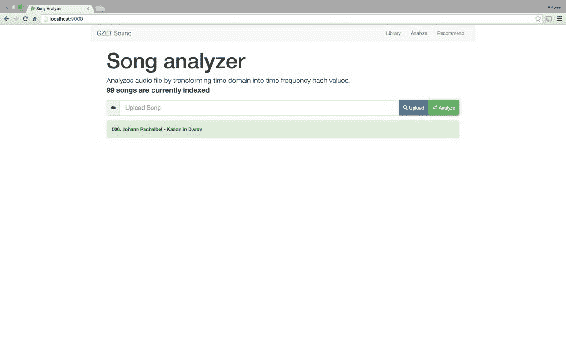

图 5：声音分析器 UI

下图*图 6*显示了端到端的过程：

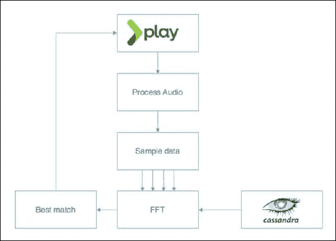

图 6：声音分析器过程

如前所述，Play 框架与我们的离线 Spark 作业共享一些代码。这是可能的，因为我们是以函数式风格编程，并且已经很好地分离了关注点。虽然 Play 框架在本质上不与 Spark（即 RDD 和 Spark 上下文对象）兼容，因为它们不依赖于 Spark，我们可以使用我们之前创建的任何函数（比如 Audio 类中的函数）。这是函数式编程的许多优势之一；函数本质上是无状态的，并且是六边形架构采用的关键组件之一：[`wiki.c2.com/?HexagonalArchitecture`](http://wiki.c2.com/?HexagonalArchitecture)。隔离的函数始终可以被不同的执行者调用，无论是在 RDD 内部还是在 Play 控制器内部。

# 构建推荐系统

现在我们已经探索了我们的歌曲分析器，让我们回到推荐引擎。如前所述，我们希望基于从音频信号中提取的频率哈希来推荐歌曲。以 Led Zeppelin 和 Spirit 之间的争议为例，我们期望这两首歌相对接近，因为有指控称它们共享旋律。以这种思路作为我们的主要假设，我们可能会向对《天梯》感兴趣的人推荐《Taurus》。

## PageRank 算法

我们不会推荐特定的歌曲，而是推荐播放列表。播放列表将由按相关性排名的所有歌曲列表组成，从最相关到最不相关。让我们从这样一个假设开始，即人们听音乐的方式与他们浏览网页的方式类似，也就是说，从链接到链接，沿着逻辑路径前进，但偶尔改变方向，或者进行跳转，并浏览到完全不同的网站。继续这个类比，当听音乐时，人们可以继续听相似风格的音乐（因此按照他们最期望的路径前进），或者跳到完全不同流派的随机歌曲。事实证明，这正是谷歌使用 PageRank 算法按照网站的受欢迎程度进行排名的方式。

### 注

有关 PageRank 算法的更多细节，请访问：[`ilpubs.stanford.edu:8090/422/1/1999-66.pdf`](http://ilpubs.stanford.edu:8090/422/1/1999-66.pdf)。

网站的受欢迎程度是通过它指向（并被引用）的链接数量来衡量的。在我们的音乐用例中，受欢迎程度是建立在给定歌曲与所有邻居共享的哈希数量上的。我们引入了歌曲共同性的概念，而不是受欢迎程度。

### 构建频率共现图

我们首先从 Cassandra 中读取我们的哈希值，并重新建立每个不同哈希的歌曲 ID 列表。一旦我们有了这个，我们就可以使用简单的`reduceByKey`函数来计算每首歌曲的哈希数量，因为音频库相对较小，我们将其收集并广播到我们的 Spark 执行器：

```scala
val hashSongsRDD = sc.cassandraTableHashSongsPair

 val songHashRDD = hashSongsRDD flatMap { hash =>
     hash.songs map { song =>
       ((hash, song), 1)
     }
   }

 val songTfRDD = songHashRDD map { case ((hash,songId),count) =>
     (songId, count)
   } reduceByKey(_+_)

 val songTf = sc.broadcast(songTfRDD.collectAsMap())
```

接下来，我们通过获取共享相同哈希值的每首歌曲的叉积来构建一个共现矩阵，并计算观察到相同元组的次数。最后，我们将歌曲 ID 和标准化的（使用我们刚刚广播的词频）频率计数包装在 GraphX 的`Edge`类中：

```scala
implicit class CrossableX {
      def crossY = for { x <- xs; y <- ys } yield (x, y)

val crossSongRDD = songHashRDD.keys
    .groupByKey()
    .values
    .flatMap { songIds =>
        songIds cross songIds filter { case (from, to) =>
           from != to
      }.map(_ -> 1)
    }.reduceByKey(_+_)
     .map { case ((from, to), count) =>
       val weight = count.toDouble /
                    songTfB.value.getOrElse(from, 1)
       Edge(from, to, weight)
    }.filter { edge =>
     edge.attr > minSimilarityB.value
   }

val graph = Graph.fromEdges(crossSongRDD, 0L)
```

我们只保留具有大于预定义阈值的权重（意味着哈希共现）的边，以构建我们的哈希频率图。

### 运行 PageRank

与运行 PageRank 时人们通常期望的相反，我们的图是无向的。事实证明，对于我们的推荐系统来说，缺乏方向并不重要，因为我们只是试图找到 Led Zeppelin 和 Spirit 之间的相似之处。引入方向的一种可能方式是查看歌曲的发布日期。为了找到音乐影响，我们可以确实地从最旧的歌曲到最新的歌曲引入一个时间顺序，给我们的边赋予方向性。

在以下的`pageRank`中，我们定义了一个 15%的概率来跳过，或者**跳转**到任意随机歌曲，但这显然可以根据不同的需求进行调整：

```scala
val prGraph = graph.pageRank(0.001, 0.15)
```

最后，我们提取了页面排名的顶点，并将它们保存为 Cassandra 中的播放列表，通过`Song`类的 RDD：

```scala
case class Song(id: Long, name: String, commonality: Double)
val vertices = prGraph
  .vertices
  .mapPartitions { vertices =>
    val songIds = songIdsB
  .value
  .vertices
  .map { case (songId, pr) =>
       val songName = songIds.get(vId).get
        Song(songId, songName, pr)
      }
  }

 vertices.saveAsCassandraTable("gzet", "playlist")
```

读者可能会思考 PageRank 在这里的确切目的，以及它如何作为推荐系统使用？事实上，我们使用 PageRank 的意思是排名最高的歌曲将是与其他歌曲共享许多频率的歌曲。这可能是由于共同的编曲、主题或旋律；或者可能是因为某位特定艺术家对音乐趋势产生了重大影响。然而，这些歌曲应该在理论上更受欢迎（因为它们出现的频率更高），这意味着它们更有可能受到大众的喜爱。

另一方面，低排名的歌曲是我们没有发现与我们所知的任何东西相似的歌曲。要么这些歌曲是如此前卫，以至于没有人在这些音乐理念上进行探索，要么是如此糟糕，以至于没有人想要复制它们！也许它们甚至是由你在叛逆的少年时期听过的那位新兴艺术家创作的。无论哪种情况，随机用户喜欢这些歌曲的机会被视为微不足道。令人惊讶的是，无论是纯粹的巧合还是这种假设真的有意义，这个特定音频库中排名最低的歌曲是 Daft Punk 的--*Motherboard*，这是一个相当原创的标题（尽管很棒），并且有着独特的声音。

## 构建个性化播放列表

我们刚刚看到，简单的 PageRank 可以帮助我们创建一个通用的播放列表。尽管这并不针对任何个人，但它可以作为一个随机用户的播放列表。这是我们在没有任何关于用户偏好的信息时能做出的最好的推荐。我们对用户了解得越多，我们就能越好地个性化播放列表以符合他们真正的喜好。为了做到这一点，我们可能会采用基于内容的推荐方法。

在没有关于用户偏好的预先信息的情况下，我们可以在用户播放歌曲时寻求收集我们自己的信息，并在运行时个性化他们的播放列表。为此，我们将假设我们的用户喜欢他们之前听过的歌曲。我们还需要禁用跳转，并生成一个从特定歌曲 ID 开始的新播放列表。

PageRank 和个性化 PageRank 在计算分数的方式上是相同的（使用传入/传出边的权重），但个性化版本只允许用户跳转到提供的 ID。通过对代码进行简单修改，我们可以使用某个社区 ID（参见第七章，*构建社区*，以获取社区的定义）或使用某种音乐属性，如艺术家或流派，来个性化 PageRank。根据我们之前的图，个性化的 PageRank 实现如下：

```scala
val graph = Graph.fromEdges(edgeRDD, 0L)
val prGraph = graph.personalizedPageRank(id, 0.001, 0.1)
```

在这里，随机跳转到一首歌的机会为零。仍然有 10%的跳过机会，但只在提供的歌曲 ID 的非常小的容差范围内。换句话说，无论我们当前正在听的歌曲是什么，我们基本上定义了 10%的机会播放我们提供的歌曲作为种子。

## 扩展我们的杯子蛋糕工厂

与我们的歌曲分析器原型类似，我们希望以一个漂亮整洁的用户界面向我们的想象客户呈现我们建议的播放列表。

### 构建播放列表服务

仍然使用 Play 框架，我们的技术栈保持不变，这次我们只是创建了一个新的端点（一个新的路由）：

```scala
GET       /playlist      controllers.Playlist.index
```

就像以前一样，我们创建了一个额外的控制器来处理简单的 GET 请求（当用户加载播放列表网页时触发）。我们加载存储在 Cassandra 中的通用播放列表，将所有这些歌曲包装在`Playlist` case 类中，并将其发送回`playlist.scala.html`视图。控制器模型如下：

```scala
def getSongs: List[Song] = {
   val s = "SELECT id, name, commonality FROM gzet.playlist;"
   val results = session.execute(s)
   results map { row =>
     val id = row.getLong("id")
     val name = row.getString("name")
     val popularity = row.getDouble("commonality")
     Song(id, name, popularity)
   } toList
 }

 def index = Action { implicit request =>
   val playlist = models.Playlist(getSongs)
   Ok(views.html.playlist(playlist))
 }
```

视图保持相当简单，因为我们遍历所有歌曲以按常见程度（从最常见到最不常见）排序进行显示：

```scala
@(playlist: Playlist)

@displaySongs(playlist: Playlist) = {
   @for(node <- playlist.songs.sortBy(_.commonality).reverse) {
     <a href="/playlist/@node.id" class="list-group-item">
       <iclass="glyphiconglyphicon-play"></i>
       <span class="badge">
         @node.commonality
       </span>
       @node.name
     </a>
   }
 }

 @main("playlist") {
   <div class="row">
     <div class="list-group">
       @displaySongs(playlist)
     </div>
   </div>
 }
```

### 注意

注意每个列表项中的`href`属性 - 每当用户点击列表中的歌曲时，我们将生成一个新的`REST`调用到/playlist/id 端点（这在下一节中描述）。

最后，我们很高兴地揭示了*图 7*中推荐的（通用）播放列表。由于我们不知道的某种原因，显然一个对古典音乐一窍不通的新手应该开始听*古斯塔夫·马勒，第五交响曲*。

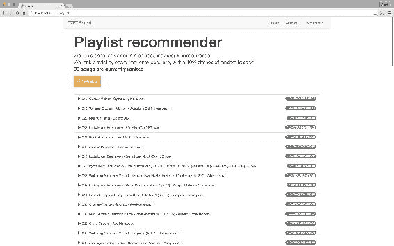

图 7：播放列表推荐器

### 利用 Spark 作业服务器

又来了一个有趣的挑战。尽管我们的通用播放列表和 PageRank 分数的歌曲列表存储在 Cassandra 中，但对于个性化播放列表来说，这是不可行的，因为这将需要对所有可能的歌曲 ID 的所有 PageRank 分数进行预计算。由于我们希望在伪实时中构建个性化播放列表，并且可能会定期加载新歌曲，所以我们需要找到一个比在每个请求上启动`SparkContext`更好的方法。

第一个限制是 PageRank 函数本质上是一个分布式过程，不能在 Spark 的上下文之外使用（也就是说，在我们的 Play 框架的 JVM 内部）。我们知道在每个 http 请求上创建一个新的 Spark 作业肯定会有点过度，所以我们希望启动一个单独的 Spark 作业，并且只在需要时处理新的图，最好是通过一个简单的 REST API 调用。

第二个挑战是我们不希望重复从 Cassandra 中加载相同的图数据集。这应该加载一次并缓存在 Spark 内存中，并在不同的作业之间共享。在 Spark 术语中，这将需要从共享上下文中访问 RDD。

幸运的是，Spark 作业服务器解决了这两个问题（[`github.com/spark-jobserver/spark-jobserver`](https://github.com/spark-jobserver/spark-jobserver)）。尽管这个项目还相当不成熟（或者至少还不够成熟），但它是展示数据科学的完全可行的解决方案。

为了本书的目的，我们只使用本地配置编译和部署 Spark 作业服务器。我们强烈建议读者深入了解作业服务器网站（参见上面的链接），以获取有关打包和部署的更多信息。一旦我们的服务器启动，我们需要创建一个新的上下文（意味着启动一个新的 Spark 作业），并为处理与 Cassandra 的连接的附加配置设置。我们给这个上下文一个名称，以便以后可以使用它：

```scala
curl -XPOST 'localhost:8090/contexts/gzet?\
  num-cpu-cores=4&\
  memory-per-node=4g&\
  spark.executor.instances=2&\
  spark.driver.memory=2g&\
  passthrough.spark.cassandra.connection.host=127.0.0.1&\
  passthrough.spark.cassandra.connection.port=9042'
```

下一步是修改我们的代码以符合 Spark 作业服务器的要求。我们需要以下依赖项：

```scala
<dependency>
   <groupId>spark.jobserver</groupId>
   <artifactId>job-server-api_2.11</artifactId>
   <version>spark-2.0-preview</version>
 </dependency>
```

我们修改我们的 SparkJob，使用作业服务器提供的`SparkJob`接口的签名。这是作业服务器所有 Spark 作业的要求：

```scala
object PlaylistBuilder extends SparkJob {

  override def runJob(
    sc: SparkContext,
    jobConfig: Config
  ): Any = ???

  override def validate(
    sc: SparkContext,
    config: Config
  ): SparkJobValidation = ???

}
```

在`validate`方法中，我们确保所有作业要求将得到满足（例如该作业所需的输入配置），在`runJob`中，我们执行我们的正常 Spark 逻辑，就像以前一样。最后的变化是，虽然我们仍然将我们的通用播放列表存储到 Cassandra 中，但我们将在 Spark 共享内存中缓存节点和边缘 RDD，以便将其提供给进一步的作业。这可以通过扩展`NamedRddSupport`特性来实现。

我们只需保存边缘和节点 RDD（请注意，目前不支持保存`Graph`对象）以便在后续作业中访问图：

```scala
this.namedRdds.update("rdd:edges", edgeRDD)
this.namedRdds.update("rdd:nodes", nodeRDD)
```

从个性化的`Playlist`作业中，我们按以下方式检索和处理我们的 RDD：

```scala
val edgeRDD = this.namedRdds.getEdge.get
val nodeRDD = this.namedRdds.getNode.get

val graph = Graph.fromEdges(edgeRDD, 0L)
```

然后，我们执行我们的个性化 PageRank，但是不会将结果保存回 Cassandra，而是简单地收集前 50 首歌曲。当部署时，由于作业服务器的魔力，此操作将隐式地将此列表输出回客户端：

```scala
val prGraph = graph.personalizedPageRank(id, 0.001, 0.1)

prGraph
 .vertices
 .map { case(vId, pr) =>
   List(vId, songIds.value.get(vId).get, pr).mkString(",")
  }
 .take(50)
```

我们编译我们的代码，并通过给它一个应用程序名称将我们的阴影 jar 文件发布到作业服务器，如下所示：

```scala
curl --data-binary @recommender-core-1.0.jar \
 'localhost:8090/jars/gzet'
```

现在我们几乎准备好部署我们的推荐系统了，让我们回顾一下我们将要演示的内容。我们将很快执行两种不同的用户流程：

+   当用户登录到推荐页面时，我们从 Cassandra 中检索最新的通用播放列表。或者，如果需要，我们会启动一个新的异步作业来创建一个新的播放列表。这将在 Spark 上下文中加载所需的 RDD。

+   当用户播放我们推荐的新歌曲时，我们会同步调用 Spark 作业服务器，并基于这首歌曲的 ID 构建下一个播放列表。

通用 PageRank 播放列表的流程如*图 8*所示：

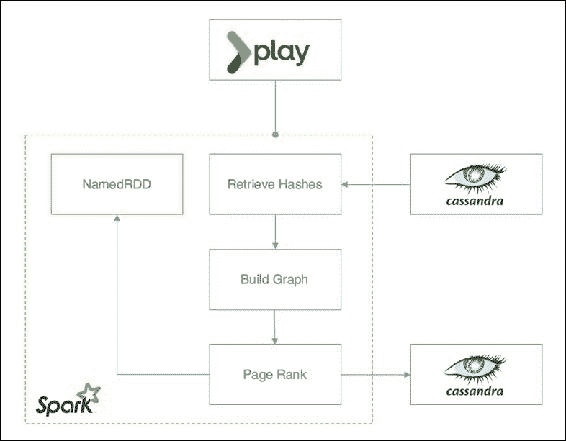

图 8：播放列表推荐器流程

个性化 PageRank 播放列表的流程如图 9 所示：

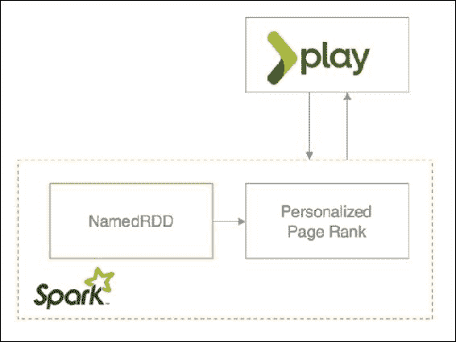

图 9：个性化播放列表推荐器流程

### 用户界面

最后剩下的问题是从 Play 框架的服务层调用 Spark 作业服务器。尽管这是通过`java.net`包以编程方式完成的，但由于它是一个 REST API，等效的`curl`请求在以下代码片段中显示：

```scala
# Asynchronous Playlist Builder
curl -XPOST 'localhost:8090/jobs?\
 context=gzet&\
 appName=gzet&\
 classPath=io.gzet.recommender.PlaylistBuilder'

# Synchronous Personalized Playlist for song 12
curl -XPOST -d "song.id=12" 'localhost:8090/jobs?\
 context=gzet&\
 appName=gzet&\
 sync=true&\
 timeout=60000&\
 classPath=io.gzet.recommender.PersonalizedPlaylistBuilder'
```

最初，当我们构建 HTML 代码时，我们引入了一个指向`/playlist/${id}`的链接或`href`。这个 REST 调用将被转换为对`Playlist`控制器的 GET 请求，并绑定到您的`personalize`函数，如下所示：

```scala
GET /playlist/:id controllers.Playlist.personalize(id: Long) 

```

对 Spark 作业服务器的第一次调用将同步启动一个新的 Spark 作业，从作业输出中读取结果，并重定向到相同的页面视图，这次是基于这首歌曲的 ID 更新的播放列表：

```scala
def personalize(id: Long) = Action { implicit request =>
   val name = cassandra.getSongName(id)
   try {
     val nodes = sparkServer.generatePlaylist(id)
     val playlist = models.Playlist(nodes, name)
     Ok(views.html.playlist(playlist))
   } catch {
     case e: Exception =>
       Redirect(routes.Playlist.index())
         .flashing("error" -> e.getMessage)
   }
 }
```

结果 UI 显示在*图 10*中。每当用户播放一首歌，播放列表都将被更新和显示，充当一个完整的排名推荐引擎。

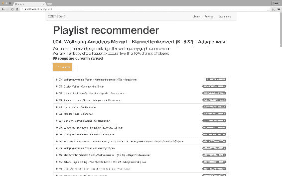

图 10：个性化播放列表推荐流程

# 总结

尽管我们的推荐系统可能并没有采用典型的教科书方法，也可能不是最准确的推荐系统，但它确实代表了数据科学中最常见技术之一的一个完全可演示且非常有趣的方法。此外，通过持久数据存储、REST API 接口、分布式共享内存缓存和基于现代 Web 2.0 的用户界面，它提供了一个相当完整和全面的候选解决方案。

当然，要将这个原型产品打造成一个生产级产品仍需要大量的努力和专业知识。在信号处理领域仍有改进空间。例如，可以通过使用响度滤波器来改善声压，并减少信号噪音，[`languagelog.ldc.upenn.edu/myl/StevensJASA1955.pdf`](http://languagelog.ldc.upenn.edu/myl/StevensJASA1955.pdf)，通过提取音高和旋律，或者更重要的是，通过将立体声转换为单声道信号。

### 注

所有这些过程实际上都是研究的一个活跃领域 - 读者可以查看以下一些出版物：[`www.justinsalamon.com/publications.html`](http://www.justinsalamon.com/publications.html) 和 [`www.mattmcvicar.com/publications/`](http://www.mattmcvicar.com/publications/)。

此外，我们质疑如何通过使用简单（交互式）用户界面来改进数据科学演示。正如提到的，这是一个经常被忽视的方面，也是演示的一个关键特点。即使在项目的早期阶段，投资一些时间进行数据可视化也是值得的，因为当说服商业人士你的产品的可行性时，它可能特别有用。

最后，作为一个有抱负的章节，我们探索了在 Spark 环境中解决数据科学用例的创新方法。通过平衡数学和计算机科学的技能，数据科学家应该可以自由探索，创造，推动可行性的边界，承担人们认为不可能的任务，但最重要的是，享受数据带来的乐趣。因为这正是为什么成为数据科学家被认为是 21 世纪最性感的工作的主要原因。

这一章是一个音乐插曲。在下一章中，我们将通过使用 Twitter 数据来引导 GDELT 文章的分类模型来分类 GDELT 文章，这无疑是另一个雄心勃勃的任务。
