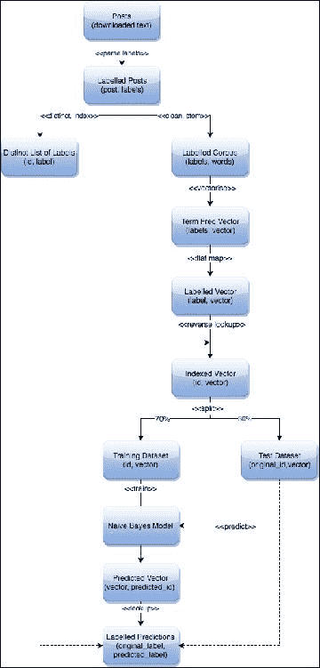
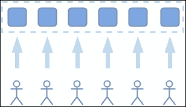
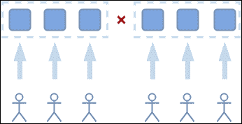
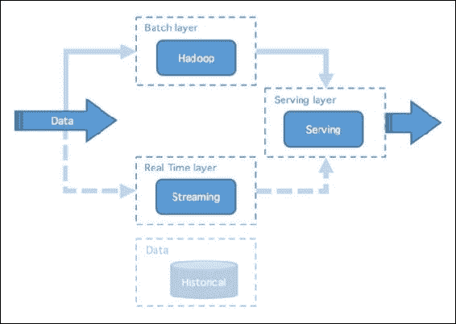
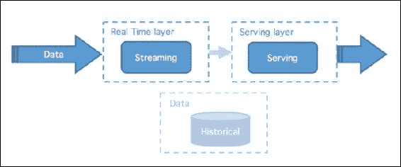
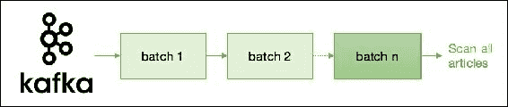
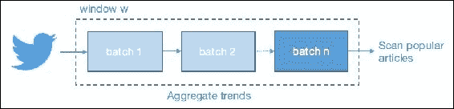
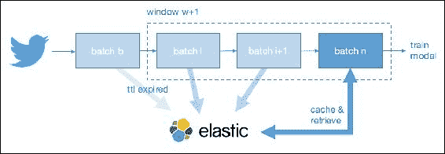
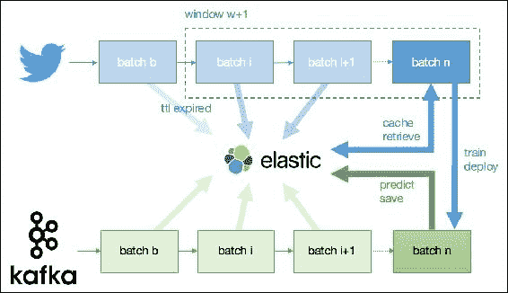
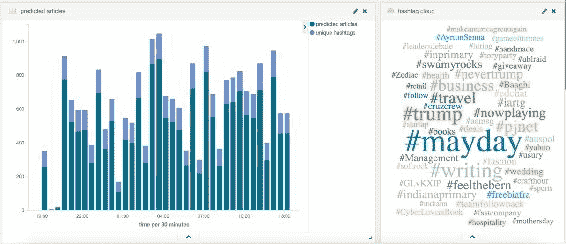

# 第九章：新闻词典和实时标记系统

虽然分层数据仓库将数据存储在文件夹中的文件中，但典型的基于 Hadoop 的系统依赖于扁平架构来存储您的数据。如果没有适当的数据治理或对数据的清晰理解，将数据湖变成沼泽的机会是不可否认的，其中一个有趣的数据集，如 GDELT，将不再是一个包含大量非结构化文本文件的文件夹。因此，数据分类可能是大规模组织中最广泛使用的机器学习技术之一，因为它允许用户正确分类和标记其数据，将这些类别作为其元数据解决方案的一部分发布，从而以最有效的方式访问特定信息。如果没有一个在摄入时执行的适当标记机制，理想情况下，找到关于特定主题的所有新闻文章将需要解析整个数据集以寻找特定关键字。在本章中，我们将描述一种创新的方法，以一种非监督的方式和近乎实时地使用 Spark Streaming 和 1%的 Twitter firehose 标记传入的 GDELT 数据。

我们将涵盖以下主题：

+   使用 Stack Exchange 数据引导朴素贝叶斯分类器

+   Lambda 与 Kappa 架构用于实时流应用程序

+   在 Spark Streaming 应用程序中使用 Kafka 和 Twitter4J

+   部署模型时的线程安全性

+   使用 Elasticsearch 作为缓存层

# 机械土耳其人

数据分类是一种监督学习技术。这意味着您只能预测您从训练数据集中学到的标签和类别。因为后者必须被正确标记，这成为我们将在本章中解决的主要挑战。

## 人类智能任务

在新闻文章的背景下，我们的数据没有得到适当的标记；我们无法从中学到任何东西。数据科学家的常识是手动开始标记一些输入记录，这些记录将作为训练数据集。然而，因为类别的数量可能相对较大，至少在我们的情况下（数百个标签），需要标记的数据量可能相当大（数千篇文章），并且需要巨大的努力。一个解决方案是将这项繁琐的任务外包给“机械土耳其人”，这个术语被用来指代历史上最著名的骗局之一，一个*自动*国际象棋选手愚弄了世界上大多数领导人（[`en.wikipedia.org/wiki/The_Turk`](https://en.wikipedia.org/wiki/The_Turk)）。这通常描述了一个可以由机器完成的过程，但实际上是由一个隐藏的人完成的，因此是一个人类智能任务。

对于读者的信息，亚马逊已经启动了一个机械土耳其人计划（[`www.mturk.com/mturk/welcome`](https://www.mturk.com/mturk/welcome)），个人可以注册执行人类智能任务，如标记输入数据或检测文本内容的情感。众包这项任务可能是一个可行的解决方案，假设您可以将这个内部（可能是机密的）数据集分享给第三方。这里描述的另一种解决方案是使用预先存在的标记数据集引导分类模型。

## 引导分类模型

文本分类算法通常从术语频率向量中学习；一种可能的方法是使用具有类似上下文的外部资源训练模型。例如，可以使用从 Stack Overflow 网站的完整转储中学到的类别对未标记的 IT 相关内容进行分类。因为 Stack Exchange 不仅仅是为 IT 专业人士保留的，人们可以在许多不同的上下文中找到各种数据集，这些数据集可以服务于许多目的（[`archive.org/download/stackexchange`](https://archive.org/download/stackexchange)）。

### 从 Stack Exchange 学习

我们将在这里演示如何使用来自 Stack Exchange 网站的与家酿啤酒相关的数据集来引导一个简单的朴素贝叶斯分类模型：

```scala
$ wget https://archive.org/download/stackexchange/beer.stackexchange.com.7z
$ 7z e beer.stackexchange.com.7z
```

我们创建了一些方法，从所有 XML 文档中提取正文和标签，从 HTML 编码的正文中提取干净的文本内容（使用第六章中介绍的 Goose 抓取器，*基于链接的外部数据抓取*），最后将我们的 XML 文档 RDD 转换为 Spark DataFrame。这里没有报告不同的方法，但它们可以在我们的代码库中找到。需要注意的是，Goose 抓取器可以通过提供 HTML 内容（作为字符串）和一个虚拟 URL 来离线使用。

我们提供了一个方便的`parse`方法，可用于预处理来自 Stack Exchange 网站的任何`Post.xml`数据。这个函数是我们的`StackBootstraping`代码的一部分，可以在我们的代码库中找到：

```scala
import io.gzet.tagging.stackoverflow.StackBootstraping

val spark = SparkSession.builder()
  .appName("StackExchange")
  .getOrCreate()

val sc = spark.sparkContext
val rdd = sc.textFile("/path/to/posts.xml")
val brewing = StackBootstraping.parse(rdd)

brewing.show(5)

+--------------------+--------------------+
|                body|                tags|
+--------------------+--------------------+
|I was offered a b...|              [hops]|
|As far as we know...|           [history]|
|How is low/no alc...|           [brewing]|
|In general, what'...|[serving, tempera...|
|Currently I am st...| [pilsener, storage]|
+--------------------+--------------------+
```

### 构建文本特征

有了正确标记的啤酒内容，剩下的过程就是引导算法本身。为此，我们使用一个简单的朴素贝叶斯分类算法，确定给定项目特征的标签的条件概率。我们首先收集所有不同的标签，分配一个唯一的标识符（作为`Double`），并将我们的标签字典广播到 Spark 执行器：

```scala
val labelMap = brewing
  .select("tags")
  .withColumn("tag", explode(brewing("tags")))
  .select("tag")
  .distinct()
  .rdd
  .map(_.getString(0)).zipWithIndex()
  .mapValues(_.toDouble + 1.0d)
labelMap.take(5).foreach(println)

/*
(imperal-stout,1.0)
(malt,2.0)
(lent,3.0)
(production,4.0)
(local,5.0)
*/
```

### 提示

如前所述，请确保在 Spark 转换中使用的大型集合已广播到所有 Spark 执行器。这将减少与网络传输相关的成本。

`LabeledPoint`由标签（作为`Double`）和特征（作为`Vector`）组成。构建文本内容特征的常见做法是构建词项频率向量，其中每个单词在所有文档中对应一个特定的维度。在英语中大约有数十万个维度（英语单词估计数量为 1,025,109），这种高维空间对于大多数机器学习算法来说将特别低效。事实上，当朴素贝叶斯算法计算概率（小于 1）时，由于机器精度问题（如第十四章中描述的数值下溢，*可扩展算法*），存在达到 0 的风险。数据科学家通过使用降维原理来克服这一限制，将稀疏向量投影到更密集的空间中，同时保持距离度量（降维原理将在第十章中介绍，*故事去重和变异*）。尽管我们可以找到许多用于此目的的算法和技术，但我们将使用 Spark 提供的哈希工具。

在* n *（默认为 2²⁰）的向量大小下，其`transform`方法将所有单词分组到* n *个不同的桶中，根据它们的哈希值对桶频率进行求和以构建更密集的向量。

在进行昂贵的降维操作之前，可以通过对文本内容进行词干处理和清理来大大减少向量大小。我们在这里使用 Apache Lucene 分析器：

```scala
<dependency>
   <groupId>org.apache.lucene</groupId>
   <artifactId>lucene-analyzers-common</artifactId>
   <version>4.10.1</version>
 </dependency>
```

我们去除所有标点和数字，并将纯文本对象提供给 Lucene 分析器，将每个干净的单词收集为`CharTermAttribute`：

```scala
def stem(rdd: RDD[(String, Array[String])]) = {

  val replacePunc = """\\W""".r
  val replaceDigitOnly = """\\s\\d+\\s""".r

  rdd mapPartitions { it =>

    val analyzer = new EnglishAnalyzer
    it map { case (body, tags) =>
      val content1 = replacePunc.replaceAllIn(body, " ")
      val content = replaceDigitOnly.replaceAllIn(content1, " ")
      val tReader = new StringReader(content)
      val tStream = analyzer.tokenStream("contents", tReader)
      val term = tStream.addAttribute(classOf[CharTermAttribute])
       tStream.reset()
      val terms = collection.mutable.MutableList[String]()
      while (tStream.incrementToken) {
        val clean = term.toString
        if (!clean.matches(".*\\d.*") && clean.length > 3) {
           terms += clean
        }
      }
      tStream.close()
      (terms.toArray, tags)
     }

  }
```

通过这种方法，我们将文本[Mastering Spark for Data Science - V1]转换为[master spark data science]，从而减少了输入向量中的单词数量（因此减少了维度）。最后，我们使用 MLlib 的`normalizer`类来规范化我们的词项频率向量：

```scala
val hashingTf = new HashingTF()
val normalizer = new Normalizer()

val labeledCorpus = stem(df map { row =>
  val body = row.getString(0)
  val tags = row.getAs[mutable.WrappedArray[String]](1)
  (body, tags)
})

val labeledPoints = labeledCorpus flatMap { case (corpus, tags) =>
  val vector = hashingTf.transform(corpus)
  val normVector = normalizer.transform(vector)
  tags map { tag =>
    val label = bLabelMap.value.getOrElse(tag, 0.0d)
    LabeledPoint(label, normVector)
  }
}
```

### 提示

哈希函数可能会导致由于碰撞而产生严重的高估（两个完全不同含义的单词可能共享相同的哈希值）。我们将在第十章中讨论随机索引技术，以限制碰撞的数量同时保持距离度量。

### 训练朴素贝叶斯模型

我们按照以下方式训练朴素贝叶斯算法，并使用我们没有包含在训练数据点中的测试数据集测试我们的分类器。最后，在下面的例子中显示了前五个预测。左侧的标签是我们测试内容的原始标签；右侧是朴素贝叶斯分类的结果。`ipa`被预测为`hangover`，从而确证了我们分类算法的准确性：

```scala
labeledPoints.cache()
val model: NaiveBayesModel = NaiveBayes.train(labeledPoints)
labeledPoints.unpersist(blocking = false)

model
  .predict(testPoints)
  .map { prediction =>
     bLabelMap.value.map(_.swap).get(prediction).get
   }
  .zip(testLabels)
  .toDF("predicted","original")
  .show(5)

+---------+-----------+
| original|  predicted|
+---------+-----------+
|  brewing|    brewing|
|      ipa|   hangover|
| hangover|   hangover|
| drinking|   drinking|
| pilsener|   pilsener|
+---------+-----------+
```

为了方便起见，我们将所有这些方法抽象出来，并在稍后将使用的`Classifier`对象中公开以下方法：

```scala
def train(rdd: RDD[(String, Array[String])]): ClassifierModel
def predict(rdd: RDD[String]): RDD[String]
```

我们已经演示了如何从外部来源导出标记数据，如何构建词项频率向量，以及如何训练一个简单的朴素贝叶斯分类模型。这里使用的高级工作流程如下图所示，对于大多数分类用例来说都是通用的：



图 1：分类工作流程

下一步是开始对原始未标记数据进行分类（假设我们的内容仍然与酿酒有关）。这结束了朴素贝叶斯分类的介绍，以及一个自举模型如何从外部资源中获取真实信息。这两种技术将在以下部分中用于我们的分类系统。

## 懒惰，急躁和傲慢

接下来是我们在新闻文章环境中将面临的第二个主要挑战。假设有人花了几天时间手动标记数据，这将解决我们已知类别的分类问题，可能只在回测我们的数据时有效。谁知道明天报纸的新闻标题会是什么；没有人能定义将来将涵盖的所有细粒度标签和主题（尽管仍然可以定义更广泛的类别）。这将需要大量的努力来不断重新评估、重新训练和重新部署我们的模型，每当出现新的热门话题时。具体来说，一年前没有人谈论“脱欧”这个话题；现在这个话题在新闻文章中被大量提及。

根据我们的经验，数据科学家应该记住 Perl 编程语言的发明者 Larry Wall 的一句名言：

> “我们将鼓励您培养程序员的三大美德，懒惰、急躁和傲慢”。

+   *懒惰*会让你付出巨大的努力来减少总体能量消耗

+   *急躁*会让你编写不仅仅是满足你需求的程序，而是能够预测你的需求

+   *傲慢*会让你编写程序，别人不愿意说坏话

我们希望避免与分类模型的准备和维护相关的努力（懒惰），并在程序上预测新主题的出现（急躁），尽管这听起来可能是一个雄心勃勃的任务（但如果不是对实现不可能的过度自豪，那又是什么呢？）。社交网络是一个从中获取真实信息的绝佳地方。事实上，当人们在 Twitter 上发布新闻文章时，他们无意中帮助我们标记我们的数据。我们不需要支付机械土耳其人的费用，当我们潜在地有数百万用户为我们做这项工作时。换句话说，我们将 GDELT 数据的标记外包给 Twitter 用户。

Twitter 上提到的任何文章都将帮助我们构建一个词项频率向量，而相关的标签将被用作正确的标签。在下面的例子中，关于奥巴马总统穿着睡袍会见乔治王子的可爱新闻已被分类为[#Obama]和[#Prince] [`www.wfmynews2.com/entertainment/adorable-prince-george-misses-bedtime-meets-president-obama/149828772`](http://www.wfmynews2.com/entertainment/adorable-prince-george-misses-bedtime-meets-president-obama/149828772)：


图 2：奥巴马总统会见乔治王子，#Obama，#Prince

在以下示例中，我们通过机器学习主题[#DavidBowie]，[#Prince]，[#GeorgeMichael]和[#LeonardCohen]来向 2016 年音乐界的所有巨大损失致敬，这些主题都在同一篇来自《卫报》的新闻文章中（https://www.theguardian.com/music/2016/dec/29/death-stars-musics-greatest-losses-of-2016）：


图 3：2016 年音乐界的巨大损失-来源

使用这种方法，我们的算法将不断自动重新评估，从而自行学习出现的主题，因此以一种非监督的方式工作（尽管在适当意义上是一种监督学习算法）。

# 设计 Spark Streaming 应用程序

构建实时应用程序在架构和涉及的组件方面与批处理处理有所不同。后者可以轻松地自下而上构建，程序员在需要时添加功能和组件，而前者通常需要在一个稳固的架构基础上自上而下构建。事实上，由于数据量和速度（或在流处理上下文中的真实性）的限制，不恰当的架构将阻止程序员添加新功能。人们总是需要清楚地了解数据流如何相互连接，以及它们是如何被处理、缓存和检索的。

## 两种架构的故事

在使用 Apache Spark 进行流处理方面，有两种新兴的架构需要考虑：Lambda 架构和 Kappa 架构。在深入讨论这两种架构的细节之前，让我们讨论它们试图解决的问题，它们有什么共同之处，以及在什么情况下使用每种架构。

### CAP 定理

多年来，处理网络中断一直是高度分布式系统的工程师们关注的问题。以下是一个特别感兴趣的情景，请考虑：



图 4：分布式系统故障

典型分布式系统的正常运行是用户执行操作，系统使用复制、缓存和索引等技术来确保正确性和及时响应。但当出现问题时会发生什么：



图 5：分布式系统的分裂大脑综合症

在这里，网络中断实际上阻止了用户安全地执行他们的操作。是的，一个简单的网络故障引起了一个并不仅仅影响功能和性能的复杂情况，正如你可能期望的那样，还影响了系统的正确性。

事实上，系统现在遭受了所谓的*分裂大脑综合症*。在这种情况下，系统的两个部分不再能够相互通信，因此用户在一侧进行的任何修改在另一侧是不可见的。这几乎就像有两个独立的系统，每个系统都维护着自己的内部状态，随着时间的推移会变得截然不同。至关重要的是，用户在任一侧运行相同查询时可能会报告不同的答案。

这只是分布式系统中失败的一般情况之一，尽管已经花费了大量时间来解决这些问题，但仍然只有三种实际的方法：

1.  在基础问题得到解决之前，阻止用户进行任何更新，并同时保留系统的当前状态（故障前的最后已知状态）作为正确的（即牺牲*分区容忍性*）。

1.  允许用户继续进行更新，但要接受答案可能不同，并且在基础问题得到纠正时必须收敛（即牺牲*一致性*）。

1.  将所有用户转移到系统的一部分，并允许他们继续进行更新。系统的另一部分被视为失败，并接受部分处理能力的降低，直到问题解决为止 - 系统可能因此变得不太响应（即牺牲*可用性*）。

前述的结论更正式地陈述为 CAP 定理（[`nathanmarz.com/blog/how-to-beat-the-cap-theorem.html`](http://nathanmarz.com/blog/how-to-beat-the-cap-theorem.html)）。它认为在一个故障是生活中的事实且你不能牺牲功能性的环境中（1），你必须在一致的答案（2）和完整的功能性（3）之间做出选择。你不能两者兼得，因为这是一种权衡。

### 提示

事实上，更正确的描述是将“故障”描述为更一般的术语“分区容错”，因为这种类型的故障可能指的是系统的任何分割 - 网络中断、服务器重启、磁盘已满等 - 它不一定是特定的网络问题。

不用说，这是一种简化，但尽管如此，在故障发生时，大多数数据处理系统都会属于这些广泛的类别之一。此外，事实证明，大多数传统数据库系统都倾向于一致性，通过使用众所周知的计算机科学方法来实现，如事务、预写日志和悲观锁定。

然而，在今天的在线世界中，用户期望全天候访问服务，其中许多服务都是收入来源；物联网或实时决策，需要一种可扩展的容错方法。因此，人们努力寻求确保在故障发生时可用性的替代方案的努力激增（事实上，互联网本身就是出于这种需求而诞生的）。

事实证明，在实现高可用系统并提供可接受水平一致性之间取得平衡是一种挑战。为了管理必要的权衡，方法往往提供更弱的一致性定义，即*最终一致性*，在这种情况下，通常容忍一段时间的陈旧数据，并且随着时间的推移，正确的数据会得到认可。然而，即使在这种妥协情况下，它们仍然需要使用更复杂的技术，因此更难以构建和维护。

### 提示

在更繁重的实现中，需要使用向量时钟和读修复来处理并发并防止数据损坏。

### 希腊人在这里可以提供帮助

Lambda 和 Kappa 架构都提供了对先前描述的问题更简单的解决方案。它们倡导使用现代大数据技术，如 Apache Spark 和 Apache Kafka 作为一致性可用处理系统的基础，逻辑可以在不需要考虑故障的情况下进行开发。它们适用于具有以下特征的情况：

+   无限的、入站的信息流，可能来自多个来源

+   对非常大的累积数据集进行分析处理

+   用户查询对数据一致性有时间保证

+   对性能下降或停机的零容忍

在具有这些条件的情况下，您可以考虑将任一架构作为一般候选。每种架构都遵循以下核心原则，有助于简化数据一致性、并发访问和防止数据损坏的问题：

+   数据不可变性：数据只能创建或读取。它永远不会被更新或删除。以这种方式处理数据极大地简化了保持数据一致性所需的模型。

+   **人为容错**：在软件开发生命周期的正常过程中修复或升级软件时，通常需要部署新版本的分析并通过系统重放历史数据以产生修订答案。事实上，在管理直接处理具有此能力的数据的系统时，这通常是至关重要的。批处理层提供了历史数据的持久存储，因此允许恢复任何错误。

正是这些原则构成了它们最终一致的解决方案的基础，而无需担心诸如读取修复或向量时钟之类的复杂性；它们绝对是更友好的开发人员架构！

因此，让我们讨论一些选择一个而不是另一个的原因。让我们首先考虑 Lambda 架构。

## Lambda 架构的重要性

Lambda 架构，最初由 Nathan Marz 提出，通常是这样的：



图 6：Lambda 架构

实质上，数据被双路由到两个层：

+   **批处理层**能够在给定时间点计算快照

+   **实时层**能够处理自上次快照以来的增量更改

**服务层**然后用于将这两个数据视图合并在一起，产生一个最新的真相版本。

除了先前描述的一般特征之外，Lambda 架构在以下特定条件下最适用：

+   复杂或耗时的批量或批处理算法，没有等效或替代的增量迭代算法（并且近似值是不可接受的），因此您需要批处理层。

+   无论系统的并行性如何，批处理层单独无法满足数据一致性的保证，因此您需要实时层。例如，您有：

+   低延迟写入-读取

+   任意宽范围的数据，即年份

+   重数据倾斜

如果您具有以下任一条件之一，您应该考虑使用 Lambda 架构。但是，在继续之前，请注意它带来的可能会带来挑战的以下特性：

+   两个数据管道：批处理和流处理有单独的工作流程，尽管在可能的情况下可以尝试重用核心逻辑和库，但流程本身必须在运行时单独管理。

+   复杂的代码维护：除了简单的聚合之外，批处理和实时层中的算法将需要不同。这对于机器学习算法尤其如此，其中有一个专门研究这一领域的领域，称为在线机器学习（[`en.wikipedia.org/wiki/Online_machine_learning`](https://en.wikipedia.org/wiki/Online_machine_learning)），其中可能涉及实现增量迭代算法或近似算法，超出现有框架之外。

+   服务层中的复杂性增加：为了将增量与聚合合并，服务层中需要进行聚合、联合和连接。工程师们应该小心，不要将其分解为消费系统。

尽管存在这些挑战，Lambda 架构是一种强大而有用的方法，已经成功地在许多机构和组织中实施，包括 Yahoo！、Netflix 和 Twitter。

## Lambda 架构的重要性

Kappa 架构通过将*分布式日志*的概念置于中心，进一步简化了概念。这样可以完全删除批处理层，从而创建一个更简单的设计。Kappa 有许多不同的实现，但通常看起来是这样的：



图 7：Kappa 架构

在这种架构中，分布式日志基本上提供了数据不可变性和可重放性的特性。通过在处理层引入*可变状态存储*的概念，它通过将所有处理视为流处理来统一计算模型，即使是批处理，也被视为流的特例。当您具有以下特定条件之一时，Kappa 架构最适用：

+   通过增加系统的并行性来减少延迟，可以满足数据一致性的保证。

+   通过实现增量迭代算法可以满足数据一致性的保证

如果这两种选择中的任何一种是可行的，那么 Kappa 架构应该提供一种现代、可扩展的方法来满足您的批处理和流处理需求。然而，值得考虑所选择的任何实现的约束和挑战。潜在的限制包括：

+   精确一次语义：许多流行的分布式消息系统，如 Apache Kafka，目前不支持精确一次消息传递语义。这意味着，目前，消费系统必须处理接收到的数据重复。通常通过使用检查点、唯一键、幂等写入或其他去重技术来完成，但这会增加复杂性，因此使解决方案更难构建和维护。

+   无序事件处理：许多流处理实现，如 Apache Spark，目前不支持按事件时间排序的更新，而是使用处理时间，即系统首次观察到事件的时间。因此，更新可能会无序接收，系统需要能够处理这种情况。同样，这会增加代码复杂性，使解决方案更难构建和维护。

+   没有强一致性，即线性一致性：由于所有更新都是异步应用的，不能保证写入会立即生效（尽管它们最终会一致）。这意味着在某些情况下，您可能无法立即“读取您的写入”。

在下一章中，我们将讨论增量迭代算法，数据倾斜或服务器故障如何影响一致性，以及 Spark Streaming 中的反压特性如何帮助减少故障。关于本节中所解释的内容，我们将按照 Kappa 架构构建我们的分类系统。

# 消费数据流

与批处理作业类似，我们使用`SparkConf`对象和上下文创建一个新的 Spark 应用程序。在流处理应用程序中，上下文是使用批处理大小参数创建的，该参数将用于任何传入的流（GDELT 和 Twitter 层，作为同一上下文的一部分，都将绑定到相同的批处理大小）。由于 GDELT 数据每 15 分钟发布一次，我们的批处理大小自然将是 15 分钟，因为我们希望基于伪实时基础预测类别：

```scala
val sparkConf = new SparkConf().setAppName("GZET")
val ssc = new StreamingContext(sparkConf, Minutes(15))
val sc = ssc.sparkContext
```

## 创建 GDELT 数据流

有许多将外部数据发布到 Spark 流处理应用程序的方法。可以打开一个简单的套接字并开始通过 netcat 实用程序发布数据，或者可以通过监视外部目录的 Flume 代理流式传输数据。生产系统通常使用 Kafka 作为默认代理，因为它具有高吞吐量和整体可靠性（数据被复制到多个分区）。当然，我们可以使用与第十章中描述的相同的 Apache NiFi 堆栈，*故事去重和变异*，但我们想在这里描述一个更简单的路线，即通过 Kafka 主题将文章 URL（从 GDELT 记录中提取）传送到我们的 Spark 应用程序中。

### 创建 Kafka 主题

在测试环境中创建一个新的 Kafka 主题非常容易。在生产环境中，必须特别注意选择正确数量的分区和复制因子。还要注意安装和配置适当的 zookeeper quorum。我们启动 Kafka 服务器并创建一个名为`gzet`的主题，只使用一个分区和一个复制因子：

```scala
$ kafka-server-start /usr/local/etc/kafka/server.properties > /var/log/kafka/kafka-server.log 2>&1 &

$ kafka-topics --create --zookeeper localhost:2181 --replication-factor 1 --partitions 1 --topic gzet
```

### 将内容发布到 Kafka 主题

我们可以通过将内容传送到`kafka-console-producer`实用程序来向 Kafka 队列提供数据。我们使用`awk`、`sort`和`uniq`命令，因为我们只对 GDELT 记录中的不同 URL 感兴趣（`URL`是我们的制表符分隔值的最后一个字段，因此是`$NF`）：

```scala
$ cat ${FILE} | awk '{print $NF}' | sort | uniq | kafka-console-producer --broker-list localhost:9092 --topic gzet
```

为了方便起见，我们创建了一个简单的 bash 脚本，用于监听 GDELT 网站上的新文件，下载和提取内容到临时目录，并执行上述命令。该脚本可以在我们的代码存储库（`gdelt-stream.sh`）中找到。

### 从 Spark Streaming 中消费 Kafka

Kafka 是 Spark Streaming 的官方来源，可使用以下依赖项：

```scala
<dependency>
   <groupId>org.apache.spark</groupId>
   <artifactId>spark-streaming-kafka-0-8_2.11</artifactId>
   <version>2.0.0</version>
</dependency>
```

我们定义将用于处理来自 gzet 主题的数据的 Spark 分区数量（这里是 10），以及 zookeeper quorum。我们返回消息本身（传送到我们的 Kafka 生产者的 URL），以构建我们的文章 URL 流：

```scala
def createGdeltStream(ssc: StreamingContext) = {
   KafkaUtils.createStream(
     ssc,
     "localhost:2181",
     "gzet",
     Map("gzet" -> 10)
   ).values
 }

val gdeltUrlStream: DStream[String] = createGdeltStream(ssc)
```



图 8：GDELT 在线层

在上图中，我们展示了 GDELT 数据将如何通过监听 Kafka 主题进行批处理。每个批次将被分析，并使用第六章中描述的 HTML 解析器*基于链接的外部数据抓取*下载文章。

## 创建 Twitter 数据流

使用 Twitter 的明显限制是规模的限制。每天有超过 5 亿条推文，我们的应用程序需要以最分布式和可扩展的方式编写，以处理大量的输入数据。此外，即使只有 2%的推文包含对外部 URL 的引用，我们每天仍然需要获取和分析 100 万个 URL（除了来自 GDELT 的数千个 URL）。由于我们没有专门的架构来处理这些数据，因此我们将使用 Twitter 免费提供的 1% firehose。只需在 Twitter 网站上注册一个新应用程序（[`apps.twitter.com`](https://apps.twitter.com)），并检索其关联的应用程序设置和授权令牌。但是请注意，自 Spark Streaming 版本`2.0.0`以来，Twitter 连接器不再是核心 Spark Streaming 的一部分。作为 Apache Bahir 项目的一部分（[`bahir.apache.org/`](http://bahir.apache.org/)），可以使用以下 maven`dependency`：

```scala
<dependency>
   <groupId>org.apache.bahir</groupId>
   <artifactId>spark-streaming-twitter_2.11</artifactId>
   <version>2.0.0</version>
</dependency>
```

因为 Spark Streaming 在后台使用`twitter4j`，所以配置是使用`twitter4j`库中的`ConfigurationBuilder`对象完成的：

```scala
import twitter4j.auth.OAuthAuthorization
import twitter4j.conf.ConfigurationBuilder

def getTwitterConfiguration = {

  val builder = new ConfigurationBuilder()

  builder.setOAuthConsumerKey("XXXXXXXXXXXXXXX")
  builder.setOAuthConsumerSecret("XXXXXXXXXXXX")
  builder.setOAuthAccessToken("XXXXXXXXXXXXXXX")
  builder.setOAuthAccessTokenSecret("XXXXXXXXX")

  val configuration = builder.build()
  Some(new OAuthAuthorization(configuration))

}
```

我们通过提供一个关键字数组（可以是特定的标签）来创建我们的数据流。在我们的情况下，我们希望收听所有 1%，无论使用哪些关键字或标签（发现新标签实际上是我们应用程序的一部分），因此提供一个空数组：

```scala
def createTwitterStream(ssc: StreamingContext) = {
   TwitterUtils.createStream(
     ssc,
     getTwitterConfiguration,
     Array[String]()
   )
}

val twitterStream: DStream[Status] = createTwitterStream(ssc)
getText method that returns the tweet body:
```

```scala
val body: String = status.getText()
val user: User = status.getUser()
val contributors: Array[Long] = status.getContributors()
val createdAt: Long = status.getCreatedAt()
../..
```

# 处理 Twitter 数据

使用 Twitter 的第二个主要限制是噪音的限制。当大多数分类模型针对数十个不同的类进行训练时，我们将针对每天数十万个不同的标签进行工作。我们只关注热门话题，即在定义的批处理窗口内发生的热门话题。然而，由于 Twitter 上的 15 分钟批处理大小不足以检测趋势，因此我们将应用一个 24 小时的移动窗口，其中将观察和计数所有标签，并仅保留最受欢迎的标签。



图 9：Twitter 在线层，批处理和窗口大小

使用这种方法，我们减少了不受欢迎标签的噪音，使我们的分类器更加准确和可扩展，并显著减少了要获取的文章数量，因为我们只关注与热门话题一起提及的流行 URL。这使我们能够节省大量时间和资源，用于分析与分类模型无关的数据。

## 提取 URL 和标签

我们提取干净的标签（长度超过 x 个字符且不包含数字；这是减少噪音的另一种措施）和对有效 URL 的引用。请注意 Scala 的`Try`方法，它在测试`URL`对象时捕获任何异常。只有符合这两个条件的推文才会被保留：

```scala
def extractTags(tweet: String) = {
  StringUtils.stripAccents(tweet.toLowerCase())
    .split("\\s")
    .filter { word =>
      word.startsWith("#") &&
        word.length > minHashTagLength &&
        word.matches("#[a-z]+")
    }
}

def extractUrls(tweet: String) = {
  tweet.split("\\s")
    .filter(_.startsWith("http"))
    .map(_.trim)
    .filter(url => Try(new URL(url)).isSuccess)
}

def getLabeledUrls(twitterStream: DStream[Status]) = {
  twitterStream flatMap { tweet =>
    val tags = extractTags(tweet.getText)
    val urls = extractUrls(tweet.getText)
    urls map { url =>
      (url, tags)
    }
  }
}

val labeledUrls = getLabeledUrls(twitterStream)
```

## 保留热门标签

这一步的基本思想是在 24 小时的时间窗口内执行一个简单的词频统计。我们提取所有的标签，赋予一个值为 1，并使用 reduce 函数计算出现次数。在流处理上，`reduceByKey`函数可以使用`reduceByKeyAndWindow`方法在一个窗口上应用（必须大于批处理大小）。尽管这个词频字典在每个批处理中都是可用的，但当前的前十个标签每 15 分钟打印一次，数据将在一个较长的时间段（24 小时）内计数：

```scala
def getTrends(twitterStream: DStream[Status]) = {

  val stream = twitterStream
    .flatMap { tweet =>
      extractTags(tweet.getText)
    }
    .map(_ -> 1)
    .reduceByKeyAndWindow(_ + _, Minutes(windowSize))

  stream.foreachRDD { rdd =>
    val top10 = rdd.sortBy(_._2, ascending = false).take(10)
    top10.foreach { case (hashTag, count) =>
      println(s"[$hashTag] - $count")
    }
  }

  stream
}

val twitterTrend = getTrends(twitterStream)
```

在批处理上下文中，可以轻松地将标签的 RDD 与 Twitter RDD 连接，以保留只有“最热门”推文（提及与热门标签一起的文章的推文）。在流处理上下文中，数据流不能连接，因为每个流包含多个 RDD。相反，我们使用`transformWith`函数将一个`DStream`与另一个`DStream`进行转换，该函数接受一个匿名函数作为参数，并在它们的每个 RDD 上应用它。我们通过应用一个过滤不受欢迎推文的函数，将我们的 Twitter 流与我们的标签流进行转换。请注意，我们使用 Spark 上下文广播我们当前的前 n 个标签（在这里限制为前 100 个）：

```scala
val joinFunc = (labeledUrls: RDD[(String, Array[String])], twitterTrend: RDD[(String, Int)]) => {

   val sc = twitterTrend.sparkContext
   val leaderBoard = twitterTrend
     .sortBy(_._2, ascending = false)
     .take(100)
     .map(_._1)

   val bLeaderBoard = sc.broadcast(leaderBoard)

   labeledUrls
     .flatMap { case (url, tags) =>
       tags map (tag => (url, tag))
     }
     .filter { case (url, tag) =>
       bLeaderBoard.value.contains(tag)
     }
     .groupByKey()
     .mapValues(_.toArray.distinct)

 }

 val labeledTrendUrls = labeledUrls
   .transformWith(twitterTrend, joinFunc)
```

因为返回的流将只包含“最热门”的 URL，所以数据量应该大大减少。虽然在这个阶段我们无法保证 URL 是否指向正确的文本内容（可能是 YouTube 视频或简单的图片），但至少我们知道我们不会浪费精力获取与无用主题相关的内容。

## 扩展缩短的 URL

Twitter 上的 URL 是缩短的。以编程方式检测真实来源的唯一方法是为所有 URL“打开盒子”，可悲的是，这浪费了大量的时间和精力，可能是无关紧要的内容。值得一提的是，许多网络爬虫无法有效地处理缩短的 URL（包括 Goose 爬虫）。我们通过打开 HTTP 连接、禁用重定向并查看`Location`头来扩展 URL。我们还为该方法提供了一个“不受信任”的来源列表，这些来源对于分类模型的上下文来说并没有提供任何有用的内容（例如来自[`www.youtube.com`](https://www.youtube.com)的视频）：

```scala
def expandUrl(url: String) : String = {

  var connection: HttpURLConnection = null
  try {

    connection = new URL(url)
                    .openConnection
                    .asInstanceOf[HttpURLConnection]

    connection.setInstanceFollowRedirects(false)
    connection.setUseCaches(false)
    connection.setRequestMethod("GET")
    connection.connect()

    val redirectedUrl = connection.getHeaderField("Location")

    if(StringUtils.isNotEmpty(redirectedUrl)){
       redirectedUrl
     } else {
       url
     }

   } catch {
     case e: Throwable => url
   } finally {
     if(connection != null)
       connection.disconnect()
   }
 }

 def expandUrls(tStream: DStream[(String, Array[String])]) = {
   tStream
     .map { case (url, tags) =>
       (HtmlHandler.expandUrl(url), tags)
     }
     .filter { case (url, tags) =>
       !untrustedSources.value.contains(url)
     }
}

val expandedUrls = expandUrls(labeledTrendUrls)
```

### 提示

与上一章中所做的类似，我们彻底捕捉由 HTTP 连接引起的任何可能的异常。任何未捕获的异常（可能是一个简单的 404 错误）都会使这个任务在引发致命异常之前重新评估不同的 Spark 执行器，退出我们的 Spark 应用程序。

# 获取 HTML 内容

我们已经在上一章介绍了网络爬虫，使用了为 Scala 2.11 重新编译的 Goose 库。我们将创建一个以`DStream`作为输入的方法，而不是 RDD，并且只保留至少 500 个单词的有效文本内容。最后，我们将返回一个文本流以及相关的标签（热门的标签）。

```scala
def fetchHtmlContent(tStream: DStream[(String, Array[String])]) = {

  tStream
    .reduceByKey(_++_.distinct)
    .mapPartitions { it =>

      val htmlFetcher = new HtmlHandler()
      val goose = htmlFetcher.getGooseScraper
      val sdf = new SimpleDateFormat("yyyyMMdd")

      it.map { case (url, tags) =>
        val content = htmlFetcher.fetchUrl(goose, url, sdf)
        (content, tags)
      }
      .filter { case (contentOpt, tags) =>
        contentOpt.isDefined &&
          contentOpt.get.body.isDefined &&
          contentOpt.get.body.get.split("\\s+").length >= 500
      }
      .map { case (contentOpt, tags) =>
        (contentOpt.get.body.get, tags)
      }

}

val twitterContent = fetchHtmlContent(expandedUrls)
```

我们对 GDELT 数据应用相同的方法，其中所有内容（文本、标题、描述等）也将被返回。请注意`reduceByKey`方法，它充当我们数据流的一个不同函数：

```scala
def fetchHtmlContent(urlStream: DStream[String]) = {

  urlStream
    .map(_ -> 1)
    .reduceByKey()
    .keys
    .mapPartitions { urls =>

      val sdf = new SimpleDateFormat("yyyyMMdd")
      val htmlHandler = new HtmlHandler()
      val goose = htmlHandler.getGooseScraper
      urls.map { url =>
         htmlHandler.fetchUrl(goose, url, sdf)
      }

    }
    .filter { content =>
      content.isDefined &&
        content.get.body.isDefined &&
        content.get.body.get.split("\\s+").length > 500
    }
    .map(_.get)
}

val gdeltContent = fetchHtmlContent(gdeltUrlStream)
```

# 使用 Elasticsearch 作为缓存层

我们的最终目标是在每个批处理（每 15 分钟）中训练一个新的分类器。然而，分类器将使用不仅仅是我们在当前批次中下载的少数记录。我们不知何故必须在较长时间内缓存文本内容（设置为 24 小时），并在需要训练新分类器时检索它。考虑到 Larry Wall 的引用，我们将尽可能懒惰地维护在线层上的数据一致性。基本思想是使用**生存时间**（**TTL**）参数，它将无缝地丢弃任何过时的记录。Cassandra 数据库提供了这个功能（HBase 或 Accumulo 也是如此），但 Elasticsearch 已经是我们核心架构的一部分，可以轻松用于此目的。我们将为`gzet`/`twitter`索引创建以下映射，并启用`_ttl`参数：

```scala
$ curl -XPUT 'http://localhost:9200/gzet'
$ curl -XPUT 'http://localhost:9200/gzet/_mapping/twitter' -d '
{
    "_ttl" : {
           "enabled" : true
    },
    "properties": {
      "body": {
        "type": "string"
      },
      "time": {
        "type": "date",
        "format": "yyyy-MM-dd HH:mm:ss"
      },
      "tags": {
        "type": "string",
        "index": "not_analyzed"
      },
      "batch": {
        "type": "integer"
      }
    }
}'
```

我们的记录将在 Elasticsearch 上存在 24 小时（TTL 值在插入时定义），之后任何记录将被简单丢弃。由于我们将维护任务委托给 Elasticsearch，我们可以安全地从在线缓存中拉取所有可能的记录，而不用太担心任何过时的值。所有检索到的数据将用作我们分类器的训练集。高层过程如下图所示：



图 10：使用 Elasticsearch 作为缓存层

对于数据流中的每个 RDD，我们从前 24 小时中检索所有现有记录，缓存我们当前的 Twitter 内容，并训练一个新的分类器。将数据流转换为 RDD 是使用`foreachRDD`函数的简单操作。

我们使用 Elasticsearch API 中的`saveToEsWithMeta`函数将当前记录持久化到 Elasticsearch 中。此函数接受`TTL`参数作为元数据映射的一部分（设置为 24 小时，以秒为单位，并格式化为字符串）：

```scala
import org.elasticsearch.spark._
import org.elasticsearch.spark.rdd.Metadata._

def saveCurrentBatch(twitterContent: RDD[(String, Array[String])]) = {
  twitterContent mapPartitions { it =>
    val sdf = new SimpleDateFormat("yyyy-MM-dd HH:mm:ss")
    it map { case (content, tags) =>
      val data = Map(
        "time" -> sdf.format(new Date()),
        "body" -> content,
        "tags" -> tags
      )
      val metadata = Map(
        TTL -> "172800s"
      )
      (metadata, data)
     }
   } saveToEsWithMeta "gzet/twitter"
 }
```

值得在 Elasticsearch 上执行简单的检查，以确保`TTL`参数已经正确设置，并且每秒都在有效减少。一旦达到 0，索引的文档应该被丢弃。以下简单命令每秒打印出文档 ID [`AVRr9LaCoYjYhZG9lvBl`] 的`_ttl`值。这使用一个简单的`jq`实用程序（[`stedolan.github.io/jq/download`](https://stedolan.github.io/jq/download)/）从命令行解析 JSON 对象：

```scala
$ while true ; do TTL=`curl -XGET 'http://localhost:9200/gzet/twitter/AVRr9LaCoYjYhZG9lvBl' 2>/dev/null | jq "._ttl"`; echo "TTL is $TTL"; sleep 1; done

../..
TTL is 48366081
TTL is 48365060
TTL is 48364038
TTL is 48363016
../..
```

可以使用以下函数将所有在线记录（具有未过期 TTL 的记录）检索到 RDD 中。与我们在第七章中所做的类似，*构建社区*，使用 JSON 解析从 Elasticsearch 中提取列表比使用 Spark DataFrame 要容易得多：

```scala
import org.elasticsearch.spark._
import org.json4s.DefaultFormats
import org.json4s.jackson.JsonMethods._

def getOnlineRecords(sc: SparkContext) = {
  sc.esJsonRDD("gzet/twitter").values map { jsonStr =>
    implicit val format = DefaultFormats
     val json = parse(jsonStr)
     val tags = (json \ "tags").extract[Array[String]]
     val body = (json \ "body").extract[String]
     (body, tags)
   }
 }
```

我们从缓存层下载所有 Twitter 内容，同时保存我们当前的批处理。剩下的过程是训练我们的分类算法。这个方法在下一节中讨论：

```scala
twitterContent foreachRDD { batch =>

  val sc = batch.sparkContext 
  batch.cache()

  if(batch.count() > 0) {
    val window = getOnlineRecords(sc)
    saveCurrentBatch(batch)
    val trainingSet = batch.union(window)
    //Train method described hereafter
    trainAndSave(trainingSet, modelOutputDir)
  }

  batch.unpersist(blocking = false)
}
```

# 分类数据

我们应用的剩余部分是开始对数据进行分类。如前所介绍的，使用 Twitter 的原因是从外部资源中窃取地面真相。我们将使用 Twitter 数据训练一个朴素贝叶斯分类模型，同时预测 GDELT URL 的类别。使用 Kappa 架构方法的便利之处在于，我们不必太担心在不同应用程序或不同环境之间导出一些常见的代码。更好的是，我们不必在批处理层和速度层之间导出/导入我们的模型（GDELT 和 Twitter，共享相同的 Spark 上下文，都是同一物理层的一部分）。我们可以将我们的模型保存到 HDFS 以进行审计，但我们只需要在两个类之间传递一个 Scala 对象的引用。

## 训练朴素贝叶斯模型

我们已经介绍了使用 Stack Exchange 数据集引导朴素贝叶斯模型的概念，以及使用`分类器`对象从文本内容构建`LabeledPoints`。我们将创建一个`ClassifierModel` case 类，它包装了朴素贝叶斯模型及其相关的标签字典，并公开了`predict`和`save`方法：

```scala
case class ClassifierModel(
  model: NaiveBayesModel,
  labels: Map[String, Double]
) {

   def predictProbabilities(vectors: RDD[Vector]) = {
     val sc = vectors.sparkContext
     val bLabels = sc.broadcast(labels.map(_.swap))
     model.predictProbabilities(vectors).map { vector =>
       bLabels.value
         .toSeq
         .sortBy(_._1)
         .map(_._2)
         .zip(vector.toArray)
         .toMap
     }
   }

   def save(sc: SparkContext, outputDir: String) = {
     model.save(sc, s"$outputDir/model")
     sc.parallelize(labels.toSeq)
       .saveAsObjectFile(s"$outputDir/labels")
   }

}
```

因为可能需要多个标签来完全描述一篇文章的内容，所以我们将使用`predictProbabilities`函数来预测概率分布。我们使用保存在模型旁边的标签字典将我们的标签标识符（作为`Double`）转换为原始类别（作为`String`）。最后，我们可以将我们的模型和标签字典保存到 HDFS，仅供审计目的。

### 提示

所有 MLlib 模型都支持保存和加载功能。数据将以`ObjectFile`的形式持久化在 HDFS 中，并且可以轻松地检索和反序列化。使用 ML 库，对象被保存为 parquet 格式。然而，需要保存额外的信息；例如在我们的例子中，用于训练该模型的标签字典。

## 线程安全

我们的`分类器`是一个单例对象，根据单例模式，应该是线程安全的。这意味着并行线程不应该使用相同的状态进行修改，例如使用 setter 方法。在我们当前的架构中，只有 Twitter 每 15 分钟训练和更新一个新模型，这些模型将只被 GDELT 服务使用（没有并发更新）。然而，有两件重要的事情需要考虑：

1.  首先，我们的模型是使用不同的标签进行训练的（在 24 小时时间窗口内找到的标签，每 15 分钟提取一次）。新模型将根据更新的字典进行训练。模型和标签都是紧密耦合的，因此必须同步。在 GDELT 在 Twitter 更新模型时拉取标签的不太可能事件中，我们的预测将是不一致的。我们通过将标签和模型都包装在同一个`ClassifierModel` case 类中来确保线程安全。

1.  第二个（虽然不太关键）问题是我们的过程是并行的。这意味着相似的任务将同时从不同的执行器上执行，处理不同的数据块。在某个时间点，我们需要确保每个执行器上的所有模型都是相同版本的，尽管使用略旧的模型预测特定数据块仍然在技术上是有效的（只要模型和标签是同步的）。我们用以下两个例子来说明这个说法。第一个例子无法保证执行器之间模型的一致性：

```scala
val model = NaiveBayes.train(points)
vectors.map { vector =>
  model.predict(vector)
 }
```

第二个例子（Spark 默认使用）将模型广播到所有执行器，从而保证预测阶段的整体一致性：

```scala
val model = NaiveBayes.train(points)
val bcModel = sc.broadcast(model)
vectors mapPartitions { it =>
  val model = bcModel.value
  it.map { vector =>
    model.predict(vector)
  }
}
```

在我们的`分类器`单例对象中，我们将我们的模型定义为一个全局变量（因为它可能还不存在），在每次调用`train`方法后将更新该模型：

```scala
var model = None: Option[ClassifierModel]

def train(rdd: RDD[(String, Array[String])]): ClassifierModel = {
  val labeledPoints = buildLabeledPoints(rdd)
  val labels = getLabels(rdd)
  labeledPoints.cache()
  val nbModel = NaiveBayes.train(labeledPoints)
  labeledPoints.unpersist(blocking = false)
  val cModel = ClassifierModel(nbModel, labels)
  model = Some(cModel)
  cModel
}
```

回到我们的 Twitter 流，对于每个 RDD，我们构建我们的训练集（在我们的`分类器`中抽象出来），训练一个新模型，然后将其保存到 HDFS：

```scala
def trainAndSave(trainingSet: RDD[(String, Array[String])],  modelOutputDir: String) = {
  Classifier
     .train(trainingSet)
     .save(batch.sparkContext, modelOutputDir)
}
```

## 预测 GDELT 数据

使用`分类器`单例对象，我们可以访问 Twitter 处理器发布的最新模型。对于每个 RDD，对于每篇文章，我们只需预测描述每篇文章文本内容的标签概率分布：

```scala
gdeltContent.foreachRDD { batch =>

  val textRdd = batch.map(_.body.get)
  val predictions = Classifier.predictProbabilities(textRdd)

  batch.zip(predictions).map { case (content, dist) =>
    val hashTags = dist.filter { case (hashTag, proba) =>
      proba > 0.25d
    }
    .toSeq
    .map(_._1)
    (content, hashTags)
  }
  .map { case (content, hashTags) =>
    val sdf = new SimpleDateFormat("yyyy-MM-dd HH:mm:ss")
    Map(
      "time"  -> sdf.format(new Date()),
      "body"  -> content.body.get,
      "url"   -> content.url,
      "tags"  -> hashTags,
      "title" -> content.title
    )
  }
  .saveToEs("gzet/gdelt")

}
```

我们只保留高于 25%的概率，并将每篇文章与其预测的标签一起发布到我们的 Elasticsearch 集群。发布结果正式标志着我们分类应用的结束。我们在这里报告完整的架构：



图 11：标记新闻文章的创新方式

# 我们的 Twitter 机械土耳其

分类算法的准确性应该根据测试数据集来衡量，即在训练阶段未包含的标记数据集。我们无法访问这样的数据集（这是我们最初引导模型的原因），因此我们无法比较原始与预测的类别。我们可以通过可视化我们的结果来估计整体置信水平，而不是真实的准确性。有了我们在 Elasticsearch 上的所有数据，我们构建了一个 Kibana 仪表板，并增加了一个用于标签云可视化的插件（[`github.com/stormpython/tagcloud`](https://github.com/stormpython/tagcloud)）。

下图显示了在 2016 年 5 月 1 日分析和预测的 GDELT 文章数量。在不到 24 小时内下载了大约 18000 篇文章（每 15 分钟一个批次）。在每个批次中，我们观察到不超过 100 个不同的预测标签；这是幸运的，因为我们只保留了在 24 小时时间窗口内出现的前 100 个热门标签。此外，它给了我们一些关于 GDELT 和 Twitter 遵循相对正常分布的线索（批次不会围绕特定类别偏斜）。



图 12：预测文章于 5 月 1 日

除了这 18000 篇文章，我们还提取了大约 700 条 Twitter 文本内容，标记了我们 100 个热门标签，平均每个主题被七篇文章覆盖。尽管这个训练集已经是本书内容的一个良好开端，但我们可能可以通过在内容方面放宽限制或将类似的标签分组成更广泛的类别来扩展它。我们还可以增加 Elasticsearch 上的 TTL 值。增加观察数量同时限制 Twitter 噪音肯定会提高整体模型的准确性。

观察到在特定时间窗口内最流行的标签是[#mayday]和[#trump]。我们还观察到至少与[#maga]一样多的[#nevertrump]，因此满足了美国两个政党的要求。这将在第十一章中使用美国选举数据进行确认，*情感分析异常检测*。

最后，我们选择一个特定的标签并检索其所有相关关键词。这很重要，因为它基本上验证了我们分类算法的一致性。我们希望对于来自 Twitter 的每个标签，来自 GDELT 的重要术语足够一致，并且应该都与相同的标签含义相关。我们关注[**#trump**]标签，并在下图中访问特朗普云：


图 13：#特朗普云

我们观察到大多数重要术语（每篇文章预测为[**#trump**]）都与总统竞选、美国、初选等有关。它还包含了参加总统竞选的候选人的名字（希拉里·克林顿和特德·克鲁兹）。尽管我们仍然发现一些与唐纳德·特朗普无关的文章和关键词，但这验证了我们算法的一定一致性。对于许多记录（超过 30%），结果甚至超出了我们最初的期望。

# 总结

尽管我们对许多整体模型的一致性印象深刻，但我们意识到我们肯定没有构建最准确的分类系统。将这项任务交给数百万用户是一项雄心勃勃的任务，绝对不是获得明确定义的类别的最简单方式。然而，这个简单的概念验证向我们展示了一些重要的东西：

1.  它在技术上验证了我们的 Spark Streaming 架构。

1.  它验证了我们使用外部数据集引导 GDELT 的假设。

1.  它让我们变得懒惰、不耐烦和骄傲。

1.  它在没有任何监督的情况下学习，并且在每个批次中最终变得更好。

没有数据科学家可以在短短几周内构建一个完全功能且高度准确的分类系统，尤其是在动态数据上；一个合适的分类器需要至少在最初的几个月内进行评估、训练、重新评估、调整和重新训练，然后至少每半年进行一次重新评估。我们的目标是描述实时机器学习应用中涉及的组件，并帮助数据科学家锐化他们的创造力（跳出常规思维是现代数据科学家的首要美德）。

在下一章中，我们将专注于文章变异和故事去重；一个话题随着时间的推移有多大可能会发展，一个人群（或社区）有多大可能会随时间变异？通过将文章去重为故事，故事去重为史诗，我们能否根据先前的观察来预测可能的结果？
