# 第十章：故事去重和变异

全球网络有多大？虽然几乎不可能知道确切的大小 - 更不用说深网和暗网了 - 但据估计，2008 年它的页面数量超过了一万亿，那在数据时代，有点像中世纪。将近十年后，可以肯定地假设互联网的集体大脑比我们实际的灰质在我们的*耳朵*之间更多。但在这万亿以上的 URL 中，有多少网页是真正相同的，相似的，或者涵盖相同的主题？

在本章中，我们将对 GDELT 数据库进行去重和索引，然后，我们将随时间跟踪故事，并了解它们之间的联系，它们可能如何变异，以及它们是否可能导致不久的将来发生任何后续事件。

我们将涵盖以下主题：

+   了解*Simhash*的概念以检测近似重复

+   构建在线去重 API

+   使用 TF-IDF 构建向量，并使用*随机索引*减少维度

+   使用流式 KMeans 实时构建故事连接

# 检测近似重复

虽然本章是关于将文章分组成故事，但这一节是关于检测近似重复。在深入研究去重算法之前，值得介绍一下在新闻文章的背景下故事和去重的概念。给定两篇不同的文章 - 通过不同的 URL 我们指的是两个不同的 URL - 我们可能会观察到以下情况：

+   文章 1 的 URL 实际上重定向到文章 2，或者是文章 2 中提供的 URL 的扩展（例如一些额外的 URL 参数，或者缩短的 URL）。尽管它们的 URL 不同，但具有相同内容的两篇文章被视为*真正的重复*。

+   文章 1 和文章 2 都涵盖了完全相同的事件，但可能由两个不同的出版商撰写。它们有很多共同的内容，但并不真正相似。根据下文解释的某些规则，它们可能被视为*近似重复*。

+   文章 1 和文章 2 都涵盖了相同类型的事件。我们观察到风格上的主要差异或相同主题的不同*风味*。它们可以被归为一个共同的*故事*。

+   文章 1 和文章 2 涵盖了两个不同的事件。两篇内容是*不同*的，不应该被归为同一个故事，也不应该被视为近似重复。

Facebook 用户一定注意到了*相关文章*功能。当你喜欢一篇新闻文章 - 点击一篇文章的链接或播放一篇文章的视频时，Facebook 认为这个链接很有趣，并更新其时间线（或者称之为）以显示更多看起来相似的内容。在*图 1*中，我真的很惊讶地看到三星 Galaxy Note 7 智能手机冒烟或着火，因此被大部分美国航班禁止。Facebook 自动为我推荐了这个三星惨案周围的类似文章。可能发生的事情是，通过打开这个链接，我可能已经查询了 Facebook 内部 API，并要求相似的内容。这就是实时查找近似重复的概念，这也是我们将在第一节中尝试构建的内容。


图 1：Facebook 推荐相关文章

## 哈希处理的第一步

查找真正的重复很容易。如果两篇文章的内容相同，它们将被视为相同。但是，我们可以比较它们的哈希值，而不是比较字符串（可能很大，因此不高效）；就像比较手写签名一样；具有相同签名的两篇文章应被视为相同。如下所示，一个简单的`groupBy`函数将从字符串数组中检测出真正的重复：

```scala
Array("Hello Spark", "Hello Hadoop", "Hello Spark")
  .groupBy(a => Integer.toBinaryString(a.hashCode))
  .foreach(println)

11001100010111100111000111001111 List(Hello Spark, Hello Spark)
10101011110110000110101101110011 List(Hello Hadoop)
```

但即使是最复杂的哈希函数也会导致一些碰撞。Java 内置的`hashCode`函数将字符串编码为 32 位整数，这意味着理论上，我们只有 2³²种可能性可以得到相同哈希值的不同单词。实际上，碰撞应该始终小心处理，因为根据*生日悖论*，它们会比 2³²的值更频繁地出现。为了证明我们的观点，以下示例认为四个不同的字符串是相同的：

```scala
Array("AaAa", "BBBB", "AaBB", "BBAa")
  .groupBy(a => Integer.toBinaryString(a.hashCode))
  .foreach(Sprintln)

11111000000001000000 List(AaAa, BBBB, AaBB, BBAa)
```

此外，有些文章有时可能只是在很小的文本部分上有所不同，例如广告片段、额外的页脚或 HTML 代码中的额外位，这使得哈希签名与几乎相同的内容不同。事实上，即使一个单词有一个小的拼写错误，也会导致完全不同的哈希值，使得两篇近似重复的文章被认为是完全不同的。

```scala
Array("Hello, Spark", "Hello Spark")
  .groupBy(a => Integer.toBinaryString(a.hashCode))
  .foreach(println)

11100001101000010101000011010111  List(Hello, Spark)
11001100010111100111000111001111  List(Hello Spark)
```

尽管字符串`Hello Spark`和`Hello, Spark`非常接近（它们只相差一个字符），它们的哈希值相差 16 位（32 位中的 16 位）。幸运的是，互联网的长者们可能已经找到了使用哈希值来检测近似重复内容的解决方案。

## 站在互联网巨头的肩膀上

不用说，谷歌在索引网页方面做得相当不错。拥有超过一万亿个不同的 URL，检测重复内容是索引网页内容时的关键。毫无疑问，互联网巨头们多年来一定已经开发出了解决这个规模问题的技术，从而限制了索引整个互联网所需的计算资源。这里描述的其中一种技术称为*Simhash*，它非常简单、整洁，但效率很高，如果你真的想要*精通数据科学的 Spark*，那么了解它是值得的。

### 注意

关于*Simhash*的更多信息可以在[`www.wwwconference.org/www2007/papers/paper215.pdf`](http://www.wwwconference.org/www2007/papers/paper215.pdf)找到。

### Simhashing

**Simhash**的主要思想不是一次计算一个单一的哈希值，而是查看文章的内容并计算多个单独的哈希值。对于每个单词，每对单词，甚至每个两个字符的 shingle，我们都可以使用前面描述的简单的 Java 内置`hashCode`函数轻松计算哈希值。在下面的*图 2*中，我们报告了字符串**hello simhash**中包含的两个字符集的所有 32 位哈希值（省略了前 20 个零值）：

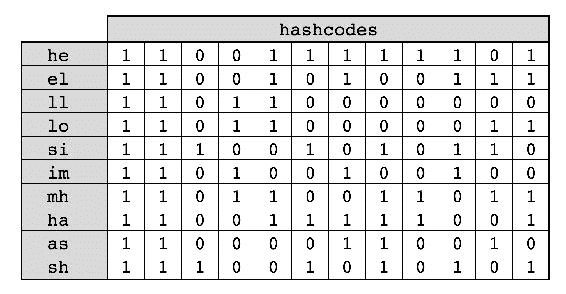

图 2：构建 hello simhash shingles

接下来报告了一个简单的 Scala 实现：

```scala
def shingles(content: String) = {
  content.replaceAll("\\s+", "")
    .sliding(2)
    .map(s => s.mkString(""))
    .map(s => (s, s.hashCode)) 
}

implicit class BitOperations(i1: Int) {
  def toHashString: String = {
    String.format(
      "%32s",
      Integer.toBinaryString(i1)
    ).replace(" ", "0")
  }
}

shingles("spark").foreach { case (shingle, hash) =>
  println("[" + shingle + "]\t" + hash.toHashString)
}

[sp]  00000000000000000000111001011101
[pa]  00000000000000000000110111110001
[ar]  00000000000000000000110000110001
[rk]  00000000000000000000111000111001
```

计算了所有这些哈希值后，我们将一个`Simhash`对象初始化为零整数。对于 32 位整数中的每个位，我们计算具有该特定位设置为 1 的哈希值的数量，并减去具有该列表中具有该特定位未设置的值的数量。这给我们提供了*图 3*中报告的数组。最后，任何大于 0 的值都将设置为 1，任何小于或等于 0 的值都将保留为 0。这里唯一棘手的部分是进行位移操作，但算法本身相当简单。请注意，我们在这里使用递归来避免使用可变变量（使用`var`）或列表。

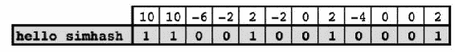

图 3：构建 hello simhash

```scala
implicit class BitOperations(i1: Int) {

  // ../.. 

  def isBitSet(bit: Int): Boolean = {
    ((i1 >> bit) & 1) == 1
  }
}

implicit class Simhash(content: String) {

  def simhash = {
    val aggHash = shingles(content).flatMap{ hash =>
      Range(0, 32).map { bit =>
        (bit, if (hash.isBitSet(bit)) 1 else -1)
      }
    }
    .groupBy(_._1)
    .mapValues(_.map(_._2).sum > 0)
    .toArray

    buildSimhash(0, aggHash)
  }

 private def buildSimhash(
      simhash: Int,
      aggBit: Array[(Int, Boolean)]
     ): Int = {

    if(aggBit.isEmpty) return simhash
    val (bit, isSet) = aggBit.head
    val newSimhash = if(isSet) {
      simhash | (1 << bit)
    } else {
      simhash
    }
    buildSimhash(newSimhash, aggBit.tail)

  }
}

val s = "mastering spark for data science"
println(toHashString(s.simhash))

00000000000000000000110000110001
```

### 汉明重量

很容易理解，两篇文章共有的单词越多，它们的 Simhash 中都会有一个相同的位*b*设置为 1。但 Simhash 的美妙之处在于聚合步骤。我们语料库中的许多其他单词（因此其他哈希）可能没有设置这个特定的位*b*，因此当观察到一些不同的哈希时，这个值也会减少。共享一组共同的单词是不够的，相似的文章还必须共享相同的词频。以下示例显示了为字符串**hello simhash**、**hello minhash**和**hello world**计算的三个 Simhash 值。

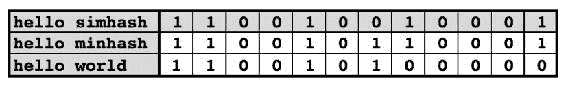

图 4：比较 hello simhash

当**hello simhash**和**hello world**之间的差异为 3 位时，**hello simhash**和**hello minhash**之间的差异只有**1**。实际上，我们可以将它们之间的距离表示为它们的异或（**XOR**）积的汉明重量。**汉明重量**是我们需要改变的位数，以将给定数字转换为零元素。因此，两个数字的**XOR**操作的汉明重量是这两个元素之间不同的位数，这种情况下是**1**。

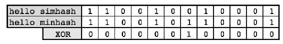

图 5：hello simhash 的汉明重量

我们简单地使用 Java 的`bitCount`函数，该函数返回指定整数值的二进制补码表示中的一位数。

```scala
implicit class BitOperations(i1: Int) {

  // ../..

  def distance(i2: Int) = {
    Integer.bitCount(i1 ^ i2) 
  }
}

val s1 = "hello simhash"
val s2 = "hello minhash"
val dist = s1.simhash.distance(s2.simhash)
```

我们已经成功构建了 Simhash 并进行了一些简单的成对比较。下一步是扩展规模并开始从 GDELT 数据库中检测实际的重复项。

## 在 GDELT 中检测近似重复项

我们在第二章中深入讨论了数据获取过程，*数据采集*。对于这个用例，我们将使用图 6 中的 NiFi 流，该流监听 GDELT 主 URL，获取并解压最新的 GKG 存档，并以压缩格式将此文件存储在 HDFS 中。

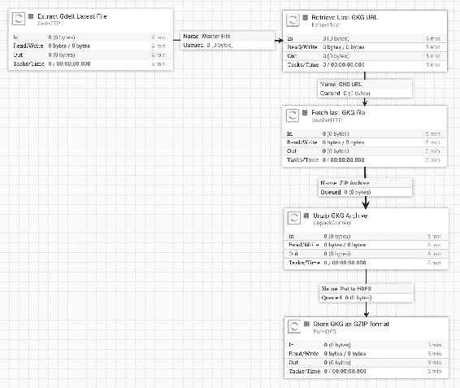

图 6：下载 GKG 数据

我们首先使用我们之前创建的一组解析器（在我们的 GitHub 存储库中可用）解析我们的 GKG 记录，提取所有不同的 URL 并使用第六章中介绍的 Goose 提取器获取 HTML 内容，*抓取基于链接的外部数据*。

```scala
val gdeltInputDir = args.head
val gkgRDD = sc.textFile(gdeltInputDir)
  .map(GKGParser.toJsonGKGV2)
  .map(GKGParser.toCaseClass2)

val urlRDD = gkgRDD.map(g => g.documentId.getOrElse("NA"))
  .filter(url => Try(new URL(url)).isSuccess)
  .distinct()
  .repartition(partitions)

val contentRDD = urlRDD mapPartitions { it =>
  val html = new HtmlFetcher()
  it map html.fetch
}
```

因为`hashcode`函数是区分大小写的（*Spark*和*spark*会产生完全不同的哈希值），强烈建议在`simhash`函数之前清理文本。与第九章中描述的类似，我们首先使用以下 Lucene 分析器来词干化单词：

```scala
<dependency>
  <groupId>org.apache.lucene</groupId>
  <artifactId>lucene-analyzers-common</artifactId>
  <version>4.10.1</version>
</dependency>
```

正如您可能早些时候注意到的，我们在一个隐式类中编写了我们的 Simhash 算法；我们可以使用以下导入语句直接在字符串上应用我们的`simhash`函数。在开发的早期阶段付出额外的努力总是值得的。

```scala
import io.gzet.story.simhash.SimhashUtils._
val simhashRDD = corpusRDD.mapValues(_.simhash)
```

现在我们有了一个内容的 RDD（`Content`是一个包装文章 URL、标题和正文的案例类），以及它的 Simhash 值和一个稍后可能使用的唯一标识符。让我们首先尝试验证我们的算法并找到我们的第一个重复项。从现在开始，我们只考虑在它们的 32 位 Simhash 值中最多有 2 位差异的文章作为重复项。

```scala
hamming match {
  case 0 => // identical articles - true-duplicate
  case 1 => // near-duplicate (mainly typo errors)
  case 2 => // near-duplicate (minor difference in style)
  case _ => // different articles
}
```

但这里出现了一个可伸缩性挑战：我们肯定不想执行笛卡尔积来比较 Simhash RDD 中的成对文章。相反，我们希望利用 MapReduce 范式（使用`groupByKey`函数）并且只对重复的文章进行分组。我们的方法遵循*扩展和征服*模式，首先扩展我们的初始数据集，利用 Spark shuffle，然后在执行器级别解决我们的问题。因为我们只需要处理 1 位差异（然后我们将对 2 位应用相同的逻辑），所以我们的策略是扩展我们的 RDD，以便对于每个 Simhash`s`，我们使用相同的 1 位掩码输出所有其他 31 个 1 位组合。

```scala
def oneBitMasks: Set[Int] = {
  (0 to 31).map(offset => 1 << offset).toSet
}

00000000000000000000000000000001
00000000000000000000000000000010
00000000000000000000000000000100
00000000000000000000000000001000
...
```

对于 Simhash 值`s`，我们使用每个前置掩码和 Simhash 值`s`之间的 XOR 输出可能的 1 位组合。

```scala
val s = 23423
oneBitMasks foreach { mask =>
  println((mask ^ s).toHashString)
}

00000000000000000101101101111111
00000000000000000101101101111110
00000000000000000101101101111101
00000000000000000101101101111011
...
```

处理 2 位并没有太大的不同，尽管在可伸缩性方面更加激进（现在有 496 种可能的组合要输出，意味着 32 位中的任意 2 位组合）。

```scala
def twoBitsMasks: Set[Int] = {
  val masks = oneBitMasks
  masks flatMap { e1 =>
    masks.filter( e2 => e1 != e2) map { e2 =>
      e1 | e2
    }
  }
}

00000000000000000000000000000011
00000000000000000000000000000101
00000000000000000000000000000110
00000000000000000000000000001001
...
```

最后，我们构建我们的掩码集以应用（请注意，我们还希望通过应用 0 位差异掩码输出原始 Simhash）以检测重复，如下所示：

```scala
val searchmasks = twoBitsMasks ++ oneBitMasks ++ Set(0) 

```

这也帮助我们相应地扩展我们最初的 RDD。这肯定是一个昂贵的操作，因为它通过一个常数因子增加了我们的 RDD 的大小（496 + 32 + 1 种可能的组合），但在时间复杂度方面保持线性，而笛卡尔积连接是一个二次操作 - *O(n²).*

```scala
val duplicateTupleRDD = simhashRDD.flatMap {
  case ((id, _), simhash) =>
    searchmasks.map { mask =>
      (simhash ^ mask, id)
    }
}
.groupByKey()
```

我们发现文章 A 是文章 B 的副本，文章 B 是文章 C 的副本。这是一个简单的图问题，可以通过使用连接组件算法轻松解决*GraphX*。

```scala
val edgeRDD = duplicateTupleRDD
  .values
  .flatMap { it =>
    val list = it.toList
    for (x <- list; y <- list) yield (x, y)
  }
  .filter { case (x, y) =>
    x != y
  }
  .distinct()
  .map {case (x, y) =>
    Edge(x, y, 0)
  }

val duplicateRDD = Graph.fromEdges(edgeRDD, 0L)
  .connectedComponents()
  .vertices
  .join(simhashRDD.keys)
  .values
```

在用于该测试的 15,000 篇文章中，我们提取了大约 3,000 个不同的故事。我们在*图 7*中报告了一个例子，其中包括我们能够检测到的两篇近似重复的文章，它们都非常相似，但并非完全相同。

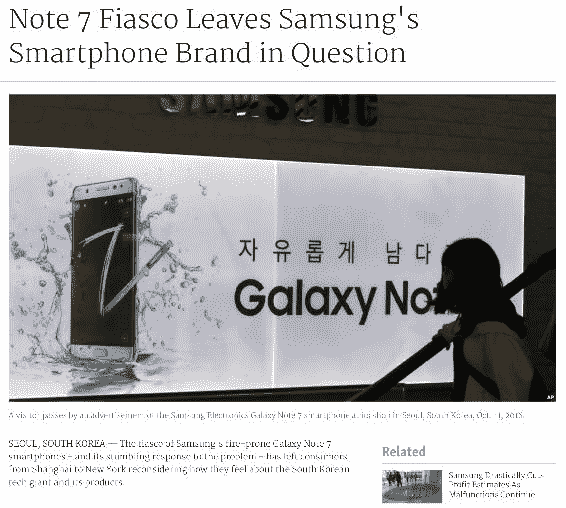

图 7：GDELT 数据库中的 Galaxy Note 7 惨败

## 对 GDELT 数据库进行索引

下一步是开始构建我们的在线 API，以便任何用户都可以像 Facebook 在用户时间线上那样实时检测近似重复的事件。我们在这里使用*Play Framework*，但我们会简要描述，因为这已经在第八章*构建推荐系统*中涵盖过。

### 持久化我们的 RDD

首先，我们需要从我们的 RDD 中提取数据并将其持久化到可靠、可扩展且高效的位置以供按键搜索。由于该数据库的主要目的是在给定特定键（键为 Simhash）的情况下检索文章，**Cassandra**（如下所示的 maven 依赖）似乎是这项工作的不错选择。

```scala
<dependency>
  <groupId>com.datastax.spark</groupId>
  <artifactId>spark-cassandra-connector_2.11</artifactId>
</dependency>
```

我们的数据模型相当简单，由一个简单的表组成：

```scala
CREATE TABLE gzet.articles (
  simhash int PRIMARY KEY,
  url text,
  title text,
  body text
);
```

将我们的 RDD 存储到 Cassandra 的最简单方法是将我们的结果包装在一个与我们之前表定义匹配的案例类对象中，并调用`saveToCassandra`函数：

```scala
import com.datastax.spark.connector._

corpusRDD.map { case (content, simhash) =>
  Article(
    simhash,
    content.body,
    content.title,
    content.url
  )
}
.saveToCassandra(cassandraKeyspace, cassandraTable)
```

### 构建 REST API

下一步是着手处理 API 本身。我们创建一个新的 maven 模块（打包为`play2`）并导入以下依赖项：

```scala
<packaging>play2</packaging>

<dependencies>
  <dependency>
    <groupId>com.typesafe.play</groupId>
    <artifactId>play_2.11</artifactId>
  </dependency>
  <dependency>
    <groupId>com.datastax.cassandra</groupId>
    <artifactId>cassandra-driver-core</artifactId>
  </dependency>
</dependencies>
```

首先，我们创建一个新的**数据访问层**，它可以根据输入的 Simhash 构建我们之前讨论过的所有可能的 1 位和 2 位掩码的列表，并从 Cassandra 中提取所有匹配的记录：

```scala
class CassandraDao() {

  private val session = Cluster.builder()
                               .addContactPoint(cassandraHost)
                               .withPort(cassandraPort)
                               .build()
                               .connect()

  def findDuplicates(hash: Int): List[Article] = {
    searchmasks.map { mask =>
      val searchHash = mask ^ hash
      val stmt = s"SELECT simhash, url, title, body FROM gzet.articles WHERE simhash = $searchHash;"
      val results = session.execute(stmt).all()
      results.map { row =>
        Article(
           row.getInt("simhash"),
           row.getString("body"),
           row.getString("title"),
           row.getString("url")
        )
      }
      .head
    }
    .toList
  }
}
```

在我们的**控制器**中，给定一个输入 URL，我们提取 HTML 内容，对文本进行标记化，构建 Simhash 值，并调用我们的服务层，最终以 JSON 格式返回我们的匹配记录。

```scala
object Simhash extends Controller {

  val dao = new CassandraDao()
  val goose = new HtmlFetcher()

  def detect = Action { implicit request =>
    val url = request.getQueryString("url").getOrElse("NA")
    val article = goose.fetch(url)
    val hash = Tokenizer.lucene(article.body).simhash
    val related = dao.findDuplicates(hash)
    Ok(
        Json.toJson(
          Duplicate(
            hash,
            article.body,
            article.title,
            url,
            related
          )
       )
    )
  }
}
```

以下`play2`路由将重定向任何 GET 请求到我们之前看到的`detect`方法：

```scala
GET /simhash io.gzet.story.web.controllers.Simhash.detect 

```

最后，我们的 API 可以如下启动并向最终用户公开：

```scala
curl -XGET 'localhost:9000/simhash?url= http://www.detroitnews.com/story/tech/2016/10/12/samsung-damage/91948802/'

{
  "simhash": 1822083259,
  "body": "Seoul, South Korea - The fiasco of Samsung's [...]
  "title": "Fiasco leaves Samsung's smartphone brand [...]",
  "url": "http://www.detroitnews.com/story/tech/2016/[...]",
  "related": [
    {
      "hash": 1821919419,
      "body": "SEOUL, South Korea - The fiasco of [...]
      "title": "Note 7 fiasco leaves Samsung's [...]",
      "url": "http://www.chron.com/business/technology/[...]"
    },
    {
      "hash": -325433157,
      "body": "The fiasco of Samsung's fire-prone [...]
      "title": "Samsung's Smartphone Brand [...]",
      "url": "http://www.toptechnews.com/[...]"
    }
  ]
}
```

恭喜！您现在已经构建了一个在线 API，可以用于检测近似重复，比如 Galaxy Note 7 惨败周围的事件；但我们的 API 与 Facebook 的 API 相比有多准确？这肯定足够准确，可以开始通过将高度相似的事件分组成故事来去噪 GDELT 数据。

### 改进领域

尽管我们已经对 API 返回的结果总体质量感到满意，但在这里我们讨论了新闻文章的一个重大改进。事实上，文章不仅由不同的词袋组成，而且遵循一个清晰的结构，其中顺序确实很重要。事实上，标题总是一个噱头，主要内容仅在前几行内完全涵盖。文章的其余部分也很重要，但可能不像介绍那样重要。鉴于这一假设，我们可以稍微修改我们的 Simhash 算法，通过为每个单词分配不同的权重来考虑顺序。

```scala
implicit class Simhash(content: String) {

  // ../..

  def weightedSimhash = {

    val features = shingles(content)
    val totalWords = features.length
    val aggHashWeight = features.zipWithIndex
      .map {case (hash, id) =>
        (hash, 1.0 - id / totalWords.toDouble)
      }
      .flatMap { case (hash, weight) =>
        Range(0, 32).map { bit =>
          (bit, if(hash.isBitSet(bit)) weight else -weight)
        }
      }
      .groupBy(_._1)
      .mapValues(_.map(_._2).sum > 0)
      .toArray

    buildSimhash(0, aggHashWeight)
  }

}
```

与其在设置相同的位值时每次添加 1 或-1，不如根据单词在文章中的位置添加相应的权重。相似的文章将共享相同的单词、相同的词频，但也具有相似的结构。换句话说，在文本的前几行发生的任何差异，我们要比在每篇文章的最后一行发生的差异更不容忍。

# 构建故事

*Simhash*应该只用于检测近似重复的文章。将我们的搜索扩展到 3 位或 4 位的差异将变得非常低效（3 位差异需要 5,488 个不同的查询到 Cassandra，而需要 41,448 个查询来检测高达 4 位的差异），并且似乎会带来比相关文章更多的噪音。如果用户想要构建更大的故事，那么必须应用典型的聚类技术。

## 构建词频向量

我们将开始使用 KMeans 算法将事件分组成故事，以文章的词频作为输入向量。TF-IDF 简单、高效，是一种构建文本内容向量的成熟技术。基本思想是计算一个词频，然后使用数据集中的逆文档频率进行归一化，从而减少常见词（如停用词）的权重，同时增加特定于文档定义的词的权重。它的实现是 MapReduce 处理的基础之一，*Wordcount*算法。我们首先计算每个文档中每个单词的词频的 RDD。

```scala
val tfRDD = documentRDD.flatMap { case (docId, body) =>
  body.split("\\s").map { word =>
    ((docId, word), 1)
  }
}
.reduceByKey(_+_)
.map { case ((docId, word), tf) =>
  (docId, (word, tf))
}
```

IDF 是文档总数除以包含字母*w*的文档数的对数值：

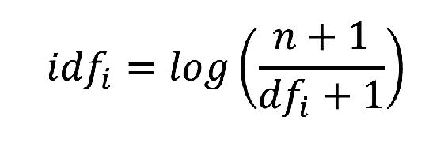

```scala
val n = sc.broadcast(documentRDD.count())
val dfMap = sc.broadcast(
  tfRDD.map { case (docId, (word, _)) =>
    (docId, word)
  }
  .distinct()
  .values
  .map { word =>
    (word, 1)
  }
  .reduceByKey(_+_)
  .collectAsMap()
)

val tfIdfRDD = tfRDD.mapValues { case (word, tf) =>
  val df = dfMap.value.get(word).get
  val idf = math.log((n.value + 1) / (df + 1))
  (word, tf * idf)
}
```

由于我们的输出向量由单词组成，我们需要为语料库中的每个单词分配一个序列 ID。我们可能有两种解决方案。要么我们建立字典并为每个单词分配一个 ID，要么使用哈希函数将不同的单词分组到相同的桶中。前者是理想的，但会导致向量长度约为一百万个特征（与我们拥有的唯一单词数量一样多的特征），而后者要小得多（与用户指定的特征数量一样多），但可能会由于哈希碰撞而导致不良影响（特征越少，碰撞越多）。

```scala
val numFeatures = 256

val vectorRDD = tfIdfRDD.mapValues { case (word, tfIdf) =>
  val rawMod = word.hashCode % numFeatures
  rawMod + (if (rawMod < 0) numFeatures else 0)
  (word.hashCode / numFeatures, tfIdf)
}
.groupByKey()
.values
.map { it =>
  Vectors.sparse(numFeatures, it.toSeq)
}
```

尽管我们详细描述了 TF-IDF 技术，但这种散列 TF 只需要几行代码就可以完成，这要归功于 MLlib 实用程序，接下来我们将看到。我们构建了一个包含 256 个大向量的 RDD，（从技术上讲）可以用于 KMeans 聚类，但由于我们刚刚解释的哈希属性，我们将受到严重的哈希碰撞的影响。

```scala
val tfModel = new HashingTF(1 << 20)
val tfRDD = documentRDD.values.map { body =>
  tfModel.transform(body.split("\\s"))
}

val idfModel = new IDF().fit(tfRDD)
val tfIdfRDD = idfModel.transform(tfRDD)
val normalizer = new Normalizer()
val sparseVectorRDD = tfIdfRDD map normalizer.transform
```

## 维度诅咒，数据科学的灾难

将我们的特征大小从 256 增加到 2²⁰将大大限制碰撞的数量，但代价是我们的数据点现在嵌入在一个高度维度的空间中。

在这里，我们描述了一种聪明的方法来克服维度诅咒（[`www.stat.ucla.edu/~sabatti/statarray/textr/node5.html`](http://www.stat.ucla.edu/~sabatti/statarray/textr/node5.html)），而不必深入研究围绕矩阵计算的模糊数学理论（如奇异值分解），也不需要进行计算密集型的操作。这种方法被称为*随机索引*，类似于之前描述的*Simhash*概念。

### 注意

有关随机索引的更多信息可以在[`eprints.sics.se/221/1/RI_intro.pdf`](http://eprints.sics.se/221/1/RI_intro.pdf)找到。

这个想法是生成每个不同特征（这里是一个单词）的稀疏、随机生成和唯一表示，由+1、-1 和主要是 0 组成。然后，每当我们在一个上下文（一个文档）中遇到一个单词时，我们将这个单词的签名添加到上下文向量中。然后，文档向量是其每个单词向量的总和，如下的*图 8*（或我们的情况下每个 TF-IDF 向量的总和）所示：

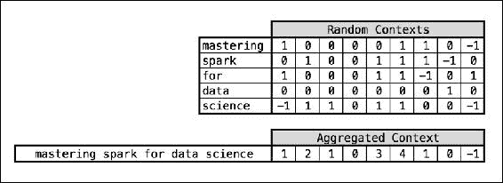

图 8：构建随机索引向量

我们邀请我们纯粹的数学极客读者深入研究*Johnson-Lindenstrauss*引理（[`ttic.uchicago.edu/~gregory/courses/LargeScaleLearning/lectures/jl.pdf`](http://ttic.uchicago.edu/~gregory/courses/LargeScaleLearning/lectures/jl.pdf)），该引理基本上陈述了*"如果我们将向量空间中的点投影到足够高维度的随机选择的子空间中，点之间的距离将被近似保留"*。尽管*Random Indexing*技术本身可以实现（需要相当大的努力），*Johnson-Lindenstrauss*引理非常有用，但要理解起来要困难得多。幸运的是，*Derrick Burns*的优秀 spark-package *generalized-kmeans-clustering*（[`github.com/derrickburns/generalized-kmeans-clustering`](https://github.com/derrickburns/generalized-kmeans-clustering)）中包含了该实现。

```scala
val embedding = Embedding(Embedding.MEDIUM_DIMENSIONAL_RI)
val denseVectorRDD = sparseVectorRDD map embedding.embed
denseVectorRDD.cache()
```

我们最终能够将我们的 2²⁰大向量投影到*仅*256 维。这项技术至少提供了巨大的好处。

+   我们有固定数量的特征。如果将来遇到不在我们初始字典中的新单词，我们的向量大小将永远不会增长。这在流式上下文中将特别有用。

+   我们的输入特征集非常大（2²⁰）。尽管仍会发生碰撞，但风险已经减轻。

+   由于*Johnson-Lindenstrauss*引理，距离得以保留。

+   我们的输出向量相对较小（256）。我们克服了维度诅咒。

由于我们将向量 RDD 缓存在内存中，现在我们可以看看 KMeans 聚类本身。

## KMeans 的优化

我们假设我们的读者已经熟悉了 KMeans 聚类，因为这个算法可能是最著名和被广泛使用的无监督聚类算法。在这里再尝试解释将不如你能在超过半个世纪的积极研究后找到的许多资源那么好。

我们先前根据文章内容（TF-IDF）创建了我们的向量。下一步是根据它们的相似性将文章分组成故事。在 Spark 实现的 KMeans 中，只支持*欧氏距离*度量。有人会认为*余弦距离*更适合文本分析，但我们假设前者足够准确，因为我们不想重新打包 MLlib 分发以进行该练习。有关在文本分析中使用余弦距离的更多解释，请参阅[`www.cse.msu.edu/~pramanik/research/papers/2003Papers/sac04.pdf`](http://www.cse.msu.edu/~pramanik/research/papers/2003Papers/sac04.pdf)。我们在以下代码中报告了可以应用于任何双精度数组（密集向量背后的逻辑数据结构）的欧氏和余弦函数：

```scala
def euclidean(xs: Array[Double], ys: Array[Double]) = {
  require(xs.length == ys.length)
  math.sqrt((xs zip ys)
    .map { case (x, y) =>
      math.pow(y - x, 2)
    }
    .sum
  )
}

def cosine(xs: Array[Double], ys: Array[Double]) = {

  require(xs.length == ys.length)
  val magX = math.sqrt(xs.map(i => i * i).sum)
  val magY = math.sqrt(ys.map(i => i * i).sum)
  val dotP = (xs zip ys).map { case (x, y) =>
    x * y
  }.sum

  dotP / (magX * magY)
}
```

使用 MLlib 包训练新的 KMeans 聚类非常简单。我们指定一个阈值为 0.01，之后我们认为我们的聚类中心已经收敛，并将最大迭代次数设置为 1,000。

```scala
val model: KMeansModel = new KMeans()
  .setEpsilon(0.01)
  .setK(numberOfClusters)
  .setMaxIterations(1000)
  .run(denseVectorRDD)
```

但在我们特定的用例中，正确的聚类数是多少？在每 15 分钟批处理中有 500 到 1,000 篇不同的文章，我们可以构建多少个故事？正确的问题是，*我们认为在 15 分钟批处理窗口内发生了多少个真实事件？*实际上，为新闻文章优化 KMeans 与任何其他用例并无不同；这是通过优化其相关成本来实现的，成本是**点到它们各自质心的平方距离的总和**（**SSE**）。

```scala
val wsse = model.computeCost(denseVectorRDD) 

```

当*k*等于文章的数量时，相关成本为 0（每篇文章都是其自己聚类的中心）。同样，当*k*等于 1 时，成本将达到最大值。因此，*k*的最佳值是在添加新的聚类不会带来任何成本增益之后的最小可能值，通常在下图中显示的 SSE 曲线的拐点处表示。

使用迄今为止收集的所有 1.5 万篇文章，这里最佳的聚类数量并不明显，但可能大约在 300 左右。

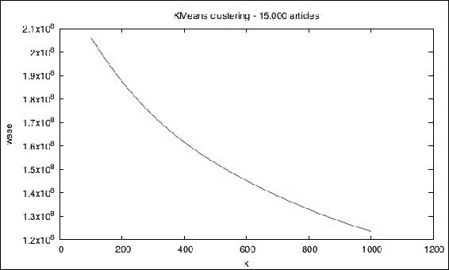

图 9：使用成本函数的拐点法

一个经验法则是将*k*作为*n*（文章数量）的函数。有超过 1.5 万篇文章，遵循这个规则将返回*k*  100。

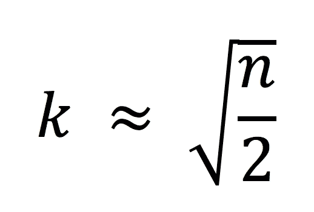

我们使用值为 100，并开始预测每个数据点的聚类。

```scala
val clusterTitleRDD = articleRDD
  .zip(denseVectorRDD)
  .map { case ((id, article), vector) =>
    (model.predict(vector), article.title)
  }
```

尽管这可能得到很大的改进，我们确认许多相似的文章被分在了同一个故事中。我们报告了一些属于同一聚类的与三星相关的文章：

+   *三星可以从泰诺、玩具和捷蓝学到什么...*

+   *华为 Mate 9 似乎是三星 Galaxy Note 7 的复制品...*

+   鉴于 Note 7 的惨败，三星可能会...*

+   *三星股价的螺旋式下跌吸引了投资者的赌注...*

+   *Note 7 惨败让三星智能手机品牌...*

+   *Note 7 惨败让三星智能手机品牌受到打击...*

+   *Note 7 惨败让三星智能手机品牌蒙上疑问的阴影...*

+   *Note 7 惨败让三星智能手机品牌蒙上疑问的阴影...*

+   *Note 7 惨败让三星智能手机品牌受到打击...*

+   *惨败让三星智能手机品牌蒙上疑问的阴影...*

可以肯定的是，这些相似的文章不符合 Simhash 查找的条件，因为它们的差异超过了 1 位或 2 位。聚类技术可以用来将相似（但不重复）的文章分成更广泛的故事。值得一提的是，优化 KMeans 是一项繁琐的任务，需要多次迭代和彻底分析。然而，在这里，这并不是范围的一部分，因为我们将专注于实时的更大的聚类和更小的数据集。

# 故事变异

现在我们有足够的材料来进入主题的核心。我们能够检测到近似重复的事件，并将相似的文章分组到一个故事中。在本节中，我们将实时工作（在 Spark Streaming 环境中），监听新闻文章，将它们分组成故事，同时也关注这些故事如何随时间变化。我们意识到故事的数量是不确定的，因为我们事先不知道未来几天可能出现什么事件。对于每个批次间隔（GDELT 中的 15 分钟），优化 KMeans 并不理想，也不高效，因此我们决定将这一约束条件不是作为限制因素，而是作为在检测突发新闻文章方面的优势。

## 平衡状态

如果我们将世界新闻文章分成 10 到 15 个类别，并固定该数量不会随时间改变，那么训练 KMeans 聚类应该能够将相似（但不一定是重复的）文章分成通用的故事。为方便起见，我们给出以下定义：

+   文章是在时间 T 涵盖特定事件的新闻文章。

+   故事是一组相似的文章，涵盖了一段时间 T 内的事件

+   主题是一组相似的故事，涵盖了一段时间内的不同事件 P

+   史诗是一组相似的故事，涵盖了一段时间内相同的事件 P

我们假设在一段时间内没有任何重大新闻事件之后，任何故事都将被分组到不同的*主题*中（每个主题涵盖一个或多个主题）。例如，任何关于政治的文章 - 无论政治事件的性质如何 - 都可以被分组到政治桶中。这就是我们所说的*平衡状态*，在这种状态下，世界被平均分成了 15 个不同而清晰的类别（战争、政治、金融、技术、教育等）。

但是，如果一个重大事件突然发生会发生什么呢？一个事件可能变得如此重要，以至于随着时间的推移（并且由于固定数量的集群），它可能会掩盖最不重要的*主题*并成为其自己的*主题*的一部分。类似于 BBC 广播限制在 30 分钟的时间窗口内，一些次要事件，比如*惠特斯特布尔的牡蛎节*，可能会被跳过，以支持一个重大的国际事件（令牡蛎的粉丝非常沮丧）。这个主题不再是通用的，而是现在与一个特定的事件相关联。我们称这个主题为一个*史诗*。例如，通用的*主题*[恐怖主义、战争和暴力]在去年 11 月成为了一个史诗[**巴黎袭击**]，当一个重大的恐怖袭击事件发生时，原本被认为是关于暴力和恐怖主义的广泛讨论变成了一个专门讨论巴黎事件的分支。

现在想象一个*史诗*不断增长；虽然关于**巴黎袭击**的第一篇文章是关于事实的，但几个小时后，整个世界都在向恐怖主义表示敬意和谴责。与此同时，法国和比利时警方进行了调查，追踪和解散恐怖主义网络。这两个故事都得到了大量报道，因此成为了同一个*史诗*的两个不同版本。这种分支的概念在下面的*图 10*中有所体现：

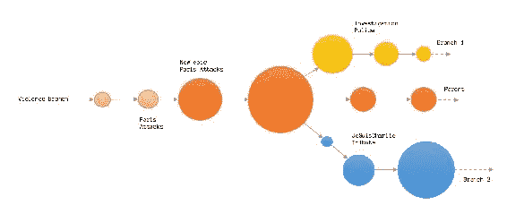

图 10：故事变异分支的概念

当然，有些史诗会比其他的持续时间更长，但当它们消失时 - 如果它们消失的话 - 它们的分支可能会被回收，以覆盖新的突发新闻（记住固定数量的集群），或者被重新用于将通用故事分组回到它们的通用主题。在某个时间点，我们最终达到了一个新的平衡状态，在这个状态下，世界再次完美地适应了 15 个不同的主题。我们假设，尽管如此，新的平衡状态可能不会是前一个的完美克隆，因为这种干扰可能已经在某种程度上雕刻和重新塑造了世界。作为一个具体的例子，我们现在仍然提到与 9/11 有关的文章；2001 年发生在纽约市的世界贸易中心袭击仍然对[暴力、战争和恐怖主义] *主题*的定义产生影响。

## 随着时间的推移跟踪故事

尽管前面的描述更多是概念性的，可能值得一篇关于应用于地缘政治的数据科学博士论文，但我们想进一步探讨这个想法，并看看流式 KMeans 如何成为这种用例的一个奇妙工具。

### 构建流应用

第一件事是实时获取我们的数据，因此修改我们现有的 NiFi 流以将我们下载的存档分叉到一个 Spark Streaming 上下文。一个简单的方法是**netcat**将文件的内容发送到一个打开的套接字，但我们希望这个过程是有弹性和容错的。NiFi 默认带有输出端口的概念，它提供了一个机制来使用*Site-To-Site*将数据传输到远程实例。在这种情况下，端口就像一个队列，希望在传输过程中不会丢失任何数据。我们通过在`nifi.properties`文件中分配一个端口号来启用这个功能。

```scala
nifi.remote.input.socket.port=8055 

```

我们在画布上创建了一个名为[`Send_To_Spark`]的端口，每条记录（因此`SplitText`处理器）都将被发送到它，就像我们在 Kafka 主题上所做的那样。

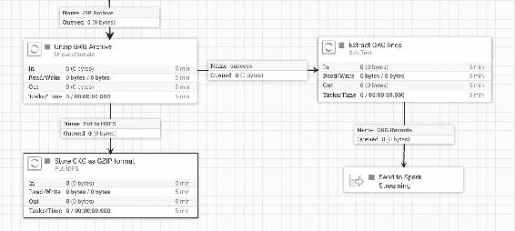

图 11：将 GKG 记录发送到 Spark Streaming

### 提示

尽管我们正在设计一个流应用程序，但建议始终在弹性数据存储（这里是 HDFS）中保留数据的不可变副本。在我们之前的 NiFi 流中，我们没有修改现有的流程，而是将其分叉，以便将记录发送到我们的 Spark Streaming。当/如果我们需要重放数据集的一部分时，这将特别有用。

在 Spark 端，我们需要构建一个 Nifi 接收器。这可以通过以下 maven 依赖项实现：

```scala
<dependency>
  <groupId>org.apache.nifi</groupId>
  <artifactId>nifi-spark-receiver</artifactId>
  <version>0.6.1</version>
</dependency>
```

我们定义 NiFi 端点以及我们之前分配的端口名称[`Send_To_Spark`]。我们的数据流将被接收为数据包流，可以使用`getContent`方法轻松转换为字符串。

```scala
def readFromNifi(ssc: StreamingContext): DStream[String] = {

  val nifiConf = new SiteToSiteClient.Builder()
    .url("http://localhost:8090/nifi")
    .portName("Send_To_Spark")
    .buildConfig()

  val receiver = new NiFiReceiver(nifiConf, StorageLevel.MEMORY_ONLY)
  ssc.receiverStream(receiver) map {packet =>
    new String(packet.getContent, StandardCharsets.UTF_8)
  }
}
```

我们启动我们的流上下文，并监听每 15 分钟到来的新 GDELT 数据。

```scala
val ssc = new StreamingContext(sc, Minutes(15)) 
val gdeltStream: DStream[String] = readFromNifi(ssc) 
val gkgStream = parseGkg(gdeltStream) 

```

下一步是为每篇文章下载 HTML 内容。这里的棘手部分是仅为不同的 URL 下载文章。由于`DStream`上没有内置的`distinct`操作，我们需要通过在其上使用`transform`操作并传递一个`extractUrlsFromRDD`函数来访问底层 RDD：

```scala
val extractUrlsFromRDD = (rdd: RDD[GkgEntity2]) => {
  rdd.map { gdelt =>
    gdelt.documentId.getOrElse("NA")
  }
  .distinct()
}
val urlStream = gkgStream.transform(extractUrlsFromRDD)
val contentStream = fetchHtml(urlStream)
```

同样，构建向量需要访问底层 RDD，因为我们需要计算整个批次的文档频率（用于 TF-IDF）。这也是在`transform`函数中完成的。

```scala
val buildVectors = (rdd: RDD[Content]) => {

  val corpusRDD = rdd.map(c => (c, Tokenizer.stem(c.body)))

  val tfModel = new HashingTF(1 << 20)
  val tfRDD = corpusRDD mapValues tfModel.transform

  val idfModel = new IDF() fit tfRDD.values
  val idfRDD = tfRDD mapValues idfModel.transform

  val normalizer = new Normalizer()
  val sparseRDD = idfRDD mapValues normalizer.transform

  val embedding = Embedding(Embedding.MEDIUM_DIMENSIONAL_RI)
  val denseRDD = sparseRDD mapValues embedding.embed

  denseRDD
}

val vectorStream = contentStream transform buildVectors
```

### 流式 K 均值

我们的用例完全适用于**流式 K 均值**算法。流式 K 均值的概念与经典的 K 均值没有区别，只是应用于动态数据，因此需要不断重新训练和更新。

在每个批处理中，我们找到每个新数据点的最近中心，对新的聚类中心进行平均，并更新我们的模型。随着我们跟踪真实的聚类并适应伪实时的变化，跟踪不同批次中相同的主题将特别容易。

流式 K 均值的第二个重要特征是遗忘性。这确保了在时间 t 接收到的新数据点将对我们的聚类定义产生更大的贡献，而不是过去历史中的任何其他点，因此允许我们的聚类中心随着时间平稳漂移（故事将变异）。这由衰减因子及其半衰期参数（以批次数或点数表示）控制，指定了给定点仅贡献其原始权重一半之后的时间。

+   使用无限衰减因子，所有历史记录都将被考虑在内，我们的聚类中心将缓慢漂移，并且如果有重大新闻事件突然发生，将不会做出反应

+   使用较小的衰减因子，我们的聚类将对任何点过于敏感，并且可能在观察到新事件时发生 drastical 变化

流式 K 均值的第三个最重要的特征是能够检测和回收垂死的聚类。当我们观察到输入数据发生 drastical 变化时，一个聚类可能会远离任何已知数据点。流式 K 均值将消除这个垂死的聚类，并将最大的聚类分成两个。这与我们的故事分支概念完全一致，其中多个故事可能共享一个共同的祖先。

我们在这里使用两个批次的半衰期参数。由于我们每 15 分钟获取新数据，任何新数据点只会保持*活跃*1 小时。训练流式 K 均值的过程如*图 12*所示：

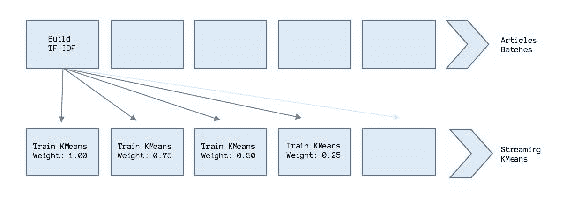

图 12：训练流式 K 均值

我们创建一个新的流式 K 均值如下。因为我们还没有观察到任何数据点，所以我们用 256 个大向量（我们的 TF-IDF 向量的大小）的 15 个随机中心进行初始化，并使用`trainOn`方法实时训练它：

```scala
val model = new StreamingKMeans()
  .setK(15)
  .setRandomCenters(256, 0.0)
  .setHalfLife(2, "batches")

model.trainOn(vectorStream.map(_._2))
```

最后，我们对任何新数据点进行聚类预测：

```scala
val storyStream = model predictOnValues vectorStream  

```

然后，我们使用以下属性将我们的结果保存到我们的 Elasticsearch 集群中（通过一系列连接操作访问）。我们不在这里报告如何将 RDD 持久化到 Elasticsearch，因为我们认为这在之前的章节中已经深入讨论过了。请注意，我们还保存向量本身，因为我们可能以后会重新使用它。

```scala
Map(
  "uuid" -> gkg.gkgId,
  "topic" -> clusterId,
  "batch" -> batchId,
  "simhash" -> content.body.simhash, 
  "date" -> gkg.date,
  "url" -> content.url,
  "title" -> content.title,
  "body" -> content.body,
  "tone" -> gkg.tones.get.averageTone,
  "country" -> gkg.v2Locations,
  "theme" -> gkg.v2Themes,
  "person" -> gkg.v2Persons,
  "organization" -> gkg.v2Organizations,
  "vector" -> v.toArray.mkString(",")
)
```

### 可视化

由于我们将文章与它们各自的故事和*主题*存储在 Elasticsearch 中，我们可以使用关键词搜索（因为文章已经完全分析和索引）或特定的人物、主题、组织等来浏览任何事件。我们在我们的故事之上构建可视化，并尝试在 Kibana 仪表板上检测它们的潜在漂移。不同的集群 ID（我们的不同*主题*）随时间的变化在 11 月 13 日（索引了 35,000 篇文章）的*图 13*中报告：

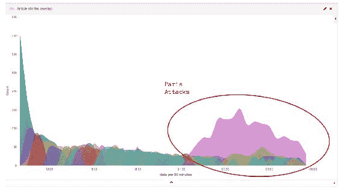

图 13：Kibana 巴黎袭击的可视化

结果相当令人鼓舞。我们能够在 11 月 13 日晚上 9:30 左右检测到**巴黎袭击**，距离第一次袭击开始只有几分钟。我们还确认了我们的聚类算法相对良好的一致性，因为一个特定的集群仅由与**巴黎袭击**相关的事件组成（5,000 篇文章），从晚上 9:30 到凌晨 3:00。

但我们可能会想知道在第一次袭击发生之前，这个特定的集群是关于什么的。由于我们将所有文章与它们的集群 ID 和它们的 GKG 属性一起索引，我们可以很容易地追踪一个故事在时间上的倒退，并检测它的变异。事实证明，这个特定的*主题*主要涵盖了与[MAN_MADE_DISASTER]主题相关的事件（等等），直到晚上 9 点到 10 点，当它转变为**巴黎袭击**的*史诗*，主题围绕着[TERROR]、[STATE_OF_EMERGENCY]、[TAX_ETHNICITY_FRENCH]、[KILL]和[EVACUATION]。

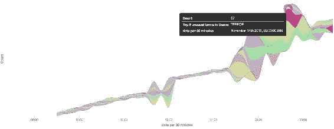

图 14：Kibana 巴黎袭击集群的流图

不用说，我们从 GDELT 得到的 15 分钟平均语调在晚上 9 点后急剧下降，针对那个特定的*主题*：

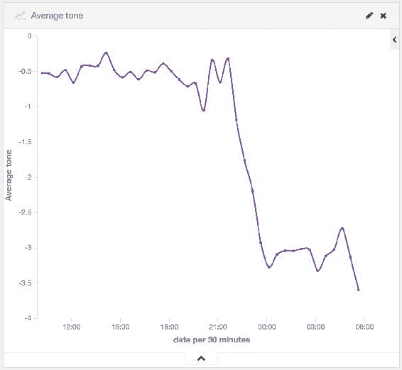

图 15：Kibana 平均语调-巴黎袭击集群

使用这三个简单的可视化，我们证明了我们可以随着时间追踪一个故事，并研究它在类型、关键词、人物或组织（基本上我们可以从 GDELT 中提取的任何实体）方面的潜在变异。但我们也可以查看 GKG 记录中的地理位置；有了足够的文章，我们可能可以在伪实时中追踪巴黎和布鲁塞尔之间的恐怖分子追捕活动！

尽管我们发现了一个特定于巴黎袭击的主要集群，并且这个特定的集群是第一个涵盖这一系列事件的集群，但这可能不是唯一的。根据之前的 Streaming KMeans 定义，这个*主题*变得如此庞大，以至于肯定触发了一个或多个随后的*史诗*。我们在下面的*图 16*中报告了与*图 13*相同的结果，但这次是过滤出与关键词*巴黎*匹配的任何文章：

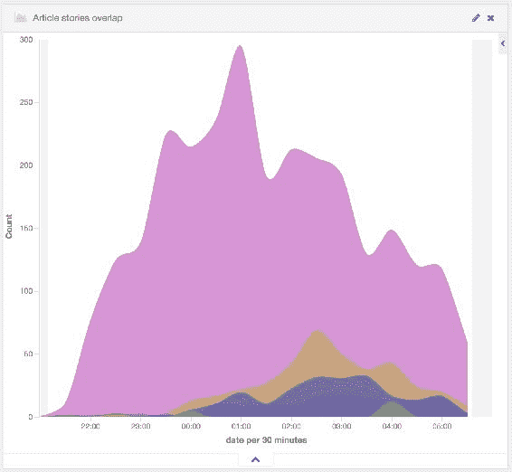

图 16：Kibana 巴黎袭击的多个史诗

似乎在午夜左右，这个*史诗*产生了同一事件的多个版本（至少三个主要版本）。在袭击后一个小时（1 小时是我们的衰减因子）后，Streaming KMeans 开始回收垂死的集群，从而在最重要的事件（我们的*巴黎袭击*集群）中创建新的分支。

虽然主要的*史诗*仍然涵盖着事件本身（事实），但第二重要的是更多关于社交网络相关文章的。简单的词频分析告诉我们，这个*史诗*是关于**#portesOuvertes**（开放的大门）和**#prayForParis**标签，巴黎人以团结回应恐怖袭击。我们还发现另一个集群更关注所有向法国致敬并谴责恐怖主义的政治家。所有这些新故事都共享*巴黎袭击* *史诗*作为共同的祖先，但涵盖了不同的风味。

## 构建故事连接

我们如何将这些分支联系在一起？我们如何随着时间跟踪一个*史诗*，并查看它何时、是否、如何或为什么会分裂？当然，可视化有所帮助，但我们正在解决一个图问题。

因为我们的 KMeans 模型在每个批次中都在不断更新，我们的方法是检索我们使用过时版本模型预测的文章，从 Elasticsearch 中提取它们，并根据我们更新的 KMeans 模型进行预测。我们的假设如下：

*如果我们观察到在时间*t*时属于故事*s*的许多文章，现在在时间*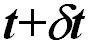*属于故事*s'*，*那么* **s** *很可能在* 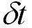 *时间内迁移到* **s'**。*

作为一个具体的例子，第一个**#prayForParis**文章肯定属于*巴黎袭击* *史诗*。几个批次后，同一篇文章属于*巴黎袭击/社交网络*集群。因此，*巴黎袭击* *史诗*可能产生了*巴黎袭击/社交网络* *史诗*。这个过程在下面的*图 17*中有所报道：

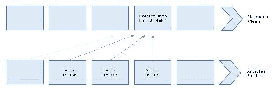

图 17：检测故事连接

我们从 Elasticsearch 中读取了一个 JSON RDD，并使用批处理 ID 应用了范围查询。在下面的例子中，我们想要访问过去一小时内构建的所有向量（最后四个批次），以及它们的原始集群 ID，并根据我们更新的模型重新预测它们（通过`latestModel`函数访问）：

```scala
import org.json4s.DefaultFormats
import org.json4s.native.JsonMethods._

val defaultVector = Array.fillDouble(0.0d).mkString(",")
val minBatchQuery = batchId - 4
val query = "{"query":{"range":{"batch":{"gte": " + minBatchQuery + ","lte": " + batchId + "}}}}"
val nodesDrift = sc.esJsonRDD(esArticles, query)
  .values
  .map { strJson =>
    implicit val format = DefaultFormats
    val json = parse(strJson)
    val vectorStr = (json \ "vector").extractOrElseString
    val vector = Vectors.dense(vectorStr.split(",").map(_.toDouble))
    val previousCluster = (json \ "topic").extractOrElseInt
    val newCluster = model.latestModel().predict(vector)
    ((previousCluster, newCluster), 1)
  }
  .reduceByKey(_ + _)
```

最后，一个简单的`reduceByKey`函数将计算过去一小时内不同边的数量。在大多数情况下，故事*s*中的文章将保持在故事*s*中，但在巴黎袭击的情况下，我们可能会观察到一些故事随着时间的推移向不同的*史诗*漂移。最重要的是，两个分支之间共享的连接越多，它们就越相似（因为它们的文章相互连接），因此它们在力导向布局中看起来越接近。同样，不共享许多连接的分支在相同的图形可视化中看起来会相距甚远。我们使用 Gephi 软件对我们的故事连接进行了力导向图表示，并在下面的*图 18*中报告。每个节点都是批次*b*上的一个故事，每条边都是我们在两个故事之间找到的连接数量。这 15 行是我们的 15 个*主题*，它们都共享一个共同的祖先（在首次启动流上下文时生成的初始集群）。

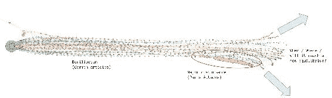

图 18：故事变异的力导向布局

我们可以做出的第一个观察是这条线形状。这一观察令人惊讶地证实了我们对平衡状态的理论，即在巴黎袭击发生之前，大部分*主题*都是孤立的并且内部连接的（因此呈现这种线形状）。事件发生之前，大部分*主题*都是孤立的并且内部连接的（因此呈现这种线形状）。事件发生后，我们看到我们的主要*巴黎袭击* *史诗*变得密集、相互连接，并随着时间的推移而漂移。由于相互连接的数量不断增加，它似乎还拖着一些分支下降。这两个相似的分支是前面提到的另外两个集群（社交网络和致敬）。随着时间的推移，这个*史诗*变得越来越具体，自然地与其他故事有所不同，因此将所有这些不同的故事推向上方，形成这种散点形状。

我们还想知道这些不同分支是关于什么的，以及我们是否能解释为什么一个故事可能分裂成两个。为此，我们将每个故事的主要文章视为离其质心最近的点。

```scala
val latest = model.latestModel()
val topTitles = rdd.values
  .map { case ((content, v, cId), gkg) =>
    val dist = euclidean(
                  latest.clusterCenters(cId).toArray,
                  v.toArray
                  )
    (cId, (content.title, dist))
  }
  .groupByKey()
  .mapValues { it =>
    Try(it.toList.sortBy(_._2).map(_._1).head).toOption
  }
  .collectAsMap()
```

在*图 19*中，我们报告了相同的图表，并附上了故事标题。虽然很难找到一个清晰的模式，但我们找到了一个有趣的案例。一个*主题*涵盖了（其他事情之间的）与*哈里王子*开玩笑有关他的发型，稍微转移到*奥巴马*就巴黎袭击发表声明，最终变成了巴黎袭击和政客们支付的致敬。这个分支并非凭空出现，而似乎遵循了一个逻辑流程：

1.  [皇室，哈里王子，笑话]

1.  [皇室，哈里王子]

1.  [哈里王子，奥巴马]

1.  [哈里王子，奥巴马，政治]

1.  [奥巴马，政治]

1.  [奥巴马，政治，巴黎]

1.  [政治，巴黎]

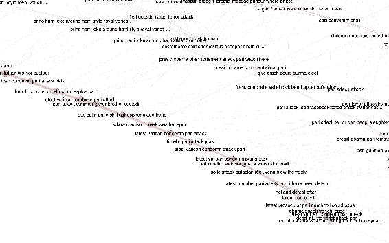

图 19：故事突变的力导向布局 - 标题

总之，似乎一条突发新闻事件作为平衡状态的突然扰动。现在我们可能会想知道这种扰动会持续多久，未来是否会达到新的平衡状态，以及由此产生的世界形状会是什么样子。最重要的是，不同的衰减因子对世界形状会产生什么影响。

如果有足够的时间和动力，我们可能会对应用物理学中的*摄动理论*（[`www.tcm.phy.cam.ac.uk/~bds10/aqp/handout_dep.pdf`](http://www.tcm.phy.cam.ac.uk/~bds10/aqp/handout_dep.pdf)）的一些概念感兴趣。我个人对在这个平衡点周围找到谐波很感兴趣。巴黎袭击事件之所以如此令人难忘，当然是因为其暴力性质，但也因为它发生在巴黎*查理周刊*袭击事件仅几个月后。

# 总结

这一章非常复杂，故事突变问题在允许交付本章的时间范围内无法轻易解决。然而，我们发现的东西真是令人惊奇，因为它引发了很多问题。我们并不想得出任何结论，所以我们在观察到巴黎袭击干扰后立即停止了我们的过程，并为我们的读者留下了这个讨论。请随意下载我们的代码库，并研究任何突发新闻及其在我们定义的平衡状态中的潜在影响。我们非常期待听到您的回音，并了解您的发现和不同的解释。

令人惊讶的是，在撰写本章之前，我们对*盖乐世 Note 7 惨败*一无所知，如果没有第一节中创建的 API，相关文章肯定会与大众无异。使用**Simhash**进行内容去重确实帮助我们更好地了解世界新闻事件。

在下一章中，我们将尝试检测与美国选举和新当选总统（*唐纳德·特朗普*）有关的异常推文。我们将涵盖*Word2Vec*算法和斯坦福 NLP 进行情感分析。
