# 第十一章：情感分析中的异常检测

当我们回顾 2016 年时，我们肯定会记得这是一个许多重大地缘政治事件的时期，从英国脱欧，即英国决定退出欧盟的投票，到许多深受喜爱的名人的不幸去世，包括歌手大卫·鲍伊的突然去世（在第六章，*抓取基于链接的外部数据*和第七章，*构建社区*中有介绍）。然而，也许今年最显著的事件是紧张的美国总统选举及其最终结果，即唐纳德·特朗普当选总统。这将是一个长久被记住的竞选活动，尤其是因为它对社交媒体的前所未有的使用，以及在其用户中激起的激情，其中大多数人通过使用标签表达了他们的感受：要么是积极的，比如*#让美国再次伟大*或*#更强大*，要么是负面的，比如*#扔掉特朗普*或*#关起来*。由于本章是关于情感分析的，选举提供了理想的用例。但是，我们不打算试图预测结果本身，而是打算使用实时 Twitter 信息流来检测美国选举期间的异常推文。我们将涵盖以下主题：

+   实时和批量获取 Twitter 数据

+   使用斯坦福 NLP 提取情感

+   在*Timely*中存储情感时间序列

+   使用*Word2Vec*从仅 140 个字符中提取特征

+   介绍图*遍历性*和*最短路径*的概念

+   训练 KMeans 模型以检测潜在的异常

+   使用*TensorFlow*的*嵌入式投影仪*可视化模型

# 在 Twitter 上关注美国选举

2016 年 11 月 8 日，美国公民成千上万地前往投票站，为下一任美国总统投票。计票几乎立即开始，尽管直到稍后才正式确认，但预测的结果在第二天早上就已经众所周知。让我们从主要事件发生的几天前开始调查，即 2016 年 11 月 6 日，这样我们就可以在选举前保留一些背景信息。尽管我们事先不知道会发现什么，但我们知道*Twitter*将在政治评论中发挥超大作用，因为它在选举前的影响力很大，所以尽快开始收集数据是有意义的。事实上，数据科学家有时可能会有这种*直觉* - 一种奇怪而令人兴奋的想法，促使我们开始做某事，没有明确的计划或绝对的理由，只是觉得会有回报。实际上，这种方法可能至关重要，因为在制定和实现这样的计划所需的正常时间和事件的瞬息万变之间，可能会发生重大新闻事件（参见第十章，*故事去重和变异*），可能会发布新产品，或者股票市场可能会有不同的趋势（参见第十二章，*趋势演算*）；到那时，原始数据集可能已不再可用。

## 在流中获取数据

第一步是开始获取 Twitter 数据。由于我们计划下载超过 48 小时的推文，因此代码应该足够健壮，不会在过程中的某个地方失败；没有什么比在经过多小时的密集处理后发生致命的`NullPointerException`更令人沮丧的了。我们知道在未来某个时候我们将进行情感分析，但现在我们不希望用大型依赖项过度复杂化我们的代码，因为这可能会降低稳定性并导致更多未经检查的异常。相反，我们将开始收集和存储数据，随后的处理将在收集的数据上离线进行，而不是将此逻辑应用于实时流。

我们创建一个新的流上下文，使用第九章中创建的实用方法从 Twitter 1%的数据流中读取，新闻词典和实时标记系统。我们还使用优秀的 GSON 库将 Java 类`Status`（嵌入 Twitter4J 记录的 Java 类）序列化为 JSON 对象。

```scala
<dependency> 
  <groupId>com.google.code.gson</groupId>
  <artifactId>gson</artifactId>
  <version>2.3.1</version>
</dependency>
```

我们每 5 分钟读取一次 Twitter 数据，并可以选择作为命令行参数提供 Twitter 过滤器。过滤器可以是关键词，如***Trump***，***Clinton***或***#MAGA***，***#StrongerTogether***。然而，我们必须记住，通过这样做，我们可能无法捕获所有相关的推文，因为我们可能永远无法完全跟上最新的标签趋势（如***#DumpTrump***，***#DrainTheSwamp***，***#LockHerUp***或***#LoveTrumpsHate***），并且许多推文将被忽视，因为过滤器不足，因此我们将使用一个空的过滤器列表来确保我们捕捉到一切。

```scala
val sparkConf  = new SparkConf().setAppName("Twitter Extractor")
val sc = new SparkContext(sparkConf)
val ssc = new StreamingContext(sc, Minutes(5))

val filter = args

val twitterStream = createTwitterStream(ssc, filter)
  .mapPartitions { it =>
     val gson = new GsonBuilder().create()
     it.map { s: Status =>
       Try(gson.toJson(s)).toOption
     }
  }
```

我们使用 GSON 库对我们的`Status`类进行序列化，并将我们的 JSON 对象持久化在 HDFS 中。请注意，序列化发生在`Try`子句中，以确保不会抛出不需要的异常。相反，我们将 JSON 作为可选的`String`返回：

```scala
twitterStream
  .filter(_.isSuccess)
  .map(_.get)
  .saveAsTextFiles("/path/to/twitter")
```

最后，我们运行我们的 Spark 流上下文，并保持其活动状态，直到新总统当选，无论发生什么！

```scala
ssc.start()
ssc.awaitTermination()
```

## 批量获取数据

只有 1%的推文通过 Spark 流 API 检索，意味着 99%的记录将被丢弃。虽然能够下载大约 1000 万条推文，但这次我们可以潜在地下载更多的数据，但这次只针对选定的标签和在短时间内。例如，我们可以下载所有与***#LockHerUp***或***#BuildTheWall***标签相关的推文。

### 搜索 API

为此，我们通过`twitter4j` Java API 消耗 Twitter 历史数据。这个库作为`spark-streaming-twitter_2.11`的传递依赖项。要在 Spark 项目之外使用它，应该使用以下 maven 依赖项：

```scala
<dependency>
  <groupId>org.twitter4j</groupId>
  <artifactId>twitter4j-core</artifactId>
  <version>4.0.4</version>
</dependency>
```

我们创建一个 Twitter4J 客户端，如下所示：

```scala
ConfigurationBuilder builder = new ConfigurationBuilder();
builder.setOAuthConsumerKey(apiKey);
builder.setOAuthConsumerSecret(apiSecret);
Configuration configuration = builder.build();

AccessToken token = new AccessToken(
  accessToken,
  accessTokenSecret
);

Twitter twitter =
  new TwitterFactory(configuration)
      .getInstance(token);
```

然后，我们通过`Query`对象消耗`/search/tweets`服务：

```scala
Query q = new Query(filter);
q.setSince(fromDate);
q.setUntil(toDate);
q.setCount(400);

QueryResult r = twitter.search(q);
List<Status> tweets = r.getTweets();
```

最后，我们得到了一个`Status`对象的列表，可以很容易地使用之前介绍的 GSON 库进行序列化。

### 速率限制

Twitter 是数据科学的一个很棒的资源，但它远非一个非营利组织，因此他们知道如何评估和定价数据。在没有任何特殊协议的情况下，搜索 API 限制为几天的回顾，每 15 分钟窗口最多 180 次查询和每次查询最多 450 条记录。可以在 Twitter DEV 网站（[`dev.twitter.com/rest/public/rate-limits`](https://dev.twitter.com/rest/public/rate-limits)）和 API 本身使用`RateLimitStatus`类来确认这一限制：

```scala
Map<String, RateLimitStatus> rls = twitter.getRateLimitStatus("search");
System.out.println(rls.get("/search/tweets"));

/*
RateLimitStatusJSONImpl{remaining=179, limit=180, resetTimeInSeconds=1482102697, secondsUntilReset=873}
*/
```

毫不奇怪，任何关于热门词汇的查询，比如 2016 年 11 月 9 日的***#MAGA***，都会达到这个阈值。为了避免速率限制异常，我们必须通过跟踪处理的推文 ID 的最大数量，并在每次搜索请求后监视我们的状态限制来分页和限制我们的下载请求。

```scala
RateLimitStatus strl = rls.get("/search/tweets");
int totalTweets = 0;
long maxID = -1;
for (int i = 0; i < 400; i++) {

  // throttling
  if (strl.getRemaining() == 0)
    Thread.sleep(strl.getSecondsUntilReset() * 1000L);

  Query q = new Query(filter);
  q.setSince(fromDate);
  q.setUntil(toDate);
  q.setCount(100);

  // paging
  if (maxID != -1) q.setMaxId(maxID - 1);

  QueryResult r = twitter.search(q);
  for (Status s: r.getTweets()) {
    totalTweets++;
    if (maxID == -1 || s.getId() < maxID)
     maxID = s.getId();
     writer.println(gson.toJson(s));
  }
  strl = r.getRateLimitStatus();
}
```

每天大约有 50 亿条推文，如果收集所有与美国相关的数据，这将是乐观的，如果不是天真的。相反，应该使用前面详细介绍的简单摄取过程来拦截与特定查询匹配的推文。作为装配 jar 中的主类，可以按照以下方式执行：

```scala
java -Dtwitter.properties=twitter.properties /
  -jar trump-1.0.jar #maga 2016-11-08 2016-11-09 /
  /path/to/twitter-maga.json
```

在这里，`twitter.properties`文件包含您的 Twitter API 密钥：

```scala
twitter.token = XXXXXXXXXXXXXX
twitter.token.secret = XXXXXXXXXXXXXX
twitter.api.key = XXXXXXXXXXXXXX
twitter.api.secret = XXXXXXXXXXXXXX
```

# 分析情感

经过 4 天的密集处理，我们提取了大约 1000 万条推文；大约 30GB 的 JSON 数据。

## 整理 Twitter 数据

Twitter 变得如此受欢迎的一个关键原因是任何消息都必须适应最多 140 个字符。缺点也是每条消息都必须适应最多 140 个字符！因此，结果是缩写词、首字母缩略词、俚语、表情符号和标签的使用大幅增加。在这种情况下，主要情感可能不再来自文本本身，而是来自使用的表情符号（[`dl.acm.org/citation.cfm?id=1628969`](http://dl.acm.org/citation.cfm?id=1628969)），尽管一些研究表明表情符号有时可能导致情感预测不准确（[`arxiv.org/pdf/1511.02556.pdf`](https://arxiv.org/pdf/1511.02556.pdf)）。表情符号甚至比表情符号更广泛，因为它们包括动物、交通工具、商业图标等图片。此外，虽然表情符号可以通过简单的正则表达式轻松检索，但表情符号通常以 Unicode 编码，并且没有专用库更难提取。

```scala
<dependency>
  <groupId>com.kcthota</groupId>
  <artifactId>emoji4j</artifactId>
  <version>5.0</version>
</dependency>
```

`Emoji4J`库易于使用（尽管计算成本高昂），并且给定一些带有表情符号/表情符号的文本，我们可以`编码`- 用实际代码名称替换 Unicode 值 - 或`清理`- 简单地删除任何表情符号。

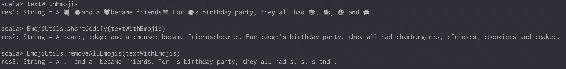

图 1：表情符号解析

因此，首先让我们清理文本中的任何垃圾（特殊字符、表情符号、重音符号、URL 等），以便访问纯英文内容：

```scala
import emoji4j.EmojiUtils

def clean = {
  var text = tweet.toLowerCase()
  text = text.replaceAll("https?:\\/\\/\\S+", "")
  text = StringUtils.stripAccents(text)
  EmojiUtils.removeAllEmojis(text)
    .trim
    .toLowerCase()
    .replaceAll("rt\\s+", "")
    .replaceAll("@[\\w\\d-_]+", "")
    .replaceAll("[^\\w#\\[\\]:'\\.!\\?,]+", " ")
    .replaceAll("\\s+([:'\\.!\\?,])\\1", "$1")
    .replaceAll("[\\s\\t]+", " ")
    .replaceAll("[\\r\\n]+", ". ")
    .replaceAll("(\\w)\\1{2,}", "$1$1") // avoid looooool 
    .replaceAll("#\\W", "")
    .replaceAll("[#':,;\\.]$", "")
    .trim
}
```

让我们也对所有表情符号和表情进行编码和提取，并将它们作为列表放在一边：

```scala
val eR = "(:\\w+:)".r

def emojis = {
  var text = tweet.toLowerCase()
  text = text.replaceAll("https?:\\/\\/\\S+", "")
  eR.findAllMatchIn(EmojiUtils.shortCodify(text))
    .map(_.group(1))
    .filter { emoji =>
      EmojiUtils.isEmoji(emoji)
    }.map(_.replaceAll("\\W", ""))
    .toArray
}
```

将这些方法写在*implicit class*中意味着它们可以通过简单的导入语句直接应用于字符串。

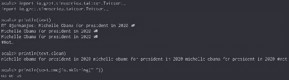

图 2：Twitter 解析

## 使用斯坦福 NLP

我们的下一步是通过*情感注释器*传递我们清理过的文本。我们使用斯坦福 NLP 库来实现这一目的：

```scala
<dependency>
  <groupId>edu.stanford.nlp</groupId>
  <artifactId>stanford-corenlp</artifactId>
  <version>3.5.0</version>
  <classifier>models</classifier>
</dependency>

<dependency>
  <groupId>edu.stanford.nlp</groupId>
  <artifactId>stanford-corenlp</artifactId>
  <version>3.5.0</version>
</dependency>
```

我们创建一个斯坦福`注释器`，将内容标记为句子(`tokenize`)，分割句子(`ssplit`)，标记元素(`pos`)，并在分析整体情感之前对每个词进行词形还原(`lemma`)：

```scala
def getAnnotator: StanfordCoreNLP = {
  val p = new Properties()
  p.setProperty(
    "annotators",
    "tokenize, ssplit, pos, lemma, parse, sentiment"
  )
  new StanfordCoreNLP(pipelineProps)
}

def lemmatize(text: String,
              annotator: StanfordCoreNLP = getAnnotator) = {

  val annotation = annotator.process(text.clean)
  val sentences = annotation.get(classOf[SentencesAnnotation])
    sentences.flatMap { sentence =>
    sentence.get(classOf[TokensAnnotation])
  .map { token =>
    token.get(classOf[LemmaAnnotation])
  }
  .mkString(" ")
}

val text = "If you're bashing Trump and his voters and calling them a variety of hateful names, aren't you doing exactly what you accuse them?"

println(lemmatize(text))

/*
if you be bash trump and he voter and call they a variety of hateful name, be not you do exactly what you accuse they
*/
```

任何单词都被其最基本形式替换，即*you're*被替换为*you be*，*aren't you doing*被替换为*be not you do*。

```scala
def sentiment(coreMap: CoreMap) = {

 coreMap.get(classOf[SentimentCoreAnnotations.ClassName].match {
     case "Very negative" => 0
     case "Negative" => 1
     case "Neutral" => 2
     case "Positive" => 3
     case "Very positive" => 4
     case _ =>
       throw new IllegalArgumentException(
         s"Could not get sentiment for [${coreMap.toString}]"
       )
  }
}

def extractSentiment(text: String,
                     annotator: StanfordCoreNLP = getSentimentAnnotator) = {

  val annotation = annotator.process(text)
  val sentences = annotation.get(classOf[SentencesAnnotation])
  val totalScore = sentences map sentiment

  if (sentences.nonEmpty) {
    totalScore.sum / sentences.size()
  } else {
    2.0f
  }

}

extractSentiment("God bless America. Thank you Donald Trump!")
 // 2.5

extractSentiment("This is the most horrible day ever")
 // 1.0
```

情感范围从*非常消极*（0.0）到*非常积极*（4.0），并且每个句子的情感平均值。由于我们每条推文不会超过 1 或 2 个句子，我们预计方差非常小；大多数推文应该是*中性*（大约 2.0），只有极端情感会得分（低于~1.5 或高于~2.5）。

## 构建管道

对于我们的每条 Twitter 记录（存储为 JSON 对象），我们要做以下事情：

+   使用`json4s`库解析 JSON 对象

+   提取日期

+   提取文本

+   提取位置并将其映射到美国州

+   清理文本

+   提取表情符号

+   对文本进行词形还原

+   分析情感

然后，我们将所有这些值封装到以下`Tweet`案例类中：

```scala
case class Tweet(
            date: Long,
            body: String,
            sentiment: Float,
            state: Option[String],
            geoHash: Option[String],
            emojis: Array[String]
         )
```

如前几章所述，为我们数据集中的每条记录创建一个新的 NLP 实例并不可行。相反，我们每个`迭代器`（即每个分区）只创建一个`注释器`：

```scala
val analyzeJson = (it: Iterator[String]) => {

  implicit val format = DefaultFormats
  val annotator = getAnnotator
  val sdf = new SimpleDateFormat("MMM d, yyyy hh:mm:ss a")

  it.map { tweet =>

    val json = parse(tweet)
    val dateStr = (json \ "createdAt").extract[String]
    val date = Try(
      sdf.parse(dateStr).getTime
    )
     .getOrElse(0L)

    val text = (json \ "text").extract[String] 
    val location = Try(
      (json \ "user" \ "location").extract[String]
    )
     .getOrElse("")
     .toLowerCase()

     val state = Try {
       location.split("\\s")
        .map(_.toUpperCase())
        .filter { s =>
          states.contains(s)
        }
        .head
     }
     .toOption

    val cleaned = text.clean

    Tweet(
     date,
     cleaned.lemmatize(annotator),
     cleaned.sentiment(annotator),
     state, 
     text.emojis
    )
  }
}

val tweetJsonRDD = sc.textFile("/path/to/twitter")
val tweetRDD = twitterJsonRDD mapPartitions analyzeJson
tweetRDD.toDF().show(5)

/*
+-------------+---------------+---------+--------+----------+
|         date|           body|sentiment|   state|    emojis|
+-------------+---------------+---------+--------+----------+
|1478557859000|happy halloween|      2.0|    None [ghost]   |            
|1478557860000|slave to the gr|      2.5|    None|[]      |                 
|1478557862000|why be he so pe|      3.0|Some(MD)|[]        |
|1478557862000|marcador sentim|      2.0|    None|[]        |
|1478557868000|you mindset tow|      2.0|    None|[sparkles]|
+-------------+---------------+---------+--------+----------+
*/
```

# 使用 Timely 作为时间序列数据库

现在我们能够将原始信息转换为一系列干净的 Twitter 情感，其中包括标签、表情符号或美国州等参数，这样的时间序列应该能够可靠地存储，并且可以快速查询。

在 Hadoop 生态系统中，*OpenTSDB*（[`opentsdb.net/`](http://opentsdb.net/)）是存储数百万时间点数据的默认数据库。然而，我们将介绍一个您可能以前没有接触过的数据库，名为*Timely*（[`nationalsecurityagency.github.io/timely/`](https://nationalsecurityagency.github.io/timely/)）。Timely 是最近由**国家安全局**（**NSA**）开源的项目，作为 OpenTSDB 的克隆，它使用 Accumulo 而不是 HBase 作为其底层存储。正如您可能记得的那样，Accumulo 支持单元级安全，我们稍后将看到这一点。

## 存储数据

每条记录由一个指标名称（例如，标签），时间戳，指标值（例如，情感），一组相关标签（例如，州），以及一个单元可见性组成：

```scala
case class Metric(name: String,
                 time: Long,
                 value: Double,
                 tags: Map[String, String],
                 viz: Option[String] = None
                 )
```

在这个练习中，我们将筛选出只提到特朗普或克林顿的推文数据：

```scala
def expandedTweets = rdd.flatMap { tweet =>
  List("trump", "clinton") filter { f =>
    tweet.body.contains(f)
  } map { tag =>
    (tag, tweet)
  }
}
```

接下来，我们将构建一个名为`io.gzet.state.clinton`和`io.gzet.state.trump`的`Metric`对象，并附带一个可见性。在这个练习中，我们假设没有`SECRET`权限的初级分析师将不被授予访问高度负面的推文。这使我们能够展示 Accumulo 出色的单元级安全性：

```scala
def buildViz(tone: Float) = {
  if (tone <= 1.5f) Some("SECRET") else None: Option[String]
}
```

此外，我们还需要处理*重复记录*。如果在完全相同的时间收到多条推文（可能情感不同），它们将覆盖 Accumulo 上的现有单元：

```scala
def sentimentByState = {
  expandedTweets.map { case (tag, tweet) =>
    ((tag, tweet.date, tweet.state), tweet.sentiment)
  }
  .groupByKey()
  .mapValues { f =>
    f.sum / f.size
  }
  .map { case ((tag, date, state), sentiment) =>
    val viz = buildViz(sentiment)
    val meta = Map("state" -> state) 
    Metric("io.gzet.state.$tag", date, sentiment, meta, viz)
  }
}
```

我们可以通过`POST`请求插入数据，也可以通过打开的套接字将数据传送回 Timely 服务器：

```scala
def toPut = {

  val vizMap = if(viz.isDefined) {
    List("viz" -> viz.get)
  } else {
    List[(String, String)]()
  }

  val strTags = vizMap
    .union(tags.toList)
    .map { case (k, v) => s"$k=$v" }
    .mkString(" ")

  s"put $name $time $value $strTags"
}

implicit class Metrics(rdd: RDD[Metric]) {

  def publish = {

    rdd.foreachPartition { it: Iterator[Metric] =>

      val sock = new Socket(timelyHost, timelyPort)
      val writer = new PrintStream(
        sock.getOutputStream,
        true,
        StandardCharsets.UTF_8.name
      )

      it.foreach { metric =>
        writer.println(metric.toPut)
      }
      writer.flush()
    }

  }
}

tweetRDD.sentimentByState.publish
```

我们的数据现在安全地存储在 Accumulo 中，并且任何具有正确访问权限的人都可以使用。

我们已经创建了一系列的输入格式，以便将 Timely 数据检索回 Spark 作业中。这里不会涉及，但可以在我们的 GitHub 存储库中找到：

```scala
// Read  metrics from Timely
val conf = AccumuloConfig(
            "GZET",
            "alice",
            "alice",
            "localhost:2181"
            )

val metricsRDD = sc.timely(conf, Some("io.gzet.state.*"))
```

### 提示

在撰写本文时，Timely 仍在积极开发中，因此尚无法从 Spark/MapReduce 中使用干净的输入/输出格式。发送数据的唯一方式是通过 HTTP 或 Telnet。

## 使用 Grafana 来可视化情感

Timely 本身并不具备可视化工具。但是，它与*Grafana*（[`grafana.net/`](https://grafana.net/)）集成良好且安全，使用 timely-grafana 插件。更多信息可以在 Timely 网站上找到。

### 处理的推文数量

作为第一个简单的可视化，我们显示了 2016 年 11 月 8 日和 9 日（协调世界时）两位候选人的推文数量：

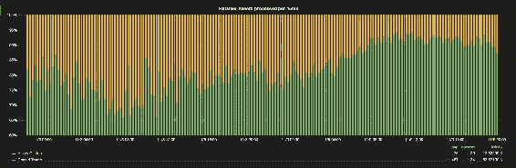

图 3：Timely 处理的推文

随着选举结果的公布，我们观察到与特朗普有关的推文越来越多。平均而言，我们观察到与克林顿相关的推文约为特朗普相关推文的 6 倍。

### 还我推特账号

情感的快速研究显示，情感相对较消极（平均为 1.3），两位候选人的推文没有显著差异，这不会帮助预测美国大选的结果。

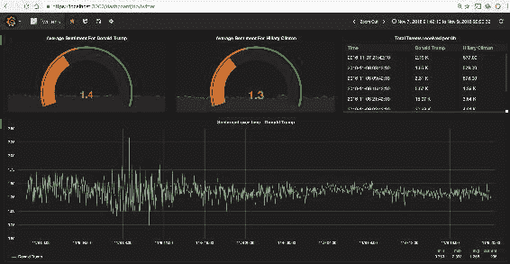

图 4：Timely 时间序列

然而，仔细观察后，我们发现了一个真正有趣的现象。2016 年 11 月 8 日，格林尼治标准时间下午 1 点左右（东部标准时间上午 8 点，也就是纽约第一个投票站开放的时间），我们观察到*情感方差*出现了大幅下降。在前面的图中可以看到这种奇怪的现象，这不能完全解释。我们可以推测，要么第一张正式投票标志着动荡的总统竞选活动的结束，并且是选举后回顾期的开始 - 也许是一个比以前更加基于事实的对话 - 或者特朗普的顾问们真的把他的 Twitter 账号收走是他们最伟大的主意。

现在我们举一个 Accumulo 安全性的多功能性的例子，通过以另一个用户登录 Grafana，这次没有授予`SECRET`授权。正如预期的那样，在接下来的图像中，情感看起来积极得多（因为极端负面情感被隐藏了），从而确认了 Timely 上的可见性设置；Accumulo 的优雅自然显而易见：

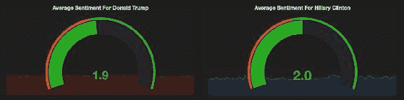

图 5：非秘密的及时时间序列

如何创建 Accumulo 用户的示例可以在第七章*建立社区*中找到。

### 识别摇摆州

我们将从 Timely 和 Grafana 中利用的最后一个有趣特性是树状图聚合。由于所有美国州的名称都存储为度量属性的一部分，我们将为两位候选人创建一个简单的树状图。每个框的大小对应观察次数，颜色与观察到的情感相关：

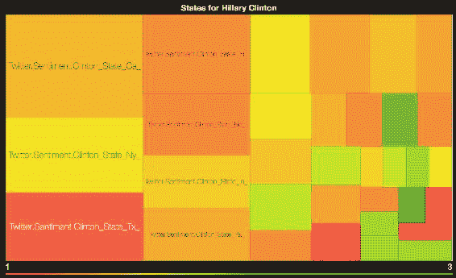

图 6：及时-希拉里·克林顿的美国州树状图

当我们之前使用 2 天情感平均值时，我们无法区分共和党和民主党州，因为情感在统计上是平坦的，而且相对糟糕（平均为 1.3）。然而，如果我们只考虑选举前一天，那么它似乎更有趣，因为我们观察到情感数据中有更多的变化。在前面的图像中，我们看到佛罗里达州、北卡罗来纳州和宾夕法尼亚州-12 个摇摆州中的 3 个-对希拉里·克林顿的情感表现出意外的糟糕。这种模式是否可能是选举结果的早期指标？

# Twitter 和戈德温点

通过适当清理我们的文本内容，我们可以使用*Word2Vec*算法并尝试理解单词在其实际*上下文*中的含义。

## 学习上下文

正如它所说的，*Word2Vec*算法将一个单词转换为一个向量。其想法是相似的单词将嵌入到相似的向量空间中，并且因此在上下文中看起来彼此接近。

### 注意

有关`Word2Vec`算法的更多信息可以在[`papers.nips.cc/paper/5021-distributed-representations-of-words-and-phrases-and-their-compositionality.pdf`](https://papers.nips.cc/paper/5021-distributed-representations-of-words-and-phrases-and-their-compositionality.pdf)找到。

很好地集成到 Spark 中，可以通过以下方式训练*Word2Vec*模型：

```scala
import org.apache.spark.mllib.feature.Word2Vec

val corpusRDD = tweetRDD
   .map(_.body.split("\\s").toSeq)
   .filter(_.distinct.length >= 4)

val model = new Word2Vec().fit(corpusRDD)
```

在这里，我们将每条推文提取为一个单词序列，只保留至少有`4`个不同单词的记录。请注意，所有单词的列表需要适应内存，因为它被收集回驱动程序作为单词和向量的映射（作为浮点数组）。向量大小和学习率可以通过`setVectorSize`和`setLearningRate`方法进行调整。

接下来，我们使用 Zeppelin 笔记本与我们的模型进行交互，发送不同的单词并要求模型获取最接近的同义词。结果相当令人印象深刻：

```scala
model.findSynonyms("#lockherup", 10).foreach(println)

/*
(#hillaryforprison,2.3266071900089313)
(#neverhillary,2.2890002973310066)
(#draintheswamp,2.2440446323298175)
(#trumppencelandslide,2.2392471034643604)
(#womenfortrump,2.2331140131326874)
(#trumpwinsbecause,2.2182999853485454)
(#imwithhim,2.1950198833564563)
(#deplorable,2.1570936207197016)
(#trumpsarmy,2.155859656266577)
(#rednationrising,2.146132149205829)
*/  
```

虽然标签通常在标准 NLP 中被忽略，但它们对语气和情感有很大的贡献。标记为中性的推文实际上可能比听起来更糟，因为使用*#HillaryForPrison*或***#LockHerUp***等标签。因此，让我们尝试使用一个有趣的特征，称为*word-vector association*来考虑这一点。原始*Word2Vec*算法给出的这种关联的一个常见例子如下所示：

```scala
[KING] is at [MAN] what [QUEEN] is at [?????] 

```

这可以翻译为以下向量：

```scala
VKING - VQUEEN = VMAN - V???? 
V???? = VMAN - VKING + VQUEEN 

```

因此，最近的点应该是`[WOMEN]`。从技术上讲，这可以翻译如下：

```scala
import org.apache.spark.mllib.linalg.Vectors

def association(word1: String, word2: String, word3: String) = {

  val isTo = model
    .getVectors
    .get(word2)
    .get
    .zip(model.getVectors.get(word1).get)
    .map(t => t._1 - t._2)

 val what = model
   .getVectors
   .get(word3)
   .get

 val vec = isTo
   .zip(what)
   .map(t => t._1 + t._2)
   .map(_.toDouble)

 Vectors.dense(vec)

}

val assoc = association("trump", "republican", "clinton")

model.findSynonyms(assoc, 1)
     .foreach(println)

*// (democrat,1.6838367309269164)* 

```

保存/检索这个模型可以通过以下方式完成：

```scala
model.save(sc, "/path/to/word2vec")

val retrieved = Word2VecModel.load(sc, "/path/to/word2vec")
```

## 可视化我们的模型

由于我们的向量有 100 个维度，使用传统方法在图中表示它们很困难。但是，您可能已经了解到*Tensor Flow*项目及其最近开源的*Embedding Projector*（[`projector.tensorflow.org/`](http://projector.tensorflow.org/)）。由于其快速渲染高维数据的能力，该项目提供了一种很好的可视化我们模型的方式。它也很容易使用-我们只需将我们的向量导出为制表符分隔的数据点，加载到 Web 浏览器中，就可以了！

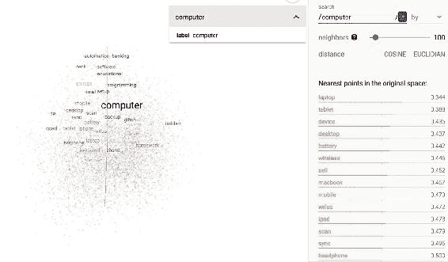

图 7：嵌入项目，计算机的邻居

*嵌入投影仪*将高维向量投影到 3D 空间，其中每个维度代表前三个**主要成分**（**PCA**）之一。我们还可以构建自己的投影，基本上将我们的向量朝着四个特定方向拉伸。在下面的表示中，我们将我们的向量向左、向右、向上和向下拉伸到[`特朗普`]、[`克林顿`]、[`爱`]和[`恨`]：

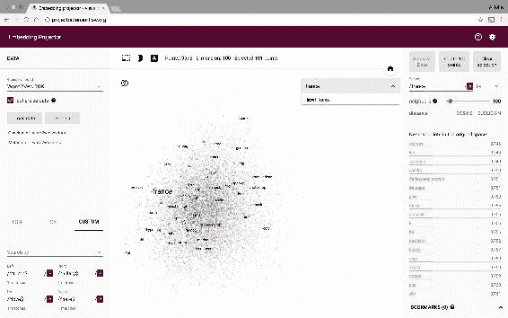

图 8：嵌入项目，自定义投影

现在我们有了一个大大简化的向量空间，我们可以更容易地理解每个单词以及它与邻居的关系（`民主党`与`共和党`，`爱`与`恨`）。例如，明年法国大选即将到来，我们看到法国与特朗普的距离比与克林顿的距离更近。这可能被视为即将到来的选举的早期指标吗？

## Word2Graph 和 Godwin 点

在您使用 Twitter 的*Word2Vec*模型很长时间之前，您可能已经遇到了敏感术语和对第二次世界大战的引用。事实上，这是迈克·戈德温在 1990 年最初提出的戈德温定律([`www.wired.com/1994/10/godwin-if-2/`](https://www.wired.com/1994/10/godwin-if-2/))，其规定如下：

> *随着在线讨论的延长，涉及纳粹或希特勒的比较的概率接近 1*

截至 2012 年，它甚至是牛津英语词典的一部分。

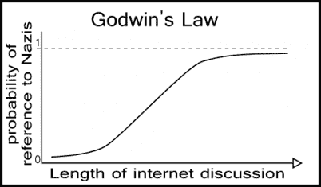

图 9：戈德温定律

### 构建 Word2Graph

尽管戈德温定律更多是修辞手法而不是实际的数学定律，但它仍然是一个引人入胜的异常现象，并且似乎与美国大选相关。自然地，我们决定使用图论进一步探索这个想法。第一步是将我们的模型广播回执行器并将我们的单词列表并行化。对于每个单词，我们输出前五个同义词，并构建一个带有单词相似度作为边权重的`Edge`对象。让我们来看一下：

```scala
val bModel = sc.broadcast(model)
val bDictionary = sc.broadcast(
  model.getVectors
    .keys
    .toList
    .zipWithIndex
    .map(l => (l._1, l._2.toLong + 1L))
    .toMap
)

import org.apache.spark.graphx._

val wordRDD = sc.parallelize(
  model.getVectors
    .keys
    .toSeq
    .filter(s => s.length > 3)
)

val word2EdgeRDD = wordRDD.mapPartitions { it =>
  val model = bModel.value
  val dictionary = bDictionary.value

  it.flatMap { from =>
    val synonyms = model.findSynonyms(from, 5)
    val tot = synonyms.map(_._2).sum
    synonyms.map { case (to, sim) =>
      val norm = sim / tot
      Edge(
           dictionary.get(from).get,
           dictionary.get(to).get,
           norm
         )
      }
   }
}

val word2Graph = Graph.fromEdges(word2EdgeRDD, 0L)

word2Graph.cache()
word2Graph.vertices.count()
```

为了证明戈德温定律，我们必须证明无论输入节点如何，我们都可以从该节点找到一条通往*Godwin 点*的路径。在数学术语中，这假设图是*遍历*的。由于我们有多个连接的组件，我们的图不能是遍历的，因为一些节点永远不会通向 Godwin 点。因此：

```scala
val cc = word2Graph
  .connectedComponents()
  .vertices
  .values
  .distinct
  .count

println(s"Do we still have faith in humanity? ${cc > 1L}")
// false
```

由于我们只有一个连接的组件，下一步是计算每个节点到 Godwin 点的最短路径：

```scala
import org.apache.spark.graphx.lib.ShortestPaths

val shortestPaths = ShortestPaths.run(graph, Seq(godwin))
```

最短路径算法非常简单，可以很容易地使用*Pregel*实现，使用第七章中描述的相同技术，*构建社区*。基本方法是在目标节点（我们的 Godwin 点）上启动 Pregel，并向其传入的边发送消息，每个跳跃增加一个计数器。每个节点将始终保持最小可能的计数器，并将此值向下游传播到其传入的边。当找不到更多的边时，算法停止。

我们使用 Godwin 深度为 16 来标准化这个距离，该深度是每个最短路径的最大值：

```scala
val depth = sc.broadcast(
  shortestPaths.vertices
    .values
    .filter(_.nonEmpty)
    .map(_.values.min)
    .max()
)

logInfo(s"Godwin depth is [${depth.value}]")
// 16

shortestPaths.vertices.map { case (vid, hops) =>
  if(hops.nonEmpty) {
    val godwin = Option(
      math.min(hops.values.min / depth.value.toDouble, 1.0)
    )
    (vid, godwin)
   } else {
     (vid, None: Option[Double])
   }
}
.filter(_._2.isDefined)
.map { case (vid, distance) =>
  (vid, distance.get)
}
.collectAsMap()
```

下图显示了深度为 4-我们将 0、1、2、3 和 4 的分数标准化为**0.0**、**0.25**、**0.5**、**0.75**和**1.0**：

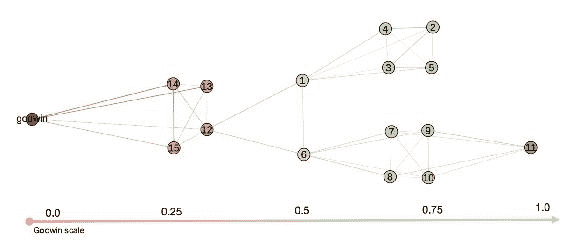

图 10：标准化的 Godwin 距离

最后，我们收集每个顶点及其关联距离作为一个映射。我们可以很容易地将这个集合从最敏感的词到最不敏感的词进行排序，但我们不会在这里报告我们的发现（出于明显的原因！）。

在 2016 年 11 月 7 日和 8 日，这张地图包含了我们 Twitter 字典中的所有单词，意味着完全的遍历性。根据 Godwin 定律，任何单词，只要时间足够长，都可以导致 Godwin 点。在本章中，当我们从 Twitter 文本内容构建特征时，我们将稍后使用这张地图。

### 随机游走

通过*Word2Vec*算法模拟随机游走的一种方法是将图形视为一系列**马尔可夫链**。假设*N*个随机游走和转移矩阵*T*，我们计算转移矩阵*T^N*。给定一个状态*S[1]*（表示一个单词*w[1]*），我们提取从*S[1]*到*N*给定转移中的*S[N]*状态跳转的概率分布。实际上，给定一个约 100k 个单词的字典，这样一个转移矩阵的密集表示将需要大约 50GB 的内存。我们可以使用 MLlib 中的`IndexedRowMatrix`类轻松构建*T*的稀疏表示：

```scala
val size = sc.broadcast(
  word2Graph
    .vertices
    .count()
    .toInt
)

val indexedRowRDD = word2Graph.edges
  .map { case edge =>
    (edge.srcId,(edge.dstId.toInt, edge.attr))
  }
  .groupByKey()
  .map { case (id, it) =>
    new IndexedRow(id, Vectors.sparse(size.value, it.toSeq))
  }

val m1 = new IndexedRowMatrix(indexedRowRDD)
val m3 = m1.multiply(m2)
```

不幸的是，Spark 中没有内置的方法来执行支持稀疏矩阵的矩阵乘法。因此，矩阵 m2 需要是密集的，并且必须适合内存。一种解决方法是分解这个矩阵（使用 SVD）并利用 word2vec 矩阵的对称性质（如果单词*w[1]*是单词*w[2]*的同义词，那么*w[2]*是*w[1]*的同义词）来简化这个过程。使用简单的矩阵代数，可以证明给定一个矩阵*M*：

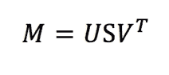

和*M*对称，那么

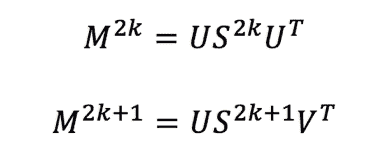

对于*n*的偶数和奇数值分别。理论上，我们只需要计算对角矩阵*S*的乘积。实际上，这需要大量的工作量，计算成本高，而且没有真正的价值（我们只是想生成随机词语关联）。相反，我们使用我们的 Word2Vec 图、Pregel API 和蒙特卡洛模拟生成随机游走。这将从种子`love`开始生成词语关联。算法在 100 次迭代后停止，或者当路径达到我们的 Godwin 点时停止。该算法的详细信息可以在我们的代码库中找到。

```scala
Godwin.randomWalks(graph, "love", 100) 

```

### 提示

还值得一提的是，如果存在一个整数*n*，使得 M^n> 0，则矩阵*M*被称为遍历的（因此也证明了 Godwin 定律）。

# 对讽刺检测的一小步

检测讽刺是一个活跃的研究领域（[`homes.cs.washington.edu/~nasmith/papers/bamman+smith.icwsm15.pdf`](http://homes.cs.washington.edu/~nasmith/papers/bamman+smith.icwsm15.pdf)）。事实上，对于人类来说，检测讽刺通常并不容易，那么对于计算机来说又怎么可能容易呢？如果我说“我们将让美国再次伟大”；在不了解我、观察我或听到我使用的语气的情况下，你怎么知道我是否真的是认真的？现在，如果你读到我发的一条推文，上面写着“我们将让美国再次伟大 :(:(:(”，这有帮助吗？

## 构建特征

我们相信仅凭英文文本是无法检测出讽刺的，尤其是当纯文本不超过 140 个字符时。然而，我们在本章中展示了表情符号在情感定义中可以起到重要作用。一个天真的假设是，一条既有积极情绪又有负面表情符号的推文可能会导致讽刺。除了语气，我们还发现一些词语与一些可以被分类为相当负面的想法/意识形态更接近。

### #爱战胜仇恨

我们已经证明了任何单词都可以在诸如[`clinton`]、[`trump`]、[`love`]和[`hate`]之类的单词之间的高维空间中表示。因此，对于我们的第一个提取器，我们使用这些单词之间的平均余弦相似度来构建特征：

```scala
case class Word2Score(
                     trump: Double,
                     clinton: Double,
                     love: Double,
                     hate: Double
                      )

def cosineSimilarity(x: Array[Float],
                    y: Array[Float]): Double = {

  val dot = x.zip(y).map(a => a._1 * a._2).sum
  val magX = math.sqrt(x.map(i => i*i).sum)
  val magY = math.sqrt(y.map(i => i*i).sum)

  dot / (magX * magY)
}

val trump = model.getVectors.get("trump").get
val clinton = model.getVectors.get("clinton").get
val love = model.getVectors.get("love").get
val hate = model.getVectors.get("hate").get

val word2Score = sc.broadcast(
   model.getVectors.map { case (word, vector) =>
     val scores = Word2Score(
                        cosineSimilarity(vector, trump),
                        cosineSimilarity(vector, clinton),
                        cosineSimilarity(vector, love),
                        cosineSimilarity(vector, hate)
                        )
     (word, scores)
   }
)
```

我们将这种方法公开为用户定义的函数，以便对每条推文可以根据这四个维度进行评分：

```scala
import org.apache.spark.sql.functions._
import collection.mutable.WrappedArray

val featureTrump = udf((words:WrappedArray[String]) => {
  words.map(word2Score.value.get)
       .map(_.get.trump)
       .sum / words.length
})

val featureClinton = udf((words:WrappedArray[String]) => {
  words.map(word2Score.value.get)
       .map(_.get.clinton)
       .sum / words.length
})

val featureLove = udf((words:WrappedArray[String]) => {
  words.map(word2Score.value.get)
       .map(_.get.love)
       .sum / words.length
})

val featureHate = udf((words:WrappedArray[String]) => {
  words.map(word2Score.value.get)
       .map(_.get.hate)
       .sum / words.length
})
```

### 评分表情符号

我们可以提取所有表情符号并运行基本的词频统计，以检索只使用最多的表情符号。然后我们可以将它们分类为五个不同的组：`爱`，`喜悦`，`笑话`，`悲伤`和`哭泣`：

```scala
val lov = sc.broadcast(
  Set("heart", "heart_eyes", "kissing_heart", "hearts", "kiss")
)

val joy = sc.broadcast(
  Set("joy", "grin", "laughing", "grinning", "smiley", "clap", "sparkles")
)

val jok = sc.broadcast(
  Set("wink", "stuck_out_tongue_winking_eye", "stuck_out_tongue")
)

val sad = sc.broadcast(
  Set("weary", "tired_face", "unamused", "frowning", "grimacing", "disappointed")
)

val cry = sc.broadcast(
  Set("sob", "rage", "cry", "scream", "fearful", "broken_heart")
)

val allEmojis = sc.broadcast(
  lov.value ++ joy.value ++ jok.value ++ sad.value ++ cry.value
)
```

再次，我们将此方法公开为可以应用于 DataFrame 的 UDF。表情符号得分为 1.0 将非常积极，而 0.0 将非常消极。

### 训练 KMeans 模型

设置了 UDF 后，我们获得了我们的初始 Twitter DataFrame 并构建了特征向量：

```scala
val buildVector = udf((sentiment: Double, tone: Double, trump: Double, clinton: Double, love: Double, hate: Double, godwin: Double) => {
  Vectors.dense(
    Array(
      sentiment,
      tone,
      trump,
      clinton,
      love,
      hate,
      godwin
    )
  )
})

val featureTweetDF = tweetRDD.toDF
  .withColumn("words", extractWords($"body"))
  .withColumn("tone", featureEmojis($"emojis"))
  .withColumn("trump", featureTrump($"body"))
  .withColumn("clinton", featureClinton($"body"))
  .withColumn("godwin", featureGodwin($"body"))
  .withColumn("love", featureLove($"words"))
  .withColumn("hate", featureHate($"words"))
  .withColumn("features",
    buildVector(
      $"sentiment",
      $"tone",
      $"trump",
      $"clinton",
      $"love",
      $"hate",
      $"godwin")
    )

import org.apache.spark.ml.feature.Normalizer

val normalizer = new Normalizer()
  .setInputCol("features")
  .setOutputCol("vector")
  .setP(1.0)
```

我们使用`Normalizer`类对向量进行归一化，并将 KMeans 算法的输入限制为只有五个簇。与第十章相比，*故事去重和变异*，这里 KMeans 优化（以*k*表示）并不重要，因为我们不感兴趣将推文分组到类别中，而是检测异常值（远离任何簇中心的推文）：

```scala
import org.apache.spark.ml.clustering.KMeans

val kmeansModel = new KMeans()
  .setFeaturesCol("vector")
  .setPredictionCol("cluster")
  .setK(5)
  .setMaxIter(Int.MaxValue)
  .setInitMode("k-means||")
  .setInitSteps(10)
  .setTol(0.01)
  .fit(vectorTweetDF)
```

我们建议使用 ML 包而不是 MLlib。在过去几个 Spark 版本中，这个包在数据集采用和催化剂优化方面有了巨大的改进。不幸的是，存在一个主要限制：所有 ML 类都被定义为私有的，不能被扩展。因为我们想要提取预测的簇旁边的距离，我们将不得不构建我们自己的欧几里得测量作为 UDF 函数：

```scala
import org.apache.spark.ml.clustering.KMeansModel

val centers = sc.broadcast(kmeansModel.clusterCenters)
import org.apache.spark.mllib.linalg.Vector

val euclidean = udf((v: Vector, cluster: Int) => {
   math.sqrt(centers.value(cluster).toArray.zip(v.toArray).map {
    case (x1, x2) => math.pow(x1 - x2, 2)
  }
  .sum)
})
```

最后，我们从我们的*特色推文* DataFrame 中预测我们的簇和欧几里得距离，并将此 DataFrame 注册为持久的 Hive 表：

```scala
val predictionDF = kmeansModel
   .transform(vectorTweetDF)
   .withColumn("distance", euclidean($"vector", $"cluster"))

predictionDF.write.saveAsTable("twitter")
```

## 检测异常

如果特征向量与任何已知簇中心的距离太远（以欧几里得距离表示），我们将认为推文是异常的。由于我们将预测存储为 Hive 表，我们可以通过简单的 SQL 语句对所有点进行排序，并只取前几条记录。

从我们的 Zeppelin 笔记本查询 Hive 时，报告了一个示例，如下所示：

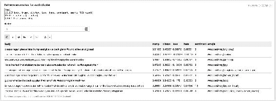

图 11：用于检测异常的 Zeppelin 笔记本

不详细介绍（异常推文可能会敏感），以下是从 Hive 查询中提取的一些示例：

+   今天祝你好运，美国 #投票 #我和她在一起 [鬼脸]

+   这太棒了，我们让美国再次变得伟大 [哭泣，尖叫]

+   我们爱你先生，谢谢你的不断爱 [哭泣]

+   我无法描述我现在有多么开心 #maga [哭泣，愤怒]

然而，请注意，我们发现的异常值并不都是讽刺性的推文。我们刚刚开始研究讽刺，需要进行大量的细化（包括手动工作），可能还需要更先进的模型（如*神经网络*）才能编写全面的检测器。

# 总结

本章的目的是涵盖关于时间序列、词嵌入、情感分析、图论和异常检测的不同主题。值得注意的是，用来说明示例的推文绝不反映作者自己的观点：“美国是否会再次变得伟大超出了本书的范围”：（：（-讽刺与否？

在下一章中，我们将介绍一种创新的方法，使用*TrendCalculus*方法从时间序列数据中检测趋势。这将用于市场数据，但可以轻松应用于不同的用例，包括我们在这里构建的*情感时间序列*。
