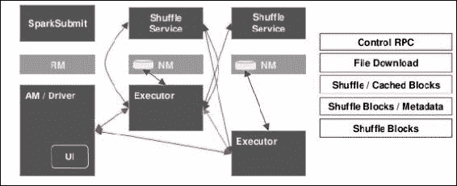
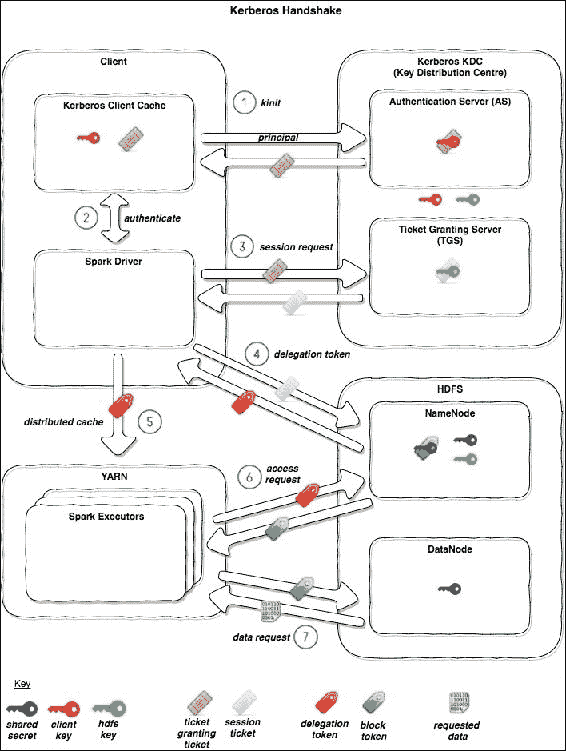
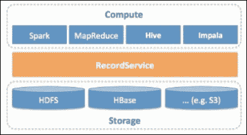

# 第十三章：安全数据

在本书中，我们访问了许多数据科学领域，通常涉及那些传统上与数据科学家的核心工作知识不太相关的领域。特别是，我们专门在第二章 *数据获取*中，解释了如何解决一个始终存在但很少被承认或充分解决的问题，即数据摄取。在本章中，我们将访问另一个经常被忽视的领域，即安全数据。更具体地说，如何在数据生命周期的所有阶段保护您的数据和分析结果。这从摄取开始，一直到呈现，始终考虑到自然形成 Spark 范例的重要架构和可扩展性要求。

在本章中，我们将涵盖以下主题：

+   如何使用 HDFS ACL 实现粗粒度数据访问控制

+   使用 Hadoop 生态系统进行细粒度安全的指南和解释

+   如何确保数据始终加密，以 Java KeyStore 为例

+   混淆、掩码和令牌化数据的技术

+   Spark 如何实现 Kerberos

+   数据安全-道德和技术问题

# 数据安全

我们数据架构的最后一部分是安全性，在本章中我们将发现数据安全性总是重要的，以及其原因。由于最近由许多因素引起的数据量和种类的巨大增加，但其中不乏因互联网及相关技术的普及所致，因此需要提供完全可扩展和安全的解决方案。我们将探讨这些解决方案以及与数据的存储、处理和处理相关的机密性、隐私和法律问题；我们将把这些与之前章节介绍的工具和技术联系起来。

我们将继续解释涉及在规模上保护数据的技术问题，并介绍使用各种访问、分类和混淆策略来解决这些问题的想法和技术。与之前的章节一样，这些想法将通过 Hadoop 生态系统的示例进行演示，并且公共云基础设施策略也将被介绍。

## 问题

在之前的章节中，我们探讨了许多不同的主题，通常集中在特定问题的细节和解决方法上。在所有这些情况下，都存在一个隐含的想法，即正在使用的数据和收集的见解内容不需要以任何方式进行保护；或者至少操作系统级别提供的保护，如登录凭据，是足够的。

在任何环境中，无论是家庭还是商业环境，数据安全都是一个必须始终考虑的重大问题。也许，在某些情况下，将数据写入本地硬盘并不再采取进一步的步骤就足够了；这很少是一种可以接受的做法，而且肯定应该是一种有意识的决定，而不是默认行为。在商业环境中，计算资源通常具有内置的安全性。在这种情况下，用户仍然重要理解这些影响，并决定是否应采取进一步的步骤；数据安全不仅仅是关于保护免受恶意实体或意外删除，还包括其中的一切。

例如，如果您在一个安全、受监管的商业空隙环境（无法访问互联网）中工作，并且在一个志同道合的数据科学家团队中工作，个人安全责任仍然与根本不存在安全性的环境中一样重要；您可能可以访问不得被同行查看的数据，并且可能需要生成可供不同和多样化用户组使用的分析结果，所有这些用户组都不得查看彼此的数据。强调可能明确或隐含地放在您身上，以确保数据不受损害；因此，对软件堆栈中的安全层有深刻的理解是至关重要的。

## 基础知识

安全考虑无处不在，甚至在您可能根本没有考虑过的地方。例如，当 Spark 在集群上运行并行作业时，您知道数据在生命周期中可能触及物理磁盘的时刻吗？如果您认为一切都是在 RAM 中完成的，那么您可能会在那里遇到潜在的安全问题，因为数据可能会泄漏到磁盘上。在本章的后面将更多地讨论这一点的影响。这里的要点是，您不能总是将安全责任委托给您正在使用的框架。事实上，您使用的软件越多，安全问题就越多，无论是用户还是数据相关的安全问题。

安全性可以大致分为三个领域：

+   **认证**：确定用户身份的合法性

+   **授权**：用户执行特定操作的权限

+   **访问**：用于保护数据的安全机制，无论是在传输过程中还是在静止状态下

这些观点之间存在重要差异。用户可能具有访问和编辑文件的完全权限，但如果文件在用户安全领域之外加密，则文件可能仍然无法读取；用户授权会介入。同样，用户可能通过安全链接发送数据到远程服务器进行处理，然后返回结果，但这并不保证数据没有留下痕迹在远程服务器上；安全机制是未知的。

# 认证和授权

认证与机制有关，用于确保用户是其所说的人，并在两个关键级别上运行，即本地和远程。

认证可以采用各种形式，最常见的是用户登录，但其他例子包括指纹识别、虹膜扫描和 PIN 码输入。用户登录可以在本地基础上进行管理，例如在个人计算机上，或者在远程基础上使用诸如**轻量级目录访问协议**（**LDAP**）之类的工具。远程管理用户提供了独立于任何特定硬件的漫游用户配置文件，并且可以独立于用户进行管理。所有这些方法都在操作系统级别执行。还有其他机制位于应用程序层，并为服务提供认证，例如 Google OAuth。

替代的身份验证方法各有优缺点，应该在宣称一个安全系统之前充分了解特定的实现方式；例如，指纹系统可能看起来非常安全，但情况并非总是如此。有关更多信息，请参阅[`www.cse.msu.edu/rgroups/biometrics/Publications/Fingerprint/CaoJain_HackingMobilePhonesUsing2DPrintedFingerprint_MSU-CSE-16-2.pdf`](http://www.cse.msu.edu/rgroups/biometrics/Publications/Fingerprint/CaoJain_HackingMobilePhonesUsing2DPrintedFingerprint_MSU-CSE-16-2.pdf)。我们不会在这里进一步探讨身份验证，因为我们已经假设大多数系统只会实现用户登录；顺便说一句，这通常并不是一个安全的解决方案，实际上，在许多情况下根本没有提供安全性。有关更多信息，请参阅[`www.cs.arizona.edu/~collberg/Teaching/466-566/2012/Resources/presentations/2012/topic7-final/report.pdf`](http://www.cs.arizona.edu/~collberg/Teaching/466-566/2012/Resources/presentations/2012/topic7-final/report.pdf)。

授权是我们非常感兴趣的一个领域，因为它构成了基本安全的关键部分，是我们最常控制的领域，并且是我们可以在任何现代操作系统中原生使用的东西。有各种不同的资源授权实现方式，其中两种主要方式是：

+   **访问控制列表**（**ACL**）

+   **基于角色的访问控制**（**RBAC**）

我们将依次讨论每一条规则。

## 访问控制列表（ACL）

在 Unix 中，ACL 在整个文件系统中都被使用。如果我们在命令行中列出目录内容：

```scala
drwxr-xr-x 6 mrh mygroup 204 16 Jun 2015 resources

```

我们可以看到有一个名为资源的目录，分配了所有者（`mrh`）和组（`mygroup`），有`6`个链接，大小为`204`字节，最后修改日期为`2015 年 6 月 16 日`。ACL `drwxr-xr-x`表示：

+   `d`这是一个目录（-如果不是）

+   `rwx`所有者（`mrh`）具有读取、写入和执行权限

+   `r-x`组中的任何人（`mygroup`）都有读取和执行权限

+   `r-x`其他所有人都有读取和执行权限

使用 ACL 是保护我们的数据的一个很好的第一步。它应该始终是首要考虑的事情，并且应该始终是正确的；如果我们不始终确保这些设置是正确的，那么我们可能会让其他用户轻松访问这些数据，而我们并不一定知道系统上的其他用户是谁。始终避免在 ACL 的*all*部分提供完全访问权限：

```scala
-rwx---rwx 6 mrh mygroup 204 16 Jun 2015 secretFile.txt

```

无论我们的系统有多安全，只要有权限访问文件系统的用户都可以读取、写入和删除这个文件！一个更合适的设置是：

```scala
-rwxr----- 6 mrh mygroup 204 16 Jun 2015 secretFile.txt

```

这为所有者提供了完全的访问权限，并为组提供了只读权限。

HDFS 原生实现了 ACL；这些可以使用命令行进行管理：

```scala
hdfs dfs -chmod 777 /path/to/my/file.txt

```

这为 HDFS 中的文件提供了所有人的完全权限，假设文件已经具有足够的权限让我们进行更改。

### 注意

当 Apache 在 2008 年发布 Hadoop 时，人们经常不理解，集群设置为所有默认值时不会对用户进行任何身份验证。如果集群没有正确配置，Hadoop 中的超级用户`hdfs`可以被任何用户访问，只需在客户机上创建一个`hdfs`用户（`sudo useradd hdfs`）。

## 基于角色的访问控制（RBAC）

RBAC 采用了一种不同的方法，通过为用户分配一个或多个角色。这些角色与常见任务或工作职能相关，因此可以根据用户的责任轻松添加或删除。例如，在公司中可能有许多角色，包括账户、库存和交付。会计可能会被赋予这三个角色，以便他们可以编制年终财务报表，而负责交付预订的管理员只会有交付角色。这样可以更轻松地添加新用户，并在他们更换部门或离开组织时管理用户。

RBAC 定义了三条关键规则：

+   **角色分配**：用户只有在选择或被分配角色后才能行使权限。

+   **角色授权**：用户的活动角色必须经过授权。

+   **权限授权**：用户只能行使权限，如果该权限已经为用户的活动角色授权。

用户和角色之间的关系可以总结如下：

+   **角色-权限**：特定角色向用户授予特定权限。

+   **用户-角色**：用户类型和特定角色之间的关系。

+   **角色-角色**：角色之间的关系。这些关系可以是层次化的，所以*role1 => role2*可能意味着，如果用户有*role1*，那么他们自动拥有*role2*，但如果他们有*role2*，这并不一定意味着他们有*role1*。

RBAC 通过 Apache Sentry 在 Hadoop 中实现。组织可以定义对数据集的特权，这些特权将从多个访问路径（包括 HDFS、Apache Hive、Impala，以及通过 HCatalog 的 Apache Pig 和 Apache MapReduce/Yarn）强制执行。例如，每个 Spark 应用程序都作为请求用户运行，并需要访问底层文件。Spark 无法直接执行访问控制，因为它作为请求用户运行并且不受信任。因此，它受限于文件系统权限（ACL）。在这种情况下，Apache Sentry 为资源提供基于角色的控制。

# 访问

到目前为止，我们只集中在确保用户是他们所说的人，只有正确的用户才能查看和使用数据的具体想法上。然而，一旦我们采取了适当的步骤并确认了这些细节，我们仍然需要确保用户在实际使用数据时数据是安全的；有许多方面需要考虑：

+   用户是否被允许查看数据中的所有信息？也许他们只能限制在某些行，甚至是某些行的某些部分。

+   当用户在数据上运行分析时，数据是否安全？我们需要确保数据不以明文传输，因此容易受到中间人攻击。

+   用户完成任务后，数据是否安全？确保数据在所有阶段都非常安全是没有意义的，只有将明文结果写入不安全的区域。

+   可以从数据的聚合中得出结论吗？即使用户只能访问数据集的某些行，比如在这种情况下保护个人隐私，有时也可能在看似无关的信息之间建立联系。例如，如果用户知道*A=>B*和*B=>C*，他们可能猜测，*A=>C*，即使他们不被允许在数据中看到这一点。实际上，这种问题很难避免，因为数据聚合问题可能非常微妙，发生在意想不到的情况下，通常涉及在较长时间内获取的信息。

我们可以使用一些机制来帮助我们防止上述情况。

# 加密

可以说，保护数据最明显和最知名的方法是加密。无论我们的数据是在传输中还是静止状态，我们都会使用它，所以除了数据实际在内存中被处理时，几乎所有时间都会使用。加密的机制取决于数据的状态。

## 静态数据

我们的数据总是需要存储在某个地方，无论是 HDFS、S3 还是本地磁盘。如果我们已经采取了所有必要的预防措施，确保用户已经得到授权和认证，仍然存在明文实际存在于磁盘上的问题。通过物理方式或通过 OSI 堆栈中的较低级别访问磁盘，非常容易流式传输整个内容并获取明文数据。

如果我们加密数据，那么我们就可以免受这种类型的攻击。加密也可以存在于不同的层面，可以通过软件在应用程序层对数据进行加密，也可以通过硬件级别对数据进行加密，也就是磁盘本身。

在应用程序层对数据进行加密是最常见的路线，因为它使用户能够对需要做出的权衡决策做出明智的选择，从而为他们的情况做出正确的产品选择。因为加密增加了额外的处理开销（数据需要在写入时加密并在读取时解密），因此在处理器时间与安全强度之间需要做出关键决策。需要考虑的主要决策有：

+   **加密算法类型**：用于执行加密的算法，即 AES、RSA 等

+   **加密密钥位长度**：加密密钥的大小大致相当于破解的难度，但也影响结果的大小（可能的存储考虑），即 64 位、128 位等。

+   **处理器时间允许的时间**：较长的加密密钥通常意味着更长的处理时间；鉴于足够大的数据量，这可能会对处理产生严重影响

一旦我们确定了我们的用例的正确因素组合，要记住，一些算法密钥长度组合不再被认为是安全的，我们需要软件来实际进行加密。这可以是一个定制的 Hadoop 插件或商业应用程序。正如前面提到的，Hadoop 现在有一个本地的 HDFS 加密插件，因此您不需要编写自己的插件！该插件使用 Java KeyStore 安全存储加密密钥，可以通过 Apache Ranger 访问。加密完全在 HDFS 内部进行，并且基本上与文件的 ACLs 相关联。因此，在 Spark 中访问 HDFS 文件时，该过程是无缝的（除了加密/解密文件需要额外的时间）。

如果您希望在 Spark 中实现加密以将数据写入未在上述情况中涵盖的地方，则可以使用 Java javax.crypto 包。这里最薄弱的环节现在是密钥本身必须被记录在某个地方；因此，我们可能只是把我们的安全问题简单地转移到了其他地方。使用适当的 KeyStore，例如 Java KeyStore，可以解决这个问题。

在撰写本文时，尚无明显的方法可以在从 Spark 写入本地磁盘时加密数据。在下一节中，我们将自己编写！

这个想法是用尽可能接近原始的方式替换`rdd.saveAsTextFile(filePath)`函数，并进一步具备加密数据的能力。然而，这还不是全部，因为我们还需要能够读取数据。为此，我们将利用`rdd.saveAsTextFile(filePath)`函数的替代方案，该函数还接受压缩编解码器参数：

```scala
saveAsTextFile(filePath, Class<? extends
     org.apache.hadoop.io.compress.CompressionCodec> codec)
```

从表面上看，Spark 使用压缩编解码器的方式似乎与我们对数据加密的要求相似。因此，让我们为我们的目的调整现有的 Hadoop 压缩实现之一。查看几种不同的现有实现（`GzipCodec`、`BZip2Codec`），我们发现我们必须扩展`CompressionCodec`接口以派生我们的加密编解码器，从现在起命名为`CryptoCodec`。让我们看一个 Java 实现：

```scala
import org.apache.hadoop.io.compress.crypto.CryptoCompressor;
import org.apache.hadoop.io.compress.crypto.CryptoDecompressor;

public class CryptoCodec implements CompressionCodec, Configurable {

    public static final String CRYPTO_DEFAULT_EXT = ".crypto";
    private Configuration config;

    @Override
    public Compressor createCompressor() {
        return new CryptoCompressor();
    }
    @Override
    public Decompressor createDecompressor() {
        return new CryptoDecompressor();
    }
    @Override
    public CompressionInputStream createInputStream(InputStream in)
          throws IOException {
        return createInputStream(in, createDecompressor());
    }
    @Override
    public CompressionInputStream createInputStream(InputStream in,
          Decompressor decomp) throws IOException {
        return new DecompressorStream(in, decomp);
    }
    @Override
    public CompressionOutputStream createOutputStream(OutputStream out)
          throws IOException {
        return createOutputStream(out, createCompressor());
    }
    @Override
    public CompressionOutputStream createOutputStream(OutputStream out,
          Compressor comp) throws IOException {
        return new CompressorStream(out, comp);
    }
    @Override
    public Class<? extends Compressor> getCompressorType() {
        return CryptoCompressor.class;
    }
    @Override
    public Class<? extends Decompressor> getDecompressorType() {
        return CryptoDecompressor.class;
    }
    @Override
    public String getDefaultExtension() {
        return CRYPTO_DEFAULT_EXT;
    }
    @Override
    public Configuration getConf() {
        return this.config;
    }
    @Override
    public void setConf(Configuration config) {
        this.config = config;
    }
}
```

值得注意的是，这个编解码器类只是作为一个包装器，用于将我们的加密和解密例程与 Hadoop API 集成；当调用加密编解码器时，这个类提供了 Hadoop 框架使用的入口点。两个主要感兴趣的方法是`createCompressor`和`createDeompressor`，它们都执行相同的初始化：

```scala
public CryptoCompressor() { 
    crypto = new EncryptionUtils(); } 

```

我们已经使用明文密码使事情变得更简单。在使用此代码时，加密密钥应该从安全存储中提取；这在本章后面将详细讨论：

```scala
public EncryptionUtils() {
    this.setupCrypto(getPassword());
}

private String getPassword() {
    // Use a Java KeyStore as per the below code, a Database or any other secure mechanism to obtain a password
    // TODO We will return a hard coded String for simplicity
    return "keystorepassword";
}

private void setupCrypto(String password) {
    IvParameterSpec paramSpec = new IvParameterSpec(generateIV());
    skeySpec = new SecretKeySpec(password.getBytes("UTF-8"), "AES");
    ecipher = Cipher.getInstance(encoding);
    ecipher.init(Cipher.ENCRYPT_MODE, skeySpec, paramSpec);
    dcipher = Cipher.getInstance(encoding);
}

private byte[] generateIV() {
    SecureRandom random = new SecureRandom();
    byte bytes[] = new byte[16];
    random.nextBytes(bytes);
    return bytes;
}

```

接下来，我们定义加密方法本身：

```scala
public byte[] encrypt(byte[] plainBytes, boolean addIV) 
        throws InvalidAlgorithmParameterException,
               InvalidKeyException {

    byte[] iv = "".getBytes("UTF-8");
    if (!addIV) {
        iv = ecipher.getParameters()
                    .getParameterSpec(IvParameterSpec.class)
                    .getIV();
    }
    byte[] ciphertext = ecipher.update(
           plainBytes, 0, plainBytes.length);
    byte[] result = new byte[iv.length + ciphertext.length];
    System.arraycopy(iv, 0, result, 0, iv.length);
    System.arraycopy(ciphertext, 0,
                     result, iv.length, ciphertext.length);
    return result;
}

public byte[] decrypt(byte[] ciphertext, boolean useIV)
        throws InvalidAlgorithmParameterException,
               InvalidKeyException {

    byte[] deciphered;
    if (useIV) {
        byte[] iv = Arrays.copyOfRange(ciphertext, 0, 16);
        IvParameterSpec paramSpec = new IvParameterSpec(iv);
        dcipher.init(Cipher.DECRYPT_MODE, skeySpec, paramSpec);
        deciphered = dcipher.update(
            ciphertext, 16, ciphertext.length - 16);
    } else {
        deciphered = dcipher.update(
            ciphertext, 0, ciphertext.length);
    }
    return deciphered;

}

public byte[] doFinal() {
    try {
        byte[] ciphertext = ecipher.doFinal();
        return ciphertext;
    } catch (Exception e) {
        log.error(e.getStackTrace());
        return null;
    }
}
```

### 注意

每次加密文件时，*初始化向量*（IV）都应该是随机的。随机化对于加密方案实现语义安全至关重要，这是一种属性，即在相同密钥下重复使用方案不允许攻击者推断加密消息段之间的关系。

在实现加密范例时的主要问题是对字节数组的错误处理。正确加密的文件大小通常是密钥大小的倍数，当使用填充时，本例中为 16（字节）。如果文件大小不正确，加密/解密过程将因填充异常而失败。在先前使用的 Java 库中，数据以阶段方式提供给内部加密例程，大小为`ciphertext.length`，这些数据以 16 字节的块进行加密。如果有余数，这将被预先放置到下一个更新的数据中。如果进行`doFinal`调用，则余数再次被预先放置，并且数据在加密之前被填充到 16 字节块的末尾，从而完成例程。

现在我们可以继续完成我们的`CryptoCodec`的其余部分，即实现前面代码的压缩和解压实现。这些方法位于`CryptoCompressor`和`CryptoDecompressor`类中，并由 Hadoop 框架调用：

```scala
@Override
public synchronized int compress(byte[] buf, int off, int len) throws IOException {
    finished = false;
    if (remain != null && remain.remaining() > 0) {
        int size = Math.min(len, remain.remaining());
        remain.get(buf, off, size);
        wrote += size;
        if (!remain.hasRemaining()) {
            remain = null;
            setFinished();
        }
        return size;
    }
    if (in == null || in.remaining() <= 0) {
        setFinished();
        return 0;
    }
    byte[] w = new byte[in.remaining()];
    in.get(w);
    byte[] b = crypto.encrypt(w, addedIV);
    if (!addedIV)
        addedIV = true;
    int size = Math.min(len, b.length);
    remain = ByteBuffer.wrap(b);
    remain.get(buf, off, size);
    wrote += size;
    if (remain.remaining() <= 0)
        setFinished();
    return size;
}

```

您可以在我们的代码存储库中看到`CryptoCodec`类的完整实现。

现在我们有了工作的`CryptoCodec`类，那么 Spark 驱动程序代码就很简单了：

```scala
val conf = new SparkConf() 
val sc = new SparkContext(conf.setAppName("crypto encrypt")) 
val writeRDD = sc.parallelize(List(1, 2, 3, 4), 2) 
writeRDD.saveAsTextFile("file:///encrypted/data/path",classOf[CryptoCodec]) 

```

我们现在有了本地磁盘加密！要读取加密文件，我们只需在配置中定义`codec`类：

```scala
val conf = new SparkConf() 
conf.set("spark.hadoop.io.compression.codecs", 
         "org.apache.hadoop.io.compress.CryptoCodec") 
val sc = new SparkContext(conf.setAppName("crypto decrypt")) 
val readRDD = sc.textFile("file:///encrypted/data/path") 
readRDD.collect().foreach(println) 

```

当 Spark 识别到适当的文件时，将自动使用`CryptoCodec`类，并且我们的实现确保每个文件使用唯一的 IV；IV 是从加密文件的开头读取的。

### Java KeyStore

根据您的环境，上述代码可能足以保护您的数据安全。但是，存在一个缺陷，即用于加密/解密数据的密钥必须以明文形式提供。我们可以通过创建 Java KeyStore 来解决这个问题。这可以通过命令行或以编程方式完成。我们可以实现一个函数来创建`JCEKS` KeyStore 并添加一个密钥：

```scala
public static void createJceksStoreAddKey() {

       KeyStore keyStore = KeyStore.getInstance("JCEKS");
       keyStore.load(null, null);

       KeyGenerator kg = KeyGenerator.getInstance("AES");
       kg.init(128); // 16 bytes = 128 bit
       SecretKey sk = kg.generateKey();
       System.out.println(sk.getEncoded().toString());

       keyStore.setKeyEntry("secretKeyAlias", sk,
            "keystorepassword".toCharArray(), null);

       keyStore.store(new FileOutputStream("keystore.jceks"),
                  "keystorepassword".toCharArray());
}
```

我们可以通过命令行实现相同的功能：

```scala
keytool -genseckey-alias secretKeyAlias /
        -keyalg AES /
        -keystore keystore.jceks /
        -keysize 128 /
        -storeType JCEKS

```

检查它是否存在：

```scala
keytool -v -list -storetype JCEKS -keystore keystore.jceks

```

从 KeyStore 中检索密钥：

```scala
public static SecretKey retrieveKey()
        throws KeyStoreException,
               IOException,
               CertificateException,
               NoSuchAlgorithmException,
               UnrecoverableKeyException {

    KeyStore keyStore = KeyStore.getInstance("JCEKS");
    keyStore.load(new FileInputStream("keystore.jceks"),
        "keystorepassword".toCharArray());

    SecretKey key = (SecretKey) keyStore.getKey("secretKeyAlias",
        "keystorepassword".toCharArray());

    System.out.println(key.getEncoded().toString());
    return key;
}
```

### 注意

我们已经硬编码了具体内容以便阅读，但在实践中不应该这样做，因为 Java 字节码相对简单，容易被逆向工程，因此，恶意第三方可以轻松获取这些秘密信息。

我们的秘钥现在受到 KeyStore 的保护，只能使用 KeyStore 密码和秘钥别名访问。这些仍然需要受到保护，但通常会存储在数据库中，只有授权用户才能访问。

我们现在可以修改我们的`EncryptionUtils.getPassword`方法，以检索`JCEKS`密钥而不是明文版本，如下所示：

```scala
private String getPassword(){
    return retrieveKey();
}
```

现在我们有了`CryptoCodec`类，我们可以在整个 Spark 中使用它来保护数据，无论何时我们需要数据加密。例如，如果我们将 Spark 配置`spark.shuffle.spill.compress`设置为 true，并将`spark.io.compression.codec`设置为`org.apache.hadoop.io.compress.CryptoCodec`，那么任何溢出到磁盘的数据都将被加密。

### S3 加密

HDFS 加密非常适合提供基本上是托管服务的功能。如果我们现在看 S3，它也可以做到同样的功能，但它还提供了使用以下功能进行服务器端加密的能力：

+   AWS KMS 管理的密钥（SSE-KMS）

+   客户提供的密钥（SSE-C）

服务器端加密可以提供更多灵活性，如果您处于需要明确管理加密密钥的环境中。

硬件加密是在物理磁盘架构内处理的。一般来说，这具有更快的优势（由于专门用于加密的定制硬件）并且更容易保护，因为需要物理访问机器才能规避。缺点是所有写入磁盘的数据都是加密的，这可能会导致高度利用的磁盘的 I/O 性能下降。

## 数据在传输中

如果端到端的安全性是您的目标，一个经常关注的领域是数据在传输中的问题。这可能是从磁盘读取/写入或在分析处理期间在网络中传输数据。在所有情况下，重要的是要意识到您的环境的弱点。不能仅仅假设框架或网络管理员已经为您解决了这些潜在问题，即使您的环境不允许直接进行更改。

一个常见的错误是假设数据在不可读时是安全的。尽管二进制数据本身不可读，但它通常可以轻松转换为可读内容，并且可以使用诸如 Wireshark（[www.wireshark.org](http://www.wireshark.org)）之类的工具在网络上捕获。因此，无论数据是否可读，都不要假设数据在传输过程中是安全的。

正如我们之前所看到的，即使在磁盘上加密数据，我们也不能假设它一定是安全的。例如，如果数据在硬件级别加密，那么一旦离开磁盘，它就会解密。换句话说，纯文本在穿越网络到任何机器时都是可读的，因此完全可以被未知实体在旅程中的任何时候读取。在软件级别加密的数据通常在被分析使用之前不会解密，因此通常是更安全的选择，如果网络拓扑未知的话。

在考虑处理系统本身的安全性时，例如 Spark，这里也存在问题。数据不断在节点之间移动，用户无法直接控制。因此，我们必须了解数据在任何给定时间可能以纯文本形式可用的位置。考虑以下图表，显示了 Spark YARN 作业期间实体之间的交互：



我们可以看到每个连接都传输和接收数据。Spark 输入数据通过广播变量传输，所有通道都支持加密，除了 UI 和本地 shuffle/cache 文件（有关更多信息，请参见 JIRA SPARK-5682）。

此外，这里存在一个弱点，即缓存文件以纯文本形式存储。修复方法要么是实施前面的解决方案，要么是设置 YARN 本地目录指向本地加密磁盘。为此，我们需要确保 yarn-default.xml 中的`yarn.nodemanager.local-dirs`是所有 DataNodes 上的加密目录，可以使用商业产品或将这些目录托管在加密磁盘上。

现在我们已经考虑了整体数据，我们应该处理数据本身的各个部分。很可能数据中包含敏感信息，例如姓名、地址和信用卡号码。有许多处理此类信息的方法。

## 混淆/匿名化

通过混淆，数据的敏感部分被转换成永远无法追溯到原始内容的形式 - 通过模糊提供安全性。例如，包含字段：“名”，“姓”，“地址行 1”，“地址行 2”，“邮政编码”，“电话号码”，“信用卡号”的 CSV 文件可能会被混淆如下：

+   原文

```scala
        John,Smith,3 New Road,London,E1 2AA,0207 123456,4659 4234 5678 
        9999
```

+   混淆

```scala
        John,XXXXXX,X New Road,London,XX 2AA,XXXX 123456,4659 
        XXXXXXXXXXXXXX
```

数据混淆对于分析非常有用，因为它在保护敏感数据的同时仍允许有用的计算，比如计算完成的字段数量。我们还可以在混淆数据的方式上做得更智能，以保留某些细节同时保护其他细节。例如，信用卡号：`4659 42XX XXXX XXXX`可以给我们提供大量信息，因为付款卡的前六位数字，称为**银行识别号**（**BIN**），告诉我们以下信息：

+   BIN 465942

+   卡品牌：VISA

+   发卡银行：汇丰银行

+   卡类型：借记卡

+   卡级别：经典

+   ISO 国家编号 826（英国）

数据混淆不一定要是随机的，但应该经过精心设计，以确保敏感数据被彻底删除。敏感的定义将完全取决于需求。在前面的例子中，能够按类型总结客户付款卡的分布可能非常有用，或者可以被视为应该删除的敏感信息。

还有一个现象需要注意，正如您可能从之前的章节中记得的那样，那就是数据聚合。例如，如果我们知道个人的姓名是约翰·史密斯，并且他的信用卡号以 465942 开头，那么我们就知道约翰·史密斯在英国汇丰银行有一个账户，这对于一个恶意实体来说是一个很好的信息基础。因此，必须小心确保应用了正确数量的混淆，要牢记我们永远无法恢复原始数据，除非我们在其他地方有另一个副本存储。数据的不可恢复可能是一个昂贵的事件，因此应明智地实施数据混淆。确实，如果存储允许，想要存储几个版本的数据，每个版本都有不同程度的混淆和不同级别的访问，这并不是不合理的。

在考虑在 Spark 中实现这一点时，最有可能的情况是我们将有许多需要转换的输入记录。因此，我们的起点是编写一个适用于单个记录的函数，然后将其包装在 RDD 中，以便可以并行运行这些函数。

以我们前面的例子为例，让我们在 Scala 中将其架构表达为一个枚举。除了定义之外，我们还将在我们的`Enumeration`类中包含有关如何混淆任何特定字段的信息：

+   *x*，*y*掩盖了从*x*到*y*的字符位置

+   `0`，`len`掩盖从字段文本的 0 到字段长度的整个字段

+   `prefix`掩盖最后一个空格字符之前的所有内容

+   `suffix`掩盖第一个空格字符之后的所有内容

+   `""`什么都不做

这些信息在枚举中编码如下：

```scala
object RecordField extends Enumeration {
 type Obfuscation = Value
 val FIRSTNAME        = Value(0, "")
 val SURNAME          = Value(1, "0,len")
 val ADDRESS1         = Value(2, "0,1")
 val ADDRESS2         = Value(3, "")
 val POSTCODE        = Value(4, "prefix")
 val TELNUMBER       = Value(5, "prefix")
 val CCNUMBER         = Value(6, "suffix")
}
```

接下来，我们可以拆分输入字符串并编写一个函数，将正确的混淆参数应用于正确的字段：

```scala
def getObfuscationResult(text: String): String = {
   text
    .split(",")
    .zipWithIndex
    .map { case (field, idx) =>
      field match {
        case s: String if idx >= 0 && idx <= 6 => 
           stringObfuscator(s,RecordField(idx).toString, 'X')
        case _ => "Unknown field"
      }
    }
    .mkString(",")
 }
```

为了保持简单，我们已经硬编码了一些您可能希望以后更改的项目，例如分割参数（`,`），并且在所有情况下都使混淆符号保持不变（`X`）。

最后，实际的混淆代码：

```scala
def stringObfuscator(text: String,
                     maskArgs: String,
                     maskChar: Char):String = {
 var start = 0
 var end = 0

 if (maskArgs.equals("")) {
   text
 }

 if (maskArgs.contains(",")) {
   start = maskArgs.split(',')(0).toInt
   if (maskArgs.split(',')(1) == "len")
     end = text.length
   else
     end = maskArgs.split(',')(1).toInt
 }

 if (maskArgs.contains("prefix")){
   end = text.indexOf(" ")
 }

 if (maskArgs.contains("suffix")){
   start = text.indexOf(" ") + 1
   end = text.length
 }

 if (start > end)
   maskChar

 val maskLength: Int = end - start

 if (maskLength == 0)
   text

 var sbMasked: StringBuilder  = new StringBuilder(
         text.substring(0, start))

 for(i <- 1 to maskLength) {
   sbMasked.append(maskChar)
 }
 sbMasked.append(text.substring(start + maskLength)).toString
}
```

同样，我们保持了简单，没有过多地检查异常或边缘情况。这里是一个实际的例子：

```scala
getObfuscationResult(
  "John,Smith,3 New Road,London,E1 2AA,0207 123456,4659 4234 5678 9999")
```

它提供了期望的结果：

```scala
John,XXXXXX,X New Road,London,XX 2AA,XXXX 123456,4659 XXXXXXXXXXXXXX

```

这个方便的代码片段为大规模混淆提供了一个很好的基础。我们可以很容易地将其扩展到更复杂的场景，比如同一字段的不同部分的混淆。例如，通过更改`StringObfuscator`，我们可以在`地址行 1`字段中以不同的方式掩盖门牌号和街道名称：

```scala
val ADDRESS1 = Value(2, "0,1;2,len")

```

当然，如果您希望将其扩展到许多不同的用例，您也可以在`StringObfuscator`上应用策略模式，以允许在运行时提供混淆函数。

一种关键的软件工程技术，策略模式在这里描述：[`sourcemaking.com/design_patterns/strategy`](https://sourcemaking.com/design_patterns/strategy)。

在这一点上，值得考虑使用算法对数据进行混淆，例如单向哈希函数或摘要，而不仅仅是用字符（`XXX`）替换。这是一种多功能的技术，在各种用例中都适用。它依赖于执行某些计算的逆计算的计算复杂性，例如找因子和模平方，这意味着一旦应用，它们是不可逆的。然而，在使用哈希时应该小心，因为尽管摘要计算是 NP 完全的，但在某些情况下，哈希仍然容易受到使用隐含知识的威胁。例如，信用卡号的可预测性意味着它们已经被证明可以很快地通过穷举法破解，即使使用 MD5 或 SHA-1 哈希。

有关更多信息，请参阅[`www.integrigy.com/security-resources/hashing-credit-card-numbers-unsafe-application-practices`](https://www.integrigy.com/security-resources/hashing-credit-card-numbers-unsafe-application-practices)。

## 掩码

数据掩码是关于创建数据的功能替代，同时确保重要内容被隐藏。这是另一种匿名化方法，原始内容一旦经过掩码处理就会丢失。因此，确保变更经过仔细规划是非常重要的，因为它们实际上是最终的。当然，原始版本的数据可以存储以备紧急情况，但这会给安全考虑增加额外的负担。

掩码是一个简单的过程，它依赖于生成随机数据来替换任何敏感数据。例如，对我们之前的例子应用掩码会得到：

```scala
Simon,Jones,2 The Mall,London,NW1 2JT,0171 123890,1545 3146 6273 6262
```

现在我们有一行数据，它在功能上等同于原始数据。我们有一个全名、地址、电话号码和信用卡号码，但它们是*不同的*，因此它们不能与原始数据关联起来。

部分掩码对于处理目的非常有用，因为我们可以保留一些数据，同时掩盖其余部分。通过这种方式，我们可以执行许多数据审计任务，这些任务可能无法通过混淆来实现。例如，我们可以掩盖实际存在的数据，从而可以保证填充字段始终有效，同时也能够检测到空字段。

也可以使用完全掩码来生成模拟数据，而根本没有看到原始数据。在这种情况下，数据可以完全生成，比如用于测试或分析的目的。

无论用例如何，使用掩码时都应该小心，因为可能会无意中将真实信息插入记录中。例如，`Simon Jones`可能实际上是一个真实的人。在这种情况下，存储数据来源和历史记录是一个好主意。因此，如果真正的`Simon, Jones`根据数据保护法案提交了**信息请求**（**RFI**），您就有必要的信息来提供相关的理由。

让我们扩展我们之前构建的代码，使用完全随机选择来实现基本的掩码方法。我们已经看到，掩码方法要求我们用一些有意义的替代内容替换字段。为了快速实现一些功能，我们可以简单地提供替代内容的数组：

```scala
val forenames = Array("John","Fred","Jack","Simon")
val surnames = Array("Smith","Jones","Hall","West")
val streets = Array("17 Bound Mews","76 Byron Place",
    "2 The Mall","51 St James")
```

稍后，我们可以扩展这些内容，从包含更多替代方案的文件中读取。我们甚至可以使用复合掩码一次性替换多个字段：

```scala
val composite = Array("London,NW1 2JT,0171 123890",
                      "Newcastle, N23 2FD,0191 567000",
                      "Bristol,BS1 2AA,0117 934098",
                      "Manchester,M56 9JH,0121 111672")
```

然后，处理代码就很简单了：

```scala
def getMaskedResult(): String = {

  Array(
    forenames(scala.util.Random.nextInt(forenames.length)),
    surnames(scala.util.Random.nextInt(surnames.length)),
    streets(scala.util.Random.nextInt(streets.length)),
    composite(scala.util.Random.nextInt(composite.length)).split(","),
    RandomCCNumber)
  .flatMap {
    case s:String => Seq(s)
    case a:Array[String] => a
  }
  .mkString(",")
}
```

我们可以定义一个`RandomCCNumber`函数来生成一个随机的信用卡号码。下面是一个简单的函数，它使用递归提供四组随机生成的整数：

```scala
def RandomCCNumber(): String = {

    def appendDigits(ccn:Array[String]): Array[String] = {
       if (ccn.length < 4) {
         appendDigits(ccn :+ (for (i <- 1 to 4) 
           yield scala.util.Random.nextInt(9)).mkString)
       }
       else {
         ccn
       }
     }
     appendDigits(Array()).mkString(" ")
}
```

将这些代码放在一起，并对我们的原始示例运行，得到以下结果：

```scala
getMaskedResult(
  "John,Smith,3 New Road,London,E1 2AA,0207 123456,4659 4234 5678 9999")
```

前面代码的输出如下：

```scala
Jack,Hall,76 Byron Place,Newcastle, N23 2FD,0191 567000,7533 8606 6465 6040
```

或者：

```scala
John,West,2 The Mall,Manchester,M56 9JH,0121 111672,3884 0242 3212 4704
```

再次，我们可以以许多方式开发这段代码。例如，我们可以生成一个在 BIN 方案下有效的信用卡号码，或者确保名称选择不会随机选择与其尝试替换的相同名称。然而，所述的框架在这里作为该技术的演示呈现，并且可以很容易地扩展和泛化以满足您可能有的任何额外要求。

## 标记化

**标记化**是用标记替换敏感信息的过程，如果需要，可以稍后使用该标记检索实际数据，前提是经过相关的认证和授权。使用我们之前的示例，标记化文本可能如下所示：

```scala
 John,Smith,[25AJZ99P],[78OPL45K],[72GRT55N],[54CPW59D],[32DOI01F]
```

其中括号中的值是可以在请求用户满足正确的安全标准时用于交换实际值的标记。这种方法是讨论过的方法中最安全的方法，允许我们恢复精确的原始基础数据。然而，标记化和去标记化数据需要大量的处理开销，当然，标记系统需要管理和仔细维护。

这也意味着标记化系统本身存在单点故障，因此必须遵守我们讨论过的重要安全流程：审计、认证和授权。

由于标记化的复杂性和安全问题，最流行的实现是商业产品，受到广泛的专利保护。这种类型的系统的大部分工作，特别是在大数据方面，是确保标记化系统能够以非常高的吞吐量提供完全安全、稳健和可扩展的服务。然而，我们可以使用 Accumulo 构建一个简单的标记化器。在第七章，*建立社区*中，有一个关于设置 Apache Accumulo 以便我们可以使用单元级安全的部分。Apache Accumulo 是 Google BigTable 论文的实现，但它增加了额外的安全功能。这意味着用户可以在并行和规模上加载和检索数据的所有优势，同时能够以非常精细的程度控制数据的可见性。该章描述了设置实例、为多个用户配置实例以及通过 Accumulo Mutations 加载和检索数据所需的所有信息。

对于我们的目的，我们希望获取一个字段并创建一个标记；这可以是 GUID、哈希或其他对象。然后，我们可以使用标记作为 RowID 并将字段数据本身作为内容写入 Accumulo：

```scala
val uuid: String = java.util.UUID.randomUUID.toString
val rowID: Text = new Text("[" + uuid + "]")
val colFam: Text = new Text("myColFam")
val colQual: Text = new Text("myColQual")
val colVis: ColumnVisibility = new ColumnVisibility("private")
val timestamp: long = System.currentTimeMillis()
val value: Value = new Value(field..getBytes())
val mutation: Mutation = new Mutation(rowID)

mutation.put(colFam, colQual, colVis, timestamp, value)
```

然后我们将`uuid`写入输出数据中的相关字段。当读取标记化数据时，任何以`[`开头的内容都被假定为标记，并使用 Accumulo 读取过程来获取原始字段数据，假设调用 Accumulo 读取的用户具有正确的权限：

```scala
val conn: Connector = inst.getConnector("user", "passwd")
val auths: Authorizations = new Authorizations("private")
val scan: Scanner = conn.createScanner("table", auths)

scan.setRange(new Range("harry","john"))
scan.fetchFamily("attributes")

for(Entry<Key,Value> entry : scan) {
    val row: String = e.getKey().getRow()
    val value: Value = e.getValue()
}
```

### 使用混合方法

混淆和掩码可以有效地结合使用，以最大化两种方法的优势。使用这种混合方法，我们的示例可能变成：

```scala
Andrew Jones, 17 New Road London XXXXXX, 0207XXXXXX, 4659XXXXXXXXXXXX
```

使用掩码和标记化的组合是保护信用卡交易的新兴银行标准。**主帐号号码**（**PAN**）被替换为一个由一组唯一的、随机生成的数字、字母数字字符或截断的 PAN 和随机字母数字序列组成的标记。这使得信息可以被处理，就好像它是实际数据，例如审计检查或数据质量报告，但它不允许真实信息以明文存在。如果需要原始信息，可以使用标记来请求，只有在满足授权和认证要求的情况下用户才能成功。

我们可以重构我们的代码来执行这个任务；我们将定义一个新的函数，将混淆和掩码混合在一起：

```scala
def getHybridResult(text: String): String = {

  Array(
    forenames(scala.util.Random.nextInt(forenames.length)),
    RecordField.SURNAME,
    streets(scala.util.Random.nextInt(streets.length)),
    RecordField.ADDRESS2,
    RecordField.POSTCODE,
    RecordField.TELNUMBER,
    RandomCCNumber,
    "Unknown field")
  .zip(text.split(","))
  .map { case (m, field) =>
    m match {
      case m:String => m
      case rf:RecordField.Obfuscation =>
         stringObfuscator(field,rf.toString,'X')
    }
  }
  .mkString(",")
}
```

再次，我们的例子变成了：

```scala
Simon,XXXXXX,51 St James,London,XX 2AA,XXXX 123456,0264 1755 2288 6600
```

与所有标记化一样，您需要小心避免生成数据的副作用，例如，`0264`不是一个真实的 BIN 代码。再次，要求将决定这是否是一个问题，也就是说，如果我们只是想确保字段以正确的格式填充，那么这就不是一个问题。

为了以规模运行任何这些过程，我们只需要将它们包装在一个 RDD 中：

```scala
val data = dataset.map { case record =>
     getMixedResult(record)
}
data.saveAsTextFile("/output/data/path", classOf[CryptoCodec])
```

# 数据处置

安全数据应该有一个约定的生命周期。在商业环境中工作时，这将由数据管理机构确定，并且它将决定数据在生命周期的任何给定时刻应处于什么状态。例如，特定数据集在其生命周期的第一年可能被标记为*敏感 - 需要加密*，然后是*私人 - 无加密*，最后是*处置*。时间长度和适用的规则完全取决于组织和数据本身 - 一些数据在几天后到期，一些在五十年后到期。生命周期确保每个人都清楚地知道数据应该如何处理，它还确保旧数据不会不必要地占用宝贵的磁盘空间或违反任何数据保护法律。

从安全系统中正确处置数据可能是数据安全中最被误解的领域之一。有趣的是，这并不总是涉及完全和/或破坏性的移除过程。不需要采取任何行动的例子包括：

+   如果数据只是过时了，可能不再具有任何内在价值 - 一个很好的例子是政府记录在过期后向公众发布；在二战期间是绝密的东西现在由于经过的时间通常不再具有敏感性。

+   如果数据已加密，并且不再需要，只需丢弃密钥！

与需要一些努力的例子相反，导致可能会出现错误：

+   物理破坏：我们经常听说使用锤子或类似工具摧毁硬盘，即使这样做也是不安全的，如果不彻底完成的话。

+   多次写入：依赖多次写入数据块以确保原始数据被物理覆盖。Linux 上的 shred 和 scrub 等实用程序可以实现这一点；然而，它们在底层文件系统上的效果有限。例如，RAID 和缓存类型系统不一定会被这些工具覆盖以至于无法检索。覆盖工具应该谨慎对待，并且只有在完全了解其局限性的情况下才能使用。

当您保护您的数据时，开始考虑您的处置策略。即使您没有意识到存在任何组织规则（在商业环境中），您仍应考虑在不再需要访问时如何确保数据不可恢复。

# Kerberos 认证

许多 Apache Spark 的安装使用 Kerberos 为 HDFS 和 Kafka 等服务提供安全性和认证。在与第三方数据库和传统系统集成时也特别常见。作为一名商业数据科学家，您可能会发现自己在必须在 Kerberized 环境中处理数据的情况下，因此，在本章的这一部分，我们将介绍 Kerberos 的基础知识 - 它是什么，它是如何工作的，以及如何使用它。

Kerberos 是一种第三方认证技术，特别适用于主要通信方式是通过网络的情况，这使其非常适合 Apache Spark。它被用于替代其他认证方法，例如用户名和密码，因为它提供以下好处：

+   在应用程序配置文件中不以明文存储密码

+   促进了服务、身份和权限的集中管理

+   建立相互信任，因此两个实体都被识别

+   防止欺骗 - 信任仅在有限时间内建立，仅用于定时会话，这意味着无法进行重放攻击，但会话可以为了方便而续订

让我们看看它是如何与 Apache Spark 一起工作的。

## 用例 1：Apache Spark 访问安全 HDFS 中的数据

在最基本的用例中，一旦您登录到安全 Hadoop 集群的边缘节点（或类似节点）并在运行 Spark 程序之前，必须初始化 Kerberos。这是通过使用 Hadoop 提供的`kinit`命令并在提示时输入用户密码来完成的。

```scala
> kinit 
Password for user: 
> spark-shell 
Spark session available as 'spark'. 
Welcome to 
      ____              __ 
     / __/__  ___ _____/ /__ 
    _\ \/ _ \/ _ `/ __/  '_/ 
   /___/ .__/\_,_/_/ /_/\_\   version 2.0.1 
      /_/ 

Using Scala version 2.11.8 (Java HotSpot(TM) 64-Bit Server VM, Java 1.8.0_101) 
Type in expressions to have them evaluated. 
Type :help for more information. 

scala> val file = sc.textFile("hdfs://...") 
scala> file.count 

```

在这一点上，您将完全经过身份验证，并且可以访问 HDFS 中的任何数据，受标准权限模型的约束。

因此，这个过程似乎足够简单，让我们更深入地看看这里发生了什么：

1.  当运行`kinit`命令时，它立即向 Kerberos 密钥分发中心（KDC）发送请求，以获取票据授予票据（TGT）。该请求以明文形式发送，基本上包含了所谓的主体，这在本例中基本上是“username@kerberosdomain”（可以使用`klist`命令找到此字符串）。认证服务器（AS）对此请求做出响应，使用客户端的私钥签署了 TGT，这是事先共享并已知于 AS 的密钥。这确保了 TGT 的安全传输。

1.  TGT 与 Keytab 文件一起在客户端本地缓存，Keytab 文件是 Kerberos 密钥的容器，对于以相同用户身份运行的任何 Spark 进程都是可访问的。

1.  接下来，当启动 spark-shell 时，Spark 使用缓存的 TGT 请求票据授予服务器（TGS）提供用于访问 HDFS 服务的会话票据。此票据使用 HDFS NameNode 的私钥进行签名。通过这种方式，保证了票据的安全传输，确保只有 NameNode 可以读取它。

1.  拥有票据后，Spark 尝试从 NameNode 检索委托令牌。此令牌的目的是防止执行程序开始读取数据时向 TGT 发送大量请求（因为 TGT 并不是为大数据而设计的！），但它还有助于克服 Spark 在延迟执行时间和票据会话过期方面的问题。

1.  Spark 确保所有执行程序都可以访问委托令牌，方法是将其放在分布式缓存中，以便作为 YARN 本地文件可用。

1.  当每个执行程序向 NameNode 请求访问存储在 HDFS 中的块时，它传递了先前获得的委托令牌。NameNode 回复块的位置，以及由 NameNode 使用私密签名的块令牌。此密钥由集群中的所有 DataNode 共享，并且只有它们知道。添加块令牌的目的是确保访问完全安全，并且仅发放给经过身份验证的用户，并且只能由经过验证的 DataNode 读取。

1.  最后一步是执行程序向相关的 DataNode 提供块令牌并接收所请求的数据块。



## 用例 2：扩展到自动身份验证

默认情况下，Kerberos 票据的有效期为 10 小时，然后过期，此后变得无用，但可以进行续订。因此，在执行长时间运行的 Spark 作业或 Spark 流作业（或者用户没有直接参与且无法手动运行`kinit`的作业）时，可以在启动 Spark 进程时传递足够的信息，以自动续订在先前讨论的握手期间发放的票据。

通过使用提供的命令行选项传递密钥表文件的位置和相关主体来完成此操作，如下所示：

```scala
spark-submit 
   --master yarn-client
   --class SparkDriver
   --files keytab.file
   --keytab keytab.file
   --principal username@domain
ApplicationName
```

当尝试以本地用户身份执行长时间运行的作业时，可以使用`klist`找到主体名称，否则，可以使用`ktutils`和`ktadmin`在 Kerberos 中配置专用的**服务主体**。

## 用例 3：从 Spark 连接到安全数据库

在企业环境中工作时，可能需要连接到使用 Kerberos 进行安全保护的第三方数据库，例如 PostgreSQL 或 Microsoft SQLServer。

在这种情况下，可以使用 JDBC RDD 直接连接到数据库，并让 Spark 并行发出 SQL 查询以摄取数据。在使用这种方法时需要小心，因为传统数据库并不是为高并行性而构建的，但如果使用得当，有时这是一种非常有用的技术，特别适合快速数据探索。

首先，您需要为特定数据库获取本机 JDBC 驱动程序 - 在这里，我们以 Microsoft SQLServer 为例，但是对于支持 Kerberos 的所有现代数据库应该都可以获得驱动程序（参见 RFC 1964）。

您需要在启动时配置 spark-shell 以使用 JDBC 驱动程序，如下所示：

```scala
> JDBC_DRIVER_JAR=sqljdbc.jar 
> spark-shell  
  --master yarn-client  
  --driver-class-path $JDBC_DRIVER_JAR  
  --files keytab.file   --conf spark.driver.extraClassPath=$JDBC_DRIVER_JAR 
  --conf spark.executor.extraClassPath=$JDBC_DRIVER_JAR 
  --jars $JDBC_DRIVER_JAR 

```

然后，在 shell 中，输入或粘贴以下内容（替换环境特定变量，这些变量已突出显示）：

```scala
import org.apache.spark.rdd.JdbcRDD 

new JdbcRDD(sc, ()=>{ 
        import org.apache.hadoop.security.UserGroupInformation 
        import UserGroupInformation.AuthenticationMethod 
        import org.apache.hadoop.conf.Configuration 
        import org.apache.spark.SparkFiles 
        import java.sql.DriverManager 
        import java.security.PrivilegedAction 
        import java.sql.Connection 

        val driverClassName = "com.microsoft.sqlserver.jdbc.SQLServerDriver" 
        val url = "jdbc:sqlserver://" + 
                  "host:port;instanceName=DB;" + 
                  "databaseName=mydb;" +  
                  "integratedSecurity=true;" +  
                  "authenticationScheme=JavaKerberos" 

        Class.forName(driverClassName) 
        val conf = new Configuration 
        conf.addResource("/etc/hadoop/conf/core-site.xml") 
        conf.addResource("/etc/hadoop/conf/mapred-site.xml") 
        conf.addResource("/etc/hadoop/conf/hdfs-site.xml") 
        UserGroupInformation.setConfiguration(conf) 

        UserGroupInformation 
           .getCurrentUser 
           .setAuthenticationMethod(AuthenticationMethod.KERBEROS) 
        UserGroupInformation 
           .loginUserFromKeytabAndReturnUGI(principal, keytab.file) 
           .doAs(new PrivilegedAction[Connection] { 
             override def run(): Connection =  
                  DriverManager.getConnection(url) 
           }) 

},  
"SELECT * FROM books WHERE id <= ? and id >= ?",  
1,           // lowerBound    - the minimum value of the first placeholder 
20,          // upperBound    - the maximum value of the second placeholder 
4)           // numPartitions - the number of partitions 

```

Spark 运行传递给`JdbcRDD`构造函数的 SQL，但不是作为单个查询运行，而是使用最后三个参数作为指南进行分块。

因此，在这个例子中，实际上会并行运行四个查询：

```scala
SELECT * FROM books WHERE id <= 1 and id >= 5 
SELECT * FROM books WHERE id <= 6 and id >= 10 
SELECT * FROM books WHERE id <= 11 and id >= 15 
SELECT * FROM books WHERE id <= 16 and id >= 20 

```

正如您所看到的，Kerberos 是一个庞大而复杂的主题。数据科学家所需的知识水平可能会因角色而异。一些组织将拥有一个 DevOps 团队来确保一切都得到正确实施。然而，在当前市场上存在技能短缺的情况下，数据科学家可能不得不自己解决这些问题。

# 安全生态系统

最后，我们将简要介绍一些在使用 Apache Spark 开发时可能遇到的流行安全工具，并提供一些建议何时使用它们。

## Apache Sentry

随着 Hadoop 生态系统的不断扩大，产品如 Hive、HBase、HDFS、Sqoop 和 Spark 都有不同的安全实现。这意味着通常需要在产品堆栈中重复使用策略，以便为用户提供无缝体验，并强制执行全面的安全清单。这很快就会变得复杂和耗时，通常会导致错误甚至安全漏洞（无论是有意还是无意）。Apache Sentry 将许多主流的 Hadoop 产品整合在一起，特别是与 Hive/HS2，以提供细粒度（高达列级）的控制。

使用 ACL 很简单，但维护成本很高。为大量新文件设置权限和修改 umask 非常繁琐和耗时。随着抽象的创建，授权变得更加复杂。例如，文件和目录的融合可以变成表、列和分区。因此，我们需要一个可信的实体来执行访问控制。Hive 有一个可信的服务 - **HiveServer2**（**HS2**），它解析查询并确保用户可以访问他们请求的数据。HS2 以可信用户的身份运行，可以访问整个数据仓库。用户不直接在 HS2 中运行代码，因此不存在代码绕过访问检查的风险。

为了桥接 Hive 和 HDFS 数据，我们可以使用 Sentry HDFS 插件，它将 HDFS 文件权限与更高级别的抽象同步。例如，读取表的权限=读取表的文件的权限，同样，创建表的权限=写入数据库目录的权限。我们仍然使用 HDFS ACL 来进行细粒度的用户权限控制，但是我们受限于文件系统视图，因此无法提供列级和行级访问权限，只能是“全有或全无”。如前所述，当这种情况很重要时，Accumulo 提供了一个很好的替代方案。然而，还有一个产品也解决了这个问题-请参阅 RecordService 部分。

实施 Apache Sentry 的最快最简单的方法是使用 Apache Hue。Apache Hue 在过去几年中得到了发展，最初是作为一个简单的 GUI，用于整合一些基本的 Hadoop 服务，如 HDFS，现在已经发展成为 Hadoop 堆栈中许多关键构建块的中心；HDFS、Hive、Pig、HBase、Sqoop、Zookeeper 和 Oozie 都与集成的 Sentry 一起提供安全性。可以在[`demo.gethue.com/`](http://demo.gethue.com/)找到 Hue 的演示，为功能集提供了很好的介绍。我们还可以在实践中看到本章讨论的许多想法，包括 HDFS ACL、RBAC 和 Hive HS2 访问。

## RecordService

Hadoop 生态系统的一个关键方面是解耦存储管理器（例如 HDFS 和 Apache HBase）和计算框架（例如 MapReduce、Impala 和 Apache Spark）。尽管这种解耦允许更大的灵活性，从而允许用户选择他们的框架组件，但由于需要做出妥协以确保一切无缝协同工作，这导致了过多的复杂性。随着 Hadoop 成为用户日益关键的基础设施组件，对兼容性、性能和安全性的期望也在增加。

RecordService 是 Hadoop 的一个新的核心安全层，位于存储管理器和计算框架之间，提供统一的数据访问路径，细粒度的数据权限，并在整个堆栈中执行。



RecordService 只兼容 Cloudera 5.4 或更高版本，因此不能独立使用，也不能与 Hortonworks 一起使用，尽管 HDP 使用 Ranger 来实现相同的目标。更多信息可以在[www.recordservice.io](http://www.recordservice.io)找到。

## Apache ranger

Apache ranger 的目标与 RecordService 大致相同，主要目标包括：

+   集中安全管理，以在中央 UI 中管理所有安全相关任务，或使用 REST API

+   通过集中管理工具执行特定操作和/或操作的细粒度授权，管理 Hadoop 组件/工具

+   在所有 Hadoop 组件中标准化授权方法

+   增强对不同授权方法的支持，包括基于角色的访问控制和基于属性的访问控制

+   Hadoop 所有组件中用户访问和管理操作（与安全相关）的集中审计

在撰写本文时，Ranger 是 Apache 孵化器项目，因此尚未发布重要版本。尽管如此，它已完全集成到 Hortonworks HDP 中，支持 HDFS、Hive、HBase、Storm、Knox、Solr、Kafka、NiFi、YARN，以及 HDFS 加密的可扩展加密密钥管理服务。完整的详细信息可以在[`ranger.incubator.apache.org/`](http://ranger.incubator.apache.org/)和[`hortonworks.com/apache/ranger/`](http://hortonworks.com/apache/ranger/)找到。

## Apache Knox

我们已经讨论了 Spark/Hadoop 堆栈的许多安全领域，但它们都与保护单个系统或数据有关。一个没有详细提到的领域是保护集群本身免受未经授权的外部访问。Apache Knox 通过“环形围栏”来履行这一角色，并提供一个 REST API 网关，所有外部交易都必须经过该网关。

Knox 与 Kerberos 安全的 Hadoop 集群相结合，提供身份验证和授权，保护集群部署的具体细节。许多常见服务都得到了满足，包括 HDFS（通过 WEBHDFS）、YARN 资源管理器和 Hive。

Knox 是另一个由 Hortonworks 大力贡献的项目，因此完全集成到 Hortonworks HDP 平台中。虽然 Knox 可以部署到几乎任何 Hadoop 集群中，但在 HDP 中可以采用完全集成的方法。更多信息可以在[knox.apache.org](http://knox.apache.org)找到。

# 您的安全责任

现在我们已经涵盖了常见的安全用例，并讨论了数据科学家在日常活动中需要了解的一些工具，还有一个重要的事项需要注意。*在他们的监管下，数据的责任，包括其安全性和完整性，都属于数据科学家*。这通常是真实的，无论是否有明确的告知。因此，您需要认真对待这一责任，并在处理和处理数据时采取一切必要的预防措施。如果需要，还要准备好向他人传达他们的责任。我们都需要确保自己不因违反场外责任而受到责备；这可以通过强调这个问题，甚至与场外服务提供商签订书面合同来实现他们的安全安排。要了解当您不注意尽职调查时可能出现的问题的真实案例，请查看有关 Ashley-Madison 黑客攻击的一些安全说明：[`blog.erratasec.com/2015/08/notes-on-ashley-madison-dump.html#.V-AGgT4rIUv`](http://blog.erratasec.com/2015/08/notes-on-ashley-madison-dump.html#.V-AGgT4rIUv)。

另一个感兴趣的领域是可移动介质，最常见的是 DVD 和存储卡。这些应该与硬盘的处理方式相同，但要假设数据始终不安全且有风险。这些类型的介质存在相同的选项，意味着数据可以在应用程序级别或硬件级别（例如光盘，如 DVD/CD）上进行保护。对于 USB 存储设备，存在实现硬件加密的示例。数据写入它们时始终是安全的，因此减轻了用户的大部分责任。这些类型的驱动器应始终获得联邦信息处理标准（FIPS）的认证；通常是 FIPS 140（密码模块）或 FIPS 197（AES 密码）。

如果不需要 FIPS 标准，或者媒体是光学性质的，那么数据可以在应用层加密，也就是由软件加密。有许多方法可以做到这一点，包括加密分区、加密文件或原始数据加密。所有这些方法都涉及使用第三方软件在读/写时执行加密/解密功能。因此，需要密码，引入了密码强度、安全性等问题。作者曾经经历过这样的情况，即加密磁盘被从一家公司交接到另一家公司，同时交接的是手写密码！除了对数据安全的风险，还可能涉及对涉及个人的纪律行动的后果。如果数据面临风险，值得检查最佳实践并强调问题；在这个领域变得懈怠是非常容易的，迟早，数据将受到损害，某人将不得不承担责任——这可能不一定是丢失媒体本身的个人。

# 总结

在本章中，我们探讨了数据安全的主题，并解释了一些相关问题。我们发现，不仅需要掌握技术知识，而且数据安全意识同样重要。数据安全经常被忽视，因此，采取系统化的方法并教育他人是掌握数据科学的一个重要责任。

我们解释了数据安全生命周期，并概述了授权、认证和访问等最重要的责任领域，以及相关示例和用例。我们还探讨了 Hadoop 安全生态系统，并描述了目前可用的重要开源解决方案。

本章的一个重要部分是致力于构建一个 Hadoop`InputFormat`*压缩器*，它可以作为与 Spark 一起使用的数据加密实用程序。适当的配置允许在各种关键领域使用编解码器，特别是在将洗牌记录溢出到本地磁盘时，*目前没有解决方案*。

在下一章中，我们将探讨可扩展算法，展示我们可以掌握的关键技术，以实现真正的“大数据”规模的性能。
