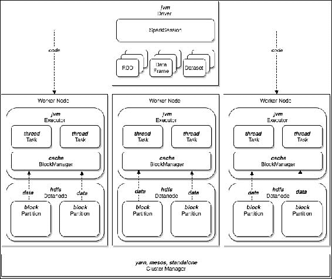
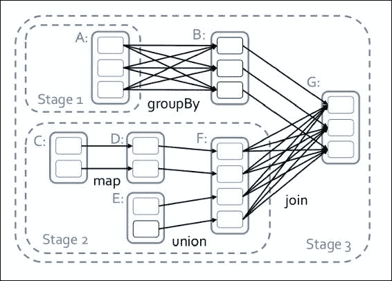
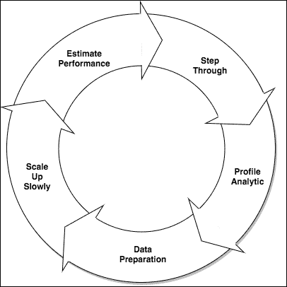
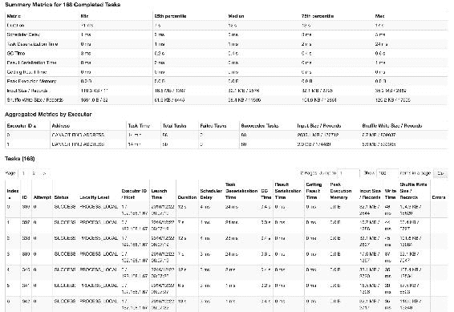
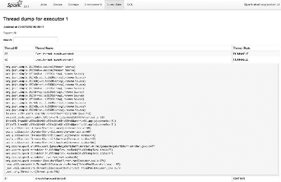
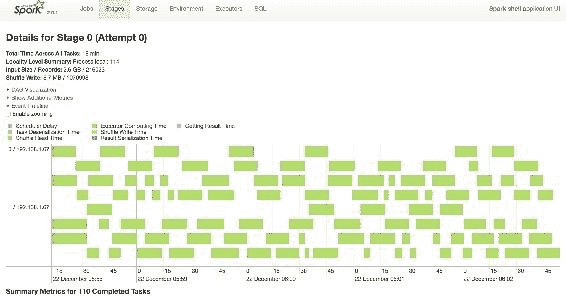
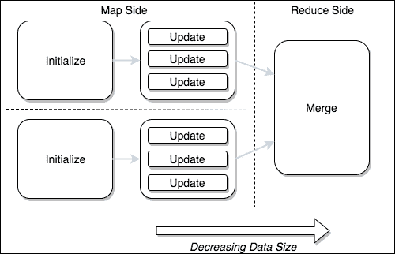
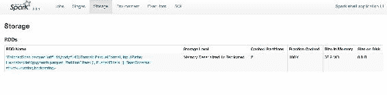

# 第十四章：可扩展算法

```scala
L1 cache                                 0.5 ns
```

L2 缓存 7 ns

主内存 100 ns

磁盘（随机查找） 2,000,000 ns

幸运的是，Spark 提供了内存处理能力，包括许多利用快速缓存（L1/L2/L3 缓存）的优化。因此，它可以避免不必要地从主内存读取或溢出到磁盘，重要的是你的分析要充分利用这些效率。这是作为 Tungsten 项目的一部分引入的，[`databricks.com/blog/2015/04/28/project-tungsten-bringing-spark-closer-to-bare-metal.html`](https://databricks.com/blog/2015/04/28/project-tungsten-bringing-spark-closer-to-bare-metal.html)。

+   **只有在观察后进行优化**：有一句著名的话是由传奇计算机科学家和作家 Donald Knuth 说的，即*过早的优化是万恶之源*。虽然听起来很极端，但他的意思是所有与性能相关的调整或优化都应该基于经验证据，而不是预先的直觉。因为这样的预测往往无法正确识别性能问题，反而导致后来后悔的糟糕设计选择。但与你可能认为的相反，这里的建议并不是你直到最后才考虑性能，事实上恰恰相反。在数据的大小和因此任何操作所需的时间决定一切的环境中，从分析设计过程的早期开始优化是至关重要的。但这不是 Knuth 法则的矛盾吗？嗯，不是。在性能方面，简单通常是关键。这种方法应该是基于证据的，所以从简单开始，仔细观察你的分析在运行时的性能（通过分析调整和代码分析，见下一节），进行有针对性的优化来纠正所识别的问题，并重复。过度设计通常与选择缓慢的算法一样常见，但它可能更难以在后期修复。**从小开始，逐步扩大**：从小数据样本开始。虽然分析可能*最终*需要在一百万亿字节的数据上运行，但从一个小数据集开始绝对是明智的。有时只需要少数行就可以确定分析是否按预期工作。并且可以添加更多行来证明各种测试和边缘情况。这里更多的是关于覆盖面而不是数量。分析设计过程是极其迭代的，明智地使用数据抽样将在这个阶段产生回报；即使一个小数据集也能让你在逐渐增加数据大小时测量性能的影响。

底线是，编写分析，特别是对你不熟悉的数据，可能需要时间，没有捷径。

现在我们有了一些指导方针，让我们专注于它们如何适用于 Spark。

# Spark 架构

Apache Spark 旨在简化费力且有时容易出错的高度并行分布式计算任务。为了了解它是如何做到这一点的，让我们探索其历史，并确定 Spark 带来了什么。

## Spark 的历史

Apache Spark 实现了一种*数据并行*，旨在改进 Apache Hadoop 所推广的 MapReduce 范式。它在四个关键领域扩展了 MapReduce：

+   **改进的编程模型**：Spark 通过其 API 提供了比 Hadoop 更高级的抽象层；创建了一个编程模型，大大减少了必须编写的代码量。通过引入一个流畅的、无副作用的、面向函数的 API，Spark 使得可以根据其转换和操作来推理分析，而不仅仅是映射器和减速器的序列。这使得更容易理解和调试。

+   **引入工作流**：与传统的 MapReduce 通过将结果持久化到磁盘并使用第三方工作流调度程序来链接作业不同，Spark 允许将分析分解为任务，并将其表示为**有向无环图**（**DAGs**）。这不仅立即消除了需要实现数据的需求，而且还意味着它对分析的运行方式有更多的控制，包括启用诸如基于成本的查询优化（在催化剂查询规划器中看到）等效率。

+   **更好的内存利用**：Spark 利用每个节点上的内存来缓存数据集。它允许在操作之间访问缓存，以提高基本 MapReduce 的性能。这对于迭代工作负载（例如**随机梯度下降**（**SGD**））特别有效，通常可以观察到性能显着提高。

+   **集成方法**：支持流处理、SQL 执行、图处理、机器学习、数据库集成等，它提供了一个工具来统治它们所有！在 Spark 之前，需要专门的工具，例如 Storm、Pig、Giraph、Mahout 等。尽管在某些情况下，专门的工具可能会提供更好的结果，但 Spark 对集成的持续承诺令人印象深刻。

除了这些一般改进之外，Spark 还提供了许多其他功能。让我们来看看里面的情况。

## 移动部件

在概念层面上，Apache Spark 内部有许多关键组件，其中许多您可能已经了解，但让我们在我们已经概述的可伸缩性原则的背景下对它们进行审查：



### 驱动程序

**驱动程序**是 Spark 的主要入口点。它是您启动的程序，它在单个 JVM 中运行，并启动和控制作业中的所有操作。

在性能方面，您可能希望避免将大型数据集带回驱动程序，因为运行此类操作（例如`rdd.collect`）通常会导致`OutOfMemoryError`。当返回的数据量超过由`--driver-memory`指定的驱动程序的 JVM 堆大小时，就会发生这种情况。

### SparkSession

当驱动程序启动时，`SparkSession`类被初始化。`SparkSession`类通过相关上下文（如`SQLContext`、`SparkContext`和`StreamingContext`类）提供对所有 Spark 服务的访问。

这也是调整 Spark 运行时与性能相关属性的地方。

### 弹性分布式数据集（RDD）

**弹性分布式数据集**（**RDD**）是表示分布式同类记录集的基础抽象。

尽管数据可能在集群中的许多机器上物理存储，但分析故意不知道它们的实际位置：它们只处理 RDD。在幕后，RDD 由分区或连续的数据块组成，就像蛋糕的切片。每个分区都有一个或多个副本，Spark 能够确定这些副本的物理位置，以决定在哪里运行转换任务以确保数据局部性。

### 注意

有关副本的物理位置是如何确定的示例，请参见：[`github.com/apache/spark/blob/master/core/src/main/scala/org/apache/spark/rdd/NewHadoopRDD.scala`](https://github.com/apache/spark/blob/master/core/src/main/scala/org/apache/spark/rdd/NewHadoopRDD.scala)中的`getPreferredLocations`。

RDD 还负责确保数据从底层块存储（例如 HDFS）中适当地缓存。

### 执行器

**执行器**是在集群的工作节点上运行的进程。启动时，每个执行器都会连接到驱动程序并等待运行数据操作的指令。

您决定您的分析需要多少执行器，这将成为您的最大并行级别。

### 注意

除非使用动态分配。在这种情况下，最大的并行级别是无限的，直到使用`spark.dynamicAllocation.maxExecutors`进行配置。有关详细信息，请参阅 Spark 配置。

### 洗牌操作

**洗牌**是指作为操作的一部分发生的数据在执行器之间的传输。它通常发生在数据分组时，以便具有相同键的所有记录都在单个机器上，但也可以被战略性地用于重新分区数据以获得更高级别的并行性。

然而，由于它涉及数据在网络上传输和持久性到磁盘，通常被认为是一个缓慢的操作。因此，洗牌对可扩展性非常重要，稍后会详细介绍。

### 集群管理器

**集群管理器**位于 Spark 之外，充当集群的资源协商者。它控制物理资源的初始分配，以便 Spark 能够在具有所需核心数和内存的机器上启动其执行程序。

尽管每个集群管理器的工作方式都不同，但你的选择不太可能对算法性能产生任何可测量的影响。

### 任务

任务代表对数据的单个分区运行一组操作的指令。每个任务都由驱动程序序列化到执行程序，并且实际上是指通过将处理移动到数据来实现的。

### DAG

**DAG**代表执行操作所涉及的所有转换的逻辑执行计划。其优化对于分析的性能至关重要。在 SparkSQL 和数据集的情况下，优化是由催化剂优化器代表你执行的。

### DAG 调度程序

**DAG 调度程序**创建一个物理计划，通过将 DAG 划分为阶段，并为每个阶段创建相应的任务集（每个分区一个任务）。



### 转换

**转换**是一种操作类型。它们通常将用户定义的函数应用于 RDD 中的每条记录。有两种转换，*窄*和*宽*。

窄转换是应用于分区的本地操作，因此不需要移动数据才能正确计算。它们包括：`filter`，`map`，`mapValues`，`flatMap`，`flatMapValues`，`glom`，`pipe`，`zipWithIndex`，`cartesian`，`union`，`mapPartitionsWithInputSplit`，`mapPartitions`，`mapPartitionsWithIndex`，`mapPartitionsWithContext`，`sample`，`randomSplit`。

相比之下，宽转换是需要移动数据才能正确计算的操作。换句话说，它们需要进行洗牌。它们包括：`sortByKey`，`reduceByKey`，`groupByKey`，`join`，`cartesian`，`combineByKey`，`partitionBy`，`repartition`，`repartitionAndSortWithinPartitions`，`coalesce`，`subtractByKey`，`cogroup`。

### 注意

`coalesce`，`subtractByKey`和`cogroup`转换可能是窄的，具体取决于数据的物理位置。

为了编写可扩展的分析，重要的是要意识到你正在使用哪种类型的转换。

### 阶段

**阶段**代表可以物理映射到任务（每个分区一个任务）的一组操作。有几点需要注意：

+   在 DAG 中连续出现的一系列窄转换会被合并成一个阶段。换句话说，它们按顺序在同一个执行器上执行，因此针对同一个分区，不需要进行洗牌。

+   每当在 DAG 中遇到宽转换时，就会引入一个阶段边界。现在存在两个阶段（或更多，例如连接等），第二个阶段在第一个完成之前不能开始（有关详细信息，请参阅`ShuffledRDD`类）。

### 操作

**操作**是 Spark 中的另一种操作类型。它们通常用于执行并行写入或将数据传输回驱动程序。虽然其他转换是惰性评估的，但是操作会触发 DAG 的执行。

在调用操作时，其父 RDD 被提交给驱动程序中的`SparkSession`或`SparkContext`类，DAG 调度程序生成用于执行的 DAG。

### 任务调度程序

**任务调度程序**接收由 DAG 调度程序确定的一组任务（每个分区一个任务），并安排每个任务在适当的执行程序上与数据局部性一起运行。

# 挑战

现在我们已经了解了 Spark 架构，让我们通过介绍一些可能会遇到的挑战或*陷阱*来为编写可扩展的分析做好准备。如果您不小心，没有提前了解这些问题，您可能会花费时间来自己解决这些问题！

## 算法复杂度

除了数据大小的明显影响外，分析的性能高度依赖于您尝试解决的问题的性质。即使是一些看似简单的问题，如图的深度优先搜索，在分布式环境中也没有效率高的明确定义的算法。在这种情况下，设计分析时应该非常小心，以确保它们利用可以轻松并行化的处理模式。在开始之前花时间了解问题的复杂性的本质，从长远来看会得到回报。在下一节中，我们将向您展示如何做到这一点。

### 注意

一般来说，*NC-complete*问题是可以并行化的，而 P-complete 问题则不行：[`en.wikipedia.org/wiki/NC_(complexity)`](https://en.wikipedia.org/wiki/NC_(complexity))。

还要注意的是，分布式算法在处理小数据时通常比单线程应用程序慢得多。值得注意的是，在所有数据都适合单台机器的情况下，Spark 的开销：生成进程、传输数据以及进程间通信引入的延迟，很少会有回报。只有在数据集足够大，无法轻松放入内存时，才会注意到使用 Spark 会提高吞吐量，即单位时间内可以处理的数据量。

## 数值异常

在处理大量数据时，您可能会注意到一些数字的奇怪效果。这些奇异性与现代计算机的通用数字表示以及*精度*的概念有关。

为了演示效果，请考虑以下内容：

```scala
scala> val i = Integer.MAX_VALUE
i: Int = 2147483647

scala> i + 1
res1: Int = -2147483648
```

注意到一个正数通过加一变成了负数。这种现象被称为**数字溢出**，当计算结果产生一个对于其类型来说太大的数字时就会发生。在这种情况下，一个`Int`有 32 位的固定宽度，所以当我们尝试存储一个 33 位的数字时，就会发生溢出，导致一个负数。这种行为可以针对任何数字类型进行演示，并且由于任何算术操作的结果而产生。

### 注意

这是由于大多数现代处理器制造商（因此也包括 Java 和 Scala）采用的有符号、固定宽度、二进制补码数表示。

尽管溢出在正常编程过程中会发生，但在处理大型数据集时更为明显。即使在执行相对简单的计算时，如求和或平均值，也可能发生溢出。让我们考虑最基本的例子：

```scala
scala> val distanceBetweenStars = Seq(2147483647, 2147483647)
distanceBetweenStars: Seq[Int] = List(2147483647, 2147483647)

scala> val rdd = spark.sparkContext.parallelize(distanceBetweenStars)
rdd: org.apache.spark.rdd.RDD[Int] =  ...

scala> rdd.reduce(_+_)
res1: Int = -2
```

数据集也不是免疫的：

```scala
scala> distanceBetweenStars.toDS.reduce(_+_)
res2: Int = -2
```

当然，有处理这个问题的策略；例如使用替代算法、不同的数据类型或更改测量单位。然而，在设计中应始终考虑解决这些问题的计划。

另一个类似的效果是由计算中的舍入误差引起的精度限制。为了说明问题，考虑这个非常基本（并不是非常复杂！）的例子：

```scala
scala> val bigNumber = Float.MaxValue
bigNumber: Float = 3.4028235E38

scala> val verySmall = Int.MaxValue / bigNumber
verySmall: Float = 6.310888E-30

scala> val almostAsBig = bigNumber - verySmall
almostAsBig: Float = 3.4028235E38

scala> bigNumber - almostAsBig
res2: Float = 0.0
```

在这里，我们期望得到答案`6.310887552645619145394993304824655E-30`，但实际上得到了零。这是明显的精度和意义的损失，展示了在设计分析时需要注意的另一种行为。

为了应对这些问题，Welford 和 Chan 设计了一个在线算法来计算`mean`和`variance`。它试图避免精度问题。在 Spark 的内部，实现了这个算法，可以在 PySpark StatCounter 中看到一个例子：

```scala
   def merge(self, value):
        delta = value - self.mu
        self.n += 1
        self.mu += delta / self.n
        self.m2 += delta * (value - self.mu)
        self.maxValue = maximum(self.maxValue, value)
        self.minValue = minimum(self.minValue, value)
```

让我们更深入地了解它是如何计算平均值和方差的：

+   `delta`：`delta`是当前运行平均值 mu 和考虑中的新值之间的差异。它衡量了数据点之间的值的变化，因此始终很小。它基本上是一个魔术数字，确保计算永远不涉及对所有值进行求和，因为这可能导致溢出。

+   `mu`：mu 代表当前运行平均值。在任何给定时间，它是迄今为止看到的值的总和，除以这些值的计数。`mu`通过不断应用`delta`来逐渐计算。

+   `m2`：`m2`是均方差的总和。它通过在计算过程中调整精度来帮助算法避免精度损失。这减少了通过舍入误差丢失的信息量。

恰好，这个特定的在线算法是专门用于计算统计数据的，但在线方法可能被任何分析的设计所采用。

## 洗牌

正如我们在原则部分中所指出的，数据的移动是昂贵的，这意味着编写任何可扩展分析的主要挑战之一是尽量减少数据传输。管理和处理数据传输的开销在目前仍然是一个非常昂贵的操作。我们将在本章后面讨论如何解决这个问题，但现在我们将意识到数据局部性周围的挑战；知道哪些操作是可以使用的，哪些应该避免，同时也了解替代方案。一些主要的问题是：

+   `笛卡尔()`

+   `reduce()`

+   `PairRDDFunctions.groupByKey()`

但要注意，经过一点思考，可以完全避免使用这些。

## 数据方案

为数据选择一个模式对于分析设计至关重要。显然，通常你对数据的格式没有选择权；要么会有一个模式强加给你，要么你的数据可能没有模式。无论哪种情况，通过诸如“临时表”和“读时模式”（详见第三章，“输入格式和模式”中的详细信息），你仍然可以控制数据如何呈现给你的分析 - 你应该利用这一点。这里有大量的选择，选择合适的选择是挑战的一部分。让我们讨论一些常见的方法，并从一些不太好的方法开始：

+   **OOP**：**面向对象编程**（**OOP**）是将问题分解为模拟现实世界概念的类的一般编程概念。通常，定义将同时组织数据和行为，使其成为确保代码紧凑和可理解的一种流行方式。然而，在 Spark 的上下文中，创建复杂的对象结构，特别是包含丰富行为的对象结构，不太可能有助于您的分析，以便提高可读性或维护性。相反，这可能会大大增加需要垃圾回收的对象数量，并限制代码重用的范围。Spark 是使用*功能方法*设计的，虽然您应该小心放弃对象，但应努力保持它们简单，并在安全的情况下重用对象引用。

+   **3NF**：几十年来，数据库一直针对某些类型的模式进行优化-关系型，星型，雪花等等。而**第三范式**（**3NF**）等技术可以很好地确保传统数据模型的正确性。然而，在 Spark 的上下文中，强制动态表连接或/和将事实与维度连接会导致洗牌，可能会有很多次洗牌，这对性能来说是不利的。

+   **去规范化**：去规范化是确保您的分析具有所需数据而无需进行洗牌的实用方法。数据可以被安排成一起处理的记录也一起存储。这增加了存储大部分数据的重复成本，但通常是一种值得的权衡。特别是因为有技术和技术可以帮助克服重复成本，例如列式存储，列修剪等等。稍后再详细介绍。

现在我们了解了在设计分析时可能遇到的一些困难，让我们深入了解如何应用解决这些问题的模式，并确保您的分析运行良好的细节。

# 规划你的路线

当你专注于尝试最新的技术和数据时，很容易忽视规划和准备工作！然而，编写可扩展算法的*过程*与算法本身一样重要。因此，了解规划在项目中的作用并选择一个允许你应对目标需求的操作框架至关重要。第一个建议是采用*敏捷开发方法*。

分析创作的独特起伏可能意味着项目没有自然的结束。通过纪律和系统化的方法，您可以避免许多导致项目表现不佳和代码性能不佳的陷阱。相反，没有创新的开源软件或大量的语料库也无法拯救一个没有结构的项目。

由于每个数据科学项目都略有不同，因此在整体管理方面没有对错答案。在这里，我们提供一套基于经验的指导方针或最佳实践，应该有助于应对数据领域的挑战。

处理大量数据时，即使在计算中出现小错误，也可能导致许多时间的浪费-等待作业处理，而不确定何时或是否会完成。因此，一般来说，应该以与设计实验相似的严谨程度来处理分析创作。这里的重点应该是实用性，并且应该注意预测更改对处理时间的影响。

以下是在开发过程中避免麻烦的一些提示。

## 迭代

采取迭代方法处理日常工作，并逐步构建您的分析。随着工作的进行添加功能，并使用单元测试确保在添加更多功能之前有一个坚实的基础。对于您进行的每个代码更改，考虑采用迭代循环，例如下图所示的循环：



让我们依次讨论这些步骤。

### 数据准备

与往常一样，第一步是了解您将要处理的数据。如前所述，您可能需要处理语料库中存在的所有边缘情况。您应该考虑从基本数据概要开始，以了解数据是否符合您的期望，包括真实性和质量，潜在风险在哪里，以及如何将其分成类别以便进行处理。在第四章中详细描述了这种方法，*探索性数据分析*。

除了**探索性数据分析**（**EDA**）外，了解数据的形状将使您能够推断出您的分析设计，并预测您可能需要满足的额外需求。

例如，这里是一个快速的数据概要，显示了给定日期的一些 GDELT 新闻文章下载的完整性：

```scala
content
  .as[Content]
  .map{
    _.body match {
      case b if b.isEmpty  => ("NOT FOUND",1)
      case _ => ("FOUND",1)
    }
  }
  .groupByKey(_._1)
  .reduceGroups {
     (v1,v2) => (v1._1, v1._2 + v2._2)
  }
  .toDF("NEWS ARTICLE","COUNT")
  .show
```

结果如下表所示：

```scala
+------------+------+
|NEWS ARTICLE| COUNT|
+------------+------+
|       FOUND|154572|
|   NOT FOUND|190285|
+------------+------+
```

对于这一天，您将看到实际上大多数 GKG 记录没有相关的新闻文章内容。尽管这可能是由于各种原因，但要注意的是这些缺失的文章形成了一类新的记录，需要不同的处理。我们将不得不为这些记录编写一个替代流程，并且该流程可能具有不同的性能特征。

### 缓慢扩大规模

在数据方面，*从小规模开始逐步扩大*是很重要的。不要害怕从语料库的子集开始。考虑在数据概要阶段选择一个重要的子集，或者在许多情况下，使用每个子集中的少量记录是有益的。重要的是所选择的子集足够代表特定的用例、功能或特性，同时又足够小以允许*及时迭代*。

在前面的 GDELT 示例中，我们可以暂时忽略没有内容的记录，只处理包含新闻文章的子集。这样，我们将过滤掉任何麻烦的情况，并在后续迭代中处理它们。

说到这一点，最终你肯定会想要重新引入语料库中存在的所有子集和边缘情况。虽然可以逐步进行这样做，先包括更重要的类，然后留下边缘情况，但最终需要理解数据集中每条记录的行为，甚至是异常值，因为它们很可能不是一次性事件。您还需要了解任何数据在生产中的影响，无论频率如何，以避免由于单个异常记录而导致整个运行失败。

### 估算性能

在编写每个转换时，要注意复杂性方面的时间成本。例如，问自己，“如果我将输入加倍，运行时间会受到什么影响？”。在考虑这一点时，考虑**大 O 符号**是有帮助的。大 O 不会给出确切的性能数字；它不考虑实际因素，如核心数量、可用内存或网络速度。然而，它可以作为指南，以便获得处理复杂性的指示性度量。

作为提醒，以下是一些常见的符号，按时间复杂度顺序（首选-优先）：

| **符号** | **描述** | **示例操作** |
| --- | --- | --- |
| O(1) | 常数（快速）不依赖于大小 | `broadcast.value``printSchema` |
| O(log n) | 对数*随 n 个节点的平衡树的高度增长* | `pregel``connectedComponents` |
| O(n) | 线性*与 n（行）成比例增长* | `map``filter``count``reduceByKey``reduceGroups` |
| O(n + m) | 线性*与 n 和 m（其他数据集）成比例增长* | `join``joinWith``groupWith``cogroup``fullOuterJoin` |
| O(n²) | 二次方*随 n 的平方增长* | `笛卡尔积` |
| O(n²c) | 多项式（慢）*与 n 和 c（列）成比例增长* | `LogisticRegression.fit` |

在设计分析时，使用这种符号可以帮助你选择最有效的操作。例如，如何用`connectedComponents` [O(log n)] 替换`笛卡尔积` [O(n²)]，请参见第十章，*故事去重和变异*。

它还让你在执行作业之前估计你的分析性能特征。你可以将这些信息与集群的并行性和配置结合使用，以确保在执行作业的时候，最大限度地利用资源。

### 仔细地一步一步地进行

Spark 的出色、流畅、面向函数的 API 旨在允许*链接*转换。事实上，这是它的主要优势之一，正如我们所见，它特别方便构建数据科学管道。然而，正是因为这种便利，很容易写一系列命令，然后一次性执行它们。正如你可能已经发现的那样，如果发生故障或者得不到预期的结果，那么到目前为止的所有处理都将丢失，并且必须重新执行。由于开发过程具有迭代特性，这导致了一个过长的周期，往往会导致时间的浪费。

为了避免这个问题，在每次迭代过程中能够**快速失败**是很重要的。因此，在继续之前，考虑养成在小样本数据上逐步运行一步的习惯。通过在每个转换后发出一个动作，比如计数或小的取样，你可以检查正确性，并确保每一步都成功后再进行下一步。通过在前期投入一点关注和注意，你将更好地利用你的时间，你的开发周期也会更快。

除此之外，在开发生命周期中尽可能地考虑将中间数据集持久化到磁盘，以避免重复计算，特别是在计算量大或可重复使用的情况下。这是一种磁盘缓存的形式，类似于*检查点*（在 spark 流处理中存储状态时使用）。事实上，这是在编写 CPU 密集型分析时的常见权衡，特别是在开发运行在大型数据集上的分析时特别有用。然而，这是一个权衡，因此要决定是否值得，需要评估从头计算数据集所需的时间与从磁盘读取数据集所需的时间。

如果决定持久化，确保使用`ds.write.save`并格式化为`parquet`（默认），以避免定制类和序列化版本问题的泛滥。这样你就能保留读取时的模式的好处。

此外，在迭代分析开发生命周期时，编写自己的高性能函数时，保持一个**回归测试包**是个好主意。这有几个好处：

1.  它让你确保在引入新的数据类时，你没有破坏现有的功能。

1.  它给了你对代码正确性的一定程度的信心，直到你正在处理的步骤。

您可以使用单元测试轻松创建回归测试包。有许多单元测试框架可帮助实现这一点。一个流行的方法是通过将实际结果与预期结果进行比较来测试每个函数。通过这种方式，您可以逐渐构建一个测试包，通过为每个函数指定测试和相应的数据来完成。让我们通过一个简单的例子来解释如何做到这一点。假设我们有以下模型，取自 GDELT GKG 数据集：

```scala
case class PersonTone(article: String, name: String, tone: Double)

object Brexit {
  def averageNewsSentiment(df: DataFrame): Dataset[(String,Double)] = ???
}
```

我们希望测试给定`PersonTone`的 DataFrame，`averageNewsSentiment`函数是否正确计算了来自所有文章的各种人的平均语调。为了编写这个单元测试，我们对函数的工作原理不太感兴趣，只关心它是否按照*预期*工作。因此，我们将按照以下步骤进行：

1.  导入所需的单元测试框架。在这种情况下，让我们使用`ScalaTest`和一个方便的 DataFrame 风格的解析框架，称为`product-collections`：

```scala
        <dependency>
          <groupId>com.github.marklister</groupId>
          <artifactId>product-
          collections_${scala.binary.version}</artifactId>
          <version>1.4.5</version>
        <scope>test</scope>
        </dependency>

        <dependency>
         <groupId>org.scalatest</groupId>
         <artifactId>scalatest_${scala.binary.version}  </artifactId>
         <scope>test</scope>
        </dependency>
```

1.  我们还将使用`ScalaTest FunSuite`的自定义扩展，称为`SparkFunSuite`，我们在第三章中介绍了这一扩展，*输入格式和模式*，您可以在代码库中找到。

1.  接下来，模拟一些输入数据并定义*预期*结果。

1.  然后，对输入数据运行该函数并收集*实际*结果。注意：这在本地运行，不需要集群。

1.  最后，*验证*实际结果是否与预期结果匹配，如果不匹配，则测试失败。

完整的单元测试如下所示：

```scala
import java.io.StringReader
import io.gzet.test.SparkFunSuite
import org.scalatest.Matchers
import com.github.marklister.collections.io._

class RegressionTest extends SparkFunSuite with Matchers {

  localTest("should compute average sentiment") { spark =>

    // given
    val input = CsvParser(PersonTone)
                  .parse(new StringReader(
"""http://www.ibtimes.co.uk/...,Nigel Farage,-2.4725485679183
http://www.computerweekly.co.uk/...,Iain Duncan-Smith,1.95886385896181
http://www.guardian.com/...,Nigel Farage,3.79346680716544
http://nbc-2.com/...,David Cameron,0.195886385896181
http://dailyamerican.com/...,David Cameron,-5.82329317269076"""))

    val expectedOutput = Array(
      ("Nigel Farage", 1.32091823925),
      ("Iain Duncan-Smith",1.95886385896181),
      ("David Cameron",-5.62740678679))

    // when
    val actualOutput =
             Brexit.averageNewsSentiment(input.toDS).collect()

    // test
    actualOutput should have length expectedOutput.length
    actualOutput.toSet should be (expectedOutput.toSet)
  }
}
```

### 调优您的分析

分析调优的目的是确保在集群的实际限制内，您的分析能够平稳运行并实现最大效率。大多数情况下，这意味着尝试确认内存在所有机器上的有效使用，确保集群得到充分利用，并确保您的分析不会受到过多的 IO、CPU 或网络限制。由于处理的分布性质和涉及的机器数量众多，这在集群上可能很难实现。

值得庆幸的是，Spark UI 旨在帮助您完成这项任务。它集中并提供了有关运行时性能和分析状态的有用信息的一站式服务。它可以帮助指出资源瓶颈，并告诉您代码大部分时间都在哪里运行。

让我们仔细看一下：

+   **输入大小或 Shuffle Read Size/Records**：用于窄转换和宽转换，无论哪种情况，这都是任务读取的数据总量，无论其来源（远程或本地）。如果您看到大的输入大小或记录数，考虑重新分区或增加执行器的数量。



+   **持续时间**：任务运行的时间。虽然完全取决于正在进行的计算任务的类型，但如果您看到小的输入大小和长时间运行，可能是 CPU 限制，考虑使用线程转储来确定时间花在哪里。

特别注意持续时间的任何变化。Spark UI 在**Stages**页面提供了最小值、25%、中位数、75%和最大值的数据。从中可以确定集群利用率的情况。换句话说，您的任务是否有数据的均匀分布，意味着计算责任的公平分配，或者您是否有严重偏斜的数据分布，意味着处理出现了长尾任务。如果是后者，查看处理数据分布的部分。

+   **Shuffle Write Size/Records**：作为洗牌的一部分要传输的数据量。可能会因任务而异，但通常您会希望确保总值尽可能低。

+   **本地性级别**：数据本地性的度量出现在**阶段**页面上。在最佳情况下，这应该是 PROCESS_LOCAL。然而，您会看到在洗牌或宽转换后它会改变为任何。这通常是无法避免的。然而，如果您看到大量的`NODE_LOCAL`或`RACK_LOCAL`用于窄转换：考虑增加执行器的数量，或在极端情况下确认您的存储系统块大小和复制因子，或重新平衡您的数据。

+   **GC 时间**：每个任务花费在垃圾回收上的时间，即清理内存中不再使用的对象。它不应超过总时间的大约 10%（由**持续时间**显示）。如果它过高，这可能表明存在潜在问题。然而，在尝试调整垃圾收集器之前，值得审查与数据分发相关的分析的其他领域（即执行器数量、JVM 堆大小、分区数量、并行性、偏斜等）。

+   **线程转储（每个执行器）**：在**执行器**页面上显示，线程转储选项允许您随时窥视任何执行器的内部工作。在尝试了解您的分析行为时，这可能非常有价值。线程转储被排序，并列出了列表顶部最有趣的线程，寻找标记为**Executor task launch worker**的线程，因为这些线程运行您的代码。

通过反复刷新此视图，并查看单个线程的堆栈跟踪，可以大致了解它花费时间的地方，从而确定关注的领域。

### 注意

或者，您可以使用火焰图，详情请参阅[`www.paypal-engineering.com/2016/09/08/spark-in-flames-profiling-spark-applications-using-flame-graphs/`](https://www.paypal-engineering.com/2016/09/08/spark-in-flames-profiling-spark-applications-using-flame-graphs/)。



+   **跳过的阶段**：不需要运行的阶段。通常，当一个阶段在**阶段**页面的此部分中显示时，这意味着在*缓存*中找到了 RDD 血统的这一部分的完整数据集，DAG 调度程序不需要重新计算，而是跳过到下一个阶段。一般来说，这是一个良好缓存策略的标志。

+   **事件时间线**：同样，在**阶段**页面上显示事件时间线提供了您运行任务的可视化表示。它对于查看并行性的水平以及任何给定时间每个执行器上执行的任务数量非常有用。

如果在初步调查后，您需要比 Spark UI 提供的更深入的信息，您可以使用操作系统提供的任何监控工具来调查基础设施的情况。以下是用于此目的的一些常见 Linux 工具的表格：

| **考虑的领域** | **工具** | **描述** | **示例用法** |
| --- | --- | --- | --- |
| 一般/CPU | htop | 进程活动监视器，刷新以显示接近实时的 CPU、内存和交换（以及其他内容）利用率 | htop -p <pid> |
|  | dstat | 高度可配置的系统资源利用率报告 | dstat -t -l -c -y -i -p -m -g -d -r -n 3 |
|  | ganglia | 用于分布式系统的聚合系统资源监视器 | 基于 Web 的 |
| Java 虚拟机 | jvmtop | 关于 JVM 的统计信息，包括资源利用率和实时查看其线程 | jvmtop <pid> |
|  | jps | 列出所有 JVM 进程 | jps -l |
|  | jmap | 包括堆上分配的所有对象的 JVM 内部内存映射 | jmap -histo <pid> &#124; head -20 |
|  | jstack | 包括完整线程转储的 JVM 快照 | jstack <pid> |
| 内存 | free | 内存利用的基本指南 | free -m |
|  | vmstat | 基于采样的详细系统资源统计，包括内存分配的细分 | vmstat -s |
| 磁盘 I/O | iostat | 提供磁盘 I/O 统计信息，包括 I/O 等待 | iostat -x 2 5 |
|  | iotop | 磁盘 I/O 监视器，类似于 top。显示进程级别的 I/O | iotop |
| 网络 | nettop | 包括实时 I/O 的网络连接活动监视器 | nettop -Pd |
|  | wireshark | 交互式网络流量分析器 | wireshark -i <iface> -ktshark -i <iface> |

# 设计模式和技术

在这一部分，我们将概述一些设计模式和一般技术，用于编写自己的分析。这些是一些提示和技巧的集合，代表了使用 Spark 的经验积累。它们被提供作为有效的 Spark 分析编写指南。当您遇到不可避免的可扩展性问题并不知道该怎么办时，它们也可以作为参考。

## Spark API

### 问题

由于有许多不同的 API 和函数可供选择，很难知道哪些是最有效的。

### 解决方案

Apache Spark 目前有一千多名贡献者，其中许多是经验丰富的世界级软件专业人士。它是一个成熟的框架，已经开发了六年多。在这段时间里，他们专注于从友好的 DataFrame API，基于 Netty 的洗牌机制，到催化剂查询计划优化器的每个部分的完善和优化。令人振奋的消息是，这一切都是“免费”的-只要您使用 Spark 2.0 中提供的最新 API。

最近的优化（由*project tungsten*引入），如离堆显式内存管理，缓存未命中改进和动态阶段生成，仅适用于较新的`DataFrame`和`Dataset` API，并且目前不受 RDD API 支持。此外，新引入的编码器比 Kryo 序列化或 Java 序列化快得多，占用的空间也更少。

在大多数情况下，这意味着数据集通常优于 RDD。

#### 例子

让我们用一个简单的例子来说明基本的文章中提到的人数的计数：

```scala
personDS                             personRDD
  .groupBy($"name")                    .map(p => (p.person,1)) 
  .count                               .reduceByKey(_+_)
  .sort($"count".desc)                 .sortBy(_._2,false)
  .show

36 seconds (Dataset API)             99 seconds (RDD API)
```

```scala
RDDs (using ds.rdd) when you need the flexibility to compute something not available on the higher level API.
```

## 摘要模式

### 问题

我的时间序列分析必须在严格的**服务级别协议**（**SLA**）内运行，并且没有足够的时间来计算整个数据集所需的结果。

### 解决方案

对于实时分析或具有严格 SLA 的分析，运行大型数据集上的漫长计算可能是不切实际的。有时需要使用两遍算法来设计分析，以便及时计算结果。为此，我们需要引入*摘要*模式的概念。

摘要模式是一种两遍算法，最终结果是仅从摘要的聚合中重建的。尽管只使用摘要，并且从未直接处理整个数据集，但聚合的结果与在整个原始数据集上运行时的结果相同。

基本步骤是：

1.  在适当的时间间隔（每分钟，每天，每周等）上计算摘要。

1.  将摘要数据持久化以供以后使用。

1.  在较大的时间间隔（每月，每年等）上计算聚合。

这是一种在设计增量或在线算法进行流式分析时特别有用的方法。

#### 例子

GDELT GKG 数据集是摘要数据集的一个很好的例子。

当然，每 15 分钟对全球媒体新闻文章进行情感分析或命名实体识别是不切实际的。幸运的是，GDELT 产生了这些 15 分钟的摘要，我们能够对其进行聚合，使这完全成为可能。

## 扩展和征服模式

### 问题

我的分析有相对较少的任务，每个任务的*输入/洗牌大小（字节）*很大。这些任务需要很长时间才能完成，有时执行者是空闲的。

### 解决方案

*扩展和征服*模式通过允许你增加并行性，将记录标记为更有效的并行执行。通过分解或解压每个记录，你使它们能够以不同的方式组合，分布在集群上，并由不同的执行者处理。

在这种模式中，通常与洗牌或`repartition`一起使用`flatMap`，以*增加*任务数量并减少每个任务处理的数据量。这产生了一个最佳情况，足够多的任务排队，以便没有执行者会空闲。它还可以帮助处理在一个机器的内存中处理大量数据并因此收到*内存不足错误*的情况。

这种有用且多才多艺的技术几乎在每个需要处理大型数据集的情况下都派上用场。它促进了简单数据结构的使用，并允许你充分利用 Spark 的分布式特性。

然而，需要注意的是，`flatMap`也可能导致性能问题，因为它有可能*增加*你的分析的时间复杂度。通过使用`flatMap`，你为每一行生成了许多记录，因此可能添加了需要处理的数据的另一个维度。因此，你应该始终考虑这种模式对算法复杂度的影响，使用大 O 符号表示法。

## 轻量级洗牌

### 问题

我的分析的*洗牌读取阻塞时间*占整体处理时间的很大比例（>5%）。我该怎么做才能避免等待洗牌完成？

### 解决方案

尽管 Spark 的洗牌经过精心设计，通过使用数据压缩和合并文件整合等技术来最小化网络和磁盘 I/O，但它有以下两个根本问题，这意味着它经常会成为性能瓶颈：

+   **它的 I/O 密集**：洗牌依赖于（i）在网络上传输数据和（ii）将数据写入目标机器的磁盘。因此，它比本地转换要慢得多。为了说明慢了多少，这里是从各种设备顺序读取 1MB 数据的相对时间：它的 I/O 密集：洗牌依赖于（i）在网络上传输数据和（ii）将数据写入目标机器的磁盘。因此，它比本地转换要慢得多。为了说明慢了多少，这里是从各种设备顺序读取 1MB 数据的相对时间：

*内存                     0.25 毫秒*

*10 GbE              10 毫秒*

*磁盘                     20 毫秒        *

在这个例子中，由于洗牌操作同时使用了网络和磁盘，所以它的速度大约会比在缓存的本地分区上执行的速度慢 120 倍。显然，计时会根据使用的设备的物理类型和速度而有所不同，这里提供的数字只是相对指导。

+   **它是并发的同步点**：一个阶段中的每个任务必须在下一个阶段开始之前完成。鉴于阶段边界涉及洗牌（参见`ShuffleMapStage`），它标志着执行中的一个点，任务必须等到该阶段的所有任务都完成才能开始。这产生了一个同步屏障，对性能有重大影响。

出于这些原因，尽量避免洗牌是可能的，或者至少最小化它的影响。

有时可以完全避免洗牌，事实上有一些模式，比如*广播变量*或*宽表模式*，提供了如何做到这一点的建议，但通常是不可避免的，所有可以做的就是减少传输的数据量，从而减少洗牌的影响。

在这种情况下，尝试构建一个*轻量级洗牌*，专门最小化数据传输-只传输必要的字节。

再次，如果您使用`Dataset`和`DataFrame`API，当 catalyst 生成逻辑查询计划时，它将执行 50 多个优化，包括自动*修剪*任何未使用的列或分区（请参阅[`github.com/apache/spark/blob/master/sql/catalyst/src/main/scala/org/apache/spark/sql/catalyst/optimizer/Optimizer.scala`](https://github.com/apache/spark/blob/master/sql/catalyst/src/main/scala/org/apache/spark/sql/catalyst/optimizer/Optimizer.scala)）。但如果您使用 RDD，您将不得不自己执行这些操作。以下是您可以尝试的一些技术：

+   **使用 map 来减少数据**：在洗牌之前立即在数据上调用`map`，以便摆脱任何在后续处理中没有使用的数据。

+   **仅使用键**：当您有键值对时，考虑使用`rdd.keys`而不是`rdd`。对于计数或成员资格测试等操作，这应该足够了。同样，考虑在适当的时候使用`values`。

+   **调整阶段顺序**：您应该先加入然后`groupBy`还是先`groupBy`然后加入？在 Spark 中，这主要取决于数据集的大小。使用每个转换前后的记录数量进行基于成本的评估应该是相当简单的。尝试找出哪种对您的数据集更有效。

+   **首先过滤**：一般来说，在洗牌之前过滤行是有利的，因为它减少了传输的行数。尽可能早地进行过滤，前提是您修改后的分析功能上是等效的。

在某些情况下，您还可以过滤掉整个分区，就像这样：

```scala
        val sortedPairs = rdd.sortByKey() 
        sortedPairs.filterByRange(lower, upper) 

```

+   **使用 CoGroup**：如果您有两个或更多个 RDD 都按相同的键分组，那么`CoGroup`可能能够在不引发洗牌的情况下将它们连接起来。这个巧妙的小技巧之所以有效，是因为任何使用相同类型`K`作为键的`RDD[(K,V)]`，并使用`HashPartitioner`进行分组的数据，将始终落在同一个节点上。因此，当按键`K`进行连接时，不需要移动任何数据。

+   **尝试不同的编解码器**：减少传输字节数的另一个提示是更改压缩算法。

Spark 提供了三个选项：`lz4`、`lzf`和`snappy`。考虑审查每个选项，以确定哪个对您特定类型的数据最有效：

```scala
        SparkSession
          .builder()
          .config("spark.io.compression.codec", "lzf")
```

## 宽表模式

### 问题

我的数据集中的一对多或多对多关系产生了许多破坏所有分析性能的洗牌。

### 解决方案

为了优化您的数据结构，我们建议将数据去规范化为对您特定类型的处理有用的形式。这种方法，这里描述为*宽表模式*，涉及将经常一起使用的数据结构组合在一起，以便它们组成单个记录。这样可以保留数据局部性并消除执行昂贵连接的需要。关系使用得越频繁，您就越能从这种数据局部性中受益。

该过程涉及构建一个包含您需要进行后续处理的所有内容的数据表示、视图或表。您可以通过编程方式构建这个，或者通过标准的*连接*SparkSQL 语句。然后，它会提前实现，并在需要时直接在您的分析中使用。

在必要时，数据会在每一行之间复制，以确保自给自足。您应该抵制将额外的表因素出来的冲动，比如第三范式或雪花设计中的表，并依靠列式数据格式，如 Parquet 和 ORC，提供高效的存储机制，而不会牺牲快速的顺序访问。它们可以通过按列排列数据并在每列内压缩数据来实现这一点，这有助于在复制数据时减轻担忧。

同样，嵌套类型、类或数组通常可以在记录内部有效地表示子类或复合数据类。同样，避免在分析运行时进行必要的动态连接。

#### 示例

有关如何使用非规范化数据结构（包括嵌套类型）的示例，请参见*第三章，输入格式和模式*。

## 广播变量模式

### 问题

我的分析需要许多紧凑的参考数据集和维度表，尽管它们的大小较小，但会导致所有数据的昂贵洗牌。

### 解决方案

虽然某些数据集-例如交易日志或推文-在理论上是无限大的，但其他数据集具有自然限制，永远不会超出一定大小。这些被称为*有界数据集*。尽管它们可能会随时间偶尔发生变化，但它们是相当稳定的，并且可以说被保存在有限的空间内。例如，英国所有邮政编码的列表可以被视为有界数据集。

当加入到有界数据集或任何小集合时，有机会利用 Spark 提供的效率模式。与通常使用连接不同，连接通常会引发可能传输所有数据的洗牌，考虑改用广播变量。一旦分配，广播变量将分发并在集群中的所有执行程序中提供本地可用。您可以这样使用广播变量：

#### 创建广播变量

```scala
val toBeBroadcast = smallDataset.collect
val bv = spark.sparkContext.broadcast(toBeBroadcast)
```

### 注意

确保收集要广播的任何数据。

#### 访问广播变量

```scala
ds.mapPartitions { partition =>

    val smallDataset = bv.value
    partition map { r => f(r, bv.value) }
}
```

#### 删除广播变量

```scala
bv.destroy() 

```

广播变量可以由`RDD` API 或`Dataset` API 使用。此外，您仍然可以在 SparkSQL 中利用广播变量-它将自动处理。只需确保阈值设置在要加入的表的大小以上，如下所示：

```scala
SparkSession
  .builder()
  .config("spark.sql.autoBroadcastJoinThreshold", "50MB")
```

#### 例子

有关如何使用广播变量实现高效的连接和过滤的示例，请参见第九章*，新闻词典和实时标记系统*。

## 组合器模式

### 问题

我的分析正在根据一组键执行聚合，因此必须对*所有键的所有数据*进行洗牌。因此，速度非常慢。

### 解决方案

Apache Spark 的洗牌能力的核心是一种强大而灵活的模式，这里称为*组合器*模式，它提供了一种大大减少洗牌数据量的机制。组合器模式非常重要，以至于可以在 Spark 代码的多个位置找到它的示例-要在此处看到它的实际效果，以下是其中一些示例：

+   `ExternalAppendOnlyMap`

+   `CoGroupedRDD`

+   `声明式聚合`

+   `ReduceAggregator`

实际上，所有使用洗牌操作的高级 API，例如`groupBy`，`reduceByKey`，`combineByKey`等，都使用此模式作为其处理的核心。但是，先前提到的实现中存在一些变化，尽管基本概念是相同的。让我们仔细看看。

组合器模式提供了一种有效的方法，可以并行计算一组记录的函数，然后组合它们的输出以实现整体结果。



通常，调用者必须提供三个函数：

+   **初始化***(e) -> C[0]: *创建初始*容器*，也称为`createCombiner`，`type`构造函数或`zero`。

在此函数中，您应该创建和初始化一个实例，该实例将作为所有其他组合值的容器。有时还会提供每个键的第一个值，以预先填充最终将保存该键的所有组合值的容器。在这种情况下，该函数称为*单元*。

值得注意的是，此函数在数据集中的每个分区上每个键执行一次。因此，对于每个键可能会多次调用，因此不能引入任何可能在数据集分布不同的情况下产生不一致结果的副作用。

+   **更新***(C[0], e) -> C[i]: *向容器中添加一个元素。也被称为`mergeValue`、`bind` *函数*或`reduce`。

在这个函数中，您应该将源 RDD 中的记录添加到容器中。这通常涉及以某种方式转换或聚合值，只有这个计算的输出才会在容器内继续前进。

更新以并行和任意顺序执行，因此此函数必须是可交换和可结合的。

+   **合并***(C[i], C[j]) -> C[k]: *将两个容器合并在一起。也被称为`mergeCombiners`或`merge`。

在这个函数中，您应该组合每个容器所代表的值，形成一个新的值，然后将其带入下一步。

同样，由于合并顺序没有保证，这个函数应该是可交换和可结合的。

您可能已经注意到了这种模式与*monads*的概念之间的相似性。如果您还没有遇到 monads，它们代表一种抽象的数学概念，在函数式编程中用来表达函数，使得它们以一般的方式可组合。它们支持许多特性，比如组合、无副作用的执行、可重复性、一致性、惰性求值、不可变性，并提供许多其他好处。我们不会在这里对 monads 进行全面的解释，因为已经有很多很好的介绍了 - 例如[`www.simononsoftware.com/a-short-introduction-to-monads/`](http://www.simononsoftware.com/a-short-introduction-to-monads/)，它采用的是实践而不是理论的观点。相反，我们将解释组合器模式的不同之处以及它如何帮助理解 Spark。

Spark 在数据集中的每条记录上执行`update`函数。由于其分布式性质，这可以并行进行。它还运行*merge*函数来合并每个分区输出的结果。同样，由于这个函数是并行应用的，因此可以以任何顺序组合，Spark 要求这些函数是*可交换*的，这意味着它们被应用的顺序对最终答案没有影响。正是这个可交换的合并步骤真正提供了定义的基础。

了解这种模式对于推理任何分布式聚合的行为是有用的。如果您对这种模式感兴趣，可以在[`github.com/apache/spark/blob/master/sql/core/src/main/scala/org/apache/spark/sql/expressions/Aggregator.scala`](https://github.com/apache/spark/blob/master/sql/core/src/main/scala/org/apache/spark/sql/expressions/Aggregator.scala)中找到一个不错的实现。

除此之外，在尝试确定使用哪个高级 API 时，这也是有用的。由于有这么多可用的 API，有时很难知道选择哪一个。通过将*types*的理解应用到前面的描述中，我们可以决定使用最合适和性能最佳的 API。例如，如果*e*和*C[n]*的类型相同，您应该考虑使用`reduceByKey`。然而，如果*e*的类型与*C[n]*不同，那么应该考虑使用`combineByKey`等操作。

为了说明这一点，让我们考虑一些使用 RDD API 上四种最常见操作的不同方法。

#### 例子

为了提供一些背景，假设我们有一个 RDD，其中包含表示新闻文章中提到的人的键值对，其中键是文章中提到的人的姓名，值是经过预过滤、标记化、词袋化的文章的文本版本：

```scala
// (person:String, article:Array[String])
val rdd:RDD[(String,Array[String])] = ...
```

现在假设我们想要找出提到某个人的文章的一些统计数据，例如最小和最大长度，最常用的单词（不包括停用词）等。在这种情况下，我们的结果将是`(person:String,stats:ArticleStats)`的形式，其中`ArticleStats`是一个用于保存所需统计数据的 case 类：

```scala
case class ArticleStats(minLength:Long,maxLength:Long,mfuWord:(String,Int))
```

让我们从之前描述的三个组合器函数的定义开始：

```scala
val init = (a:Array[String]) => {
  ArticleStats(a)
}

val update = (stats:ArticleStats, a:Array[String]) => {
  stats |+| ArticleStats(a)
}

val merge = (s1:ArticleStats,s2:ArticleStats) => {
  s1 |+| s2
}
```

您可能会注意到，这些函数实际上只是我们模式的语法糖；真正的逻辑隐藏在伴随类和半群中：

```scala
object ArticleStats {
  def apply(a:Array[String]) =
    new ArticleStats(calcMin(a),calcMax(a),findMFUWord(a))
 ...
}

implicit object statsSemiGroup extends SemiGroup[ArticleStats] {
  def append(a: ArticleStats, b: ArticleStats) : ArticleStats = ???
}
```

对于我们的目的，我们不会详细介绍这些，让我们假设计算统计数据所需的任何计算都是由支持代码执行的-包括查找两个先前计算的指标的极端的逻辑-而不是专注于解释我们的不同方法。

**GroupByKey 方法**：

我们的第一种方法是迄今为止最慢的选项，因为`groupByKey`不使用`update`函数。尽管存在这种明显的劣势，我们仍然可以实现我们的结果-通过在第一个映射和最后一个执行减少侧面聚合的地方夹入`groupByKey`：

```scala
rdd.mapValues { case value => init(value) }
   .groupByKey()
   .mapValues { case list => list.fold(merge) } // note: update not used
```

但是，您会注意到它不执行任何 map-side 组合以提高效率，而是更喜欢在 reduce-side 上组合所有值，这意味着所有值都作为洗牌的一部分在网络上复制。

因此，在采用这种方法之前，您应该始终考虑以下替代方案。

**ReduceByKey 方法**：

为了改进这一点，我们可以使用`reduceByKey`。与`groupByKey`不同，`reduceByKey`通过使用`update`函数提供了 map-side 组合以提高效率。在性能方面，它提供了最佳方法。但是，仍然需要在调用之前手动将每个值转换为正确的类型：

```scala
rdd.map(init(_._2)).reduceByKey(merge)
```

通过将源`RDD`中的记录映射到所需的类型，结果分两步实现。

**AggregateByKey 方法**：

再次，`aggregateByKey`提供了与`reduceByKey`相同的性能特征-通过实现 map-side combine-但这次作为一个操作：

```scala
rdd.aggregateByKey(ArticleStats())(update,merge) 

update and merge being called, however init is not used directly. Instead, an empty container, in the form of a blank ArticleStats object, is provided explicitly for the purposes of initialization. This syntax is closer to that of fold, so it's useful if you're more familiar with that style.
```

**CombineByKey 方法**：

一般来说，`combineByKey`被认为是最灵活的基于键的操作，可以完全控制组合器模式中的所有三个函数：

```scala
rdd.combineByKey(init,update,merge)
```

虽然将`init`作为*函数*而不仅仅是单个值可能会在某些情况下为您提供更多的灵活性，但实际上对于大多数问题来说，`init`，`update`和`merge`之间的关系是这样的，以至于在功能或性能方面您并没有真正获得任何好处。而且无论如何，所有三个都由`combineByKeyWithClassTag`支持，因此在这种情况下，可以随意选择更适合您问题的语法或者只选择您更喜欢的语法。

## 优化的集群

### 问题

我想知道如何配置我的 Spark 作业的执行器，以充分利用集群的资源，但是有这么多选项，我感到困惑。

### 解决方案

由于 Spark 设计为水平扩展，一般来说，您应该更喜欢*更多*的执行器而不是*更大*的执行器。但是每个执行器都带来了 JVM 的开销，因此最好通过在每个执行器内运行*多个*任务来充分利用它们。由于这似乎有点矛盾，让我们看看如何配置 Spark 以实现这一点。

Spark 提供以下选项（在命令行或配置中指定）：

```scala
--num-executors (YARN-only setting [as of Spark 2.0])
--executor-cores
--executor-memory
--total-executor-cores
```

可以使用以下公式估算执行器数量：

*执行器数量=（总核心数-集群开销）/每个执行器的核心数*

例如，当使用基于 YARN 的集群访问 HDFS 并在 YARN 客户端模式下运行时，方程如下：

*((T-（2*N + 6）)/5)*

其中：

`T`：集群中的总核心数。

`N`：集群中的节点总数。

`2`：去除 HDFS 和 YARN 的*每个节点*开销。

假设每个节点上有两个 HDFS 进程-`DataNode`和`NodeManager`。

`6`：去除 HDFS 和 YARN 的*主进程*开销。

假设平均有六个进程-`NameNode`、`ResourceManager`、`SecondaryNameNode`、`ProxyServer`、`HistoryServer`等等。显然，这只是一个例子，实际上取决于集群中运行的其他服务，以及其他因素，如 Zookeeper quorum 大小、HA 策略等等。

`5`：据说，每个执行器的最佳核心数，以确保最佳任务并发性而不会产生严重的磁盘 I/O 争用。

内存分配可以使用以下公式估算：

*每个执行器的内存=（每个节点的内存/每个节点的执行器数）*安全系数*

例如，当使用基于 YARN 的集群以 YARN-client 模式运行，每个节点为 64 GB 时，方程如下：

*(64 / E)* 0.9 => 57.6 / E*

其中：

`E`：每个节点的执行器数（如前面的示例中计算的）。

`0.9`：在扣除堆外内存后分配给堆的实际内存的比例。

开销（`spark.yarn.executor.memoryOverhead`，默认 10%）。

值得注意的是，虽然通常将更多的内存分配给执行器（允许更多的空间用于排序、缓存等）是有益的，但增加内存也会增加*垃圾收集压力*。GC 必须扫描整个堆以查找不可达的对象引用，因此，它必须分析的内存区域越大，它消耗的资源就越多，而在某个时候，这会导致收益递减。虽然没有绝对的数字来说明在什么时候会发生这种情况，但作为一个经验法则，保持每个执行器的内存低于 64 GB 可以避免问题。

上述方程应该为调整集群大小提供一个良好的起点估计。为了进一步调整，您可能希望通过调整这些设置并使用 Spark UI 来测量性能的影响来进行实验。

## 重新分配模式

### 问题

我的分析总是在同几个执行器上运行。如何增加并行性？

### 解决方案

当`Datasets`和`RDDs`相对较小时，即使使用`flatMap`扩展它们，衍生的任何子代都将采用父代的分区数。

因此，如果您的一些执行器处于空闲状态，调用`repartition`函数可能会提高您的并行性。您将立即付出移动数据的成本，但这可能会在整体上得到回报。

使用以下命令确定数据的分区数和并行性：

```scala
ds.rdd.getNumPartitions()
```

如果分区数少于集群允许的最大任务数，则没有充分利用执行器。

相反，如果有大量的任务（10,000+）并且运行时间不长，那么您可能应该调用`coalesce`来更好地利用您的资源-启动和停止任务相对昂贵！

#### 示例

在这里，我们将`Dataset`的并行性增加到`400`。物理计划将显示为`RoundRobinPartitioning(400)`，如下所示：

```scala
ds.repartition(400)
  .groupByKey($"key")
  .reduceGroups(f)
  .explain

...

+- Exchange RoundRobinPartitioning(400)
                  +- *BatchedScan parquet
```

这里是`RDD`的等效重新分区，只需在`reduceByKey`函数中指定要使用的分区数：

```scala
rdd.reduceByKey(f,400)
    .toDebugString

res1: String =
(400) ShuffledRDD[11] at reduceByKey at <console>:26 []
  +-(7) MapPartitionsRDD[10] at map at <console>:26 []
     |  MapPartitionsRDD[6] at rdd at <console>:26 []
     |  MapPartitionsRDD[5] at rdd at <console>:26 []
     |  MapPartitionsRDD[4] at rdd at <console>:26 []
     |  FileScanRDD[3] at rdd at <console>:26 []
```

## 盐键模式

### 问题

我的大多数任务都在合理的时间内完成，但总会有一两个任务花费更长的时间（>10 倍），重新分区似乎没有任何好处。

### 解决方案

如果您遇到必须等待少数慢任务的情况，那么您可能遭受数据分布不均的影响。这种情况的症状是，您会看到一些任务所花费的时间远远超过其他任务，或者一些任务的输入或输出要多得多。

如果是这种情况，首先要做的是检查键的数量是否大于执行器的数量，因为粗粒度分组可能会限制并行性。查找`RDD`中键的数量的快速方法是使用`rdd.keys.count`。如果这个值低于执行器的数量，那么请重新考虑您的键策略。例如，*扩展和征服*等模式可能会有所帮助。

如果前面的事情都有序，需要审查的下一件事是键分布。当您发现少数键具有大量关联值时，考虑*盐化键*模式。在此模式中，通过附加一个随机元素来细分热门键。例如：

```scala
rdd filter {
   case (k,v) => isPopular(k)
}
.map {
   case (k,v) => (k + r.nextInt(n), v)
}
```

这导致了更加平衡的键分布，因为在洗牌过程中，`HashPartitioner`将新的键发送到不同的执行器。您可以选择 n 的值来适应您需要的并行性 - 数据中更大的偏斜需要更大范围的盐。

当然，所有这些盐化都意味着您需要重新聚合到旧键上，以确保最终计算出正确的答案。但是，根据数据中的偏斜程度，两阶段聚合可能仍然更快。

您可以将这种盐应用于所有键，或者像前面的示例中那样进行过滤。您在示例中决定的过滤阈值，由`isPopular`决定，也完全由您自己选择。

## 二次排序模式

### 问题

当按键分组时，我的分析必须在它们分组之后显式对值进行排序。这种排序发生在内存中，因此大的值集需要很长时间，它们可能涉及溢出到磁盘，并且有时会出现`OutOfMemoryError`。以下是问题方法的示例：

```scala
rdd.reduceByKey(_+_).sortBy(_._2,false) // inefficient for large groups
```

相反，当按键分组时，应该在每个键内预先排序值，以便进行即时和高效的后续处理。

### 解决方案

使用*二次排序*模式通过使用洗牌机制高效地对组中的项目列表进行排序。这种方法在处理最大的数据集时也能够扩展。

为了有效地进行排序，此模式利用了三个概念：

1.  **复合键**：包含您想要按组进行分组的元素*和*您想要按排序进行排序的元素。

1.  **分组分区器**：了解复合键的哪些部分与*分组*相关。

1.  **复合键排序**：了解复合键的哪些部分与*排序*相关。

这些概念中的每一个都被注入到 Spark 中，以便最终的数据集呈现为分组和排序。

请注意，为了执行二次排序，您需要使用`RDDs`，因为新的`Dataset` API 目前不受支持。跟踪以下 JIRA 的进展[`issues.apache.org/jira/browse/SPARK-3655`](https://issues.apache.org/jira/browse/SPARK-3655)。

#### 示例

考虑以下模型：

```scala
case class Mention(name:String, article:String, published:Long) 

```

这里有一个实体，代表了人们在新闻文章中被提及的场合，包括人名、提及的文章以及其发布日期。

假设我们想要将所有提到相同名称的人的提及内容分组在一起，并按时间排序。让我们看看我们需要的三种机制：

**复合键**：

```scala
case class SortKey(name:String, published:Long)
```

*包含名称和发布日期。*

**分组分区器**：

```scala
class GroupingPartitioner(partitions: Int) extends Partitioner {

    override def numPartitions: Int = partitions

    override def getPartition(key: Any): Int = {

      val groupBy = key.asInstanceOf[SortKey]
      groupBy.name.hashCode() % numPartitions
    }
  }
```

*它只是按名称分组。*

**复合键排序**：

```scala
implicit val sortBy: Ordering[SortKey] = Ordering.by(m => m.published)
```

*它只是按发布日期排序。*

一旦我们定义了这些，我们就可以在 API 中使用它们，就像这样：

```scala
val pairs = mentions.rdd.keyBy(m => SortKey(m.name, m.published))
pairs.repartitionAndSortWithinPartitions(new GroupingPartitioner(n))
```

这里使用`SortKey`来配对数据，使用`GroupingPartitioner`在分区数据时使用，使用`Ordering`在合并时使用，当然，它是通过 Scala 的`implicit`机制找到的，该机制是基于类型匹配的。

## 过滤过度模式

### 问题

我的分析使用*白名单*来过滤相关数据进行处理。过滤发生在管道的早期阶段，因此我的分析只需要处理我感兴趣的数据，以获得最大的效率。然而，白名单经常更改，这意味着我的分析必须针对新列表每次都要重新执行。

### 解决方案

与您在这里阅读的其他一些建议相反，在某些情况下，通过删除过滤器在所有数据上计算结果实际上可以*增加*分析的整体效率。

如果您经常在数据集的不同部分上重新运行分析，请考虑使用一种流行的方法，这里描述为*Filter Overkill 模式*。这涉及在 Spark 中省略所有过滤器，并在整个语料库上进行处理。这种一次性处理的结果将比经过过滤的版本大得多，但可以很容易地在表格数据存储中进行索引，并在查询时动态过滤。这避免了在多次运行中应用不同的过滤器，并且在过滤器更改时重新计算历史数据。

## 概率算法

### 问题

计算我的数据集的统计数据需要太长时间，因为它太大了。到收到响应的时候，数据已经过时或不再相关。因此，及时收到响应，或者至少提供时间复杂度的最大限制，比完整或正确的答案更重要。事实上，即使有*小概率的错误*，及时的估计也会被优先考虑，而不是在运行时间未知的情况下得到正确的答案。

### 解决方案

概率算法使用*随机化*来改进其算法的时间复杂度，并保证最坏情况下的性能。如果您对时间敏感，而“差不多就行”的话，您应该考虑使用概率算法。

此外，对于内存使用的问题也可以同样适用。有一组概率算法可以在受限的空间复杂度内提供估计。例如：

+   **Bloom Filter**是一种成员测试，保证不会错过集合中的任何元素，但可能会产生误报，即确定一个元素是集合的成员，而实际上不是。在更准确计算之前，它对快速减少问题空间中的数据非常有用。

+   **HyperLogLog**计算列中不同值的数量，使用固定的内存占用量提供一个非常合理的估计。

+   **CountMinSketch**提供了用于计算数据流中事件发生次数的频率表。在 Spark 流处理中特别有用，其中固定的内存占用量消除了内存溢出的可能性。

Spark 在`org.apache.spark.sql.DataFrameStatFunctions`中提供了这些实现，可以通过访问`df.stat`来使用。Spark 还通过`RDD` API 包括一些访问：

```scala
rdd.countApprox() 
rdd.countByValueApprox() 
rdd.countApproxDistinct() 

```

#### 示例

有关如何使用**Bloom Filter**的示例，请参见第十一章*情感分析中的异常检测*。

## 有选择地缓存

### 问题

我的分析正在缓存数据集，但如果说有什么变化的话，它比以前运行得更慢。

### 解决方案

缓存是提高 Spark 性能的关键；然而，使用不当时，它可能会产生不利影响。当您打算多次使用 RDD 时，缓存特别有用。这通常发生在以下情况下：（i）在不同阶段使用数据，（ii）数据出现在多个子数据集的谱系中，或者（iii）在迭代过程中，例如随机梯度下降。

当您不考虑重用而随意缓存时，问题就会出现。这是因为缓存在创建、更新和刷新时会增加开销，而在不使用时必须进行垃圾回收。因此，不正确的缓存实际上可能会*减慢您的作业*。因此，改进缓存的最简单方法是停止这样做（当然是有选择地）。

另一个考虑因素是是否有足够的内存分配和可用来有效地缓存您的 RDD。如果您的数据集无法放入内存，Spark 将抛出`OutOfMemoryError`，或者将数据交换到磁盘（取决于存储级别，这将很快讨论）。在后一种情况下，这可能会因为（i）移动额外数据进出内存所花费的时间，以及（ii）等待磁盘的可用性（I/O 等待）而产生性能影响。

为了确定您的执行程序是否分配了足够的内存，首先将数据集缓存如下：

```scala
ds.cache 
ds.count 

```

然后，在 Spark UI 的*Storage*页面查看。对于每个 RDD，这提供了缓存的比例、其大小以及溢出到磁盘的数量。



这应该使您能够调整分配给每个执行程序的内存，以确保您的数据适合内存。还有以下可用的缓存选项：

+   **NONE**：不缓存（默认）

+   **MEMORY**：在调用`cache`时使用

+   **DISK**：溢出到磁盘

+   **SER**：与 MEMORY 相同，但对象存储在字节数组中

+   **2**（**REPLICATED**）：在两个不同的节点上保留缓存副本

上述选项可以以任何组合方式使用，例如：

+   如果您遇到`OutOfMemoryError`错误，请尝试切换到`MEMORY_AND_DISK`以允许将缓存溢出到磁盘

+   如果您遇到高的垃圾回收时间，请考虑尝试一种序列化的字节缓冲形式的缓存，例如`MEMORY_AND_SER`，因为这将完全规避 GC（稍微增加序列化的成本）。

这里的目标是确保*Fraction Cached*为 100%，并在可能的情况下，最小化*Size on Disk*，以建立数据集的有效内存缓存。

## 垃圾回收

### 问题

我的分析的*GC 时间*占整体处理时间的比例很大（>15%）。

### 解决方案

Spark 的垃圾收集器在开箱即用时效率非常高，因此只有在确定它是问题的原因而不是问题的*症状*时，才应尝试调整它。在更改 GC 设置之前，您应该确保已经审查了分析的所有其他方面。有时，您可能会在 Spark UI 中看到高的 GC 时间，原因并不一定是糟糕的 GC 配置。大多数情况下，首先调查这些情况是值得的。

如果您看到频繁或持续的 GC 时间，首先要确认您的代码是否表现得合理，并确保它不是过度/不规则内存消耗的根源。例如，审查您的缓存策略（参见上一节）或使用`unpersist`函数明确删除不再需要的 RDD 或数据集。

另一个需要考虑的因素是您在作业中分配的对象数量。尝试通过（i）简化您的领域模型，或者（ii）通过重复使用实例，或者（iii）在可以的情况下优先使用基本类型来最小化您实例化的对象数量。

最后，如果您仍然看到持续的 GC 时间，请尝试调整 GC。Oracle 提供了一些关于如何做到这一点的很好的信息（[`docs.oracle.com/javase/8/docs/technotes/guides/vm/gctuning/g1_gc_tuning.html`](https://docs.oracle.com/javase/8/docs/technotes/guides/vm/gctuning/g1_gc_tuning.html)），但特别是有证据表明 Spark 可以使用 G1 GC 表现良好。可以通过在 Spark 命令行中添加`XX:UseG1GC`来切换到此 GC。

在调整 G1 GC 时，主要的两个选项是：

+   **InitiatingHeapOccupancyPercent：**堆在触发 GC 周期之前应该有多满的阈值百分比。百分比越低，GC 运行得越频繁，但每次运行的工作量就越小。因此，如果将其设置为*小于*45%（默认值），您可能会看到更少的暂停。可以在命令行上使用`-XX:InitiatingHeapOccupancyPercent`进行配置。

+   **ConcGCThread**：后台运行的并发 GC 线程数。线程越多，垃圾回收完成得越快。但这是一个权衡，因为更多的 GC 线程意味着更多的 CPU 资源分配。可以在命令行上使用`-XX:ConcGCThread`进行配置。

总之，这是一个通过调整这些设置并调整您的分析来找到最佳配置的实验过程。

## 图遍历

### 问题

我的分析具有一个迭代步骤，只有当满足全局条件时才会完成，例如所有键都报告没有更多值要处理，因此运行时间可能会很慢，难以预测。

### 解决方案

一般来说，基于图的算法的效率是这样的，如果您可以将问题表示为标准的图遍历问题，那么您可能应该这样做。基于图的解决方案的问题示例包括：最短路径、深度优先搜索和页面排名。

### 示例

有关如何在`GraphX`中使用*Pregel*算法以及如何根据图遍历来解释问题的示例，请参见第七章 *构建社区*。

# 总结

在本章中，我们通过讨论分布式计算性能的各个方面以及在编写可扩展分析时要利用的内容来结束了我们的旅程。希望您对涉及的一些挑战有所了解，并且对 Spark 在幕后的工作原理有了更好的理解。

Apache Spark 是一个不断发展的框架，每天都在添加新功能和改进。毫无疑问，随着不断地对框架进行智能调整和改进，它将变得越来越容易使用，自动化许多今天必须手动完成的工作。

关于接下来的事情，谁知道下一个转角会是什么？但是，由于 Spark 再次击败竞争对手赢得了 2016 年 CloudSort 基准测试（[`sortbenchmark.org/`](http://sortbenchmark.org/)），并且新版本将每四个月发布一次，有一件事是肯定的，它将是快节奏的。希望通过本章学到的坚实原则和系统指南，您将能够开发可扩展、高性能的算法，为未来多年做好准备！
