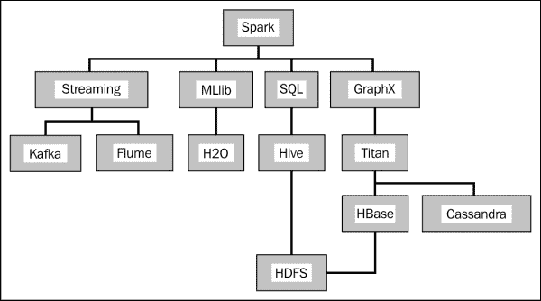
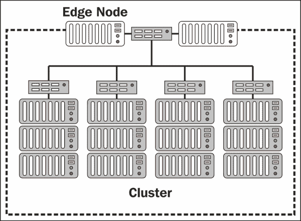
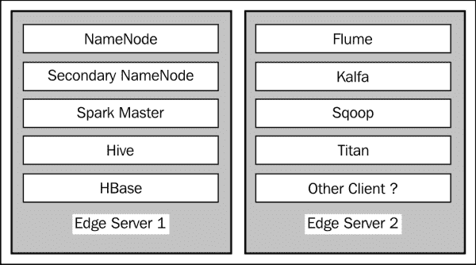
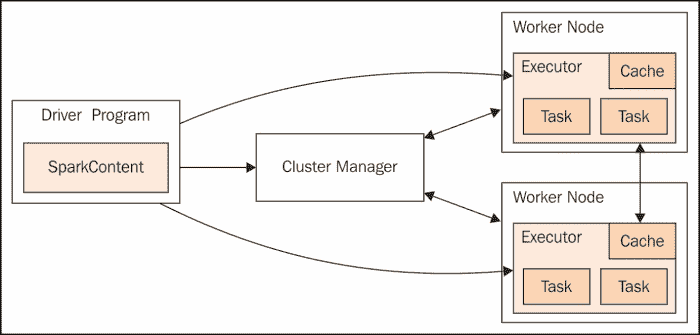
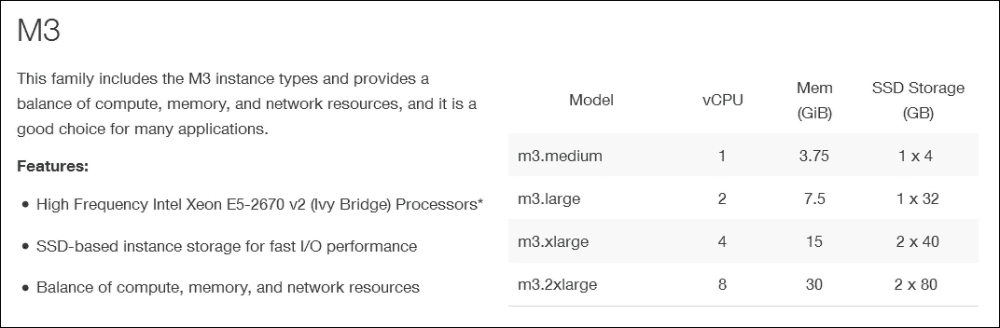
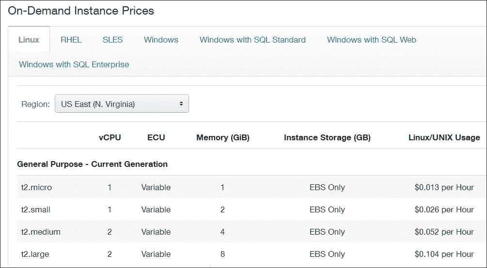

# 第一章：Apache Spark

Apache Spark 是一个分布式和高度可扩展的内存数据分析系统，提供了在 Java、Scala、Python 以及 R 等语言中开发应用程序的能力。它在目前的 Apache 顶级项目中具有最高的贡献/参与率。现在，像 Mahout 这样的 Apache 系统使用它作为处理引擎，而不是 MapReduce。此外，正如在第四章中所示，*Apache Spark SQL*，可以使用 Hive 上下文，使 Spark 应用程序直接处理 Apache Hive 中的数据。

Apache Spark 提供了四个主要的子模块，分别是 SQL、MLlib、GraphX 和 Streaming。它们将在各自的章节中进行解释，但在这里简单的概述会很有用。这些模块是可互操作的，因此数据可以在它们之间传递。例如，流式数据可以传递到 SQL，然后创建一个临时表。

以下图解释了本书将如何处理 Apache Spark 及其模块。前两行显示了 Apache Spark 及其前面描述的四个子模块。然而，尽可能地，我总是试图通过示例来展示如何使用额外的工具来扩展功能：



例如，第三章中解释的数据流模块，*Apache Spark Streaming*，将有工作示例，展示如何使用 Apache **Kafka**和**Flume**执行数据移动。机器学习模块**MLlib**将通过可用的数据处理功能进行功能检查，但也将使用 H2O 系统和深度学习进行扩展。

前面的图当然是简化的。它代表了本书中呈现的系统关系。例如，Apache Spark 模块与 HDFS 之间的路线比前面的图中显示的要多得多。

Spark SQL 章节还将展示 Spark 如何使用 Hive 上下文。因此，可以开发一个 Spark 应用程序来创建基于 Hive 的对象，并对存储在 HDFS 中的 Hive 表运行 Hive QL。

第五章 *Apache Spark GraphX* 和 第六章 *基于图的存储* 将展示 Spark GraphX 模块如何用于处理大数据规模的图，以及如何使用 Titan 图数据库进行存储。将展示 Titan 允许存储和查询大数据规模的图。通过一个例子，将展示 Titan 可以同时使用**HBase**和**Cassandra**作为存储机制。当使用 HBase 时，将会显示 Titan 隐式地使用 HDFS 作为一种廉价可靠的分布式存储机制。

因此，我认为本节已经解释了 Spark 是一个内存处理系统。在大规模使用时，它不能独立存在——数据必须存放在某个地方。它可能会与 Hadoop 工具集以及相关的生态系统一起使用。幸运的是，Hadoop 堆栈提供商，如 Cloudera，提供了与 Apache Spark、Hadoop 和大多数当前稳定工具集集成的 CDH Hadoop 堆栈和集群管理器。在本书中，我将使用安装在 CentOS 6.5 64 位服务器上的小型 CDH 5.3 集群。您可以使用其他配置，但我发现 CDH 提供了我需要的大多数工具，并自动化了配置，为我留下更多的时间进行开发。

提到了 Spark 模块和本书中将介绍的软件后，下一节将描述大数据集群的可能设计。

# 概述

在本节中，我希望提供一个关于本书中将介绍的 Apache Spark 功能以及将用于扩展它的系统的概述。我还将尝试审视 Apache Spark 与云存储集成的未来。

当您查看 Apache Spark 网站（[`spark.apache.org/`](http://spark.apache.org/)）上的文档时，您会发现有涵盖 SparkR 和 Bagel 的主题。虽然我会在本书中涵盖四个主要的 Spark 模块，但我不会涵盖这两个主题。我在本书中时间和范围有限，所以我会把这些主题留给读者自行探究或将来研究。

## Spark 机器学习

Spark MLlib 模块提供了在多个领域进行机器学习功能。Spark 网站上提供的文档介绍了使用的数据类型（例如，向量和 LabeledPoint 结构）。该模块提供的功能包括：

+   统计

+   分类

+   回归

+   协同过滤

+   聚类

+   维度约简

+   特征提取

+   频繁模式挖掘

+   优化

基于 Scala 的 KMeans、朴素贝叶斯和人工神经网络的实际示例已在本书的第二章 *Apache Spark MLlib*中介绍和讨论。

## Spark Streaming

流处理是 Apache Spark 的另一个重要和受欢迎的主题。它涉及在 Spark 中作为流处理数据，并涵盖输入和输出操作、转换、持久性和检查点等主题。

第三章 *Apache Spark Streaming*，涵盖了这一领域的处理，并提供了不同类型的流处理的实际示例。它讨论了批处理和窗口流配置，并提供了一个实际的检查点示例。它还涵盖了不同类型的流处理示例，包括 Kafka 和 Flume。

流数据还有许多其他用途。其他 Spark 模块功能（例如 SQL、MLlib 和 GraphX）可以用于处理流。您可以将 Spark 流处理与 Kinesis 或 ZeroMQ 等系统一起使用。您甚至可以为自己定义的数据源创建自定义接收器。

## Spark SQL

从 Spark 版本 1.3 开始，数据框架已经引入到 Apache Spark 中，以便以表格形式处理 Spark 数据，并且可以使用表格函数（如 select、filter、groupBy）来处理数据。Spark SQL 模块与 Parquet 和 JSON 格式集成，允许数据以更好地表示数据的格式存储。这也提供了更多与外部系统集成的选项。

将 Apache Spark 集成到 Hadoop Hive 大数据数据库中的想法也可以介绍。基于 Hive 上下文的 Spark 应用程序可用于操作基于 Hive 的表数据。这使得 Spark 的快速内存分布式处理能力可以应用到 Hive 的大数据存储能力上。它有效地让 Hive 使用 Spark 作为处理引擎。

## Spark 图处理

Apache Spark GraphX 模块使 Spark 能够提供快速的大数据内存图处理。图由顶点和边的列表（连接顶点的线）表示。GraphX 能够使用属性、结构、连接、聚合、缓存和取消缓存操作来创建和操作图。

它引入了两种新的数据类型来支持 Spark 中的图处理：VertexRDD 和 EdgeRDD 来表示图的顶点和边。它还介绍了图处理的示例函数，例如 PageRank 和三角形处理。这些函数中的许多将在第五章 *Apache Spark GraphX*中进行研究。

## 扩展生态系统

在审查大数据处理系统时，我认为重要的是不仅要看系统本身，还要看它如何扩展，以及它如何与外部系统集成，以便提供更高级别的功能。在这样大小的书中，我无法涵盖每个选项，但希望通过介绍一个主题，我可以激发读者的兴趣，以便他们可以进一步调查。

我已经使用了 H2O 机器学习库系统来扩展 Apache Spark 的机器学习模块。通过使用基于 Scala 的 H2O 深度学习示例，我展示了如何将神经处理引入 Apache Spark。然而，我知道我只是触及了 H2O 功能的表面。我只使用了一个小型神经集群和一种分类功能。此外，H2O 还有很多其他功能。

随着图形处理在未来几年变得更加被接受和使用，基于图形的存储也将如此。我已经调查了使用 NoSQL 数据库 Neo4J 的 Spark，使用了 Mazerunner 原型应用程序。我还调查了 Aurelius（Datastax）Titan 数据库用于基于图形的存储。同样，Titan 是一个新生的数据库，需要社区支持和进一步发展。但我想研究 Apache Spark 集成的未来选项。

## Spark 的未来

下一节将展示 Apache Spark 发布包含的脚本，允许在 AWS EC2 存储上创建一个 Spark 集群。有一系列选项可供选择，允许集群创建者定义属性，如集群大小和存储类型。但这种类型的集群很难调整大小，这使得管理变化的需求变得困难。如果数据量随时间变化或增长，可能需要更大的集群和更多的内存。

幸运的是，开发 Apache Spark 的人创建了一个名为 Databricks 的新创企业[`databricks.com/`](https://databricks.com/)，它提供基于 Web 控制台的 Spark 集群管理，以及许多其他功能。它提供了笔记本组织的工作思路，用户访问控制、安全性和大量其他功能。这些内容在本书的最后进行了描述。

它目前只在亚马逊 AWS 上提供基于云的存储服务，但将来可能会扩展到谷歌和微软 Azure。其他基于云的提供商，即谷歌和微软 Azure，也在扩展他们的服务，以便他们可以在云中提供 Apache Spark 处理。

# 集群设计

正如我之前提到的，Apache Spark 是一个分布式、内存中、并行处理系统，需要一个关联的存储机制。因此，当你构建一个大数据集群时，你可能会使用分布式存储系统，比如 Hadoop，以及用于数据移动的工具，如 Sqoop、Flume 和 Kafka。

我想介绍大数据集群中边缘节点的概念。集群中的这些节点将面向客户端，上面有像 Hadoop NameNode 或者 Spark 主节点这样的客户端组件。大多数大数据集群可能在防火墙后面。边缘节点将减少防火墙带来的复杂性，因为它们是唯一可访问的节点。下图显示了一个简化的大数据集群：



它显示了四个简化的集群机架，带有交换机和边缘节点计算机，面向防火墙的客户端。当然，这是风格化和简化的，但你明白了。一般处理节点隐藏在防火墙后面（虚线），可用于一般处理，比如 Hadoop、Apache Spark、Zookeeper、Flume 和/或 Kafka。下图代表了一些大数据集群边缘节点，并试图展示可能驻留在它们上面的应用程序。

边缘节点应用程序将是类似于 Hadoop NameNode 或 Apache Spark 主服务器的主应用程序。它将是将数据带入和带出集群的组件，比如 Flume、Sqoop 和 Kafka。它可以是任何使用户界面对客户用户可用的组件，类似于 Hive：



通常，防火墙在增加集群安全性的同时也增加了复杂性。系统组件之间的端口需要打开，以便它们可以相互通信。例如，Zookeeper 被许多组件用于配置。Apache Kafka，发布订阅消息系统，使用 Zookeeper 来配置其主题、组、消费者和生产者。因此，潜在地需要打开防火墙的客户端端口到 Zookeeper。

最后，需要考虑将系统分配给集群节点。例如，如果 Apache Spark 使用 Flume 或 Kafka，则将使用内存通道。需要考虑这些通道的大小和由数据流引起的内存使用。Apache Spark 不应该与其他 Apache 组件竞争内存使用。根据您的数据流和内存使用情况，可能需要在不同的集群节点上拥有 Spark、Hadoop、Zookeeper、Flume 和其他工具。

通常，作为集群 NameNode 服务器或 Spark 主服务器的边缘节点将需要比防火墙内的集群处理节点更多的资源。例如，CDH 集群节点管理器服务器将需要额外的内存，同样 Spark 主服务器也是如此。您应该监视边缘节点的资源使用情况，并根据需要调整资源和/或应用程序位置。

本节简要介绍了 Apache Spark、Hadoop 和其他工具在大数据集群中的情景。然而，在大数据集群中，Apache Spark 集群本身如何配置呢？例如，可以有多种类型的 Spark 集群管理器。下一节将对此进行探讨，并描述每种类型的 Apache Spark 集群管理器。

# 集群管理

下图从 spark.apache.org 网站借来，展示了 Apache Spark 集群管理器在主节点、从节点（工作节点）、执行器和 Spark 客户端应用程序方面的作用：



正如您将从本书的许多示例中看到的那样，Spark 上下文可以通过 Spark 配置对象和 Spark URL 来定义。Spark 上下文连接到 Spark 集群管理器，然后为应用程序在工作节点之间分配资源。集群管理器在集群工作节点之间分配执行器。它将应用程序 jar 文件复制到工作节点，最后分配任务。

以下小节描述了目前可用的可能的 Apache Spark 集群管理器选项。

## 本地

通过指定一个 Spark 配置本地 URL，可以让应用程序在本地运行。通过指定 local[n]，可以让 Spark 使用`<n>`个线程在本地运行应用程序。这是一个有用的开发和测试选项。

## 独立模式

独立模式使用了 Apache Spark 提供的基本集群管理器。Spark 主 URL 将如下所示：

```scala
Spark://<hostname>:7077

```

在这里，`<hostname>`是运行 Spark 主节点的主机名。我已经指定了端口`7077`，这是默认值，但它是可配置的。目前，这个简单的集群管理器只支持 FIFO（先进先出）调度。您可以通过为每个应用程序设置资源配置选项来构建允许并发应用程序调度。例如，使用`spark.core.max`来在应用程序之间共享核心。

## Apache YARN

在与 Hadoop YARN 集成的较大规模下，Apache Spark 集群管理器可以是 YARN，并且应用程序可以在两种模式下运行。如果将 Spark 主值设置为 yarn-cluster，那么应用程序可以提交到集群，然后终止。集群将负责分配资源和运行任务。然而，如果应用程序主作为 yarn-client 提交，那么应用程序在处理的生命周期内保持活动，并从 YARN 请求资源。

## Apache Mesos

Apache Mesos 是一个用于跨集群共享资源的开源系统。它允许多个框架通过管理和调度资源来共享集群。它是一个集群管理器，使用 Linux 容器提供隔离，允许多个系统（如 Hadoop、Spark、Kafka、Storm 等）安全地共享集群。它可以高度扩展到数千个节点。它是一个基于主从的系统，并且具有容错性，使用 Zookeeper 进行配置管理。

对于单个主节点 Mesos 集群，Spark 主 URL 将采用以下形式：

```scala
Mesos://<hostname>:5050

```

其中`<hostname>`是 Mesos 主服务器的主机名，端口被定义为`5050`，这是 Mesos 主端口的默认值（可配置）。如果在大规模高可用性 Mesos 集群中有多个 Mesos 主服务器，则 Spark 主 URL 将如下所示：

```scala
Mesos://zk://<hostname>:2181

```

因此，Mesos 主服务器的选举将由 Zookeeper 控制。`<hostname>`将是 Zookeeper quorum 中的主机名。此外，端口号`2181`是 Zookeeper 的默认主端口。

## Amazon EC2

Apache Spark 发行版包含用于在亚马逊 AWS EC2 基础服务器上运行 Spark 的脚本。以下示例显示了在 Linux CentOS 服务器上安装的 Spark 1.3.1，位于名为`/usr/local/spark/`的目录下。Spark 发行版 EC2 子目录中提供了 EC2 资源：

```scala
[hadoop@hc2nn ec2]$ pwd

/usr/local/spark/ec2

[hadoop@hc2nn ec2]$ ls
deploy.generic  README  spark-ec2  spark_ec2.py

```

要在 EC2 上使用 Apache Spark，您需要设置一个 Amazon AWS 帐户。您可以在此处设置一个初始免费帐户来尝试：[`aws.amazon.com/free/`](http://aws.amazon.com/free/)。

如果您查看第八章*Spark Databricks*，您会看到已经设置了这样一个帐户，并且用于访问[`databricks.com/`](https://databricks.com/)。接下来，您需要访问 AWS IAM 控制台，并选择**用户**选项。您可以创建或选择一个用户。选择**用户操作**选项，然后选择**管理访问密钥**。然后，选择**创建访问密钥**，然后**下载凭据**。确保您下载的密钥文件是安全的，假设您在 Linux 上，使用`chmod`命令将文件权限设置为`600`，以便仅用户访问。

现在您已经拥有了**访问密钥 ID**、**秘密访问密钥**、密钥文件和密钥对名称。您现在可以使用`spark-ec2`脚本创建一个 Spark EC2 集群，如下所示：

```scala
export AWS_ACCESS_KEY_ID="QQpl8Exxx"
export AWS_SECRET_ACCESS_KEY="0HFzqt4xxx"

./spark-ec2  \
 --key-pair=pairname \
 --identity-file=awskey.pem \
 --region=us-west-1 \
 --zone=us-west-1a  \
 launch cluster1

```

在这里，`<pairname>`是在创建访问详细信息时给出的密钥对名称；`<awskey.pem>`是您下载的文件。您要创建的集群的名称称为`<cluster1>`。此处选择的区域位于美国西部，`us-west-1`。如果您像我一样住在太平洋地区，可能更明智的选择一个更近的区域，如`ap-southeast-2`。但是，如果遇到访问问题，则需要尝试另一个区域。还要记住，像这样使用基于云的 Spark 集群将具有更高的延迟和较差的 I/O 性能。您与多个用户共享集群主机，您的集群可能位于远程地区。

您可以使用一系列选项来配置您创建的基于云的 Spark 集群。`-s`选项可以使用：

```scala
-s <slaves>

```

这允许您定义在您的 Spark EC2 集群中创建多少个工作节点，即`-s 5`表示六个节点集群，一个主节点和五个从节点。您可以定义您的集群运行的 Spark 版本，而不是默认的最新版本。以下选项启动了一个带有 Spark 版本 1.3.1 的集群：

```scala
--spark-version=1.3.1

```

用于创建集群的实例类型将定义使用多少内存和可用多少核心。例如，以下选项将将实例类型设置为`m3.large`：

```scala
--instance-type=m3.large

```

Amazon AWS 的当前实例类型可以在[`aws.amazon.com/ec2/instance-types/`](http://aws.amazon.com/ec2/instance-types/)找到。

下图显示了当前（截至 2015 年 7 月）AWS M3 实例类型、型号细节、核心、内存和存储。目前有许多实例类型可用；例如 T2、M4、M3、C4、C3、R3 等。检查当前可用性并选择适当的：



定价也非常重要。当前 AWS 存储类型的价格可以在此找到：[`aws.amazon.com/ec2/pricing/`](http://aws.amazon.com/ec2/pricing/)。

价格按地区显示，并有一个下拉菜单和按小时计价。请记住，每种存储类型都由核心、内存和物理存储定义。价格也由操作系统类型定义，即 Linux、RHEL 和 Windows。只需通过顶级菜单选择操作系统。

下图显示了写作时（2015 年 7 月）的定价示例；它只是提供一个想法。价格会随时间而变化，而且会因服务提供商而异。它们会根据你需要的存储大小和你愿意承诺的时间长度而有所不同。

还要注意将数据从任何存储平台移出的成本。尽量考虑长期。检查你是否需要在未来五年将所有或部分基于云的数据移动到下一个系统。检查移动数据的过程，并将该成本纳入你的规划中。



如前所述，上图显示了 AWS 存储类型的成本，按操作系统、地区、存储类型和小时计价。成本是按单位小时计算的，因此像[`databricks.com/`](https://databricks.com/)这样的系统在完整的小时过去之前不会终止 EC2 实例。这些成本会随时间变化，需要通过（对于 AWS）AWS 计费控制台进行监控。

当你想要调整你的 Spark EC2 集群大小时，你需要确保在开始之前确定主从配置。确定你需要多少工作节点和需要多少内存。如果你觉得你的需求会随着时间改变，那么你可能会考虑使用[`databricks.com/`](https://databricks.com/)，如果你确实希望在云中使用 Spark。前往第八章 *Spark Databricks*，看看你如何设置和使用[`databricks.com/`](https://databricks.com/)。

在接下来的部分，我将研究 Apache Spark 集群性能以及可能影响它的问题。

# 性能

在继续涵盖 Apache Spark 的其他章节之前，我想要研究性能领域。需要考虑哪些问题和领域？什么可能会影响从集群级别开始到实际 Scala 代码结束的 Spark 应用程序性能？我不想只是重复 Spark 网站上的内容，所以请查看以下网址：`http://spark.apache.org/docs/<version>/tuning.html`。

在这里，`<version>`指的是你正在使用的 Spark 版本，即最新版本或特定版本的 1.3.1。因此，在查看了该页面之后，我将简要提及一些主题领域。在本节中，我将列出一些一般要点，而不意味着重要性的顺序。

## 集群结构

你的大数据集群的大小和结构将影响性能。如果你有一个基于云的集群，你的 IO 和延迟会与未共享硬件的集群相比受到影响。你将与多个客户共享基础硬件，并且集群硬件可能是远程的。

此外，集群组件在服务器上的定位可能会导致资源争用。例如，如果可能的话，仔细考虑在大集群中定位 Hadoop NameNodes、Spark 服务器、Zookeeper、Flume 和 Kafka 服务器。在高工作负载下，你可能需要考虑将服务器分隔到单独的系统中。你可能还需要考虑使用 Apache 系统，如 Mesos，以共享资源。

另外，考虑潜在的并行性。对于大数据集，Spark 集群中的工作节点数量越多，就越有并行处理的机会。

## Hadoop 文件系统

根据您的集群需求，您可能考虑使用 HDFS 的替代方案。例如，MapR 具有基于 MapR-FS NFS 的读写文件系统，可提高性能。该文件系统具有完整的读写功能，而 HDFS 设计为一次写入，多次读取的文件系统。它比 HDFS 性能更好。它还与 Hadoop 和 Spark 集群工具集成。MapR 的架构师 Bruce Penn 撰写了一篇有趣的文章，描述了其特性：[`www.mapr.com/blog/author/bruce-penn`](https://www.mapr.com/blog/author/bruce-penn)。

只需查找名为“比较 MapR-FS 和 HDFS NFS 和快照”的博客文章。文章中的链接描述了 MapR 架构和可能的性能提升。

## 数据本地性

数据本地性或正在处理的数据的位置将影响延迟和 Spark 处理。数据是来自 AWS S3、HDFS、本地文件系统/网络还是远程来源？

如前面的调整链接所述，如果数据是远程的，那么功能和数据必须被整合在一起进行处理。Spark 将尝试使用最佳的数据本地性级别来进行任务处理。

## 内存

为了避免在 Apache Spark 集群上出现**OOM**（**内存不足**）消息，您可以考虑以下几个方面：

+   考虑 Spark 工作节点上可用的物理内存级别。能增加吗？

+   考虑数据分区。您能增加 Spark 应用程序代码中使用的数据分区数量吗？

+   您能增加存储分数，即 JVM 用于存储和缓存 RDD 的内存使用吗？

+   考虑调整用于减少内存的数据结构。

+   考虑将 RDD 存储序列化以减少内存使用。

## 编码

尝试调整代码以提高 Spark 应用程序的性能。例如，在 ETL 周期的早期筛选应用程序数据。调整并行度，尝试找到代码中资源密集型的部分，并寻找替代方案。

# 云

尽管本书大部分内容将集中在安装在基于物理服务器的集群上的 Apache Spark 的示例上（除了[`databricks.com/`](https://databricks.com/)），我想指出有多种基于云的选项。有一些基于云的系统将 Apache Spark 作为集成组件，还有一些基于云的系统提供 Spark 作为服务。尽管本书无法对所有这些进行深入介绍，但我认为提到其中一些可能会有用：

+   本书的两章涵盖了 Databricks。它提供了一个基于 Spark 的云服务，目前使用 AWS EC2。计划将该服务扩展到其他云供应商（[`databricks.com/`](https://databricks.com/)）。

+   在撰写本书时（2015 年 7 月），微软 Azure 已扩展到提供 Spark 支持。

+   Apache Spark 和 Hadoop 可以安装在 Google Cloud 上。

+   Oryx 系统是基于 Spark 和 Kafka 构建的实时大规模机器学习系统（[`oryx.io/`](http://oryx.io/)）。

+   用于提供机器学习预测的 velox 系统基于 Spark 和 KeystoneML（[`github.com/amplab/velox-modelserver`](https://github.com/amplab/velox-modelserver)）。

+   PredictionIO 是建立在 Spark、HBase 和 Spray 上的开源机器学习服务（[`prediction.io/`](https://prediction.io/)）。

+   SeldonIO 是一个基于 Spark、Kafka 和 Hadoop 的开源预测分析平台（[`www.seldon.io/`](http://www.seldon.io/)）。

# 总结

在结束本章时，我想邀请你逐个阅读以下章节中基于 Scala 代码的示例。我对 Apache Spark 的发展速度印象深刻，也对其发布频率印象深刻。因此，即使在撰写本文时，Spark 已经达到 1.4 版本，我相信你将使用更新的版本。如果遇到问题，请以逻辑方式解决。尝试向 Spark 用户组寻求帮助（`<user@spark.apache.org>`），或者查看 Spark 网站：[`spark.apache.org/`](http://spark.apache.org/)。

我一直对与人交流感兴趣，也愿意在 LinkedIn 等网站上与人联系。我渴望了解人们参与的项目和新机遇。我对 Apache Spark、你使用它的方式以及你构建的系统在规模上的应用很感兴趣。你可以通过 LinkedIn 联系我：[linkedin.com/profile/view?id=73219349](http://linkedin.com/profile/view?id=73219349)。

或者，你可以通过我的网站联系我：[`semtech-solutions.co.nz/`](http://semtech-solutions.co.nz)，最后，也可以通过电子邮件联系我：`<info@semtech-solutions.co.nz>`。
