# 第二章：Apache Spark MLlib

MLlib 是 Apache Spark 提供的机器学习库，它是基于内存的开源数据处理系统。在本章中，我将研究 MLlib 库提供的回归、分类和神经处理等领域的功能。我将在提供解决实际问题的工作示例之前，先研究每个算法背后的理论。网络上的示例代码和文档可能稀少且令人困惑。我将采用逐步的方法来描述以下算法的用法和能力。

+   朴素贝叶斯分类

+   K-Means 聚类

+   ANN 神经处理

在决定学习 Apache Spark 之前，我假设你对 Hadoop 很熟悉。在继续之前，我将简要介绍一下我的环境。我的 Hadoop 集群安装在一组 Centos 6.5 Linux 64 位服务器上。接下来的部分将详细描述架构。

# 环境配置

在深入研究 Apache Spark 模块之前，我想解释一下我在本书中将使用的 Hadoop 和 Spark 集群的结构和版本。我将在本章中使用 Cloudera CDH 5.1.3 版本的 Hadoop 进行存储，并且我将使用两个版本的 Spark：1.0 和 1.3。

早期版本与 Cloudera 软件兼容，并经过了他们的测试和打包。它是作为一组 Linux 服务从 Cloudera 仓库使用 yum 命令安装的。因为我想要研究尚未发布的神经网络技术，我还将从 GitHub 下载并运行 Spark 1.3 的开发版本。这将在本章后面进行解释。

## 架构

以下图表解释了我将在本章中使用的小型 Hadoop 集群的结构：

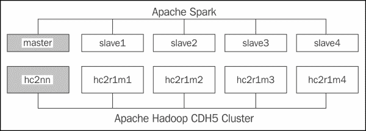

前面的图表显示了一个包含 NameNode（称为 hc2nn）和 DataNodes（hc2r1m1 到 hc2r1m4）的五节点 Hadoop 集群。它还显示了一个包含一个主节点和四个从节点的 Apache Spark 集群。Hadoop 集群提供了物理 Centos 6 Linux 机器，而 Spark 集群运行在同一台主机上。例如，Spark 主服务器运行在 Hadoop NameNode 机器 hc2nn 上，而 Spark 从节点 1 运行在主机 hc2r1m1 上。

Linux 服务器命名标准应该解释得更清楚。例如，Hadoop NameNode 服务器被称为 hc2nn。这个服务器名字中的 h 代表 Hadoop，c 代表集群，nn 代表 NameNode。因此，hc2nn 代表 Hadoop 集群 2 的 NameNode。同样，对于服务器 hc2r1m1，h 代表 Hadoop，c 代表集群，r 代表机架，m 代表机器。因此，这个名字代表 Hadoop 集群 2 的机架 1 的机器 1。在一个大型的 Hadoop 集群中，机器会被组织成机架，因此这种命名标准意味着服务器很容易被定位。

你可以根据自己的需要安排 Spark 和 Hadoop 集群，它们不需要在同一台主机上。为了撰写本书，我只有有限的机器可用，因此将 Hadoop 和 Spark 集群放在同一台主机上是有意义的。你可以为每个集群使用完全独立的机器，只要 Spark 能够访问 Hadoop（如果你想用它来进行分布式存储）。

请记住，尽管 Spark 用于其内存分布式处理的速度，但它并不提供存储。你可以使用主机文件系统来读写数据，但如果你的数据量足够大，可以被描述为大数据，那么使用像 Hadoop 这样的分布式存储系统是有意义的。

还要记住，Apache Spark 可能只是**ETL**（**提取**，**转换**，**加载**）链中的处理步骤。它并不提供 Hadoop 生态系统所包含的丰富工具集。您可能仍然需要 Nutch/Gora/Solr 进行数据采集；Sqoop 和 Flume 用于数据传输；Oozie 用于调度；HBase 或 Hive 用于存储。我要说明的是，尽管 Apache Spark 是一个非常强大的处理系统，但它应被视为更广泛的 Hadoop 生态系统的一部分。

在描述了本章将使用的环境之后，我将继续描述 Apache Spark **MLlib**（**机器学习库**）的功能。

## 开发环境

本书中的编码示例将使用 Scala 语言。这是因为作为一种脚本语言，它产生的代码比 Java 少。它也可以用于 Spark shell，并与 Apache Spark 应用程序一起编译。我将使用 sbt 工具来编译 Scala 代码，安装方法如下：

```scala
[hadoop@hc2nn ~]# su -
[root@hc2nn ~]# cd /tmp
[root@hc2nn ~]#wget http://repo.scala-sbt.org/scalasbt/sbt-native-packages/org/scala-sbt/sbt/0.13.1/sbt.rpm
[root@hc2nn ~]# rpm -ivh sbt.rpm

```

为了方便撰写本书，我在 Hadoop NameNode 服务器`hc2nn`上使用了名为**hadoop**的通用 Linux 帐户。由于前面的命令表明我需要以 root 帐户安装`sbt`，因此我通过`su`（切换用户）访问了它。然后，我使用`wget`从名为`repo.scala-sbt.org`的基于 Web 的服务器下载了`sbt.rpm`文件到`/tmp`目录。最后，我使用`rpm`命令安装了`rpm`文件，选项为`i`表示安装，`v`表示验证，`h`表示在安装包时打印哈希标记。

### 提示

**下载示例代码**

您可以从[`www.packtpub.com`](http://www.packtpub.com)的帐户中下载您购买的所有 Packt Publishing 图书的示例代码文件。如果您在其他地方购买了这本书，可以访问[`www.packtpub.com/support`](http://www.packtpub.com/support)并注册，以便直接通过电子邮件接收文件。

我在 Linux 服务器`hc2nn`上使用 Linux hadoop 帐户为 Apache Spark 开发了所有 Scala 代码。我将每组代码放在`/home/hadoop/spark`目录下的子目录中。例如，以下 sbt 结构图显示了 MLlib 朴素贝叶斯代码存储在`spark`目录下名为`nbayes`的子目录中。图表还显示了 Scala 代码是在名为`src/main/scala`的子目录结构下开发的。文件`bayes1.scala`和`convert.scala`包含了下一节将使用的朴素贝叶斯代码：

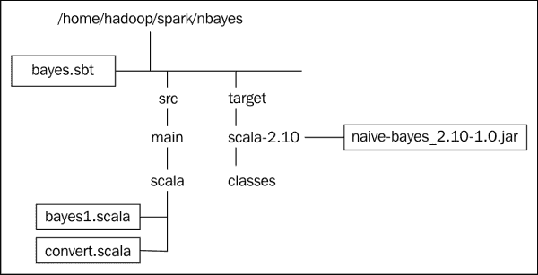

`bayes.sbt`文件是 sbt 工具使用的配置文件，描述了如何编译`Scala`目录中的 Scala 文件（还要注意，如果您在 Java 中开发，您将使用形式为`nbayes/src/main/java`的路径）。下面显示了`bayes.sbt`文件的内容。`pwd`和`cat` Linux 命令提醒您文件位置，并提醒您转储文件内容。

名称、版本和`scalaVersion`选项设置了项目的详细信息，以及要使用的 Scala 版本。`libraryDependencies`选项定义了 Hadoop 和 Spark 库的位置。在这种情况下，使用 Cloudera parcels 安装了 CDH5，并且包库可以在标准位置找到，即 Hadoop 的`/usr/lib/hadoop`和 Spark 的`/usr/lib/spark`。解析器选项指定了 Cloudera 存储库的位置以获取其他依赖项：

```scala
[hadoop@hc2nn nbayes]$ pwd
/home/hadoop/spark/nbayes
[hadoop@hc2nn nbayes]$ cat bayes.sbt

name := "Naive Bayes"

version := "1.0"

scalaVersion := "2.10.4"

libraryDependencies += "org.apache.hadoop" % "hadoop-client" % "2.3.0"

libraryDependencies += "org.apache.spark" %% "spark-core"  % "1.0.0"

libraryDependencies += "org.apache.spark" %% "spark-mllib" % "1.0.0"

// If using CDH, also add Cloudera repo
resolvers += "Cloudera Repository" at https://repository.cloudera.com/artifactory/cloudera-repos/

```

Scala nbayes 项目代码可以使用以下命令从`nbayes`子目录编译：

```scala
[hadoop@hc2nn nbayes]$ sbt compile

```

使用` sbt compile`命令将代码编译成类。然后将类放置在`nbayes/target/scala-2.10/classes`目录中。可以使用以下命令将编译后的类打包成 JAR 文件：

```scala
[hadoop@hc2nn nbayes]$ sbt package

```

`Sbt package`命令将在目录`nbayes/target/scala-2.10`下创建一个 JAR 文件。正如*sbt 结构图*中的示例所示，成功编译和打包后，创建了名为`naive-bayes_2.10-1.0.jar`的 JAR 文件。然后，可以在`spark-submit`命令中使用此 JAR 文件及其包含的类。随后将在探索 Apache Spark MLlib 模块中描述此功能。

## 安装 Spark

最后，当描述用于本书的环境时，我想谈谈安装和运行 Apache Spark 的方法。我不会详细说明 Hadoop CDH5 的安装，只是说我使用 Cloudera parcels 进行了安装。但是，我手动从 Cloudera 存储库安装了 Apache Spark 的 1.0 版本，使用了 Linux 的`yum`命令。我安装了基于服务的软件包，因为我希望能够灵活安装 Cloudera 的多个版本的 Spark 作为服务，根据需要进行安装。

在准备 CDH Hadoop 版本时，Cloudera 使用 Apache Spark 团队开发的代码和 Apache Bigtop 项目发布的代码。他们进行集成测试，以确保作为代码堆栈工作。他们还将代码和二进制文件重新组织为服务和包。这意味着库、日志和二进制文件可以位于 Linux 下的定义位置，即`/var/log/spark`、`/usr/lib/spark`。这也意味着，在服务的情况下，可以使用 Linux 的`yum`命令安装组件，并通过 Linux 的`service`命令进行管理。

尽管在本章后面描述的神经网络代码的情况下，使用了不同的方法。这是如何安装 Apache Spark 1.0 以与 Hadoop CDH5 一起使用的：

```scala
[root@hc2nn ~]# cd /etc/yum.repos.d
[root@hc2nn yum.repos.d]# cat  cloudera-cdh5.repo

[cloudera-cdh5]
# Packages for Cloudera's Distribution for Hadoop, Version 5, on RedHat or CentOS 6 x86_64
name=Cloudera's Distribution for Hadoop, Version 5
baseurl=http://archive.cloudera.com/cdh5/redhat/6/x86_64/cdh/5/
gpgkey = http://archive.cloudera.com/cdh5/redhat/6/x86_64/cdh/RPM-GPG-KEY-cloudera
gpgcheck = 1

```

第一步是确保在服务器`hc2nn`和所有其他 Hadoop 集群服务器的`/etc/yum.repos.d`目录下存在 Cloudera 存储库文件。该文件名为`cloudera-cdh5.repo`，并指定 yum 命令可以定位 Hadoop CDH5 集群软件的位置。在所有 Hadoop 集群节点上，我使用 Linux 的 yum 命令，以 root 身份，安装 Apache Spark 组件核心、主、工作、历史服务器和 Python：

```scala
[root@hc2nn ~]# yum install spark-core spark-master spark-worker spark-history-server spark-python

```

这使我能够在将来以任何我想要的方式配置 Spark。请注意，我已经在所有节点上安装了主组件，尽管我目前只打算从 Name Node 上使用它。现在，需要在所有节点上配置 Spark 安装。配置文件存储在`/etc/spark/conf`下。首先要做的事情是设置一个`slaves`文件，指定 Spark 将在哪些主机上运行其工作组件：

```scala
[root@hc2nn ~]# cd /etc/spark/conf

[root@hc2nn conf]# cat slaves
# A Spark Worker will be started on each of the machines listed below.
hc2r1m1
hc2r1m2
hc2r1m3
hc2r1m4

```

从上面的`slaves`文件的内容可以看出，Spark 将在 Hadoop CDH5 集群的四个工作节点 Data Nodes 上运行，从`hc2r1m1`到`hc2r1m4`。接下来，将更改`spark-env.sh`文件的内容以指定 Spark 环境选项。`SPARK_MASTER_IP`的值被定义为完整的服务器名称：

```scala
export STANDALONE_SPARK_MASTER_HOST=hc2nn.semtech-solutions.co.nz
export SPARK_MASTER_IP=$STANDALONE_SPARK_MASTER_HOST

export SPARK_MASTER_WEBUI_PORT=18080
export SPARK_MASTER_PORT=7077
export SPARK_WORKER_PORT=7078
export SPARK_WORKER_WEBUI_PORT=18081

```

主和工作进程的 Web 用户界面端口号已经指定，以及操作端口号。然后，Spark 服务可以从 Name Node 服务器以 root 身份启动。我使用以下脚本：

```scala
echo "hc2r1m1 - start worker"
ssh   hc2r1m1 'service spark-worker start'

echo "hc2r1m2 - start worker"
ssh   hc2r1m2 'service spark-worker start'

echo "hc2r1m3 - start worker"
ssh   hc2r1m3 'service spark-worker start'

echo "hc2r1m4 - start worker"
ssh   hc2r1m4 'service spark-worker start'

echo "hc2nn - start master server"
service spark-master         start
service spark-history-server start

```

这将在所有从节点上启动 Spark 工作服务，并在 Name Node `hc2nn`上启动主和历史服务器。因此，现在可以使用`http://hc2nn:18080` URL 访问 Spark 用户界面。

以下图显示了 Spark 1.0 主节点 Web 用户界面的示例。它显示了有关 Spark 安装、工作节点和正在运行或已完成的应用程序的详细信息。给出了主节点和工作节点的状态。在这种情况下，所有节点都是活动的。显示了总内存使用情况和可用情况，以及按工作节点的情况。尽管目前没有应用程序在运行，但可以选择每个工作节点链接以查看在每个工作节点上运行的执行器进程，因为每个应用程序运行的工作量都分布在 Spark 集群中。

还要注意 Spark URL，`spark://hc2nn.semtech-solutions.co.nz:7077`，在运行 Spark 应用程序（如`spark-shell`和`spark-submit`）时将被使用。使用此 URL，可以确保对该 Spark 集群运行 shell 或应用程序。

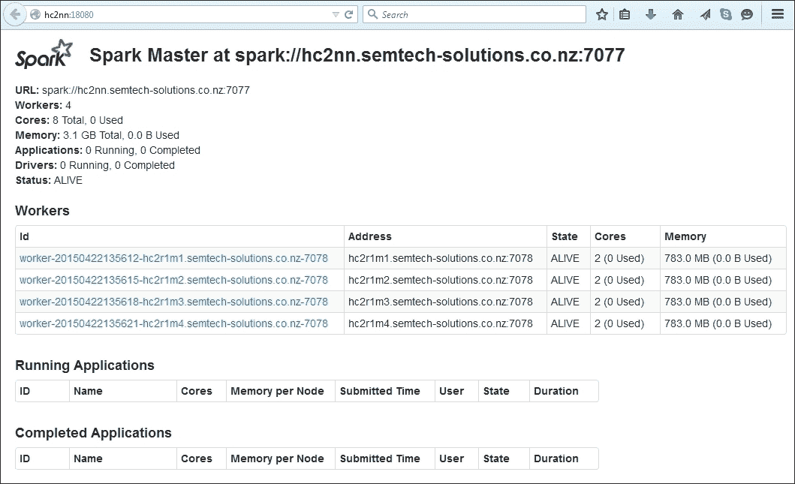

这快速概述了使用服务的 Apache Spark 安装、其配置、如何启动以及如何监视。现在，是时候着手处理 MLlib 功能领域中的第一个部分，即使用朴素贝叶斯算法进行分类。随着 Scala 脚本的开发和生成的应用程序的监视，Spark 的使用将变得更加清晰。

# 朴素贝叶斯分类

本节将提供 Apache Spark MLlib 朴素贝叶斯算法的工作示例。它将描述算法背后的理论，并提供一个 Scala 的逐步示例，以展示如何使用该算法。

## 理论

为了使用朴素贝叶斯算法对数据集进行分类，数据必须是线性可分的，也就是说，数据中的类必须能够通过类边界进行线性划分。以下图形通过三个数据集和两个虚线所示的类边界来直观解释这一点：

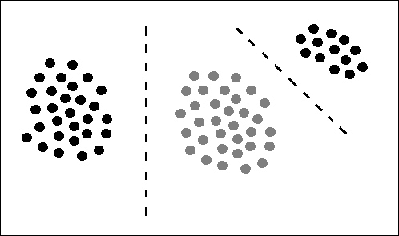

朴素贝叶斯假设数据集中的特征（或维度）彼此独立，即它们互不影响。Hernan Amiune 在[`hernan.amiune.com/`](http://hernan.amiune.com/)提供了朴素贝叶斯的一个例子。以下例子考虑将电子邮件分类为垃圾邮件。如果你有 100 封电子邮件，那么执行以下操作：

```scala
60% of emails are spam
 80% of spam emails contain the word buy
 20% of spam emails don't contain the word buy
40% of emails are not spam
 10% of non spam emails contain the word buy
 90% of non spam emails don't contain the word buy

```

因此，将这个例子转换为概率，以便创建一个朴素贝叶斯方程。

```scala
P(Spam) = the probability that an email is spam = 0.6
P(Not Spam) = the probability that an email is not spam = 0.4
P(Buy|Spam) = the probability that an email that is spam has the word buy = 0.8
P(Buy|Not Spam) = the probability that an email that is not spam has the word buy = 0.1

```

那么，包含单词“buy”的电子邮件是垃圾邮件的概率是多少？这将被写成**P(垃圾邮件|Buy)**。朴素贝叶斯表示它由以下图中的方程描述：


因此，使用先前的百分比数据，我们得到以下结果：

```scala
P(Spam|Buy) = ( 0.8 * 0.6 ) / (( 0.8 * 0.6 )  + ( 0.1 * 0.4 )  )  = ( .48 ) / ( .48 + .04 )
= .48 / .52 = .923

```

这意味着包含单词“buy”的电子邮件更有可能是垃圾邮件，概率高达 92%。这是对理论的一瞥；现在，是时候尝试使用 Apache Spark MLlib 朴素贝叶斯算法进行一个真实世界的例子了。

## 实践中的朴素贝叶斯

第一步是选择一些用于分类的数据。我选择了来自英国政府数据网站的一些数据，可在[`data.gov.uk/dataset/road-accidents-safety-data`](http://data.gov.uk/dataset/road-accidents-safety-data)上找到。

数据集名为“道路安全-2013 年数字酒精测试数据”，下载一个名为`DigitalBreathTestData2013.txt`的压缩文本文件。该文件包含大约 50 万行数据。数据如下所示：

```scala
Reason,Month,Year,WeekType,TimeBand,BreathAlcohol,AgeBand,Gender
Suspicion of Alcohol,Jan,2013,Weekday,12am-4am,75,30-39,Male
Moving Traffic Violation,Jan,2013,Weekday,12am-4am,0,20-24,Male
Road Traffic Collision,Jan,2013,Weekend,12pm-4pm,0,20-24,Female

```

为了对数据进行分类，我修改了列布局和列数。我只是使用 Excel 来给出数据量。但是，如果我的数据量达到了大数据范围，我可能需要使用 Scala，或者像 Apache Pig 这样的工具。如下命令所示，数据现在存储在 HDFS 上，目录名为`/data/spark/nbayes`。文件名为`DigitalBreathTestData2013- MALE2.csv`。此外，来自 Linux `wc`命令的行数显示有 467,000 行。最后，以下数据样本显示我已经选择了列：Gender, Reason, WeekType, TimeBand, BreathAlcohol 和 AgeBand 进行分类。我将尝试使用其他列作为特征对 Gender 列进行分类：

```scala
[hadoop@hc2nn ~]$ hdfs dfs -cat /data/spark/nbayes/DigitalBreathTestData2013-MALE2.csv | wc -l
467054

[hadoop@hc2nn ~]$ hdfs dfs -cat /data/spark/nbayes/DigitalBreathTestData2013-MALE2.csv | head -5
Male,Suspicion of Alcohol,Weekday,12am-4am,75,30-39
Male,Moving Traffic Violation,Weekday,12am-4am,0,20-24
Male,Suspicion of Alcohol,Weekend,4am-8am,12,40-49
Male,Suspicion of Alcohol,Weekday,12am-4am,0,50-59
Female,Road Traffic Collision,Weekend,12pm-4pm,0,20-24

```

Apache Spark MLlib 分类函数使用一个名为`LabeledPoint`的数据结构，这是一个通用的数据表示，定义在：[`spark.apache.org/docs/1.0.0/api/scala/index.html#org.apache.spark.mllib.regression.LabeledPoint`](http://spark.apache.org/docs/1.0.0/api/scala/index.html#org.apache.spark.mllib.regression.LabeledPoint)。

这个结构只接受 Double 值，这意味着前面数据中的文本值需要被分类为数字。幸运的是，数据中的所有列都将转换为数字类别，我已经在本书的软件包中提供了两个程序，在`chapter2\naive bayes`目录下。第一个叫做`convTestData.pl`，是一个 Perl 脚本，用于将以前的文本文件转换为 Linux。第二个文件，将在这里进行检查，名为`convert.scala`。它将`DigitalBreathTestData2013- MALE2.csv`文件的内容转换为 Double 向量。

关于基于 sbt Scala 的开发环境的目录结构和文件已经在前面进行了描述。我正在使用 Linux 账户 hadoop 在 Linux 服务器`hc2nn`上开发我的 Scala 代码。接下来，Linux 的`pwd`和`ls`命令显示了我的顶级`nbayes`开发目录，其中包含`bayes.sbt`配置文件，其内容已经被检查过：

```scala
[hadoop@hc2nn nbayes]$ pwd
/home/hadoop/spark/nbayes
[hadoop@hc2nn nbayes]$ ls
bayes.sbt     target   project   src

```

接下来显示了运行朴素贝叶斯示例的 Scala 代码，在`src/main/scala`子目录下的`nbayes`目录中：

```scala
[hadoop@hc2nn scala]$ pwd
/home/hadoop/spark/nbayes/src/main/scala
[hadoop@hc2nn scala]$ ls
bayes1.scala  convert.scala

```

我们稍后将检查`bayes1.scala`文件，但首先，HDFS 上的基于文本的数据必须转换为数值 Double 值。这就是`convert.scala`文件的用途。代码如下：

```scala
import org.apache.spark.SparkContext
import org.apache.spark.SparkContext._
import org.apache.spark.SparkConf

```

这些行导入了 Spark 上下文的类，连接到 Apache Spark 集群的类，以及 Spark 配置。正在创建的对象名为`convert1`。它是一个应用程序，因为它扩展了类`App`：

```scala
object convert1 extends App
{

```

下一行创建了一个名为`enumerateCsvRecord`的函数。它有一个名为`colData`的参数，它是一个字符串数组，并返回一个字符串：

```scala
def enumerateCsvRecord( colData:Array[String]): String =
{

```

然后，该函数枚举每一列中的文本值，例如，`Male` 变成 `0`。这些数值存储在像 `colVal1` 这样的值中：

```scala
 val colVal1 =
 colData(0) match
 {
 case "Male"                          => 0
 case "Female"                        => 1
 case "Unknown"                       => 2
 case _                               => 99
 }

 val colVal2 =
 colData(1) match
 {
 case "Moving Traffic Violation"      => 0
 case "Other"                         => 1
 case "Road Traffic Collision"        => 2
 case "Suspicion of Alcohol"          => 3
 case _                               => 99
 }

 val colVal3 =
 colData(2) match
 {
 case "Weekday"                       => 0
 case "Weekend"                       => 0
 case _                               => 99
 }

 val colVal4 =
 colData(3) match
 {
 case "12am-4am"                      => 0
 case "4am-8am"                       => 1
 case "8am-12pm"                      => 2
 case "12pm-4pm"                      => 3
 case "4pm-8pm"                       => 4
 case "8pm-12pm"                      => 5
 case _                               => 99
 }

 val colVal5 = colData(4)

 val colVal6 =
 colData(5) match
 {
 case "16-19"                         => 0
 case "20-24"                         => 1
 case "25-29"                         => 2
 case "30-39"                         => 3
 case "40-49"                         => 4
 case "50-59"                         => 5
 case "60-69"                         => 6
 case "70-98"                         => 7
 case "Other"                         => 8
 case _                               => 99
 }

```

从数值列值创建一个逗号分隔的字符串`lineString`，然后返回它。函数以最终的大括号字符`}`结束。请注意，下一个创建的数据行从第一列的标签值开始，然后是一个代表数据的向量。向量是以空格分隔的，而标签与向量之间用逗号分隔。使用这两种分隔符类型可以让我稍后以两个简单的步骤处理标签和向量：

```scala
 val lineString = colVal1+","+colVal2+" "+colVal3+" "+colVal4+" "+colVal5+" "+colVal6

 return lineString
}

```

主脚本定义了 HDFS 服务器名称和路径。它定义了输入文件和输出路径，使用这些值。它使用 Spark URL 和应用程序名称创建一个新的配置。然后使用这些详细信息创建一个新的 Spark 上下文或连接：

```scala
val hdfsServer = "hdfs://hc2nn.semtech-solutions.co.nz:8020"
val hdfsPath   = "/data/spark/nbayes/"
val inDataFile  = hdfsServer + hdfsPath + "DigitalBreathTestData2013-MALE2.csv"
val outDataFile = hdfsServer + hdfsPath + "result"

val sparkMaster = "spark://hc2nn.semtech-solutions.co.nz:7077"
val appName = "Convert 1"
val sparkConf = new SparkConf()

sparkConf.setMaster(sparkMaster)
sparkConf.setAppName(appName)

val sparkCxt = new SparkContext(sparkConf)

```

使用 Spark 上下文的`textFile`方法从 HDFS 加载基于 CSV 的原始数据文件。然后打印数据行数：

```scala
val csvData = sparkCxt.textFile(inDataFile)
println("Records in  : "+ csvData.count() )

```

CSV 原始数据逐行传递给`enumerateCsvRecord`函数。返回的基于字符串的数字数据存储在`enumRddData`变量中：

```scala
 val enumRddData = csvData.map
 {
 csvLine =>
 val colData = csvLine.split(',')

 enumerateCsvRecord(colData)

 }

```

最后，打印`enumRddData`变量中的记录数，并将枚举数据保存到 HDFS 中：

```scala
 println("Records out : "+ enumRddData.count() )

 enumRddData.saveAsTextFile(outDataFile)

} // end object

```

为了将此脚本作为 Spark 应用程序运行，必须对其进行编译。这是通过`package`命令来完成的，该命令还会编译代码。以下命令是从`nbayes`目录运行的：

```scala
[hadoop@hc2nn nbayes]$ sbt package
Loading /usr/share/sbt/bin/sbt-launch-lib.bash
....
[info] Done packaging.
[success] Total time: 37 s, completed Feb 19, 2015 1:23:55 PM

```

这将导致创建的编译类被打包成一个 JAR 库，如下所示：

```scala
[hadoop@hc2nn nbayes]$ pwd
/home/hadoop/spark/nbayes
[hadoop@hc2nn nbayes]$ ls -l target/scala-2.10
total 24
drwxrwxr-x 2 hadoop hadoop  4096 Feb 19 13:23 classes
-rw-rw-r-- 1 hadoop hadoop 17609 Feb 19 13:23 naive-bayes_2.10-1.0.jar

```

现在可以使用应用程序名称、Spark URL 和创建的 JAR 文件的完整路径来运行应用程序`convert1`。一些额外的参数指定了应该使用的内存和最大核心：

```scala
spark-submit \
 --class convert1 \
 --master spark://hc2nn.semtech-solutions.co.nz:7077  \
 --executor-memory 700M \
 --total-executor-cores 100 \
 /home/hadoop/spark/nbayes/target/scala-2.10/naive-bayes_2.10-1.0.jar

```

这在 HDFS 上创建了一个名为`/data/spark/nbayes/`的数据目录，随后是包含处理过的数据的部分文件：

```scala
[hadoop@hc2nn nbayes]$  hdfs dfs -ls /data/spark/nbayes
Found 2 items
-rw-r--r--   3 hadoop supergroup   24645166 2015-01-29 21:27 /data/spark/nbayes/DigitalBreathTestData2013-MALE2.csv
drwxr-xr-x   - hadoop supergroup          0 2015-02-19 13:36 /data/spark/nbayes/result

[hadoop@hc2nn nbayes]$ hdfs dfs -ls /data/spark/nbayes/result
Found 3 items
-rw-r--r--   3 hadoop supergroup          0 2015-02-19 13:36 /data/spark/nbayes/result/_SUCCESS
-rw-r--r--   3 hadoop supergroup    2828727 2015-02-19 13:36 /data/spark/nbayes/result/part-00000
-rw-r--r--   3 hadoop supergroup    2865499 2015-02-19 13:36 /data/spark/nbayes/result/part-00001

```

在以下 HDFS `cat`命令中，我已经将部分文件数据连接成一个名为`DigitalBreathTestData2013-MALE2a.csv`的文件。然后，我使用`head`命令检查了文件的前五行，以显示它是数字的。最后，我使用`put`命令将其加载到 HDFS 中：

```scala
[hadoop@hc2nn nbayes]$ hdfs dfs -cat /data/spark/nbayes/result/part* > ./DigitalBreathTestData2013-MALE2a.csv

[hadoop@hc2nn nbayes]$ head -5 DigitalBreathTestData2013-MALE2a.csv
0,3 0 0 75 3
0,0 0 0 0 1
0,3 0 1 12 4
0,3 0 0 0 5
1,2 0 3 0 1

[hadoop@hc2nn nbayes]$ hdfs dfs -put ./DigitalBreathTestData2013-MALE2a.csv /data/spark/nbayes

```

以下 HDFS `ls`命令现在显示了存储在 HDFS 上的数字数据文件，位于`nbayes`目录中：

```scala
[hadoop@hc2nn nbayes]$ hdfs dfs -ls /data/spark/nbayes
Found 3 items
-rw-r--r--   3 hadoop supergroup   24645166 2015-01-29 21:27 /data/spark/nbayes/DigitalBreathTestData2013-MALE2.csv
-rw-r--r--   3 hadoop supergroup    5694226 2015-02-19 13:39 /data/spark/nbayes/DigitalBreathTestData2013-MALE2a.csv
drwxr-xr-x   - hadoop supergroup          0 2015-02-19 13:36 /data/spark/nbayes/result

```

现在数据已转换为数字形式，可以使用 MLlib 朴素贝叶斯算法进行处理；这就是 Scala 文件`bayes1.scala`的作用。该文件导入了与之前相同的配置和上下文类。它还导入了朴素贝叶斯、向量和 LabeledPoint 结构的 MLlib 类。这次创建的应用程序类名为`bayes1`：

```scala
import org.apache.spark.SparkContext
import org.apache.spark.SparkContext._
import org.apache.spark.SparkConf
import org.apache.spark.mllib.classification.NaiveBayes
import org.apache.spark.mllib.linalg.Vectors
import org.apache.spark.mllib.regression.LabeledPoint

object bayes1 extends App
{

```

再次定义 HDFS 数据文件，并像以前一样创建一个 Spark 上下文：

```scala
 val hdfsServer = "hdfs://hc2nn.semtech-solutions.co.nz:8020"
 val hdfsPath   = "/data/spark/nbayes/"

 val dataFile = hdfsServer+hdfsPath+"DigitalBreathTestData2013-MALE2a.csv"

 val sparkMaster = "spark://hc2nn.semtech-solutions.co.nz:7077"
 val appName = "Naive Bayes 1"
 val conf = new SparkConf()
 conf.setMaster(sparkMaster)
 conf.setAppName(appName)

 val sparkCxt = new SparkContext(conf)

```

原始 CSV 数据被加载并按分隔符字符拆分。第一列成为数据将被分类的标签（`男/女`）。最后由空格分隔的列成为分类特征：

```scala
 val csvData = sparkCxt.textFile(dataFile)

 val ArrayData = csvData.map
 {
 csvLine =>
 val colData = csvLine.split(',')
 LabeledPoint(colData(0).toDouble, Vectors.dense(colData(1).split(' ').map(_.toDouble)))
 }

```

然后，数据被随机分成训练（70%）和测试（30%）数据集：

```scala
 val divData = ArrayData.randomSplit(Array(0.7, 0.3), seed = 13L)

 val trainDataSet = divData(0)
 val testDataSet  = divData(1)

```

现在可以使用先前的训练集来训练朴素贝叶斯 MLlib 函数。训练后的朴素贝叶斯模型存储在变量`nbTrained`中，然后可以用于预测测试数据的`男/女`结果标签：

```scala
 val nbTrained = NaiveBayes.train(trainDataSet)
 val nbPredict = nbTrained.predict(testDataSet.map(_.features))

```

鉴于所有数据已经包含标签，可以比较测试数据的原始和预测标签。然后可以计算准确度，以确定预测与原始标签的匹配程度：

```scala
 val predictionAndLabel = nbPredict.zip(testDataSet.map(_.label))
 val accuracy = 100.0 * predictionAndLabel.filter(x => x._1 == x._2).count() / testDataSet.count()
 println( "Accuracy : " + accuracy );
}

```

这解释了 Scala 朴素贝叶斯代码示例。现在是时候使用`spark-submit`运行编译后的`bayes1`应用程序，并确定分类准确度。参数是相同的。只是类名已经改变：

```scala
spark-submit \
 --class bayes1 \
 --master spark://hc2nn.semtech-solutions.co.nz:7077  \
 --executor-memory 700M \
 --total-executor-cores 100 \
 /home/hadoop/spark/nbayes/target/scala-2.10/naive-bayes_2.10-1.0.jar

```

Spark 集群给出的准确度只有`43`％，这似乎意味着这些数据不适合朴素贝叶斯：

```scala
Accuracy: 43.30

```

在下一个示例中，我将使用 K-Means 来尝试确定数据中存在的聚类。请记住，朴素贝叶斯需要数据类沿着类边界线性可分。使用 K-Means，将能够确定数据中的成员资格和聚类的中心位置。

# 使用 K-Means 进行聚类

这个示例将使用前一个示例中的相同测试数据，但将尝试使用 MLlib K-Means 算法在数据中找到聚类。

## 理论

K-Means 算法通过迭代尝试确定测试数据中的聚类，方法是最小化聚类中心向量的平均值与新候选聚类成员向量之间的距离。以下方程假设数据集成员的范围从**X1**到**Xn**；它还假设了从**S1**到**Sk**的**K**个聚类集，其中**K <= n**。

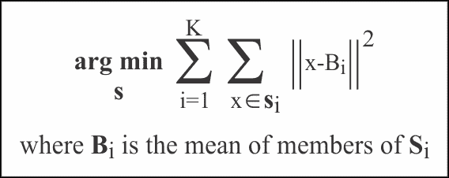

## 实际中的 K-Means

再次，K-Means MLlib 功能使用 LabeledPoint 结构来处理其数据，因此需要数值输入数据。由于本节重复使用了上一节的相同数据，我不会重新解释数据转换。在本节中在数据方面唯一的变化是，HDFS 下的处理现在将在`/data/spark/kmeans/`目录下进行。此外，K-Means 示例的 Scala 脚本转换产生的记录是逗号分隔的。

K-Means 示例的开发和处理已经在`/home/hadoop/spark/kmeans`目录下进行，以便将工作与其他开发分开。sbt 配置文件现在称为`kmeans.sbt`，与上一个示例相同，只是项目名称不同：

```scala
name := "K-Means"

```

这一部分的代码可以在软件包的`chapter2\K-Means`目录下找到。因此，查看存储在`kmeans/src/main/scala`下的`kmeans1.scala`的代码，会发生一些类似的操作。导入语句涉及到 Spark 上下文和配置。然而，这次 K-Means 功能也被从 MLlib 中导入。此外，本示例的应用程序类名已更改为`kmeans1`：

```scala
import org.apache.spark.SparkContext
import org.apache.spark.SparkContext._
import org.apache.spark.SparkConf

import org.apache.spark.mllib.linalg.Vectors
import org.apache.spark.mllib.clustering.{KMeans,KMeansModel}

object kmeans1 extends App
{

```

与上一个示例一样，正在采取相同的操作来定义数据文件——定义 Spark 配置并创建 Spark 上下文：

```scala
 val hdfsServer = "hdfs://hc2nn.semtech-solutions.co.nz:8020"
 val hdfsPath   = "/data/spark/kmeans/"

 val dataFile   = hdfsServer + hdfsPath + "DigitalBreathTestData2013-MALE2a.csv"

 val sparkMaster = "spark://hc2nn.semtech-solutions.co.nz:7077"
 val appName = "K-Means 1"
 val conf = new SparkConf()

 conf.setMaster(sparkMaster)
 conf.setAppName(appName)

 val sparkCxt = new SparkContext(conf)

```

接下来，从数据文件加载了 CSV 数据，并按逗号字符分割为变量`VectorData`：

```scala
 val csvData = sparkCxt.textFile(dataFile)
 val VectorData = csvData.map
 {
 csvLine =>
 Vectors.dense( csvLine.split(',').map(_.toDouble))
 }

```

初始化了一个 K-Means 对象，并设置了参数来定义簇的数量和确定它们的最大迭代次数：

```scala
 val kMeans = new KMeans
 val numClusters         = 3
 val maxIterations       = 50

```

为初始化模式、运行次数和 Epsilon 定义了一些默认值，这些值我需要用于 K-Means 调用，但在处理中没有变化。最后，这些参数被设置到 K-Means 对象中：

```scala
 val initializationMode  = KMeans.K_MEANS_PARALLEL
 val numRuns             = 1
 val numEpsilon          = 1e-4

 kMeans.setK( numClusters )
 kMeans.setMaxIterations( maxIterations )
 kMeans.setInitializationMode( initializationMode )
 kMeans.setRuns( numRuns )
 kMeans.setEpsilon( numEpsilon )

```

我缓存了训练向量数据以提高性能，并使用向量数据训练了 K-Means 对象以创建训练过的 K-Means 模型：

```scala
 VectorData.cache
 val kMeansModel = kMeans.run( VectorData )

```

我计算了 K-Means 成本、输入数据行数，并通过打印行语句输出了结果。成本值表示簇有多紧密地打包在一起，以及簇之间有多分离：

```scala
 val kMeansCost = kMeansModel.computeCost( VectorData )

 println( "Input data rows : " + VectorData.count() )
 println( "K-Means Cost    : " + kMeansCost )

```

接下来，我使用了 K-Means 模型来打印计算出的三个簇的簇中心作为向量：

```scala
 kMeansModel.clusterCenters.foreach{ println }

```

最后，我使用了 K-Means 模型的`predict`函数来创建簇成员预测列表。然后，我通过值来计算这些预测，以给出每个簇中数据点的计数。这显示了哪些簇更大，以及是否真的有三个簇：

```scala
 val clusterRddInt = kMeansModel.predict( VectorData )

 val clusterCount = clusterRddInt.countByValue

 clusterCount.toList.foreach{ println }

} // end object kmeans1

```

因此，为了运行这个应用程序，必须从`kmeans`子目录编译和打包，如 Linux 的`pwd`命令所示：

```scala
[hadoop@hc2nn kmeans]$ pwd
/home/hadoop/spark/kmeans
[hadoop@hc2nn kmeans]$ sbt package

Loading /usr/share/sbt/bin/sbt-launch-lib.bash
[info] Set current project to K-Means (in build file:/home/hadoop/spark/kmeans/)
[info] Compiling 2 Scala sources to /home/hadoop/spark/kmeans/target/scala-2.10/classes...
[info] Packaging /home/hadoop/spark/kmeans/target/scala-2.10/k-means_2.10-1.0.jar ...
[info] Done packaging.
[success] Total time: 20 s, completed Feb 19, 2015 5:02:07 PM

```

一旦这个打包成功，我检查 HDFS 以确保测试数据已准备就绪。与上一个示例一样，我使用软件包中提供的`convert.scala`文件将我的数据转换为数值形式。我将在 HDFS 目录`/data/spark/kmeans`中处理数据文件`DigitalBreathTestData2013-MALE2a.csv`：

```scala
[hadoop@hc2nn nbayes]$ hdfs dfs -ls /data/spark/kmeans
Found 3 items
-rw-r--r--   3 hadoop supergroup   24645166 2015-02-05 21:11 /data/spark/kmeans/DigitalBreathTestData2013-MALE2.csv
-rw-r--r--   3 hadoop supergroup    5694226 2015-02-05 21:48 /data/spark/kmeans/DigitalBreathTestData2013-MALE2a.csv
drwxr-xr-x   - hadoop supergroup          0 2015-02-05 21:46 /data/spark/kmeans/result

```

`spark-submit`工具用于运行 K-Means 应用程序。在这个命令中唯一的变化是，类现在是`kmeans1`：

```scala
spark-submit \
 --class kmeans1 \
 --master spark://hc2nn.semtech-solutions.co.nz:7077  \
 --executor-memory 700M \
 --total-executor-cores 100 \
 /home/hadoop/spark/kmeans/target/scala-2.10/k-means_2.10-1.0.jar

```

Spark 集群运行的输出如下所示：

```scala
Input data rows : 467054
K-Means Cost    : 5.40312223450789E7

```

先前的输出显示了输入数据量，看起来是正确的，还显示了 K-Means 成本值。接下来是三个向量，描述了具有正确维数的数据簇中心。请记住，这些簇中心向量将具有与原始向量数据相同的列数：

```scala
[0.24698249738061878,1.3015883142472253,0.005830116872250263,2.9173747788555207,1.156645130895448,3.4400290524342454]

[0.3321793984152627,1.784137241326256,0.007615970459266097,2.5831987075928917,119.58366028156011,3.8379106085083468]

[0.25247226760684494,1.702510963969387,0.006384899819416975,2.231404248000688,52.202897927594805,3.551509158139135]

```

最后，对 1 到 3 号簇的簇成员资格进行了给出，其中 1 号簇（索引 0）的成员数量最多，为`407,539`个成员向量。

```scala
(0,407539)
(1,12999)
(2,46516)

```

因此，这两个例子展示了如何使用朴素贝叶斯和 K 均值对数据进行分类和聚类。但是，如果我想对图像或更复杂的模式进行分类，并使用黑盒方法进行分类呢？下一节将介绍使用 ANN（人工神经网络）进行基于 Spark 的分类。为了做到这一点，我需要下载最新的 Spark 代码，并为 Spark 1.3 构建服务器，因为它在撰写本文时尚未正式发布。

# ANN - 人工神经网络

为了研究 Apache Spark 中的**ANN**（人工神经网络）功能，我需要从 GitHub 网站获取最新的源代码。**ANN**功能由 Bert Greevenbosch ([`www.bertgreevenbosch.nl/`](http://www.bertgreevenbosch.nl/)) 开发，并计划在 Apache Spark 1.3 中发布。撰写本文时，当前的 Spark 版本是 1.2.1，CDH 5.x 附带的 Spark 版本是 1.0。因此，为了研究这个未发布的**ANN**功能，需要获取源代码并构建成 Spark 服务器。这是我在解释一些**ANN**背后的理论之后将要做的事情。

## 理论

下图显示了左侧的一个简单的生物神经元。神经元有树突接收其他神经元的信号。细胞体控制激活，轴突将电脉冲传递给其他神经元的树突。右侧的人工神经元具有一系列加权输入：将输入分组的求和函数，以及一个触发机制（**F(Net)**），它决定输入是否达到阈值，如果是，神经元将发射：

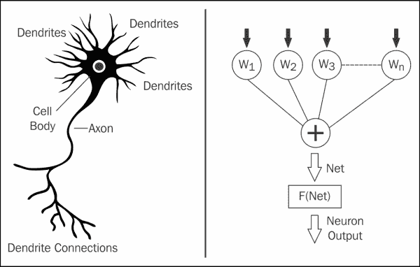

神经网络对嘈杂的图像和失真具有容忍性，因此在需要对潜在受损图像进行黑盒分类时非常有用。接下来要考虑的是神经元输入的总和函数。下图显示了神经元 i 的总和函数**Net**。具有加权值的神经元之间的连接包含网络的存储知识。通常，网络会有一个输入层，一个输出层和若干隐藏层。如果神经元的输入总和超过阈值，神经元将发射。

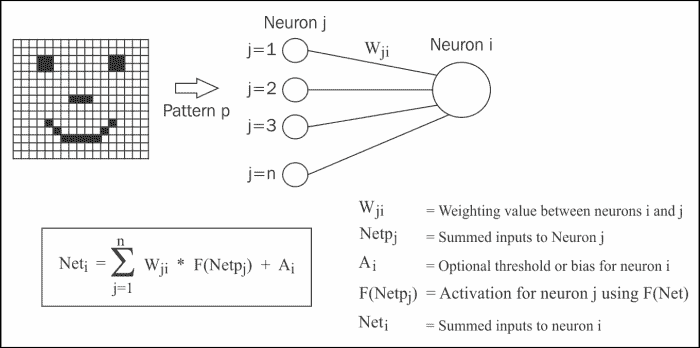

在前述方程中，图表和关键显示了来自模式**P**的输入值被传递到网络的输入层神经元。这些值成为输入层神经元的激活值；它们是一个特例。神经元**i**的输入是神经元连接**i-j**的加权值的总和，乘以神经元**j**的激活。神经元**j**的激活（如果它不是输入层神经元）由**F(Net)**，即压缩函数给出，接下来将对其进行描述。

一个模拟神经元需要一个触发机制，决定神经元的输入是否达到了阈值。然后，它会发射以创建该神经元的激活值。这种发射或压缩功能可以用下图所示的广义 S 形函数来描述：

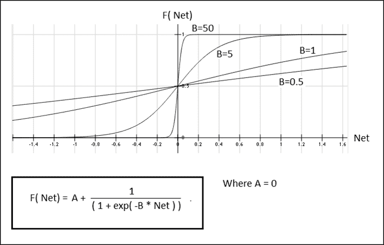

该函数有两个常数：**A**和**B**；**B**影响激活曲线的形状，如前图所示。数值越大，函数越类似于开/关步骤。**A**的值设置了返回激活的最小值。在前图中为零。

因此，这提供了模拟神经元、创建权重矩阵作为神经元连接以及管理神经元激活的机制。但是网络是如何组织的呢？下图显示了一个建议的神经元架构 - 神经网络具有一个输入层的神经元，一个输出层和一个或多个隐藏层。每层中的所有神经元都与相邻层中的每个神经元相连。

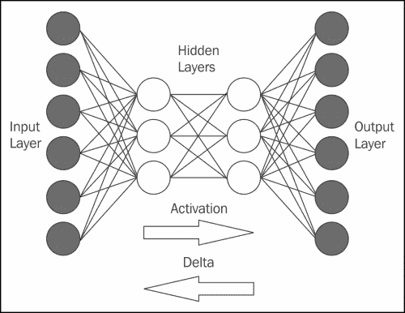

在训练期间，激活从输入层通过网络传递到输出层。然后，期望的或实际输出之间的错误或差异导致错误增量通过网络传递回来，改变权重矩阵的值。一旦达到期望的输出层向量，知识就存储在权重矩阵中，网络可以进一步训练或用于分类。

因此，神经网络背后的理论已经以反向传播的方式描述。现在是时候获取 Apache Spark 代码的开发版本，并构建 Spark 服务器，以便运行 ANN Scala 代码。

## 构建 Spark 服务器

我通常不建议在 Spark 发布之前下载和使用 Apache Spark 代码，或者在 Cloudera（用于 CDH）打包，但是对 ANN 功能进行检查的愿望，以及本书允许的时间范围，意味着我需要这样做。我从这个路径提取了完整的 Spark 代码树：

```scala
https://github.com/apache/spark/pull/1290.

```

我将这段代码存储在 Linux 服务器`hc2nn`的目录`/home/hadoop/spark/spark`下。然后我从 Bert Greevenbosch 的 GitHub 开发区域获取了 ANN 代码：

```scala
https://github.com/bgreeven/spark/blob/master/mllib/src/main/scala/org/apache/spark/mllib/ann/ArtificialNeuralNetwork.scala
https://github.com/bgreeven/spark/blob/master/mllib/src/main/scala/org/apache/spark/mllib/classification/ANNClassifier.scala

```

`ANNClassifier.scala`文件包含将被调用的公共函数。`ArtificialNeuralNetwork.scala`文件包含`ANNClassifier.scala`调用的私有 MLlib ANN 函数。我已经在服务器上安装了 Java open JDK，所以下一步是在`/home/hadoop/spark/spark/conf`路径下设置`spark-env.sh`环境配置文件。我的文件如下：

```scala
export STANDALONE_SPARK_MASTER_HOST=hc2nn.semtech-solutions.co.nz
export SPARK_MASTER_IP=$STANDALONE_SPARK_MASTER_HOST
export SPARK_HOME=/home/hadoop/spark/spark
export SPARK_LAUNCH_WITH_SCALA=0
export SPARK_MASTER_WEBUI_PORT=19080
export SPARK_MASTER_PORT=8077
export SPARK_WORKER_PORT=8078
export SPARK_WORKER_WEBUI_PORT=19081
export SPARK_WORKER_DIR=/var/run/spark/work
export SPARK_LOG_DIR=/var/log/spark
export SPARK_HISTORY_SERVER_LOG_DIR=/var/log/spark
export SPARK_PID_DIR=/var/run/spark/
export HADOOP_CONF_DIR=/etc/hadoop/conf
export SPARK_JAR_PATH=${SPARK_HOME}/assembly/target/scala-2.10/
export SPARK_JAR=${SPARK_JAR_PATH}/spark-assembly-1.3.0-SNAPSHOT-hadoop2.3.0-cdh5.1.2.jar
export JAVA_HOME=/usr/lib/jvm/java-1.7.0
export SPARK_LOCAL_IP=192.168.1.103

```

`SPARK_MASTER_IP`变量告诉集群哪个服务器是主服务器。端口变量定义了主服务器、工作服务器 web 和操作端口值。还定义了一些日志和 JAR 文件路径，以及`JAVA_HOME`和本地服务器 IP 地址。有关使用 Apache Maven 构建 Spark 的详细信息，请参阅：

```scala
http://spark.apache.org/docs/latest/building-spark.html

```

在相同目录中的 slaves 文件将像以前一样设置为四个工作服务器的名称，从`hc2r1m1`到`hc2r1m4`。

为了使用 Apache Maven 构建，我必须在我的 Linux 服务器`hc2nn`上安装`mvn`，我将在那里运行 Spark 构建。我以 root 用户的身份进行了这个操作，首先使用`wget`获取了一个 Maven 存储库文件：

```scala
wget http://repos.fedorapeople.org/repos/dchen/apache-maven/epel-apache-maven.repo -O /etc/yum.repos.d/epel-apache-maven.repo

```

然后使用`ls`长列表检查新的存储库文件是否就位。

```scala
[root@hc2nn ~]# ls -l /etc/yum.repos.d/epel-apache-maven.repo
-rw-r--r-- 1 root root 445 Mar  4  2014 /etc/yum.repos.d/epel-apache-maven.repo

```

然后可以使用 Linux 的`yum`命令安装 Maven，下面的示例展示了安装命令以及通过`ls`检查`mvn`命令是否存在。

```scala
[root@hc2nn ~]# yum install apache-maven
[root@hc2nn ~]# ls -l /usr/share/apache-maven/bin/mvn
-rwxr-xr-x 1 root root 6185 Dec 15 06:30 /usr/share/apache-maven/bin/mvn

```

我用来构建 Spark 源代码树的命令以及成功的输出如下所示。首先设置环境，然后使用`mvn`命令启动构建。添加选项以构建 Hadoop 2.3/yarn，并跳过测试。构建使用`clean`和`package`选项每次删除旧的构建文件，然后创建 JAR 文件。最后，构建输出通过`tee`命令复制到一个名为`build.log`的文件中：

```scala
cd /home/hadoop/spark/spark/conf ; . ./spark-env.sh ; cd ..

mvn  -Pyarn -Phadoop-2.3  -Dhadoop.version=2.3.0-cdh5.1.2 -DskipTests clean package | tee build.log 2>&1

[INFO] ----------------------------------------------------------
[INFO] BUILD SUCCESS
[INFO] ----------------------------------------------------------
[INFO] Total time: 44:20 min
[INFO] Finished at: 2015-02-16T12:20:28+13:00
[INFO] Final Memory: 76M/925M
[INFO] ----------------------------------------------------------

```

您使用的实际构建命令将取决于您是否安装了 Hadoop 以及其版本。有关详细信息，请查看之前的*构建 Spark*，在我的服务器上构建大约需要 40 分钟。

考虑到这个构建将被打包并复制到 Spark 集群中的其他服务器，很重要的一点是所有服务器使用相同版本的 Java，否则会出现诸如以下错误：

```scala
15/02/15 12:41:41 ERROR executor.Executor: Exception in task 0.1 in stage 0.0 (TID 2)
java.lang.VerifyError: class org.apache.hadoop.hdfs.protocol.proto.ClientNamenodeProtocolProtos$GetBlockLocationsRequestProto overrides final method getUnknownFields.()Lcom/google/protobuf/UnknownFieldSet;
 at java.lang.ClassLoader.defineClass1(Native Method)

```

鉴于源代码树已经构建完成，现在需要将其捆绑并发布到 Spark 集群中的每台服务器上。考虑到这些服务器也是 CDH 集群的成员，并且已经设置了无密码 SSH 访问，我可以使用`scp`命令来发布构建好的软件。以下命令展示了将`/home/hadoop/spark`路径下的 spark 目录打包成名为`spark_bld.tar`的 tar 文件。然后使用 Linux 的`scp`命令将 tar 文件复制到每个从服务器；以下示例展示了`hc2r1m1`：

```scala
[hadoop@hc2nn spark]$ cd /home/hadoop/spark
[hadoop@hc2nn spark]$ tar cvf spark_bld.tar spark
[hadoop@hc2nn spark]$ scp ./spark_bld.tar hadoop@hc2r1m1:/home/hadoop/spark/spark_bld.tar

```

现在，打包的 Spark 构建已经在从节点上，需要进行解压。以下命令显示了服务器`hc2r1m1`的过程。tar 文件解压到与构建服务器`hc2nn`相同的目录，即`/home/hadoop/spark`：

```scala
[hadoop@hc2r1m1 ~]$ mkdir spark ; mv spark_bld.tar spark
[hadoop@hc2r1m1 ~]$ cd spark ; ls
spark_bld.tar
[hadoop@hc2r1m1 spark]$ tar xvf spark_bld.tar

```

一旦构建成功运行，并且构建的代码已经发布到从服务器，Spark 的构建版本可以从主服务器**hc2nn**启动。请注意，我已经选择了与这些服务器上安装的 Spark 版本 1.0 不同的端口号。还要注意，我将以 root 身份启动 Spark，因为 Spark 1.0 安装是在 root 帐户下管理的 Linux 服务。由于两个安装将共享日志记录和`.pid`文件位置等设施，root 用户将确保访问。这是我用来启动 Apache Spark 1.3 的脚本：

```scala
cd /home/hadoop/spark/spark/conf ;  . ./spark-env.sh ; cd ../sbin
echo "hc2nn - start master server"
./start-master.sh
echo "sleep 5000 ms"
sleep 5
echo "hc2nn - start history server"
./start-history-server.sh
echo "Start Spark slaves workers"
./start-slaves.sh

```

它执行`spark-env.sh`文件来设置环境，然后使用 Spark `sbin`目录中的脚本来启动服务。首先在`hc2nn`上启动主服务器和历史服务器，然后启动从服务器。在启动从服务器之前，我添加了延迟，因为我发现它们在主服务器准备好之前就尝试连接到主服务器。现在可以通过此 URL 访问 Spark 1.3 Web 用户界面：

```scala
http://hc2nn.semtech-solutions.co.nz:19080/

```

Spark URL 允许应用程序连接到 Spark 是这样的：

```scala
Spark Master at spark://hc2nn.semtech-solutions.co.nz:8077

```

根据 spark 环境配置文件中的端口号，Spark 现在可以与 ANN 功能一起使用。下一节将展示 ANN Scala 脚本和数据，以展示如何使用基于 Spark 的功能。

## ANN 实践

为了开始 ANN 训练，需要测试数据。鉴于这种分类方法应该擅长分类扭曲或嘈杂的图像，我决定尝试在这里对图像进行分类：

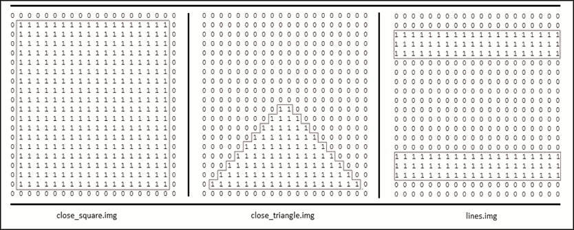

它们是手工制作的文本文件，包含由字符 1 和 0 创建的形状块。当它们存储在 HDFS 上时，回车字符被移除，因此图像呈现为单行向量。因此，ANN 将对一系列形状图像进行分类，然后将针对添加噪声的相同图像进行测试，以确定分类是否仍然有效。有六个训练图像，它们将分别被赋予从 0.1 到 0.6 的任意训练标签。因此，如果 ANN 被呈现为封闭的正方形，它应该返回一个标签 0.1。以下图像显示了添加噪声的测试图像的示例。通过在图像中添加额外的零（0）字符创建的噪声已经被突出显示：

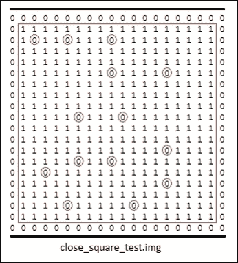

由于 Apache Spark 服务器已经从之前的示例中更改，并且 Spark 库的位置也已更改，用于编译示例 ANN Scala 代码的`sbt`配置文件也必须更改。与以前一样，ANN 代码是在 Linux hadoop 帐户中的一个名为`spark/ann`的子目录中开发的。`ann.sbt`文件存在于`ann`目录中：

```scala
 [hadoop@hc2nn ann]$ pwd
/home/hadoop/spark/ann

 [hadoop@hc2nn ann]$ ls
ann.sbt    project  src  target

```

`ann.sbt`文件的内容已更改为使用 Spark 依赖项的 JAR 库文件的完整路径。这是因为新的 Apache Spark 构建 1.3 现在位于`/home/hadoop/spark/spark`下。此外，项目名称已更改为`A N N`：

```scala
name := "A N N"
version := "1.0"
scalaVersion := "2.10.4"
libraryDependencies += "org.apache.hadoop" % "hadoop-client" % "2.3.0"
libraryDependencies += "org.apache.spark" % "spark-core"  % "1.3.0" from "file:///home/hadoop/spark/spark/core/target/spark-core_2.10-1.3.0-SNAPSHOT.jar"
libraryDependencies += "org.apache.spark" % "spark-mllib" % "1.3.0" from "file:///home/hadoop/spark/spark/mllib/target/spark-mllib_2.10-1.3.0-SNAPSHOT.jar"
libraryDependencies += "org.apache.spark" % "akka" % "1.3.0" from "file:///home/hadoop/spark/spark/assembly/target/scala-2.10/spark-assembly-1.3.0-SNAPSHOT-hadoop2.3.0-cdh5.1.2.jar"

```

与以前的示例一样，要编译的实际 Scala 代码存在于名为`src/main/scala`的子目录中，如下所示。我创建了两个 Scala 程序。第一个使用输入数据进行训练，然后用相同的输入数据测试 ANN 模型。第二个使用嘈杂的数据测试训练模型，以测试扭曲数据的分类：

```scala
[hadoop@hc2nn scala]$ pwd
/home/hadoop/spark/ann/src/main/scala

[hadoop@hc2nn scala]$ ls
test_ann1.scala  test_ann2.scala

```

我将完全检查第一个 Scala 文件，然后只展示第二个文件的额外特性，因为这两个示例在训练 ANN 的时候非常相似。这里展示的代码示例可以在本书提供的软件包中找到，路径为`chapter2\ANN`。因此，要检查第一个 Scala 示例，导入语句与之前的示例类似。导入了 Spark 上下文、配置、向量和`LabeledPoint`。这次还导入了 RDD 类用于 RDD 处理，以及新的 ANN 类`ANNClassifier`。请注意，`MLlib/classification`例程广泛使用`LabeledPoint`结构作为输入数据，其中包含了应该被训练的特征和标签：

```scala
import org.apache.spark.SparkContext
import org.apache.spark.SparkContext._
import org.apache.spark.SparkConf

import org.apache.spark.mllib.classification.ANNClassifier
import org.apache.spark.mllib.regression.LabeledPoint
import org.apache.spark.mllib.linalg.Vectors
import org.apache.spark.mllib.linalg._
import org.apache.spark.rdd.RDD

object testann1 extends App
{

```

在这个例子中，应用程序类被称为`testann1`。要处理的 HDFS 文件已经根据 HDFS 服务器、路径和文件名进行了定义：

```scala
 val server = "hdfs://hc2nn.semtech-solutions.co.nz:8020"
 val path   = "/data/spark/ann/"

 val data1 = server + path + "close_square.img"
 val data2 = server + path + "close_triangle.img"
 val data3 = server + path + "lines.img"
 val data4 = server + path + "open_square.img"
 val data5 = server + path + "open_triangle.img"
 val data6 = server + path + "plus.img"

```

Spark 上下文已经创建，使用了 Spark 实例的 URL，现在端口号不同了——`8077`。应用程序名称是`ANN 1`。当应用程序运行时，这将出现在 Spark Web UI 上：

```scala
 val sparkMaster = "spark://hc2nn.semtech-solutions.co.nz:8077"
 val appName = "ANN 1"
 val conf = new SparkConf()

 conf.setMaster(sparkMaster)
 conf.setAppName(appName)

 val sparkCxt = new SparkContext(conf)

```

加载基于 HDFS 的输入训练和测试数据文件。每行的值都被空格字符分割，并且数值已经转换为双精度。包含这些数据的变量然后存储在一个名为 inputs 的数组中。同时，创建了一个名为 outputs 的数组，其中包含了从 0.1 到 0.6 的标签。这些值将用于对输入模式进行分类：

```scala
 val rData1 = sparkCxt.textFile(data1).map(_.split(" ").map(_.toDouble)).collect
 val rData2 = sparkCxt.textFile(data2).map(_.split(" ").map(_.toDouble)).collect
 val rData3 = sparkCxt.textFile(data3).map(_.split(" ").map(_.toDouble)).collect
 val rData4 = sparkCxt.textFile(data4).map(_.split(" ").map(_.toDouble)).collect
 val rData5 = sparkCxt.textFile(data5).map(_.split(" ").map(_.toDouble)).collect
 val rData6 = sparkCxt.textFile(data6).map(_.split(" ").map(_.toDouble)).collect

 val inputs = Array[Array[Double]] (
 rData1(0), rData2(0), rData3(0), rData4(0), rData5(0), rData6(0) )

 val outputs = ArrayDouble

```

输入和输出数据，表示输入数据特征和标签，然后被合并并转换成`LabeledPoint`结构。最后，数据被并行化以便对其进行最佳并行处理：

```scala
 val ioData = inputs.zip( outputs )
 val lpData = ioData.map{ case(features,label) =>

 LabeledPoint( label, Vectors.dense(features) )
 }
 val rddData = sparkCxt.parallelize( lpData )

```

创建变量来定义 ANN 的隐藏层拓扑。在这种情况下，我选择了有两个隐藏层，每个隐藏层有 100 个神经元。定义了最大迭代次数，以及批处理大小（六个模式）和收敛容限。容限是指在我们可以考虑训练已经完成之前，训练误差可以达到多大。然后，使用这些配置参数和输入数据创建了一个 ANN 模型：

```scala
 val hiddenTopology : Array[Int] = Array( 100, 100 )
 val maxNumIterations = 1000
 val convTolerance    = 1e-4
 val batchSize        = 6

 val annModel = ANNClassifier.train(rddData,
 batchSize,
 hiddenTopology,
 maxNumIterations,
 convTolerance)

```

为了测试训练好的 ANN 模型，相同的输入训练数据被用作测试数据来获取预测标签。首先创建一个名为`rPredictData`的输入数据变量。然后，对数据进行分区，最后使用训练好的 ANN 模型获取预测。对于这个模型工作，必须输出标签 0.1 到 0.6：

```scala
 val rPredictData = inputs.map{ case(features) =>

 ( Vectors.dense(features) )
 }
 val rddPredictData = sparkCxt.parallelize( rPredictData )
 val predictions = annModel.predict( rddPredictData )

```

打印标签预测，并以一个闭合括号结束脚本：

```scala
 predictions.toArray().foreach( value => println( "prediction > " + value ) )
} // end ann1

```

因此，为了运行这个代码示例，必须首先编译和打包。到目前为止，您一定熟悉`ann`子目录中执行的`sbt`命令：

```scala
[hadoop@hc2nn ann]$ pwd
/home/hadoop/spark/ann
[hadoop@hc2nn ann]$ sbt package

```

然后，使用`spark-submit`命令从新的`spark/spark`路径使用新的基于 Spark 的 URL 在端口 8077 上运行应用程序`testann1`：

```scala
/home/hadoop/spark/spark/bin/spark-submit \
 --class testann1 \
 --master spark://hc2nn.semtech-solutions.co.nz:8077  \
 --executor-memory 700M \
 --total-executor-cores 100 \
 /home/hadoop/spark/ann/target/scala-2.10/a-n-n_2.10-1.0.jar

```

通过检查`http://hc2nn.semtech-solutions.co.nz:19080/`上的 Apache Spark Web URL，现在可以看到应用程序正在运行。下图显示了应用程序**ANN 1**正在运行，以及之前完成的执行：

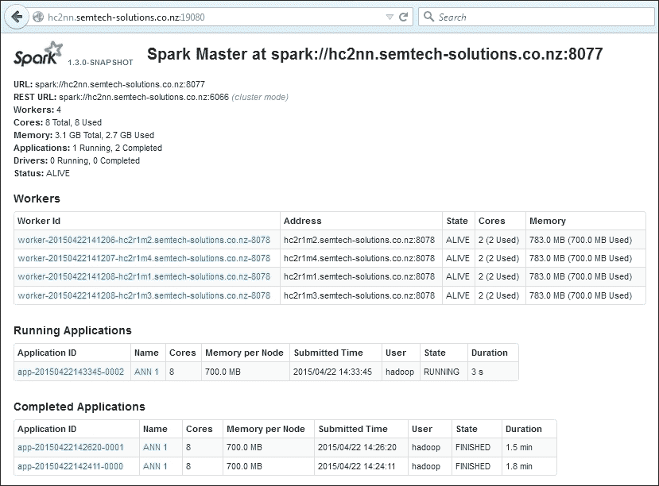

通过选择集群主机工作实例中的一个，可以看到实际执行该工作的执行程序列表：

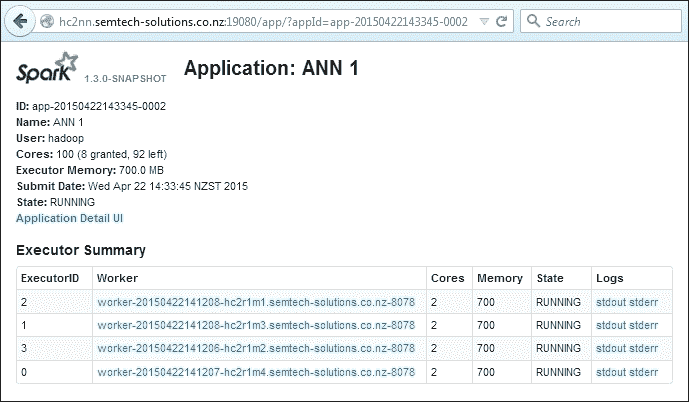

最后，通过选择一个执行程序，可以查看其历史和配置，以及日志文件和错误信息的链接。在这个级别上，通过提供的日志信息，可以进行调试。可以检查这些日志文件以获取处理错误消息。

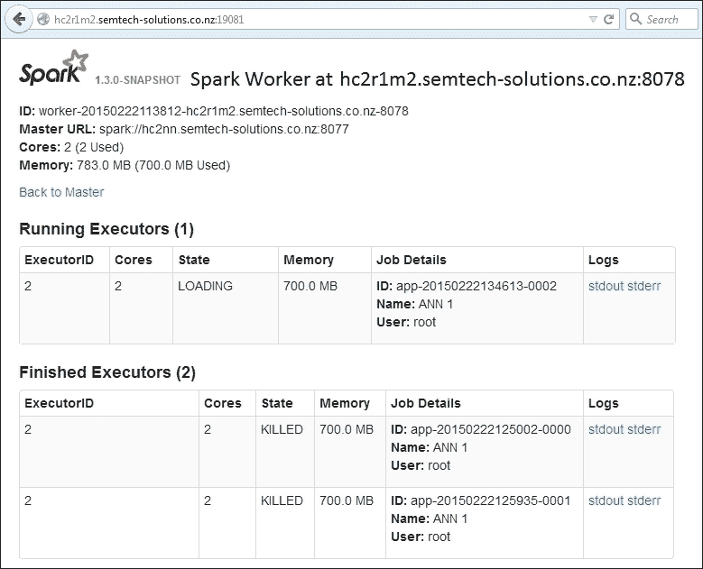

**ANN 1**应用程序提供以下输出，以显示它已经正确地重新分类了相同的输入数据。重新分类是成功的，因为每个输入模式都被赋予了与训练时相同的标签。

```scala
prediction > 0.1
prediction > 0.2
prediction > 0.3
prediction > 0.4
prediction > 0.5
prediction > 0.6

```

因此，这表明 ANN 训练和测试预测将使用相同的数据。现在，我将使用相同的数据进行训练，但使用扭曲或嘈杂的数据进行测试，这是我已经演示过的一个例子。您可以在软件包中的名为`test_ann2.scala`的文件中找到这个例子。它与第一个例子非常相似，所以我只会演示修改后的代码。该应用程序现在称为`testann2`。

```scala
object testann2 extends App

```

在使用训练数据创建 ANN 模型后，会创建额外的一组测试数据。这些测试数据包含噪音。

```scala
 val tData1 = server + path + "close_square_test.img"
 val tData2 = server + path + "close_triangle_test.img"
 val tData3 = server + path + "lines_test.img"
 val tData4 = server + path + "open_square_test.img"
 val tData5 = server + path + "open_triangle_test.img"
 val tData6 = server + path + "plus_test.img"

```

这些数据被处理成输入数组，并被分区进行集群处理。

```scala
 val rtData1 = sparkCxt.textFile(tData1).map(_.split(" ").map(_.toDouble)).collect
 val rtData2 = sparkCxt.textFile(tData2).map(_.split(" ").map(_.toDouble)).collect
 val rtData3 = sparkCxt.textFile(tData3).map(_.split(" ").map(_.toDouble)).collect
 val rtData4 = sparkCxt.textFile(tData4).map(_.split(" ").map(_.toDouble)).collect
 val rtData5 = sparkCxt.textFile(tData5).map(_.split(" ").map(_.toDouble)).collect
 val rtData6 = sparkCxt.textFile(tData6).map(_.split(" ").map(_.toDouble)).collect

 val tInputs = Array[Array[Double]] (
 rtData1(0), rtData2(0), rtData3(0), rtData4(0), rtData5(0), rtData6(0) )

 val rTestPredictData = tInputs.map{ case(features) => ( Vectors.dense(features) ) }
 val rddTestPredictData = sparkCxt.parallelize( rTestPredictData )

```

然后，它被用来以与第一个示例相同的方式生成标签预测。如果模型正确分类数据，则应该从 0.1 到 0.6 打印相同的标签值。

```scala
 val testPredictions = annModel.predict( rddTestPredictData )
 testPredictions.toArray().foreach( value => println( "test prediction > " + value ) )

```

代码已经被编译，因此可以使用`spark-submit`命令运行。

```scala
/home/hadoop/spark/spark/bin/spark-submit \
 --class testann2 \
 --master spark://hc2nn.semtech-solutions.co.nz:8077  \
 --executor-memory 700M \
 --total-executor-cores 100 \
 /home/hadoop/spark/ann/target/scala-2.10/a-n-n_2.10-1.0.jar

```

这是脚本的集群输出，显示了使用训练过的 ANN 模型进行成功分类以及一些嘈杂的测试数据。嘈杂的数据已经被正确分类。例如，如果训练模型混淆了，它可能会在位置一的嘈杂的`close_square_test.img`测试图像中给出`0.15`的值，而不是返回`0.1`。

```scala
test prediction > 0.1
test prediction > 0.2
test prediction > 0.3
test prediction > 0.4
test prediction > 0.5
test prediction > 0.6

```

# 摘要

本章试图为您提供 Apache Spark MLlib 模块中一些功能的概述。它还展示了即将在 Spark 1.3 版本中推出的 ANN（人工神经网络）的功能。由于本章的时间和空间限制，无法涵盖 MLlib 的所有领域。

您已经学会了如何为朴素贝叶斯分类、K 均值聚类和 ANN 或人工神经网络开发基于 Scala 的示例。您已经学会了如何为这些 Spark MLlib 例程准备测试数据。您还了解到它们都接受包含特征和标签的 LabeledPoint 结构。此外，每种方法都采用了训练和预测的方法，使用不同的数据集来训练和测试模型。使用本章展示的方法，您现在可以研究 MLlib 库中剩余的功能。您应该参考[`spark.apache.org/`](http://spark.apache.org/)网站，并确保在查看文档时参考正确的版本，即[`spark.apache.org/docs/1.0.0/`](http://spark.apache.org/docs/1.0.0/)，用于 1.0.0 版本。

在本章中，我们已经研究了 Apache Spark MLlib 机器学习库，现在是时候考虑 Apache Spark 的流处理能力了。下一章将使用基于 Spark 和 Scala 的示例代码来研究流处理。
