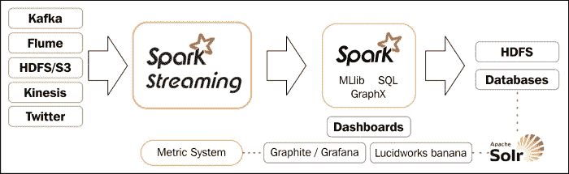
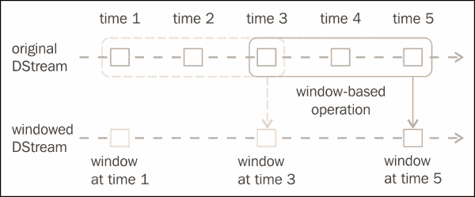
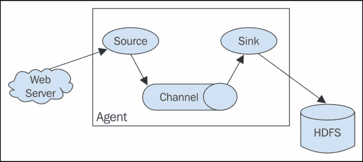
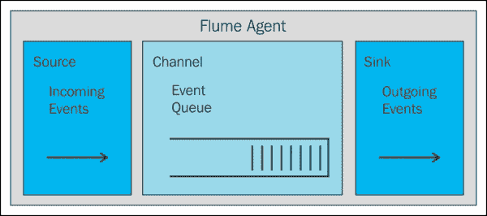
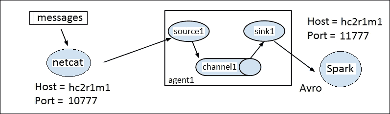
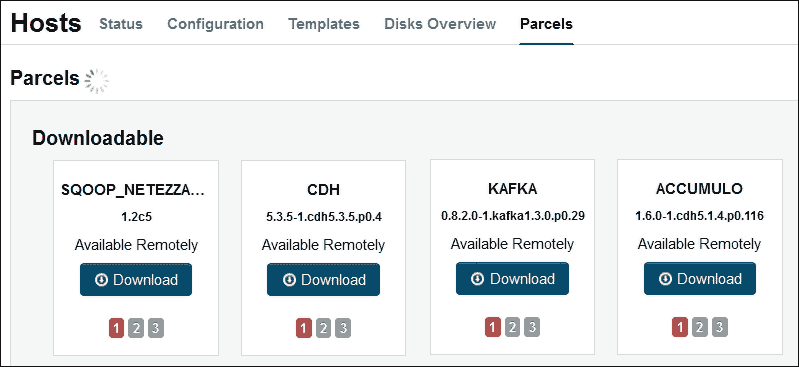
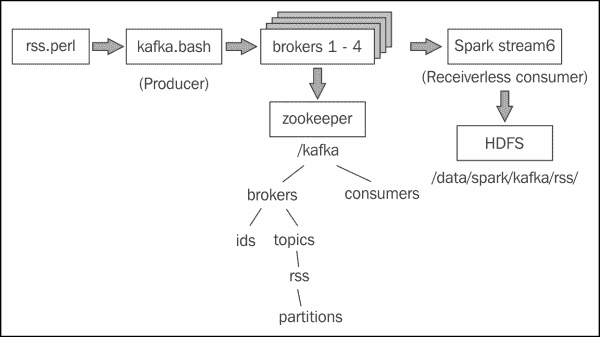

# 第三章：Apache Spark Streaming

Apache Streaming 模块是 Apache Spark 中基于流处理的模块。它利用 Spark 集群提供高度扩展的能力。基于 Spark，它也具有高度的容错性，能够通过检查点数据流重新运行失败的任务。在本章的初始部分之后，将涵盖以下领域，这部分将提供 Apache Spark 处理基于流的数据的实际概述：

+   错误恢复和检查点

+   基于 TCP 的流处理

+   文件流

+   Flume 流源

+   Kafka 流源

对于每个主题，我将在 Scala 中提供一个示例，并展示如何设置和测试基于流的架构。

# 概览

在介绍 Apache Spark 流模块时，我建议您查看[`spark.apache.org/`](http://spark.apache.org/)网站以获取最新信息，以及 Spark 用户组，如`<user@spark.apache.org>`。我之所以这样说是因为这些是 Spark 信息可获得的主要地方。而且，极快（并且不断增加）的变化速度意味着到您阅读此内容时，新的 Spark 功能和版本将会可用。因此，在这种情况下，当进行概述时，我会尽量概括。



前面的图显示了 Apache Streaming 的潜在数据来源，例如**Kafka**，**Flume**和**HDFS**。这些数据源输入到 Spark Streaming 模块中，并作为离散流进行处理。该图还显示了其他 Spark 模块功能，例如机器学习，可以用来处理基于流的数据。经过完全处理的数据可以作为**HDFS**，**数据库**或**仪表板**的输出。这个图是基于 Spark streaming 网站上的图，但我想扩展它，既表达了 Spark 模块的功能，也表达了仪表板的选项。前面的图显示了从 Spark 到 Graphite 的 MetricSystems 数据源。此外，还可以将基于 Solr 的数据源提供给 Lucidworks banana（kabana 的一个端口）。值得在这里提到的是 Databricks（见第八章，*Spark Databricks*和第九章，*Databricks Visualization*）也可以将 Spark 流数据呈现为仪表板。



在讨论 Spark 离散流时，前面的图，再次取自 Spark 网站[`spark.apache.org/`](http://spark.apache.org/)，是我喜欢使用的图。前面的图中的绿色框显示了连续的数据流发送到 Spark，被分解为**离散流**（**DStream**）。然后，流中每个元素的大小基于批处理时间，可能是两秒。还可以创建一个窗口，表示为前面的红色框，覆盖 DStream。例如，在实时进行趋势分析时，可能需要确定在十分钟窗口内的前十个基于 Twitter 的 Hashtags。

因此，鉴于 Spark 可以用于流处理，如何创建流呢？以下基于 Scala 的代码显示了如何创建 Twitter 流。这个例子是简化的，因为没有包括 Twitter 授权，但您可以理解（完整的示例代码在*检查点*部分）。使用 Spark 上下文`sc`创建了名为`ssc`的 Spark 流上下文。在创建时指定了批处理时间；在这种情况下是五秒。然后从`Streamingcontext`创建了基于 Twitter 的 DStream，称为`stream`，并使用了 60 秒的窗口：

```scala
 val ssc    = new StreamingContext(sc, Seconds(5) )
 val stream = TwitterUtils.createStream(ssc,None).window( Seconds(60) )

```

流处理可以使用流上下文开始方法（下面显示），`awaitTermination`方法表示应该一直处理直到停止。因此，如果此代码嵌入在基于库的应用程序中，它将一直运行直到会话终止，也许使用*Crtl* + *C*：

```scala
 ssc.start()
 ssc.awaitTermination()

```

这解释了 Spark 流是什么以及它的作用，但没有解释错误处理，或者如果基于流的应用程序失败该怎么办。下一节将讨论 Spark 流错误管理和恢复。

# 错误和恢复

通常，对于您的应用程序需要问的问题是：是否关键接收和处理所有数据？如果不是，那么在失败时，您可能只需重新启动应用程序并丢弃丢失的数据。如果不是这种情况，那么您将需要使用检查点，这将在下一节中描述。

值得注意的是，您的应用程序的错误管理应该是健壮和自给自足的。我的意思是，如果异常是非关键的，那么管理异常，也许记录它，并继续处理。例如，当任务达到最大失败次数（由`spark.task.maxFailures`指定）时，它将终止处理。

## 检查点

可以设置一个基于 HDFS 的检查点目录来存储 Apache Spark 基于流的信息。在这个 Scala 示例中，数据将存储在 HDFS 的`/data/spark/checkpoint`目录下。下面的 HDFS 文件系统`ls`命令显示，在开始之前，该目录不存在：

```scala
[hadoop@hc2nn stream]$ hdfs dfs -ls /data/spark/checkpoint
ls: `/data/spark/checkpoint': No such file or directory

```

接下来给出的基于 Twitter 的 Scala 代码示例，首先定义了应用程序的包名称，并导入了 Spark、流、上下文和基于 Twitter 的功能。然后定义了一个名为`stream1`的应用程序对象：

```scala
package nz.co.semtechsolutions

import org.apache.spark._
import org.apache.spark.SparkContext._
import org.apache.spark.streaming._
import org.apache.spark.streaming.twitter._
import org.apache.spark.streaming.StreamingContext._

object stream1 {

```

接下来定义了一个名为`createContext`的方法，该方法将用于创建 spark 和流上下文，并将流检查点到基于 HDFS 的目录，使用流上下文检查点方法，该方法以目录路径作为参数。目录路径是传递给`createContext`方法的值（`cpDir`）：

```scala
 def createContext( cpDir : String ) : StreamingContext = {

 val appName = "Stream example 1"
 val conf    = new SparkConf()

 conf.setAppName(appName)

 val sc = new SparkContext(conf)

 val ssc    = new StreamingContext(sc, Seconds(5) )

 ssc.checkpoint( cpDir )

 ssc
 }

```

现在，主要方法已经定义，`HDFS`目录也已经定义，还有 Twitter 访问权限和参数。Spark 流上下文`ssc`要么通过`StreamingContext`方法-`getOrCreate`从 HDFS `checkpoint`目录中检索或创建。如果目录不存在，则调用之前的`createContext`方法，该方法将创建上下文和检查点。显然，出于安全原因，我在此示例中截断了自己的 Twitter 授权密钥。

```scala
 def main(args: Array[String]) {

 val hdfsDir = "/data/spark/checkpoint"

 val consumerKey       = "QQpxx"
 val consumerSecret    = "0HFzxx"
 val accessToken       = "323xx"
 val accessTokenSecret = "IlQxx"

 System.setProperty("twitter4j.oauth.consumerKey", consumerKey)
 System.setProperty("twitter4j.oauth.consumerSecret", consumerSecret)
 System.setProperty("twitter4j.oauth.accessToken", accessToken)
 System.setProperty("twitter4j.oauth.accessTokenSecret", accessTokenSecret)

 val ssc = StreamingContext.getOrCreate(hdfsDir,
 () => { createContext( hdfsDir ) })

 val stream = TwitterUtils.createStream(ssc,None).window( Seconds(60) )

 // do some processing

 ssc.start()
 ssc.awaitTermination()

 } // end main

```

运行了这段代码，没有实际处理，可以再次检查 HDFS `checkpoint`目录。这次明显可以看到`checkpoint`目录已经创建，并且数据已经存储：

```scala
[hadoop@hc2nn stream]$ hdfs dfs -ls /data/spark/checkpoint
Found 1 items
drwxr-xr-x   - hadoop supergroup          0 2015-07-02 13:41 /data/spark/checkpoint/0fc3d94e-6f53-40fb-910d-1eef044b12e9

```

这个例子来自 Apache Spark 网站，展示了如何设置和使用检查点存储。但是检查点操作有多频繁？元数据在每个流批次期间存储。实际数据存储的周期是批处理间隔或十秒的最大值。这可能不是您理想的设置，因此您可以使用该方法重置该值：

```scala
DStream.checkpoint( newRequiredInterval )

```

其中`newRequiredInterval`是您需要的新检查点间隔值，通常应该瞄准是批处理间隔的五到十倍。

检查点保存了流批次和元数据（关于数据的数据）。如果应用程序失败，那么在重新启动时，将使用检查点数据进行处理。在失败时正在处理的批处理数据将被重新处理，以及失败后的批处理数据。

记得监控用于检查点的 HDFS 磁盘空间。在下一节中，我将开始检查流源，并提供每种类型的一些示例。

# 流源

在本节中，我将无法涵盖所有流类型的实际示例，但在本章太小以至于无法包含代码的情况下，我至少会提供一个描述。在本章中，我将涵盖 TCP 和文件流，以及 Flume、Kafka 和 Twitter 流。我将从一个实际的基于 TCP 的示例开始。

本章探讨了流处理架构。例如，在流数据传递速率超过潜在数据处理速率的情况下会发生什么？像 Kafka 这样的系统提供了通过使用多个数据主题和消费者来解决这个问题的可能性。

## TCP 流

有可能使用 Spark 流上下文方法`socketTextStream`通过指定主机名和端口号来通过 TCP/IP 流式传输数据。本节中的基于 Scala 的代码示例将在端口`10777`上接收使用`netcat` Linux 命令提供的数据。代码示例从定义包名开始，并导入 Spark、上下文和流类。定义了一个名为`stream2`的对象类，因为它是带有参数的主方法：

```scala
package nz.co.semtechsolutions

import org.apache.spark._
import org.apache.spark.SparkContext._
import org.apache.spark.streaming._
import org.apache.spark.streaming.StreamingContext._

object stream2 {

 def main(args: Array[String]) {

```

检查传递给类的参数数量，以确保它是主机名和端口号。创建了一个具有应用程序名称的 Spark 配置对象。然后创建了 Spark 和流上下文。然后，设置了 10 秒的流批处理时间：

```scala
 if ( args.length < 2 )
 {
 System.err.println("Usage: stream2 <host> <port>")
 System.exit(1)
 }

 val hostname = args(0).trim
 val portnum  = args(1).toInt

 val appName = "Stream example 2"
 val conf    = new SparkConf()

 conf.setAppName(appName)

 val sc  = new SparkContext(conf)
 val ssc = new StreamingContext(sc, Seconds(10) )

```

通过使用主机和端口名称参数调用流上下文的`socketTextStream`方法创建了一个名为`rawDstream`的 DStream。

```scala
 val rawDstream = ssc.socketTextStream( hostname, portnum )

```

通过按空格拆分单词，从原始流数据创建了一个前十个单词计数。然后创建了一个（键，值）对，即`(word,1)`，通过键值进行了减少，这就是单词。现在，有一个单词及其相关计数的列表。现在，键和值被交换，所以列表变成了（`count`和`word`）。然后，对现在是计数的键进行排序。最后，从 DStream 中的`rdd`中取出前 10 个项目并打印出来：

```scala
 val wordCount = rawDstream
 .flatMap(line => line.split(" "))
 .map(word => (word,1))
 .reduceByKey(_+_)
 .map(item => item.swap)
 .transform(rdd => rdd.sortByKey(false))
 .foreachRDD( rdd =>
 { rdd.take(10).foreach(x=>println("List : " + x)) })

```

代码以 Spark Streaming 的启动和调用`awaitTermination`方法结束，以启动流处理并等待处理终止：

```scala
 ssc.start()
 ssc.awaitTermination()

 } // end main

} // end stream2

```

该应用程序的数据是由 Linux 的`netcat` (`nc`)命令提供的，正如我之前所说的。Linux 的`cat`命令会将日志文件的内容转储到`nc`。`lk`选项强制`netcat`监听连接，并在连接丢失时继续监听。该示例显示使用的端口是`10777`：

```scala
[root@hc2nn log]# pwd
/var/log
[root@hc2nn log]# cat ./anaconda.storage.log | nc -lk 10777

```

基于 TCP 的流处理的输出如下所示。实际输出并不像所示方法那样重要。然而，数据显示了预期的结果，即按降序列出了 10 个日志文件单词。请注意，顶部的单词为空，因为流没有过滤空单词：

```scala
List : (17104,)
List : (2333,=)
List : (1656,:)
List : (1603,;)
List : (1557,DEBUG)
List : (564,True)
List : (495,False)
List : (411,None)
List : (356,at)
List : (335,object)

```

如果您想要使用 Apache Spark 流处理基于 TCP/IP 的主机和端口的流数据，这是很有趣的。但是更奇特的方法呢？如果您希望从消息系统或通过基于内存的通道流式传输数据呢？如果您想要使用今天可用的一些大数据工具，比如 Flume 和 Kafka 呢？接下来的章节将探讨这些选项，但首先我将演示如何基于文件创建流。

## 文件流

我已经修改了上一节中基于 Scala 的代码示例，通过调用 Spark 流上下文方法`textFileStream`来监视基于 HDFS 的目录。鉴于这个小改变，我不会显示所有的代码。应用程序类现在称为`stream3`，它接受一个参数——`HDFS`目录。目录路径可以是 NFS 或 AWS S3（所有代码示例都将随本书提供）：

```scala
 val rawDstream = ssc.textFileStream( directory )

```

流处理与以前相同。流被分割成单词，并打印出前十个单词列表。这次唯一的区别是，在应用程序运行时，数据必须放入`HDFS`目录中。这是通过 HDFS 文件系统的`put`命令实现的：

```scala
[root@hc2nn log]# hdfs dfs -put ./anaconda.storage.log /data/spark/stream

```

如您所见，使用的`HDFS`目录是`/data/spark/stream/`，文本源日志文件是`anaconda.storage.log`（位于`/var/log/`下）。如预期的那样，打印出相同的单词列表和计数：

```scala
List : (17104,)
List : (2333,=)
……..
List : (564,True)
List : (495,False)
List : (411,None)
List : (356,at)
List : (335,object)

```

这些都是基于 TCP 和文件系统数据的简单流式处理方法。但是，如果我想要在 Spark 流处理中使用一些内置的流处理功能呢？接下来将对此进行检查。将使用 Spark 流处理 Flume 库作为示例。

## Flume

Flume 是一个 Apache 开源项目和产品，旨在以大数据规模移动大量数据。它具有高度可扩展性、分布式和可靠性，基于数据源、数据汇和数据通道工作，如此图所示，取自[`flume.apache.org/`](http://flume.apache.org/)网站：



Flume 使用代理来处理数据流。如前图所示，代理具有数据源、数据处理通道和数据汇。更清晰地描述这一点的方法是通过以下图。通道充当源数据的队列，而汇将数据传递给链中的下一个链接。



Flume 代理可以形成 Flume 架构；一个代理的 sink 的输出可以是第二个代理的输入。Apache Spark 允许使用两种方法来使用 Apache Flume。第一种是基于 Avro 的推送式内存方法，而第二种仍然基于 Avro，是一个基于拉取的系统，使用自定义的 Spark sink 库。

我通过 Cloudera CDH 5.3 集群管理器安装了 Flume，它安装了一个单一代理。检查 Linux 命令行，我可以看到 Flume 版本 1.5 现在可用：

```scala
[root@hc2nn ~]# flume-ng version
Flume 1.5.0-cdh5.3.3
Source code repository: https://git-wip-us.apache.org/repos/asf/flume.git
Revision: b88ce1fd016bc873d817343779dfff6aeea07706
Compiled by jenkins on Wed Apr  8 14:57:43 PDT 2015
From source with checksum 389d91c718e03341a2367bf4ef12428e

```

我将在这里最初实现的基于 Flume 的 Spark 示例是基于 Flume 的推送方法，其中 Spark 充当接收器，Flume 将数据推送到 Spark。以下图表示我将在单个节点上实现的结构：



消息数据将使用 Linux `netcat` (`nc`)命令发送到名为`hc2r1m1`的主机的端口`10777`。这将作为 Flume 代理(`agent1`)的源(`source1`)，它将有一个名为`channel1`的内存通道。`agent1`使用的 sink 将再次基于 Apache Avro，但这次是在名为`hc2r1m1`的主机上，端口号将为`11777`。Apache Spark Flume 应用程序`stream4`（我将很快描述）将在此端口上监听 Flume 流数据。

我通过执行`netcat` (`nc`)命令来启动流处理过程，针对`10777`端口。现在，当我在此窗口中输入文本时，它将被用作 Flume 源，并且数据将被发送到 Spark 应用程序：

```scala
[hadoop@hc2nn ~]$ nc  hc2r1m1.semtech-solutions.co.nz  10777

```

为了运行我的 Flume 代理`agent1`，我创建了一个名为`agent1.flume.cfg`的 Flume 配置文件，描述了代理的源、通道和 sink。文件的内容如下。第一部分定义了`agent1`的源、通道和 sink 名称。

```scala
agent1.sources  = source1
agent1.channels = channel1
agent1.sinks    = sink1

```

下一节定义`source1`为基于 netcat 的，运行在名为`hc2r1m1`的主机上，端口为`10777`：

```scala
agent1.sources.source1.channels=channel1
agent1.sources.source1.type=netcat
agent1.sources.source1.bind=hc2r1m1.semtech-solutions.co.nz
agent1.sources.source1.port=10777

```

`agent1`的通道`channel1`被定义为一个基于内存的通道，最大事件容量为 1000 个事件：

```scala
agent1.channels.channel1.type=memory
agent1.channels.channel1.capacity=1000

```

最后，`agent1`的 sink `sink1` 被定义为在名为`hc2r1m1`的主机上的 Apache Avro sink，并且端口为`11777`：

```scala
agent1.sinks.sink1.type=avro
agent1.sinks.sink1.hostname=hc2r1m1.semtech-solutions.co.nz
agent1.sinks.sink1.port=11777
agent1.sinks.sink1.channel=channel1

```

我创建了一个名为`flume.bash`的 Bash 脚本来运行 Flume 代理`agent1`。它看起来像这样：

```scala
[hadoop@hc2r1m1 stream]$ more flume.bash

#!/bin/bash

# run the bash agent

flume-ng agent \
 --conf /etc/flume-ng/conf \
 --conf-file ./agent1.flume.cfg \
 -Dflume.root.logger=DEBUG,INFO,console  \
 -name agent1

```

脚本调用 Flume 可执行文件`flume-ng`，传递`agent1`配置文件。调用指定了名为`agent1`的代理。它还指定了 Flume 配置目录为`/etc/flume-ng/conf/`，默认值。最初，我将使用基于 Scala 的`netcat` Flume 源示例来展示数据如何被发送到 Apache Spark 应用程序。然后，我将展示如何以类似的方式处理基于 RSS 的数据源。因此，最初接收`netcat`数据的 Scala 代码如下。定义了类包名称和应用程序类名称。导入了 Spark 和 Flume 所需的类。最后，定义了主方法：

```scala
package nz.co.semtechsolutions

import org.apache.spark._
import org.apache.spark.SparkContext._
import org.apache.spark.streaming._
import org.apache.spark.streaming.StreamingContext._
import org.apache.spark.streaming.flume._

object stream4 {

 def main(args: Array[String]) {

```

检查并提取了数据流的主机和端口名称参数：

```scala
 if ( args.length < 2 )
 {
 System.err.println("Usage: stream4 <host> <port>")
 System.exit(1)
 }
 val hostname = args(0).trim
 val portnum  = args(1).toInt

 println("hostname : " + hostname)
 println("portnum  : " + portnum)

```

创建了 Spark 和流上下文。然后，使用流上下文主机和端口号创建了基于 Flume 的数据流。通过调用 Flume 基类`FlumeUtils`的`createStream`方法来实现这一点：

```scala
 val appName = "Stream example 4"
 val conf    = new SparkConf()

 conf.setAppName(appName)

 val sc  = new SparkContext(conf)
 val ssc = new StreamingContext(sc, Seconds(10) )

 val rawDstream = FlumeUtils.createStream(ssc,hostname,portnum)

```

最后，打印了一个流事件计数，并（在我们测试流时用于调试目的）转储了流内容。之后，流上下文被启动并配置为在应用程序终止之前运行：

```scala
 rawDstream.count()
 .map(cnt => ">>>> Received events : " + cnt )
 .print()

 rawDstream.map(e => new String(e.event.getBody.array() ))
 .print

 ssc.start()
 ssc.awaitTermination()

 } // end main
} // end stream4

```

编译完成后，我将使用`spark-submit`运行此应用程序。在本书的其他章节中，我将使用一个名为`run_stream.bash`的基于 Bash 的脚本来执行该作业。脚本如下所示：

```scala
[hadoop@hc2r1m1 stream]$ more run_stream.bash

#!/bin/bash

SPARK_HOME=/usr/local/spark
SPARK_BIN=$SPARK_HOME/bin
SPARK_SBIN=$SPARK_HOME/sbin

JAR_PATH=/home/hadoop/spark/stream/target/scala-2.10/streaming_2.10-1.0.jar
CLASS_VAL=$1
CLASS_PARAMS="${*:2}"

STREAM_JAR=/usr/local/spark/lib/spark-examples-1.3.1-hadoop2.3.0.jar

cd $SPARK_BIN

./spark-submit \
 --class $CLASS_VAL \
 --master spark://hc2nn.semtech-solutions.co.nz:7077  \
 --executor-memory 100M \
 --total-executor-cores 50 \
 --jars $STREAM_JAR \
 $JAR_PATH \
 $CLASS_PARAMS

```

因此，此脚本设置了一些基于 Spark 的变量，并为此作业设置了 JAR 库路径。它将要运行的 Spark 类作为其第一个参数。它将所有其他变量作为参数传递给 Spark 应用程序类作业。因此，应用程序的执行如下所示：

```scala
[hadoop@hc2r1m1 stream]$ ./run_stream.bash  \
 nz.co.semtechsolutions.stream4 \
 hc2r1m1.semtech-solutions.co.nz  \
 11777

```

这意味着 Spark 应用程序已准备就绪，并作为 Flume 接收器在端口`11777`上运行。Flume 输入已准备就绪，作为端口`10777`上的 netcat 任务运行。现在，可以使用名为`flume.bash`的 Flume 脚本启动 Flume 代理`agent1`，以将 netcat 源数据发送到基于 Apache Spark Flume 的接收器：

```scala
[hadoop@hc2r1m1 stream]$ ./flume.bash

```

现在，当文本传递到 netcat 会话时，它应该通过 Flume 流动，并由 Spark 作为流进行处理。让我们试一试：

```scala
[hadoop@hc2nn ~]$ nc  hc2r1m1.semtech-solutions.co.nz 10777
I hope that Apache Spark will print this
OK
I hope that Apache Spark will print this
OK
I hope that Apache Spark will print this
OK

```

已经向 netcat 会话添加了三个简单的文本片段，并收到了`OK`的确认，以便它们可以传递给 Flume。Flume 会话中的调试输出显示已接收和处理了事件（每行一个）：

```scala
2015-07-06 18:13:18,699 (netcat-handler-0) [DEBUG - org.apache.flume.source.NetcatSource$NetcatSocketHandler.run(NetcatSource.java:318)] Chars read = 41
2015-07-06 18:13:18,700 (netcat-handler-0) [DEBUG - org.apache.flume.source.NetcatSource$NetcatSocketHandler.run(NetcatSource.java:322)] Events processed = 1
2015-07-06 18:13:18,990 (netcat-handler-0) [DEBUG - org.apache.flume.source.NetcatSource$NetcatSocketHandler.run(NetcatSource.java:318)] Chars read = 41
2015-07-06 18:13:18,991 (netcat-handler-0) [DEBUG - org.apache.flume.source.NetcatSource$NetcatSocketHandler.run(NetcatSource.java:322)] Events processed = 1
2015-07-06 18:13:19,270 (netcat-handler-0) [DEBUG - org.apache.flume.source.NetcatSource$NetcatSocketHandler.run(NetcatSource.java:318)] Chars read = 41
2015-07-06 18:13:19,271 (netcat-handler-0) [DEBUG - org.apache.flume.source.NetcatSource$NetcatSocketHandler.run(NetcatSource.java:322)] Events processed = 1

```

最后，在 Spark`stream4`应用程序会话中，已接收和处理了三个事件。在这种情况下，将其转储到会话以证明数据已到达。当然，这不是您通常会做的事情，但我想证明数据通过此配置传输：

```scala
-------------------------------------------
Time: 1436163210000 ms
-------------------------------------------
>>> Received events : 3
-------------------------------------------
Time: 1436163210000 ms
-------------------------------------------
I hope that Apache Spark will print this
I hope that Apache Spark will print this
I hope that Apache Spark will print this

```

这很有趣，但实际上并不是一个生产值得的 Spark Flume 数据处理示例。因此，为了演示潜在的真实数据处理方法，我将更改 Flume 配置文件的源细节，以便使用一个 Perl 脚本，如下所示：

```scala
agent1.sources.source1.type=exec
agent1.sources.source.command=./rss.perl

```

之前提到的 Perl 脚本`rss.perl`只是作为路透社科学新闻的数据源。它将新闻作为 XML 接收，并将其转换为 JSON 格式。它还清理了不需要的噪音数据。首先，导入了像 LWP 和`XML::XPath`这样的包以启用 XML 处理。然后，它指定了基于科学的路透社新闻数据源，并创建了一个新的 LWP 代理来处理数据，类似于这样：

```scala
#!/usr/bin/perl

use strict;
use LWP::UserAgent;
use XML::XPath;

my $urlsource="http://feeds.reuters.com/reuters/scienceNews" ;

my  $agent = LWP::UserAgent->new;

```

然后打开一个无限循环，对 URL 执行 HTTP 的`GET`请求。请求被配置，代理通过调用请求方法发出请求：

```scala
while()
{
 my  $req = HTTP::Request->new(GET => ($urlsource));

 $req->header('content-type' => 'application/json');
 $req->header('Accept'       => 'application/json');

 my $resp = $agent->request($req);

```

如果请求成功，那么返回的 XML 数据被定义为请求的解码内容。通过使用路径`/rss/channel/item/title`调用 XPath 来从 XML 中提取标题信息：

```scala
 if ( $resp->is_success )
 {
 my $xmlpage = $resp -> decoded_content;

 my $xp = XML::XPath->new( xml => $xmlpage );
 my $nodeset = $xp->find( '/rss/channel/item/title' );

 my @titles = () ;
 my $index = 0 ;

```

对于从提取的标题数据标题 XML 字符串中的每个节点，都会提取数据。清除不需要的 XML 标签，并添加到名为`titles`的基于 Perl 的数组中：

```scala
 foreach my $node ($nodeset->get_nodelist)
 {
 my $xmlstring = XML::XPath::XMLParser::as_string($node) ;

 $xmlstring =~ s/<title>//g;
 $xmlstring =~ s/<\/title>//g;
 $xmlstring =~ s/"//g;
 $xmlstring =~ s/,//g;

 $titles[$index] = $xmlstring ;
 $index = $index + 1 ;

 } # foreach find node

```

对于请求响应 XML 中的基于描述的数据，进行相同的处理过程。这次使用的 XPath 值是`/rss/channel/item/description/`。需要清理的描述数据标签更多，因此有更多的 Perl 搜索和行替换操作（`s///g`）：

```scala
 my $nodeset = $xp->find( '/rss/channel/item/description' );

 my @desc = () ;
 $index = 0 ;

 foreach my $node ($nodeset->get_nodelist)
 {
 my $xmlstring = XML::XPath::XMLParser::as_string($node) ;

 $xmlstring =~ s///g;
 $xmlstring =~ s/href=".+"//g;
 $xmlstring =~ s/src="img/.+"//g;
 $xmlstring =~ s/src='.+'//g;
 $xmlstring =~ s/<br.+\/>//g;
 $xmlstring =~ s/<\/div>//g;
 $xmlstring =~ s/<\/a>//g;
 $xmlstring =~ s/<a >\n//g;
 $xmlstring =~ s///g;
 $xmlstring =~ s///g;
 $xmlstring =~ s/<div.+>//g;
 $xmlstring =~ s/<title>//g;
 $xmlstring =~ s/<\/title>//g;
 $xmlstring =~ s/<description>//g;
 $xmlstring =~ s/<\/description>//g;
 $xmlstring =~ s/&lt;.+>//g;
 $xmlstring =~ s/"//g;
 $xmlstring =~ s/,//g;
 $xmlstring =~ s/\r|\n//g;

 $desc[$index] = $xmlstring ;
 $index = $index + 1 ;

 } # foreach find node

```

最后，基于 XML 的标题和描述数据以 RSS JSON 格式输出，使用`print`命令。然后脚本休眠 30 秒，并请求更多的 RSS 新闻信息进行处理：

```scala
 my $newsitems = $index ;
 $index = 0 ;

 for ($index=0; $index < $newsitems; $index++) {

 print "{\"category\": \"science\","
 . " \"title\": \"" .  $titles[$index] . "\","
 . " \"summary\": \"" .  $desc[$index] . "\""
 . "}\n";

 } # for rss items

 } # success ?

 sleep(30) ;

} # while

```

我已经创建了第二个基于 Scala 的流处理代码示例，名为`stream5`。它类似于`stream4`示例，但现在它处理来自流的`rss`项数据。接下来定义了一个案例类来处理 XML `rss`信息中的类别、标题和摘要。定义了一个 HTML 位置来存储来自 Flume 通道的结果数据：

```scala
 case class RSSItem(category : String, title : String, summary : String)

 val now: Long = System.currentTimeMillis

 val hdfsdir = "hdfs://hc2nn:8020/data/spark/flume/rss/"

```

从基于 Flume 的事件的`rss`流数据转换为字符串。然后使用名为`RSSItem`的案例类进行格式化。如果有事件数据，那么将使用先前的`hdfsdir`路径将其写入 HDFS 目录：

```scala
 rawDstream.map(record => {
 implicit val formats = DefaultFormats
 readRSSItem.array()))
 })
 .foreachRDD(rdd => {
 if (rdd.count() > 0) {
 rdd.map(item => {
 implicit val formats = DefaultFormats
 write(item)
 }).saveAsTextFile(hdfsdir+"file_"+now.toString())
 }
 })

```

运行此代码示例，可以看到 Perl `rss`脚本正在生成数据，因为 Flume 脚本输出表明已接受和接收了 80 个事件：

```scala
2015-07-07 14:14:24,017 (agent-shutdown-hook) [DEBUG - org.apache.flume.source.ExecSource.stop(ExecSource.java:219)] Exec source with command:./news_rss_collector.py stopped. Metrics:SOURCE:source1{src.events.accepted=80, src.events.received=80, src.append.accepted=0, src.append-batch.accepted=0, src.open-connection.count=0, src.append-batch.received=0, src.append.received=0}

```

Scala Spark 应用程序`stream5`已经处理了 80 个事件，分为两批：

```scala
>>>> Received events : 73
>>>> Received events : 7

```

事件已存储在 HDFS 中，位于预期目录下，如 Hadoop 文件系统`ls`命令所示：

```scala
[hadoop@hc2r1m1 stream]$ hdfs dfs -ls /data/spark/flume/rss/
Found 2 items
drwxr-xr-x   - hadoop supergroup          0 2015-07-07 14:09 /data/spark/flume/rss/file_1436234439794
drwxr-xr-x   - hadoop supergroup          0 2015-07-07 14:14 /data/spark/flume/rss/file_1436235208370

```

此外，使用 Hadoop 文件系统`cat`命令，可以证明 HDFS 上的文件包含 rss feed 新闻数据，如下所示：

```scala
[hadoop@hc2r1m1 stream]$  hdfs dfs -cat /data/spark/flume/rss/file_1436235208370/part-00000 | head -1

{"category":"healthcare","title":"BRIEF-Aetna CEO says has not had specific conversations with DOJ on Humana - CNBC","summary":"* Aetna CEO Says Has Not Had Specific Conversations With Doj About Humana Acquisition - CNBC"}

```

这个基于 Spark 流的示例使用 Apache Flume 从 rss 源传输数据，通过 Flume，通过 Spark 消费者传输到 HDFS。这是一个很好的例子，但如果您想要向一组消费者发布数据怎么办？在下一节中，我将研究 Apache Kafka——一个发布订阅消息系统，并确定它如何与 Spark 一起使用。

## Kafka

Apache Kafka ([`kafka.apache.org/`](http://kafka.apache.org/)) 是 Apache 中的一个顶级开源项目。它是一个快速且高度可扩展的大数据发布/订阅消息系统。它使用消息代理进行数据管理，并使用 ZooKeeper 进行配置，以便数据可以组织成消费者组和主题。Kafka 中的数据被分成分区。在这个示例中，我将演示一个无接收器的基于 Spark 的 Kafka 消费者，因此与我的 Kafka 数据相比，我不需要担心配置 Spark 数据分区。

为了演示基于 Kafka 的消息生产和消费，我将使用上一节中的 Perl RSS 脚本作为数据源。传递到 Kafka 并传递到 Spark 的数据将是 JSON 格式的 Reuters RSS 新闻数据。

当消息生产者创建主题消息时，它们会按消息顺序顺序放置在分区中。分区中的消息将保留一段可配置的时间。Kafka 然后为每个消费者存储偏移值，该值是该消费者在该分区中的位置（以消息消费为准）。

我目前正在使用 Cloudera 的 CDH 5.3 Hadoop 集群。为了安装 Kafka，我需要从[`archive.cloudera.com/csds/kafka/`](http://archive.cloudera.com/csds/kafka/)下载 Kafka JAR 库文件。

下载文件后，鉴于我正在使用 CDH 集群管理器，我需要将文件复制到我的 NameNode CentOS 服务器上的`/opt/cloudera/csd/`目录，以便安装时可见：

```scala
[root@hc2nn csd]# pwd
/opt/cloudera/csd

[root@hc2nn csd]# ls -l KAFKA-1.2.0.jar
-rw-r--r-- 1 hadoop hadoop 5670 Jul 11 14:56 KAFKA-1.2.0.jar

```

然后，我需要重新启动我的 NameNode 或主服务器上的 Cloudera 集群管理器服务器，以便识别更改。这是以 root 用户使用 service 命令完成的，命令如下：

```scala
[root@hc2nn hadoop]# service cloudera-scm-server restart
Stopping cloudera-scm-server:                              [  OK  ]
Starting cloudera-scm-server:                              [  OK  ]

```

现在，Kafka 包应该在 CDH 管理器的**主机** | **包裹**下可见，如下图所示。您可以按照 CDH 包安装的常规下载、分发和激活周期进行操作：



我在集群中的每个数据节点或 Spark 从节点机器上安装了 Kafka 消息代理。然后为每个 Kafka 代理服务器设置了 Kafka 代理 ID 值，分别为 1 到 4。由于 Kafka 使用 ZooKeeper 进行集群数据配置，我希望将所有 Kafka 数据保留在 ZooKeeper 中名为`kafka`的顶级节点中。为了做到这一点，我将 Kafka ZooKeeper 根值设置为`zookeeper.chroot`，称为`/kafka`。在进行这些更改后，我重新启动了 CDH Kafka 服务器，以使更改生效。

安装了 Kafka 后，我可以检查可用于测试的脚本。以下清单显示了基于 Kafka 的消息生产者和消费者脚本，以及用于管理主题和检查消费者偏移的脚本。这些脚本将在本节中使用，以演示 Kafka 的功能：

```scala
[hadoop@hc2nn ~]$ ls /usr/bin/kafka*

/usr/bin/kafka-console-consumer         /usr/bin/kafka-run-class
/usr/bin/kafka-console-producer         /usr/bin/kafka-topics
/usr/bin/kafka-consumer-offset-checker

```

为了运行已安装的 Kafka 服务器，我需要设置经纪人服务器 ID（`broker.id`）值，否则将出现错误。安装并运行 Kafka 后，我需要准备一个消息生产者脚本。下面给出的简单 Bash 脚本名为`kafka.bash`，它定义了一个以逗号分隔的主机和端口的经纪人列表。它还定义了一个名为`rss`的主题。然后，它调用 Perl 脚本`rss.perl`生成基于 RSS 的数据。然后将这些数据传送到名为`kafka-console-producer`的 Kafka 生产者脚本以发送到 Kafka。

```scala
[hadoop@hc2r1m1 stream]$ more kafka.bash

#!/bin/bash

BROKER_LIST="hc2r1m1:9092,hc2r1m2:9092,hc2r1m3:9092,hc2r1m4:9092"
TOPIC="rss"

./rss.perl | /usr/bin/kafka-console-producer --broker-list $BROKER_LIST --topic $TOPIC

```

注意，我还没有在这一点上提到 Kafka 主题。在 Kafka 中创建主题时，可以指定分区的数量。在下面的示例中，使用`create`选项调用了`kafka-topics`脚本。分区的数量设置为`5`，数据复制因子设置为`3`。ZooKeeper 服务器字符串已定义为`hc2r1m2-4`，端口号为`2181`。还要注意，顶级 ZooKeeper Kafka 节点在 ZooKeeper 字符串中被定义为`/kafka`：

```scala
/usr/bin/kafka-topics \
 --create  \
 --zookeeper hc2r1m2:2181,hc2r1m3:2181,hc2r1m4:2181/kafka \
 --replication-factor 3  \
 --partitions 5  \
 --topic rss

```

我还创建了一个名为`kafka_list.bash`的 Bash 脚本，用于测试时检查已创建的所有 Kafka 主题以及 Kafka 消费者偏移。它使用`kafka-topics`命令调用`list`选项和`ZooKeeper`字符串来获取已创建主题的列表。然后，它使用 Kafka 脚本`kafka-consumer-offset-checker`调用`ZooKeeper`字符串、主题名称和组名称来获取消费者偏移值的列表。使用此脚本，我可以检查我的主题是否已创建，并且主题数据是否被正确消耗：

```scala
[hadoop@hc2r1m1 stream]$ cat kafka_list.bash

#!/bin/bash

ZOOKEEPER="hc2r1m2:2181,hc2r1m3:2181,hc2r1m4:2181/kafka"
TOPIC="rss"
GROUP="group1"

echo ""
echo "================================"
echo " Kafka Topics "
echo "================================"

/usr/bin/kafka-topics --list --zookeeper $ZOOKEEPER

echo ""
echo "================================"
echo " Kafka Offsets "
echo "================================"

```

```scala
/usr/bin/kafka-consumer-offset-checker \
 --group $GROUP \
 --topic $TOPIC \
 --zookeeper $ZOOKEEPER

```

接下来，我需要创建基于 Apache Spark Scala 的 Kafka 消费者代码。正如我所说的，我将创建一个无接收器的示例，以便 Kafka 数据分区在 Kafka 和 Spark 中匹配。示例被称为`stream6`。首先，定义了包，并导入了 Kafka、spark、context 和 streaming 的类。然后，定义了名为`stream6`的对象类和主方法。代码如下：

```scala
package nz.co.semtechsolutions

import kafka.serializer.StringDecoder

import org.apache.spark._
import org.apache.spark.SparkContext._
import org.apache.spark.streaming._
import org.apache.spark.streaming.StreamingContext._
import org.apache.spark.streaming.kafka._

object stream6 {

 def main(args: Array[String]) {

```

接下来，检查和处理了类参数（经纪人字符串、组 ID 和主题）。如果类参数不正确，则打印错误并停止执行，否则定义参数变量：

```scala
 if ( args.length < 3 )
 {
 System.err.println("Usage: stream6 <brokers> <groupid> <topics>\n")
 System.err.println("<brokers> = host1:port1,host2:port2\n")
 System.err.println("<groupid> = group1\n")
 System.err.println("<topics>  = topic1,topic2\n")
 System.exit(1)
 }

 val brokers = args(0).trim
 val groupid = args(1).trim
 val topics  = args(2).trim

 println("brokers : " + brokers)
 println("groupid : " + groupid)
 println("topics  : " + topics)

```

Spark 上下文根据应用程序名称进行了定义。同样，Spark URL 保持默认值。使用 Spark 上下文创建了流上下文。我将流批处理间隔保持为 10 秒，与上一个示例相同。但是，您可以使用自己选择的参数进行设置：

```scala
 val appName = "Stream example 6"
 val conf    = new SparkConf()

 conf.setAppName(appName)

 val sc  = new SparkContext(conf)
 val ssc = new StreamingContext(sc, Seconds(10) )

```

接下来，设置了经纪人列表和组 ID 作为参数。然后使用这些值创建了一个名为`rawDStream`的基于 Kafka 的 Spark 流：

```scala
 val topicsSet = topics.split(",").toSet
 val kafkaParams : Map[String, String] =
 Map("metadata.broker.list" -> brokers,
 "group.id" -> groupid )

 val rawDstream = KafkaUtils.createDirectStreamString, String, StringDecoder, StringDecoder

```

出于调试目的，我再次打印了流事件计数，以便我知道应用程序何时接收和处理数据。

```scala
 rawDstream.count().map(cnt => ">>>>>>>>>>>>>>> Received events : " + cnt ).print()

```

Kafka 数据的 HDSF 位置已定义为`/data/spark/kafka/rss/`。它已从 DStream 映射到变量`lines`。使用`foreachRDD`方法，在`lines`变量上进行数据计数检查，然后使用`saveAsTextFile`方法将数据保存到 HDFS 中。

```scala
 val now: Long = System.currentTimeMillis

 val hdfsdir = "hdfs://hc2nn:8020/data/spark/kafka/rss/"

 val lines = rawDstream.map(record => record._2)

 lines.foreachRDD(rdd => {
 if (rdd.count() > 0) {
 rdd.saveAsTextFile(hdfsdir+"file_"+now.toString())
 }
 })

```

最后，Scala 脚本通过启动流处理并将应用程序类设置为使用`awaitTermination`直到终止来关闭：

```scala
 ssc.start()
 ssc.awaitTermination()

 } // end main

} // end stream6

```

在解释了所有脚本并运行了 Kafka CDH 代理之后，现在是时候检查 Kafka 配置了，您可能还记得这是由 Apache ZooKeeper 维护的（迄今为止描述的所有代码示例都将随本书一起发布）。我将使用`zookeeper-client`工具，并连接到名为`hc2r1m2`的主机上的`2181`端口上的`zookeeper`服务器。如您在此处所见，我已从`client`会话收到了连接消息。

```scala
[hadoop@hc2r1m1 stream]$ /usr/bin/zookeeper-client -server hc2r1m2:2181

[zk: hc2r1m2:2181(CONNECTED) 0]

```

如果您记得，我指定了 Kafka 的顶级 ZooKeeper 目录为`/kafka`。如果我现在通过客户端会话检查这一点，我可以看到 Kafka ZooKeeper 结构。我将对`brokers`（CDH Kafka 代理服务器）和`consumers`（先前的 Spark Scala 代码）感兴趣。ZooKeeper `ls`命令显示，四个 Kafka 服务器已在 ZooKeeper 中注册，并按其`broker.id`配置值从一到四列出。

```scala
[zk: hc2r1m2:2181(CONNECTED) 2] ls /kafka
[consumers, config, controller, admin, brokers, controller_epoch]

[zk: hc2r1m2:2181(CONNECTED) 3] ls /kafka/brokers
[topics, ids]

[zk: hc2r1m2:2181(CONNECTED) 4] ls /kafka/brokers/ids
[3, 2, 1, 4]

```

我将使用 Kafka 脚本`kafka-topics`和`create`标志创建我想要用于此测试的主题。我这样做是因为我可以在手动操作时演示数据分区的定义。请注意，我已经在 Kafka `topic rss`中设置了五个分区，如下面的代码所示。还要注意，命令的 ZooKeeper 连接字符串是由逗号分隔的 ZooKeeper 服务器列表组成的，以`/kafka`结尾，这意味着命令将新主题放在适当的位置。

```scala
[hadoop@hc2nn ~]$ /usr/bin/kafka-topics \
>   --create  \
>   --zookeeper hc2r1m2:2181,hc2r1m3:2181,hc2r1m4:2181/kafka \
>   --replication-factor 3  \
>   --partitions 5  \
>   --topic rss

Created topic "rss".

```

现在，当我使用 ZooKeeper 客户端检查 Kafka 主题配置时，我可以看到正确的主题名称和预期的分区数。

```scala
[zk: hc2r1m2:2181(CONNECTED) 5] ls /kafka/brokers/topics
[rss]

[zk: hc2r1m2:2181(CONNECTED) 6] ls /kafka/brokers/topics/rss
[partitions]

[zk: hc2r1m2:2181(CONNECTED) 7] ls /kafka/brokers/topics/rss/partitions
[3, 2, 1, 0, 4]

```

这描述了 ZooKeeper 中 Kafka 代理服务器的配置，但数据消费者的情况如何呢？好吧，以下清单显示了数据将被保存的位置。但请记住，此时没有运行消费者，因此在 ZooKeeper 中没有表示。

```scala
[zk: hc2r1m2:2181(CONNECTED) 9]  ls /kafka/consumers
[]
[zk: hc2r1m2:2181(CONNECTED) 10] quit

```

为了开始这个测试，我将运行我的 Kafka 数据生产者和消费者脚本。我还需要检查 Spark 应用程序类的输出，并需要检查 Kafka 分区偏移和 HDFS，以确保数据已到达。这非常复杂，所以我将在下图中添加一个图表来解释测试架构。

名为`rss.perl`的 Perl 脚本将用于为 Kafka 数据生产者提供数据源，该数据生产者将数据提供给 CDH Kafka 代理服务器。数据将存储在 ZooKeeper 中，结构刚刚在顶级节点`/kafka`下进行了检查。然后，基于 Apache Spark Scala 的应用程序将充当 Kafka 消费者，并读取将存储在 HDFS 中的数据。



为了尝试解释这里的复杂性，我还将检查运行 Apache Spark 类的方法。它将通过`spark-submit`命令启动。请再次记住，所有这些脚本都将随本书一起发布，这样您就可以在自己的时间内对它们进行检查。我总是使用脚本进行服务器测试管理，以便封装复杂性，并且命令执行可以快速重复。脚本`run_stream.bash`类似于本章和本书中已经使用过的许多示例脚本。它接受一个类名和类参数，并通过 spark-submit 运行该类。

```scala
[hadoop@hc2r1m1 stream]$ more run_stream.bash

#!/bin/bash

SPARK_HOME=/usr/local/spark
SPARK_BIN=$SPARK_HOME/bin
SPARK_SBIN=$SPARK_HOME/sbin

JAR_PATH=/home/hadoop/spark/stream/target/scala-2.10/streaming_2.10-1.0.jar
CLASS_VAL=$1
CLASS_PARAMS="${*:2}"

STREAM_JAR=/usr/local/spark/lib/spark-examples-1.3.1-hadoop2.3.0.jar
cd $SPARK_BIN

./spark-submit \
 --class $CLASS_VAL \
 --master spark://hc2nn.semtech-solutions.co.nz:7077  \
 --executor-memory 100M \
 --total-executor-cores 50 \
 --jars $STREAM_JAR \
 $JAR_PATH \
 $CLASS_PARAMS

```

然后我使用了第二个脚本，调用`run_kafka_example.bash`脚本来执行先前`stream6`应用程序类中的 Kafka 消费者代码。请注意，此脚本设置了完整的应用程序类名-代理服务器列表。它还设置了一个名为`rss`的主题名称，用于数据消耗。最后，它定义了一个名为`group1`的消费者组。请记住，Kafka 是一个发布/订阅消息代理系统。可以通过主题、组和分区组织许多生产者和消费者：

```scala
[hadoop@hc2r1m1 stream]$ more run_kafka_example.bash

#!/bin/bash

RUN_CLASS=nz.co.semtechsolutions.stream6
BROKERS="hc2r1m1:9092,hc2r1m2:9092,hc2r1m3:9092,hc2r1m4:9092"
GROUPID=group1
TOPICS=rss

# run the Apache Spark Kafka example

./run_stream.bash $RUN_CLASS \
 $BROKERS \
 $GROUPID \
 $TOPICS

```

因此，我将通过运行`run_kafka_example.bash`脚本来启动 Kafka 消费者，然后将运行先前的`stream6` Scala 代码使用 spark-submit。在使用名为`kafka_list.bash`的脚本监视 Kafka 数据消耗时，我能够让`kafka-consumer-offset-checker`脚本列出基于 Kafka 的主题，但由于某种原因，它在检查偏移时不会检查正确的路径（在 ZooKeeper 中的`/kafka`下）如下所示：

```scala
[hadoop@hc2r1m1 stream]$ ./kafka_list.bash

================================
 Kafka Topics
================================
__consumer_offsets
rss

================================
 Kafka Offsets
================================
Exiting due to: org.apache.zookeeper.KeeperException$NoNodeException: KeeperErrorCode = NoNode for /consumers/group1/offsets/rss/4.

```

通过使用`kafka.bash`脚本启动 Kafka 生产者 rss feed，我现在可以开始通过 Kafka 将基于 rss 的数据馈送到 Spark，然后进入 HDFS。定期检查`spark-submit`会话输出，可以看到事件通过基于 Spark 的 Kafka DStream 传递。下面的输出来自 Scala 代码中的流计数，并显示在那一点上，处理了 28 个事件：

```scala
-------------------------------------------
Time: 1436834440000 ms
-------------------------------------------
>>>>>>>>>>>>>>> Received events : 28

```

通过在`/data/spark/kafka/rss/`目录下检查 HDFS，通过 Hadoop 文件系统`ls`命令，可以看到现在在 HDFS 上存储了数据：

```scala
[hadoop@hc2r1m1 stream]$ hdfs dfs -ls /data/spark/kafka/rss
Found 1 items
drwxr-xr-x   - hadoop supergroup          0 2015-07-14 12:40 /data/spark/kafka/rss/file_1436833769907

```

通过检查这个目录的内容，可以看到存在一个 HDFS 部分数据文件，应该包含来自路透社的基于 RSS 的数据：

```scala
[hadoop@hc2r1m1 stream]$ hdfs dfs -ls /data/spark/kafka/rss/file_1436833769907
Found 2 items
-rw-r--r--   3 hadoop supergroup          0 2015-07-14 12:40 /data/spark/kafka/rss/file_1436833769907/_SUCCESS
-rw-r--r--   3 hadoop supergroup       8205 2015-07-14 12:40 /data/spark/kafka/rss/file_1436833769907/part-00001

```

使用下面的 Hadoop 文件系统`cat`命令，我可以转储这个基于 HDFS 的文件的内容以检查其内容。我已经使用了 Linux 的`head`命令来限制数据以节省空间。显然，这是 Perl 脚本`rss.perl`从 XML 转换为 RSS JSON 格式的 RSS 路透社科学信息。

```scala
[hadoop@hc2r1m1 stream]$ hdfs dfs -cat /data/spark/kafka/rss/file_1436833769907/part-00001 | head -2

{"category": "science", "title": "Bear necessities: low metabolism lets pandas survive on bamboo", "summary": "WASHINGTON (Reuters) - Giant pandas eat vegetables even though their bodies are better equipped to eat meat. So how do these black-and-white bears from the remote misty mountains of central China survive on a diet almost exclusively of a low-nutrient food like bamboo?"}

{"category": "science", "title": "PlanetiQ tests sensor for commercial weather satellites", "summary": "CAPE CANAVERAL (Reuters) - PlanetiQ a privately owned company is beginning a key test intended to pave the way for the first commercial weather satellites."}

```

这结束了这个 Kafka 示例。可以看到 Kafka 代理已经安装和配置。它显示了一个基于 RSS 数据的 Kafka 生产者已经将数据馈送到代理中。使用 ZooKeeper 客户端已经证明了 Kafka 架构，匹配代理、主题和分区已经在 ZooKeeper 中设置。最后，使用基于 Apache Spark 的 Scala 代码，在`stream6`应用程序中已经显示了 Kafka 数据已被消耗并保存到 HDFS 中。

# 总结

我本可以提供像 Kinesis 这样的系统的流式示例，以及排队系统，但在本章中没有足够的空间。Twitter 流已经在检查点部分的示例中进行了检查。

本章提供了通过 Spark 流检查点进行数据恢复的实际示例。它还触及了检查点的性能限制，并表明检查点间隔应设置为 Spark 流批处理间隔的五到十倍。检查点提供了一种基于流的恢复机制，以防 Spark 应用程序失败。

本章提供了一些基于流的 TCP、文件、Flume 和 Kafka 的 Spark 流编码示例。这里的所有示例都是基于 Scala 的，并且使用`sbt`进行编译。所有的代码都将随本书一起发布。当示例架构变得过于复杂时，我提供了一个架构图（我在这里考虑的是 Kafka 示例）。

对我来说，Apache Spark 流模块包含了丰富的功能，应该能满足大部分需求，并且随着未来版本的 Spark 发布而不断增长。记得查看 Apache Spark 网站（[`spark.apache.org/`](http://spark.apache.org/)），并通过`<user@spark.apache.org>`加入 Spark 用户列表。不要害怕提问，或犯错误，因为在我看来，错误教会的比成功多。

下一章将审查 Spark SQL 模块，并提供 SQL、数据框架和访问 Hive 等主题的实例。
