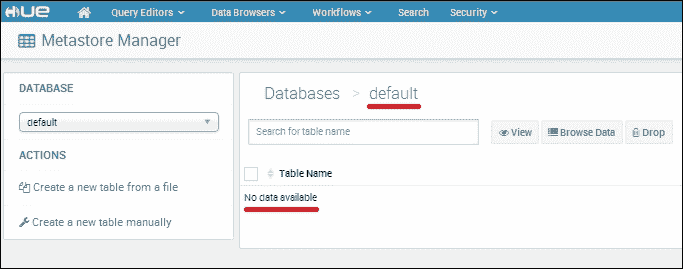
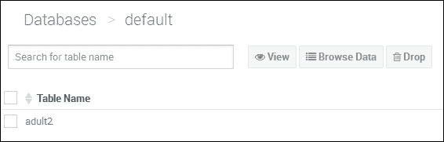
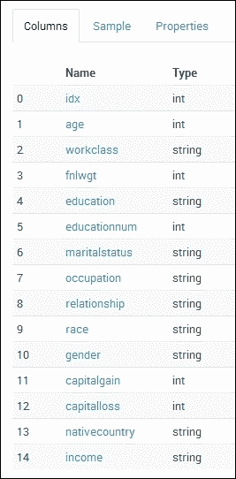
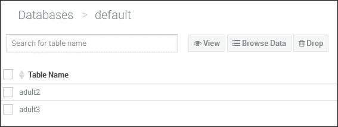
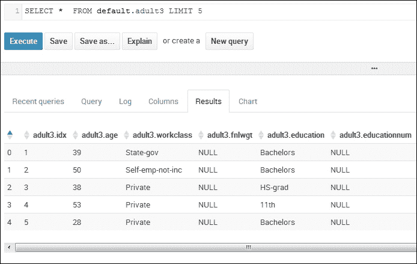

# 第四章：Apache Spark SQL

在本章中，我想检查 Apache Spark SQL，使用 Apache Hive 与 Spark 以及数据框。数据框在 Spark 1.3 中引入，是列式数据存储结构，大致相当于关系数据库表。本书的章节并非按顺序开发，因此早期章节可能使用比后期章节更旧的 Spark 版本。我还想检查 Spark SQL 的用户定义函数。关于 Spark 类 API 的信息，可以在以下位置找到：`spark.apache.org/docs/<version>/api/scala/index.html`。

我更喜欢使用 Scala，但 API 信息也可用于 Java 和 Python 格式。`<version>`值是指您将使用的 Spark 版本的发布版本-1.3.1。本章将涵盖以下主题：

+   SQL 上下文

+   导入和保存数据

+   数据框

+   使用 SQL

+   用户定义的函数

+   使用 Hive

在直接进入 SQL 和数据框之前，我将概述 SQL 上下文。

# SQL 上下文

SQL 上下文是在 Apache Spark 中处理列数据的起点。它是从 Spark 上下文创建的，并提供了加载和保存不同类型数据文件的方法，使用数据框，以及使用 SQL 操作列数据等功能。它可用于以下操作：

+   通过 SQL 方法执行 SQL

+   通过 UDF 方法注册用户定义的函数

+   缓存

+   配置

+   数据框

+   数据源访问

+   DDL 操作

我相信还有其他领域，但你明白我的意思。本章的示例是用 Scala 编写的，只是因为我更喜欢这种语言，但你也可以用 Python 和 Java 进行开发。如前所示，SQL 上下文是从 Spark 上下文创建的。隐式导入 SQL 上下文允许您将 RDD 隐式转换为数据框：

```scala
val sqlContext = new org.apache.spark.sql.SQLContext(sc)
import sqlContext.implicits._

```

例如，使用之前的`implicits`调用，允许您导入 CSV 文件并按分隔符字符拆分它。然后可以使用`toDF`方法将包含数据的 RDD 转换为数据框。

还可以为访问和操作 Apache Hive 数据库表数据定义 Hive 上下文（Hive 是 Hadoop 生态系统的一部分的 Apache 数据仓库，它使用 HDFS 进行存储）。与 Spark 上下文相比，Hive 上下文允许使用 SQL 功能的超集。在本章的后面部分将介绍如何在 Spark 中使用 Hive。

接下来，我将检查一些支持的文件格式，用于导入和保存数据。

# 导入和保存数据

我想在这里添加有关导入和保存数据的部分，即使它并不纯粹关于 Spark SQL，这样我就可以介绍诸如**Parquet**和**JSON**文件格式等概念。这一部分还让我能够涵盖如何在一个地方方便地访问和保存松散文本数据，以及 CSV、Parquet 和 JSON 格式。

## 处理文本文件

使用 Spark 上下文，可以使用`textFile`方法将文本文件加载到 RDD 中。此外，`wholeTextFile`方法可以将目录的内容读取到 RDD 中。以下示例显示了如何将基于本地文件系统（`file://`）或 HDFS（`hdfs://`）的文件读取到 Spark RDD 中。这些示例显示数据将被分成六个部分以提高性能。前两个示例相同，因为它们都操作 Linux 文件系统上的文件：

```scala
sc.textFile("/data/spark/tweets.txt",6)
sc.textFile("file:///data/spark/tweets.txt",6)
sc.textFile("hdfs://server1:4014/data/spark/tweets.txt",6)

```

## 处理 JSON 文件

JSON 是一种数据交换格式，由 Javascript 开发。**JSON**实际上代表**JavaScript** **Object** **Notation**。它是一种基于文本的格式，可以表示为 XML。以下示例使用名为`jsonFile`的 SQL 上下文方法加载基于 HDFS 的 JSON 数据文件，名称为`device.json`。生成的数据被创建为数据框：

```scala
val dframe = sqlContext.jsonFile("hdfs:///data/spark/device.json")

```

数据可以使用数据框`toJSON`方法以 JSON 格式保存，如下例所示。首先导入 Apache Spark 和 Spark SQL 类：

```scala
import org.apache.spark._
import org.apache.spark.SparkContext._
import org.apache.spark.sql.Row;
import org.apache.spark.sql.types.{StructType,StructField,StringType};

```

接下来，定义了一个名为`sql1`的对象类，以及一个带参数的主方法。定义了一个配置对象，用于创建一个 Spark 上下文。主 Spark URL 保留为默认值，因此 Spark 期望本地模式，本地主机和`7077`端口：

```scala
object sql1 {

 def main(args: Array[String]) {

 val appName = "sql example 1"
 val conf    = new SparkConf()

 conf.setAppName(appName)

 val sc = new SparkContext(conf)

```

从 Spark 上下文创建一个 SQL 上下文，并使用`textFile`方法加载 CSV 格式的原始文本文件`adult.test.data_1x`。然后创建一个包含数据列名称的模式字符串，并通过将字符串按其间距拆分，并使用`StructType`和`StructField`方法将每个模式列定义为字符串值：

```scala
 val sqlContext = new org.apache.spark.sql.SQLContext(sc)

 val rawRdd = sc.textFile("hdfs:///data/spark/sql/adult.test.data_1x")

 val schemaString = "age workclass fnlwgt education " +   "educational-num  marital-status occupation relationship " +
"race gender capital-gain capital-loss hours-per-week " +
"native-country income"

 val schema =
 StructType(
 schemaString.split(" ").map(fieldName => StructField(fieldName, StringType, true)))

```

然后，通过使用逗号作为行分隔符从原始 CSV 数据中创建每个数据行，然后将元素添加到`Row()`结构中。从模式创建数据框，然后将行数据转换为 JSON 格式，使用`toJSON`方法。最后，使用`saveAsTextFile`方法将数据保存到 HDFS：

```scala
 val rowRDD = rawRdd.map(_.split(","))
 .map(p => Row( p(0),p(1),p(2),p(3),p(4),p(5),p(6),p(7),p(8),
 p(9),p(10),p(11),p(12),p(13),p(14) ))

 val adultDataFrame = sqlContext.createDataFrame(rowRDD, schema)

 val jsonData = adultDataFrame.toJSON

 jsonData.saveAsTextFile("hdfs:///data/spark/sql/adult.json")

 } // end main

} // end sql1

```

因此，可以在 HDFS 上看到生成的数据，Hadoop 文件系统`ls`命令如下所示，数据驻留在`target`目录中作为成功文件和两个部分文件。

```scala
[hadoop@hc2nn sql]$ hdfs dfs -ls /data/spark/sql/adult.json

Found 3 items
-rw-r--r--   3 hadoop supergroup          0 2015-06-20 17:17 /data/spark/sql/adult.json/_SUCCESS
-rw-r--r--   3 hadoop supergroup       1731 2015-06-20 17:17 /data/spark/sql/adult.json/part-00000
-rw-r--r--   3 hadoop supergroup       1724 2015-06-20 17:17 /data/spark/sql/adult.json/part-00001

```

使用 Hadoop 文件系统的`cat`命令，可以显示 JSON 数据的内容。我将展示一个示例以节省空间：

```scala
[hadoop@hc2nn sql]$ hdfs dfs -cat /data/spark/sql/adult.json/part-00000 | more

{"age":"25","workclass":" Private","fnlwgt":" 226802","education":" 11th","educational-num":"
 7","marital-status":" Never-married","occupation":" Machine-op-inspct","relationship":" Own-
child","race":" Black","gender":" Male","capital-gain":" 0","capital-loss":" 0","hours-per-we
ek":" 40","native-country":" United-States","income":" <=50K"}

```

处理 Parquet 数据非常类似，接下来我将展示。

## 处理 Parquet 文件

Apache Parquet 是 Hadoop 工具集中许多工具使用的另一种基于列的数据格式，例如 Hive、Pig 和 Impala。它通过使用高效的压缩和编码例程来提高性能。

Parquet 处理示例与 JSON Scala 代码非常相似。创建数据框，然后使用 Parquet 类型的 save 方法以 Parquet 格式保存：

```scala
 val adultDataFrame = sqlContext.createDataFrame(rowRDD, schema)
 adultDataFrame.save("hdfs:///data/spark/sql/adult.parquet","parquet")

 } // end main

} // end sql2

```

这会生成一个基于 HDFS 的目录，其中包含三个基于 Parquet 的文件：一个常见的元数据文件，一个元数据文件和一个临时文件：

```scala
[hadoop@hc2nn sql]$ hdfs dfs -ls /data/spark/sql/adult.parquet
Found 3 items
-rw-r--r--   3 hadoop supergroup       1412 2015-06-21 13:17 /data/spark/sql/adult.parquet/_common_metadata
-rw-r--r--   3 hadoop supergroup       1412 2015-06-21 13:17 /data/spark/sql/adult.parquet/_metadata
drwxr-xr-x   - hadoop supergroup          0 2015-06-21 13:17 /data/spark/sql/adult.parquet/_temporary

```

使用 Hadoop 文件系统的`cat`命令列出元数据文件的内容，可以了解数据格式。但是 Parquet 头是二进制的，因此不能使用`more`和`cat`显示：

```scala
[hadoop@hc2nn sql]$ hdfs dfs -cat /data/spark/sql/adult.parquet/_metadata | more
s%
ct","fields":[{"name":"age","type":"string","nullable":true,"metadata":{}},{"name":"workclass
","type":"string","nullable":true,"metadata":{}},{"name":"fnlwgt","type":"string","nullable":
true,"metadata":{}},

```

有关可能的 Spark 和 SQL 上下文方法的更多信息，请检查名为`org.apache.spark.SparkContext`和`org.apache.spark.sql.SQLContext`的类的内容，使用 Apache Spark API 路径，以获取您感兴趣的 Spark 的特定`<version>`：

```scala
spark.apache.org/docs/<version>/api/scala/index.html

```

在下一节中，我将研究在 Spark 1.3 中引入的 Apache Spark DataFrames。

# 数据框

我已经提到 DataFrame 是基于列的格式。可以从中创建临时表，但我将在下一节中展开。数据框可用许多方法允许数据操作和处理。我基于上一节中使用的 Scala 代码，所以我只会展示工作行和输出。可以像这样显示数据框模式：

```scala
adultDataFrame.printSchema()

root
 |-- age: string (nullable = true)
 |-- workclass: string (nullable = true)
 |-- fnlwgt: string (nullable = true)
 |-- education: string (nullable = true)
 |-- educational-num: string (nullable = true)
 |-- marital-status: string (nullable = true)
 |-- occupation: string (nullable = true)
 |-- relationship: string (nullable = true)
 |-- race: string (nullable = true)
 |-- gender: string (nullable = true)
 |-- capital-gain: string (nullable = true)
 |-- capital-loss: string (nullable = true)
 |-- hours-per-week: string (nullable = true)
 |-- native-country: string (nullable = true)
 |-- income: string (nullable = true)

```

可以使用`select`方法从数据中过滤列。在这里，我在行数方面进行了限制，但你可以理解：

```scala
adultDataFrame.select("workclass","age","education","income").show()

workclass         age education     income
 Private          25   11th          <=50K
 Private          38   HS-grad       <=50K
 Local-gov        28   Assoc-acdm    >50K
 Private          44   Some-college  >50K
 none             18   Some-college  <=50K
 Private          34   10th          <=50K
 none             29   HS-grad       <=50K
 Self-emp-not-inc 63   Prof-school   >50K
 Private          24   Some-college  <=50K
 Private          55   7th-8th       <=50K

```

可以使用`filter`方法过滤从 DataFrame 返回的数据。在这里，我已经将职业列添加到输出中，并根据工人年龄进行了过滤：

```scala
 adultDataFrame
 .select("workclass","age","education","occupation","income")
 .filter( adultDataFrame("age") > 30 )
 .show()

workclass         age education     occupation         income
 Private          38   HS-grad       Farming-fishing    <=50K
 Private          44   Some-college  Machine-op-inspct  >50K
 Private          34   10th          Other-service      <=50K
 Self-emp-not-inc 63   Prof-school   Prof-specialty     >50K
 Private          55   7th-8th       Craft-repair       <=50K

```

还有一个`group by`方法用于确定数据集中的数量。由于这是一个基于收入的数据集，我认为工资范围内的数量会很有趣。我还使用了一个更大的数据集以获得更有意义的结果：

```scala
 adultDataFrame
 .groupBy("income")
 .count()
 .show()

income count
 <=50K 24720
 >50K  7841

```

这很有趣，但如果我想比较`income`档次和`occupation`，并对结果进行排序以更好地理解呢？以下示例显示了如何做到这一点，并给出了示例数据量。它显示与其他职业相比，管理角色的数量很大。此示例还通过职业列对输出进行了排序：

```scala
 adultDataFrame
 .groupBy("income","occupation")
 .count()
 .sort("occupation")
 .show()

income occupation         count
 >50K   Adm-clerical      507
 <=50K  Adm-clerical      3263
 <=50K  Armed-Forces      8
 >50K   Armed-Forces      1
 <=50K  Craft-repair      3170
 >50K   Craft-repair      929
 <=50K  Exec-managerial   2098
 >50K   Exec-managerial   1968
 <=50K  Farming-fishing   879
 >50K   Farming-fishing   115
 <=50K  Handlers-cleaners 1284
 >50K   Handlers-cleaners 86
 >50K   Machine-op-inspct 250
 <=50K  Machine-op-inspct 1752
 >50K   Other-service     137
 <=50K  Other-service     3158
 >50K   Priv-house-serv   1
 <=50K  Priv-house-serv   148
 >50K   Prof-specialty    1859
 <=50K  Prof-specialty    2281

```

因此，可以对数据框执行类似 SQL 的操作，包括`select`、`filter`、排序`group by`和`print`。下一节将展示如何从数据框创建表，以及如何对其执行基于 SQL 的操作。

# 使用 SQL

在使用先前的 Scala 示例从 HDFS 上的基于 CSV 的数据输入文件创建数据框后，我现在可以定义一个临时表，基于数据框，并对其运行 SQL。以下示例显示了临时表`adult`的定义，并使用`COUNT(*)`创建了行数：

```scala
 adultDataFrame.registerTempTable("adult")

 val resRDD = sqlContext.sql("SELECT COUNT(*) FROM adult")

 resRDD.map(t => "Count - " + t(0)).collect().foreach(println)

```

这给出了超过 32,000 行的行数：

```scala
Count – 32561

```

还可以使用`LIMIT` SQL 选项限制从表中选择的数据量，如下例所示。已从数据中选择了前 10 行，如果我只想检查数据类型和质量，这是有用的：

```scala
 val resRDD = sqlContext.sql("SELECT * FROM adult LIMIT 10")

 resRDD.map(t => t(0)  + " " + t(1)  + " " + t(2)  + " " + t(3)  + " " +
 t(4)  + " " + t(5)  + " " + t(6)  + " " + t(7)  + " " +
 t(8)  + " " + t(9)  + " " + t(10) + " " + t(11) + " " +
 t(12) + " " + t(13) + " " + t(14)
 )
 .collect().foreach(println)

```

数据的一个样本如下：

```scala
50  Private  283676  Some-college  10  Married-civ-spouse  Craft-repair  Husband  White  Male  0  0  40  United-States  >50K

```

当在上一节的基于 Scala 的数据框示例中创建此数据的模式时，所有列都被创建为字符串。但是，如果我想在 SQL 中使用`WHERE`子句过滤数据，那么拥有正确的数据类型将是有用的。例如，如果年龄列存储整数值，那么它应该存储为整数，以便我可以对其执行数值比较。我已经更改了我的 Scala 代码，以包括所有可能的类型：

```scala
import org.apache.spark.sql.types._

```

我现在也已经使用不同的类型定义了我的模式，以更好地匹配数据，并且已经根据实际数据类型定义了行数据，将原始数据字符串值转换为整数值：

```scala
 val schema =
 StructType(
 StructField("age",                IntegerType, false) ::
 StructField("workclass",          StringType,  false) ::
 StructField("fnlwgt",             IntegerType, false) ::
 StructField("education",          StringType,  false) ::
 StructField("educational-num",    IntegerType, false) ::
 StructField("marital-status",     StringType,  false) ::
 StructField("occupation",         StringType,  false) ::
 StructField("relationship",       StringType,  false) ::
 StructField("race",               StringType,  false) ::
 StructField("gender",             StringType,  false) ::
 StructField("capital-gain",       IntegerType, false) ::
 StructField("capital-loss",       IntegerType, false) ::
 StructField("hours-per-week",     IntegerType, false) ::
 StructField("native-country",     StringType,  false) ::
 StructField("income",             StringType,  false) ::
 Nil)

 val rowRDD = rawRdd.map(_.split(","))
 .map(p => Row( p(0).trim.toInt,p(1),p(2).trim.toInt,p(3),
 p(4).trim.toInt,p(5),p(6),p(7),p(8),
 p(9),p(10).trim.toInt,p(11).trim.toInt,
 p(12).trim.toInt,p(13),p(14) ))

```

SQL 现在可以正确地在`WHERE`子句中使用数值过滤器。如果`age`列是字符串，这将无法工作。现在您可以看到数据已被过滤以给出 60 岁以下的年龄值：

```scala
 val resRDD = sqlContext.sql("SELECT COUNT(*) FROM adult WHERE age < 60")
 resRDD.map(t => "Count - " + t(0)).collect().foreach(println)

```

这给出了大约 30,000 行的行数：

```scala
Count – 29917

```

可以在基于`WHERE`的过滤子句中使用布尔逻辑。以下示例指定了数据的年龄范围。请注意，我已经使用变量来描述 SQL 语句的`select`和`filter`组件。这使我能够将语句分解为不同的部分，因为它们变得更大：

```scala
 val selectClause = "SELECT COUNT(*) FROM adult "
 val filterClause = "WHERE age > 25 AND age < 60"
 val resRDD = sqlContext.sql( selectClause + filterClause )
 resRDD.map(t => "Count - " + t(0)).collect().foreach(println)

```

给出了约 23,000 行的数据计数：

```scala
Count – 23506

```

我可以使用布尔术语（如`AND`、`OR`）以及括号创建复合过滤子句：

```scala
 val selectClause = "SELECT COUNT(*) FROM adult "
 val filterClause =
 "WHERE ( age > 15 AND age < 25 ) OR ( age > 30 AND age < 45 ) "

 val resRDD = sqlContext.sql( selectClause + filterClause )
 resRDD.map(t => "Count - " + t(0)).collect().foreach(println)

```

这给我一个约 17,000 行的行数，并表示数据中两个年龄范围的计数：

```scala
Count – 17198

```

在 Apache Spark SQL 中也可以使用子查询。您可以在以下示例中看到，我通过从表`adult`中选择三列`age`、`education`和`occupation`来创建了一个名为`t1`的子查询。然后我使用名为`t1`的表创建了一个行数。我还在表`t1`的年龄列上添加了一个过滤子句。还要注意，我已经添加了`group by`和`order by`子句，尽管它们目前是空的，到我的 SQL 中：

```scala
 val selectClause = "SELECT COUNT(*) FROM "
 val tableClause = " ( SELECT age,education,occupation from adult) t1 "
 val filterClause = "WHERE ( t1.age > 25 ) "
 val groupClause = ""
 val orderClause = ""

 val resRDD = sqlContext.sql( selectClause + tableClause +
 filterClause +
 groupClause + orderClause
 )

 resRDD.map(t => "Count - " + t(0)).collect().foreach(println)

```

为了检查表连接，我创建了一个名为`adult.train.data2`的成人 CSV 数据文件的版本，它与原始文件的唯一区别是添加了一个名为`idx`的第一列，这是一个唯一索引。Hadoop 文件系统的`cat`命令在这里显示了数据的一个样本。使用 Linux 的`head`命令限制了文件的输出：

```scala
[hadoop@hc2nn sql]$ hdfs dfs -cat /data/spark/sql/adult.train.data2 | head -2

1,39, State-gov, 77516, Bachelors, 13, Never-married, Adm-clerical, Not-in-family, White, Male, 2174, 0, 40, United-States, <=50K
2,50, Self-emp-not-inc, 83311, Bachelors, 13, Married-civ-spouse, Exec-managerial, Husband, White, Male, 0, 0, 13, United-States, <=50K

```

模式现在已重新定义，具有整数类型的第一列`idx`作为索引，如下所示：

```scala
 val schema =
 StructType(
 StructField("idx",                IntegerType, false) ::
 StructField("age",                IntegerType, false) ::
 StructField("workclass",          StringType,  false) ::
 StructField("fnlwgt",             IntegerType, false) ::
 StructField("education",          StringType,  false) ::
 StructField("educational-num",    IntegerType, false) ::
 StructField("marital-status",     StringType,  false) ::
 StructField("occupation",         StringType,  false) ::
 StructField("relationship",       StringType,  false) ::
 StructField("race",               StringType,  false) ::
 StructField("gender",             StringType,  false) ::
 StructField("capital-gain",       IntegerType, false) ::
 StructField("capital-loss",       IntegerType, false) ::
 StructField("hours-per-week",     IntegerType, false) ::
 StructField("native-country",     StringType,  false) ::
 StructField("income",             StringType,  false) ::
 Nil)

```

在 Scala 示例中的原始行 RDD 现在处理了新的初始列，并将字符串值转换为整数：

```scala
 val rowRDD = rawRdd.map(_.split(","))
 .map(p => Row( p(0).trim.toInt,
 p(1).trim.toInt,
 p(2),
 p(3).trim.toInt,
 p(4),
 p(5).trim.toInt,
 p(6),
 p(7),
 p(8),
 p(9),
 p(10),
 p(11).trim.toInt,
 p(12).trim.toInt,
 p(13).trim.toInt,
 p(14),
 p(15)
 ))

 val adultDataFrame = sqlContext.createDataFrame(rowRDD, schema)

```

我们已经看过子查询。现在，我想考虑表连接。下一个示例将使用刚刚创建的索引。它使用它来连接两个派生表。这个示例有点牵强，因为它连接了来自相同基础表的两个数据集，但你明白我的意思。两个派生表被创建为子查询，并在一个公共索引列上连接。

现在，表连接的 SQL 如下。从临时表`adult`创建了两个派生表，分别称为`t1`和`t2`作为子查询。新的行索引列称为`idx`已被用来连接表`t1`和`t2`中的数据。主要的`SELECT`语句从复合数据集中输出所有七列。我添加了一个`LIMIT`子句来最小化数据输出：

```scala
 val selectClause = "SELECT t1.idx,age,education,occupation,workclass,race,gender FROM "
 val tableClause1 = " ( SELECT idx,age,education,occupation FROM adult) t1 JOIN "
 val tableClause2 = " ( SELECT idx,workclass,race,gender FROM adult) t2 "
 val joinClause = " ON (t1.idx=t2.idx) "
 val limitClause = " LIMIT 10"

 val resRDD = sqlContext.sql( selectClause +
 tableClause1 + tableClause2 +
 joinClause   + limitClause
 )

 resRDD.map(t => t(0) + " " + t(1) + " " + t(2) + " " +
 t(3) + " " + t(4) + " " + t(5) + " " + t(6)
 )
 .collect().foreach(println)

```

请注意，在主要的`SELECT`语句中，我必须定义索引列来自哪里，所以我使用了`t1.idx`。所有其他列都是唯一的`t1`和`t2`数据集，所以我不需要使用别名来引用它们（即`t1.age`）。因此，现在输出的数据如下：

```scala
33 45  Bachelors  Exec-managerial  Private  White  Male
233 25  Some-college  Adm-clerical  Private  White  Male
433 40  Bachelors  Prof-specialty  Self-emp-not-inc  White  Female
633 43  Some-college  Craft-repair  Private  White  Male
833 26  Some-college  Handlers-cleaners  Private  White  Male
1033 27  Some-college  Sales  Private  White  Male
1233 27  Bachelors  Adm-clerical  Private  White  Female
1433 32  Assoc-voc  Sales  Private  White  Male
1633 40  Assoc-acdm  Adm-clerical  State-gov  White  Male
1833 46  Some-college  Prof-specialty  Local-gov  White  Male

```

这给出了 Apache Spark 中基于 SQL 的功能的一些想法，但如果我发现需要的方法不可用怎么办？也许我需要一个新函数。这就是**用户定义的函数**（**UDFs**）有用的地方。我将在下一节中介绍它们。

# 用户定义的函数

为了在 Scala 中创建一些用户定义的函数，我需要检查之前的成年人数据集中的数据。我计划创建一个 UDF，用于枚举教育列，以便我可以将列转换为整数值。如果我需要将数据用于机器学习，并创建一个 LabelPoint 结构，这将非常有用。所使用的向量，代表每条记录，需要是数值型的。我将首先确定存在哪种唯一的教育值，然后创建一个函数来枚举它们，最后在 SQL 中使用它。

我已经创建了一些 Scala 代码来显示教育值的排序列表。`DISTINCT`关键字确保每个值只有一个实例。我已经选择数据作为子表，使用一个名为`edu_dist`的别名来确保`ORDER BY`子句起作用：

```scala
 val selectClause = "SELECT t1.edu_dist FROM "
 val tableClause  = " ( SELECT DISTINCT education AS edu_dist FROM adult ) t1 "
 val orderClause  = " ORDER BY t1.edu_dist "

 val resRDD = sqlContext.sql( selectClause + tableClause  + orderClause )

 resRDD.map(t => t(0)).collect().foreach(println)

```

数据如下。我已经删除了一些值以节省空间，但你明白我的意思：

```scala
 10th
 11th
 12th
 1st-4th
 ………..
 Preschool
 Prof-school
 Some-college

```

我在 Scala 中定义了一个方法，接受基于字符串的教育值，并返回代表它的枚举整数值。如果没有识别到值，则返回一个名为`9999`的特殊值：

```scala
 def enumEdu( education:String ) : Int =
 {
 var enumval = 9999

 if ( education == "10th" )         { enumval = 0 }
 else if ( education == "11th" )         { enumval = 1 }
 else if ( education == "12th" )         { enumval = 2 }
 else if ( education == "1st-4th" )      { enumval = 3 }
 else if ( education == "5th-6th" )      { enumval = 4 }
 else if ( education == "7th-8th" )      { enumval = 5 }
 else if ( education == "9th" )          { enumval = 6 }
 else if ( education == "Assoc-acdm" )   { enumval = 7 }
 else if ( education == "Assoc-voc" )    { enumval = 8 }
 else if ( education == "Bachelors" )    { enumval = 9 }
 else if ( education == "Doctorate" )    { enumval = 10 }
 else if ( education == "HS-grad" )      { enumval = 11 }
 else if ( education == "Masters" )      { enumval = 12 }
 else if ( education == "Preschool" )    { enumval = 13 }
 else if ( education == "Prof-school" )  { enumval = 14 }
 else if ( education == "Some-college" ) { enumval = 15 }

 return enumval
 }

```

现在，我可以使用 Scala 中的 SQL 上下文注册此函数，以便在 SQL 语句中使用：

```scala
 sqlContext.udf.register( "enumEdu", enumEdu _ )

```

然后，SQL 和 Scala 代码用于枚举数据如下。新注册的名为`enumEdu`的函数在`SELECT`语句中使用。它以教育类型作为参数，并返回整数枚举。此值形成的列被别名为`idx`：

```scala
 val selectClause = "SELECT enumEdu(t1.edu_dist) as idx,t1.edu_dist FROM "
 val tableClause  = " ( SELECT DISTINCT education AS edu_dist FROM adult ) t1 "
 val orderClause  = " ORDER BY t1.edu_dist "

 val resRDD = sqlContext.sql( selectClause + tableClause  + orderClause )

 resRDD.map(t => t(0) + " " + t(1) ).collect().foreach(println)

```

结果数据输出，作为教育值及其枚举的列表，如下所示：

```scala
0  10th
1  11th
2  12th
3  1st-4th
4  5th-6th
5  7th-8th
6  9th
7  Assoc-acdm
8  Assoc-voc
9  Bachelors
10  Doctorate
11  HS-grad
12  Masters
13  Preschool
14  Prof-school
15  Some-college

```

另一个示例函数名为`ageBracket`，它接受成年人的整数年龄值，并返回一个枚举的年龄段：

```scala
 def ageBracket( age:Int ) : Int =
 {
 var bracket = 9999

 if ( age >= 0  && age < 20  ) { bracket = 0 }
 else if ( age >= 20 && age < 40  ) { bracket = 1 }
 else if ( age >= 40 && age < 60  ) { bracket = 2 }
 else if ( age >= 60 && age < 80  ) { bracket = 3 }
 else if ( age >= 80 && age < 100 ) { bracket = 4 }
 else if ( age > 100 )              { bracket = 5 }

 return bracket
 }

```

再次，使用 SQL 上下文注册函数，以便在 SQL 语句中使用：

```scala
 sqlContext.udf.register( "ageBracket", ageBracket _ )

```

然后，基于 Scala 的 SQL 使用它从成年人数据集中选择年龄、年龄段和教育值：

```scala
 val selectClause = "SELECT age, ageBracket(age) as bracket,education FROM "
 val tableClause  = " adult "
 val limitClause  = " LIMIT 10 "

 val resRDD = sqlContext.sql( selectClause + tableClause  +
 limitClause )

 resRDD.map(t => t(0) + " " + t(1) + " " + t(2) ).collect().foreach(println)

```

然后，由于我使用了`LIMIT`子句将输出限制为 10 行，因此生成的数据如下：

```scala
39 1  Bachelors
50 2  Bachelors
38 1  HS-grad
53 2  11th
28 1  Bachelors
37 1  Masters
49 2  9th
52 2  HS-grad
31 1  Masters
42 2  Bachelors

```

还可以在 SQL 中定义函数，通过 SQL 上下文在 UDF 注册期间内联使用。以下示例定义了一个名为`dblAge`的函数，它只是将成年人的年龄乘以二。注册如下。它接受整数参数（`age`），并返回两倍的值：

```scala
 sqlContext.udf.register( "dblAge", (a:Int) => 2*a )

```

并且使用它的 SQL 现在选择`age`和`age`值的两倍，称为`dblAge(age)`：

```scala
 val selectClause = "SELECT age,dblAge(age) FROM "
 val tableClause  = " adult "
 val limitClause  = " LIMIT 10 "

 val resRDD = sqlContext.sql( selectClause + tableClause  + limitClause )

 resRDD.map(t => t(0) + " " + t(1) ).collect().foreach(println)

```

现在，输出数据的两列包含年龄及其加倍值，看起来是这样的：

```scala
39 78
50 100
38 76
53 106
28 56
37 74
49 98
52 104
31 62
42 84

```

到目前为止，已经检查了 DataFrame、SQL 和用户定义函数，但是如果像我一样使用 Hadoop 堆栈集群，并且有 Apache Hive 可用，会怎么样呢？到目前为止我定义的`adult`表是一个临时表，但是如果我使用 Apache Spark SQL 访问 Hive，我可以访问静态数据库表。下一节将检查执行此操作所需的步骤。

# 使用 Hive

如果您有低延迟要求和多用户的商业智能类型工作负载，那么您可能考虑使用 Impala 来访问数据库。Apache Spark 在 Hive 上用于批处理和 ETL 链。本节将用于展示如何连接 Spark 到 Hive，以及如何使用此配置。首先，我将开发一个使用本地 Hive 元数据存储的应用程序，并展示它不会在 Hive 本身存储和持久化表数据。然后，我将设置 Apache Spark 连接到 Hive 元数据服务器，并在 Hive 中存储表和数据。我将从本地元数据服务器开始。

## 本地 Hive 元数据服务器

以下示例 Scala 代码显示了如何使用 Apache Spark 创建 Hive 上下文，并创建基于 Hive 的表。首先导入了 Spark 配置、上下文、SQL 和 Hive 类。然后，定义了一个名为`hive_ex1`的对象类和主方法。定义了应用程序名称，并创建了一个 Spark 配置对象。然后从配置对象创建了 Spark 上下文：

```scala
import org.apache.spark.{SparkConf, SparkContext}
import org.apache.spark.sql._
import org.apache.spark.sql.hive.HiveContext

object hive_ex1 {

 def main(args: Array[String]) {

 val appName = "Hive Spark Ex 1"
 val conf    = new SparkConf()

 conf.setAppName(appName)

 val sc = new SparkContext(conf)

```

接下来，我从 Spark 上下文中创建一个新的 Hive 上下文，并导入 Hive implicits 和 Hive 上下文 SQL。`implicits`允许进行隐式转换，而 SQL 包含允许我运行基于 Hive 上下文的 SQL：

```scala
 val hiveContext = new HiveContext(sc)

 import hiveContext.implicits._
 import hiveContext.sql

```

下一个语句在 Hive 中创建了一个名为`adult2`的空表。您将会在本章中已经使用过的 adult 数据中识别出模式：

```scala
 hiveContext.sql( " 
 CREATE TABLE IF NOT EXISTS adult2
 (
 idx             INT,
 age             INT,
 workclass       STRING,
 fnlwgt          INT,
 education       STRING,
 educationnum    INT,
 maritalstatus   STRING,
 occupation      STRING,
 relationship    STRING,
 race            STRING,
 gender          STRING,
 capitalgain     INT,
 capitalloss     INT,
 nativecountry   STRING,
 income          STRING
 )

 ")

```

接下来，通过`COUNT(*)`从名为`adult2`的表中获取行计数，并打印输出值：

```scala
 val resRDD = hiveContext.sql("SELECT COUNT(*) FROM adult2")

 resRDD.map(t => "Count : " + t(0) ).collect().foreach(println)

```

如预期的那样，表中没有行。

```scala
Count : 0

```

在 Apache Spark Hive 中也可以创建基于 Hive 的外部表。以下的 HDFS 文件列表显示了名为`adult.train.data2`的 CSV 文件存在于名为`/data/spark/hive`的 HDFS 目录中，并且包含数据：

```scala
[hadoop@hc2nn hive]$ hdfs dfs -ls /data/spark/hive
Found 1 items
-rw-r--r--   3 hadoop supergroup    4171350 2015-06-24 15:18 /data/spark/hive/adult.train.data2

```

现在，我调整我的基于 Scala 的 Hive SQL 以创建一个名为`adult3`的外部表（如果不存在），该表与先前表具有相同的结构。在此表创建语句中的行格式指定逗号作为行列分隔符，这是 CSV 数据所期望的。此语句中的位置选项指定了 HDFS 上的`/data/spark/hive`目录作为数据的位置。因此，在此位置上可以有多个文件在 HDFS 上，用于填充此表。每个文件都需要具有与此表结构匹配的相同数据结构：

```scala
 hiveContext.sql("

 CREATE EXTERNAL TABLE IF NOT EXISTS adult3
 (
 idx             INT,
 age             INT,
 workclass       STRING,
 fnlwgt          INT,
 education       STRING,
 educationnum    INT,
 maritalstatus   STRING,
 occupation      STRING,
 relationship    STRING,
 race            STRING,
 gender          STRING,
 capitalgain     INT,
 capitalloss     INT,
 nativecountry   STRING,
 income          STRING
 )
 ROW FORMAT DELIMITED FIELDS TERMINATED BY ','
 LOCATION '/data/spark/hive'

 ")

```

然后对`adult3`表进行行计数，并打印计数结果：

```scala
 val resRDD = hiveContext.sql("SELECT COUNT(*) FROM adult3")

 resRDD.map(t => "Count : " + t(0) ).collect().foreach(println)

```

如您所见，表现在包含大约 32,000 行。由于这是一个外部表，基于 HDFS 的数据并没有被移动，行计算是从底层基于 CSV 的数据中推导出来的。

```scala
Count : 32561

```

我意识到我想要从外部的`adult3`表中剥离维度数据。毕竟，Hive 是一个数据仓库，因此在使用基于原始 CSV 数据的一般 ETL 链的一部分时，会从数据中剥离维度和对象，并创建新的表。如果考虑教育维度，并尝试确定存在哪些唯一值，那么例如，SQL 将如下所示：

```scala
 val resRDD = hiveContext.sql("

 SELECT DISTINCT education AS edu FROM adult3
 ORDER BY edu

 ")

 resRDD.map(t => t(0) ).collect().foreach(println)

```

有序数据与本章早期使用 Spark SQL 推导出的值匹配：

```scala
 10th
 11th
 12th
 1st-4th
 5th-6th
 7th-8th
 9th
 Assoc-acdm
 Assoc-voc
 Bachelors
 Doctorate
 HS-grad
 Masters
 Preschool
 Prof-school
 Some-college

```

这很有用，但如果我想创建维度值，然后为以前的教育维度值分配整数索引值怎么办。例如，`10th`将是`0`，`11th`将是`1`。我已经在 HDFS 上为教育维度设置了一个维度 CSV 文件，如下所示。内容只包含唯一值的列表和一个索引：

```scala
[hadoop@hc2nn hive]$ hdfs dfs -ls /data/spark/dim1/
Found 1 items
-rw-r--r--   3 hadoop supergroup        174 2015-06-25 14:08 /data/spark/dim1/education.csv
[hadoop@hc2nn hive]$ hdfs dfs -cat /data/spark/dim1/education.csv
1,10th
2,11th
3,12th

```

现在，我可以在我的 Apache 应用程序中运行一些 Hive QL 来创建一个教育维度表。首先，如果教育表已经存在，我会删除它，然后通过解析 HDFS CSV 文件来创建表：

```scala
 hiveContext.sql("  DROP TABLE IF EXISTS education ")
 hiveContext.sql("

 CREATE TABLE IF NOT EXISTS  education
 (
 idx        INT,
 name       STRING
 )
 ROW FORMAT DELIMITED FIELDS TERMINATED BY ','
 LOCATION '/data/spark/dim1/'
 ")

```

然后我可以选择新的教育表的内容，以确保它看起来是正确的。

```scala
val resRDD = hiveContext.sql(" SELECT * FROM education ")
resRDD.map( t => t(0)+" "+t(1) ).collect().foreach(println)

```

这给出了预期的索引列表和教育维度值：

```scala
1 10th
2 11th
3 12th
………
16 Some-college

```

因此，我已经开始了 ETL 管道的开端。原始 CSV 数据被用作外部表，然后创建了维度表，然后可以用来将原始数据中的维度转换为数字索引。我现在已经成功创建了一个 Spark 应用程序，它使用 Hive 上下文连接到 Hive Metastore 服务器，这使我能够创建和填充表。

我在我的 Linux 服务器上安装了 Hadoop 堆栈 Cloudera CDH 5.3。我正在写这本书时使用它来访问 HDFS，并且我还安装并运行了 Hive 和 Hue（CDH 安装信息可以在 Cloudera 网站[`cloudera.com/content/cloudera/en/documentation.html`](http://cloudera.com/content/cloudera/en/documentation.html)找到）。当我检查 HDFS 中的`adult3`表时，它应该已经创建在`/user/hive/warehouse`下，我看到了以下内容：

```scala
[hadoop@hc2nn hive]$ hdfs dfs -ls /user/hive/warehouse/adult3
ls: `/user/hive/warehouse/adult3': No such file or directory

```

基于 Hive 的表并不存在于 Hive 的预期位置。我可以通过检查 Hue Metastore 管理器来确认这一点，以查看默认数据库中存在哪些表。以下图表显示了我的默认数据库目前是空的。我已经添加了红线，以表明我目前正在查看默认数据库，并且没有数据。显然，当我运行基于 Apache Spark 的应用程序时，使用 Hive 上下文，我是连接到 Hive Metastore 服务器的。我知道这是因为日志表明了这一点，而且以这种方式创建的表在重新启动 Apache Spark 时会持久存在。



刚刚运行的应用程序中的 Hive 上下文已经使用了本地 Hive Metastore 服务器，并将数据存储在本地位置；实际上，在这种情况下是在 HDFS 上的`/tmp`下。我现在想要使用基于 Hive 的 Metastore 服务器，这样我就可以直接在 Hive 中创建表和数据。接下来的部分将展示如何实现这一点。

## 基于 Hive 的 Metastore 服务器

我已经提到我正在使用 Cloudera 的 CDH 5.3 Hadoop 堆栈。我正在运行 Hive、HDFS、Hue 和 Zookeeper。我正在使用安装在`/usr/local/spark`下的 Apache Spark 1.3.1，以便创建和运行应用程序（我知道 CDH 5.3 发布了 Spark 1.2，但我想在这种情况下使用 Spark 1.3.x 中可用的 DataFrames）。

配置 Apache Spark 连接到 Hive 的第一件事是将名为`hive-site.xml`的 Hive 配置文件放入所有安装了 Spark 的服务器上的 Spark 配置目录中：

```scala
[hadoop@hc2nn bin]# cp /var/run/cloudera-scm-agent/process/1237-hive-HIVEMETASTORE/hive-site.xml /usr/local/spark/conf

```

然后，鉴于我已经通过 CDH Manager 安装了 Apache Hive 以便使用 PostgreSQL，我需要为 Spark 安装一个 PostgreSQL 连接器 JAR，否则它将不知道如何连接到 Hive，并且会出现类似这样的错误：

```scala
15/06/25 16:32:24 WARN DataNucleus.Connection: BoneCP specified but not present in CLASSPATH (s)
Caused by: java.lang.RuntimeException: Unable to instantiate org.apache.hadoop.hive.metastore.
Caused by: java.lang.reflect.InvocationTargetException
Caused by: javax.jdo.JDOFatalInternalException: Error creating transactional connection factor
Caused by: org.datanucleus.exceptions.NucleusException: Attempt to invoke the "dbcp-builtin" pnectionPool gave an 
error : The specified datastore driver ("org.postgresql.Driver") was not f. Please check your CLASSPATH
specification, and the name of the driver.
Caused by: org.datanucleus.store.rdbms.connectionpool.DatastoreDriverNotFoundException: The spver
("org.postgresql.Driver") was not found in the CLASSPATH. Please check your CLASSPATH specme of the driver.

```

我已经将错误消息简化为只包含相关部分，否则它将非常长。我已经确定了我安装的 PostgreSQL 的版本，如下所示。从 Cloudera 基于包的 jar 文件中确定为 9.0 版本：

```scala
[root@hc2nn jars]# pwd ; ls postgresql*
/opt/cloudera/parcels/CDH/jars
postgresql-9.0-801.jdbc4.jar

```

接下来，我使用[`jdbc.postgresql.org/`](https://jdbc.postgresql.org/)网站下载必要的 PostgreSQL 连接器库。我已确定我的 Java 版本为 1.7，如下所示，这会影响要使用的库的版本：

```scala
[hadoop@hc2nn spark]$ java -version
java version "1.7.0_75"
OpenJDK Runtime Environment (rhel-2.5.4.0.el6_6-x86_64 u75-b13)
OpenJDK 64-Bit Server VM (build 24.75-b04, mixed mode)

```

该网站表示，如果您使用的是 Java 1.7 或 1.8，则应该使用该库的 JDBC41 版本。因此，我已经获取了`postgresql-9.4-1201.jdbc41.jar`文件。下一步是将此文件复制到 Apache Spark 安装的`lib`目录中，如下所示：

```scala
[hadoop@hc2nn lib]$ pwd ; ls -l postgresql*
/usr/local/spark/lib
-rw-r--r-- 1 hadoop hadoop 648487 Jun 26 13:20 postgresql-9.4-1201.jdbc41.jar

```

现在，必须将 PostgreSQL 库添加到 Spark 的`CLASSPATH`中，方法是在 Spark 的`bin`目录中的名为`compute-classpath.sh`的文件中添加一个条目，如下所示：

```scala
[hadoop@hc2nn bin]$ pwd ; tail compute-classpath.sh
/usr/local/spark/bin

# add postgresql connector to classpath
appendToClasspath "${assembly_folder}"/postgresql-9.4-1201.jdbc41.jar

echo "$CLASSPATH"

```

在我的情况下，我遇到了有关 CDH 5.3 Hive 和 Apache Spark 之间的 Hive 版本错误，如下所示。我认为版本如此接近，以至于我应该能够忽略这个错误：

```scala
Caused by: MetaException(message:Hive Schema version 0.13.1aa does not match metastore's schema version 0.13.0

Metastore is not upgraded or corrupt)

```

在这种情况下，我决定在我的 Spark 版本的`hive-site.xml`文件中关闭模式验证。这必须在该文件的所有基于 Spark 的实例中完成，然后重新启动 Spark。更改如下所示；值设置为`false`：

```scala
 <property>
 <name>hive.metastore.schema.verification</name>
 <value>false</value>
 </property>

```

现在，当我运行与上一节相同的基于应用程序的 SQL 集时，我可以在 Apache Hive 默认数据库中创建对象。首先，我将使用基于 Spark 的 Hive 上下文创建名为`adult2`的空表：

```scala
 hiveContext.sql( "

 CREATE TABLE IF NOT EXISTS adult2
 (
 idx             INT,
 age             INT,
 workclass       STRING,
 fnlwgt          INT,
 education       STRING,
 educationnum    INT,
 maritalstatus   STRING,
 occupation      STRING,
 relationship    STRING,
 race            STRING,
 gender          STRING,
 capitalgain     INT,
 capitalloss     INT,
 nativecountry   STRING,
 income          STRING
 )

 ")

```

如您所见，当我运行应用程序并检查 Hue 元数据浏览器时，表`adult2`现在已经存在：



我之前展示了表条目，并通过选择称为`adult2`的表条目在 Hue 默认数据库浏览器中获得了其结构：



现在，可以执行基于 Spark 的 Hive QL 的外部表`adult3`，并从 Hue 确认数据访问。在最后一节中，必要的 Hive QL 如下：

```scala
 hiveContext.sql("

 CREATE EXTERNAL TABLE IF NOT EXISTS adult3
 (
 idx             INT,
 age             INT,
 workclass       STRING,
 fnlwgt          INT,
 education       STRING,
 educationnum    INT,
 maritalstatus   STRING,
 occupation      STRING,
 relationship    STRING,
 race            STRING,
 gender          STRING,
 capitalgain     INT,
 capitalloss     INT,
 nativecountry   STRING,
 income          STRING
 )
 ROW FORMAT DELIMITED FIELDS TERMINATED BY ','
 LOCATION '/data/spark/hive'

 ")

```

现在您可以看到，基于 Hive 的名为`adult3`的表已经由 Spark 创建在默认数据库中。下图再次生成自 Hue 元数据浏览器：



以下 Hive QL 已从 Hue Hive 查询编辑器执行。它显示`adult3`表可以从 Hive 访问。我限制了行数以使图像可呈现。我不担心数据，只关心我能否访问它：



我将在本节中提到的最后一件事对于在 Spark 中使用 Hive QL 对 Hive 进行操作将非常有用，那就是用户定义的函数或 UDF。例如，我将考虑`row_sequence`函数，该函数在以下基于 Scala 的代码中使用：

```scala
hiveContext.sql("

ADD JAR /opt/cloudera/parcels/CDH-5.3.3-1.cdh5.3.3.p0.5/jars/hive-contrib-0.13.1-cdh5.3.3.jar

 ")

hiveContext.sql("

CREATE TEMPORARY FUNCTION row_sequence as 'org.apache.hadoop.hive.contrib.udf.UDFRowSequence';

 ")

 val resRDD = hiveContext.sql("

 SELECT row_sequence(),t1.edu FROM
 ( SELECT DISTINCT education AS edu FROM adult3 ) t1
 ORDER BY t1.edu

 ")

```

通过`ADD JAR`命令可以将现有的或您自己的基于 JAR 的库添加到 Spark Hive 会话中。然后，可以使用基于包的类名将该库中的功能注册为临时函数，并在 Hive QL 语句中将新函数名称合并。

本章已成功将基于 Apache Spark 的应用程序连接到 Hive，并对 Hive 运行 Hive QL，以便表和数据更改在 Hive 中持久存在。但为什么这很重要呢？嗯，Spark 是一种内存并行处理系统。它的处理速度比基于 Hadoop 的 Map Reduce 快一个数量级。Apache Spark 现在可以作为处理引擎使用，而 Hive 数据仓库可以用于存储。快速的基于内存的 Spark 处理速度与 Hive 中可用的大数据规模结构化数据仓库存储相结合。

# 总结

本章开始时解释了 Spark SQL 上下文和文件 I/O 方法。然后展示了可以操作基于 Spark 和 HDFS 的数据，既可以使用类似 SQL 的方法和 DataFrames，也可以通过注册临时表和 Spark SQL。接下来，介绍了用户定义的函数，以展示 Spark SQL 的功能可以通过创建新函数来扩展以满足您的需求，将它们注册为 UDF，然后在 SQL 中调用它们来处理数据。

最后，Hive 上下文被引入用于在 Apache Spark 中使用。请记住，Spark 中的 Hive 上下文提供了 SQL 上下文功能的超集。我知道随着时间的推移，SQL 上下文将被扩展以匹配 Hive 上下文的功能。在 Spark 中使用 Hive 上下文进行 Hive QL 数据处理时，使用了本地 Hive 和基于 Hive 的 Metastore 服务器。我认为后者的配置更好，因为表被创建，数据更改会持久保存在您的 Hive 实例中。

在我的案例中，我使用的是 Cloudera CDH 5.3，其中使用了 Hive 0.13、PostgreSQL、ZooKeeper 和 Hue。我还使用了 Apache Spark 版本 1.3.1。我向您展示的配置设置纯粹是针对这个配置的。如果您想使用 MySQL，例如，您需要研究必要的更改。一个好的起点可能是`<user@spark.apache.org>`邮件列表。

最后，我想说 Apache Spark Hive 上下文配置，使用基于 Hive 的存储，非常有用。它允许您将 Hive 用作大数据规模的数据仓库，使用 Apache Spark 进行快速的内存处理。它不仅提供了使用基于 Spark 的模块（MLlib、SQL、GraphX 和 Stream）操纵数据的能力，还提供了使用其他基于 Hadoop 的工具，使得创建 ETL 链更加容易。

下一章将研究 Spark 图处理模块 GraphX，还将调查 Neo4J 图数据库和 MazeRunner 应用程序。
