# 第五章：Apache Spark GraphX

在本章中，我想要研究 Apache Spark GraphX 模块和图处理。我还想简要介绍一下图数据库 Neo4j。因此，本章将涵盖以下主题：

+   GraphX 编码

+   Neo4j 的 Mazerunner

GraphX 编码部分使用 Scala 编写，将提供一系列图编码示例。Kenny Bastani 在实验性产品 Mazerunner 上的工作，我也将进行审查，将这两个主题结合在一个实际示例中。它提供了一个基于 Docker 的示例原型，用于在 Apache Spark GraphX 和 Neo4j 存储之间复制数据。

在 Scala 中编写代码使用 Spark GraphX 模块之前，我认为提供一个关于图处理实际上是什么的概述会很有用。下一节将使用一些简单的图示例进行简要介绍。

# 概览

图可以被视为一种数据结构，它由一组顶点和连接它们的边组成。图中的顶点或节点可以是对象，也可以是人，而边缘则是它们之间的关系。边缘可以是有方向的，意味着关系是从一个节点到下一个节点的。例如，节点 A 是节点 B 的父亲。

在下面的图表中，圆圈代表顶点或节点（**A**到**D**），而粗线代表边缘或它们之间的关系（**E1**到**E6**）。每个节点或边缘可能具有属性，这些值由相关的灰色方块（**P1**到**P7**）表示。

因此，如果一个图代表了寻路的实际路线图，那么边缘可能代表次要道路或高速公路。节点将是高速公路交叉口或道路交叉口。节点和边缘的属性可能是道路类型、速度限制、距离、成本和网格位置。

有许多类型的图实现，但一些例子包括欺诈建模、金融货币交易建模、社交建模（如 Facebook 上的朋友关系）、地图处理、网络处理和页面排名。

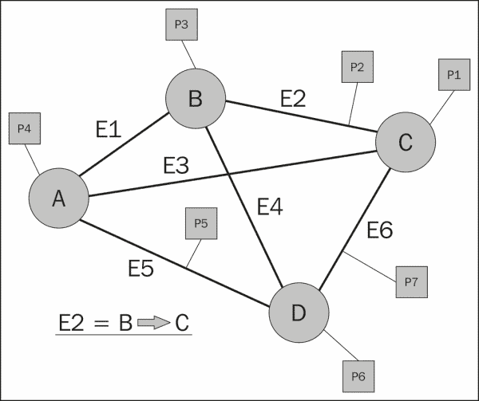

前面的图表显示了一个带有相关属性的图的通用示例。它还显示了边缘关系可以是有方向的，也就是说，**E2**边缘是从节点**B**到节点**C**的。然而，下面的例子使用了家庭成员及其之间的关系来创建一个图。请注意，两个节点或顶点之间可以有多条边。例如，**Mike**和**Sarah**之间的夫妻关系。此外，一个节点或边上可能有多个属性。

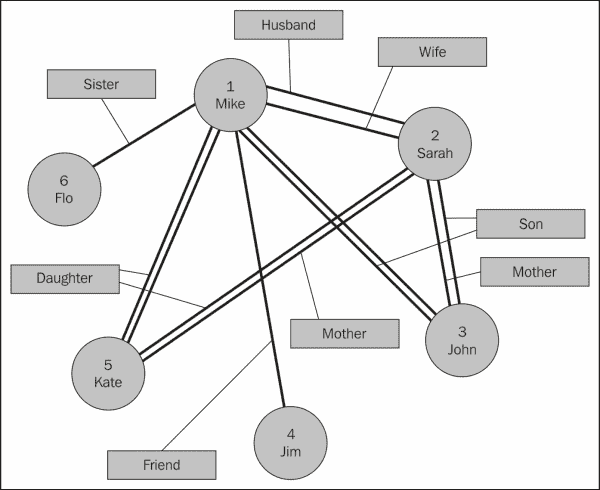

因此，在前面的例子中，**Sister**属性是从节点 6 **Flo**到节点 1 **Mike**的。这些都是简单的图，用来解释图的结构和元素性质。真实的图应用可能会达到极大的规模，并且需要分布式处理和存储来使它们能够被操作。Facebook 能够处理包含超过 1 万亿边的图，使用**Apache Giraph**（来源：Avery Ching-Facebook）。Giraph 是用于图处理的 Apache Hadoop 生态系统工具，它在历史上基于 Map Reduce 进行处理，但现在使用 TinkerPop，这将在第六章中介绍，*基于图的存储*。尽管本书集中讨论 Apache Spark，但边的数量提供了一个非常令人印象深刻的指标，显示了图可以达到的规模。

在下一节中，我将使用 Scala 来研究 Apache Spark GraphX 模块的使用。

# GraphX 编码

本节将使用上一节中展示的家庭关系图数据样本，使用 Scala 中的 Apache Spark GraphX 编程来进行分析。这些数据将存储在 HDFS 上，并将作为顶点和边的列表进行访问。尽管这个数据集很小，但是用这种方式构建的图可能非常大。我使用 HDFS 进行存储，因为如果你的图扩展到大数据规模，那么你将需要某种类型的分布式和冗余存储。正如本章所示的例子，这可能是 HDFS。使用 Apache Spark SQL 模块，存储也可以是 Apache Hive；详情请参见第四章，“Apache Spark SQL”。

## 环境

我使用了服务器`hc2nn`上的 hadoop Linux 账户来开发基于 Scala 的 GraphX 代码。SBT 编译的结构遵循与之前示例相同的模式，代码树存在于名为`graphx`的子目录中，其中有一个名为`graph.sbt`的 SBT 配置文件：

```scala
[hadoop@hc2nn graphx]$ pwd
/home/hadoop/spark/graphx

[hadoop@hc2nn graphx]$ ls
 src   graph.sbt          project     target

```

源代码如预期的那样位于此级别的子树下，名为`src/main/scala`，包含五个代码示例：

```scala
[hadoop@hc2nn scala]$ pwd
/home/hadoop/spark/graphx/src/main/scala

[hadoop@hc2nn scala]$ ls
graph1.scala  graph2.scala  graph3.scala  graph4.scala  graph5.scala

```

在每个基于图的示例中，Scala 文件使用相同的代码从 HDFS 加载数据，并创建图；但是，每个文件提供了基于 GraphX 的图处理的不同方面。由于本章使用了不同的 Spark 模块，`sbt`配置文件`graph.sbt`已经更改以支持这项工作：

```scala
[hadoop@hc2nn graphx]$ more graph.sbt

name := "Graph X"

version := "1.0"

scalaVersion := "2.10.4"

libraryDependencies += "org.apache.hadoop" % "hadoop-client" % "2.3.0"

libraryDependencies += "org.apache.spark" %% "spark-core"  % "1.0.0"

libraryDependencies += "org.apache.spark" %% "spark-graphx" % "1.0.0"

// If using CDH, also add Cloudera repo
resolvers += "Cloudera Repository" at https://repository.cloudera.com/artifactory/cloudera-repos/

```

`graph.sbt`文件的内容如前所示，通过 Linux 的`more`命令。这里只有两个变化需要注意——名称的值已更改以表示内容。更重要的是，Spark GraphX 1.0.0 库已添加为库依赖项。

两个数据文件已放置在 HDFS 的`/data/spark/graphx/`目录下。它们包含将用于本节的顶点和边的数据。如 Hadoop 文件系统的`ls`命令所示，文件名分别为`graph1_edges.cvs`和`graph1_vertex.csv`：

```scala
[hadoop@hc2nn scala]$ hdfs dfs -ls /data/spark/graphx
Found 2 items
-rw-r--r--   3 hadoop supergroup        129 2015-03-01 13:52 /data/spark/graphx/graph1_edges.csv
-rw-r--r--   3 hadoop supergroup         59 2015-03-01 13:52 /data/spark/graphx/graph1_vertex.csv

```

下面显示的“顶点”文件，通过 Hadoop 文件系统的`cat`命令，只包含六行，表示上一节中使用的图。每个顶点代表一个人，具有顶点 ID 号、姓名和年龄值：

```scala
[hadoop@hc2nn scala]$ hdfs dfs -cat /data/spark/graphx/graph1_vertex.csv
1,Mike,48
2,Sarah,45
3,John,25
4,Jim,53
5,Kate,22
6,Flo,52

```

边文件包含一组有向边值，形式为源顶点 ID、目标顶点 ID 和关系。因此，记录一形成了`Flo`和`Mike`之间的姐妹关系：

```scala
[hadoop@hc2nn scala]$  hdfs dfs -cat /data/spark/graphx/graph1_edges.csv
6,1,Sister
1,2,Husband
2,1,Wife
5,1,Daughter
5,2,Daughter
3,1,Son
3,2,Son
4,1,Friend
1,5,Father
1,3,Father
2,5,Mother
2,3,Mother

```

在解释了 sbt 环境和基于 HDFS 的数据之后，我们现在准备检查一些 GraphX 代码示例。与之前的示例一样，代码可以从`graphx`子目录编译和打包。这将创建一个名为`graph-x_2.10-1.0.jar`的 JAR 文件，从中可以运行示例应用程序：

```scala
[hadoop@hc2nn graphx]$ pwd
/home/hadoop/spark/graphx

[hadoop@hc2nn graphx]$  sbt package

Loading /usr/share/sbt/bin/sbt-launch-lib.bash
[info] Set current project to Graph X (in build file:/home/hadoop/spark/graphx/)
[info] Compiling 5 Scala sources to /home/hadoop/spark/graphx/target/scala-2.10/classes...
[info] Packaging /home/hadoop/spark/graphx/target/scala-2.10/graph-x_2.10-1.0.jar ...
[info] Done packaging.
[success] Total time: 30 s, completed Mar 3, 2015 5:27:10 PM

```

## 创建图

本节将解释通用的 Scala 代码，直到从基于 HDFS 的数据创建 GraphX 图为止。这将节省时间，因为相同的代码在每个示例中都被重用。一旦这一点得到解释，我将集中在每个代码示例中的实际基于图的操作上。

通用代码从导入 Spark 上下文、graphx 和 RDD 功能开始，以便在 Scala 代码中使用：

```scala
import org.apache.spark.SparkContext
import org.apache.spark.SparkContext._
import org.apache.spark.SparkConf

import org.apache.spark.graphx._
import org.apache.spark.rdd.RDD
```

然后，定义一个应用程序，它扩展了`App`类，并且每个示例的应用程序名称从`graph1`更改为`graph5`。在使用`spark-submit`运行应用程序时将使用此应用程序名称：

```scala
object graph1 extends App
{
```

数据文件是根据 HDFS 服务器和端口、它们在 HDFS 下的路径和它们的文件名来定义的。如前所述，有两个包含“顶点”和“边”信息的数据文件：

```scala
  val hdfsServer = "hdfs://hc2nn.semtech-solutions.co.nz:8020"
  val hdfsPath   = "/data/spark/graphx/"
  val vertexFile = hdfsServer + hdfsPath + "graph1_vertex.csv"
  val edgeFile   = hdfsServer + hdfsPath + "graph1_edges.csv"
```

定义了 Spark Master URL，以及应用程序名称，当应用程序运行时将出现在 Spark 用户界面中。创建了一个新的 Spark 配置对象，并将 URL 和名称分配给它：

```scala
  val sparkMaster = "spark://hc2nn.semtech-solutions.co.nz:7077"
  val appName = "Graph 1"
  val conf = new SparkConf()
  conf.setMaster(sparkMaster)
  conf.setAppName(appName)
```

使用刚刚定义的配置创建了一个新的 Spark 上下文：

```scala
  val sparkCxt = new SparkContext(conf)
```

基于 HDFS 文件的顶点信息然后使用`sparkCxt.textFile`方法加载到名为`vertices`的基于 RDD 的结构中。数据存储为长整型`VertexId`和字符串表示人的姓名和年龄。数据行按逗号拆分，因为这是基于 CSV 的数据：

```scala
  val vertices: RDD[(VertexId, (String, String))] =
      sparkCxt.textFile(vertexFile).map { line =>
        val fields = line.split(",")
        ( fields(0).toLong, ( fields(1), fields(2) ) )
  }
```

同样，基于 HDFS 的边缘数据加载到名为`edges`的基于 RDD 的数据结构中。基于 CSV 的数据再次按逗号值拆分。前两个数据值转换为长整型值，因为它们代表源和目标顶点 ID。表示边关系的最终值保留为字符串。请注意，RDD 结构 edges 中的每个记录现在实际上是一个`Edge`记录：

```scala
  val edges: RDD[Edge[String]] =
      sparkCxt.textFile(edgeFile).map { line =>
        val fields = line.split(",")
        Edge(fields(0).toLong, fields(1).toLong, fields(2))
  }
```

在连接或顶点缺失的情况下定义了一个默认值，然后从基于 RDD 的结构`vertices`、`edges`和`default`记录构建图：

```scala
  val default = ("Unknown", "Missing")
  val graph = Graph(vertices, edges, default)
```

这创建了一个名为`graph`的基于 GraphX 的结构，现在可以用于每个示例。请记住，尽管这些数据样本很小，但您可以使用这种方法创建非常大的图形。许多这些算法都是迭代应用，例如 PageRank 和 Triangle Count，因此程序将生成许多迭代的 Spark 作业。

## 示例 1 - 计数

图已加载，我们知道数据文件中的数据量，但是实际图中的顶点和边的数据内容如何？通过使用顶点和边计数函数，可以很容易地提取这些信息，如下所示：

```scala
  println( "vertices : " + graph.vertices.count )
  println( "edges    : " + graph.edges.count )
```

使用先前创建的示例名称和 JAR 文件运行`graph1`示例将提供计数信息。提供主 URL 以连接到 Spark 集群，并为执行器内存和总执行器核心提供一些默认参数：

```scala
spark-submit \
  --class graph1 \
  --master spark://hc2nn.semtech-solutions.co.nz:7077  \
  --executor-memory 700M \
  --total-executor-cores 100 \
 /home/hadoop/spark/graphx/target/scala-2.10/graph-x_2.10-1.0.jar
```

名为`graph1`的 Spark 集群作业提供了以下输出，这是预期的，也与数据文件匹配：

```scala
vertices : 6
edges    : 12

```

## 示例 2 - 过滤

如果我们需要从主图创建一个子图，并按照人的年龄或关系进行筛选，会发生什么？第二个示例 Scala 文件`graph2`中的示例代码显示了如何做到这一点：

```scala
  val c1 = graph.vertices.filter { case (id, (name, age)) => age.toLong > 40 }.count

  val c2 = graph.edges.filter { case Edge(from, to, property)
    => property == "Father" | property == "Mother" }.count

  println( "Vertices count : " + c1 )
  println( "Edges    count : " + c2 )
```

两个示例计数是从主图创建的。第一个筛选基于年龄的顶点，只取那些年龄大于 40 岁的人。请注意，存储为字符串的“年龄”值已转换为长整型进行比较。前面的第二个示例筛选了“母亲”或“父亲”的关系属性的边。创建了两个计数值：`c1`和`c2`，并按照 Spark 输出显示在这里打印出来：

```scala
Vertices count : 4
Edges    count : 4

```

## 示例 3 - PageRank

PageRank 算法为图中的每个顶点提供了一个排名值。它假设连接到最多边的顶点是最重要的。搜索引擎使用 PageRank 为网页搜索期间的页面显示提供排序：

```scala
  val tolerance = 0.0001
  val ranking = graph.pageRank(tolerance).vertices
  val rankByPerson = vertices.join(ranking).map {
    case (id, ( (person,age) , rank )) => (rank, id, person)
  }
```

前面的示例代码创建了一个`tolerance`值，并使用它调用了图的`pageRank`方法。然后将顶点排名为一个新值排名。为了使排名更有意义，排名值与原始顶点 RDD 连接。然后，`rankByPerson`值包含排名、顶点 ID 和人的姓名。

PageRank 结果存储在`rankByPerson`中，然后使用 case 语句逐条打印记录内容，并使用格式语句打印内容。我这样做是因为我想定义排名值的格式可能会有所不同：

```scala
  rankByPerson.collect().foreach {
    case (rank, id, person) =>
      println ( f"Rank $rank%1.2f id $id person $person")
  }
```

应用程序的输出如下所示。预期的是，`Mike`和`Sarah`具有最高的排名，因为他们有最多的关系：

```scala
Rank 0.15 id 4 person Jim
Rank 0.15 id 6 person Flo
Rank 1.62 id 2 person Sarah
Rank 1.82 id 1 person Mike
Rank 1.13 id 3 person John
Rank 1.13 id 5 person Kate

```

## 示例 4 - 三角形计数

三角形计数算法提供了与该顶点相关的三角形数量的基于顶点的计数。例如，顶点`Mike`（1）连接到`Kate`（5），后者连接到`Sarah`（2）；`Sarah`连接到`Mike`（1），因此形成了一个三角形。这对于路由查找可能很有用，需要为路由规划生成最小的无三角形的生成树图。

执行三角形计数并打印的代码很简单，如下所示。对图顶点执行`triangleCount`方法。结果保存在值`tCount`中，然后打印出来：

```scala
  val tCount = graph.triangleCount().vertices
  println( tCount.collect().mkString("\n") )
```

应用作业的结果显示，称为`Flo`（4）和`Jim`（6）的顶点没有三角形，而`Mike`（1）和`Sarah`（2）有最多的三角形，正如预期的那样，因为它们有最多的关系：

```scala
(4,0)
(6,0)
(2,4)
(1,4)
(3,2)
(5,2)

```

## 示例 5 - 连通组件

当从数据创建一个大图时，它可能包含未连接的子图，也就是说，彼此隔离并且之间没有桥接或连接边的子图。该算法提供了这种连接性的度量。根据您的处理方式，知道所有顶点是否连接可能很重要。

对于这个示例的 Scala 代码调用了两个图方法：`connectedComponents`和`stronglyConnectedComponents`。强方法需要一个最大迭代计数，已设置为`1000`。这些计数作用于图的顶点：

```scala
  val iterations = 1000
  val connected  = graph.connectedComponents().vertices
  val connectedS = graph.stronglyConnectedComponents(iterations).vertices
```

然后将顶点计数与原始顶点记录连接起来，以便将连接计数与顶点信息（例如人的姓名）关联起来。

```scala
  val connByPerson = vertices.join(connected).map {
    case (id, ( (person,age) , conn )) => (conn, id, person)
  }

  val connByPersonS = vertices.join(connectedS).map {
    case (id, ( (person,age) , conn )) => (conn, id, person)
  }
The results are then output using a case statement, and formatted printing:
  connByPerson.collect().foreach {
    case (conn, id, person) =>
      println ( f"Weak $conn  $id $person" )
  }
```

如`connectedComponents`算法所预期的那样，结果显示每个顶点只有一个组件。这意味着所有顶点都是单个图的成员，就像本章前面显示的图表一样：

```scala
Weak 1  4 Jim
Weak 1  6 Flo
Weak 1  2 Sarah
Weak 1  1 Mike
Weak 1  3 John
Weak 1  5 Kate

```

`stronglyConnectedComponents`方法提供了图中连接性的度量，考虑了它们之间关系的方向。`stronglyConnectedComponents`算法的结果如下：

```scala
  connByPersonS.collect().foreach {
    case (conn, id, person) =>
      println ( f"Strong $conn  $id $person" )
  }
```

您可能会注意到从图中，关系`Sister`和`Friend`是从顶点`Flo`（6）和`Jim`（4）到`Mike`（1）的边和顶点数据如下所示：

```scala
6,1,Sister
4,1,Friend

1,Mike,48
4,Jim,53
6,Flo,52

```

因此，强方法的输出显示，对于大多数顶点，第二列中的`1`表示只有一个图组件。然而，由于它们关系的方向，顶点`4`和`6`是不可达的，因此它们有一个顶点 ID 而不是组件 ID：

```scala
Strong 4  4 Jim
Strong 6  6 Flo
Strong 1  2 Sarah
Strong 1  1 Mike
Strong 1  3 John
Strong 1  5 Kate

```

# Neo4j 的 Mazerunner

在前面的部分中，您已经学会了如何在 Scala 中编写 Apache Spark graphx 代码来处理基于 HDFS 的图形数据。您已经能够执行基于图形的算法，例如 PageRank 和三角形计数。然而，这种方法有一个限制。Spark 没有存储功能，并且将基于图形的数据存储在 HDFS 上的平面文件中不允许您在其存储位置对其进行操作。例如，如果您的数据存储在关系数据库中，您可以使用 SQL 在原地对其进行查询。Neo4j 等数据库是图数据库。这意味着它们的存储机制和数据访问语言作用于图形。在本节中，我想看一下 Kenny Bastani 创建的 Mazerunner，它是一个 GraphX Neo4j 处理原型。

以下图描述了 Mazerunner 架构。它显示了 Neo4j 中的数据被导出到 HDFS，并通过通知过程由 GraphX 处理。然后将 GraphX 数据更新保存回 HDFS 作为键值更新列表。然后将这些更改传播到 Neo4j 进行存储。此原型架构中的算法可以通过基于 Rest 的 HTTP URL 访问，稍后将显示。这里的重点是，算法可以通过 graphx 中的处理运行，但数据更改可以通过 Neo4j 数据库 cypher 语言查询进行检查。Kenny 的工作和更多细节可以在以下网址找到：[`www.kennybastani.com/2014/11/using-apache-spark-and-neo4j-for-big.html`](http://www.kennybastani.com/2014/11/using-apache-spark-and-neo4j-for-big.html)。

本节将专门解释 Mazerunner 架构，并将通过示例展示如何使用。该架构提供了一个基于 GraphX 处理的独特示例，结合了基于图的存储。

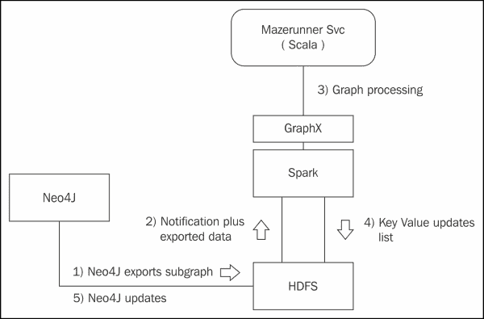

## 安装 Docker

安装 Mazerunner 示例代码的过程在[`github.com/kbastani/neo4j-mazerunner`](https://github.com/kbastani/neo4j-mazerunner)中有描述。

我使用了 64 位 Linux Centos 6.5 机器`hc1r1m1`进行安装。Mazerunner 示例使用 Docker 工具，在此示例中创建了运行 HDFS、Neo4j 和 Mazerunner 的虚拟容器，占用空间很小。首先，我必须安装 Docker。我已经使用 Linux root 用户通过`yum`命令完成了这一点。第一条命令安装了`docker-io`模块（docker 名称已经被另一个应用程序用于 CentOS 6.5）：

```scala
[root@hc1r1m1 bin]# yum -y install docker-io

```

我需要启用`public_ol6_latest`存储库，并安装`device-mapper-event-libs`包，因为我发现我当前安装的 lib-device-mapper 没有导出 Docker 需要的 Base 符号。我以`root`身份执行了以下命令：

```scala
[root@hc1r1m1 ~]# yum-config-manager --enable public_ol6_latest
[root@hc1r1m1 ~]# yum install device-mapper-event-libs

```

我遇到的实际错误如下：

```scala
/usr/bin/docker: relocation error: /usr/bin/docker: symbol dm_task_get_info_with_deferred_remove, version Base not defined in file libdevmapper.so.1.02 with link time reference

```

然后我可以通过以下调用检查 Docker 的版本号，以确保 Docker 可以运行：

```scala
[root@hc1r1m1 ~]# docker version
Client version: 1.4.1
Client API version: 1.16
Go version (client): go1.3.3
Git commit (client): 5bc2ff8/1.4.1
OS/Arch (client): linux/amd64
Server version: 1.4.1
Server API version: 1.16
Go version (server): go1.3.3
Git commit (server): 5bc2ff8/1.4.1

```

我可以使用以下服务命令启动 Linux docker 服务。我还可以使用以下`chkconfig`命令强制 Docker 在 Linux 服务器启动时启动：

```scala
[root@hc1r1m1 bin]# service docker start
[root@hc1r1m1 bin]# chkconfig docker on

```

然后可以下载三个 Docker 镜像（HDFS，Mazerunner 和 Neo4j）。它们很大，所以可能需要一些时间：

```scala
[root@hc1r1m1 ~]# docker pull sequenceiq/hadoop-docker:2.4.1
Status: Downloaded newer image for sequenceiq/hadoop-docker:2.4.1

[root@hc1r1m1 ~]# docker pull kbastani/docker-neo4j:latest
Status: Downloaded newer image for kbastani/docker-neo4j:latest

[root@hc1r1m1 ~]# docker pull kbastani/neo4j-graph-analytics:latest
Status: Downloaded newer image for kbastani/neo4j-graph-analytics:latest

```

下载完成后，Docker 容器可以按顺序启动；HDFS，Mazerunner，然后 Neo4j。将加载默认的 Neo4j 电影数据库，并使用这些数据运行 Mazerunner 算法。HDFS 容器的启动如下：

```scala
[root@hc1r1m1 ~]# docker run -i -t --name hdfs sequenceiq/hadoop-docker:2.4.1 /etc/bootstrap.sh –bash

Starting sshd:                                [  OK  ]
Starting namenodes on [26d939395e84]
26d939395e84: starting namenode, logging to /usr/local/hadoop/logs/hadoop-root-namenode-26d939395e84.out
localhost: starting datanode, logging to /usr/local/hadoop/logs/hadoop-root-datanode-26d939395e84.out
Starting secondary namenodes [0.0.0.0]
0.0.0.0: starting secondarynamenode, logging to /usr/local/hadoop/logs/hadoop-root-secondarynamenode-26d939395e84.out
starting yarn daemons
starting resourcemanager, logging to /usr/local/hadoop/logs/yarn--resourcemanager-26d939395e84.out
localhost: starting nodemanager, logging to /usr/local/hadoop/logs/yarn-root-nodemanager-26d939395e84.out

```

Mazerunner 服务容器的启动如下：

```scala
[root@hc1r1m1 ~]# docker run -i -t --name mazerunner --link hdfs:hdfs kbastani/neo4j-graph-analytics

```

输出很长，所以我不会在这里全部包含，但你不会看到任何错误。还有一行，说明安装正在等待消息：

```scala
[*] Waiting for messages. To exit press CTRL+C

```

为了启动 Neo4j 容器，我需要安装程序为我创建一个新的 Neo4j 数据库，因为这是第一次安装。否则在重新启动时，我只需提供数据库目录的路径。使用`link`命令，Neo4j 容器链接到 HDFS 和 Mazerunner 容器：

```scala
[root@hc1r1m1 ~]# docker run -d -P -v /home/hadoop/neo4j/data:/opt/data --name graphdb --link mazerunner:mazerunner --link hdfs:hdfs kbastani/docker-neo4j

```

通过检查`neo4j/data`路径，我现在可以看到已经创建了一个名为`graph.db`的数据库目录：

```scala
[root@hc1r1m1 data]# pwd
/home/hadoop/neo4j/data

[root@hc1r1m1 data]# ls
graph.db

```

然后我可以使用以下`docker inspect`命令，该命令提供了基于容器的 IP 地址和 Docker 基础的 Neo4j 容器。`inspect`命令提供了我需要访问 Neo4j 容器的本地 IP 地址。`curl`命令连同端口号（我从 Kenny 的网站上知道）默认为`7474`，显示 Rest 接口正在运行：

```scala
[root@hc1r1m1 data]# docker inspect --format="{{.NetworkSettings.IPAddress}}" graphdb
172.17.0.5

[root@hc1r1m1 data]# curl  172.17.0.5:7474
{
 "management" : "http://172.17.0.5:7474/db/manage/",
 "data" : "http://172.17.0.5:7474/db/data/"
}

```

## Neo4j 浏览器

本节中的其余工作现在将使用 Neo4j 浏览器 URL 进行，如下所示：

`http://172.17.0.5:7474/browser`。

这是一个基于本地 Docker 的 IP 地址，将可以从`hc1r1m1`服务器访问。如果没有进一步的网络配置，它将不会在本地局域网的其他地方可见。

这将显示默认的 Neo4j 浏览器页面。可以通过点击这里的电影链接，选择 Cypher 查询并执行来安装电影图。


然后可以使用 Cypher 查询来查询数据，这将在下一章中更深入地探讨。以下图表与它们相关的 Cypher 查询一起提供，以显示数据可以作为可视化显示的图形进行访问。第一个图表显示了一个简单的人到电影关系，关系细节显示在连接的边上。

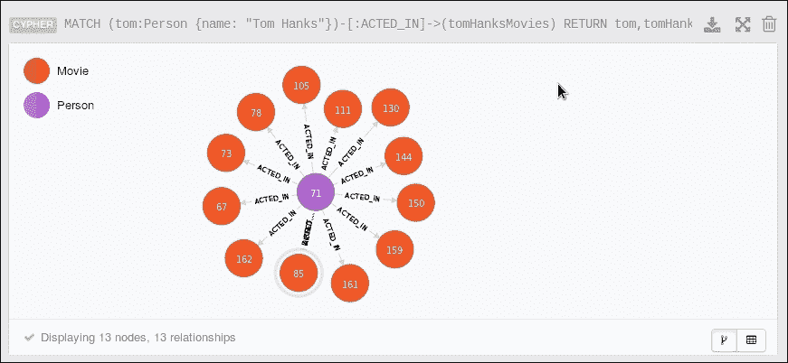

第二个图表作为 Neo4j 强大性能的视觉示例，展示了一个更复杂的 Cypher 查询和生成的图表。该图表表示包含 135 个节点和 180 个关系。在处理方面，这些数字相对较小，但很明显图表变得复杂。

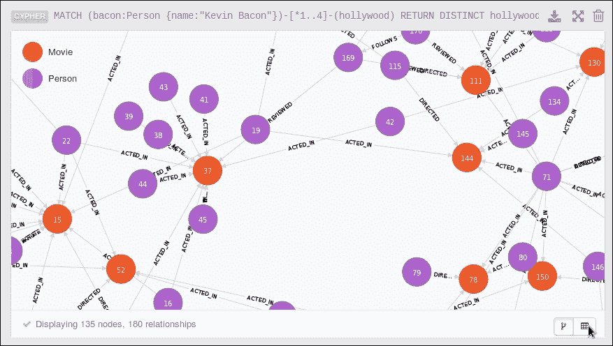

以下图表展示了通过 HTTP Rest URL 调用 Mazerunner 示例算法。调用由要调用的算法和它将在图中操作的属性定义：

`http://localhost:7474/service/mazerunner/analysis/{algorithm}/{attribute}`。

例如，如下一节将展示的，可以使用通用 URL 来运行 PageRank 算法，设置`algorithm=pagerank`。该算法将通过设置`attribute=FOLLOWS`来操作`follows`关系。下一节将展示如何运行每个 Mazerunner 算法以及 Cypher 输出的示例。

## Mazerunner 算法

本节展示了如何使用上一节中显示的基于 Rest 的 HTTP URL 运行 Mazerunner 示例算法。这一章中已经检查并编码了许多这些算法。请记住，本节中发生的有趣事情是数据从 Neo4j 开始，经过 Spark 和 GraphX 处理，然后更新回 Neo4j。看起来很简单，但是有底层的过程在进行所有的工作。在每个示例中，通过 Cypher 查询来询问算法已经添加到图中的属性。因此，每个示例不是关于查询，而是数据更新到 Neo4j 已经发生。

### PageRank 算法

第一个调用显示了 PageRank 算法和 PageRank 属性被添加到电影图中。与以前一样，PageRank 算法根据顶点的边连接数量给出一个排名。在这种情况下，它使用`FOLLOWS`关系进行处理。

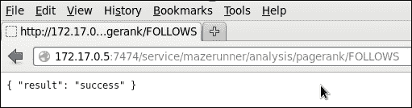

以下图像显示了 PageRank 算法结果的截图。图像顶部的文本（以`MATCH`开头）显示了 Cypher 查询，证明了 PageRank 属性已被添加到图中。

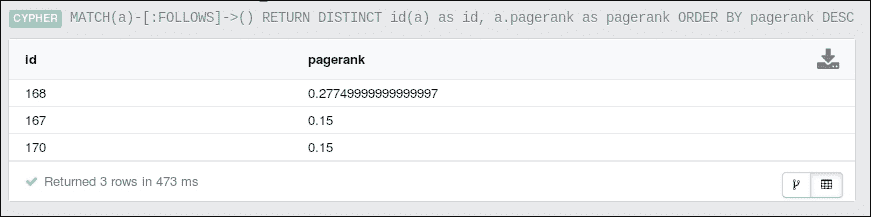

### 接近度中心性算法

接近度算法试图确定图中最重要的顶点。在这种情况下，`closeness`属性已被添加到图中。

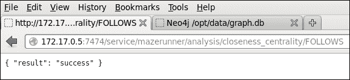

以下图像显示了接近度算法结果的截图。图像顶部的文本（以`MATCH`开头）显示了 Cypher 查询，证明了`closeness_centrality`属性已被添加到图中。请注意，此 Cypher 查询中使用了一个名为`closeness`的别名，表示`closeness_centrality`属性，因此输出更具可读性。

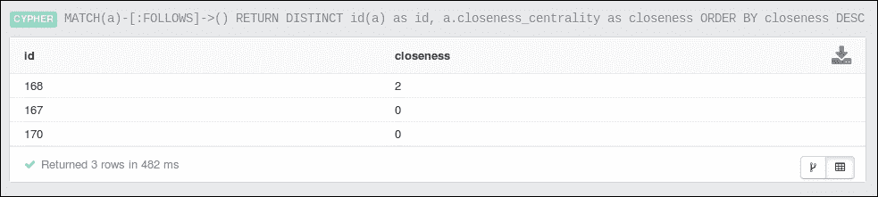

### 三角形计数算法

`triangle_count`算法已被用于计算与顶点相关的三角形数量。使用了`FOLLOWS`关系，并且`triangle_count`属性已被添加到图中。

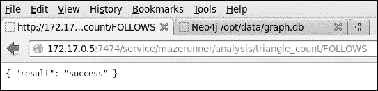

以下图片显示了三角形算法结果的屏幕截图。图像顶部的文本（以`MATCH`开头）显示了 Cypher 查询，证明了`triangle_count`属性已被添加到图中。请注意，在此 Cypher 查询中使用了一个名为**tcount**的别名，表示`triangle_count`属性，因此输出更加可呈现。

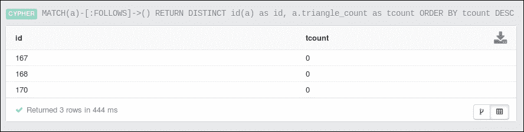

### 连接组件算法

连接组件算法是衡量图形数据中存在多少实际组件的一种方法。例如，数据可能包含两个子图，它们之间没有路径。在这种情况下，`connected_components`属性已被添加到图中。

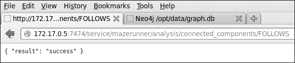

以下图片显示了连接组件算法结果的屏幕截图。图像顶部的文本（以`MATCH`开头）显示了 Cypher 查询，证明了`connected_components`属性已被添加到图中。请注意，在此 Cypher 查询中使用了一个名为**ccomp**的别名，表示`connected_components`属性，因此输出更加可呈现。

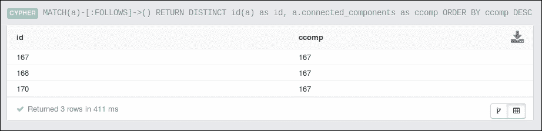

### 强连接组件算法

强连接组件算法与连接组件算法非常相似。使用方向性的`FOLLOWS`关系从图形数据创建子图。创建多个子图，直到使用所有图形组件。这些子图形成了强连接组件。如此所见，`strongly_connected_components`属性已被添加到图中：

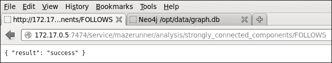

以下图片显示了强连接组件算法结果的屏幕截图。图像顶部的文本（以`MATCH`开头）显示了 Cypher 查询，证明了`strongly_connected_components`连接组件属性已被添加到图中。请注意，在此 Cypher 查询中使用了一个名为**sccomp**的别名，表示`strongly_connected_components`属性，因此输出更加可呈现。

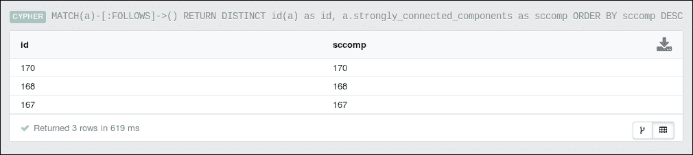

# 总结

本章已经通过示例展示了如何使用基于 Scala 的代码调用 Apache Spark 中的 GraphX 算法。之所以使用 Scala，是因为开发示例所需的代码更少，节省时间。可以使用基于 Scala 的 shell，并且可以将代码编译成 Spark 应用程序。本章提供了使用 SBT 工具进行应用程序编译和配置的示例。本章的配置和代码示例也将随书提供下载。

最后，介绍了 Mazerunner 示例架构（由 Kenny Bastani 在 Neo 期间开发）用于 Neo4j 和 Apache Spark。为什么 Mazerunner 很重要？它提供了一个示例，说明了图形数据库可以用于图形存储，而 Apache Spark 用于图形处理。我并不是建议目前在生产场景中使用 Mazerunner。显然，还需要做更多工作，使这种架构准备好发布。然而，与分布式环境中的基于图形处理相关联的基于图形存储，提供了使用 Neo4j 的 Cypher 等查询语言来查询数据的选项。

希望你觉得这一章很有用。下一章将更深入地探讨基于图的存储。你现在可以深入了解更多 GraphX 编码，尝试运行提供的示例，并尝试修改代码，以便熟悉开发过程。
